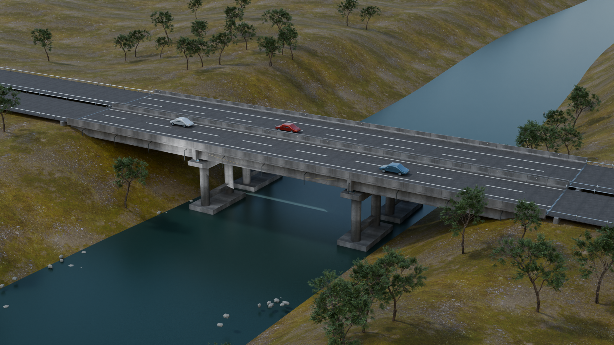
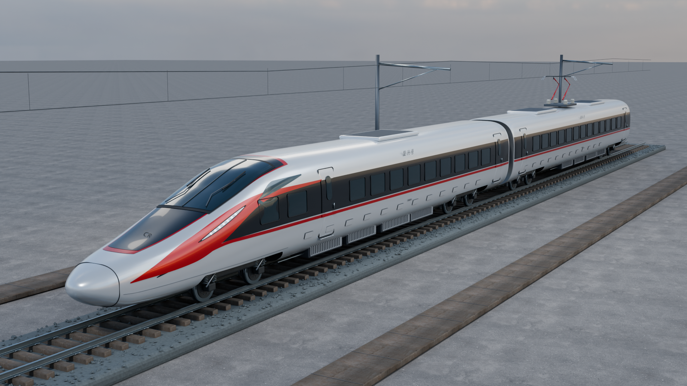
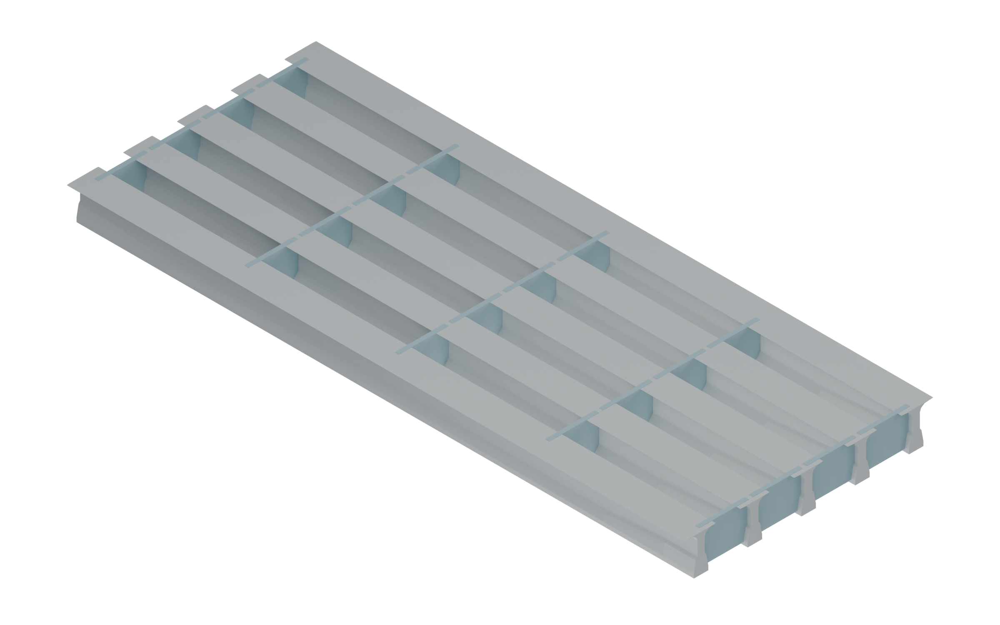
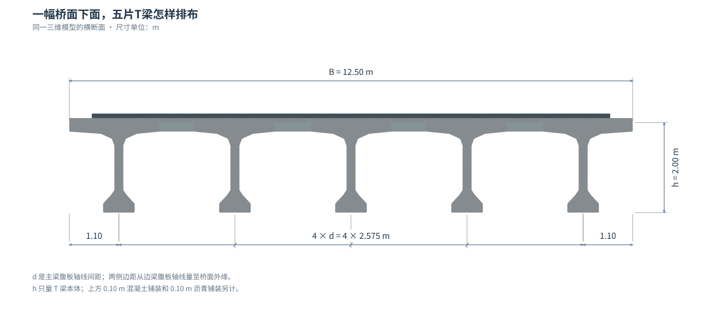
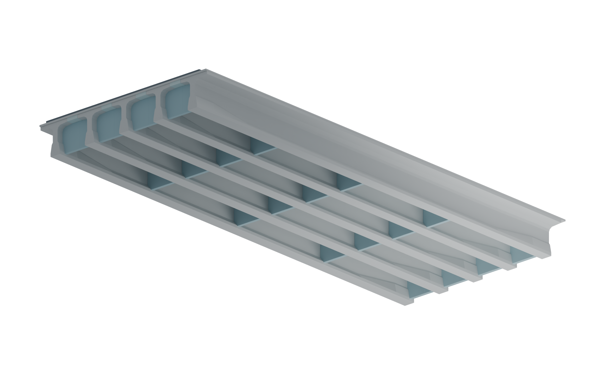
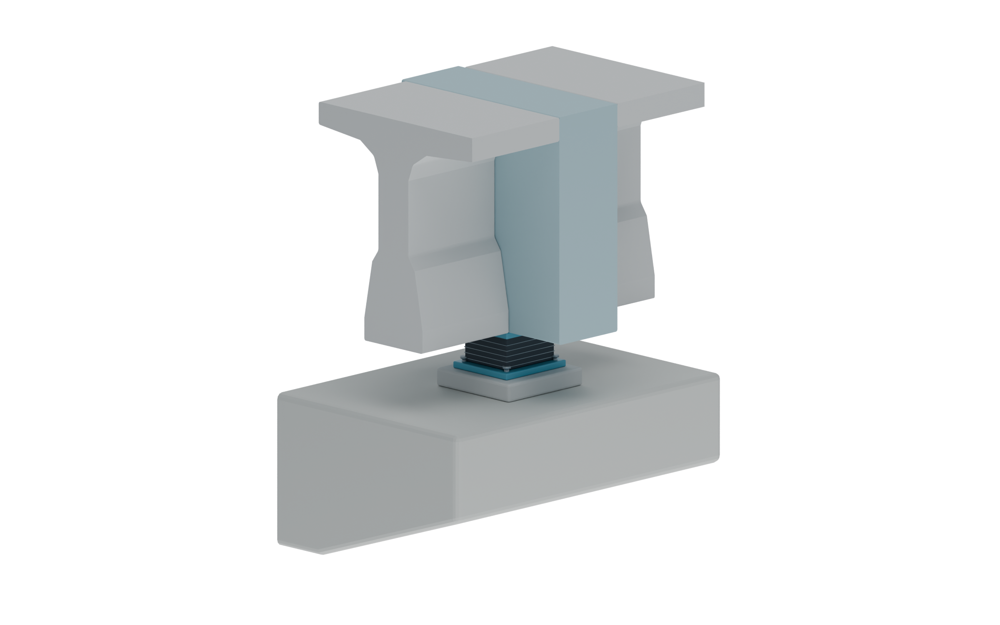
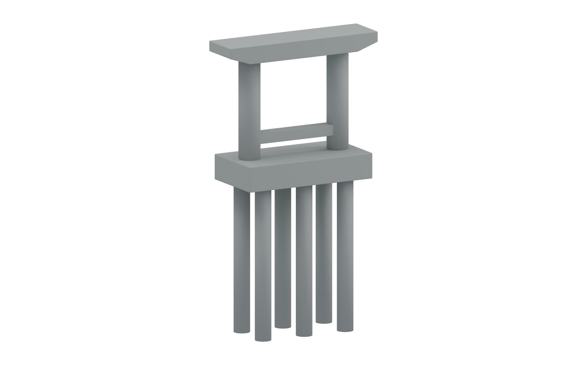
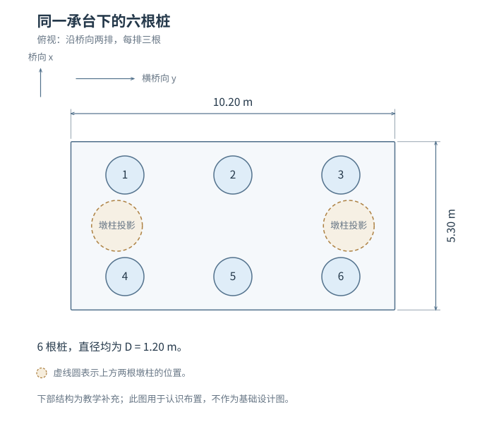

# 从模型里取图：把一座桥看清楚 {.unnumbered}

这批 Blender 模型适合成为教材中反复取景的构造底稿。整桥、梁底、横断面、支座和基础来自同一份几何，换个角度仍能找到同一个构件。比起每张重新生成，尺寸、数量和连接关系更容易保持一致。

本页把作者选好的画法、模型补图和可操作的三维案例放在一起，供试排比较。

## 您选定的 8 张图

已接收 2026-09-07 导出的选样：**三维教具 3 张、写实场景 3 张、线稿淡彩 2 张**。选样页默认显示这 8 张，其余 16 张可切回查看。5 张已插进正文试排；另外 3 张保留画法，构造修正后再采用。

| 用在什么地方 | 当前选择 | 处理 |
|---|---|---|
| 整座桥、木条、施工过程 | G01-B、G02-B、G04-B · 三维教具 | 已试排，突出空间关系 |
| 梁底、基础、涂层与锈蚀 | G03-A、G07-A、G08-A · 写实场景 | 腐蚀图已试排；梁底和基础补可核对的模型取景 |
| 斜拉桥、悬索桥整体 | G05-C、G06-C · 线稿淡彩 | 悬索桥图已试排；斜拉桥仍须修正索的连接 |

[查看 8 张选样](interactive/imagegen-review.html) · [原始选样 JSON](assets/publication/imagegen-samples/selection/author-selection-20260907.json) · [逐图增删清单](assets/publication/imagegen-samples/selection/image-decisions.csv) · [画风约定](assets/publication/imagegen-samples/selection/style-guide.md)

## 原来的渲染，适合放在哪里？

{width=100%}

这一张适合作为章首或三维入口。进入构造讲解后，减少树木、水面和另一幅桥的遮挡，再靠近需要看的部分。原包共 **9 张桥图、5 张列车图**；审阅后，5 张桥图和2张列车图可先试排，另外7张需要补取景或调整显隐。

| 图的任务 | 优先采用什么 | 为什么 |
|---|---|---|
| 认识整桥与环境 | 原总览或干净的全桥新图 | 先知道局部在整座桥的哪里 |
| 看清梁片、横隔板、支座 | 同一模型的局部渲染和旋转视图 | 可以数构件、追踪连接、核对尺寸 |
| 解释力、变形、约束 | 原有参数图与计算交互 | 构造外形不能单独说明受力数值和运动限制 |
| 铁路车辆与车桥关系 | 独立保留复兴号案例 | 它是带轨道的两节列车，不能放入这座公路桥代替小汽车 |

列车模型可以怎样用？

{width=100%}

它适合引出“长车体怎样通过轮对作用到轨道”“连续经过的车轴怎样影响桥”的问题。两节模型全长53.56 m，车体宽3.36 m，轨面至车顶4.05 m；受电弓外廓另计。模型不是完整运营编组，部分轮对和悬挂尺寸是建模假定，不能直接充当列车设计荷载图。

公路桥原 Blender 场景里另有3辆约4.6 m的小汽车；本次结构GLB和六张补图暂不包含车辆。后续使用这些小车时，要先修正轮胎与路面的约20 mm间隙及反向车道中的车头朝向，再做轮位和加载位置的对应。

## 自己换个角度看 {#model}

先点“打开三维模型”，再选“从梁底看”或“墩与基础”。可以旋转、点选构件、隐藏遮挡部分，并保存当前视角的 PNG。

::: {.content-visible when-format="html"}
<iframe src="interactive/bridge-assembly/viewer.html" title="同一座三跨T梁桥的三维构造观察" loading="lazy" style="width:100%;height:780px;border:1px solid #d9e1e3;border-radius:12px" allow="fullscreen"></iframe>

[单独打开三维观察页](interactive/bridge-assembly/viewer.html)
:::

::: {.content-hidden when-format="html"}
{width=100%}
:::

本案例名义跨径为 **3×30 m**，每幅宽 **12.50 m**，每跨每幅 **5 片主梁**，梁腹板轴线间距 **2.575 m**，预制梁高 **2.00 m**。这组尺寸与原有 20 m 教学算例不同。

## 六个补取景：每张只看一个关系 {#new-views}

### 1. 地面下面还有哪些构件？

{#fig-blender-whole width=100%}

从路面向下找到主梁、墩台、承台和桩。总览用于定位；需要数清一组桩时，转到第6张局部图。

### 2. 五片梁之间，横向连接藏在哪里？

{#fig-blender-span width=100%}

沿桥长延伸的是主梁，跨过梁间空隙的是横隔板及连接段。这里的剖切只是观察方法；完整桥面并不保留这些开口。

### 3. 一幅桥面，怎样由五片梁拼起来？

{#fig-blender-section width=100%}

每幅宽12.50 m；四个梁距共10.30 m，两侧梁轴线至桥面边缘各1.10 m，合起来仍为12.50 m。梁底的加宽部分来自本案例所参照的预应力 T 梁截面，不能仅因外形比简化“T”复杂就删掉。

### 4. 从桥底看，横隔板接到哪里？

{#fig-blender-underside width=100%}

本跨有3道内部横隔板和2道近梁端横隔板。它们接近跨中与四分点，但精确站位取自本案图纸，并非统一写成7.5、15、22.5 m。

### 5. 梁和桥墩之间，隔着什么？

{#fig-blender-bearing width=100%}

先找到支座在哪里，再讨论分析时允许哪些运动。看到钢板或橡胶的外形，还不能判断纵向、横向到底怎样约束。[继续看支座的运动方向](chapters/ch07.html#fig-priority-F31)。

### 6. 一个桥墩下面，为什么还有一组桩？

{#fig-blender-foundation width=100%}

承台把墩柱和六根桩连在一起。这里的基础是教学补充：承台5.30×10.20×1.90 m，桩径1.20 m，模型桩段长11.35 m。它与原G07的八桩、20 m 桩长案例不同；桩侧和桩端怎样分担作用，仍需另看土层条件与分析。

从上方数一数六根桩

{width=100%}

## 梁里的钢筋，单独看 {#rebar}

钢筋观察已接入[梁桥章的T梁部分](chapters/ch03.html#t-girder-rebar)。先看一段，再切换横断面，名称与对应构件一起显示。

{width=100%}

{width=100%}

[打开有中文名称的钢筋观察页](interactive/bridge-assembly/rebar.html) · [从整桥进入梁桥章](chapters/ch03.html#bridge-assembly-case)

原模型的箍筋顶端低于上排纵筋，部分腹板纵筋还与箍肢相交。教材副本把腹板与翼缘的联系分开表达，调整相应纵筋，并将原本局部穿出薄腹板的孔道移至梁内。展示的是代表性教学骨架和孔道，孔道内没有画实际钢绞线；各组钢筋也不直接按上下位置命名为“受拉”或“受压”。

## 这轮做了哪些几何修正？

独立检查发现，原端台台身在纵向仅覆盖垫石底面约22.2%；标高相同也可能出现支承范围不足。教材副本补足了四处端台的台面范围，并把横隔板与对应闭合块按原图的理论跨径基准重新定位。原始模型、原始渲染和原始记录均保留。

三跨横隔板站位分别为：

| 跨 | 距全桥起点的桥向位置 / m |
|---|---|
| 第一跨 | 0.600、7.780、14.980、22.180、29.360 |
| 第二跨 | 30.640、37.820、45.000、52.180、59.360 |
| 第三跨 | 60.640、67.820、75.020、82.220、89.400 |

派生GLB已通过主体尺寸、横隔板站位和20个端垫石落座范围检查，并补查钢筋的包围关系、实体保护层及孔道是否穿出梁体，详见[本次检查记录](assets/publication/blender-bridge/records/independent-check.json)和[钢筋检查明细](assets/publication/blender-bridge/records/rebar-independent-audit.json)。其中372项针对主体、981项针对钢筋、4项针对构件编号；这些是按对象展开的几何断言。墩台、基础、支座细部和代表性配筋仍包含教学假定，不能据此称为完整施工图或已经验算的工程设计。

## 来源、尺寸与可编辑文件

上部主要尺寸依据[重庆公开图册《装配式预应力混凝土连续T梁桥（30m）》TL-30-Ⅰ-B，2021.07](https://jtysw.cq.gov.cn/zwgk_240/zfxxgkml/gggs/tzgg/202203/W020220329617775231018.pdf)，PDF第15—18页、图号03—06。该文件是征求意见版；汇总表的12.25 m与详图12.50 m不一致，本案例采用详图的尺寸闭合。三跨组合及下部结构等为建模时补充，材质与环境资源按原包说明保留来源。

网页可以用 GLB 旋转和拆看，纸质版用静态渲染。网页导出的 PNG 适合选构图；印刷插图优先使用直接渲染的高分辨率母版，尺寸、名称和力的箭头另存矢量层。

[六幅构造图制作记录](assets/publication/blender-bridge/manifest.json) · [两幅钢筋图制作记录](assets/publication/blender-bridge/rebar-manifest.json) · [钢筋模型说明](assets/publication/blender-bridge/rebar-README.md) · [下载教材用 GLB](assets/publication/blender-bridge/models/highway_t_girder.glb)

[Blender 制作脚本](scripts/blender-bridge/build_teaching_delivery.py) · [钢筋几何脚本](scripts/blender-bridge/repair_rebar.py) · [钢筋渲染脚本](scripts/blender-bridge/render_rebar.py) · [名称引线脚本](scripts/blender-bridge/label_rebar.py)
