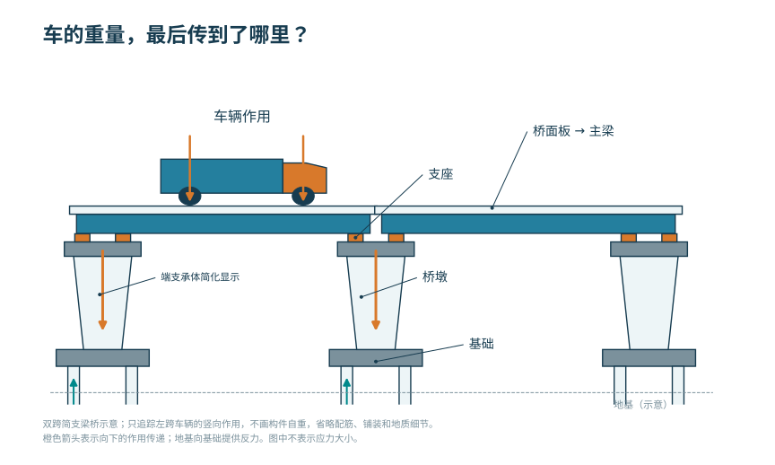
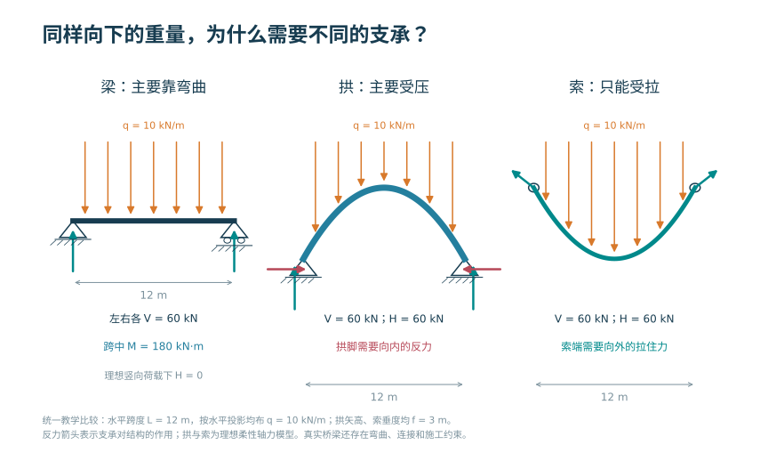
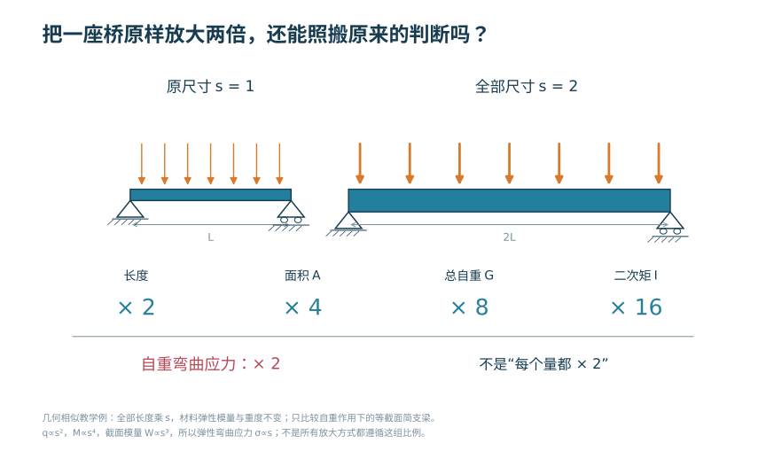
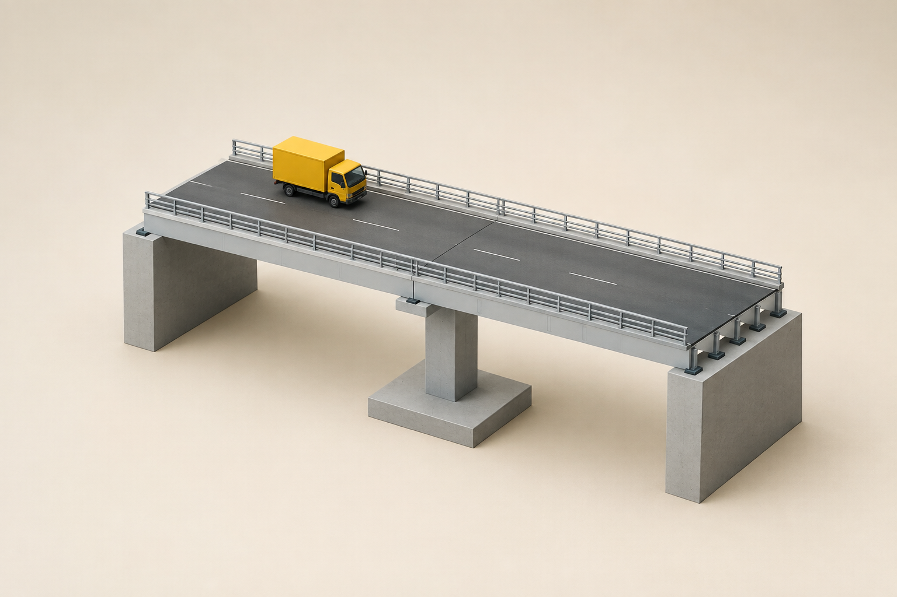
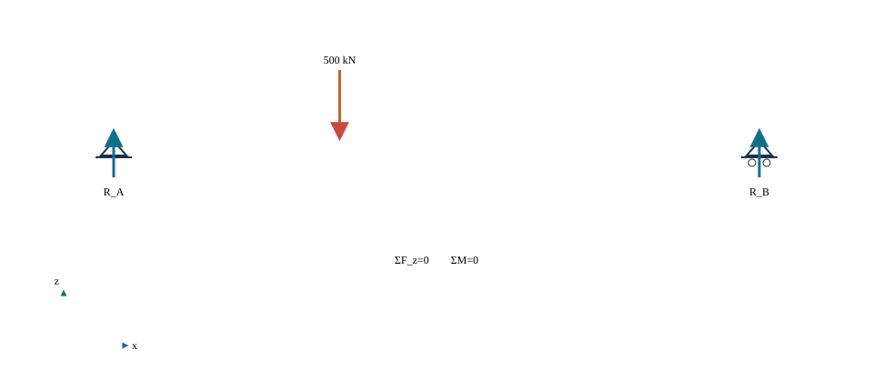
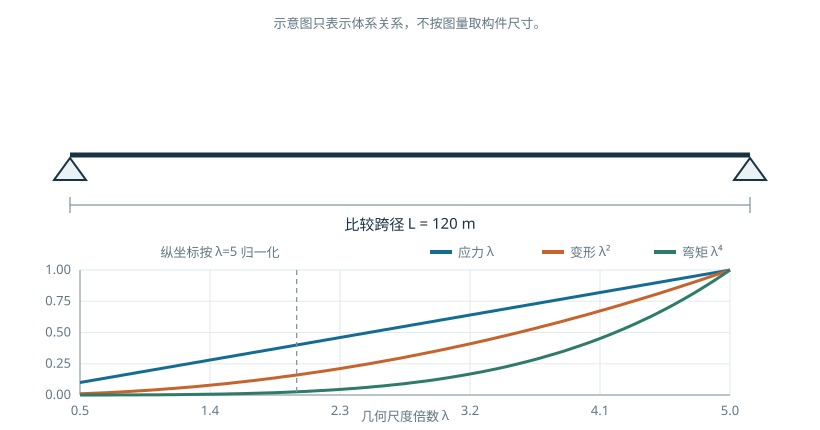

# 桥梁工程与智能设计概论

<!-- CORE-ROUTE START -->

<!-- VISUAL-ENTRY START -->

先从一个看得见的问题开始
<h3>把桥按原样放大两倍，它会下沉多少？</h3>
把全尺寸放大比例从 1 调到 2，先比较自重造成的竖向位移。
<a href="../interactive/learning-map.html?chapter=ch01">看图进入实验 →</a>

<!-- VISUAL-ENTRY END -->
<!-- PRIORITY-CHAPTER-GALLERY START -->

从本章的 3 幅新图开始

<a href="#fig-priority-F01">车的重量，最后传到了哪里？</a><a href="#fig-priority-F02">同样向下的重量，为什么需要不同的支承？</a><a href="#fig-priority-F03">把一座桥原样放大两倍，还能照搬原来的判断吗？</a>

<!-- PRIORITY-CHAPTER-GALLERY END -->

<h2>本章的核心思考</h2>
先判断体系与尺度，再进入桥例。
<ol><li>把桥梁简化为荷载、传力构件、连接与支承。</li><li>用合力、合矩检查简化是否保真。</li><li>声明尺度改变时保持什么，再判断控制指标。</li></ol>
<h3>跨课程类比</h3>
材料力学的平衡与量纲 → 桥型选择与规模判断

<strong>反例与边界：</strong>同一外形比例并不能保证应力、变形、频率或风洞相似。

建议课堂集中完成标为“课堂核心”的3个单元，其余单元用于课前观察和课后迁移。每个单元配独立短视频、操作实验、目标检验与开放论证题。

<article>
C01U01 · 课堂核心
<h3>移动荷载，先守住平衡</h3>
荷载移动时左右反力改变，合力与合矩仍须守恒。

<a href="../interactive/core-learning.html?unit=C01U01" target="_blank">操作与迁移任务</a> · <a href="../interactive/core-learning.html?unit=C01U01&amp;view=video" target="_blank">观看短视频</a>
</article><article>
C01U02 · 课前/课后迁移
<h3>从梁式弯曲到拱的轴向传力</h3>
抬高拱轴可以减少给定均布荷载下所需水平推力，但拱脚仍要传递水平力。

<a href="../interactive/core-learning.html?unit=C01U02" target="_blank">操作与迁移任务</a> · <a href="../interactive/core-learning.html?unit=C01U02&amp;view=video" target="_blank">观看短视频</a>
</article><article>
C01U03 · 课前/课后迁移
<h3>模型为何必须声明边界</h3>
相同温升下，从自由伸长到完全约束，变形逐渐转换为内力。

<a href="../interactive/core-learning.html?unit=C01U03" target="_blank">操作与迁移任务</a> · <a href="../interactive/core-learning.html?unit=C01U03&amp;view=video" target="_blank">观看短视频</a>
</article><article>
C01U04 · 课堂核心
<h3>长度、面积、体积不是同一种增长</h3>
全尺寸放大时，长度、面积与体积分别按一次、二次和三次方变化。

<a href="../interactive/core-learning.html?unit=C01U04" target="_blank">操作与迁移任务</a> · <a href="../interactive/core-learning.html?unit=C01U04&amp;view=video" target="_blank">观看短视频</a>
</article><article>
C01U05 · 课前/课后迁移
<h3>截面惯性矩不等于整体刚度</h3>
惯性矩按四次方增长，但几何相似梁的横向位移刚度只按一次方增长。

<a href="../interactive/core-learning.html?unit=C01U05" target="_blank">操作与迁移任务</a> · <a href="../interactive/core-learning.html?unit=C01U05&amp;view=video" target="_blank">观看短视频</a>
</article><article>
C01U06 · 课堂核心
<h3>自重为何惩罚大跨度</h3>
相似放大时，自重应力随尺度一次增长，相对挠度也随一次增长。

<a href="../interactive/core-learning.html?unit=C01U06" target="_blank">操作与迁移任务</a> · <a href="../interactive/core-learning.html?unit=C01U06&amp;view=video" target="_blank">观看短视频</a>
</article><article>
C01U07 · 课前/课后迁移
<h3>同样放大，换荷载便换结论</h3>
保持集中力不变时，相似放大的应力反而按尺度平方的倒数下降。

<a href="../interactive/core-learning.html?unit=C01U07" target="_blank">操作与迁移任务</a> · <a href="../interactive/core-learning.html?unit=C01U07&amp;view=video" target="_blank">观看短视频</a>
</article><article>
C01U08 · 课前/课后迁移
<h3>同一荷载，刚度决定分工</h3>
并联弹簧位移相同，较硬的支承分到较多荷载。

<a href="../interactive/core-learning.html?unit=C01U08" target="_blank">操作与迁移任务</a> · <a href="../interactive/core-learning.html?unit=C01U08&amp;view=video" target="_blank">观看短视频</a>
</article><article>
C01U09 · 课前/课后迁移
<h3>方案比较先看敏感性</h3>
梁高增加同时改变惯性矩、应力与挠度，不能只比较一个尺寸。

<a href="../interactive/core-learning.html?unit=C01U09" target="_blank">操作与迁移任务</a> · <a href="../interactive/core-learning.html?unit=C01U09&amp;view=video" target="_blank">观看短视频</a>
</article><article>
C01U10 · 课前/课后迁移
<h3>把复杂模型交给一个极限情形</h3>
网格加密使数值误差减小，但不能证明原来的边界条件正确。

<a href="../interactive/core-learning.html?unit=C01U10" target="_blank">操作与迁移任务</a> · <a href="../interactive/core-learning.html?unit=C01U10&amp;view=video" target="_blank">观看短视频</a>
</article>

<a href="../core-thinking.html">返回全书核心思维与尺度规律</a> · <a href="../core-resources.html">查看110个教学单元总索引</a> · <a href="../interactive/thinking-analogies.html">打开跨课程并排类比</a>

<!-- CORE-ROUTE END -->

::: {.chapter-objectives}
**学习目标**

完成本章学习后，应能够：

1. 识别桥梁的上部结构、支承系统、下部结构、基础及主要附属设施；
2. 从承重构件、内力性质、水平反力和刚度来源四个方面比较梁桥、拱桥、斜拉桥和悬索桥；
3. 说明桥梁平面、立面和横断面总体布置分别需要解决的主要问题；
4. 区分桥梁工程课程与结构设计原理、结构力学及有限元课程的知识边界；
5. 将桥梁设计任务整理为对象、参数、约束、工况、结果和证据；
6. 说明参数化建模、交互可视化和人工智能辅助在桥梁设计中的适用环节与复核要求。
:::

<figure class="chapter-video-card"><video controls preload="metadata" playsinline poster="../assets/videos/manim/posters/M01_force_path.png" src="../assets/videos/manim/M01_force_path.mp4"></video><figcaption>M01　结构体系与力流</figcaption></figure><figure class="chapter-video-card"><video controls preload="metadata" playsinline poster="../assets/videos/manim/posters/M02_scale_effect.png" src="../assets/videos/manim/M02_scale_effect.mp4"></video><figcaption>M02　跨径与尺度效应</figcaption></figure>

## 桥梁功能、组成与工程对象

#### 桥梁的工程功能

桥梁是道路、铁路、市政管线或其他通道跨越河流、峡谷、道路、铁路及既有建构筑物的工程结构。桥梁首先承担跨越功能，同时还应满足线路连续、交通安全、排洪通航、施工组织、检查维修、环境协调和使用寿命等要求。因此，桥梁设计的对象不是一根孤立的梁，也不是成桥状态下的一张内力图，而是由结构、地基、环境、施工和运营共同组成的工程系统。

桥梁工程问题通常包含三个相互联系的尺度：

- **总体尺度**：桥位、桥长、孔跨布置、桥型、桥面高程和线路平纵线形；
- **结构尺度**：主梁、拱肋、索、塔、支座、墩台和基础之间的连接与传力；
- **构件尺度**：截面、材料、配筋或构造细节，以及相应的承载能力和耐久性能。

总体条件决定结构体系的可行范围，结构体系决定主要构件的受力方式，构件性能又会反过来限制跨径、施工方法和总体尺寸。本书按照这一顺序组织内容：先建立体系和作用，再分别讨论各种桥型，最后进入支承、基础和综合设计。

#### 桥梁的基本组成

<!-- AUTHOR-SELECTED G01-B START -->
**从桥面往下找：主梁、支座和墩台分别在哪里？**

{#fig-author-g01-b width=100%}

图像来源与本例条件

两跨 20 m、桥宽 10.8 m 是本组底稿的教学约定。生成插画不用于量取尺寸，也不是后文三跨 30 m 的 Blender 案例。

作者选样：G01-B · 2026-09-07 · <a href="../assets/publication/imagegen-samples/public-records/G01-B.json">制作记录</a>

<!-- AUTHOR-SELECTED G01-B END -->

<!-- PRIORITY-FIGURE F01 START -->
{#fig-priority-F01 width=100% fig-alt="车的重量，最后传到了哪里？。由车辆、桥面板、主梁、支座、墩台、基础到地基的竖向传力路径。基础处向上箭头表示地基对基础的反力。"}

查看模型条件与绘图代码

非实桥构造图；不表示材料应力和反力大小；桥台用简化端支承体表现，未绘台背土和附属设施

课程组原创参数绘图 · F01 · <a href="../scripts/priority-figures/group_a.py">绘图 Python</a> · <a href="../scripts/priority-figures/figlib.py">公共绘图函数</a> · <a href="../assets/publication/priority-40/F01.png" download>下载 PNG</a> · <a href="../assets/publication/priority-40/F01.svg" download>下载 SVG</a>

<!-- PRIORITY-FIGURE F01 END -->

桥梁通常由上部结构、支承系统、下部结构、基础和附属设施组成。

1. **上部结构**直接承受桥面上的交通作用及风、温度等环境作用，并跨越墩台之间的空间。梁桥的主梁、拱桥的主拱、斜拉桥的主梁—斜拉索—桥塔体系以及悬索桥的加劲梁—吊索—主缆体系，均属于上部承重结构。
2. **支承系统**位于上部结构与墩台之间，承担传递竖向力、水平力和转动的任务，并按设计要求约束或释放某些方向的位移。
3. **下部结构**包括桥墩和桥台。桥墩支承相邻桥跨；桥台除支承桥跨外，还与路堤衔接并承受台后土压力等作用。
4. **基础**将墩台和上部结构传来的作用传入地基。基础形式与岩土条件、水文冲刷、施工水深及上部结构反力密切相关。
5. **附属设施**包括桥面铺装、防水排水、伸缩装置、防撞护栏、照明、检查通道及监测设施等。附属设施通常不构成主要承重体系，但会显著影响行车品质、耐久性和可维护性。

{#fig-ch1-components fig-align="center"}

::: {.source-note}
**初稿图源说明。** @fig-ch1-components 暂引自刘龄嘉、王晓明主编《桥梁工程》（第2版）在线教材原图1-1-5“桥梁基本组成”，本地源文件为“qlgc-1-1-5.jpg”。该图仅用于内部初稿的内容定位和版式验证；正式出版前应取得授权，或由课程组依据规范术语重新绘制。
:::

@fig-ch1-components 同时表达了构件层次和传力顺序。对竖向作用，可将基本传力链概括为

$$
\text{桥面系}\rightarrow \text{桥跨承重结构}\rightarrow
\text{支座}\rightarrow \text{墩台}\rightarrow
\text{基础}\rightarrow \text{地基}.
$$

这条传力链是理解桥梁体系的起点。任何模型简化都应说明传力链中的哪些构件被显式建立、哪些作用被等效处理、哪些局部效应未被考虑。

#### 基本术语与坐标

桥梁总体设计和结构计算中常用桥长、跨径、净跨径、计算跨径、桥面高程、桥下净空、建筑高度等术语。不同术语对应不同测量基准和应用场景，使用时应与现行标准及设计图中的定义一致。例如，净跨径主要描述相邻墩台之间可供水流或交通通过的净距离；计算跨径用于结构分析，应根据结构体系和支承条件确定。二者不得混用。

本书统一采用右手直角坐标系：

- $x$轴为顺桥向；
- $y$轴为横桥向；
- $z$轴为竖向，正方向向上。

当局部构件坐标与总体坐标不一致时，应在计算图式和数字模型中分别标明。所有输入参数均应同时记录数值、单位和正负号规定。

## 结构体系与传力

<!-- PRIORITY-FIGURE F02 START -->
{#fig-priority-F02 width=100% fig-alt="同样向下的重量，为什么需要不同的支承？。同一竖向均布荷载下，理想梁以弯曲平衡，抛物线拱需要向内水平反力，抛物线索需要向外水平反力。相同的反力量级不代表结构性能相同。"}

查看模型条件与绘图代码

荷载沿水平投影均布；几何小斜率不是H公式必需条件；图示轴线与指定荷载相配；偏载后不能继续假定拱内无弯矩

课程组原创参数绘图 · F02 · <a href="../scripts/priority-figures/group_a.py">绘图 Python</a> · <a href="../scripts/priority-figures/figlib.py">公共绘图函数</a> · <a href="../assets/publication/priority-40/F02.png" download>下载 PNG</a> · <a href="../assets/publication/priority-40/F02.svg" download>下载 SVG</a>

<!-- PRIORITY-FIGURE F02 END -->

#### 体系分析的基本问题

桥梁结构体系是承重构件按照一定连接和约束关系形成的整体。识别一种桥型时，应依次回答下列问题：

1. 主要承重构件是什么；
2. 主要构件以受弯、受压、受拉还是组合受力为主；
3. 结构是否向基础传递显著水平反力；
4. 体系刚度主要由哪些构件及其几何关系提供；
5. 荷载经由哪些连接传至支座、桥塔、锚碇或基础；
6. 哪些参数会明显改变结构内力、变形、稳定或施工状态。

<iframe loading="lazy" src="../interactive/bridge-concept-screen.html?lab=forcepath" title="荷载位置与支承反力单关系实验"></iframe>

{#fig-ch01-forcepath .static-fallback width=88%}

::: {.digital-note}
**数字资源1-3　荷载位置与支承反力。** 移动单个竖向作用，页面同步给出两端支反力、竖向合力和合力矩残差。该页只采用简支梁整体平衡模型；连续体系另需变形协调条件。
:::

这种分析方法将桥梁外形与受力本质联系起来。相似的轮廓可能对应不同的传力机制；相同的基本桥型也可能因支承、连接和刚度配置不同而形成不同体系。

#### 梁式体系

梁式桥在竖向作用下主要依靠梁的弯曲和剪切传递荷载。对于常见的理想支承梁桥，支承反力以竖向分量为主，不因竖向荷载产生拱式体系那样的显著水平推力。梁截面一侧受压、另一侧受拉，截面高度、材料分布以及横向联系直接影响抗弯、抗剪和抗扭性能。

梁式体系可以按照内部连接分为简支、连续、悬臂和刚构等形式。简支体系边界清楚、施工和计算较为直接；连续体系通过支点连续降低跨中正弯矩，但会产生支点负弯矩，并对支座沉降、温度及混凝土收缩徐变等作用更加敏感；连续刚构通过墩梁固结参与整体受力，其墩梁刚度比是重要的体系参数。

{#fig-ch1-beam-system fig-align="center"}

::: {.source-note}
**初稿图源说明。** @fig-ch1-beam-system 暂引自刘龄嘉、王晓明主编《桥梁工程》（第2版）在线教材原图1-1-6“梁桥”，本地源文件为“qlgc-1-1-6.jpg”。图中体系分类和构造细节均须在正式出版前复核；最终采用授权原图或课程组重绘图。
:::

#### 拱式体系

拱桥的主要承重构件为拱圈或拱肋。竖向荷载作用于拱后，除竖向反力外，通常还会在拱脚形成水平推力。适当的水平反力可抵消竖向荷载引起的部分弯矩，使拱肋以轴向压力为主。由此，拱桥能够较充分地利用混凝土、圬工和钢管混凝土等材料的抗压能力。

拱式体系的性能与拱轴线、矢跨比、拱上结构、桥面位置、横向联系及拱脚约束有关。有推力拱要求基础能够可靠承受水平反力；当桥位地基不宜承受较大水平推力时，可以通过系杆在结构内部闭合水平力，形成无推力或外部水平反力较小的系杆拱体系。轴向压力提高了材料利用效率，同时也使整体稳定、局部稳定和初始缺陷成为重要问题。

{#fig-ch1-arch-system fig-align="center"}

::: {.source-note}
**初稿图源说明。** @fig-ch1-arch-system 暂引自刘龄嘉、王晓明主编《桥梁工程》（第2版）在线教材原图1-1-9“拱桥”，本地源文件为“qlgc-1-1-9.jpg”。仅作初稿参考；正式图应统一符号、线宽和反力表达，并履行授权或重绘程序。
:::

#### 斜拉体系

斜拉桥通常由主梁、桥塔和斜拉索组成。斜拉索为主梁提供多点弹性支承，将荷载传至桥塔；桥塔再将作用传向基础。与同跨径的无索梁桥相比，斜拉索缩短了主梁的有效受弯长度，可显著减小主梁弯矩和结构自重。

斜拉索的竖向分力承担梁上荷载，水平分力则在主梁和桥塔中形成轴向力与附加弯矩。索面形式、索的顺桥向布置、边中跨比、塔高、索距以及塔—梁—墩连接方式会共同决定体系的刚度和内力分配。因此，斜拉桥设计不能把主梁、桥塔和斜拉索分别独立处理，而应在全桥模型中研究其共同工作。

{#fig-ch1-stay-system fig-align="center"}

::: {.source-note}
**初稿图源说明。** @fig-ch1-stay-system 暂引自刘龄嘉、王晓明主编《桥梁工程》（第2版）在线教材原图1-1-11“斜拉桥的基本组成”，本地源文件为“qlgc-1-1-11.jpg”。仅用于内部初稿；正式出版前取得授权或重新绘制。
:::

#### 悬索体系

悬索桥主要由主缆、吊索、桥塔、加劲梁和锚固系统组成。桥面荷载先传至加劲梁，再经吊索进入主缆；主缆在桥塔处改变方向，其竖向分力传给桥塔，水平分力由锚碇或主梁承担。主缆以受拉为主，桥塔以受压为主。

主缆是柔性构件，体系刚度与主缆初始张力、垂跨比、加劲梁抗弯抗扭刚度以及边跨约束密切相关。地锚式悬索桥将主缆水平力传至锚碇；自锚式悬索桥将主缆锚固在主梁上，需要结合施工顺序形成最终自平衡体系。大跨度悬索桥还应重点研究几何非线性、风致振动和施工阶段线形。

{#fig-ch1-suspension-system fig-align="center"}

::: {.source-note}
**初稿图源说明。** @fig-ch1-suspension-system 暂引自刘龄嘉、王晓明主编《桥梁工程》（第2版）在线教材原图1-1-12，原图注为“自锚式悬索桥示例（西安灞河元朔大桥）”，本地源文件为“qlgc-1-1-12.jpg”。照片拍摄者和版权状态尚未核实，当前仅作内部初稿占位，公开版本不得直接使用。
:::

#### 四类体系的比较

| 体系 | 主要承重构件 | 基本内力特征 | 竖向荷载下的水平力路径 | 主要刚度来源 | 重点问题 |
|---|---|---|---|---|---|
| 梁式桥 | 主梁、桥面系 | 弯曲、剪切，偏载下伴随扭转 | 一般不形成显著拱式水平推力 | 主梁抗弯、抗剪、抗扭刚度及连续性 | 梁高、截面效率、横向分布、支点负弯矩、施工阶段 |
| 拱桥 | 拱圈或拱肋 | 轴压为主并伴随弯矩和剪力 | 有推力体系经拱脚进入基础；系杆拱在结构内部闭合 | 拱的轴向刚度、拱轴几何和横向联系 | 拱轴线、矢跨比、基础推力、稳定和施工体系转换 |
| 斜拉桥 | 主梁、斜拉索、桥塔 | 索受拉，塔受压，梁受弯并承受轴力 | 索水平分力进入主梁和桥塔 | 塔—梁—索形成的几何体系及构件刚度 | 索力、塔梁约束、边跨平衡、几何非线性、施工控制 |
| 悬索桥 | 主缆、吊索、加劲梁、桥塔、锚碇 | 缆索受拉，塔受压，加劲梁受弯扭 | 地锚式进入锚碇；自锚式进入主梁 | 主缆初应力、垂跨比和加劲梁刚度 | 找形、线形、锚固、风致响应和施工阶段 |

表中比较的是各体系的主要特征。实际桥梁可能通过刚构、系杆、部分地锚或斜拉—悬吊协作等方式形成组合体系。组合体系的判断仍应回到构件、连接、约束和荷载路径，不能仅凭外观命名。

## 桥位条件、总体布置与尺度

#### 平面设计

桥梁平面设计需要处理桥位、桥轴线、道路或铁路平曲线、斜交角度、墩台位置、既有交通以及施工场地等因素。桥轴线与被跨越对象斜交时，桥跨结构可能产生明显的扭转和空间效应；桥面较宽或位于曲线段时，主梁布置、支承方向和横向受力均需相应调整。

平面图至少应回答下列问题：

- 桥梁跨越什么对象，桥轴线与其夹角如何；
- 各墩台在平面中的位置和编号；
- 道路或铁路中心线、边线及分隔带的位置；
- 梁片、腹板、索面或拱肋在横向如何布置；
- 施工、检修和排水设施是否具有连续空间。

#### 立面设计

桥梁立面设计确定桥面高程、孔跨布置、墩台高度、基础位置以及与水位、通航、道路净空等控制线的关系。孔跨布置应减少对行洪、通航和既有交通的不利影响，并与地形、地质和施工条件协调。

{#fig-ch1-elevation fig-align="center"}

::: {.source-note}
**初稿图源说明。** @fig-ch1-elevation 暂引自刘龄嘉、王晓明主编《桥梁工程》（第2版）在线教材原图1-2-3“梁桥立面规划示意”，本地源文件为“qlgc-1-2-3.jpg”。图中水位、净空和尺寸仅用于说明总体布置要素，不能作为本书算例的规范取值；正式出版前应授权或重绘。
:::

立面布置不能只满足成桥后的净空。高墩、大跨、深水基础和特殊施工方法可能显著改变造价与风险；通航河流还应考虑施工期临时设施对航道的影响。对于连续梁、拱桥和缆索承重桥，跨径比例也会改变内力分配和结构刚度，应在方案阶段进行参数比较。

#### 横断面设计

横断面设计从交通功能出发，确定行车道、人行道、检修道、中央分隔带、防撞护栏和排水坡度，并据此布置主梁、腹板、横梁、索面或拱肋。横断面同时承担结构、交通、排水、检查和施工等多重功能。

{#fig-ch1-cross-section fig-align="center"}

::: {.source-note}
**初稿图源说明。** @fig-ch1-cross-section 暂引自刘龄嘉、王晓明主编《桥梁工程》（第2版）在线教材原图1-2-8“桥跨结构横截面布置”，本地源文件为“qlgc-1-2-8.jpg”。该图用于识别桥宽、行车道宽、悬臂长度、箱梁底宽和梁高等参数；正式图应按本书符号体系重绘。
:::

桥面宽度确定后，截面形式仍有多种选择。多片T梁便于预制架设；箱梁具有较好的抗扭能力和截面效率；钢箱梁适合控制自重和提高跨越能力；钢—混凝土组合梁可发挥钢材受拉和混凝土受压的材料特点。选择截面时，应同时考虑跨度、桥宽、曲率、运输吊装能力、耐久性和检修条件。

{#fig-ch1-section-types fig-align="center"}

::: {.source-note}
**初稿图源说明。** @fig-ch1-section-types 暂引自刘龄嘉、王晓明主编《桥梁工程》（第2版）在线教材原图1-2-9“不同材料建造的桥跨结构横截面类型”，本地源文件为“qlgc-1-2-9.jpg”。图中类别仅作初步认识；正式出版前应核对术语、构造年代和适用条件，并取得授权或重绘。
:::

#### 平面、立面与横断面的联动

总体设计中的三个视图不是相互独立的。平面曲线会改变横坡和腹板布置；桥面宽度会影响梁高、横向刚度和基础反力；立面跨径与墩高会影响施工方法和下部结构刚度。数字化总体模型应使平、纵、横参数由同一数据源控制，以避免不同图纸间出现不一致。

可将总体布置的基本约束写为

$$
\boldsymbol{c}(\boldsymbol{x})\leq \boldsymbol{0},
$$

其中，$\boldsymbol{x}$为桥位、跨径、梁高、桥宽、墩位和基础等设计变量，$\boldsymbol{c}$表示净空、线形、结构、施工、环境和维护等约束。方案选择并不是在所有变量上任意寻优，而是在满足约束的可行域内比较若干具有工程意义的体系。

## 设计原则、程序与全寿命约束

#### 设计目标

桥梁设计应满足安全、适用、耐久等基本要求，并综合考虑经济、施工、环境、景观和维护条件。不同目标之间可能存在权衡：减小结构自重有利于降低恒载效应，但板件过薄会增加局部稳定、疲劳和耐久风险；减少伸缩缝有利于改善行车和维护，但会使温度变形和墩台约束进入更大的整体体系。

方案论证宜从以下五个方面展开：

1. **桥型与跨越条件相适应**：结构体系应满足跨度、净空、地形和地质条件；
2. **主要构件受力明确**：梁、拱、索、塔和墩应发挥与其材料和构造相匹配的受力性能；
3. **外部约束合理**：支座、墩台、锚碇和基础应提供必要约束，同时释放需要的温度、收缩或转动变形；
4. **内部连接可靠**：构件连接应能够传递设计作用，并兼顾施工、疲劳、耐久和检查；
5. **刚度配置协调**：各构件刚度应保证合理的内力分配、变形、稳定和动力性能。

以上五项形成了本书分析桥梁体系的统一问题框架，其思想参考《桥梁结构体系》第1章关于体系评价的论述。后续各章将把这些原则转化为可计算的参数和可核查的图表。

#### 建设与设计程序

桥梁工程一般经历前期调查、方案研究、设计、施工、验收、运营检查和维护改造等阶段。教材重点讨论设计与分析，但应保留各阶段之间的数据关系。

| 阶段 | 主要输入 | 主要工作 | 主要输出 |
|---|---|---|---|
| 基础资料 | 线路、地形、地质、水文、通航、环境和既有设施 | 核实控制条件和不确定性 | 基础资料清单、控制线和风险点 |
| 方案设计 | 控制条件、建设目标、施工资源 | 桥位、桥型、孔跨和施工方案比较 | 可比方案、总体布置、主要工程量和风险说明 |
| 结构设计 | 总体方案、材料和标准 | 作用、组合、分析模型、构件和构造设计 | 计算书、图纸、模型、工程量和设计说明 |
| 施工实施 | 设计文件、施工组织和监测方案 | 临时结构、工序、线形与应力控制 | 施工记录、监测数据和竣工模型 |
| 运营维护 | 竣工资料、检查和监测数据 | 状态评估、维修加固和更新决策 | 检查记录、性能评估和维护计划 |

设计阶段的模型必须能够说明施工如何形成结构。对预应力连续梁、拱桥、斜拉桥和自锚式悬索桥，成桥内力与施工顺序密切相关；如果只建立最终几何模型而忽略体系转换，可能无法得到合理的成桥状态。

#### 方案比选

方案比选应建立统一的比较边界。不同桥型必须采用相同的线路条件、桥面功能、设计作用和价格基准，并分别说明施工和维护假定。常用比较指标包括：

- 结构安全与鲁棒性；
- 使用性能和行车品质；
- 施工可实施性及工期；
- 材料用量、建造成本和全寿命成本；
- 对水文、交通和环境的影响；
- 检查、维修和构件更换条件；
- 景观与场地协调；
- 计算模型和关键技术的成熟度。

早期方案可采用定性或半定量矩阵；进入推荐阶段后，应给出关键指标的来源、单位、权重和敏感性。单一加权总分只能作为辅助，不能掩盖不满足强制约束的方案。

#### 桥位资料与控制条件

桥梁设计条件不是一组零散数字，而是决定结构布置和施工方法的约束集合。地形测量确定河谷、道路和岸坡几何；水文资料确定设计水位、流量、流速、冲刷和漂流物；通航资料确定航道等级、净空和防撞要求；地质勘察提供持力层、地下水、软弱层和不良地质；气象资料包括温度、风、冰冻和降水；交通资料决定车道、荷载、行人与远期扩容。

每项资料应记录来源、坐标和高程基准、测量日期、适用范围与不确定性。来自不同单位的图件若采用不同坐标或高程系统，会造成桥位和净空错误。数字模型导入前应以已知控制点核对平面位置与高程，并把转换参数写入项目记录。

控制条件可绘制在同一纵断面：地面和河床线、设计洪水位、通航净空、道路净空、地质界面、墩位禁设区与施工水位。拖动桥墩或改变梁高时，系统同步检查净空、基础位置和纵坡。该交互用于揭示条件冲突，不能把不同基准的资料直接叠加。

#### 跨径与结构高度的尺度判断

跨径增加时，恒载效应、变形和稳定需求通常提高；桥墩数量减少又可能降低水中施工、冲刷和维护工作量。结构高度受受力、净空、桥面高程和景观共同约束。概念设计可使用梁高跨径比、拱矢跨比、斜拉桥塔高主跨比和悬索桥垂跨比等无量纲参数比较，但经验区间只能用于生成候选方案，不能替代分析和现行规范。

尺度判断同时回答：主要跨越由几跨完成；结构高度是否侵入净空；边跨是否满足平衡；基础是否落在可施工地层；构件能否运输、架设或现场浇筑；未来检查与更换是否有空间。某一比例在结构上合理，若无法施工或维护，仍不是完整方案。

<iframe loading="lazy" src="../interactive/ch01-scale-system-lab.html" title="跨越尺度与体系比例参数实验"></iframe>

{#fig-ch01-scale-fallback .static-fallback width=88%}

::: {.digital-note}
**数字资源1-2　跨越尺度与体系比例。** 拖动尺度倍数，观察在几何相似假定下自重、弯矩、应力和相对挠度的变化。页面只说明尺度律及其趋势；材料强度、构造尺寸、稳定、施工和规范限制需另行核查。
:::

#### 施工方法前置

施工方法决定结构体系如何形成。预制架设、支架现浇、移动模架、顶推、转体、悬臂施工和缆索吊装对场地、临时结构、运输和航道影响不同。方案阶段应为每个桥型给出一条可执行施工路径，并识别最不利临时状态。

施工图式至少表示每阶段已形成的构件、连接、支承和新增荷载。若某阶段依靠临时固结或临时墩稳定，应明确安装和拆除顺序。成桥内力不能代表施工安全，临时状态也不能完全后置到施工单位才考虑。

#### 运营维护前置

支座、伸缩装置、拉索、吊索、涂层和排水系统具有检查或更换需求。总体设计应预留检查通道、顶升点、作业平台、设备运输和交通转换条件。难以接近的构造即使初始造价较低，也可能增加全寿命成本和风险。

数字模型可加载检修人员、设备与更换构件的空间包络，检查碰撞和可达性；构件属性中记录检查周期、易损部位和更换方法，使设计模型与运营数据连续。

## 体系演进与工程判断

桥型发展受到材料、分析理论、施工装备和运输能力共同推动。石材适合受压拱，钢和高强钢丝扩大了桁梁与索承体系的跨越能力，预应力混凝土使连续混凝土梁桥广泛应用，正交异性钢桥面板和节段施工进一步降低大跨上部结构自重。数字分析提高了复杂结构计算能力，但结构合理性仍来自清楚的传力和构造。

学习典型桥梁不宜只记跨度纪录。每个案例至少从六个问题解读：跨越条件是什么；选用了哪种主要承载体系；荷载如何传到地基；关键材料和构件是什么；采用什么施工方法形成体系；运营中有哪些维护经验。案例结论应说明时代、场地和技术条件，避免把某一成功形式直接移植到不同项目。

桥型创新可来自体系组合、材料组合、施工方法或功能整合。提出新方案时，先画出完整传力路径和稳定体系，再检查节点、基础和施工阶段。视觉形态的变化只有对应清晰受力和可实施构造时才构成工程方案。

### 课程组织与56学时建议

课程建议按“体系认识—作用与组合—常规桥型—大跨体系—下部结构—综合设计”组织56学时。课堂讲授约32学时，用于术语、体系、公式、构造和规范框架；交互实验约12学时，用于参数和模型；软件建模约8学时；综合汇报与评价约4学时。具体分配可随专业基础和课程设计安排调整。

每个教学单元采用七个环节：明确工程对象；绘制传力路径；列出基本假定；给出公式或分析模型；完成可复核算例；改变关键参数观察响应；回到规范、构造和施工条件审查。交互资源位于公式和算例之后，用于验证与迁移，而不是替代基础推导。

### 课程边界

#### 与结构力学的关系

结构力学提供静定和超静定结构分析、位移法、影响线、矩阵位移法等基础。本书调用这些方法解释桥梁体系，不重复完整推导。例如，第3章利用影响线确定移动荷载的不利位置，第5章利用超静定结构概念分析拱脚位移和温度效应，第6章利用影响矩阵说明索力调整。

本书关注“为什么选择该模型、该边界和该工况”，并要求能够用平衡、变形协调和数量级检查分析结果。

#### 与结构设计原理的关系

结构设计原理系统讨论材料性能、截面承载力、裂缝、变形和构件极限状态。本书在桥梁情境中确定结构效应、控制截面和验算接口。

以承载能力极限状态为例，可以概括为

$$
S_d \leq R_d,
$$

其中，$S_d$为按规定作用组合得到的设计效应，$R_d$为按照材料、截面和构造条件确定的设计抗力。本书重点解释$S_d$从何而来、在哪个结构模型和控制截面上取得，以及施工阶段或空间效应如何影响它；$R_d$的系统推导仍由结构设计原理承担。本书会给出必要的抗力接口和验算结果，但不重复整门课程。

#### 与有限元课程的关系

有限元课程讨论离散、形函数、单元刚度矩阵和数值求解。本书主要训练模型选择和结果审查。学生应能判断：

- 梁单元、板壳单元、实体单元或混合模型是否与分析问题匹配；
- 支座、墩梁连接、拉索和施工阶段是否得到合理表达；
- 网格、约束、荷载和单位是否一致；
- 计算结果是否满足整体平衡、对称性和数量级要求。

复杂模型并不自动具有更高可信度。模型可信度来自问题定义、输入证据、适当简化、独立校核和结果可追溯。

## 数字模型与受控智能设计

#### 模型的基本组成

桥梁数字模型至少应包含以下六类信息：

| 信息类别 | 典型内容 | 核查问题 |
|---|---|---|
| 对象 | 主梁、桥面板、横梁、拱肋、索、塔、支座、墩台、基础 | 构件是否完整，命名是否唯一 |
| 参数 | 跨径、桥宽、梁高、矢跨比、索距、墩高、材料和截面 | 单位、取值范围和来源是否明确 |
| 关系 | 连接、从属、对齐、共节点、锚固和荷载传递 | 几何连接是否对应结构连接 |
| 约束 | 固定、滑移、转动、弹簧、接触和施工临时约束 | 是否缺少约束或出现多余约束 |
| 状态 | 施工阶段、成桥状态、运营工况、损伤或维修状态 | 状态转换是否保存 |
| 结果与证据 | 反力、内力、应力、变形、稳定、频率、条款和校核记录 | 结果能否追溯到输入与版本 |

参数化的关键不在于“参数越多越好”，而在于参数之间具有明确约束。例如，改变桥面宽度时，车道、护栏、腹板、悬臂和横坡应按预定规则同步更新；如果只改变外表几何而未更新结构分析模型，参数化就失去了工程意义。

#### 模型层级

同一座桥可建立不同层级的模型：

1. 总体几何模型，用于桥位、线形、净空和方案表达；
2. 杆系模型，用于全桥内力、变形、施工阶段和动力特性；
3. 梁格或板壳模型，用于桥面板、横向分布、扭转和畸变；
4. 局部实体模型，用于锚固区、支点区、连接和应力集中；
5. 信息模型，用于关联构件属性、图纸、工程量、检查和维护记录。

这些模型不是简单的精细程度递增关系。模型层级由所研究的问题决定，并通过边界和数据实现衔接。第11章将进一步讨论模型许可、验证与确认。

### 智能设计

#### 智能设计的任务结构

本书所称智能设计，是在明确工程问题和规范边界的前提下，综合采用参数化建模、可复算程序、交互可视化、优化方法和人工智能辅助，提高设计信息组织、方案比较和结果审查的效率。

一个可审查的智能设计任务应包含：

$$
\text{任务}=
\{\text{目标},\text{输入},\text{约束},\text{模型},
\text{输出},\text{校核},\text{责任}\}.
$$

缺少其中任何一项，自动生成的结果都难以进入正式设计流程。例如，要求系统“给出最优桥型”并不足以构成工程任务；还需说明桥位条件、可选体系、净空和地质约束、评价指标、数据来源以及由谁复核。

#### 人工智能的适用环节

人工智能可在下列环节提供辅助：

- 从已授权的标准、教材和案例库中检索相关内容，并返回可核对的出处；
- 将桥位资料和任务书整理为参数、约束与待确认事项；
- 生成计算程序或模型脚本的初始框架；
- 检查单位、符号、参数缺失、工况遗漏和结果异常；
- 比较多组参数结果，归纳趋势和敏感因素；
- 按既定模板形成计算说明、模型清单和审查记录。

规范系数、构造限值、软件计算结果和最终方案结论应分别回到正式条文、可复算程序和工程责任人复核。AI输出应作为带来源和状态标记的中间信息进入流程，不作为无依据的最终结论。

#### 证据层级

数字教材中的信息宜按以下层级管理：

1. **规范依据**：现行标准、强制要求和正式设计文件；
2. **计算证据**：公式、程序、模型、输入数据、计算日志和校核结果；
3. **工程证据**：试验、监测、检查、施工记录和可追溯案例；
4. **教学假定**：为解释原理而设置的简化参数和理想模型；
5. **AI辅助内容**：检索摘要、候选方案、代码初稿和审查建议。

不同层级应在界面和正文中明确区分。教学假定可以帮助建立概念，但不得冒充规范取值；AI建议可以提高效率，但必须保留来源和复核状态。

### 数字实验：桥梁体系图谱

<iframe loading="lazy" src="../interactive/ch01-bridge-systems-atlas.html?mode=beam" title="桥梁结构体系三维图谱"></iframe>

[梁桥](../interactive/ch01-bridge-systems-atlas.html?mode=beam){target="_blank"} · [拱桥](../interactive/ch01-bridge-systems-atlas.html?mode=arch){target="_blank"} · [斜拉桥](../interactive/ch01-bridge-systems-atlas.html?mode=cable){target="_blank"} · [悬索桥](../interactive/ch01-bridge-systems-atlas.html?mode=suspension){target="_blank"} · [支承体系](../interactive/ch01-bridge-systems-atlas.html?mode=supports){target="_blank"} · [施工阶段](../interactive/ch01-bridge-systems-atlas.html?mode=construction){target="_blank"}

::: {.digital-note}
**数字资源1-1　桥梁结构体系图谱**

本资源用于比较四类基本体系。操作时依次完成：

1. 显示主要承重构件并记录构件名称；
2. 施加竖向作用，追踪桥面至基础的传力路径；
3. 切换支承条件，观察水平反力和变形的变化；
4. 记录每类体系的主要内力、刚度来源和控制问题；
5. 导出比较表，并与本章表1-1核对。

图谱用于建立体系概念，不提供工程设计取值。构件几何和响应属于教学模型。
:::

#### 实验记录表

| 桥型 | 荷载进入的第一类承重构件 | 主要受拉构件 | 主要受压构件 | 是否形成显著水平力 | 对边界最敏感的参数 |
|---|---|---|---|---|---|
| 梁桥 |  |  |  |  |  |
| 拱桥 |  |  |  |  |  |
| 斜拉桥 |  |  |  |  |  |
| 悬索桥 |  |  |  |  |  |

## 方案形成、比选与贯通案例

::: {.callout-tip}
**同一条河，为什么可以造出几种很不一样的桥？** 先列通行、净空、地形和施工条件，再提出两个能解释传力方式的候选。比较时说清各自解决了什么、还需要什么条件。

同济大学[桥梁工程课程](../course-guide.qmd#v01)的官方介绍强调理解方案、构造与算法形成的过程。这里也沿着“条件—候选—取舍”学习；一个外形名称不是完整的设计理由。
:::

某城市道路需跨越河道。已知资料包括道路等级、桥面宽度、规划河道断面、设计水位、通航要求、两岸地形、初步地质资料、施工期交通条件和景观控制要求。方案阶段暂不计算构件配筋，而先完成下列结构化工作。

#### 第一步：建立对象

对象包括道路、河道、桥跨、桥墩、桥台、基础、岸坡、航道和施工区域。每个对象具有唯一编号，并与平面、立面和横断面中的位置对应。

#### 第二步：建立参数

参数分为三类：

- 已知参数：桥面宽度、线路高程、控制水位和净空；
- 待选参数：桥型、跨径组合、梁高、墩位和施工方法；
- 待核实参数：地层分布、冲刷深度、材料供应和大型设备通行条件。

#### 第三步：建立约束

净空、行洪和线路条件属于必须满足的约束；造价、施工时间、景观和维护便利性属于比较指标。地质信息不足时，不应将基础方案视为已确定，而应把补充勘察列为方案推进条件。

#### 第四步：建立候选体系

在满足跨越条件的范围内选择若干候选桥型，例如连续梁桥、连续刚构桥或系杆拱桥。每个方案均应给出荷载路径、主要构件、施工方法、基础要求和主要风险，不以效果图代替结构论证。

#### 第五步：形成证据表

| 判断 | 当前依据 | 证据状态 | 后续工作 |
|---|---|---|---|
| 是否可在河中设墩 | 规划河道和通航资料 | 待主管部门确认 | 核对控制水位、通航孔和施工期限制 |
| 是否适合有推力拱 | 初步地质资料 | 证据不足 | 补充拱脚区勘察和水平承载分析 |
| 是否适合预制架设 | 场地和道路调查 | 初步可行 | 核查运输转弯半径、吊装站位和封道条件 |
| 是否采用连续体系 | 行车与维护目标 | 可进一步比较 | 比较支座、伸缩缝、温度效应和施工方法 |

该案例的重点是把模糊的设计任务转换为可核查的信息结构。后续章节将在这一结构上补充作用组合、分析模型、构件设计和全寿命评价。

### 工程对象、专业术语与数据边界

#### 从线路跨越到桥梁对象

桥梁对象的确定应从跨越任务开始，而不宜从某一种既定桥型开始。线路在平面和纵断面上连续延伸，当遇到河流、沟谷、既有道路、铁路、城市空间或生态敏感区时，需要由桥梁保持通道连续。设计对象因此至少包含被跨越对象、桥梁本体、桥头衔接段和施工影响区。若只截取桥跨结构而忽略河道、道路和岸坡，桥墩位置、桥下净空、基础冲刷及施工交通均可能失去判断依据。

一座常规桥梁可按“桥—联—跨—构件—部件”建立层级。全桥由一联或多联组成；一联是在伸缩装置或结构连续关系上相对完整的单元；一联内含若干桥跨；每跨由主梁、横梁、桥面板等构件组成；支座、伸缩装置、排水口和检查设施可作为可更换部件管理。层级建立后，构件编号应同时反映所在桥、联、跨、轴线和功能。例如，同一支座在总体模型中是约束，在施工图中是产品，在运维系统中又是有检查和更换记录的资产。三个视角应使用同一唯一标识关联，而不能依靠图纸页码临时对应。

桥梁术语可按用途分为四组：

| 术语组 | 典型术语 | 所回答的问题 | 常见混淆 |
|---|---|---|---|
| 跨越与尺度 | 桥梁全长、跨径、净跨径、计算跨径、标准跨径 | 桥跨多长、量测基准在哪里 | 把净跨径直接作为计算跨径 |
| 线形与净空 | 桥面高程、设计高程、建筑高度、桥下净空、通航净空 | 桥面与控制线之间是否相容 | 混用不同高程基准或仅核对净高而忽略净宽 |
| 结构与支承 | 桥跨结构、上部结构、下部结构、桥墩、桥台、支座、基础 | 作用经何种构件和边界传递 | 把支座约束与墩顶节点完全等同 |
| 分段与状态 | 联、跨、节段、施工阶段、成桥状态、运营状态 | 空间对象和时间状态如何划分 | 将成桥构件编号直接用于尚未形成的施工阶段 |

术语定义应以项目采用的现行标准和设计文件为准。数字教材中的术语卡片宜同时给出定义、示意位置、符号、单位、易混术语和回查来源；若不同标准体系的用语存在差异，应分别标明公路、铁路或城市桥梁语境，不强行合并。

#### 桥位约束的分层表达

桥位条件可划分为硬约束、条件约束和评价指标。硬约束是方案必须满足的控制条件，例如依法确定的规划边界、净空控制线和结构安全要求；条件约束在资料进一步查明或经主管部门确认后才能固定，例如通航孔位置、施工封道时段和岸线利用范围；评价指标用于在可行方案之间比较，例如造价、碳排放、景观协调和维护便利性。三者在方案表中应采用不同字段，避免将“偏好”写成强制条件，也避免把尚未确认的数据当作确定边界。

桥位约束宜按六个专题收集：

1. **线路与交通**：平曲线、纵坡、横坡、道路等级、设计速度、车道组织、远期拓宽及桥头衔接；
2. **水文与通航**：河床断面、水位、流量、流速、冲刷、漂流物、航道和施工期行洪；
3. **地形与地质**：岸坡、覆盖层、持力层、不良地质、地下水、断层及地基变形；
4. **既有设施**：道路、铁路、管线、堤防、建筑物及其保护范围；
5. **建造资源**：预制场、运输路线、吊装站位、临时墩、栈桥、供电和材料供应；
6. **环境与运维**：生态红线、噪声、景观、腐蚀环境、检查通道、顶升空间和交通转换。

每项约束除数值外，还应记录数据责任单位、获得日期、坐标与高程基准、测量精度、批准状态和有效范围。数据经坐标转换或单位换算时，原值、转换公式和转换后值均应保存。对桥型选择有决定性影响而证据不足的条件，应形成“待确认事项”，并规定在何种设计阶段前关闭。

::: {.source-note}
**规范与程序回查。** 公路等级、设计速度、桥涵设计汽车荷载等级及相关总体技术指标，应回查项目采用版本的《公路工程技术标准》及其配套文件；交通运输部发布 JTG B01—2014 的官方公告见[交通运输部公告页面](https://xxgk.mot.gov.cn/jigou/glj/202006/t20200623_3312197.html)。设计阶段及文件构成还应结合项目审批制度和合同要求核定，交通运输部公开的《公路工程基本建设项目设计文件编制办法》发布信息见[官方页面](https://xxgk.mot.gov.cn/2020/jigou/glj/202006/t20200623_3313024.html)。链接用于核实文件身份与版本关系，不代替购买或查阅正式标准文本。
:::

### 四类体系的工程比较与合理性审查

#### 比较边界

四类体系的比较必须建立在相同功能和相同边界上。桥面宽度、路线高程、主要跨越宽度、设计使用条件和评价基准不同，材料数量或造价就不可直接比较。方案阶段可先固定交通功能与控制线，再为每种体系确定合理的孔跨、结构高度、材料、施工方法和基础方案。比较对象不是四张具有相同外轮廓的示意图，而是四套能够建造并维持运营的工程系统。

梁式体系以弯曲刚度跨越空间，构造和施工成熟，适用范围广；当跨度和桥宽增大时，自重、梁高、扭转和施工设备能力逐渐成为关键。拱式体系通过几何形状把较多竖向作用转化为轴向压力，适合能够提供水平约束的场地；其合理性与拱轴、基础、稳定和施工形成过程密切相关。斜拉体系以斜拉索为主梁提供弹性支承，通过塔、梁、索刚度共同分配荷载，适于需要较大主跨且可以布置桥塔的场地。悬索体系利用主缆的受拉能力获得很大跨越能力，但对锚固、抗风、施工架设、长期线形和索体系维护提出更高要求。

桥型初选可采用两级筛选。第一级检查不可违反的条件：跨度能力、净空、设墩限制、基础承载、施工场地及法规要求；任一关键条件不满足，方案不进入加权评分。第二级只在可行方案之间比较结构效率、施工风险、投资、工期、耐久、维护、环境和景观。这样可以防止某方案通过非关键指标的高分抵消安全或可实施性缺陷。

#### 体系合理性的八项检查

体系合理性不是单一跨高比，也不是模型计算“通过”即可。概念设计阶段至少完成以下八项检查：

1. **传力连续**：竖向、纵向和横向作用均有从作用点到地基的连续路径，连接节点能够传递相应内力；
2. **边界明确**：固定、滑移、转动和弹性约束与真实支承构造一致，温度和收缩变形具有合理释放路径；
3. **刚度协调**：上、下部结构及同一联各墩刚度不存在未经论证的突变，空间扭转和横向稳定体系完整；
4. **强度可实现**：控制内力能够由可施工的截面、材料和连接承担，并为局部受力保留构造空间；
5. **稳定有保障**：受压构件、薄壁板件、拱肋、桥塔及施工悬臂状态具有明确的面内、面外和整体稳定路径；
6. **施工能形成**：每一阶段均为稳定体系，临时约束和体系转换可实施，成桥内力与目标线形能够通过施工控制获得；
7. **变形可协调**：挠度、转角、伸缩、沉降和振动不破坏桥面连续、支座、伸缩装置或附属设施功能；
8. **损伤可管理**：排水、疲劳敏感细节、易损部件、检查可达性和更换路径在总体方案中得到考虑。

审查时应采用“判断—证据—状态”的记录格式。例如，“连续梁温度变形具有释放路径”是判断；支座布置图、温度工况模型和墩顶位移结果是证据；“初步验证、待产品参数复核”是状态。只写“合理”而无证据，不能用于后续设计复核。

可通过无量纲指标发现体系异常，但指标不等于规范限值。梁高与跨径比、拱矢跨比、塔高与主跨比、主缆垂跨比、墩高与截面尺度比，均应与材料、边界、施工和动力特性联合解释。初选经验只用于生成候选尺寸；确定方案应通过项目适用规范、结构分析、构造设计和施工论证闭合。

#### 总体布置的迭代顺序

总体布置可按以下顺序迭代：先锁定线路、桥面功能和不可侵入控制区；再确定主跨越对象及可能设墩区；据此生成孔跨和桥型；然后选取横断面与结构高度；继而形成支承、墩台和基础概念；最后把施工与维护空间叠加审查。任一环节发现冲突，应回退到受影响的上游决策，而不应仅通过局部加厚或提高材料等级修补。

数字模型中的依赖关系可表达为

$$
\boldsymbol y=\mathcal M(\boldsymbol x,\boldsymbol c,\boldsymbol s),
$$

其中，$\boldsymbol x$ 为可调设计变量，$\boldsymbol c$ 为桥位约束，$\boldsymbol s$ 为设计或施工状态，$\boldsymbol y$ 为净空、工程量、反力、内力、变形及维护空间等结果。交互改变一个参数时，只更新由依赖关系确定的下游对象；未经验证的自动联动不得覆盖已审定条件。

### 设计阶段、成果深度与模型成熟度

桥梁设计是逐步减少不确定性的过程。前一阶段决定下一阶段的可行范围，后一阶段不能以更精细的图形掩盖前一阶段尚未解决的条件。教材将设计工作概括为资料确认、方案设计、结构设计、施工配合和竣工交付五个连续层级；具体项目的法定阶段名称、审批内容和文件深度，应按项目类型、主管部门规定和合同执行。

| 工作层级 | 核心问题 | 典型成果 | 模型应达到的状态 | 不宜提前固化的内容 |
|---|---|---|---|---|
| 资料确认 | 跨越什么、受哪些边界控制 | 资料清单、基准说明、控制条件图、风险登记 | 坐标统一，对象和约束可查询 | 构件细部和未经勘察支持的基础尺寸 |
| 方案设计 | 哪些桥型可行、推荐哪一方案 | 总体布置、桥型比选、施工设想、投资与风险说明 | 主跨、梁高、桥宽、墩位和施工阶段可参数比较 | 最终配筋、节点螺栓和产品型号 |
| 结构设计 | 各状态是否满足性能要求 | 计算书、设计图、材料工程量、规范核查表 | 结构、作用、组合、分析结果与图纸互相对应 | 尚无供应条件的临时设备细节 |
| 施工配合 | 设计体系如何可靠形成 | 临时结构接口、施工阶段控制值、设计变更和技术交底 | 阶段、监测点、预拱度和关键工序可追踪 | 未经程序批准的现场修改 |
| 竣工交付 | 实际建成状态如何进入运营 | 竣工图、模型、试验与监测基线、设备档案 | 构件编号与实物一致，设计值和实测值并存 | 用设计假定覆盖实测偏差 |

成果之间应建立最小可追溯关系：每个计算控制项对应模型版本和组合编号；每个设计尺寸能够追溯到计算、构造或施工理由；每项变更记录触发的图纸、模型和工程量更新；每个运维对象对应设计位置和产品信息。模型成熟度不以文件大小或构件数量评价，而以信息是否支持当前决策评价。

::: {.source-note}
**成果制度说明。** 上表是本教材为教学目的归纳的工作层级，不替代法定设计阶段或合同成果清单。正式项目应从适用的设计文件编制办法、审查要求和业主技术要求中逐项建立交付矩阵。引用外部示例图纸、BIM构件库或软件截图时，应在图旁标注来源、版本、许可和改绘状态；未取得复制授权的材料只可作为内部研究线索。
:::

### 数字教材与受控智能设计

#### 数字教材的四层资源

数字教材不是纸质页面的屏幕复制。其核心是把概念、公式、模型、证据和学习活动组织为可查询、可操作、可复算的知识系统。本书的数字资源分为四层：

1. **认识层**：术语卡、构件分解、传力动画和典型体系三维模型，用于建立对象与关系；
2. **推理层**：公式变量表、假定开关、影响线和参数响应图，用于显示输入如何改变结果；
3. **实践层**：桥位约束、作用清单、建模、组合、结果审查和方案比选任务，用于形成完整工作过程；
4. **证据层**：规范版本、图源许可、计算日志、随机种子、模型版本和复核意见，用于保证结论可追溯。

交互资源应控制认知负荷。一个页面集中解决一个主要问题，变量名称、单位和合理区间始终可见；先呈现结构对象与作用路径，再显示公式和结果；改变参数后高亮发生变化的构件或结果。静态教材保留完整定义与推导，交互页面承担参数试验，二者通过资源编号相互定位。

#### 受控智能设计的角色分工

智能设计流程至少区分资料、规则、计算和判断四类活动。资料检索可以由工具辅助，但条文版本和适用范围须由使用者确认；规则可编码为参数约束和检查项，但不能脱离正式文本；计算可自动批量执行，但必须通过独立简化模型或手算校核；方案判断涉及工程责任，应由设计人员基于证据作出并签认。

建议把AI输出限制为三种状态：`候选`表示尚未核实的建议；`已核对`表示已与指定来源或计算结果比对；`已审定`表示经过项目规定的人工审查。状态变化应记录操作者、时间和证据，AI本身不能把内容从“候选”改为“已审定”。

受控提示词应给出任务边界。例如：

::: {.callout-tip}
**受控提示词：桥型初选证据表。** 根据已提供的桥位控制条件，分别列出梁式、拱式、斜拉和悬索体系的“可行条件—主要传力—施工形成—基础要求—关键风险—待补资料”。不得补造跨度限值、规范系数或地质条件；缺失信息标为“待确认”。每项判断附其输入字段，最后只筛除违反明确硬约束的方案，不代替设计负责人确定推荐方案。
:::

当智能工具生成参数化脚本时，输入和输出均应具备数据契约。长度统一记录单位，坐标系和正方向显式定义，缺失值不得自动填零，超出允许范围时中止计算。脚本版本、依赖库、测试算例和运行日志与结果一并保存。由工具生成的文字、代码和图形还应经过事实、计算、术语、版权与可访问性检查。

### 综合案例：城市河道桥桥型初选

#### 任务与已知条件

某双向城市道路跨越规划河道。桥面交通功能和线路平纵线形已由上位规划确定；河道管理资料给出了不得布置永久构筑物的主槽范围和控制水位；两岸存在可利用施工场地，但一侧邻近既有道路；初步勘察仅能支持方案比选，尚不能确定最终基础。题目不提供规范净空数值和经验跨径上限，所有控制量以项目资料字段表示：主槽禁设区宽度 $B_0$、所需净空高度 $H_0$、桥面设计高程 $Z_d$、桥面总宽 $B_d$、可用结构高度 $h_a$ 以及两岸施工区边界。

#### 第一步：形成控制剖面

在统一高程基准下叠加河床线、控制水位、净空包络、桥面设计线、地质界面和墩位禁设区。结构允许占用的竖向空间为

$$
h_a=Z_d-Z_c-h_r,
$$

其中，$Z_c$ 为控制净空顶界高程，$h_r$ 为桥面铺装、横坡和施工误差等需要占用的高度项。$h_r$ 的组成及取值由项目标准和设计阶段确定。若候选主梁结构高度 $h_s>h_a$，该总体布置在当前线路高程下不可行，应调整体系、跨径或路线条件，而不应删除净空检查。

#### 第二步：生成候选体系

根据主槽禁设墩条件，先生成三个候选方案：A为主跨跨越主槽的连续梁桥；B为两岸设拱脚的系杆拱桥；C为独塔或双塔斜拉桥。悬索桥保留在体系对照表中，但若其锚固、桥塔布置和施工复杂度与本项目跨越需求明显不相称，可在完成第一级条件筛查并记录理由后不进入详细比较。此处的筛除基于项目需求和可实施性，不形成悬索桥一般适用范围的结论。

#### 第三步：建立传力与施工路径

方案A的桥面作用经主梁、支座、墩台和基础传递，主梁以弯曲和剪切为主，可采用预制架设或分段现浇等候选施工方法；方案B由系杆闭合拱脚水平分力，拱肋受压、吊杆受拉，需论证拱肋安装、系杆形成和吊杆张拉顺序；方案C由斜拉索把主梁荷载传向桥塔，需论证索力、边中跨平衡和悬臂施工控制。三个方案分别绘制成桥和最关键施工阶段的传力图。

#### 第四步：硬约束筛查

| 条件 | A 连续梁 | B 系杆拱 | C 斜拉桥 | 证据要求 |
|---|---|---|---|---|
| 主槽内不设永久墩 | 按孔跨布置核查 | 拱脚置于禁设区外 | 塔墩置于禁设区外 | 带坐标的总体平面和立面 |
| 满足竖向净空 | 核查梁底控制点 | 核查系杆或横梁 | 核查主梁梁底 | 统一高程基准的净空报告 |
| 基础具有初步可行性 | 待补勘验证 | 拱脚和系杆端部重点验证 | 塔基反力重点验证 | 初勘资料与反力数量级 |
| 施工不长期阻断既有道路 | 比较架设站位 | 比较拱肋吊装区域 | 比较塔梁施工占地 | 施工交通组织草案 |
| 检查更换具有通道 | 支座与伸缩装置 | 吊杆、拱肋和系杆 | 拉索、锚具和支座 | 检修包络模型 |

结果标记为“满足、条件满足、证据不足、不满足”。只有“不满足”明确硬约束的方案被筛除；“证据不足”触发补充调查或专项分析，不能自动改写为满足。

#### 第五步：可比指标与敏感性

对通过硬约束筛查的方案，在相同桥面功能、价格基准和统计边界下比较上部结构材料、基础规模、工期、交通影响、检查更换、耐久暴露、景观和全寿命成本。初步工程量来自参数化几何，标注估算精度；施工风险以风险事件和控制措施表达；景观评价说明视点和利益相关方，不以单一主观分数代替。

若采用加权矩阵，方案 $j$ 的辅助评分可写为

$$
I_j=\sum_{k=1}^{m}w_kr_{jk},\qquad \sum_{k=1}^{m}w_k=1,
$$

其中，$r_{jk}$ 为统一量纲后的第 $k$ 项指标评分，$w_k$ 为经说明的权重。应至少改变一组关键权重进行敏感性分析。若推荐方案随小幅权重变化而改变，结论应写为“方案接近，需补充证据”，而不是以小数点后的分差确定优劣。

#### 第六步：形成推荐意见

推荐意见包含：推荐方案及适用前提；未推荐方案的关键约束或相对不足；尚未关闭的资料问题；下一阶段必须完成的勘察、分析、试验和主管部门确认；推荐方案的施工路径和运营维护要求。智能工具可生成比较表和缺项提示，但推荐结论须由课程设计小组依据输入证据说明，并接受教师对传力、边界、施工和规范回查的复核。

::: {.digital-note}
**数字资源1-2　桥位约束与桥型初选。** 页面由“控制剖面、候选体系、硬约束、可比指标、证据记录”五个视图组成。可调字段仅包含题目给定的 $B_0$、$H_0$、$Z_d$、$B_d$、$h_a$ 和候选跨径；所有字段显示单位和来源状态。系统可以重新排序方案和提示冲突，不内置所谓最佳桥型，也不提供未由项目标准核定的规范限值。
:::

::: {.source-note}
**案例与素材说明。** 本案例由课程组为教学编写，不对应真实项目，参数采用符号表示，桥型判断不构成工程建议。后续拟配的控制剖面、三方案线稿和施工阶段图均应由课程组基于自有模型绘制；若使用教材、工程照片或软件界面作为参考，应在相邻图注登记作者、作品、原始链接、许可状态和改绘范围，未获授权的扫描图不得进入公开样章或正式出版物。
:::

## 桥位约束、三视图与跨阶段数据

#### 从任务书到需求基线

桥梁总体设计的第一项正式工作，是把任务书中的叙述转换为可以核对、计算和签认的需求基线。任务书常把交通功能、建设边界、景观愿望、工期目标和投资条件写在同一段文字中，而这些内容在设计中的约束强度并不相同。若不先分类，方案人员可能把建议性的表达误作固定条件，也可能在比较后期才发现某项法定净空或施工禁入条件从未进入模型。

需求基线宜采用“需求编号—对象—内容—量纲—空间范围—时间状态—依据—约束等级—验证方式—责任状态”的字段。编号在设计全过程保持不变；需求发生变更时新增版本，不覆盖原始记录。一个合格的需求条目应能够回答：约束谁、约束什么、在何处适用、在哪一阶段适用、如何证明满足、由谁确认。诸如“桥型美观”“施工方便”“投资合理”等表述不能直接进入计算，应进一步拆成观察位置、场地占用、关键工序、统计边界和评价证据。

桥位需求可按以下层级组织：

| 层级 | 典型内容 | 设计中的处理 | 验证证据 |
|---|---|---|---|
| 功能需求 | 交通通行、行人和非机动车、管线过桥、应急疏散 | 转化为桥面功能分区、设计状态和设施空间 | 横断面、交通组织图、功能清单 |
| 法规与控制需求 | 规划红线、河道蓝线、通航或道路净空、环境保护边界 | 作为可行域边界，未经批准不得由算法放宽 | 批复文件、控制线图、净空检查报告 |
| 性能需求 | 安全、适用、耐久、抗震、抗风、可恢复与鲁棒性 | 分解为极限状态、分析任务和验收指标 | 计算书、试验或专项论证、检查表 |
| 建造需求 | 工期、交通导改、运输吊装、汛期限制、临时用地 | 形成阶段拓扑、设备包络和施工窗口 | 施工步骤图、场地布置、阶段验算 |
| 运维需求 | 检查可达、支座顶升、伸缩缝和索构件更换、排水清理 | 预留永久通道、操作空间和可更换界面 | 检修模型、作业流程、资产清单 |
| 评价目标 | 初始投资、全寿命成本、碳排放、景观和社会影响 | 只在满足硬约束的方案之间比较 | 统一边界的指标表、敏感性与会议记录 |

需求并非越详细越好。方案阶段首先稳定决定总体布置的条件；只有在总体体系确定后才需要固化节点、产品和细部要求。过早指定某种支座型号或某个梁段尺寸，会把可选体系不必要地限制在局部构造上。相反，若直到结构设计后期仍未确定净空基准、河道禁设区和桥面功能，任何精细计算都缺少可靠边界。

#### 约束矩阵

约束矩阵把桥位条件与设计变量相联系。设设计变量向量为

$$
\boldsymbol x=
[x_{\mathrm{axis}},Z_d,L_1,\ldots,L_n,h_s,B_d,
\boldsymbol p_{\mathrm{sub}},\boldsymbol p_{\mathrm{con}}]^{\mathrm T},
$$

其中，$x_{\mathrm{axis}}$ 为桥轴线平面参数，单位通常为 m 或以线路里程表示；$Z_d$ 为桥面设计高程，单位为 m；$L_i$ 为第 $i$ 跨的计算或布置尺度，单位为 m，其定义须在图中注明；$h_s$ 为上部结构控制高度，单位为 m；$B_d$ 为桥面总宽，单位为 m；$\boldsymbol p_{\mathrm{sub}}$ 和 $\boldsymbol p_{\mathrm{con}}$ 分别代表下部结构与施工方案参数。约束写为

$$
c_j(\boldsymbol x,\boldsymbol d,\boldsymbol s)\leq0,
\qquad j=1,2,\ldots,n_c,
$$

式中，$\boldsymbol d$ 为经确认的桥位数据，$\boldsymbol s$ 为成桥、施工或维修状态，$n_c$ 为约束数。公式只规定表达方式，不暗示所有约束均可用一个连续函数计算。法规审批、设备可用性和道路封闭许可等离散条件，应采用状态字段和逻辑规则表达。

| 约束编号 | 约束对象 | 控制变量 | 判定形式 | 所需来源 | 不确定时的处理 |
|---|---|---|---|---|---|
| C-PLAN | 规划或用地边界 | 桥轴线、墩台外轮廓、施工区 | 空间包络不得侵入 | 带坐标的正式控制线 | 保留安全侧缓冲并列为待确认，不自行估计边界 |
| C-CLR | 桥下净空 | 梁底、墩位、道路或航道包络 | 全范围几何间距检查 | 采用标准与主管部门资料 | 分离净高、净宽及测量基准，逐项关闭 |
| C-HYD | 行洪与冲刷 | 孔跨、墩形、基础高程 | 水文与冲刷专项接口 | 经审查的水文成果 | 不以静态水位图替代水动力与冲刷研究 |
| C-GEO | 地基与岸坡 | 基础位置、型式和反力 | 承载、变形、稳定与施工可达 | 分阶段勘察成果 | 将基础结论标为条件可行，提出补勘位置 |
| C-TRA | 既有交通 | 梁段运输、吊装站位、导改时段 | 车辆/设备包络与许可窗口 | 交通调查和管理要求 | 形成替代工法，不假定长期封路可获批准 |
| C-MNT | 检查和更换 | 人员通道、顶升点、拆装路径 | 连续可达和空间碰撞检查 | 运维策略与设备包络 | 在方案阶段保留接口，产品确定后复核 |

约束矩阵应区分“原始事实”和“设计解释”。例如，河道管理文件给出的坐标边界是原始事实；“主墩必须退至该边界外”是设计解释；“因此采用单跨系杆拱”则是候选决策。三者若写在同一字段，后续无法判断是资料变化还是方案变化。数字平台应保留原文件链接、抽取值、解释者、批准状态和受影响对象，使条件更新能够触发有范围的重新计算。

#### 需求冲突和变更控制

桥梁总体设计中常见的冲突包括：桥面高程受道路纵坡限制，而桥下净空要求更大的结构下缘高程；减少水中桥墩有利于行洪和维护，却会增加跨径、梁高与施工吊装需求；扩大桥面功能有利于慢行交通，却可能使既定基础和梁宽不再适用；减少伸缩缝有利于行车与耐久，但会增加温度位移和墩台约束效应。

冲突处理按“确认来源—量化冲突—提出可选调整—识别受影响成果—履行确认”进行。不得让几何程序自动移动已经批准的控制线，也不得通过隐藏图层使冲突从视图中消失。对可调整条件，应记录允许调整的范围和批准主体；对不可调整条件，应使参数优化在相应边界处停止。

变更影响可用关系图表示。若某项需求 $r_i$ 连接设计变量 $x_j$，变量又连接模型、图纸和工程量成果，则需求变化后只重算可达的下游节点，同时检查是否反向破坏其他需求。每次变更至少输出：变化前后值、理由、来源文件、受影响桥联与构件、需要重算的工况、需要更新的图纸、尚未完成的复核及批准状态。

::: {.digital-note}
**数字资源1-3　桥位需求与约束矩阵。** 学生导入一份经过教学脱敏的任务书，逐条标记功能需求、硬约束、条件约束和评价目标，并把条目关联到平面、立面、横断面或施工状态。界面只在证据齐全时显示“已确认”；缺少坐标基准、单位、日期或责任来源的条目显示“待核实”。改变一个控制高程后，系统列出受影响的净空、梁高、桥头纵坡和基础成果，不自动给出桥型结论。
:::

### 桥梁分类、术语与体系组合

#### 多维分类而非单标签分类

桥梁可以按用途、跨越对象、材料、承重体系、桥面位置、结构连续性、施工方法和可开启性等属性分类。同一座桥可能同时是城市道路桥、钢—混凝土组合结构、连续梁桥、上承式桥面和分段架设施工桥梁。这些名称回答的问题不同，不能排列成互相排斥的一棵目录。

本书以承重体系作为章节主线，是因为梁、拱、斜拉和悬索四类体系具有不同的主要传力机制；材料和施工方法则作为贯穿属性进入各桥型。使用桥型名称时，宜优先写清三个层次：第一层是总体承重体系，第二层是连续或约束关系，第三层是材料与截面。例如“预应力混凝土连续箱梁桥”中，“梁桥”表示总体体系，“连续”表示跨间连接，“预应力混凝土”和“箱梁”分别表示材料受力方式与截面形态。

按桥面与主要承重结构相对位置，可使用上承式、中承式和下承式等术语，但其适用对象和定义应按专业教材与标准统一。该分类不仅描述外观，也影响桥面荷载进入主结构的路径、横向联系和净空占用。对下承式系杆拱，桥面作用通常经桥面系和吊杆进入拱肋与系杆；对上承式拱，桥面作用经拱上立柱或填料进入主拱。教学模型应显示连接构件，避免把桥面悬置在主体系之外。

按结构连续关系，简支、连续、悬臂和刚构反映支点和跨间连接。简支并不等于构件之间没有任何横向联系，连续也不等于所有墩梁均固结。对多联桥，必须分别说明伸缩分联、结构连续、桥面连续和施工分段，避免一个“连续”概念承担四种含义。

#### 常用尺度术语的图纸表达

跨径术语必须与量测点共同出现。教材不在此给出脱离规范语境的单句定义表，而要求学生在总体立面上画出尺寸界线，并注明其用途。桥长用于总体工程尺度；孔径或净跨径与桥下通行、过水空间有关；标准跨径和计算跨径按采用标准及体系确定；主跨是承担主要跨越任务的桥跨，不必然等于某一算法中的最大单元长度。

高程术语同样需要基准。桥面设计高程、结构顶面或铺装顶面、梁底控制点、水位、道路净空顶界和地质层界面均应标注采用的高程系统。桥梁建筑高度通常反映桥面与结构下缘之间的占用，而桥下净空描述结构下缘与被跨越对象控制包络之间的空间，二者不能互换。曲线桥、变高度梁和横坡桥面还应说明控制点沿桥与横桥位置。

以下术语卡可作为数字教材的统一模板：

| 字段 | 填写要求 |
|---|---|
| 术语与英文对应 | 采用本书统一中文名称；英文只作检索，不用机器翻译替代标准术语 |
| 定义来源 | 教材、现行标准或项目文件的版本与位置 |
| 几何标注 | 在平面、立面或横断面中标出起止点和量测方向 |
| 符号与单位 | 说明是否为长度、高程、角度、无量纲比值或状态量 |
| 适用语境 | 公路、铁路、城市桥梁或本书教学模型 |
| 易混概念 | 写出差异及可能导致的设计错误 |
| 模型字段 | 与参数表、图纸标注和计算输入使用同一名称 |

#### 组合体系的识别

实际桥梁常把基本体系组合使用。刚架桥由梁和柱刚接形成弯矩连续的框架；系杆拱利用受拉系杆闭合拱脚水平分力；部分斜拉体系以索参与既有梁或连续梁受力；斜拉—悬吊协作体系由斜拉索和主缆共同提供支承。组合的意义不在名称新颖，而在于增加、替换或闭合了某一条力流。

识别组合体系可采用四步法。首先把桥面作用分解为竖向、纵向和横向分量；其次逐一追踪到地基或结构内部闭合的位置；再次标出承担拉、压、弯、剪和扭的主要构件；最后移除某一组合构件，判断何种功能消失。例如移除系杆后，有推力重新进入拱脚与基础；移除斜拉索后，主梁有效受弯长度明显增加；释放刚构墩梁节点后，体系内力与温度变形路径均发生变化。

组合体系比较可用下表组织：

| 体系 | 新增或改变的连接 | 主要力流变化 | 可能获得的工程作用 | 同时引入的审查问题 |
|---|---|---|---|---|
| 连续刚构 | 墩梁固结 | 上部弯矩与墩身弯矩、轴力共同分配 | 减少部分支座、形成整体刚度 | 墩梁刚度比、温度和收缩、施工悬臂与合龙 |
| 系杆拱 | 拱脚以系杆相连 | 水平推力主要在结构内部闭合 | 降低对地基水平承载的依赖 | 系杆疲劳耐久、锚固、吊杆更换与体系鲁棒性 |
| 梁—索组合 | 索对主梁提供弹性支点 | 梁弯矩转化为索拉力、塔压力和梁轴力 | 扩大跨越并降低主梁受弯需求 | 索力、几何非线性、塔梁边界和施工控制 |
| 拱—梁组合 | 拱、梁通过立柱或吊杆共同工作 | 轴压路径与受弯路径共同承担桥面作用 | 调整结构高度、刚度与景观关系 | 连接刚度、二次内力、稳定与施工顺序 |

组合后并不必然优于基本体系。新增构件可能降低某一控制效应，却增加疲劳细节、施工张拉、检查更换和动力耦合。方案论证必须把获得的功能与新增的全寿命任务同时列出。

#### 体系选择的力学预审

桥型初选阶段尚未具备完整构件尺寸，但仍可以通过自由体、尺度关系和数量级计算排除明显不合理的传力假定。预审的目标不是提前完成结构设计，而是判断候选体系是否值得进入更精细分析。所有近似式均应写明模型边界，并用无量纲参数或符号结果表达，避免把课堂经验当成规范界限。

对于计算跨径为 $L$、承受等效均布作用 $q$ 的简支梁教学模型，跨中弯矩和端部剪力为

$$
M_{\max}=\frac{qL^2}{8},\qquad
V_{\max}=\frac{qL}{2}.
$$

若 $q$ 的单位为 kN/m，$L$ 的单位为 m，则 $M_{\max}$ 的单位为 kN·m，$V_{\max}$ 的单位为 kN。该模型假定直梁、小变形、线弹性和理想简支，只用于揭示弯矩随跨径平方增长的尺度趋势。真实连续梁、曲线梁、斜桥和施工阶段体系不能直接采用该结果设计。

对三铰拱在特定竖向均布作用和相应理想几何下，可用水平推力数量级

$$
H\sim\frac{qL^2}{8f}
$$

解释矢高 $f$ 对推力的影响。$H$ 的单位为 kN，$f$ 和 $L$ 的单位为 m。符号“$\sim$”表示数量级关系，并非对任意拱轴、荷载分布和边界均成立的设计公式。减小矢跨比可能降低结构高度，但通常会提高水平推力和轴向压力；增大矢高又会影响桥面、净空、横向稳定和施工。因此矢跨比不能脱离场地与体系单独优化。

斜拉体系可先对单根索节点作平衡。索力为 $T$，与主梁夹角为 $\theta$ 时，竖向和水平分量分别为

$$
T_v=T\sin\theta,
\qquad T_h=T\cos\theta.
$$

$T$、$T_v$ 和 $T_h$ 的单位均为 kN，$\theta$ 采用一致角度单位。索倾角较小时，为提供相同竖向分量需要更大索力，同时主梁或桥塔中的水平效应增加。该局部平衡尚未考虑多索共同工作、主梁刚度、索垂度、塔梁边界和施工初始状态，只用来检查“索提供竖向支承但其水平分力必须有去向”。

悬索体系可用柔性索在均布竖向作用下的近似关系认识垂度作用，形式同样表现为水平分力随跨径平方增加、随垂度增加而降低。实际主缆几何应由恒载状态找形，荷载可能按水平投影或索长定义，加劲梁和吊索参与分配，不能把简单抛物线关系直接用于非均布活载或成桥线形控制。

概念预审至少输出五张自由体图：全桥竖向力平衡；一个典型主构件的内力；纵向水平作用传递；横向作用与抗倾覆路径；关键施工阶段。自由体图中的外力、约束反力和切口内力必须闭合。如果某一水平分量在图上终止、支座释放方向与反力同时存在、索或吊杆被画成受压、桥塔底部没有对应基础反力，则应先修正体系表达再进入计算软件。

#### 体系、场地和施工的三向匹配

桥型选择不是把“适用跨径”与项目跨度作一次查表，而是检查体系能力、场地约束和建造资源是否同时匹配。体系能力说明结构依靠何种内力跨越；场地约束说明反力和构件可以布置在哪里；建造资源说明该体系如何从无到有形成。三者任一缺失，方案都不能成立。

| 审查维度 | 梁式体系 | 拱式体系 | 斜拉体系 | 悬索体系 |
|---|---|---|---|---|
| 主要空间需求 | 梁高、支点和架设空间 | 拱脚、拱上或吊杆空间、横向稳定 | 桥塔、索面、边跨及锚固区 | 桥塔、主缆、锚碇、猫道及架设空间 |
| 基础接口 | 竖向反力及温度、制动等水平力 | 有推力拱的显著水平反力或系杆端部集中作用 | 塔墩较大竖向与水平作用、边跨平衡 | 塔基础与锚碇；自锚体系还需主梁闭合水平力 |
| 常见形成路径 | 预制架设、支架/逐孔现浇、悬臂、顶推 | 支架砌筑/浇筑、缆索吊装、转体、节段合龙 | 梁段悬臂安装与逐索张拉、合龙 | 锚碇与塔施工、主缆架设、吊索和加劲梁安装 |
| 早期控制证据 | 自重、梁高、运输吊装与支点布置 | 拱轴、推力、稳定、拱脚地质和安装 | 塔位、边中跨、索角、施工平衡和抗风 | 锚固条件、总体刚度、风环境、架设和维护 |
| 运维入口 | 梁端、支座、伸缩缝、箱内与桥面排水 | 吊杆/立柱、拱肋、系杆、节点与拱脚 | 拉索、锚具、塔内、梁内和减振装置 | 主缆、索夹、吊索、锚室、加劲梁与除湿系统 |

表中内容只用于形成问题清单，不给出桥型优先顺序。对于同一河道，连续梁可能因低维护复杂度而有利，也可能因结构高度和水中基础而受限；系杆拱可能满足主槽无墩与基础水平力条件，也可能因安装场地和吊杆维护不利；斜拉或悬索体系可能满足大跨越，也可能相对于项目尺度引入不必要的塔、索与专项分析。结论必须由具体项目证据支持。

建造资源不能只写“施工技术成熟”。需要列出构件最大运输包络、起吊或顶推能力的来源、临时支承位置、作业水深、封航封路窗口、材料供应、焊接或预制条件及季节性环境。设备能力在供应商和施工组织未确定时采用范围变量，方案应在合理范围内保持可实施；若只在某台特定设备的极限能力处成立，应登记为高敏感风险。

#### 刚度、约束与冗余的概念检查

桥梁体系不仅要满足静力平衡，还要具有与使用任务相适应的刚度和约束。刚度过小可能导致变形、振动、几何非线性或构造损伤；不必要的约束又可能使温度、收缩、沉降和施工误差产生较大次内力。总体设计应说明每个自由度是由哪个构件约束、为何约束、作用如何传递，以及结构如何允许必要变形。

可在概念模型中为每个支承节点建立六自由度表：三个平移和三个转动分别标为自由、弹性约束或受限。表格用于表达结构功能，不等同于具体支座产品。固定、单向活动和双向活动等功能应先按全桥传力确定，再在第8章与实际支座构造对应。若多个固定点共同约束同一温度伸缩方向，需要分析墩台刚度分配和附加内力，不能简单认为“固定越多越安全”。

冗余提供替代传力可能，但也使温度、沉降和施工误差产生次内力。简支梁在一个支承发生小幅竖向位移时，理想静定模型的构件内力变化与连续梁不同；连续体系可重分配局部作用，却依赖支座、墩台和连接保持功能；多索体系具有一定荷载重分配能力，但单根索损伤可能引起动力效应和局部构造问题。概论章只要求画出潜在替代路径，具体偶然状态和鲁棒性分析在后续章节按适用标准处理。

刚度分配可用相对量而非单个绝对值认识。例如墩梁固结体系中，梁与墩的相对弯曲刚度影响节点转动和弯矩分配；塔、梁、索相对刚度影响斜拉桥的索力、梁弯矩和塔偏位；加劲梁扭转刚度和主缆体系共同影响悬索桥的空间响应。交互页面改变刚度比时，应同时显示变形模式和内力重新分配，并明确线弹性、小变形等教学假定。

#### 体系预审记录

体系预审采用一页记录表，不追求完整计算书：

1. 画出成桥状态竖向、纵向和横向的连续力流；
2. 列出主要受拉、受压、受弯、受剪和受扭构件，并注明“以何种内力为主”；
3. 写出支承自由度和必要变形释放路径；
4. 用一个透明的力学模型检查主要效应随跨度或几何参数的变化方向；
5. 画出最关键施工状态，注明临时构件与体系转换；
6. 指出一个局部构件失效或失去约束后的可能替代路径，仅作定性识别；
7. 列出基础、建造和运维尚缺的决定性证据；
8. 给出“进入详细比较、条件进入或暂缓”的结论及责任人。

这一记录把课程录课中“同一跨越条件比较不同力流”的教学线索转化为正式工程推理。课堂可先固定桥位和桥面，只切换四种最小体系；学生观察外部反力、主要构件和变形，再补充现实构造与施工限制。静态教材给出完整术语和假定，交互资源承担状态切换与结果对照；概念模型中的变形和破坏显示仅用于说明所设力学关系，其适用范围须在图旁标明。

::: {.callout-tip}
**受控提示词：体系预审。** 输入桥位硬约束、桥面功能、候选孔跨、候选体系及施工资源。按“力流—约束—刚度—施工形成—运维—证据缺口”生成审查问题，不补造跨径范围、材料参数、规范系数和设备能力。每条结论标记为已知事实、力学推论或待核实事项，并指出需要回查的图纸、规范或专项分析。输出不作自动推荐。
:::

#### 从概念草图到计算简图

概念草图用于表达跨越、构件和空间关系，计算简图则必须明确节点、构件、连接、边界和作用。二者之间需要一张“理想化说明”，逐项解释真实结构怎样被转换为力学模型。梁与墩的连接在草图中相交，不表示分析中必然固结；索与梁在图上相接，不表示节点可以传递弯矩；箱梁外轮廓连续，也不表示横隔、畸变和剪力滞已经由一维梁单元表达。

理想化说明至少包括：构件轴线如何从实际截面提取；节点偏心和刚臂怎样处理；支座的平移、转动与摩擦如何表示；桥面作用如何分配到主结构；材料、截面和刚度对应哪个施工或运营状态；哪些局部现象未进入总体模型；总体结果如何传给局部模型或截面验算。每项简化均应对应一个“可接受理由”和一个“适用边界”。

计算简图形成后先完成不依赖精细参数的检查。构件数量、跨度和支点与三视图一致；约束足以消除不需要的刚体运动，又允许设计要求的伸缩和转动；集中与分布作用的合力、合力矩与原始输入一致；对称结构在对称作用下得到相应反力和变形；移除非承重显示对象后计算结果不应改变；单位制在几何、材料、截面和作用之间一致。

对于组合体系，还应分别画出局部构件自由体和全桥自由体。局部平衡可以说明某个节点的索力或拱脚推力，却不能替代全桥边界检查；全桥平衡能够发现缺失的外部反力，却不能证明局部连接可实现。两种尺度相互补充。若概念图只显示桥面与主体系，而没有横梁、吊杆、支座或锚固等中间构件，应在传力图中补齐其功能，即使总体模型对其采用等效处理。

数字模型可为每项理想化设置许可状态：`允许用于总体静力`、`需补充空间模型`、`需局部分析`、`需施工阶段分析`或`当前证据不足`。许可不是软件自动判断的“正确/错误”，而是由问题、假定和验证共同确定。后续改变桥宽、曲率、支承方向、结构高度或施工方法时，系统重新检查许可前提，避免一个已验证的直线桥模型被无提示地用于曲线、斜交或体系转换问题。

课程中的桥梁游戏、三维浏览器和快速参数模型可用于生成直觉：学生可以观察增加支点、改变索或调整拱高后变形模式怎样改变。但从概念工具迁移到工程模型时，必须重新填写材料、截面、连接、边界、作用和单位，并以平衡、基准解和独立模型验证。游戏预算、构件“红色/蓝色”显示和动画破坏只属于软件内部规则，不作为材料强度、构件失效或造价证据。

理想化说明还应成为成果交接的一部分。接收模型的人员无需依赖建模者的口头解释，就能从记录中判断模型可以回答哪些问题、不能回答哪些问题，以及改变何种参数后必须重新验证。课程作业采用同一要求：图形显示、计算文件和文字说明三者相互对应；若结果来自外部软件，应同时提交最小复算例和输入摘要。这样，模型的专业价值来自透明的假定与证据，而不是软件界面的复杂程度。

模型信息粒度应随决策逐步增加。总体方案比较只需能够稳定表达轴线、孔跨、桥宽、结构高度、支承和施工阶段的参数，不宜为尚未确定的节点建立虚假细节；进入结构设计后，再补充材料、截面、连接、预应力和构造；进入施工与运维阶段，增加设备、产品、检测点和资产属性。较晚阶段增加的信息必须关联早期对象，不能另建一套无法对应的编号。若某一细节仅为展示而未经过设计，应标为示意，不参与工程量和碰撞结论。

审查角色也应与证据层级相配。总体专业确认桥位、净空和桥型边界，结构专业确认力学模型与构件体系，施工与设备人员确认形成路径和设备包络，运维人员确认检查更换条件，数据管理人员确认版本和交付格式。数字平台可把各项意见定位到对象和参数，但不能把多人点击“通过”代替专业判断。存在分歧时保留不同意见、依据和关闭条件，使后续资料能够真正解决问题。

### 总体布置三视图的协同设计

#### 三视图各自承担的设计问题

总体平面决定桥轴线、斜交关系、曲线半径、墩台平面位置、桥面边界及既有设施避让；总体立面决定孔跨、结构高度、桥面纵断、桥下净空、水位和地质的竖向关系；典型及控制横断面决定交通功能、梁片或箱室、悬臂、横坡、索面、拱肋和检修空间。三个视图分别投影同一工程对象，任一尺寸只能有一个受控来源。

三视图协同并非在完成三张图后互相校对，而是在布置过程中持续联动。平面上桥轴与河道斜交会使立面中各腹板实际跨越长度不同；横断面宽度变化会改变边腹板平面位置，进而改变墩帽、支座和基础反力；立面采用变高度梁会改变横断面腹板高度、检修通道和预应力束线空间；平曲线与横坡组合还会使各支座高程和方向不同。

可建立统一的线路坐标 $s$。桥面中心线位置为 $\boldsymbol r(s)=[x(s),y(s),z(s)]^{\mathrm T}$，横断面局部基向量为切向 $\boldsymbol e_s$、横向 $\boldsymbol e_y$ 和竖向或法向 $\boldsymbol e_z$。横断面上一点可写为

$$
\boldsymbol r_p(s,u,v)=\boldsymbol r(s)+u\boldsymbol e_y(s)+v\boldsymbol e_z(s),
$$

其中，$s$、$u$、$v$ 的单位均为 m；$u$ 为横桥偏距，$v$ 为相对桥面基准的竖向偏距。该表达假定局部截面由统一坐标框架生成；在超高过渡、复杂空间曲线和大斜交处，应明确截面旋转规则并检查几何连续性。

#### 平面审查

平面布置首先标出不可侵入区、可设墩区、桥头接线和施工场地。墩位应同时在道路、河流和结构三个坐标语境下检查。斜交墩顺应水流或被跨道路方向时，支承线可能与桥轴不正交；若上部结构按正交简化，需说明斜交角对扭转、横向分配和支点反力的影响是否可以忽略。

曲线桥应区分线路中心线、结构中心线、箱梁剪切中心近似位置和支承中心。支座方向通常按结构位移需求确定，不能仅把产品图标平行复制到所有墩位。平面图还应给出排水流向、伸缩缝方向、检查车辆或吊机站位及梁段运输转弯空间，使结构几何与运维、施工共享一个场地模型。

#### 立面审查

立面布置从控制线开始，而不是从一条视觉顺滑的梁底线开始。所有水位、道路或航道净空、堤顶、地面、河床、地层和桥面线应注明来源、日期与高程基准。对于变截面梁、拱肋或斜拉桥塔，还需标出结构高度或构件轴线如何随里程变化。

净空检查不应只取一条中心剖面。设结构下缘点集为 $\Omega_b$，控制包络顶界为 $z_c(x,y)$，最小竖向间距可表示为

$$
d_{\min}=\min_{(x,y,z)\in\Omega_b}[z-z_c(x,y)].
$$

$x,y,z$ 及 $d_{\min}$ 的单位为 m，正值表示在给定几何定义下存在间距。该几何量是否满足要求，仍须与采用标准、施工误差、结构变形和测量精度共同判断。斜交和横坡情况下，最小点可能不在道路中心线处，数字模型应返回控制坐标而非只显示“通过”。

#### 横断面审查

横断面由功能带和结构带共同组成。先确定车行、人行、非机动车、护栏、分隔和管线空间，再确定主梁、桥面板、横梁、索面或拱肋的位置。排水低点、铺装厚度和横坡变化需要与结构顶面协调；箱梁内部应检查人员进入、转身、设备运输、照明通风和排水路径；支点横隔与锚固构造应预留足够结构空间。

横断面参数变化至少触发下列更新：桥面面积和附加重力；主梁或腹板位置；截面面积、质心、惯性矩和扭转特性；支座数量与横向间距；墩帽和基础反力；桥面板横向计算模型；排水、护栏和检修设施。只改变外轮廓而未更新作用和结构属性，不构成有效参数模型。

#### 三视图一致性检查表

| 检查对象 | 平面字段 | 立面字段 | 横断面字段 | 一致性判断 |
|---|---|---|---|---|
| 墩台轴线 | 坐标、斜交角、编号 | 里程、高程、墩高 | 墩柱与支座横向位置 | 三视图引用同一轴线对象和版本 |
| 主梁/箱梁 | 中心线、腹板投影、曲率 | 梁高、跨径、变高段 | 箱室、腹板、悬臂与横坡 | 任一截面能够由线路里程唯一定位 |
| 支座 | 平面位置、约束方向 | 垫石和梁底高程 | 横向间距、顶升空间 | 几何中心、分析节点和产品位置建立映射 |
| 净空 | 被跨对象和斜交包络 | 控制高程和梁底 | 横坡与最不利梁底点 | 返回全空间最小间距和控制坐标 |
| 施工 | 运输路线、吊装站位 | 架设高度、临时墩 | 构件分片和设备包络 | 每一施工阶段均有可达路径和稳定支承 |
| 运维 | 检修入口和车辆路径 | 梁下净距、顶升行程 | 箱内通道、设备拆装方向 | 人员、设备和被更换构件包络不碰撞 |

::: {.digital-note}
**数字资源1-4　三视图一致性检查器。** 同一参数驱动平面、立面和横断面。学生移动一个墩位或改变桥宽后，页面只高亮真正受影响的跨径、支承、净空、截面和施工包络，并给出“几何已更新、作用待重算、结构模型待同步、图纸待复核”等状态。资源不以效果图流畅度评价方案，输出为带坐标的冲突清单和版本差异表。
:::

### 方案形成、评价与成果交付

#### 候选方案的形成

候选方案应从跨越任务和约束出发生成，而不是从桥型图库中挑选外观。首先确定主要跨越单元和不可设墩区，得到孔跨布置的可行族；其次判断场地能否提供水平反力、桥塔和锚固空间，缩小承重体系范围；随后结合结构高度、材料供应、运输架设和施工窗口形成具体方案；最后为每个方案补齐支承、下部结构、基础、施工和运维路径。

一个候选方案最少包含下列九项：总体平面、立面和横断面；主要承重体系和传力图；结构材料和初步截面；支座、墩台与基础概念；主要施工步骤；成桥和关键施工状态的分析模型；检查与更换策略；主要工程量与评价边界；风险与待补资料。缺少其中任何一项时，方案仍是构想，不宜与完整方案直接评分。

候选数量应足以覆盖具有不同受力和建造逻辑的合理路径，但不以数量本身体现充分性。仅改变颜色、塔形或局部梁高的方案属于同一方案族；若某个桥型明确违反硬约束，则记录筛除依据即可，不必为了“每类桥都有一个”而继续计算。

#### 两阶段评价

第一级采用可行性门槛。每项硬约束的判断值为“满足、条件满足、证据不足、不满足”。“条件满足”必须写清前提，“证据不足”必须对应补充工作；二者不能在导出报告时自动并入“满足”。明确不满足且无批准调整路径的方案退出当前比较。

第二级对可行方案进行多准则评价。设第 $j$ 个方案在第 $k$ 个指标上的原始量为 $z_{jk}$，经过公开的同向化和无量纲处理得到 $r_{jk}$。辅助总指标为

$$
I_j=\sum_{k=1}^{m}w_kr_{jk},
\qquad w_k\ge0,\quad\sum_{k=1}^{m}w_k=1.
$$

$w_k$ 为无量纲权重，$r_{jk}$ 为无量纲评分，$I_j$ 仅用于整理偏好。在工程量、成本、工期、环境和景观采用不同证据成熟度时，不应通过同一小数精度制造确定性。报告应同时保留原始指标、转换方法、权重来源和误差范围。

权重敏感性至少检查三类变化：决策主体偏好变化、指标不确定性变化和统计边界变化。若全寿命成本是否包含交通中断损失会改变推荐顺序，应把统计边界列为关键决策；若两个方案的差异小于估算误差，应报告“现阶段不可区分”，并指出哪项调查最有价值。

方案评价还应检查指标间重复计权。例如材料用量、初始造价和碳排放可能共享同一工程量来源；施工难度、工期和交通影响可能由同一关键工序驱动。相关指标可以分别呈现，但需说明关联，避免同一优势或不足被多次放大。

#### 设计阶段与决策门

桥梁设计阶段可设置若干决策门。资料基线确认后才能冻结用于比较的控制条件；桥型推荐前应关闭决定性硬约束；总体方案确认后才能大规模开展构件设计；关键施工方法确定后才可稳定阶段模型；竣工交付前应把实际状态、设计变更和监测基线汇入资产数据。

| 决策门 | 必须回答的问题 | 最少证据 | 未通过时的处理 |
|---|---|---|---|
| G1 资料基线 | 坐标、高程、净空、地质和功能是否足以开始方案研究 | 资料清单、基准报告、约束矩阵 | 补测、补勘或保留明确参数区间 |
| G2 方案可行 | 候选体系是否满足硬约束且有可实施施工路径 | 三视图、传力图、施工阶段草案、风险表 | 调整孔跨/体系或停止该方案 |
| G3 推荐确认 | 推荐是否在统一边界下优于其他可行方案 | 指标原表、敏感性、未决事项和会议记录 | 补充关键证据，不以总分强行定案 |
| G4 结构定型 | 作用、模型、控制截面、构造和施工状态是否闭合 | 计算模型、组合清单、构造图和独立校核 | 返回总体或结构参数迭代 |
| G5 交付运营 | 实际建成状态是否可被后续检查和维护使用 | 竣工图、模型、设备档案、试验和监测基线 | 完成数据校正和现场复核 |

#### 成果交付矩阵

交付不只是导出PDF。每项成果应说明目的、输入、输出格式、版本、责任人和验证方法。总体布置图服务于空间和控制条件审查；计算书服务于模型、作用、组合和验算复核；信息模型服务于对象关联和后续应用；可交互网页服务于教学参数试验；只有明确用途，才能确定需要的精度和长期保存格式。

方案阶段建议形成以下成果包：

1. 设计依据和需求基线，含采用标准清单、资料版本和待确认事项；
2. 总体平面、立面、横断面及三视图一致性报告；
3. 候选体系的传力、结构尺寸、支承、下部与基础概念；
4. 施工阶段框图、场地与设备包络、关键临时状态；
5. 统一边界的工程量、成本、工期、环境和运维指标；
6. 硬约束筛查、风险登记、敏感性分析和推荐意见；
7. 参数模型、计算脚本、输入数据和版本日志；
8. 图源、数据许可和外部资源台账。

设计成果之间应具有明确引用关系，不能仅凭文件名推断。例如总体图上的墩号关联模型节点集，组合控制项关联计算书页码和规则版本，支座编号关联约束定义、产品需求和更换空间。交付前应执行反向抽查：任选一个图纸尺寸，能否说明其几何、计算、构造或施工依据；任选一个计算控制值，能否定位模型、作用、组合和构件；任选一个运维对象，能否定位安装位置、检查方法和替换路径。

### 建造、运营与全寿命反馈

#### 施工是结构体系的一部分

桥梁在施工期间经历构件逐步形成、边界改变和荷载累积。预制梁架设前是独立构件，湿接缝和桥面板形成后才共同工作；悬臂浇筑连续梁在合龙前后具有不同拓扑；系杆拱的拱肋、系杆、吊杆和桥面系按顺序参与受力；斜拉桥每安装一个梁段和一对拉索，结构几何与内力状态都会改变。因此施工方法不是总体方案后的说明文字，而是定义最终内力和可实施性的输入。

阶段 $k$ 可表示为

$$
\mathcal S_k=
\{\mathcal O_k,\mathcal E_k,\mathcal B_k,
\mathcal F_k,\boldsymbol q_k,\boldsymbol u_k\},
$$

其中，$\mathcal O_k$ 为已存在的构件集合，$\mathcal E_k$ 为连接关系，$\mathcal B_k$ 为永久和临时边界，$\mathcal F_k$ 为本阶段作用，$\boldsymbol q_k$ 为需要继承的内力或材料状态，$\boldsymbol u_k$ 为几何位置与变形。集合和状态随阶段更新。若采用线性叠加近似，必须说明刚度、边界和时变效应的假定；涉及大位移、索力、混凝土时变或接触状态时，应按阶段直接求解。

总体方案阶段至少选择一个控制施工状态。判断控制状态时不只比较成桥弯矩，还应检查构件稳定、临时支承反力、抗倾覆、吊装应力、合龙口相对位移、设备能力和施工风环境。对尚未确定的施工设备，以包络参数表示并标明来源，不把供应商宣传数据直接作为设计能力。

#### 维护和构件更换

可维护性需回答四个问题：能否到达、能否观察、能否操作、能否恢复交通。支座检查需要视线、照明和人员空间；更换需要顶升点、同步控制、临时支承、构件运输和拆装方向；伸缩装置更换涉及交通分区和混凝土修复；索或吊杆更换涉及临时分担体系与张拉控制。若总体布置没有预留上述条件，运营期只能以高风险和高成本弥补。

可达性模型包含人员包络、工具和设备包络、被拆构件包络以及安全隔离空间。检查通道不能只在三维图中“看起来能走”，应沿路径验证最小净尺寸、坡度、转弯、入口、坠落防护和积水风险；具体限值由项目采用的安全和运维标准核定。

耐久问题也应反馈到总体方案。排水路径决定水和除冰盐是否长期接触梁端、支座和墩帽；箱室通风和检查影响内部病害发现；不同材料连接处可能需要防腐、排水与可更换细节；疲劳敏感部位的可达性影响检测质量。数字资产中把构件材料、暴露环境、保护体系、检查方法、设计可更换性和历史事件关联起来，为第10章的全寿命评价提供数据入口。

#### 运营证据反向更新设计

竣工和运营数据不能覆盖设计值，而应作为并列状态保存。施工实测线形、成桥试验、支座初始位置、索力、材料批次和监测基线用于建立“实际建成状态”；定期检查、监测异常、维修和更换形成事件序列。设计模型若用于状态评价，应说明从原设计模型到现状模型改变了哪些几何、边界、材料或损伤参数。

同类型桥梁的运营经验可以改进新桥设计，但需区分个案事实与可推广规律。某一桥梁发生排水堵塞或支座更换困难，可作为检查清单的案例线索；若要提出定量耐久参数或失效概率，仍需具有代表性的调查与统计资料。课程录像中的工程故事只作为问题来源，正式教材应核对桥名、时间、技术原因和公开证据，不呈现学生身份及课堂对话。

### 城市河道桥贯通设计案例

#### 案例目标和数据边界

在前述城市河道桥初选基础上，本节完成从需求基线到方案阶段成果交付的贯通推演。案例全部变量为教学字段，不给出任何可直接用于工程的规范数值。学生的任务不是计算一座真实桥，而是证明每一个设计判断均有输入、模型、结果和复核路径。

案例对象由一条城市道路中心线、规划河道、两岸慢行系统、一条既有道路和初步勘察剖面组成。提供的数据包包括：道路平纵横设计条件；带坐标的河道主槽禁设区；控制水位与净空包络的教学图层；初勘地层分区；施工可用地边界；桥面功能清单。每项数据均附 `source_id`、版本、单位、高程基准和“教学数据”标签。

#### 需求与约束登记

学生首先建立下表，不允许直接填写桥型：

| 编号 | 需求或条件 | 类型 | 关联视图/状态 | 设计响应 | 当前证据状态 |
|---|---|---|---|---|---|
| R-F01 | 保持道路及慢行功能连续 | 功能需求 | 横断面、运营 | 确定功能带和桥面总宽 | 已给定教学字段 |
| R-C01 | 永久构筑物不得进入主槽控制区 | 硬约束 | 平面、立面 | 形成可设墩区域和最小主跨越范围 | 已给定教学图层 |
| R-C02 | 结构不得侵入控制净空包络 | 硬约束 | 立面、全横向 | 约束梁底和桥面高程 | 需完成三维几何检查 |
| R-G01 | 基础在初勘地层上具有方案可行性 | 条件约束 | 立面、基础 | 比较反力数量级并提出补勘 | 证据不足 |
| R-B01 | 施工期维持既有道路规定通行能力 | 条件约束 | 平面、施工阶段 | 约束吊装站位和封闭窗口 | 待管理要求确认 |
| R-M01 | 主要易损部件可以检查和更换 | 性能需求 | 横断面、运维 | 预留通道、顶升和拆装空间 | 随方案验证 |

表中“设计响应”是从需求到设计变量的接口。例如R-C02不直接选择低高度箱梁，而是先计算各候选体系的最不利结构下缘与控制包络间距；若不满足，再调整路线、跨径、梁高或体系。这样可避免把一个可能的解决方案误写成原始需求。

#### 三视图基线

平面以线路里程和统一坐标定位桥台、候选墩线、河道边界及施工区；立面叠加桥面设计线、结构高度参数、河床、水位、净空和地层；横断面由功能带生成桥面总宽，并布置候选的单箱、分幅箱梁或系杆拱桥面系。三个视图通过同一 `alignment_id` 和 `section_station` 关联。

对每个候选方案，三视图检查输出以下控制量：主跨跨越范围；各腹板或主梁的实际支承距离；最小净空间距及坐标；桥面横坡下的各支座高程；墩台与禁设区最小平面距离；梁段运输和吊装包络；检查通道连续性。所有长度和高程以 m 记录，图纸可按需要另设标注精度，数据源不因出图单位改变。

#### 候选方案A：连续梁体系

方案A采用连续梁跨越主槽。概念模型以主梁弯曲、剪切及必要的扭转刚度承担桥面作用，支座把竖向和规定的水平作用传至墩台基础。方案形成时比较等高度与变高度、单幅与分幅、预制与现浇等路径，不在概论章确定最终截面。

该方案的优势证据可能来自成熟的构造和施工资源、较清楚的运维界面以及对城市桥面功能的适应；约束证据集中在可用结构高度、主槽外墩位、边中跨协调和施工设备。若采用较大主跨以退出主槽，需在第4章比较自重、梁高、预应力、支点负弯矩和长期变形，而不能仅据经验跨度表判定。

施工方案草案分别考虑支架现浇、节段悬臂或预制架设的场地条件。每一路径建立阶段列表，标明临时墩、吊机、合龙和桥面施工时结构拓扑。若既有道路上方不允许长时间设支架，应作为施工路径约束反馈到孔跨和分段，而不是在推荐后附一句“施工时注意交通”。

#### 候选方案B：系杆拱体系

方案B把拱脚布置在主槽控制区外，以系杆在结构内部平衡主要水平分力。桥面荷载经桥面系和吊杆进入拱肋与系杆，竖向反力再进入基础。概念阶段需同时布置拱肋、横撑、吊杆、系杆、桥面梁和端部锚固空间，不能用一条拱轴代表完整体系。

该方案需重点验证结构总高度、吊杆与桥面功能冲突、拱肋横向稳定、系杆与锚固可检查性，以及拱肋安装、临时支承、系杆形成和吊杆张拉的顺序。基础不承担与有推力拱相同的主要水平推力，并不意味着基础问题消失；较集中的端部竖向反力和施工阶段反力仍需初勘支持。

运维模型为吊杆逐根检查和可能更换预留临时分担条件。若某一构件更换需要全桥长期封闭或没有设备站位，该影响进入全寿命评价。景观评价记录主要观察视点、拱高与周围尺度关系及夜景设施对检查的影响，不用单张效果图形成绝对评分。

#### 候选方案C：斜拉体系

方案C设置桥塔和斜拉索为主梁提供弹性支承。主梁作用经索进入塔，索的水平分力与梁、塔共同平衡。概念模型需给出塔位、索面、边中跨关系、塔梁墩约束与基础反力数量级。若塔位受主槽和城市空间共同限制，应先检查其平面和立面可行性。

该方案的施工草案采用对称或受控不对称悬臂思想，阶段状态记录已安装梁段、已张拉索、临时约束、施工设备和风环境。成桥外形不能证明施工可形成；边跨压重、临时支撑、索力调整和合龙条件均须留有设计接口。运营阶段则检查索锚具、减振设施、梁内锚固区和换索路径。

斜拉体系是否进入推荐，不由“城市地标”一个目标决定。若跨越尺度、基础、施工复杂度和长期索维护相对需求不足以支持该体系，应在统一证据下给出不推荐理由；若景观和少设墩具有显著公共价值，也应与结构和全寿命代价共同呈现。

#### 统一筛查与参数敏感性

三个方案先使用相同控制图层完成硬约束筛查。净空检查采用同一结构变形处理口径；基础仅做方案层级的反力和地层接口，不虚构承载能力；施工交通使用同一允许占道条件；运维使用同一人员和设备包络。任何方案不得因资料不全而默认满足。

随后选取对推荐有实际影响的参数进行敏感性分析：可用结构高度 $h_a$、主槽控制宽度 $B_0$、桥面总宽 $B_d$、一侧施工用地范围、基础方案不确定区间和运维评价权重。每次只改变一个参数用于解释局部趋势，再选取有物理关联的参数组进行联合情景分析。输出方案是否仍可行、哪些构件或工序改变、哪个证据成为新的控制项。

参数分析不应形成无限连续优化。桥型、施工方法、分幅方式和支承体系是离散决策；跨径、梁高和构件尺度是连续或分档变量。数字工具可以枚举和筛查，但每个输出仍需满足构造、施工和规范条件。若算法返回异常薄梁、不可达支座或无法安装的索面，应在模型许可规则处拒绝，而不是在结果页用文字补救。

#### 推荐意见与下一阶段任务

案例最终不预设唯一桥型。推荐文本采用固定结构：项目跨越和功能摘要；已确认控制条件；通过硬约束的方案；推荐方案及其成立前提；其他方案的相对差异；对推荐最敏感的参数；尚未关闭的资料与审批；下一阶段的勘察、结构分析、施工论证、景观协调和运维验证任务。

进入下一阶段后，连续梁方案需重点推进桥面横向体系、移动荷载、预应力和施工时变；系杆拱需推进合理拱轴、拱肋稳定、吊杆系杆与安装过程；斜拉桥需推进塔—梁—索空间模型、索力和施工控制。三者共同进入第3章的作用清单与组合，并在第11章建立相应有限元模型许可与验证记录。

#### 成果包与课堂评价

每组提交一份十页以内的方案说明和结构化数据包。说明包含需求基线、约束矩阵、三视图、传力图、施工步骤、运维路径、两阶段评价、敏感性和推荐意见；数据包包含参数表、模型版本、脚本日志、图源台账和待确认清单。页数限制约束表达，不限制附录中的可复算数据。

评价不以效果图数量或推荐桥型是否相同为标准，而检查五项证据：术语和基准是否一致；力流是否连续；硬约束是否逐项验证；施工和运维是否能形成闭环；结论是否能追溯到数据和规则。不同小组可以在权重和风险偏好上形成不同推荐，但不得使用不同净空、不同桥面功能或不同统计边界而声称完成了同条件比较。

::: {.digital-note}
**数字资源1-5　城市河道桥方案工作台。** 工作台依次开放“资料—需求—三视图—体系—施工—运维—评价—交付”八个页面。每个页面的输出自动成为下一页输入，学生不能跳过硬约束检查直接生成总分。系统提供连续梁、系杆拱和斜拉体系的最小拓扑，不提供装饰化桥型模板；所有几何、反力和工程量均标为教学模型结果。导出文件同时包含计算字段、证据状态、未决事项和人工签认栏。
:::

### 本章的数字化学习路径

本章数字资源按照“辨认对象—追踪力流—约束场地—比较方案—形成证据”逐级开放。第一步只显示桥面、主承重结构、支座、墩台和基础，学生完成构件识别；第二步施加一个方向的作用并显示反力，建立体系概念；第三步加入平面、立面和横断面控制线，判断桥型是否进入可行域；第四步加入施工和运维状态；第五步才形成比较与交付。每一步保留上一层信息，避免界面同时呈现全部参数而使主要关系被遮蔽。

交互页面中的视觉编码保持一致：构件名称、作用方向、约束状态、待确认数据和计算结果分别采用固定图例，并配有文字或符号，不只依赖颜色。鼠标悬停可查看术语和单位，点击对象只展开与当前任务相关的参数。三维视图用于空间位置和传力关系，二维图用于尺寸、公式与定量比较；不能用透视效果替代平立横尺寸，也不能用连续动画掩盖离散施工阶段。

学习记录包括初始判断、参数修改、结果、证据和修正理由。学生先记录跨径、矢高或支承改变后响应方向的判断，系统随后显示自由体和计算结果；正式报告保留假定、公式、结果、证据和解释。该过程既支持主动检验，又使教材页面保持专业、简洁和可引用。

每个数字资源均提供静态替代内容。无法运行网页时，读者仍可从正文、关键状态图、参数表和两至三组预计算结果完成主要学习目标；网页增加连续参数试验、空间旋转和自动记录功能。静态与交互版本使用同一公式、变量名和数据文件，避免出现“书上一个答案、网页另一个答案”。

资源发布前进行内容、计算、界面和版权四项验收。内容验收核对术语与课程边界；计算验收用基准例和独立结果复算；界面验收检查键盘操作、文字大小、单位显示、移动端和异常输入；版权验收登记模型、图片、字体、代码库和外部链接。外部公开视频只作为表达和案例线索，教材不下载、嵌入未经许可的视频片段，也不逐字转录讲稿。

## 体系、材料、施工与尺度深化

#### 材料、理论和建造共同推动体系演进

桥梁体系的发展并不是旧桥型被新桥型依次替代，而是材料性能、分析能力、施工装备和运营需求共同扩大了可行解空间。圬工和石材抗压性能较好，促成以轴向压力为主的拱式跨越；钢材具有较高拉压强度并便于形成杆件与索，使桁架、钢梁和缆索体系能够跨越更大空间；钢筋混凝土和预应力混凝土把耐久、整体浇筑、预制和主动应力控制结合，形成多样的板梁、箱梁、连续梁和刚构；现代高性能材料、制造与施工控制进一步支持轻型化、组合化和复杂空间结构。

材料能力只有通过结构体系和构造才能实现。高强材料若集中在中性轴附近，对弯曲刚度的贡献有限；高强钢丝需要索夹、锚具、桥塔和锚固系统形成连续力流；预应力需要钢束线形、锚固、张拉、灌浆或防护以及施工阶段共同工作。桥型史因而应从“材料—构件—连接—体系—施工”解读，不以年代、跨度纪录或外观作为唯一主线。

分析理论改变了可以可靠设计和验证的问题。静力平衡和图解方法适合清楚的杆系与拱轴；弹性理论、结构力学和影响线使连续结构与移动荷载可以系统计算；矩阵方法和有限元支持空间、板壳、施工阶段、动力与非线性分析；监测和数据分析又使实际状态能够反馈模型。计算能力增加并不取消概念判断：模型仍需说明构件、边界、作用和传力，数值结果仍需平衡、数量级和独立证据校核。

建造技术经常决定一种体系在特定场地是否成立。支架和拱架要求桥下空间及基础；预制架设依赖运输路线、吊装站位和构件分片；顶推需要连续制造场地、导梁与临时支承；悬臂施工使桥墩或桥塔成为阶段稳定体系；转体施工把跨越上方的高风险作业转移到岸侧或路侧完成；缆索架设施工则要求临时索道、猫道或吊装系统。相同成桥外形可以由不同路径形成，并产生不同初始内力、工期、风险和环境影响。

运营经验也会反向改变体系与构造。伸缩装置、支座、吊杆、拉索、涂层、排水和检查通道在全寿命内具有不同检查与更换需求。减少构件数量可能降低维护工作，也可能提高单一构件的重要性；采用封闭箱室可以提高扭转效率，却需要内部通风、排水和检查；整体化桥面改善行车连续性，同时使温度、收缩和桥台相互作用进入更大体系。体系选择应把可检查、可更换和异常后的传力纳入最初判断。

#### 五类工程情景中的体系选择

下列情景为课程组编写的类型化工程例证，不对应特定真实项目，也不提供通用跨径范围。

**城市高架重复跨。** 跨越对象和墩位较规则，施工窗口短，构件数量多。标准化预制板梁、T梁或小箱梁可能利用工厂制造和快速架设；现浇连续箱梁可能减少接缝并适应变宽。比较重点不是外观，而是预制运输、架设占道、横向连接、墩顶连续化、结构高度以及支座和伸缩装置的长期工作量。

**通航或行洪河道。** 主槽可能限制设墩，桥下净空同时约束结构高度和桥面高程。连续梁、系杆拱、斜拉或其他体系均可能形成候选。连续梁重点检查主跨自重、梁高和水中基础；系杆拱检查拱肋稳定、吊杆系杆与安装；斜拉桥检查塔位、边中跨、索力和长期维护。通航条件还影响施工期临时设施，成桥净空满足并不证明工法可行。

**深谷或陡坡桥位。** 高墩、施工通道和基础可达性可能比桥面净空更重要。连续刚构可以利用墩梁固结进行悬臂施工，拱桥可以发挥岩岸与轴压体系，钢桁架或钢梁可采用分段吊装或顶推。方案需比较桥墩与拱脚地质、施工风、临时稳定、材料运输、合龙与后期检查，而不能仅按谷宽选择跨径。

**曲线互通匝道。** 桥宽、平曲线、超高和斜交支承使扭转与空间反力显著。闭口箱梁常能提供较好的抗扭与整体性，但箱室、横隔、支座方向、顶推或现浇施工仍需分析；多梁体系则需验证横向联系和偏载。方案选择的证据应包括三维支承坐标、局部轴、弯扭模型和施工阶段，而不是“曲线桥宜用箱梁”的单句经验。

**既有桥改扩建或交通不中断。** 新旧结构的连接、不同刚度和沉降、交通转换、临时支撑与既有病害共同控制。采用分幅、拼宽、替换上部或新建并行桥等方案时，应先建立阶段交通和承重体系。既有资料、检测和实测几何是输入证据；原设计图不能无条件代表现状。体系选择需同时说明新建状态、转换状态和最终运营状态。

| 工程情景 | 决定性资料 | 首轮体系问题 | 必要的数字模型 | 不能用单一指标替代的判断 |
|---|---|---|---|---|
| 城市重复跨 | 标准跨越、桥宽、工期、运输与占道 | 预制分片还是整体连续 | 构件参数族、施工时间轴、横向连接 | 标准化程度与接缝、维护、结构高度的权衡 |
| 河道主槽 | 禁设区、净空、水文、地质和通航 | 梁、拱或索如何跨越并传力 | 控制剖面、基础反力、施工期河道包络 | 少设墩与结构自重、基础和施工风险 |
| 深谷陡坡 | 岸坡、施工便道、风和基础 | 墩梁固结、拱脚或钢构件架设 | 阶段拓扑、稳定、风环境和合龙 | 跨越能力与施工可达、临时稳定和运维 |
| 曲线匝道 | 平曲线、超高、支承和斜交 | 闭口箱或多梁怎样承担弯扭 | 三维线形、梁格/壳、支座自由度 | 抗扭效率与箱内构造、横隔、施工 |
| 改扩建 | 现状检测、交通阶段、新旧接口 | 哪一状态由新、旧体系承担 | 现状模型、阶段转换和监测 | 初始造价与交通、风险、剩余寿命 |

这些情景说明，桥型“适用性”来自条件集合。教材中的桥型图谱宜允许使用者固定场地和功能，只切换体系并观察反力、主要构件、施工和维护对象；不得把类型化经验编码成不透明的自动推荐。

::: {.source-note}
**例证说明。** 本节工程情景依据桥梁工程常见任务由课程组重新组织，未引用具体工程尺寸、事故或造价。正式版若配真实桥梁照片、竣工图或施工视频，应逐项核实项目名称、事实、作者、许可和使用范围；未获授权的教材扫描图仅保留为内部重绘线索。
:::

### 桥位资料、三视图、施工与运维联动

#### 一项资料怎样影响多个成果

桥位资料不是只服务总体布置。河道控制线影响墩位、主跨、基础、施工栈桥和检查船只；道路净空影响梁底、结构高度、架设设备和后期顶升；地层界面影响基础形式、桥墩刚度、沉降工况和施工平台；桥面宽度影响横断面、结构重力、横向分布、风受压面积、墩帽和检查通道。数字模型应保存这种一对多依赖。

| 原始资料 | 平面影响 | 立面影响 | 横断面/结构影响 | 施工影响 | 运维影响 |
|---|---|---|---|---|---|
| 道路中心线与红线 | 桥轴、桥头和墩位 | 桥面设计线 | 曲率、超高、分幅 | 导改、运输和设备站位 | 检修交通与扩建可能 |
| 河道与水文 | 主槽、岸线和禁设区 | 水位、河床、冲刷控制 | 墩形与基础接口 | 汛期、栈桥、围堰和航道 | 基础检查、漂流物和防撞 |
| 被跨道路/铁路 | 斜交、桥墩保护区 | 净空和纵断 | 梁底最不利点、支承线 | 封闭窗口、防护棚和吊装 | 顶升、更换和交通组织 |
| 地形地质 | 岸坡、钻孔和基础平面 | 地层、地下水和持力层 | 墩台刚度与反力需求 | 基坑、便道和弃土 | 沉降、冲刷和检查可达 |
| 桥面功能 | 车道、慢行和管线走向 | 纵坡及桥头衔接 | 桥宽、横坡、主梁和护栏 | 分幅施工和临时交通 | 排水、设施更换和扩容 |

资料更新必须触发受影响成果，而不应由人员记忆。若控制水位或道路净空变化，系统首先标记总体立面和三维净空报告失效，继而标记梁高、桥面高程、施工设备包络和相关方案评价待复核；不受该资料影响的图源台账或材料试验保持有效。变更影响图应由明确依赖关系产生，AI只可辅助解释，不能自行决定哪些工程结果继续有效。

#### 三视图与施工状态的第四维

平面、立面、横断面描述成桥空间，施工阶段增加时间维。每一阶段都应能够从同一总体模型生成当时的平面、立面和横断面：哪些梁段已存在，哪些支承有效，设备与临时结构在哪里，净空和交通是否仍满足阶段要求。只在成桥三视图上补箭头，不能表达体系转换。

可把阶段对象写为

$$
\mathcal G_k=\{\Omega_k,\mathcal B_k,
\mathcal L_k,\mathcal Z_k\},
$$

其中，$\Omega_k$ 为第 $k$ 阶段已形成的几何对象，$\mathcal B_k$ 为永久和临时边界，$\mathcal L_k$ 为作用和设备包络，$\mathcal Z_k$ 为道路、航道、河道及安全控制区。集合随阶段变化；公式用于组织数据，不替代施工设计。

例如预制梁吊装阶段，平面检查运梁与吊机路线，立面检查起吊高度和既有交通净空，横断面检查单片梁吊点与临时稳定；梁片就位后，支座和临时横撑成为新边界；湿接缝施工后，横向体系改变。每一步的三视图均来自同一阶段状态，避免把成桥横隔和刚度提前用于单梁吊装。

#### 运维状态的空间验证

运维模型至少建立日常检查、支座更换、伸缩装置更换和一个主要承重附属构件更换情景。每个情景包括人员与设备路径、作业空间、临时支承、交通转换和拆装构件包络。检查“可达”不能只看入口是否存在，还要沿整条路径检查净尺寸、转弯、照明、排水和安全隔离；具体要求由项目标准和运维制度核定。

支座更换会把上部反力临时转移到顶升点。总体横断面应预留顶升位置，横梁或梁底局部具备传力路径；施工状态应定义顶升顺序、位移控制和临时支承；下部结构需接收新的集中反力。若桥型比选只计算成桥材料而不比较更换条件，全寿命结论不完整。

桥梁排水是结构、构造和维护联动的典型。横坡决定水流方向，平面确定泄水位置，立面决定排水管坡度和出口，梁端与支座区需避免长期冲刷和渗漏，运维需要清理路径。排水设施在主结构模型中可能不承重，却能显著影响耐久和支座状态。

::: {.digital-note}
**数字资源1-6　桥位资料—三视图—阶段联动。** 使用者选择一项资料，页面高亮其在平面、立面、横断面、施工和运维五个视图中的下游对象。改变控制线时不自动移动已审定构件，而生成冲突与失效成果清单；选择某施工阶段时，三视图只显示当时存在的构件、边界和设备。
:::

### 设计判断的形成与记录

#### 从事实到结论

桥梁设计判断由事实、模型、评价准则和责任决定。事实是经确认的桥位、功能、材料、设备或标准信息；模型把事实转化为几何、反力、内力、变形、工程量和风险；评价准则说明何为满足、条件满足或相对有利；责任主体最终确认结论。四者应在记录中分列。

一个判断记录可写为

$$
\mathcal J=
\{C,E,W,A,U,D,R\},
$$

其中，$C$ 为待判断命题，$E$ 为证据，$W$ 为从证据到结论的力学或规范理由，$A$ 为假定，$U$ 为不确定性，$D$ 为决定及适用条件，$R$ 为复核责任。若只保存 $D$，后续资料变化时无法判断结论是否仍成立。

例如“采用连续箱梁”不是完整判断。完整记录应说明：桥面位于曲线且结构高度受限；闭口截面可提供所需扭转与整体性；施工场地支持现浇或节段方法；初步模型表明净空和支承可行；箱内检查、横隔和施工阶段仍需验证；在这些前提下将连续箱梁作为下一阶段首选。条件改变时重新评估，而不是把桥型名称视为固定任务书。

#### 判断的层级

桥梁设计判断按层级逐步收敛：先确定能否设墩和主要跨越；再确定梁、拱或索等体系族；再确定连续关系、材料与施工；随后确定截面、支承和基础概念；最后进入构件与细节。下层选择应在上层可行域内展开。若局部构造无法实现，应允许回退上层方案，而不是无限加厚局部。

| 判断层级 | 主要问题 | 典型证据 | 可保留的不确定性 |
|---|---|---|---|
| 跨越策略 | 跨越对象、设墩区与桥面高程怎样协调 | 桥位控制图、净空和地质 | 精确构件尺寸、产品与局部细节 |
| 体系族 | 梁、拱、索或组合体系哪类可行 | 力流、水平反力、结构高度、施工路径 | 材料牌号、配筋和节点 |
| 结构与施工 | 连续关系、材料、分幅和工法如何形成 | 阶段拓扑、设备包络、初步反力与工程量 | 施工单位设备和细化顺序 |
| 构件布置 | 截面、支承、墩台和基础如何协调 | 三视图、分析模型、构造空间 | 产品参数与最终细部 |
| 设计验算 | 各状态是否满足相应极限状态 | 作用组合、抗力、稳定、耐久与专项 | 仅保留经程序批准的待确认项 |

#### 不确定性与补充资料价值

方案阶段不确定性不可全部消除。关键是判断哪项不确定性可能改变方案排序。若桥位地层是否能承担拱脚水平反力决定拱桥是否进入可行域，补充勘察价值高；若某非控制构件工程量误差不改变排序，现阶段可保留范围。补充工作应优先关闭决策敏感且可获得证据的条件。

可用情景矩阵表达：对每项关键不确定参数给出有依据的范围或离散状态，重新检查硬约束和方案排序。范围来自勘察、调查、标准或明确教学假定，不由AI生成。若推荐方案在合理情景内保持不变，结论较稳健；若轻微变化即切换，应报告方案接近并指定补充证据。

#### 反事实与失效路径检查

形成判断时还要问“若关键假定不成立会怎样”。若活动支座不能自由滑移，温度力走哪条路径；若某施工临时支承沉降，体系是否仍稳定；若排水失效，哪些梁端和支座首先暴露；若吊杆或支座需要更换，是否有临时承重路径。反事实检查不是完整事故分析，而是发现方案对单一假定过度依赖。

反事实结果写成“触发—直接后果—替代路径—检测—处置接口”。无法形成替代路径不必立即否定方案，但应提高构件可靠性、检测和更换要求，并在风险登记中保持可见。复杂失效和鲁棒性仍需按项目适用标准进行专项分析。

::: {.digital-note}
**数字资源1-7　设计判断证据链。** 学生选择一个桥型结论，必须分别填写事实、模型结果、推理、假定、不确定性、条件与复核。页面可以检查缺项和来源状态，不替学生生成决定；改变任一上游证据后，所有依赖判断返回“待复核”。反事实页只显示传力中断和所需核查，不模拟未经验证的倒塌动画。
:::

### 完整方案比选记录一：跨越既有快速路

#### 任务与条件

某城市主干路需跨越持续运营的既有快速路。案例为课程组编写，全部尺寸以字段表示：跨越控制宽度 $B_c$、桥面总宽 $B_d$、允许结构高度 $h_a$、道路净空包络 $\Omega_c$、可封闭窗口 $T_c$ 和两侧施工用地 $\Omega_s$。既有道路中央分隔带是否允许设墩、地下管线和地质资料均以批准状态输入，不设通用数值。

功能需求包括机动车、慢行和防护设施连续；硬约束包括成桥及施工期净空、永久构筑物禁入区和既有交通安全；条件约束包括夜间或短时封闭窗口、构件运输路线和吊机站位；评价指标包括结构高度、工期、交通影响、初始工程量、维护、耐久和景观。

#### 候选方案

方案A为装配式预应力小箱梁，通过若干标准化梁片跨越；方案B为钢—混凝土组合梁，钢梁分片制造并在限定窗口内架设，桥面板随后形成组合；方案C为现浇连续箱梁，在不侵入交通包络的临时支撑或其他经论证工法下施工。候选名称不预设优劣，每个方案均补齐横向联系、支承、墩台、基础、施工和运维。

| 项目 | A 装配式小箱梁 | B 钢组合梁 | C 现浇连续箱梁 |
|---|---|---|---|
| 主要力流 | 桥面—多片箱梁—支座—墩台 | 桥面板—连接件—钢梁—横梁/支座 | 整体箱梁—支座—墩台 |
| 施工控制 | 单梁运输、吊装、横向连接和连续化 | 架设稳定、湿混凝土阶段、组合形成 | 支撑/分段工法、浇筑和预应力阶段 |
| 结构高度 | 由标准化梁高和桥面构造共同核查 | 可通过钢梁方案比较但需稳定与构造 | 可变高度和箱室可调，受模板与预应力约束 |
| 交通影响 | 以梁片架设窗口和后续湿接缝计 | 以钢梁分片架设和桥面施工计 | 临时支撑、模板及浇筑对道路影响重点核查 |
| 运维对象 | 接缝、支座、梁端和箱内外 | 涂装、连接、桥面板、支座和排水 | 箱内、预应力、支座、排水和裂缝 |
| 主要证据缺口 | 实际梁型、运输吊装与横向连接 | 制造架设、疲劳细节和防腐 | 临时体系、支架净空和工期 |

#### 硬约束筛查

首先建立成桥三维净空检查，返回每个方案梁底、横梁、支座和桥墩相对 $\Omega_c$ 的最小间距和坐标。其次为每个施工阶段建立设备和临时结构包络：运梁、吊装、钢梁临时横撑、模板和支架均不得以成桥净空代替。第三检查施工用地、管线与基础。任何资料未批准时标为“证据不足”，不自动判满足。

若方案C的可执行工法必须长期占用不可封闭车道，则在当前条件下判为不满足或需改变工法；若方案A某梁片超出已确认运输包络，需重新分片或调整体系；若方案B可以分段运输但现场拼装缺少场地，则记录条件约束。筛查依据附平面、立面、横断面和阶段图。

#### 评价与敏感性

通过硬约束的方案采用统一边界比较。工程量均统计至相同构件层级；工期从交通第一次受影响到功能恢复；交通影响记录占道范围与时间，不只记录总工期；维护比较支座、接缝、涂装、箱室和桥面板更换；成本与碳排若尚无可靠单价或因子，只输出数量和数据需求。

重点敏感因素包括允许结构高度 $h_a$、封闭窗口 $T_c$、最大运输构件包络、钢构件制造资源、临时支撑许可和全寿命维护权重。每一情景先重新做硬约束，再比较指标。若方案B只在特定制造和架设资源可用时占优，推荐意见必须保留该前提。

#### 条件式结论与成果

本教学记录不指定唯一推荐。示范结论可写为：“在成桥与施工净空均满足、短时架设窗口得到确认且钢构件制造资源落实的前提下，方案B可进入推荐阶段；方案A作为标准化程度较高的对照方案继续深化；方案C需在证明临时体系不侵入持续交通后方可恢复可行状态。”结论随输入状态改变。

成果包包括需求与约束矩阵、三方案三视图、施工阶段、净空报告、构件运输/设备包络、力流、初步工程量、运维对象、敏感性、风险、待确认事项和会议签认。AI可以检查字段与差异，不能补造道路封闭许可或工程单价。

::: {.digital-note}
**数字资源1-8　快速路跨越方案记录。** 工作台固定同一桥面和净空条件，学生建立A/B/C三方案。系统按“成桥净空—施工包络—运输—力流—维护—指标”顺序开放；未通过硬约束时不显示加权总分。静态版提供三组阶段剖面和空白证据表，保证网页不可用时仍可完成任务。
:::

### 完整方案比选记录二：山区深谷桥

#### 任务与条件

某公路跨越深谷，两岸纵坡、谷底生态控制区、岸坡地质和施工便道共同约束桥位。教学字段包括主要跨越宽度 $B_v$、谷深 $H_v$、桥面设计线 $z_d(s)$、可设基础区 $\Omega_f$、生态禁入区 $\Omega_e$、施工风环境资料 $W_s$ 和运输能力范围 $C_t$。初勘只能支持总体方案，关键基础区需补充勘察。

候选方案D为预应力混凝土连续刚构，通过高墩或主墩悬臂形成；方案E为上承式拱桥，在两岸设置拱脚并分段安装或转体/缆索吊装；方案F为钢桁架或钢梁体系，以分段制造和架设跨越。具体施工方法作为方案组成部分，不在桥型名称后任意更换。

#### 体系与基础

方案D的梁、墩和基础共同受力，墩梁刚度比影响恒载、温度、收缩徐变和地震；悬臂施工阶段依靠墩梁固结稳定。方案E通过拱肋把较多作用转为轴压并向拱脚传递水平推力，岸坡与基础是体系组成；拱上立柱或桥面系、横向稳定和合龙均需明确。方案F以钢构件弯曲或杆件轴力跨越，架设阶段的开口、悬臂或临时索支承决定稳定。

基础比较不能只用成桥竖向反力。D需输出主墩竖向、弯矩和水平作用及基础刚度；E需输出拱脚推力方向、施工与温度情景；F需输出支座反力、架设临时支点和纵横向制动力路径。初勘不足时，以反力需求和可设基础区检查条件可行，不能自行指定基础承载参数。

#### 施工形成与阶段风险

| 阶段问题 | D 连续刚构 | E 拱桥 | F 钢桁架/钢梁 |
|---|---|---|---|
| 构件到达桥位 | 混凝土、钢筋、钢束与挂篮运输 | 拱肋节段、吊装或转体设备 | 钢节段运输与拼装场 |
| 初始稳定体系 | 墩顶块、临时固结和对称悬臂 | 拱架、扣索、转体或缆索吊装体系 | 临时墩、导梁、吊索或悬臂稳定 |
| 关键不平衡 | 两侧节段、挂篮、风和施工偏差 | 拱肋节段不对称、扣索及横向风 | 分段吊装偏心、开口扭转和侧向稳定 |
| 合龙/体系转换 | 边中跨合龙、解除临时约束 | 拱肋合龙、卸架/松索、桥面形成 | 主跨合龙、临时支承拆除、桥面组合 |
| 成桥后重点 | 长期变形、墩梁作用和箱内检查 | 拱肋、横撑、拱上结构与基础 | 疲劳、防腐、连接和支座 |

施工风环境 $W_s$ 必须与吊装节段、悬臂长度和作业窗口关联；不能用成桥设计风结果代替架设阶段。生态禁入区同时约束施工便道、临时墩、缆索锚点和弃土，不只约束永久基础。每个方案至少绘制一个最不利施工自由体和一个施工场地平面。

#### 指标与补充勘察价值

比较指标包括基础数量与位置、结构材料和运输、临时体系、施工风险、工期、谷底扰动、风敏感性、长期变形、检查与涂装、景观尺度和全寿命成本。景观以桥轴视点、谷地远景和道路行驶视角记录，不使用与结构条件不一致的单张效果图。

关键不确定性为两岸拱脚地质、主墩基础条件、施工便道能力和施工风窗口。若拱脚岩体条件决定E是否可行，应优先布置针对性勘察；若D与F在多种地质情景下均可行但排序受运输能力影响，应调查道路转弯和构件分片。补充资料的优先级由“是否可能改变可行性或推荐”确定。

#### 条件式结论与复核

示范结论采用分支表达：若两岸拱脚区经补勘证明能提供所需反力且安装体系不侵入生态禁区，则E进入详细比较；若高墩基础和悬臂施工条件可靠，D保留；若运输分片、现场拼装和防腐维护可实现，F作为轻型化候选。当前证据不足时不强行推荐，并明确下一轮勘察、风分析、施工组织和模型任务。

复核者任选一个结论，沿证据链返回原始资料、三视图、反力、施工阶段和评价指标。任何结论只要依赖未确认数据，状态为“条件判断”。方案比选记录保留被筛除方案及理由，以便资料改变后恢复，而不是重新凭记忆生成。

#### 两套记录的迁移比较

快速路案例的核心约束是施工交通和结构高度，深谷案例的核心约束是基础、可达性和施工稳定。两者可以使用同一需求、三视图、阶段和证据数据结构，但不得使用同一权重、施工模板或推荐规则。数字教材的可迁移性来自方法一致，工程判断仍由场地决定。

::: {.digital-note}
**数字资源1-9　深谷桥方案与补充证据。** 页面在D/E/F方案间切换力流、基础反力、阶段拓扑和施工场地。学生可选择一项不确定条件，系统显示其影响的可行性与成果，并要求提出补勘或专项分析；不根据桥型外观、跨度或材料自动推荐。最终与资源1-8并列导出，比较哪些字段可复用、哪些必须随场地重建。
:::

### 方案阶段成果的可交付性

方案设计结束时，文本、图纸、模型和数据应共同支持决策。文字说明解释条件、体系、施工和结论；三视图提供空间与控制尺寸；参数模型支持变化和工程量；分析模型支持反力与主要效应；阶段模型支持建造；数据表保证来源和版本；图源台账保证出版与传播合规。任一媒介都不能单独承担全部证据。

交付前进行两次抽查。正向抽查从一项需求开始，追踪到设计变量、三视图、模型、结果和结论；反向抽查从一项结论或图纸尺寸开始，返回来源和批准状态。若无法双向追踪，成果尚不能进入下一阶段。

数字资源任务按三种难度分层。基础任务给定完整桥位资料，学生识别体系和三视图；进阶任务隐去部分状态，学生建立待确认项和敏感性；综合任务提供相互冲突的多来源资料，要求核对基准、形成两套方案和证据链。高级学习者可折叠基础提示，但硬约束、单位和来源检查始终保留。

::: {.digital-note}
**数字资源1-10　方案成果交付与抽查。** 系统随机选择需求、构件、控制尺寸、施工事件或推荐结论，要求使用者完成正向或反向追踪。导出包括缺失链接、版本冲突、未决事项和人工签认，不以文件数量或模型构件数评分。资源1-6至1-10共享同一字段合同，可在第11章直接读取用于有限元和智能审查。
:::

### 设计阶段成果深度的分层模板

#### 资料基线阶段

资料基线阶段的任务是证明“已有资料足以开始哪一级设计”，不是提前画出完整桥梁。成果包括项目功能与桥位范围、采用的坐标和高程系统、道路或铁路平纵横条件、被跨越对象、规划与法规控制线、水文地质气象资料、既有设施、施工和运维限制、采用标准清单、数据许可及待确认事项。

每项资料必须具有唯一编号、提供单位、版本、日期、空间范围和批准状态。图纸或报告之间出现矛盾时，不选择看起来较新的一个直接覆盖，而建立冲突项并指定确认途径。坐标转换、单位换算和高程转换保存原值、公式与复核点。只有决定性控制条件达到当前方案所需精度，才进入桥型研究。

资料基线的典型验收问题包括：桥轴、桥面功能和桥头衔接是否明确；所有净空是否有量测基准和空间包络；可设墩区与禁设区是否带坐标；水文和地质能否支持方案级基础判断；施工交通与场地是否调查；资料权利是否允许进入教材或设计成果。回答“不足”并不表示工作失败，而是形成补测、补勘或审批任务。

#### 方案研究阶段

方案研究阶段的核心是形成多个完整可行系统。每个方案至少具有平面、立面、横断面、承重体系、支承与基础概念、施工路径、运维策略、初步工程量、风险和证据缺口。方案之间使用同一桥面功能、控制条件、统计边界和价格基准；不允许一个方案包含桥面与附属设施，另一个只比较主结构。

该阶段的结构模型以解释体系和比较为目的。模型应能输出主要反力、内力、变形、结构高度、材料与施工阶段趋势，但不要求所有局部细节。模型许可表说明杆系、梁格、板壳或参数几何能够回答的问题；局部锚固、板件细节或最终配筋尚未确定时，结果标为后续任务，不以虚假精细图替代。

方案推荐文件包含：硬约束筛查、通过方案、未通过方案及理由、原始指标、敏感性、未决事项、推荐及成立条件。若证据不足以区分方案，应提交“暂不推荐”和最有价值的补充工作。设计判断的质量不由是否强行选出唯一方案衡量。

#### 总体与结构设计阶段

总体方案确认后，跨径、桥面、结构高度、支承、墩台和施工原则逐步稳定。结构设计建立完整作用清单、设计状况、施工阶段、分析模型、控制截面、极限状态与构造接口。此时参数模型与计算模型必须共享轴线、构件编号、截面和阶段，图纸尺寸应能追溯到计算、构造或施工理由。

该阶段的最小成果包括：设计说明；总体及结构图；材料与截面参数；作用、组合和控制效应；构件及连接验算；稳定、动力或专项分析；施工阶段和预拱度；支座、伸缩、排水与防护；工程量；模型验证；规范条文回查；图源和数据台账。不同桥型按后续章节补充专属内容。

模型成熟度由信息是否支持当前决策确定，不由文件大小确定。杆系模型可以作为全桥效应的主模型，局部板壳或实体模型按问题接入；精细模型需要回收截面合力与总体模型相容。每次模型升级说明新增物理、所需参数、验证方法和对旧结论的影响。

#### 施工配合与变更阶段

施工配合成果把设计体系转换为可执行事件。包括施工阶段拓扑、临时结构接口、设备包络、控制线形与应力、测点与阈值、材料龄期、张拉或合龙、支座安装与体系转换。设计未决定的施工组织内容明确责任边界，不能用原则性说明掩盖对永久结构的关键影响。

现场条件或工法改变时建立变更记录：原设计条件；现场事实；提出方案；受影响的体系、构件、工况与图纸；重新计算；风险；批准与实施状态。现场口头意见不直接覆盖模型。即使变更值较小，只要改变力流、边界或施工顺序，也需按依赖关系复核。

测量和监测用于比较预测与实际。偏差超过预设控制条件时，先检查测量基准、温度与阶段，再判断是否更新材料、重量、预应力、支架或边界。参数更新保留旧值，并用未参与更新的测点交叉验证；不能通过调整多个参数使所有历史结果表面吻合。

#### 竣工与运营交付阶段

竣工交付应描述实际建成状态。设计值、变更值、实测值和运营基线并列保存，构件编号与现场资产对应。交付包括竣工图、模型、材料与产品、施工与试验记录、初始线形、支座位置、预应力或索力、监测基线、检查通道、易损部件和更换要求。

运营系统需要从构件定位到其设计功能、作用与控制状态。若发现支座位移、裂缝或腐蚀，可回看设计边界、材料、施工和历史检查；若模型用于状态评价，需另建现状版本并说明与竣工模型的差异。竣工模型不因运营数据更新而丢失。

#### 阶段成果矩阵

| 成果类别 | 资料基线 | 方案研究 | 结构设计 | 施工配合 | 竣工运营 |
|---|---|---|---|---|---|
| 需求与约束 | 完整清单和批准状态 | 关联各候选方案 | 转化为计算与构造要求 | 关联现场条件与变更 | 关联资产性能与维护 |
| 三视图 | 桥位和控制对象 | 每方案总体布置 | 尺寸、构件和设施深化 | 增加临时结构与设备 | 反映实建几何和可达性 |
| 体系与力流 | 初步跨越策略 | 成桥与关键施工状态 | 全部设计状况和极限状态 | 实际工序及体系转换 | 异常与更换的替代路径 |
| 模型 | 地形、控制线和参数底座 | 参数几何及概念分析 | 杆系/空间/局部模型与验证 | 阶段控制与实测更新 | 竣工基线和现状模型 |
| 计算 | 净空和数量级 | 主要反力、效应、工程量 | 组合、构件、稳定与专项 | 控制值、变更复算 | 状态评价接口 |
| 证据 | 原始文件和冲突 | 比选、敏感性和会议 | 条文、脚本、模型和复核 | 现场、测量、批准与闭环 | 检查、监测、维修与版本 |
| 权利 | 数据使用范围 | 方案图与外部案例台账 | 软件、标准和图源许可 | 施工影像与人员授权 | 运维数据和隐私边界 |

矩阵中的单元并非每个阶段重复提交一套新文件，而是同一对象逐步增加信息和审定状态。后阶段修改上游条件时，系统应标记依赖成果失效并重新签认，不能保持旧状态“已通过”。

::: {.digital-note}
**数字资源1-11　设计阶段成果成熟度检查。** 学生选择当前阶段，系统仅显示该阶段必须回答的问题和最小证据；提前输入的细节标为“参考”，不提高成熟度。点击任一成果可查看其上游资料、当前模型许可和下游使用者。阶段升级时生成差异表，未关闭的硬约束阻止进入下一决策门。
:::

### 桥梁设计判断训练与评价

#### 训练任务一：识别而不急于选择

提供一组桥位平面、纵断面、横断面和资料清单，混入不同高程基准、未批准控制线和缺失地质字段。学生先识别跨越、构件和约束，建立冲突与待确认表，不提出桥型。评价重点是能否发现资料不能直接叠加、能否区分硬约束与偏好、能否提出最小补充工作。

该任务控制一次处理的信息量：第一步只开放平面与坐标，第二步加入高程和净空，第三步加入施工与运维。每一步的输出成为下一步输入。正式报告只保留核对后的资料、冲突和结论，不收录未经验证的中间判断。

#### 训练任务二：同一场地比较力流

固定桥面、主跨越和支点可能区，提供梁、拱、斜拉和悬索四种最小拓扑。学生为每种体系画竖向、纵向和横向力流，标出主要受拉、受压、受弯构件，说明水平反力与基础接口，再补施工形成和运维对象。若某体系明显与场地不匹配，仍需给出基于硬约束的筛除证据。

评价不要求学生偏好同一桥型，而要求体系名称、构件和反力一致。拱桥不得遗漏拱脚水平推力或系杆闭合，索桥不得让索承受压力，梁桥不得忽略偏载扭转，所有体系必须有连续的支承和基础路径。

#### 训练任务三：形成条件式推荐

采用资源1-8或1-9的数据包，学生至少形成三个候选、两级筛查、一项敏感性和一份条件式推荐。教师在提交后改变一个决定性条件，例如封闭窗口、可设基础区或结构高度，学生依据依赖关系判断哪些图纸、模型和结论失效，并形成版本2。

该任务检验判断的可更新性。若推荐只是一段无法追溯的文字，条件变化后只能重新讨论；若判断包含事实、模型、假定和证据，能够准确定位需要重算的部分。AI可协助生成差异清单，学生负责核对和重新签认。

#### 评价量规

| 维度 | 基本达到 | 良好 | 充分 |
|---|---|---|---|
| 对象与术语 | 主要构件和视图基本正确 | 构件、连接、状态和编号一致 | 能处理多专业语境并指出术语边界 |
| 力流与约束 | 能画主要竖向路径 | 能覆盖纵横向、支承与施工 | 能用反事实发现中断和替代路径 |
| 数据与来源 | 有参数和单位 | 有版本、基准、状态和冲突 | 能建立依赖并评估补充证据价值 |
| 方案完整性 | 有总体桥型 | 有下部、施工、运维与风险 | 多方案在统一边界下可复核比较 |
| 模型与验证 | 有计算结果 | 有平衡、基准和模型许可 | 能解释模型层级差异与不确定性 |
| 判断与表达 | 给出结论 | 结论有证据和条件 | 能在条件变化后准确更新并保留历史 |
| 数字与版权 | 能使用交互资源 | 可导出数据并登记来源 | 提供静态替代、复现包和权利处置 |

评价量规不把复杂模型、图片数量或文字长度作为独立加分项。一个简化模型若明确回答关键问题并有独立核查，优于缺少边界和证据的精细模型；一张三视图若控制线、构件和状态清楚，优于多张仅表达外观的效果图。

#### 教师审查与反馈

反馈使用“对象—问题—证据—修改”格式。例如“方案B不可行”过于笼统，应改为“方案B施工阶段横梁侵入已确认道路净空；证据为阶段S03立面和净空报告；需调整分段/设备或改变体系并重新检查”。反馈定位到字段与成果，使学生能够依据明示的评价标准完成修正。

对于规范、工程案例和事故事实，反馈要求学生回查正式来源；对于教学参数，要求保持显著标签；对于外部图片，要求登记并提出授权、链接或重绘方案。学生对话、个人信息和未经同意的作品不进入成果。

::: {.digital-note}
**数字资源1-12　设计判断训练与反馈。** 资源提供三类递进任务和评价量规。初学模式分段呈现资料与提示，进阶模式折叠提示但保留单位、来源和硬约束。教师反馈直接关联对象、视图和证据；系统记录版本变化，评价依据为工程约束、计算证据和成果完整性。
:::

### 方案阶段的受控智能设计流程

#### 资料整理

智能工具首先用于资料定位和结构化，而不是直接生成桥型。输入限定为课程组提供或项目授权的任务书、控制图层、勘察和标准目录；输出为对象、参数、单位、坐标、高程、日期、来源、批准状态和待确认项。工具抽取的每一数值保留原文位置，识别不清时标为待核，不能根据上下文补全。

资料整理需要人工完成三项确认：同名参数是否采用同一基准；不同文件是否处于同一版本和适用范围；抽取内容是否允许用于当前教学或设计。标准条文、系数和限值只从合法取得且已指定版本的正式文本查取，智能工具的知识记忆不作为取值来源。

#### 候选生成

候选生成的输入为已确认硬约束、可调整条件、桥面功能、可选体系族、施工资源和评价边界。工具可以组合孔跨、体系、材料、分幅与工法，形成候选清单，但每个候选必须同时生成最小传力图、支承与基础接口、关键施工状态和运维对象。只生成外形或效果图的结果不进入方案表。

候选程序内置的是逻辑与几何检查，不是未经说明的经验最优规则。硬约束用于筛除；经验比例只用于提出初始参数，并标明教材或工程资料来源；材料与构件尺寸在未计算前保持范围。若候选数量过多，先按结构等价性归并方案族，再选择具有不同传力或施工逻辑的代表方案。

#### 参数计算和可视化

每个候选调用透明的小模型：三视图与净空、截面与自重、简化反力与内力、施工拓扑、工程量和运维包络。计算脚本具有输入合同、单位测试、基准例和版本。可视化只呈现公式已经定义的量，例如结构高度、反力、材料数量或检查空间；透视图中的视觉轻盈不能自动转换为结构效率。

当需要有限元结果时，工具生成模型框架和检查表，专业人员确认单元、连接、边界、作用和施工阶段。结果先通过平衡、对称、数量级与简化模型，再进入方案评价。若模型许可不覆盖曲线、斜交、索、接触或非线性问题，系统返回需要升级的分析，不推断未计算的结果。

#### 比选与审查

智能工具可把硬约束、原始指标、敏感性和风险整理为统一表格，但推荐决定由责任主体作出。加权评分需要显示原始量、无量纲方法、权重和误差；任何硬约束不满足时，不用其他高分抵消。结论采用条件式语言，并列出最可能改变排序的不确定因素。

审查采用双代理思路但保持人工责任：一个流程生成候选和计算，另一个独立流程只检查输入、单位、来源、约束、力流和结果一致性。两个流程共享正式数据但不共享未经核对的中间结论。发现冲突时返回证据层，不以多数输出作为正确答案。

#### 记录与签认

一次运行记录包括：任务文本、允许的数据源、输入哈希、工具与模型版本、生成的候选、调用的公式或脚本、异常、人工修改、复核与签认。提示词作为计算过程的一部分保存，但不在教材正文中堆叠对话。正式成果只呈现经核对的任务、数据、方法、结果和边界。

智能工具输出使用三种状态：`候选`尚未核对；`已核对`已与指定来源或计算比对；`已审定`完成规定的人工审查。工具可以从已审定内容派生新候选，但派生内容重新回到候选状态。任何自动流程均无权把自身输出标为已审定。

#### 常见失效方式

| 失效方式 | 表现 | 阻断规则 |
|---|---|---|
| 来源幻觉 | 给出无正式文本支持的规范系数或工程事实 | 缺少来源定位的数值不得进入冻结基线 |
| 单位隐失 | 数值进入模型但未记录m/mm、N/kN等 | 缺单位字段停止计算，不自动继承 |
| 条件漂移 | 不同方案使用不同桥宽、净空或统计边界 | 方案表绑定同一需求版本并做差异检查 |
| 外形替代体系 | 生成图像没有支承、连接或施工路径 | 候选必须通过力流与阶段完整性检查 |
| 峰值拼接 | 从不同工况或位置抽取极值组成一个状态 | 保存控制行和成组响应，禁止无来源合并 |
| 过度自动推荐 | 用综合分或语言模型直接确定桥型 | 推荐必须由人工签认并附条件与敏感性 |
| 版权遗漏 | 把网络图片、视频截图或代码视为自有资源 | 发布前权利台账无状态项一律阻断 |

#### 课程任务

学生选择资源1-8或1-9的一个桥位，先人工建立需求和两个候选，再允许智能工具生成第三候选及缺项清单。随后使用同一硬约束和指标比较三个方案，逐项核查工具提出的事实、公式与来源。最终提交一条被接受的建议、一条被修正的建议和一条被拒绝的建议，说明证据和原因。

该任务评价学生能否控制工具边界，而不是评价提示词文采。接受、修正或拒绝均可得分，前提是判断能够追溯。若工具没有产生错误，学生仍需完成单位、规范、模型和版权检查，不能以输出流畅作为审查通过。

::: {.digital-note}
**数字资源1-13　受控智能方案工作流。** 资源依次执行资料抽取、候选生成、透明计算、独立审查和人工签认。每一步显示可使用的数据与权限，缺失字段保持待确认。导出报告不包含聊天过程，只包含任务、证据、计算、版本、人工修改和结论；与第11章的模型和智能审查接口共享运行记录格式。
:::

### 跨阶段数据交接与回归核验

方案成果只有能够被下一阶段稳定读取，才具有数字化交付价值。桥位条件、控制线、孔跨、桥宽、体系、支承、基础、施工分段和运维需求分别建立唯一对象编号；图纸、参数表、计算模型和比选记录通过编号关联，而不依靠文件名相似或人工记忆。每个对象至少记录名称、几何基准、单位、状态、来源、责任专业、适用阶段和上游依赖。下游模型允许引用已经冻结的对象，但不得在模型内部另行复制并修改同名参数。

交接包分为四层。第一层是需求与控制条件，包括任务边界、净空、功能、环境和法规依据；第二层是方案对象，包括总体布置、体系、构件、连接和施工状态；第三层是分析证据，包括模型许可、输入、工况、结果与独立核查；第四层是决策记录，包括候选、淘汰原因、敏感性、未决事项和签认。四层都保留机器可读字段和可阅读的静态摘要。交互页面失效或软件环境改变时，静态摘要仍能说明参数、公式、结果和结论依据。

当桥面宽度、跨径、通航水位或施工窗口发生变化时，系统先生成影响清单，再由责任人决定是否重算。影响清单按“直接依赖—间接依赖—需人工判断”分类：桥面宽度直接影响横断面和面积工程量，可能间接影响自重、横向分布、下部反力和基础；景观颜色通常不改变结构模型，但仍可能影响材料与维护策略。依赖关系只提示复核范围，不代替专业判断。

回归核验设置一组不随方案迭代任意改变的基准问题：三视图控制线是否一致；竖向与水平传力是否闭合；支承、伸缩与温度方向是否相容；各施工状态是否稳定；设计、施工和运维空间是否冲突；工程量统计边界是否相同；结论是否仍满足硬约束。每次重要修改均重新执行基准问题，并把新增、消失和改变的结果列为差异，而不是只保存最新图纸。

以跨越既有快速路的方案记录为例，若允许封闭时间由短时夜间窗口改为连续周末窗口，钢—混凝土组合梁和预制小箱梁的施工风险与设备组织需要更新，但道路净空、桥面功能和基础禁入区不应随之改变。若桥墩禁入区同时调整，则总体孔跨、基础和上部体系均可能失效，必须创建新的方案基线。该区分使方案判断能够随证据更新，同时避免不相关条件被无意改写。

::: {.digital-note}
**数字资源1-14　跨阶段交接与变更回归。** 资源把需求、对象、分析和决策组织为可追溯交接包。学习者修改一个控制条件后，页面以依赖图显示受影响对象，要求逐项确认重算、复核或不受影响，并自动生成修改前后差异表。资源同时导出PDF静态摘要、CSV参数表和版本清单，便于在无交互环境中复核。
:::

### 桥梁作为公共基础设施：对象边界与术语坐标

#### 从结构物到持续提供的公共功能

桥梁首先承担跨越功能，但设计对象不能只理解为一组承重构件。对道路桥而言，桥梁连续承载车辆、行人以及必要的市政设施；对铁路桥而言，还要维持轨道几何、列车运行安全和线路系统连续；跨海、跨江桥梁同时处于航运、防洪、生态、海事和区域交通系统之中。桥梁因此具有四个同时存在的属性：它是传递作用的结构系统，是线路通过障碍的空间系统，是建设期逐步形成的施工系统，也是需要长期检查、维修和更新的公共资产。

以“持续提供通行服务”为中心，可以把桥梁工程对象写成

$$
\mathcal B=\{\mathcal F,\mathcal S,\mathcal G,\mathcal C,\mathcal O,\mathcal E\},
$$

其中，$\mathcal F$ 为功能集合，包含交通能力、通行净空、可达性和应急通行；$\mathcal S$ 为结构体系及其连接；$\mathcal G$ 为桥位、路线和几何控制；$\mathcal C$ 为施工阶段、临时结构和资源条件；$\mathcal O$ 为运营、检查、养护和更换活动；$\mathcal E$ 为自然环境、社会环境及其约束。这个表达式不是计算公式，而是对象完整性检查。若方案只定义 $\mathcal S$ 而没有 $\mathcal C$，可能形成成桥受力合理但无法安全建造的方案；若遗漏 $\mathcal O$，支座、伸缩装置或拉索在需要更换时可能没有作业空间和替代传力路径。

公共功能需要用状态而不是单一“设计寿命”描述。正常运营状态关注交通功能、舒适性、耐久性和常规检查；维修状态允许部分车道封闭、临时支承和构件卸载；极端事件状态关注生命安全、结构整体性与应急交通；事件后的恢复状态关注检查可达、临时通行和修复顺序。某一构件在正常运营时并不显著，却可能在维修或恢复状态中成为关键对象，例如顶升反力点、临时横向联系、防落梁构造和检修平台。

由此可定义某时刻 $t$ 的服务状态向量

$$
\boldsymbol s(t)=
\begin{bmatrix}
C_t(t)&A_t(t)&G_t(t)&S_t(t)&M_t(t)
\end{bmatrix}^{\mathsf T},
$$

其中 $C_t$ 为交通能力，可用车道数或折算通行能力表示；$A_t$ 为可用性，量纲为1；$G_t$ 为线路或轨道几何状态；$S_t$ 为结构安全与适用状态；$M_t$ 为可维护状态。课程总论不为这些量规定统一权重，而要求学生说明：当前方案准备维持什么功能、在何种状态下维持、功能中断的后果是什么、通过哪些构件和管理措施实现。

#### 工程对象的空间、时间和证据边界

桥梁的空间边界通常从桥头连接、桥面系、上部结构延伸到支承、桥墩桥台、基础和地基，还包括排水、照明、防护、检修以及与道路、轨道、管线相接的界面。边界并非越大越好，而应与问题相称。研究主梁总体刚度时可将地基处理为等效弹簧；研究沉降差时，地层、基础和上部结构必须共同进入模型；研究交通恢复时，还需把引道、匝道和相邻节点纳入系统边界。

时间边界至少包括成桥状态、若干关键施工状态、计划维修状态和控制性偶然状态。对分阶段施工结构，可把第 $k$ 阶段存在的构件和连接写成图

$$
\mathcal G_k=(\mathcal V_k,\mathcal E_k,\boldsymbol b_k),
$$

式中，$\mathcal V_k$ 为构件或节点集合；$\mathcal E_k$ 为连接关系；$\boldsymbol b_k$ 为边界条件。若 $\mathcal V_{k+1}$ 增加新节段而 $\boldsymbol b_{k+1}$ 同时解除临时支承，两个阶段不是在同一静力体系上简单增加荷载。总体设计必须说明拓扑、边界和初始状态怎样随阶段变化。

证据边界用于区分“对象已定义”和“对象已有可靠数据”。桥位水位可以是多年实测统计值、经批准的控制值、一次现场测量值，也可以只是教学假定值；这些数值即使相同，其证据等级也不同。每个控制字段至少记录名称、符号、数值、单位、坐标或高程基准、时间范围、来源文件、版本、批准状态和适用场景。不能定位到来源或不能确认基准的数值，只能进入待核清单。

#### 术语坐标的统一表达

桥梁总体设计经常在路线、结构、施工和资产四种语境间转换。同一对象在不同专业中可能采用桩号、节点号、构件号或设备位号。为避免术语和坐标混用，可建立如下四层坐标：

1. 路线坐标以线路中心线里程 $s$、横向偏距 $n$ 和高程 $z$ 表示，用于平纵横总体控制；
2. 结构总体坐标以 $X,Y,Z$ 表示，用于构件定位和结构分析；
3. 构件局部坐标以 $x_l,y_l,z_l$ 表示，用于截面方向、内力和构造；
4. 施工或资产坐标在上述几何位置上增加阶段 $k$、时间 $t$ 和状态编号，用于安装、测量、检查与更换。

对平面内近似直线且坐标原点已定义的桥梁，路线坐标到总体坐标可写为

$$
\begin{bmatrix}X\\Y\end{bmatrix}
=
\begin{bmatrix}X_0\\Y_0\end{bmatrix}
+
\begin{bmatrix}
\cos\theta&-\sin\theta\\
\sin\theta&\cos\theta
\end{bmatrix}
\begin{bmatrix}s-s_0\\n\end{bmatrix},
$$

式中，$X,Y,X_0,Y_0,s,s_0,n$ 的单位均为m；$\theta$ 为路线切线相对总体 $X$ 轴的方向角，单位可采用rad或°，但数据接口必须明确。曲线桥应按线路里程逐点计算切向、法向与高程，不能使用一个固定 $\theta$ 代替全桥坐标变换。

常用跨径术语必须与标注对象对应。净跨径描述相邻支承构造边缘或通行空间之间的净距离；计算跨径通常与支承中心或计算模型节点之间的距离有关；标准跨径、名义跨径、桥梁全长和桥长分别服务于标准化、方案表达或项目统计，具体定义应回查当前采用的行业标准和项目规定。教材不以口头简称替代图纸尺寸链。任何表中出现“跨径”时，表头或注释应说明量取对象。

术语还应区分构件、部件和系统。例如，“桥面”可能指行车表面，也可能被泛指为桥面系；“主梁”是上部结构中的主要承重构件，不等同于整个上部结构；“固定支座”描述的是某方向的约束功能，不代表所有方向均不允许位移；“主跨”是控制性跨越或体系主要跨径，不必然等于最大计算跨径。术语使用的检验方法，是能否在平面、立面、横断面、模型和资产表中指向同一对象。

| 术语对象 | 最低定义字段 | 常见混淆 | 核对方法 |
|---|---|---|---|
| 跨径 | 两端量取点、投影方向、数值、单位 | 净跨与计算跨径混用 | 在立面标注端点并与模型节点比对 |
| 桥宽 | 总宽、净宽、各功能带、横坡 | 路基宽度直接作为结构宽度 | 横断面尺寸闭合并核对防护设施 |
| 桥高与结构高度 | 上、下量取面和里程位置 | 桥面高程、桥下净高、梁高混称 | 在控制剖面分别标注 |
| 支承 | 受力方向、允许位移、转动、安装状态 | 固定/活动被理解为全部自由度 | 查看约束矩阵与支座构造 |
| 基础 | 类型、持力层、平面范围、施工方法 | 墩位可设等同基础可行 | 与勘察点、冲刷和设备包络叠合 |
| 施工节段 | 几何、质量、连接、起吊点、阶段 | 成桥构件直接复制为吊装单元 | 检查阶段拓扑和临时受力 |
| 可更换部件 | 功能、寿命假定、拆装方向、替代路径 | 只注明“可更换”而无工序 | 模拟封闭、顶升、拆装与恢复 |

::: {.digital-note}
**数字资源1-15　桥梁对象与术语坐标校核器。** 页面以路线坐标、总体坐标、构件局部坐标和阶段状态四层显示同一对象。学生点击跨径、桥宽、支座或基础字段，必须选择量取端点、方向、单位、基准和来源；改变线路曲线或斜交角时，系统显示需要重新定位的构件和失效标注。输出包括术语表、坐标变换记录和待核字段，静态版保留公式与对象编号。
:::

### 材料、施工与结构体系的协同演进

#### 演进不是材料名称的替换

桥梁发展史可以按年代叙述，但工程学习更需要解释“为什么一种体系在特定时期成为可能”。天然石材具有较高抗压能力而难以承担显著拉应力，砌体拱通过几何形态把恒载为主的作用转化为压力；木材和早期铁材使桁架、梁和链式体系获得更长的跨越能力；钢材的强度、延性、连接和工业化制造推动桁架、钢梁、悬索和斜拉体系；钢筋混凝土使整体浇筑的梁、板、刚架和拱成为常用方案；预应力技术通过主动建立受力状态，提高混凝土构件的跨越、裂缝控制和装配能力；钢—混凝土组合结构则利用两类材料在截面位置和施工阶段上的优势。

材料并不单独决定桥型。高强材料若缺少可靠连接、制造精度、运输能力和施工控制，不能自动转化为有效跨径；成熟施工方法也会反向改变体系，例如顶推施工要求研究各阶段正负弯矩和导梁作用，平衡悬臂施工要求墩梁临时约束和合龙控制，缆索吊装要求锚固、索塔及施工风环境，预制拼装则要求节段接缝、匹配制造和运输起吊条件。

结构理论的发展使工程师能够把复杂体系分解、计算和验证。弹性理论支持连续梁、拱和桁架分析；稳定、动力和气动理论成为长大跨桥的控制基础；有限元方法把曲线、空间、局部和施工阶段问题置于统一离散框架；可靠度与风险方法用于解释不确定性和分项设计的关系；监测与识别技术又使模型能够依据实测证据更新。理论的进步不是取消简化模型，而是使不同层级模型的许可范围更清楚。

#### 四元协同关系

可将一个桥型能力写成材料 $M$、结构体系 $S$、建造方法 $C$ 与分析验证能力 $A$ 的共同结果：

$$
\mathcal K=\Phi(M,S,C,A\mid E,R),
$$

其中，$E$ 表示桥位环境和工程资源，$R$ 表示法规、社会需求与风险边界。$\Phi$ 不宜被理解为一个可直接计算的“先进度得分”，而是提醒设计者逐项检验协同条件。若只有高性能材料而没有质量控制，$M$ 的名义能力不能完整实现；若成桥体系高效而施工状态缺少稳定性，$S$ 与 $C$ 不相容；若模型复杂但缺少试验、基准算例或现场证据，$A$ 不能提供相称的可信度。

| 推动因素 | 新增能力 | 同时引入的问题 | 总体设计需要记录的证据 |
|---|---|---|---|
| 高强钢与高强钢丝 | 减轻自重、提高索和薄壁构件效率 | 疲劳、焊接、腐蚀、局部稳定 | 材料标准、连接工艺、细节等级和防护体系 |
| 预应力混凝土 | 控制裂缝、分段建造、提高跨越能力 | 长期损失、压浆与锚固、施工线形 | 张拉顺序、龄期、损失模型和质量记录 |
| 组合结构 | 材料分工、快速架设、减轻下部反力 | 界面滑移、收缩徐变差、施工阶段 | 连接件、浇筑阶段、组合生效时点 |
| 节段预制与工业化 | 提高场外质量、缩短现场占用 | 接缝、运输、吊装与误差累积 | 分段原则、设备能力、拼装基准和容差 |
| 大型起重与缆索设备 | 跨越深谷、水域和既有交通 | 临时锚固、施工风与设备失效 | 吊装包络、临时结构、停工标准和应急工序 |
| 数字测量与施工控制 | 实时识别线形、索力、温度和偏差 | 数据漂移、坐标不一致、误判 | 传感器校核、坐标基准、阈值与人工复核 |
| 参数化与自动建模 | 快速生成一致方案和多状态模型 | 错误批量传播、黑箱默认值 | 参数合同、规则版本、回归算例和差异报告 |

#### 从历史桥例提取可迁移知识

历史工程应作为“问题—条件—决策—验证—运营反馈”的证据，而不是只按跨径排行。学习一座桥，首先确认当时的交通需求、地形水文、材料与设备；其次识别其成桥传力和施工形成；再判断哪些决策属于普遍规律，哪些只在特定时代和场地成立；最后查看运营、加固和更换是否修正了原有认识。

例如，某钢桁梁采用大量离散杆件，不能仅归因为早期审美。它可能与当时轧制型材、铆接工艺、铁路集中荷载、架设方法和计算能力共同相关。某现代箱梁采用封闭薄壁截面，不只是“外形简洁”，而可能同时响应抗扭、曲线布置、悬臂板、顶推或悬臂施工以及管线和检查空间。可迁移的知识是这些条件间的关系，而不是把原桥外形直接套到新桥位。

历史资料的来源也应分级。管理机构发布的桥梁事实、设计单位或建设单位的技术报告、同行评议论文和正式档案可用于核实；旅游网页和二次转载只能作为检索线索。若原图版权状态不清，本书仅记录图名、出处和拟表达的信息，出版时采用授权图、开放许可图或依据公开事实和课程组模型重新绘制的示意图。

#### 工程美学来自结构与环境秩序

桥梁美学不是在结构方案完成后增加表面装饰，而是总体布置阶段对功能、尺度、比例、连续性、秩序和场地关系的综合判断。美国联邦公路管理局的公开钢梁桥设计示例把功能、比例、和谐、秩序与韵律、材质、光影列为方案阶段需要同时考虑的方面。这些内容可作为教学比较维度；具体工程仍应依据项目所在地的规划、景观、文化遗产和公众参与要求。来源：FHWA, “LRFD Steel Girder Superstructure Design Example, Design Step 1.6,” 2017更新，<https://www.fhwa.dot.gov/bridge/lrfd/us_ds1.cfm>。该网页文字和插图不直接复制，正式出版仅保留核实后的转述和自绘分析图。

结构逻辑为美学判断提供可讨论的基础。受力构件的尺度应与其作用相称；跨径节奏应回应地形、河槽、道路节点和视域；桥墩、主梁、塔和索之间应具有连续的几何关系；附属设施、排水、检修和防护不应破坏主要秩序。所谓“轻盈”不能只凭效果图判断，可结合跨高比、遮挡面积、墩柱密度和阴影分区分析；所谓“协调”也不意味着颜色相同，而是桥梁的水平线、竖向节奏和地形轮廓是否形成可理解的关系。

美学评价需要保留观察位置和时间条件。远景关注桥梁总体轮廓与地形；中景关注孔跨节奏、墩塔比例和桥头衔接；近景关注构造尺度、材料质感、排水、照明与可达性。施工状态、养护围挡、污染和设备老化会改变长期视觉品质，因此易积水细节、难以维护的涂装和暴露杂乱管线也是美学问题。数字模型可以在规定视点比较方案，但不能用渲染真实感代替构造和运维审查。

::: {.digital-note}
**数字资源1-16　材料—施工—体系演进因果图。** 资源不按年代播放桥梁图片，而让学生选择材料、连接、施工设备或分析能力，查看哪些体系能力被打开、哪些新问题必须同时进入检查。每条因果边关联一项可核查来源；历史照片只以链接或授权缩略图出现，默认展示课程组自绘的力流和阶段图。教师可关闭某项现代条件，要求学生解释当时可行方案为何改变。
:::

### 结构体系传力的统一表达与适用边界

#### 从自由体到体系选择

桥型初选的共同起点是自由体平衡。对整个上部结构，竖向、横向和纵向作用最终由支承及基础反力平衡；不同体系的差别在于内部如何传递这些作用、怎样取得刚度以及是否产生显著水平反力。总体平衡可写为

$$
\sum \boldsymbol F=\boldsymbol 0,\qquad
\sum \boldsymbol M_O=\boldsymbol 0,
$$

式中，$\boldsymbol F$ 为作用与反力，单位为N或kN；$\boldsymbol M_O$ 为关于参考点 $O$ 的力矩，单位为N·m或kN·m。平衡只能说明整体反力可能成立，不能保证变形协调、稳定、动力和局部强度满足要求。方案阶段应在平衡之后继续回答刚度来源、关键变形、施工状态和耐久细节。

#### 梁式、刚架与连续体系

梁式体系主要以弯矩 $M$ 和剪力 $V$ 传递横向荷载。对平面直梁且采用小变形Euler–Bernoulli假定的简化模型，有

$$
\frac{\mathrm d V}{\mathrm d x}=-q(x),\qquad
\frac{\mathrm d M}{\mathrm d x}=V(x),\qquad
EI(x)\frac{\mathrm d^2v}{\mathrm d x^2}=M(x),
$$

其中，$x$ 为沿梁轴的坐标，单位m；$q$ 为单位长度荷载，单位kN/m；$V$ 为剪力，单位kN；$M$ 为弯矩，单位kN·m；$E$ 为弹性模量，单位kN/m²；$I$ 为截面惯性矩，单位m⁴；$v$ 为挠度，单位m。公式用于说明传力和尺度趋势，曲线、斜交、深梁、剪切变形、开裂、预应力与施工阶段应采用相应模型。

简支梁使上、下部边界清楚，构造和更换相对直接，但跨中弯矩与接缝较多；连续梁通过支点负弯矩重新分配跨中效应，改善行车连续性，同时对不均匀沉降、温度约束和施工顺序更敏感；连续刚构把墩梁连接转化为共同受力，减少支座并提高纵向连续性，但墩高、温度、长期变形和合龙控制影响显著。箱形截面通过材料远离中性轴和形成闭合剪流提高抗弯、抗扭效率，并非仅以“掏空减重”概括。开孔或空腔带来的自重降低必须与局部板件稳定、剪切、畸变、施工和检查空间共同评价。

#### 拱式与系杆拱体系

拱把竖向荷载的一部分转化为轴向压力，并在拱脚产生水平推力。对二铰抛物线拱、跨径 $L$、矢高 $f$、沿水平投影均布荷载 $q$ 的理想化情形，水平推力可近似写为

$$
H=\frac{qL^2}{8f},
$$

其中 $H$ 单位为kN，$q$ 单位为kN/m，$L$、$f$ 单位为m。该式只用于解释矢跨比对推力数量级的影响，实际拱桥需考虑拱轴、弹性压缩、超静定、温度、基础变位、偏载、稳定和施工阶段。$f$ 减小可降低结构高度，却会增大水平推力并改变稳定和基础需求。

上承式、中承式和下承式描述桥面与拱肋的相对位置，不直接决定拱的静力体系。无铰、两铰和三铰描述拱脚及拱顶约束；系杆拱以系杆闭合主要水平推力，使基础水平反力显著减小，但系杆和锚固成为关键受拉路径。拱体系适用性取决于地形和基础、结构高度、施工架设、偏载与横向稳定，不宜以“山谷必用拱”或“软土不能用拱”作绝对判断。若可通过系杆、桁式拱或施工方法改变反力和形成条件，应在同一控制剖面下比较。

#### 斜拉体系

斜拉桥由主梁、拉索和桥塔共同工作。以一根斜拉索为例，索力 $T_i$ 在竖向与水平向的分量为

$$
V_i=T_i\sin\alpha_i,\qquad H_i=T_i\cos\alpha_i,
$$

式中，$T_i,V_i,H_i$ 单位为kN；$\alpha_i$ 为拉索相对水平面的夹角。$V_i$ 支承主梁，$H_i$ 通常在主梁中形成轴向压力并由相邻索、塔和边跨共同平衡。索距、索角、塔高和梁刚度相互关联：提高塔高可增大索角，但同时影响塔、景观、施工和航空等约束；减小索距可细化主梁支承，却增加索、锚固和维护对象。

斜拉桥适用于需要较大主跨、结构高度受限、可设置桥塔且施工允许对称悬臂的场景。其方案判断不能只看成桥索形。合理成桥状态、施工索力、临时稳定、几何非线性、风致振动、锚固疲劳和换索交通组织都应前置。多塔斜拉、矮塔斜拉和斜拉—连续梁组合可改变刚度与跨径分配，但名称改变并不取消塔梁索协调条件。

#### 悬索体系

悬索桥以主缆承受拉力，吊索把桥面荷载传给主缆，主缆通过桥塔和锚碇形成完整路径。对两端等高、水平投影均布荷载 $q$、跨径 $L$、主缆矢度 $f$ 的抛物线近似，主缆水平分力同样可写为

$$
H=\frac{qL^2}{8f},
$$

支点处索力近似为

$$
T_s=\sqrt{H^2+\left(\frac{qL}{2}\right)^2}.
$$

式中各力单位为kN，长度单位为m。该近似用于理解自重、跨径和矢跨比对索力的影响；实际悬索桥需考虑主缆自重、加劲梁刚度、活载非均匀分布、几何非线性、温度、风和施工架设。

地锚式悬索桥把主缆水平力传入锚碇和地基，对锚址地质、施工水域和用地要求高；自锚式悬索桥在成桥后由加劲梁平衡主缆水平分力，可减少大型地锚，但施工阶段必须建立临时受力路径并按顺序转移索力。悬索体系的跨越能力突出，低刚度、风致稳定、加劲梁构造、主缆防护、吊索疲劳和锚碇检查也更重要。

#### 组合体系与“名称不能代替受力图”

实际桥梁可能同时表现梁、拱、桁、索或刚架特征。组合体系应按主要传力和约束识别。例如，系杆拱由拱肋受压、系杆受拉、吊杆传递桥面荷载；刚构—连续组合在部分墩梁处整体连接、其他支点允许伸缩；矮塔斜拉通过较小索角为主梁提供弹性支承并施加轴向力；钢桁加劲悬索桥的重力路径仍以吊索—主缆为主，桁架主要提供桥面整体刚度和荷载分配。

方案命名至少同时写出主体系、桥面位置或主梁形式、纵向连续方式和关键材料。例如“钢—混凝土组合箱梁连续梁”“下承式钢管混凝土系杆拱”“双索面钢—混凝土组合梁斜拉桥”“三跨地锚式钢桁加劲悬索桥”。名称用于定位对象，不能代替自由体图、边界条件和施工阶段说明。

#### 适用条件是条件式集合

桥型适用性可写为

$$
\mathcal A_j=\{g_{jr}(\boldsymbol x,\boldsymbol d)\le 0,\ r=1,2,\ldots,m_j\},
$$

其中，$\mathcal A_j$ 为方案 $j$ 的可行域；$\boldsymbol x$ 为可调整设计变量，如跨径、梁高、塔高、矢高和施工分段；$\boldsymbol d$ 为已知或待确认的场地数据；$g_{jr}$ 为第 $r$ 项约束函数。只有当方案存在一组 $\boldsymbol x$ 使全部硬约束成立时，才能进入性能、工程量、风险和景观比较。某一初始尺寸不满足约束，不必然说明整个体系不可行；但若体系固有的水平反力、塔高、锚碇或施工路径与硬约束冲突，则应及时筛除。

| 体系 | 主要传力 | 主要刚度来源 | 与桥位直接相连的条件 | 方案阶段需提前识别的状态 |
|---|---|---|---|---|
| 梁/连续梁 | 弯曲、剪切，部分轴力与扭转 | 主梁截面、连续性、横向联系 | 结构高度、支点可设性、曲线与斜交 | 架设、合龙、支座与桥面更换 |
| 刚架/连续刚构 | 墩梁共同弯曲与轴力 | 墩梁连接、墩高和截面 | 温度长度、墩高、基础变位 | 最大悬臂、合龙、长期变形 |
| 拱/系杆拱 | 拱肋受压，系杆或基础平衡水平力 | 拱肋、桥面系、横向联系 | 拱脚地质、矢高、桥面位置 | 扣索、支架、合龙和体系转换 |
| 斜拉桥 | 拉索受拉，塔受压弯，梁受弯压 | 索系、主梁、塔及边跨约束 | 塔位、净空、风环境、边跨 | 单悬臂稳定、索力调整、合龙与换索 |
| 悬索桥 | 主缆和吊索受拉，加劲梁分配荷载 | 主缆几何与加劲梁 | 锚址、塔基、通航、风环境 | 猫道、主缆架设、加劲梁吊装和索系维护 |

::: {.digital-note}
**数字资源1-17　体系传力与适用域实验。** 学生在同一桥面和控制剖面下切换梁、拱、斜拉、悬索及两种组合体系。页面显示自由体、主要轴力/弯矩/索力、支承反力和关键施工拓扑；拖动跨径、矢高或塔高时，只按已给出的简化公式更新数量级，并同步提示公式许可范围。硬约束形成可行域，体系名称和渲染外形不参与自动评分。
:::

### 桥位勘察与多专业约束基线

#### 勘察的目标是缩小决策不确定性

桥位勘察不是把尽可能多的资料装入项目文件夹，而是回答哪些事实决定跨越位置、桥长、孔跨、基础、结构体系、施工方法和运营风险。方案阶段应先建立“决策—所需证据”对应关系，再确定测量、钻探、调查、监测和专题研究的范围。若资料不能改变任何当前决策，应说明其后续用途；若某项不确定性可能改变桥型可行性，则应优先补充。

对待确认参数 $D$，补充勘察的工程价值可以用决策损失的期望变化解释。设在现有资料下选择方案的最小期望损失为 $L_0$，获得新资料 $I$ 后的条件最小期望损失为 $L(I)$，则资料的期望价值为

$$
V_I=L_0-\mathrm E_I[L(I)],
$$

式中 $V_I$ 与损失采用相同单位，可为货币、工期或经批准的风险量纲；$\mathrm E_I$ 表示对可能勘察结果的期望。方案教学不要求计算精确货币值，而要求比较：增加一个墩位钻孔、延长测流时间或开展施工交通调查，最可能关闭哪一项重大分支。若新资料只微调尺寸，优先级通常低于能够判定“可设墩/不可设墩”或“可顶推/不可顶推”的资料。

#### 线路与交通条件

路线资料包括平曲线、竖曲线、纵坡、横坡、车道与轨道布置、设计速度、交叉口和桥头连接。总体设计应使用经过确认的线路版本，不能从效果图反推路线。斜交桥需要同时记录线路与被交对象的交角；曲线桥需要按里程建立局部切向和法向。路线改变不仅影响桥面边缘，还会改变梁长、支承方向、墩台方位、偏心、超高过渡和施工节段。

交通调查服务于功能需求、施工组织和运维分期。现状交通量、车型、公共交通、非机动车与行人并非直接成为结构荷载的替代值；结构作用按采用规范取值，交通调查用于确定桥面功能、临时导改、检查窗口和中断后果。铁路桥还需明确线路等级、轨道形式、站场或道岔影响、接触网和维修天窗等接口。本章只建立数据字段，作用代表值和组合在第3章处理。

#### 通航、行洪与水域条件

跨越通航水域时，应取得航道等级、通航孔尺度、控制水位、流向、船舶航迹、助航与防撞要求。通航孔是带位置、方向和高程的空间对象，而不是一个孤立的净高数值。斜交或弯曲航道可能要求在平面检查有效宽度；桥墩即使位于名义航道之外，也可能进入船舶偏航或防撞设施范围。具体净空和设防取值必须回查航道主管部门批复及现行标准。

行洪分析需要流域、河槽、滩地、水位、流速、流向、冲淤、漂浮物和河势资料。方案阶段至少区分常水位、设计采用的控制水位、施工水位和调查时水位，并记录高程基准。桥孔压缩、墩台阻水、引道填筑和施工栈桥都可能改变流态。水文水力结论应明确模型范围、地形时间、边界条件与不确定性；结构专业据此布置桥孔和基础，但不替代水文主管专业的正式结论。

若采用总过水宽度 $B_w$、桥墩在主流方向投影总宽 $\sum b_{p,i}$ 作概念性阻水比，可写为

$$
\eta_b=\frac{\sum_i b_{p,i}}{B_w}.
$$

$\eta_b$ 为无量纲指标，只用于统一方案几何边界下的相对比较，不直接等于壅水或冲刷效应。墩形、流速、河床、斜交、群墩和滩地主槽分配均会改变真实水力响应。教材页面应在该指标旁明确“需水力模型验证”，避免把一个易计算比例误作规范结论。

#### 地质、地震与基础可实施性

地质资料必须同时表达地层、空间变化、地下水、岩土参数、取样与试验方法、勘探点位置以及解释的不确定性。单个钻孔只代表有限位置，不能在复杂场地中直接外推为整个桥位均匀地层。总体设计应把拟设墩台与勘探点叠合，标记基础底面可能穿越的地层、软弱夹层、断层、岩溶、液化、滑坡和岸坡稳定问题。

基础可实施性不能只以承载力判断。水中基础还受围堰、施工平台、船机、洪水期和环保要求控制；深谷基础受便道、边坡和弃渣控制；城市基础受既有管线、建筑、地铁、噪声和振动控制。若桥墩位置变化 $\Delta x_p$，不仅要更新跨径，还应重新核对地质插值的许可范围、基础类型、施工平台和水力条件。

地震资料包括场地类别、地震动参数、断层、液化、岸坡和多支点输入等。具体参数应由项目采用的抗震标准和专项评价给出，本章不预设数值。桥型初选只进行体系层审查：质量与刚度分布是否突变，墩高是否差异显著，落梁与碰撞风险是否需要特殊构造，基础及支承是否能够形成清楚的地震力路径，修复或更换是否可达。地震分析方法在第10章展开。

#### 景观、生态、社会与既有设施

景观约束不仅包括“造型要求”，还包括重要视点、视廊、天际线、文化遗产、夜景、岸线和桥下空间使用。资料应区分法定保护边界、规划控制、公众关注和设计偏好。生态资料包括保护对象、迁徙与繁殖时段、水体扰动、噪声、光环境和施工占地。社会条件包括征地、社区连接、无障碍、公共空间、安全感和建设期影响。

既有设施调查要把地下管线、架空线、道路、铁路、堤防、码头、建筑和已建基础转化为三维控制体。平面图上的一条管线并不说明其埋深、权属、迁改条件和保护距离；“可迁改”也必须有责任单位和批准状态。施工吊臂、打桩架、节段运输和检修设备形成的动态包络，应与静态控制体共同检查。

#### 环境与耐久暴露

气温、温差、湿度、降雨、积雪、结冰、风、盐雾、氯盐、冻融和污染环境会影响材料、伸缩位移、施工窗口和运维。方案阶段不进行完整耐久计算，但应完成暴露分区：水位变化区、浪溅区、融冰盐区、潮湿箱内、排水出口、伸缩缝下方和难以检查部位分别登记。构件材料、防护、排水和可达性据此协同选择。

桥位长期资料和一次现场记录应分开。多年统计用于环境模型，一次踏勘可发现排水痕迹、腐蚀位置、实际交通和施工通道，却不能替代长期极值。来自再分析、遥感或区域站点的数据需要记录空间分辨率、时间跨度和下推方法。正式设计取值由相应专业依据现行标准和项目文件确定。

#### 桥位数据血缘表

| 数据类 | 必要元数据 | 直接支持的判断 | 发生冲突时的处理 |
|---|---|---|---|
| 路线与地形 | 坐标系、高程基准、测量日期、精度、批准版本 | 桥位、桥长、斜交、桥头衔接 | 不同基准先转换并保留原始值 |
| 水文与通航 | 时间系列、频率或情景、控制水位、流向、批复 | 孔跨、墩位、标高、施工期 | 区分观测值、模型值和批准值 |
| 地质与地下水 | 钻孔坐标、试验、层界、参数来源、建议范围 | 基础、墩位、施工方法 | 不在钻孔间无条件线性外推 |
| 交通与功能 | 调查范围、日期、预测情景、服务要求 | 桥面、分幅、施工导改、恢复 | 调查量与规范作用分别保存 |
| 既有设施 | 三维位置、权属、精度、保护或迁改状态 | 基础、设备、施工与运维 | 未确认设施作为禁入或风险区 |
| 环境与景观 | 法定边界、敏感对象、视点、季节窗口 | 桥型、材料、工法和照明 | 硬约束与偏好分层，不混合评分 |
| 工程资源 | 运输限界、场地、设备、材料供应、窗口 | 分段、架设、临时工程 | 核对可用时段和合同责任 |

::: {.digital-note}
**数字资源1-18　桥位资料血缘与补勘决策。** 页面把每项资料关联到桥位、孔跨、基础、施工和运维决策。学生可把字段设为“实测”“批准”“解释”“教学假定”或“待核”；系统不自动填补缺值，而显示该缺值可能改变的方案分支。选择一项补勘任务后，页面比较其成本、时间和预期关闭的不确定分支，导出勘察任务书草案与数据血缘表。
:::

### 平面、立面、横断面与阶段视图的精细协同

#### 平面视图：路线、控制体与横向受力

平面图应同时表达线路中心线、桥面边缘、墩台轴线、支座或梁线、被交对象、基础与施工控制体。它回答的不只是“桥从哪里经过”，还包括：斜交角如何形成，曲率怎样沿里程变化，桥宽和分幅如何展开，桥墩是否进入航道或道路禁入区，基础是否与管线冲突，设备是否有转场和回转空间。

曲线梁桥中，线路弧长 $s$ 与弦长 $c$ 不应混用。对半径为 $R$、圆心角为 $\varphi$ 的圆曲线，有

$$
s=R\varphi,\qquad c=2R\sin\frac{\varphi}{2},
$$

其中 $R,s,c$ 单位为m，$\varphi$ 单位为rad。两者差异会影响节段长度、模型节点、支座方向和工程量。曲线外侧边缘长度也不同于中心线长度，桥面排水和伸缩构造应按真实几何处理。该公式只适用于圆曲线段，缓和曲线和复曲线由路线几何计算。

斜交布置需要区分正交净宽与沿墩轴或支承线量取的结构长度。若两方向夹角为 $\beta$，简单矩形投影中的斜向长度会随 $1/\sin\beta$ 放大；但真实桥台、梁端和支座布置还受翼墙、梁线和构造控制，不能仅用投影公式完成设计。数字页面应允许学生同时查看正交截面与斜交构造，而不是把斜交桥强制正交化。

#### 立面视图：高程、跨径和传力节奏

立面图把路线设计高程、桥面结构层、上部结构底缘、支座、墩台、基础、地层、河床或被交道路以及控制净空置于同一基准。控制点应以里程—高程对给出。对任意里程 $s$，桥下可用净高的概念表达为

$$
h_{\mathrm{clr}}(s)=z_{\mathrm{soffit}}(s)-z_{\mathrm{obstacle}}(s)-\Delta_h(s),
$$

其中 $z_{\mathrm{soffit}}$ 为结构或附属物最低点高程，$z_{\mathrm{obstacle}}$ 为被交对象控制面高程，$\Delta_h$ 为施工误差、变形、沉降或项目规定需要计入的预留，三者单位为m。$\Delta_h$ 的组成和取值须按主管部门批复及现行标准确定，本式仅建立尺寸链。

跨径布置先服务于控制对象，再寻求结构节奏。河流桥应识别主槽、滩地、堤防和河势；道路立交桥应识别近期与远期车道、中央分隔带和设施带；深谷桥应比较墩高、边坡、基础与架设。等跨布置有利于标准化和视觉秩序，但不应为等跨而侵入硬约束。边中跨比例属于体系性能与施工的变量，不能脱离支承、恒载、锚固和架设方式单独采用经验值。

#### 横断面视图：功能分配、截面效率与更换分区

横断面从功能带开始：车道、轨道、人行或非机动车道、检修带、防护、排水、管线和预留。功能总宽与结构总宽的关系可写为

$$
B=\sum_{i=1}^{n} b_i+\sum_{j=1}^{m}d_j,
$$

式中，$B$ 为桥面结构总宽，$b_i$ 为各通行或设施功能带宽度，$d_j$ 为隔离、防护、构造缝和边缘构造占用宽度，单位均为m。公式用于尺寸闭合；具体宽度须由路线、交通、安全和项目标准确定。

截面选择同时影响自重、抗弯、抗扭、横向分布、预制运输、浇筑、检查和更换。以同一材料、同一外轮廓高度的矩形实体截面与箱形截面为概念比较，可计算单位长度面积 $A$ 和绕水平中性轴惯性矩 $I$，再用

$$
\eta_I=\frac{I}{A}
$$

描述单位截面面积提供的抗弯几何效率，$\eta_I$ 单位为m²。该指标只比较几何分布，不等于承载能力；薄壁局部稳定、剪切、畸变、连接、材料非线性和施工阶段都未包含。数字实验应同时显示空腔面积、顶底板和腹板厚度、局部最小尺寸及可进入性，防止把“挖空越多越好”作为结论。

分幅与横向连接还应服务于交通维持和更换。若桥面需要半幅施工或半幅更换，横断面应说明临时交通荷载、横向稳定、接缝、设备位置和另一幅的安全净距。钢—混凝土组合梁的桥面板更换、预制梁的单片更换和整体箱梁的局部维修具有不同条件，不能仅用“少设接缝”评价。

#### 时间是第四个总体视图

三视图描述空间，施工和运维阶段描述对象随时间的存在、约束和功能。建议每个关键阶段保存一组三视图，而不是另画一张无法关联的施工示意图。第 $k$ 阶段图至少标注：已经存在的永久构件、临时构件、已闭合与未闭合连接、支承边界、设备和荷载包络、禁入区、测量控制点及下一转换事件。

阶段事件可以写成

$$
E_k:\ (\mathcal G_k,\boldsymbol q_k,\boldsymbol u_k^0)
\longrightarrow
(\mathcal G_{k+1},\boldsymbol q_{k+1},\boldsymbol u_{k+1}^0),
$$

其中，$\mathcal G_k$ 为结构拓扑和边界，$\boldsymbol q_k$ 为该阶段作用，$\boldsymbol u_k^0$ 为安装、张拉、温度或几何形成的初始状态。事件可能是浇筑、架设、张拉、落架、合龙、支座转换或拆除临时构件。若模型只更新 $\boldsymbol q$ 而不更新 $\mathcal G$ 与初始状态，往往不能代表真实体系转换。

运维阶段同样需要三视图。更换支座时，在平面确定顶升点和交通分区，在立面检查千斤顶、临时支承和位移空间，在横断面检查同步顶升、横向稳定和作业通道。更换拉索时还需表示临时索或邻索调整、锚头拆装方向、吊装和防坠区域。设计中“有检修道”并不等同于设备能够到达、人员能够操作且结构在拆除目标构件后仍有明确传力路径。

#### 三视图一致性校核

| 校核对象 | 平面 | 立面 | 横断面 | 阶段视图 |
|---|---|---|---|---|
| 墩台与基础 | 轴线、斜交、控制区 | 顶底高程、地层 | 墩柱、盖梁、支座位置 | 围堰、平台、模板和拆除 |
| 主梁 | 梁线、曲率、分段 | 跨径、梁高、预拱 | 梁片/箱室、横向联系 | 架设单元、临时支承、合龙 |
| 净空 | 平面有效宽度 | 最低点与控制高程 | 防护和侧向界限 | 设备、支架与导改包络 |
| 排水 | 汇水方向、落水位置 | 纵坡、出口高程 | 横坡、集水和管径空间 | 临排、成品保护和维护可达 |
| 可更换件 | 运输与起吊路径 | 拆装方向、顶升高度 | 操作空间、临时稳定 | 卸载、拆除、安装与恢复顺序 |

::: {.digital-note}
**数字资源1-19　三视图—阶段四维协调器。** 资源由同一参数对象生成平面、立面、横断面和阶段视图。点击任一尺寸可追踪到路线、控制物和构件；拖动墩位后，系统先显示净空、跨径、基础、设备及模型的失效状态，学生确认后才创建新版本。资源提供曲线弧长/弦长、净空尺寸链和截面几何效率三个透明小计算，不调用未核定的规范限值。
:::

### 跨径尺度、施工形成与运维更换的联合判断

#### 尺度判断从无量纲关系开始

<!-- PRIORITY-FIGURE F03 START -->
{#fig-priority-F03 width=100% fig-alt="把一座桥原样放大两倍，还能照搬原来的判断吗？。几何相似、材料和重度相同的梁，将尺度乘2后面积、自重和二次矩分别乘4、8和16，而自重弯曲应力乘2。"}

查看模型条件与绘图代码

只比较给定简支等截面梁与自重；不含车辆、风、稳定或施工；所有尺寸同时缩放，不能用于只增跨度或只增板宽的情形

课程组原创参数绘图 · F03 · <a href="../scripts/priority-figures/group_a.py">绘图 Python</a> · <a href="../scripts/priority-figures/figlib.py">公共绘图函数</a> · <a href="../assets/publication/priority-40/F03.png" download>下载 PNG</a> · <a href="../assets/publication/priority-40/F03.svg" download>下载 SVG</a>

<!-- PRIORITY-FIGURE F03 END -->

桥梁尺度不是“跨度达到某值就换某桥型”的单阈值问题。跨径 $L$ 增大时，自重、弯矩、变形、稳定、动力和施工控制以不同规律增长；材料强度、结构高度、宽跨比、矢跨比、塔跨比和分段尺度共同影响可行性。方案阶段可使用无量纲比值发现趋势，但最终尺寸必须经过相应分析与规范验算。

对梁式体系，可先比较结构高度比 $\lambda_h=h/L$、宽跨比 $\lambda_B=B/L$ 和曲率尺度 $L/R$；对拱桥比较矢跨比 $f/L$、拱肋面外间距与宽度、拱脚刚度；对斜拉桥比较塔高与主跨、边中跨和索角；对悬索桥比较矢跨比、边跨约束和加劲梁宽高比。这些比值不能跨材料、边界和施工方法直接排序。例如，相同 $h/L$ 的混凝土箱梁与钢桁梁不具有相同自重和局部稳定；相同 $f/L$ 的拱与主缆也不具有相同刚度。

尺度判断采用三步。第一步以自由体和经验范围形成初始几何；经验范围必须注明教材、既有工程或课程数据来源。第二步用自重、反力、弯矩、轴力、挠度和基础数量级筛除明显失配。第三步识别可能控制方案的非线性、稳定、风、震、疲劳、耐久或施工问题，并转交相应章节和专项。总体设计的任务是明确“为什么需要升级模型”，不是在总论中代替全部验算。

#### 跨径布置是一组接口的折中

主跨通常对应最难跨越的控制区，边跨负责把结构和桥头连接并平衡体系。多跨桥中，跨径重复有利于模板、梁片、节段和施工循环，但墩高、地质和河势可能要求变化。确定跨径时建议按以下顺序形成证据：

1. 在平立面冻结不可进入的硬约束区和必须跨越的控制区；
2. 确认可设基础区及其不确定程度，不把“平面有位置”当作“基础可行”；
3. 生成若干孔跨拓扑，分别标注主跨、边跨、过渡跨和桥头处理；
4. 为每种拓扑匹配至少一种可形成的上部体系和工法；
5. 比较结构高度、反力、墩高、标准化、施工占用和运维对象；
6. 对可能改变拓扑的水文、地质、线路或设备条件进行敏感性分析。

跨径之和还要与桥长定义一致。若 $x_0,x_1,\ldots,x_n$ 为各支承计算位置，$L_i=x_i-x_{i-1}$ 为第 $i$ 孔计算跨径，则

$$
L_{\mathrm{calc}}=\sum_{i=1}^{n}L_i.
$$

$L_{\mathrm{calc}}$ 不必等于桥梁全长，因为桥台背墙、伸缩端、引桥连接和标准定义可能采用不同端点。方案表应分别保存计算跨径和桥长，避免用总长除以孔数反推所有模型跨径。

#### 施工方法是体系形成规则

支架现浇依赖地面、水域占用和支架基础，成桥线形由模板、预拱和卸架控制；预制架设依赖运输、起吊、梁体横向稳定和湿接缝；顶推法依赖拼装场、导梁、滑移支点和各阶段正负弯矩；平衡悬臂依赖墩顶约束、节段循环、临时不平衡和合龙；转体施工把跨越上方作业转移到侧方，但需要转体场地、球铰或转盘、牵引和姿态控制；缆索吊装或悬索架设依赖锚固、索塔、猫道及施工风环境。

工法比选至少同时回答结构状态、设备状态和场地状态。结构状态说明此时谁承重、连接是否闭合、失去一个临时支点的后果；设备状态说明起重量、幅度、支承、行走和停工边界；场地状态说明交通、水位、风、供电、运输和应急通道。某工法在成桥工程量上较优，如果关键设备没有可用位置或连续窗口，也不能作为可实施方案。

#### 运维和更换前置设计

部件的可检查性可按“看得到、到得了、测得准、能够处置”四层审查。检查口尺寸足够并不表示人员能安全进入；传感器有读数并不表示位置、标定和环境影响明确；发现病害后还需要卸载、修复、排水和复查空间。箱梁内部、索塔锚固区、支座、伸缩缝下方、排水出口和基础水位变化区应在总体模型中设置检查路径。

可更换性则要求定义目标部件、剩余体系、替代传力、设备、交通和恢复。设正常状态构件集合为 $\mathcal V$，计划更换构件为 $v_r$，更换阶段体系为 $\mathcal G^{-r}$。设计需要证明在规定的临时支承和荷载限制下，$\mathcal G^{-r}$ 有稳定的传力路径；更换完成后，支承高程、初始位移和连接状态能够回到批准范围。这里的“证明”可以从概念检查逐步升级到专项计算，不应只写一句“构件可更换”。

对桥面板、支座、伸缩装置、索和防护涂层等不同对象，应分别定义计划。桥面板更换可能控制横向分幅和组合梁阶段受力；支座更换控制顶升点、同步和墩顶空间；拉索更换控制邻索调整、风环境和锚固作业；涂装维护控制封闭、围护和环境排放。运维方案反向影响总体布置是成熟设计的特征。

::: {.digital-note}
**数字资源1-20　施工形成与构件更换推演。** 学生选择支架现浇、预制架设、顶推、平衡悬臂或转体等工法，页面以事件序列更新构件、连接、边界和设备包络；若某阶段传力中断，只显示失效位置和待核问题。运维页可移除一个支座、桥面分区或拉索，并要求配置临时支承、交通限制与恢复测量。所有计算均标明教学模型许可，导出阶段表和更换检查表。
:::

### 设计阶段、成果深度与风险治理

#### 阶段的差别在于决定可以承担多大后果

桥梁设计阶段不能只按图纸数量区分。前期研究回答跨越方式、桥位和项目边界，方案阶段回答桥型、孔跨、桥面与主要工法，总体设计冻结主要几何与体系，结构设计完成作用、模型、构件和构造验证，施工设计把永久与临时状态转化为可执行工序，竣工和运营交付建立实建资产基线。不同建设制度对阶段名称和法定成果有不同规定，项目应以合同、主管部门和现行文件为准；教材强调其共同逻辑：决定越不可逆，支撑决定的证据必须越完整。

可将一项决定 $D_j$ 的成熟度写成五元状态

$$
m(D_j)=\{p_j,e_j,a_j,r_j,s_j\},
$$

其中，$p_j$ 为问题和适用阶段；$e_j$ 为证据及版本；$a_j$ 为分析模型与假定；$r_j$ 为风险和剩余不确定性；$s_j$ 为审查、批准或待确认状态。该表达不生成自动分数。一个决定只有在五项均明确后，才能作为下游输入；“方案图已画完”不能替代证据和风险状态。

#### 设计基准文件

设计基准文件把分散的任务书、勘察、标准和会议决定转化为统一边界。它至少包括：项目与功能范围；坐标和高程基准；设计工作年限或服务目标的正式来源；采用的标准及版本；道路、铁路、通航和行洪控制；材料、防护和耐久环境；设计状况与作用接口；桥型、孔跨、施工和运维原则；计算模型分级；专项研究；风险与未决事项；数据、软件和成果的责任。

基准文件中的数值分为四类。第一类是外部批准条件，如路线、净空和功能需求；第二类是规范取值，应能定位到现行正式文本；第三类是设计选择，如初始梁高或塔高，需要计算和比选支持；第四类是教学或研究假定，只能用于课程模型。四类数值不得使用相同的“已定”标签。正式标准更新时，项目应先进行适用性和影响评估，不能由软件静默替换系数。

设计基准还规定专业接口。例如，结构专业从路线专业接收哪一条中心线和横坡，从水文专业接收哪组水位和流速情景，从地质专业接收哪些基础建议和许可范围；结构专业向建筑、机电、排水、监测和施工专业输出哪些反力、位移、空间和阶段。接口对象应有负责人和冻结版本，避免相同参数在多个模型中独立修改。

#### 决策门与最小成果

| 决策门 | 允许作出的决定 | 最小可核查成果 | 不能遗留到下阶段的问题 |
|---|---|---|---|
| 桥位与跨越策略 | 桥/隧/路基及桥位走廊 | 需求基线、控制区、重大环境与风险 | 法定禁入区、关键功能冲突 |
| 桥型与孔跨 | 候选体系、主跨、墩台区 | 三视图、力流、基础与工法概念、硬约束筛查 | 没有可形成的施工路径、基础明显不可行 |
| 总体设计冻结 | 主要几何、材料、支承、分幅 | 统一参数模型、主要效应、专项接口、维护方案 | 三视图不一致、作用或标准边界未定 |
| 结构设计批准 | 构件与连接设计 | 完整计算、图纸、构造、复核与模型V&V | 控制工况无来源、局部关键区无验证 |
| 施工转换批准 | 工序、临时结构、控制值 | 阶段模型、设备、监测、应急与签认 | 拆除临时体系后力流不明、控制量不可测 |
| 竣工运营交付 | 实建基线和维护策略 | 竣工几何、材料、初始状态、资产编码与手册 | 设计/实建差异未关闭、监测无基线 |

“最小成果”不意味着内容简陋，而是每个决定都必须有最小闭环。方案阶段可以没有局部实体模型，但不能没有桥位控制、主要传力、施工形成和风险；详细设计可以有大量有限元结果，但若不能定位控制组合、边界条件和构造图，也未形成闭环。

#### 风险登记与问题关闭

风险不是在报告末尾罗列“施工风险大、运营风险高”，而应与对象、原因、事件、后果和处置相连。一条可执行风险记录可写为

$$
R_i=\{o_i,c_i,e_i,q_i,m_i,w_i,d_i\},
$$

其中，$o_i$ 为风险对象；$c_i$ 为原因；$e_i$ 为可能事件；$q_i$ 为后果；$m_i$ 为预防、降低、监测或应急措施；$w_i$ 为责任人；$d_i$ 为关闭证据和日期。概率与后果若没有可靠资料，不强行换算为精确乘积，可采用经项目批准的等级并保留依据。

风险处置顺序首先是消除或回避，例如移动墩位避开不可迁改设施；其次通过体系、构造或工法降低发生可能或后果；再次通过检测、监测和停工条件控制；最后才是接受并配置应急资源。一个风险被写入登记表并不等于已经处理，只有关闭证据满足预定条件且经责任主体确认，状态才由“开放”转为“关闭”。

桥梁方案的典型系统风险包括：勘察代表性不足使基础方案改变；施工窗口与水位、风或交通冲突；不同专业坐标和版本不一致；复杂体系关键构件缺少冗余；更换部件没有临时传力；新材料或新工法缺少项目适用验证；自动建模批量传播错误；外部资源版权、数据安全或软件依赖阻碍交付。风险登记应随设计更新，不应在最终审查前一次性补写。

#### 变更控制与影响传播

<!-- FORMULA-SCAFFOLD ch01 START -->
::: {.formula-scaffold}
**先看这个问题。** 把桥跨稍微加长，弯矩和下沉量会怎样变化？先只改一个输入，比较两个读数，再把变化关系整理成表。

改一个尺寸比较结果变化把变化速度记成表

这组符号分别指什么？

p 是可改的输入，如跨径 L、截面惯性矩 I；y 是关心的结果，如弯矩 M、下沉量 δ。J 的一列对应一个输入，一行对应一个结果；Δ表示新旧值之差。局部变化率用于小改动，大改动应重新计算。

:::
<!-- FORMULA-SCAFFOLD ch01 END -->

变更由触发、评估、批准、实施和验证五步组成。触发可能来自路线、水文、地质、施工设备、材料供应、现场偏差、标准或运营需求。评估先确认变更对象和原因，再沿依赖图寻找受影响成果；批准明确变更的边界、责任和生效版本；实施更新图纸、模型、计算和工序；验证通过回归检查确认无关结果未被误改、相关结果已经重算。

若参数向量由 $\boldsymbol p$ 变为 $\boldsymbol p+\Delta\boldsymbol p$，结果向量 $\boldsymbol y$ 的局部敏感性可近似为

$$
\Delta\boldsymbol y\approx
\boldsymbol J\Delta\boldsymbol p,
\qquad
\boldsymbol J=\frac{\partial\boldsymbol y}{\partial\boldsymbol p}.
$$

$\boldsymbol J$ 是结果对参数的雅可比矩阵，单位由相应结果和参数之比确定。该线性近似只用于小扰动和影响筛查；当变更导致支承、连接、接触、施工阶段或控制工况改变时，模型拓扑和极值位置可能突变，应重新分析而不能依赖局部导数。

设计变更单至少保留旧值、新值、单位、原因、来源、批准人、生效日期、直接与间接影响、重算清单、图模一致性和未决风险。被替代版本应冻结存档，不以覆盖文件方式消失。若AI协助生成影响清单，清单状态只能是“候选”，由各专业确认后才成为正式重算范围。

::: {.digital-note}
**数字资源1-21　设计基准、决策门与风险闭环。** 学生建立设计基准后才能开启相应决策门。页面随机改变一项桥位或施工条件，要求定位受影响对象、成果、风险和责任人；未关闭的硬约束和无来源数值阻止成果升级。系统导出设计基准摘要、风险登记、变更单和回归清单，不以自动风险分替代专业审查。
:::

### 桥梁设计判断与模型层级

#### 一个模型只回答一组问题

模型是对现实对象有目的的抽象。判断模型是否充分，不以单元数量或图形精细程度为标准，而看它是否包含问题所需的构件、连接、边界、作用和状态，并且误差与决策后果相称。桥型初选可能只需自由体、几何和简化杆系；横向分布需要横梁、横隔或板系；局部锚固需要壳体、实体或局部试验；施工控制需要阶段拓扑和初始状态；风、震和车辆—桥耦合需要质量、阻尼及动力输入。

建议建立以下模型层级：

1. **数量级模型**：手算自由体、截面几何和简单梁拱索，用于发现输入、单位和尺度错误；
2. **总体线系模型**：梁、杆、索和弹簧表示全桥，用于总体内力、位移、反力和施工阶段；
3. **空间分配模型**：格梁、梁壳混合或空间杆系，用于偏载、扭转、横向分布和曲线效应；
4. **局部模型**：板壳、实体、接触或子模型，用于锚固、节点、横隔、局部稳定和应力集中；
5. **非线性与动力模型**：考虑几何、材料、边界非线性以及质量和阻尼，用于特定极限状态或专项；
6. **概率、退化与运营模型**：把随机变量、检测误差、性能退化和维护决策纳入评价。

层级之间不是单向“越精细越正确”。总体模型为局部模型提供边界和作用，局部模型可能修正总体刚度；试验或监测可以更新任一层级；高层模型的结果仍需与低层模型的平衡和数量级比较。模型升级应记录新增机制、所需数据、验证方法和对决定的影响。

#### 模型许可

每个模型应附一份许可说明：适用对象、状态、输出、主要假定、忽略机制、输入来源、验证证据和禁止用途。例如，一个线弹性直梁模型可用于初步竖向弯矩和挠度，却不能直接用于曲线箱梁畸变、开裂后刚度、支座脱空或碰撞；一个成桥模态模型不能自动代表最大悬臂施工态；一个参数化几何模型可以统计工程量，但若截面交接未处理，不能作为局部应力模型。

模型许可可用集合表示：

$$
\Pi_M=\{\mathcal O_M,\mathcal S_M,\mathcal Q_M,
\mathcal A_M,\mathcal V_M,\mathcal X_M\},
$$

其中，$\mathcal O_M$ 为适用对象，$\mathcal S_M$ 为适用状态，$\mathcal Q_M$ 为允许输出，$\mathcal A_M$ 为假定，$\mathcal V_M$ 为验证证据，$\mathcal X_M$ 为明确排除的用途。调用模型前先检查当前问题是否属于 $\Pi_M$，比事后解释异常结果更可靠。

#### 验证、确认和校准

验证回答“方程和离散是否被正确求解”，包括基准算例、网格或步长收敛、单元与约束检查、平衡、对称和软件交叉计算；确认回答“所选方程和参数是否足以代表目标现实”，需要试验、监测、既有工程或高可信分析证据；校准依据数据调整参数，但不能把未建模机制的影响全部塞进一个等效系数。

总体静力模型至少检查外力与反力平衡：

$$
\boldsymbol r_F=
\sum\boldsymbol F_{\mathrm{ext}}+
\sum\boldsymbol R,\qquad
\varepsilon_F=
\frac{\|\boldsymbol r_F\|}
{\max(\sum\|\boldsymbol F_{\mathrm{ext}}\|,F_0)},
$$

式中，$\boldsymbol r_F$ 为力残差，单位kN；$\varepsilon_F$ 为无量纲相对残差；$F_0$ 为防止零荷载除零的参考力，单位kN。容许残差应结合求解器、单位和项目要求确定，本书不预设统一阈值。平衡成立也不代表模型正确，还需检查反力方向、约束冗余、变形形态和简化解。

#### 设计判断的最小论证单元

一项可审查判断建议采用“问题—对象—证据—模型—结果—反例—结论—条件”结构。问题定义决策；对象和证据说明现实边界；模型说明怎样从证据推到结果；反例检查条件变化或传力中断；结论采用可执行语言；条件说明何时需要重开判断。这样的论证单元可以被参数化和检索，也便于AI辅助检查缺项。

例如，“方案采用连续梁”不是完整判断。应写为：在既有道路中央分隔带可设墩、施工封闭受限、结构高度受控的条件下，连续梁方案能够形成清楚的弯剪传力；预制或整体架设可避开长时支架；基础和运维可达经概念检查；若中央墩禁入或梁高控制进一步收紧，则结论失效并需重启大跨体系比选。

::: {.digital-note}
**数字资源1-22　模型层级与许可卡。** 页面为同一桥梁问题提供数量级、总体线系、空间分配、局部和动力模型卡片。学生必须先选择要回答的问题，再看到可用模型；越界调用会显示缺失机制，而不是给出伪精确结果。模型卡保存输入、单位、假定、V&V证据和禁止用途，并可与第11章有限元工作流互相读取。
:::

### 参数化桥梁模型、Bridge Modeler与AI接口

#### 参数化不是把所有尺寸设成滑块

参数化模型以少量有工程含义的控制量和明确规则生成几何、构件、阶段和计算输入。有效参数应稳定、独立或依赖关系清楚，并能够回到设计文件。例如，路线、跨径、桥宽、梁高、墩高、塔高、索距和节段长度可以是控制参数；腹板与横隔位置可由规则派生；渲染颜色不应混入结构计算参数。

设独立参数为 $\boldsymbol p$，派生对象为 $\boldsymbol g=f(\boldsymbol p,\boldsymbol r)$，其中 $\boldsymbol r$ 为构造和生成规则。参数变更后，不是所有对象都应静默重建。与批准条件直接相连的对象应生成变更请求；可以自动更新的派生几何标为“已生成、待核”；计算和图纸结果进入“失效、待重算”。参数化的价值在于依赖可见，而不只是修改速度。

#### 本书对Bridge Modeler的用法

本书暂以 **Bridge Modeler（桥梁参数化建模器）** 指一类教学与工程建模环境，而不绑定某一商业软件。它接收路线、桥位控制、孔跨、截面、构件、支承、施工阶段和材料字段，生成三维语义模型、二维视图、分析骨架与工程量接口。若课程后续确定采用某一具体软件，只需在适配层把通用字段映射到该软件对象，不改变教材中的结构判断链。

Bridge Modeler的最小对象关系为

$$
\text{Route}
\rightarrow\text{Span}
\rightarrow\text{Support}
\rightarrow\text{Member}
\rightarrow\text{Section}
\rightarrow\text{Stage}
\rightarrow\text{Analysis/Asset}.
$$

路线定义空间基准；孔跨与支承定义拓扑；构件和截面定义结构对象；阶段定义对象何时存在及怎样连接；分析接口转换为节点、单元、材料、边界和作用；资产接口增加检查、维护和更换信息。几何模型与分析模型可以共享来源，但自动转换后仍须核对理想化、连接与边界。

推荐的数据字段如下：

| 对象 | 必填字段 | 派生字段 | 主要校核 |
|---|---|---|---|
| Route | 坐标/高程基准、里程、平纵曲线 | 切向、法向、横坡面 | 连续性、版本和控制点 |
| Span | 起终支承、跨径类型、体系 | 实际梁长、分段建议 | 净空、可设基础区、尺寸链 |
| Support | 位置、方向、自由度、安装状态 | 局部坐标、位移容量接口 | 过约束、温度方向、可更换性 |
| Member | 类型、轴线、材料、连接 | 自重、分析线和资产编号 | 偏心、连接完整、施工存在性 |
| Section | 外轮廓、空腔、厚度、材料分区 | 面积、惯性矩、扭转量 | 闭合、局部尺寸、施工与检查 |
| Stage | 事件、存在对象、边界、初始状态 | 阶段拓扑和工况模板 | 稳定、传力、设备与时间窗口 |
| Evidence | 来源、版本、位置、状态、责任 | 依赖和失效传播 | 可追溯、许可和批准状态 |

#### 几何—分析—图纸一致性

参数化环境至少需要三种模型：几何语义模型、计算模型和表达模型。几何模型描述真实轴线、表面、构件和空间；计算模型按分析目的建立节点、单元、偏心、连接和边界；表达模型生成平立横、构造详图和表格。三者不能简单认为同一个文件。转换时应记录对象映射

$$
\mu:\ O_G\longrightarrow\{O_{A,1},O_{A,2},\ldots,O_{D,n}\},
$$

其中，$O_G$ 为几何对象；$O_A$ 为一个或多个分析对象；$O_D$ 为图纸或表格对象。一个箱梁几何体可映射为一根偏心梁单元、一组格梁或壳单元；不同映射回答的问题不同。映射丢失或对象拆分后，应保留原对象编号以便结果回写。

一致性检查包括：跨径和支承位置是否一致；截面面积和惯性矩是否由同一几何版本计算；构件局部轴是否与内力方向一致；阶段对象是否同步；模型反力能否回写到正确墩台；图纸修改是否触发计算失效；资产编号是否对应实建构件。结果回写只能写入相同输入版本，不能把旧模型结果显示在新几何上。

#### AI的受控接入点

AI适合处理结构化抽取、候选列举、规则检查、脚本草拟、结果摘要和差异说明，但不承担未经授权的规范取值、模型责任和最终桥型决定。建议把AI置于四个有明确输入输出的接口：

1. **资料接口**：从允许文件中抽取字段并附原文定位，缺值保持空白；
2. **模型接口**：依据冻结参数生成建模脚本或对象清单，经模式校验和基准算例后执行；
3. **审查接口**：检查单位、范围、对象缺失、三视图和结果一致性，输出候选问题；
4. **表达接口**：把经确认数据组织为图表、说明和无障碍替代文本，不增加新工程事实。

每次调用形成任务合同

$$
C_{AI}=\{I,P,O,R,V,H\},
$$

其中，$I$ 为允许输入，$P$ 为问题与禁止范围，$O$ 为输出模式，$R$ 为可用来源，$V$ 为验证程序，$H$ 为人工责任与签认。若输出不符合模式、引用不能定位或验证失败，流程停止在候选状态。

AI生成代码还需通过语法、单位、极限情形、基准例和独立实现检查。例如，跨径趋近零、矢高减小、对称荷载和关闭某支承等极限情形可以暴露符号、方向和边界错误。通过测试只证明代码按测试运行，不能证明结构模型的物理假定充分。

#### 版本、权限与可持续交付

参数模型、脚本、标准摘录、工程数据和第三方素材具有不同权限。课程数据应脱敏；受许可限制的标准正文不嵌入公开网页；商业软件模型应同时导出可长期读取的参数、图纸和结果摘要；AI服务不得接收未经授权的项目资料。出版资源清单需要记录软件版本、依赖、许可证、数据来源和离线替代。

一次可复现运行至少保存输入参数文件、规则和脚本版本、环境说明、日志、输出摘要、验证结果与人工修改。网页资源若停止服务，PDF中的公式、字段表和关键结果仍能支持学习；交互模型则作为深化层，而不是正文唯一载体。

::: {.digital-note}
**数字资源1-23　Bridge Modeler语义建模沙箱。** 学生以统一JSON或表格字段输入路线、孔跨、支承、构件、截面和阶段，页面生成三维语义模型及平立横视图，并导出分析骨架。每个对象可查看来源和映射；删除支承、改变跨径或调整截面时，相关图纸和结果立即标为失效。资源提供商业软件与开源建模工具的适配示例，但教材核心字段不依赖具体产品。
:::

::: {.digital-note}
**数字资源1-24　AI方案助手的输入合同与审查回路。** 学生不是直接输入“设计一座桥”，而是提交已确认约束、候选空间、允许资料和输出模式。AI分别返回字段抽取、候选拓扑或审查问题；每一工程事实附来源定位，每一计算调用可复现脚本。教师可注入单位错误、过期版本、遗漏施工状态或不可授权图片，学生完成阻断、修正和签认。离线版提供相同的输入输出样例和人工检查表。
:::

### 桥型初选案例一：公铁合建跨海固定通道

#### 真实工程事实与教学边界

厄勒海峡固定通道由桥梁、人工岛和隧道组成，承担公路与铁路功能。运营机构公开资料给出的总体长度约为15.9 km，其中桥梁7 845 m、人工岛4 055 m、隧道4 050 m；高桥为斜拉桥，主跨490 m，桥下通航净空57 m，铁路位于下层、公路位于上层。另一份运营机构资料说明，采用部分隧道与邻近哥本哈根机场有关，并通过人工岛完成桥上上下分层交通向隧道平面布置的转换。来源：Øresundsbro Konsortiet, “Facts about Øresundsbron”及“Facts Worth Knowing about the Øresund Bridge,” <https://www.oresundsbron.com/en/about-oresundsbron/about-us/facts-about-oresundsbron>，<https://data.oresundsbron.com/cms/download/Facts%20Worth%20Knowing%20about%20the%20%C3%98resund%20Bridge.pdf>。上述事实用于建立教学问题，不复原项目全部决策过程，也不复制网页或出版物中的受保护照片、地图和工程图。

#### 任务重构

教学任务设为：连接海峡两岸的全年固定通道需要同时承载双线铁路和多车道公路；存在繁忙航道、机场净空、海洋环境、两岸线路衔接和跨境运营接口。学生不直接把“斜拉桥+隧道”作为答案，而先从公共功能和控制区重建方案。真实工程尺度只用于数量级和来源训练；课程组另行提供脱敏的海床、控制面与线路数据，不宣称等同原工程勘察。

任务对象包含六类功能：公路连续、铁路连续、航道连续、机场运行不受不可接受影响、海上施工与运营安全、跨境应急和维护协调。坐标基线以一条假想路线里程为主，平面标出主航道、机场侧高度控制区和可设置转换岛的海床区域；立面标出水面、海床、通航控制框和航空高度包络；横断面比较公铁并列、上下分层和分离结构。

#### 候选通道方案

**方案A：全桥方案。** 全线采用桥梁，在主航道处设置大跨斜拉桥或悬索桥，其余采用规则引桥。优点是结构对象相对统一，检查和疏散主要在桥上；主要问题是机场侧高度、航道桥塔位置、海上基础数量、风环境和较长桥面运营暴露。若降低塔高，需要研究主梁刚度、索角和跨径；若改用低桥，又可能不能满足航道。

**方案B：全隧方案。** 全线采用隧道，可避开桥塔高度和水面航道净空，但地质、水压、通风、消防、疏散、洞口线路及超长运营系统成为控制。该方案不能只以“看不见、对景观影响小”作为优势，也不能由桥梁课程独立作出结论；需要隧道、机电和运营专项共同评价。

**方案C：桥—转换段—隧道组合方案。** 在适合设塔和基础的一侧以桥梁跨越，在机场控制侧转为隧道，中间设置几何与功能转换段。组合方案增加桥隧接口、沉降差、防水、消防分区和运营管理复杂度，却使不同约束由不同结构对象承担。人工岛或平台不是附属填土，而是路线平纵转换、施工、应急和生态边界的系统构件。

#### 一级筛查

首先检查机场控制面。若方案A任一桥塔、设备或施工吊装包络侵入不可协商高度控制，则全桥高塔方案退出；不能以降低成桥塔高而忽略施工设备。其次检查主航道：方案C的桥段或隧段必须保证航道连续，沉管施工和疏浚也需在批准窗口内。再次检查铁路纵坡和平曲线，桥隧转换必须形成可接受的线路几何。最后检查海床和环境：基础、沉管沟槽、人工岛及取弃料分别具有不同扰动，需统一评价边界。

可将某方案对控制体 $\Omega_r$ 的侵入写为

$$
I_{jr}=\operatorname{vol}(\Omega_j\cap\Omega_r),
$$

其中 $I_{jr}$ 为方案 $j$ 与第 $r$ 个三维控制体的重叠体积，单位m³；$\Omega_j$ 包括永久结构和控制施工设备。对绝对禁入区，要求 $I_{jr}=0$。体积为零并不自动证明满足净距，仍需计算对象表面间最小距离并按主管部门批准值核对。

#### 总体布置深化

组合方案进入深化后，桥段的总体设计从主航道跨越开始。主跨长度由航道宽度、桥塔可设区和防撞边界共同确定；边跨与引桥要平衡斜拉体系并连接规则桥面。上下分层横断面可以缩小迎风宽度和总体占用，但需要研究铁路与公路荷载在主梁中的空间传递、检查与事故隔离。桥梁到隧道的转换段需要同时完成高程、平面和横断面重排，三视图不能分别优化后再拼接。

施工路径按“海上基础—桥塔及引桥—主梁合龙—岛体或转换段—隧道段—系统联调”建立接口，不限定真实项目工序。关键风险包括海上作业窗口、基础地质、差异沉降、铁路系统、桥隧消防和跨境应急。运维模型把桥、岛、隧和交通系统分别编码，并定义事故时的隔离与疏散路径。

#### 推荐及失效条件

在“机场高度控制不能通过高塔桥协调、主航道必须连续、公铁线路允许经转换段进入隧道”的教学条件下，方案C具有较清楚的约束分工，作为下一阶段推荐。推荐并非证明其全寿命成本最低，而是说明其在当前硬约束下保留可行路径。若机场控制区移动、海床不适合隧道或转换段无法满足铁路线路，则推荐失效，需要重启方案A、B及路线走廊比选。

交付包包括：固定通道功能分解图；桥、岛、隧三类对象边界；带永久和施工控制体的三视图；三方案硬约束表；组合方案接口风险；待补地质、水文、航空和运营证据；来源与权利台账。课程评价不要求复原原桥，而评价学生能否解释为什么单一桥型不足以承接全部约束。

::: {.digital-note}
**数字资源1-25　公铁合建固定通道决策沙盘。** 学生在桥、隧和转换段之间布置线路，切换公铁并列或上下分层横断面。页面显示航道、航空和海床三维控制体，按几何计算侵入与最小距离；所有主管限值由教师数据包输入。资源提供厄勒海峡官方事实链接和自绘抽象示意，不缓存或再发布其照片、地图和工程图。
:::

### 桥型初选案例二：高墩深谷多跨桥

#### 真实工程事实与教学边界

米约高架桥为多跨斜拉桥。建设单位Eiffage公开页面给出：桥长2 460 m、最高343 m，设7座混凝土桥墩并采用钢桥面结构；施工期为2001—2004年，钢桥面采用顶推形成，页面还记录桥面两端顶推并在谷地上方对接。来源：Eiffage Génie Civil, “Millau Viaduct,” <https://www.eiffagegeniecivil.com/milau-viaduct>。本案例只引用这些可核查事实启发高墩深谷问题，教学参数、候选比较和推荐均为本书重构，不表示原项目比选记录；网页视频和图片仅登记为内部候选，正式出版需取得许可或用自有模型重绘。

#### 任务与控制条件

一条高速通道跨越宽阔深谷，谷底环境敏感，边坡施工通道有限，桥面高程受线路控制。控制问题不是单一“主跨越”，而是长距离高架、多个高墩、施工设备和景观共同作用。课程数据包给出两侧台地可设拼装场、谷底若干禁入区、各候选墩位地质等级和施工风情景。所有数值标为教学数据，不引用或影射米约高架桥的未公开设计参数。

功能基线包括高速行车连续、侧风条件下运营、谷底生态和道路保持、检查可达及事故救援。平面控制桥轴与谷向交角、边坡和拼装场；立面控制墩高序列、跨径节奏和梁底轮廓；横断面控制风作用、横向刚度、检修和半幅交通组织。

#### 候选方案

**方案A：高墩多跨连续箱梁。** 通过相对规则跨径和连续主梁形成纵向体系，可采用顶推、悬臂或大节段架设。其优势是体系明确、塔索对象较少；控制问题是高墩柔度、跨径与梁高、自重、施工最大悬臂及谷底设墩。

**方案B：单个或少数大跨拱桥。** 拱跨越主要谷地，两侧以引桥连接。若拱脚地质和施工锚固有利，可减少谷底高墩；但拱脚水平推力、拱肋形成、施工缆索和大范围锚固可能成为控制。宽谷并不自动适合单拱，需检查拱跨覆盖、矢高和边坡基础。

**方案C：多塔连续斜拉体系。** 通过多个桥塔和索系为细长主梁提供弹性支承，使跨径与高墩节奏统一。主梁可从两端顶推或分段架设，再与索塔体系协同形成。其控制问题包括多塔纵向刚度、塔墩施工、索力、风、疲劳、换索以及施工阶段边界。

#### 传力和尺度预审

对每个墩位 $i$，先计算墩高 $H_i$、相邻跨径 $L_i,L_{i+1}$ 和基础可达等级。概念层可用悬臂墩侧向刚度

$$
k_i\approx\frac{3E_iI_i}{H_i^3}
$$

比较高墩刚度差异，式中 $k_i$ 单位kN/m，$E_i$ 单位kN/m²，$I_i$ 单位m⁴，$H_i$ 单位m。该式假定墩底固结、墩顶受水平力且线弹性，只用于识别 $H_i^3$ 对刚度的影响，不作为高墩设计。墩高差异会造成温度、制动和地震力分配不均，应在总体模型中显式表示。

对顶推主梁，成桥正弯矩控制并不能代表施工。每推进一个节段，支点位置和悬臂长度改变，必须建立阶段包络。设置导梁可降低前端悬臂弯矩，但增加设备、连接和侧风面积。斜拉方案若在主梁顶推完成后设置索塔和索，也需明确顶推阶段主梁自身的稳定与强度；若索塔先形成并参与架设，则施工拓扑不同。

#### 施工、景观与运维比较

方案A可以通过规则节段提高制造和循环效率，但高墩数量及梁高可能增加视觉厚重和基础扰动。方案B具有清楚的单一跨越形态，若拱脚和架设条件不足，其临时索塔、扣索和边坡工程反而扩大施工影响。方案C可形成连续而有节奏的塔墩序列，结构形态与竖向支承一致；同时需要把索、锚固和风致问题纳入长期维护。

景观比较选取远景、中景和行车视点，不用单张透视效果图。远景比较桥面水平线与谷地轮廓、墩塔节奏和总体遮挡；中景比较高墩截面变化、梁墩连接和附属设施；行车视点检查索塔序列、护栏与侧风防护。若结构比例需要依赖大量非受力装饰才能成立，应回到孔跨和构件尺度重新判断。

施工风险表分别列出高墩垂直度、模板爬升、顶推导向、桥面临时稳定、合龙、风停工和测量基准。运维表列出墩顶和箱内通道、索与锚固检查、支座或连接部件更换、涂装/防护及高空救援。方案比较采用相同的封闭和设备边界。

#### 条件式推荐

在课程设定的“两侧均可设拼装场、谷底大范围支架受限、若干高墩可落在已确认岩体、桥面结构高度需控制”的条件下，方案C进入深化，并与方案A保持一项施工方法敏感性比较。推荐理由是多塔斜拉的支承节奏可与长谷跨越和细长主梁协同，且两端工业化施工路径清楚；推荐条件是多塔刚度、施工风、索力调整和换索均通过专项验证。若索体系运维资源不足或塔墩处地质证据下降，方案A可能恢复优势；若两岸拱脚及缆索施工条件显著改善，方案B需重新进入比较。

成果包括三方案阶段拓扑、高墩刚度数量级图、顶推阶段控制表、三个视点的自绘线框图、运维对象清单和条件式推荐。案例把真实工程事实与教学推理分层保存，避免把某一名桥的建成结果当作所有深谷桥的模板。

::: {.digital-note}
**数字资源1-26　深谷高墩桥总体布置实验。** 页面允许调整墩位、墩高、跨径、梁高、塔高和拼装场方向，实时显示高墩概念刚度、阶段悬臂、设备包络和远中近三种视点。学生必须为每个候选补全施工形成与维护路径。米约高架桥官方事实仅通过外链和来源卡呈现，三维模型为课程组原创抽象模型。
:::

### 桥型初选案例三：冰区海湾长联桥

#### 真实工程事实与教学边界

加拿大联邦政府资料表明，联邦大桥跨越诺森伯兰海峡，全长12.9 km，于1997年开放，为爱德华王子岛与大陆提供全年固定连接。加拿大国家研究委员会资料指出，该桥处于季节性冰覆盖水域，工程研究使用概率方法评估冰荷载，并在运营中持续监测结构响应和冰作用。来源：Government of Canada, “Construction of the Confederation Bridge…,” <https://www.canada.ca/en/intergovernmental-affairs/services/federation/confederation-bridge.html>；National Research Council Canada, “World’s longest bridge over ice-covered waters,” <https://www.nrc.canada.ca/en/corporate/history/1986-2009>。本案例不复制两网页中的照片，也不使用其未公开设计数据；正式出版应核验网页更新与引用许可。

#### 任务与候选

教学任务为跨越季节性结冰海湾、建立全年道路连接。桥位长度大、重复跨多，存在海冰、风浪、通航、耐久、海上施工和长距离救援。候选方案包括：A，规则多跨预制混凝土梁桥；B，钢—混凝土组合连续桥；C，桥梁与局部隧道组合。通航孔可以在A、B中采用局部增大跨径，但不得无来源设定具体净空。

方案A以预制和重复构件降低海上现浇，较大构件可减少接缝和海上工序，同时增加运输、起吊、临时稳定和制造场要求。混凝土海洋耐久、预应力长期效应和接缝防护需前置。方案B可能减轻上部自重并便于较大跨径，却增加钢结构疲劳、涂装、组合界面和长期防腐工作。方案C减少部分水上桥墩，但引入隧道地质、水密、通风疏散和桥隧转换，不因“冰区”自动占优。

#### 冰作用作为概率情景

冰作用不能用一幅静态冰块图表达。需要区分冰片在风和流作用下推移、局部挤压、弯曲破坏、堆积、冰脊和温度相关材料性质，并说明桥墩几何怎样改变破坏模式。方案阶段可把年度最大冰作用效应记为随机变量 $S_I$，结构抵抗或允许效应记为 $R_I$，概念失效概率为

$$
P_f=P(R_I-S_I\le 0).
$$

$S_I$ 与 $R_I$ 的单位应一致，可为kN、kN·m或相应响应量。该式用于建立“统计资料—荷载模型—结构响应—可靠性”的证据链，不提供规范目标值。冰厚、强度、速度、接触宽度和作用相关性均需由项目研究与现行标准确定。

为比较桥墩数量和上部跨径，可设海上墩数为 $N_p$、单墩施工暴露时长为 $t_{p,i}$、冰区暴露等级为 $e_i$，定义无量纲教学指标

$$
J_c=\sum_{i=1}^{N_p}w_i\frac{t_{p,i}}{t_0},
$$

其中 $w_i$ 为由课程数据包给出的暴露权重，$t_0$ 为参考时长。$J_c$ 只用于同一教学边界的施工暴露比较，不能替代费用、风险或环境评价。减少桥墩会增大上部跨径和构件尺度，应同时比较预制、运输和架设能力。

#### 总体设计与工业化建造

长联桥先划分标准段、通航段和岸侧过渡段。标准段追求跨径、墩形、构件和工序重复；通航段按航道控制提高跨径和净空；过渡段解决高程、地质和结构体系变化。桥墩迎冰构造、基础和墩身并非孤立细节，它们决定冰作用路径、局部耐久和海上安装。平面还需考虑冰运动方向与水流，不应只沿线路对称布置。

工业化方案从构件制造、存放、装船、运输、起吊、定位、连接和撤离形成连续物流。预制场的构件尺寸由结构效率和运输起吊共同决定。对第 $i$ 类构件，可用

$$
m_i=\rho_i V_i,
$$

计算质量，式中 $m_i$ 单位kg或t，$\rho_i$ 为材料密度，单位kg/m³或t/m³，$V_i$ 为体积，单位m³。起吊验算还需计入吊具、动力效应、风浪、重心偏差和设备工况，不能用构件自重直接代替起重量。

长联桥施工的质量一致性具有系统效应。若标准节段高程、长度或预应力偏差在多跨中累积，桥面线形和支承状态可能偏离。参数模型应区分随机偏差与系统偏差，按安装批次和测量基准更新。课程只演示误差传播，不规定工程容差。

#### 运维、监测与条件式推荐

运营阶段记录风、温度、冰情、墩顶或主梁响应、支座和接缝状态。监测数据只有在传感器位置、标定、采样、环境修正和模型关系明确时，才能支持判断。NRC公开资料中对联邦大桥冰作用的持续研究说明，建成桥梁仍可作为模型更新的证据来源；教学中不把单次监测峰值直接解释为结构损伤。

在“重复跨占比高、海上现浇窗口短、可建立大型预制与运输系统、耐久和监测能力已纳入全寿命计划”的教学条件下，方案A作为标准段推荐，通航段另行比较增跨形式。其优势来自重复制造和减少海上作业，而非混凝土材料本身必然更优。若预制运输能力不成立、维护资源偏向钢结构或局部地质更适合隧道，推荐应重开。

成果包括冰作用证据链、标准/通航/过渡分区、预制物流图、桥墩—冰相互作用自绘示意、施工暴露比较、监测字段和推荐失效条件。外部工程图片不进入学生成果，必要视觉材料由课程组以抽象几何、公开数据和自有图标重绘。

::: {.digital-note}
**数字资源1-27　冰区长联桥重复跨与施工物流实验。** 学生调整标准跨径、桥墩数量、预制构件长度和起吊批次，页面同步显示构件质量、海上作业事件和教学施工暴露指标；冰作用页以符号化概率分布展示参数变化，不预置工程规范值。资源附加拿大政府与NRC来源卡、静态证据链和可下载字段说明。
:::

### 桥型初选案例四：深水强流通航海峡大跨桥

#### 真实工程事实与教学边界

本州四国联络高速道路株式会社公开资料给出：明石海峡大桥为三跨两铰加劲桁架悬索桥，总长3 911 m，跨径布置为960 m + 1 991 m + 960 m；桥位海峡宽约4 km、最大水深约110 m，基础处最大潮流约4.5 m/s，并承担重要航运功能。运营方还公开介绍了海上勘察、风洞试验和抗震研究。来源：Honshu-Shikoku Bridge Expressway Company, “Akashi-Kaikyo Bridge”及“Survey Design,” <https://www.jb-honshi.co.jp/english/corp_index/technology/introduction/introduction_akashi.html>，<https://www.jb-honshi.co.jp/english/corp_index/technology/construction/construction_plan.html>。本案例引用的尺度和环境事实均取自运营方公开资料；设计风速、专用标准及结构重量不作为本章教学取值。原网页图像不得直接用于出版，拟采用课程组自建参数模型重绘。

#### 任务和一级控制

教学任务设为：一条公路跨越深水、强潮流和繁忙航道的海峡，两岸存在可研究的锚址与塔址，但海中基础施工极为困难。控制对象包括连续航道、塔基可设区、海床地质、强流施工、风、地震、岸线与运营维护。桥面功能和控制净空由课程包给出，不等同于真实工程。

候选体系为A大跨斜拉桥、B地锚式悬索桥、C桥—隧组合。A通过塔梁索共同工作，可减少大型锚碇，但在超大跨下主梁轴压、塔高、索长、风和施工单悬臂成为控制；B以主缆跨越大尺度航道，桥面由加劲梁提供刚度，需要可靠锚碇、主缆防护和完整架设系统；C可降低高空风风险，但深水地质、隧道施工、纵坡和运营安全可能控制。

一级筛查先确定航道和塔基禁入区。若两座主塔只能布置在航道边界之外，主跨即由其间距离控制。基础数量应尽可能少，但塔基反力和尺寸随主跨、塔高与体系增大。海中施工风险不能用“少两个桥墩”简单线性估计，需要比较单个超大型基础的地质、船机和潮流窗口。

#### 力流与尺度比较

斜拉方案把桥面荷载经密集斜索传给桥塔，主梁承担弯矩及显著轴压；悬索方案把桥面荷载经吊索传给主缆，再经桥塔和锚碇闭合。两类体系都使用受拉索，但索的几何、刚度和锚固边界不同。不能仅依据外形将长索结构归为同一模型。

对悬索桥抛物线概念模型，前述 $H=qL^2/(8f)$ 表明主跨 $L$ 增长会显著提高主缆水平分力；增大矢度 $f$ 可降低 $H$，却会提高塔顶索位并改变塔高、材料和景观。若设矢跨比 $\lambda_f=f/L$，可写为

$$
H=\frac{qL}{8\lambda_f}.
$$

$H$ 单位kN，$q$ 单位kN/m，$L$ 单位m，$\lambda_f$ 无量纲。该式只反映均布荷载的静力数量级，不能评价加劲梁气动稳定或活载变形。

桥面总体刚度还需控制不对称活载、风和施工吊装。概念比较可计算单位长度质量 $m$、竖弯/扭转频率趋势和宽高尺度，但必须在第9章采用经验证的气动系数、风场和动力模型。所谓“流线型截面”不能由外观判断，需经过节段或全桥模型试验及计算验证。

#### 勘察与施工体系

强流深水勘察本身是方案条件。钻探平台、定位、取芯和海况窗口决定地质证据质量。运营方公开资料说明明石海峡工程发展了适应深水强流的海上勘察技术，这提醒学生：勘察方法会影响能够获得的样品和基础判断。教学中为每个塔址提供数据质量等级，学生需决定是否补勘，而不能把插值地层直接冻结。

悬索桥施工概念序列为锚碇与塔基—桥塔—先导索与猫道—主缆架设—索夹与吊索—加劲梁分段吊装—桥面及附属。每一步都有独立风、航运和临时稳定状态。若加劲梁从跨中或塔侧逐段吊装，已安装梁段、临时连接和主缆形状随阶段变化；成桥模型不能替代架设分析。斜拉桥则以塔、索和梁的对称或受控悬臂为主，单侧不平衡和超长索振动需要专项。

锚碇不仅承担水平力，还需检查地基、排水、主缆进出和检查空间。主缆、吊索、索夹和加劲梁形成长期维护系统；支座、伸缩和阻尼装置也要有更换路径。海峡桥发生交通事故或强风封闭时，公共功能评价还包括替代路线、救援和复开流程。

#### 推荐与敏感性

在“主塔只能位于航道外缘、需要接近2 km级单孔跨越、两岸存在经进一步勘察可研究的锚址、施工能够建立主缆架设系统”的教学条件下，方案B作为推荐。决定性理由是悬索主缆可以在少量海中主塔之间形成超大跨重力路径，并把水平分力闭合到岸侧锚碇；推荐条件包括锚址、风致稳定、地震、主缆防护和施工航运全部通过专项。

敏感性一：若岸侧锚址不可行，自锚式体系或斜拉/隧道需重新比较，不能把地锚式悬索桥平移到新场地。敏感性二：若主跨控制显著缩短，斜拉桥在锚碇、梁索协同和维护方面可能更有竞争力。敏感性三：若线路允许隧道纵坡且地质明显有利，桥—隧组合需要重新进入系统比较。

交付包包括航道—塔址—锚址控制图、斜拉与悬索自由体、主缆矢度参数图、施工事件链、风/震专项接口、主缆与吊索资产清单、三项敏感性和来源台账。教学模型不使用运营方网页三维图或风洞照片，只按公开尺寸构建低细节抽象模型，并在图注标明“依据公开事实自绘，不代表竣工测量模型”。

::: {.digital-note}
**数字资源1-28　海峡大跨体系与架设序列。** 页面在斜拉、悬索和桥隧组合之间切换，学生移动塔址、锚址并调整主缆矢跨比，查看索力数量级、海中基础数量和阶段拓扑。施工动画只显示构件、边界和事件，不模拟未经验证的失稳。明石海峡大桥事实以运营方来源卡链接，课程组自绘模型与原图权利完全分离。
:::

### 数字实验、视频脚本与教师资源包

#### 数字实验矩阵

本章的交互资源围绕同一条判断链组织，而不是形成彼此孤立的小程序。学生先在资源1-15统一术语与坐标，再在1-18建立桥位资料血缘；1-19和1-20把总体布置扩展到施工与更换；1-22选择模型层级；1-23生成参数化对象；1-24检查AI接口；1-25至1-28将上述能力迁移到四类复杂桥位。

| 实验 | 核心输入 | 学生操作 | 可观测输出 | 必须保留的静态替代 |
|---|---|---|---|---|
| E1 术语与坐标 | 路线、控制点、构件号 | 选端点、方向、基准并转换 | 坐标、尺寸链、冲突字段 | 术语表和坐标计算页 |
| E2 体系适用域 | 跨径、矢高、塔高、支点区 | 切换体系并画自由体 | 反力、索力趋势、可行域 | 五类体系力流组图 |
| E3 四维总体布置 | 三视图和阶段事件 | 移墩、改宽、改变工法 | 净空、几何和失效成果 | 变更前后三视图与阶段表 |
| E4 模型许可 | 问题、机制、输出需求 | 选择或升级模型 | 缺失机制、V&V清单 | 模型许可卡和基准算例 |
| E5 参数化建模 | Route/Span/Support等对象 | 编辑字段、导出模型骨架 | 三维、二维、分析映射 | 参数表、线框图和映射表 |
| E6 多约束案例 | 四套桥位数据 | 生成候选、筛查、敏感性 | 条件式推荐和证据链 | 方案比较报告模板 |

每个实验保留“目标—输入—公式—操作—输出—验证—反思”七项元数据。交互界面中的探索轨迹不直接进入教材正文，最终导出只保留被学生选定并复核的参数、图表、失效条件和结论。这样既能降低无关信息造成的认知负荷，也不削弱工程记录。

#### 视频脚本一：一座桥究竟包括什么

**时长建议：6～8 min。** 镜头从桥面交通开始，依次下移到桥面系、主梁、支承、墩台、基础和地基，再切换到排水、检修和桥头连接。旁白只使用标准术语，不将“桥面”“梁”和“上部结构”混称。第二段冻结成桥画面，逐步显示预制架设和支座更换状态，说明空间对象随时间变化。结尾给出一张对象完整性表，学生暂停视频完成标注。

视觉素材全部采用课程组参数模型、现场自摄且取得授权的影像或开放许可素材。若引用管理机构公开视频，只设置链接和时间码，不截取再发布；正式上线前登记许可、字幕权和无障碍文本。

#### 视频脚本二：四类体系的同场比较

**时长建议：10～12 min。** 固定同一桥面、跨径和支点可能区，依次出现梁、拱、斜拉和悬索的最小构件。每次先显示外力和支反力，再沿传力路径点亮受弯、受压和受拉构件，最后移除一个关键构件或约束，显示路径中断。动画不展示夸张倒塌，只将不能满足平衡或刚度的状态标红。第二段改变矢高、塔高和锚址，说明适用条件是集合而不是跨度标签。

#### 视频脚本三：三视图为何必须一起修改

**时长建议：8～10 min。** 初始画面为一座斜交曲线桥的平面、立面和横断面。学生移动一个桥墩，平面首先出现基础与管线冲突变化，立面更新跨径与净空，横断面提示支承和梁线影响；随后切换到架设阶段，设备包络侵入既有交通。旁白解释依赖传播和变更控制。结尾演示只改三维外形而未更新分析模型造成的版本错误。

#### 视频脚本四：AI如何进入而不越过责任边界

**时长建议：8～10 min。** 第一幕把一份许可资料转化为字段表，每个值回到原文位置；第二幕AI生成三个候选拓扑，人工检查力流与施工；第三幕AI草拟参数脚本，通过单位和基准测试后执行；第四幕独立审查发现一个过期来源和一个支座方向错误。全片不展示漫长对话，只展示任务合同、输入、输出、验证和人工签认。结尾强调AI输出状态从“候选”开始。

#### 教师实施资源

教师包包括：四套脱敏桥位数据；术语和坐标错误样例；五类体系最小模型；阶段事件卡；模型许可模板；风险与变更登记模板；四个案例的参考判断链；常见错误与分层反馈；数字资源离线快照；图源、代码和数据许可清单。参考答案不给唯一桥型，而给硬约束检查、必要证据和可以接受的条件式结论范围。

课堂可采用三轮组织。第一轮个人完成对象与事实识别，避免小组过早形成一致偏好；第二轮小组分别承担路线/桥位、结构、施工、运维和审查角色，建立方案；第三轮教师改变一项关键条件，小组必须依据依赖图更新，而不是重新讲述原方案。评价记录学生能够发现什么、能否用模型说明、何时知道需要升级证据。

资源维护按学期执行。开课前检查所有外链、软件环境和浏览器兼容；标准和规范只更新目录、版本和回查路径，不在未核对时自动替换正文数值；每个交互资源运行基准案例并保存输出哈希；无法访问网页时提供PDF、CSV和静态图。涉及工程项目的数据在发布前完成脱敏和授权审查。

::: {.digital-note}
**数字资源1-29　本章综合设计实验。** 资源从一份未知桥位数据包开始，要求学生依次提交对象、术语、资料血缘、三视图、候选体系、施工和更换状态、模型许可、风险及条件式推荐。教师可以在第二轮注入桥墩禁入、控制高程或设备变化，系统生成回归任务。最终成果为可阅读PDF、机器可读参数、图源台账和人工签认页。
:::

::: {.digital-note}
**数字资源1-30　教师资源、视频分镜与离线包。** 资源汇总四段视频的旁白、镜头、字幕和素材许可字段，提供六项实验的教学数据、参考检查表及分层反馈。离线包不依赖AI服务即可完成术语、自由体、三视图、模型许可和方案比选；教师可选择是否接入Bridge Modeler及AI审查接口。
:::

#### 新增案例图源与数据来源台账

| 候选编号 | 拟表达内容 | 事实/数据来源 | 初稿呈现 | 正式出版处理 |
|---|---|---|---|---|
| C1-01 | 厄勒海峡桥—岛—隧总体关系 | Øresundsbro Konsortiet官方事实页及PDF | 文字事实+课程组抽象线图占位 | 核验引用；不复制原地图，依据公开尺寸自绘 |
| C1-02 | 公铁上下分层与转换段 | Øresundsbro Konsortiet官方说明 | 通用参数截面，不复原构造 | 课程组建模；图注说明教学重构 |
| C1-03 | 米约高架桥多塔节奏与顶推 | Eiffage官方工程页 | 文字事实+自绘阶段拓扑 | 视频/照片须另获许可；优先自绘 |
| C1-04 | 高墩深谷三方案比较 | 本书教学数据 | 参数模型线框图 | 作为原创图发布并归档脚本 |
| C1-05 | 联邦大桥冰区证据链 | 加拿大政府与NRC官方网页 | 数据链与概率示意 | 不复制照片；核验网页版本后转述 |
| C1-06 | 冰区桥墩相互作用 | NRC研究主题+课程符号模型 | 抽象机理图 | 由专业教师审校后原创绘制 |
| C1-07 | 明石海峡航道、塔址、锚址 | JB本四高速官方技术页 | 公开尺度+低细节参数图 | 不描摹网页图；保留链接与访问日期 |
| C1-08 | 悬索桥架设事件链 | 公开工程事实+本书模型 | 构件—边界动画分镜 | 课程组原创；技术内容专项复核 |

台账中的“自绘”不等于可以忽略来源。凡尺寸、工程事实或机理判断来自外部资料，图注仍需说明数据来源；凡外部图像仅用作内部构图参考，应在制作记录中保留但不得进入公开文件。若最终采用第三方图片、图纸或视频片段，必须记录权利人、许可范围、署名、地域、期限、改编和数字传播条件。

## 成果交付与接口验收

#### 从专业成果转化为可交换条件

总体设计处于路线、结构、岩土、水文、交通、建筑、机电、施工和运维之间。接口验收不是检查各专业是否分别提交文件，而是检查一方输出的对象能否被另一方以相同基准、单位和版本读取。结构专业收到一条路线时，应同时获得里程、平纵曲线、横坡、设计高程、有效日期和适用范围；收到“桥墩可设区”时，应知道其依据是规划净空、地质建议还是施工偏好；输出支座反力时，应说明工况、方向、符号、作用位置和是否为包络。

可交换接口写成

$$
I_{ab}=\{O,V,U,C,T,S,Q\},
$$

其中，$O$ 为交换对象；$V$ 为数值或版本；$U$ 为单位；$C$ 为坐标、高程和符号约定；$T$ 为时间或设计阶段；$S$ 为来源与批准状态；$Q$ 为质量检查。接口从专业 $a$ 传给专业 $b$ 后，$b$ 不得在本地复制并修改为另一个同名对象。确需调整时，应形成变更请求并回写到共同基线。

#### 主要接口的最低检查

| 接口 | 上游最低输出 | 结构总体设计的检查 | 下游反馈 |
|---|---|---|---|
| 路线—桥梁 | 路线三维几何、桥面功能、控制点 | 梁线、墩台、桥宽、横坡和伸缩方向 | 结构高度、桥头衔接、需调整里程 |
| 水文航道—桥梁 | 水位、流向、控制孔、冲刷/防撞边界 | 孔跨、墩形、基础和施工栈桥 | 阻水对象、基础布置和复核情景 |
| 岩土—结构 | 地层模型、参数来源、基础建议及范围 | 反力性质、墩位、刚度与变位接口 | 各状况反力、容许变位需求和补勘点 |
| 结构—施工 | 构件、阶段、重量、重心、临时反力 | 工法是否能形成、设备和临时稳定 | 实际设备、工序、容差与测量能力 |
| 结构—交通机电 | 变形、振动、空间、预留与接地接口 | 附属设施质量、孔洞和维护空间 | 设备荷载、管线、断面和更换计划 |
| 设计—运营 | 资产、功能、控制状态、检查和更换 | 实建基线、易损部件和替代传力 | 病害、监测、维修和功能中断记录 |

接口验收特别关注“量的语义”。反力可能是特征值、组合值、包络最大值或某一同步状态；位移可能含刚体移动、温度、施工预拱和长期效应；构件质量可能只含主体，也可能包含铺装和设备。若只交换一个数值而不交换状态，后续基础、设备或净空检查可能使用错误对象。

#### 完整性、相容性与可追溯性

完整性检查回答必要字段是否齐全；相容性检查回答不同对象能否同时成立；可追溯性检查回答结论能否回到原始证据。三者应分别执行。一个数据包字段齐全，仍可能把两个不同高程基准的数据混在一起；一个模型几何相容，仍可能引用过期勘察；一项计算有来源，仍可能没有传递到最新图纸。

对一组接口对象 $O_i$，可建立三类布尔状态 $c_i^{(1)},c_i^{(2)},c_i^{(3)}\in\{0,1\}$，分别代表完整、相容和可追溯。接口准入要求三项均为1。数字系统可以执行字段和版本检查，但相容性中涉及工程意义的部分必须由专业人员判断。例如，系统能发现支座坐标不同，不能独立决定哪一位置合理。

#### 交付前反向抽查

正向抽查从桥位条件追踪到图纸、模型和结论；反向抽查从任一图上尺寸、表中结果或推荐语句回到来源。建议至少抽查以下对象：一个净空控制点、一个墩位、一个桥宽尺寸、一个支座约束、一项基础反力、一个施工阶段、一个可更换部件和一项方案淘汰结论。

以支座反力为例，反向链应说明反力属于哪个支座和坐标方向，来自哪个结构模型版本、哪一设计状况与作用组合，模型采用何种支承和基础假定，结果怎样传给下部结构，后续桥宽或体系变更是否使其失效。若只能打开一张结果云图而不能回答上述问题，成果尚不具备交付条件。

总体设计验收还需进行“静态替代检查”：关闭交互网页和专用软件后，是否仍能通过PDF图纸、参数表、公式和版本说明理解关键决定。数字化不应使工程知识依赖某一临时平台。机器可读数据提高复用，静态摘要保证长期可读，两者共同构成交付。

::: {.digital-note}
**数字资源1-31　总体设计接口验收与反向抽查。** 系统随机选取净空、墩位、桥宽、支座、基础反力、施工事件或更换对象，要求学生从上游证据追踪到下游成果，再从成果反向定位模型、工况和版本。程序只检查字段、单位和链接完整性；工程相容性由学生签认。导出为接口合同、抽查记录和静态替代清单。
:::

## 本章小结、练习与资料

1. 桥梁由上部结构、支承系统、下部结构、基础和附属设施共同组成，竖向作用沿连续传力链进入地基。
2. 桥型分类应落实到主要承重构件、基本内力、水平反力、刚度来源以及连接和约束。
3. 平面、立面和横断面共同构成总体设计，三者的几何与结构参数需要联动。
4. 桥梁工程课程负责体系、作用、模型和控制效应；结构设计原理负责材料与截面抗力的系统计算；有限元课程提供离散和求解理论。
5. 数字模型由对象、参数、关系、约束、状态、结果和证据构成。模型精度应与分析目的相匹配。
6. 智能设计应嵌入专业任务，并保留规范依据、计算记录、工程证据和人工复核。

### 思考与练习

1. 选择一座熟悉的桥梁，绘制竖向作用从桥面到地基的传力路径，并标出每一处构件连接。
2. 按“承重构件—基本内力—水平力路径—刚度来源—重点问题”比较拱桥与悬索桥。
3. 说明桥梁平面曲线可能对横断面布置、支座方向和结构分析产生哪些影响。
4. 对一个三跨连续梁桥，列出总体杆系模型中必须定义的对象、参数、约束、工况和输出。
5. 设计一份AI辅助桥型初选任务书，要求其中包含目标、输入、约束、输出格式、资料来源和人工复核项。

### 本章图源登记

| 本章图号 | 初稿文件 | 原始来源 | 原图号/名称 | 初稿用途 | 出版前处理 |
|---|---|---|---|---|---|
| 图1-1 | qlgc-1-1-5.jpg | 刘龄嘉、王晓明主编《桥梁工程》（第2版）在线教材 | 图1-1-5 桥梁基本组成 | 构件术语与传力层次 | 授权或重新绘制 |
| 图1-2 | qlgc-1-1-6.jpg | 同上 | 图1-1-6 梁桥 | 梁式体系分类 | 授权或重新绘制 |
| 图1-3 | qlgc-1-1-9.jpg | 同上 | 图1-1-9 拱桥 | 拱式体系与水平推力 | 授权或重新绘制 |
| 图1-4 | qlgc-1-1-11.jpg | 同上 | 图1-1-11 斜拉桥的基本组成 | 塔—梁—索体系 | 授权或重新绘制 |
| 图1-5 | qlgc-1-1-12.jpg | 同上 | 图1-1-12 自锚式悬索桥示例 | 工程外观占位 | 核实摄影版权，未获权不得公开使用 |
| 图1-6 | qlgc-1-2-3.jpg | 同上 | 图1-2-3 梁桥立面规划示意 | 立面控制要素 | 授权或重新绘制 |
| 图1-7 | qlgc-1-2-8.jpg | 同上 | 图1-2-8 桥跨结构横截面布置 | 横断面参数 | 按本书符号体系重绘 |
| 图1-8 | qlgc-1-2-9.jpg | 同上 | 图1-2-9 不同材料建造的桥跨结构横截面类型 | 截面体系比较 | 核对类别与构造年代后授权或重绘 |

::: {.boundary}
本章图片均为内部初稿素材。图下注明来源并不等同于取得复制许可。公开样章和出版稿仅保留已取得授权的图件、课程组自有图件，或依据规范和自有模型重新绘制的图件。
:::

### 本章参考资料

1. 刘龄嘉，王晓明. 《桥梁工程》（第2版）在线教材，第一篇第1～2章。
2. 肖汝诚. 《桥梁结构体系》. 北京：人民交通出版社，2013，第1～2章。
3. 《公路桥涵设计通用规范》（JTG D60—2015）。
4. R. M. Barker and J. A. Puckett, *Design of Highway Bridges: An LRFD Approach*, 4th ed. Hoboken, NJ, USA: Wiley, 2021.
5. California Department of Transportation, *Bridge Design Practice*, 5th ed.
6. Federal Highway Administration, “Building Information Modeling for Bridges and Structures,” 2024.
7. Federal Highway Administration, “LRFD Steel Girder Superstructure Design Example: Design Step 1.6—Plan for Bridge Aesthetics,” 2017更新，<https://www.fhwa.dot.gov/bridge/lrfd/us_ds1.cfm>.
8. Øresundsbro Konsortiet, “Facts about Øresundsbron,” <https://www.oresundsbron.com/en/about-oresundsbron/about-us/facts-about-oresundsbron>，访问日期：2026-09-04。
9. Øresundsbro Konsortiet, *Facts Worth Knowing about the Øresund Bridge*, <https://data.oresundsbron.com/cms/download/Facts%20Worth%20Knowing%20about%20the%20%C3%98resund%20Bridge.pdf>，访问日期：2026-09-04。
10. Eiffage Génie Civil, “Millau Viaduct,” <https://www.eiffagegeniecivil.com/milau-viaduct>，访问日期：2026-09-04。
11. Government of Canada, “Construction of the Confederation Bridge Was Preceded by a Federal-Provincial Agreement on a Constitutional Amendment,” <https://www.canada.ca/en/intergovernmental-affairs/services/federation/confederation-bridge.html>，访问日期：2026-09-04。
12. National Research Council Canada, “World’s Longest Bridge over Ice-Covered Waters,” <https://www.nrc.canada.ca/en/corporate/history/1986-2009>，访问日期：2026-09-04。
13. Honshu-Shikoku Bridge Expressway Company Limited, “Akashi-Kaikyo Bridge,” <https://www.jb-honshi.co.jp/english/corp_index/technology/introduction/introduction_akashi.html>，访问日期：2026-09-04。
14. Honshu-Shikoku Bridge Expressway Company Limited, “Survey Design,” <https://www.jb-honshi.co.jp/english/corp_index/technology/construction/construction_plan.html>，访问日期：2026-09-04。

::: {.boundary}
参考资料7～14为本轮新增的公开官方或工程运营机构来源，用于核实一般设计方法与案例事实。网页内容可能更新；正式出版前应复核访问版本、长期链接和许可条件。上述来源中的图片、图表、地图及视频不因被引用而取得复制权，本章新增视觉材料优先由课程组依据公开事实和自有参数模型重新绘制。
:::
