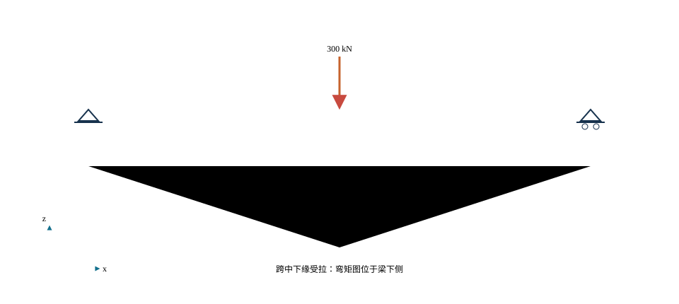
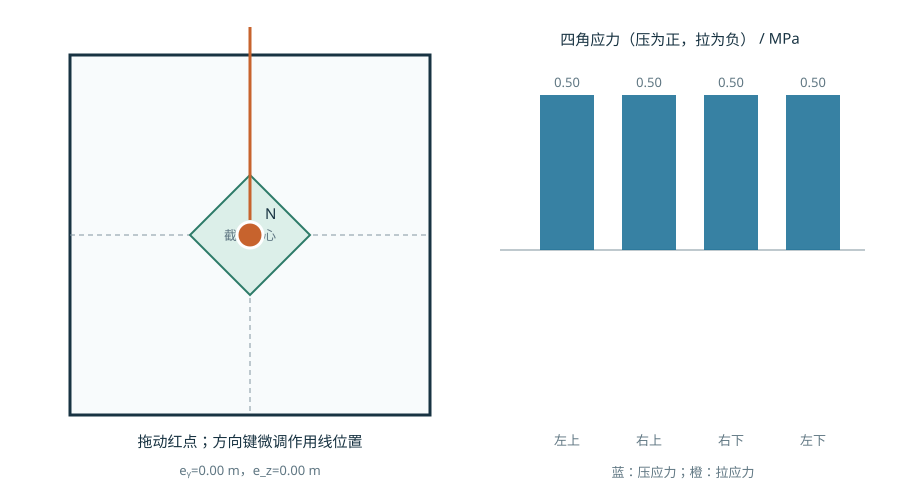
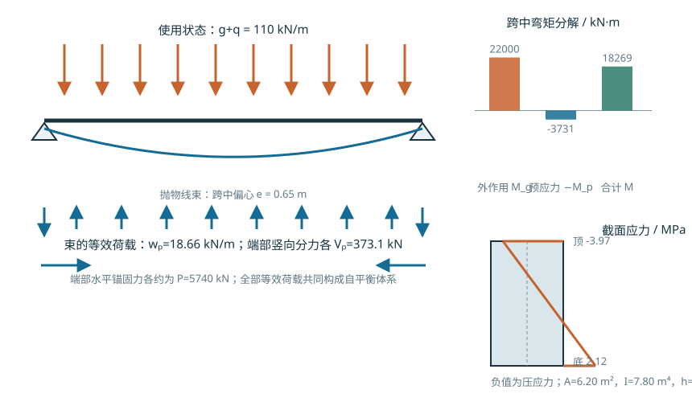

# 桥梁结构概念与力学基础

<!-- CORE-ROUTE START -->


<!-- VISUAL-ENTRY START -->

先从一个看得见的问题开始
<h3>同样用力，压在中间和压在边上有什么不同？</h3>
在截面图上移动压力作用点，比较四个角点的应力。
<a href="../interactive/learning-map.html?chapter=ch02-foundations">看图进入实验 →</a>

<!-- VISUAL-ENTRY END -->

<h2>本章的核心思考</h2>
用已学力学解释桥梁，不重新堆一套名词。
<ol><li>把偏心力写成轴力与弯矩，重画应力分布。</li><li>区分核心条件、开裂与大/小偏心破坏。</li><li>用预应力、温度与稳定的反例检验线性叠加边界。</li></ol>
<h3>跨课程类比</h3>
材料力学 N/A±M/W → 拱肋、主梁与基础的偏心效应

<strong>反例与边界：</strong>平均受压不等于处处受压；处处受压也不等于稳定满足。

建议课堂集中完成标为“课堂核心”的3个单元，其余单元用于课前观察和课后迁移。每个单元配独立短视频、操作实验、目标检验与开放论证题。

<article>
C02U01 · 课堂核心
<h3>偏心荷载等价为轴力加弯矩</h3>
平均压力与线性弯曲应力叠加，合力位置决定两边应力差。

<a href="../interactive/core-learning.html?unit=C02U01" target="_blank">操作与迁移任务</a> · <a href="../interactive/core-learning.html?unit=C02U01&amp;view=video" target="_blank">观看短视频</a>
</article><article>
C02U02 · 课堂核心
<h3>截面核心是怎样出现的</h3>
矩形截面偏心达到高度六分之一时，一侧边缘应力恰好为零。

<a href="../interactive/core-learning.html?unit=C02U02" target="_blank">操作与迁移任务</a> · <a href="../interactive/core-learning.html?unit=C02U02&amp;view=video" target="_blank">观看短视频</a>
</article><article>
C02U03 · 课前/课后迁移
<h3>核心条件不等于大、小偏心分界</h3>
越出核心仅说明未开裂线弹性计算出现拉应力，不能直接判定钢筋混凝土破坏类型。

<a href="../interactive/core-learning.html?unit=C02U03" target="_blank">操作与迁移任务</a> · <a href="../interactive/core-learning.html?unit=C02U03&amp;view=video" target="_blank">观看短视频</a>
</article><article>
C02U04 · 课前/课后迁移
<h3>固定外包尺寸，比较空心截面效率</h3>
把材料移离中性轴可以提高单位面积惯性矩，但薄壁局部问题需要另查。

<a href="../interactive/core-learning.html?unit=C02U04" target="_blank">操作与迁移任务</a> · <a href="../interactive/core-learning.html?unit=C02U04&amp;view=video" target="_blank">观看短视频</a>
</article><article>
C02U05 · 课前/课后迁移
<h3>截面加高为什么比加宽敏感</h3>
矩形惯性矩随高度三次方变化，随宽度一次变化。

<a href="../interactive/core-learning.html?unit=C02U05" target="_blank">操作与迁移任务</a> · <a href="../interactive/core-learning.html?unit=C02U05&amp;view=video" target="_blank">观看短视频</a>
</article><article>
C02U06 · 课前/课后迁移
<h3>稳定是平衡路径问题</h3>
有效长度加倍，欧拉临界力降为四分之一；强度够不等于稳定够。

<a href="../interactive/core-learning.html?unit=C02U06" target="_blank">操作与迁移任务</a> · <a href="../interactive/core-learning.html?unit=C02U06&amp;view=video" target="_blank">观看短视频</a>
</article><article>
C02U07 · 课堂核心
<h3>预应力先改变初始状态</h3>
预压力和偏心矩可抵消使用荷载的拉应力，也可能使另一侧出现新的控制条件。

<a href="../interactive/core-learning.html?unit=C02U07" target="_blank">操作与迁移任务</a> · <a href="../interactive/core-learning.html?unit=C02U07&amp;view=video" target="_blank">观看短视频</a>
</article><article>
C02U08 · 课前/课后迁移
<h3>热胀受阻才产生温度内力</h3>
自由热应变可以存在而不产生应力，约束程度决定转化出的内力。

<a href="../interactive/core-learning.html?unit=C02U08" target="_blank">操作与迁移任务</a> · <a href="../interactive/core-learning.html?unit=C02U08&amp;view=video" target="_blank">观看短视频</a>
</article><article>
C02U09 · 课前/课后迁移
<h3>质量、刚度与频率不是单独变化</h3>
刚度一定时，质量增加使频率按质量平方根的倒数下降。

<a href="../interactive/core-learning.html?unit=C02U09" target="_blank">操作与迁移任务</a> · <a href="../interactive/core-learning.html?unit=C02U09&amp;view=video" target="_blank">观看短视频</a>
</article><article>
C02U10 · 课前/课后迁移
<h3>线性叠加的边界在哪里</h3>
线弹性未开裂条件下可叠加轴力与弯矩；开裂、脱空或大变形后必须重建关系。

<a href="../interactive/core-learning.html?unit=C02U10" target="_blank">操作与迁移任务</a> · <a href="../interactive/core-learning.html?unit=C02U10&amp;view=video" target="_blank">观看短视频</a>
</article>

<a href="../core-thinking.html">返回全书核心思维与尺度规律</a> · <a href="../core-resources.html">查看110个教学单元总索引</a> · <a href="../interactive/thinking-analogies.html">打开跨课程并排类比</a>


<!-- CORE-ROUTE END -->




::: {.chapter-objectives}
**学习目标。** 完成本章学习后，学生应能够：

1. 从工程对象、自由体图、约束和传力路径出发建立桥梁的基本计算图式；
2. 说明轴力、剪力、弯矩和扭矩与截面应力、结构变形及极限状态之间的联系；
3. 利用截面几何性质判断梁式构件的抗弯、抗剪与抗扭特征，并说明常用公式的假定和适用范围；
4. 区分强度、刚度和稳定问题，识别桥梁施工与运营阶段常见的整体和局部稳定风险；
5. 说明预应力、斜拉索力和主缆初始张力作为初始状态对后续响应的影响；
6. 从直接传力路径和应变能角度解释梁、拱、斜拉和悬索体系的基本受力特征；
7. 建立静力位移、模态、频率、阻尼与动力响应之间的基本联系；
8. 采用理论分析、数值计算和试验观测组成证据链，对数字模型及其结果进行审查。
:::

::: {.source-note}
**本章素材说明。** 本章的知识组织参考 University of Manchester “Seeing and Touching Structural Concepts” 所采用的“概念—实体模型—工程实例—应用”教学结构，相关入口见 <https://epsassets.manchester.ac.uk/structural-concepts/>。正文、公式组织、桥梁算例和交互方案均为本教材重新编写，不复制该网站的文字、图片、视频或学生作品。建议图均应由课程组自主绘制、计算生成或拍摄；如后续确需采用外部素材，应逐项核查作者、许可和署名要求。
:::


<figure class="chapter-video-card"><video controls preload="metadata" playsinline poster="../assets/videos/manim/posters/M03_eccentric_core.png" src="../assets/videos/manim/M03_eccentric_core.mp4"></video><figcaption>M03　偏心受压与截面核心</figcaption></figure><figure class="chapter-video-card"><video controls preload="metadata" playsinline poster="../assets/videos/manim/posters/M04_prestress_views.png" src="../assets/videos/manim/M04_prestress_views.mp4"></video><figcaption>M04　预应力的三种等价表示</figcaption></figure>


## 本章定位、课程接口与学习路径



#### 工程对象

桥梁工程以前期课程中的力学关系为基础，但研究对象已经由理想杆件和单个截面扩展为包含桥面系、主要承重结构、支承、墩台、基础、连接与施工过程的工程系统。同一个“弯曲”概念，在材料力学中主要用于建立弯矩、曲率和正应力之间的关系；在结构设计原理中进一步用于判断承载能力、裂缝与变形；在桥梁工程中还要回答弯曲发生在哪个体系和施工阶段、荷载如何横向与纵向传递、边界条件如何变化，以及局部构造能否实现计算假定。

本章作为三门课程之间的接口章，不重复材料力学和结构设计原理的完整推导，而是建立后续桥型分析所需的统一语言。每个基本概念均依次回答五个问题：工程对象是什么；采用什么计算图式；公式中的物理量如何定义；哪些条件限制公式的使用；所得结果如何通过桥梁实例、数值模型或试验现象进行核验。

#### 三门课程的接口

| 知识层次 | 材料力学的主要内容 | 结构设计原理的主要内容 | 本课程的主要内容 |
|---|---|---|---|
| 截面 | 应力、应变、形心、惯性矩、截面模量 | 材料强度、截面承载力、裂缝和变形限值 | 桥面板、主梁、拱肋、索塔、墩柱和锚固区的实际截面与构造 |
| 构件 | 轴向、弯曲、剪切、扭转和稳定 | 受弯、受压、受拉及组合受力构件验算 | 跨径、支承、横向联系、施工阶段和环境作用下的构件行为 |
| 体系 | 简单杆件的平衡与变形 | 结构安全、适用与耐久的设计原则 | 梁、拱、斜拉、悬索体系及其传力路径、空间效应和体系转换 |
| 验证 | 公式的理论条件和极限情形 | 设计值、极限状态与规范验算 | 手算、有限元、试验或监测及工程经验之间的相互校核 |

桥梁分析可用下列关系链概括：

$$
\text{作用}\ \mathbf F
\longrightarrow
\text{作用效应}\ \mathbf S(\mathbf F)
\longrightarrow
\text{应力、变形与稳定状态}
\longrightarrow
\text{极限状态判断}.
$$

其中，$\mathbf F$为作用向量，可以包含力、位移、温度变化和地震地面运动等；$\mathbf S$为结构体系、材料、几何和边界条件共同决定的响应算子。在线弹性小变形范围内，$\mathbf S$可近似为线性算子；涉及开裂、接触、索的垂度、屈曲、材料非线性或显著几何变化时，该关系通常为非线性，并可能与加载路径有关。

#### 符号、坐标与单位

本章统一采用右手坐标系。桥梁总体坐标中，$x$为顺桥向，$y$为横桥向，$z$为竖向；构件局部坐标应另行标注。若无特别说明，轴力$N$以受拉为正，弯矩、剪力和扭矩的正号按图示局部坐标和右手规则确定。不能只依据软件默认的正负号解释结果。

常用物理量及其国际单位如下。

| 物理量 | 符号 | 基本单位 | 桥梁计算常用单位 | 使用提示 |
|---|---:|---:|---:|---|
| 长度、位移 | $L,u,v,w$ | m | m、mm | 同一公式内保持单位协调 |
| 面积 | $A$ | m² | m²、mm² | 与应力单位一致 |
| 截面二次矩 | $I$ | m⁴ | m⁴、mm⁴ | 必须标明相应轴线 |
| 力、轴力、剪力 | $F,N,V$ | N | kN | 正负号需与局部坐标对应 |
| 弯矩、扭矩 | $M,T$ | N·m | kN·m | 不得与质量单位混用 |
| 应力、弹性模量 | $\sigma,\tau,E,G$ | Pa | MPa、GPa | $1\ \mathrm{MPa}=1\ \mathrm{N/mm^2}$ |
| 线质量 | $m$ | kg/m | kg/m、t/m | 动力计算中不以重度代替质量 |
| 线荷载 | $q$ | N/m | kN/m | 应区分质量、重量和设计作用 |
| 圆频率、频率 | $\omega,f$ | rad/s、Hz | rad/s、Hz | $\omega=2\pi f$ |

#### 建议交互与来源说明

**建议交互。** 设置“知识接口地图”：点击“截面—构件—体系—验证”四个层次，分别显示材料力学公式、结构设计验算和桥梁工程对象；点击任一物理量时，所有相关公式和模型同步高亮。建议静态图为“作用—体系—响应—极限状态—证据”关系图，完全由课程组重新绘制。


<iframe loading="lazy" src="../interactive/ch02-structural-concepts-lab.html" title="桥梁结构概念实验台"></iframe>


::: {.digital-note}
**数字资源2-1　结构概念实验台。** “平衡”模式显示荷载位置、支反力与平衡残差；“截面效率”模式比较箱形截面的面积、惯性矩及材料分布效率；“约束与温度”模式比较活动边界与固定边界；“振动与阻尼”模式显示频率比、阻尼和动力放大系数。四种模式均给出公式、单位、计算假定和桥梁应用边界，参数采用教学值。
:::

::: {.source-note}
**来源说明。** 教学结构参考 Manchester 项目的[目录](https://www.sites.se.manchester.ac.uk/structural-concepts/contents/)和[前言](https://www.mub.eps.manchester.ac.uk/structural-concepts/preface/)。该项目将数学关系、物理模型和工程实例联系起来；本章按桥梁课程边界重新组织，并增加规范验算和数字证据链。原网站页脚标明保留版权，因此不以网页截图作为教材插图。
:::

## 平衡、约束与计算图式

::: {.callout-tip}
**同一摞书，挪个位置有什么区别？** 先[挪动书架上的书](../interactive/public-course.html)，预测两个支承怎样分担，再分别核对总力和转动作用。随后进入[多根梁的车辆实验](../interactive/transverse-bridge.html)：未知分担变多后，仅有平衡还不够，还要考虑连接与变形。

学完本节，试画出两个人抬箱子的受力图。箱内物品偏到一端，两人还能平均分担吗？把对象换掉后仍能说清理由，才说明这个方法可以迁移。MIT工程力学课程的简单实验与复习组织可见[课程导读](../course-guide.qmd#v05)；这里的书架练习为本教材原创。
:::



#### 工程对象

平衡分析的对象可以是整座桥、一个桥跨、一根主梁、一个桥墩、一只支座，也可以是从结构中截取的任意部分。对象不同，外力与内力的身份也不同。例如，对整座梁桥而言，支座反力是外力；对上部结构而言，它仍是外力；对把主梁和支座共同截取的局部系统而言，梁底与支座之间的接触力成为内部作用。建立自由体图的首要任务是明确分析边界。

桥梁受力分析不宜从软件单元开始，而应先完成下列判断：

1. 选定研究对象和坐标系；
2. 切断其与外部的所有联系，并用相应反力或内力替代；
3. 标出重力、交通、风、温度约束、预应力、支座位移及施工荷载等作用；
4. 检查是否遗漏力偶、偏心距和空间分量；
5. 写出平衡方程，并判断方程是否足以确定未知量。

#### 平衡方程

对静止或作匀速直线运动的刚体，三维整体平衡条件为

$$
\sum F_x=0,\qquad \sum F_y=0,\qquad \sum F_z=0,
$$

$$
\sum M_x=0,\qquad \sum M_y=0,\qquad \sum M_z=0.
$$

$F_x,F_y,F_z$为力在三个坐标方向的分量，单位为N或kN；$M_x,M_y,M_z$为关于相应坐标轴的力矩，单位为N·m或kN·m。对位于$x$—$z$平面内的平面问题，常用三个独立方程

$$
\sum F_x=0,\qquad \sum F_z=0,\qquad \sum M_y=0.
$$

这些方程只表达整体平衡，并不包含材料刚度和变形协调。对静定结构，平衡方程可确定全部支反力和截面内力；对超静定结构，还需引入变形协调与本构关系。有限元离散后，线弹性静力问题通常写为

$$
\mathbf K\mathbf u=\mathbf F,
$$

其中$\mathbf K$为结构刚度矩阵，单位随自由度类型而变；$\mathbf u$为节点位移和转角向量；$\mathbf F$为与自由度对应的节点力和力矩向量。该式成立的基本条件是：所采用的刚度与当前状态相符，边界条件足以消除刚体位移，且分析范围内可接受线性化假定。矩阵方程得到数值解，并不自动证明自由体图和边界条件正确。

#### 约束与自由度

支座和连接通过限制某些自由度形成结构体系。平面梁模型的节点通常含顺桥向位移、竖向位移和转角三个自由度；空间梁模型还包含横向位移及另外两个转角。固定支座、活动支座、抗震挡块、阻尼器和墩梁固结对各方向自由度的约束并不相同。

理想铰支承允许转动而限制规定方向的平动；滚动或滑动支承释放一个或多个平动方向；固定端限制平动和转动。实际桥梁支座还具有有限刚度、摩阻、间隙、屈服或损伤等特征。教学模型可以先采用理想约束，但应说明忽略了哪些实际行为。在温度、地震或制动力分析中，支座约束方向错误往往比截面参数的小幅误差更严重。

#### 桥梁实例

设一跨计算跨径为$L$的简支梁承受全跨均布荷载$q$。由整体平衡可得两端竖向反力

$$
R_A=R_B=\frac{qL}{2},
$$

跨中最大弯矩为

$$
M_{\max}=\frac{qL^2}{8}.
$$

式中$L$以m计，$q$以kN/m计时，$R$为kN，$M$为kN·m。该结果适用于等截面或变截面简支梁的整体静力平衡，但最大弯矩位置和数值还以全跨均布荷载、理想简支及小变形为条件。若荷载移动、支承有沉降、梁体连续或存在显著几何非线性，需采用相应的影响线、协调条件或非线性分析。

同样的平衡原则可用于判断不同桥型：梁式桥在竖向荷载下通常以竖向支反力为主；有推力拱桥在拱脚产生水平推力；斜拉桥的索力通过桥塔和主梁形成竖向与水平分量；悬索桥的主缆拉力经索塔与锚碇形成闭合传力系统。平衡方程相同，但未知量及其传递路径由体系决定。

#### 结果审查

软件计算完成后，应把全部支反力投影到统一总体坐标中，检查其合力和合力矩是否与外部作用平衡。对于对称结构与对称作用，还应检查反力、位移和内力是否满足对称性。对施工阶段模型，则应逐阶段检查新加荷载、既有内力和边界变化，不能只对最终阶段进行一次总平衡。

#### 建议交互与来源说明

**建议交互。** 在一座可切换梁桥、拱桥、斜拉桥和悬索桥的二维/三维模型上拖动荷载。界面实时显示自由体图、支反力、合力矩及平衡残差；切换支座方向或释放自由度后，显示刚体位移、温度约束力和体系改变。建议静态图包括四类桥型的整桥自由体图，以及“实际支座—理想约束—模型自由度”的对应图。

::: {.source-note}
**来源说明。** 平衡与实体模型的教学组织可参考 Manchester [Equilibrium](https://epsassets.manchester.ac.uk/structural-concepts/Statics/equilibrium/equilibrium_con.php) 页面及其[模型清单](https://epsassets.manchester.ac.uk/structural-concepts/contents/listmodels.php)。本节公式为工程力学基本关系；桥梁作用与组合应进一步依据交通运输部发布的[《公路桥涵设计通用规范》JTG D60—2015](https://xxgk.mot.gov.cn/2020/jigou/glj/202006/t20200623_3312312.html)及项目采用的现行标准确定。
:::

## 内力、应力、偏心与设计接口



#### 工程对象

桥梁构件把外部作用传向支承时，任一截面上都会形成维持被截取部分平衡的内力。对空间杆系构件，截面内力一般包括轴力$N$、两个方向的剪力$V_y,V_z$、扭矩$T$和两个方向的弯矩$M_y,M_z$。这些截面合力并非材料点上的应力，而是应力在截面上的积分结果。

#### 从应力到截面内力

设构件局部$x$轴沿杆轴，截面法向正应力为$\sigma_x$，切应力为$\tau_{xy},\tau_{xz}$。相应截面内力可写为

$$
N=\int_A\sigma_x\,\mathrm dA,
$$

$$
V_y=\int_A\tau_{xy}\,\mathrm dA,\qquad
V_z=\int_A\tau_{xz}\,\mathrm dA,
$$

$$
M_y=\int_A z\sigma_x\,\mathrm dA,\qquad
M_z=-\int_A y\sigma_x\,\mathrm dA,
$$

$$
T=\int_A\left(y\tau_{xz}-z\tau_{xy}\right)\mathrm dA.
$$

积分变量$y,z$以m或mm计，应力以Pa或MPa计；积分所得$N,V$为力，$M,T$为力矩。上式说明，同一组截面内力可能对应不同的局部应力分布，具体分布还取决于截面形状、材料组合、开裂、剪力滞和局部作用等条件。

对均质、线弹性、小变形、平截面假定成立且坐标轴为截面主轴的杆件，轴力与单向弯曲共同作用下的正应力可写为

$$
\sigma_x(y)=\frac{N}{A}-\frac{M_z}{I_z}y,
$$

或按所采用的正号规则写成相应的加减形式。$A$为截面面积，$I_z$为关于$z$轴的截面二次矩，$y$为计算点至中性轴的距离。该式不能直接用于未换算的组合截面、明显开裂截面、深梁扰动区或材料进入非线性的状态。

#### 轴力、偏心与截面核心

轴向力与弯矩共同作用，是拱肋、桥墩、索塔和预应力梁截面分析的共同入口。为便于判读，本小节以压应力和压力$N_c$为正，取$y,z$为截面主轴；并规定正$M_z$使$+y$侧压应力增加，正$M_y$使$+z$侧压应力增加。在线弹性、均质、完整截面和平截面假定下，双向偏心受压的应力为

$$
\sigma_c(y,z)=\frac{N_c}{A}+\frac{M_z}{I_z}y+\frac{M_y}{I_y}z.
$$

若合力作用点相对形心的坐标为$(e_y,e_z)$，且$M_z=N_c e_y$、$M_y=N_c e_z$，则

$$
\sigma_c(y,z)=\frac{N_c}{A}
\left(1+\frac{e_y y}{r_z^2}+\frac{e_z z}{r_y^2}\right),
\qquad
r_z^2=\frac{I_z}{A},\quad r_y^2=\frac{I_y}{A}.
$$

当截面最小压应力不小于零时，线弹性应力图中不出现受拉区。单向偏心时，合力需满足

$$
|e|\leq k=\frac{I}{Ac}=\frac{W}{A},
$$

其中$c$为形心至所考察边缘的距离，$W=I/c$为相应截面模量，$k$为核心距。对沿$y$方向宽度为$b$、沿$z$方向高度为$h$的矩形截面，双向无拉应力条件为

$$
\frac{|e_y|}{b/6}+\frac{|e_z|}{h/6}\leq1.
$$

该菱形区域是矩形截面的截面核心。它回答的是“按线弹性应力分布是否出现受拉区”，不能直接代替材料和构件极限状态验算。

下列术语应分别使用：

| 对象 | 本书采用的表述 | 判定依据与课程归属 |
|---|---|---|
| 均质线弹性截面 | 全截面受压、截面核心、核心距 | 由$N$、$M$与截面几何确定，属于材料力学的截面应力关系 |
| 钢筋混凝土压弯构件 | 大偏心受压、小偏心受压 | 由截面平衡、应变协调、材料本构及受压区相对高度等判定，属于结构设计原理；不以$e=h/6$划分 |
| 钢压弯构件 | 截面强度、构件稳定与二阶效应 | 同时检查$N$—$M$相互作用、长细比、初始缺陷和整体稳定 |
| 预应力混凝土构件 | 施工与使用阶段截面应力、抗裂与承载状态 | 区分张拉、传力、成桥和运营阶段，并按相应极限状态验算 |
| 拱肋、圬工或无拉材料 | 压力线、偏心与核心范围 | 以$e=M/N$解释合力位置；钢筋混凝土或钢拱仍须另做压弯与稳定验算 |

桥墩和索塔通常需处理两个方向的弯矩；拱肋还需沿弧长比较压力线与截面轴线；预应力梁则需把预压力、偏心预应力弯矩和外荷载效应置于同一阶段叠加。相同的$N$与$M$关系在不同材料中对应不同的设计术语，不宜混用。

本书在未另作声明时，梁的弯矩图画在受拉侧；正弯矩对应跨中下缘受拉，负弯矩对应支点上缘受拉。空间杆系或有限元软件的局部轴、端力正号可能不同，导入图表时必须同时显示局部坐标和正号约定，不能仅凭颜色或图形上下位置判断受拉侧。


<iframe loading="lazy" src="../interactive/bridge-concept-screen.html?lab=bending" title="弯矩图、剪力图与受拉侧实验"></iframe>


{#fig-ch02-bending-side .static-fallback width=88%}


<iframe loading="lazy" src="../interactive/ch02-eccentric-compression-lab.html" title="偏心受压与截面核心直接操作实验"></iframe>


{#fig-ch02-eccentric-fallback .static-fallback width=88%}

::: {.digital-note}
**数字资源2-2　偏心受压与截面核心。** 在截面上拖动压力合力作用点，观察四角应力、零应力边界和双向核心范围。基础任务只判断线弹性截面的受压与受拉分区；进阶任务再把同一组内力交给钢筋混凝土、钢或圬工构件验算模块。
:::

#### 作用效应与抗力

桥梁设计中，作用$F$通过结构分析形成内力、应力、位移或其他作用效应$S$；材料、截面和构造提供相应抗力$R$。极限状态函数常抽象为

$$
g(\mathbf X)=R(\mathbf X)-S(\mathbf X),
$$

其中$\mathbf X$为包含作用、材料、几何和模型参数的变量向量。$g>0$表示在所定义极限状态下具有余量，$g=0$为极限状态边界，$g<0$为超越状态。该表达只给出可靠度分析的基本接口，具体设计值、分项系数、组合规则和验算表达应在作用与可靠度章节中按现行规范说明。

应特别区分三个尺度：

- **整体效应**：全桥弯矩、剪力、轴力、扭矩、位移和支反力；
- **构件效应**：一根主梁、横梁、拱肋、塔柱或墩柱的截面内力；
- **局部效应**：轮载下桥面板、支座承压区、预应力锚固区、横隔板开孔和连接节点的应力场。

整体梁单元模型可以正确给出总体弯矩，却不能自动给出锚固区横向劈裂应力；精细实体模型能够给出局部应力，却可能因边界取值不当而不能代表整桥作用。模型尺度必须与待回答的问题一致。

#### 桥梁实例

在单箱梁跨中截面，恒载与车辆荷载常形成较大的纵向正弯矩，顶、底板承担主要纵向正应力，腹板承担主要剪力。偏心车辆荷载、曲线线形或支点偏置还会形成扭矩，使箱室产生剪流和畸变。靠近支点时，弯矩通常降低而剪力增大，支座集中反力又通过横隔板或横梁向腹板和全截面扩散。因此，跨中、支点和锚固区需要采用不同的内力组合与局部模型。

#### 建议交互与来源说明

**建议交互。** 用户在三维梁上选择截面位置，页面同步显示该处$N,V_y,V_z,T,M_y,M_z$及截面应力分布；选择“总体梁模型”“壳模型”“局部实体模型”时，界面明确显示可获得的结果与不能回答的问题。建议静态图为“外部作用—截面内力—应力积分—极限状态”的四层关系图，以及箱梁跨中、支点与锚固区的分析尺度对照图。

::: {.source-note}
**来源说明。** 应力分布的实体模型与工程实例组织可参考 Manchester [Stress Distribution](https://epsassets.manchester.ac.uk/structural-concepts/Statics/stress/stress_con.php)。本节不采用该网站的气球、鞋或工程照片，所有应力云图应由课程组模型生成。混凝土桥的截面设计与验算应进一步查阅交通运输部发布的[《公路钢筋混凝土及预应力混凝土桥涵设计规范》JTG 3362—2018](https://xxgk.mot.gov.cn/jigou/glj/202006/t20200623_3312720.html)及项目采用的现行补充文件。
:::

## 截面性质、弯曲、剪切与扭转

[用一个实际选筋实验继续：梁高变了，受压区和力臂怎样变？](../legacy-tools.qmd)。先看截面中相反方向的压力与拉力，再把选定的钢筋面积代回平衡；实际规格改变后，不能沿用原计算状态。



#### 工程对象

梁式桥主梁、斜拉桥主梁、悬索桥加劲梁以及拱桥桥面梁均需通过截面配置形成所需弯曲刚度和抗力。截面形状的作用不只是“增加面积”，而是把材料布置到对目标内力更有效的位置，同时满足剪切、扭转、局部稳定、预应力布置、施工和维护要求。

#### 形心、截面二次矩与截面模量

对于由若干简单区域组成的同一种材料截面，其形心坐标为

$$
\bar y=\frac{\sum_i A_i y_i}{\sum_i A_i},\qquad
\bar z=\frac{\sum_i A_i z_i}{\sum_i A_i}.
$$

关于形心轴的截面二次矩可由平行移轴公式求得：

$$
I_z=\sum_i\left(I_{z,i}^{c}+A_i d_{y,i}^{2}\right),
$$

其中$A_i$为第$i$个分块面积，$I_{z,i}^{c}$为该分块关于自身形心轴的截面二次矩，$d_{y,i}$为两轴间距离。$A$的单位为m²或mm²，$I$的单位为m⁴或mm⁴。截面上、下缘模量分别为

$$
W_t=\frac{I_z}{c_t},\qquad W_b=\frac{I_z}{c_b},
$$

$c_t,c_b$分别为中性轴至上、下缘的距离。对非对称截面，两者一般不相等。

单位面积的$I/A$或$W/A$可作为比较弹性弯曲几何效率的辅助指标，但不能作为截面优劣的唯一结论。面积减小会降低自重，却可能增大板件宽厚比、剪应力、扭转变形和施工难度；材料离中性轴过远也会受到总体高度、运输净空、预制架设及稳定约束。

#### 弯矩、曲率与正应力

Euler–Bernoulli 梁理论假定变形前垂直于中性轴的平截面在变形后仍保持平面并垂直于中性轴，忽略横向剪切变形。在均质线弹性范围内，弯矩与曲率关系为

$$
M(x)=E I(x)\kappa(x),
$$

小挠度条件下$\kappa\approx \mathrm d^2w/\mathrm dx^2$。对等截面梁，控制方程可写为

$$
E I\frac{\mathrm d^4w}{\mathrm dx^4}=q(x),
$$

其中$E$为弹性模量，单位为Pa；$I$为相应弯曲轴的截面二次矩，单位为m⁴；$w$为挠度，单位为m；$q$为线荷载，单位为N/m。方程还需结合支承处的位移、转角、弯矩或剪力边界条件求解。

当梁高相对跨度较大、腹板剪切变形不可忽略或采用夹层/组合构造时，应采用包含剪切变形的梁理论或二维、三维模型。组合梁还需根据施工阶段判断混凝土桥面板是否参与受力，并按材料模量和连接条件确定换算截面或组合刚度。

#### 桥梁实例：相同材料量的截面比较

设三根试验梁长度和材料相同，截面分别为扁置矩形、竖置矩形和由相同材料组合成的I形。即使面积相等，只要材料至中性轴的距离不同，$I$便会显著变化，弯曲刚度$EI$和挠度也随之改变。该比较可以迁移到箱梁设计：掏空中性轴附近的低效材料并形成顶、底板，通常能够降低自重并保持较大的纵向抗弯刚度；腹板则负责连接翼板、传递剪力并维持截面几何。

箱梁截面不能只按纵向弯曲选择。宽桥面会使顶板横向弯曲和剪力滞更加显著；偏载、曲线和斜交会提高扭转与畸变需求；薄壁板件还需满足局部稳定、预应力锚固、施工和耐久构造。因此，截面比较应至少同时列出面积、自重、$I$、$W$、扭转指标、板件尺寸和可施工性。

#### 教学算例：跨径敏感性

某等截面简支教学梁的计算跨径$L=30\ \mathrm m$，全跨均布作用效应取$q=120\ \mathrm{kN/m}$，弹性模量$E=34\ \mathrm{GPa}$，截面二次矩$I=3.20\ \mathrm{m^4}$，中性轴至计算边缘的距离$c=1.10\ \mathrm m$。这些参数仅用于说明力学关系，不作为梁高、材料或荷载的推荐值。

由平衡关系可得

$$
R_A=R_B=\frac{120\times30}{2}=1800\ \mathrm{kN},
$$

$$
M_{\max}=\frac{120\times30^2}{8}=13500\ \mathrm{kN\cdot m}.
$$

按未开裂线弹性截面计算，边缘弯曲应力绝对值为

$$
|\sigma|=\frac{M_{\max}c}{I}
=\frac{13.5\times10^6\times1.10}{3.20}
=4.64\ \mathrm{MPa}.
$$

全跨均布荷载下的跨中挠度为

$$
w_{\max}=\frac{5qL^4}{384EI}=11.6\ \mathrm{mm}.
$$

若只把跨径改为$36\ \mathrm m$，并保持$q$、$E$和$I$不变，则最大弯矩按$L^2$增长为原来的$1.44$倍，挠度按$L^4$增长为原来的$2.0736$倍，约为$24.1\ \mathrm{mm}$。该结果表明，跨径变化对变形比对弯矩更敏感。实际桥梁增大跨径时通常会同步改变梁高、截面、预应力与体系，不能直接保持$I$不变；但该极限比较适合作为方案结果的数量级检查。

#### 建议交互与来源说明

**建议交互。** 建立“等材料量截面实验”：在保持面积或单位长度质量不变的条件下连续调整实心矩形、I形、单箱和多箱截面，实时计算$\bar z$、$I$、$W$、自重、弯曲应力和挠度；另设跨径滑块显示$L^2$与$L^4$尺度效应。界面必须同时显示保持不变的条件和未纳入的局部稳定、剪切、扭转及构造约束。建议静态图为四种截面的材料分布、弯曲应力与相对挠度三联图。

::: {.source-note}
**来源说明。** “相同材料、不同截面”的实体模型思路参考 Manchester [Effect of Different Cross Sections](https://epsassets.manchester.ac.uk/structural-concepts/Statics/sections/section_mod1.php)；薄梁与深梁的对照组织参考其[Bending](https://www.mub.eps.manchester.ac.uk/structural-concepts/bending/)页面。本教材不使用原模型照片或原数值，建议由课程组制作桥梁截面模型、重新计算并拍摄。混凝土与预应力截面的最终设计按JTG 3362及相关现行标准进行。
:::

### 剪切、扭转与薄壁箱梁行为

#### 工程对象

桥梁主梁不仅承受弯矩。竖向荷载在支点附近形成较大剪力，偏心荷载、曲线线形、斜交支承和不对称施工会形成扭矩；箱梁的顶板、底板和腹板通过剪流共同工作，横隔板和横向联系则承担集中力扩散、保持截面形状和约束畸变等任务。剪切、自由扭转、翘曲扭转和截面畸变属于不同机制，应根据结构尺度与边界条件分别识别。

#### 梁的弯曲剪应力

在均质、线弹性、等截面或缓慢变截面梁中，横向剪力$V$引起的剪应力可用 Jourawski 公式表示为

$$
\tau=\frac{VQ}{Ib},
$$

其中，$V$为所研究截面的剪力，单位为N；$I$为整个截面对中性轴的截面二次矩，单位为m⁴；$Q$为计算点一侧部分面积对中性轴的静矩，单位为m³；$b$为该处承受剪流的有效宽度，单位为m；$\tau$的单位为Pa。对于薄壁构件，常先求单位长度剪流

$$
q_s=\tau t,
$$

$t$为板厚，$q_s$的单位为N/m。薄壁截面中使用剪流能够直观表达翼板和腹板之间的纵向力传递，也便于分析组合梁界面连接。

上述公式建立在梁理论与截面整体工作的基础上。在支座、集中荷载、锚固区、开孔、急剧变截面及横隔板附近，应力分布受到局部扰动，不能只用一维梁公式确定。混凝土构件开裂后，抗剪机理还包含未开裂混凝土、骨料咬合、纵筋销栓、箍筋和拱作用等，需按结构设计原理与现行规范验算。

#### 闭口薄壁截面的自由扭转

对单室闭口薄壁截面，在壁厚相对截面尺寸较小、截面形状沿杆轴不变、Saint-Venant 自由扭转近似成立时，Bredt 关系可写为

$$
q_T=\frac{T}{2A_m},
$$

其中$q_T$为由扭矩引起的环向剪流，单位为N/m；$T$为扭矩，单位为N·m；$A_m$为壁厚中线所围面积，单位为m²。相应切应力为

$$
\tau_T(s)=\frac{q_T}{t(s)}.
$$

单位长度扭转角可写为

$$
\theta'=\frac{T}{4A_m^2G}\oint\frac{\mathrm ds}{t(s)},
$$

式中$G$为剪切模量，单位为Pa；$s$为沿闭合壁中线的坐标；$\theta'$的单位为rad/m。多室箱梁需要同时满足各箱室的扭矩平衡和扭转变形协调，不能把每个箱室分别套用单室公式后简单相加。

闭口截面通常具有较高的自由扭转刚度，适合承受偏载和曲线桥的扭转作用。开口截面扭转刚度相对较低，并可能出现显著翘曲正应力。即使采用闭口箱梁，横向框架变形仍可能造成截面畸变；设置横隔板、加劲肋或合理的腹板位置，可以改变畸变传递，但其刚度和间距需要计算确定。

#### 剪心、偏载与弯扭耦合

横向荷载若通过截面剪心，在线弹性薄壁梁理想化中可主要引起弯曲而不产生整体扭转；若作用线偏离剪心，则会形成附加扭矩

$$
T=Ve,
$$

其中$e$为剪力作用线至剪心的垂直距离。对具有两个对称轴的双对称截面，剪心与形心重合；对槽形、角形等开口薄壁截面，剪心可能位于截面外部。桥梁截面还受到桥面悬臂、横坡、护栏、偏心车辆和曲线半径的影响，几何形心、质量中心、刚度中心和作用合力位置未必重合。

#### 桥梁实例

直线、正交、对称单箱梁在对称恒载下可以弯曲为主；车辆靠一侧行驶时，竖向荷载对箱梁剪心产生偏心，引起弯扭共同作用。曲线箱梁即使承受关于桥面中心线对称的竖向作用，也会因曲率和支承方向形成扭矩。斜桥的支承线与梁轴不正交，支点反力分布和扭转响应也会改变。施工阶段尚未形成闭合截面或横向联系时，构件的扭转与侧向稳定性能可能明显低于成桥状态。

箱梁分析应分三个层次：杆系模型用于总体弯矩、剪力和扭矩；壳模型用于剪流、畸变和横向板弯曲；实体或局部壳模型用于支点、锚固和开孔区。不同层次的结果不能不加说明地混合使用。

#### 建议交互与来源说明

**建议交互。** 设置开口槽形、I形、单室箱形和多室箱形截面切换；用户拖动横向荷载位置，界面显示剪心、扭矩、剪流、扭转角和翘曲趋势。增加“横隔板”开关后，同步显示截面畸变和局部应力变化。建议静态图包括：开口与闭口截面剪流对照、偏载作用线与剪心关系、曲线箱梁弯扭耦合、支点横隔板的传力路径。

::: {.source-note}
**来源说明。** 物理对照模型的选题参考 Manchester [Shear and Torsion](https://epsassets.manchester.ac.uk/structural-concepts/Statics/shear/shear_con.php)及其模型清单中开口/闭口截面、翘曲和剪心演示。本教材不复制其装置照片或文字；交互截面、剪流箭头和计算数据均应自主生成。具体钢桥薄壁稳定和构造设计还应结合交通运输部发布的[《公路钢结构桥梁设计规范》JTG D64—2015](https://xxgk.mot.gov.cn/jigou/glj/202006/t20200623_3312425.html)及项目所采用的现行标准。
:::

## 变形、能量与稳定



#### 工程对象

桥梁必须具有足够承载能力，同时还应控制挠度、转角、伸缩位移、振动和构件间相对变形。刚度不是单一材料参数，而是材料、截面、体系、边界和荷载位置共同决定的结构属性。相同材料和截面的构件，因跨度或支承条件不同会表现出不同刚度；相同上部结构，通过柔性高墩或刚性矮墩支承时，全桥纵向响应也不同。

#### 构件刚度与体系刚度

在线弹性范围内，单自由度等效刚度定义为

$$
k=\frac{F}{\delta},
$$

$F$为所考察方向的力，单位为N；$\delta$为同一位置和方向的位移，单位为m；$k$的单位为N/m。转动刚度可定义为力矩与转角之比，单位为N·m/rad。刚度数值必须与加载位置、响应位置和方向同时给出，仅说“某桥刚度为多少”是不完整的。

以等截面简支梁为例，跨中集中力$P$引起的跨中挠度为

$$
\delta_P=\frac{PL^3}{48EI},
$$

全跨均布荷载$q$引起的跨中挠度为

$$
\delta_q=\frac{5qL^4}{384EI}.
$$

这两个公式适用于Euler–Bernoulli梁、小变形、线弹性、理想简支和等截面条件。前者说明在集中力不变时挠度与$L^3$成正比；后者说明在线荷载强度不变时挠度与$L^4$成正比。比较跨径效应时必须说明是保持集中力、线荷载、总荷载还是单位面积荷载不变。

#### 剪切变形

对于深梁、较短构件或剪切柔度较大的截面，总挠度可分解为弯曲和剪切分量：

$$
\delta=\delta_b+\delta_s.
$$

在能量表达中，剪切项常写为$\kappa_sV^2/(GA_s)$或等价形式，其中$A_s$为有效剪切面积，$\kappa_s$为与截面形状及定义有关的修正参数。不同文献对$A_s$与剪切修正系数的记号可能不同，使用时应说明定义，不能将$\kappa_s GA$与$GA_s$重复修正。

#### 应变能与单位荷载法

<!-- FORMULA-SCAFFOLD ch02-foundations START -->
::: {.formula-scaffold}
**先看这个问题。** 只想知道某一点下沉多少，为什么要看整根梁？每一小段的弯曲都可能贡献一点位移。先看弯曲这一项，再判断是否还要加入轴向、剪切和扭转。


真实荷载下的弯矩 M目标点单位力的弯矩 m沿梁累计小段贡献


这组符号分别指什么？

大写 M 来自真实荷载；小写 m 来自目标点沿目标方向的单位力。EI 是抗弯刚度；积分把各小段的贡献加起来。单位力是计算参照，不是又往真实桥上加了一辆车。其他变形项按后文的适用条件加入。


:::
<!-- FORMULA-SCAFFOLD ch02-foundations END -->

在线弹性杆系中，忽略或保留相应变形成分后，结构应变能可表示为

$$
U=\frac12\int_L
\left(
\frac{N^2}{EA}
+\frac{M_y^2}{EI_y}
+\frac{M_z^2}{EI_z}
+\frac{T^2}{GJ}
+\frac{V^2}{GA_s}
\right)\mathrm dx.
$$

式中$J$为与自由扭转有关的截面常数，单位为m⁴；其他符号与前述定义一致。对多数细长梁桥的竖向整体变形，弯曲能往往占主要部分；对桁架、拱和索体系，轴向能的重要性提高；对薄壁箱梁和短深构件，扭转或剪切能可能不可忽略。

为求某点沿某方向的位移，可在该处施加相应单位力，得到虚内力$n,m,v,t$，并利用虚功关系

$$
\delta=
\int_L\left(
\frac{Nn}{EA}
+\frac{Mm}{EI}
+\frac{Vv}{GA_s}
+\frac{Tt}{GJ}
\right)\mathrm dx.
$$

各项是否保留取决于结构和精度要求。该式能够说明：位移不仅取决于目标点附近的截面，还取决于单位力内力图与实际内力图在全结构范围内的重叠。

#### 桥梁实例

连续梁通过支点连续使弯矩在跨间重新分配，通常可减小跨中正弯矩和挠度，但会产生支点负弯矩，并提高对支座沉降和温度变形的敏感性。连续刚构的主梁与桥墩共同变形，墩梁刚度比决定内力分配。斜拉索为主梁提供一系列弹性支承，可缩短主梁的有效受弯长度；悬索桥的加劲梁与主缆共同承担活载，其整体刚度包含主缆几何刚度和加劲梁弯曲刚度。

支座也参与体系刚度。将支座理想为完全固定或完全自由，可能适于初步分析；考虑温度、制动、地震和隔震时，则需要采用方向相关的平动刚度、转动刚度、摩擦、间隙或非线性恢复力模型。基础和土体柔度同样会改变高墩及大跨桥的周期和内力。

#### 建议交互与来源说明

**建议交互。** 用户可以保持总材料量不变，调整跨径、梁高、支承条件和墩身刚度，界面同时显示弯矩图、变形曲线、各类应变能占比和等效刚度；从简支切换为连续或刚构时，必须同步更新边界和施工阶段说明。建议静态图为简支、连续、刚构三种体系的归一化变形对照，以及“弯曲能—轴向能—剪切能—扭转能”构成图。

::: {.source-note}
**来源说明。** 跨度、边界条件和刚度的对照思路参考 Manchester [Span and Deflection](https://epsassets.manchester.ac.uk/structural-concepts/Statics/span/spans_con.php)。本节公式由经典梁理论与虚功原理独立编写；原站实体模型和工程照片不进入本教材。桥梁变形限值、计算刚度和长期效应应按相应材料桥梁规范及项目设计条件确定。
:::

### 结构稳定

#### 工程对象

强度问题关注材料或截面能否承受给定效应；刚度问题关注变形是否满足功能要求；稳定问题关注结构在压力、弯矩或剪力作用下能否保持原有平衡形态。稳定破坏可能在材料强度尚未充分发挥前发生，并对初始弯曲、残余应力、施工误差、边界和横向联系十分敏感。

桥梁中的稳定对象包括：受压墩柱和桥塔、钢梁受压翼缘及腹板、箱梁薄壁板件、拱肋面内与面外稳定、悬臂施工阶段的梁体侧向稳定、吊装中的单片预制梁、钢主梁在桥面板形成组合前的侧扭稳定等。

#### 理想压杆屈曲

两端铰支、等截面、理想直杆在轴心压力作用下的Euler临界力为

$$
P_{\mathrm{cr}}=\frac{\pi^2EI}{L^2}.
$$

对其他理想边界，可写为

$$
P_{\mathrm{cr}}=\frac{\pi^2EI}{(K L)^2},
$$

其中$K$为计算长度系数，$KL$为有效长度。$E$以Pa计，$I$以m⁴计，$L$以m计时，$P_{\mathrm{cr}}$以N计。该式建立在材料线弹性、构件笔直、荷载轴心、边界理想、变形较小且不发生局部屈曲的条件下。实际构件有缺陷并受组合内力，设计不能以Euler公式单独替代规范稳定验算。


<iframe loading="lazy" src="../interactive/bridge-concept-screen.html?lab=buckling" title="有效长度与Euler临界力实验"></iframe>


{#fig-ch02-euler-modes .static-fallback width=72%}

压杆长细比常写为

$$
\lambda=\frac{KL}{i},\qquad i=\sqrt{\frac{I}{A}},
$$

$i$为回转半径，单位与$L$一致；$\lambda$为无量纲量。截面面积增加但材料仍集中在形心附近时，回转半径未必有效提高；把材料合理布置到截面外缘，通常能够同时提高$I$和稳定效率，但会带来局部板件稳定问题。

#### 整体特征屈曲与非线性路径

有限元线性特征屈曲常写为

$$
\left(\mathbf K-\lambda_{\mathrm{cr}}\mathbf K_G\right)\boldsymbol\phi=\mathbf 0,
$$

其中$\mathbf K$为弹性刚度矩阵，$\mathbf K_G$为参考荷载产生的几何刚度矩阵，$\lambda_{\mathrm{cr}}$为临界荷载倍数，$\boldsymbol\phi$为相应屈曲模态。符号形式随软件对几何刚度的定义而变化，应以理论说明和软件手册为准。

特征屈曲模态可用于识别潜在失稳形态和比较参数，但其临界倍数通常对应理想结构。评价实际稳定承载力还需考虑初始几何缺陷、材料非线性、残余应力、接触和加载路径。常用做法是按合理缺陷幅值将一个或多个特征模态引入初始几何，再进行几何与材料非线性分析，并与规范方法交叉核验。

#### 薄板局部屈曲

理想弹性矩形薄板在均匀压应力作用下的临界应力可概括为

$$
\sigma_{\mathrm{cr}}=
k\frac{\pi^2E}{12(1-\nu^2)}
\left(\frac{t}{b}\right)^2,
$$

其中$k$为与板边界条件、长宽比和应力分布有关的屈曲系数；$\nu$为泊松比；$t$为板厚；$b$为受压板件的特征宽度。该式说明临界应力对宽厚比具有平方敏感性，但不能脱离加劲肋、残余应力、初始缺陷、材料屈服与后屈曲行为直接作为设计值。

#### 桥梁实例

钢—混凝土组合梁施工时，混凝土桥面板尚未形成，单片或少数钢梁的受压翼缘缺少连续侧向约束，吊装和浇筑阶段可能控制侧扭稳定。箱梁成桥后总体扭转刚度较高，但顶、底板和腹板仍可能发生局部屈曲。拱桥以轴向压力为主，面外横向联系、拱肋间距和桥面系共同影响整体稳定；高墩和索塔还需考虑轴力与水平作用引起的二阶效应。

稳定分析必须对应施工阶段。成桥横向联系不能用于解释尚未安装联系时的吊装稳定，最终截面也不能替代节段拼装或混凝土未达到设计强度时的截面。

#### 建议交互与来源说明

**建议交互。** 设置构件长度、截面惯性矩、边界、初弯曲和横向支撑位置参数，显示Euler估算、特征屈曲模态和考虑缺陷后的非线性荷载—位移曲线。另设整体模态与板件局部模态切换，并标出施工阶段约束。建议静态图为不同有效长度的模态组图、钢梁侧扭屈曲示意、箱梁板件局部屈曲和拱肋面外失稳图。

::: {.source-note}
**来源说明。** 实体模型的对照选题参考 Manchester [Buckling](https://epsassets.manchester.ac.uk/structural-concepts/Statics/buckling/buckling_con.php)。原站塑料柱、铝罐及工程照片不复制；本教材应以课程组试件、自主有限元模态和经许可的工程照片构成图组。钢桥稳定设计应结合JTG D64及相关现行标准，混凝土桥、桥墩和索塔按相应材料与抗震规范复核。
:::

## 预应力、索拱平衡与初始状态



#### 工程对象

预应力通过在结构承受主要使用作用之前引入有控制的内力和变形，改善后续阶段的应力、裂缝、挠度或体系状态。预应力混凝土梁中的钢束、斜拉桥的初始索力、悬索桥主缆的成桥线形与索力，以及系杆拱中的系杆拉力，都体现了“初始状态参与工作”的共同特征，但各自的形成方法、损失机制和控制目标不同。

#### 截面应力

对均质线弹性截面，轴向预应力合力$P$作用于距截面形心轴偏心距$e$处，叠加外荷载弯矩$M$后，任一点的纵向正应力可概括为

$$
\sigma(y)=
-\frac{P}{A}
-\frac{Pe}{I}y
+\frac{M}{I}y,
$$

其中以受拉应力为正、预压力$P$取正值；若采用其他正号约定，各项符号应相应调整。$P$单位为N，$e,y$单位为m，$A$为m²，$I$为m⁴，所得应力为Pa。第一项为均匀预压应力，第二项为偏心预应力产生的弯曲应力，第三项为外荷载弯曲应力。

该表达用于说明基本叠加关系。实际预应力混凝土截面还需区分张拉、传力、施工、成桥和运营阶段，考虑混凝土龄期、弹性模量、换算截面、开裂状态以及钢束应力损失。对后张体系，还要考虑管道摩阻、锚具变形、分批张拉和压浆等施工条件。

#### 曲线束的等效作用

在平面小斜率近似下，沿梁布置、张力近似为常量$P$的曲线束，按选定正号可形成与偏心曲线二阶导数有关的等效横向作用：

$$
q_p(x)\approx P\frac{\mathrm d^2e(x)}{\mathrm dx^2}.
$$

$e(x)$为钢束相对参考轴的偏心距，单位为m；$q_p$为单位长度等效作用，单位为N/m。钢束转折或锚固位置还会形成集中力和端部力矩。使用该式时必须在图中标明偏心距正向和等效荷载正向，避免只记忆符号。

#### 初始状态与阶段分析

设结构第$k$阶段施加预应力、恒载或边界变化，在线弹性教学模型中最终响应可写为

$$
\mathbf r=\sum_{k=1}^{n}\mathbf H_k\Delta\mathbf F_k,
$$

其中$\Delta\mathbf F_k$为第$k$阶段新增作用，$\mathbf H_k$为该阶段体系对应的响应算子。即使最终几何相同，不同施工顺序的$\mathbf H_k$不同，最终恒载和预应力效应也可能不同。混凝土收缩徐变、钢束松弛和结构体系转换使实际过程具有时间依赖性，需采用相应的阶段和时变模型。

#### 桥梁实例

预应力混凝土连续箱梁中，跨中束偏向下缘可形成抵消正弯矩的有利效应，支点区束形则与负弯矩控制有关；但束形同时受到保护层、曲率半径、锚固、腹板和施工张拉空间约束。斜拉桥通过调整索力建立目标成桥线形和内力，不能把索力简单视为成桥后附加的单独荷载。悬索桥主缆的无应力长度、主缆线形、吊索长度和加劲梁状态共同决定成桥平衡。

#### 建议交互与来源说明

**建议交互。** 用户调节预应力合力、偏心距、束形和损失率，页面显示截面应力、等效荷载、反拱和各施工阶段状态；切换至斜拉桥或悬索桥时，显示初始索力、几何线形和成桥目标之间的迭代。建议静态图包括预应力木块梁的课程组自制照片、偏心预应力截面应力三联图、曲线束等效荷载图和施工阶段时间轴。


<iframe loading="lazy" src="../interactive/ch02-prestress-state-lab.html" title="预应力等效作用与截面状态参数实验"></iframe>


{#fig-ch02-prestress-fallback .static-fallback width=90%}

::: {.digital-note}
**数字资源2-3　预应力三视角。** 调整有效预应力、跨中偏心和束形，同时核对截面应力叠加、截面内力平衡和曲线束等效作用。三幅图由同一组参数驱动；出现不一致时，应先检查正号、单位、端部作用和阶段截面。
:::

::: {.source-note}
**来源说明。** 通过木块或离散单元模型表现预应力整体性的教学方法参考 Manchester [Prestress](https://epsassets.manchester.ac.uk/structural-concepts/Statics/prestress/prestress_con.php)。本教材应重新制作实体模型并拍摄，不使用原站照片。预应力混凝土桥的设计值、损失和验算按[JTG 3362—2018官方发布页](https://xxgk.mot.gov.cn/jigou/glj/202006/t20200623_3312720.html)及现行配套规定确定。
:::

### 直接传力路径与体系效率

#### 工程对象

传力路径描述作用从施加位置经过构件、连接和支承传至地基的全过程。桥梁体系判断的核心不是构件名称，而是主要作用由哪些构件以何种内力形式传递，以及这些构件之间如何连接。明确传力路径可以指导桥型选择、计算简化、构造布置和异常结果审查。

桥面上的竖向作用首先由铺装和桥面板承担，再传给主梁、横梁、拱肋、缆索或吊杆等主要构件，最后经支座、墩塔、锚碇和基础传入地基。横向风、制动力、温度约束力和地震作用的路径可能与竖向作用不同。某一方向设置了活动支座，并不意味着所有水平作用均沿该方向释放；挡块、伸缩装置、阻尼器、摩阻、限位和墩身刚度都可能改变实际路径。

#### 直接路径、均匀分配与较小内力

在材料用量、边界和功能条件可比较时，减少无效转折、偏心和局部柔弱环节，通常能够降低变形与局部峰值。轴向受力构件每单位长度的应变能为

$$
u_N=\frac{N^2}{2EA},
$$

弯曲构件每单位长度的应变能为

$$
u_M=\frac{M^2}{2EI}.
$$

在给定材料量和合理几何范围内，使作用尽可能通过轴向拉压传递、缩短有效受弯跨度或增加多点支承，常可降低弯矩主导的变形。这也是桁架、拱、斜拉和悬索体系能够跨越较大空间的基本原因之一。然而，“路径最短”不是脱离约束的绝对优化准则。直接的轴向路径可能产生较大水平推力、锚固力或稳定需求，也可能不满足通航、建筑高度、施工和冗余要求。

体系效率至少应在以下方面共同评价：

1. 主要构件的内力性质是否与材料性能相适应；
2. 荷载路径是否连续，连接和局部区域能否实现理想化传力；
3. 内力分配是否过度集中，局部破坏是否具有扩展风险；
4. 结构是否具有必要的整体性、冗余和替代路径；
5. 施工阶段能否形成稳定路径，临时构件是否纳入分析；
6. 体系对温度、沉降、地震、风和偶然作用是否过度敏感；
7. 材料、建造、检查、维修和更换是否具有全寿命可行性。

#### 四类桥型的路径比较

**梁桥。** 竖向作用经桥面板和横向联系分配给主梁，主梁以弯曲和剪切为主，经支座向墩台传递。连续体系通过中间支点缩短有效跨度并重新分配弯矩，但增加了支点负弯矩和次生作用敏感性。

**拱桥。** 桥面作用经立柱、吊杆或拱上结构传至拱肋，适当的拱轴和荷载分布可使拱肋以轴向压力为主。水平推力由拱座和地基承担，或在系杆拱中由系杆于结构内部闭合。减少拱肋弯矩的同时，必须处理稳定、吊杆/立柱局部传力和拱脚约束。

**斜拉桥。** 斜拉索为主梁提供多点弹性支承，索的竖向分力承担桥面荷载，水平分力在主梁与桥塔中形成轴向力。索力、塔高、索距、索面和塔梁约束共同决定路径与刚度。合理成桥状态是几何、恒载内力和索力共同满足平衡与设计目标的状态，而不是逐根索力的孤立取值。

**悬索桥。** 桥面作用经加劲梁和吊索传至主缆，主缆以拉力将竖向分量传至索塔，将水平分量传至锚碇或自锚体系的加劲梁。活载下的路径还取决于主缆几何刚度、加劲梁弯曲与扭转刚度，以及吊索和主缆的几何变化。

#### 节点和构造是路径的一部分

宏观体系成立的前提是局部连接能够传递相应内力。主梁弯矩需要通过顶、底板或翼缘的轴向力偶实现；剪力需要经腹板、连接件和横隔构件传递；斜拉索力需要通过锚固构造扩散到主梁和桥塔；支座反力需要经垫石、墩帽和墩身传向基础。若计算模型在节点处以刚接、铰接或刚性臂实现连接，图纸和实体构造也应能提供相应的力流和变形能力。

传力路径审查可以采用“从荷载向地基追踪”和“从基础反向追踪”两种方向。若某一力分量无法连续追踪，或需要通过未建模的构件传递，则模型或构造存在缺口。对偶然作用和局部损伤，还应追踪主路径失效后的替代路径，但冗余不能仅以杆件数量判断。

#### 建议交互与来源说明

**建议交互。** 在四类桥型三维模型中选择竖向、横向、制动、温度或地震作用，系统逐级高亮桥面—主承重体系—支承—下部结构—基础，并在每个连接处显示力分量和允许自由度。用户可删除一个构件或释放一个约束，观察路径重分配、应变能和关键内力变化。建议静态图为四类桥型的彩色力流图、典型节点局部扩散图及正常/构件失效两种路径对照。

::: {.source-note}
**来源说明。** 本节的概念组织参考 Manchester [Direct Force Path](https://epsassets.manchester.ac.uk/structural-concepts/Statics/paths/paths_con.php)与[Smaller Internal Forces](https://epsassets.manchester.ac.uk/structural-concepts/Statics/forces/forces_con.php)。本教材对这些概念增加了桥型、施工阶段、局部连接、冗余和全寿命条件，不复制网站的模型或工程案例图。所有力流图应依据本教材自建桥梁模型重新绘制。
:::

## 静力、动力、试验与证据



#### 工程对象

静力分析研究作用缓慢变化或惯性效应可以忽略时的平衡状态；动力分析把质量、速度和加速度纳入运动方程。两者不是相互割裂的计算体系：静力刚度决定结构在给定荷载下的变形，也参与决定固有频率；振动试验识别出的频率和振型可以反过来校核质量与刚度；索的频率可用于估计索力；静载和动力测试可以共同用于模型修正。

#### 单自由度体系

线性单自由度体系的运动方程为

$$
m\ddot u(t)+c\dot u(t)+ku(t)=p(t),
$$

其中$m$为等效质量，单位为kg；$c$为粘性阻尼系数，单位为N·s/m；$k$为等效刚度，单位为N/m；$u$为位移，单位为m；$p(t)$为随时间变化的外力，单位为N。在无阻尼自由振动条件下，固有圆频率和频率为

$$
\omega_n=\sqrt{\frac{k}{m}},\qquad
f_n=\frac{1}{2\pi}\sqrt{\frac{k}{m}}.
$$


<iframe loading="lazy" src="../interactive/bridge-concept-screen.html?lab=modal" title="质量、刚度与自振频率实验"></iframe>


{#fig-ch02-modal-relation .static-fallback width=70%}

临界阻尼$c_{\mathrm{cr}}$和阻尼比$\zeta$分别为

$$
c_{\mathrm{cr}}=2\sqrt{km},\qquad
\zeta=\frac{c}{2\sqrt{km}}.
$$

这些表达要求$m,c,k$与同一个广义坐标对应。将整桥总质量直接除以某一点静力刚度，通常不能得到准确频率；只有在合理的单自由度等效和质量参与条件下，才可用于数量级估算。

#### 静挠度与频率的估算关系

若单自由度体系在自身重量$mg$作用下产生静位移$\delta_g=mg/k$，则

$$
\omega_n=\sqrt{\frac{g}{\delta_g}}.
$$

该式清楚表达“静位移越大，固有频率通常越低”的关系，但它严格对应同一自由度、同一等效质量与重力加载方式。对于连续梁、空间桥梁或多个模态共同参与的结构，应使用模态分析或Rayleigh方法，不能把任意荷载产生的最大挠度代入。

对多自由度线弹性体系，自由振动特征方程为

$$
\left(\mathbf K-\omega_r^2\mathbf M\right)\boldsymbol\phi_r=\mathbf 0,
$$

其中$\mathbf M$为质量矩阵，$\omega_r$和$\boldsymbol\phi_r$分别为第$r$阶圆频率和振型。若选取满足边界条件的近似振型$\boldsymbol\phi$，Rayleigh商给出

$$
\omega^2\approx
\frac{\boldsymbol\phi^{\mathsf T}\mathbf K\boldsymbol\phi}
{\boldsymbol\phi^{\mathsf T}\mathbf M\boldsymbol\phi}.
$$

分子表示该形态下的弹性势能尺度，分母表示动能尺度。近似振型越接近真实基阶振型，估计通常越可靠。

#### 谐响应与共振

当单自由度体系承受$p(t)=P_0\sin\Omega t$，稳态位移幅值与静位移$P_0/k$的比值为

$$
D(r,\zeta)=
\frac{1}{\sqrt{(1-r^2)^2+(2\zeta r)^2}},
\qquad r=\frac{\Omega}{\omega_n}.
$$

$r$为频率比，无量纲；$D$为动力放大系数。低阻尼体系在$r$接近1时出现较大响应，但真实桥梁还可能包含多模态、非线性、随机激励、气动自激和车辆/人群耦合，不能把所有大振幅现象都笼统称为简单共振。

对桥梁风致响应，涡脱落频率的概念估算常写为

$$
f_s=\mathrm{St}\frac{U}{D},
$$

其中$\mathrm{St}$为Strouhal数，$U$为来流风速，$D$为特征尺寸。该关系可用于理解风速、断面尺度与涡脱落频率的联系，但$\mathrm{St}$及响应幅值与截面形状、雷诺数、湍流和运动反馈有关。涡激振动、抖振和颤振具有不同形成机制，后续抗风章节应分别讨论。

#### 索力与频率

把拉索理想为两端固定、柔性、均匀、张力恒定且垂度和抗弯刚度可以忽略的弦，其第$n$阶频率近似为

$$
f_n=\frac{n}{2L}\sqrt{\frac{T}{m}},
$$

从而

$$
T\approx 4mL^2\left(\frac{f_n}{n}\right)^2.
$$

其中$L$为有效长度，单位为m；$T$为张力，单位为N；$m$为单位长度质量，单位为kg/m。实际斜拉索具有垂度、弯曲刚度、边界柔度、减振器和温度效应，需要采用修正公式或有限元识别。频率法所得索力应与张拉记录、几何线形及其他测试相互校核。

#### 桥梁实例

梁桥的竖向基频主要受到跨径、弯曲刚度、质量分布和边界影响；曲线或宽箱梁还可能出现弯扭耦合振型。斜拉桥的主梁、索和塔形成耦合体系，局部拉索振动与全桥模态需要区分。悬索桥具有较显著的几何非线性和密集模态，加劲梁扭转性能对风致稳定尤其重要。高墩桥的地震响应还受到墩身刚度、基础柔度、支座和上部结构质量分配的共同影响。

静力变形可以提供刚度数量级，动力试验可以提供整体参数，两者共同用于识别模型是否过软、过硬或质量取值不当。例如，计算静挠度明显小于荷载试验值，同时计算频率明显高于实测值，可能共同指向模型刚度偏大；但支座滑移、测量误差、非结构构件、温度和测试振幅也需排查。

#### 建议交互与来源说明

**建议交互。** 同一桥梁模型设置静载、初始位移释放、扫频和环境振动四种工况；同步显示静力变形、自由衰减时程、频谱、频响曲线和三维振型。用户调节质量、刚度、阻尼和边界，观察频率、峰值和相位；拉索子模块允许由频率反演索力并显示垂度与弯曲刚度修正的适用边界。建议静态图为“静挠度—刚度—频率”关系图、频响与相位图、桥梁典型竖弯/侧弯/扭转振型组图。

::: {.source-note}
**来源说明。** 教学组织参考 Manchester 的[Free Vibration](https://epsassets.manchester.ac.uk/structural-concepts/Dynamics/freevibration/vibration_con.php)、[Resonance](https://epsassets.manchester.ac.uk/structural-concepts/Dynamics/resonance/resonance_con.php)、[Damping](https://epsassets.manchester.ac.uk/structural-concepts/Dynamics/damping/damping_con.php)和[Vibration Reduction](https://epsassets.manchester.ac.uk/structural-concepts/Dynamics/reduction/reduction_con.php)模块。原站AVI视频和视频帧不复制；课程组应自行录制模型试验并生成时程、频谱和振型。公路桥梁抗震设计应以交通运输部发布的[《公路桥梁抗震设计规范》JTG/T 2231-01—2020](https://xxgk.mot.gov.cn/2020/jigou/glj/202006/t20200630_3321370.html)及项目现行要求为准。
:::

### 理论、数值与试验的证据链

#### 工程对象

桥梁数字模型的价值不在于输出图形数量，而在于能否针对明确问题提供可追溯证据。理论分析、数值计算和试验观测具有不同分辨率和误差来源：理论模型突出主要变量并提供数量级；数值模型处理复杂几何、边界和多工况；试验或监测反映实体结构，但受到测点、噪声、环境和识别方法限制。三者应相互约束，而不是以任一种结果单独替代工程判断。

#### 理论模型

理论模型应保留控制现象所需的最少变量。例如，用简支梁公式检查总体弯矩和挠度，用薄壁闭口截面关系检查扭转数量级，用Euler公式识别有效长度和惯性矩对稳定的敏感性，用单自由度模型解释频率和阻尼变化。简化模型的目标是提供可解释基准，而非追求与精细模型每一点完全一致。

理论计算记录至少应包括：研究对象、自由体图、几何与材料、边界、作用、公式、符号与单位、适用条件、计算过程及预期数量级。若结果与数值模型差异较大，应先判断两者是否分析了同一对象、同一截面、同一阶段和同一坐标方向。

#### 数值模型

有限元模型需要把工程对象转化为单元、节点、材料、本构、边界、连接和荷载。模型精细度应由问题决定：

- 杆系模型适于整体内力、位移、施工阶段与模态分析；
- 梁格模型适于多主梁或箱梁桥面体系的空间分配；
- 壳模型适于板壳应力、剪力滞、畸变和局部稳定；
- 实体模型适于锚固、承压、开孔和复杂节点的局部应力；
- 接触、索和非线性单元用于描述间隙、摩阻、只受拉、几何非线性或材料非线性。

增加单元数量不能修正错误边界或错误荷载。网格收敛只说明离散误差趋于稳定，并不证明模型代表真实结构。每个模型都应保存软件版本、单位制、坐标、几何来源、材料参数、约束、荷载、求解选项和后处理定义。

#### 试验与监测

试验对象可以是材料试件、构件、缩尺模型或实际桥梁。静载试验常测量挠度、应变、裂缝和残余变形；动载或环境振动测试可识别频率、振型和阻尼；施工监控量测线形、索力、应力与温度；长期监测进一步记录运营环境和性能演化。

测量结果不是无误差的真值。传感器精度、安装方向、温度漂移、采样频率、滤波、同步、基线处理和测点位置都会影响结果。使用试验数据前，应保存原始数据和处理流程，并给出不确定性或至少说明主要误差来源。

#### 验证、确认与模型修正

数值分析的**计算验证**关注方程是否被正确求解，包括单元测试、网格收敛、平衡残差和与解析解比较；**模型确认**关注所采用模型是否足以代表目标实体和使用场景，需要与试验、监测或可靠工程证据比较；**模型修正**则在物理合理范围内调整参数，使模型更好反映观测。

设数值结果为$y_{\mathrm n}$，参考结果为$y_{\mathrm r}$，可用相对差异

$$
e_r=\frac{y_{\mathrm n}-y_{\mathrm r}}{y_{\mathrm r}}\times100\%
$$

进行初步比较。若$y_{\mathrm r}$接近零，则不宜使用相对误差，应采用绝对差或经过物理尺度归一化的指标。比较振型时常用模态置信准则

$$
\mathrm{MAC}(\boldsymbol\phi_a,\boldsymbol\phi_b)=
\frac{|\boldsymbol\phi_a^{\mathsf T}\boldsymbol\phi_b|^2}
{(\boldsymbol\phi_a^{\mathsf T}\boldsymbol\phi_a)
(\boldsymbol\phi_b^{\mathsf T}\boldsymbol\phi_b)}.
$$

MAC取值为0至1，越接近1表示两个向量方向越一致，但高MAC并不证明频率、质量或物理模型都正确；测点不足还可能使不同模态看起来相似。

模型修正应选择具有物理意义且可识别的参数，如支座刚度、材料弹性模量、连接刚度或附加质量。若同时调整过多参数，可能出现多组参数均能拟合有限观测的非唯一性。修正后的模型还应使用未参与修正的工况进行交叉验证。

#### 桥梁实例：荷载试验与模态测试联合审查

对一座梁桥，可先用简化梁公式估算静挠度和基频数量级，再建立空间有限元模型得到控制截面应变、测点挠度、频率和振型，最后与静载试验及环境振动测试比较。若静挠度和频率均指向模型偏硬，应检查组合截面、支座、护栏等非结构构件和边界；若静挠度吻合而某阶频率偏差较大，则可能涉及质量分布、局部振型或测点配对。

最终结论应记录三类证据是否相互支持、哪些参数经过修正、哪些差异尚未解释，以及模型可用于哪些后续预测。不能仅以“有限元结果与试验基本一致”结束论证。

#### 人工智能辅助的边界

人工智能可帮助整理工况、生成计算脚本框架、检查单位、比较结果表、提取异常和形成模型审查清单，但其输出必须回到可执行代码、明确公式、规范条文或可复核数据。关键参数、边界条件、设计组合和工程结论应由责任主体确认。提示词、模型版本、输入文件和人工修改应随计算记录保存，以便追溯。

#### 建议交互与来源说明

**建议交互。** 建立“同一座桥的三种证据”工作台：左侧为可简化的理论模型，中部为有限元模型与网格，右侧为静载/振动试验数据；用户选择同一物理量后自动对齐坐标、单位、截面和阶段，显示差值及可能原因。模型修正页面应同时展示训练工况与独立验证工况，防止只对一组数据拟合。建议静态图为“问题—理论—数值—试验—修正—应用”闭环，以及模型信息与结果证据清单。

::: {.source-note}
**来源说明。** 理论与试验之间的比较、整合、验证和解释关系可参考 Manchester 项目目录中的“Experimental and theoretical studies”与“Theory and practice”综合部分，见[完整目录第23—24章](https://www.sites.se.manchester.ac.uk/structural-concepts/contents/)。本节证据链、记录字段、误差指标和桥梁案例均为本教材重新组织；外部论文或试验数据进入教材时须单独核查许可并保留原始出处。
:::

## 桥梁化算例与模型迁移



#### 工程对象与分析目的

以一跨预应力混凝土简支箱梁为教学对象，不进行具体项目设计，而是用同一模型贯通平衡、内力、应力、变形、扭转、稳定、预应力和动力概念。教学参数沿用前述算例：计算跨径$L=30\ \mathrm m$，用于静力关系演示的均布作用效应$q=120\ \mathrm{kN/m}$，弹性模量$E=34\ \mathrm{GPa}$，截面二次矩$I=3.20\ \mathrm{m^4}$。另设车辆作用合力在横桥向距截面剪心的偏心距为$e_y$，预应力合力为$P$、偏心距为$e_p(x)$。所有数值均为教学参数，不代表规范荷载、标准梁型或推荐尺寸。

分析目的包括：检查整体竖向平衡；建立弯矩与剪力分布；识别偏载扭转；解释截面应力与变形；判断施工和成桥阶段的稳定差别；说明预应力初始状态；估算基频数量级；设计理论、有限元和实体模型之间的验证关系。

#### 整体平衡与截面内力

以左支点为$x=0$，对全跨均布荷载，支反力为$R_A=R_B=qL/2$。距左端$x$处的剪力和弯矩分别为

$$
V(x)=\frac{qL}{2}-qx,
$$

$$
M(x)=\frac{qL}{2}x-\frac{q x^2}{2}
=\frac{q}{2}x(L-x).
$$

剪力在跨中改变符号，弯矩在跨中达到最大。两个支点反力之和应等于$qL$，弯矩图在理想铰支点处为零。上述三个特征可作为有限元结果的首轮审查。若模型输出的支反力不平衡，应先检查自重是否重复、荷载方向和单位是否正确、支承是否存在多余约束或遗漏。

#### 截面应力与偏载扭转

跨中纵向弯曲应力可按$\sigma=My/I$进行未开裂弹性估算；支点附近纵向弯矩减小而剪力增大，应采用$\tau=VQ/(Ib)$检查腹板剪应力数量级。若车辆作用的横向合力为$F_v$，其作用线距剪心为$e_y$，则外加扭矩的概念值为

$$
T_v=F_v e_y.
$$

对于闭口箱梁，可由$q_T=T_v/(2A_m)$估算单室环向剪流。该简化只用于判断扭转数量级；轮载的横向分配、桥面板局部弯曲、多室协调、截面畸变和支点约束应采用相应的梁格或壳模型。

#### 变形与跨径效应

均布荷载下跨中挠度按$5qL^4/(384EI)$估算。交互模型可设置两组对照：第一组保持$E$、$I$和$q$不变，仅增加跨径，以展示$L^4$敏感性；第二组在跨径增加时同步调整梁高和截面，以展示实际方案不会保持$I$不变。学生应分别说明两组对照回答的问题，不能将第一组的比例关系直接解释为真实桥梁方案结果。

#### 施工与稳定

成桥箱梁为闭合截面，具备桥面整体性和设计支承；施工中的预制节段、单片梁、悬臂节段或尚未形成湿接缝的构件可能具有不同截面和边界。稳定审查应至少建立“运输/吊装—临时支承—结构连续或湿接缝形成—成桥”状态表，逐阶段记录有效长度、横向约束、受压区域和可能的整体或局部失稳模态。

即使本算例的成桥静力计算不控制稳定，教学模型仍应展示：将闭口箱梁暂时切换为开口U形节段后，扭转和侧向性能明显改变；增加临时横撑后，边界和屈曲模态再次变化。这样可以避免学生把成桥截面性质用于解释所有施工阶段。

#### 预应力与成桥状态

选择一条连续变化的钢束偏心线$e_p(x)$，在跨中保持较大下偏心，并向端部锚固位置过渡。界面显示$-P/A$、$-Pe_p y/I$和$My/I$三项应力的分别作用及叠加结果，同时显示等效横向作用$P e_p''(x)$。当调整$P$或束形时，应同步检查张拉阶段端部应力、运营阶段应力、预应力损失和挠度趋势。

该页面不直接给出“最优钢束”。实际设计还需满足承载能力、抗裂、应力、变形、疲劳、最小保护层、曲率半径、锚固区和施工张拉要求。交互的功能是解释参数如何影响响应，而非绕过规范验算。

#### 静动力联系

若进一步给定单位长度质量$m$，可用等截面简支Euler–Bernoulli梁的理论频率作数量级比较：

$$
\omega_n=\left(\frac{n\pi}{L}\right)^2\sqrt{\frac{EI}{m}},
\qquad
f_n=\frac{\omega_n}{2\pi}.
$$

式中$m$为单位长度质量，单位kg/m；$n=1,2,\ldots$为振型阶次。该式假定质量均匀、两端理想简支、忽略剪切变形与转动惯量、材料线弹性。桥面附属设施、车辆附加质量、支座与墩身柔度以及空间弯扭耦合都会使实桥频率偏离该结果。理论频率适合作为杆系有限元频率的基准，而不是实桥最终预测。

#### 证据链与学习成果

本单元至少形成下列成果：

1. 一张标明作用、支反力、坐标和正号的整桥自由体图；
2. 一套剪力、弯矩和偏载扭矩的解析基准；
3. 一张截面几何性质、应力与剪流的计算表；
4. 一组跨径、梁高和支承变化的参数曲线；
5. 一张施工阶段稳定风险表；
6. 一组预应力三项应力分解图；
7. 一个杆系有限元模型及其平衡、变形和频率审查；
8. 一份实体梁模型或公开合规试验数据的比较记录；
9. 一页说明假定、差异、适用范围和待验证问题的结论。

#### 建议交互与来源说明

**建议交互。** 以一个页面整合“几何截面、静力、偏载扭转、预应力、施工阶段、模态和证据”七个标签。标签之间共用同一参数源，避免同一跨径或截面在不同页面中数值不一致。建议静态图为七步分析总图和最终证据矩阵；所有曲线均由页面计算导出为SVG或PDF，保留参数和版本信息。

::: {.source-note}
**来源说明。** 本单元采用 Manchester 项目“概念—模型—实例—应用”的组织原则，以及其综合部分强调的静力/动力、理论/试验关系，但计算对象、公式组合和桥梁案例均为本教材自主编制。来源入口为[Manchester Structural Concepts目录](https://www.sites.se.manchester.ac.uk/structural-concepts/contents/)。正式开发时不得把该网站的原图或视频作为页面背景或装饰素材。
:::

### 桥梁化完整小算例：简支单室箱梁

#### 算例任务与教学边界

本算例采用一根等截面、均质、线弹性的简支单室箱梁，依次完成截面几何、结构重力、整体平衡、弯曲应力、剪切、偏载扭转、弹性挠度、预应力初始状态、模态数量级和有限元核验。其作用不是给出标准梁型，而是把本章分散的力学关系放在同一对象、同一坐标和同一单位体系中。

所有数值均为**教学参数**：计算跨径 $L=20.0\ \mathrm m$；箱梁外宽 $B=3.00\ \mathrm m$，外高 $H=2.00\ \mathrm m$；顶、底板和两腹板统一厚度 $t=0.25\ \mathrm m$；弹性模量 $E=34.0\ \mathrm{GPa}$；材料重度 $\gamma=25.0\ \mathrm{kN/m^3}$；附加均布作用 $q_a=15.0\ \mathrm{kN/m}$。截面忽略承托、倒角、钢筋孔道和局部加厚，梁忽略剪切变形、开裂、收缩徐变与支座柔度。上述参数不代表现行规范、工程材料或推荐构造。

采用局部坐标：$x$ 轴沿梁由左至右，$z$ 轴向上；竖向向下作用取正的荷载大小，截面应力以拉应力为正。简支梁在向下均布作用下产生正弯矩，顶缘受压、底缘受拉。所有公式和有限元结果均须按照这一约定映射。

#### 第一步：截面面积、形心与惯性矩

由于截面对称，形心位于外轮廓中心。内腔宽、高分别为

$$
b_i=B-2t=2.50\ \mathrm m,
\qquad h_i=H-2t=1.50\ \mathrm m.
$$

截面面积为外矩形减去内矩形：

$$
A=BH-b_ih_i
=3.00\times2.00-2.50\times1.50
=2.250\ \mathrm{m^2}.
$$

关于形心水平轴的截面二次矩为

$$
I_y=\frac{BH^3}{12}-\frac{b_ih_i^3}{12}
=1.296875\ \mathrm{m^4}.
$$

上下缘距离均为 $c=H/2=1.00\ \mathrm m$，故弹性截面模量

$$
W_t=W_b=\frac{I_y}{c}
=1.296875\ \mathrm{m^3}.
$$

计算表必须保留未舍入值；正文的显示精度服务于阅读。若将单位换为 mm，则 $A$、$I$、$W$ 必须分别按长度的二次、四次和三次方换算，不能只把数值小数点移动相同位数。

这一外减内计算只适用于本教学几何。真实箱梁的顶、底板厚度通常不同，腹板可能倾斜并设承托，形心不一定在半高。参数化截面应使用分块面积与平行轴定理复算，不能沿用本例的对称结论。

#### 第二步：结构重力与整体平衡

单位长度结构重力为

$$
q_g=\gamma A
=25.0\times2.250
=56.25\ \mathrm{kN/m}.
$$

总均布作用教学值为

$$
q=q_g+q_a
=71.25\ \mathrm{kN/m}.
$$

总竖向作用为 $qL=1425.0\ \mathrm{kN}$。由对称性与整体平衡，两个支点的竖向反力为

$$
R_A=R_B=\frac{qL}{2}
=712.50\ \mathrm{kN}.
$$

平衡检查为

$$
R_A+R_B-qL=0.
$$

有限元模型应把结构重力和附加均布作用分为两个工况。先分别检查反力，再叠加比较；若软件已经根据材料密度自动计算自重，就不能再次施加 $q_g$。模型中采用质量密度而非重度时，还需经过重力加速度转换，并注明软件的单位体系。

#### 第三步：剪力、弯矩与弯曲应力

距左支点 $x$ 处的剪力和弯矩为

$$
V(x)=R_A-qx,
$$

$$
M(x)=R_Ax-\frac{qx^2}{2}.
$$

$x$ 和 $L$ 以 m 计，$q$ 以 kN/m 计时，$V$ 为 kN，$M$ 为 kN·m。跨中 $x=L/2$ 处剪力为零、弯矩最大：

$$
M_{\max}=\frac{qL^2}{8}
=3562.50\ \mathrm{kN\cdot m}.
$$

未开裂弹性截面的上下缘弯曲应力大小为

$$
|\sigma_b|=\frac{M_{\max}}{W}
=\frac{3562.50}{1.296875}\ \mathrm{kN/m^2}
=2.747\ \mathrm{MPa}.
$$

按本节符号，顶缘为 $-2.747\ \mathrm{MPa}$，底缘为 $+2.747\ \mathrm{MPa}$。该结果是均质毛截面弹性应力，不包含混凝土开裂、钢筋与预应力筋、材料非线性和有效宽度。它适合检查有限元梁单元应力恢复的方向和数量级，不是构件设计结论。

支点剪力大小为 $V_{\max}=712.50\ \mathrm{kN}$。若只把剪力平均分给两片净高 $h_w=1.50\ \mathrm m$、厚度 $t_w=0.25\ \mathrm m$ 的腹板，可得教学平均值

$$
\tau_{w,\mathrm{avg}}
=\frac{V_{\max}}{2t_wh_w}
=0.950\ \mathrm{MPa}.
$$

这一平均值只做数量级检查。真实弹性剪应力应依据 $VQ/(Ib)$ 或薄壁剪流，腹板与翼缘交界、支点集中反力和预应力锚固还需要局部模型与构造验算。

#### 第四步：偏载扭转

另设一个独立教学工况：横向合力 $F_v=200\ \mathrm{kN}$，作用线距截面剪心 $e_y=1.00\ \mathrm m$。不与前述均布作用自动组合。外加扭矩为

$$
T=F_ve_y=200\ \mathrm{kN\cdot m}.
$$

按均匀壁厚的单室闭口薄壁近似，壁厚中线所围面积取

$$
A_m=(B-t)(H-t)
=2.75\times1.75
=4.8125\ \mathrm{m^2}.
$$

环向剪流及对应壁板切应力为

$$
q_T=\frac{T}{2A_m}
=20.779\ \mathrm{kN/m},
$$

$$
\tau_T=\frac{q_T}{t}
=0.0831\ \mathrm{MPa}.
$$

$q_T$ 是沿周边传递的单位长度剪力，不是桥面线荷载。该近似忽略截面畸变、横隔约束、局部轮载扩散和多室协调。若在实体模型上切开顶板，闭口剪流路径被破坏，原公式立即失去适用性；这正是实体演示和数值模型需要共同表现的差异。

#### 第五步：弹性挠度

在Euler–Bernoulli梁、等截面、小变形和理想简支假定下，全跨均布作用的跨中挠度为

$$
\delta_{\max}=
\frac{5qL^4}{384EI}.
$$

代入 $q=71.25\times10^3\ \mathrm{N/m}$、$L=20.0\ \mathrm m$、$E=34.0\times10^9\ \mathrm{N/m^2}$ 和 $I=1.296875\ \mathrm{m^4}$，得到

$$
\delta_{\max}=3.366\ \mathrm{mm}.
$$

位移方向向下。该值不含剪切变形、支座和墩台变形，也不含开裂、预应力、收缩徐变与车辆动力。教材不把它与任何规范限值直接比较；其用途是核查公式、单位和线性梁有限元模型。

参数实验至少设置两组：保持截面不变改变 $L$，验证挠度的 $L^4$ 尺度；保持 $L$ 不变调整箱室，观察 $q_g$ 和 $EI$ 同时变化。第一组隔离跨径效应，第二组接近截面方案问题，二者回答的并非同一问题。

#### 第六步：预应力初始状态

为演示应力分解，另设有效预应力合力教学值 $P_e=10000\ \mathrm{kN}$，作用线位于形心下方 $e_p=0.50\ \mathrm m$。本例忽略损失计算、钢束曲率、锚固区、预应力次内力和施工龄期，只考察跨中截面。以压应力为负，预应力产生的均匀压应力大小和偏心弯曲应力大小分别为

$$
\frac{P_e}{A}=4.444\ \mathrm{MPa},
\qquad
\frac{P_ee_p}{W}=3.855\ \mathrm{MPa}.
$$

下偏心预应力使底缘获得更多压应力。仅在本例符号约定下，预应力作用后的顶、底缘应力分别为

$$
\sigma_{p,t}=-\frac{P_e}{A}+\frac{P_ee_p}{W}
=-0.589\ \mathrm{MPa},
$$

$$
\sigma_{p,b}=-\frac{P_e}{A}-\frac{P_ee_p}{W}
=-8.300\ \mathrm{MPa}.
$$

再与前述均布作用的跨中弯曲应力叠加，得到教学弹性应力

$$
\sigma_t=-3.336\ \mathrm{MPa},
\qquad
\sigma_b=-5.553\ \mathrm{MPa}.
$$

两缘均为压应力只是本组教学参数的结果，不表示该截面满足施工或运营要求。真实设计需要分别检查张拉、放张或压浆、架设、桥面形成、运营短期和长期状态，并按采用规范计算预应力损失、应力、抗裂、承载力和构造。

#### 第七步：静动力数量级

若为模态教学另取单位长度质量 $m=8000\ \mathrm{kg/m}$，等截面简支Euler–Bernoulli梁第一阶圆频率为

$$
\omega_1=\left(\frac{\pi}{L}\right)^2
\sqrt{\frac{EI}{m}}
=57.93\ \mathrm{rad/s},
$$

$$
f_1=\frac{\omega_1}{2\pi}
=9.22\ \mathrm{Hz}.
$$

质量 $m$ 是独立的教学输入，不从前述设计作用直接换算。模态计算使用质量而非重度；若采用一致质量矩阵、集中质量或附加桥面质量，应分别记录。本结果不含桥墩、支座、车辆、护栏与地基柔度，也忽略剪切变形、转动惯量和空间弯扭耦合，因此只作为有限元模态的基准。

提高频率并不等同于“不会振动”。实际动力响应还取决于激励频率与空间分布、模态参与、阻尼、非线性和使用性能限值。若外部周期频率接近 $f_1$，需要进一步建立动力模型；不能用一次静载挠度或一个固有频率完成全部判断。

#### 第八步：有限元复算与设计接口

建立三个递进模型：F1为一维等截面梁单元，验证反力、弯矩、挠度和频率；F2为板壳箱梁，验证截面合力、扭转剪流和截面畸变趋势；F3为支点或预应力锚固区局部模型，研究集中力扩散。三个模型使用同一几何基准和单位，但并不要求自由度与输出完全相同。

F1至少进行网格加密和两项独立核查。由于均布荷载下的梁单元解析场可能被高阶插值较好表示，不能仅凭一个位移吻合判断模型正确；还要检查总反力、跨中弯矩、端部弯矩、剪力突变和模态。F2在跨中截面对应力积分，回收 $N,V,T,M$ 与F1比较；施加偏载后检查纵向合力和横向力矩。F3边界由F1/F2的截面合力或位移场传入，并在远离局部区处检查回收合力。

设计接口按任务输出，不形成“总体安全”单值：

| 任务 | 本算例输出 | 后续验算来源 | 本章尚未包含 |
|---|---|---|---|
| 承载能力抗弯 | 控制截面 $M$、同组合的 $N,V,T$ | 材料结构设计规范与截面模型 | 材料设计强度、配筋/钢束、抗力系数和构造 |
| 抗剪与扭转 | 支点 $V$、偏载 $T$、剪流数量级 | 相应混凝土或钢桥设计规范 | 裂缝、箍筋/腹板、弯扭相互作用和局部承压 |
| 使用应力与抗裂 | 分阶段顶、底缘弹性应力 | 预应力混凝土设计规定 | 损失、龄期、组合、限值和有效截面 |
| 变形 | 短期弹性挠度及方向 | 正常使用组合与长期分析 | 开裂、收缩徐变、支承变形和预拱度 |
| 动力 | 质量与刚度假定下的基频 | 动力、抗风、抗震或舒适度专项 | 实际质量、阻尼、激励和空间模态 |

完整计算记录应包含输入表、公式代入、未舍入结果、模型文件、网格、反力平衡、结果对比和适用边界。教学平台允许改变一个参数并自动更新，但每次运行都生成新编号；修改截面时，重力、刚度、应力、挠度和频率同步变化，不允许只更新三维外形。

::: {.digital-note}
**数字资源2-2　简支箱梁完整计算链。** 页面按“截面—重力—平衡—弯曲与剪切—偏载扭转—挠度—预应力—模态—有限元核验”分段开放。每段最多呈现一个主公式、一个单位表和一个结果图；高级模式显示完整推导与误差。所有默认值标为教学参数，导出计算单保留假定、精度和未完成的规范验算。
:::

### 从实体演示到设计验算的迁移任务

#### 迁移链的五个层次

实体模型能够把力流、变形和失稳现象直接呈现，但材料、尺度、连接和加载方式与真实桥梁不同。为了避免把“看见”直接等同于“证明”，本书采用五层迁移链：实体演示定义现象；自由体和公式提取主要关系；有限元扩展几何与边界；设计验算引入规范作用、材料和限值；证据记录说明每次迁移保留与舍弃了什么。

| 层次 | 输入 | 主要输出 | 必须说明的边界 |
|---|---|---|---|
| 实体演示 | 模型几何、材料、连接、加载和测量 | 变形形态、反力趋势、失稳或振动现象 | 模型尺度、摩擦、初始缺陷、材料非相似和测量误差 |
| 理论模型 | 自由体、边界、截面与简化荷载 | 解析式、尺度关系和极限情况 | 静定/超静定、线弹性、小变形、平截面或薄壁等假定 |
| 数值模型 | 单元、网格、材料、本构、边界和作用 | 空间响应、局部场、参数与阶段结果 | 单元许可、网格、收敛、初始状态和求解算法 |
| 设计验算 | 规范作用、组合、材料设计参数和构造 | $S_d$、$R_d$ 或使用性能比较 | 标准版本、设计状况、限值、责任与适用行业 |
| 证据与复核 | 前四层文件及独立检查 | 可追溯结论、差异解释和待核事项 | 不能用后一层图形掩盖前一层假定错误 |

迁移不要求各层数值完全相同。纸板梁的弹性模量、连接滑移和厚度误差使其挠度不能直接按比例换算为混凝土桥；理论梁忽略的剪切和支座柔度会在试验与板壳模型中出现；设计验算还会采用与演示荷载不同的代表值与组合。合理的任务是比较方向、量级和机制，并解释差异。

#### 任务一：支承约束

制作两根外形相同的直梁。一根采用可近似转动且允许纵向移动的端部支承，另一根两端均限制纵向位移。在自重或相同竖向作用下，两者的竖向变形可能接近；施加均匀温度变化或模拟伸长后，第二根出现明显约束反力。实体层记录位移和支承反力趋势，理论层写出自由热伸长 $\Delta L=\alpha L\Delta T$ 与完全约束的理想边界，有限元层分别设置释放和约束，自由度表保持可见。

设计迁移时，不能把“允许纵向移动”直接等同于某一产品型号。应在全桥支座布置中确定哪个方向需要释放、固定点如何传递制动力和地震作用、支座摩阻与位移能力如何取值，再按现行标准和产品资料验算。实体演示说明约束机制，不提供支座设计参数。

::: {.digital-note}
**数字资源2-3　约束—温度—反力迁移器。** 同一梁依次显示实体支承照片或课程组自摄示意、自由体图、自由度表、线性有限元边界和支座设计接口。切换一个自由度时，只更新相应位移与反力；界面明确区分理想支承功能和实际支座产品。
:::

#### 任务二：截面材料重分布

用等质量纸板或3D打印材料制作实心、I形和闭口箱形三种梁。保持跨径、材料和加载点一致，测量自重和指定荷载下的挠度。理论层计算面积、形心、$I$、$W$ 与 $I/A$，预测材料远离中性轴后弯曲刚度的变化；再对闭口箱施加偏心荷载，观察扭转差异。

有限元层先用梁单元输入 $A,I,J$，再用壳单元显式建立壁板。二者的总体挠度和扭转方向应相互支持，但壳模型还可能显示板件局部变形。设计迁移时增加板件最小构造、局部稳定、剪切、轮载横向作用、开孔、焊接或混凝土施工等要求。几何效率高只说明一个维度，不能直接形成截面结论。

::: {.digital-note}
**数字资源2-4　截面实体—公式—壳模型对照。** 用户选择相同面积、相同外轮廓或相同弯曲刚度三种比较边界，系统只在同一边界内排序。开闭口切换后同步显示 $I$、扭转常数、剪流路径和壳模型变形，并在薄壁或局部稳定假定失效时停止简单公式输出。
:::

#### 任务三：稳定与初始缺陷

准备两根长度、材料和截面相同的细杆，其中一根尽可能直，另一根设置可测的初始弯曲；端部边界保持一致。逐级加载并记录横向位移。Euler模型给出理想临界力的尺度关系，特征屈曲有限元给出理想分岔模态，几何非线性模型把首阶模态按受控幅值引入初始缺陷，得到荷载—位移路径。

实体试验的加载偏心、端部摩擦和材料非线性会使结果偏离Euler值，这种偏离是讨论模型边界的证据，不应通过修改有效长度系数强行拟合。设计迁移到桥墩、拱肋、桥塔或施工悬臂时，还需依据相应规范引入实际构造、残余应力、二阶效应、局部—整体相互作用和设计抗力。

::: {.digital-note}
**数字资源2-5　稳定路径验证。** 页面并列显示Euler数量级、特征屈曲模态和含初始缺陷的非线性路径。学生必须选择边界、缺陷形状和幅值来源；系统不把第一特征值直接标为承载能力，也不提供脱离构件规范的“合格”提示。
:::

#### 任务四：预应力与施工状态

使用可穿线的柔性梁或分块梁，比较无预张力、直线预张力和偏心曲线预张力。记录张拉前、张拉后及外荷载作用后的线形。理论层把截面应力分解为 $P/A$、$Pey/I$ 和外弯矩项，并以钢束曲率解释等效横向作用。有限元层可分别用等效荷载、初始应变或专门预应力单元表示，但应通过截面合力和反力证明几种实现的一致性。

设计迁移必须进入施工阶段：构件何时达到规定强度、何时张拉、张拉时由谁支承、何时转移到支座、湿接缝和桥面何时参与、损失如何随时间发生。实体模型中的线张力只展示初始状态概念，不对应工程控制应力、损失或锚固构造。

::: {.digital-note}
**数字资源2-6　预应力状态分解。** 通过时间轴依次显示张拉、支承转换、恒载和运营作用；每一步显示有效截面、$P/A$、$Pey/I$、外作用应力和线形。若用户改变张拉阶段，后续状态重新计算，不能只把同一应力图平移。
:::

#### 任务五：静力与振动

在同一梁模型上完成小幅静载和自由衰减试验。静载得到等效刚度数量级，自由衰减得到频率和阻尼估计；改变附加质量或支承柔度后比较二者。理论层从 $\omega=\sqrt{k/m}$ 解释趋势，连续梁模型再引入振型。有限元层检查质量建模、模态参与和边界，试验层检查采样频率、测点和环境噪声。

设计迁移时，固有频率只是动力分析输入之一。车辆、风、行人或地震激励具有不同频率和空间结构，阻尼随振幅和构造变化，气动作用还可能与结构响应耦合。不能由“频率远离某一个演示激励”推出桥梁全部动力问题已解决。

::: {.digital-note}
**数字资源2-7　静动力证据链。** 页面在同一参数源上显示静载力—位移、自由衰减时程、频谱、理论频率和有限元振型。初学模式一次显示一张主图；高级模式允许对齐测点与振型并计算MAC。所有频率、质量和阻尼均带来源及单位。
:::

#### 迁移任务的提交格式

每项任务提交六类内容：实体模型和安全说明；带尺寸的自由体图；公式、符号、单位及假定；数值模型与验证；设计验算接口；差异与证据。照片只证明模型曾被搭建，不能替代尺寸和连接记录；云图只证明软件输出，不能替代平衡和基准解；规范条文只规定方法和限值，不能替代项目作用和构件模型。

为了控制认知负荷，教学界面按层展开。初学者先观察单变量对照和一个测量量，再进入公式代入；完成基准后才开放网格、本构和设计接口。具有结构力学基础的学生可以跳转到高级模式，但不能跳过单位、边界与证据检查。静态页面始终保留关键状态，动画允许暂停、逐帧和复位，不让短暂信息成为唯一解释。

### 核心概念的误区与验证矩阵

#### 截面与弯曲

常见误区一是把面积大等同于抗弯性能高。面积决定材料量和轴向刚度的一部分，弯曲刚度取决于 $EI$，边缘弹性应力还与 $W$ 有关；材料远离中性轴能够提高几何效率。常见误区二是把 $I/A$ 最大等同于桥梁截面最优。顶底板横向受力、腹板剪切、扭转、局部稳定、开孔、预应力和施工会限制空腔与薄壁。

验证顺序为：同材料同长度下比较面积；计算形心、$I$ 和 $W$；用静载挠度核查 $EI$ 趋势；用梁单元与壳模型比较总体和局部；最后进入材料与构造验算。若截面为钢—混凝土组合、开裂混凝土或非均质材料，需要换算截面、分阶段刚度或非线性模型，不能直接沿用均质公式。

#### 约束与超静定

常见误区是认为约束越多结构越安全。必要约束消除刚体运动和传递外力，多余约束则会使温度、收缩、沉降和安装误差产生附加内力。另一个误区是把支座图标等同于实际自由度；产品可能具有摩阻、有限刚度、间隙、限位和损伤，理想铰或滚轴只是功能简化。

验证从刚体自由度计数开始，再分别施加单位竖向力、单位水平力、单位转角或位移和单位温差。检查反力是否出现在预期方向，释放一个自由度后响应是否符合物理判断。超静定模型还要用变形协调或简化模型核查，不能只检查整体平衡。

#### 稳定

常见误区是把特征屈曲第一倍数当作实际承载能力。特征值依赖理想几何、线弹性和预屈曲状态，不能反映初始缺陷、残余应力、材料屈服和路径依赖。另一误区是只检查成桥状态；运输、吊装、未闭合箱梁、悬臂施工和未形成横向联系时，约束与有效长度可能更不利。

验证应形成“理想数量级—特征模态—缺陷非线性路径—规范构件验算”四层。特征模态帮助选择缺陷形状，但缺陷幅值必须来自规范、实测或明确的研究假定。改变网格、边界和缺陷后记录结果，区分数值敏感性与真实结构敏感性。

#### 预应力

常见误区是把预应力理解为一个始终抵消外荷载的固定弯矩。预应力包括轴向压应力、偏心弯矩、曲线束等效作用和超静定次效应，且有效值随摩阻、锚具变形、弹性压缩、收缩徐变和钢材松弛等因素变化。预应力对跨中应力可能有利，对梁端、锚固区、支点或张拉阶段却可能控制。

验证矩阵按阶段列出有效截面、支承、钢束批次、有效力、偏心、等效作用、反力、顶底缘应力和线形。通过截面合力核对等效荷载与初始应变实现，通过阶段增量核查是否重复施加。最终进入抗裂、应力、承载、疲劳、锚固和构造验算。

#### 振动

常见误区包括：把重量直接填入质量矩阵；认为第一频率越高一定越好；认为增加阻尼会改变无阻尼固有频率到同一程度；从一个测点的频谱峰值直接给所有模态编号。频率由质量和刚度共同决定，响应还取决于激励、模态参与和阻尼；测点位于振型节点附近时可能看不到相应模态。

验证从单位和总质量开始，使用解析梁或单自由度基准核查频率；改变质量和刚度分别检查 $f\propto\sqrt{k/m}$ 的趋势；用多个测点和方向识别振型；将计算与未参与修正的试验工况比较。涉及车辆—桥梁、风致振动或地震时，需要相应动力模型和专业规范。

#### 综合验证矩阵

| 主题 | 最小理论检查 | 有限元检查 | 实体/试验检查 | 设计验算接口 | 发现异常时首先回查 |
|---|---|---|---|---|---|
| 截面 | $A$、形心、$I$、$W$、极限几何 | 梁与壳的截面合力、网格 | 等质量梁挠度与扭转趋势 | 抗弯、抗剪、抗扭、局部板件 | 单位、截面轴、空腔与材料赋值 |
| 约束 | 自由度、整体平衡、单位变位 | 反力方向、刚体模态、支座刚度 | 支承转动/滑移和温度伸长 | 支座、墩台、温度与地震传力 | 多余或缺失约束、局部轴 |
| 稳定 | Euler数量级和有效长度假定 | 特征模态、缺陷非线性、网格 | 初始弯曲和荷载—位移 | 整体、构件和板件稳定 | 边界、缺陷、材料与施工状态 |
| 预应力 | $P/A$、$Pey/I$、等效作用 | 初始应变/等效荷载及阶段 | 张拉前后线形和应变 | 应力、抗裂、承载、损失和锚固 | 有效力、束形、符号、重复施加 |
| 振动 | $\sqrt{k/m}$ 与简化梁频率 | 质量、模态、参与系数与网格 | 时程、频谱、振型和阻尼 | 舒适度、抗风、抗震、疲劳 | 质量/重量、边界、测点与模态配对 |

验证矩阵不是要求所有问题都建立实体、梁、壳和实体有限元模型。模型层级取决于风险和所需证据。对于常规梁的总体弯矩，解析式和杆系模型可形成充分基准；对于箱梁畸变、锚固或局部屈曲，壳或实体模型才具有相应输出。报告应明确为何选择某一证据组合。

#### 结果差异的解释顺序

理论、数值和试验不一致时，按六项顺序检查：是否为同一对象和截面；坐标与正负号是否一致；单位是否一致；作用合力与施加位置是否一致；边界和阶段是否一致；最后才比较材料、本构和高阶效应。许多所谓“模型误差”实际来自比较对象不同。

如果基本条件一致，再把差异分成离散误差、参数不确定性、模型形式误差和测量误差。网格加密主要检验离散误差，改变弹性模量主要检验参数敏感性，增加剪切或支座柔度检验模型形式，重复试验和传感器标定检验测量误差。不得用调整一个物理无关参数同时吸收全部差异。

AI可以帮助生成核查列表、执行单位一致性和整理差异，但不能根据“让曲线更接近”自行修改材料或边界。任何修正都要说明物理理由、参数来源、训练工况与独立验证工况，并保留修正前模型。

::: {.digital-note}
**数字资源2-8　误区诊断与验证矩阵。** 系统给出一份含受控错误的模型摘要，学生按截面、约束、稳定、预应力和振动五类证据定位。提示只指向需要核查的对象，不直接给出答案；完成后显示错误对公式、有限元和验算接口造成的连锁影响。资源提供初学与高级两层信息密度，避免同时展开全部诊断项。
:::

### 缩尺模型、量纲与相似关系

#### 实体模型能够证明什么

纸板、木条、亚克力或3D打印模型适合显示变形方向、约束作用、传力路径、开闭口扭转差异和失稳模态，但通常不满足实桥在材料、几何、作用和时间上的完全相似。若只按外形比例缩小，模型的自重、弯曲刚度、连接摩擦、初始缺陷和阻尼不会以同一规律变化。因此，实体演示应把结论限定为“在给定模型条件下观察到的机制”，不能把测得荷载按一个长度比例直接换算为实桥承载力。

以等截面简支梁均布作用为例，跨中挠度与

$$
\frac{qL^4}{EI}
$$

成正比。用跨度归一化后，控制相对挠度的无量纲组合为

$$
\Pi_\delta=\frac{qL^3}{EI}.
$$

$q$ 的单位为 N/m，$L$ 为 m，$E$ 为 N/m²，$I$ 为 m⁴，故 $\Pi_\delta$ 无量纲。若两个模型具有相同边界和荷载形态，并保持 $\Pi_\delta$ 相同，则其线弹性相对挠度可相似；这仍不保证剪切、局部板件、材料非线性或破坏相似。

弯曲应变数量级可由

$$
\Pi_\varepsilon=\frac{qL^2c}{EI}
$$

表达，其中 $c$ 为中性轴至考察点距离，单位为 m。动力问题还需保持质量与刚度关系；以简支梁频率为例，组合

$$
\Pi_\omega=\omega L^2\sqrt{\frac{m}{EI}}
$$

为无量纲量，$m$ 为单位长度质量，单位 kg/m，$\omega$ 为 rad/s。阻尼、激励时程和气动作用则需要额外相似条件。

#### 几何缩尺下的尺度变化

设所有长度按 $\lambda_L$ 缩放，且模型与原型使用相同材料、截面完全几何相似，则面积按 $\lambda_L^2$、截面二次矩按 $\lambda_L^4$、体积和质量按 $\lambda_L^3$ 缩放。为了保持 $\Pi_\delta$，线作用应按

$$
\lambda_q=\lambda_L
$$

缩放。但相同材料的自重线荷载随面积按 $\lambda_L^2$ 缩放，因而仅靠几何缩尺不能同时保持自重与弹性相对挠度相似。小模型的自重效应相对刚度通常与实桥不同，需要附加配重、改用材料或只做定性比较。

局部屈曲对板宽厚比敏感。完全几何相似可以保持宽厚比，但3D打印层间性能、纸板折痕、胶接和初始翘曲与实桥钢板或混凝土壁板不同；端部夹具又可能改变有效边界。观察到的局部皱曲位置可以帮助识别模态，不能直接给出原型临界应力。

预应力实体模型更难完全相似。线的弹性、锚固摩擦、梁材料和张拉装置会改变有效预力；若用手动拉紧后仅记录外观，无法知道 $P/A$ 与 $Pey/I$。至少应使用测力计或标定弹簧记录张力，并把预力、偏心和截面几何列入模型说明。

#### 实体模型试验记录

| 字段 | 必填内容 | 目的 |
|---|---|---|
| 几何 | 跨径、截面尺寸、支点和加载坐标 | 使理论与数值模型能够重建 |
| 材料 | 材料种类、厚度、方向性及简易标定 | 解释刚度与强度差异 |
| 连接与边界 | 铰、滑移、胶接、夹具和接触状态 | 判断理想支承是否成立 |
| 作用 | 加载方式、大小、速率、持续时间和偏心 | 区分静力、动力与路径效应 |
| 测量 | 传感器/标尺、测点、精度、采样和零点 | 评价结果分辨率和误差 |
| 现象 | 位移、反力、应变、振动、失稳及破坏顺序 | 把观察转化为可比较数据 |
| 相似边界 | 保持的无量纲关系与未保持项 | 限定结论能否迁移 |
| 权利与安全 | 摄影者、参与者授权、模型失稳防护 | 支持教材使用并保证课堂安全 |

实体照片进入教材时，应选择能看清支承、作用和测量的视角，并配计算简图；不能只使用变形夸张但缺少边界的照片。人物面部、学生姓名和课堂对话不进入教材，课程组自摄图片也应登记摄影者和授权范围。

::: {.digital-note}
**数字资源2-9　缩尺与相似关系计算器。** 用户输入原型与模型的长度、材料、截面和作用尺度，页面显示面积、惯性矩、自重、相对挠度和频率的缩放关系，并明确哪些无量纲条件已满足。系统不把模型破坏荷载自动换算为实桥承载力；高级模式允许选择需要保持的物理现象并显示相互冲突的相似要求。
:::

### 体系转换小算例：两跨梁由简支到连续

#### 计算对象

采用两个等跨梁孔说明连接改变如何重组内力。每跨 $L=10.0\ \mathrm m$，全桥承受教学均布作用 $q=20.0\ \mathrm{kN/m}$，截面与材料在线弹性范围内，支点A、B、C无竖向位移。先把两跨视为相互独立简支梁，再使B点梁体弯矩连续。数值只用于力学比较，不代表桥梁荷载或构造。

简支状态可对应预制梁刚架设而连续接头尚未形成；连续状态可对应接头达到规定条件后承担新增作用。若结构自重在简支状态已经作用，后续桥面附加恒载和车辆才由连续体系承担，则不能把全部作用一次施加到连续模型。这里先分别计算两个极端状态，随后建立阶段迁移。

#### 独立简支状态

每跨支点反力为

$$
R_{\mathrm{end}}=\frac{qL}{2}
=100.0\ \mathrm{kN},
$$

每跨跨中最大正弯矩为

$$
M^+_{\mathrm{ss}}=\frac{qL^2}{8}
=250.0\ \mathrm{kN\cdot m}.
$$

A、C端反力各为 $100.0\ \mathrm{kN}$，B处由左右两片梁各传入 $100.0\ \mathrm{kN}$，支点合反力为 $200.0\ \mathrm{kN}$。梁端弯矩为零。两个跨可分别建立自由体，B点支座处虽然空间上相邻，梁端转角并不相等。

#### 两跨连续状态

当B点形成弯矩连续，两个等跨在全跨相同均布作用下，按经典连续梁弹性解，内支点弯矩为

$$
M_B=-\frac{qL^2}{8}
=-250.0\ \mathrm{kN\cdot m}.
$$

端支点反力及中支点反力为

$$
R_A=R_C=\frac{3qL}{8}
=75.0\ \mathrm{kN},
$$

$$
R_B=\frac{5qL}{4}
=250.0\ \mathrm{kN}.
$$

反力和为 $400.0\ \mathrm{kN}=2qL$。在左跨，弯矩函数为

$$
M_{AB}(x)=R_Ax-\frac{qx^2}{2},
\qquad0\le x\le L.
$$

剪力为零的位置 $x=R_A/q=3L/8=3.75\ \mathrm m$，正弯矩最大：

$$
M^+_{\mathrm{cont}}
=\frac{9qL^2}{128}
=140.625\ \mathrm{kN\cdot m}.
$$

连续使跨内正弯矩从 $250.0$ 降至 $140.625\ \mathrm{kN\cdot m}$，同时在B点产生 $-250.0\ \mathrm{kN\cdot m}$ 的负弯矩，并把更多竖向反力集中到中支点。不能只说“连续梁弯矩更小”；准确表述是弯矩沿结构重新分配，跨中与支点由不同符号和构造区域控制。

#### 单跨加载与影响线意识

只在AB跨施加同一均布作用，BC跨不加载时，内支点弯矩教学解为

$$
M_B=-\frac{qL^2}{16}
=-125.0\ \mathrm{kN\cdot m}.
$$

反力为

$$
R_A=87.5\ \mathrm{kN},\qquad
R_B=125.0\ \mathrm{kN},\qquad
R_C=-12.5\ \mathrm{kN}.
$$

三者之和为 $qL=200.0\ \mathrm{kN}$。C点出现负反力，表示在理想线性双向支承模型中有向下约束力需求；实际只承压支座可能发生脱空，体系边界因而改变。这一结果不能不加判断地进入线性组合。模型应根据真实支座是否能承受拉力，选择保持双向约束、设置接触或重新设计边跨与压重。

单跨加载说明连续梁的控制效应取决于荷载空间位置。第3章将用作用组合管理不同工况，第4章用影响线确定车辆最不利布载。本章只建立概念：体系连续后，一个跨的作用会在相邻跨产生内力和反力，不能按独立简支梁逐跨计算后拼接。

#### 施工阶段迁移

设结构重力 $q_g$ 在两跨简支状态施加，连续接头形成后附加恒载 $q_a$ 才施加。在线弹性、忽略时变的教学假定下，最终效应为

$$
S=S_{\mathrm{ss}}(q_g)+S_{\mathrm{cont}}(q_a).
$$

若误把 $q_g+q_a$ 全部施加于连续体系，中支点会得到并未由真实形成过程产生的结构重力负弯矩；若全部施加于简支体系，又会遗漏后续作用的连续效应。预应力、收缩徐变和接头施工还会进一步改变状态，实际模型应逐阶段分析。

接头形成前后需要分别定义有效截面。预制梁与现浇桥面板未组合时，刚度由预制构件承担；桥面板和横向连接达到规定条件后，新作用可由组合截面或多梁体系承担。设计验算也应把施工时单梁稳定、梁端与接头局部、成桥支点负弯矩和跨中正弯矩分别列项。

#### 杆系有限元验证

有限元建立三个版本：C1为两个独立梁，B处设两个转动自由的梁端节点并共享或汇总竖向支承；C2为连续梁，B处共享转角和竖向位移；C3为施工阶段模型，先激活两个简支梁及 $q_g$，再形成连续连接并施加 $q_a$。模型几何外观可以完全相同，连接和荷载历史决定结果差异。

验证顺序如下：

1. 检查C1各跨端弯矩为零、反力与 $qL$ 平衡；
2. 检查C2的 $M_B$、三支点反力和最大正弯矩与解析解一致；
3. 只加载AB跨，检查C点反力符号，并测试单向接触支座的边界改变；
4. 检查C3的结构重力与附加恒载分项能够分别复现C1和C2相应结果；
5. 改变单元数量，确认梁单元弯矩和位移收敛；
6. 导出B截面同一工况的弯矩、剪力、应力与构造接口。

若软件以单元端释放模拟铰，应检查释放的是正确局部转角；两个外观重合但未耦合的节点可能造成机构，误将全部自由度耦合又可能产生非预期轴向约束。模型截图无法证明连接正确，需附自由度表和单位转角/单位位移测试。

#### 设计验算接口

连续化后新增中支点负弯矩区，需要相应顶缘受拉或钢筋、预应力与构造；中支点反力增大，支座、横梁、墩台和基础接口改变；相邻跨传力使不对称布载与支座脱空成为可能；施工接头必须能够在形成后传递设计内力。简支阶段仍控制预制梁吊装、运输、单梁稳定和结构重力下跨中应力。

这一算例说明体系选择不是只比较一个最大弯矩。连续化可能改善跨中效应和行车连续性，但增加接头、支点负弯矩、沉降温度敏感性与阶段分析。工程方案需在作用、构造、施工和运维中综合评价。

::: {.digital-note}
**数字资源2-10　简支—连续体系转换。** 页面使用同一两跨几何，逐步切换“独立简支、连续、先简支后连续、支座单向接触”四种状态。每次只高亮改变的节点连接、作用阶段、弯矩图和反力；提供上述教学解析解作为回归测试。设计接口显示新增控制区域，不给出规范配筋或支座参数。
:::

### 模型许可与学习证据分级

一个模型完成验证后，也只能用于已经验证的问题。建议把模型许可写为“对象—状态—作用—响应—精度—排除项”。例如，“等截面梁单元模型可用于本教学简支箱梁的均布作用反力、纵向弯矩与弹性挠度，不能用于顶板轮载局部、截面畸变、锚固区和开裂后应力”。当桥梁改为曲线、斜交、变截面或施工开口状态，许可前提改变，需要重新验证。

学习证据可分三级。一级证据是能够复述术语并识别构件；二级证据是能够独立完成自由体、公式、单位与基准计算；三级证据是能够选择模型、解释差异并形成设计验算接口。本章交互按这三级提供逐渐减少的提示：初始页面标出对象和步骤，练习页面仅显示检查点，综合任务只给工程条件和成果要求。对熟练学习者允许折叠基础提示，避免过度引导影响专业推理。

每个数字资源的静态替代物至少包括一张计算图式、一张参数表、一个已解状态和一个待完成状态。这样，即使网页、三维引擎或特定设备不可用，学生仍能完成主要推导和审查。交互增加的是连续参数、状态切换、空间观察和运行记录，不承担唯一知识来源。

章节验收时，课程组选择本章两组基准：简支箱梁完整算例和两跨体系转换算例。任何公式脚本、网页或有限元模板升级后，重新运行并比较反力、弯矩、应力、挠度、扭转与频率；差异超出预设数值容差时停止发布。容差由算法精度和教学显示要求制定并记录，不将其误作工程允许偏差。

### 单位、数量级与符号的工程审查

单位检查应贯穿输入、求解和输出，而不是在计算结束后统一“换算”。几何可能以 m 建模而截面库以 mm 定义，弹性模量可能以 GPa 输入而应力以 MPa 输出，质量密度与重度又分别含或不含重力加速度。只要一个环节缺少量纲，数值仍可能正常收敛，却相差若干数量级。

建议为每个公式建立量纲行。例如弯曲应力

$$
\sigma=\frac{My}{I}
$$

若采用 $M$ 为 kN·m、$y$ 为 m、$I$ 为 m⁴，则结果为 kN/m²，除以 $10^3$ 才得到 MPa；若全部采用 N和mm，则结果直接为 N/mm²即MPa。两种路径均可，但同一代入式不可混用。有限元导出时，把软件单位制写在结果表首行，并用一个已知力、位移和应力进行回读测试。

数量级审查从不依赖精确规范系数的简单关系开始。全桥竖向反力应与总竖向作用同阶；简支梁弯矩应与 $qL^2$ 或 $PL$ 同阶；弯曲应力与 $Mc/I$ 同阶；弹性挠度与 $qL^4/(EI)$ 同阶；第一频率与 $L^{-2}\sqrt{EI/m}$ 同阶。数量级一致不能证明模型正确，但数量级严重不一致通常提示单位、边界、截面或作用重复。

符号审查采用“图—数—变形”三项对照。图中规定局部轴和正内力，数值表按同一轴输出，变形图用于判断受拉受压和弯曲方向。若反转梁单元局部轴，部分内力分量符号可能改变，而物理变形和总体平衡不应改变；因此模型版本更新后不能只比较带符号曲线，还应先映射到统一截面坐标。

结果表应同时保留原始精度和显示精度。计算机输出十余位小数不代表输入具有相同可信度。教学算例为了验证代数可以保留更多位，正文按量级显示；工程报告的有效数字由资料精度和质量程序确定。四舍五入只作用于显示，组合和平衡复算使用未舍入数据，避免多项累计后产生虚假残差。

异常值按固定次序追查：确认对象与阶段；确认单位；确认坐标和符号；确认作用合力、位置及是否重复；确认支承与连接；确认截面、材料和质量；最后检查网格、求解器和高阶物理。过早调整求解容差或加密网格，可能掩盖更基本的问题。

::: {.digital-note}
**数字资源2-11　单位与数量级审查器。** 用户把一个公式计算、有限元输入摘要和结果表拖入同一页面，系统显示量纲链、单位换算、预期数量级和符号示意。它只标出冲突，不自动改写原始数据；修正由学生确认并生成新版本。基准题包括本章简支箱梁和两跨连续梁，可用于网页与模型升级后的回归测试。
:::

#### 计算书的最小复现包

本章任一算例要由另一名学习者复现，至少需要：几何与截面参数、材料和质量、作用及施加位置、支承自由度、坐标与符号、公式或单元类型、网格/离散、结果提取位置、软件或脚本版本和期望基准。若只提供一张变形图或最终数值，接收者无法判断差异来自输入、算法还是显示。

复现时先运行最小模型，不直接打开复杂工程文件。以简支箱梁为例，先关闭预应力、偏载和动力，仅保留均布作用，复现反力、弯矩和挠度；再逐项加入扭转、初始预力和质量。每加入一项便保存增量与平衡。逐层复现既降低同时处理的要素数量，也能准确定位新出现的差异。

复现包中的期望值分为“解析基准”和“参考输出”。解析基准由明确公式得到，应在计算精度范围内吻合；参考输出来自某一离散、软件或试验，只要求差异得到解释。二者在界面中使用不同标签，防止把某个软件输出当成理论真值。

当公开发布数字教材时，复现包不应包含受限软件的专有模型或未经许可的试验数据作为唯一入口。可提供开放的数据结构、公式脚本和最小中性格式，使学习者即使使用其他软件也能重建问题。外部程序截图只用于说明界面时，应标明软件、版本、许可与截图来源，不把菜单操作写成通用理论。

复现结果还应保存运行环境，包括操作系统、求解器或浏览器版本、依赖库和随机种子。环境信息不用于制造技术门槛，而用于解释同一脚本在不同版本下的显示、舍入或数值差异。核心基准应避免依赖网络服务；确需在线计算时，静态教材保留输入、公式和一组课程组核验结果。若服务失效，学习任务仍能由本地公式或中性数据完成。

教师更新算例时，应同时更新期望结果、误差容差、图表和答案说明，并运行旧版本与新版本对照。只修改正文数值而未更新网页默认参数，会造成分裂注意和不必要的核对负担。所有媒介共享一个受控参数文件，是数字教材内容一致性的基本要求。

## 基本关系、模型层级与回归验证



桥梁结构计算并不是从某一个软件或某一条强度公式开始。无论采用手算、杆系有限元、梁格、板壳还是实体模型，都必须同时满足平衡关系、几何关系、材料关系以及边界与初始条件。四类关系分别回答“力是否闭合”“变形是否相容”“力与变形如何联系”“结构在何处、以何种状态受到约束”。遗漏其中一类，计算仍可能产生数值，却不再对应预定的桥梁对象。

#### 平衡关系：从整体到微元

对桥梁整体，自由体在三维空间满足

$$
\sum F_x=0,\qquad \sum F_y=0,\qquad \sum F_z=0,
$$

$$
\sum M_x=0,\qquad \sum M_y=0,\qquad \sum M_z=0.
$$

$F_x,F_y,F_z$为沿总体坐标轴的力，单位为N或kN；$M_x,M_y,M_z$为关于相应轴的力矩，单位为N·m或kN·m。整体平衡不依赖材料是否开裂、构件是否屈服或位移是否很大，但大位移分析中的力矩应按变形后构形建立。对于平面梁模型，上式可退化为两个方向的力平衡和一个平面外力矩平衡；退化前必须确认桥梁不存在需要显式计算的横向、扭转或空间耦合。

在梁的局部坐标中，轴力$N(x)$、剪力$V(x)$、弯矩$M(x)$与分布作用$q(x)$之间具有微分平衡关系。采用约定的正号后，可写为

$$
\frac{\mathrm dV}{\mathrm dx}+q=0,
\qquad
\frac{\mathrm dM}{\mathrm dx}-V=0.
$$

$x$为梁轴坐标，单位m；$q$为线荷载，单位N/m或kN/m；$V$和$M$分别采用与之协调的力和力矩单位。不同教材的内力正号可能使式中正负号改变，因此每份计算书必须同时给出截面正号图。用$M$图求导检查$V$、用$V$图求导检查$q$，是解析解、有限元结果和交互曲线之间最有效的局部平衡检查之一。

#### 几何关系：位移、转角和应变

小变形直梁中，轴向位移$u(x)$对应轴向应变

$$
\varepsilon_x=\frac{\mathrm du}{\mathrm dx},
$$

Euler—Bernoulli梁假定截面变形后仍保持平面并垂直于梁轴，曲率近似为

$$
\kappa=\frac{\mathrm d^2w}{\mathrm dx^2},
$$

其中$w(x)$为横向位移，单位m；$\varepsilon_x$和曲率$\kappa$的单位分别为无量纲和m$^{-1}$。当剪切变形不可忽略时，截面转角$\theta$与挠曲线斜率$\mathrm dw/\mathrm dx$不再相同，工程剪应变可写为

$$
\gamma=\theta-\frac{\mathrm dw}{\mathrm dx}.
$$

$\gamma$为无量纲。该关系说明，深梁、短构件、软剪切材料或箱梁横向构件中，仅用弯曲曲率描述变形可能不足。板壳模型进一步以中面位移和转角形成膜应变、弯曲曲率及横向剪应变；实体模型则由三维位移梯度形成应变张量。模型维数提高并不改变几何相容的要求，只是允许表达更多变形模式。

桥梁中的相容条件不仅存在于单根构件内部，还存在于连接和体系层次。例如连续梁中支点两侧节点位移相同，刚性横梁连接的主梁在连接处具有规定的共同位移，斜拉索锚点的索端位移与梁、塔节点位移一致。若使用刚臂、多点约束或节点耦合，这些数值对象正是相容条件的离散表达。连接过强会人为增加刚度，连接遗漏则产生不应有的机构。

#### 材料关系：从线弹性到状态相关

一维线弹性本构为

$$
\sigma=E\varepsilon,
\qquad
\tau=G\gamma,
$$

$\sigma$、$\tau$为正应力和切应力，单位Pa或MPa；$E$、$G$为弹性模量和剪切模量，采用相同应力单位；$\varepsilon$、$\gamma$为无量纲应变。各向同性线弹性材料中

$$
G=\frac{E}{2(1+\nu)},
$$

$\nu$为泊松比，无量纲。上述关系适用于所定义的线弹性范围。混凝土开裂、钢材屈服、徐变收缩、黏弹性支座及土—结构相互作用需要相应的状态变量和材料模型，不能通过任意降低$E$而不说明依据来代替。

温度、收缩和预应变应从总应变中分离。以一维为例，

$$
\sigma=E\left(\varepsilon-\varepsilon_0\right),
$$

$\varepsilon_0$为无应力应变，可包含均匀温度应变$\alpha\Delta T$、收缩应变或其他已定义初始应变；$\alpha$为线膨胀系数，单位1/℃，$\Delta T$为温度变化，单位℃。构件自由时，$\varepsilon=\varepsilon_0$可不产生应力；受约束时，相容条件限制总变形并形成内力。这是区分直接作用与间接作用的力学基础。

#### 边界与初始条件：对象状态的定义

边界条件分为位移型和力型。固定位移、支承沉降、节点转角约束属于位移型边界；节点力、线荷载、面压力和端弯矩属于力型边界。一个自由度不能同时施加互相矛盾的位移和力条件。弹簧、接触及摩擦边界位于两者之间，其反力取决于位移和状态；需要给出刚度、间隙、方向、激活规则与单位。

初始条件在静力中可包括初始应变、初始应力、索初拉力、几何缺陷和施工阶段已形成的内力；动力问题还包括初始位移和初始速度。若成桥模型直接导入施工分析所得内力，应明确导入的是应力状态、节点力、初始应变还是几何形状，避免同一效应既作为初始状态又作为外作用重复施加。

#### 离散方程与四类关系的对应

线性静力有限元方程

$$
\mathbf K\mathbf u=\mathbf f
$$

是四类关系在离散系统中的综合结果。$\mathbf K$为总体刚度矩阵，单位取决于自由度类型；$\mathbf u$为节点位移与转角向量，平移单位m、转角单位rad；$\mathbf f$为与自由度共轭的节点力与力矩向量，单位N和N·m。单元材料关系与几何关系形成单元刚度，装配和节点连接表达相容，总体方程表达平衡，边界条件使问题获得唯一解。

若模型出现奇异矩阵，应依次检查刚体自由度、连接释放、重复节点、零刚度材料和失效接触，而不先用极小弹簧“稳定”模型。若模型过硬，应检查刚臂范围、节点耦合、支承方向和截面刚度是否重复。矩阵求解成功只是数值条件之一，不能替代四类关系的工程审查。

#### 桥梁对象映射表

| 桥梁对象 | 平衡关系 | 几何关系 | 材料关系 | 边界与初始条件 |
|---|---|---|---|---|
| 简支主梁 | 反力与梁内力 | 挠度、转角、曲率 | 混凝土或钢的应力—应变 | 支承平移/转动自由度 |
| 连续梁 | 全桥反力与支点内力 | 跨间节点连续 | 截面刚度与开裂状态 | 中支点约束、沉降、施工闭合 |
| 箱梁 | 弯矩、剪力、扭矩平衡 | 整体扭转与截面畸变 | 薄壁剪切与板件弯曲 | 横隔板、偏载、曲率和支承 |
| 拱桥 | 拱轴力、剪力、弯矩及推力 | 拱轴线与桥面体系协调 | 拱肋材料及连接 | 拱脚、系杆、施工扣索初始状态 |
| 斜拉桥 | 梁—塔—索节点平衡 | 索端、梁和塔位移相容 | 梁塔本构与索单向受拉 | 初索力、架设顺序、锚固约束 |
| 支座 | 上下部传力 | 位移、转角和间隙 | 弹性、黏弹或摩擦关系 | 方向、温度基准和安装状态 |

数字教材中的每一个模型界面均应能回到该表的四列。若学习者只看到彩色应力云图，页面应允许打开自由体、约束表、材料状态与变形模式；若某列无法说明，模型尚不具备可审查性。

::: {.digital-note}
**数字资源2-12　四类基本关系映射器。** 学习者选择主梁、支座、索、拱肋或桥墩后，页面依次显示自由体、位移自由度、材料关系及边界/初始状态；初学模式一次只开放一类关系，高级模式显示离散方程中的对应矩阵项。系统设置受控错误，如遗漏横向约束或重复初始预力，要求依据平衡残差、机构模态或状态账本定位。
:::

### 截面形心、主轴与截面效率的系统计算

桥梁截面常由顶板、底板、腹板、翼缘、加腋、铺装及不同材料组成。只给出一个关于预设轴的$I$值，无法判断坐标是否通过形心、弯曲轴是否为主轴、材料是否已换算以及开孔和构造是否被正确处理。截面计算应从区域、材料和坐标定义开始。

#### 面积、形心与惯性矩阵

在截面平面$y$—$z$中，面积和形心为

$$
A=\int_A \mathrm dA,
\qquad
\bar y=\frac{1}{A}\int_A y\,\mathrm dA,
\qquad
\bar z=\frac{1}{A}\int_A z\,\mathrm dA.
$$

$A$单位为m²或mm²，$y,z,\bar y,\bar z$采用相同长度单位。开孔可作为负面积处理，但其材料不能再进入重度、刚度或抗力统计。关于通过形心且平行于原轴的二次矩与惯性积为

$$
I_y=\int_A (z-\bar z)^2\,\mathrm dA,
\quad
I_z=\int_A (y-\bar y)^2\,\mathrm dA,
\quad
I_{yz}=\int_A (y-\bar y)(z-\bar z)\,\mathrm dA.
$$

$I_y,I_z,I_{yz}$单位为m⁴或mm⁴。离散矩形组成的截面采用平行轴定理，例如第$i$块关于$y$轴的贡献为

$$
I_{y,i}=I_{y,i}^{(c)}+A_i(z_i-\bar z)^2,
$$

$I_{y,i}^{(c)}$为该块关于自身形心平行轴的二次矩。计算顺序必须先求整体形心，再平移各块惯性矩；把各板件自身惯性矩直接相加会遗漏材料离形心的主要贡献。

#### 主轴与非对称弯曲

当$I_{yz}\ne0$时，$y,z$轴不是截面的主轴。将截面惯性写为对称矩阵

$$
\mathbf I_A=
\begin{bmatrix}
I_y&-I_{yz}\\
-I_{yz}&I_z
\end{bmatrix},
$$

其特征值为主二次矩

$$
I_{1,2}=\frac{I_y+I_z}{2}
\pm\sqrt{\left(\frac{I_y-I_z}{2}\right)^2+I_{yz}^2}.
$$

主轴转角$\theta_p$可由

$$
\tan 2\theta_p=\frac{2I_{yz}}{I_y-I_z}
$$

确定，但实际编程应使用能够识别象限的双参数反正切，并通过特征向量核对方向。$\theta_p$单位为rad或°。截面具有关于$y$或$z$轴对称时，相应惯性积为零；数值截面若理论对称而$I_{yz}$明显不为零，应检查几何离散、孔洞或坐标。

非主轴弯曲时，两方向曲率耦合。在线弹性、均质、平截面假定下，可写成

$$
\begin{bmatrix}M_y\\M_z\end{bmatrix}
=E
\begin{bmatrix}I_y&-I_{yz}\\-I_{yz}&I_z\end{bmatrix}
\begin{bmatrix}\kappa_y\\\kappa_z\end{bmatrix}.
$$

$M_y,M_z$单位N·m，$E$单位Pa，$\kappa_y,\kappa_z$单位m$^{-1}$。若截面采用不同材料，不能直接提取一个共同$E$；可在选定参考材料后做换算截面，或直接形成各板块的$EA$和$EI$加权矩阵。

#### 复合截面与施工阶段

对于线弹性复合截面，以参考弹性模量$E_0$定义换算系数$n_i=E_i/E_0$，换算面积为$n_iA_i$。形心和惯性矩应以换算面积计算。$n_i$无量纲，$E_i,E_0$须处于同一加载龄期、温度和持续时间假定。钢—混凝土组合梁在混凝土未参与、短期参与和长期参与时可能具有不同的有效截面；预制梁与现浇桥面板在形成组合前后也不能共用一个截面属性。

施工阶段截面库至少记录：阶段编号、参与材料、有效宽度依据、弹性模量、开裂状态、预应力孔道或钢筋扣除规则、几何版本与时间。若有限元软件自动生成组合截面，仍应导出面积、形心和惯性矩，并用独立分块计算核查一个基准状态。

#### 截面效率指标及其边界

回转半径

$$
r_y=\sqrt{\frac{I_y}{A}},
\qquad
r_z=\sqrt{\frac{I_z}{A}}
$$

单位为m或mm，表示材料相对形心轴分布的尺度。抗弯几何效率可采用$I/A$，单位m²；若关注边缘应力，可采用$W/A$，单位m，其中$W=I/c$，$c$为形心到相应边缘的距离。这些指标只在材料、比较轴、外轮廓、构造约束和工作状态明确时有意义。

将材料远离中性轴通常提高$I/A$，但可能增加板件宽厚比、剪切传递距离、局部屈曲、畸变、焊接变形、横隔需求和耐久表面积。箱梁掏空减少面积与自重，同时改变$I$、扭转常数、剪流路径和施工稳定；不存在只由$I/A$决定的全局“最优截面”。数字交互中的效率曲线必须至少并列显示面积、惯性矩、截面模量、扭转指标和一个局部构造约束。

#### 截面计算的审查顺序

1. 画出带尺寸和材料分区的截面，明确孔洞、倒角和薄壁中线。
2. 固定坐标、正方向、参考点和单位，不以绘图软件默认轴代替说明。
3. 求面积与形心，用面积的一次矩回代检查。
4. 求$I_y,I_z,I_{yz}$，对称截面利用对称性作零值检查。
5. 求主轴、回转半径与边缘截面模量，记录上、下、左、右不同边缘距离。
6. 根据阶段与材料形成换算或等效刚度，避免把几何$I$与有效$EI$混为一项。
7. 与截面库或网格积分结果比较，并解释倒角、钢筋、孔道和有效宽度造成的差异。

::: {.digital-note}
**数字资源2-13　截面主轴与效率工作台。** 页面允许用矩形板块和孔洞组成截面，实时显示面积、形心、$I_y$、$I_z$、$I_{yz}$、主轴和四个边缘截面模量。比较模式锁定材料量、外轮廓或目标刚度中的一个条件，并联动显示自重、回转半径与局部板件警示。组合截面模式按阶段切换材料参与，不将长期、短期和施工截面混用。
:::

### 梁弯剪耦合、剪切中心与薄壁扭转

箱梁、钢板梁和组合梁同时传递弯矩、剪力与扭矩。初等梁理论把这些作用分开，有利于建立数量级；桥宽增大、截面开口、梁高较大、荷载偏心、平面曲线或横隔稀疏时，弯剪扭之间的耦合及截面变形需要进入模型。

#### Euler—Bernoulli梁与Timoshenko梁

Euler—Bernoulli梁忽略横向剪切变形，弯矩—曲率关系为

$$
M=EI\kappa.
$$

$M$单位N·m，$E$单位Pa，$I$单位m⁴，$\kappa$单位m$^{-1}$。Timoshenko梁保留截面转角$\theta$，其弯矩和剪力可写为

$$
M=EI\frac{\mathrm d\theta}{\mathrm dx},
\qquad
V=k_sGA_s\left(\theta-\frac{\mathrm dw}{\mathrm dx}\right).
$$

$V$单位N，$k_s$为无量纲剪切修正系数，$A_s$为有效剪切面积，单位m²。$k_sA_s$的取值应来自所采用截面理论或软件说明，不能为匹配结果任意调整。对于细长实腹梁，剪切挠度可能较小；对短深横梁、薄壁腹板、支点区或夹层构件，剪切变形的比例会提高。

均布作用下简支梁的弹性挠度可分为弯曲与剪切贡献。以常见简化形式表示，

$$
\delta=\delta_b+\delta_s,
$$

其中$\delta_b$与$qL^4/(EI)$同阶，$\delta_s$与$qL^2/(k_sGA_s)$同阶。$q$为线荷载，$L$为跨径。二者比值随$(h/L)^2$量级变化，并受截面和材料影响。该量级关系可用于判断是否需要剪切变形，但不能替代具体边界和加载形式的系数。

#### 剪流与剪切中心

薄壁开口截面在剪力作用下沿壁板形成剪流。对适用的薄壁梁段，某一壁段可按

$$
q_s=\frac{VQ}{I}
$$

建立基本剪流，其中$q_s$单位N/m，$V$为剪力，$Q$为待求位置一侧面积对中性轴的一次矩，单位m³，$I$单位m⁴。局部切应力为$\tau=q_s/t$，$t$为壁厚。公式适用于相应的梁理论、材料和截面假定；在翼腹交界、集中力、开孔、变厚和横隔附近需考虑局部效应。

剪切中心是横向力通过时不引起截面整体扭转的作用点。双轴对称截面的剪切中心与形心重合；单轴对称开口截面位于对称轴上但不一定在材料区域内；非对称截面通常需要由单位剪力下的剪流力矩求得。形心由面积一次矩确定，剪切中心由剪流平衡确定，两者概念不可互换。

若横向力$V$相对剪切中心偏心$e_s$，附加扭矩为

$$
T=Ve_s.
$$

$e_s$单位m，$T$单位N·m。桥面车辆偏载、检修道、护栏、施工设备和曲线梁的几何效应均可能使合力不通过剪切中心。用“荷载位于形心”判断无扭转，仅对形心与剪切中心重合的截面成立。

#### 开口与闭口薄壁截面的自由扭转

均匀Saint-Venant扭转中

$$
T=GJ\frac{\mathrm d\varphi}{\mathrm dx},
$$

$\varphi$为扭转角，单位rad；$J$为扭转常数，单位m⁴。对由若干狭长矩形板组成的薄壁开口截面，可用

$$
J_{\mathrm{open}}\approx\sum_i\frac{b_it_i^3}{3}
$$

估计，其中$b_i$、$t_i$分别为第$i$块板的中线长度和厚度，单位m，且$t_i/b_i$应足够小。对单室闭口薄壁截面，Bredt关系给出近似恒定扭转剪流

$$
q_T=\frac{T}{2A_m},
$$

并可写出

$$
J_{\mathrm{closed}}\approx
\frac{4A_m^2}{\displaystyle\oint\frac{\mathrm ds}{t}}.
$$

$A_m$为壁厚中线围成面积，单位m²；$s$和$t$单位m；$q_T$单位N/m。闭口截面因连续剪流路径通常具有远高于相近开口截面的自由扭转刚度，但开口施工阶段、检修孔和大开孔会改变路径，不能继续使用完整闭口$J$。

多室箱梁的扭转剪流需对每个室设置未知环流，并满足整体扭矩平衡与各室扭转角协调。简单地把单室公式分别用于每个室会重复承担扭矩。程序实现应以单元格矩阵求解环流，并用总剪流力矩回代$T$。

#### 翘曲扭转与畸变

开口截面或受约束截面扭转时，纵向翘曲可能产生正应力和双力矩。自由扭转假定截面翘曲不受限制；横隔板、刚性端部、支点和变截面会约束翘曲。若构件较长且边界允许自由翘曲，Saint-Venant扭转可能占主导；若翘曲受到约束，则需要包含翘曲自由度或用壳模型分析。具体判据依截面、长度和边界确定。

畸变是箱形截面不再保持原有形状，例如矩形框架发生菱形变形。它不同于整个截面作为刚体旋转的扭转。偏心集中荷载、横隔间距较大、腹板和顶底板横向刚度不足时，畸变可能引起附加纵向应力和局部板弯曲。单根一维梁单元即使给定正确$GJ$，通常也不能表达截面畸变。

剪力滞则反映宽翼缘板中的纵向正应力沿横向分布不均。有效宽度方法可在规定问题中形成简化截面，板壳模型可直接表示横向分布。二者的输入和结果不能混用：采用有效宽度后，杆系截面刚度与抗力均需保持一致；板壳结果则要在指定截面上积分为可与梁内力比较的合力。

#### 模型层级与升级触发条件

| 问题 | 初步模型 | 可回答的量 | 升级触发条件 |
|---|---|---|---|
| 直线窄桥整体弯曲 | 单梁 | 纵向$M,V,w$ | 偏载、宽跨比增大、横向效应显著 |
| 多梁横向分配 | 梁格 | 主梁成组内力、横梁效应 | 板件局部、剪力滞、复杂连接 |
| 箱梁整体弯扭 | 空间梁/格构 | $M,V,T$与整体扭转 | 畸变、翘曲、局部轮载、开口阶段 |
| 宽箱与钢箱 | 板壳 | 剪力滞、畸变、板件应力 | 锚固、焊缝热点、接触与实体细节 |
| 局部节点 | 实体或局部壳 | 三维应力与连接变形 | 材料非线性、断裂或疲劳细节 |

升级不是为了产生更精细的图，而是因为当前模型缺少控制响应。每次升级应保留共同基准：总反力、指定截面合力、整体位移和质量。壳模型的局部峰值不能直接与梁理论平均应力比较；应先统一提取位置、截面区域和应力定义。

::: {.digital-note}
**数字资源2-14　弯剪扭与薄壁截面实验。** 页面以同一箱梁依次切换细长/短深、开口/闭口、荷载通过形心/剪切中心及有/无横隔状态，联动显示弯曲挠度、剪切挠度、剪流、扭转角和畸变。学习者必须先选择模型许可，系统才开放相应结果；一维模型不能生成伪造的局部板应力。
:::

### 能量法、虚功与影响量

能量法把结构中的轴向、弯曲、剪切和扭转变形统一到功与能量。它特别适合求指定点位移、建立影响线的概念联系、构造有限元刚度和核查多种变形贡献。使用能量法时，作用路径、内力表达、材料刚度及积分区间必须对应同一结构状态。

#### 线弹性应变能

对小变形线弹性杆系，常用的一维应变能为

$$
U=\int_0^L
\left(
\frac{N^2}{2EA}
+\frac{M_y^2}{2EI_y}
+\frac{M_z^2}{2EI_z}
+\frac{V^2}{2k_sGA_s}
+\frac{T^2}{2GJ}
\right)\mathrm dx.
$$

$U$单位为J；$x,L$单位m；$N,V$单位N；$M_y,M_z,T$单位N·m；$EA$单位N，$EI$与$GJ$单位N·m²。式中各项仅在相应构件理论和解耦假定下直接相加。非主轴弯曲、弯扭耦合、翘曲或复合材料需要使用矩阵形式的广义力—广义应变关系。

应变能密度可用于解释“刚度从何处产生”。在同一荷载下，某区段的$M^2/(2EI)$积分较大，说明该区段对指定整体柔度可能贡献较大；但能量高不等于材料危险，强度仍需按应力和抗力检验。能量图应与内力、刚度共同显示，避免把颜色较深误作必然失效。

#### 虚功与单位荷载法

若要求结构在点$A$沿方向$r$的位移$\delta_{A,r}$，可在同一线性结构上施加一个沿该方向的单位虚力，得到虚内力$n,m_y,m_z,v,t$。位移为

$$
\delta_{A,r}=\int_0^L
\left(
\frac{Nn}{EA}
+\frac{M_y m_y}{EI_y}
+\frac{M_zm_z}{EI_z}
+\frac{Vv}{k_sGA_s}
+\frac{Tt}{GJ}
\right)\mathrm dx.
$$

单位虚力取1 N时，积分结果单位m；若求转角，施加单位虚弯矩1 N·m，结果单位rad。实际计算可采用一致的kN—m单位制，但必须核对虚作用与目标位移的共轭关系。求竖向位移时施加竖向单位力，求扭转角时施加单位扭矩；二者不可互换。

单位荷载法的价值在于只求关心的响应，而无需写出全部位移场。对桁架桥，积分可化为各杆$N_in_iL_i/(E_iA_i)$之和；对分段等刚度梁，可分段积分$Mm/(EI)$。温度、支座沉降和制造误差的虚功表达需包含相应初始应变或边界项，不能只把外力积分式机械套用。

#### Castigliano定理与柔度系数

在线弹性、位移唯一且应变能可微的条件下，若广义力为$Q_j$，相应位移为$q_j$，Castigliano定理给出

$$
q_j=\frac{\partial U}{\partial Q_j}.
$$

$Q_j$可以是力或力矩，$q_j$相应为位移或转角。令多个单位广义力作用，可得到柔度矩阵$\mathbf F$，其中$F_{ij}$表示在$i$方向单位力引起的$j$方向位移。线弹性互等定理使$F_{ij}=F_{ji}$；有限元刚度矩阵在相应条件下也应对称。若数值模型在保守线性问题中得到明显非对称的互等结果，应检查坐标、约束、随动力或算法设置。

#### 能量与影响线的联系

影响线给出单位移动作用位置变化时某一响应的变化。对于线弹性结构，若目标响应是某点某方向位移，可将单位虚力产生的位移场作为该响应对移动力的影响函数；若目标为支反力或截面内力，可利用互等、释放或相应单位广义位移建立影响线。能量法由此连接“固定结构、移动作用”和“固定目标、单位虚作用”。

数字实验可让一个单位车辆轴沿桥面移动，同时显示实际内力图与目标响应标量。学习者先固定目标截面，再观察不同位置对$Mm/(EI)$积分正负的贡献。这样可以解释为何影响线的正区和负区决定布载，而无需把每个轴位都当作独立工况记忆。

#### 非线性与阶段问题的边界

存在接触开闭、材料塑性、几何大位移或路径依赖时，线性叠加和单位荷载法一般不能直接使用。切线刚度附近的小扰动只能表示当前状态的局部灵敏度，不能作为从零荷载到目标荷载的完整影响线。施工阶段中，构件激活、龄期和初始应变改变结构状态，各阶段的$M/(EI)$应使用当时构件与刚度；把成桥内力与虚内力跨阶段相乘会失去共同结构基础。

能量核查也可用于有限元。在线弹性静力中，外力功与应变能满足相应关系；离散解可检查$	frac12\mathbf u^{\mathsf T}\mathbf K\mathbf u$与$	frac12\mathbf u^{\mathsf T}\mathbf f$。若包含非零规定变位、初始应变或非保守作用，需要加入相应项，不能只比较两项数值。

::: {.digital-note}
**数字资源2-15　虚功与能量贡献图。** 学习者选择目标位移或转角，系统在同一结构上生成单位虚作用，并沿构件显示$Nn/(EA)$、$Mm/(EI)$、$Vv/(k_sGA_s)$和$Tt/(GJ)$的分段贡献。初学模式仅显示弯曲项，随后逐项开放剪切与扭转；高级模式与梁格或空间梁结果对照，并在非线性或阶段不一致时禁用线性叠加。
:::

### 稳定分析的三级模型与局部板件边界

稳定问题研究的是平衡状态在扰动下能否保持，以及结构随作用增长如何偏离原平衡路径。桥梁中的受压杆、钢梁受压翼缘、箱梁腹板和顶底板、拱肋、塔柱以及施工阶段未闭合体系都可能受到稳定控制。稳定不是“再算一次应力”，因为临界状态取决于几何、边界、初始缺陷、残余应力、材料非线性和加载路径。

#### 第一级：理想临界值与数量级

理想两端铰接等截面压杆的Euler临界力为

$$
P_{\mathrm{cr}}=\frac{\pi^2EI}{L^2}.
$$

$P_{\mathrm{cr}}$单位N；$E$单位Pa；$I$为关于可能屈曲轴的截面二次矩，单位m⁴；$L$为有效长度，单位m。一般边界可用$L_e=KL$表示计算长度，$K$为无量纲系数，但$K$必须与明确边界、侧移条件和采用方法相对应。回转半径$r=\sqrt{I/A}$和长细比$\lambda=L_e/r$均需围绕实际屈曲轴定义。

Euler式假定构件理想直、荷载通过形心、材料线弹性、截面和轴力恒定、边界理想且不发生局部屈曲。它适合建立刚度、长度和边界对临界数量级的影响，不直接给出含初缺陷构件的设计抗力。桥梁拱肋、塔柱或格构构件若存在变轴力、弹性支承和空间约束，应使用适当的整体模型，而不是凭构件外观选择$K$。

#### 第二级：特征屈曲

有限元特征屈曲通常写为

$$
\left(\mathbf K+\lambda\mathbf K_G\right)\boldsymbol\phi=\mathbf 0,
$$

$\mathbf K$为线弹性刚度矩阵，$\mathbf K_G$为参考应力状态形成的几何刚度矩阵，$\lambda$为无量纲荷载倍数，$\boldsymbol\phi$为相应屈曲模态。不同软件可能采用相反符号或写成广义特征问题，计算书应说明参考荷载和符号。若参考作用本身含多项，$\lambda$同时放大这些项；它不是某一项作用的独立分项系数。

特征屈曲提供理想结构附近的分岔模态和临界数量级，可用于选择缺陷形状、识别需要的侧向约束及比较构造方案。模态振幅任意，图中放大倍数没有实际长度含义；第一特征值也不自动等于实际极限承载力。若参考状态、边界或构件激活顺序不正确，精确求得的特征值没有工程意义。

在桥梁施工阶段，特征模型必须对应当时的支承、横向联系、桥面板参与和吊装约束。例如钢板梁桥在桥面板硬化前，受压翼缘的侧向约束可能来自横联和临时支撑；成桥组合截面的刚度不能用于该阶段。节段吊装、顶推或大悬臂状态还需检查几何刚度与临时作用方向。

#### 第三级：含缺陷非线性路径

实际结构具有几何缺陷、残余应力、材料非线性和连接柔度。非线性分析在增量步$n$可概括为

$$
\mathbf R_n=\mathbf f_{\mathrm{ext},n}-\mathbf f_{\mathrm{int},n},
$$

并通过切线刚度迭代使残差$\mathbf R_n$满足规定收敛准则。外力和内力单位N或N·m；切线刚度随当前几何和材料状态改变。若荷载—位移路径存在极值或回落，普通荷载控制可能无法跨越极限点，需要适当的位移控制或弧长方法。选择算法应记录，但算法收敛不代表材料、缺陷和边界已经正确。

初始几何缺陷可取测量几何、制造允许偏差规定的形状、特征模态组合或有依据的等效缺陷。缺陷幅值单位m或mm，形状与幅值分别记录。只采用第一模态可能遗漏局部—整体相互作用；任意把特征模态放大到“看得清”再用于非线性计算，会使承载结果失去依据。

二阶效应反映轴力在侧移或曲率上的附加力矩。简化表示为

$$
M_{\mathrm{II}}\sim P\Delta,
$$

$P$单位N，$\Delta$单位m，附加力矩单位N·m。$P$—$\Delta$通常指整体侧移效应，$P$—$\delta$可用于描述构件弯曲放大。两者可能同时存在。线性分析后简单把弯矩乘一个未说明来源的放大系数，不能替代边界清楚的二阶分析。

#### 局部板件屈曲

理想均匀受压薄板的弹性临界应力可写成

$$
\sigma_{\mathrm{cr}}=
k\frac{\pi^2E}{12(1-\nu^2)}
\left(\frac{t}{b}\right)^2.
$$

$\sigma_{\mathrm{cr}}$单位Pa；$E$单位Pa；$\nu$无量纲；$t$为板厚、$b$为与屈曲半波和边界相联系的板件宽度，二者单位相同；$k$为依边界、应力分布、长宽比和板件类型确定的无量纲屈曲系数。本章不提供可直接用于设计的$k$值。使用公式前，应明确板边是简支、固结、自由还是由相邻板弹性约束，纵向应力为均匀、梯度还是剪切。

板件的“宽度”不是从外观任意量取。钢箱梁顶板、底板、腹板和加劲肋之间的子板具有不同边界；混凝土箱梁的局部板弯曲又涉及开裂、配筋和轮载。局部临界值可用于识别宽厚比趋势和模态，实际设计还需按材料规范考虑屈后强度、有效宽度、加劲肋、残余应力和构造。

#### 整体、局部与畸变的相互作用

受压翼缘侧移可能伴随梁整体侧扭，板件局部屈曲可能降低构件有效刚度，箱形截面畸变又可能改变横隔之间的应力分布。若不同模态的临界水平接近，分别计算后取较小值可能不足以反映相互作用。板壳模型应包含足以表达相关波形的长度和边界，并进行网格与缺陷敏感性检查。

稳定结果至少输出：参考状态、临界或峰值、控制模态、缺陷、材料模型、边界、加载路径、关键位移和失效区域。只给一张放大变形图，不足以区分整体侧移、侧扭、局部板屈曲或数值机构。

#### 稳定分析验证矩阵

| 层级 | 输入重点 | 可回答问题 | 独立核查 | 不可直接声称 |
|---|---|---|---|---|
| Euler/板临界式 | 理想边界、$EI$或$t/b$ | 趋势和数量级 | 手算与边界极限 | 工程承载力 |
| 特征屈曲 | 参考应力、线弹性刚度 | 理想模态与倍数 | 简化模型、模态合理性 | 含缺陷极限状态 |
| 几何非线性 | 初缺陷、边界、加载路径 | 二阶放大与极限路径 | 步长、扰动、简化二阶 | 材料屈服后的能力 |
| 几何—材料非线性 | 本构、残余应力、缺陷 | 完整数值路径 | 试验/规范方法/参数敏感性 | 超出模型许可的设计结论 |

::: {.digital-note}
**数字资源2-16　稳定三级证据台。** 同一受压桥梁构件依次显示Euler或板临界数量级、特征屈曲模态和含缺陷非线性路径。学习者选择施工状态、侧向约束、缺陷来源和材料模型；界面把理想倍数、峰值荷载和规范验算分栏显示，并提供局部、整体及畸变模态的对照静态图。
:::

### 预应力等效作用、损失与次内力接口

预应力把钢束或其他张拉构件的力通过锚固和黏结传递给混凝土或组合结构。它既形成截面初始应力和变形，也可能在超静定体系中引起约束反力和次内力。预应力分析应沿“钢束几何—张拉与传递—有效力—结构阶段—截面响应—长期演化”建立状态链。

#### 截面初始应力

在线弹性、平截面且忽略局部锚固效应的截面上，预应力合力$P$相对形心轴偏心$e$时，可写出轴向与弯曲应力贡献

$$
\sigma_p(y)= -\frac{P}{A}-\frac{Pey}{I},
$$

符号随压应力及坐标约定改变。$P$单位N，$A$单位m²，$e,y$单位m，$I$单位m⁴，$\sigma_p$单位Pa。使用该式时须说明截面阶段、有效$P$、偏心正方向、$y$位置及是否包含由体系约束产生的附加弯矩。锚固区、转向块和局部承压不适用该梁截面平均应力式。

当钢束沿梁轴变化时，$P=P(x,t)$、$e=e(x)$。张拉端、摩阻、锚具变形、弹性压缩、收缩徐变和钢筋松弛等会使有效力随位置和时间变化。各种损失机理的计算应按材料、施工方法和采用规范执行；本章只建立数据接口，不给出可直接采用的损失百分比。

#### 曲线束的等效作用

在小斜率、平面曲线及相应符号约定下，曲线钢束对梁的横向等效线荷载可用

$$
q_p(x)=P(x)\frac{\mathrm d^2e}{\mathrm dx^2}
$$

表示。若$P$沿$x$显著变化，还需从完整钢束平衡推导相应切向和法向分量，不能仅使用常$P$公式。$q_p$单位N/m，$P$单位N，$e$和$x$单位m。抛物线束若在跨中相对端部具有矢高$f_p$，常$P$情况下的等效均布作用量级与$8P f_p/L^2$相联系，方向由束形和符号决定。

等效作用模型必须同时处理锚端力与转向力，使钢束对混凝土的总力和力矩满足平衡。只施加跨内等效分布力而遗漏端部轴力与端弯矩，会破坏整体平衡。相反，若模型已经显式建立钢束单元并通过接触或约束向梁传力，不应再施加同一等效作用。

荷载平衡法可选择束形和预力，使等效作用抵消一部分规定外作用。它是服务性能和线形控制的概念工具，不表示被平衡的外作用从结构中消失。截面仍存在轴向压应力、局部传力和其他作用组合；最终验算按相应状态和规范执行。

#### 静定与超静定体系

对静定梁，在理想条件下，预应力产生的截面弯矩主要由$P e(x)$及端部传力确定。对超静定梁，结构连续约束可能阻止钢束等效作用引起的自由变形，从而产生支反力和次内力。可概念性写为

$$
M_p(x)=M_{p,\mathrm{primary}}(x)+M_{p,\mathrm{secondary}}(x).
$$

两项单位均为N·m。主内力对应局部偏心预力，次内力由体系相容和冗余约束形成。主、次划分依所用分析方法和符号，计算书应说明提取方式；总效应必须与等效作用模型的整体分析结果一致。

线性分析中，可先对钢束等效作用求结构响应，再以截面平衡核对。连续梁支点和跨中的次弯矩方向可能不同。若支承沉降、施工合龙或徐变引起内力重分布，长期次效应还与阶段和时间有关，不能用成桥瞬时模型一次求得。

#### 损失与时间状态账本

预应力状态表应至少含下列字段：钢束编号、几何版本、张拉端、控制力或应力、张拉日期、锚固状态、沿程坐标、即时损失分项、长期损失模型、材料龄期、截面阶段、温湿度假定、计算日期、有效力及来源状态。每一种损失既记录数值，也记录计算位置和时间。

即时与长期损失的分组用于组织计算，但不同效应可能相互影响。例如混凝土徐变取决于持续应力历史，多批钢束张拉会引起已有钢束的弹性变化，组合截面形成改变长期刚度。简单把若干固定百分比相加不能表示这种路径依赖。若采用规范简化式，应保存适用条件和版本。

测得的张拉伸长、锚下力或成桥线形可作为状态校核，但测量量与模型量需一致。千斤顶压力不是沿梁有效预力，单端伸长也不能独立确定所有区段摩阻。反算参数应报告可识别性：多个损失参数可能对同一测量产生相似影响，需要额外测点或先验范围。

#### 预应力模型的审查

1. 检查钢束在总体与局部坐标中的空间位置、端部和曲率连续性。
2. 检查$P(x,t)$对应张拉、锚固、灌浆和长期状态，不使用未定义的统一有效值。
3. 检查显式钢束和等效作用是否重复。
4. 用钢束自由体核对锚端力、转向力与整体合力。
5. 用$P/A$和$Pey/I$核对至少一个控制截面应力方向与数量级。
6. 对超静定体系分辨主、次内力并核对总效应。
7. 按阶段输出顶底缘应力、挠度/反拱、支反力和钢束应力，而不只输出成桥单一时刻。
8. 把局部锚固、爆裂、劈裂和转向块分析移交相应局部模型与设计规范。

::: {.digital-note}
**数字资源2-17　预应力等效作用与状态账本。** 页面以钢束几何、$P(x,t)$和施工时间为共同输入，联动显示端部力、曲率等效作用、$P/A$与$Pey/I$、主次内力及线形。学习者可在静定梁与连续梁之间切换，观察相同束形因约束改变产生的差异；损失只从教师提供的已核验规则包读取，不内置无来源百分比。
:::

### 索与拱的基本平衡及形态条件

索主要承受拉力，理想柔索不承受弯矩和压力；拱主要通过压力传力，但在实际不均匀作用、几何偏差和结构约束下仍可能产生弯矩与剪力。索与拱的共同概念是“结构轴线接近给定作用下的压力线或拉力线”，但二者的材料、稳定、施工和边界问题不同。

#### 抛物线索的基本关系

考虑跨度$L$、矢高$f$的对称柔索，在沿水平投影均布的竖向荷载$q$作用下，水平分力$H$为

$$
H=\frac{qL^2}{8f}.
$$

$q$单位N/m，$L,f$单位m，$H$单位N。距跨中水平坐标$x$处，取跨中为$x=0$，索形可写为抛物线形式，其斜率满足竖向分力随$x$变化。支点处竖向分力大小为$qL/2$，支点附近索力为

$$
T_s=\sqrt{H^2+\left(\frac{qL}{2}\right)^2}.
$$

$T_s$单位N。上述关系假定荷载沿水平投影均布、支点等高、索完全柔性且忽略弹性伸长对几何的影响。若荷载按索长分布、支点不等高、自重显著或变形改变几何，应由完整平衡与相容求解。

$H$随$f$减小而增大，说明减小矢高会提高水平拉力及锚固需求；增大矢高又改变桥塔、净空和几何。索形并非纯审美参数。实际悬索桥主缆还承受多类恒载和可变作用，吊索离散布置使局部索形偏离连续抛物线；精确状态通常按成桥目标线形和施工索力迭代确定。

#### 拱的压力线与梁式参照

同跨径简支梁在给定竖向作用下的弯矩记为$M_0(x)$。若拱的水平推力为$H$、拱轴纵坐标为$y(x)$，在相应简化平面条件下，拱截面弯矩可表示为

$$
M_a(x)=M_0(x)-Hy(x).
$$

$M_a,M_0$单位N·m，$H$单位N，$y$单位m。若$Hy(x)=M_0(x)$，该理想作用下拱轴接近压力线，弯矩可显著减小。该关系揭示拱轴形状、水平推力和作用分布之间的联系。

三铰拱可通过整体平衡及拱顶铰弯矩为零求得$H$；两铰拱和无铰拱属于超静定结构，$H$还取决于变形相容、截面刚度、温度和支座位移。将三铰拱公式直接用于无铰拱，会遗漏体系约束。拱脚基础必须承担或通过系杆闭合水平力；若地基不能可靠提供水平反力，应重新审查体系。

实际作用偏离设计压力线时，拱产生弯矩与剪力。半跨加载、温度、拱脚沉降、风、地震和施工不对称都可能成为控制状态。拱肋还需检查面内、面外稳定及横向联系。用均布恒载下“纯受压”描述拱，只是理解主要传力的起点。

#### 索、拱与梁的组合体系

系杆拱以系杆承担拱脚水平拉力，使外部基础水平反力减小，但系杆、拱肋、吊杆和桥面梁形成共同体系。吊杆伸长、局部更换或断索事件会改变内力分配。斜拉桥中，斜拉索的竖向分力支承主梁，水平分力需要在主梁、塔和锚固体系中闭合；索距、塔高和梁刚度共同决定弯矩与索力。

连续索、离散吊杆、梁弯曲和塔变形相互作用时，不能只用单根索公式求成桥状态。简化公式用于检查单索斜率、分力和矢跨比趋势；空间杆系或索单元模型用于求共同平衡。索单元应只承拉，初应变或初拉力与目标几何的关系需明确；若迭代中出现负索力，应检查状态和索松弛处理，不能允许索以压杆方式维持数值平衡。

#### 找形与施工状态

找形的目标是确定在指定恒载、边界和目标几何下的无不合理弯矩或满足规定线形的初始状态。输入可能包括目标节点坐标、索力范围、构件无应力长度、恒载和支承；输出包括初始应变、索力、反力和几何。找形结果是一个状态，不等于随后所有作用下的结构响应。

施工分析从无应力构件或已知制造几何逐步形成目标状态。若直接把成桥目标索力施加到所有施工阶段，可能违反阶段平衡。索长调整、张拉顺序、临时扣索、塔梁约束和合龙温度均应进入事件账本。成桥几何与成桥内力需要同时校核，不能只匹配其中一个。

#### 平衡核查

对任一索拱模型，应至少核查：全桥水平与竖向反力；每个锚点或拱脚的力闭合；索力方向与几何切线；拱肋轴力、弯矩与压力线关系；塔、梁、系杆及基础的水平力路径；成桥和关键施工状态的几何；单向受力构件是否出现不允许状态。三维模型还需检查横向风与空间稳定路径。

::: {.digital-note}
**数字资源2-18　索—拱形态与平衡实验。** 页面用同一跨径和竖向作用比较柔索、三铰拱、系杆拱与梁。拖动矢高时显示$H$、支点分力、索力或拱轴弯矩；改变作用分布时叠加压力线/拉力线与结构轴线。进阶模式加入弹性伸长、支座位移和阶段索力，但始终保留整体自由体与单位。
:::

### 单自由度、多自由度与桥梁模态

动力分析研究惯性、阻尼、刚度与时变作用共同决定的响应。桥梁在车辆、风、地震、行人、机械和施工扰动下可能表现出多模态和空间耦合。单自由度体系建立频率、阻尼和共振的基本关系；多自由度模型则把这些概念扩展到实际结构离散系统。

#### 单自由度自由振动

线性单自由度运动方程为

$$
m\ddot u+c\dot u+ku=p(t),
$$

$m$为等效质量，单位kg；$c$为黏性阻尼系数，单位N·s/m；$k$为刚度，单位N/m；$u$为位移，单位m；$p(t)$为时变力，单位N。无阻尼圆频率、频率和临界阻尼为

$$
\omega_n=\sqrt{\frac{k}{m}},
\qquad
f_n=\frac{\omega_n}{2\pi},
\qquad
c_{\mathrm{cr}}=2m\omega_n.
$$

$\omega_n$单位rad/s，$f_n$单位Hz。阻尼比$\zeta=c/c_{\mathrm{cr}}$无量纲。欠阻尼自由振动的阻尼圆频率为$\omega_d=\omega_n\sqrt{1-\zeta^2}$。桥梁阻尼受材料、连接、附属设施、振幅和环境影响，教学示例的$\zeta$不能作为工程默认值。

在谐力$p(t)=p_0\sin\omega t$下，稳态位移幅值与静位移$p_0/k$之比为

$$
D(r,\zeta)=
\frac{1}{\sqrt{(1-r^2)^2+(2\zeta r)^2}},
\qquad r=\frac{\omega}{\omega_n}.
$$

$D$和$r$无量纲。该式适用于线性稳态谐响应，不能直接表示移动车辆、随机风或非平稳地震。接近$r=1$时阻尼显著控制幅值；远离共振时，刚度或惯性主导的区间不同。

#### 多自由度方程与模态

线性多自由度桥梁模型为

$$
\mathbf M\ddot{\mathbf u}
+\mathbf C\dot{\mathbf u}
+\mathbf K\mathbf u
=\mathbf p(t).
$$

$\mathbf M$、$\mathbf C$、$\mathbf K$分别为质量、阻尼和刚度矩阵；$\mathbf u$包含节点平移和转动自由度；$\mathbf p(t)$为广义外力。无阻尼自由振动的特征问题为

$$
\left(\mathbf K-\omega_i^2\mathbf M\right)\boldsymbol\phi_i=\mathbf0,
$$

$\omega_i$为第$i$阶圆频率，$\boldsymbol\phi_i$为振型。振型尺度任意，应说明按最大分量、质量或其他方式归一化。线性对称系统的不同振型满足质量和刚度正交关系。

对影响方向向量$\mathbf r$，第$i$阶振型的参与因子可写为

$$
\Gamma_i=
\frac{\boldsymbol\phi_i^{\mathsf T}\mathbf M\mathbf r}
{\boldsymbol\phi_i^{\mathsf T}\mathbf M\boldsymbol\phi_i}.
$$

$\Gamma_i$依振型归一化而变，但相应有效模态质量具有可比较意义。选取模态不能只按频率从低到高固定取若干阶，应检查目标作用方向和响应的有效质量或参与程度。竖弯、横弯、扭转、塔柱和局部板件模态可能交错出现。

#### 阻尼模型与识别

比例阻尼常写为

$$
\mathbf C=\alpha_M\mathbf M+\beta_K\mathbf K,
$$

$\alpha_M$单位s$^{-1}$，$\beta_K$单位s。选择两个目标频率及阻尼比可求系数，但该模型在目标频带外可能产生不合理阻尼。刚度采用初始、切线还是当前刚度需要说明；在非线性动力中，简单Rayleigh阻尼可能对高频或屈服状态引入虚假耗能。

试验阻尼可由自由衰减对数递减、频响半功率带宽或参数识别得到。不同方法、振幅和环境下结果可能不同。报告应给出测点、采样率、滤波、时间窗、识别阶次和不确定性，不能只记录一个无来源百分数。

#### 模态相关与模型修正

试验振型与数值振型可用模态保证准则

$$
\operatorname{MAC}(\boldsymbol\phi_a,\boldsymbol\phi_b)=
\frac{|\boldsymbol\phi_a^{\mathsf T}\boldsymbol\phi_b|^2}
{(\boldsymbol\phi_a^{\mathsf T}\boldsymbol\phi_a)
(\boldsymbol\phi_b^{\mathsf T}\boldsymbol\phi_b)}
$$

进行形状相关比较，$\operatorname{MAC}$无量纲，位于0至1之间。两振型必须在共同测点、共同方向和一致坐标下形成向量；缺失测点、符号翻转和近频模态需要特别处理。高MAC只说明观测分量相似，不证明刚度、质量或边界唯一正确。

模型修正应优先调整具有物理依据且可识别的参数，如支承刚度、附属质量或有效截面；参数范围来自测量、图纸或试验。若许多参数都能使频率接近，单凭频率不能确定唯一模型。应同时使用振型、静力位移、局部应变或不同环境状态约束参数。

#### 时间离散与结果审查

动力计算的时间步应能解析目标最高频率及作用变化，输出采样率应避免混叠。若信号最高关注频率为$f_{max}$，采样率至少需满足基本采样要求，并留有滤波与识别余量；具体倍率由分析目的和信号处理方案确定。积分算法的数值阻尼、稳定性与精度应通过单自由度基准验证。

动力结果先检查质量、单位和静力极限：当激励频率趋近零时，相应线性谐响应应接近静力；取消阻尼后能量变化应符合算法性质；自由振动频率应与特征分析一致。移动荷载分析还应检查速度、空间步长与时间步之间的关系，保证轴位没有跳过关键区域。

::: {.digital-note}
**数字资源2-19　桥梁多模态与阻尼实验。** 页面从单自由度自由衰减进入二维梁格和空间桥梁模态，逐步显示质量、刚度、频率、振型、参与因子和有效模态质量。学习者可选择测点子集计算MAC，观察测点不足导致的误判；阻尼模块比较自由衰减、频响和比例阻尼，并保留原始时程与处理参数。
:::

### 缩尺相似与实体实验的证据边界

缩尺实体模型能够使传力、变形和失稳模式可见，但几何相似不等于力学相似。一个模型能否代表实桥，取决于研究现象所需的无量纲参数是否保持。教学模型的主要价值常是检验方向、相对趋势和机制；若要定量换算，必须建立相似关系。

#### 尺度因子与量纲

定义任一物理量$X$的尺度因子为

$$
\lambda_X=\frac{X_m}{X_p},
$$

下标$m$与$p$分别表示模型和原型。若几何完全相似，长度、面积和体积的尺度因子为

$$
\lambda_A=\lambda_L^2,
\qquad
\lambda_V=\lambda_L^3.
$$

截面二次矩尺度为$\lambda_I=\lambda_L^4$。若模型与原型采用同材料，则$\lambda_E=1$、密度尺度$\lambda_\rho=1$；但教学模型常采用不同材料，此时必须独立记录$\lambda_E$和$\lambda_\rho$。

在保持应力相似的静力模型中，由$\sigma=F/A$可得

$$
\lambda_F=\lambda_\sigma\lambda_L^2.
$$

若要求同应力水平，$\lambda_\sigma=1$，集中力按$\lambda_L^2$缩放。自重则按$\rho gV$缩放，在同密度和同重力场中为$\lambda_L^3$。因此小比例同材料模型无法同时用自然自重满足集中力式的同应力相似；需要附加配重、改变材料密度、改变目标相似条件或承认只做定性演示。

梁弯曲挠度量级为$FL^3/(EI)$。其尺度为

$$
\lambda_\delta=
\frac{\lambda_F\lambda_L^3}{\lambda_E\lambda_I}
=\frac{\lambda_F}{\lambda_E\lambda_L}.
$$

若保持应力相似且同材料，$\lambda_F=\lambda_L^2$，则$\lambda_\delta=\lambda_L$，相对挠度$\delta/L$保持。若模型只按自重加载，力尺度不同，相对挠度将不再自然相似。

#### 动力相似

弯曲主导梁的频率量级为

$$
f\sim\frac{1}{L^2}\sqrt{\frac{EI}{m_l}},
$$

$m_l$为单位长度质量，单位kg/m。相应频率尺度为

$$
\lambda_f=
\lambda_L^{-2}
\sqrt{\frac{\lambda_E\lambda_I}{\lambda_{m_l}}}.
$$

若几何相似且材料相同，$\lambda_I=\lambda_L^4$、$\lambda_{m_l}=\lambda_L^2$，得到$\lambda_f=1/\lambda_L$。实际模型的连接、附加质量、支承与阻尼不一定相似，测得频率不能只按该式换算。气动、流固耦合或地震台试验还需保持相应速度、时间、惯性与重力无量纲参数，往往存在彼此冲突的相似要求。

#### 实体实验的设计流程

实验首先写明判断命题，例如“闭口截面在相同材料量和外轮廓条件下的扭转转角小于开口截面”，而不是“观察箱梁很稳定”。随后选择一个主要自变量、控制其余条件、定义测量量和预期方向。模型尺寸、材料、连接、支承、加载位置和仪器精度均进入记录。

加载前进行零点、标定和空载检查。加载过程至少包含重复测量、卸载和一个对称基准。若演示屈曲或破坏，应设置隔离和防护，明确模型失效不代表实桥允许达到同类状态。影像资料需保留标尺、坐标和时间，不只截取最显著的变形画面。

结果按三层报告：直接观测量，如力、位移、应变、频率；由明确关系换算的量，如应力或刚度；只作定性判断的机制。误差来源区分测量误差、模型制造误差、边界误差和相似失配。若实验与理论不符，应先核查支承摩擦、连接间隙、材料实测值和加载偏心，而不直接宣称理论失效。

#### 从实体到数字模型

实体模型和有限元模型共享同一对象表。模型几何采用实测尺寸而非名义尺寸；材料采用试件或有来源参数；支承摩擦和间隙根据观测决定是否显式建模。先以线性最小模型复现实验初始刚度，再增加接触、初缺陷或材料非线性。每次增加机制都要指出它解释了哪一项差异。

数字孪生式展示不意味着实体和数值必须逐点相同。教学资源可将实验时程、测点和数值预测叠加，但需显示测量带宽、滤波、坐标映射和时间同步。交互图中隐藏误差条会造成不合理的精确感，至少应允许查看原始数据与不确定范围。

::: {.digital-note}
**数字资源2-20　缩尺相似与实体实验设计器。** 学习者选择要保持的现象——应力、相对挠度、屈曲、频率或流固参数——页面生成所需尺度关系，并指出不能同时满足的条件。实验记录模块保存标定、重复加载、原始数据和误差来源；任何从模型到原型的换算均显示公式与相似前提。
:::

### 从手算到梁格、板壳与局部模型

模型层级应由问题驱动。简化手算用于解释力流、数量级和边界；单梁或脊梁模型用于总体纵向响应；梁格用于多梁与宽桥面的横向分配；板壳模型用于剪力滞、畸变、板件局部和空间构造；局部壳或实体模型用于锚固、横隔、节点、焊缝与接触。更高层级需要更多输入，也引入更多建模不确定性。

#### 问题—模型许可矩阵

| 设计问题 | 最小可用模型 | 核心输入 | 核心输出 | 独立基准 |
|---|---|---|---|---|
| 总体竖向反力和弯矩 | 手算/单梁 | 跨径、支承、线荷载 | $R,M,V$ | 平衡与影响线 |
| 多主梁横向分配 | 梁格 | 主横梁刚度、横向位置 | 各梁成组内力 | 对称、刚性横梁极限 |
| 箱梁弯扭和曲线效应 | 空间梁/梁格 | $EI,GJ$、剪切中心、曲率 | $M,V,T$、支反力 | 单梁与扭转数量级 |
| 剪力滞与畸变 | 板壳 | 板厚、横隔、连接 | 面内/板弯应力、畸变 | 截面合力回收 |
| 支点横隔与锚固 | 局部壳/实体 | 真实几何、边界传递 | 局部应力、力流 | 作用合力与边界功 |
| 整体稳定 | 梁/壳非线性 | 初缺陷、约束、材料 | 路径、模态、峰值 | Euler/特征数量级 |

矩阵中的“最小可用”不是固定规则。斜交、曲线、变宽、支承异常、施工开口和局部损伤都可能触发升级。模型许可随状态变化：成桥闭口箱梁的空间梁模型，不一定适用于顶推前端开口或单侧节段悬臂。

#### 手算基准

手算不追求复现所有细节，而应固定一组不变量：总作用、总反力、控制内力量级、刚度趋势和对称性。模型越复杂，越需要手算基准。若空间壳模型的全桥竖向反力与输入总力不一致，先检查单位、作用方向和边界，而不是解释为局部效应。

手算模型的简化必须显式记录。例如把多梁桥等效为单梁时，说明采用全桥纵向刚度且只回答整体弯矩；把曲线桥暂按直梁估计时，说明该值只作竖向数量级，扭转和支反力分配需空间模型。简化模型不是较低质量的版本，而是具有较窄许可的独立证据。

#### 梁格模型

梁格以纵梁和横梁离散桥面体系。节点通常具有竖向位移及相关转角，自由度和刚度取决于具体单元。纵梁属性反映主梁或箱梁分条的弯曲与扭转，横梁属性反映横向连接和桥面板分配。属性分配必须避免同一块桥面板刚度在纵横两个方向重复计入。

梁格间距应能表达几何、荷载和刚度变化。轮载或车道荷载如何分配到节点/单元需记录；集中加载过粗可能产生网格相关的局部峰值。结果提取应按物理主梁或截面汇总，而不是直接把一根格梁内力当作完整主梁内力。

梁格验证至少包括：对称加载下对称反力；刚性横梁极限下横向位移协调；横向刚度趋近零时各纵梁接近独立；总反力与总作用平衡；纵向总弯矩与单梁基准同阶。斜交桥还要检查支承线、局部轴和扭转自由度。

#### 板壳模型

板壳模型通过中面和厚度描述面内、弯曲及可能的横向剪切行为。单元尺寸应与几何变化、应力梯度和目标响应匹配。厚板/薄板理论、积分、剪切锁定、钻转自由度和单元畸变会影响结果，应使用软件验证算例检查。

板壳结果中的节点应力可能在连接、点荷载、刚性约束和尖角处出现网格敏感。设计比较应采用有物理意义的截面力、路径平均或规范定义的热点方法，而不是选择颜色图中的最大单元值。通过切面把壳应力积分为$N,M,V,T$，与梁格或整体梁模型比较，是模型层级之间的主要桥梁。

箱梁板壳模型需要真实表达顶板、底板、腹板、横隔及其偏置。若所有板都建在同一中面却未处理几何偏置，截面惯性矩和节点连接可能错误。模型应从网格积分回收面积、形心和惯性矩，与2-13资源的截面计算对照。

#### 局部模型与边界传递

局部模型的边界不能只从总体模型截取一个位移云图。边界传递可采用节点位移、截面合力、分布应力或子模型插值，各方法都需满足合力、力矩和位移相容。局部边界应离开关注区足够距离，使人为约束不主导结果；距离通过边界敏感性而非固定倍数确定。

当总体模型为梁而局部模型为壳/实体时，需要把$N,M,V,T$分配为边界应力或节点力，并回代检查合力。若采用位移驱动，检查边界反力是否回收同一截面力。局部模型不应重新施加已经通过边界传入的外作用。

#### 网格收敛与模型形式不确定性

网格收敛只研究离散误差。至少选取与设计问题一致的量，如截面合力、平均应力、位移、屈曲倍数或能量；连续加密并观察变化。若目标位置存在数学奇异性，点应力可能不收敛，应更换为结构化的路径量或按相关方法评定。

即使网格收敛，模型仍可能因边界、材料、连接或截面理论错误而失真。验证解决“方程是否正确求解”，确认解决“方程是否代表目标桥梁”。计算报告分别列出解析基准、网格研究、参数敏感性、试验/监测证据和排除项。

#### 跨模型数据合同

模型之间交换的数据包括对象编号、坐标系、单位、阶段、作用状态、截面位置、成组内力、位移、质量及版本。每项结果附模型许可和提取算法。例如壳模型导出的“截面弯矩”应说明切面、积分宽度、参考点和正号；梁模型导入局部模型的“扭矩”应说明关于哪个点计算。

跨模型对比先比较不变量，再比较新增量。单梁与梁格比较总反力和总弯矩；梁格与壳比较各主梁/箱室的截面合力；壳与实体比较局部区域边界合力和平均变形。若一开始比较局部峰值，会把定义差异误判为模型错误。

::: {.digital-note}
**数字资源2-21　桥梁模型阶梯与数据合同。** 同一基准桥依次提供手算、单梁、梁格、板壳和局部模型。页面只在共同对象与共同截面上比较反力、合力、位移和能量；学习者选择设计问题后，系统显示最小模型、升级触发条件和不能回答的量。每次模型升级均生成数据合同与回归检查表。
:::

## 综合算例、错误诊断与教学实施



#### 任务和教学参数

本算例研究施工阶段尚未形成完整横向体系的一根非对称边梁概念截面，目标是建立“分块几何—形心—惯性积—主轴—弯曲曲率—模型复核”计算链。所有尺寸和作用均为课程组教学值，不代表定型截面，也不用于工程设计。

截面在$y$—$z$平面内由三个互不重叠的矩形组成，$z=0$取底面，$y=0$取教学参考线：

| 分块 | 横向宽度$b$（m） | 竖向高度$h$（m） | 分块形心$y_i$（m） | 分块形心$z_i$（m） |
|---|---:|---:|---:|---:|
| 顶翼缘 | 4.00 | 0.25 | 0.00 | 1.875 |
| 腹板 | 0.30 | 1.50 | -0.50 | 1.000 |
| 底翼缘 | 1.80 | 0.25 | 0.20 | 0.125 |

材料暂按均质线弹性，取$E=35\ \mathrm{GPa}$。控制截面承受关于参考形心轴的教学弯矩$M_y=6.0\ \mathrm{MN\cdot m}$、$M_z=1.2\ \mathrm{MN\cdot m}$。弯矩只用于检查双向曲率，不代表规范组合。

#### 分块面积与形心

各分块面积为$A_i=b_ih_i$，得到顶翼缘$1.000\ \mathrm{m^2}$、腹板$0.450\ \mathrm{m^2}$、底翼缘$0.450\ \mathrm{m^2}$，总面积

$$
A=1.900\ \mathrm{m^2}.
$$

形心坐标为

$$
\bar y=\frac{\sum A_i y_i}{A}
=-0.07105\ \mathrm m,
$$

$$
\bar z=\frac{\sum A_i z_i}{A}
=1.25329\ \mathrm m.
$$

回代检查面积一次矩：$\sum A_i(y_i-\bar y)=0$、$\sum A_i(z_i-\bar z)=0$，保留未舍入值时两项应接近计算精度零。若结果不为零，优先检查分块重叠、孔洞正负号和坐标。

#### 形心轴二次矩和惯性积

矩形自身关于水平、竖直形心轴的二次矩分别为$b_ih_i^3/12$和$h_ib_i^3/12$。应用平行轴定理后，教学截面的结果为

$$
I_y=1.08019\ \mathrm{m^4},\qquad
I_z=1.57912\ \mathrm{m^4},
$$

$$
I_{yz}=-0.04456\ \mathrm{m^4}.
$$

非零$I_{yz}$来自腹板与底翼缘的横向偏心，说明原$y,z$轴不是主轴。惯性矩阵的两个特征值为

$$
I_1=1.58306\ \mathrm{m^4},\qquad
I_2=1.07624\ \mathrm{m^4}.
$$

一组主轴相对最近的原坐标方向转动约$5.06^\circ$，另一主轴与其正交。角度正负依坐标和轴的编号约定；复核时更可靠的方法是把主轴单位向量代回，确认变换后的惯性积接近零。

#### 双向曲率

在线弹性假定下，采用本章前述矩阵关系求解

$$
\begin{bmatrix}\kappa_y\\\kappa_z\end{bmatrix}
=\frac{1}{E}
\begin{bmatrix}I_y&-I_{yz}\\-I_{yz}&I_z\end{bmatrix}^{-1}
\begin{bmatrix}M_y\\M_z\end{bmatrix}.
$$

代入未舍入截面属性得到

$$
\kappa_y=1.5799\times10^{-4}\ \mathrm{m^{-1}},
\qquad
\kappa_z=1.7254\times10^{-5}\ \mathrm{m^{-1}}.
$$

若错误地令$I_{yz}=0$，则$\kappa_y=1.5870\times10^{-4}\ \mathrm{m^{-1}}$、$\kappa_z=2.1712\times10^{-5}\ \mathrm{m^{-1}}$。本例中主要方向曲率变化不大，而较小方向曲率偏差约为两成。该结果说明，小惯性积不一定对所有响应都同等不重要；当某方向响应本身较小时，耦合项可能占较大比例。

#### 应力恢复与边界

截面任一点的纵向应变可由曲率和轴向应变形成线性分布，再以$\sigma=E\varepsilon$恢复应力。计算程序应以矩阵求得的曲率回算截面合力，并检查积分所得$M_y,M_z$与输入一致。只把$M_y$分别除以$I_y$、把$M_z$分别除以$I_z$，会遗漏惯性积引起的耦合。

本例没有处理顶翼缘有效宽度、开裂、钢筋、剪力滞、局部板弯曲和施工支撑。若截面属于钢—混凝土组合体系，还需按阶段换算材料；若宽翼缘的纵向应力不均匀，线性截面分布只作为梁模型结果，需要板壳模型评估横向分布。

#### 数值模型复核

第一步用截面脚本或软件截面库核对$A,\bar y,\bar z,I_y,I_z,I_{yz}$；第二步建立一根短悬臂或纯弯曲梁，施加$M_y,M_z$并读取曲率；第三步用板壳截面模型施加等效端部截面力，积分应力回收合力。三层模型采用同一坐标和材料，结果差异才可解释。

预设受控错误包括：把底翼缘中心写成$y=-0.20\ \mathrm m$；把$I_{yz}$取绝对值；将GPa误作MPa；在板壳模型中重复建立重叠区域。每个错误分别通过形心、主轴方向、曲率数量级或面积回收被发现。

#### 设计接口和提交物

算例的设计接口不是给出配筋或板厚，而是形成可被梁格和板壳模型读取的阶段截面包：几何、材料、参考点、形心、惯性矩阵、主轴、有效状态、单位和版本。学生提交分块表、一次矩检查、惯性矩阵、特征值、曲率、回算合力和模型许可，并说明成桥截面形成后哪些参数需要更新。

::: {.digital-note}
**数字资源2-22　非对称截面主轴贯通算例。** 资源固定上述教学分块，允许逐项移动腹板和底翼缘；页面同步显示形心、惯性椭圆、主轴及双向曲率。学习者先完成手算空格，再解锁截面脚本和板壳回算；系统通过一次矩、特征值和截面合力三个独立检查定位错误。
:::

### 完整算例二：两跨预应力梁的等效作用与次内力

#### 任务、结构和符号

本算例采用两跨等跨连续梁，每跨$L=30.0\ \mathrm m$，两端为不承受端弯矩的支承，中间支点保持竖向连续，$EI$沿梁恒定。钢束在每一跨内取对称抛物线，三个支点处偏心$e=0$，跨中位于形心轴下$f_p=0.90\ \mathrm m$。在指定教学时刻，沿梁预应力合力暂取常数$P=12.0\ \mathrm{MN}$。所有参数为课程组教学值，忽略摩阻、锚具、弹性压缩与长期损失，仅用于验证等效作用和超静定次内力。

取竖向向下分布作用为正，截面下缘方向偏心为正，梁的正弯矩为跨中下缘受拉的挠曲。钢束向梁施加的跨内等效作用为向上，因此其$q_p$为负。采用不同符号体系时数值方向可改变，但平衡和应力恢复必须一致。

#### 束形与等效均布作用

每跨抛物线可写为

$$
e(x)=\frac{4f_p x(L-x)}{L^2},\qquad 0\le x\le L.
$$

$e,x,L,f_p$单位m。二阶导数为$\mathrm d^2e/\mathrm dx^2=-8f_p/L^2$。按本例符号，等效均布作用的大小为

$$
|q_p|=\frac{8Pf_p}{L^2}
=\frac{8\times12.0\times10^6\times0.90}{30.0^2}
=96.0\ \mathrm{kN/m}.
$$

方向向上，故$q_p=-96.0\ \mathrm{kN/m}$。两个跨度的总向上等效力为$2|q_p|L=5760\ \mathrm{kN}$。端部还存在沿梁轴的锚固力$P$；本节讨论竖向弯曲时不把轴力遗漏于最终截面应力。

#### 连续梁反力与弯矩

对于两个等跨、等刚度、全跨同值均布作用的理想连续梁，外端弯矩为零，中支点弯矩为

$$
M_B=-\frac{q_pL^2}{8}.
$$

代入$q_p=-96.0\ \mathrm{kN/m}$得到

$$
M_B=+10.80\ \mathrm{MN\cdot m}.
$$

每个跨中截面的弯矩为$q_pL^2/16=-5.40\ \mathrm{MN\cdot m}$。三个竖向支反力按向上为正时分别为$-1080$、$-3600$、$-1080\ \mathrm{kN}$，它们之和为$-5760\ \mathrm{kN}$，与梁所受向上等效力平衡。负反力表示支承对梁施加向下作用；实际支座能否提供该方向约束属于构造和状态问题，本例只用于线性连续梁计算。

#### 主内力与次内力分解

按本例符号，偏心预力的主弯矩取

$$
M_{p,\mathrm{primary}}(x)=-Pe(x).
$$

跨中$e=f_p$，主弯矩为$-10.80\ \mathrm{MN\cdot m}$；三个支点$e=0$，主弯矩为零。等效作用对连续结构求得的总预应力弯矩在跨中为$-5.40\ \mathrm{MN\cdot m}$、中支点为$+10.80\ \mathrm{MN\cdot m}$。因此次弯矩为

$$
M_{p,\mathrm{secondary}}
=M_{p,\mathrm{total}}-M_{p,\mathrm{primary}},
$$

跨中得到$+5.40\ \mathrm{MN\cdot m}$，中支点得到$+10.80\ \mathrm{MN\cdot m}$。次内力使总弯矩满足连续梁相容。若把$-Pe$与等效作用总响应直接相加，会重复计算主效应。

#### 截面应力数量级

为检查符号，另取教学毛截面$A=5.00\ \mathrm{m^2}$、$I=4.50\ \mathrm{m^4}$，形心至顶缘$c_t=1.00\ \mathrm m$、至底缘$c_b=1.20\ \mathrm m$。压应力取负，$y$向上为正，预应力总效应下

$$
\sigma(y)=-\frac{P}{A}-\frac{M_{p,\mathrm{total}}y}{I}.
$$

轴向平均压应力为$-2.40\ \mathrm{MPa}$。跨中$M=-5.40\ \mathrm{MN\cdot m}$时，顶缘应力为$-1.20\ \mathrm{MPa}$，底缘为$-3.84\ \mathrm{MPa}$；中支点$M=+10.80\ \mathrm{MN\cdot m}$时，顶缘为$-4.80\ \mathrm{MPa}$，底缘为$+0.48\ \mathrm{MPa}$。这些数值仅为预应力理想状态，不含结构重力、施工和运营作用，也不据此判断允许拉应力。

#### 损失和阶段扩展

若教学上把有效$P$改变为原值的某一给定比例，而束形、结构和线弹性关系不变，则$q_p$、主弯矩、次弯矩及本例预应力应力贡献按$P$线性变化。该比例是敏感性输入，不是规范损失值。正式计算应把每一损失机理按位置和时间计算，并考虑截面形成、混凝土龄期及多批张拉的相互作用。

阶段扩展可设：S1第一跨梁体形成并张拉；S2第二跨形成；S3中支点连续构造形成；S4桥面系施工；S5长期状态。若S1、S2为临时简支，初始预应力不会产生上述连续梁次弯矩；连续后新增的作用和时间效应才按连续体系分配。把成桥连续梁束效应回填至早期简支阶段，会改变施工应力和线形。

#### 杆系有限元回归

建立两跨Euler—Bernoulli梁单元模型，节点位于两端、中支点和跨中，输入恒定$EI$。测试A施加$q_p=-96\ \mathrm{kN/m}$，应得到上述反力和控制弯矩；测试B把中支点释放成两个独立简支跨，每跨中弯矩应为$q_pL^2/8=-10.80\ \mathrm{MN\cdot m}$，中间两侧端弯矩为零；测试C把$P$减半，全部等效作用弯矩和反力应减半。

若采用显式钢束单元，不能再施加$q_p$。显式模型需验证钢束节点力传给梁后的合力和弯矩与等效模型一致。两种模型的一致性只在相同假定下成立；考虑摩阻、滑移、灌浆前后黏结或局部转向时，应重新界定比较量。

#### 设计接口与提交物

提交物包括束形坐标表、$P(x,t)$状态、等效作用自由体、连续梁反力和弯矩、主次内力分解、顶底缘应力、阶段拓扑和回归测试。进入预应力混凝土设计章节时，还需接入材料强度、张拉控制、损失、施工龄期、开裂、承载能力、正常使用和局部锚固等规范验算。

::: {.digital-note}
**数字资源2-23　两跨预应力主次效应算例。** 页面以本例解析结果作为回归基准，依次开放束形、等效作用、静定主效应、连续约束次效应和截面应力。学习者切换“先连续后张拉”与“先简支张拉后连续”，观察相同最终几何下状态路径不同；损失扩展要求上传已核验规则，不给出默认百分比。
:::

### 完整算例三：三铰拱与柔索的平衡对照

#### 对象与教学条件

本算例采用跨径$L=80.0\ \mathrm m$、矢高$f=16.0\ \mathrm m$的抛物线几何，分别作为理想柔索和三铰拱的轴线。支点等高，拱顶设置铰。首先施加沿水平投影均布的竖向教学作用$q=40.0\ \mathrm{kN/m}$，随后增加一个只作用于左半跨的教学作用$q_h=20.0\ \mathrm{kN/m}$。忽略弹性变形、构件自重的另行分布、吊杆离散和空间效应，目标是核查水平分力、压力线及不对称作用产生的弯矩。

#### 全跨均布作用

柔索和与之共形的三铰拱在理想全跨均布作用下具有同样大小的水平分力

$$
H=\frac{qL^2}{8f}
=\frac{40.0\times80.0^2}{8\times16.0}
=2000\ \mathrm{kN}.
$$

每个支点的竖向分力为$qL/2=1600\ \mathrm{kN}$。柔索支点处拉力或理想拱脚合力的大小为

$$
\sqrt{2000^2+1600^2}=2561.25\ \mathrm{kN}.
$$

柔索为拉力，拱肋为压力，方向沿各自切线。若采用系杆拱且不由基础承担水平力，理想系杆拉力数量级为$H=2000\ \mathrm{kN}$。该值未含系杆与拱肋自重、弹性协调和其他作用，只用于闭合自由体。

抛物线轴线为

$$
y(x)=\frac{4fx(L-x)}{L^2},\qquad 0\le x\le L.
$$

同作用下简支梁弯矩$M_0(x)=qx(L-x)/2$，可验证$M_0(x)=Hy(x)$，因而理想三铰拱的$M_a=M_0-Hy$为零。这一结果来自轴线与特定作用的匹配，不表示拱在任何作用下都只受压。

#### 左半跨附加作用

左半跨作用总量为$q_hL/2=800\ \mathrm{kN}$，其合力位于距左支点$20\ \mathrm m$处。将同一作用放在简支梁上，竖向反力为

$$
R_A=600\ \mathrm{kN},\qquad R_B=200\ \mathrm{kN}.
$$

跨中$x=40\ \mathrm m$的简支梁弯矩为

$$
M_0(40)=R_A\times40
-q_h\frac{40^2}{2}
=8000\ \mathrm{kN\cdot m}.
$$

三铰拱顶弯矩为零，因此附加作用产生的水平分力为

$$
H_h=\frac{M_0(40)}{f}=500\ \mathrm{kN}.
$$

在$x=20\ \mathrm m$处，$y=12\ \mathrm m$，简支梁弯矩为$8000\ \mathrm{kN\cdot m}$，故

$$
M_a(20)=8000-500\times12
=+2000\ \mathrm{kN\cdot m}.
$$

在$x=60\ \mathrm m$处，$y=12\ \mathrm m$，简支梁弯矩为$4000\ \mathrm{kN\cdot m}$，故

$$
M_a(60)=4000-500\times12
=-2000\ \mathrm{kN\cdot m}.
$$

半跨作用使拱左右产生反号弯矩。它直观说明，按全跨均布作用选定的压力线不能同时匹配不对称作用。柔索在不对称作用下则改变几何；若要求保持原几何，需要桥面加劲梁、吊杆和索共同承担不平衡。

#### 叠加、轴力和基础接口

在线性化且几何固定的教学层面，可把全跨作用与半跨附加作用的反力和弯矩叠加。拱脚水平力相应为$2000+500=2500\ \mathrm{kN}$的一侧向内分量，竖向分力按各作用叠加。实际柔索的几何非线性意味着不同荷载状态通常不能简单在原几何上叠加；实际拱的轴向压缩、弯曲和二阶效应也需结构分析。

基础设计接口接收每一工况的竖向、水平反力及成组力矩，不只接收竖向反力。系杆拱则把水平力转入系杆和端部节点，基础仍需承担竖向、横向及不平衡作用。若拱脚沉降或温度受约束，三铰拱、两铰拱和无铰拱的响应不同，本例解析关系不能跨体系使用。

#### 数字模型和实验复核

手算层用上述反力与弯矩作为基准。杆系层分别建立三铰拱梁单元和只承拉索单元；拱模型检查铰端弯矩、索模型检查是否有负索力。实体演示可用柔链在全跨近似均布砝码下形成索形，翻转图像解释相应拱压力线；增加半跨砝码后记录形状变化。该演示只说明形态趋势，不把柔链尺寸换算为实桥内力。

高级模型加入拱肋$EA,EI$、吊杆、桥面梁、系杆或基础弹簧，比较半跨作用下弯矩如何在构件间分配。模型升级后仍回收总竖向反力、水平力闭合和拱顶铰弯矩。若空间拱含风撑和双肋，还需增加横向与面外稳定模型。

#### 提交物

学生提交全跨和半跨两个自由体、水平分力推导、$x=20,40,60\ \mathrm m$三点弯矩、索与拱受力方向、基础或系杆的水平力路径、柔链实验记录和模型许可。设计章节继续处理拱肋截面、稳定、吊杆疲劳、节点、施工和规范组合。

::: {.digital-note}
**数字资源2-24　三铰拱—柔索平衡算例。** 页面锁定同一抛物线几何，先逐步呈现全跨均布作用下的$M_0$、$Hy$与零弯矩条件，再增加半跨作用并显示$\pm2000\ \mathrm{kN\cdot m}$教学弯矩。索模式允许几何更新，拱模式保持轴线并显示内力；静态输出包括两个完整自由体和三点复算表。
:::

### 完整算例四：钢—混凝土组合梁施工阶段稳定与模型升级

#### 工程问题与教学基线

某教学用直线钢—混凝土组合梁跨径$36.0\ \mathrm m$。施工阶段桥面板尚未形成组合，钢主梁通过横向联系获得侧向约束。为说明横向联系失效对稳定数量级的影响，把一段受压翼缘暂等效为两端铰接的侧向压杆。取教学弹性模量$E=210\ \mathrm{GPa}$、等效侧向二次矩$I_l=8.0\times10^{-4}\ \mathrm{m^4}$、参考压缩合力$P_{\mathrm{ref}}=5.0\ \mathrm{MN}$。这些参数只用于回归测试，不代表真实翼缘侧扭屈曲模型或设计抗力。

正常布置下，横向联系间距为$L_b=9.0\ \mathrm m$。假设中间一道横向联系未安装，有效未支长度可能增至$18.0\ \mathrm m$。算例目标是用简化数量级识别风险，再建立空间梁、板壳特征屈曲和含缺陷非线性模型，形成施工检查接口。

#### 简化数量级

按Euler代理式，$9.0\ \mathrm m$区段的理想临界力为

$$
P_{\mathrm{cr},9}=
\frac{\pi^2EI_l}{9.0^2}
=20.47\ \mathrm{MN},
$$

与参考压缩合力之比约为$4.09$。未支长度增至$18.0\ \mathrm m$时，

$$
P_{\mathrm{cr},18}=
\frac{\pi^2EI_l}{18.0^2}
=5.12\ \mathrm{MN},
$$

比值约为$1.02$。长度加倍使该理想数量级降为四分之一。比值不是规范稳定系数，也不能据此判定安全；它只表明横向联系状态可能成为控制输入，值得升级分析和现场核查。

#### 自由体与压缩区识别

施工阶段作用包括钢梁自重、湿混凝土、模板设备、人员与可能的偏载。首先用整体梁模型确定各阶段弯矩和受压翼缘区，保存成组$M,V,T$与支反力。侧向等效压缩合力$P_{\mathrm{ref}}$必须有明确提取方式；若只是为教学给定，应与真实翼缘应力积分分开标识。

横向联系不仅缩短侧向未支长度，还通过自身轴向、弯曲和连接刚度把相邻主梁组成空间体系。把其作用完全替换为理想侧向铰支承，会高估或低估约束，取决于实际刚度和边界。简化模型的许可只到“判断未支长度敏感性”，不用于侧扭承载力。

#### 空间梁模型

第二层模型用具有弯曲、扭转自由度的空间梁表示主梁，用横撑单元表示横向联系。输入主梁$EI_y,EI_z,GJ$、剪切中心与形心关系，横撑给出真实截面和端部连接。施工湿混凝土按实际横向位置施加，检查偏载扭矩和两片主梁反力。

空间梁模型首先做线性静力，核查总反力、扭矩和横撑轴力；再做特征屈曲，记录前若干模态是否为整体侧移、侧扭、横撑变形或数值机构。删除一道横撑后，模型拓扑和哈希更新。若第一模态只发生在无关的极软临时构件，不能据其特征值评价主梁稳定，应核对模型范围。

#### 板壳模型

第三层用壳单元表达腹板、翼缘和横向联系，能够显示翼缘侧移、截面扭转和板件局部屈曲。网格在横撑连接、支点和作用变化区适当细化，但先通过面积、形心、惯性矩和单位扭转回收验证截面。湿混凝土压力或等效梁上荷载应选择一种一致方式，避免重复。

特征屈曲比较完整横撑与缺失横撑两状态，预期控制模态波长和临界倍数发生变化。实际数值必须由随教材发布的核验模型生成，本章不预置未经计算的倍数。报告需要同时给出简化$L^{-2}$趋势与板壳结果，解释翼缘扭转、腹板变形、横撑柔度造成的差异。

#### 含缺陷非线性模型

从测量、制造依据或经审定的模态组合引入初始缺陷，材料采用有来源的本构；逐步施加施工作用，跟踪侧移、扭转、关键应力、横撑力与残差。完整横撑、缺失横撑和补设临时撑三种方案采用同一作用与缺陷口径比较。若计算不收敛，检查是否达到物理极限状态、接触改变或仅为数值问题。

非线性分析输出不能仅是峰值倍数。还应显示初始缺陷幅值、作用—侧移曲线、关键截面应力路径、材料屈服区、局部板变形和失效模式。若局部焊接或连接控制，需要局部模型或规范连接验算，不能由全桥粗壳网格直接读取单点峰值。

#### 施工与监测接口

模型结论转化为可执行检查项：横向联系编号与安装状态、螺栓或焊缝完成状态、临时支撑、湿混凝土浇筑顺序和宽度、设备位置、允许天气与测量方案。测点可布置主梁横向位移、扭转、横撑应变和支点反力；阈值必须来自经审定分析与施工控制文件，本教学算例不自行给值。

浇筑前扫描或人工核对横撑状态，发现缺失时回到模型状态，不用成桥设计结论替代施工评估。若采取补设临时撑、改变浇筑顺序或减小单次浇筑范围，应创建新版本并重新计算，而不是只在现场记录中描述。

#### 证据包与教学结论

本算例的证据包包括：施工阶段拓扑、整体内力、简化临界数量级、空间梁特征模态、板壳截面回收、缺陷来源、非线性路径、方案对比和现场检查表。可确认的教学结论是：侧向未支长度对理想稳定数量级具有平方反比影响，横向联系是施工体系的一部分；不可确认的是：简化压杆比值等于真实侧扭安全储备。

::: {.digital-note}
**数字资源2-25　组合梁施工稳定模型阶梯。** 资源以横撑完整、缺失和补强三种状态贯通Euler代理、空间梁、板壳特征屈曲与含缺陷非线性模型。教学基准只固定$20.47$和$5.12\ \mathrm{MN}$两个解析数量级；有限元结果由核验文件实时读取。页面同时生成施工状态表和现场核查清单。
:::

### 完整算例五：中间支座沉降的虚功与边界检查

#### 问题定义

一座两跨等跨连续梁，每跨$L=20.0\ \mathrm m$，梁的教学刚度取$EI=210\ \mathrm{GN\cdot m^2}$。外端A、C为理想铰支承，中间支承B在不施加其他外作用时向下移动$\Delta=10.0\ \mathrm{mm}=0.0100\ \mathrm m$。本算例把B支承暂按可传递双向竖向反力的理想约束处理，目标是用力法和虚功求沉降效应，并据此识别实际支座可能脱空的边界问题。参数均为课程组教学值。

若实际支座只能承压而不能向下拉住梁体，双向约束模型可能失效。因而计算必须先完成理想线性解，再检查反力方向；不能在求解前默认接触始终闭合。

#### 基本体系与柔度

移去B处竖向约束后，基本体系为跨径$2L=40.0\ \mathrm m$的简支梁。以向下为正，在跨中B施加冗余力$X$。简支梁在跨中集中力作用下的跨中位移为

$$
\delta_B=\frac{X(2L)^3}{48EI}
=X\frac{L^3}{6EI}.
$$

柔度系数为

$$
f_{BB}=\frac{L^3}{6EI},
$$

单位m/N。该系数也可由单位荷载法得到：实际与虚拟弯矩图均为跨中折线三角形，积分$\int Mm/(EI)\,\mathrm dx$。采用对称性分两半积分，可避免直接记忆公式，并验证单位。

支承沉降相容条件为$\delta_B=\Delta$，因此

$$
X=\frac{\Delta}{f_{BB}}
=\frac{6EI\Delta}{L^3}.
$$

代入教学参数得到

$$
X=\frac{6\times210\times10^9\times0.0100}{20.0^3}
=1.575\times10^6\ \mathrm N
=1575\ \mathrm{kN}.
$$

$X$方向向下，意味着移动后的B支承若仍强制梁点跟随沉降，需要对梁施加向下反力。整体平衡要求A、C各提供$787.5\ \mathrm{kN}$向上反力。三个反力代数和为零，符合无其他竖向外作用的自由体。

#### 弯矩与曲率

在基本简支梁上，跨中向下力$X$产生B截面弯矩

$$
M_B=\frac{X(2L)}{4}=\frac{XL}{2}
=\frac{3EI\Delta}{L^2}
=15.75\ \mathrm{MN\cdot m}.
$$

弯矩图从A的零线性增长至B的$15.75\ \mathrm{MN\cdot m}$，再线性降至C的零。根据连续梁截面正号约定，该图需要映射为相应的支点弯曲方向；本算例以基本体系的向下跨中力正号报告数值。曲率为$\kappa=M/(EI)$，在B附近的量级为$7.50\times10^{-5}\ \mathrm{m^{-1}}$。

弯曲应变能为

$$
U=\int_0^{2L}\frac{M^2}{2EI}\,\mathrm dx.
$$

将三角形弯矩分段积分，可验证$\partial U/\partial X=XL^3/(6EI)=\Delta$。能量和位移两个路径使用同一未舍入参数，应得到一致结果。若有限元输出的B点位移被强制为$-10\ \mathrm{mm}$，可由B反力与上述$1575\ \mathrm{kN}$比较。

#### 接触状态判断

理想解需要B支承向下拉梁，而常规承压支座未必具有抗拉功能。若支座不能传递拉力，B处可能脱空：约束释放后，梁在无外作用时保持A—C简支且不随B下沉，B反力为零。若同时存在结构重力，重力可能保持接触；是否脱空取决于重力和其他作用下B的压反力能否抵消沉降引起的反向增量。

因此实际状态分析按以下顺序进行：先计算既有作用下B支座压反力；再叠加或在相同模型中施加沉降增量；检查总反力符号；若出现不允许的拉力，改用只压接触并重新求解。在线性模型中简单删除负反力而不重算，会破坏平衡和位移相容。

#### 刚度变化和施工接口

若两跨$EI$不同，基本体系柔度仍可由分段$\int m^2/(EI)\,\mathrm dx$求得，A、C反力也不再相等。混凝土开裂、组合截面形成和徐变会使有效刚度随阶段变化，沉降发生时刻因此重要。施工前沉降、合龙前沉降和成桥后沉降不能只用同一最终刚度计算。

支承更换或顶升同样属于规定变位问题。千斤顶行程是位移输入，反力是结构响应；若控制力而非位移，则边界类型改变。数字模型应记录控制模式、目标值、容差、同步方式和接触状态，避免同时给同一自由度施加力与位移。

#### 有限元回归与提交物

建立四个梁单元的A—B—C模型，B点施加$-10\ \mathrm{mm}$规定位移。回归量为三个竖向反力、B截面弯矩、B位移和总应变能。随后运行只压支座模型以及含教学重力的模型，比较接触状态。若使用弹簧支座，则在一组逐渐增大的竖向刚度下观察结果趋近理想约束解。

学生提交基本体系、单位虚力弯矩图、柔度积分、相容方程、反力与弯矩、能量核查、接触状态判断和模型许可。进入支座与下部结构章节后，还需结合支座产品功能、墩台刚度、基础沉降模式及规范组合完成设计。

::: {.digital-note}
**数字资源2-26　支承沉降—虚功—接触算例。** 页面先按双向约束重现$1575\ \mathrm{kN}$教学反力和$15.75\ \mathrm{MN\cdot m}$教学弯矩，再开放只压接触、既有重力和弹簧刚度。学习者用单位荷载图拼合柔度积分，并根据总反力决定是否需要切换边界模型。
:::

### 数字实验的统一技术规格

数字实验不是动画附件，而是正文公式、数据、图形和学习任务的可执行版本。本章各资源可以采用不同前端技术，但共享同一数据合同、计算状态、测试方法和静态替代，以保证学习者在不同设备上得到可复核的结论。

#### 输入数据合同

每个输入字段至少包含：对象编号、物理名称、符号、数值、单位、坐标方向、适用阶段、来源、状态、允许范围和显示精度。例如截面惯性矩不能只存`1.0802`，还应存`I_y`、m⁴、关于形心$y$轴、施工截面版本及“课程组教学值/解析计算”。下拉选项同样保留机器值和显示名，避免界面改名后程序逻辑变化。

参数分为四种状态：`teaching`为显著标识的教学值；`sourced`为具有可定位来源但尚待项目确认；`verified`为已经过指定计算或资料复核；`approved`为完成相应责任程序。状态不随文件复制自动提升。规范系数只允许从教师指定且注明版本、条款和适用条件的规则包读取。

数据文件使用明确小数点、字符编码和缺失值。空白与零不同，`unknown`与`not_applicable`不同。程序遇到关键输入缺失时停止计算并列出字段，不依据相邻值或语言模型推断。导入外部模型时，先完成单位和坐标映射，再进入计算。

#### 计算核心与显示分离

公式和数值算法位于独立计算核心，界面只负责输入、状态控制和显示。相同参数文件应能由命令行测试和网页调用，防止网页显示公式与后台计算式不同。计算输出保留未舍入数值，图表和正文按规定精度显示；导出表同时保存原始值、显示值和单位。

每个公式对象包含公式编号、适用条件、变量表、单位测试、解析基准、版本和维护者。例如2-23资源的两跨梁程序必须通过$q_p=0$、$P$减半、释放中支点、全跨对称四个基准；2-26资源必须通过柔度、反力平衡、能量与接触状态测试。测试结果随资源发布。

随机或迭代算法保存随机种子、初值、容差、最大迭代数和收敛状态。失败不能显示为零或最后一次结果。有限元接口保存软件/求解器版本、单元、网格、边界和提取算法；交互页面不把一张预制云图伪装成当前参数的实时计算。

#### 分层界面与认知负荷控制

初学层一次呈现一个工程对象、一个主关系和一个直接结果。例如截面实验先显示面积和形心，再开放惯性矩，最后显示主轴与双向曲率。需要同时整合的元素保持在同一视区，图中符号与公式变量直接对应，避免学习者在远距离说明和图形之间反复搜索。

进阶层开放完整变量表、推导、模型比较和错误注入；熟练层允许批量参数、脚本导出和自定义模型。分层不删掉专业边界：即使初学层隐藏推导，也始终显示单位、状态、适用条件和是否为教学值。熟练学习者可以折叠提示，避免固定逐步引导妨碍整体判断。

动画允许暂停、单步和回到关键帧。瞬态内容同时提供状态表，避免信息消失。声音只用于补充空间或过程信息，不逐字朗读屏幕文字。装饰性图片、排名、奖励动画和无关故事不进入计算界面，避免把注意力从变量关系转移。

#### 图形规范

坐标轴标名称、符号和单位；同组对比使用相同范围，确需自动缩放时显著提示。颜色不作为唯一编码，同时采用线型、标记或纹理，并选择适合色觉差异的配色。变形图显示放大倍数，原形与变形后形状可切换；应力云图显示分量、坐标、位置、平均方式和范围。

参数变化图一次突出一个自变量。若同时变化多个量，页面标为情景比较，不把结果归因于单一参数。概率图区分密度、高度、样本和概率；三维图同时提供二维等高线和数据表。稳定模态图不显示实际位移单位，除非缺陷幅值已经另行定义。

#### 静态替代与可访问性

每个交互资源至少导出：一张对象与计算图式、一张输入参数表、一张关键关系图、一个已解基准和一个待完成任务。HTML不可用时，PDF读者仍可完成主要推导。键盘可访问所有控件，焦点顺序与视觉顺序一致；公式具有可复制文本，图形提供简洁替代说明。

移动端不强制显示复杂三维界面，可切换二维切片和参数表。Apple Vision Pro等空间设备只作为可选观察方式，核心任务仍可在普通浏览器完成。空间模型中的比例、坐标和构件选择状态须与桌面版本共享，不因设备改变计算结果。

#### 运行记录、隐私与权利

运行记录包括资源版本、参数摘要、结果摘要、通过的测试和导出时间。若记录学习过程，只保存完成任务所需的数据并告知用途；学生姓名、对话和个人标识不进入公开教材素材。语言模型生成的提示或解释可保存于教师审查区，正式导出只保留经核对的专业内容。

外部图片、视频、软件截图和数据分别登记作者/机构、标题、URL或文件、访问日期、许可和定稿处理。Manchester网站内容只用于理解教学组织和概念实验思想，不复制其未获许可图文；本章图形应由课程组依据自有参数和公式重新绘制。第三方软件模型若受许可限制，提供中性参数和静态复核结果作为替代。

::: {.digital-note}
**数字资源2-27　数字实验规格与自动验收。** 资源读取本章各交互页面的元数据，检查对象、单位、状态、公式版本、解析基准、键盘操作、静态替代、版权记录和导出一致性。验收报告区分阻断项、需复核项和显示改进项，不以页面是否美观代替计算正确性。
:::

### 错误诊断库与证据优先级

结构模型错误常表现为异常位移、反力、内力、应力、频率或不收敛，但同一表象可能有多个原因。诊断应从可独立核查的事实开始，按对象、状态、单位、平衡、相容、本构、边界、离散和高阶物理逐层推进。一次只改变一个假设，并保留修改前后的结果。

#### 诊断流程

第一步冻结原始文件与运行记录，不在唯一模型上连续试改。第二步写明异常量的对象、位置、阶段、工况、分量、单位和预期数量级。第三步建立最小复现模型，仅保留产生异常所需的构件、边界和作用。第四步用手算或独立程序检查不变量。第五步逐项恢复复杂机制，定位异常首次出现的层级。

“结果看起来不合理”需要改写为可检验陈述，例如“全桥竖向反力和比输入竖向作用小18%”“理论对称工况下两侧反力相差12%”“第一模态为支座刚体漂移且频率接近零”“壳模型截面应力积分所得弯矩与梁模型相差35%”。只有量、位置和参照明确，诊断才能复现。

#### 症状—原因—证据矩阵

| 症状 | 优先检查 | 独立证据 | 常见误处置 |
|---|---|---|---|
| 总反力不等于总作用 | 单位、方向、遗漏约束、重复/遗漏作用 | 全桥自由体与合力脚本 | 加密网格 |
| 出现巨大位移 | 刚体自由度、连接释放、单位 | 机构模态、自由度表 | 任意增加弹簧 |
| 结构异常刚硬 | 刚臂、节点耦合、截面重复 | 简化串并联刚度 | 降低弹性模量 |
| 对称工况结果不对称 | 几何、网格、边界、局部轴 | 镜像差异表 | 对结果取平均 |
| 温度反力异常大 | 温度单位、膨胀系数、约束方向 | 自由膨胀$\alpha\Delta TL$ | 删除温度工况 |
| 预应力效应加倍 | 显式钢束与等效作用重复 | 钢束自由体和阶段账本 | 调低预力匹配 |
| 扭转角异常 | 剪切中心、$GJ$、开闭口状态 | $T=Ve_s$与单位扭转 | 只调整$I$ |
| 壳局部峰值不收敛 | 点荷载、尖角、刚性边界 | 路径平均与截面合力 | 报告最大单元值 |
| 特征值极小 | 机构、软临时件、参考应力 | 模态形状和约束能量 | 直接视为屈曲承载力 |
| 非线性不收敛 | 物理极限、接触、材料或算法 | 残差、能量和步长路径 | 删除失败样本 |
| 频率偏低 | 质量重复、刚度遗漏、支承柔度 | 总质量、静挠度、模态 | 任意提高$E$ |
| MAC低 | 测点/方向不一致、模态配对 | 共同测点图和近频子空间 | 只调一个刚度参数 |
| 支座出现拉力 | 状况、沉降、接触许可 | 反力方向与间隙 | 把负值改为零不重算 |
| 跨模型内力不一致 | 截面位置、参考点、积分和坐标 | 截面合力回收 | 比较云图颜色 |

#### 单位与符号受控错误

单位错误测试包括：把35 GPa作为35 MPa输入；把mm⁴截面惯性矩直接填入m制模型；把质量密度kg/m³当作重度N/m³；把角度°当作rad；把频率Hz当作rad/s。系统不自动修正，而是显示量纲链和可能的数量级。修正后生成新版本，保留原错误作为教学对照。

符号错误测试包括：反转梁局部轴却沿用原内力分量；把预应力偏心正方向反写；把向上等效作用作为向下；对弯矩包络只取绝对最大而失去正负控制。诊断要求同时查看自由体、变形图和截面拉压方向，不能只靠表格正负号。

#### 约束与连接受控错误

在简支梁模型中，若两端均约束纵向平移，均匀温度会产生不应属于目标模型的轴力；若两端均释放横向平移，空间模型可能出现刚体漂移。在连续梁中误释放中支点梁端转动，会把连续体系变成若干简支构件。每个错误以自由度表和零能机构模态诊断。

刚臂长度过大可显著提高体系刚度，尤其在墩梁节点和横隔附近。诊断时逐步缩短刚臂并观察全桥位移、节点力和局部变形；合理设置应来自实际刚域和建模假定，而不是为匹配期望位移进行校准。

#### 截面与材料受控错误

截面库错误可通过面积、形心、惯性积和单位扭转试验识别。组合截面常见问题是桥面板既进入梁截面又以壳单元参与，造成质量与刚度重复；开孔作为负面积后又在网格中保留材料；施工阶段提前激活桥面板刚度。

材料错误包括泊松比越界、剪切模量与$E,\nu$不一致、混凝土龄期不符、拉压本构方向互换和阻尼系数频带不当。材料卡必须关联状态，不能以名称相同认为参数相同。非线性材料的应力—应变曲线单位、正负方向和卸载规则通过单单元试验验证。

#### 网格与结果提取受控错误

粗网格可能低估曲率或不能表达局部模态，过细网格又会放大奇异点峰值。网格研究选择物理量并记录收敛曲线。若总反力和整体位移收敛而点应力发散，应判断局部定义是否为奇异，而不是无限加密。

结果提取错误常被误认为求解错误。梁端内力可能按单元局部正方向输出，相邻单元在同一节点符号相反；壳顶/底面应力与全局上下缘不一定对应；组合包络可能把不同时间和位置的分量拼接。提取脚本需要独立测试和截面合力回算。

#### AI辅助诊断的限定任务

智能工具可以根据运行摘要生成检查清单、对比两个输入版本、定位无单位字段、解释测试失败和草拟复核记录。它不得在缺少模型时臆测唯一原因，不得自动改变边界或材料以使结果“正常”，也不得把软件警告解释为设计结论。工具提出的每个原因都要绑定可执行的检查和预期证据。

诊断提示采用固定结构：异常事实；最小对象；已确认不变量；候选原因；区分原因所需测试；测试结果；结论和模型变更。对话式探索可以存在于过程，教材导出只保留这一结构化记录及经人工核对的结论。

::: {.digital-note}
**数字资源2-28　桥梁力学错误诊断库。** 资源内置单位、符号、约束、截面、预应力、稳定、动力和结果提取等受控错误。学生先写异常事实，再从证据矩阵选择最小测试；系统只在提交证据后开放原因解释。教师可替换参数但不能删除基准答案和测试记录。
:::

### 教师资源包与课堂实施

本章内部素材量大于正式教材单章容量，教师资源包负责按学生基础、课时和后续课程接口组织内容。课堂不要求一次呈现全部公式和模型，而是用同一桥梁对象在不同证据层之间迁移，使学生形成可复用的结构判断。

#### 教学单元建议

| 单元 | 核心问题 | 课堂证据 | 课后迁移 |
|---|---|---|---|
| A 平衡与约束 | 力从何处进入、由何处传出 | 自由体、反力、自由度表 | 支座温度与沉降 |
| B 截面与弯剪扭 | 材料放在哪里以及如何传力 | 形心、主轴、剪流、扭转 | 箱梁与组合梁截面 |
| C 变形与能量 | 哪些区段控制指定响应 | 单位荷载图、能量贡献 | 影响线和挠度核查 |
| D 稳定与预应力 | 初始状态如何改变路径 | 模态、缺陷、束形、阶段 | 施工稳定与预应力设计 |
| E 索拱与动力 | 形态、质量和刚度如何共同作用 | 水平分力、振型、时程 | 体系选择、抗风与抗震 |
| F 模型与试验 | 如何形成可复核证据 | 手算—数值—试验对照 | 第11章结构计算 |

每个单元先用实体或简化图建立对象，再给一个完整示例，随后删去部分步骤让学生补算，最后改变桥型或状态完成迁移。完整示例降低初学阶段需要同时搜索的关系；逐步撤除提示避免学生只模仿界面。不同基础的班级可调节撤除速度，不改变最终成果要求。

#### 教师文件结构

教师包建议包含以下受控目录：`concepts`存术语和桥梁对象图；`worked-examples`存完整算例与未舍入答案；`experiments`存交互资源及静态替代；`models`存中性参数、最小模型和许可；`tests`存解析基准与自动测试；`activities`存课堂任务；`assessment`存量规和答案；`sources`存规范、教材和图源台账；`changelog`存版本变更。目录名称可调整，但职责不得混合。

每个算例拥有唯一参数文件，正文、教师答案、网页和测试从该文件派生。教师若修改跨径或截面，应重新生成全部媒介并运行回归，不能只改演示页面。正式工程数据不得混入公开教学仓库；需要展示时进行授权和必要脱敏，并保留来源状态。

#### 课堂演示脚本

演示脚本采用“目的—输入—预测—运行—核查—迁移”六栏。目的用一句话限定本次只回答的关系；输入显示教学值和单位；预测要求学生在运行前判断方向或数量级；运行只改变一个主要参数；核查使用平衡、相容或能量；迁移改变桥梁对象或状态。运行结果以计算表记录，教师口头判断不能替代数据与核查过程。

例如2-14薄壁实验先固定材料量和外轮廓，比较开闭口扭转；不得同时改变板厚、面积和荷载位置。2-19动力实验先固定质量改变刚度，再固定刚度改变质量，最后改变阻尼观察共振区。2-26沉降实验先算双向约束，再以反力方向触发接触模型。单变量阶段完成后，才进入多参数情景。

#### 认知负荷审查

本章的内在复杂度来自多个要素必须同时作用：截面几何改变会同时影响自重、弯曲、剪切、扭转和稳定；预应力又同时涉及钢束、阶段、边界和时间。教学不能删除这些真实联系，但可以通过预训练和分段控制一次进入工作记忆的要素。首次学习先固定桥梁对象和状态，只改变一个关系；掌握基本图式后，再加入耦合、阶段和不确定性。

教师备课时检查四类额外负担。第一，分散注意：图、公式、符号表和参数是否需要跨页反复寻找；改进方式是在同一视区直接标注对象与变量。第二，冗余：讲解、字幕和屏幕文字是否逐字重复；改进方式是让声音解释过程，画面保留关系和数据。第三，瞬时信息：动画和三维状态是否来不及核对；改进方式是允许暂停、单步并提供状态表。第四，装饰细节：效果图、竞赛性装饰或故事是否与当前力学判断无关；无关内容不进入核心任务。

完整算例采用逐步撤除。第一轮提供自由体、公式、单位和中间值；第二轮保留自由体与检查点，隐去中间计算；第三轮只给桥梁条件、成果格式和验证要求。若学生已经能够独立建立图式，继续强制逐步提示会妨碍整体推理，因此高级模式允许折叠引导，但单位、来源、状态和模型许可始终可见。

相邻任务采用结构相同、表面不同的成对案例。例如简支箱梁与连续预应力梁都需要整体平衡和截面应力，但边界与初始状态不同；柔索与拱轴具有相似的形态平衡，却分别受拉和受压。比较表只突出决定差异的变量，使学生形成可迁移图式，而不是记忆孤立结论。

认知负荷不以页面点击次数或主观“简单”直接判断。教师结合完成正确率、错误类型、完成时间、学生自评和迁移任务表现进行审查。若学生能复述公式却不能判断支承拉力、模型许可或单位冲突，说明简化可能削弱了必要的关系整合；应增加自我解释和对比任务，而不是继续减少专业内容。

#### 形成性评价

形成性评价不以最终数值唯一计分，采用六个维度：对象和状态是否明确；自由体/运动学是否正确；公式与单位是否完整；模型许可是否恰当；结果是否通过独立检查；设计接口是否清楚。每一维提供“需要修正、基本达到、充分”三级描述。

错误定位任务允许学生得到不同的中间失败结果，但必须用证据收敛到原因。若学生更换软件或算法，只要数据合同、共同基准和误差解释完整，可以视为有效复现。用语言模型协助编码不扣分，但需提交生成部分、测试、人工修改和未解决项。

#### 终结性任务

终结性任务从五个完整算例中抽取一个基础包，再改变两项条件，例如截面偏心、支承状态、预应力阶段、半跨作用或横撑状态。学生提交计算书、交互运行记录、一个更高层模型和设计接口。题目不给规范系数，若需要规范验算则由教师提供指定条文数据包。

评分重点为证据链而非模型复杂度：手算基准20%，对象/状态/单位20%，模型与验证25%，结果解释与边界20%，可复现和权利记录15%。比例为本课程组教学建议，可按学校评价制度调整，不是工程质量评定权重。

#### 答案与反馈

教师答案分三层。第一层给解析数值和单位，如2-22的面积、惯性矩与曲率；第二层给判断依据，如何时需要主轴、接触或非线性；第三层给可能的模型差异及其允许解释。答案不只给一张最终云图。

反馈使用“对象—异常—证据—修正—再验证”。例如：“2-23跨中总弯矩被写为主弯矩与等效作用总响应之和，导致主效应重复；请依据主次分解式重算，并用支反力平衡和释放中支点测试复核。”这一反馈能够指向关系，而不是只标注“错误”。

#### 资源维护和版权边界

每学期开始前运行全部自动测试，检查浏览器、依赖库、公式、图表、链接和静态替代。规范更新时先比较条文与数据结构，只更新经过专业确认的规则包；教材概念公式与规范设计式分层维护。软件升级后重新核查单元、坐标、默认值和结果提取。

Manchester结构概念资源及其他公开课程可用于研究教学顺序和演示思想。教师备课引用时保留书目和链接，不把网页图片、视频帧、文字或交互代码复制到公开教材，除非许可明确且满足署名条件。本书正式图形使用课程组自制模型、实验和脚本，第三方资料在图源台账中逐项处置。

::: {.digital-note}
**数字资源2-29　教师实施与评价包。** 资源按六个教学单元提供完整示例、逐步撤除提示的练习、五个贯通算例答案、受控错误、评价量规、规范数据包接口和更新清单。教师端可调整课时与参数，发布前必须通过解析基准、静态替代和权利状态三类验收。
:::

### 解析—数值回归基准库

数字教材中的公式脚本、交互网页和有限元模板会随软件与浏览器更新。回归基准库用一组物理意义明确、规模足够小的问题检验计算是否仍保持平衡、相容、本构、边界和单位。基准不是工程项目的简化版，而是针对一条关系设计的可判定试验。

#### 基准的三种类型

**解析基准**具有闭式解或可手工复算的精确代数关系，如简支梁反力、截面形心、Euler数量级和单自由度频率。程序结果应在浮点与离散误差范围内一致。

**性质基准**不要求预先给出全部数值，但要求保持必然性质，如对称输入产生对称响应、线性模型荷载加倍时响应加倍、坐标刚体旋转不改变应变能、互等柔度相等。性质基准适合发现对象映射和结果提取错误。

**交叉模型基准**比较不同模型在共同许可内的量。例如单梁、梁格和板壳都应给出相同总反力，壳模型截面合力应与梁模型总体弯矩同阶。它不要求局部应力一致，而要求共同定义的量经过坐标和积分转换后可比较。

#### 最小解析基准组

| 编号 | 基准对象 | 输入关系 | 预期量 | 主要检验 |
|---|---|---|---|---|
| `B-EQ-01` | 任意自由体 | 三个非共线节点力 | 六分量合力与力矩 | 坐标、单位、作用位置 |
| `B-SEC-01` | 对称矩形 | $b,h$ | $A=bh$、形心、$I=bh^3/12$ | 截面积分 |
| `B-SEC-02` | 2-22非对称截面 | 三个分块 | $A$、形心、惯性积与主值 | 平行轴、主轴 |
| `B-BM-01` | 简支梁均布作用 | $q,L,EI$ | 反力、$qL^2/8$、挠度 | 梁单元与单位 |
| `B-EN-01` | 简支梁单位力 | 单位虚力 | 柔度与应变能导数 | 虚功、互等 |
| `B-TR-01` | 单室薄壁闭口截面 | $T,A_m,t(s)$ | $q_T$与$J$ | 剪流、积分方向 |
| `B-ST-01` | 理想压杆 | $E,I,L$ | $\pi^2EI/L^2$ | 几何刚度、边界 |
| `B-PS-01` | 2-23两跨梁 | $P,f_p,L$ | $q_p$、反力、主次弯矩 | 等效作用、连续约束 |
| `B-AR-01` | 2-24三铰拱 | $q,L,f$ | $H$及指定截面弯矩 | 压力线与水平力 |
| `B-SE-01` | 2-26沉降梁 | $EI,L,\Delta$ | 反力、弯矩、能量 | 规定变位、接触前状态 |
| `B-DY-01` | 单自由度振子 | $m,k,c$ | $f_n,\zeta,D$ | 质量、频率、阻尼 |
| `B-MD-01` | 两自由度对称体系 | $\mathbf M,\mathbf K$ | 成对频率、正交性 | 特征求解与振型 |

每个基准文件包括输入、未舍入期望值、显示值、单位、公式推导、允许误差类型和失败信息。期望值由与被测程序不同的路径建立：若网页和答案均由同一函数生成，即使函数错误也可能同时“通过”。

#### 归一化残差

全桥力平衡残差可写为

$$
\eta_F=
\frac{\left\|\sum\mathbf F\right\|}
{\sum\|\mathbf F_i\|+F_0},
$$

$\mathbf F_i$为各外力和反力，单位N；$F_0$为防止零作用基准下分母为零的已声明参考力，单位N；$\eta_F$无量纲。力矩残差采用相同思路，但所有力矩关于同一参考点计算。$F_0$不能用来掩盖显著不平衡，取值随基准文件公开。

截面合力回收可比较

$$
\eta_M=
\frac{|M_{\mathrm{integrated}}-M_{\mathrm{target}}|}
{\max(|M_{\mathrm{target}}|,M_0)},
$$

$M_0$为公开参考力矩。能量互等可比较柔度$F_{ij}$与$F_{ji}$的相对差。归一化使不同数量级基准可共用报告格式，但通过阈值仍需根据解析、离散和显示目的分别制定。

#### 尺度与变换性质测试

线性模型有一组不依赖具体数值的变换关系。保持几何和刚度不变，把全部外力乘$a$，位移、反力和内力应乘$a$；把$E$乘$b$且作用不变，静定结构内力不变，弹性位移按$1/b$变化；把质量乘$c$且刚度不变，固有频率按$1/\sqrt c$变化。$a,b,c$为无量纲正数。

对完整几何按尺度$\lambda_L$变换时，截面面积应按$\lambda_L^2$、惯性矩按$\lambda_L^4$变化。截面脚本若只缩放顶点而壁厚仍用原单位，尺度测试会立刻失败。坐标平移不应改变形心轴惯性矩和应变能；坐标旋转会改变分量，但主惯性矩、总能量和物理位移保持。

线性叠加性质以两个独立作用$\mathbf f_1,\mathbf f_2$检验：

$$
\mathbf u(\mathbf f_1+\mathbf f_2)
=\mathbf u(\mathbf f_1)+\mathbf u(\mathbf f_2).
$$

若模型含接触、索松弛、材料非线性或几何非线性，该测试不应被期待通过，资源需明确切换为状态路径测试。错误地在非线性模型上强制叠加，或在线性模型上出现明显不叠加，均提示模型许可与计算设置不一致。

#### 极限与退化测试

极限测试把一个参数逐渐推向已知边界。支座弹簧刚度趋近很大时，位移应趋近理想约束；趋近零时，反力趋近释放状态。横梁刚度增大时，多梁横向位移趋于协调；减小时趋向独立主梁。闭口箱梁切开一道缝后，不能连续沿用闭口环流公式，应切换到开口截面模型。

退化测试也用于发现数值病态。板厚趋近零、两节点重合、材料刚度跨越过大或约束重复时，条件数和误差可能增大。程序应给出诊断而非仍显示高精度结果。极限测试的目的不是模拟不现实桥梁，而是验证公式和状态路由在边界附近是否遵守物理关系。

#### 网格与时间步回归

空间离散至少使用三档网格，比较目标量随特征尺寸$h$变化。若存在理论收敛阶，可估计离散误差；若没有，则报告相邻网格差异及趋势。每次软件升级使用同一网格族，避免把网格改变与求解器改变混在一次回归。

动力基准用若干时间步比较单自由度自由振动频率、幅值衰减和能量。减小时间步后，目标量应趋于稳定；若算法含数值阻尼，需区分物理$c$与算法耗能。输入时程的采样与插值方法进入基准，否则同一文件在不同程序中可能得到不同峰值。

#### 容差的组成

容差分为浮点/求解容差、离散容差、参数舍入和模型差异。解析代数与同公式脚本比较时容差可以较严；梁格与板壳的共同量比较需容纳离散和理论差异；实验与数值比较还包含材料、边界和测量不确定性。一个统一“5%”阈值不能覆盖所有问题。

基准报告同时显示绝对差和相对差。期望值接近零时，相对差可能失去意义，应使用具有单位的绝对容差或公开参考量归一化。结果显示的四舍五入不能作为通过标准；测试使用未舍入数据。

#### 失败分类和发布门槛

回归失败分为四类：计算核心失败，说明公式或求解改变；数据失败，说明字段、单位或版本改变；显示失败，计算正确但图、标签或舍入错误；许可失败，资源对超出适用范围的输入仍给出结果。前两类通常阻断发布，后两类按教学影响决定，但都需记录和处置。

修正后重新运行全部相关基准，而不只运行失败项。因为修改单位转换可能影响截面、预应力、动力等多个资源。报告保存旧版本、失败证据、修正提交、复核人和新结果。若基准期望值本身发现错误，应经过独立审查并更新版本，不能静默修改以使程序通过。

#### 与规范验算的边界

回归基准证明数字资源实现了声明的数学和数据关系，不证明桥梁符合规范。规范材料参数、作用组合、限值和构造要求由相应章节及指定规则包处理。一个程序即使通过全部基准，也只能在模型许可内提供分析证据；工程结论仍需采用现行有效标准、项目条件与责任审查。

::: {.digital-note}
**数字资源2-30　解析—数值回归基准库。** 资源提供平衡、截面、梁弯曲、虚功、薄壁扭转、稳定、预应力、索拱、沉降和动力十二组最小测试，并支持尺度、对称、互等、叠加和极限性质检查。发布报告逐项列出输入版本、未舍入期望值、残差、容差类型与失败分类。
:::

## 跨课程输入输出契约



本章提供的是结构关系和模型审查方法，不在此处替代各类桥梁的规范设计。为了避免后续章节重复建模或误用结果，应明确本章向各专业任务传递什么，以及哪些内容必须由后续章节补充。

| 后续任务 | 本章输出 | 后续必须补充 | 不应直接沿用 |
|---|---|---|---|
| 作用、组合与可靠度 | 坐标、自由度、单项效应接口、线性叠加边界 | 作用分类、代表值、设计状况、组合规则和目标可靠指标 | 教学作用值、未核验乘子 |
| 梁式桥设计 | 截面属性、弯剪扭关系、能量与模型层级 | 横向分布、预应力/组合截面、承载与正常使用验算、构造 | 梁理论局部峰值、未考虑剪力滞的边缘应力 |
| 拱桥和索承体系 | 水平分力、压力线/拉力线、初始状态和找形接口 | 实际桥面体系、吊杆/斜拉索、空间稳定、施工控制与疲劳 | 全跨均布作用下的纯轴力结论 |
| 墩台、基础与支座 | 反力、规定变位、弹簧/接触和二阶效应 | 土—结构相互作用、沉降模式、支座产品与构造验算 | 双向理想约束下出现的不可实现拉力 |
| 抗风、抗震和动力 | 质量、刚度、模态、阻尼及数据采样 | 专项作用模型、非线性、气动或地震输入及性能目标 | 单自由度稳态放大系数 |
| 结构计算与智能审查 | 解析基准、数据合同、模型许可、回归测试 | 工程模型、软件质量程序、规范规则和责任签认 | 交互页面的显示精度与自动解释 |

接口数据包采用“对象—状态—作用—响应—证据”五层结构。对象层记录构件、截面、连接和坐标；状态层记录施工、成桥、损伤或接触；作用层记录输入位置和时间；响应层保存成组内力、位移、应力或模态；证据层保存公式、模型、试验、版本和复核。后续章节可以增加字段，但不得删除单位、状态和来源。

当模型结果进入截面设计时，应传递同一控制状态下的$N,M_y,M_z,V_y,V_z,T$，而不是分别抽取不同工况的绝对最大值。局部板壳应力进入疲劳或连接分析时，需说明坐标、表面、平均方法和网格；模态进入风或地震分析时，需同时传递质量模型、归一化、参与因子和有效质量。

教学值在跨章传递后仍保持`teaching`状态，不因被多个章节引用而成为工程数据。若后续章节从现行规范、项目资料或核验模型获得正式参数，应创建新记录并保留与教学基准的关联。这样既能复用本章的计算结构，又不会混淆示例、规范和工程三个证据等级。

跨章综合任务可选取2-22至2-26任一算例，先输出本章证据包，再由下一章接入作用组合或具体桥型设计。评价时分别检查力学关系是否成立、接口是否完整以及后续专业规则是否来自指定来源。力学计算正确但接口缺项，或规范表格完整但基本平衡不闭合，均不能视为完成。

## 本章小结、练习与资源

1. 平衡、变形协调和材料本构共同构成结构分析基础。平衡方程对所有结构成立，但结构是否静定、边界是否正确及材料是否线性决定了求解方法。
2. 截面内力是应力在截面上的积分结果。整体杆系内力、构件截面应力和节点局部应力属于不同尺度，应采用与问题相匹配的模型。
3. 截面面积决定材料用量的一部分，截面二次矩和截面模量反映材料相对中性轴的分布。以$I/A$或$W/A$比较抗弯几何效率时，还必须检查剪切、扭转、局部稳定、施工和耐久构造。
4. 箱梁的闭口薄壁形式具有较高自由扭转效率，但偏载、曲线、斜交、剪力滞和截面畸变仍需专门分析。杆系、梁格、壳和实体模型各有适用尺度。
5. 结构刚度与材料、截面、跨度、体系、边界和荷载位置共同相关。静力位移既是正常使用性能指标，也是判断动力特性和模型合理性的证据之一。
6. 稳定问题对边界、初始缺陷和施工阶段敏感。理想Euler公式与特征屈曲用于建立概念和数量级，不能替代考虑缺陷、材料与几何非线性的设计验算。
7. 预应力和初始索力通过改变结构初始内力、应力与线形影响后续响应。施工顺序不同，即使最终几何相同，成桥状态也可能不同。
8. 直接传力路径有助于解释体系效率，但应与局部连接、冗余、水平反力、稳定、施工和全寿命条件共同评价。
9. 静力刚度、模态刚度、质量、频率和阻尼之间具有明确联系。单自由度和简化梁公式用于解释与检查，复杂桥梁的最终动力性能需采用适当空间模型和试验资料。
10. 理论、数值和试验各自提供不同证据。可靠的数字设计应记录模型假定、单位、边界、版本、计算过程、误差和适用范围，并允许第三方复核。

### 主要符号

| 符号 | 含义 | 常用单位 |
|---:|---|---:|
| $A$ | 截面面积 | m²、mm² |
| $A_m$ | 闭口薄壁截面壁厚中线所围面积 | m² |
| $A_s$ | 有效剪切面积 | m²、mm² |
| $c$ | 中性轴至截面边缘距离 | m、mm |
| $c$（动力学） | 等效粘性阻尼系数，使用时应避免与边缘距离混淆 | N·s/m |
| $E,G$ | 弹性模量、剪切模量 | Pa、MPa、GPa |
| $e,e_y,e_p$ | 力或预应力合力相对参考点的偏心距 | m、mm |
| $F,P$ | 一般力、集中力或预应力合力 | N、kN |
| $f,\omega$ | 频率、圆频率 | Hz、rad/s |
| $I_y,I_z$ | 关于相应轴的截面二次矩 | m⁴、mm⁴ |
| $J$ | 自由扭转截面常数 | m⁴、mm⁴ |
| $k$ | 等效平动刚度 | N/m |
| $K$ | 计算长度系数；与矩阵$\mathbf K$区别 | 无量纲 |
| $L$ | 跨径、杆长或有效长度的基准长度 | m |
| $m$ | 质量或单位长度质量，依上下文说明 | kg、kg/m |
| $M,T$ | 弯矩、扭矩 | N·m、kN·m |
| $N,V$ | 轴力、剪力 | N、kN |
| $q$ | 线荷载 | N/m、kN/m |
| $q_s,q_T$ | 剪流、扭转剪流 | N/m |
| $R,S$ | 抗力、作用效应 | 依极限状态定义 |
| $u,v,w$ | 位移分量 | m、mm |
| $W$ | 截面模量 | m³、mm³ |
| $\delta$ | 指定点指定方向的位移 | m、mm |
| $\lambda$ | 长细比；或特征屈曲荷载倍数，依上下文说明 | 无量纲 |
| $\nu$ | 泊松比 | 无量纲 |
| $\sigma,\tau$ | 正应力、切应力 | Pa、MPa |
| $\phi$ | 振型向量或近似形函数 | 依归一化方式 |
| $\zeta$ | 阻尼比 | 无量纲 |

同一符号在不同领域可能具有不同含义。例如$c$可表示边缘距离或阻尼系数，$m$可表示质量或单位长度质量，$K$可表示计算长度系数而$\mathbf K$表示刚度矩阵。教材、程序和计算书应通过下标、字体及单位避免混淆。

### 思考与练习

1. 复算“简支单室箱梁”全部步骤，建立单位检查表；随后仅改变腹板厚度，说明自重、$I$、平均剪应力、扭转剪应力、挠度和频率为何不会按同一比例变化。
2. 选取约束、截面、稳定、预应力或振动中的一个概念，设计一组成对实体模型，提交自由体、单变量控制、测量方法、理论预测、有限元模型、误差来源和设计验算接口。
3. 建立一个含初始弯曲的压杆模型，比较Euler数量级、特征屈曲和几何非线性路径；说明边界、缺陷形状与幅值如何获得，为什么第一特征值不是实际承载能力。
4. 对偏心预应力梁分别绘制张拉、支承转换、恒载和运营阶段的顶底缘应力与线形，检查 $P/A$、$Pey/I$、等效作用和外荷载是否在模型中重复使用。
5. 为一座简支梁桥拟定“理论—杆系有限元—空间模型—试验/监测—设计验算”证据包，至少包含平衡、截面合力、位移、模态和一个独立验证工况，并解释各模型不能回答的问题。

### 数字资源与静态图制作清单

1. **数字资源2-1　结构概念实验台**：平衡、截面效率、约束温度和振动阻尼四种入口。
2. **数字资源2-2　简支箱梁完整计算链**：从截面、作用和内力贯通至扭转、挠度、预应力与模态。
3. **数字资源2-3　约束—温度—反力迁移器**：对齐实体支承、自由体、自由度和设计接口。
4. **数字资源2-4　截面实体—公式—壳模型对照**：在一致比较边界下显示$I$、剪流、扭转与局部模式。
5. **数字资源2-5　稳定路径验证**：区分Euler数量级、特征屈曲和含缺陷非线性路径。
6. **数字资源2-6　预应力状态分解**：按张拉、支承转换、恒载和运营状态显示应力与线形。
7. **数字资源2-7　静动力证据链**：对齐静载、自由衰减、频谱、振型和MAC。
8. **数字资源2-8　误区诊断与验证矩阵**：以受控错误训练截面、约束、稳定、预应力和振动核查。
9. **数字资源2-9　缩尺与相似关系计算器**：显示几何、力、挠度与频率尺度以及相似冲突。
10. **数字资源2-10　简支—连续体系转换**：比较独立简支、连续、先简支后连续和单向接触。
11. **数字资源2-11　单位与数量级审查器**：核查公式、模型输入和结果表的量纲、符号与数量级。
12. **数字资源2-12　四类基本关系映射器**：把平衡、几何、本构、边界与桥梁对象对应。
13. **数字资源2-13　截面主轴与效率工作台**：计算形心、惯性积、主轴、截面模量和阶段截面。
14. **数字资源2-14　弯剪扭与薄壁截面实验**：比较剪切变形、剪切中心、开闭口扭转和畸变。
15. **数字资源2-15　虚功与能量贡献图**：显示轴向、弯曲、剪切和扭转对目标位移的贡献。
16. **数字资源2-16　稳定三级证据台**：贯通理想临界、特征模态与实际非线性路径。
17. **数字资源2-17　预应力等效作用与状态账本**：联动钢束、有效力、等效作用和主次内力。
18. **数字资源2-18　索—拱形态与平衡实验**：比较拉力线、压力线、水平分力和非对称作用。
19. **数字资源2-19　桥梁多模态与阻尼实验**：从单自由度过渡到参与因子、有效质量和试验模态。
20. **数字资源2-20　缩尺相似与实体实验设计器**：围绕目标现象生成尺度关系和试验记录。
21. **数字资源2-21　桥梁模型阶梯与数据合同**：连接手算、单梁、梁格、板壳和局部模型。
22. **数字资源2-22　非对称截面主轴贯通算例**：以分块截面检验惯性矩阵和双向曲率。
23. **数字资源2-23　两跨预应力主次效应算例**：以解析基准检验束形、等效作用和阶段路径。
24. **数字资源2-24　三铰拱—柔索平衡算例**：比较全跨与半跨作用下的索形和拱弯矩。
25. **数字资源2-25　组合梁施工稳定模型阶梯**：比较横撑完整、缺失和补强状态。
26. **数字资源2-26　支承沉降—虚功—接触算例**：从规定变位进入双向约束与只压接触判断。
27. **数字资源2-27　数字实验规格与自动验收**：检查数据、公式、测试、可访问性和权利状态。
28. **数字资源2-28　桥梁力学错误诊断库**：按症状、候选原因和最小证据组织受控错误。
29. **数字资源2-29　教师实施与评价包**：提供分层任务、答案、量规和更新流程。
30. **数字资源2-30　解析—数值回归基准库**：执行十二组最小测试及尺度、互等和极限性质检查。

所有数字资源应保存公式版本、参数单位、默认值来源、适用条件、计算脚本、测试用例和导出日期。交互页面中的动态图不能成为唯一证据；关键状态应能够导出为矢量图和可审阅数据表。外部网站只作为教学结构或事实来源，不嵌入未获许可的原图和视频。

### 参考资料

[1] University of Manchester, “Seeing and Touching Structural Concepts,” [Online]. Available: <https://epsassets.manchester.ac.uk/structural-concepts/>. Accessed: Sep. 4, 2026.

[2] University of Manchester, “Contents—Seeing and Touching Structural Concepts,” [Online]. Available: <https://www.sites.se.manchester.ac.uk/structural-concepts/contents/>. Accessed: Sep. 4, 2026.

[3] T. Ji, A. Bell, and Y. Wu, “The philosophical basis of Seeing and Touching Structural Concepts,” *European Journal of Engineering Education*, vol. 46, no. 6, pp. 889–907, 2021, doi: 10.1080/03043797.2021.1936459.

[4] T. Ji, A. J. Bell, and B. R. Ellis, *Understanding and Using Structural Concepts*, 2nd ed. London, UK: CRC Press, 2016.

[5] T. Ji and A. Bell, “Can intuitive interpretation be taught in structural engineering education?” in *Proc. IV Int. Conf. on Structural Engineering Education: Structural Engineering Education Without Borders*, Madrid, Spain, 2018.

[6] 中华人民共和国交通运输部，《公路桥涵设计通用规范：JTG D60—2015》，2015。官方发布页：<https://xxgk.mot.gov.cn/2020/jigou/glj/202006/t20200623_3312312.html>。

[7] 中华人民共和国交通运输部，《公路钢筋混凝土及预应力混凝土桥涵设计规范：JTG 3362—2018》，2018。官方发布页：<https://xxgk.mot.gov.cn/jigou/glj/202006/t20200623_3312720.html>。

[8] 中华人民共和国交通运输部，《公路钢结构桥梁设计规范：JTG D64—2015》，2015。官方发布页：<https://xxgk.mot.gov.cn/jigou/glj/202006/t20200623_3312425.html>。

[9] 中华人民共和国交通运输部，《公路桥梁抗震设计规范：JTG/T 2231-01—2020》，2020。官方发布页：<https://xxgk.mot.gov.cn/2020/jigou/glj/202006/t20200630_3321370.html>。
