# 桥梁上的作用、作用组合与可靠度

<!-- CORE-ROUTE START -->
<div class="core-route" id="core-route">
<!-- VISUAL-ENTRY START -->
<div class="chapter-visual-entry"><p>先从一个看得见的问题开始</p><h3>只盯住桥上的一个位置，车停在哪里最不利？</h3><p>选择左跨跨中弯矩，切换正向最大或反向最小目标，再在桥上布置荷载并验证。</p><a href="../interactive/learning-map.html?chapter=ch02">看图进入实验 →</a></div>
<!-- VISUAL-ENTRY END -->
<!-- PRIORITY-CHAPTER-GALLERY START -->
<details class="priority-chapter-gallery"><summary>从本章的 4 幅新图开始</summary><div class="priority-thumb-grid"><a href="#fig-priority-F09">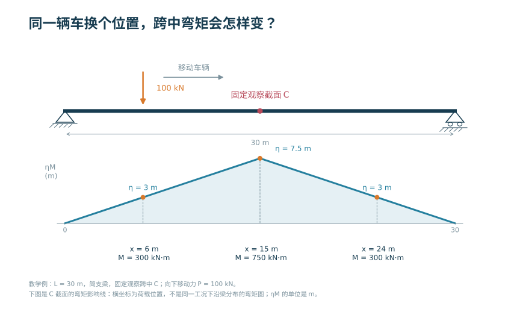<span>同一辆车换个位置，跨中弯矩会怎样变？</span></a><a href="#fig-priority-F10">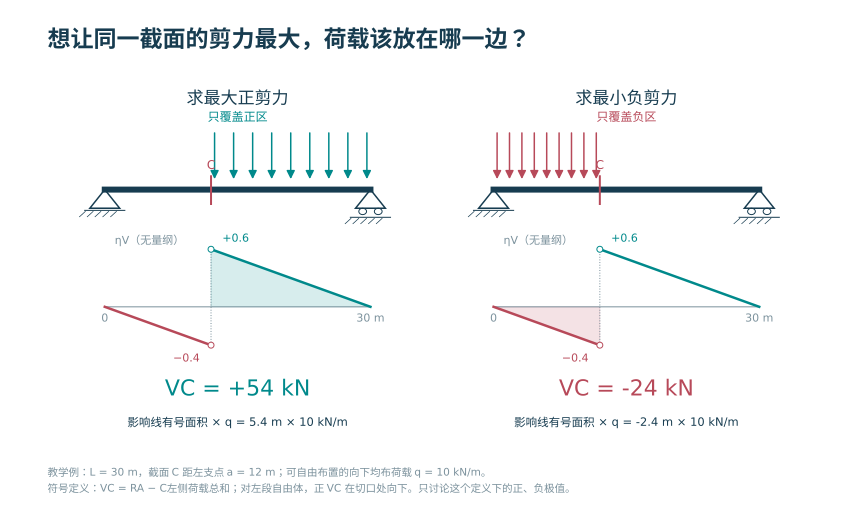<span>想让同一截面的剪力最大，荷载该放在哪一边？</span></a><a href="#fig-priority-F11">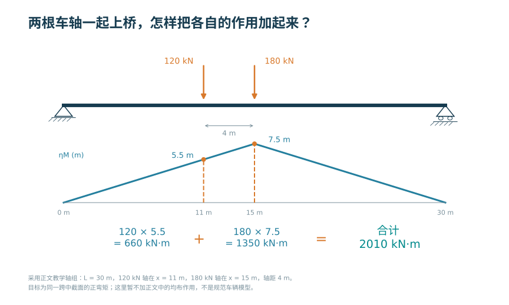<span>两根车轴一起上桥，怎样把各自的作用加起来？</span></a><a href="#fig-priority-F12">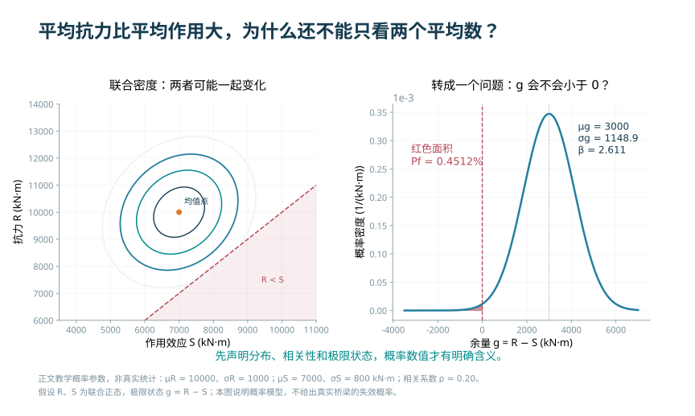<span>平均抗力比平均作用大，为什么还不能只看两个平均数？</span></a></div></details>
<!-- PRIORITY-CHAPTER-GALLERY END -->

<h2>本章的核心思考</h2><p class="core-thesis">先定义输出，再组织作用与概率。</p><ol><li>组合的是同一目标的有符号效应。</li><li>区分内力图和影响线的输入、输出角色。</li><li>把平均余量与不确定性同时带入判断。</li></ol><div class="core-analogy"><h3>跨课程类比</h3><p>结构力学单位作用 → 移动加载；概率论余量分布 → 可靠度</p><p><strong>反例与边界：</strong>不同工况的各自极值不一定同时发生；正态线性模型不能包办全部尾部风险。</p></div><p>建议课堂集中完成标为“课堂核心”的3个单元，其余单元用于课前观察和课后迁移。每个单元配独立短视频、操作实验、目标检验与开放论证题。</p><div class="core-unit-grid"><article><p class="core-tag">C03U01 · 课前/课后迁移</p><h3>作用大小与响应大小之间隔着模型</h3><p>荷载加倍时线性模型的反力加倍，但比例系数由位置和边界决定。</p><p><a href="../interactive/core-learning.html?unit=C03U01" target="_blank">操作与迁移任务</a> · <a href="../interactive/core-learning.html?unit=C03U01&amp;view=video" target="_blank">观看短视频</a></p></article><article><p class="core-tag">C03U02 · 课前/课后迁移</p><h3>等效荷载同时保留力和矩</h3><p>把点荷载分配到相邻节点，要同时保留合力与一阶矩。</p><p><a href="../interactive/core-learning.html?unit=C03U02" target="_blank">操作与迁移任务</a> · <a href="../interactive/core-learning.html?unit=C03U02&amp;view=video" target="_blank">观看短视频</a></p></article><article><p class="core-tag">C03U03 · 课堂核心</p><h3>组合不是把所有最大值相加</h3><p>伴随作用的贡献随组合系数改变，负贡献也必须保留符号。</p><p><a href="../interactive/core-learning.html?unit=C03U03" target="_blank">操作与迁移任务</a> · <a href="../interactive/core-learning.html?unit=C03U03&amp;view=video" target="_blank">观看短视频</a></p></article><article><p class="core-tag">C03U04 · 课前/课后迁移</p><h3>瀑布图读的是代数贡献</h3><p>反向作用可以减小某个目标响应，但对另一个截面未必有利。</p><p><a href="../interactive/core-learning.html?unit=C03U04" target="_blank">操作与迁移任务</a> · <a href="../interactive/core-learning.html?unit=C03U04&amp;view=video" target="_blank">观看短视频</a></p></article><article><p class="core-tag">C03U05 · 课堂核心</p><h3>从安全余量走到失效概率</h3><p>抗力均值不变时，提高效应均值会减少可靠指标。</p><p><a href="../interactive/core-learning.html?unit=C03U05" target="_blank">操作与迁移任务</a> · <a href="../interactive/core-learning.html?unit=C03U05&amp;view=video" target="_blank">观看短视频</a></p></article><article><p class="core-tag">C03U06 · 课前/课后迁移</p><h3>不确定性本身也改变结论</h3><p>均值差相同时，效应离散程度增加通常降低本模型的可靠指标。</p><p><a href="../interactive/core-learning.html?unit=C03U06" target="_blank">操作与迁移任务</a> · <a href="../interactive/core-learning.html?unit=C03U06&amp;view=video" target="_blank">观看短视频</a></p></article><article><p class="core-tag">C03U07 · 课前/课后迁移</p><h3>相关性进入余量的方差</h3><p>抗力与效应之差的方差包含相关项，不能只把两个方差相加。</p><p><a href="../interactive/core-learning.html?unit=C03U07" target="_blank">操作与迁移任务</a> · <a href="../interactive/core-learning.html?unit=C03U07&amp;view=video" target="_blank">观看短视频</a></p></article><article><p class="core-tag">C03U08 · 课堂核心</p><h3>移动荷载：固定输出再移动输入</h3><p>影响线的横坐标是荷载位置，不是正在查看的截面位置。</p><p><a href="../interactive/core-learning.html?unit=C03U08" target="_blank">操作与迁移任务</a> · <a href="../interactive/core-learning.html?unit=C03U08&amp;view=video" target="_blank">观看短视频</a></p></article><article><p class="core-tag">C03U09 · 课前/课后迁移</p><h3>正、负区段要分别构造不利布载</h3><p>连续梁同一截面影响线存在正负区，求最大与最小值必须改变允许布载区段。</p><p><a href="../interactive/core-learning.html?unit=C03U09" target="_blank">操作与迁移任务</a> · <a href="../interactive/core-learning.html?unit=C03U09&amp;view=video" target="_blank">观看短视频</a></p></article><article><p class="core-tag">C03U10 · 课前/课后迁移</p><h3>可靠度模型先做可解释的核验</h3><p>提高抗力均值会增大余量；公式方向检查是程序核验的第一步。</p><p><a href="../interactive/core-learning.html?unit=C03U10" target="_blank">操作与迁移任务</a> · <a href="../interactive/core-learning.html?unit=C03U10&amp;view=video" target="_blank">观看短视频</a></p></article></div><p><a href="../core-thinking.html">返回全书核心思维与尺度规律</a> · <a href="../core-resources.html">查看110个教学单元总索引</a> · <a href="../interactive/thinking-analogies.html">打开跨课程并排类比</a></p></div>
<!-- CORE-ROUTE END -->


::: {.chapter-objectives}
**学习目标。** 完成本章学习后，学生应能够：按照设计状况识别桥梁上的永久作用、可变作用、偶然作用和地震作用；说明标准值、组合值、频遇值与准永久值的含义；建立作用清单并判断作用之间的同时出现关系；针对承载能力极限状态和正常使用极限状态形成可复核的组合；建立简单极限状态函数，解释可靠指标、失效概率及分项系数设计方法之间的联系；利用交互图判断作用参数、抗力参数及相关性变化对控制组合和可靠度的影响。
:::

::: {.source-note}
**编写口径。** 本章的作用分类、代表值和组合原则以现行公路桥涵设计通用规范为依据。正文中的通式用于说明组合结构，不替代规范条文；带有具体数值的概率参数和组合系数均明确标为“教学参数”。工程设计应根据桥梁类别、设计状况、验算项目和采用的现行规范逐项查定，并保存条文版本与计算依据。
:::

<div class="chapter-video-strip"><figure class="chapter-video-card"><video controls preload="metadata" playsinline poster="../assets/videos/manim/posters/M05_combination_waterfall.png" src="../assets/videos/manim/M05_combination_waterfall.mp4"></video><figcaption>M05　作用组合与瀑布图</figcaption></figure></div>

## 作用分析的对象与任务


桥梁在施工和使用过程中承受结构自重、预加力、车辆、人群、温度、风、水流、撞击和地震等作用。作用分析并不是把可能出现的荷载全部相加，而是依次完成四项工作：确定作用来源和施加范围；将作用转化为与结构模型相匹配的计算量；判断不同作用在特定设计状况下是否可能同时出现；计算各有效组合在控制截面或控制构件上的效应并形成包络。

施加于结构上的集中力、分布力或力矩属于直接作用；使结构产生外加变形或约束变形的原因属于间接作用。车辆轮载、风压力和结构重力可直接施加为节点荷载、线荷载或面荷载；温度变化、支座位移、基础变位、混凝土收缩与徐变则通常通过初应变、强迫位移或时变材料模型进入分析。二者最终都可能形成内力、应力、变形、裂缝、位移或振动等效应。

主要作用从外部输入到地基的基本传递层级见 @fig-ch02-action-path。

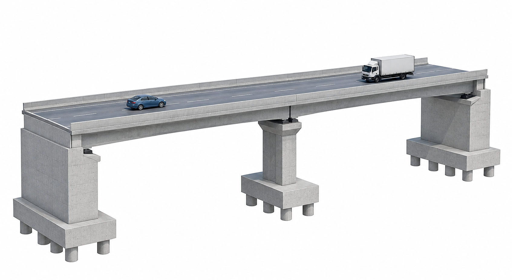{#fig-ch02-action-path width=88%}

::: {.source-note}
**图源。** 课程组依据本章传力关系自行绘制，脚本见 `latex样章/generate_figures.py`。图中仅表达作用类别、方向和传递层级，不对应特定工程，也不替代实际桥梁的计算简图。
:::

竖向作用经桥面铺装、桥面板、主梁、支座、墩台及基础传至地基；纵向制动力、温度伸缩和地震惯性力的传递取决于固定支座位置、活动支座方向、墩台刚度及伸缩装置约束；横向风作用和曲线桥离心力还可能引起横向弯曲、扭转与支座反力重分配。同一种作用在不同体系和边界条件下会形成不同效应。

#### 与结构设计原理课程的衔接

“桥梁工程”重点解决桥位环境、结构体系、施工与运营条件如何转化为作用模型，输出控制截面的作用效应 $S$；“结构设计原理”重点研究材料和截面如何形成抗力 $R$，以及构件在弯曲、受剪、受压、受拉和扭转等状态下如何验算。两门课程在极限状态函数处衔接：

$$
g(\mathbf X)=R(\mathbf X_R)-S(\mathbf X_S).
$$

完整设计链为“设计状况—作用—结构模型—作用效应—截面抗力—极限状态验算”。桥梁课程不能用未经说明的“总荷载”替代作用分析，结构设计课程也不能脱离具体组合只讨论截面承载力。

## 作用分类、代表值与数据来源


#### 按时间变化性质分类

按随时间变化的性质，公路桥梁结构上的作用通常分为永久作用、可变作用、偶然作用和地震作用。分类决定代表值、组合方式和安全度处理。

| 类别 | 基本特征 | 常见项目 | 建模与组合要点 |
|---|---|---|---|
| 永久作用 | 持续存在，量值变化较小，或变化具有单调性并趋于限值 | 结构重力及附加重力、预加力、土重与土侧压力、收缩徐变、水浮力、基础变位作用等 | 分项记录有利与不利效应；反映施工阶段、材料龄期与体系转换 |
| 可变作用 | 随时间变化，量值变化不可忽略 | 汽车荷载及冲击、离心力、制动力、人群、疲劳荷载、风、流水、冰、波浪、温度和支座摩阻等 | 判断位置、方向和同时出现关系；分别枚举可能主导项并取包络 |
| 偶然作用 | 不一定出现，一旦出现通常量值较大、持续时间较短 | 船舶、漂流物或汽车撞击等 | 仅在相应偶然设计状况下组合 |
| 地震作用 | 地震地面运动引起的结构动力作用 | 地震惯性作用及相关地基变形影响 | 按设防水准和抗震规范建立模型与组合 |

各类作用的时间属性、代表值与组合接口概括见 @fig-ch02-action-categories。

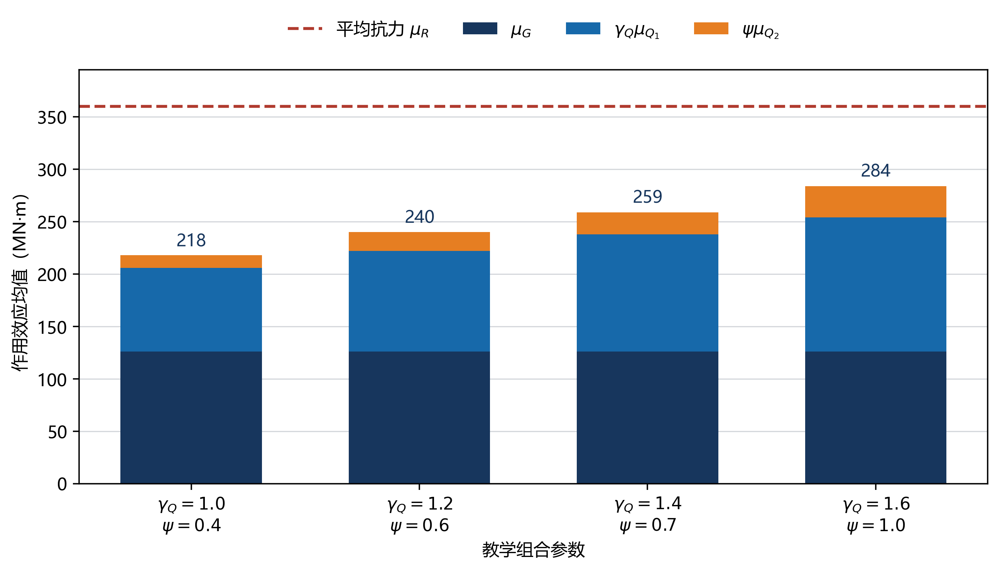{#fig-ch02-action-categories width=92%}

::: {.source-note}
**图源。** 课程组依据现行规范的分类框架自行绘制，脚本见 `latex样章/generate_figures.py`。具体作用项目、符号和组合规定以项目采用的现行规范为准。
:::

同一种物理因素在不同计算对象或阶段可能有不同处理方式。预加力在整体分析中作为作用考虑，预应力钢筋在截面抗力计算中又是构件组成的一部分；基础变位作为强迫位移输入时不表现为外力，但在超静定体系中能够形成附加内力；温度均匀变化对自由伸缩的简支梁主要引起位移，对受约束连续体系则可能产生轴力和支座水平力。分类必须与设计状况、结构体系和验算对象同时确定。

#### 按空间作用方式分类

<!-- FORMULA-SCAFFOLD ch02 START -->
::: {.formula-scaffold}
**先看这个问题。** 真实荷载可以压在一片表面上，模型却只记录有限个节点。怎样把这一片荷载交给节点，同时保留它对模型做功的效果？

<div class="meaning-flow" role="img" aria-label="面或体上的分布作用，然后按位移插值分配，然后节点上的等效作用"><span>面或体上的分布作用</span><span>按位移插值分配</span><span>节点上的等效作用</span></div>
<details><summary>这组符号分别指什么？</summary><p>fₑ 是单元的节点作用；b 是体内分布力，t 是表面分布力；Ωₑ 是单元内部，Γₑ 是受力边界。N 描述节点之间如何移动，转置号不是材料参数。先检查合力与合矩；梁单元的等效节点作用还可能含端弯矩。</p></details>
:::
<!-- FORMULA-SCAFFOLD ch02 END -->

作用可表示为集中作用、线分布作用、面分布作用或体积作用。汽车轮载是局部集中作用，经过桥面铺装和桥面板扩散后可转化为板或梁的等效作用；栏杆、人行道、防撞护栏常沿桥纵向表示为线分布作用；风压力和水压力作用于结构表面；结构重力来自材料密度与构件体积。离散模型中的等效节点荷载应保持合力和合力矩一致。对单元域 $\Omega_e$ 内的分布作用 $\mathbf b$，一致节点荷载可写为

$$
\mathbf f_e=\int_{\Omega_e}\mathbf N^{\mathrm T}\mathbf b\,\mathrm d\Omega
+\int_{\Gamma_e}\mathbf N^{\mathrm T}\mathbf t\,\mathrm d\Gamma,
$$

其中 $\mathbf N$ 为形函数矩阵，$\mathbf t$ 为边界分布力。杆系模型采用等效线荷载时，应说明从桥面面荷载到主梁线荷载所用的横向分配假定。

#### 作用清单

工程模型应为每项作用保存：名称与编号、规范类别、方向、作用区域、单位、代表值、时间特征、互斥或从属关系、适用设计状况、效应符号约定、数据或条文来源。作用清单既是自动组合的输入，也是模型审查和结果追溯的基础。

### 作用代表值与建模

#### 标准值与伴随值

作用标准值是作用的基本代表值。可变作用在组合中还可能采用组合值、频遇值和准永久值：

$$
Q_{\mathrm c}=\psi_{\mathrm c}Q_k,\qquad
Q_{\mathrm f}=\psi_{\mathrm f}Q_k,\qquad
Q_{\mathrm q}=\psi_{\mathrm q}Q_k.
$$

$Q_k$ 为标准值；$\psi_{\mathrm c}$、$\psi_{\mathrm f}$、$\psi_{\mathrm q}$ 分别为组合值、频遇值和准永久值系数。三者反映不同组合情景和持续水平，不能只按大小互相替代。作用设计值通常写为

$$F_d=\gamma_FF_{\mathrm{rep}},$$

其中 $F_{\mathrm{rep}}$ 为相应代表值，$\gamma_F$ 为作用分项系数。分项系数取值与极限状态、作用类别以及作用对验算结果有利或不利有关。工程计算不应给全部永久作用统一套用一个系数，也不应把承载能力极限状态系数直接用于正常使用验算。

#### 结构重力与施工阶段

构件单位长度重力可由材料重度和几何面积计算：

$$q_G(x)=\sum_m\gamma_mA_m(x),$$

式中 $\gamma_m$ 为第 $m$ 类材料的重度，$A_m(x)$ 为相应材料在位置 $x$ 的截面面积。桥面铺装、防水层、护栏、管线和检修设施应单独列项，以便厚度、材料或布置变化时更新。预制构件吊装、湿接缝浇筑、桥面铺装和成桥运营阶段的重力在不同体系上形成，施工阶段分析不能把它们一次施加于成桥体系。

设第 $k$ 阶段新增作用为 $\Delta\mathbf P_k$，该阶段响应算子为 $\mathbf H_k$，在线弹性且暂不计时变效应时，最终响应可表示为

$$\mathbf r=\sum_{k=1}^{m}\mathbf H_k\Delta\mathbf P_k.$$

每一项使用作用施加当时的体系。这说明即使最终几何相同，施工顺序改变时恒载内力也可能不同。混凝土桥还应考虑加载龄期、收缩徐变、弹性模量发展、预应力损失和合龙温度。

#### 预加力与基础变位

预加力既产生直接轴力和弯矩，也可能在超静定结构中形成次内力。模型应记录钢束线形、张拉批次、锚固端、摩阻与损失假定。基础变位属于间接作用。若自由度分为未知位移 $\mathbf u_f$ 和给定位移 $\mathbf u_p$，则

$$
\begin{bmatrix}\mathbf K_{ff}&\mathbf K_{fp}\\\mathbf K_{pf}&\mathbf K_{pp}\end{bmatrix}
\begin{bmatrix}\mathbf u_f\\\mathbf u_p\end{bmatrix}
=\begin{bmatrix}\mathbf P_f\\\mathbf P_p\end{bmatrix},
$$

从而 $\mathbf K_{ff}\mathbf u_f=\mathbf P_f-\mathbf K_{fp}\mathbf u_p$。给定位移通过约束转化为等效作用。静定和超静定体系对支座沉降的敏感性不同，必须由约束与冗余联系判断。

#### 交通、温度与环境作用

汽车荷载按规范规定的车道荷载或车辆荷载模型布置，并依据纵、横向最不利位置计算效应。冲击作用反映车辆—桥梁动力相互作用的简化影响；制动力沿行车方向作用，其传递与支座布置和墩梁连接有关；曲线桥离心作用与车速、曲线半径和交通作用相关。

均匀温差下自由伸长为

$$\Delta L=\alpha_TL\Delta T,$$

其中 $\alpha_T$ 为线膨胀系数。若伸缩完全受限，理想弹性杆约束应力为 $\sigma_T=E\alpha_T\Delta T$；实际约束程度由支座、桥墩、基础、伸缩装置和连续性共同决定。温度梯度引起非均匀自由应变，可能产生曲率、翘曲和自平衡应力。

风、水流、冰和波浪作用根据桥位环境、暴露面积、结构形状和动力特性确定。大跨或柔性桥梁可能需要风洞试验、抖振、涡振或流固耦合研究，一般静力等效作用不能涵盖全部问题。

## 设计状况、极限状态与组合


持久设计状况对应正常使用阶段；短暂设计状况对应施工、架设或维修；偶然设计状况对应撞击等低概率事件；地震设计状况对应规定设防水准的地震作用。不同设计状况的结构体系、边界条件、材料状态、作用清单和性能要求可能不同。

承载能力极限状态包括达到构件或连接承载能力、整体或局部失稳、结构转变为机动体系及出现不适于继续承载的过大变形等，通常写为

$$S_d\le R_d.$$

抗弯、抗剪、抗扭、局部承压和整体稳定分别对应不同验算，不能用一个笼统“承载力”覆盖。

正常使用极限状态控制影响运营、耐久、舒适或外观的变形、应力、裂缝和振动。频遇组合、准永久组合及其他规定组合随验算项目选用，不能相互替换。

| 比较项 | 承载能力极限状态 | 正常使用极限状态 |
|---|---|---|
| 主要问题 | 是否丧失承载能力或稳定性 | 是否满足使用、耐久和舒适要求 |
| 典型效应 | 弯矩、剪力、轴力、扭矩及其组合 | 应力、挠度、裂缝、振动 |
| 常用组合 | 基本、偶然、地震组合等 | 频遇、准永久及规定组合 |
| 课程接口 | 进入截面承载力或稳定验算 | 进入应力、裂缝和变形验算 |

### 作用效应与组合原则

以 $F_1,F_2,\ldots,F_n$ 表示作用，作用效应为

$$S=S(F_1,F_2,\ldots,F_n).$$

在线弹性、小变形且边界不变时可叠加：

$$S=\sum_{i=1}^{n}S_i.$$

各单项效应必须对应同一模型、同一位置、同一响应分量、同一单位和同一符号约定。存在材料或几何非线性、接触开闭、拉索松弛、支座脱空或体系转换时，应在相应组合下直接分析。

#### 同时出现与主导作用轮换

作用组合首先是工程情景判断。可能同时出现的作用才进入同一组合；物理上互斥的状态必须排除；由另一作用派生的从属项要保持关联。可用兼容矩阵 $C_{ij}$ 表示作用关系：$C_{ij}=1$ 表示允许同时出现，$C_{ij}=0$ 表示互斥，另设规则记录“若 A 出现则 B 随之出现”。

设第 $k$ 个可变作用为主导项，在线性效应下候选组合可概括为

$$
S_d^{(k)}=\gamma_0\left[
\sum_i\gamma_{G_i}S_{G_i}
+\gamma_{Q_k}\gamma_{L_k}S_{Q_k}
+\sum_{j\ne k}\psi_{c,j}\gamma_{Q_j}\gamma_{L_j}S_{Q_j}
\right].
$$

所有单项效应均须对应同一控制位置和响应分量。控制包络为

$$S_d^+=\max_kS_d^{(k)},\qquad S_d^-=\min_kS_d^{(k)}.$$

最大正弯矩、最小负弯矩、最大剪力和最大支反力可能由不同组合控制。“控制组合”必须同时报告对象、截面、效应类型和设计状况。

自动组合依次完成：建立清单；建立兼容和从属规则；选择极限状态与代表值；轮换主导作用；判断有利与不利效应；形成最大、最小包络；保存组合编号、系数、单项效应、代数和、条文来源与程序版本。只输出最大值而不保存组成，会使结果不可复核。

### 承载能力与正常使用组合

持久和短暂设计状况的基本组合可用下列一般结构表示：

$$
S_{\mathrm{ud}}=\gamma_0S\!\left(
\sum_i\gamma_{G_i}G_{ik},\;
\gamma_{Q_1}\gamma_{L_1}Q_{1k},\;
\sum_{j=2}^{n}\psi_{c,j}\gamma_{Q_j}\gamma_{L_j}Q_{jk}
\right).
$$

$S_{\mathrm{ud}}$ 为承载能力极限状态组合效应；$\gamma_0$、$\gamma_G$、$\gamma_Q$、$\gamma_L$ 和 $\psi_c$ 的定义、取值及适用条件按现行规范核定。偶然和地震作用不作为普通伴随变量加入持久状况基本组合，而应按相应设计状况处理。

正常使用极限状态的频遇组合和准永久组合可概括为

$$
S_{\mathrm{fd}}=S\!\left(\sum_iG_{ik},\;\psi_{f,1}Q_{1k},\;\sum_{j=2}^{n}\psi_{q,j}Q_{jk}\right),
$$

$$
S_{\mathrm{qd}}=S\!\left(\sum_iG_{ik},\;\sum_{j=1}^{n}\psi_{q,j}Q_{jk}\right).
$$

频遇组合描述较为频繁出现的作用水平，准永久组合反映较长期持续的水平。预应力混凝土桥的施工与使用阶段应力、抗裂、裂缝及长期挠度可能采用不同组合，须逐项建立验算清单。

## 组合效应、程序实现与结果审计


教学算例中各组合项的带符号增量及累计效应见 @fig-ch02-waterfall。

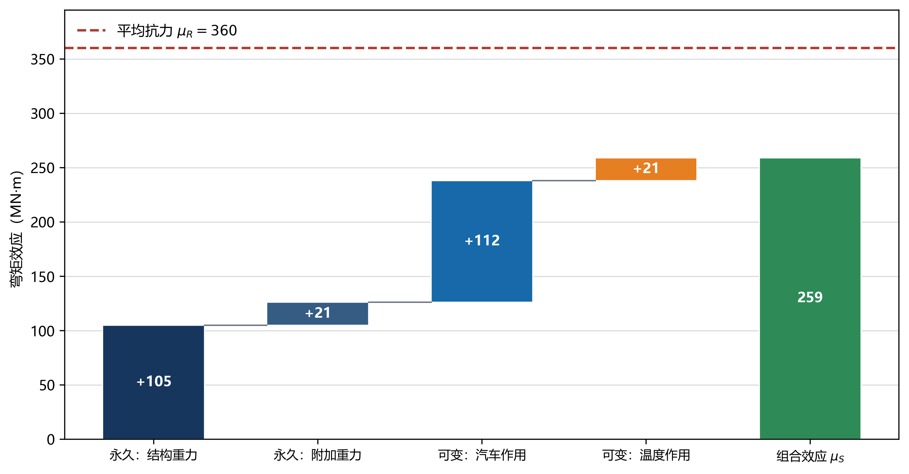{#fig-ch02-waterfall width=86%}

::: {.source-note}
**图源。** 课程组依据教学算例自行生成，脚本见 `latex样章/generate_figures.py`。图中数值仅用于说明各项增量和累计结果，不作为规范系数或工程设计值。
:::

瀑布图只保留组合项、带符号增量和合计结果。向右条形增加所考察响应，向左条形减小该响应。“不利”不固定等同于正号，而是指使所验算极限状态更接近控制边界的方向。若单项效应为 $S_i$、组合乘子为 $c_i$，第 $r$ 项后的累计值为

$$C_r=\sum_{i=1}^{r}c_iS_i.$$

图中显示 $c_iS_i$，数据表仍保留 $S_i$ 与 $c_i$。若把系数预先乘入模型荷载，又在组合模块重复乘入，就会造成双重放大。

<div class="embed-wrap"><iframe loading="lazy" src="../interactive/ch02-load-combination-waterfall.html" title="作用组合瀑布图"></iframe></div>

::: {.digital-note}
**数字资源3-1　作用组合瀑布图。** 输入单项效应、分项系数与组合值系数，显示各项增量、累计值和控制组合。资源以“参数—公式—增量—累计值”的顺序呈现，并同步校验单位、效应方向和组合项重复使用情况。
:::

### 算例：连续梁控制截面的组合

以三跨连续梁中支点截面为教学对象，比较结构重力、附加重力、预加力、汽车荷载、温度梯度和支座沉降对支点弯矩的贡献。下列数据均为教学参数；$c_i$ 表示应由采用规范确定的组合乘子。

| 作用项 | 单项支点弯矩/(kN·m) | 方向说明 | 组合乘子 |
|---|---:|---|---|
| 主梁结构重力 $G_1$ | $-8200$ | 负弯矩 | $c_{G1}$ |
| 桥面附加重力 $G_2$ | $-2100$ | 负弯矩 | $c_{G2}$ |
| 预加力 $P$ | $+1650$ | 抵消部分负弯矩 | $c_P$ |
| 汽车荷载 $Q_1$ | $-3600$ | 最不利布载结果 | $c_{Q1}$ |
| 温度梯度 $Q_2$ | $-720$ | 本温度模式结果 | $c_{Q2}$ |
| 支座沉降 $G_s$ | $+480$ | 本沉降方向结果 | $c_s$ |

$$M_d=-8200c_{G1}-2100c_{G2}+1650c_P-3600c_{Q1}-720c_{Q2}+480c_s.$$

先核对单项工况：重力与支反力是否平衡；汽车是否按支点负弯矩影响线布置；预加力符号是否与束形一致；正、负温度模式是否均已计算；支座沉降方向是否与给定位移一致。随后代入规范乘子，并形成最大负弯矩、最大正弯矩和支座反力包络。组合弯矩只是截面设计输入，还应依据材料规范完成抗弯、抗剪、抗扭、应力、抗裂或裂缝等验算。

## 可靠度、失效域与方法边界


令抗力为 $R$、作用效应为 $S$，极限状态函数为

$$g(R,S)=R-S.$$

$g>0$ 为安全域，$g=0$ 为极限状态边界，$g<0$ 为失效域。这里的“失效”表示达到所定义的极限状态，不必然等于桥梁整体倒塌。抗弯可采用 $g=M_R-M_S$，挠度可采用 $g=f_{\mathrm{lim}}-f$，裂缝宽度可采用 $g=w_{\mathrm{lim}}-w$。

$$
P_f=P[g(\mathbf X)\le0]
=\int_{g(\mathbf x)\le0}f_{\mathbf X}(\mathbf x)\,\mathrm d\mathbf x.
$$

失效概率由极限状态边界、变量联合分布和相关性共同决定，只比较 $R$ 与 $S$ 的平均值不能得到 $P_f$。

#### 边缘分布

抗力与作用效应边缘密度的相对位置及失效重叠区域见 @fig-ch02-marginals。

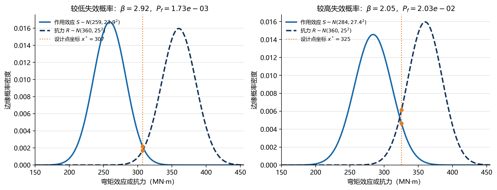{#fig-ch02-marginals width=88%}

::: {.source-note}
**图源。** 课程组依据正态分布教学模型自行生成，脚本见 `latex样章/generate_figures.py`。均值与标准差为教学参数。
:::

两条边缘密度曲线的重叠有助于直观理解，但重叠面积本身并不一般等于 $P(R\le S)$。若 $R$ 与 $S$ 为正态变量、相关系数为 $\rho_{RS}$，差变量 $Z=R-S$ 满足

$$\mu_Z=\mu_R-\mu_S,$$

$$\sigma_Z=\sqrt{\sigma_R^2+\sigma_S^2-2\rho_{RS}\sigma_R\sigma_S}.$$

在线性正态模型下，

$$\beta=\frac{\mu_Z}{\sigma_Z},\qquad P_f=\Phi(-\beta).$$

该闭式结果只适用于相应分布和线性极限状态假定。实际变量可能非正态，函数可能非线性，需要采用一阶可靠度方法、响应面或蒙特卡罗模拟。

#### 二维联合密度与失效边界

联合样本、极限状态直线以及失效域之间的几何关系见 @fig-ch02-joint-2d。

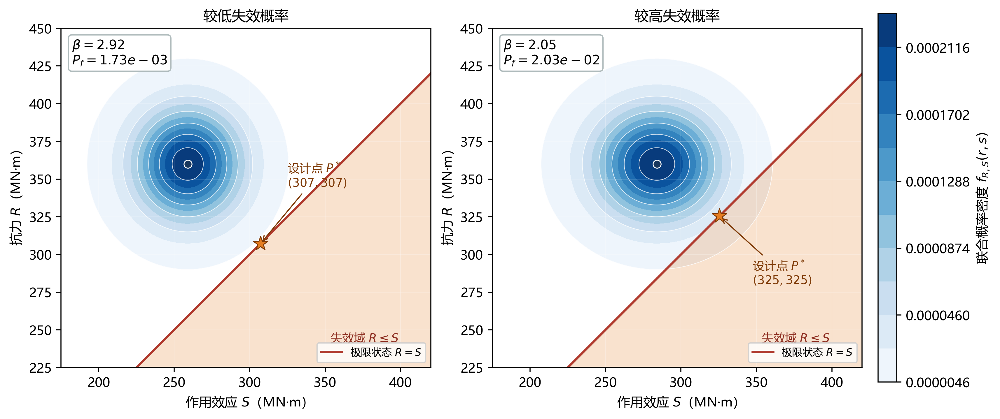{#fig-ch02-joint-2d width=90%}

::: {.source-note}
**图源。** 课程组依据二维联合概率模型自行生成，脚本见 `latex样章/generate_figures.py`。散点表示抽样结果，参数为教学设置。
:::

直线 $R-S=0$ 将样本空间分成安全域和失效域，位于 $R<S$ 一侧的散点为失效样本。图中同时标注密度中心、边界和代表性失效点，使“概率密度较高的位置”与“是否失效”两个概念分开。分布中心远离边界且离散性较小时，失效点较少；中心接近边界或离散性增大时，失效点增多。

相关性改变联合密度椭圆方向。由 $\sigma_Z$ 可见，在本线性差值模型中，正相关可能减小差变量方差，负相关可能增大差变量方差，但该结论不能无条件推广到任意非线性函数。相关系数须来自共同物理来源、统计资料或有依据的假定。

#### 三维联合密度

二维随机变量的联合密度曲面及其在抗力—效应平面上的投影见 @fig-ch02-joint-3d。

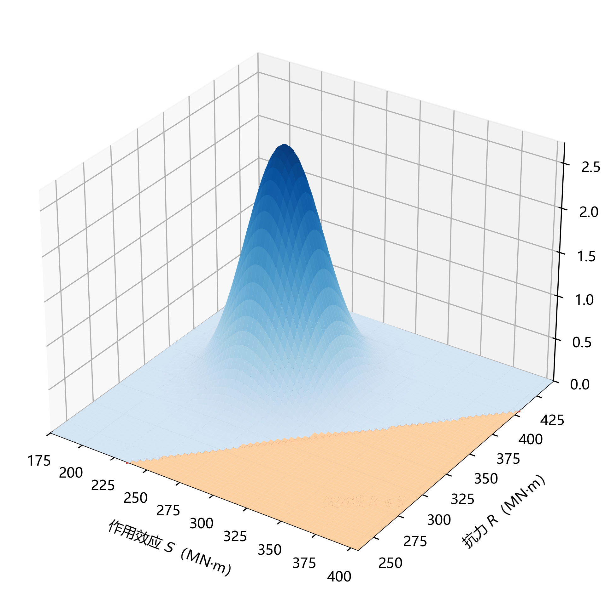{#fig-ch02-joint-3d width=88%}

::: {.source-note}
**图源。** 课程组依据二维联合概率密度模型自行生成，脚本见 `latex样章/generate_figures.py`。三维曲面用于说明密度峰、离散范围与参数变化。
:::

曲面高度表示 $f_{R,S}(r,s)$，不是抗力或效应本身。改变均值会移动密度峰，改变标准差会改变展宽与峰高，改变相关系数会使等密度线旋转。交互版在底面投影 $R-S=0$ 边界，避免因透视角度把峰高误解为安全储备。

作用与抗力统计参数变化对可靠指标和失效概率的影响见 @fig-ch02-parameter。

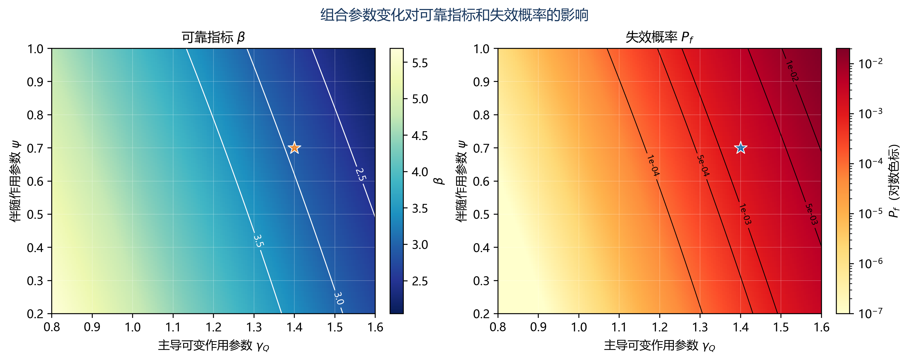{#fig-ch02-parameter width=90%}

::: {.source-note}
**图源。** 课程组依据线性正态教学模型自行生成，脚本见 `latex样章/generate_figures.py`。参数区间不代表规范目标可靠指标或工程统计结论。
:::

参数图从方向、斜率和适用区间阅读。设参数为 $x_i$，局部敏感性可用中心差分估计：

$$I_i=\frac{\beta(x_i+\Delta x_i)-\beta(x_i-\Delta x_i)}{2\Delta x_i}.$$

量纲不同的参数可用 $I_i^*=(x_i/\beta)I_i$ 比较。敏感性排序不等同于设计优先级，还要结合可控性、成本、耐久性和失效后果。

### 蒙特卡罗模拟与抽样误差

#### 一阶可靠度方法的几何解释

一般极限状态函数含多个非正态变量。可通过相应概率变换把基本变量映射到独立标准正态空间 $\mathbf u$，极限状态边界写为 $G(\mathbf u)=0$。在该空间中，距离原点最近的边界点 $\mathbf u^*$ 称为设计点，可靠指标为

$$\beta=\|\mathbf u^*\|.$$

设计点不是均值点，也不是人为选取的“最危险参数组”，而是在所设概率模型和极限状态下对失效概率贡献最大的附近位置。极限状态在设计点处线性化后，可近似计算 $P_f\approx\Phi(-\beta)$。若边界曲率较大、存在多个设计点或变量分布尾部复杂，一阶近似需要由更高阶方法或模拟验证。

设计点方向余弦可用于解释变量对可靠指标的局部贡献。对标准正态空间的单位法向量 $\boldsymbol\alpha$，分量绝对值较大表示该变量在当前设计点附近较敏感。它不同于直接改变原变量的参数敏感性，报告时应说明所用空间和变换。

#### 两组失效概率对比

设置两组教学参数：A组使抗力均值与作用效应均值分离较大且离散性较小，B组缩小均值差或增大离散性。两组均使用相同样本量和随机种子绘制二维散点，使失效点数量的差异来自参数而非抽样显示差异。静态版应并列输出：边缘密度、二维联合密度、失效边界、失效点、$P_f$、$\beta$ 和标准误差。

比较时不以“红点多就是一定不安全”结束。A、B两组只是说明概率模型变化；是否满足工程要求，还需结合极限状态类型、设计基准期和目标可靠水平。若样本量不足，红点数量的随机波动可能较大，应同时查看置信区间。

### 作用组合的程序实现

作用表可用结构化数据表示。每个工况至少含 `case_id`、`category`、`direction`、`representative_value`、`design_situation`、`exclusive_group` 和 `source_clause`。单项效应表以构件、截面、阶段和响应分量为索引。程序先验证字段和单位，再生成组合，不把缺失值自动视为零。

组合枚举的伪代码为：

```text
for design_situation in situations:
    active_cases = select_cases(design_situation)
    for limit_state in required_limit_states:
        rules = load_rules(standard_version, limit_state)
        for leading_case in eligible_variable_actions:
            combination = permanent_actions
            combination += leading_action(leading_case)
            combination += accompanying_actions(rules)
            if compatible(combination):
                evaluate_and_store(combination)
envelope(results, by=[member, section, stage, response])
```

`load_rules` 必须绑定规范版本，不能把系数散落在脚本多处。`compatible` 执行互斥和从属规则。`evaluate_and_store` 保存每项贡献和代数和。`envelope` 在同一响应分量内取包络，同时保留控制组合全部成组效应。

程序测试至少包括：只有一个永久作用的最小例；两个互斥作用不得同现；两个可变作用轮换主导项；正负效应包络；有利作用取舍；单位不一致时中止；相同工况不得重复；程序结果与手算表一致。更换规范版本后，全部基准测试重新执行。

### 第二算例：跨中弯矩与支点反力并行包络

对同一三跨连续梁，提取跨中弯矩 $M_c$、中支点负弯矩 $M_p$ 和端支座反力 $R_a$ 的单项效应。车辆移动加载分别针对三个控制量布置，形成三个不同交通工况 $Q_M$、$Q_P$ 和 $Q_R$。若模型软件只导出“全桥最大车辆效应”而无加载位置，应补充影响线或移动荷载结果，避免把三个峰值误认为同一车辆位置。

组合表使用行表示组合、列表示成组响应：

| 组合编号 | 主导作用 | $M_c$ | $M_p$ | $R_a$ | 车辆位置记录 |
|---|---|---:|---:|---:|---|
| U-M-01 | 汽车跨中效应 | 按模型 | 同工况伴随值 | 同工况伴随值 | 主跨正影响区 |
| U-P-01 | 汽车支点效应 | 同工况伴随值 | 按模型 | 同工况伴随值 | 中支点负影响区 |
| U-R-01 | 汽车反力效应 | 同工况伴随值 | 同工况伴随值 | 按模型 | 端支点反力影响区 |

包络后，$M_c$、$M_p$ 与 $R_a$ 可由三行分别控制，但任一构件截面验算使用的轴力、剪力和弯矩应来自同一控制行。瀑布图针对一个控制量展示贡献，组合明细表则保留同一行的全部响应，二者共同避免“峰值拼接”。

从联合分布抽取 $N$ 组样本，可估计

$$
\widehat P_f=\frac{1}{N}\sum_{i=1}^{N}I[g(\mathbf X^{(i)})\le0],
$$

简单独立抽样的标准误差近似为

$$
\operatorname{SE}(\widehat P_f)=\sqrt{\frac{\widehat P_f(1-\widehat P_f)}{N}}.
$$

失效概率很小时，直接模拟需要很大样本量。若没有观察到失效点，不能断言 $P_f=0$；只能说明当前样本量下未观测到失效。采用重要抽样或子集模拟时，应说明抽样分布、权重和收敛检查。

<div class="embed-wrap tall"><iframe loading="lazy" src="../interactive/ch02-reliability-lab.html" title="抗力—作用效应与失效概率实验"></iframe></div>

::: {.digital-note}
**数字资源3-2　失效概率可视化。** 同步显示边缘密度、二维失效域、三维联合密度、$P_f$ 与 $\beta$。内置“较低失效概率”和“较高失效概率”两组参数，并允许调整均值、标准差和相关系数。输出报告样本量和抽样误差。
:::

### 概率参数与模型质量

均值、标准差、变异系数和分布类型应来自规范校准资料、交通统计、材料试验、检测数据库、监测数据或有依据的工程假定。参数报告至少包括变量含义与单位、数据时间范围和样本量、测量或模型误差、分布拟合方法、变量相关性、极限状态函数、计算算法与结果置信区间。

模型不确定性来自计算模型对真实结构的简化。可引入模型修正系数 $\theta$，例如 $S=\theta_SS_{\mathrm{model}}$、$R=\theta_RR_{\mathrm{model}}$，但其统计特征应有试验、对比计算或校准依据。

工程设计一般不对每个构件逐项完成概率积分。规范通过可靠度校准，将目标可靠水平转化为作用分项系数、抗力分项系数、组合值系数及结构重要性等参数。实际设计以规范化表达式实施；概率模型用于解释参数来源、开展敏感性分析和研究特殊问题。

### 数字化学习活动

1. **作用清单与模型映射。** 为一座梁桥建立不少于十二项的作用清单，在三维模型中反向查询每个构件的作用来源与传力路径。
2. **影响线布载与组合。** 显示跨中和中支点弯矩影响线，拖动车辆轴组形成单项效应，再用瀑布图生成组合并比较控制位置。
3. **失效域参数试验。** 分别改变抗力均值和标准差，记录二维失效点、三维密度、$P_f$ 与 $\beta$，区分提高平均抗力和降低离散性的作用。

::: {.callout-tip}
**受控提示词：组合表审查。** 已知桥梁体系、设计状况、极限状态、控制截面、效应类型、作用清单及单项效应。请检查：①单位和符号；②互斥或遗漏作用；③主导作用轮换；④有利与不利效应依据；⑤组合代数和；⑥需人工核对的规范条文。不得补造系数，不得把教学参数解释为规范值。输出“问题—依据—核查项—修正后的符号表达式”。
:::

人工智能工具适合检查一致性、生成组合枚举代码、解释参数变化和整理复核清单。条文有效性、参数取值、模型边界、结构可行性和最终签认仍由使用者负责。

## 规范数据链与设计接口


作用、组合和验算标准不是一张可以脱离项目条件使用的固定系数表。开始计算前，应先确认桥梁服务对象、建设行业、设计阶段、结构材料、桥型、设计状况和项目所在地，再形成“标准—版本—适用内容—采用条款—复核人”清单。公路桥、铁路桥和城市桥梁采用的标准体系及荷载模型并不完全相同，本章通式以公路桥梁教学为主，其他体系不得直接套用。

公路桥梁作用分析通常需要核对下列文件类别：

| 文件类别 | 主要查取内容 | 与本章数据字段的关系 | 使用时的边界检查 |
|---|---|---|---|
| 公路工程技术标准 | 公路功能与技术等级、桥涵设计汽车荷载等级等总体条件 | `project_class`、`traffic_loading_class` | 项目批复、路线标准与桥梁模型是否一致 |
| 桥涵设计通用规范 | 作用分类、代表值、设计状况、组合与总体要求 | `action_category`、`representative_value`、`combination_rule` | 版本、桥梁类别、作用有利性与验算项目 |
| 材料桥梁设计规范 | 混凝土、钢、组合结构等构件验算及其作用效应接口 | `resistance_model`、`section_check` | 组合效应是否与材料规范的验算公式匹配 |
| 专门作用或专项规范 | 地震、风、撞击、船撞、冰、水流及特殊环境 | `design_situation`、`special_action` | 是否达到专项分析、试验或专门研究条件 |
| 施工与养护技术标准 | 施工阶段、临时状态、检查与维护作业 | `stage_id`、`temporary_action` | 成桥模型是否错误替代施工或维修状态 |
| 项目专用技术文件 | 特殊荷载、地方交通、业主性能目标及审查意见 | `project_rule`、`approval_status` | 是否与行业标准协调，是否经过规定程序批准 |

::: {.source-note}
**官方版本回查。** 交通运输部发布《公路桥涵设计通用规范》JTG D60—2015 的公告明确了施行日期及被替代版本，见[交通运输部官方页面](https://xxgk.mot.gov.cn/2020/jigou/glj/202006/t20200623_3312312.html)。现行性还应通过项目启动时的标准目录、后续公告和主管部门要求复核。标准名称和链接可以写入教材作为回查入口，具体系数、限值及条文表格应由使用者查阅合法取得的正式文本；未经许可不得把整表扫描件复制进数字教材。
:::

#### 作用清单的最小字段

一项作用不能只记录名称和大小。可复核作用清单至少包含：

| 字段 | 含义 | 示例形式 |
|---|---|---|
| `case_id` | 唯一工况编号 | `G-DECK-S2` |
| `physical_source` | 物理来源 | 第二施工阶段主梁自重 |
| `category` | 规范分类 | 永久、可变、偶然或地震 |
| `representation` | 代表值类型 | 标准值、组合值、频遇值、准永久值 |
| `spatial_form` | 空间形式 | 集中力、线荷载、面荷载、体力、温度场或强迫位移 |
| `value_unit` | 输入值和单位 | kN、kN/m、kPa、K、mm 等 |
| `coordinate` | 坐标系和正方向 | 总体 $+y$、构件局部 $-z$ |
| `region` | 施加对象和范围 | 第2联第1、2车道或指定构件集合 |
| `stage` | 作用发生的结构状态 | 架梁、合龙、成桥、维修 |
| `relation` | 互斥、从属和共同来源 | 与另一温度模式互斥；由车辆作用派生 |
| `source_clause` | 数据和规则来源 | 标准版本、条款、实测报告或教学假定 |
| `review_status` | 复核状态 | 候选、已核对、已审定 |

使用 SI 单位时仍须在字段中保留单位，因为不同软件可能以 N、kN、m、mm 或 Pa、MPa 为基本单位。温度输入是温差而非绝对温度时，应写明参考温度；基础沉降输入为位移时，应写明方向和支点；风压力、水压力等面作用换算成杆系线荷载时，应保存受压宽度和转换公式。

### 代表值、设计状况与验算任务矩阵

代表值由所研究的时间情景和性能目标决定。标准值是作用基本代表，组合值用于考虑多项可变作用共同出现时的伴随水平，频遇值与准永久值分别服务于较频繁和较长期的使用情景。选择代表值时，先确定验算任务，再调用相应规则；不能先选一个“较小系数”再寻找解释。

| 设计状况 | 结构状态示例 | 需重点建立的作用 | 典型验算问题 | 模型版本要求 |
|---|---|---|---|---|
| 持久 | 完整成桥并正常运营 | 恒载、预加力、交通、温度、风及环境作用 | 承载、应力、裂缝、变形、疲劳与稳定 | 成桥边界、长期材料与运营设施完整 |
| 短暂 | 架设、合龙、顶升、更换支座或交通转换 | 阶段自重、施工设备、临时风、温度和强迫位移 | 临时承载、稳定、线形和局部支承 | 已形成构件和临时约束逐阶段更新 |
| 偶然 | 撞击、局部破坏等相应情景 | 指定偶然作用及允许同时出现的其他作用 | 防倒塌、局部损伤与传力重分配 | 接触、损伤或替代传力路径按任务建立 |
| 地震 | 规定地震输入下的结构状态 | 地震作用及规定的伴随作用 | 构件性能、支承位移、落梁防护和体系完整性 | 质量、阻尼、边界、基础及非线性按抗震任务建立 |

同一物理量可形成多项工况。例如，整体升温、整体降温、正温度梯度和负温度梯度的空间分布、效应方向和互斥关系不同，应分别编号；车辆纵向制动和离心作用由交通状态派生，应保持与相应车辆位置和方向的从属关系；基础变位需要按支点、方向和正负模式建立工况。自动组合系统若只知道“温度”或“沉降”一个名称，无法可靠判断同现关系。

有利和不利是相对于具体极限状态、截面和响应方向而言。预加力对跨中正弯矩可能产生抵消效应，但对支点、施工阶段或局部锚固区可能形成不利效应；恒载对抗倾覆可提供稳定力矩，对构件弯矩又可能不利。因此有利性不应永久写入作用主表，而应在“作用—验算任务”关系表中确定。

### 车辆最不利布载与影响线接口


<!-- PRIORITY-FIGURE F10 START -->
{#fig-priority-F10 width=100% fig-alt="想让同一截面的剪力最大，荷载该放在哪一边？。固定截面剪力影响线在C处有单位跃变。覆盖右侧正区得到+54 kN，覆盖左侧负区得到−24 kN。改变目标符号，需要改变加载区段。"}

<details class="figure-method"><summary>查看模型条件与绘图代码</summary><p>向下均布荷载可独立覆盖任意同号区，非规范车道加载规则；在C左、右紧邻取不同极限值；不为恰落C的集中力指定唯一剪力值</p><p>课程组原创参数绘图 · F10 · <a href="../scripts/priority-figures/group_a.py">绘图 Python</a> · <a href="../scripts/priority-figures/figlib.py">公共绘图函数</a> · <a href="../assets/publication/priority-40/F10.png" download>下载 PNG</a> · <a href="../assets/publication/priority-40/F10.svg" download>下载 SVG</a></p></details>
<!-- PRIORITY-FIGURE F10 END -->


#### 影响线的计算对象


<!-- PRIORITY-FIGURE F09 START -->
{#fig-priority-F09 width=100% fig-alt="同一辆车换个位置，跨中弯矩会怎样变？。移动力相同，跨中弯矩随影响线纵标变化。6 m、15 m、24 m三个位置分别得到300、750、300 kN·m。"}

<details class="figure-method"><summary>查看模型条件与绘图代码</summary><p>线弹性简支梁；固定跨中正弯矩为目标；不含动力放大或车辆规范模型</p><p>课程组原创参数绘图 · F09 · <a href="../scripts/priority-figures/group_a.py">绘图 Python</a> · <a href="../scripts/priority-figures/figlib.py">公共绘图函数</a> · <a href="../assets/publication/priority-40/F09.png" download>下载 PNG</a> · <a href="../assets/publication/priority-40/F09.svg" download>下载 SVG</a></p></details>
<!-- PRIORITY-FIGURE F09 END -->


影响线表示单位移动作用位置变化时某一指定响应的变化。设单位竖向力位于桥面路径坐标 $x$，控制响应为截面弯矩、剪力、支座反力或构件轴力，则影响线写为 $\eta_r(x)$。集中轴载 $P_i$ 位于 $x_i$、均布荷载 $q(x)$ 作用于区间 $\Omega_q$ 时，线性响应为

$$
S_r=\sum_i P_i\eta_r(x_i)+\int_{\Omega_q}q(x)\eta_r(x)\,\mathrm dx.
$$

$\eta_r$ 的量纲随响应而变。单位集中力引起的弯矩影响线纵坐标具有长度量纲，支座反力影响线纵坐标为无量纲。程序接口应保存响应类型、截面位置、加载路径、车道方向、单位力大小和纵坐标单位，不能只导出一串无标题数值。

车辆最不利布载遵循“把作用放到使目标响应增大的影响区”这一原则，但实际荷载模型还包含车道、车辆轴组、规定间距、横向折减、冲击或动力效应等约束。均布部分按相应规则覆盖同号影响区；集中部分在允许范围内移动，使轴组与影响线峰值协调。对于连续梁，正、负影响区可能交替出现；最大跨中正弯矩、最大支点负弯矩和最大支座反力通常对应不同车辆位置。

移动加载计算建议输出成组结果：

$$
\boldsymbol S(x)=
[M_1(x),V_1(x),N_1(x),M_2(x),\ldots,R_a(x)]^{\mathrm T}.
$$

包络可以对每个分量分别取极值，但截面复合验算应回查控制位置 $x^*$ 对应的整组 $N$、$M$、$V$、$T$，避免把不同车辆位置的最大轴力、最大弯矩和最大剪力拼成一个物理上不存在的状态。

#### 影响线与有限元模型交换

杆系模型可通过单位移动节点力、软件移动荷载功能或影响矩阵获得影响线。桥面板和横向分布问题还需定义车辆横向位置、轮迹、桥面板扩散和主梁分配。软件导出应至少包含节点或路径坐标、影响线纵坐标、控制构件、截面端、局部坐标、正负号和模型版本。将车辆作用回写为静力工况后，应复算一个代表位置并与影响线积分结果比较。

::: {.digital-note}
**数字资源3-3　影响线布载器。** 用户选择控制响应后，页面显示正负影响区，允许拖动教学轴组并自动计算各轴 $P_i\eta_r(x_i)$ 和均布项积分。页面始终保留轴重、间距、路径、单位和控制截面；“自动寻优”结果同时显示车辆位置与成组响应，不只显示一个包络数值。内置参数均为教学参数，工程荷载模型须由项目采用规范导入。
:::

### 组合自动枚举与结果审计

#### 规则与效应分离

自动组合系统可分为三层。第一层是作用事实：工况、类别、代表值、方向、阶段和单项效应；第二层是规则：设计状况、极限状态、主导资格、伴随系数、分项系数、互斥和从属关系；第三层是结果：组合编号、每项乘子、贡献、代数和及控制包络。规则不应写死在单项效应文件中，更换规范版本时只替换受控规则集并重新运行基准测试。

若有 $m$ 个可担任主导项的可变作用，并含若干互斥模式，候选组合生成可表示为

$$
\mathcal C=\bigcup_{k=1}^{m}
\left\{\boldsymbol c^{(k,p)}:\ p\in\mathcal P_k,
\ A\boldsymbol z^{(k,p)}\le\boldsymbol b\right\},
$$

其中，$\boldsymbol c$ 为组合乘子，$\boldsymbol z$ 为工况是否出现的0—1向量，$A\boldsymbol z\le\boldsymbol b$ 表示互斥、最多选一项和从属规则，$\mathcal P_k$ 为主导项 $k$ 下允许的模式集合。公式仅表示程序结构，具体规则必须从项目采用标准查取。

组合数量较多时，可先用逻辑约束删除不可能情景，再计算效应；不得按“效应看起来较小”提前删除合法工况。对线性模型，单项效应矩阵 $H$ 与组合向量 $\boldsymbol c$ 相乘：

$$
\boldsymbol S=H\boldsymbol c.
$$

$H$ 的行对应同一位置和响应分量，列对应工况。程序应检查列单位一致、模型版本一致、工况不重复。每个包络结果保存控制列向量，而不是只保存 $\max\boldsymbol S$。

#### 自动组合的审计记录

一条可追溯组合记录至少包含：

```text
combination_id; standard_version; design_situation; limit_state;
leading_case; accompanying_cases; excluded_cases;
member_id; section_id; stage_id; response_component;
base_effects; multipliers; signed_contributions; total;
model_hash; rule_set_hash; reviewer; review_time
```

单元测试应覆盖：全为零效应、单一永久作用、可变作用主导轮换、正负温度互斥、车辆派生项随主工况出现、有利永久作用、单位冲突、模型版本冲突和非线性模型禁止线性叠加。对任一版本，至少选取一个控制截面完成手算，核对程序的每项贡献和总和。

### 承载能力、正常使用与非线性边界

承载能力极限状态关心结构或构件是否达到承载、稳定或整体体系边界；正常使用极限状态关心应力、裂缝、变形、振动和耐久相关的使用性能。两者不仅系数不同，作用代表值、效应类型、分析假定、持续时间和验算抗力也可能不同。构件抗弯设计值不能直接作为裂缝宽度限值，承载组合的最大内力也不能代替长期挠度计算。

建议为每项验算建立任务卡：

| 字段 | 承载能力示例 | 正常使用示例 |
|---|---|---|
| 对象 | 中支点截面抗弯 | 主跨长期挠度 |
| 设计状况 | 持久 | 持久 |
| 代表值与组合 | 按基本组合规则回查 | 按相应频遇或准永久规则回查 |
| 分析模型 | 当前阶段刚度与边界 | 含长期材料效应及实际约束 |
| 输出 | 成组 $N,M,V,T$ | 挠度、应力或裂缝计算输入 |
| 验算接口 | 材料规范的设计抗力 | 相应使用性能限值与计算方法 |

线性叠加成立需要结构刚度、边界和作用路径不随荷载水平或方向改变。以下情况应特别审查：

1. **几何非线性**：斜拉索、主缆、大位移柔性结构和显著 $P$—$\Delta$ 效应使平衡方程依赖变形后几何；
2. **材料非线性**：开裂、屈服、塑性铰和损伤使切线刚度随历史变化；
3. **接触与边界非线性**：支座脱空、限位装置碰撞、摩擦滑移和接缝开闭导致状态切换；
4. **路径依赖**：施工张拉、卸架、合龙、徐变和反复荷载使最终响应依赖加载顺序；
5. **从属动力作用**：气动力、车辆—桥梁相互作用等可能随结构响应改变。

在这些情形下，不能先计算所有单项效应再用代数式相加。应对每个有效组合直接施加作用历程并求解，结果写为

$$
\boldsymbol S^{(k)}=\mathcal N
\!\left(\boldsymbol F^{(k)},\boldsymbol u_0,
\boldsymbol q_0,\mathcal H\right),
$$

其中 $\mathcal N$ 为非线性求解，$\boldsymbol u_0$ 和 $\boldsymbol q_0$ 是初始位移与内力状态，$\mathcal H$ 表示加载历史。组合枚举仍负责生成物理情景，但每个情景需要独立计算。若为提高效率采用线性筛选后再对控制组合非线性复算，应说明筛选可能遗漏的边界并进行敏感性检查。

### 可靠度与分项系数设计的衔接

可靠度分析研究随机变量、模型和极限状态共同作用下的失效概率；分项系数设计把经校准的安全水平转化为工程中易操作的代表值、作用分项系数、组合系数和抗力处理。两者处于同一逻辑链的不同层次，而不是要求每个构件同时做两套互不相干的验算。

以 $g=R-S$ 为例，在标准正态空间的设计点附近，可将设计点对应的抗力和效应概念性写为

$$
R^*=\mu_R-\alpha_R\beta\sigma_R,
\qquad
S^*=\mu_S+\alpha_S\beta\sigma_S,
$$

其中，$\alpha_R$、$\alpha_S$ 表示设计点方向贡献，$\beta$ 为目标可靠水平对应的指标。若标准值或特征值分别为 $R_k$、$S_k$，分项形式可理解为把 $R^*$ 和 $S^*$ 映射为设计抗力与设计效应。实际规范校准还需考虑变量分布、时间变异、模型不确定性、不同极限状态和工程经验，不能由上式自行反推工程分项系数。

分项系数方法的使用顺序为：按规范识别设计状况和极限状态；选取代表值；应用规定组合和作用系数得到 $S_d$；按材料规范得到 $R_d$；完成 $S_d\le R_d$ 或相应验算。可靠度模块用于解释参数来源、比较不确定性、研究非常规结构或更新既有桥梁状态。教材中的 $\beta$ 和 $P_f$ 示例不提供规范目标值，目标可靠水平须从采用的可靠度标准、桥梁规范及项目要求回查。

::: {.source-note}
**引用与版权边界。** 可靠度通式属于教学推导，相关术语可对照 ISO 2394 等正式标准。标准内的目标水平、分项系数表和校准资料受版本与许可约束，本教材只说明关系和查取路径；正式出版如需引用表格，应取得合法文本并按出版规范控制引用范围。
:::

## 贯通算例与计算单


#### 已知教学模型

取计算跨径 $L=30\,\mathrm m$ 的简支梁，考察跨中正弯矩。数值仅用于验证影响线、组合程序和可靠度图，**不是规范荷载或规范系数**。梁的跨中弯矩影响线为

$$
\eta_M(x)=
\begin{cases}
x/2,&0\le x\le15\,\mathrm m,\\
(30-x)/2,&15<x\le30\,\mathrm m.
\end{cases}
$$

纵坐标单位为 m，峰值为 $7.5\,\mathrm m$。设置教学均布荷载 $q=10\,\mathrm{kN/m}$ 覆盖正影响区，两个教学轴载分别为 $120\,\mathrm{kN}$ 和 $160\,\mathrm{kN}$，轴距 $4\,\mathrm m$；将较大轴置于跨中 $x=15\,\mathrm m$，另一轴位于 $x=11\,\mathrm m$。

#### 第一步：计算车辆单项效应

正影响线面积为

$$
A_\eta=\frac12\times30\times7.5=112.5\,\mathrm{m^2},
$$

均布项和轴载项分别为

$$
M_q=qA_\eta=1125\,\mathrm{kN\cdot m},
$$

$$
M_P=120\times5.5+160\times7.5
=1860\,\mathrm{kN\cdot m}.
$$

因此静力教学效应为 $2985\,\mathrm{kN\cdot m}$。为检查程序乘子层级，另设教学动力乘子 $1.04$，则

$$
M_Q=1.04\times2985=3104.4\,\mathrm{kN\cdot m}.
$$

实际工程中，荷载模式、加载范围、轴重、间距、车道和动力效应均应从采用规范查取；本例的 $1.04$ 仅用于检验“动力乘子是否被重复施加”。

#### 第二步：建立单项效应表

| 工况 | 跨中弯矩效应/(kN·m) | 类别 | 说明 |
|---|---:|---|---|
| 主梁重力 $G_1$ | $+6200.0$ | 永久 | 教学杆系模型 |
| 桥面附加重力 $G_2$ | $+1450.0$ | 永久 | 单独列项便于厚度更新 |
| 预加力 $P$ | $-900.0$ | 永久作用接口 | 本截面抵消正弯矩 |
| 车辆 $Q$ | $+3104.4$ | 可变 | 已含本例教学动力乘子 |
| 温度梯度 $T$ | $+420.0$ | 可变 | 指定模式下的效应 |
| 支点变位 $\Delta$ | $-260.0$ | 间接作用 | 指定方向下的效应 |

先做整体平衡和量纲检查。$G_1$、$G_2$ 与车辆均形成正弯矩，$P$ 和本方向的 $\Delta$ 为负；若验算目标改为最小弯矩，应重新判断有利和不利，而不是沿用本表结论。

#### 第三步：枚举两组教学承载组合

为展示计算过程，设置一组**程序测试乘子**：永久重力项 $1.20$，预加力和变位项 $1.00$，车辆主导项 $1.35$，温度主导项 $1.25$；车辆作为伴随项时再乘 $0.70$，温度作为伴随项时再乘 $0.60$。这些数值不是任何规范条文取值。

车辆主导时：

$$
\begin{aligned}
M_{U,Q}={}&1.20(6200+1450)-900
+1.35(3104.4)\\
&+1.25\times0.60\times420-260\\
={}&12525.94\,\mathrm{kN\cdot m}.
\end{aligned}
$$

温度主导时：

$$
\begin{aligned}
M_{U,T}={}&1.20(6200+1450)-900
+1.35\times0.70\times3104.4\\
&+1.25\times420-260\\
={}&11478.66\,\mathrm{kN\cdot m}.
\end{aligned}
$$

本教学规则下车辆主导组合控制最大正弯矩。瀑布图依次显示 $+7440$、$+1740$、$-900$、$+4190.94$、$+315$ 和 $-260\,\mathrm{kN\cdot m}$，累计值应与 $12525.94\,\mathrm{kN\cdot m}$ 一致。

#### 第四步：比较三种教学使用组合

再设置仅用于测试界面的代表值乘子：特征情景中车辆取 $1.00$、温度取 $0.60$；频遇情景中车辆取 $0.75$、温度取 $0.40$；准永久情景中车辆取 $0.25$、温度取 $0.30$。永久项均取 $1.00$。得到


$$
M_{S,1}=6200+1450-900+3104.4+0.60\times420-260
=9846.4\,\mathrm{kN\cdot m},
$$

$$
M_{S,2}=6200+1450-900+0.75\times3104.4+0.40\times420-260
=8986.3\,\mathrm{kN\cdot m},
$$

$$
M_{S,3}=6200+1450-900+0.25\times3104.4+0.30\times420-260
=7392.1\,\mathrm{kN\cdot m}.
$$

三个结果只说明代表值变化会改变效应水平。正式设计需针对具体应力、裂缝、挠度或其他项目，回查应采用的组合、代表值和长期模型。

#### 第五步：形成截面验算接口

程序输出控制弯矩 $M_{U,Q}$ 及同一组合行的轴力、剪力和扭矩，并附组合编号。材料课程或下一步设计模块读取这组成组效应计算设计抗力。若教学设定某截面设计抗弯能力为 $R_d=14000\,\mathrm{kN\cdot m}$，则本程序测试有

$$
M_{U,Q}=12525.94<R_d=14000\,\mathrm{kN\cdot m}.
$$

$R_d$ 同样为教学输入，只用于检查接口和不等式方向，不代表可据此确定截面。工程 $R_d$ 应按材料、截面、配筋或钢构造及相应现行规范计算。

#### 第六步：可靠度图的独立解释

为说明分项设计与概率模型不能直接混用，另设随机模型：$R$、$S$ 的均值分别为 $15000$ 和 $11000\,\mathrm{kN\cdot m}$，标准差分别为 $1500$ 和 $1200\,\mathrm{kN\cdot m}$，相关系数 $\rho_{RS}=0.10$。全部为教学统计参数。则

$$
\sigma_{R-S}=\sqrt{1500^2+1200^2-2\times0.10\times1500\times1200}
=1824.83\,\mathrm{kN\cdot m},
$$

$$
\beta=\frac{15000-11000}{1824.83}=2.19,
\qquad P_f\approx\Phi(-2.19)\approx1.42\times10^{-2}.
$$

这里的 $P_f$ 仅对应所设线性正态模型，不能与规范目标可靠水平比较。交互页面分别改变 $\mu_R$、$\sigma_R$、$\mu_S$、$\sigma_S$ 和 $\rho_{RS}$，观察密度峰、失效域和 $\beta$ 的变化，同时保持分项组合表不变，从而区分“规范化设计计算”和“概率解释”两个层次。

#### 第七步：审计与导出

本例应导出四张表：影响线及车辆位置表、单项效应表、全部组合贡献表、可靠度参数与结果表。导出记录包含单位、符号、教学参数标签、模型版本、规则版本和计算时间。任何一项教学乘子被误标为规范值、动力乘子重复使用、车辆位置缺失或不同组合行的峰值被拼接，均判为未通过。

::: {.digital-note}
**数字资源3-4　作用—组合—可靠度贯通算例。** 可调字段包括跨径 $L$（m）、控制截面坐标（m）、均布作用 $q$（kN/m）、轴载 $P_i$（kN）、轴距（m）、六项单项效应（kN·m）、测试乘子、$\mu_R$、$\sigma_R$、$\mu_S$、$\sigma_S$（kN·m）和 $\rho_{RS}$。界面分四步开放：影响线、组合瀑布、极限状态接口、概率分布。修改字段后同时显示公式代入、单位检查和数据来源状态；规范模式只有在导入经核对的项目规则集后才能启用。
:::

::: {.source-note}
**算例版权与复算说明。** 上述模型、数据和推导由课程组为本教材编写，可作为后续程序单元测试基准。正式资源应保存计算脚本和自动测试，不以网页截图替代算法。若界面借鉴外部课程的交互思路，只吸收教学组织方法，图形、文字、代码和数据均重新实现，并在资源台账登记参考链接和许可状态。
:::

### 作用数据结构与来源控制

#### 从物理事件到计算工况

桥梁上的作用首先是发生在特定对象、位置和时间状态中的物理事件，进入计算模型后才成为工况。一次车辆通行可以形成竖向轮载、制动或离心等有关联的作用；一次整体温度变化可以形成梁体自由伸缩、支座位移和墩台水平反力；一次施工浇筑既增加湿混凝土重力，也可能改变结构拓扑和后续收缩徐变起算时间。若只保存软件中的工况名称，物理来源和从属关系会丢失。

建议将数据划分为四张互相关联的表：

1. **物理来源表**记录作用来自何种材料、交通、环境、设备或边界变化；
2. **代表值表**记录采用的标准值或其他代表值、单位、统计或规范依据和适用状态；
3. **模型施加表**记录作用在节点、单元、面、温度场或给定位移上的实现；
4. **单项效应表**记录模型版本、阶段、构件、截面、响应分量和计算结果。

四张表通过唯一 `action_id` 关联。一个物理来源可形成多个模型工况，例如整体升温和降温、正负温度梯度、不同车辆路径；一个模型工况也可能由多个原始数据项计算，例如构件重力由材料重度、截面面积和长度共同生成。程序不得用显示名称作为唯一键，因为名称可以修改、翻译或重复。

物理作用记录的推荐结构为

$$
\mathcal A_i=
\{o_i,t_i,\Omega_i,d_i,v_i,u_i,r_i,
\mathcal R_i,s_i,e_i\},
$$

其中，$o_i$ 为来源对象，$t_i$ 为发生时间或阶段，$\Omega_i$ 为作用空间，$d_i$ 为方向或空间模式，$v_i$ 与 $u_i$ 分别为数值和单位，$r_i$ 为代表值类型，$\mathcal R_i$ 为与其他作用的互斥、从属或共同来源关系，$s_i$ 为设计状况，$e_i$ 为证据来源。该集合是数据字段说明，不替代规范对作用的正式分类。

#### 数据来源的层级

不同作用的数据来源和可信状态不同。结构重力通常由审定几何、材料重度和构件激活阶段计算；车辆模型、代表值和组合规则来自项目采用的现行标准；温度、风、水文和地震还需要桥位环境资料或专项成果；施工设备和临时堆载来自施工方案；支座摩阻、隔震装置或伸缩装置参数来自经核定的产品与试验；既有桥状态评价还会使用检测、监测和称重数据。

| 来源层级 | 示例 | 数据状态 | 进入模型前的检查 |
|---|---|---|---|
| 正式标准与批复 | 作用模型、设计状况、代表值和组合规则 | 受版本、适用行业与项目条件控制 | 文件现行性、采用范围、条款上下文和勘误 |
| 设计基础资料 | 水文、气象、地震、地质、交通和规划条件 | 受测点、时间范围、坐标与审批状态控制 | 单位、空间位置、统计时段、批准状态和不确定性 |
| 设计模型派生 | 构件自重、附加设施重力、预加力和几何偏心 | 随几何、材料、阶段和模型版本改变 | 参数来源、自动更新、合力/合力矩和重复计入 |
| 施工与产品资料 | 架桥机、吊机、临时支架、摩阻和装置本构 | 方案或供应商确定前可能只是范围 | 额定/设计工况、组合条件、试验依据和批准人 |
| 检测监测资料 | 交通流、温度、风速、支座位移和结构响应 | 含测量误差、缺测、漂移和样本偏差 | 传感器标定、同步、异常值、代表性和数据权属 |
| 教学数据 | 为推导、单元测试和交互设置的参数 | 不具备工程采用效力 | 显著标记、与规范模式隔离、可复算和随机种子 |

数据处理不得只保留最终值。例如桥面铺装线荷载由厚度 $t_p$、宽度 $b_p$ 和材料重度 $\gamma_p$ 得到

$$
q_p=\gamma_p b_p t_p.
$$

若 $\gamma_p$ 的单位为 kN/m³，$b_p$ 与 $t_p$ 的单位为 m，则 $q_p$ 的单位为 kN/m。记录中应保留三个原始参数、公式、截面适用区间和计算脚本版本。桥宽或铺装厚度改变后自动更新 $q_p$，同时检查其是否已在实体自重或另一个附加工况中计入。

从面压力 $p(x,y)$ 转换为某根主梁的等效线作用时，可概括为

$$
q_j(x)=\int_{B}p(x,y)\,\lambda_j(x,y)\,\mathrm dy,
$$

其中，$p$ 的单位为 kN/m²，$q_j$ 的单位为 kN/m，$B$ 为桥面横向积分范围，$\lambda_j$ 为第 $j$ 根主梁的无量纲分配函数。$\lambda_j$ 来自何种横向分布方法、梁格或板壳分析，必须与桥面体系和边界匹配；不能把计算结果脱离假定写成永久固定的“分配系数”。

#### 坐标、单位和符号契约

模型交换前应明确总体坐标、构件局部坐标、车道路径坐标和结果正负号。车辆竖向作用可能在总体坐标中为 $-z$，软件局部梁单元中却对应另一个方向；截面弯矩正号还取决于单元端与局部轴定义。自动组合只对符号一致的效应代数相加，不能用“数值均为正”来回避方向问题。

每一效应字段宜写成“对象—位置—阶段—分量—单位—符号定义”。例如 `G2-P03-MY-kNm` 表示指定构件、截面、阶段的局部 $M_y$，单位 kN·m；其正号需由截面示意图定义。构件端部输出还应区分 $i$ 端和 $j$ 端。模型网格或构件方向改变时，程序应先执行符号映射测试，再与历史结果比较。

单位转换集中在输入和导出接口，不在组合公式中临时进行。作用表、效应表、组合规则和抗力接口各自保存量纲。若同一列混有 N·mm 和 kN·m，程序中止并报告冲突；缺失单位不得自动继承上一行。无量纲的分项系数、组合系数、方向余弦和相关系数也明确标记为“1”，以区别空字段。

#### 版本、审定和变更触发

作用数据与几何、材料、阶段和标准版本共同构成计算基线。任一输入改变，应由依赖关系判断哪些单项工况、组合和验算失效。例如桥面宽度改变会更新结构与附加重力、车道布置、风受压面积和横向分配；支座布置改变会更新温度、制动、沉降和地震传力；施工顺序改变会更新阶段自重、预应力和时变效应。

推荐使用三种审定状态：`草拟`可继续编辑但不得进入正式组合；`已核对`表示数值、单位和来源已复核；`已冻结`表示当前设计基线采用。冻结并非禁止修改，修改时创建新版本并列出受影响计算。AI或脚本可以发现依赖和缺项，但不能自行把数据状态提升为已冻结。

::: {.digital-note}
**数字资源3-5　作用数据字典与来源追踪器。** 页面由物理来源、代表值、模型施加和单项效应四张关联表组成。学生选择任一组合贡献，可反向追踪至作用区域、单位、规范或教学来源、模型版本和计算日志；改变桥面宽度或施工阶段后，系统列出需失效重算的工况。缺少单位、坐标、代表值类型或来源的记录不能进入组合枚举。
:::

### 设计状况、代表值和设计值的完整链条

#### 先确定验算任务

代表值和设计值只有在具体验算任务中才有意义。开始计算前先写出任务元组

$$
\mathcal T=
\{O,S,L,C,M,Y,K\},
$$

其中，$O$ 为对象及位置，$S$ 为设计状况，$L$ 为极限状态或性能项目，$C$ 为组合类型，$M$ 为分析模型，$Y$ 为所需响应，$K$ 为验算依据。比如“成桥持久状况下某中支点截面的承载能力抗弯验算”和“同一联主跨长期挠度验算”是两个不同任务，其代表值、组合、材料状态和结果分量不能共享一个笼统设置。

设计状况首先决定结构状态。持久状况通常采用完整成桥体系，但仍需区分长期材料、设施安装和运营边界；短暂状况按施工、顶升、维修或交通转换的具体阶段建模；偶然状况应说明事件发生前状态、事件作用和允许的损伤或替代路径；地震状况应按项目抗震标准确定输入、性能目标与非线性范围。设计状况不是组合表的标题，而是模型、作用和性能要求的共同索引。

#### 代表值之间的关系

永久作用和可变作用均先确定标准值或相应基本代表。可变作用在不同共同出现和持续情景中使用组合值、频遇值或准永久值。一般写为

$$
F_{\mathrm{rep},i}=\psi_iF_{k,i},
$$

其中，$F_{k,i}$ 为第 $i$ 项作用标准值，单位随作用类型而定；$\psi_i$ 为无量纲代表值系数。当标准值直接作为代表值时可理解为相应乘子为1，但实际表达和适用条件仍按采用规范书写。不同代表值不是同一随机过程的随意缩放，而对应规范为特定设计情景建立的工程化水平。

作用设计值的符号表达为

$$
F_{d,i}=\gamma_{F,i}F_{\mathrm{rep},i},
$$

$\gamma_{F,i}$ 为无量纲作用分项系数。若结构分析为线性，亦可对单项标准效应施加等效乘子；若效应与作用非线性，则应对设计作用组直接求解。任何时候都需记录系数施加在荷载输入、单项效应还是组合层，避免同一因子重复使用。

结构分析得到作用效应

$$
S_d=\mathcal H(\boldsymbol F_d;
\mathcal M,\mathcal B,\mathcal S_0),
$$

其中，$\mathcal H$ 为分析算子，$\mathcal M$ 为材料与构件模型，$\mathcal B$ 为边界，$\mathcal S_0$ 为初始几何、内力和历史状态。$S_d$ 可以是 kN、kN·m、mm、MPa 或其他与验算量相符的单位。若用线性单项效应相加代替 $\mathcal H$ 的直接求解，应在计算单中勾选并证明叠加条件。

#### 有利与不利效应

有利或不利的判断对象是某一作用对某一验算函数的影响，而不是作用本身。对极限状态函数 $g(\boldsymbol F)$，可用局部导数方向辅助判断：

$$
\frac{\partial g}{\partial F_i}<0
$$

表示在当前模型和状态附近增大 $F_i$ 会使安全裕度降低，但真实判断还要考虑作用上下界、符号模式、非线性和构造。结构重力对抗浮、抗倾覆可能有利，对梁截面弯矩可能不利；预加力对跨中拉应力可能有利，对锚固区或某施工阶段可能不利；支座沉降的正负方向可分别控制不同截面。

因此作用主表不设置永久的 `favorable=true`。有利性写入任务关系表，键值至少包含 `task_id`、`action_id`、方向模式、采用规则和复核人。对于同一永久作用产生有利与不利效应的不同构件，组合程序分别处理并保存理由。

#### 设计状况切换示例

以分段施工连续梁为例，同一桥梁可建立四个教学状态。状态A为某梁段刚浇筑，作用包括湿混凝土、模板和施工设备，边界含临时支承；状态B为预应力张拉后，新增预加力并继承前期变形；状态C为合龙与体系转换，温度和合龙口几何成为关键输入；状态D为成桥运营，桥面设施、车辆和长期材料效应完整。四个状态不使用同一刚度矩阵和同一作用清单。

状态切换记录应列出：激活和移除的构件；新增或解除的约束；施加、保留或移除的作用；材料龄期和状态变量；前一阶段需要继承的位移与内力；本阶段控制验算及输出。若软件采用“激活钝化”或其他实现，应将软件命令翻译为上述工程语义，而不是只保存操作步骤。

偶然或维修状况也应先定义基准状态。例如支座更换不是在成桥模型中把一个支座反力乘系数，而是设置交通组织、同步顶升、临时支承、位移控制和恢复顺序；撞击分析需定义接触位置、方向、持续过程与结构允许损伤。概论性的组合通式无法代替这些状态模型。

### 间接作用与施工阶段作用

#### 温度作用的分层建模

温度作用至少区分整体温度变化、沿截面高度的温度梯度、横向温差和局部温度场。整体均匀温差在自由构件中主要产生长度变化，在线弹性小变形假定下

$$
\varepsilon_T=\alpha_T\Delta T,
\qquad \Delta L=\alpha_TL\Delta T,
$$

其中，$\varepsilon_T$ 为无量纲自由热应变，$\alpha_T$ 的单位为 1/K，$\Delta T$ 的单位为 K，$L$ 和 $\Delta L$ 使用相同长度单位。是否形成内力取决于约束；不能把自由伸长公式直接解释为固定墩水平力。

温度梯度 $\Delta T(z)$ 形成随截面坐标 $z$ 变化的自由应变。对线弹性、平截面等教学假定，可通过轴向应变和曲率分量拟合自由温度应变，再计算受到约束的自平衡应力。实际梯度模式、基准温度、材料线膨胀系数及组合方式由项目采用标准确定。钢—混凝土组合截面还需考虑不同材料、连接和温度场差异。

温度工况的数据字段至少包含温度模式、参考温度、空间分布、材料对应关系、施加阶段、边界状态和正负模式互斥组。支座活动方向、摩阻、伸缩缝间隙和固定墩刚度改变时，温度效应必须失效重算。

#### 收缩、徐变与预加力

混凝土收缩和徐变具有时间依赖性。收缩可作为随龄期发展的本征应变；徐变使应变与加载龄期、持续时间和应力历史有关。教学上可把总应变分解为弹性、收缩、徐变和温度等分量，但工程模型应采用与材料规范及软件实现相一致的时变模型。

施工阶段记录需要为每个混凝土构件保存浇筑时间、加载时间、预应力张拉时间、湿度或尺寸等模型所需参数及其来源。后浇桥面板与既有钢梁或预制梁形成组合前后，结构重力和收缩效应作用在不同体系上；若把所有构件设置成同一龄期，会改变内力重分配与长期变形。

预加力的数据链包括张拉控制输入、钢束几何、锚固与摩阻、张拉批次、瞬时和长期损失、有效预应力以及超静定次效应。预应力既是作用，又参与截面抗力和使用性能。组合程序使用的预加力效应必须与截面验算采用的有效状态一致，并避免在外荷载和初始应变两处重复施加。

#### 支座、基础和装配误差

支座位移、基础沉降、墩台侧移和构件安装偏差通过位移协调产生效应。对线性系统，给定位移 $\boldsymbol u_p$ 产生自由度等效项 $-\mathbf K_{fp}\boldsymbol u_p$；结果取决于体系刚度和施加阶段。若沉降在结构形成前已经发生，与成桥后发生相同位移的效应并不相同。

沉降工况应以“支点—方向—幅值—空间相关模式—发生阶段”定义。多个基础可能共同沉降，也可能发生相对沉降；不同模式是否同时出现不能由程序任意排列。沉降幅值、相关性和组合规则应来自地质、基础设计和项目标准。教学交互可使用明确标记的位移值观察趋势，不据此给出工程允许值。

装配误差、索长误差、合龙口偏差和支座安装温度同样会形成初始几何或初始应变。它们可能属于施工控制、偶然偏差或模型不确定性，具体处理取决于设计任务。数据表应保留实测值与设计目标值，施工调整必须记录对成桥线形和内力的影响。

#### 施工阶段事件账本

施工阶段应采用事件账本而不是一串无法解释的步号。每一事件记录：时间或相对顺序；激活构件；连接和边界变化；新增、转移或移除作用；预应力或索力操作；材料龄期；目标几何；测量结果；允许偏差来源；异常和设计确认。事件后的模型状态由上一状态和本事件共同得到：

$$
\mathcal S_k=\mathcal U
(\mathcal S_{k-1},\mathcal E_k),
$$

其中，$\mathcal S_{k-1}$ 为前一状态，$\mathcal E_k$ 为第 $k$ 个施工事件，$\mathcal U$ 为状态更新算子。公式强调历史依赖，不规定某一软件算法。若回退或修改中间事件，所有下游状态重新计算并生成新版本。

事件账本能够解决三类常见错误：把尚未形成的组合截面用于承担早期湿重；在解除临时支承时没有转移其反力；把桥面铺装、自重或预应力在两个阶段重复施加。每一阶段输出总外力、总反力、关键位移、控制内力和前后增量，便于发现突跳与遗漏。

::: {.digital-note}
**数字资源3-6　施工阶段作用事件账本。** 学生沿时间轴激活梁段、桥面板、临时墩、支座和预应力，页面同步显示当前拓扑、边界、累计作用与状态变量。每次事件后执行总力平衡和重复作用检查，并标出哪些响应可以线性继承、哪些需重新求解。教学参数与规范输入分层显示，不能由AI补填施工荷载或材料时变参数。
:::

### 影响线、车辆布载与组合接口深化

#### 纵向布载的可复核算法

影响线布载的输入不是一幅图片，而是一组按路径坐标排序的数据。设离散点为 $(x_j,\eta_j)$，应保存 $x_j$ 的单位、控制响应、插值方法和正负号。连续均布作用的积分可用与影响线精度相适应的数值积分；轴组以某一参考轴位置 $a$ 参数化，第 $i$ 轴位置为

$$
x_i(a)=a+\delta_i,
$$

其中，$a$ 与轴距偏移 $\delta_i$ 的单位为 m。轴组效应为

$$
S_P(a)=\sum_iP_i\eta[x_i(a)],
$$

$P_i$ 的单位为 kN；若控制响应为弯矩，则 $\eta$ 的单位为 m，$S_P$ 的单位为 kN·m。搜索范围受桥面加载路径、轴组完整性和采用荷载模型约束。不得为了得到更大结果而把轴距、轴重或轴组截断规则改成自由变量。

可复核搜索先生成允许的 $a$ 区间，随后在影响线折点、轴位与折点对齐的位置以及必要的离散点计算，最后在候选极值附近细化。程序输出最优 $a^*$、每个轴位置、影响线纵坐标、单轴贡献和总和。若采用商业软件移动荷载功能，应以一个简化梁和一个手工布载位置核对其路径方向、车道起终点、轴序和结果符号。

#### 横向位置和主梁效应

车辆纵向位置决定某控制响应沿跨的影响，横向位置决定桥面作用怎样进入各主梁或箱梁。对线性教学模型，可将第 $i$ 个轮载对第 $j$ 个主梁响应写为

$$
S_j=\sum_i P_i\eta_x(x_i)\lambda_j(y_i),
$$

其中，$y_i$ 为轮载横向坐标，单位为 m；$\eta_x$ 为纵向影响函数；$\lambda_j$ 为无量纲横向分配函数。乘积可分离只是教学近似，真实斜交、曲线、宽桥、箱梁扭转和板壳体系可能需要二维影响面或直接移动荷载分析。

采用杠杆法、偏心压力法、横向铰接板法、刚接梁法或其他教材方法时，应分别说明结构横向联系、主梁刚度、桥面板、扭转和边界假定。方法名称不能脱离适用条件形成固定按钮。数字资源选择方法后，先显示其假定，再显示分配结果；一旦桥型参数超出模型许可，界面应要求切换梁格或板壳分析，而不是继续输出精确小数。

纵横向移动计算的输出应保存同一车辆位置下全桥成组响应。对第 $k$ 个候选位置，响应向量为 $\boldsymbol S_k$；某分量的包络值可为 $\max_k S_{k,r}$，但截面复合验算应回取控制行 $k^*$ 的完整 $\boldsymbol S_{k^*}$。这与后续作用组合的“同一组合行取成组效应”原则一致。

#### 车辆派生作用的关联

制动、离心和车辆动力效应与车辆作用具有物理关联。程序应按采用规范确定它们是同一工况中的派生项、独立项还是具有特殊组合规则。派生工况保存 `parent_case_id`、方向、作用高度、加载范围与转换公式。车辆主工况未出现时，从属项不得孤立进入组合；不同方向的制动或离心模式应按实际情景设置互斥。

冲击或动力效应可能在荷载输入层、影响线结果层或组合前的单项效应层实施。项目必须只选择一个层级并留下标记 `dynamic_factor_applied_at`。复核程序可令动力乘子暂取教学单位值，对比前后结果，检查是否重复。真正系数与适用条件仍由现行规范确定。

#### 从影响线结果进入组合

车辆工况记录至少包括车辆或车道模型版本、路径、纵横位置、轴组、均布范围、动力处理、横向分布方法、控制响应和成组结果。组合引擎读取已经形成的车辆单项效应，不再次寻找车辆位置；若其他作用改变边界或刚度使影响线变化，原车辆效应失效并重新计算。

在线性模型中，可先分别求车辆、温度、风等单项效应再组合。若车辆引起支座脱空、构件开裂刚度改变或显著几何非线性，车辆位置搜索与组合可能耦合：每个有效情景需直接求解，线性影响线只能用于候选位置筛选。报告应说明筛选范围和非线性复算覆盖程度。

### 线性组合与非线性情景的判别

#### 叠加的必要条件

单项效应线性组合要求：平衡方程在线性化后不随位移改变；材料和截面刚度不随荷载历史改变；接触、支座和连接状态不发生切换；各工况使用相同结构拓扑、边界、材料、坐标和结果定义；初始状态相同。满足这些条件时，作用向量 $\boldsymbol F=\sum_ic_i\boldsymbol F_i$ 对应

$$
\boldsymbol u=\mathbf K^{-1}\boldsymbol F
=\sum_ic_i\mathbf K^{-1}\boldsymbol F_i
=\sum_ic_i\boldsymbol u_i.
$$

$\mathbf K$ 为在所有工况中相同的线性刚度矩阵，$c_i$ 为无量纲组合乘子。内力等线性恢复量同样可以叠加。若不同工况的 $\mathbf K$、边界或初始内力不同，上式不成立。

叠加前的程序检查包括模型哈希一致、阶段一致、边界一致、单元激活集合一致、材料状态一致、结果坐标一致和单位一致。检查通过只证明数据结构满足线性组合前提，仍需由工程人员判断材料开裂、几何变形或接触是否可忽略。

#### 非线性组合的情景化表达

存在非线性时，组合规则仍决定哪些作用可以同时出现以及各自的设计输入，但计算单位从“单项效应列”变为“完整作用情景”。对候选情景 $c$，直接求解

$$
\boldsymbol R_c=
\mathcal N(\boldsymbol F_c,
\boldsymbol q_{0,c},\mathcal H_c),
$$

其中，$\boldsymbol F_c$ 为该情景完整作用历程，$\boldsymbol q_{0,c}$ 为初始几何、内力和材料状态，$\mathcal H_c$ 为加载路径。$\boldsymbol R_c$ 为成组响应，不由不同情景的极值拼接。

典型情形包括：斜拉索或主缆几何刚度随索力变化；大位移导致平衡位置改变；混凝土开裂、钢材屈服或连接滑移改变刚度；支座摩擦、脱空、限位碰撞和接缝开闭切换边界；施工张拉、卸架和合龙具有路径依赖；温度、车辆与风致响应通过结构状态相互影响。不同非线性需要不同本构和求解控制，不能用“打开非线性”一个选项概括。

为控制计算量，可在线性模型中生成候选控制组合，再对若干控制与邻近组合作非线性复算。但需验证线性排序在参数扰动下是否稳定，并增加可能引起状态切换的情景。如果支座在某组合附近刚好脱空，单一线性控制行不足以覆盖两侧响应。

#### ULS与SLS模型边界

承载能力极限状态与正常使用极限状态可能使用不同刚度、时间尺度和非线性程度。承载稳定问题可能需要初始缺陷、二阶效应和材料非线性；正常使用裂缝与长期挠度需要开裂、收缩徐变和持续作用；振动舒适度需要质量、阻尼和时程或频域分析。不能因为几何相同，就用一个模型结果文件满足全部验算。

每个任务应保存 `analysis_license`：线弹性总体效应、开裂后使用性能、几何非线性稳定、接触边界、施工时变或动力分析。许可来自验证算例、网格与参数研究及工程判断。组合程序读取许可，若任务要求与模型许可不一致则停止，而不是自动把最近的结果写入计算表。

### 可靠度方法的教学边界

#### 随机变量、统计参数和极限状态

可靠度计算的输入包括极限状态函数、基本变量联合分布和模型不确定性。随机变量应尽量选为具有明确物理来源的基本量，如材料强度、几何、作用和模型系数，而不是把多个已相关的效应再次假定独立。变量表包含分布类型、参数定义、单位、样本与统计期间、截断、相关性、模型来源和适用对象。

变异系数

$$
V_X=\frac{\sigma_X}{\mu_X}
$$

为无量纲量，适用于均值不接近零且其含义合理的变量。不能仅凭同一个变异系数为所有作用指定同类分布。正态、对数正态、极值或其他分布的选择应有数据与物理边界依据；作用最大值的统计期间还需与设计基准或验算时间一致。

极限状态函数必须与确定性验算同一语义。例如弯曲承载可写为 $g=M_R-M_S$，二者单位均为 kN·m；位移限值可写为 $g=u_{\lim}-u$，单位均为 mm 或 m；多响应相互作用可能形成非线性 $g(\boldsymbol X)$。将规范利用率简单写为概率函数前，应检查其中分项系数、代表值和特征值是否已含安全度处理，避免把设计值体系与随机变量体系未经转换地混用。

#### FORM的步骤和限制

一阶可靠度方法通常包括：定义原变量联合分布；变换到独立标准正态空间；在 $G(\boldsymbol u)=0$ 上寻找距原点最近点 $\boldsymbol u^*$；在设计点处线性化；由 $\beta=\|\boldsymbol u^*\|$ 近似 $P_f$。设计点方向可写为

$$
\boldsymbol\alpha=
-\frac{\nabla G(\boldsymbol u^*)}
{\|\nabla G(\boldsymbol u^*)\|},
$$

符号方向需与采用算法的约定一致。$\boldsymbol\alpha$ 为无量纲局部方向信息，不是各变量的全局重要性百分比。

教学实现必须显示迭代轨迹、收敛准则、极限状态残差和最终设计点，并用已知线性正态模型验证。若变量相关、非正态，所用概率变换及相关矩阵正定性应记录。多个设计点、边界高度弯曲、不连续极限状态和数值噪声会使一阶近似或梯度搜索不稳定；此时需要多初值、其他可靠度方法或模拟比较。

FORM的结果不应被解释为“最可能发生的一组真实荷载”。设计点位于标准正态空间的极限状态边界，是给定概率模型下的局部几何量；它可能对应难以直接观测的变量组合。方向余弦也只针对当前极限状态、变量定义和变换。改变模型误差、相关性或极限状态后，需要重新分析。

#### 蒙特卡罗模拟的步骤和限制

直接蒙特卡罗模拟从联合分布生成 $N$ 个样本，计算指标 $I_i=I[g(\boldsymbol X_i)\le0]$，估计

$$
\widehat P_f=\frac{N_f}{N},
\qquad N_f=\sum_{i=1}^NI_i.
$$

$N$ 和 $N_f$ 为计数，无量纲；$\widehat P_f$ 为无量纲概率。独立同分布抽样下的标准误差近似式只在相应条件下使用。报告应给出随机数发生器、种子、样本量、失效数、估计值、标准误差或置信信息、收敛曲线和计算失败样本。

若 $N_f=0$，估计式给出零但不证明真实失效概率为零。教学页面应显示“未观测到失效”并提示当前样本量的分辨能力。为了让图中出现红点而任意放大失效概率，会改变教学问题；正确做法是分别设置明确标记的高、低失效教学情景，并解释稀有事件模拟为何需要更高效的方法。

采用重要抽样时，从辅助密度 $h(\boldsymbol x)$ 抽样并使用权重

$$
w(\boldsymbol x)=\frac{f_{\boldsymbol X}(\boldsymbol x)}{h(\boldsymbol x)},
$$

估计器必须保留权重和辅助分布。若辅助分布未覆盖重要失效域，结果可能有严重偏差。子集模拟、响应面或代理模型同样需要独立验证；教材只说明方法入口，不把一段自动生成代码视为可靠度结论。

#### FORM与模拟的交叉核验

教学实验先使用线性正态 $g=R-S$，其闭式 $\beta$ 作为基准；再运行FORM，应得到相同或数值容差内结果；随后用模拟估计并观察样本量增加时的波动。第三步才改变为轻度非线性函数，比较FORM近似和模拟差异。这样能把算法误差、抽样误差和模型差异分开。

交叉核验至少报告：闭式或高精度基准是否存在；FORM残差与迭代；模拟样本和不确定性；两种方法的变量分布、相关性和极限状态是否完全一致。若结果不一致，先核对符号、单位、标准差/方差、相关矩阵和失效不等式，再讨论方法近似。

#### 分项系数的工程意义

规范分项系数并非对某一个算例的FORM设计点直接取整。校准通常综合目标可靠水平、不同结构和作用比、统计模型、模型不确定性、材料与作用代表值定义、设计表达式和工程经验，使一组便于使用的系数在适用范围内达到总体合理的安全水平。因此教材可以用可靠度解释“为何需要区分作用、代表值和分项处理”，但不能从课堂概率图自行生成规范系数。

从概率空间到分项设计的接口，应分别保存随机变量的名义值/特征值定义与设计表达式。若研究某一非常规结构，可靠度结果可用于敏感性、方案比较或专项校准论证，但最终采用方式和目标值需由相应标准、审批和专业责任确定。

::: {.digital-note}
**数字资源3-7　FORM—蒙特卡罗交叉验证。** 第一页固定线性正态基准，同步显示闭式结果、FORM设计点和模拟置信信息；第二页允许改变均值、标准差与相关系数；第三页开放一个明确给定的非线性教学极限状态。页面显示单位、分布、随机种子、样本量、失效数和收敛状态，不内置规范目标可靠指标，也不据教学结果反推分项系数。
:::

### 完整计算单与数字实验字段

#### 计算单的层级

作用与组合计算单可分为八层：任务与依据、结构状态、作用清单、单项模型、单项效应、组合规则、控制包络、验算接口。每一层都应可由上游数据重新生成，并保留人工复核状态。仅打印软件“组合结果”不能证明作用来源、同时出现关系和系数层级正确。

计算单首页包括：项目或教学算例编号；桥梁与结构联；构件和控制位置；设计状况；极限状态；采用标准名称、版本和条款回查位；几何、材料、分析与规则版本；单位制和坐标系；编制、复核与日期。若为教学数据，在标题和每张输入表中均显示，不只在文末声明一次。

#### 作用与模型页

作用页逐项列出 `action_id`、中文名称、规范类别、物理来源、代表值类型、原始值与单位、空间形式、作用范围、方向、阶段、互斥/从属关系、来源和复核状态。模型页列出分析类型、构件单元、材料和截面状态、支承边界、初始状态、施工阶段、网格或离散精度及模型许可。

每项作用到模型的转换公式单独显示。例如体积与重度生成重力、面压力生成线作用、温差生成初应变、基础沉降生成给定位移、车辆路径生成移动荷载。转换后校核合力与合力矩：

$$
\boldsymbol F_{\mathrm{eq}}=
\int_{\Omega}\boldsymbol f\,\mathrm d\Omega,
\qquad
\boldsymbol M_{\mathrm{eq}}=
\int_{\Omega}\boldsymbol r\times\boldsymbol f\,\mathrm d\Omega.
$$

力的单位为 kN，力矩的单位为 kN·m，$\boldsymbol r$ 的单位为 m；实际单位制可不同，但积分两侧必须一致。等效节点荷载或线荷载应在规定容差内保持整体合力和力矩。

#### 单项效应与组合页

单项效应表的行按构件、截面、阶段和响应分量组织，列为工况。每列附模型哈希和单位。组合页不只列最终乘子，而把乘子拆成代表值、分项、主导/伴随和其他规定因子所在层级；对每一项显示

$$
\Delta S_i=c_iS_i,
\qquad
S^{(r)}=\sum_{i=1}^{r}\Delta S_i.
$$

$S_i$ 与 $\Delta S_i$ 单位相同，$c_i$ 无量纲。瀑布图读取这张表，只显示带符号增量和合计；详细计算单保留 $S_i$、$c_i$ 的分解、来源和是否已在模型层应用。合计值同时由独立表格公式复算，发现差异则禁止形成包络。

组合记录还列出未进入本组合的作用及原因，如不适用该设计状况、与主导模式互斥、由规则排除或未达到相应验算条件。这样，审查者不仅看到“加了什么”，也能判断“为何没有加”。程序不得用效应为零代替逻辑排除，因为零可能来自模型施加错误。

#### 包络和验算接口页

包络按同一对象、位置、阶段、响应分量和单位进行。对每个最大或最小值，保存组合编号和该行全部响应。若截面抗力需要 $N$—$M$—$V$—$T$ 共同输入，从控制组合行读取成组效应；不得分别取四个包络峰值拼接。需要多种相关组合检查时，将每一控制行分别送入抗力模块。

验算接口页列出效应名称、数值、单位、组合编号、截面和坐标、正负号图示、材料/截面版本及接收的验算公式。承载能力接口输出设计效应；使用性能接口输出相应代表值组合下的应力、裂缝、变形或动力输入。抗力和限值由结构设计原理及材料规范模块提供，本章计算单不以一个“安全裕度”替代不同极限状态。

#### 独立核查页

完整计算单必须包含至少一项独立核查。可选择简化静力平衡、简支梁影响线手算、对称性、另一个程序、网格或时间步敏感性、选定组合的人工代数和。独立核查的模型可以更简单，但应覆盖控制结论的主要物理机制。

总反力核查写为

$$
\left\|\sum\boldsymbol R-\sum\boldsymbol F\right\|
\le \varepsilon_F,
$$

其中，$\varepsilon_F$ 是与输入规模和数值精度相适应的力平衡容差，单位与力一致；其取值由软件精度、模型规模和项目质控要求确定，本教材不提供通用数值。力矩平衡采用同一参考点并说明坐标。

#### 数字实验字段合同

交互实验的输入字段分为四组：

| 字段组 | 主要字段 | 显示要求 | 导出要求 |
|---|---|---|---|
| 几何与路径 | 跨径、截面位置、车辆路径、轴距、作用范围 | 名称、符号、单位、允许范围和示意位置 | 原值、修改值、来源与时间 |
| 作用与规则 | 作用值、代表值类型、主导项、互斥和乘子 | 教学/规范状态分色但不用颜色作为唯一信息 | 规则版本、乘子层级和排除理由 |
| 模型与结果 | 边界、阶段、单项效应、成组响应和包络 | 正负号图示、模型许可和计算状态 | 模型哈希、响应单位与控制行 |
| 概率与算法 | 分布、均值、标准差、相关性、样本量、种子 | 极限状态、参数来源、收敛与抽样误差 | 全部输入、算法版本、失效数和日志 |

字段允许范围来自教学任务或经核对规则。若学生输入超出范围，界面说明哪一模型假定失效，而不是悄悄截断到边界。缺失数据以 `NA` 表示并阻止相应计算，不能自动填零。每次计算形成不可变运行编号，导出公式代入、图表、输入和状态；截图仅作为展示，不作为唯一成果。

#### 贯通计算单的审查次序

审查者按下列次序抽查：

1. 核对设计状况、极限状态和结构阶段是否一致；
2. 从控制结果反向追踪组合行、单项效应、模型工况和物理来源；
3. 核查代表值和乘子是否在正确层级且只使用一次；
4. 检查互斥、从属、主导轮换和有利/不利判断；
5. 检查影响线车辆位置及同一位置的成组响应；
6. 核查线性叠加许可，必要时查看非线性情景直接求解；
7. 以独立方法复算一项控制组合和一项平衡；
8. 检查验算接口、版本、未决事项和签认状态。

若任何一项无法追踪，计算单返回相应层级修正。审查的目的不是增加文字数量，而是使错误能够定位：来源错误、单位错误、模型错误、规则错误、算法错误和结论错误分别由不同证据发现。

::: {.callout-tip}
**受控提示词：完整计算单缺项检查。** 读取作用表、模型摘要、单项效应、组合规则、包络和验算接口，仅检查字段完整性、单位、符号、版本关联、重复乘子、互斥/从属和同一控制行。不得补造缺失作用、系数、规范条款或抗力；所有缺失项保持空白并写明应由何种正式来源确认。输出按“阻断计算、需要复核、表达改进”三级排列。
:::

::: {.digital-note}
**数字资源3-8　作用—组合完整计算单生成器。** 资源把3-3的车辆位置、3-5的数据来源、3-6的施工事件和3-7的概率参数汇入同一运行记录。学生先完成字段与模型许可，再生成瀑布图、包络和抗力接口。导出包含可读PDF与机器可读数据；PDF用于审阅，数据用于复算。资源只调用已导入并经核对的规范规则，不提供默认工程系数。
:::

### 典型错误的定位方法

作用组合结果异常时，不宜先调整系数或网格使结果“接近经验”，而应按数据、模型、规则和结果四层定位。若所有工况的反力均成比例偏大，优先检查单位和重力是否重复；若只有温度或沉降结果异常，检查边界释放、施加方向与发生阶段；若单项效应正确但组合偏大，检查代表值、动力或分项乘子是否在模型和组合层重复；若包络数值合理而截面验算异常，检查是否拼接了不同组合行的 $N$、$M$、$V$、$T$。

| 异常现象 | 优先核查 | 可采用的独立证据 | 不应采用的处理 |
|---|---|---|---|
| 自重反力与总重不平衡 | 材料重度、截面面积、构件激活与坐标方向 | 几何体积统计和全桥反力求和 | 直接缩放自重工况 |
| 对称作用得到明显不对称响应 | 网格、边界、构件局部轴和荷载区域 | 对称半模型或镜像节点结果 | 只对结果取平均 |
| 温度自由伸缩却产生大轴力 | 固定点、活动方向、摩阻和多余约束 | 单杆自由热伸长基准 | 删除温度作用 |
| 车辆峰值位置违背影响线 | 路径方向、轴序、插值、正负影响区 | 手动放置一个轴组逐项相乘 | 只保留软件包络值 |
| 组合贡献出现两次相同工况 | 工况唯一键、派生作用和乘子层级 | 展开组合列与来源追踪 | 删除一个数值相近的结果而不修规则 |
| 模拟无失效点 | 样本量、极限状态符号和概率模型 | 线性正态闭式基准、收敛曲线 | 宣称失效概率为零 |

误差定位还应区分“结果变化”和“错误”。增加连续体系约束后温度内力上升、提高变量标准差后可靠指标降低，可能是模型机制的合理反映；若变化方向与力学判断不一致，再进入详细诊断。每次修正保留原运行编号、问题、证据、修改内容和新结果，不覆盖异常记录。这样，错误本身可以成为后续单元测试。

课程考核可提供一份含若干受控缺陷的计算单，要求学生不查看程序源代码，仅从作用清单、平衡、影响线、组合展开和概率图定位问题。缺陷应由课程组预先设计并有唯一证据链，不采用因软件版本或数值噪声造成的模糊答案。学生提交“异常—假设—检查—证据—修正—回归测试”，训练从图表返回工程对象与公式的能力。

数字资源中的自动诊断只报告冲突及所在层级。例如“工况Q-01的动力乘子同时出现在单项效应元数据和组合规则”是可验证问题；“结果不安全，建议增大截面”则越过了作用章节的证据范围。截面调整需进入结构设计原理和桥型章节，重新计算自重、刚度、效应与抗力，不能由诊断器直接替换设计变量。

对外部分析软件的结果，还需建立最小交换验证。课程组提供一个静定梁、一个连续梁和一个带给定位移的超静定梁作为基准：分别检查整体平衡、影响线与支座沉降效应。导入程序能够通过这些基准，只说明坐标、单位和基本接口在当前版本下工作正常，不证明复杂桥梁模型已经验证；复杂模型仍需针对其曲线、斜交、索、施工或接触特征增加测试。软件升级、模型模板修改或单位配置变化后，基准全部重新运行，并把差异与批准记录附在计算单中。

结果审查应保留有效数字与来源精度。原始作用只有有限测量或估算精度时，组合结果显示过多小数并不会增加可信度；程序内部可以保持计算精度，正式表格按项目规则统一显示，同时保留未经舍入值用于复算。不同方案若差异小于输入不确定性或模型误差，应报告需要补充的证据，而不以最后一位小数决定控制方案。

作用完整性可由“对象—状态—方向”三个维度反查。对每类主要构件，逐一检查施工、成桥、维修和相应特殊状态；对每个状态，再检查竖向、纵向、横向、扭转、温度场和强迫位移是否具有适用来源。反查结果不是要求所有格子都有工况，而是要求空格有理由：不适用、由另一工况包含、尚待专项确定或当前模型不能回答。空格原因同样进入审计记录。

规范清单发生变化时，不宜只比较系数表。还应比较作用分类、代表值定义、设计状况、组合结构、适用桥型和验算接口是否改变。规则升级先在固定的回归算例上运行，输出新增、删除与改变的组合以及控制结果变化；再由专业人员决定项目是否迁移和如何处理历史成果。旧版本计算保持可读和可复算，新版本不得覆盖其规则哈希与来源。

### 本章的课堂实施顺序

课堂首先使用一根简支梁建立“作用位置改变—响应改变”的可见关系。只给出单位移动力和一个控制响应，学生由静力方法得到影响线，再在页面中拖动轴组并逐项查看 $P_i\eta(x_i)$。这一阶段不引入分项系数和可靠度，目的是稳定作用、作用效应、控制位置与符号四个概念。

第二阶段把同一响应扩展为结构重力、附加重力、车辆、温度和支座位移等单项效应。学生先核对每项的物理来源、单位和方向，再根据给定的教学规则轮换主导项。组合瀑布图只显示带符号贡献和代数和，旁侧计算单保留代表值与乘子层级。教师可植入一个互斥错误、一个重复乘子和一个单位错误，要求学生依据证据定位，而不是仅比较最终数字。

第三阶段把控制组合的效应送至 $g=R-S$。先用线性正态基准同时绘制抗力和效应边缘分布、二维联合密度、极限状态边界和失效点，再改变一个统计参数观察结果。三维密度仅用于说明联合分布形态，可以旋转但始终保留底面边界；界面只报告已定义的可靠度量。低失效和高失效两组教学情景采用相同样本量与随机种子，比较才具有可解释性。

第四阶段完成确定性与概率方法的边界说明。学生用闭式结果校验FORM和蒙特卡罗模拟，报告迭代、样本与误差；随后回到规范化设计，指出工程计算为何采用代表值、分项系数和组合规则。考核重点不是背诵某一教学参数，而是能否从任务识别正确数据、模型和规则，并能说明可靠度解释不能替代现行规范验算。

每次实验提交机器可读运行记录和简短计算说明。运行记录支持复算，计算说明呈现工程判断；网页截图只用于指示界面状态。若使用AI辅助检查，提交的提示词、输入范围、输出、人工核对和修正一并保存。AI不得查询未提供的规范表格后自动写入系数，也不得依据概率图代替教师或设计人员判定是否满足工程要求。

### 四类作用的规范化数据模板

#### 分类的工作原则

永久作用、可变作用、偶然作用和地震作用是规范化分类，不应改写为“长期荷载、短期荷载、特殊荷载”等非正式目录。分类影响代表值、设计状况、组合和数据来源；同一物理现象在不同标准体系或设计任务中的处理可能不同，项目应绑定采用规范及版本。本节列出数据组织方法，具体项目与系数仍需逐条查取正式标准。

分类与“直接/间接作用”属于两个不同维度。车辆轮载和结构重力通常以力的形式直接施加；温度、收缩、支座或基础位移通过变形约束产生效应，属于间接作用。间接作用仍需按采用规范归入相应类别和设计状况，不能另建一套绕开组合规则的“变形荷载”。

作用主记录至少包含：`action_id`、正式名称、规范类别、物理来源、直接/间接、标准值或基本输入、代表值类型、单位、坐标与方向、空间分布、作用对象、时间或阶段、设计状况、互斥/从属关系、来源条款或报告、模型施加方式、审定状态。下游单项效应再增加模型、截面、响应和结果单位。

#### 永久作用

永久作用在设计期内持续存在，或其变化具有单调性并趋于限值。常见项目包括结构重力和附加重力、预加力、土重与土侧压力、收缩徐变、基础变位等，具体分类以采用规范为准。永久并不表示数值恒定，也不表示所有阶段从一开始就存在。

结构重力由构件几何、材料重度和激活阶段生成。主梁、桥面板、铺装、防撞设施、管线、横隔、支座及检修设施宜分项记录；当几何或设施改变时，只更新受影响项。若软件自动重力与外部线荷载同时存在，应有重复检查。

预加力记录钢束或预应力构件、张拉批次、张拉与有效状态、束线、锚固、损失模型和施加阶段。它在整体模型中作为作用，在截面抗力中又与材料和构造相关，两个接口使用的有效状态应一致。收缩徐变记录浇筑时间、加载龄期、环境与尺寸参数、材料模型和时间点，不可只用一个“长期系数”覆盖所有阶段。

基础或支座位移记录位置、方向、幅值、空间相关模式和发生阶段。多个支点同时沉降、单个支点相对沉降和成桥前已发生沉降，对超静定结构影响不同。位移以 mm 或 m输入，不能误作 kN；其效应来自刚度与约束。

| 永久作用字段 | 示例内容 | 审查问题 |
|---|---|---|
| 来源对象 | 主梁混凝土、桥面铺装、预应力束、地基变位 | 是否能追溯几何、材料、报告或条文 |
| 数值生成 | 重度×体积、钢束状态、时变模型、给定位移 | 公式、单位和阶段是否保存 |
| 有利/不利 | 不在主表固定 | 是否针对每一验算任务重新判断 |
| 阶段 | 浇筑、架设、连续化、成桥、长期 | 作用是否在真实形成时刻施加 |
| 变更触发 | 截面、铺装、钢束、支承或地质更新 | 哪些工况、组合和图纸需重算 |

#### 可变作用

可变作用随时间或位置变化，常见项目包括汽车与人群、车辆派生作用、风、温度、流水、冰、波浪以及施工或维修期可变作用等，具体项目与分类由采用规范确定。数据结构需要同时表达时间变化、空间位置、方向模式和共同出现关系。

车辆作用记录荷载模型版本、车道和路径、纵横坐标、轴组或分布作用、冲击或动力处理、横向折减、控制响应和最不利位置。制动力、离心力等若由同一交通状态派生，使用 `parent_case_id` 维持关联；不得在车辆主工况不存在时孤立出现，也不得把互斥方向同时加入。

温度至少区分整体升温、整体降温、正负温度梯度和必要的横向或局部模式。各模式保存参考温度、空间分布、材料、施加阶段、边界和互斥组。温度值以 K 或摄氏温差表达时数值增量等同，但字段仍说明基准；分析效应随支座、墩台和伸缩约束改变。

风、水流等环境作用记录桥位统计或专项来源、方向、暴露对象、空间分布、静力/动力模型和适用状态。成桥与施工阶段的构件外形、频率和暴露范围不同，不能共用一个结果。达到专项分析或试验条件时，普通静力工况仅作为接口，不替代相应研究。

| 可变作用字段 | 交通作用 | 温度作用 | 风或水流等环境作用 |
|---|---|---|---|
| 空间参数 | 路径、车道、轴/轮坐标与加载范围 | 整体、梯度或场分布 | 方向、暴露面、随高度/深度分布 |
| 时间参数 | 移动位置、持续和交通情景 | 参考温度、升降与持续 | 平均、阵风、流速过程或施工窗口 |
| 派生关系 | 冲击、制动、离心与主车辆状态 | 正负模式互斥 | 风向/水位模式及动力依赖 |
| 模型接口 | 影响线、影响面或直接移动求解 | 初应变和约束 | 节点/线/面作用或动力模型 |
| 复核 | 单轴位置、合力、横向力矩 | 自由伸长、固定点反力 | 总压力、方向与数量级 |

#### 偶然作用

偶然作用不一定出现，一旦出现通常持续较短且效应显著。撞击、局部破坏或其他项目是否属于偶然作用、采用何种模型和组合，必须按项目条件与现行标准确定。记录不能只有一个等效力，还应包括事件对象、位置、方向、接触范围、持续过程、事件前结构状态、允许损伤和事件后传力要求。

偶然设计状况不把所有持久状况可变作用原样相加。先建立事件情景和允许同时出现的作用，再按正式规则形成组合。涉及接触、构件损伤、支座限位或替代路径时，结构刚度和边界可能改变，应对完整情景直接求解，而不是线性叠加成桥单项效应。

偶然作用的教学资源只显示事件输入、传力路径和模型边界，不用夸张动画代替失效分析。引用真实事故时需核对调查报告、时间、原因和版权；课程转写中的口述事故线索必须外部核验后才能进入正文。

#### 地震作用

地震作用单列管理，并按项目适用的抗震标准、设防要求、场地和结构体系建立。数据至少包含地震输入类型、方向组合、质量模型、阻尼、支承与基础、装置本构、设计状况、性能目标和结果需求。具体参数、谱、时程、组合和限值不由本章提供。

质量来源与重力作用来源相关但概念不同。构件、铺装、设备及规定参与质量的对象应形成质量清单，以 kg、t或一致质量单位记录；不能把 kN直接写入质量矩阵。支座、限位、隔震或耗能装置可能发生滑移、屈服、碰撞或非线性，线性成桥边界不能无条件沿用。

多方向地震输入和伴随作用按标准处理，程序规则与普通持久状况组合分开。抗震结果需回到墩台、支座位移、落梁防护、基础和体系完整性；仅有上部梁内力不能构成完整地震设计。

#### 分类完整性检查

作用清单按“对象—状态—方向”反查。对每个主要构件，列施工、持久运营、维修、偶然和地震等适用状态；对每个状态，检查竖向、纵向、横向、温度场、强迫位移和动力输入。空白格标注“不适用、由其他工况包含、待专项确定或模型不能回答”，不得以空白默认不考虑。

::: {.digital-note}
**数字资源3-9　四类作用数据树。** 用户从永久、可变、偶然和地震四类展开具体项目，再以“直接/间接、阶段、方向、来源、从属”交叉筛选。每个节点链接模型施加和单项效应；无规范版本、单位或审定来源的记录不能导入组合。资源只提供数据模板，不预置工程系数。
:::

### 间接作用与设计状况的对应

#### 间接作用先定义自由变形

温度、收缩、徐变、支座与基础位移、制造或安装偏差等间接作用，首先定义结构在无约束时希望发生的应变或位移，再由实际约束求得效应。设自由应变场为 $\boldsymbol\varepsilon^0$，线弹性材料中的应力可概括为

$$
\boldsymbol\sigma
=\mathbf D(\boldsymbol\varepsilon-\boldsymbol\varepsilon^0),
$$

其中，$\mathbf D$ 为材料刚度矩阵，$\boldsymbol\varepsilon$ 为约束后的总应变。应变均无量纲，应力单位与 $\mathbf D$ 相应。若结构能够完全自由变形，$\boldsymbol\varepsilon=\boldsymbol\varepsilon^0$，不产生该项约束应力；若部分受限，效应由全桥刚度和边界分配。

支点给定位移可在有限元方程中通过已知自由度处理。模型记录位移发生前已经形成的构件和内力；同一沉降在简支、连续、刚构以及施工合龙前后产生不同效应。线性叠加仅在边界、刚度和初始状态一致时成立。

#### 设计状况决定模型快照

持久状况采用运营期结构与相应长期状态；短暂状况按架设、浇筑、合龙、顶升、更换或交通转换建立；偶然状况按特定事件前后状态；地震状况按抗震输入和性能目标。每个状况形成模型快照

$$
\mathcal M_s=
\{\Omega_s,\mathbf K_s,\mathcal B_s,
\boldsymbol q_{0,s},\mathcal A_s\},
$$

其中，$\Omega_s$ 为构件集合，$\mathbf K_s$ 为相应刚度，$\mathcal B_s$ 为边界，$\boldsymbol q_{0,s}$ 为初始状态，$\mathcal A_s$ 为允许作用。不同快照的单项效应不能直接列在同一线性组合矩阵中。

设计状况表还要连接性能要求。短暂施工可能允许与持久使用不同的构造状态，但仍需满足相应承载、稳定和变形要求；偶然状况可能允许局部损伤，但需满足规定的整体目标；地震状况具有专门性能层级。具体要求从采用标准读取，不由程序根据名称推断。

#### 有利效应的情景化判断

间接作用的方向经常改变有利性。支点下沉对一个截面减小负弯矩，可能同时增加另一截面正弯矩；整体升温在一个固定点布置下使某墩受推，在另一布置下反力重新分配。每个正负模式都应作为独立工况，针对具体验算任务判断有利或不利。

程序不得先取绝对值再组合。作用效应保留符号，组合规则根据极限状态、控制方向和条款处理。若支座只能承压，出现负反力还会改变接触状态，有利/不利的线性判断失去意义，需要直接求解相应情景。

### 贯通算例：从影响线到组合与验算接口

#### 算例来源和数据边界

本例承接第4章“完整数值链”的24 m直线简支多梁桥。第4章通过跨中弯矩影响线、教学轴组与均布作用得到全桥车辆单项效应

$$
M_{Q,k}=2136.0\ \mathrm{kN\cdot m}.
$$

该数值来自教学轴载 $120$、$180\ \mathrm{kN}$、轴距 $4.0\ \mathrm m$、均布作用 $8.0\ \mathrm{kN/m}$ 和跨中影响线，**不是规范车辆荷载**。本章不重复横向分配，而将其作为 `Q-TRAFFIC-MID` 的标准效应输入，演示作用清单、设计状况、主导轮换、ULS/SLS和疲劳接口。

另设以下**教学单项效应**，均针对同一跨中截面、同一正弯矩方向和同一线弹性成桥模型：结构重力 $M_{G1}=4200.0\ \mathrm{kN\cdot m}$；桥面附加重力 $M_{G2}=850.0\ \mathrm{kN\cdot m}$；有效预加力效应 $M_P=-600.0\ \mathrm{kN\cdot m}$；正温度模式 $M_{T+}=+280.0\ \mathrm{kN\cdot m}$；负温度模式 $M_{T-}=-240.0\ \mathrm{kN\cdot m}$。简支理想模型在均匀温度自由伸缩时弯矩应为零，$T\pm$ 在此代表经过明确截面温度梯度教学模型得到的效应。

#### 第一步：作用清单

| `action_id` | 作用 | 类别/接口 | 单项效应/(kN·m) | 模式关系 | 数据状态 |
|---|---|---|---:|---|---|
| G-SELF | 结构重力 | 永久 | $+4200.0$ | 各持久状态存在，阶段需核对 | 教学值 |
| G-SURF | 桥面附加重力 | 永久 | $+850.0$ | 桥面形成后存在 | 教学值 |
| G-PREST | 有效预加力 | 永久作用接口 | $-600.0$ | 与有效预应力状态绑定 | 教学值 |
| Q-TRAFFIC-MID | 车辆跨中控制 | 可变 | $+2136.0$ | 与其他车辆位置互斥 | 第4章教学结果 |
| Q-TEMP-P | 正温度梯度 | 可变/间接 | $+280.0$ | 与Q-TEMP-N互斥 | 教学值 |
| Q-TEMP-N | 负温度梯度 | 可变/间接 | $-240.0$ | 与Q-TEMP-P互斥 | 教学值 |

作用表还需保存单位、坐标、截面、模型哈希、代表值类型和来源。车辆效应必须链接轴位与影响线；预加力链接有效力与施工阶段；温度链接温度分布和边界。只复制表中数值而不复制元数据，不构成有效输入。

#### 第二步：无系数效应校核和与符号检查

在调用规范规则前，组合程序可执行“全部乘子为1”的调试，但该结果**不是设计组合**。选正温度模式时，代数和为

$$
M_{\mathrm{debug},+}
=4200.0+850.0-600.0+2136.0+280.0
=6866.0\ \mathrm{kN\cdot m}.
$$

选负温度模式时为

$$
M_{\mathrm{debug},-}
=4200.0+850.0-600.0+2136.0-240.0
=6346.0\ \mathrm{kN\cdot m}.
$$

调试用于确认符号、互斥和代数和。若程序同时加入 $T+$ 与 $T-$，兼容规则错误；若 $M_P$ 被取绝对值，效应方向错误；若车辆数值再次乘入第4章已经包含的教学轴或均布作用，出现重复。

#### 第三步：承载能力组合结构

持久状况承载能力组合中，分别以车辆和允许担任主导的温度模式生成候选。由于具体分项和组合值系数由项目规范确定，本例用符号表示。车辆主导、正温度伴随时：

$$
\begin{aligned}
M_{U,Q}^{(+)}={}&
c_{G1}M_{G1}+c_{G2}M_{G2}+c_PM_P\\
&+c_{Q,\mathrm{lead}}M_{Q,k}\\
&+c_{T,\mathrm{acc}}M_{T+}.
\end{aligned}
$$

正温度主导、车辆伴随时：

$$
\begin{aligned}
M_{U,T+}={}&
c_{G1}M_{G1}+c_{G2}M_{G2}+c_PM_P\\
&+c_{T,\mathrm{lead}}M_{T+}\\
&+c_{Q,\mathrm{acc}}M_{Q,k}.
\end{aligned}
$$

$c$ 为将适用的结构重要性、分项、代表值或其他规范因子按受控规则合成后的无量纲乘子。工程程序应保存其分解和条款，不只保存 $c$。负温度模式另行枚举，并针对最大正弯矩和最小弯矩分别包络。有利或不利的永久效应按照采用规范和验算任务处理，不由表中正负号自动决定。

#### 第四步：正常使用组合

正常使用任务分别建立规定的作用代表值和长期模型。跨中短期应力、抗裂、裂缝或挠度所用组合可能不同；本例只给通用结构：

$$
M_{S,r}=
M_{G1}+M_{G2}+M_P
+\psi_{r,Q}M_{Q,k}
+\psi_{r,T}M_{T\pm},
$$

其中，下标 $r$ 表示具体使用性能任务，$\psi_{r,Q}$、$\psi_{r,T}$ 为由采用规范确定的无量纲代表值系数。若研究长期变形，$M_{G1}$、$M_{G2}$ 和 $M_P$ 还需进入收缩徐变及预应力损失模型，不能仅在弹性弯矩上乘一个长期系数。

每个SLS结果保存任务名称、代表值类型、材料/截面状态、时间点和限值来源。承载能力控制弯矩不能直接用于裂缝或长期挠度，SLS组合也不能作为抗弯设计效应。

#### 第五步：疲劳接口

疲劳计算首先保留车辆移动引起的响应历程，而不只保留最大正弯矩。设某一名义应力提取点在线弹性教学模型中由截面模量 $W=1.50\ \mathrm{m^3}$ 映射，车辆从桥外到控制位置再离开时，该教学单次应力范围若以零至峰值近似，则

$$
\Delta\sigma_{\mathrm{teach}}
=\frac{M_{Q,k}}{W}
=\frac{2136.0}{1.50}\ \mathrm{kN/m^2}
=1.424\ \mathrm{MPa}.
$$

该值只验证“移动效应—名义应力范围”的单位接口，不是规范疲劳荷载或设计应力范围。真实疲劳需采用规定荷载模型、动力处理、横向位置、应力历程、循环计数和细节类别；局部焊接、连接件或钢筋应力不能由总体毛截面 $W$ 直接得到。

疲劳结果记录控制车辆路径、最大与最小位置、应力定义、截面/细节、循环模型和规范来源。若最小值不为零或影响线含正负区，应使用完整历程求范围，不能从包络绝对值相加。

#### 第六步：抗力接口

ULS控制组合输出同一行的 $N,M,V,T$，与材料和截面版本一起传给抗力模块；SLS输出相应应力、裂缝或变形输入；疲劳输出应力范围与循环。三个接口分别包含组合编号、车辆位置、阶段和单位，不能合并为一个“安全系数”。

计算单的结论为：“本例已验证作用数据、互斥、主导轮换、组合结构和验算接口；尚未导入规范系数、工程材料与抗力，不能判断结构是否满足设计要求。”这类边界说明应与数值结果同页显示。

::: {.digital-note}
**数字资源3-10　影响线—组合—验算贯通工作簿。** 资源读取第4章车辆工况及轴位，依次完成作用清单、无系数效应校核和、ULS候选、SLS任务、疲劳历程及抗力接口。规范乘子单元默认为空，只有导入已核对规则集才能计算设计值；导出保留每项贡献、互斥理由和成组响应。
:::

### 二维与三维概率分布及失效域

#### 二元联合密度

设抗力 $R$ 和作用效应 $S$ 服从二元正态教学模型，均值为 $\mu_R,\mu_S$，标准差为 $\sigma_R,\sigma_S$，相关系数为 $\rho$。联合概率密度为

$$
\begin{aligned}
f_{R,S}(r,s)={}&
\frac{1}{2\pi\sigma_R\sigma_S\sqrt{1-\rho^2}}\\
&\times\exp\left\{-\frac{1}{2(1-\rho^2)}
\left[
\left(\frac{r-\mu_R}{\sigma_R}\right)^2
-2\rho\frac{(r-\mu_R)(s-\mu_S)}{\sigma_R\sigma_S}
+\left(\frac{s-\mu_S}{\sigma_S}\right)^2
\right]\right\}.
\end{aligned}
$$

$r,s,\mu$ 与 $\sigma$ 使用相同的效应或抗力单位，例如 kN·m；密度单位为该单位的负二次方。$|\rho|<1$，相关矩阵必须正定。二维等密度线呈椭圆，三维曲面高度是概率密度，不是抗力、安全裕度或失效概率。

对于 $g=R-S$，极限状态边界为 $r=s$，失效域为 $s\ge r$。失效概率是联合密度在该半平面上的积分：

$$
P_f=\int_{-\infty}^{+\infty}
\int_{-\infty}^{s}
f_{R,S}(r,s)\,\mathrm dr\,\mathrm ds.
$$

二维图用底面坐标显示密度等高线、边界和失效样本；三维图显示同一密度曲面，并在底面投影边界。两个图必须共享参数和坐标范围，避免同一情景因自动缩放而造成失效域视觉比例不可比。

#### 两组教学情景

情景A设 $\mu_R=9000$、$\sigma_R=900$、$\mu_S=6500$、$\sigma_S=650\ \mathrm{kN\cdot m}$，$\rho=0.20$；情景B设 $\mu_R=8200$、$\sigma_R=1100$、$\mu_S=6800$、$\sigma_S=900\ \mathrm{kN\cdot m}$，$\rho=-0.10$。全部为概率可视化教学参数，不代表桥梁统计、规范目标或前述确定性算例。

差变量标准差为

$$
\sigma_g=
\sqrt{\sigma_R^2+\sigma_S^2-2\rho\sigma_R\sigma_S}.
$$

情景A得到 $\sigma_g=999.25\ \mathrm{kN\cdot m}$、$\beta=2.502$；情景B得到 $\sigma_g=1489.30\ \mathrm{kN\cdot m}$、$\beta=0.940$。在线性正态假定下，相应 $P_f=\Phi(-\beta)$，约为 $6.2\times10^{-3}$ 和 $1.74\times10^{-1}$。数值只用于检验图形与算法，高失效情景有意设置为便于观察失效点，不能用于工程评价。

两个情景采用相同抽样数和随机种子绘图。情景B的均值差较小、离散性较大且相关性不同，密度更多跨越 $r=s$ 边界。比较时分别改变一个参数，再做组合变化；若同时改变全部参数，只能比较整体情景，不能把差异归因于某一个变量。

#### 相关性的物理与数值检查

相关性应来自共同来源或统计证据。例如几何尺寸可能同时影响重力效应和截面抗力，模型误差可能共享输入，交通与环境也可能具有条件相关。不能为了提高或降低 $P_f$ 任意选择 $\rho$。变量定义改变时，相关结构也需重建。

在 $g=R-S$ 中，正相关减小差变量方差，负相关增大差变量方差；该结论来自本线性差值公式，不能推广到任意非线性极限状态。交互页面应显示协方差矩阵

$$
\mathbf\Sigma=
\begin{bmatrix}
\sigma_R^2&\rho\sigma_R\sigma_S\\
\rho\sigma_R\sigma_S&\sigma_S^2
\end{bmatrix}
$$

的正定检查。扩展到多个变量时，逐对相关系数都位于有效范围并不保证整个相关矩阵正定。

#### 条件切片和失效点

为了降低三维曲面的阅读难度，可固定 $S=s_0$ 绘制沿 $R$ 的密度切片，或固定 $R=r_0$ 绘制沿 $S$ 的切片；切片位置在二维底图中以线标出。读者先在二维图判断边界，再看三维高度，避免把峰顶的垂直距离误作安全裕度。

失效点标记来自样本 $g_i\le0$。点的数量随样本量和随机种子波动，不能只凭红点多少比较精确概率；页面同时显示样本量、失效数、估计值和抽样误差。静态教材选择相同种子保存A/B两图，动态页面允许重抽样并解释波动。

::: {.digital-note}
**数字资源3-11　二维—三维联合密度与失效域。** 页面先显示一维边缘密度，再开放二维等高线和失效边界，最后显示可旋转三维密度；三视图共享参数。内置A/B两组教学情景、条件切片和相关矩阵检查。任何图均可导出SVG及参数表，不以网页截图作为唯一算法证据。
:::

### 蒙特卡罗收敛、相关抽样与结果解释

#### 运行均值和批次收敛

对第 $n$ 个样本后的累计估计为

$$
\widehat P_f(n)=
\frac{1}{n}\sum_{i=1}^{n}I[g(\boldsymbol X_i)\le0].
$$

收敛图横轴使用样本量 $n$ 的对数或线性尺度，纵轴显示累计估计及不确定性。曲线变平只表示在当前样本序列中变化较小，不证明模型或尾部分布正确。至少使用若干独立随机种子重复运行，比较批次间差异。

独立伯努利抽样下，估计方差近似为

$$
\operatorname{Var}(\widehat P_f)
\approx\frac{P_f(1-P_f)}{N}.
$$

用估计值代入可得标准误差。相对误差近似随 $1/\sqrt{NP_f}$ 变化，失效概率越小，直接模拟所需样本越多。若失效数为零，不能报告 $P_f=0$；应报告“当前 $N$ 个样本未观测到失效”并给出方法分辨能力或更高效抽样需求。

#### 生成相关样本

对于正态变量，可从独立标准正态向量 $\boldsymbol z$ 出发，使用协方差矩阵分解生成

$$
\boldsymbol x=\boldsymbol\mu+\mathbf L\boldsymbol z,
\qquad \mathbf L\mathbf L^{\mathsf T}=\mathbf\Sigma.
$$

$\mathbf L$ 可由适当矩阵分解得到。程序先检查 $\mathbf\Sigma$ 对称和正定，再抽样；生成后用样本均值、标准差和相关系数检查是否在随机误差范围内接近目标。非正态相关变量需要与采用的概率变换或联合模型一致，不能先独立抽样再简单排序而不说明方法。

抽样算法、发生器和种子写入运行记录。相同种子用于图形对比可以控制随机差异，但正式不确定性评价不应只运行一个种子。并行计算若改变随机数流，也需保存分流方式以便复现。

#### 数值失败与分类边界

若一次样本的有限元计算不收敛，不能自动将其记为安全或从分母删除。先判断失败是否对应真实的失稳、接触变化或材料状态，还是求解器、网格和输入错误。运行表分别记录 `safe`、`failure`、`numerical_error` 和 `invalid_input`；只有有效样本进入概率估计，数值错误比例及处理必须报告。

在极限状态附近，数值噪声可能改变 $g$ 的符号。应检查求解容差相对于性能函数尺度，并对 $|g|$ 较小样本用更严格模型复算。代理模型用于加速时，在边界与尾部布置验证点，报告训练范围和误差；高总体拟合精度不能保证失效域精度。

#### 与FORM的对照

线性正态情景先用闭式结果，再用FORM，最后用模拟。三者使用完全相同的 $\mu$、$\sigma$、$\rho$ 和 $g$。情景A的直接模拟需要足够样本才能稳定观察较少失效；情景B较易观察，可先验证程序。若闭式和FORM不一致，检查标准化、梯度和相关变换；若模拟偏离，检查样本、失效判据和收敛，而不先调整概率参数。

扩展到非线性函数后，FORM是设计点附近一阶近似，模拟提供另一类证据。差异可能来自边界曲率、多个设计点、尾部分布或代理误差。报告应说明方法，而不能把数值更大的结果自动定义为保守正确。

### 两套完整计算单

#### 计算单A：持久状况梁桥作用—组合

计算单A采用前述24 m教学梁。首页字段包括任务 `MID-M-U/S/F`、跨中截面、持久状况、ULS/SLS/疲劳三类任务、右手坐标、正弯矩定义、模型与规则版本。数据页包含G-SELF、G-SURF、G-PREST、Q-TRAFFIC-MID、Q-TEMP-P和Q-TEMP-N六项。

**A1　来源与模型页。** G-SELF链接截面和材料重度；G-SURF链接铺装与设施；G-PREST链接钢束有效状态；Q-TRAFFIC链接第4章影响线、轴位和横向模型；温度链接空间分布。所有效应对应同一模型哈希和kN·m单位。

**A2　兼容与代表值页。** 温度正负模式置于同一互斥组；车辆可作为相应组合主导项，温度主导资格与伴随关系由规范规则集确定；永久作用有利性按任务判断。代表值和分项系数单元在教学空白模板中不填写默认数值。

**A3　组合展开页。** 每个候选行显示主导项、伴随项、原始效应、代表值乘子、分项乘子、其他规定乘子、带符号贡献和代数和。控制最大、最小弯矩时保存完整行。瀑布图只读取控制行贡献，不显示未经定义的剩余安全裕度。

**A4　验算接口页。** ULS导出同一组合行的 $N,M,V,T$；SLS按具体应力、裂缝或变形任务导出；疲劳导出车辆历程和名义应力范围。抗力与限值列保持“待材料模块”，不由组合程序填入。

**A5　独立审查页。** 检查第4章车辆效应 $2136.0\ \mathrm{kN\cdot m}$、无系数效应校核和 $6866.0\ \mathrm{kN\cdot m}$、温度互斥、预应力符号、单位与组合代数。任一失败即阻断包络。正式运行增加规范版本和复核签名。

#### 计算单B：概率模型与模拟

计算单B不与A的设计值混合，采用情景A/B教学概率参数。首页明确极限状态 $g=R-S$、单位kN·m、二元正态、相关系数和“仅作算法验证”。

**B1　变量页。** 每个变量记录含义、分布、均值、标准差、单位、相关性、数据来源和教学状态。协方差矩阵自动生成并检查对称正定。若改变为非正态或引入模型系数，创建新模型版本。

**B2　解析与FORM页。** 计算 $\mu_g$、$\sigma_g$、$\beta$ 与 $\Phi(-\beta)$，保存未舍入值；FORM记录概率变换、初值、迭代点、梯度、残差和收敛。在线性正态基准中，二者应在预设数值容差内一致。

**B3　模拟页。** 保存随机数算法、种子、样本量、批次、有效样本、失效数、数值错误、$\widehat P_f$、标准误差和收敛曲线。A/B情景使用相同样本量和种子作可视比较，另用多个种子评价波动。

**B4　图形页。** 同时输出边缘密度、二维联合等高线、极限状态、失效点、三维密度和条件切片。每幅图嵌入参数表或运行编号，静态图与网页从同一数据生成。

**B5　结论页。** 只说明算法在基准上的一致性、参数变化方向、抽样误差和方法边界。不得把教学 $\beta$ 与工程目标比较，也不得由本表生成分项系数。

#### 计算单字段审计

两套计算单共享审计框架但不共享数值体系。A处理规范化确定性设计，B处理教学概率模型。审计记录包括：

```text
run_id; task_id; data_version; model_hash; rule_hash;
coordinate_system; unit_system; source_status;
input_digest; calculation_digest; output_digest;
tests_passed; unresolved_items; compiler; reviewer; timestamp
```

哈希用于发现文件变化，不替代内容审查。任一上游输入改变，运行编号更新，旧结果保留并标为已替代。程序测试包括最小永久作用、互斥温度、主导轮换、符号、单位冲突、非线性禁止叠加、闭式可靠度、相关样本和零失效提示。

#### 程序审计的独立性

组合规则与计算引擎分开维护。规则文件记录标准、版本、条款、适用设计状况和人工确认；引擎读取规则并执行枚举、乘法和包络。更换规范版本时，先比较规则差异，再在固定基准表上回归；不能通过修改程序源代码中的散落常数完成升级。

AI生成或修改代码后，必须运行同一基准测试并进行人工代码/结果审查。语言模型的解释不作为测试通过。若AI建议新增作用或系数，因缺少指定来源保持为待确认，不进入正式规则。

::: {.digital-note}
**数字资源3-12　双计算单与程序审计。** 左侧为确定性作用—组合单A，右侧为概率验证单B；二者共享对象和单位但采用不同参数状态，界面阻止把A的设计值直接当作B的随机均值。审计页显示版本、哈希、测试、未决事项和人工签认，可导出PDF与机器可读数据。
:::

### 设计状况切换与程序回归案例

本节用一座三跨连续梁的教学数据集检查“作用对象—设计状况—结构模型—组合规则—验算接口”的完整链路。桥梁跨径、截面与材料只作为数据结构背景，不据此给出工程设计结论。示例中的作用效应由课程组基准模型生成时，应随模型文件、坐标、单位和运行编号一并发布；本节只规定字段、状态切换和可复核的计算流程，不提供未经规范核验的分项系数或限值。

#### 基线对象和四个设计状况

基线对象包括三跨上部结构、两个桥台、两个中墩、支承、桥面系和基础。纵桥向坐标取线路前进方向，竖向向上为正；弯矩、剪力、轴力和扭矩的正负规定写入模型首页。计算位置至少包括两个边跨跨中、两个中支点截面、中跨跨中、支承和基础接口。若截面、支承或阶段拓扑不同，同名位置不得直接合并结果。

教学数据集设置四个状况。`DS-PERSIST`为成桥持久状况；`DS-CONST`为分段施工状况；`DS-SEISMIC`为地震设计状况；`DS-ACC`为局部偶然事件状况。四个状况引用同一几何基线，但具有不同的激活构件、支承约束、作用集合、分析方法和验算目标。数据模型中，设计状况不是组合表上的文字备注，而是控制哪些对象能够同时进入一次分析的上层实体。

| 状况 | 活动结构状态 | 作用对象示例 | 分析和验算接口 | 不得沿用的设置 |
|---|---|---|---|---|
| `DS-PERSIST` | 成桥、桥面系完整 | 结构自重、二期恒载、交通、温度等 | ULS、SLS、疲劳 | 施工临时支承和未成桥边界 |
| `DS-CONST` | 当前节段和临时体系 | 已施工自重、设备、临时支承变位、施工温差等 | 阶段强度、稳定、变形及后续状态 | 成桥整体刚度与成桥车辆布载 |
| `DS-SEISMIC` | 地震分析所规定的质量与约束状态 | 永久重力质量、地震输入及规定的同时作用 | 地震响应与构件/连接接口 | 持久状况的普通线性组合假定 |
| `DS-ACC` | 偶然事件发生及必要后续状态 | 事件对象和规定的同时作用 | 局部破坏、替代路径或恢复条件 | 把偶然作用作为长期重复变量 |

表中仅说明数据组织原则；各种设计状况的具体组合、分析方法和验算要求应从项目采用的现行规范确定。尤其是地震与偶然状况，不得从持久状况组合中简单添加一个效应列。若事件改变连接、支承、接触或材料状态，应建立相应模型快照，并重新计算单项响应。

#### 间接作用和施工事件记录

假设施工过程包括节段形成、临时支承转换、体系合龙和桥面系施工四类事件。每一事件记录开始与结束状态、激活/钝化对象、边界变化、加载年龄、材料状态、温度基准、测量值和批准状态。收缩、徐变、温度、预应力及支承沉降等通过应变、曲率、位移或初始状态进入模型，不能因为最终输出是弯矩就改称外加力矩。

教学回归数据可给一个支承竖向位移输入 $\Delta_s$，其单位为mm并显著标为“课程组教学参数”；模型输出为各控制截面的 $N,M,V,T$ 和支承反力。首先施加单位位移 $\Delta_s=1\ \mathrm{mm}$ 获取灵敏度，仅用于检查符号与线性比例。若后续使用项目沉降值，必须另建来源字段并核查线性适用范围。温差与收缩同样先以单位输入建立响应方向，不把单位输入的结果误作设计效应。

施工设备的位置、支承范围和移动路径作为事件几何，而不是一项无空间信息的集中数值。若设备移动需要寻找控制位置，可采用影响面、逐位置计算或经验证的简化方法；计算单保存控制位置和整组反力/内力。设备自重与施工材料堆载是否可同时出现，由施工方案和规则表确定，组合程序不得根据名称自行推定。

#### 从影响线进入持久状况组合

持久状况的车辆对象引用第4章输出的车辆效应包。效应包至少含桥梁模型版本、车道或横向位置、轴重序列、轴距、纵向控制位置、冲击或动力处理状态、横向分配方法、控制截面、成组 $N,M,V,T$ 和适用边界。第3章组合程序不重新移动轴组，也不从不同车辆位置分别抽取最大 $M$、最大 $V$ 与最大 $T$ 拼成不存在的同时状态。

处理流程分为六步：第一，确认影响线或直接分析的响应量、正负号和位置；第二，按采用规则确定车辆模型与可加载区域；第三，搜索纵向控制位置并保存轴位；第四，按横向模型确定车道/横向位置及成组响应；第五，把车辆效应包作为一个可变作用记录接入兼容关系；第六，在相应设计状况内轮换主导作用并生成完整组合行。任何一步发生版本变化，下游组合状态转为待更新。

可用下列符号检查组合接口：设车辆控制包为

$$
\boldsymbol E_{Q,v}=
\begin{bmatrix}N_v&M_v&V_v&T_v\end{bmatrix}^{\mathsf T},
$$

各分量分别采用kN、kN·m、kN和kN·m。对满足线性叠加条件的单一模型，某候选组合可写为

$$
\boldsymbol E_d=
\sum_i c_i\boldsymbol E_{G,i}
+c_v\boldsymbol E_{Q,v}
+\sum_j c_j\boldsymbol E_{Q,j}.
$$

$c_i$、$c_v$、$c_j$是由指定规范规则展开的乘子，本节不给数值。组合行必须保留向量，不得在进入抗力验算前只保留某一个分量。若某构件的验算由 $M$—$V$、$N$—$M$ 或 $M$—$T$共同控制，成组响应是保持物理一致性的必要条件。

#### ULS、SLS和疲劳的分流

同一车辆效应包可以为不同任务提供数据，但任务定义和处理不能混用。ULS接口传递规定组合下的设计效应向量及对应控制状态；SLS接口传递特定代表值组合下的应力、裂缝、变形或支承位移需求；疲劳接口传递与重复荷载有关的历程、应力范围或循环统计，以及相应的细节位置。程序在数据层为三类接口设置不同任务编号，避免一个“最大内力”字段被三种验算共同引用。

对预应力混凝土构件，预应力在作用、材料和抗力层的角色必须依具体阶段与验算任务区分。计算单记录有效预应力状态、损失处理、二次效应和截面状态；不能只在持久状况写入一个固定负弯矩后用于所有阶段。对钢—混凝土组合构件，还需记录组合前后截面、剪力连接状态和施工顺序。疲劳效应不得由ULS设计值除以某个系数反推，应从对应的重复荷载模型和结构响应获得。

#### 回归测试集

规则引擎升级、模型重建或代码由智能工具修改后，执行下列最小测试。每个测试给出输入、预期逻辑、数值容差或阻断条件；测试通过只证明既定规则被正确实现，不证明规则本身适用于项目。

| 测试编号 | 输入变化 | 预期行为 | 失败时的定位 |
|---|---|---|---|
| `T-U01` | 所有乘子置1 | 组合和等于带符号单项效应代数和 | 单位、符号或效应引用 |
| `T-C01` | 温度正、负模式同时进入 | 兼容检查阻断该行 | 互斥组或状态标签 |
| `T-L01` | 车辆轴位改变 | 效应包哈希和控制行随之改变 | 影响线、布载或缓存 |
| `T-S01` | 激活临时支承 | 仅施工状况模型拓扑改变 | 状况—模型绑定 |
| `T-D01` | 支承单位位移反号 | 在线性基准中响应反号 | 坐标、约束或间接作用输入 |
| `T-E01` | 调用地震状况 | 禁止复用普通静力叠加结果 | 分析许可和规则路由 |
| `T-F01` | 请求疲劳输出 | 导出历程/范围，不返回ULS峰值替代 | 任务接口 |
| `T-P01` | 相关矩阵非正定 | 抽样前阻断并报告矩阵 | 概率输入校验 |

数值测试除预期值外还应保存生成预期值的独立依据。例如 `T-U01` 的预期值可以人工代数复算；单位位移可用简化梁系或相邻版本对照；概率基准采用线性正态闭式解。若预期值也由同一程序生成，回归测试只能发现运行变化，难以发现共同错误。

#### 变更审计示例

第一次变更把桥面铺装参数从教学基线改为新版本。程序应更新二期恒载来源与效应、所有引用该效应的候选组合、ULS/SLS接口和模型哈希；车辆影响线若结构刚度与质量模型未受影响，可以由责任人确认保持，但不能由程序默认不变。若铺装变化影响动力质量或桥面横向模型，则相应车辆或动力结果也进入更新范围。

第二次变更把一处支承从固定方向约束改为活动方向。该变化不仅影响温度效应，还可能影响纵向制动力路径、地震约束、施工转换和下部结构反力。审计报告应列出直接依赖的边界对象、需要重算的单项效应、失效的组合包和需人工确认的构造。只更新温度计算而保留其他结果，属于依赖关系不完整。

每次变更形成三份记录：机器可读差异表、可阅读影响摘要和签认表。差异表逐字段记录旧值、新值、单位、来源和操作者；影响摘要说明哪些结论改变及原因；签认表记录模型、规则、规范和专业复核。旧运行保留为只读版本，不用覆盖文件消除历史。

::: {.digital-note}
**数字资源3-13　设计状况路由与回归测试台。** 页面以同一三跨连续梁切换持久、施工、地震和偶然状况，显示活动结构、作用集合、分析许可和验算接口的变化；车辆效应包从第4章资源导入。学习者修改铺装或支承字段后，系统生成依赖差异和待重算清单，并运行单位、互斥、布载、间接作用、疲劳与概率输入测试。所有示例参数标为教学值，规则乘子由教师指定的规范数据包提供。
:::

## 各类作用的对象化建模


永久作用的共同特征是：在所考察设计状况内持续存在，或其变化过程具有可预测的单调性并趋于某一限值。这个定义讨论的是时间属性，不等于“成桥后一次施加且永不变化”。梁段自重在梁段形成时开始存在，湿接缝自重在浇筑后进入，桥面铺装在成桥后期进入；预加力随张拉、锚固、摩阻、混凝土时变和钢束松弛而改变；土压力、水浮力和基础变位还与水位、回填、排水及地基状态有关。数字模型应把永久作用绑定到对象、阶段和状态，而不是只建立一个名为“恒载”的总工况。

#### 结构自重与几何对象

对密度在构件域内可变的三维对象，结构重力可写为

$$
\boldsymbol G
=\int_{\Omega}\rho(\boldsymbol x)\,\boldsymbol g\,\mathrm d\Omega,
$$

其中，$\rho$ 为质量密度，单位为 $\mathrm{kg/m^3}$；$\boldsymbol g$ 为重力加速度向量，单位为 $\mathrm{m/s^2}$；$\boldsymbol G$ 的单位为 N。工程中也常直接采用材料重度 $\gamma=\rho g$，其单位为 $\mathrm{N/m^3}$ 或 $\mathrm{kN/m^3}$。质量密度和重度不能混用；若有限元软件要求质量密度并自动施加重力加速度，输入重度将造成量纲错误。

对沿桥轴线变化的梁，单位长度重力为

$$
q_G(x)=\sum_{m=1}^{n_m}\gamma_m A_m(x),
$$

式中，$A_m(x)$ 为第 $m$ 种材料在坐标 $x$ 处的实际截面面积，单位为 $\mathrm{m^2}$；$q_G$ 的单位为 $\mathrm{kN/m}$。变高度箱梁不能用一个跨中面积覆盖全跨。空腔、预留孔、横隔板、齿块、锚块和局部加厚应根据模型层级处理：总体杆系模型可将规则分布部分并入 $A(x)$，将局部实体按等效集中或分段线荷载施加；板壳或实体模型若已显式建模，则不得再次外加同一重量。

自重生成至少经历“设计几何—计量几何—计算几何”三种状态。设计几何用于表达构造意图，计量几何用于核算体积和重量，计算几何用于结构离散。三者可以具有不同的细节程度，但总质量与重心应在规定容差内一致。截面参数更新后，程序应同时检查自重、质量矩阵、抗力几何和图纸工程量；只更新惯性矩而保留旧自重，会使结构刚度与作用来源脱节。

自重审计不只比较总量，还应比较分区和力矩。设离散的第 $i$ 个对象重量为 $G_i$，其参考坐标为 $x_i,y_i,z_i$，则至少核对

$$
G_\Sigma=\sum_iG_i,
\qquad
\boldsymbol M_O=\sum_i\boldsymbol r_i\times\boldsymbol G_i.
$$

$G_\Sigma$ 的单位为 kN，$\boldsymbol M_O$ 的单位为 $\mathrm{kN\cdot m}$。总重量相同而横向重心不同，会改变箱梁扭转、支座反力和地震质量分布。因此，数字资源在更新防撞护栏、检修道或偏置管线时，应同步显示总量、纵横向重心和受影响工况。

#### 二期恒载与设施状态

桥面铺装、防水层、调平层、栏杆、防撞设施、声屏障、照明、管线和检修设备通常在主体结构之后形成，宜按对象分项。每项记录几何区域、材料或线重、安装阶段、设计状态、是否参与质量以及拆换条件。面层厚度通过 $q=\gamma t$ 转为面作用，其中 $t$ 以 m 计；再从桥面面作用映射到梁格或主梁时，应保持总力和横向合力矩。

二期恒载的“永久”属性并不排除更新。铺装铣刨重铺、管线增设或声屏障改造会改变恒载版本。模型中可以为同一设施保存 `installed`、`removed`、`replaced` 等状态，但任一模型快照只能激活与该时点一致的对象。旧铺装与新铺装同时激活属于对象状态错误，不是组合规则能够修正的问题。

附属设施还可能同时改变受风面积、地震质量、局部刚度和维修工况。作用数据字典因此应保存依赖关系，而不能把“声屏障自重”和“声屏障风荷载”作为彼此无关的两行。删除声屏障对象时，程序应提示检查自重、质量和风作用三个下游分支。

#### 预加力的三重接口

预应力在本章至少具有三个接口。第一，在结构分析中，钢束张拉通过端部力、等效荷载、初应变或组合单元形成结构效应；第二，在施工阶段中，张拉批次、混凝土龄期、体系转换和损失决定每个时点的有效状态；第三，在构件验算中，预应力钢材、普通钢筋和混凝土共同形成截面抗力。三个接口共享钢束几何和材料信息，但使用的物理量不能互相替代。

对曲线钢束，在小曲率、线弹性教学模型中可用等效横向作用说明其传力。设有效预应力为 $P_e(x)$，束线相对参考轴的偏心为 $e(x)$，当 $P_e$ 近似常量时，等效分布作用可概括为

$$
q_p(x)\approx P_e\frac{\mathrm d^2 e}{\mathrm dx^2}.
$$

$P_e$ 以 kN 计，$e$、$x$ 以 m 计，$q_p$ 以 $\mathrm{kN/m}$ 计。符号取决于坐标与偏心约定。该式用于解释束线曲率和等效作用之间的联系，不替代锚端力、摩阻、局部效应或实际钢束单元。超静定体系中还需区分由截面偏心形成的主效应与约束变形形成的次效应。

数据中至少保存张拉控制、锚固状态、钢束路径、张拉端、批次、损失模型、有效时间点和所属阶段。一个名为“预应力完成”的单值不能回答施工应力、成桥应力、长期变形和承载能力四类任务。若钢束模型更新，组合程序应拒绝继续使用旧的预加力单项效应，直至阶段分析重新生成并签认。

#### 土压力、水浮力与水位边界

桥台、承台、基础和地下结构可能受到土重、土侧压力、水压力及水浮力影响。它们的分类与代表值须依据项目采用标准确定；本节只说明数据边界。土压力模型记录土层、重度、地下水、计算状态、墙体位移条件、填土表面作用和接触方向。静止、主动或被动状态不是可随意切换的三个系数，而是由结构位移和土体状态决定的模型选择。

对以静水压力为基础的教学检查，深度 $z$ 处压力可写为

$$
p_w(z)=\rho_w g z,
$$

其中 $\rho_w$ 为水密度，单位为 $\mathrm{kg/m^3}$；$z$ 为距自由水面的竖向深度，单位为 m；$p_w$ 的单位为 Pa。作用于封闭排水体积 $V_d$ 的理想浮力为 $F_b=\rho_wgV_d$。实际设计需根据排水、渗流、孔压、结构开孔和规定水位确定，不能在有水压力的同时无条件施加全部理论浮力。

水位变化可同时改变浮力、侧向水压力、流水力、基础有效应力和船舶通航状态。应将水位定义为上游环境状态，由各作用对象读取，而不是为每个工况分别复制一个可能不一致的水位数值。若某一水位只适用于施工围堰阶段，不能带入成桥持久状况。

#### 收缩、徐变与基础变位

混凝土收缩和徐变属于时变变形问题。输入包括构件形成时间、加载龄期、环境、名义尺寸、材料模型、应力历程和计算时点；输出包括应变、曲率、预应力变化、内力重分配和变形。对分阶段形成的组合结构，同一材料参数在不同构件上具有不同龄期。把全部构件设为同龄，会改变约束和内力转移。

基础变位和支座位移应以位移模式定义。设 $n_s$ 个支点可能发生沉降，可写成

$$
\boldsymbol\Delta_s=\mathbf B_s\boldsymbol a_s,
$$

其中，$\mathbf B_s$ 的每一列为一个空间位移模式，$\boldsymbol a_s$ 为相应幅值；位移统一使用 m 或 mm。共同沉降、差异沉降、倾斜和水平位移应采用不同模式。只给“沉降10 mm”而不说明支点、方向和相关模式，无法形成可复核的结构输入。

永久作用至少执行五项检查：对象是否真实存在于该阶段；自动自重与外加作用是否重复；重度、密度与重力加速度的量纲是否一致；永久作用的有利或不利是否针对具体验算判断；时变或位移输入是否使用与结构状态一致的模型快照。

::: {.digital-note}
**数字资源3-14　永久作用对象与质量审计台。** 页面从三维构件、截面和设施对象生成结构自重、二期恒载与质量清单，并列显示总重量、重心、对参考点的力矩和施工激活时点。预应力、时变变形、土水作用与支点位移采用独立页签，避免与自重合并为一个“恒载”。修改箱梁空腔、铺装或声屏障后，资源给出自重、质量、风面积和需重算工况的依赖差异；所有材料参数标注来源，教学默认值不能导出为工程输入。
:::

### 交通与人群作用的空间—时间描述

#### 从规范荷载模型到结构输入

交通作用首先是一个受规则约束的空间对象，而不是跨中集中力。一个完整对象至少包含荷载模型名称和版本、适用桥面区域、车道划分、轮迹或轴线、轴重与轴距、分布作用范围、纵横向允许位置、车辆派生作用、动力处理状态及对应代表值。上述字段从项目采用的现行标准读取，本章不写入默认工程数值。

规范荷载模型与真实单车、称重样本和施工车辆属于不同数据来源。规范模型用于规定设计验算；实测交通可用于监测评估、模型研究或专项分析；施工车辆在短暂状况下按施工方案管理。三者不能只因单位相同而混在同一个 `vehicle_load` 表中。数据记录应设置 `purpose` 字段，至少区分 `code_design`、`measured_traffic`、`construction` 与 `teaching`。

对轴组 $P_i$ 沿纵向路径移动，线性结构某一标量响应可写为

$$
S_Q(x_0)=\sum_{i=1}^{n_a}P_i\eta(x_0+d_i)
+\int_{\mathcal L(x_0)}q(\xi)\eta(\xi)\,\mathrm d\xi,
$$

其中，$x_0$ 为轴组参考位置，$d_i$ 为第 $i$ 轴相对坐标，单位均为 m；$P_i$ 以 kN 计；$q$ 以 $\mathrm{kN/m}$ 计；$\eta$ 为目标响应的影响线。若目标为弯矩，$\eta$ 的单位为 m，$S_Q$ 为 $\mathrm{kN\cdot m}$；若目标为反力或剪力，$\eta$ 无量纲，$S_Q$ 为 kN。分布作用积分范围 $\mathcal L$ 必须由加载规则与影响线符号共同确定。

车轮作用在桥面板上还具有横向坐标和接触区域。若采用影响面 $\eta(x,y)$，集中轮载效应为 $P_i\eta(x_i,y_i)$，面分布作用为

$$
S_Q=\iint_A q(x,y)\eta(x,y)\,\mathrm dA.
$$

当目标为板弯矩时，影响面量纲随单位作用定义而定，应在资源中明确。梁格法、板壳法和横向分布简化方法提供不同层级的近似；从板壳影响面降阶为某片主梁效应时，要验证总竖向反力与绕桥轴力矩守恒。

#### 车道、横向位置与成组响应

车道数、车道宽度、横向折减或多车道规则必须从采用规范和桥面几何共同确定。数字程序的顺序应为：识别可加载区域；生成合法车道或车辆横向状态；在每个状态内完成纵向移动；计算同一车辆位置对应的整组响应；最后进入组合和包络。若先分别求各主梁最大值再把它们相加，会把不同横向位置拼接成一个不存在的车辆状态。

对一个控制构件，车辆状态宜输出

$$
\boldsymbol E_v(x_0,y_0)
=\begin{bmatrix}N&M_y&M_z&V_y&V_z&T&R_1&\cdots&R_{n_s}\end{bmatrix}^{\mathsf T}.
$$

轴力、剪力和支反力以 kN 计，弯矩与扭矩以 $\mathrm{kN\cdot m}$ 计。最大 $M_y$ 的车辆位置可以与最大 $V_z$ 不同，但当抗力验算需要 $M_y$—$V_z$ 联合作用时，应读取最大 $M_y$ 所在状态下的 $V_z$，而不是另取 $V_z$ 包络峰值。程序把“响应分量包络”和“物理状态向量”同时保存，前者用于检索，后者用于验算。

#### 人群与非机动车作用

人群作用的适用区域、代表值和与车辆作用的共同出现关系按采用规范确定。结构输入通常是作用于人行道、检修道或专用桥面的面分布作用，也可能在动力舒适性研究中采用时空过程。简化为主梁线作用时，映射过程必须保存加载宽度和横向偏心。

人群作用不能只用于竖向弯矩。偏置人群可能产生扭转和支座反力差；人行桥或柔性构件还可能需要竖向、横向振动与同步效应研究。静力组合与动力舒适度是两个任务：前者输出规定作用下的内力和变形，后者需要频率、模态、阻尼及激励模型。若数字教材提供节奏或步频交互，只能作为动力概念实验，参数和适用边界需明确。

#### 冲击、制动与离心的从属关系

冲击或动力增大不能被处理为与车辆作用无关的一项随机加数。采用规范以系数或其他规则反映动力效应时，数据应记录其作用对象、适用构件、适用长度或频率参数、是否已包含在车辆效应以及条款来源。若移动荷载分析已显式进行车辆—桥梁动力求解，是否再使用简化动力增大必须按任务规定判断，不能重复计入。

制动力与车辆纵向状态相关，其路径受桥面、梁体、支座、墩台和基础约束控制。数据中用 `parent_case_id` 连接对应交通工况，并保存方向、施加高度、纵向分配、固定或活动支承状态。制动力导致的支座反力、墩底弯矩和梁体轴力需要来自同一边界模型。

曲线桥离心作用与车辆竖向作用、速度和曲线半径相关。教学上可用

$$
F_c=m\frac{v^2}{R_c}
$$

说明变量关系，其中 $m$ 为质量，单位 kg；$v$ 为速度，单位 $\mathrm{m/s}$；$R_c$ 为曲线半径，单位 m；$F_c$ 为 N。工程设计采用的计算模型、折减、作用高度和组合关系均按现行规范确定。公式不授权学生把任意速度代入生成工程离心力。竖向车辆、离心、制动和冲击之间应通过父子关系与互斥方向管理，避免派生项脱离母状态。

#### 交通作用的输入审查

交通作用的最小审查包括：荷载模型与任务是否匹配；车道和加载区域是否来自最新桥面几何；轴重、轴距和分布作用单位是否一致；冲击是否已经计入；纵横向位置是否合法；主车辆与制动、离心等派生项是否保持从属；输出是否保存成组响应与控制位置；影响线或影响面是否对应当前模型版本。

::: {.digital-note}
**数字资源3-15　交通状态与派生作用联动器。** 界面以桥面可加载区域、车道、轴组和横向位置为主视图，学生移动母车辆状态时，冲击处理标识、制动方向和曲线桥离心接口同步更新。页面并列显示目标响应包、控制位置、单位和模型版本；禁止在母车辆不存在时激活派生作用，也禁止将已含动力增大的车辆效应再次放大。内置轴组仅用于教学算法测试，正式模式从经核对的规范数据包读取。
:::

### 环境、施工、偶然与地震作用的事件边界

#### 风、温度与支承状态

风作用数据至少由桥位风环境、参考高度与地表条件、风向、结构外形、暴露面积、静力或动力分析许可、施工或成桥状态组成。静风等效作用用于规定范围内的整体响应；涡振、抖振、驰振或颤振涉及结构频率、阻尼和气动导数等动力属性，需要相应试验或专项模型。本章组合模块只接收已经审定的风效应包，不把一个静风压力自动扩展为全部风工程问题。

风向和车辆交通状态可能存在规范规定的共同出现关系，施工阶段也有独立的允许风速或作业窗口。组合规则应读取正式来源，不依据“风和车都可能发生”就默认两者以各自最大值同时出现。风效应包保存风向、平均或阵风描述、暴露构件、作用高度、气动力模型、结构状态和成组响应。

温度输入宜分为均匀温度变化、竖向梯度、横向梯度以及构件间温差。均匀温度主要驱动整体伸缩和约束力，梯度引起曲率、翘曲与局部应力。参考温度不是可省略的备注：合龙、支座锁定、伸缩装置安装或铺装完成时的温度决定后续自由变形基准。一个温度模式应保存空间函数 $T(x,y,z)$ 或经审定的离散层值，而不只保存“升温”二字。

#### 流水、冰、波浪与漂流物

水环境作用的输入链为“水位与流况—暴露几何—作用模型—结构状态—效应”。流水力与流速、迎流面积、构件形状和方向有关；冰作用与冰况、接触模式和结构几何有关；波浪作用还具有周期和动力属性。项目是否考虑、采用何种参数和组合方式由桥位调查、专项资料及现行标准确定。

水位状态应同时驱动暴露面积、浮力、流速分布和通航净空。若分别在四个工况中手工录入水位，容易形成相互矛盾的环境情景。数字模型可将 `environment_state_id` 作为父对象，水压力、浮力、流水和船舶通航状态均引用它；不同重现水平或施工期水位则建立不同父状态并标明来源。

漂流物或冰块接触在某些任务中可能属于偶然事件。等效静力、时程接触或能量方法具有不同适用条件，不能在不说明持续时间、接触刚度和结构损伤许可的情况下互换。教材中的动画只演示接触位置和传力路径，工程数值必须来自项目规定或专项研究。

#### 船舶与车辆撞击

撞击事件数据至少包括撞击体、速度或等效作用输入、质量或等级来源、方向、接触位置与高度、接触面积、持续过程、事件前结构状态、可损伤构件、替代传力路径及验算目标。若采用等效静力，需标明该简化覆盖的响应；若采用动力接触，还需材料本构、接触算法、阻尼和时间步等模型证据。

船舶撞击与通航水位、航道和墩防护相关；道路车辆撞击与道路布置、防撞设施和作用高度相关。两个事件不可只用名称“撞击”共享一套参数。偶然状况通常允许按规定考虑事件后的局部损伤，但允许损伤不等于忽略整体稳定、落梁或连续倒塌风险。事件前、事件中与事件后应作为有顺序的状态，而不是三个可线性相加的工况。

#### 施工与维修作用

施工机械、模板支架、节段运输、吊装、堆载、人员与材料、临时风、混凝土浇筑压力、张拉和顶推反力等作用依赖施工方案。施工计划中的每个关键事件应形成状态快照：已形成构件、临时约束、材料强度、作用位置、持续时间、允许误差和下一事件的初始状态。

施工设备移动可采用影响线、影响面或逐位置求解，但加载区域由施工通道和设备支腿几何确定，不沿用运营车道。支腿反力分配、铺垫面积和局部板效应是设备总重以外的必要字段。吊装阶段还需记录吊点位置、索具角度、构件空间姿态和可能的不同步；将成桥自重内力用于吊装验算没有物理依据。

维修状态可能涉及交通偏载、单侧封闭、顶升、更换支座、局部拆除和临时支承。永久设施被移除后，原恒载对象应钝化；临时支承启用后，边界改变，原单项效应通常需要重算。维修工况不是在成桥组合中加一项“施工荷载”即可完成。

#### 地震输入的独立数据域

地震设计状况应由专门规则和模型管理。地震输入、质量、阻尼、方向、场地、支座与耗能装置本构、基础相互作用和性能目标构成独立数据域。重力作用清单可为质量来源提供对象，但力和质量使用不同单位。若由重量 $G$ 换算质量，需在一致单位制中使用 $m=G/g$，并记录参与质量规则。

反应谱、时程、等效静力或其他分析方法具有不同结果组织。多方向输入的组合不能沿用普通可变作用的“主导—伴随”枚举；支座滑移、碰撞、墩柱屈服和隔震装置非线性又限制单项效应叠加。组合程序在识别 `DS-SEISMIC` 后，应路由到经审定的抗震分析模块，只接收其状态一致的响应包。

#### 事件谱系与证据字段

上述环境和事件作用宜采用共同的谱系字段：`event_id`、`parent_environment`、`design_situation`、`time_window`、`pre_state`、`input_definition`、`spatial_region`、`direction`、`analysis_license`、`coexisting_actions`、`damage_state`、`post_state`、`source` 与 `approval`。`analysis_license` 说明允许使用线性静力、线性动力、几何非线性、材料非线性或接触求解中的哪一种。

事件字段的作用是阻止不相容数据进入同一计算。例如，一个船撞效应来自高水位模型，而浮力效应来自低水位模型，两者引用不同 `parent_environment`，组合程序应提示环境状态冲突；一个施工风效应来自临时悬臂状态，而结构自重来自成桥状态，两者模型哈希不同，应阻断线性叠加。

::: {.digital-note}
**数字资源3-16　环境与事件谱系浏览器。** 资源以水位、风向、施工步骤或偶然事件为父状态，展开浮力、流水、风、设备、撞击和地震分析接口。选择任一效应时，页面显示事件前结构、作用区域、分析许可、共同出现条件与事件后状态；模型状态、水位或时间窗口不一致的效应不能进入同一组合。资源不内置船撞、冰、地震等工程参数，只提供经来源核验后的导入和审计接口。
:::

### 设计状况—代表值—设计值的受控链

作用进入验算前应经过一条可追溯的数据链：物理来源形成基本输入，基本输入依据规定形成标准值或其他基本代表值，针对具体设计状况和极限状态选择代表值，再应用相应分项与组合规则，最后通过结构模型得到设计效应。任一步都不得由结果反推。例如，不能先得到一个期望的组合弯矩，再调整某个作用系数使其接近该结果。

#### 任务卡先于组合式

组合计算开始前建立验算任务卡。任务卡至少包含：结构对象与构件位置、设计状况、极限状态或性能任务、分析时点、结构与边界版本、作用集合、结果分量、正负方向、抗力或限值接口、适用规范与审定人。任务卡回答“为什么组合、为谁组合、组合后送往何处”，组合式只回答“如何由已审定输入形成结果”。

可将任务记为

$$
\mathcal T=
\{\mathcal O,s,t,\mathcal M,\mathcal A,
\mathcal R,\mathcal C,\mathcal V\},
$$

其中，$\mathcal O$ 为结构对象和位置，$s$ 为设计状况，$t$ 为分析时点，$\mathcal M$ 为模型快照，$\mathcal A$ 为允许作用集合，$\mathcal R$ 为所需响应，$\mathcal C$ 为组合规则集，$\mathcal V$ 为验算接口。集合表达没有单位；集合中的每项数值仍保存自身单位。

同一座桥的中支点负弯矩ULS、跨中裂缝SLS、支座位移SLS和钢构件疲劳是四张不同任务卡。它们可能共享几何和部分单项工况，却不必共享代表值、材料状态、结果处理或控制车辆位置。以一个名为“最不利组合”的结果覆盖四张任务卡，会丢失这些差异。

#### 基本输入、标准值与代表值

基本输入可以是几何与重度、车辆荷载模型、水位与流速、温度场、支点位移或地震动。标准值是按采用规范确定的基本代表值；组合值、频遇值与准永久值用于规定的共同出现或持续情景。以可变作用 $Q$ 为例，可用一般形式写成

$$
Q_{\mathrm{rep},r}=\psi_r Q_k,
$$

其中，$Q_k$ 为标准值，$\psi_r$ 为与代表值类型 $r$ 对应的无量纲系数。$r$ 可以指组合、频遇或准永久等规定类型。具体符号、取值和适用任务从采用规范读取。本式只表达层级关系，不说明任何一个 $\psi_r$ 的数值，也不保证不同作用具有相同取值。

代表值选择反映时间占有、共同出现和性能目标，不是简单按数值从大到小排序。频遇值与准永久值服务于不同使用性能任务；伴随作用采用的组合值反映它与主导作用共同达到较高水平的可能性。将所有可变作用均取标准值相加，既忽略共同出现规则，也破坏规范校准的安全度体系。

永久作用也需要区分设计状态。几何尺寸、材料重度、铺装厚度、有效预应力、收缩徐变时点或水位状态均可能影响其代表值。对有利与不利情况，采用规范可能给出不同处理；程序应从任务与效应方向判断，不得在作用主表给永久作用永久标记为“有利”。

#### 乘子层级与量纲

对满足线性叠加的单项效应，候选组合可写为

$$
S_d^{(c)}=\sum_{i=1}^{n}m_i^{(c)}S_{i,k},
$$

其中，$S_{i,k}$ 是第 $i$ 个标准或基本代表状态在统一模型上的效应，$m_i^{(c)}$ 为候选 $c$ 中的总乘子。为了审计，总乘子不能作为唯一数据，而应分解为

$$
m_i^{(c)}=\gamma_{0,i}^{(c)}
\gamma_{F,i}^{(c)}
\psi_i^{(c)}
\lambda_i^{(c)}.
$$

式中各因子均为无量纲；它们分别代表项目规则中适用的结构、作用、代表值或其他规定层级，具体含义以采用规范为准。若某层级不适用，不应为了表格整齐虚构数值；可显式标记为 `not_applicable`。动力增大、空间折减或模型转换若已经包含在 $S_{i,k}$ 中，则相应乘子层不得再次出现。

单项效应和组合效应的单位必须相同。组合弯矩不能直接加入位移，轴力与弯矩也不能在组合表中相加。程序内部宜按响应向量处理：

$$
\boldsymbol S_d^{(c)}=
\sum_i m_i^{(c)}\boldsymbol S_i,
$$

其中 $\boldsymbol S_i$ 的每个分量均携带单位元数据。显示层可将 $N,V$ 以 kN、$M,T$ 以 $\mathrm{kN\cdot m}$、位移以 mm 分栏；机器层不得去除量纲标签。

#### 设计状况的路由

持久、短暂、偶然和地震设计状况不是四组可以自由拼接的系数。它们选择不同模型快照、作用事件、分析许可和性能要求。组合引擎首先读取设计状况，然后生成合法作用集合；不应先生成全部作用的笛卡尔积，再依靠系数为零删除不适用项。

短暂状况按施工或维修事件进一步细分。每个事件可能有不同结构拓扑、材料龄期、临时支承和设备位置。偶然状况由明确事件触发，并包含事件前后状态。地震状况进入抗震分析规则。若两个单项效应来自不同模型哈希，即使名称和单位相同，也不能进入同一线性组合。

| 路由层 | 必须回答的问题 | 机器检查 | 人工判断 |
|---|---|---|---|
| 设计状况 | 当前结构处于什么状态 | 状况编号和模型绑定是否完整 | 状况划分是否覆盖项目风险 |
| 验算任务 | 控制对象和性能是什么 | 位置、分量和接口是否存在 | 任务与规范条款是否匹配 |
| 作用集合 | 哪些作用可能出现 | 类别、互斥、从属和阶段 | 施工与环境情景是否真实 |
| 代表值 | 每项作用采用何种状态 | 代表值字段和来源是否齐全 | 具体规则是否适用 |
| 分项与组合 | 安全度层级如何进入 | 是否重复、缺失或跨版本 | 有利与不利、主导资格 |
| 结构分析 | 效应如何求得 | 单位、模型哈希、求解状态 | 模型许可是否充分 |
| 验算接口 | 结果送往何处 | 响应向量和组合行是否完整 | 抗力、限值和构造要求 |

#### 有利与不利的响应相关性

有利或不利是相对于某个极限状态与控制方向而言。设抗倾覆极限状态为

$$
g=M_{\mathrm{stb}}-M_{\mathrm{ot}},
$$

稳定力矩 $M_{\mathrm{stb}}$ 增大为有利，倾覆力矩 $M_{\mathrm{ot}}$ 增大为不利；但同一自重对承台地基承载或桩轴力又可能不利。程序应为每个候选行保留原始带符号效应，在验算函数中判断方向。先对所有效应取绝对值会破坏平衡关系。

同一作用还可能对两个响应方向产生相反影响。温度模式可能减小一个支点负弯矩，同时增大另一跨正弯矩；基础沉降可能使一根支座卸载而使另一根支座增载。因此，有利与不利不能作为作用对象的全局布尔字段，而应至少绑定 `task_id`、`response_component` 与 `control_direction`。

::: {.digital-note}
**数字资源3-17　代表值与设计值链路检查器。** 学生从验算任务卡开始，依次选择设计状况、作用基本输入、代表值类型、规则层级和结构模型。界面把标准值、代表值、总乘子和设计效应分栏，并可展开总乘子的来源；存在重复动力处理、跨模型效应、缺少条款或不相容状况时阻断运行。初学模式逐层开放，复核模式直接显示完整数据表，避免对熟练学习者强制播放步骤。
:::

## 移动作用、包络与非线性情景


#### 影响函数的物理含义

影响线描述单位移动作用位置改变时，一个确定响应量的变化。它的横坐标是荷载位置，纵坐标不是结构挠曲线。单位竖向力作用于 $x$ 时，目标响应 $r$ 的影响线记为 $\eta_r(x)$。若 $r$ 为支反力或剪力，$\eta_r$ 常为无量纲；若 $r$ 为弯矩，$\eta_r$ 的单位为 m；若 $r$ 为位移，则其量纲与柔度相应。

影响线必须绑定四项内容：结构模型与边界；目标位置；响应分量与正方向；单位移动作用的方向。只标“弯矩影响线”而不标截面和正号，不能用于自动布载。结构发生支座转换、开裂刚度改变或接触开闭后，原影响线的适用性需要重新判断。

线弹性体系中，互等定理允许用单位响应方向的虚拟作用求影响线；机动法可由解除相应约束后的虚位移形状判断定性符号。数字教材应把定性图和数值图并列：前者检查零点、正负区和突变，后者用于积分与移动计算。两者不一致时先检查响应定义和边界，而不是立即细化网格。

#### 轴组移动的候选位置

对固定轴距的轴组，目标函数为

$$
S(x_0)=\sum_iP_i\eta(x_0+d_i).
$$

若 $\eta(x)$ 为分段线性函数，$S(x_0)$ 也是分段线性函数；其斜率只在某一车轴经过影响线折点、边界或不连续点时改变。因此，精确搜索可以枚举“各车轴与全部折点对齐”的有限候选位置，并检查允许区间端点。均匀步长扫描便于演示，但可能漏掉窄峰值；若使用扫描，应报告步长并用候选对齐或局部优化复核。

分布作用的最不利范围与影响线符号有关。若规则允许只在有利于目标极值的区段加载，求最大正效应时对正区积分，求最小效应时对负区积分；若加载长度、车道连续性或作用模型另有规定，则按正式规则建立可加载区间。程序不得看到负影响线就自行删除荷载，加载规则和影响线数学最优是两个不同来源。

目标响应在荷载经过截面时可能发生跳跃，例如剪力影响线。候选搜索应分别评价折点左、右极限；以单一节点插值会平滑掉真实跳跃。资源中用空心点、实心点或左右标签表达两侧值，不用抗锯齿曲线掩盖不连续。

#### 影响面和车道区域

桥面板、梁格或空间模型中的响应可用影响面 $\eta_r(x,y)$ 表示。对矩形或一般加载区域 $A_L$，面作用效应为

$$
S_A=\iint_{A_L}q(x,y)\eta_r(x,y)\,\mathrm dx\mathrm dy.
$$

$q$ 以 $\mathrm{kN/m^2}$ 计时，$S_A$ 的量纲由 $\eta_r$ 决定。集中轮载需在合法轮迹范围内移动；车道边界、中央分隔、检修道和护栏区域来自桥面几何。曲线桥应使用路径坐标或线路里程与横向偏距，不把全桥简单投影到一条直线后忽略曲率。

数值影响面通常来自节点或积分点结果。对网格内任一点插值时，应采用与单元场一致的形函数或经验证的插值方法。轮载靠近单元边界、支承、横梁或局部刚度突变处，响应可能对网格敏感。至少用两个网格层级比较控制值、控制位置和响应梯度；只比较彩图外观不能证明收敛。

斜交桥的支承线与横向坐标不正交，支座反力和扭转影响面常呈明显偏斜。曲线桥中竖向车辆也可能通过偏心和几何耦合产生扭矩。影响面资源应同时显示全桥坐标、局部车道坐标和目标分量方向，使学生看到“同一竖向轮载为何产生不同方向效应”。

#### 多目标和成组状态

最不利布载是针对目标函数的优化。令响应向量为 $\boldsymbol E_v(x,y)$，若目标为最大弯矩，优化问题为

$$
(x_M,y_M)=\arg\max_{(x,y)\in\mathcal D}M(x,y).
$$

在该状态下应保存完整向量 $\boldsymbol E_v(x_M,y_M)$。最大剪力状态 $(x_V,y_V)$ 另行保存。若后续验算采用相互作用函数 $h(M,V,T)$，可以直接以 $h$ 为目标重新搜索，也可以按规定的若干控制状态评价；不能把 $M_{\max}$、$V_{\max}$、$T_{\max}$拼成同一向量。

对多个构件和截面，结果组织为“状态库—响应矩阵—包络索引”。状态库保存每个合法轴位、车道和派生作用；响应矩阵保存所有目标量；包络索引只指向控制状态。这样既能快速查询最大值，又能追溯同一状态的共存效应。

#### 新增完整计算单一：30 m简支梁的轴组与均布作用


<!-- PRIORITY-FIGURE F11 START -->
{#fig-priority-F11 width=100% fig-alt="两根车轴一起上桥，怎样把各自的作用加起来？。两轴保持实际间距，在同一目标截面的影响线上分别读取纵标，再以轴重乘纵标后相加。120 kN轴贡献660，180 kN轴贡献1350 kN·m。"}

<details class="figure-method"><summary>查看模型条件与绘图代码</summary><p>线性叠加；两个贡献必须来自同一车辆位置；本图暂不加均布作用，正文加q后总数另算</p><p>课程组原创参数绘图 · F11 · <a href="../scripts/priority-figures/group_a.py">绘图 Python</a> · <a href="../scripts/priority-figures/figlib.py">公共绘图函数</a> · <a href="../assets/publication/priority-40/F11.png" download>下载 PNG</a> · <a href="../assets/publication/priority-40/F11.svg" download>下载 SVG</a></p></details>
<!-- PRIORITY-FIGURE F11 END -->


本例只用于校验影响线算法，全部荷载为**课程组教学值**，不是规范车辆模型。取跨径 $L=30.0\ \mathrm m$ 的简支梁，目标为跨中 $a=15.0\ \mathrm m$ 处正弯矩。单位竖向力的影响线为

$$
\eta_M(x)=
\begin{cases}
x/2,&0\le x\le15,\\
(30-x)/2,&15<x\le30.
\end{cases}
$$

$x$ 和 $\eta_M$ 的单位均为 m。教学轴组由 $180\ \mathrm{kN}$ 和 $120\ \mathrm{kN}$ 两轴组成，轴距 $4.0\ \mathrm m$。设180 kN轴在 $x_0$，120 kN轴在 $x_0-4$。当两轴均在跨中左侧时，$S'(x_0)=(180+120)/2>0$；180 kN轴越过跨中而120 kN轴仍在左侧时，$S'(x_0)=(-180+120)/2<0$。因此控制位置是重轴位于 $x_0=15.0\ \mathrm m$，轻轴位于 $11.0\ \mathrm m$。

两轴产生的跨中弯矩为

$$
M_P=180\times7.5+120\times5.5
=2010\ \mathrm{kN\cdot m}.
$$

再设教学均布作用 $q=8.0\ \mathrm{kN/m}$ 可布满正影响区。影响线面积为

$$
A_\eta=\frac12\times30\times7.5
=112.5\ \mathrm{m^2},
$$

故 $M_q=qA_\eta=900\ \mathrm{kN\cdot m}$，总教学车辆效应为

$$
M_Q=M_P+M_q=2910\ \mathrm{kN\cdot m}.
$$

同一车辆位置下，左支反力影响线为 $\eta_{R_A}=1-x/L$。轴组贡献为

$$
R_{A,P}=180(1-15/30)+120(1-11/30)
=166\ \mathrm{kN},
$$

均布作用贡献为 $R_{A,q}=qL/2=120\ \mathrm{kN}$，故共存反力为 $286\ \mathrm{kN}$。计算单输出的是状态 `(重轴15 m，轻轴11 m，均布全跨)` 下的 $(M_Q,R_A)=(2910\ \mathrm{kN\cdot m},286\ \mathrm{kN})$，并不声称 $286\ \mathrm{kN}$ 是左支反力自身的最大包络。

独立复核包括：影响线两端为零、跨中纵坐标为 $L/4=7.5\ \mathrm m$；交换轻重轴后轴组弯矩为 $120\times7.5+180\times5.5=1890\ \mathrm{kN\cdot m}$，小于控制值；分布作用可由静力公式 $qL^2/8=900\ \mathrm{kN\cdot m}$ 复核；单位分别保持为 kN、m和 $\mathrm{kN\cdot m}$。

#### 新增完整计算单二：变截面自重与二期恒载

本例检验从几何生成永久作用的过程，参数均为**教学值**。取一段长 $30.0\ \mathrm m$ 的对称变截面箱梁，截面实体面积从两端 $6.20\ \mathrm{m^2}$ 线性增加至跨中 $9.00\ \mathrm{m^2}$，教学重度取 $25.0\ \mathrm{kN/m^3}$。由于面积图关于跨中对称，平均面积为

$$
\bar A=\frac{6.20+9.00}{2}=7.60\ \mathrm{m^2}.
$$

主体重量为

$$
G_1=\gamma\bar A L
=25.0\times7.60\times30.0
=5700.0\ \mathrm{kN}.
$$

若错误地把端部面积 $6.20\ \mathrm{m^2}$ 用于全段，得到 $4650.0\ \mathrm{kN}$，少计 $1050.0\ \mathrm{kN}$，相对正确教学值少计 $18.42\%$。该差异不是“安全系数”可以弥补的数据错误。

再设桥面铺装宽 $12.0\ \mathrm m$、厚 $0.12\ \mathrm m$、教学重度 $23.0\ \mathrm{kN/m^3}$，两侧设施线重各为 $12.0\ \mathrm{kN/m}$。铺装线作用为

$$
q_s=23.0\times12.0\times0.12
=33.12\ \mathrm{kN/m},
$$

设施线作用为 $q_f=24.0\ \mathrm{kN/m}$，二期恒载总量为

$$
G_2=(33.12+24.0)\times30.0
=1713.6\ \mathrm{kN}.
$$

成桥时该段总永久重量为 $G_1+G_2=7413.6\ \mathrm{kN}$。施工阶段模型先在主体形成状态施加 $G_1$，再在铺装与设施安装状态施加 $G_2$；两个阶段对应的刚度与边界由实际施工方案确定。本算例只核对重量生成，不提供该段弯矩或支反力设计值。

计算单保存面积函数、材料重度、积分长度、铺装面积、设施线重、激活阶段和总量。独立审查以几何积分复核 $G_1$、以面层体积复核 $G_2$，并确认显式建模的横隔板或设施未被自动自重重复计算。

::: {.digital-note}
**数字资源3-18　影响线、影响面与成组响应实验台。** 初级页只显示单位移动力、目标响应和影响线；进阶页开放固定轴组、分布作用、车道与影响面；复核页显示候选折点、控制状态和完整响应向量。资源内置本节30 m简支梁教学基准，并要求学生用静力公式复算；空间模型允许比较梁格与板壳影响面，但每次输出均附网格、坐标、单位和模型哈希。
:::

### 极限状态任务与分析许可

#### 承载能力任务的对象

承载能力极限状态关注结构或构件是否丧失承载、稳定或整体平衡能力。桥梁分析阶段应把作用效应按验算对象输出，而不是直接给出一个不分机制的“安全系数”。梁、墩、支座、连接和基础可能分别需要轴力、弯矩、剪力、扭矩、支反力、位移或接触力；整体稳定和局部稳定还需要初始缺陷、几何非线性或材料状态。

以构件截面为例，作用模块可输出

$$
\boldsymbol S_d=
\begin{bmatrix}N_d&M_{y,d}&M_{z,d}&V_{y,d}&V_{z,d}&T_d\end{bmatrix}^{\mathsf T},
$$

其中力分量以 kN 计，力矩分量以 $\mathrm{kN\cdot m}$ 计。抗力模块依据截面、材料、构造和相应规范计算承载边界。若验算是 $N$—$M$ 相互作用或弯剪扭共同作用，必须使用同一候选组合和同一车辆状态下的共存分量。

整体平衡问题的作用对象可能是总水平力、倾覆力矩和稳定力矩；稳定问题的作用对象可能是预应力、轴力分布和初始变形；支座问题还涉及压反力、剪力、位移与转角。组合引擎为每张任务卡选择对应响应，不把所有任务压缩为“最大弯矩”。

#### 正常使用任务的分流

正常使用极限状态包括应力、裂缝、变形、振动、支座位移或其他影响正常使用和耐久的性能。不同任务对应不同代表值组合、材料状态与结果处理。短期应力可以采用某一时点的有效预应力和弹性截面；长期挠度需要施工历程、收缩徐变、预应力损失和铺装时点；裂缝验算涉及截面受拉状态；振动舒适度又需要频率、阻尼和时程或频域响应。

对长期响应，不宜把短期弹性结果统一乘一个“长期放大系数”。一般可将时刻 $t$ 的响应写为历史作用的算子叠加：

$$
\boldsymbol r(t)=
\sum_{k=1}^{n_s}
\mathcal H(t,t_k;\mathcal M_k,\mathcal Z_k)
\Delta\boldsymbol P_k,
$$

其中，$t_k$ 为第 $k$ 次事件时刻，$\mathcal M_k$ 为当时结构模型，$\mathcal Z_k$ 为材料与内部状态，$\mathcal H$ 为从该事件到目标时刻的响应算子。$\Delta\boldsymbol P_k$ 的单位按作用类型确定，$\boldsymbol r$ 可为内力、应力或位移。该表达强调历程依赖；实际收缩徐变与预应力分析采用经验证的材料和阶段模型。

SLS计算单必须显示任务名称和限值来源。挠度、裂缝宽度、应力和加速度的单位不同，不能用一条“利用率”遮蔽原始量。若提供利用率，只能在保存需求、限值、条款和单位的基础上派生。

#### 疲劳任务保留历程

疲劳由重复作用引起，核心输入是应力或内力范围及循环，而不是某个ULS峰值。在线性模型中，移动荷载历程可由影响线和轴组位置生成：

$$
\sigma(t)=\sum_iP_i\eta_\sigma[x_i(t)],
$$

其中，$\eta_\sigma$ 为目标细节名义应力或结构应力的影响函数，量纲取决于单位荷载定义；$P_i$ 以 kN 计。应力范围为历程中适用循环的极大值与极小值之差，而不是正负包络绝对值之和。多车辆、不同车道和交通谱的循环计数、疲劳荷载模型与细节分类均按采用规范或专项方法确定。

总体梁弯矩转换为局部焊趾、横隔连接、剪力连接件或钢筋应力时，需要局部模型或经验证的名义应力关系。疲劳计算单保存提取位置、应力定义、网格或截面、车辆路径、动力处理、历程采样、循环计数方法和规范细节。若只有一张最大弯矩云图，不能形成可审查的疲劳输入。

#### 线性叠加的许可条件

线性组合成立至少需要：结构几何在分析过程中保持小变形；材料关系在线性范围；支承和连接状态不随作用改变；接触不发生开闭或滑移；构件激活、预应力与时变状态相同；单项效应使用同一参考构形和符号。可用

$$
\mathbf K\boldsymbol u_i=\boldsymbol P_i,
\qquad
\boldsymbol u=\sum_im_i\boldsymbol u_i
$$

表示线性条件，其中 $\mathbf K$ 在所有单项工况中必须相同。若 $\mathbf K=\mathbf K(\boldsymbol u,\boldsymbol z)$ 随位移或内部状态 $\boldsymbol z$ 改变，则一般有

$$
\mathcal S\!\left(\sum_im_i\boldsymbol P_i\right)
\ne\sum_im_i\mathcal S(\boldsymbol P_i).
$$

这里 $\mathcal S$ 是非线性求解算子。右侧把多个独立状态相加，通常不代表任何真实平衡路径。

常见需要情景直接求解的情况包括：支座脱空或摩擦滑移；拉索松弛；墩梁接触与限位碰撞；几何二阶效应；材料开裂、屈服或损伤；施工激活和体系转换；地震装置非线性；偶然事件后的构件失效。程序应为每种作用包保存 `analysis_license`，组合引擎只对标记为可线性叠加且模型一致的结果执行代数运算。

#### 非线性情景的组合组织

非线性并不取消作用规则，而是改变计算顺序。线性流程是“单项求解—效应组合”；非线性流程是“依据规则生成完整加载情景—按路径施加—直接求解—对情景结果包络”。设第 $c$ 个情景的加载历程为 $\boldsymbol P^{(c)}(\lambda)$，则求解

$$
\boldsymbol R_{\mathrm{int}}
(\boldsymbol u,\boldsymbol z)
=\boldsymbol P^{(c)}(\lambda),
$$

其中，$\lambda$ 为加载或时间参数，$\boldsymbol R_{\mathrm{int}}$ 为内力向量，$\boldsymbol z$ 为材料、接触和装置状态。结果不仅包括最终内力，还包括收敛路径、状态切换、残余变形和失败类型。

非线性包络必须区分结构失效与数值不收敛。若计算因迭代容差、网格畸变或接触设置失败，不能把该情景自动标记为结构失效；反之，通过增大容差得到“收敛”也不能证明物理结果可靠。每个失败保存最后收敛步、残差、状态变量和复核结论。

::: {.digital-note}
**数字资源3-19　极限状态路由与分析许可面板。** 页面从同一作用库建立ULS、SLS和疲劳任务卡，显示每项任务所需代表值、模型状态、输出分量和验算接口；切换到非线性许可后，流程由“效应相加”改为“情景加载并直接求解”。系统显式区分物理失效、数值失败和输入无效，且不把任一教学结果解释为工程验算结论。
:::

### 自动枚举、包络与同状态效应

#### 作用关系图

自动组合可以看作受约束的状态枚举。设作用节点集合为 $\mathcal A$，节点属性包括类别、设计状况、代表值资格、方向和模型版本；边表示互斥、依赖、派生或共同状态。对候选集合 $C\subseteq\mathcal A$，合法性函数可写为

$$
I(C)=I_{\mathrm{situation}}
I_{\mathrm{compatibility}}
I_{\mathrm{dependency}}
I_{\mathrm{model}}
I_{\mathrm{source}},
$$

每个指标取0或1。只有 $I(C)=1$ 的候选才进入乘子与效应计算。将非法候选计算后再删除会浪费求解，也容易在缓存和包络中残留错误结果。

互斥表示两个状态不能同时出现，例如同一温度模式的正、负分支或同一车道上同一车辆的两个纵向位置。依赖表示子作用必须随父状态出现，例如制动力依赖相应车辆状态。派生表示一个数值已经由另一个状态的计算生成，例如含动力增大的车辆效应；派生关系用于防止重复放大。共同状态表示多个响应必须作为整体保存。

#### 主导轮换与候选削减

在允许主导的可变作用中依次选择一个主导项，并对其他作用应用相应伴随规则。不能按单项效应最大者预先确定主导，因为不同乘子、符号和共同出现关系可能改变控制结果。对于每张任务卡，枚举器输出最大和最小方向的候选，并保留完整组合行。

候选削减只能依据严格逻辑。例如，物理互斥、设计状况不适用、缺少父状态或模型版本冲突可以直接排除；仅因某单项效应较小，不能在不知道乘子和响应相互作用的情况下删除。对线性标量响应，若能够证明候选A在全部相关方向上不可能超过候选B，可以标记为支配删除，并保存证明条件。

自动枚举的伪代码可写为：

```text
for task in approved_tasks:
    model = bind_snapshot(task.situation, task.time)
    actions = eligible_actions(task, model)
    for leader in allowed_leaders(actions, task.rule_set):
        states = expand_compatible_states(actions, leader)
        for state in states:
            multipliers = resolve_rule_layers(state, task)
            assert source_complete(state, multipliers)
            if all_linear_and_same_model(state):
                response = signed_vector_sum(state, multipliers)
            else:
                response = solve_full_scenario(state, multipliers)
            save_candidate(task, state, multipliers, response)
    build_envelopes_without_losing_state(task)
```

伪代码中的 `resolve_rule_layers` 只读取经审定的规则文件，不根据作用名称推定系数。`build_envelopes_without_losing_state` 为每个包络值保存候选编号，并允许反查同一状态的全部响应。

#### 包络的三个层级

第一个层级是单一响应的数值包络，例如各截面的最大和最小弯矩；第二个层级是控制状态包络，即对每个峰值保存对应作用、车辆位置和共存响应；第三个层级是验算函数包络，即直接搜索 $h(\boldsymbol S)$ 的控制状态。三者用途不同。

设候选响应矩阵为

$$
\mathbf E=
\begin{bmatrix}
N^{(1)}&M^{(1)}&V^{(1)}&T^{(1)}\\
\vdots&\vdots&\vdots&\vdots\\
N^{(n_c)}&M^{(n_c)}&V^{(n_c)}&T^{(n_c)}
\end{bmatrix}.
$$

逐列最大值得到的向量一般不等于 $\mathbf E$ 的任何一行。因此，逐列包络只用于绘图和筛选，不得未经检查直接送入截面相互作用验算。若验算函数为 $h(N,M,V,T)$，应对每一合法行计算 $h^{(c)}$ 再取控制值。

#### 审计记录和可重现性

每个候选保存 `candidate_id`、任务、设计状况、模型哈希、规则版本、主导项、作用状态列表、代表值类型、分项与组合乘子、带符号贡献、响应向量、求解许可、控制标记和生成时间。包络表只引用候选编号，不复制并修改数值。

自动组合必须能够重放。重放所需最小条件是：原始作用数据、模型文件或哈希对应版本、规则集、程序版本、数值容差和随机过程状态。网页中拖动车辆或更换规则后，旧结果保留为不可编辑运行；截图不能承担重放功能。

错误注入可用于教学测试，但必须与正式数据隔离。教师版可设置单位错配、温度模式共存、派生作用孤立、重复动力乘子、跨模型效应和包络拼接六类错误；学生提交定位证据和修复后的测试结果。该活动训练组合审查，不把错误数据用于真实工程结论。

#### 新增完整计算单三：向量组合与控制状态

本例使用**算法测试乘子**验证主导轮换和成组响应，不对应任何规范系数。响应列依次为跨中弯矩 $M$（$\mathrm{kN\cdot m}$）、剪力 $V$（kN）、扭矩 $T$（$\mathrm{kN\cdot m}$）和某支反力 $R$（kN）。永久作用带符号合计为


$$
\boldsymbol E_G=
\begin{bmatrix}4450&410&0&555\end{bmatrix}^{\mathsf T}.
$$

三个可变作用教学效应为

$$
\begin{aligned}
\boldsymbol E_Q&=[2100,240,80,300]^{\mathsf T},\\
\boldsymbol E_W&=[-180,15,260,-20]^{\mathsf T},\\
\boldsymbol E_T&=[280,5,40,10]^{\mathsf T}.
\end{aligned}
$$

下标 $Q,W,T$ 分别表示教学车辆、横风和正温度模式。为检查算法，暂定永久乘子1.00、主导项乘子1.30、伴随项乘子0.70；这些数字以 `teaching_test_only` 标记，**不得作为设计系数使用**。三项均假定通过兼容检查，可依次担任主导。

车辆主导时：

$$
\boldsymbol E^{(Q)}=
\boldsymbol E_G+1.30\boldsymbol E_Q
+0.70\boldsymbol E_W+0.70\boldsymbol E_T
=[7250,736,314,938]^{\mathsf T}.
$$

风主导时：

$$
\boldsymbol E^{(W)}=
\boldsymbol E_G+0.70\boldsymbol E_Q
+1.30\boldsymbol E_W+0.70\boldsymbol E_T
=[5882,601,422,746]^{\mathsf T}.
$$

温度主导时：

$$
\boldsymbol E^{(T)}=
\boldsymbol E_G+0.70\boldsymbol E_Q
+0.70\boldsymbol E_W+1.30\boldsymbol E_T
=[6158,595,290,764]^{\mathsf T}.
$$

计算表明，最大跨中弯矩和最大剪力由车辆主导行控制，最大扭矩由风主导行控制，最大支反力仍由车辆主导行控制。风主导行中与最大扭矩共存的弯矩是 $5882\ \mathrm{kN\cdot m}$，不是弯矩包络 $7250\ \mathrm{kN\cdot m}$。若某验算需要 $M$—$T$ 共同作用，应逐行计算，不能使用 $(7250,422)$ 这一不存在的拼接状态。

本计算单的独立检查为：逐项人工复算每列代数和；将所有乘子置1时三行应退化为同一向量；删除风作用后扭矩控制状态应改变；交换响应列单位时程序必须阻断。导入工程规则时，教学乘子全部清空并由已核对规则集替代。

#### 新增完整计算单四：两跨连续梁的支点沉降

本例说明间接作用、单位与模型边界，参数均为**教学值**。取两跨等跨、等刚度连续梁，每跨 $L=30.0\ \mathrm m$；两端支点A、C和中间支点B仅约束竖向位移、允许转动；梁弹性模量 $E=34.0\ \mathrm{GPa}$，截面惯性矩 $I=5.00\ \mathrm{m^4}$。中间支点向下沉降 $\delta=10.0\ \mathrm{mm}=0.0100\ \mathrm m$，不施加其他作用。

对Euler—Bernoulli线弹性梁，用两个等长梁单元建立位移—转角刚度方程。消去三个自由转角后，得到

$$
\theta_A=-\frac{3\delta}{2L},
\qquad \theta_B=0,
\qquad \theta_C=+\frac{3\delta}{2L}.
$$

代入教学参数，$\theta_A=-5.00\times10^{-4}\ \mathrm{rad}$，$\theta_C=+5.00\times10^{-4}\ \mathrm{rad}$。中支点相邻梁端弯矩的物理幅值为

$$
|M_B|=\frac{3EI\delta}{L^2}
=\frac{3\times34.0\times10^9\times5.00\times0.0100}{30.0^2}
=5666.7\ \mathrm{kN\cdot m}.
$$

两端竖向反力幅值为

$$
|R_A|=|R_C|=\frac{3EI\delta}{L^3}
=188.9\ \mathrm{kN},
$$

中支点反力方向相反、幅值为 $377.8\ \mathrm{kN}$，三个反力的代数和为零，符合无外加竖向力条件。成员端力在各自局部坐标下符号相反，计算单应保存统一的全桥正负约定，避免把同一中支点端弯矩误加两次。

该结果对 $EI$ 和 $\delta$ 呈线性比例，可用 $1\ \mathrm{mm}$ 单位沉降结果乘10复核。若支座只能承压而计算出现脱空、基础刚度随反力变化、梁发生开裂或沉降在施工合龙前已经完成，则线性公式不再代表实际状态，需要更新边界、阶段或非线性模型。工程沉降模式和幅值来自勘察、监测及规范要求，本例不提供取值建议。

在组合接口中，本算例输出一个带模型哈希的位移作用效应包，而不是把 $10\ \mathrm{mm}$ 乘以荷载分项系数后当作力。ULS与SLS是否采用、如何处理有利与不利、是否与其他作用共同出现，均由项目规则和任务卡确定。

::: {.digital-note}
**数字资源3-20　组合枚举与共存效应审计器。** 资源读取作用关系图并生成合法候选，分别显示主导轮换、乘子分解、带符号向量、逐分量包络与控制行。内置本节教学向量基准以及单位、互斥、依赖、重复乘子和包络拼接测试；工程模式不接受散落在程序中的常数，规则文件必须带规范版本、条款和人工审定状态。
:::

::: {.digital-note}
**数字资源3-21　支点位移模式与线性许可实验。** 学生选择共同沉降、单点沉降或差异沉降模式，页面同步显示自由位移、约束后反力和连续梁弯矩，并用1 mm单位输入检验符号与线性比例。开启单向支座或弹簧非线性后，资源明确切换为完整情景求解，禁止继续把单位位移效应线性放大。所有幅值均标为教学值，工程输入须关联勘察或监测来源。
:::

## 概率模型、FORM与抽样


#### 概率模型从物理变量开始

可靠度分析中的随机变量应由物理对象、数据和模型建立，不能把已经乘过分项系数的设计效应直接当作随机变量均值。对桥梁作用—抗力问题，可将基本变量分为几何、材料、作用、环境、模型不确定性和测量误差等。每个变量保存定义、单位、分布或样本、参数估计方法、数据时段、适用对象及相关关系。

设基本变量向量为

$$
\boldsymbol X=
\begin{bmatrix}
\boldsymbol X_R&\boldsymbol X_G&\boldsymbol X_Q&
\boldsymbol X_E&\boldsymbol X_M
\end{bmatrix}^{\mathsf T},
$$

各子向量分别对应抗力、永久作用、可变作用、环境与模型因素。极限状态函数为 $g(\boldsymbol X)$，失效域定义为 $g\le0$，安全域定义为 $g>0$。$g$ 的符号约定必须在模型卡中固定；不同性能问题分别建立极限状态，不能用一个 $g=R-S$ 覆盖疲劳、变形、稳定和撞击后的功能保持。

随机性与认知不确定性宜在解释中区分。交通、风或材料强度的自然变异属于统计描述；样本不足、模型简化和参数估计误差属于知识与模型的不确定。二者在某些方法中都可概率化处理，但数据来源、更新方式和决策含义不同。数字教材将“样本”“拟合分布”“模型误差”和“设计规则”分栏，避免把一个标准差解释为所有不确定性的总和。

#### 分布选择和尾部证据

正态分布便于建立教学基准，但不意味着所有桥梁变量均服从正态。变量是否有下界或上界、是否偏斜、极值还是日常变化、样本是否混合多个工况，都会影响分布选择。抗力、作用效应和模型系数的概率模型应由数据、物理边界和既有研究共同支持。

分布拟合不能只比较均值和标准差。可靠度通常受尾部控制，需要检查分位数、尾部样本、阈值选择、参数置信区间和外推范围。样本来自不同桥型、年代、测量制度或交通状态时，直接合并可能形成虚假的宽分布；应先判断总体是否同质，必要时建立分层模型。

课程中的教学参数必须显式标为 `teaching_distribution`。网页允许修改均值和标准差，是为了观察方向和算法稳定性，不代表学习者可以据此替换规范统计模型。若没有项目数据或权威来源，模型卡结论应为“演示完成，工程参数待核定”。

#### 相关性与共同来源

两个变量相关可能源于共同几何、共同环境、同一测量误差或物理耦合。相关系数应连接来源说明，而不是仅提供一个滑块。设 $R$ 与 $S$ 的协方差为

$$
\operatorname{Cov}(R,S)=\rho_{RS}\sigma_R\sigma_S,
$$

其中 $\rho_{RS}\in[-1,1]$ 无量纲，$\sigma_R$、$\sigma_S$ 与各变量单位一致。线性极限状态 $g=R-S$ 的方差为

$$
\sigma_g^2
=\sigma_R^2+\sigma_S^2
-2\rho_{RS}\sigma_R\sigma_S.
$$

相关性对结果的方向由极限状态中的符号决定。对 $R-S$，正相关降低差值方差；对 $X_1+X_2$，正相关提高和的方差。不能把“相关越大越危险”作为普遍结论。

多变量相关矩阵 $\mathbf C$ 应对称、对角为1并且半正定。用于Cholesky分解生成样本时通常要求正定；若估计矩阵不满足，应查找变量重复、样本不足或不一致的相关输入，而不静默修改。采用Copula或其他依赖模型时，需说明边缘分布、依赖参数和尾部相关，不能把Pearson相关系数等同于完整联合分布。

#### 极限状态的维度和尺度

极限状态函数各项必须具有一致单位。若 $g=R-S$，$R$ 与 $S$ 均可用 kN、$\mathrm{kN\cdot m}$ 或其他一致响应单位；若采用无量纲利用形式

$$
g=1-\frac{S}{R},
$$

则需保证 $R>0$ 且明确两者对应同一机制。两种函数的失效边界可能相同，但梯度尺度和数值迭代表现不同。程序应把函数定义、变量顺序、单位和求导方法保存到运行记录。

非线性性能函数可能包含多个失效模式。例如桥墩可以有抗弯、抗剪、稳定和位移性能；系统失效域可能是多个模式的并集或交集。直接取各模式最小可靠指标不能自动给出系统失效概率，因为模式间相关性和重叠域尚未处理。本章的二维基准只训练联合密度与边界判断，复杂系统可靠度属于后续专项内容。

::: {.digital-note}
**数字资源3-22　概率模型卡与相关性证据图。** 每个随机变量必须填写物理定义、单位、数据来源、分布依据、估计区间和适用范围；相关系数须连接共同来源说明。页面在抽样前检查相关矩阵，并把随机性、模型不确定性和教学假定分层显示。缺少来源的滑块只在教学沙盒生效，不能写回工程数据。
:::

### FORM的几何解释与方法边界

#### 标准空间和设计点

一阶可靠度方法通常把基本变量变换到独立标准正态空间 $\boldsymbol U$，在失效边界 $G(\boldsymbol U)=0$ 上寻找距原点最近的点

$$
\boldsymbol u^*=
\arg\min_{G(\boldsymbol u)=0}\|\boldsymbol u\|,
\qquad
\beta=\|\boldsymbol u^*\|.
$$

$\boldsymbol u^*$ 为设计点，$\beta$ 为可靠指标，均无量纲。在单一、光滑且设计点明确的边界附近，用切平面近似失效面，并据此估计 $P_f\approx\Phi(-\beta)$。变换必须反映边缘分布和相关性；不能把非正态变量仅按均值和标准差线性标准化后称为完整FORM。

设计点表示标准空间中对所定义失效事件贡献显著的邻域，不等同于某个真实桥梁必然出现的荷载组合。映射回物理空间后，应检查变量是否位于数据与模型的有效范围。若设计点落在未经试验支持的材料区间或代理模型外推区，数值收敛不能弥补证据不足。

#### 方向余弦与敏感性

在设计点处，可用归一化梯度描述局部方向：

$$
\boldsymbol\alpha
=-\frac{\nabla G(\boldsymbol u^*)}
{\|\nabla G(\boldsymbol u^*)\|}.
$$

$\boldsymbol\alpha$ 无量纲，其分量反映标准空间中变量对最短方向的局部贡献。它适合用于理解和筛选复核重点，但不是因果贡献率，也不能直接作为调整分项系数的依据。变量变换、极限状态重写或相关模型变化时，$\boldsymbol\alpha$ 的解释也会改变。

数值梯度应报告步长并进行尺度检查。变量量级相差很大时，在物理空间直接使用统一差分步长可能导致截断或舍入误差。优先在标准空间求梯度，并用解析、自动微分或不同差分步长交叉核验。迭代记录至少包含点位、函数值、梯度范数、步长和终止原因。

#### 多设计点与非光滑边界

当失效域非凸、存在多个相隔区域、边界有尖角或多个失效模式相交时，单一起点FORM可能找到局部设计点。应采用多个起点、边界扫描或模拟对照，并报告所有候选。若性能函数包含 `max`、`min`、接触切换或分段材料本构，梯度在切换处可能不连续，一阶切平面近似需谨慎。

FORM与蒙特卡罗结果不一致时，先固定完全相同的变量、分布、相关性、极限状态和数值模型，再分析边界曲率、多个设计点、抽样误差或代理误差。不得通过分别修改参数让两种方法“看起来一致”。

### 蒙特卡罗估计、置信区间与方差缩减

#### 基本估计量

从联合分布抽取 $N$ 个独立样本 $\boldsymbol X^{(j)}$，定义失效指示量

$$
I_j=
\begin{cases}
1,&g(\boldsymbol X^{(j)})\le0,\\
0,&g(\boldsymbol X^{(j)})>0.
\end{cases}
$$

直接模拟估计为

$$
\widehat P_f=\frac1N\sum_{j=1}^{N}I_j,
\qquad
\widehat{\operatorname{SE}}(\widehat P_f)
=\sqrt{\frac{\widehat P_f(1-\widehat P_f)}{N}}.
$$

$P_f$ 和标准误差均无量纲。标准误差随 $N^{-1/2}$ 下降，要把误差约缩小一半通常需要约四倍独立样本。对很小的失效概率，直接模拟可能长期观察不到失效，显示“0”只表示本次样本中无失效，不表示真实概率为零。

近似正态置信区间在失效数很少或接近边界时表现不佳。数字资源默认给出二项比例的Wilson区间或适当的精确区间，并明确置信水平。若 $N$ 次独立抽样观察到零失效，一侧置信上界可用二项模型计算；常用近似 $-\ln(\alpha)/N$ 只在相应小概率条件下使用，并标出近似性质。

#### 收敛图和批次检查

运行均值

$$
\widehat P_f(n)=\frac1n\sum_{j=1}^{n}I_j
$$

随 $n$ 的曲线能显示早期波动，但“曲线看起来平”不是充分收敛判据。报告最终样本量、失效数、区间宽度、多个随机种子结果和计算失败数。可把样本分为 $B$ 个批次，比较批次估计的离散程度；若样本由马尔可夫链或其他相关算法生成，还需使用有效样本量而非原始样本数。

随机种子用于重现一次运行，不应只选择给出理想结果的种子。教学比较A/B情景时固定同一随机数基础，有助于降低比较噪声；最终不确定性评估仍需多个独立运行。并行计算时记录随机数流的拆分方式，避免多个进程重复同一序列。

#### 相关样本生成

对标准正态独立样本 $\boldsymbol Z\sim N(\boldsymbol0,\mathbf I)$，若相关矩阵 $\mathbf C=\mathbf L\mathbf L^{\mathsf T}$，可令

$$
\boldsymbol Y=\mathbf L\boldsymbol Z
$$

得到相关标准正态样本。再依据边缘分布变换到物理变量。$\mathbf L$ 为Cholesky因子，无量纲。该方法适用于给定相关正态或相应变换框架；对一般非正态依赖结构，需要与Copula或联合模型一致的方法。

生成后应对样本均值、标准差和相关矩阵做统计回归检查，并允许合理的抽样容差。把样本相关系数强制调到输入值会破坏随机性。输入矩阵非正定时阻断抽样，不能自动把负特征值截为零而不报告。

#### 重要抽样的边界

当直接模拟效率过低时，可从更靠近失效域的提议密度 $q(\boldsymbol x)$ 抽样，并用权重

$$
w(\boldsymbol x)=\frac{f_{\boldsymbol X}(\boldsymbol x)}
{q(\boldsymbol x)}
$$

修正，估计量为

$$
\widehat P_{f,\mathrm{IS}}
=\frac1N\sum_{j=1}^{N}
I[g(\boldsymbol X_q^{(j)})\le0]w(\boldsymbol X_q^{(j)}).
$$

$f_{\boldsymbol X}$ 与 $q$ 具有相同密度量纲，因此 $w$ 无量纲。提议分布必须覆盖全部重要失效域；若只围绕一个FORM设计点而遗漏另一失效区，估计会产生严重偏差。报告应给出提议分布、权重范围、有效样本量和多起点检查。

重要抽样、子集模拟或代理模型可以作为高级扩展，但数字教材先用可解析基准验证实现。方差缩减方法的目标是提高估计效率，不是改变原始概率模型，也不提供规避样本证据不足的途径。

#### 新增完整计算单五：相关性对线性可靠度的影响


<!-- PRIORITY-FIGURE F12 START -->
{#fig-priority-F12 width=100% fig-alt="平均抗力比平均作用大，为什么还不能只看两个平均数？。联合正态教学模型以g=R−S转化为一维余量分布；红色尾部为g<0的概率。联合图的阴影只是失效域，不是按几何面积计算概率。"}

<details class="figure-method"><summary>查看模型条件与绘图代码</summary><p>所有统计参数为正文教学值，非测量样本；线性极限状态与指定联合正态假设；不可将此Pf迁移到实际桥梁</p><p>课程组原创参数绘图 · F12 · <a href="../scripts/priority-figures/group_a.py">绘图 Python</a> · <a href="../scripts/priority-figures/figlib.py">公共绘图函数</a> · <a href="../assets/publication/priority-40/F12.png" download>下载 PNG</a> · <a href="../assets/publication/priority-40/F12.svg" download>下载 SVG</a></p></details>
<!-- PRIORITY-FIGURE F12 END -->


本例采用**教学概率参数**校验闭式、FORM和模拟。设抗力 $R$ 与作用效应 $S$ 服从二元正态，单位均为 $\mathrm{kN\cdot m}$：

$$
\mu_R=10000,\quad \sigma_R=1000,\qquad
\mu_S=7000,\quad \sigma_S=800,\qquad
\rho_{RS}=0.20.
$$

极限状态为 $g=R-S$，故

$$
\mu_g=3000\ \mathrm{kN\cdot m},
$$

$$
\sigma_g=
\sqrt{1000^2+800^2-2\times0.20\times1000\times800}
=1148.913\ \mathrm{kN\cdot m}.
$$

可靠指标与失效概率为

$$
\beta=\frac{3000}{1148.913}=2.6112,
\qquad
P_f=\Phi(-2.6112)\approx0.004512.
$$

在线性二元正态条件下，闭式结果与正确实现的FORM应一致。若直接模拟采用 $N=10^6$，按理论 $P_f$ 估计的标准误差约为 $6.70\times10^{-5}$，约95%正态近似半宽为 $1.31\times10^{-4}$；实际报告使用观察失效数计算的Wilson区间。

为检查相关性方向，保持边缘分布不变。取 $\rho=-0.20$ 时，$\sigma_g=1400.0\ \mathrm{kN\cdot m}$、$\beta=2.1429$、$P_f\approx0.01606$；取 $\rho=0.60$ 时，$\sigma_g=824.621\ \mathrm{kN\cdot m}$、$\beta=3.6380$、$P_f\approx1.374\times10^{-4}$。在本特定 $R-S$ 模型中正相关降低差值方差，但这不是所有极限状态的普遍规律。三个相关系数都只是教学情景，工程相关性必须有共同来源或数据依据。

假设某次固定种子的教学运行在 $10^6$ 个样本中观察到4512个失效，则 $\widehat P_f=0.004512$，标准误差约 $6.70\times10^{-5}$，95% Wilson区间约为 $[0.004383,0.004645]$。这个观察数用于计算单回归测试，并非真实工程模拟数据。程序还需报告样本均值、标准差、样本相关性和数值失败数。

计算单的通过条件是：解析、FORM和模拟区间相容；二维图中的失效点全部位于 $R\le S$ 一侧；三维密度的底面边界与二维图一致；改变 $\rho$ 后边缘曲线不变而联合等高线方向变化。若边缘曲线也随 $\rho$ 改变，说明绘图数据管线错误。

::: {.digital-note}
**数字资源3-23　二维—三维概率视图联动工作室。** 第一层只显示 $R$、$S$ 两条边缘密度及参数；第二层显示同一参数下的二维联合等高线、$R=S$ 失效边界、样本点和FORM设计点；第三层开放可旋转三维联合密度，同时在底面保留边界和失效域。页面固定颜色语义、坐标与相机复位，任何导出图附参数表和运行编号，不以网页截图替代算法结果。
:::

::: {.digital-note}
**数字资源3-24　模拟收敛与方差缩减实验台。** 资源并列显示直接模拟运行均值、Wilson区间、批次结果、多个随机种子和数值失败；高级页允许在已知解析基准上比较重要抽样，并显示权重与有效样本量。零失效时只报告样本事实与置信上界，不显示“绝对安全”。所有提议分布和随机数流均进入审计记录。
:::

### 概率可视化的教学与出版规格

#### 先建立边缘分布

概率图按照边缘—联合—边界—抽样—参数比较的顺序展开。第一屏只显示抗力和作用效应的边缘密度，横轴使用共同的物理单位，纵轴为概率密度。密度曲线下总面积为1；纵轴数值不是概率，某一点曲线较高也不能直接解释为更安全。

两条边缘曲线的重叠区域可以帮助观察相对位置，但失效概率不是两条曲线重叠面积。只有建立联合分布并定义 $g(R,S)\le0$ 后，才能计算失效域概率。教材在边缘图下设置这一说明，避免学生凭曲线重叠大小估计 $P_f$。

#### 二维图承担判别任务

二维图以 $R$ 为横轴、$S$ 为纵轴，绘制联合密度等高线和 $R=S$ 边界；若定义 $g=R-S$，边界上方 $S\ge R$ 为失效域。坐标轴、边界方程、色标和参数卡同时可见。样本点按安全/失效分类，数量过多时采用透明度或栅格密度，不能用点覆盖等高线和边界。

设计点标注包括物理坐标、标准空间坐标和运行编号。它不是“最可能发生的一次事故”，图注只说明其为FORM局部近似中的关键边界点。条件切片可固定一个变量显示另一个变量的条件密度，但切片位置要显示，避免把条件分布误读为边缘分布。

#### 三维图只增加联合形态

三维密度的高度轴表示 $f_{R,S}(r,s)$，不表示安全裕度。旋转用于观察相关性导致的密度脊线和失效域相对位置；底面始终保留二维等高线、$R=S$ 边界和失效侧标记。相机设置复位键，并提供俯视模式，使二维判别不依赖透视角度。

静态教材不使用模糊网页截图。出版图由同一数据管线输出SVG或高分辨率矢量/栅格图，图注列参数、单位、分布假定和教学属性；交互网页通过二维码或嵌入入口提供旋转与参数修改。静态图和交互图共享 `run_id`，确保数值一致。

#### 低失效与高失效情景比较

比较情景时一次只改变一个主要参数，并保持坐标范围、色标、网格、样本量和随机数基础一致。沿用完整计算单五的 $\sigma_R$、$\sigma_S$ 和 $\rho=0.20$，设情景A为 $\mu_R=10000$、$\mu_S=7000\ \mathrm{kN\cdot m}$，有 $P_f\approx0.004512$；情景B仅把教学抗力均值改为 $8500\ \mathrm{kN\cdot m}$，则

$$
\beta_B=\frac{8500-7000}{1148.913}=1.3056,
\qquad
P_{f,B}\approx0.09585.
$$

情景B的密度中心更靠近边界，失效域样本明显增多。两个情景都只是为了使变化可见，不对应某座桥的可靠水平。页面仅显示参数、边界、$\beta$、$P_f$、样本量和区间，不另设未经定义的安全量。

比较相关性时保持两条边缘曲线不变，只改变二维等高线倾斜与差值方差；比较 $\sigma_S$ 时同时观察作用效应边缘展宽和联合密度；比较非线性边界时固定联合分布，只改变 $g=0$ 曲线。这样的单变量比较减少无关视觉变化，有利于建立参数—分布—失效域之间的因果链。

#### 可视化的无障碍与审计

安全与失效不能只靠红绿区分，应同时使用明暗、纹理、边界线和文字标签。色标采用感知较均匀方案，三维阴影不掩盖密度高度。悬停提示显示变量名、单位和密度/函数值；键盘可切换参数与视图；动画可以暂停、逐帧和复位。

每次导出包含参数JSON、绘图脚本版本、随机种子、样本摘要和SVG。审阅者可以从SVG图注跳转到数据表；若静态图被裁切或重新排版，图中仍保留关键单位与情景编号。AI可协助生成绘图代码和检查标签，但不能补造概率参数、删除不利样本或只选择视觉上平滑的随机种子。

::: {.digital-note}
**数字资源3-25　概率图出版与网页双输出器。** 编辑者从同一运行记录生成边缘图、二维失效域、三维交互密度和A/B比较图；系统锁定坐标、色标和情景差异，自动附参数、单位、随机种子与运行编号。导出的SVG用于纸面与PDF，网页用于参数交互，两者通过数值回归测试保持一致。
:::

### 数字实验数据合同与教师资源

#### 实验一：作用对象追踪

学生从一座教学桥的三维对象中选择主梁、铺装、护栏、支承和桥墩，生成自重与设施作用清单，再修改一项铺装厚度。提交物包括变更前后总重量与重心、受影响工况、未受影响项的理由和机器可读差异表。实验不提供规范系数，重点是对象—作用—质量—模型的依赖关系。

数据合同至少包含 `object_id`、几何版本、材料或线重来源、作用编号、质量参与状态、施工激活时点、计算式、单位、校核总量与审批状态。教师预置一个自动自重与外荷载重复项，学生须通过对象追踪和数据血缘识别该问题。

#### 实验二：车辆状态与影响面

学生先用30 m简支梁基准复算影响线，再进入梁格或板壳教学模型移动同一轴组。提交物包括控制位置、轴位表、分布作用积分、成组响应、网格层级与复核式。界面逐步开放：首次只允许一个响应，完成静力复算后再开放车道和多个响应；高级模式可直接读完整表。

数据合同保存路径坐标、轴重、轴距、横向位置、加载区域、影响函数版本、动力处理状态、目标响应和控制状态。若学生提交的弯矩、剪力和扭矩来自不同轴位，系统将其标记为包络拼接，并要求返回状态库选择合法行。

#### 实验三：组合枚举与错误诊断

学生导入经教师审定的教学规则包，对永久、车辆、温度和风作用轮换主导并形成最大、最小包络。系统随机植入两类错误：可能是互斥温度共存、派生项缺失父状态、重复乘子、符号绝对值化、模型哈希冲突或单位错配。学生提交错误位置、证据、修复前后测试和控制组合瀑布图。

瀑布图只显示控制行各项带符号贡献与总和，旁表保留原始效应、代表值和乘子层级。不显示未经抗力模块定义的承载力余量。当控制行改变时，网页高亮变化的主导项、车辆位置或规则来源，不附加未经验证的解释性文字。

#### 实验四：可靠度算法回归

学生使用完整计算单五的线性正态基准，依次得到闭式、FORM和蒙特卡罗结果。第一阶段固定参数，只验证实现；第二阶段改变一个均值、标准差或相关系数，解释二维联合密度和失效概率变化；第三阶段在教师给定的非线性函数上比较FORM与模拟，并说明差异来源。

提交物包括模型卡、解析式、FORM迭代、样本量、失效数、Wilson区间、随机种子、二维/三维图和边界说明。评价重点为变量定义、单位、相关性、方法一致和抽样误差，不按某一次随机结果的小数位数评分。

#### 教师基准包

教师资源包含四类文件：只读输入数据、独立期望结果、故障注入配置和评分量规。独立期望结果尽量由解析式或另一实现生成，不能与学生程序共用全部代码。基准包保存版本和校验值；每次网页、公式或规则更新后运行回归测试。

评分量规可分为物理模型、规范数据、计算实现、结果审计和表达五个维度。物理模型检查传力与状态；规范数据检查来源而非死记数值；计算实现检查量纲、算法和收敛；审计检查可重现性；表达检查图表是否能够独立说明参数与边界。AI生成的文本或代码不单独得分，只有通过证据核验的结果进入评价。

#### 学习支架的逐步撤除

初学者先在已解算例上核对影响线、组合向量和概率边界；随后填充部分缺失字段；最后独立建立一张任务卡和完整计算单。每一步减少提示，但保留单位、来源与模型许可这些工程底线。熟练学习者可切换“复核模式”，直接处理全量数据和故障记录，避免重复观看解释动画。

视频资源采用短段落：第一帧明确对象和目标，第二段演示一个变量变化，第三段停在可复算结果表，最后给出边界与提交要求。旁白补充图中没有的信息，不逐字朗读公式和屏幕文字。所有动画可暂停，关键状态可导出静态图。

::: {.digital-note}
**数字资源3-26　四项实验任务与证据包管理器。** 资源串联永久作用追踪、影响面布载、组合错误诊断和可靠度回归，每项实验均输出计算说明、机器可读数据、图形与测试报告。系统按完成情况逐步撤除操作提示，但始终保留单位、来源和模型许可检查；教师可查看证据链而不依赖网页截图。
:::

::: {.digital-note}
**数字资源3-27　教师基准、故障注入与评分台。** 教师可选择独立解析基准、配置互斥/单位/重复乘子/模型版本等故障，并按物理、规范、计算、审计和表达五个维度评价。规则与工程参数只由教师审定数据包提供，系统记录每次配置版本，学生侧无法看到答案但可获得可操作的测试反馈。
:::

## 数字实验、证据包与程序核验


一个可交付的本章证据包至少包含七层：作用对象与来源；设计状况和任务卡；单项模型与效应；兼容、从属和代表值规则；候选组合与控制状态；ULS/SLS/疲劳验算接口；概率模型与算法验证。每层既有可读说明，也有机器可读数据，并通过标识符连接。

确定性设计与概率教学数据分库存放。确定性库保存标准值、代表值、分项与组合规则及设计效应；概率库保存随机变量、样本、分布、相关性和极限状态。两库可以引用同一物理对象，但不得把设计值自动复制为随机均值，也不得从教学 $\beta$ 反推规范乘子。

证据包的目录可采用：

```text
manifest/
objects_actions/
design_tasks/
models_effects/
rules_combinations/
envelopes_interfaces/
probability_validation/
figures_interactive/
tests_reviews/
```

`manifest` 记录项目、章节资源、版本、文件校验值和依赖关系。每个目录包含数据、说明和审查状态。文件名不承担全部语义，关键字段写入数据本身；修改文件名不会改变模型版本。

交付前依次执行完整性、可重现性和表达检查。完整性检查缺失对象、来源、任务或接口；可重现性检查能否从原始输入重新生成组合与图；表达检查确认公式、图表和网页使用相同参数、单位及术语。若规范版本、模型或规则更新，证据包生成差异报告并使相关结论转为待复核。

::: {.digital-note}
**数字资源3-28　本章证据包组装与交付检查。** 资源把3-14至3-27的对象、状态、计算单、组合、概率运行、图形和测试汇成分层清单，自动检查标识符、单位、来源、模型哈希与规则版本。导出包括可阅读PDF、机器可读数据和静态SVG；交互网页是阅读入口之一，不是唯一证据载体。
:::

### 从物理作用到有限元输入的守恒映射

#### 坐标与作用方向

桥梁作用常同时使用全桥坐标、线路坐标、构件局部坐标和车道坐标。全桥坐标便于总体平衡，线路坐标随曲线里程变化，构件局部坐标用于单元内力，车道坐标用于移动荷载。任何荷载记录都应保存输入坐标系、方向基向量和变换版本。只写“横向风”而不说明横向相对于线路还是全局轴，在曲线桥上会产生系统性错误。

设局部作用向量为 $\boldsymbol p_l$，由正交变换矩阵 $\mathbf T$ 转到全局坐标：

$$
\boldsymbol p_g=\mathbf T^{\mathsf T}\boldsymbol p_l.
$$

$\mathbf T$ 无量纲，$\boldsymbol p_l$ 与 $\boldsymbol p_g$ 具有相同的力或力矩单位。节点力和节点力矩的变换需与有限元自由度排列一致；不能只旋转力而遗漏力矩。曲线构件沿程方向变化时，分布作用在各积分点转换，再形成一致节点荷载。

正负号说明应同时提供文字和图形。例如：全桥竖向 $Z$ 轴向上，车辆重力沿 $-Z$；线路切向为纵向，左法向为横向；梁单元正弯矩按局部坐标右手规则。响应表保存原始带符号数值，显示界面可另提供“上缘受拉”等物理解释，但不得修改底层符号。

#### 分布作用的一致节点荷载

面作用、线作用和体作用通过有限元形函数映射为节点荷载。对单元域内体作用 $\boldsymbol b$ 和边界力 $\boldsymbol t$，一致节点荷载为

$$
\boldsymbol f_e=
\int_{\Omega_e}\mathbf N^{\mathsf T}\boldsymbol b\,\mathrm d\Omega
+\int_{\Gamma_e}\mathbf N^{\mathsf T}\boldsymbol t\,\mathrm d\Gamma.
$$

$\mathbf N$ 为形函数矩阵，无量纲；第一项和第二项分别按体域与边界积分，$\boldsymbol f_e$ 的分量单位与节点自由度功共轭。等效节点荷载必须保持虚功一致。仅把总力平均分给节点，可能保持合力却破坏合力矩和单元变形。

从桥面面作用降阶到梁格线作用时，至少保持单位桥长上的总竖向力和关于参考轴的横向力矩。若进一步把线作用施加到节点，还需保持纵向区段的合力与弯矩。每一步记录源区域、目标对象、映射方法、积分阶次与残差。

对局部轮载，整体梁模型可使用经验证的横向分配或等效梁格输入；桥面板局部弯矩、冲切或局部应力需用板带、板壳或局部模型。把轮载平均分到全桥主梁可能满足总反力，却不能回答桥面板局部问题。模型许可必须与响应尺度一致。

#### 合力与合力矩不变量

设原始作用由离散力 $\boldsymbol F_i$ 和力矩 $\boldsymbol M_i$ 构成，相对于参考点O的合力和合力矩为

$$
\boldsymbol F_\Sigma=\sum_i\boldsymbol F_i,
\qquad
\boldsymbol M_{O,\Sigma}=
\sum_i(\boldsymbol r_i-\boldsymbol r_O)\times\boldsymbol F_i
+\sum_i\boldsymbol M_i.
$$

映射前后应在数值容差内保持这两个量。力以 kN 计，位置以 m 计，力矩以 $\mathrm{kN\cdot m}$ 计。对曲面压力还要检查法向和面积；对自重检查质量中心；对温度或初应变则使用自由变形与约束反力作为相应不变量，不能用外力合力检查替代。

归一化平衡残差可写为

$$
e_F=\frac{\|\boldsymbol F_\Sigma^{\mathrm{target}}
-\boldsymbol F_\Sigma^{\mathrm{source}}\|}
{\max(\|\boldsymbol F_\Sigma^{\mathrm{source}}\|,F_{\mathrm{ref}})},
$$

$$
e_M=\frac{\|\boldsymbol M_{O,\Sigma}^{\mathrm{target}}
-\boldsymbol M_{O,\Sigma}^{\mathrm{source}}\|}
{\max(\|\boldsymbol M_{O,\Sigma}^{\mathrm{source}}\|,M_{\mathrm{ref}})}.
$$

$F_{\mathrm{ref}}$、$M_{\mathrm{ref}}$ 是防止近零分母的审计参考量，单位分别为kN和 $\mathrm{kN\cdot m}$；具体容差由计算精度和模型流程确定，不在教材中给统一工程数值。若原始合力理论为零，应重点检查绝对残差和成对作用，而不依赖相对误差。

#### 间接作用的映射检查

温度、收缩、预应变和给定位移不通过外力平衡直接检查。对自由温度应变 $\varepsilon_T=\alpha_T\Delta T$，先在解除相应约束的基准模型中确认自由伸长或曲率；再恢复约束，检查反力方向和能量。若完全自由的均匀升温产生显著轴力，应检查边界或初应变施加方式。

支点位移采用单位模式回归。对线性模型，将幅值从 $1\ \mathrm{mm}$ 改为 $-1\ \mathrm{mm}$，响应应反号；从1 mm改为2 mm，响应应加倍。若不满足，可能存在非线性状态，也可能是输入单位、支座局部轴或求解设置错误。确认是物理非线性后，单位模式只作为初始诊断，不再用于设计效应放大。

预应力等效荷载检查可比较钢束端力、偏心矩、等效分布作用和结构总反力，并与显式钢束模型交叉。局部锚固效应不能由总体等效荷载说明。等效方法之间的总体内力一致并不保证局部应力一致。

#### 动力质量与静力重量

动力模型中的质量矩阵来自参与质量对象，静力重力是作用向量。二者通过重力加速度相关，但在软件数据结构中分开。质量矩阵可用一致质量或集中质量，不同选择会影响高阶模态；静力自重映射正确不能自动证明质量矩阵正确。

质量检查包括总质量、重心、转动惯量和参与对象。桥面附属设施可能对静力刚度贡献很小，但对总质量和横向扭转惯量有影响。施工阶段未安装的设施不应进入该阶段质量；流体附加质量、车辆参与质量或人群动力质量是否采用，按分析任务和专项方法确定。

#### 新增完整计算单六：偏置面作用到两主梁线作用

本例只检验横向合力与力矩守恒，采用**教学值**和刚性横向分配假定，不代表真实桥面板受力。取单位纵向桥长，桥面宽 $B=10.0\ \mathrm m$，横向坐标原点位于桥面中心。左右两条等效主梁线位于 $y_L=-2.0\ \mathrm m$、$y_R=+2.0\ \mathrm m$。

全宽承受教学面作用 $q_0=6.0\ \mathrm{kN/m^2}$，换算为单位桥长总线作用

$$
Q_0=q_0B=60.0\ \mathrm{kN/m},
$$

其横向合力矩为零。另在右侧 $y=3.0$ 至 $5.0\ \mathrm m$ 宽度内施加教学维修面作用 $q_m=4.0\ \mathrm{kN/m^2}$，其单位桥长合力为

$$
Q_m=q_m(5.0-3.0)=8.0\ \mathrm{kN/m},
$$

作用线位于 $y_m=4.0\ \mathrm m$。总作用与关于中心的横向力矩为

$$
Q_\Sigma=68.0\ \mathrm{kN/m},
\qquad
M_{x,\Sigma}=Q_my_m=32.0\ \mathrm{kN\cdot m/m}.
$$

$\mathrm{kN\cdot m/m}$ 在数值上可约为kN，但计算单保留其“每单位纵向长度的横向力矩”含义。令左右主梁等效线作用为 $q_L$、$q_R$，由


$$
q_L+q_R=68.0,
\qquad
(-2.0)q_L+(2.0)q_R=32.0
$$

解得

$$
q_L=26.0\ \mathrm{kN/m},
\qquad
q_R=42.0\ \mathrm{kN/m}.
$$

复核得到总线作用 $26+42=68\ \mathrm{kN/m}$，横向力矩 $-2\times26+2\times42=32\ \mathrm{kN\cdot m/m}$。若只按两梁平均分配为各34 kN/m，合力正确但横向力矩变为零，丢失偏载信息。

该计算单只能说明全桥总体映射。在实际两梁或多梁桥中，横向柔度、横梁、桥面板、扭转刚度和支承条件决定真实分配；位于主梁线外侧的维修作用还会产生桥面板局部效应。进入工程模型时应采用第4章所述横向分布、梁格或板壳方法，并用本例的合力与力矩作为最低层级检查。

::: {.digital-note}
**数字资源3-29　作用映射与自由体平衡检查器。** 用户选择面、线、体或局部作用，资源显示源对象、目标单元、坐标变换、一致节点荷载及映射前后的合力和合力矩。间接作用改用自由变形、反号和线性比例检查；质量页比较总质量、重心和转动惯量。内置本节偏置面作用基准，不能以“总反力相等”代替横向力矩和局部模型检查。
:::

### 模型质量、程序测试与人工复核

#### 分层检查顺序

作用模型宜按“输入—映射—单项响应—组合—验算接口”分层检查。输入层核对对象、来源、单位和阶段；映射层核对坐标、合力与力矩；单项响应层核对平衡、符号、对称性和简化解析解；组合层核对互斥、从属、乘子和代数和；接口层核对控制状态、共存响应和任务类型。

若最终组合结果异常，应沿层级向上追踪，不直接调整系数。单项自重反力不平衡说明映射或边界问题；单项正确而组合翻倍说明重复引用或乘子问题；组合正确而截面利用异常可能是单位或抗力接口问题。数字教材的错误树按证据定位，不用“结果看起来合理”代替检查。

#### 最小程序测试集

每个模型和组合引擎至少保留下列测试类别：

| 测试 | 最小输入 | 期望性质 | 主要发现的问题 |
|---|---|---|---|
| 零作用 | 所有作用为零 | 响应为零或保留明确初始状态 | 隐含荷载、残余缓存 |
| 单位作用 | 单个1 kN、1 kN/m或1 mm输入 | 与解析影响函数或单位响应一致 | 单位、方向、位置 |
| 比例 | 线性许可下幅值加倍 | 响应加倍 | 重复乘子、非线性误用 |
| 反号 | 温度或位移模式反号 | 在线性对称条件下响应反号 | 坐标与局部轴 |
| 对称 | 对称结构与作用 | 对称响应或规定反对称响应 | 网格、约束、编号 |
| 合力矩 | 偏心作用映射 | 合力和参考点力矩保持 | 横向分配与节点映射 |
| 互斥 | 同组两个状态 | 阻断候选 | 组合关系 |
| 父子 | 派生作用无母状态 | 阻断候选 | 制动、离心、动力重复 |
| 跨版本 | 模型哈希不同 | 阻断线性组合 | 缓存与旧结果 |
| 概率基准 | 线性正态 $g$ | 闭式、FORM和模拟相容 | 变换、相关性与失效判据 |

测试的“期望性质”尽量由静力平衡、解析式或独立实现给出。若测试期望值与正式结果由同一函数同时生成，只能检测文件变化，不能发现共同算法错误。数值容差根据量级、求解器和网格确定，并在测试文件中说明。

#### 结果数量级与单位回路

数量级检查是发现单位错误的有效手段，但不能替代规范验算。长度从mm到m、密度与重度混用、温差误作绝对温度、质量以kN输入、力矩少乘一个距离，均可能造成三个或更多数量级的偏差。每个输入字段采用显式单位，内部转换后保存原值和标准单位值。

单位回路要求从原始量到结果逐步显示量纲。例如铺装面作用为 $\gamma t$，单位 $\mathrm{kN/m^3}\times\mathrm m=\mathrm{kN/m^2}$；乘加载宽度得到 $\mathrm{kN/m}$；再与弯矩影响线面积相乘得到 $\mathrm{kN\cdot m}$。若某一步不能写出闭合量纲，计算不进入组合。

#### 人工复核的不可替代项

程序可以检查字段完整、单位、代数、互斥和回归，但不能独立判断桥位资料是否充分、施工事件是否真实、某项作用是否应纳入、规范条款是否适用于具体桥型，也不能确认非线性模型是否代表实际构造。这些事项由课程教师、编写组或工程责任人审查并签认。

AI可协助把作用清单转换为表格、生成测试代码、比较两个版本和解释异常候选，但其输出保持“建议/待核实”状态。AI不得从训练记忆填入规范系数、将概率教学参数写回工程数据库、删除看似异常但尚未查明的结果，或在没有抗力与限值时生成“满足要求”的结论。

#### 出版前的章内一致性检查

本章静态公式、计算单、SVG图和交互网页使用同一参数源。出版构建时自动检查资源编号、图号、单位、数值回归和链接；网页更新后重新生成静态图。外部图或数据如进入定稿，应逐项记录作者、题名、载体、链接、许可与访问日期；当前课程组脚本图继续保留生成脚本和参数。

练习题只引用正文已经定义的任务、公式和数据，不要求学生推定未给出的规范系数。答案给出过程、单位和边界，不只给最后数字。教师可替换规范数据包，但教材正文仍以符号和查取路径表达，避免标准更新后出现隐蔽常数。

::: {.digital-note}
**数字资源3-30　章内质量门与回归报告。** 构建时依次运行资源编号、公式围栏、表格列数、本地链接、单位回路、六套新增计算单和概率基准测试，并生成可阅读报告。测试失败时链接到输入、映射、单项响应、组合或接口层；AI只能提出定位建议，解除阻断需要规则来源、模型复算或人工签认。
:::

## 本章小结、练习与资料

1. 作用分类与设计状况共同决定代表值和组合方式。
2. 作用经结构模型转化为效应；线性叠加有严格适用条件。
3. 组合的核心是同时出现关系、主导作用轮换、有利与不利效应判断及控制包络。
4. 承载能力和正常使用极限状态的目标、组合及验算量不同。
5. $g=R-S$ 把桥梁作用效应与截面抗力联系起来，失效概率取决于边界和联合分布。
6. 规范分项系数方法源于可靠度校准，工程设计仍以现行规范表达式为准。

### 思考与练习

1. 为一座三跨连续梁建立作用数据字典，区分直接作用、间接作用和施工阶段事件，并为每项记录来源、单位、空间、阶段及互斥或从属关系。
2. 任选一个承载能力任务和一个正常使用任务，分别写出“设计状况—代表值—分析模型—组合—响应—验算接口”，说明两者不能共用哪些设置。
3. 绘制中支点弯矩影响线，给出一个教学轴组的可复核布载步骤，并说明纵向位置、横向分配和成组响应如何进入组合。
4. 给定一张单项效应与规则表，轮换主导作用、绘制控制组合瀑布图，并检查乘子层级、有利/不利、互斥、单位及同一控制行。
5. 对同一线性正态极限状态，分别用闭式、FORM和蒙特卡罗模拟求解，报告设计点、样本量、抽样误差和方法边界；再说明为何不能据此自行确定规范分项系数。

### 数字资源清单

1. 数字资源3-1：作用组合瀑布图。
2. 数字资源3-2：失效概率可视化。
3. 数字资源3-3：影响线布载器。
4. 数字资源3-4：作用—组合—可靠度贯通算例。
5. 数字资源3-5：作用数据字典与来源追踪器。
6. 数字资源3-6：施工阶段作用事件账本。
7. 数字资源3-7：FORM—蒙特卡罗交叉验证。
8. 数字资源3-8：作用—组合完整计算单生成器。
9. 数字资源3-9：四类作用数据树。
10. 数字资源3-10：影响线—组合—验算贯通工作簿。
11. 数字资源3-11：二维—三维联合密度与失效域。
12. 数字资源3-12：双计算单与程序审计。
13. 数字资源3-13：设计状况路由与回归测试台。
14. 数字资源3-14：永久作用对象与质量审计台。
15. 数字资源3-15：交通状态与派生作用联动器。
16. 数字资源3-16：环境与事件谱系浏览器。
17. 数字资源3-17：代表值与设计值链路检查器。
18. 数字资源3-18：影响线、影响面与成组响应实验台。
19. 数字资源3-19：极限状态路由与分析许可面板。
20. 数字资源3-20：组合枚举与共存效应审计器。
21. 数字资源3-21：支点位移模式与线性许可实验。
22. 数字资源3-22：概率模型卡与相关性证据图。
23. 数字资源3-23：二维—三维概率视图联动工作室。
24. 数字资源3-24：模拟收敛与方差缩减实验台。
25. 数字资源3-25：概率图出版与网页双输出器。
26. 数字资源3-26：四项实验任务与证据包管理器。
27. 数字资源3-27：教师基准、故障注入与评分台。
28. 数字资源3-28：本章证据包组装与交付检查。
29. 数字资源3-29：作用映射与自由体平衡检查器。
30. 数字资源3-30：章内质量门与回归报告。

### 图源与数据台账

| 图号 | 内容 | 来源与性质 | 定稿处理 |
|---|---|---|---|
| @fig-ch02-action-path | 作用与传递路径 | 课程组脚本生成 | 校核术语后保留 |
| @fig-ch02-action-categories | 作用分类 | 课程组依据规范框架绘制 | 与采用规范逐项核对 |
| @fig-ch02-waterfall | 组合瀑布图 | 课程组教学数据 | 保留教学参数标识 |
| @fig-ch02-marginals | 边缘密度 | 课程组概率脚本 | 保留参数表与随机种子 |
| @fig-ch02-joint-2d | 二维密度和失效域 | 课程组概率脚本 | 输出高、低失效两组图 |
| @fig-ch02-joint-3d | 三维联合密度 | 课程组概率脚本 | 同步提供可旋转网页 |
| @fig-ch02-parameter | 参数—可靠度 | 课程组概率脚本 | 标明模型和参数区间 |

### 主要参考文献

1. 中华人民共和国交通运输部. 《公路桥涵设计通用规范》JTG D60—2015. 使用时核查现行有效状态及后续公告。
2. 中华人民共和国交通运输部. 《公路钢筋混凝土及预应力混凝土桥涵设计规范》JTG 3362—2018.
3. 中华人民共和国交通运输部. 项目适用的现行公路桥梁抗震设计标准。
4. 肖汝诚. 《桥梁结构体系》.
5. 课程组指定《桥梁工程》教材与在线教材 `longyu8101/qlgc`，用于知识范围和传统教学顺序对照；正式出版图文另行核查许可。
6. ISO 2394. *General Principles on Reliability for Structures*.
