# 梁式桥设计与计算

<!-- CORE-ROUTE START -->

<!-- VISUAL-ENTRY START -->

先从一个看得见的问题开始
<h3>车靠一侧开，哪根梁分得更多？</h3>
横向挪动车辆，观察桥下每根主梁的分担量；再切换主梁数量。
<a href="../interactive/learning-map.html?chapter=ch03">看图进入实验 →</a>

<!-- VISUAL-ENTRY END -->
<!-- PRIORITY-CHAPTER-GALLERY START -->

从本章的 7 幅新图开始

<a href="#fig-priority-F13">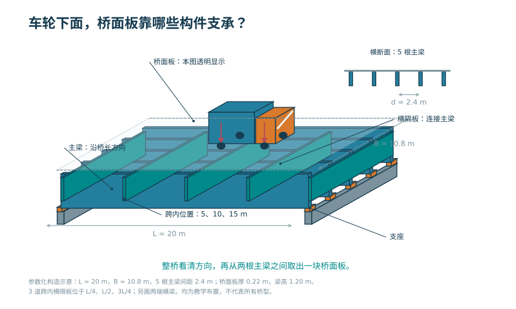车轮下面，桥面板靠哪些构件支承？</a><a href="#fig-priority-F14">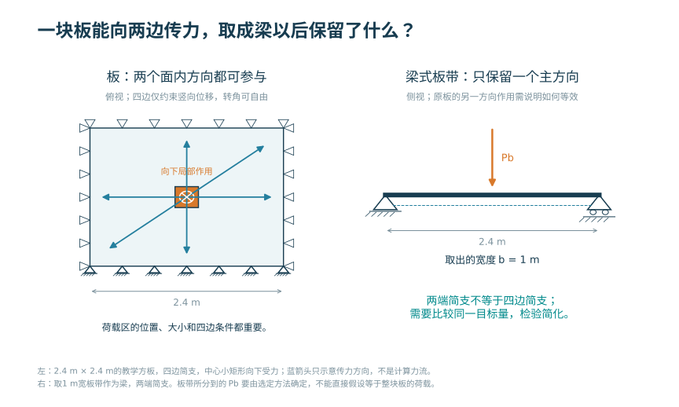一块板能向两边传力，取成梁以后保留了什么？</a><a href="#fig-priority-F15">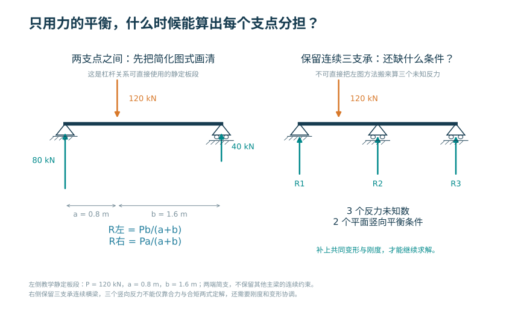只用力的平衡，什么时候能算出每个支点分担？</a><a href="#fig-priority-F16">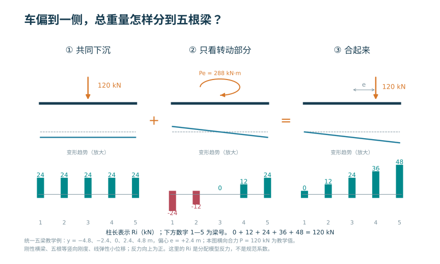车偏到一侧，总重量怎样分到五根梁？</a><a href="#fig-priority-F17">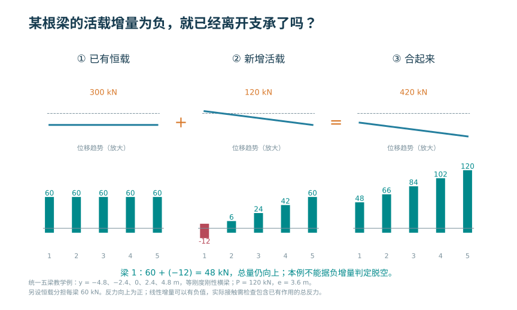某根梁的活载增量为负，就已经离开支承了吗？</a><a href="#fig-priority-F18">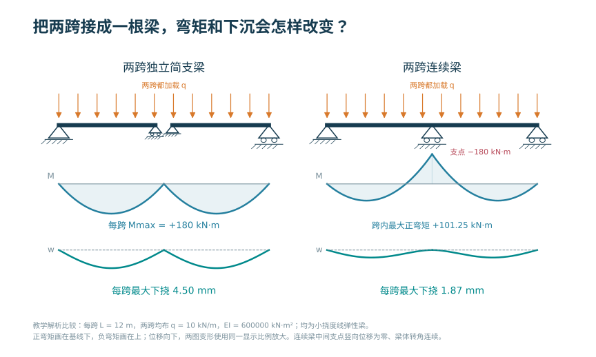把两跨接成一根梁，弯矩和下沉会怎样改变？</a><a href="#fig-priority-F19">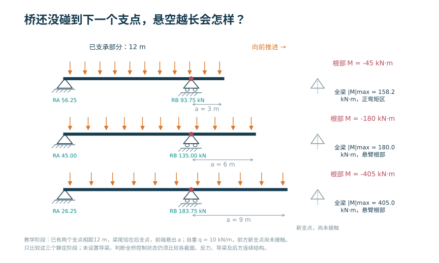桥还没碰到下一个支点，悬空越长会怎样？</a>

<!-- PRIORITY-CHAPTER-GALLERY END -->

<h2>本章的核心思考</h2>
抓住截面效率、横向分工和初始应力三件事。
<ol><li>比较材料位置对惯性矩、应力与挠度的不同影响。</li><li>从平均项与偏心项解释刚性横梁法。</li><li>把预应力的轴力、偏心矩与等效荷载对应起来。</li></ol>
<h3>跨课程类比</h3>
偏心受压的线性分布 → 多梁横向分配；预压 → 使用阶段应力调整

<strong>反例与边界：</strong>横向刚性、等刚度、未开裂等假定改变时要重算；不能截掉负反力继续使用旧模型。

建议课堂集中完成标为“课堂核心”的3个单元，其余单元用于课前观察和课后迁移。每个单元配独立短视频、操作实验、目标检验与开放论证题。

<article>
C04U01 · 课前/课后迁移
<h3>从简支反力到梁的整体平衡</h3>
移动荷载改变反力分配，平衡提供最快的独立核验。

<a href="../interactive/core-learning.html?unit=C04U01" target="_blank">操作与迁移任务</a> · <a href="../interactive/core-learning.html?unit=C04U01&amp;view=video" target="_blank">观看短视频</a>
</article><article>
C04U02 · 课前/课后迁移
<h3>弯矩、应力、挠度是三个输出</h3>
在线性范围内三者随荷载同比变化，但对应不同的验算问题。

<a href="../interactive/core-learning.html?unit=C04U02" target="_blank">操作与迁移任务</a> · <a href="../interactive/core-learning.html?unit=C04U02&amp;view=video" target="_blank">观看短视频</a>
</article><article>
C04U03 · 课堂核心
<h3>箱梁的效率来自材料位置</h3>
相同外包尺寸下挖空会减少面积和惯性矩，但二者减少比例不同。

<a href="../interactive/core-learning.html?unit=C04U03" target="_blank">操作与迁移任务</a> · <a href="../interactive/core-learning.html?unit=C04U03&amp;view=video" target="_blank">观看短视频</a>
</article><article>
C04U04 · 课前/课后迁移
<h3>影响线换一种方式组织计算</h3>
固定跨中弯矩响应后，移动单位力可建立一条供重复加载使用的曲线。

<a href="../interactive/core-learning.html?unit=C04U04" target="_blank">操作与迁移任务</a> · <a href="../interactive/core-learning.html?unit=C04U04&amp;view=video" target="_blank">观看短视频</a>
</article><article>
C04U05 · 课堂核心
<h3>横向分配就是平均加偏心修正</h3>
等刚度刚性横梁模型可拆成平均分配和偏心力矩分配。

<a href="../interactive/core-learning.html?unit=C04U05" target="_blank">操作与迁移任务</a> · <a href="../interactive/core-learning.html?unit=C04U05&amp;view=video" target="_blank">观看短视频</a>
</article><article>
C04U06 · 课前/课后迁移
<h3>不同刚度，分配系数就要重算</h3>
兼容位移和转角配合各梁刚度，决定不等刚度体系的反力分配。

<a href="../interactive/core-learning.html?unit=C04U06" target="_blank">操作与迁移任务</a> · <a href="../interactive/core-learning.html?unit=C04U06&amp;view=video" target="_blank">观看短视频</a>
</article><article>
C04U07 · 课堂核心
<h3>预应力的轴力与弯矩同时存在</h3>
只增加偏心会增强反向弯矩，却不增加平均预压。

<a href="../interactive/core-learning.html?unit=C04U07" target="_blank">操作与迁移任务</a> · <a href="../interactive/core-learning.html?unit=C04U07&amp;view=video" target="_blank">观看短视频</a>
</article><article>
C04U08 · 课前/课后迁移
<h3>束形是把轴力变成分布作用</h3>
抛物线束的等效横向荷载与预应力和矢高成正比，与跨径平方成反比。

<a href="../interactive/core-learning.html?unit=C04U08" target="_blank">操作与迁移任务</a> · <a href="../interactive/core-learning.html?unit=C04U08&amp;view=video" target="_blank">观看短视频</a>
</article><article>
C04U09 · 课前/课后迁移
<h3>只增跨径与整体放大不同</h3>
截面和线荷载不变时，跨径增加使弯矩按平方、挠度按四次方增加。

<a href="../interactive/core-learning.html?unit=C04U09" target="_blank">操作与迁移任务</a> · <a href="../interactive/core-learning.html?unit=C04U09&amp;view=video" target="_blank">观看短视频</a>
</article><article>
C04U10 · 课前/课后迁移
<h3>横梁刚性假定也有失效边界</h3>
偏心加大可能算出负反力，若支承不能抗拔，线性全接触模型失效。

<a href="../interactive/core-learning.html?unit=C04U10" target="_blank">操作与迁移任务</a> · <a href="../interactive/core-learning.html?unit=C04U10&amp;view=video" target="_blank">观看短视频</a>
</article>

<a href="../core-thinking.html">返回全书核心思维与尺度规律</a> · <a href="../core-resources.html">查看110个教学单元总索引</a> · <a href="../interactive/thinking-analogies.html">打开跨课程并排类比</a>

<!-- CORE-ROUTE END -->

::: {.chapter-objectives}
**学习目标。** 完成本章学习后，学生应能够：识别简支梁、连续梁和连续刚构的体系差异；依据桥宽、跨径、材料与施工方法说明截面选择的理由；建立梁桥竖向荷载传递路径；利用影响线确定移动荷载的控制位置；说明荷载横向分布的力学实质及常用简化方法的适用条件；建立与分析目的相匹配的杆系、梁格或空间有限元模型，并通过平衡、对称性和简化计算审查结果。
:::

::: {.source-note}
**内部初稿图源说明。** 本章部分图片暂取自课程组指定教材、在线教材和交通机构公开图样，仅用于编写阶段的知识定位、图文关系审查与重绘依据。每幅图后均列明来源。正式出版前须根据授权情况决定取得许可、链接原件或由课程组重新绘制，不将来源未核清的扫描图作为自有图片发布。
:::

<figure class="chapter-video-card"><video controls preload="metadata" playsinline poster="../assets/videos/manim/posters/M06_influence_line.png" src="../assets/videos/manim/M06_influence_line.mp4"></video><figcaption>M06　影响线与移动加载</figcaption></figure><figure class="chapter-video-card"><video controls preload="metadata" playsinline poster="../assets/videos/manim/posters/M07_box_efficiency.png" src="../assets/videos/manim/M07_box_efficiency.mp4"></video><figcaption>M07　箱梁挖空与截面效率</figcaption></figure>

## 本章任务与课程边界

梁式桥以梁体的弯曲变形和弯曲内力为主要受力特征。桥面上的作用经桥面铺装、桥面板、主梁、支座、墩台和基础传至地基；在多主梁或多箱结构中，还要经过横向连接完成荷载分配。因此，梁桥分析并非只有一根梁的弯矩计算，而是包含“纵向体系—横向共同工作—局部构造—施工阶段”四个相互联系的层次。

本章重点讨论桥梁专业课程中的总体体系、截面布置、作用效应和模型判断。钢筋混凝土、预应力混凝土和钢构件的截面承载力、裂缝、应力、疲劳及连接计算，应与《结构设计原理》或相应材料结构课程衔接；矩阵位移法、有限元离散与数值求解属于《结构力学》和《有限元方法》的方法基础。本章在必要处给出计算接口，但不重复这些课程的完整推导。

本章采用三个相互嵌套的观察尺度。第一尺度是**全桥体系**，回答跨径如何布置、支承如何设置、永久作用在何种施工体系上形成；第二尺度是**构件与截面**，回答桥面板、翼缘、腹板、横隔构件和预应力筋分别承担什么效应；第三尺度是**局部细节**，回答支承区、锚固区、接缝、剪力连接件及构造开孔如何把集中作用扩散到总体结构。一个尺度上的结论不能未经检查直接替代另一个尺度的结论。例如，单梁模型能够给出较可靠的纵向弯矩趋势，但不能据此确定宽箱梁顶板的轮载局部弯矩；板壳模型能够显示局部应力峰值，也不能在未做截面合力复核时直接取代总体杆系模型。

课程录课中多次采用“先搭出体系，再删除或改变一个构件观察结果”的活动。本章把这种活动正式化为**可控变量试验**：每次只改变跨径、支承、截面空腔、车辆位置、横向连接或施工阶段中的一个因素；保持其余输入、单位和结果提取位置不变；先写出定性预测，再用公式或数值模型检验。数字交互的目的，是让变量与因果关系可见，而不是以动画代替设计计算。

{#fig-ch03-load-path width=76%}

::: {.source-note}
**图源（内部初稿）。** 肖汝诚：《桥梁结构体系》，第3章图3-12“简支梁桥的传力示意图”，正文第72页（PDF第74页），本稿截取其示意图用于说明荷载路径。正式出版前核查授权；亦可依据相同力学关系由课程组重新绘制。
:::

@fig-ch03-load-path 给出了最基本的竖向传力链。实际桥梁还要传递制动力、风作用、温度变形引起的约束力以及地震作用。识别传力路径时，应依次回答三个问题：作用首先施加在哪个构件上；构件通过什么连接把作用传出；连接允许哪些位移和转动。只有这三个问题明确，计算模型的单元、边界和荷载施加才具有可解释性。

## 梁桥体系、总体布置与施工状态

#### 简支梁

简支梁在两个支承之间形成独立受力跨。若忽略支座摩阻、墩台变形等次要因素，结构为静定体系，支座沉降通常不引起附加内力。其受力边界清楚，适于标准化预制和快速架设；但跨中正弯矩较大，跨间接缝、伸缩装置和支座数量相对较多。对于装配式结构，还应区分“施工阶段简支”和“成桥阶段简支或连续”，二者不能仅凭梁片外形判断。

#### 连续梁

<!-- PRIORITY-FIGURE F18 START -->
{#fig-priority-F18 width=100% fig-alt="把两跨接成一根梁，弯矩和下沉会怎样改变？。统一荷载和刚度下，连续性改变弯矩和变形：中支点产生负弯矩，跨内最大正弯矩减小。实际解析挠度曲线使用相同放大比例。"}

查看模型条件与绘图代码

两跨等跨、EI恒定、两跨全布均载；不是任意车辆位置的包络；中支点不沉降；不计收缩徐变、温度或预应力；解析式第一跨w=q(L³x−3Lx³+2x⁴)/(48EI)，第二跨镜像

课程组原创参数绘图 · F18 · <a href="../scripts/priority-figures/group_a.py">绘图 Python</a> · <a href="../scripts/priority-figures/figlib.py">公共绘图函数</a> · <a href="../assets/publication/priority-40/F18.png" download>下载 PNG</a> · <a href="../assets/publication/priority-40/F18.svg" download>下载 SVG</a>

<!-- PRIORITY-FIGURE F18 END -->

连续梁的梁体跨越两个以上桥孔并在中间支点保持连续。支点负弯矩使跨中正弯矩减小，结构变形曲线更平顺，但体系属于超静定结构，温度、收缩徐变、预应力、支座位移和基础沉降均可能形成附加效应。连续梁的边跨长度、支点区刚度和施工顺序会改变恒载与可变作用的分配，因而总体设计应同时考虑跨径比例、梁高变化和施工可行性。

@fig-ch03-continuous-layout 展示连续梁常见跨径布置示意。

{#fig-ch03-continuous-layout width=66%}

::: {.source-note}
**图源（内部初稿）。** 在线教材项目 `longyu8101/qlgc`，原图2-6-2“钢筋混凝土连续梁桥立面布置”，文件 `source/_static/fig/2-6-2.jpg`，<https://github.com/longyu8101/qlgc/blob/master/source/_static/fig/2-6-2.jpg>。本稿仅用于比较等跨与不等跨布置，图中经验比例不作为现行规范条文引用。
:::

#### 连续刚构

连续刚构通过墩梁固结减少或取消主墩支座。梁体弯矩可向桥墩分配，悬臂施工时墩梁形成稳定的T构单元；同时，桥墩纵向刚度会直接影响温度、收缩徐变、制动力和地震作用下的内力。连续刚构的体系判断不能只观察上部梁体，还应把墩高、墩身截面、基础刚度和边界条件纳入整体模型。

#### 体系由连接关系决定

梁桥体系的本质是构件间连接与外部约束的组合。梁体跨内是否连续、墩梁之间是铰接还是固结、支座是否允许纵横向位移，都会改变结构自由度和内力重分配。对同一座桥，将中间支点由活动支座改为固定支座，可能不显著改变恒载竖向弯矩，却会明显改变温度作用下的水平力。因而体系图应同时表达构件、连接和约束，不能以桥梁照片代替计算图式。

| 体系 | 主要受力特点 | 对位移或次生作用的敏感性 | 常见施工联系 | 模型审查重点 |
|---|---|---|---|---|
| 简支梁 | 单跨正弯矩为主，支点剪力集中 | 对不均匀沉降相对不敏感 | 预制架设、支架现浇 | 支座方向、桥面连续与结构连续的区别 |
| 连续梁 | 支点负弯矩与跨中正弯矩共同控制 | 对沉降、温度和收缩徐变敏感 | 支架现浇、移动模架、顶推、先简支后连续 | 成桥体系、施工体系及合龙顺序 |
| 连续刚构 | 梁、墩共同受力，墩顶传递弯矩 | 对墩高、墩刚度和温度变形敏感 | 对称悬臂浇筑或拼装 | 墩梁固结、基础刚度和长期效应 |

#### 桥面连续、结构连续与构造连续

“桥面看起来没有缝”不一定意味着主梁在结构上连续。简支梁桥可以通过桥面连续构造改善行车平顺性，但各跨主梁在主要竖向受力上仍按简支体系工作；先简支后连续梁则在完成墩顶连续接头后，使后续作用由连续体系承担；连续梁和连续刚构从总体模型上均跨越多个桥孔，但前者通常经支座传力，后者在主墩处由墩梁固结传递弯矩。教材图、现场照片和三维模型应分别标出伸缩装置、桥面连续层、梁端接头、支座及墩梁固结位置，避免仅凭桥面外观判断体系。

体系识别可按下列顺序进行：

1. 沿桥梁纵向追踪主梁中心线，判断梁端是否真正传递弯矩和剪力；
2. 在每个墩台位置画出竖向、纵向和横向约束，区分支座与固结；
3. 标出施工接缝、后浇接头和合龙段，判断其形成时间；
4. 分别绘制“梁体自重作用时”和“桥面铺装、车辆作用时”的计算体系；
5. 对温度变化或支座沉降施加一个单位变位，检查结构是否产生附加内力。

#### 体系选择不是单指标排序

简支、连续和刚构体系没有脱离场地与施工条件的绝对优劣。概念设计阶段至少应并列比较跨越能力、结构高度、标准化程度、支座和伸缩装置数量、施工期间通航或交通条件、温度及基础变位敏感性、检查更换条件和景观连续性。对软弱地基或沉降差异较大的桥位，超静定体系的附加效应需要特别审查；对高墩峡谷桥，墩梁固结可能有利于悬臂施工，却也使温度与地震作用直接进入桥墩；对大量同跨径城市高架，标准化预制梁可能在工期和质量控制方面更有优势。最终选择应留下“采用理由”和“未采用理由”，而不是只给出一张桥型效果图。

### 跨径布置与施工阶段

::: {.callout-tip}
**桥还没接起来的时候，已经建好的这一段靠什么站住？** 想一想组装书架：最终装上的连接，在前面的某一步可能还不存在。对桥梁也要逐步画出当时的支承与荷载，不能只分析成桥照片。

[逐步移动桥梁，比较施工中的弯矩](../interactive/13-incremental-launching-moment-lab.html)。操作前先指出自己认为需要重点检查的阶段，再用结果说明理由。NPTEL桥梁工程的官方大纲将平衡悬臂与施工维护列为课程内容，可从[课程导读](../course-guide.qmd#v04)继续学习；这里的交互是本教材已有的教学演示。
:::

跨径布置首先服从通航、行洪、道路交叉、地形地质和既有设施等桥位条件，其次与材料性能、标准梁型、运输架设能力、结构高度和全寿命维护条件协调。跨径不是孤立的几何参数：跨径增大通常提高恒载效应和结构高度需求，也可能使墩台数量减少；边跨过短可能产生支座负反力或使边跨刚度偏大，边跨过长则削弱其对中跨的有利约束。

施工方法决定恒载在什么体系上形成。设第 $k$ 个施工阶段新增荷载为 $\Delta\mathbf{P}_k$，该阶段结构刚度和边界对应的响应算子为 $\mathbf{H}_k$，在线弹性、不考虑时变效应的教学模型中，阶段响应可写成

$$
\mathbf{r}=\sum_{k=1}^{m}\mathbf{H}_k\Delta\mathbf{P}_k.
$$

该式说明：即使最终几何和支承相同，只要荷载施加时的体系不同，恒载弯矩也可能不同。实际预应力混凝土桥还需考虑混凝土龄期、弹性模量发展、收缩徐变、预应力损失和合龙温度等时间因素，不能把所有作用一次施加在成桥模型上替代施工阶段分析。

常见施工方法与分析关注点如下：

1. **预制架设。** 运输和吊装阶段通常按单梁受力，横向连接及桥面整体化完成后才形成多梁共同工作。
2. **支架现浇。** 拆架顺序和支架沉降可能改变结构受力；一次落架与分段落架应采用相应阶段模拟。
3. **先简支后连续。** 梁体自重多在简支体系承担，连续接头、桥面现浇层和后续作用在连续体系承担。
4. **顶推施工。** 梁体截面在顶推过程中交替经历正、负弯矩，导梁、临时墩和临时预应力均属于施工体系的一部分。
5. **悬臂施工。** 墩顶块、临时固结、挂篮、节段龄期、合龙顺序和体系转换共同决定施工控制状态。

施工阶段分析应使用“状态表”而不是只用一条施工方法名称。状态表至少记录：当阶段已激活的构件；有效支承与临时约束；新增结构自重、施工机具和预应力；材料龄期及采用的刚度；阶段开始、结束时需要读取的位移、内力与反力；进入下一阶段前必须满足的控制条件。这样做可以回答同一片梁在预制台座、起吊、运输、架设、横向连接和运营阶段分别由谁支承、以什么截面工作。

| 施工状态 | 主要承重对象 | 截面或体系状态 | 应优先检查的结果 |
|---|---|---|---|
| 预制与张拉 | 单片梁、台座或临时支点 | 预制截面，横向联系尚未形成 | 梁端和跨中应力、上拱、锚固区、吊点反力 |
| 运输与架设 | 单片梁、运梁或吊装系统 | 支点位置可能不同于成桥 | 吊点/支点负弯矩、横向稳定、局部承压 |
| 湿接缝与桥面施工 | 已架梁片及临时横向联系 | 组合截面可能尚未完全形成 | 新增恒载的承担截面、梁间挠度差、施工稳定 |
| 连续化或合龙 | 多跨梁、临时固结和永久支承 | 结构拓扑改变 | 接头内力、支座反力、合龙误差和体系转换 |
| 运营 | 完整桥面系和永久支承 | 成桥有效截面 | 作用组合、长期变形、疲劳与维护可达性 |

## 截面、桥面板与局部受力

#### 板式、肋式和箱式截面

梁桥横截面可概括为板式、T形或I形肋式、箱形以及钢—混凝土组合截面。选择截面时应同时比较材料利用、结构高度、横向连接、抗扭需求、预制运输、模板施工、检修空间和耐久性，而不能只以跨径给出单一答案。

板式截面构造简单、建筑高度较小，适于较小跨径或装配式空心板体系。T梁和I梁将材料集中在翼缘与腹板位置，便于预制标准化；桥面板、湿接缝和横隔构件使多片梁形成整体。箱梁具有闭合薄壁截面，抗扭性能和横向整体性较好，适于较宽桥面、曲线桥、斜桥及需要较大悬臂板的布置，但箱内构造、施工、通风排水和检查维护也更复杂。

@fig-ch03-assembled-sections 展示装配式梁桥横截面的连接形式。

{#fig-ch03-assembled-sections width=86%}

::: {.source-note}
**图源（内部初稿）。** 在线教材项目 `longyu8101/qlgc`，原图2-3-2“装配式T形梁桥横截面（仅示1/2）”，文件 `source/_static/fig/2-3-2.jpg`，<https://github.com/longyu8101/qlgc/blob/master/source/_static/fig/2-3-2.jpg>。用于识别主梁、翼板、横隔梁及现浇层的连接关系；正式出版拟统一重绘线型和标注。
:::

@fig-ch03-box-sections 展示单箱单室、单箱双室与单箱多室截面。

{#fig-ch03-box-sections width=84%}

::: {.source-note}
**图源（内部初稿）。** 在线教材项目 `longyu8101/qlgc`，原图2-3-15“箱形梁桥横截面”，文件 `source/_static/fig/2-3-15.jpg`，<https://github.com/longyu8101/qlgc/blob/master/source/_static/fig/2-3-15.jpg>。用于说明箱室数量与桥面宽度的关系，正式出版前核查授权或重绘。
:::

#### 桥宽、箱室与腹板数量

桥面较宽时，可以增加单箱的箱室或腹板数量，也可以采用分离式多箱。腹板增多能够缩短顶、底板的横向受力跨度，并为预应力、剪力和局部荷载提供传力路径；但同时增加自重、模板和施工工作量。腹板过少则会提高横向板弯曲、截面畸变和局部受力要求。截面布置应在纵向弯曲效率、横向受力、扭转、施工与维护之间取得平衡。

@fig-ch03-box-width 展示箱形截面布置随桥面宽度变化的示意。

{#fig-ch03-box-width width=48%}

::: {.source-note}
**图源（内部初稿）。** 在线教材项目 `longyu8101/qlgc`，原图2-6-9“箱形梁截面形式与桥宽的关系”，文件 `source/_static/fig/2-6-9.jpg`，<https://github.com/longyu8101/qlgc/blob/master/source/_static/fig/2-6-9.jpg>。图中宽度仅为原资料的示例分区，不应脱离材料、跨度、施工方法和现行规范直接套用。
:::

#### 截面几何效率

在概念设计阶段，可先用面积、惯性矩和截面模量比较同一外轮廓下的材料布置效率。对外轮廓宽 $B$、高 $H$，顶板厚 $t_t$、底板厚 $t_b$、两腹板厚 $t_w$ 的矩形教学箱梁，忽略承托和倒角时，截面面积为

$$
A=B(t_t+t_b)+2t_w(H-t_t-t_b).
$$

将顶板、底板和腹板分块，取统一参考轴，可得形心

$$
\bar z=\frac{\sum_i A_i z_i}{\sum_i A_i},
$$

以及关于形心水平轴的惯性矩

$$
I=\sum_i\left(I_{i,c}+A_i(z_i-\bar z)^2\right).
$$

上、下缘截面模量分别为

$$
W_t=\frac{I}{H-\bar z},\qquad W_b=\frac{I}{\bar z}.
$$

单位长度自重近似为 $q_g=\gamma_c A$。由此可用 $I/A$ 或 $W/A$ 比较单位材料所形成的弹性截面性能。将靠近中性轴的材料移至顶、底板，通常能够在面积减少的同时保持较高的弯曲刚度；但“空腔越大越优”并不成立，因为顶、底板横向弯曲、腹板剪切、截面扭转与畸变、局部稳定、预应力管道、锚固区和施工最小空间都会形成约束。

为避免把“减重”和“提高承载能力”混为一谈，可同时记录三个无量纲几何指标：

$$
\rho_A=\frac{A}{A_0},\qquad
\eta_b=\frac{I}{AH^2},\qquad
\eta_t=\frac{J_t}{AH^2},
$$

其中 $A_0=BH$ 为同外轮廓实心矩形面积，$\rho_A$ 为面积保留率，$\eta_b$ 为单位面积的弯曲几何效率，$J_t$ 为与扭转刚度有关的截面常数，$\eta_t$ 为单位面积的扭转几何效率。$A$ 的单位为 $\mathrm{m^2}$，$I$、$J_t$ 的单位为 $\mathrm{m^4}$，因此三个比值均无量纲。它们只适用于同一材料、相近外轮廓和明确的线弹性比较，不能替代抗剪、局部板件、开裂、稳定和极限承载力计算。

#### 空腔、自重与扭转的联动

闭口箱形截面的优势不仅来自把材料布置在远离中性轴的位置，还来自封闭薄壁对扭转剪流的组织能力。对单室、壁厚较薄且沿周边连续的闭口截面，在Saint-Venant扭转的教学近似下，可写成

$$
J_t\approx\frac{4A_m^2}{\displaystyle\oint\frac{\mathrm ds}{t(s)}},
$$

其中 $A_m$ 为壁厚中线所围面积，单位为 $\mathrm{m^2}$；$s$ 为沿壁厚中线的周向坐标，单位为 $\mathrm m$；$t(s)$ 为局部壁厚，单位为 $\mathrm m$。当扭矩为 $T$，且可采用单室闭口薄壁近似时，周向剪流为

$$
q_T=\frac{T}{2A_m},\qquad \tau_T(s)=\frac{q_T}{t(s)},
$$

其中 $q_T$ 的单位为 $\mathrm{N/m}$，$\tau_T$ 的单位为 $\mathrm{Pa}$。公式表明，在壁厚没有过度减小且箱室保持封闭时，扩大有效箱室面积能够显著提高扭转效率；但某一腹板或顶底板继续减薄会增大局部剪应力，并可能引起开裂、屈曲或畸变。多室箱梁的各室剪流还需满足整体平衡和扭转变形协调，不能把单室公式分别套用后简单相加。

截面参数实验宜按以下三条路径分别进行：

1. **固定外轮廓，扩大空腔。** $A$ 和自重下降，$I$ 可能缓慢下降而 $I/A$ 上升；壁厚、横向板跨和局部稳定逐渐成为控制条件。
2. **固定材料面积，提高梁高。** 顶、底板间距增加，$I$ 和 $W$ 通常提高，但结构高度、匝道纵坡、桥下净空、腹板稳定和施工模板受到影响。
3. **固定弯曲指标，改变箱室。** 单箱单室、单箱多室或分离多箱可具有相近纵向弯曲性能，却在横向板受力、扭转、畸变、施工分块和检查通道方面表现不同。

每次参数改变后，应按“几何—自重—总体弯曲—扭转—横向板—构造空间”的顺序检查。若交互页面只显示 $I/A$ 上升而不显示壁厚警告、顶板净跨和 $J_t$ 的变化，就会把局部不可行方案误判为高效方案。

<iframe loading="lazy" src="../interactive/ch04-box-girder-tradeoff.html" title="箱梁空腔、自重与截面效率参数实验"></iframe>

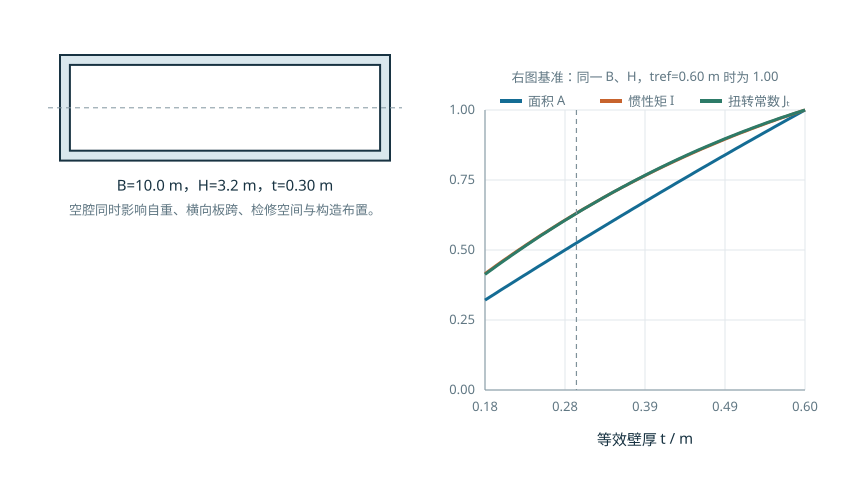{#fig-ch03-box-tradeoff-fallback .static-fallback width=90%}

::: {.digital-note}
**数字资源4-1　箱梁截面参数实验。** 固定外轮廓后，依次调整顶板、底板、腹板厚度和箱室尺寸，观察 $A$、$I$、$W_t$、$W_b$、$I/A$、$J_t$ 与自重的联动变化。页面中的“相对减重”只表示几何质量变化，“截面效率”只表示弹性几何指标，均不替代承载能力和正常使用极限状态验算。
:::

梁桥三维模型、影响线和横向分布的综合入口置于本章资源导航页，避免在截面概念形成阶段同时呈现多个工具和无关控件。

#### 标准梁型不是比例缩放

预制梁型往往形成按梁高、翼缘宽度、腹板和适用条件分级的截面族。跨度或设计作用提高时，梁型变化通常不是把一个截面等比例放大，而是同时调整梁高、翼缘、腹板、材料强度、预应力布置和梁间距。数字教材可将标准图样作为“参数族”的证据页，再用本书自建模型解释各参数对自重、刚度和施工的影响。

@fig-ch03-wsdot-girder-family 展示WSDOT预应力混凝土I梁与宽翼缘梁截面族。

{#fig-ch03-wsdot-girder-family width=98%}

::: {.source-note}
**图源（官方图样，内部初稿）。** Washington State Department of Transportation, *Prestressed Concrete I and WF Girders*, Standard Plan 5.6-A1-10，原PDF：<https://wsdot.wa.gov/publications/fulltext/Bridge/Web_BSD/5.6_A1_10.PDF>，本稿将其第1页渲染为预览图。图中采用英制单位和华盛顿州技术口径，仅用于“梁型参数族”识读，不替代中国现行标准或项目设计。
:::

### 桥面板、横隔构件与局部受力

<!-- PRIORITY-FIGURE F13 START -->
{#fig-priority-F13 width=100% fig-alt="车轮下面，桥面板靠哪些构件支承？。轴测整桥以5根纵向主梁、3道跨内横隔板和两端横梁定位桥面板的空间支承。透明桥面仅为揭示内部构造；车辆轮载向下。"}

查看模型条件与绘图代码

所有几何为明确教学例；纵横比例由坐标统一投影；横隔板为有高度的实体连接，不是路面横线；此图不计算荷载分担或板内应力

课程组原创参数绘图 · F13 · <a href="../scripts/priority-figures/group_a.py">绘图 Python</a> · <a href="../scripts/priority-figures/figlib.py">公共绘图函数</a> · <a href="../assets/publication/priority-40/F13.png" download>下载 PNG</a> · <a href="../assets/publication/priority-40/F13.svg" download>下载 SVG</a>

<!-- PRIORITY-FIGURE F13 END -->

桥面板一方面直接承受轮载并将其横向分配给腹板或主梁，另一方面作为主梁截面的翼缘参与纵向受力。对于组合结构，还应明确施工阶段钢梁单独受力与桥面板形成组合后的截面差异。桥面板悬臂段、腹板间板带以及轮载邻近区域属于局部分析对象，其计算尺度不同于整桥纵向分析。

横隔梁或横隔板的主要作用包括：在支承和锚固区域组织集中力传递；提高横向连接刚度；约束箱形截面畸变；在施工阶段保持构件稳定和几何位置。横隔构件并非数量越多越好，设置位置、刚度和开孔应根据支点、曲线与斜交条件、施工方法、预应力锚固和检查通行要求确定。

桥面板的计算应先确定板带的支承关系。位于两腹板之间的顶板可表现为横向连续板；伸出外腹板的悬臂板还承受栏杆、防撞护栏和轮载局部作用；支点横隔板附近，荷载会在板、腹板和横隔构件之间形成三维扩散。桥面板作为主梁翼缘参与纵向弯曲，并不意味着其横向局部效应可以忽略。总体梁模型、横向板带模型和局部板壳模型应采用相容的作用与边界，并通过截面合力相互核对。

对装配式梁桥，横向连接刚度是“单梁”与“整体桥面”之间的关键。湿接缝、铰缝、横隔梁和现浇层尚未形成时，单片梁分别承担自重和施工荷载；连接形成后，后续桥面恒载与车辆作用才由多梁共同分配。既有桥评估还需设置连接刚度折减或局部失效工况，比较外梁效应、相邻梁挠度差和桥面板局部响应，而不能继续沿用完好整体的横向分布系数。

@fig-ch03-diaphragm-types 展示箱梁横隔构件的三种构造形式。

{#fig-ch03-diaphragm-types width=78%}

::: {.source-note}
**图源（内部初稿）。** 在线教材项目 `longyu8101/qlgc`，原图2-6-13“横隔板的类型”，文件 `source/_static/fig/2-6-13.jpg`，<https://github.com/longyu8101/qlgc/blob/master/source/_static/fig/2-6-13.jpg>。原图示意桁架式、实体式和框架式横隔构造，本稿用于构造识别；具体尺寸和配筋须按现行规范及计算确定。
:::

箱梁还存在剪力滞效应：翼缘板上的纵向正应力沿横桥向并非均匀分布。整桥杆系模型可以有效描述总体弯曲，却通常不能直接给出翼缘局部应力峰值。设计时应依据分析目的采用有效宽度、板壳模型或局部实体模型，并使总体模型与局部模型的边界力保持一致。

## 纵向作用效应、影响线与移动荷载

#### 永久作用的基本计算

对于跨径 $L$、均布永久作用集度 $g$ 的简支梁，距左支点 $x$ 处的剪力和弯矩为

$$
V_g(x)=\frac{gL}{2}-gx,
$$

$$
M_g(x)=\frac{gLx}{2}-\frac{gx^2}{2}=\frac{gx(L-x)}{2}.
$$

其跨中弯矩为 $gL^2/8$，支点剪力绝对值为 $gL/2$。这些结果不仅用于初步估算，也是有限元模型最直接的平衡校核。若模型中自重由软件自动生成，应核对材料重度、截面面积、重力方向和重复施加情况，并检查全部竖向支反力之和是否等于总竖向荷载。

@fig-ch03-dead-load-freebody 展示均布永久作用下简支梁的截面内力图式。

{#fig-ch03-dead-load-freebody width=66%}

::: {.source-note}
**图源（内部初稿）。** 在线教材项目 `longyu8101/qlgc`，原图2-4-48“永久作用内力计算图式”，文件 `source/_static/fig/2-4-48.png`，<https://github.com/longyu8101/qlgc/blob/master/source/_static/fig/2-4-48.png>。本稿借其自由体表达核对上式，正式版拟用TikZ按本书符号体系重绘。
:::

#### 影响线

影响线表示单位移动荷载沿规定路径移动时，某一指定响应量随荷载位置的变化。它回答的是“荷载放在哪里，该响应最不利”，而弯矩图或剪力图回答的是“在给定荷载位置下，各截面的响应是多少”。二者的自变量和用途不同。

对跨径为 $L$ 的简支梁，在距左支点 $a$ 的截面求弯矩影响线。单位荷载位于 $x$ 时，影响线纵标为

$$
\eta_M(x)=
\begin{cases}
\dfrac{x(L-a)}{L}, & 0\le x\le a,\\[6pt]
\dfrac{a(L-x)}{L}, & a\le x\le L.
\end{cases}
$$

在 $x=a$ 处纵标达到 $a(L-a)/L$。若有若干集中荷载 $P_k$ 位于 $x_k$，指定截面的效应为

$$
S_P=\sum_k P_k\eta(x_k).
$$

对分布荷载 $q(x)$，效应为

$$
S_q=\int_{\Omega_q}q(x)\eta(x)\,\mathrm{d}x.
$$

当 $q$ 为常量时，结果等于荷载集度与相应加载区段影响线面积的乘积。最不利加载的基本规则是：对所求最大正效应在影响线正区段加载，对最小负效应在负区段加载；实际车道荷载、车辆荷载及其纵横向布置必须按采用的现行规范执行。

#### 车辆荷载组的移动与控制位置

设车辆由 $r$ 个轴组成，第 $k$ 个轴重为 $P_k$，其相对车辆参考点的纵向坐标为 $d_k$。当参考点位于 $x_0$ 时，目标响应为

$$
S(x_0)=\sum_{k=1}^{r}P_k\eta(x_0+d_k),
$$

其中超出规定加载路径的车轴不计入求和；$P_k$ 的单位为力，弯矩影响线纵标的单位为长度，故求得的弯矩单位为力乘长度。若同时存在均布车道作用，则应按相应规范模型在允许区段积分，并按规定处理集中作用、均布作用、多车道折减和动态效应。教材交互不得自行设定这些规范参数，可提供“教学单位荷载”模式和“规范数据导入”模式，二者在界面上必须明确区分。

移动荷载的数值遍历可按如下次序实施：

1. 明确目标响应，例如中跨跨中弯矩、内支点弯矩或某侧支点剪力；
2. 生成并检查该响应的影响线，标出正区、负区和纵标突变位置；
3. 以足够小的步长移动车辆参考点，计算每一位置的轴重贡献并保存极值；
4. 在候选极值附近减小步长，检查控制值是否收敛；
5. 记录控制车辆位置、各轴贡献、影响线纵标、总效应和采用的作用模型版本；
6. 对连续梁支点剪力等存在左右限值的响应，分别检查截面左侧与右侧定义。

“某一车轴应位于影响线峰值处”可作为寻找候选位置的直观线索，但不总是完整结论。多轴车辆的控制位置由全部轴重及间距共同决定；将一个重轴移至峰值，可能使其他轴离开有利的正区段。可靠的做法是先用影响线形状预测，再对车辆组作完整移动计算，并用步长收敛或解析条件复核极值。

<iframe loading="lazy" src="../interactive/bridge-concept-screen.html?lab=influence" title="影响线与移动单位荷载实验"></iframe>

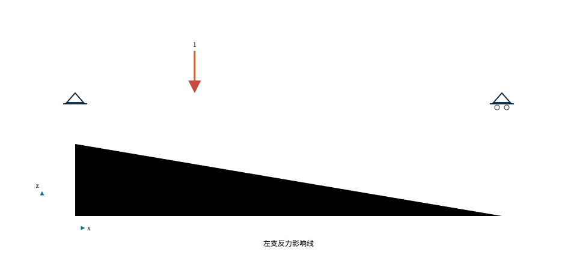{#fig-ch03-influence-baseline .static-fallback width=88%}

#### 连续梁影响线与包络

连续梁某一截面的弯矩影响线通常跨越多跨并具有正负区段。可采用机动法判断形状，再用力法、位移法或数值模型求纵标。移动荷载遍历规定路径后，对每一截面记录最大值与最小值，可形成内力包络。包络线不是某一个荷载位置下的弯矩图，而是不同加载位置产生的控制值集合。

连续梁应至少建立三类典型影响线：跨中正弯矩影响线、内支点负弯矩影响线和支点剪力影响线。求某跨跨中最大正弯矩时，车辆通常优先布置在该跨的正区，但相邻跨是否加载取决于其影响线纵标符号；求内支点最大负弯矩时，支点两侧跨往往共同贡献负效应，其他跨的正区或负区仍需按目标极值取舍。教学页面应允许学生先勾选拟加载区，再显示计算结果，以检验其对符号和组合的理解。

内力包络应与构造位置联系。跨中最大正弯矩控制底缘受拉或相应预应力布置；内支点负弯矩控制顶缘受拉、支点区底板压应力及钢束转向；支点剪力与扭矩控制腹板和横隔构件；施工阶段的最大正、负弯矩位置可能与运营阶段不同。包络图因此不仅是结果曲线，还应携带“工况—阶段—车辆位置—控制截面”的元数据。

@fig-ch03-envelope 展示梁桥弯矩与剪力包络线示意。

{#fig-ch03-envelope width=64%}

::: {.source-note}
**图源（内部初稿）。** 在线教材项目 `longyu8101/qlgc`，原图2-4-51“内力包络图”，文件 `source/_static/fig/2-4-51.png`，<https://github.com/longyu8101/qlgc/blob/master/source/_static/fig/2-4-51.png>。用于区分单一工况内力图与移动荷载包络，正式版拟重绘并统一正负号方向。
:::

<iframe loading="lazy" src="../interactive/ch03-continuous-loading.html" title="连续梁移动荷载与控制效应"></iframe>

::: {.digital-note}
**数字资源4-2　移动荷载与控制效应。** 拖动车辆或集中荷载沿桥面移动，页面同步显示指定截面的影响线纵标、各轴贡献、当前效应和全过程包络。教学顺序为“先固定所求响应—再移动荷载—最后读取控制位置”，不把软件动画本身当作计算结论。
:::

## 横向分布与空间受力

#### 空间问题的工程分解

多主梁桥由桥面板、横隔构件和各片主梁共同组成空间结构。单位荷载位于桥面坐标 $(x,y)$ 时，第 $i$ 片主梁指定截面的响应可写为二维影响面 $\eta_i(x,y)$。传统实用计算常将其近似分解为纵向与横向两个问题：

$$
S_i=P\eta_i(x,y)\approx P\eta_{1}(x)\eta_{2,i}(y),
$$

其中 $\eta_1(x)$ 为单梁指定响应的纵向影响线，$\eta_{2,i}(y)$ 表示荷载沿横桥向移动时分配给第 $i$ 片梁的比例。该分解把“哪一片梁分到多少荷载”与“荷载沿纵向放在哪里最不利”分别处理，但前提是所采用的横向分布模型能够反映桥面结构的主要横向刚度特征。

@fig-ch03-spatial-decomposition 展示空间受力向纵向与横向计算的分解。

{#fig-ch03-spatial-decomposition width=68%}

::: {.source-note}
**图源（内部初稿）。** 在线教材项目 `longyu8101/qlgc`，原图2-4-13“主梁荷载分布”，文件 `source/_static/fig/2-4-13.jpg`，<https://github.com/longyu8101/qlgc/blob/master/source/_static/fig/2-4-13.jpg>。本稿用于说明二维影响面向纵、横两个方向的工程分解。
:::

#### 横向分布系数

设一根车轴总重为 $P_a$，两侧车轮的轮重分别为 $P_{w1}$、$P_{w2}$，横向位置为 $y_1$、$y_2$。分配至第 $i$ 片主梁的等效荷载为

$$
P_i=P_{w1}\eta_{2,i}(y_1)+P_{w2}\eta_{2,i}(y_2),
$$

对应横向分布系数定义为

$$
m_i=\frac{P_i}{P_a}.
$$

若两个轮重均为 $P_a/2$，则

$$
m_i=\frac{1}{2}\left[\eta_{2,i}(y_1)+\eta_{2,i}(y_2)\right].
$$

横向分布系数与桥面横向刚度、主梁间距、荷载横向位置、所求主梁以及荷载沿纵向的位置有关。对车辆荷载、人群荷载或不同车道布置，应分别按相应荷载图式确定，不应把一个系数无条件用于所有截面和作用类型。

横向分布计算应区分三个对象。第一是**轮重如何通过桥面板扩散至相邻腹板或主梁**，属于局部板与横向结构问题；第二是**同一横截面上各主梁承担的总体比例**，可用横向影响线或梁格模型描述；第三是**各梁获得荷载后沿纵向产生的弯矩和剪力**，需与纵向影响线组合。若把三者压缩为一个固定系数，至少应说明该系数对应的纵向位置、目标效应、桥面连接状态和车辆横向布置。

<iframe loading="lazy" src="../interactive/bridge-concept-screen.html?lab=transverse" title="偏心轮载横向分配实验"></iframe>

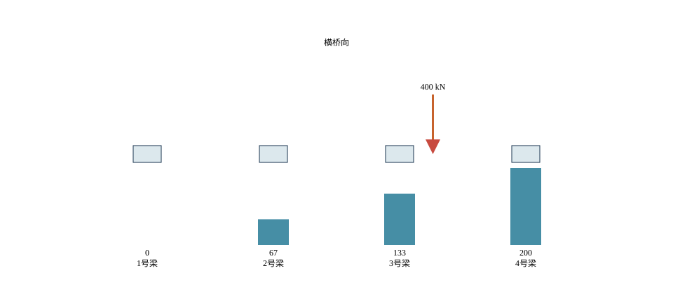{#fig-ch03-transverse-baseline .static-fallback width=88%}

对横向刚度沿纵向变化的桥梁，支点截面、横隔梁附近和跨中截面的分配规律可能不同。支点附近的竖向力更直接进入支座，杠杆近似可能具有较清楚的静力图式；跨中位置则受桥面板、横隔构件、主梁弯曲与扭转共同影响。曲线桥、斜桥、宽箱梁、刚度不等的边梁及连接损伤桥梁，还可能出现弯扭耦合或不对称分配，应优先采用梁格、板壳或经验证的专门方法。

@fig-ch03-wheel-distribution 展示车轮荷载经横向分布后作用于指定主梁。

{#fig-ch03-wheel-distribution width=72%}

::: {.source-note}
**图源（内部初稿）。** 在线教材项目 `longyu8101/qlgc`，原图2-4-14“车轮荷载在桥上的横向分布”，文件 `source/_static/fig/2-4-14.png`，<https://github.com/longyu8101/qlgc/blob/master/source/_static/fig/2-4-14.png>。用于对应横向分布系数的定义，图中符号已在本节正文重新定义。
:::

#### 杠杆原理法

当荷载位于支点附近，竖向作用可通过端横隔构件或相邻主梁较直接地传至支座。杠杆原理法把横向结构简化为在主梁位置支承的连续或分段刚性构件，以静力平衡求各支点反力，再将反力影响线作为主梁横向分布影响线。

采用该方法时应先画横向计算图式，标出主梁位置、车轮位置和桥面边界；再移动单位荷载获得目标主梁反力影响线；最后按规范规定的车辆横向位置加载。该方法的适用位置和精度与横向连接形式有关，不能因计算简便而推广到任意跨中截面。

对无中间横隔梁的装配式箱梁，在初步分析中可假定单个箱形截面不发生横向变形，并将该箱梁范围内的横向影响线竖标取为1；接缝刚度、桥面整体化和箱体实际扭转仍会改变荷载分布。@fig-ch03-box-lever 展示了这种近似的基本图形。

{#fig-ch03-box-lever width=82%}

::: {.source-note}
**图源（内部初稿）。** 在线教材项目 `longyu8101/qlgc`，原图2-4-18“无横隔梁的装配式箱形梁桥的主梁横向影响线”，文件 `source/_static/fig/2-4-18.png`，<https://github.com/longyu8101/qlgc/blob/master/source/_static/fig/2-4-18.png>。用于说明杠杆近似的影响线形态，不作为任意装配式箱梁的通用结论。
:::

#### 偏心压力法

当横隔构件的刚度相对较大，可近似认为同一横截面保持直线，各主梁竖向刚度相等。单位荷载作用于距桥梁横向刚度中心 $e$ 处时，截面发生整体竖向位移和转动。若第 $i$ 片梁到刚度中心的距离为 $y_i$，其分配比例可写为

$$
\eta_i(e)=\frac{1}{n}+\frac{e y_i}{\sum_{j=1}^{n}y_j^2}.
$$

第一项是中心加载引起的均匀分配，第二项是偏心矩引起的线性增减。该式满足

$$
\sum_{i=1}^{n}\eta_i=1,\qquad
\sum_{i=1}^{n}\eta_i y_i=e,
$$

分别对应竖向合力平衡与关于横向刚度中心的力矩平衡。出现某片梁的计算纵标为负时，表示理想刚性横梁模型需要该位置提供向下约束或发生脱空趋势；是否允许负反力必须结合支座、连接和整体模型判断，不能简单取零而不重新建立平衡。

当各片主梁竖向线刚度不同时，可用 $k_i$ 表示第 $i$ 片梁在所研究位置的等效竖向刚度，并把横向坐标原点取在刚度中心，使 $\sum k_i y_i=0$。在同样的刚性横截面假定下，分配比例可推广为

$$
\eta_i(e)=\frac{k_i}{\sum_j k_j}
+\frac{e k_i y_i}{\sum_j k_jy_j^2}.
$$

该式仍应满足 $\sum\eta_i=1$ 和 $\sum\eta_i y_i=e$。这里的 $k_i$ 不是任意调整系数，而应由相同边界和相同纵向位置下的主梁变形特性确定。若主梁扭转、桥面板剪切变形或横隔构件柔度不可忽略，“横截面保持直线”的前提失效，应改用更合适的空间模型。

@fig-ch03-eccentric-compression 展示偏心压力法的空间模型与主梁反力分配。

{#fig-ch03-eccentric-compression width=94%}

::: {.source-note}
**图源（内部初稿）。** 在线教材项目 `longyu8101/qlgc`，原图2-4-20“偏心压力法计算图式”，文件 `source/_static/fig/2-4-20.jpg`，<https://github.com/longyu8101/qlgc/blob/master/source/_static/fig/2-4-20.jpg>。用于对应竖向合力与横向力矩平衡；正式版拟按本书坐标和梁号重绘。
:::

#### 方法选择与空间模型复核

横向分布方法不是彼此竞争的公式，而是不同结构假定下的模型层级。方法选择应至少考虑：横向连接刚度；主梁抗扭刚度；桥宽与跨径之比；斜交与曲率；主梁刚度是否一致；支座布置；荷载位于支点还是跨中附近。

| 分析层级 | 主要假定 | 适合解决的问题 | 需要警惕的情形 |
|---|---|---|---|
| 杠杆原理法 | 横向构件按静力杠杆传力 | 支点附近或特定弱横联结构的初步分配 | 跨中共同工作显著、曲线或斜交桥 |
| 偏心压力法 | 横截面近似刚性，主梁竖向刚度相近 | 具有较强横隔联系的多梁桥概念分析 | 抗扭、畸变或梁刚度差异明显 |
| 梁格法 | 纵横向构件离散为交叉梁系 | 常规多梁桥的空间分配和移动荷载 | 局部板效应、复杂节点和薄壁畸变 |
| 板壳模型 | 桥面板、腹板等按面单元离散 | 宽桥、箱梁、曲线斜交与局部—整体耦合 | 网格、偏置、连接和局部应力解释 |
| 实体或局部子模型 | 三维连续体或局部细化 | 锚固区、支承区、局部承压和复杂细节 | 边界传递、网格依赖和计算成本 |

传统教材中还可见铰接板（梁）法、刚接梁法或比拟正交异性板等方法。它们分别以板间铰接、横向构件弯曲连续或等效板参数描述共同工作，适用条件和参数定义均有明确来源。数字教材不宜把这些名称排列为互相替换的菜单，而应把每种方法对应的自由度、横向连接、主梁扭转及纵向位置假定画出来。学生先判断桥面体系是否满足假定，再选择方法；当判断困难或结构偏离典型条件时，以经校核的梁格或板壳模型复核。

横向分布结果至少通过四项检查：

1. **合力平衡：** 各主梁分得的竖向力之和应与输入轮重或车轴重一致；
2. **力矩平衡：** 各主梁分力对参考轴的合矩应与车辆偏心矩一致；
3. **对称性：** 对称结构在中心加载下应得到成对相等的主梁响应；
4. **极限位置合理性：** 车辆从桥梁一侧移向另一侧时，控制梁应按结构连续性平滑转换，异常跳变需检查接触、支承或网格。

完成分配后，还需把各梁效应重新组合为桥面体系的控制结果。外梁分配系数较大，并不意味着所有截面均由外梁控制；内梁可能因预应力布置、截面变化、施工阶段或负弯矩区受力而控制。横向分布是作用效应分析的一环，最终判断仍应回到具体构件、具体截面和具体极限状态。

数字实验应把同一荷载位置在简化方法与空间模型中的分配结果并列显示，并检查三类证据：各梁反力之和是否等于总荷载；关于参考轴的力矩是否平衡；对称桥梁在对称加载下是否得到对称结果。只有误差来源可以说明，模型细化才具有意义。

## 预应力、长期效应与线形控制

预应力通过预先施加的轴力及其偏心改变截面应力和结构变形。对梁体纵向坐标 $x$，若有效预应力为 $P_e$、钢束相对截面形心的偏心距为 $e_p(x)$，截面上的预应力效应可分解为轴力 $P_e$ 与弯矩 $P_e e_p(x)$。在等效荷载概念下，曲线钢束对梁体产生与曲率有关的横向作用；钢束转折点和锚固端还产生集中作用。该表达用于理解钢束线形与内力的联系，实际计算应考虑摩阻、锚具变形、弹性压缩、收缩徐变和钢筋松弛等损失，并执行现行规范。

连续梁的钢束线形通常与正、负弯矩区相协调：支点区钢束偏向截面上部，跨中区钢束偏向下部；施工阶段用束与成桥运营阶段用束可能承担不同任务。钢束布置还受到锚固空间、管道曲率、净距、局部承压、施工张拉和灌浆可达性的限制。

@fig-ch03-tendon-layout 展示不同施工体系下连续梁预应力筋布置示意。

{#fig-ch03-tendon-layout width=66%}

::: {.source-note}
**图源（内部初稿）。** 在线教材项目 `longyu8101/qlgc`，原图2-6-16“预应力混凝土连续梁预应力钢筋设置方式”，文件 `source/_static/fig/2-6-16.jpg`，<https://github.com/longyu8101/qlgc/blob/master/source/_static/fig/2-6-16.jpg>。图组对应顶推、先简支后连续、悬臂施工等布束概念；正式设计参数应按现行《公路钢筋混凝土及预应力混凝土桥涵设计规范》确定。
:::

本章仅建立“体系—钢束线形—作用效应”的联系。截面预压应力、开裂控制、正截面与斜截面承载力、预应力损失和锚固区设计，应在《结构设计原理》及后续课程中完成，并将计算结果回传至本章的总体模型和构造布置。

#### 等效荷载与次内力

对线形为 $e(x)$、有效预应力近似为常量 $P_e$ 的钢束，在小变形条件下，曲线钢束可用等效横向荷载表示：

$$q_p(x)=P_e\frac{\mathrm d^2e}{\mathrm dx^2}.$$

端部和折点还可能存在集中力或力矩。符号随坐标和偏心约定而变，使用前应通过简单抛物线束验证荷载方向。等效荷载法便于总体梁模型输入，但锚固区局部应力仍需单独分析。

静定梁的预应力内力主要由 $P_e$ 和偏心决定；连续梁的支承约束阻碍自由变形，形成次反力与次内力。总预应力效应由主效应和次效应共同构成。钢束线形改变时，跨内上拱、支点反力与连续梁弯矩共同变化，不能只按单截面的 $P_e e$ 判断。

#### 预应力损失与有效值

预应力损失包括锚具变形和钢筋回缩、孔道摩阻、混凝土弹性压缩、钢筋松弛及混凝土收缩徐变等。前几项多与张拉施工有关，后几项随时间发展。模型至少区分张拉控制应力、张拉后短期有效值和长期有效值；具体计算采用现行材料规范。

后张曲线束摩阻损失常用下式表达其趋势：

$$P(x)=P_0\exp[-(\mu\theta+kx)],$$

其中 $\mu$ 为曲线摩阻相关参数，$\theta$ 为累计转角，$k$ 为管道偏差相关参数。参数和适用条件须从现行规范取得。两端张拉时，实际分布由两端作用和张拉顺序共同确定。

#### 截面应力接口

线弹性阶段，轴向预应力与偏心弯矩在截面点 $y$ 处产生的正应力可写为

$$\sigma(y)=\frac{P_e}{A}+\frac{(M_P+M_S)y}{I},$$

其中 $M_P$ 为预应力主、次效应的合成弯矩，$M_S$ 为相应作用组合弯矩。该式建立总体效应与截面应力的接口；受拉控制、开裂后刚度、钢束应力增量和承载力按结构设计原理及材料规范完成。

式中应统一正负号：$P_e$ 是有效预应力，单位为 $\mathrm N$；$A$ 为混凝土有效截面面积，单位为 $\mathrm{m^2}$；$M_P$、$M_S$ 的单位为 $\mathrm{N\,m}$；$y$ 是计算点相对形心轴的坐标，单位为 $\mathrm m$；$I$ 的单位为 $\mathrm{m^4}$。若规定压应力为正，则偏心、弯矩和 $y$ 的符号必须与该约定一致。最稳妥的模型检查，是先对仅受轴心预压的矩形截面确认全截面均匀受压，再施加一个方向已知的弯矩，确认顶、底缘应力增减符合预期。

#### 预应力与施工体系耦合

预应力不是成桥后一次附加的独立荷载。钢束何时张拉、张拉时梁体由谁支承、后续增加了哪些恒载、连续接头何时形成，都会决定预应力主效应和次效应进入何种体系。课程录课中的“先简支后连续”和悬臂施工问题，可整理为下表。

| 梁桥形成方式 | 张拉或预应力作用时的主要体系 | 成桥后需补充的效应 | 模型容易遗漏的环节 |
|---|---|---|---|
| 预制简支梁 | 单片简支或台座阶段 | 桥面整体化后的附加恒载、车辆与长期效应 | 吊点变化、梁龄期差、横向连接形成时间 |
| 先简支后连续 | 梁体自重多由简支阶段承担，连续束或接头后形成连续体系 | 墩顶负弯矩、收缩徐变重分配、后续铺装及车辆作用 | 把全部恒载误施加于连续体系；忽略接头龄期 |
| 支架现浇连续梁 | 支架与模板参与成形，拆架后转为永久支承体系 | 拆架次序、支架沉降、次内力和长期挠度 | 直接在成桥模型施加自重；未模拟落架 |
| 平衡悬臂连续箱梁 | 每个T构随节段浇筑、张拉而变化 | 合龙束、体系转换、边中跨不平衡和长期线形 | 忽略挂篮、临时固结、合龙温度及节段龄期 |
| 顶推梁桥 | 梁体在移动支点上反复经历正负弯矩 | 成桥束、支承转换及长期效应 | 只检查成桥包络；漏掉导梁和最大悬臂状态 |

施工阶段模型中可将第 $k$ 阶段的有效预应力记为 $P_{e,k}$，其数值由已张拉钢束、当阶段即时损失和此前发生的时变损失共同确定。新浇混凝土或新形成组合截面只能承担其形成后的作用。若所有钢束和全部截面在第一个阶段即被激活，即便最终结果能够收敛，也不代表模型对应真实施工过程。

#### 钢束布置的三层检查

钢束布置可按总体、截面和局部三个层次审查。总体层次检查钢束线形是否与跨中正弯矩、支点负弯矩和施工阶段悬臂弯矩相协调；截面层次检查束群偏心、顶底缘应力、管道净距和保护层；局部层次检查锚固区、转向区和横隔构件内的集中力扩散。三层模型之间应传递相同的钢束合力及偏心矩。

数字交互可以允许拖动钢束控制点，但必须同时显示曲率、累计转角、端部偏心和有效预应力的变化。若控制点移动导致曲率半径、管道净距或锚固空间不满足输入条件，页面应标记“构造条件待核”，而不是继续给出无约束的最优解。

## 梁型、构造与施工

#### 实心板与空心板

板桥结构高度小、构造简洁，适合较小跨径。实心板自重大但截面和施工简单；空心板通过孔洞降低自重，同时增加端部封锚、铰缝和局部构造要求。空心截面的面积、形心和惯性矩必须扣除孔洞。

装配式空心板由多片板通过铰缝和桥面现浇层共同工作。铰缝传递横向剪力，其开裂或脱空会削弱横向分配并形成单板受力。设计和评估应比较理想整体、连接刚度降低和连接失效三种模型，观察轮载分配和板间挠度差。

实心板和空心板的选择不能只比较单位长度混凝土量。实心板的截面连续、局部轮载扩散路径直接，模板和钢筋布置较易理解；空心板将中性轴附近的材料移除，减轻自重并提高单位面积的弯曲效率，但孔洞削弱局部剪切和端部承压路径，预应力锚固、吊装、封端及排水防渗均需专门构造。装配式板还要区分单片预制状态、铰缝施工状态和成桥整体化状态。

板桥横向分析可采用板条法、正交异性板理想化或板壳模型。简化为单位宽度板条时，必须说明有效分布宽度及其适用条件；对斜交、曲线、宽桥、局部重载或铰缝损伤，荷载扩散方向和支承条件会偏离简单板条假定。数字模型可让同一轮载在整体完好、接缝刚度折减和一条接缝失效三种状态下移动，比较各板反力之和、板间挠度差和最不利板的转换。

#### T梁与小箱梁

装配式T梁由腹板、翼缘、横隔梁和湿接缝组成。预制阶段单梁承担自重与张拉作用，横向连接和桥面整体化后才形成共同工作。分析应区分预制截面、组合截面和长期有效截面。横隔梁提高横向联系，但其实际作用取决于数量、位置和连接刚度。

<!-- BLENDER-BRIDGE-CASE START -->
##### 从路面往下看，一座T梁桥是怎样拼起来的？ {#bridge-assembly-case}

先看整座桥，再点“一幅桥的中间一跨”。转到梁底，找到沿桥长的主梁和横向的连接。这个三跨案例每跨名义跨径30 m，每幅宽12.50 m，每跨每幅有5片主梁；梁距2.575 m，梁高2.00 m。

::: {.content-visible when-format="html"}
<iframe src="../interactive/bridge-assembly/viewer.html" title="三跨T梁桥：从整桥到梁片的三维观察" loading="lazy" style="width:100%;height:760px;border:1px solid #d9e1e3;border-radius:12px" allow="fullscreen"></iframe>

[单独打开，旋转或保存视角](../interactive/bridge-assembly/viewer.html) · [带尺寸的横断面与更多取景](../blender-model-review.html#fig-blender-section)
:::

::: {.content-hidden when-format="html"}
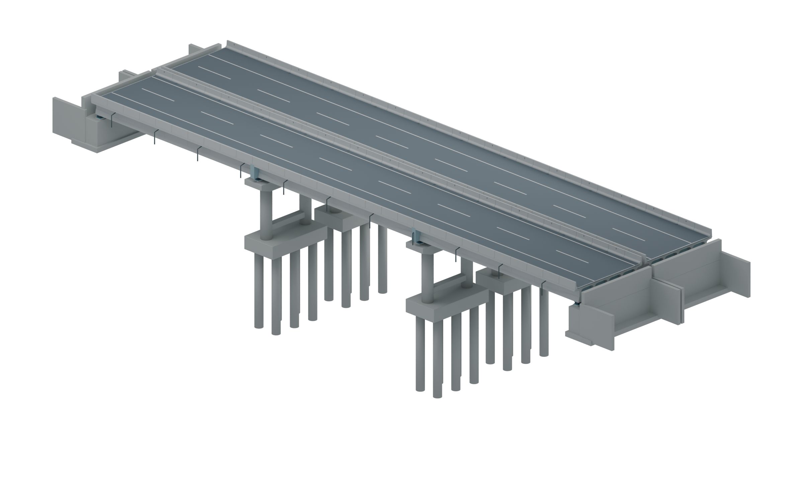{width=100%}
:::

这个案例与前面的算例有什么区别？

这里使用单幅12.50 m、名义3×30 m的装配式预应力连续T梁教学模型；前文20 m、10.8 m宽的五梁案例仍保留自己的荷载与尺寸。构件的识别方法可以借鉴，反力、内力和分配比例不能直接照搬。

上部主要尺寸参照公开图册，墩台基础与部分细部为教学补充。端台落座范围和横隔板站位已在教材副本中修正；<a href="../blender-model-review.html">查看来源和检查范围</a>。

<!-- BLENDER-BRIDGE-CASE END -->

<!-- BLENDER-REBAR-CASE START -->
##### 混凝土里面，哪些钢筋沿梁长走，哪些围成一圈？ {#t-girder-rebar}

隐藏混凝土，再从横断面看一段梁。沿梁长延伸的是纵向普通钢筋：腹板箍筋围住梁身内的纵筋，翼缘的横向联系筋另外包住较宽的翼缘纵筋。随梁长改变高低的管状构件是预应力孔道，用来为钢束留出通道。

::: {.content-visible when-format="html"}
<iframe src="../interactive/bridge-assembly/rebar.html" title="一片T梁中的纵筋、箍筋和预应力孔道" loading="lazy" style="width:100%;height:800px;border:1px solid #d9e1e3;border-radius:12px" allow="fullscreen"></iframe>

[单独打开钢筋观察页](../interactive/bridge-assembly/rebar.html)
:::

::: {.content-hidden when-format="html"}
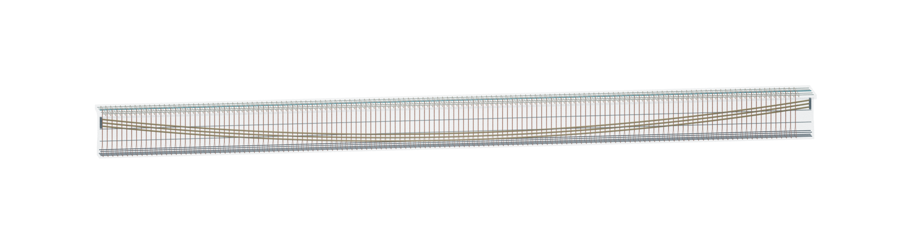{width=100%}
:::

这些名称分别指什么？

| 看到了什么 | 名称 | 先理解什么 |
|---|---|---|
| 腹板上方、箍筋顶部内侧的一对纵筋 | 上部架立纵筋 | 在本教学骨架中联系、定位主箍；它们也在箍环以内 |
| 梁下部、沿梁长走的钢筋 | 下部纵向普通钢筋 | “下部”说的是位置 |
| 腹板两侧、沿梁长走的钢筋 | 腹板纵向普通钢筋 | 不要把侧面的纵筋漏看成箍筋 |
| 翼缘内、沿梁长走的钢筋 | 翼缘纵筋 | 翼缘比腹板宽，配筋的观察范围也不同 |
| 沿腹板高度围住纵筋的闭合钢筋 | 腹板箍筋 | 注意上部架立筋也处于箍环内部；箍筋还参与抗剪等作用 |
| 沿翼缘宽度围住纵筋的钢筋 | 翼缘横向联系筋 | 本模型单列这一组，不把它误画成穿出腹板的大方箍 |
| 弯曲的管状通道 | 预应力孔道 | 孔道与穿在其中的预应力钢束是两种对象 |

能直接把上排叫受压钢筋、下排叫受拉钢筋吗？

先看荷载和所在截面。向下荷载使简支梁跨中产生正弯矩时，下缘有受拉趋势；连续梁中间支点附近出现负弯矩时，上缘可能有受拉趋势。预应力还会叠加轴压和弯矩。“受拉钢筋、受压钢筋”需要结合具体工况和截面设计判断，不能只按上下位置命名。

本模型仅表示一片梁的代表性钢筋骨架和孔道。为看清各组包裹关系，教材副本调整了原示意中的纵筋、箍筋与孔道布置；未完整表达施工图中的弯钩、搭接、锚固和全部配筋，不用于照图下料。图中的孔道没有代替实际预应力钢绞线。

<!-- BLENDER-REBAR-CASE END -->

预制小箱梁具有闭口截面和较好抗扭性能，梁间通过湿接缝和横梁连接。单箱制造、运输和架设受重量与宽度限制。端部、支点和预应力锚固区常有加厚和横隔构造，总体标准截面不能代表这些局部区域。

T梁各组成部分的受力职责较为清楚：翼缘板扩大受压区并参与桥面横向受力，腹板承担纵向弯曲形成的主拉压应力传递及剪力，横隔梁和湿接缝组织梁间协同。外梁还承担桥面悬臂板、护栏和偏心轮载，其截面与内梁即使几何相同，作用组合和横向分配也可能不同。建模时，预制翼缘和现浇桥面板的有效宽度、材料龄期及连接形成时间应与施工顺序一致。

小箱梁的闭口截面可提高单梁运输、架设及成桥后的抗扭能力，但“单片箱梁抗扭较强”不等于梁间无需可靠连接。车辆偏载时，各箱梁仍需通过湿接缝、桥面现浇层和端/中横梁协调变形。若接缝开裂或刚度退化，外侧单箱可能承担更高轮载并出现较大的梁间挠度差。既有桥评估宜将接缝刚度作为可变参数，而不是把全部梁片永久绑定为理想刚体横截面。

| 比较项目 | 板桥/空心板 | 装配式T梁 | 预制小箱梁 |
|---|---|---|---|
| 纵向主要受力 | 板带弯曲，空心后仍需检查剪切与端部 | 翼缘—腹板形成开口肋式截面 | 闭口薄壁弯曲并具有较强扭转作用 |
| 横向共同工作 | 板本体或铰缝、现浇层 | 桥面板、湿接缝、横隔梁 | 湿接缝、桥面层、端/中横梁及箱体扭转 |
| 施工状态 | 现浇整体或多片预制板 | 单T梁预制、运输、架设后整体化 | 单箱预制、运输、架设后整体化 |
| 易被忽略的位置 | 孔洞端部、铰缝、板端 | 梁端、横隔连接、桥面悬臂、预应力锚固 | 端横梁、湿接缝、腹板/顶板连接、箱内排水检查 |
| 模型升级触发条件 | 斜交、宽桥、接缝损伤、局部重载 | 横隔柔度、边内梁差异、局部板效应 | 曲线/斜桥、接缝退化、明显扭转与畸变 |

### 连续箱梁的体系与构造

连续箱梁把多跨连续体系与闭口薄壁截面结合起来。连续体系使支点区出现负弯矩并降低部分跨中正弯矩，箱形截面同时提供纵向弯曲、扭转和横向整体性。其设计对象不只是一条变高度外轮廓，而是顶板、底板、腹板、承托、横隔板、支承区、预应力钢束、施工接缝和检查空间共同组成的系统。

#### 等高度与变高度布置

等高度箱梁几何和模板重复性较好，适合结构高度允许、跨径较规则及施工标准化程度较高的桥梁。变高度箱梁在内支点附近加大梁高，可提高负弯矩区截面模量和剪切能力，并适应悬臂施工中靠近墩顶较大的弯矩；跨中梁高减小有利于降低自重和改善外观。变高度曲线应兼顾受力、模板、钢束、箱内通行和底板压应力，不能只按视觉曲线确定。

梁高变化还会改变截面形心和预应力偏心。若总体模型只给单元赋予变化的面积和惯性矩，却未检查形心轴偏移、刚臂或单元参考线，可能在人为偏心处产生附加轴力和弯矩。参数化模型应明确桥梁设计线、截面参考点和形心三者的关系。

#### 顶板、底板与腹板

顶板既承受车轮局部作用和横向板弯曲，又作为箱梁上翼缘承担纵向正应力；支点负弯矩区顶板可能受拉，跨中正弯矩区通常以受压为主。底板在跨中和支点区的应力角色随弯矩符号转换，变高度梁支点附近还可能承受较高压应力。腹板承担纵向剪力、参与弯曲和扭转剪流，并为预应力竖向分量和支承反力提供传力路径。

因此，空腔参数不能独立于板件功能确定。减薄顶板会增加横向板应力和轮载局部敏感性；减薄底板可能影响支点压应力、预应力束布置和悬臂施工稳定；减薄腹板会提高剪应力并压缩管道布置空间；减少腹板数量虽能减重，却会增大顶、底板横向净跨和截面畸变。概念设计应把每一次减薄对应到一个需要重新验算的作用路径。

#### 横隔板、支承区与开孔

支点横隔板将箱梁内分散的剪流、轴力和弯矩组织为支座反力，并约束截面畸变；中横隔板或横撑用于特定的横向分配、稳定、施工和扭转控制。横隔板上的人孔、管线孔和检查孔会打断局部力流，孔边需依据局部分析进行加强。将横隔板在总体梁模型中简化为刚臂时，应检查其刚度是否被无限放大；局部板壳或实体模型的边界力，应由总体模型截面合力传入。

#### 曲线、斜交与偏心布载

直线对称箱梁在中心竖向作用下可主要按弯曲理解；平曲线、斜支承或偏心车辆会引起明显扭矩，弯曲、扭转和畸变相互耦合。闭口箱梁能够有效传递整体扭矩，但顶、底板与腹板仍会发生横向弯曲和畸变应力。此时单梁模型可保留总体弯矩和扭矩趋势，控制截面设计通常需要梁格或板壳模型补充。

连续箱梁的构造识读可按“跨中标准截面—支点加厚截面—横隔板—合龙段—锚固区—支座”顺序进行。数字教材应允许沿桥轴移动剖切面，使学生看到截面并非沿全桥不变，并将每一构造变化与弯矩、剪力、扭矩、预应力和施工阶段对应。

### 钢梁与钢—混凝土组合梁

钢板梁和钢箱梁自重较小、工业化程度高，适合快速施工和较大跨径。总体设计除弯曲、剪切外，还涉及腹板屈曲、横向稳定、疲劳、焊接与连接。桥面板可为钢筋混凝土板或正交异性钢桥面板，二者具有不同刚度、施工和疲劳问题。

钢板梁通常由上、下翼缘与腹板组成，横向联结系和横隔构件在架设阶段维持空间稳定并在成桥后组织横向分配。钢箱梁为闭口薄壁截面，具有较好的整体扭转能力，适用于曲线、斜交、宽桥面或较大悬臂板等布置；同时需检查薄壁板件稳定、畸变、焊接残余应力、疲劳细节和箱内防腐维护。钢梁截面效率高并不意味着局部构造可以简化，支点、横隔、加劲肋、吊点和临时支承往往是施工与疲劳控制位置。

组合梁通过剪力连接件使混凝土桥面板与钢梁共同工作。正弯矩区混凝土板主要受压，负弯矩区桥面板可能受拉开裂，组合刚度和长期效应需相应处理。施工阶段钢梁可先独立承担自重和湿混凝土，混凝土达到强度后才参与后续作用；是否设置临时支撑会改变恒载分配。

剪力连接界面传递纵向剪力。完全组合假定界面无相对滑移，部分组合需考虑连接刚度与承载。总体模型可采用等效组合截面，研究滑移或局部连接时使用分层梁或壳—连接单元模型。

#### 组合截面的形成阶段

组合梁至少应区分钢梁架设、桥面板浇筑、混凝土达到规定强度、拆除临时支撑以及后续恒载和车辆作用等阶段。若桥面湿混凝土由未支撑钢梁承担，则该部分恒载应按钢梁截面计算；形成组合后增加的铺装、护栏及可变作用可按组合截面计算。若采用临时支撑，作用路径又会改变。把全部恒载施加在最终组合截面上，通常会高估施工阶段刚度并错误分配钢梁与混凝土板的应力。

在线弹性概念分析中，可选一种材料作为换算基准。若换算为钢材，弹性模量比可记为

$$
n=\frac{E_s}{E_c},
$$

其中 $E_s$、$E_c$ 分别为钢材和混凝土在相应阶段采用的弹性模量，单位均为 $\mathrm{Pa}$。混凝土板换算面积和惯性矩需按所采用方法处理；徐变、收缩、开裂和龄期会使长期等效刚度不再由一个固定 $n$ 完整描述。换算截面只是一种线弹性分析工具，不能取代材料各自的强度和正常使用验算。

#### 界面纵向剪力与连接

梁截面弯矩沿纵向变化时，钢梁与混凝土板之间需要通过连接件传递纵向剪力。在完全组合、线弹性且截面参数明确的简化条件下，单位长度界面剪力可用剪流关系表示为

$$
v_L=\frac{VQ}{I},
$$

其中 $V$ 为该截面竖向剪力，单位为 $\mathrm N$；$Q$ 为界面一侧换算面积对组合截面中性轴的一次矩，单位为 $\mathrm{m^3}$；$I$ 为换算截面惯性矩，单位为 $\mathrm{m^4}$；$v_L$ 为单位梁长需要传递的纵向剪力，单位为 $\mathrm{N/m}$。连接件布置还应考虑局部集中、疲劳、施工缝、板端和负弯矩区开裂，具体承载力与构造按现行组合结构规范确定。

连续组合梁内支点负弯矩区，混凝土桥面板受拉后可能开裂，钢梁上翼缘、纵向钢筋和剪力连接共同参与受力。分析可按规范要求采用开裂截面、考虑纵向钢筋的有效截面或更精细非线性模型。支点区不能沿用跨中正弯矩区的未开裂组合刚度而不作说明。

### 剪力滞与有效宽度

宽翼缘箱梁或组合梁受弯时，腹板附近翼缘纵向应力通常大于远离腹板区域，称为剪力滞。平截面假定在整个宽翼缘上不完全成立，工程设计常采用有效宽度或空间板壳分析。

有效宽度 $b_{\mathrm eff}$ 可定义为使均匀应力合力等于真实非均匀应力合力的宽度：

$$b_{\mathrm eff}\sigma_{\max}=\int_b\sigma_x(y)\,\mathrm dy.$$

具体定义和取值按采用标准。剪力滞受跨宽比、支承、荷载位置、悬臂板和截面变化影响，支点与跨中的有效宽度可能不同。局部板壳结果可通过纵向应力积分复核截面轴力和弯矩。

上式中的 $\sigma_{\max}$ 实质上是所采用定义下的参考应力；不同标准或研究可能采用腹板处应力、峰值应力或与梁理论对应的名义应力。使用有效宽度时必须同时给出参考应力定义，不能只抄录一个宽度数值。若应力分布在翼缘上改变符号，或局部峰值受支点、横隔板、集中轮载和网格影响，单一有效宽度未必能够代表全部设计效应。

剪力滞可通过“总体—局部”两级模型检查。总体梁模型给出截面轴力、弯矩、剪力和扭矩；板壳模型在相同截面位置积分纵向应力，所得合力应与总体模型相容。若两者不平衡，应首先检查边界截取、刚臂、偏置、有效宽度、开裂刚度和局部加载方式，而不是直接采用板壳单元上的最大节点应力。

数字资源可固定全桥纵向弯矩，逐步增加翼缘宽度或改变腹板间距，显示均匀梁理论应力与板壳应力分布的差异。学生应观察：远离腹板的翼缘是否充分参与；跨中与支点区分布是否相同；悬臂翼缘和箱室内翼缘是否具有相同有效程度。该实验强调“桥面更宽”会同时改变局部板受力、总体弯曲和有效宽度，而不是只增加可用截面面积。

### 梁桥变形与预拱度

梁桥变形包括弹性挠度、预应力上拱、收缩徐变长期变形、温度和基础变位。设计预拱用于补偿预计变形并形成目标成桥线形，不等同于简单取恒载挠度的相反数。施工阶段、铺装时点和长期预测共同决定预拱曲线。

预制梁存放时间改变徐变上拱，架设龄期差会导致桥面高差。连续梁悬臂施工中，节段立模标高由目标成桥线形、已发生和未来变形、挂篮变形、温度及测量误差共同确定。数字模型应输出各阶段理论标高和长期预测区间，并用实测数据更新。

#### 变形的分项记录

为避免把不同阶段和不同方向的变形混在一个“总挠度”中，可在统一符号约定下写成

$$
w(x,t)=w_g+w_{sg}+w_p+w_q+w_T+w_s+w_{cr},
$$

其中各项依次表示结构自重、附加恒载、预应力、可变作用、温度、支承变位以及收缩徐变等时变效应引起的竖向位移；$w$ 的单位为 $\mathrm m$ 或 $\mathrm{mm}$。该式只表示结果分项，不意味着各项在任何情况下均可线性叠加。开裂、几何非线性、接触、施工体系转换或材料时变耦合显著时，应采用与问题相适应的分析方法。

若规定向下位移为正，目标时点预计净下挠为 $w_f(x)>0$，则施工预拱可在概念上设置为向上的 $w_f(x)$；若预应力上拱或温度使预计净变形方向改变，则应按代数符号处理。实际立模标高还要加上挂篮、支架和模板变形修正，并结合测量基准。预拱度的依据应是“从当前施工状态到目标状态的预计净变形”，不是任意采用跨中一个最大值后画抛物线。

#### 预测—测量—修正闭环

悬臂施工或预制梁架设中，每一阶段均可比较理论标高与实测标高。偏差可能来自材料弹性模量、梁段重量、预应力有效值、温度、支架沉降、挂篮变形和测量误差。施工控制不宜把全部偏差一次性强制修正到下一节段，而应先判断偏差是否系统性、模型参数是否需要更新以及修正是否会在成桥后形成折线或附加内力。

数字记录表应保存测量时刻、环境温度、加载状态、仪器基准、理论值、实测值、差值、参数更新和下一阶段指令。这样，预拱度从一条静态几何曲线转化为可追溯的施工控制信息。

### 控制截面与结果组织

控制截面不是仅按等间距自动输出的若干节点，而是由体系、作用、构造和施工共同确定的检查位置。梁桥至少应考虑以下位置：跨中或正弯矩峰值附近；内支点负弯矩区；支点附近剪力与扭矩较大的截面；梁高、腹板或箱室变化处；预应力锚固和转向区；横隔板、人孔及集中荷载附近；施工合龙段、湿接缝和体系转换处；曲线、斜交或偏心作用下扭矩较大的位置。

| 控制位置 | 主要效应 | 需要的模型层级 | 结果审查 |
|---|---|---|---|
| 简支或连续梁跨中 | 正弯矩、挠度、预应力上拱 | 单梁总体模型＋必要的截面分析 | 与影响线峰值、简化梁估算和截面应力方向核对 |
| 连续梁内支点 | 负弯矩、剪力、次内力、支座反力 | 连续梁/施工阶段模型，必要时板壳 | 检查顶底缘应力、钢束线形、支点左右剪力定义 |
| 支点与横隔区 | 剪力、扭矩、局部承压和力流扩散 | 总体模型向局部板壳/实体子模型传力 | 截面合力平衡、边界距离和局部峰值网格敏感性 |
| 梁高或截面突变处 | 弯剪耦合、局部应力和预应力偏心变化 | 变截面梁＋局部壳模型 | 参考线、形心偏移、单元偏置和构造连续性 |
| 合龙段/连续接头 | 施工阶段内力、收缩徐变重分配、温度 | 分阶段总体模型 | 激活时刻、合龙温度、临时约束解除和长期效应 |
| 钢—混凝土界面 | 纵向剪流、滑移和疲劳 | 组合截面或分层梁/壳—连接模型 | 施工截面、有效宽度、连接刚度及合力相容 |

每个控制结果应绑定五项信息：截面坐标；作用组合或施工阶段；响应分量及正负号；模型版本；用于校核的独立证据。只给一张彩色云图而没有这五项信息，无法判断峰值属于什么状态，也无法在参数修改后追踪结果变化。

### 极限状态与验算接口

梁桥总体分析的输出通常包括内力、位移、支反力、应力结果或施工阶段状态；构件设计则把这些作用效应与相应抗力或限值比较。两类课程的接口可写为

$$
\text{总体模型}\longrightarrow S_d
\longrightarrow
\begin{cases}
R_d & \text{承载能力极限状态},\\
C_{\mathrm{lim}} & \text{正常使用极限状态}.
\end{cases}
$$

其中 $S_d$ 为按规定组合得到的设计作用效应，$R_d$ 为构件设计抗力，$C_{\mathrm{lim}}$ 为应力、裂缝、变形或其他正常使用限值。承载能力极限状态关注结构或构件达到最大承载能力、失稳或不适于继续承载的状态；正常使用极限状态关注正常运营条件下的应力、裂缝、变形、振动和耐久性相关要求。具体组合、分项系数、材料强度设计值与限值必须查用项目适用的现行规范，本章不以教学示例数值替代条文。

截至本稿编写时，公路桥涵作用、组合和总体原则应查用《公路桥涵设计通用规范》JTG D60—2015；混凝土及预应力混凝土构件设计应查用《公路钢筋混凝土及预应力混凝土桥涵设计规范》JTG 3362—2018及其现行配套规定。交通运输部2025年发布了JTG 3362—2018英文版，并明确中英文技术内容有异议时以中文版为准。教材定稿和再版时还应再次核对标准状态。

## 模型层级、验算接口与结果审查

#### 模型层级

梁桥模型应由分析问题决定，而不是由软件所能提供的最高维度决定。

1. **单梁模型**用于纵向总体受力、影响线和初步施工阶段分析，可快速核对数量级。
2. **鱼骨模型**以一根纵向主梁或脊梁配合横向刚臂表达桥面偏心，适合曲线或偏心作用的总体研究。
3. **梁格模型**以纵梁和横梁共同模拟空间分配，适合多主梁桥与移动荷载分析。
4. **板壳模型**能够表达桥面板、箱梁腹板和底板的面内与面外行为，适于宽桥、曲线桥及畸变分析。
5. **实体或局部模型**用于锚固、支承、连接和局部承压问题，不宜无差别地扩展到整桥。

#### 参数化模型

参数化建模应把设计变量、派生几何量和分析输出分层组织。例如箱梁模型的独立输入可设为跨径 $L$、桥宽 $B$、梁高 $H$、顶底板厚度、腹板厚度、箱室数和支承位置；箱室净宽、截面面积、形心和惯性矩由规则自动计算；输出为自重、刚度、关键截面效应及极限状态接口。模型应保留参数单位、取值范围、来源和版本，使每一次改变均可追溯。

AI可用于把教学任务转换为建模步骤、生成参数检查脚本、解释报错和比较不同方案，但结构对象、单位、边界条件、作用组合及验算结论必须由学习者核对。合适的提示词应约束输入、输出与校核，而不是要求系统直接给出“最优桥型”。例如：

::: {.prompt-card}
**建模提示词示例。** “建立三跨连续箱梁的教学模型。先输出参数表和单位，不执行计算；列出跨径、梁高、桥宽、箱室、材料、支座方向和施工阶段。随后给出自重反力平衡、对称性、简化梁弯矩及网格收敛四项校核。凡缺少的工程条件标为‘待确认’，不得自行补成规范值。”
:::

#### 结果审查清单

模型提交前至少完成下列检查：

- 几何中心线、截面局部轴和构件偏置是否一致；
- 材料重度、弹性模量、截面单位和钢束参数是否正确；
- 固定、活动和多向支座的约束方向是否符合体系；
- 结构自重是否遗漏或重复，附加恒载是否施加在正确阶段；
- 车道、车辆与横向偏心是否符合采用的作用模型；
- 施工阶段激活、合龙和体系转换是否与施工流程一致；
- 总反力与总荷载是否平衡，对称工况是否产生对称结果；
- 关键弯矩、剪力和位移是否与简化手算同阶；
- 梁格、板壳或局部模型加密后，控制结果是否趋于稳定；
- 输出中的峰值是否为真实结构效应，还是边界、刚臂或网格造成的数值集中。

## 贯通算例与方案比较

为说明本章方法，设一座直线、等宽、三跨连续混凝土箱梁作为教学对象。下列参数仅用于比较趋势，不代表标准梁型或规范推荐值：跨径组合为 $30+45+30\ \mathrm{m}$，桥面总宽 $12\ \mathrm{m}$，初选单箱双室截面，跨中梁高 $2.2\ \mathrm{m}$，支点梁高 $3.8\ \mathrm{m}$。分析按以下证据链组织。

本案例的目标不是直接完成施工图设计，而是贯通“任务定义—体系—截面—作用—影响线—横向分配—预应力—施工阶段—变形—极限状态接口—模型审查”。除上述教学几何外，材料强度、重度、铺装与附属设施、车辆作用、温度、收缩徐变、预应力参数、构造尺寸和限值均不得由教材代填为所谓通用值，应从项目采用的现行规范、勘察资料、标准图或经批准的设计条件输入。

#### 任务书与坐标约定

先建立右手坐标系：$x$ 轴沿桥梁纵向由左至右，$y$ 轴沿横桥向，$z$ 轴竖直向上；梁单元局部轴、截面顶底缘坐标和弯矩正负号均在模型说明中给出。四个支承线依次记为A、B、C、D，两侧边跨为AB、CD，中跨为BC。全桥关于中跨中线对称，可利用该特点检查几何、恒载反力和变形。

| 输入组 | 本案例已给内容 | 仍需规范或项目确定 | 记录要求 |
|---|---|---|---|
| 几何 | 三跨跨径、桥面总宽、单箱双室、跨中与支点梁高 | 道路横坡、平纵线形、腹板位置、悬臂长度、承托和横隔构造 | 参数名、单位、坐标基准、版本 |
| 材料 | 暂不预设设计值 | 混凝土、普通钢筋、预应力钢材的设计参数和龄期发展 | 来源条文或试验、采用日期 |
| 作用 | 结构自重由几何生成 | 附加恒载、车辆、人群、温度、风、制动力、沉降等适用项目 | 荷载组、方向、作用阶段、是否自动生成 |
| 支承 | 成桥为三跨连续梁 | 固定点、纵横向活动方向、支座刚度和墩台柔度 | 自由度表及支承编号 |
| 施工 | 先以支架现浇一次成桥为基准 | 实施方案、落架顺序、合龙、张拉、支架沉降和时间参数 | 阶段表及激活/解除事件 |
| 验算 | 需覆盖承载与正常使用接口 | 组合、分项系数、抗力、应力、裂缝、变形等限值 | 规范版本、控制截面和结果来源 |

#### 分析模型的递进

本案例建立三个相互校核的模型，而不是一开始只建最精细模型。

1. **M1单梁模型。** 沿箱梁形心线布置变截面梁单元，用于恒载反力、纵向弯矩剪力、影响线、预应力等效作用和施工阶段趋势。其优点是透明、运行快，适合作为基准；其限制是不能给出顶板横向局部效应、箱室畸变和精细剪力滞。
2. **M2梁格或脊梁—刚臂模型。** 以纵向梁和横向构件表达桥面宽度、偏心车道及扭转，用于横向分配和偏载。模型需检查刚臂长度、纵横梁交点、扭转常数和支座横向位置。
3. **M3板壳局部或全桥模型。** 顶板、底板、腹板和横隔板采用面单元，用于宽翼缘应力、横向板、畸变及支点局部力流。M3在同一截面上积分得到的轴力、弯矩、剪力和扭矩，应与M1/M2的截面合力同阶且方向一致。

三个模型共享桥轴、支承线、材料组、荷载组和结果截面编号。参数修改后应自动生成模型差异表，说明改变的是几何、刚度、作用还是边界，防止不同模型各自使用一套无法追溯的数据。

#### 体系与施工假定

成桥体系为三跨连续梁，主墩处设置竖向支承；纵向固定点位置需结合温度位移、制动力和墩台刚度确定。教学算例先采用支架现浇的一次成桥弹性模型，得到基准结果；再建立分段施工模型，比较恒载弯矩差异。若施工方案改为悬臂浇筑，必须增加墩顶临时固结、挂篮、节段激活、合龙和体系转换，不得只修改施工方法名称。

基准模型并不声称代表最终施工方案，它用于建立可手算的参照。对称恒载作用下，A与D、B与C的竖向反力应成对相等，挠度曲线也应关于中跨中线对称。若不对称，先检查截面赋值、支座方向、自重开关和单元局部轴。

分阶段模型可按“支架与永久支承就位—梁体分段浇筑—预应力分批张拉—拆除支架—铺装与附属设施—运营作用”建立。每一阶段只增加该阶段真实形成的构件和作用。若比较悬臂方案，则另建独立阶段树，不在支架现浇模型上简单增加“挂篮荷载”。两种施工方案最终可具有相同外形，但恒载弯矩、预应力次内力和成桥线形可能不同，这正是施工体系比较的重点。

#### 截面参数比较

在外轮廓不变时设置三组截面：A组为较厚腹板与底板，B组适度减薄，C组继续扩大空腔。数字实验依次计算 $A$、$I$、$W_t$、$W_b$ 和 $I/A$。若从B组到C组的自重继续下降，而顶板横向净跨、腹板剪应力或构造空间已不满足要求，则C组不能因几何效率较高而被选用。概念设计的输出应是“候选方案及排除理由”，而不是单一指标排序。

截面沿纵向至少设跨中标准截面、支点加高截面和两者之间的过渡截面。每一截面填写顶板、底板、外/内腹板、承托与空腔的分块表，计算面积、形心、$I$、$W_t$、$W_b$ 和薄壁教学近似下的 $J_t$。单位长度结构自重取

$$
g_1(x)=\gamma_c A(x),
$$

其中 $\gamma_c$ 为采用的混凝土重度，单位为 $\mathrm{N/m^3}$，$A(x)$ 的单位为 $\mathrm{m^2}$，故 $g_1$ 的单位为 $\mathrm{N/m}$。附加恒载 $g_2(x)$ 单独输入，不能通过增大材料重度与结构自重混合。

对A、B、C三组方案建立比较矩阵：自重、弯曲刚度、顶板横向净跨、腹板平均剪应力指标、扭转常数、钢束可布置区、箱内检查净空、施工模板复杂度。任何一项触发构造或分析边界，即进入“需修改”而不是继续用加权总分掩盖。最终保留A或B等候选，应写明其相对优势、控制约束及仍待规范验算的项目。

#### 移动荷载与控制位置

先在单梁连续模型中分别生成中跨跨中正弯矩、中支点负弯矩和边支点剪力影响线，核对正负区段；再按现行规范施加车道或车辆荷载，获得纵向控制效应。随后在梁格或板壳模型中改变车辆横向位置，记录最不利箱室或腹板。纵向加载与横向布载应分两个步骤解释，再由空间模型一次性验证。

控制响应清单至少包括：边跨跨中正弯矩 $M^+_{AB}$，中跨跨中正弯矩 $M^+_{BC}$，B、C支点负弯矩 $M^-_B$、$M^-_C$，A、D端支点及B、C两侧剪力，以及偏载下关键截面的扭矩。每一条影响线均保存纵标、正负区、单位、车辆控制位置和算法步长。

纵向计算先采用单位移动荷载验证影响线，再导入项目采用的车辆或车道作用。横向计算设置中心、左偏和右偏三类基准位置，检查对称性与合力/力矩平衡；随后按规范允许的最不利横向位置布载。M2或M3得到的各腹板竖向合力应与输入车轴作用一致，且对称结构在镜像车辆位置下应得到镜像结果。若传统横向分布法与空间模型差异较大，应追查横隔刚度、扭转、支点位置和模型边界，而不能只选择数值较大的结果。

#### 预应力试配与施工状态

钢束试配从目标功能开始：跨中束主要抵消正弯矩引起的底缘拉应力，支点束与连续束协调负弯矩区，施工束保证浇筑、顶推或悬臂阶段安全。先在M1中按钢束合力、偏心和等效荷载输入，检查预应力反力、上拱及顶底缘应力方向；再按现行规范计算损失和有效预应力。钢束数量、张拉控制应力、锚固和曲率不由本案例提供通用值。

对每一控制截面形成应力分项表：结构自重、附加恒载、预应力主效应、预应力次效应、车辆控制效应及相应组合。表中同时列施工阶段和运营阶段，避免把尚未形成的组合截面或尚未张拉的钢束用于较早阶段。若支点截面由负弯矩控制，应检查顶缘拉应力、底缘压应力及钢束在顶板/腹板内的可布置性；若跨中截面由正弯矩控制，则检查相反方向的应力状态与长期挠度。

#### 横向与局部构造检查

在M3模型中选取中跨跨中、B支点和截面过渡区三个局部窗口。跨中窗口观察顶板轮载局部弯曲、翼缘纵向应力分布和剪力滞；支点窗口观察横隔板、腹板和支座之间的力流扩散；过渡区检查梁高变化、形心轴和预应力偏心变化。局部模型采用的边界内力由M1/M2传入，并通过截面应力积分回收合力。

人孔、横隔开孔、管道密集区和锚固区只在总体模型中以平均刚度表示时，不得直接读取局部最大应力。若局部构造尚未确定，案例结果应标为“总体效应已确定，局部设计待完成”。

#### 变形与预拱度

分别输出拆架/体系转换后、桥面附加恒载完成后、运营基准时点和长期目标时点的线形。记录结构自重下挠、预应力上拱、附加恒载、收缩徐变和车辆短期挠度，不将不同时间的极值简单相加。预拱度工作表以目标成桥线形为基准，给出各施工断面的预计未来净变形及立模修正；所有数值保留方向和时间戳。

若有施工测量数据，可用实测—理论差更新材料刚度、节段重量、预应力有效值或临时支架变形，但每一次更新均需保留旧值、依据和影响范围。参数更新后重新计算剩余阶段，不回写已发生状态以人为消除历史偏差。

#### 结果核验

应提交以下最小证据：全桥自重与竖向反力平衡表；对称恒载下的对称反力和变形；跨中正弯矩与简化梁估算的数量级比较；中支点负弯矩影响线的正负区段；不同横向加载位置下各腹板反力之和；至少两种网格尺度的控制结果对比。只有这些检查通过，模型结果才能进入构件验算。

结果核验采用“先整体、后截面、再局部”的顺序。

1. **整体平衡。** 对每个荷载组分别检查总竖向反力、水平反力和必要的整体力矩平衡；自重必须与 $\int\gamma_cA(x)\,\mathrm dx$ 同阶。
2. **体系与对称。** 对称恒载结果成对相等；释放一个支座方向后，温度反力变化应符合预期；施工阶段激活/解除后不存在无意的机构或重复约束。
3. **基准解。** 选一个等截面简支子模型，与 $gL^2/8$、$gL/2$ 对比；选一个单位移动荷载位置，与影响线纵标计算对比。
4. **截面相容。** 梁单元输出的轴力、弯矩、剪力和扭矩与板壳截面应力积分结果相容；顶底缘应力方向与内力符号一致。
5. **敏感性。** 改变网格、横隔刚度、支座刚度、施工阶段和有效预应力，记录控制结果变化；只对真实不确定参数进行范围分析。
6. **极限状态接口。** 每个设计作用效应 $S_d$ 指向相应的抗力或限值计算，记录规范条文、组合和控制截面；模型云图本身不是验算结论。

#### 案例成果包与方案结论

贯通案例的成果不是一份软件截图，而是一套可复算资料：任务书与待确认项；参数和单位表；体系及施工阶段图；A、B、C截面比较；M1、M2、M3模型说明与版本；影响线和车辆控制位置；横向分配平衡表；预应力与截面应力分项；线形和预拱度工作表；控制截面极限状态接口；模型审查记录；图源、数据源和规范版本。

案例结论采用条件式表述。例如：“在本教学几何、当前线弹性材料参数和支架现浇基准体系下，B组截面在自重与弯曲几何效率之间较为均衡；其腹板剪切、顶板横向受力、预应力构造、长期变形及全部规范验算尚待完成。”这种结论明确模型说明了什么，也明确尚不能据此作出的工程决定。

::: {.digital-note}
**数字资源4-3　模型审查记录。** 学生上传模型参数表、边界条件示意、三张控制结果图和校核表。系统自动检查单位完整性、反力平衡和文件一致性，并提示可能的异常项；教师依据体系、施工阶段与极限状态证据给出最终评价。
:::

::: {.digital-note}
**数字资源4-4　三跨连续箱梁贯通工作簿。** 工作簿依次开放任务书、截面参数、施工阶段、影响线、横向分布、预应力、变形和模型审查八个页签。每个页签必须通过单位、平衡或适用条件检查后才能进入下一步；最终导出包含输入来源、模型版本、控制结果和待核事项的PDF记录，而不是自动生成“合格”结论。
:::

::: {.digital-note}
**跨课程概念入口。** 本章可配合 Manchester *Seeing and Touching Structural Concepts* 的 [Different Cross Sections](https://epsassets.manchester.ac.uk/structural-concepts/Statics/sections/section_con.php)、[Bending](https://epsassets.manchester.ac.uk/structural-concepts/Statics/bending/bending_con.php)、[Shear and Torsion](https://epsassets.manchester.ac.uk/structural-concepts/Statics/shear/shear_con.php)、[Span and Deflection](https://epsassets.manchester.ac.uk/structural-concepts/Statics/span/spans_con.php) 与 [Prestress](https://epsassets.manchester.ac.uk/structural-concepts/Statics/prestress/prestress_con.php) 使用。链接用于课前实体概念观察，正文公式、桥梁构造和规范验算仍由本章完成。
:::

### 不同梁型的体系、构造与施工比较

#### 比较边界

板桥、装配式T梁、装配式小箱梁、现浇连续箱梁和钢—混凝土组合梁并不是只按跨径依次替换的产品序列。桥面宽度、斜交与曲率、结构高度、预制运输、现场浇筑、支点数量、耐久环境和维护条件都会改变其合理性。比较时先固定桥面功能、跨越条件、作用体系和评价边界，再为每种梁型形成完整的“上部结构—横向联系—支承—施工—维护”方案。

| 梁型 | 纵向承重 | 横向共同工作 | 施工形成 | 主要优势线索 | 需要同步审查 |
|---|---|---|---|---|---|
| 实心或空心板 | 板带纵向弯曲、剪切 | 铰缝、湿接缝或整体板分配 | 预制架设或现浇 | 建筑高度较小、构造直观 | 板端、铰接缝、横向整体性、耐久和偏载 |
| 装配式T梁 | 梁肋与翼缘纵向弯曲 | 横隔、湿接缝和桥面整体化 | 单梁预制、运输、吊装、现浇连接 | 标准化、单片构件可制造 | 单梁稳定、翼缘连接、横向分配和梁端局部 |
| 装配式小箱梁 | 闭口或施工阶段开口梁纵向工作 | 湿接缝、横隔与桥面层连接多片箱 | 预制、运输架设、横向及连续化 | 单片抗扭、预制质量控制 | 箱内外耐久、接缝、支点横隔、负弯矩连续区 |
| 现浇连续箱梁 | 连续箱梁承担正负弯矩、剪切和扭转 | 顶底板、腹板和横隔形成空间整体 | 支架、移动模架、顶推或悬臂等 | 线形适应、整体性和抗扭 | 自重、施工阶段、时变、剪力滞、畸变与检修 |
| 钢—混凝土组合梁 | 钢主梁与混凝土桥面板组合受弯 | 横梁、桥面板与连接件分配 | 钢梁架设后浇筑或安装桥面板并形成组合 | 自重较低、工厂制造与快速架设 | 组合形成阶段、界面剪力、疲劳、防腐与负弯矩区 |

表中“优势”只表示可进一步比较的方向。装配式构件减少现场湿作业，不表示无需施工阶段分析；闭口小箱梁具有较高自由扭转刚度，不表示多梁之间自动均匀分配；现浇箱梁线形适应性较强，不表示任意曲线和斜交都可用单梁模型；钢组合梁降低自重，也会增加连接、疲劳与防腐任务。

#### 板桥

板桥可由整体板、预制实心板或空心板组成。纵向计算常把一定宽度的板带视为梁，但横向分配、轮载局部扩散、铰缝或湿接缝对整体工作具有重要影响。空心布置降低结构重力，同时改变截面剪切、端部锚固、排水与耐久细节；端部空腔封堵和支承区需要把集中反力扩散至有效截面。

板桥模型应区分整体板与多片预制板。整体板可用板单元或满足条件的等效方法；预制板在接缝形成前为独立构件，架设和桥面施工阶段的横向连接不同。运营中若接缝刚度退化，轮载分配和局部挠度会变化，不能永久采用“全宽共同工作”而不验证连接状态。

#### 装配式T梁

T梁把较多材料布置在翼缘与梁肋，单片梁具有明显开口截面特征。运输、吊装和横向连接未形成时，侧向弯曲与扭转稳定比成桥状态敏感；吊点位置改变会使梁段出现与成桥不同的正负弯矩。架设后，横隔、湿接缝与桥面现浇层逐步形成横向体系，新增作用由相应阶段的有效截面承担。

横向分布分析应明确梁间连接刚度、横隔位置、桥面连续性和支座横向布置。若把每片T梁都简化为独立单梁，再用固定分配系数处理全部截面和全部作用，难以反映支点附近、横隔处与跨中差异。梁格模型可以把主梁和横梁共同工作显式化，板壳模型进一步表示翼缘与接缝局部。

#### 装配式小箱梁

小箱梁单片为闭口截面时具有较好的扭转性能，并能在预制场完成较多工序。成桥横向整体性仍依赖湿接缝、横隔和桥面层；单片箱梁抗扭不等于全桥偏载分配均匀。支座附近的端横隔、预应力锚固、腹板和底板把集中反力及钢束作用闭合，构造空间需与模型传力一致。

先简支后连续小箱梁至少经历单梁预制与张拉、运输、架设、桥面及接缝施工、墩顶连续化和运营等状态。结构重力多由简支单梁承担，连续区形成后的作用由连续体系承担；负弯矩区材料、接头和预应力构造应有明确设计路径。若只建立成桥连续模型，会把早期恒载错误分配到支点负弯矩。

#### 现浇连续箱梁

连续箱梁把桥面宽度、纵向弯曲和扭转组织在一个或多个闭口箱室中，适应变宽、曲线和连续布置。截面沿纵向可等高或变高，顶、底板和腹板厚度亦可能变化。支点区的负弯矩、剪力、横隔和支座反力，与跨中的正弯矩、底板受力和较大挠度形成不同控制区域。

施工方法对自重内力和线形具有决定性影响。满堂支架、移动模架、逐孔、顶推和悬臂施工形成不同的支承与加载历史；同一成桥截面在施工中可能是开口槽形、局部闭合或不对称悬臂。预应力束按阶段张拉，并与混凝土龄期、收缩徐变和合龙温度共同决定成桥状态。

#### 钢—混凝土组合梁

钢主梁在桥面板形成组合前承担钢梁自重、施工设备和湿混凝土；组合形成后，后续作用由钢梁、桥面板和剪力连接共同承担。若采用临时支撑或顶升，形成阶段和初始应力会改变。必须按阶段确定有效截面，而不能把全部恒载都施加在最终组合截面上。

组合梁的横向体系包括横梁、横向联结、桥面板和支承。开口钢梁在架设阶段的侧扭稳定与成桥不同，横向联结既参与施工稳定，也影响运营期横向分配。负弯矩区混凝土受拉、钢梁受压，开裂、局部稳定与连接受力需要按采用规范处理。

#### 梁型选择工作表

梁型初选应提交原始指标而不只提交加权总分：结构高度、单位桥长材料与质量、预制构件最大尺寸和质量、运输路线、吊装或支架条件、横向连接数量、施工交通影响、预应力或焊接工作、支座与伸缩装置、检查入口、排水、防腐、易损细节和预计更换方式。每一项标明来源、估算精度和设计阶段。

若某梁型违反净空、运输、架设或检查等硬约束，应记录筛除理由；若只是工程量或工期相对不利，仍可进入可比评价。软件生成的截面效率、材料用量或造价只能作为输入，推荐结论需同时解释体系、构造和施工。

::: {.digital-note}
**数字资源4-5　梁型体系—构造—施工比较器。** 固定桥面和跨越条件，依次切换板桥、T梁、小箱梁、连续箱梁和钢组合梁。页面同步显示施工阶段拓扑、横向连接、结构高度、维护对象和所需模型层级；工程量采用教学参数或用户导入数据，系统不内置通用适用跨径和最佳梁型。
:::

### 完整数值链：影响线、移动轴组与横向分配

#### 教学模型与坐标

采用一跨计算跨径 $L=24.0\ \mathrm m$ 的直线简支多梁桥，考察跨中正弯矩。横向设置四片等刚度主梁，其相对桥面中心线坐标为

$$
y_1=-4.50\ \mathrm m,\quad
y_2=-1.50\ \mathrm m,\quad
y_3=+1.50\ \mathrm m,\quad
y_4=+4.50\ \mathrm m.
$$

纵向作用采用教学轴组 $P_1=120\ \mathrm{kN}$、$P_2=180\ \mathrm{kN}$，轴距 $d=4.0\ \mathrm m$；另有教学均布作用 $q=8.0\ \mathrm{kN/m}$。横向合力作用线的教学偏心为 $e=+2.00\ \mathrm m$。所有数值仅用于验证影响线积分、移动位置与横向平衡，不是任何规范车辆、车道或横向折减规定。

本例先把纵向和横向分开：纵向影响线求全桥指定响应，横向刚性分配近似再把该响应分配给四片主梁。真实桥梁的车轮具有各自纵横坐标，纵横行为可能耦合；本例结束后必须用梁格或板壳模型复核。

#### 第一步：跨中弯矩影响线

单位竖向移动力位于距左支点 $x$ 处时，跨中弯矩影响线为

$$
\eta_M(x)=
\begin{cases}
x/2, & 0\le x\le L/2,\\
(L-x)/2, & L/2<x\le L.
\end{cases}
$$

$x$ 与 $\eta_M$ 的单位均为 m；单位力乘以纵标后得到弯矩。影响线在支点为零、跨中峰值为

$$
\eta_{\max}=L/4=6.0\ \mathrm m,
$$

全跨均为正。这三个特征先由平衡方程核对，再与有限元单位移动荷载结果比较。

影响线离散表至少保存 `path_x_m`、`eta_M_m`、截面编号、响应正号、单位力方向和模型版本。若使用有限元移动荷载模块，先选择 $x=8.0\ \mathrm m$ 的单个单位力，手算

$$
\eta_M(8)=4.0\ \mathrm m
$$

并核对软件结果，然后才进行轴组搜索。

#### 第二步：轴组最不利位置

取较重轴 $P_2$ 的位置为 $a$，较轻轴位于 $a-d$。轴组响应为

$$
M_P(a)=P_2\eta_M(a)+P_1\eta_M(a-d).
$$

在本例允许两轴均位于桥面路径的条件下，分段考察 $a$ 可知最优位置为较重轴位于跨中，即 $a=12.0\ \mathrm m$，较轻轴位于 $x=8.0\ \mathrm m$。因此

$$
M_P=180\times6.0+120\times4.0
=1560.0\ \mathrm{kN\cdot m}.
$$

程序输出不能只写“最不利弯矩1560”。应同时保存轴序、轴重、轴距、两轴坐标、两处影响线纵标和单轴贡献 $1080$、$480\ \mathrm{kN\cdot m}$。轴组方向反转时应重新搜索；若荷载模型规定轴组、间距或进入/离开桥面的条件，不得由优化器改变。

#### 第三步：均布作用积分

由于跨中正弯矩影响线全跨为正，本教学均布作用覆盖全跨。影响线面积为

$$
A_\eta=\frac12L\eta_{\max}
=\frac12\times24.0\times6.0
=72.0\ \mathrm{m^2}.
$$

均布作用效应为

$$
M_q=qA_\eta
=8.0\times72.0
=576.0\ \mathrm{kN\cdot m}.
$$

纵向总教学效应为

$$
M_{\mathrm{tot}}=M_P+M_q
=2136.0\ \mathrm{kN\cdot m}.
$$

本例未施加冲击、车道折减或组合系数。若项目规则在车辆作用层加入相应因子，应明确施加位置并避免在第3章组合层重复。均布作用是否与集中轴同时使用、覆盖何种影响区及取值，必须按项目采用规范确定。

#### 第四步：横向刚性分配近似

为演示横向合力和力矩平衡，假定横向结构足够刚、四片主梁纵向刚度相同、支承和几何对称，并忽略扭转柔度、桥面板局部和横隔离散。第 $j$ 片梁的分配系数写为

$$
m_j=\frac1n+\frac{e y_j}{\sum_{i=1}^{n}y_i^2},
\qquad n=4.
$$

$e$、$y_j$ 单位均为 m，故 $m_j$ 无量纲。本例

$$
\sum y_i^2
=(-4.5)^2+(-1.5)^2+(1.5)^2+(4.5)^2
=45.0\ \mathrm{m^2}.
$$

得到

$$
[m_1,m_2,m_3,m_4]
=[0.0500,\ 0.1833,\ 0.3167,\ 0.4500].
$$

分配结果满足

$$
\sum_{j=1}^{4}m_j=1,
\qquad
\sum_{j=1}^{4}m_jy_j=e=2.00\ \mathrm m.
$$

第一式检查竖向合力，第二式检查关于桥面中心的横向力矩。若输入镜像偏心 $e=-2.00\ \mathrm m$，系数应反序；这一镜像关系是对称桥模型的重要测试。

#### 第五步：各梁跨中弯矩

在本教学分离近似下，各梁跨中弯矩为

$$
M_j=m_jM_{\mathrm{tot}}.
$$

| 主梁 | 横坐标 $y_j$/m | 分配系数 $m_j$ | 跨中弯矩 $M_j$/(kN·m) |
|---:|---:|---:|---:|
| 1 | $-4.50$ | $0.0500$ | $106.8$ |
| 2 | $-1.50$ | $0.1833$ | $391.6$ |
| 3 | $+1.50$ | $0.3167$ | $676.4$ |
| 4 | $+4.50$ | $0.4500$ | $961.2$ |

由于表中系数显示经过舍入，复算合计时采用未舍入值。四片梁弯矩之和为 $2136.0\ \mathrm{kN\cdot m}$。第4片梁控制仅是本偏心和刚性横向近似的结果，不表示实际桥梁外梁在所有截面、所有车辆位置和所有横向体系中均控制。

#### 第六步：适用条件和空间模型复核

刚性横向分配忽略了主梁扭转、桥面板柔度、横隔间距、斜交、曲率、支座位置和截面差异。梁格模型至少显式建立四片纵梁、横梁或等效桥面联系、真实支座横向坐标和车辆轮迹。板壳模型进一步表示桥面板、翼缘、腹板与局部轮载。

空间模型复核采用同一教学轴组和横向合力位置，输出四片梁在跨中的截面弯矩及全桥合力。先检查镜像加载结果，再比较分配系数

$$
m_{j,\mathrm{FE}}=
\frac{M_{j,\mathrm{FE}}}
{\sum_iM_{i,\mathrm{FE}}}.
$$

若与简化方法有差异，依次检查横向构件刚度、主梁扭转、支点横向约束、荷载施加与结果积分，不以“取大值”代替原因分析。简化方法可以作为初算和校核，最终采用方式按桥型、跨径、横向构造和适用规范确定。

#### 第七步：进入组合与验算

本例输出的是一个教学车辆单项效应。进入第3章时，需建立作用来源、代表值、车辆派生项、主导/伴随关系和组合；进入构件验算时，需从控制车辆位置和控制组合行读取同一截面的 $N,M,V,T$，不能把不同位置的四个峰值拼接。

第4片梁的 $961.2\ \mathrm{kN\cdot m}$ 不能与材料抗力直接比较，因为尚未包含规范车辆、动力、组合、永久作用、预应力和截面设计抗力。它只验证“单位移动作用—轴组位置—均布积分—横向平衡—空间复核”这一算法链。

::: {.digital-note}
**数字资源4-6　纵横向移动荷载完整工作簿。** 第一页只显示跨中影响线和单位力；第二页开放轴组移动；第三页加入均布作用；第四页显示横向坐标、偏心和两条平衡式；第五页与梁格结果比较。学生可回放每一步，正式导出保留坐标、公式、单轴贡献、各梁结果、适用条件、模型版本及复核记录。
:::

### 曲线梁桥与斜交梁桥的分析接口

#### 曲线梁桥

曲线桥的纵向轴线在平面内转向，竖向作用相对截面剪心和支承布置可能形成扭矩；构件局部轴沿曲线变化，弯矩、扭矩和剪力需要在一致的随动坐标中解释。内外侧腹板实际路径长度不同，支座方向、横坡和超高过渡进一步改变空间反力。

曲线梁不能简单用直梁弯矩加一个恒定偏心扭矩表示全部行为。总体杆系可用空间曲梁或折线梁单元进行初算，但折线离散需检查单元局部轴、节点转角和弯扭输出是否连续；梁格或壳模型用于横向分配、截面畸变和支点横隔。闭口箱梁具有较高自由扭转刚度，仍需区分Saint-Venant扭转、翘曲约束和截面畸变。

曲线桥模型至少进行四项测试：均布自重下总竖向反力；关于全桥参考点的平面力矩；镜像或反向曲率模型的结果变换；释放某支座横向约束后的反力变化。若所有支座方向均沿同一全局轴复制，可能无意约束径向或切向位移。

#### 斜交梁桥

斜交桥的支承线与桥轴不正交，实际支承距离、横隔方向和荷载到支座的最短路径不同。钝角与锐角附近反力和板壳局部效应可能不对称，即使桥面外轮廓看似规则。影响线沿车辆路径定义，横向分布则与斜支承和横隔共同作用，传统正交桥简化方法的许可需要重新检查。

杆系模型应明确梁轴、支承线、刚臂和支座实际坐标；梁格模型不应为了网格整齐把斜支承改成正交。板壳模型可表示斜边界与桥面板力流，但支座集中处需要合理的分布连接和局部网格，避免单节点奇异应力成为设计值。

斜交模型的基准包括：小斜角趋近正交时结果连续；对称斜交几何与镜像荷载满足镜像关系；所有支座反力合力与合力矩平衡；沿不同梁轴提取的跨径和内力使用正确局部坐标。若简化横向分配与空间模型差异增大，应报告斜交、扭转和横隔机制，不直接归因于“软件更精确”。

#### 曲线、斜交与预应力

预应力束线在空间曲线梁中可能同时具有竖向和平面曲率，等效作用包含多个方向；支点偏心和横隔将局部作用传入箱梁。束线坐标应绑定结构随动坐标并检查几何连续，不能只在立面画抛物线而忽略平面曲率。摩阻、锚固与偏差效应的计算按采用规范进行。

施工阶段中，开口钢梁、U形节段或未形成横隔的曲线构件扭转刚度可能显著低于成桥；吊装点和临时支撑的平面位置直接影响稳定。成桥空间模型不能替代架设状态。曲线或斜交一旦达到项目规定的专项分析条件，应使用相应标准和审查程序，本节不设通用阈值。

::: {.digital-note}
**数字资源4-7　曲线与斜交模型许可检查。** 用户从直线正交基准逐步增加曲率或斜交，每次只改变一个几何参数，页面显示局部轴、支承方向、反力中心、弯矩和扭矩。简化横向方法的假定始终可见；超出课程组验证范围后，资源停止给出分配结论并要求进入梁格或壳模型。
:::

### 预应力、施工阶段与线形控制深化

#### 以事件定义施工阶段

预应力混凝土梁桥的阶段不能仅用“第1步、第2步”编号。每个事件应写明：激活的混凝土或预制构件；达到的材料龄期；新增或解除的支承；张拉的钢束组及有效输入；新增结构与施工作用；需要继承的位移、应力和时变状态；本阶段测量与控制项。

对先简支后连续梁，可采用“预制与首批张拉—运输吊装—简支承担自重—横向连接和桥面形成—墩顶连续化—后续预应力—附加恒载—运营”的事件链。对悬臂施工连续箱梁，则采用“墩顶块与临时固结—成对节段及挂篮—分批张拉—边跨/中跨合龙—体系转换—桥面”的事件链。两者不可共用一个只改变工况名称的模型。

#### 预应力作用的三种核查

第一项为截面核查：在远离锚固和扰动区的截面，检查轴向合力和弯矩是否与 $P_e$、$P_ee_p$ 相容，顶底缘应力符号是否符合束线位置。第二项为结构核查：曲线束等效荷载、端部锚固力和超静定反力是否整体平衡。第三项为阶段核查：钢束是否只在张拉后生效，有效截面和材料状态是否与张拉时刻一致。

采用等效荷载、初始应变或专门钢束单元时，应在一个静定梁基准上比较三种实现。静定基准可以隔离预应力主效应；连续梁进一步出现次内力。若不同实现差异较大，先核查符号、钢束曲率离散、锚固端和损失施加层级，不通过人为调整钢束力使某一截面吻合。

#### 线形与预拱度工作表

线形控制按时间记录，不把全部挠度一次相加。对施工断面 $i$，目标立模或制造高程可概括为

$$
z_{i,\mathrm{set}}=
z_{i,\mathrm{target}}-
\sum_k\Delta z_{i,k},
$$

其中，$z_{i,\mathrm{target}}$ 为目标状态高程，单位为 m 或 mm；$\Delta z_{i,k}$ 为从设置时刻到目标时刻预计由结构重力、预应力、支架、收缩徐变、温度及后续施工产生的带符号变化。各项使用同一竖向正号和时间基准。

预测值与实测值并列保存。实测偏差可能来自节段重量、材料刚度、预应力有效值、温度、支架和测量误差，更新时只调整有证据的参数，并用未参与更新的测点验证。已发生阶段的实测状态作为历史保留，不反向修改以得到“完美”计算曲线。

### 钢组合梁、疲劳与耐久接口

#### 组合形成和截面换算

钢—混凝土组合梁分析首先确定组合界面何时有效。若无临时支撑，钢梁自重和湿混凝土通常由未组合钢梁承担，桥面板达到规定条件后的附加作用才由组合截面承担；若采用临时支撑、预顶升或分段桥面板，初始应力和阶段需相应建模。

在线弹性教学换算中，可选择参考材料并用模量比换算截面。若以钢材为参考，某阶段的模量比可写为

$$
n=\frac{E_s}{E_c},
$$

$E_s$、$E_c$ 使用相同单位，$n$ 无量纲。混凝土有效宽度、开裂、收缩徐变、温差与模量随时间变化均影响换算结果，具体处理按项目采用规范。不能以毛截面全宽混凝土板无条件参与所有阶段。

#### 界面剪力和连接件

组合截面弯矩沿桥变化时，钢梁与混凝土板之间需要纵向剪力传递。在线弹性梁理论的一个接口形式为

$$
q_L=\frac{VQ}{I},
$$

其中，$q_L$ 为界面单位长度剪力，单位 N/m 或 kN/m；$V$ 为截面剪力；$Q$ 为界面一侧换算面积对中性轴的一次矩，单位 m³；$I$ 为换算截面二次矩，单位 m⁴。公式用于说明界面剪流来源，实际连接件设计还需考虑连接刚度、间距、构造、疲劳、负弯矩区和采用规范。

数值模型可采用完全组合、部分相互作用或显式连接件。完全组合梁单元不能输出单个剪力连接件的局部作用；显式非线性连接模型需要可靠本构和网格。模型层级由设计问题决定，并以界面总剪力、相对滑移和截面合力相互校核。

#### 疲劳作用效应

疲劳关注重复作用引起的应力范围和循环，而不是仅检查一次最大设计应力。对某细节，教学上记录应力历程中的范围

$$
\Delta\sigma=\sigma_{\max}-\sigma_{\min},
$$

或相应剪应力范围。$\Delta\sigma$ 的单位为 MPa。交通疲劳模型、动力处理、细节类别、循环计数和验算曲线必须按项目采用的现行规范确定，本章不提供通用类别或限值。

疲劳效应提取的位置应对应真实细节和局部应力定义。总体梁单元名义应力适用于相应规范名义应力方法，不能直接代表焊趾、开孔或连接件热点。使用壳或实体模型时，需说明应力线性化、网格与热点外推方法，不能把单元角点奇异峰值当成应力范围。

施工焊接、横隔与主梁连接、加劲肋端部、桥面板细节和剪力连接件可能具有不同疲劳路径。方案阶段通过减少不必要的应力集中、提供连续力流和检查可达性降低风险；详细类别和验算由钢桥或组合桥规范完成。

#### 耐久和维护

钢梁耐久与防腐体系、排水、缝隙、积水、通风和检查条件有关；混凝土桥面板还涉及裂缝、渗水和界面保护。梁端、伸缩缝下方、支座区、箱内低点和排水管附近应在三维模型中作为重点维护对象。涂装面积和施工可达性进入全寿命评价，不能只按初始钢材质量比较方案。

组合梁的桥面板更换可能改变组合状态和横向稳定。运维情景应分阶段卸除铺装或板块、设置临时连接和交通转换，并检查剩余钢梁与横向联结。若设计只验证完整成桥截面，无法证明维修状态可实施。

::: {.digital-note}
**数字资源4-8　钢—混凝土组合阶段与疲劳接口。** 时间轴显示钢梁架设、湿混凝土、形成组合、附加恒载、交通与桥面板更换；每阶段显示有效截面、应力增量和界面剪流。疲劳页只输出应力历程、范围、提取位置和数据来源，细节类别与限值必须由经核对的规范规则导入。
:::

### 梁桥模型核验与贯通案例证据包

#### 四级模型许可

梁桥模型按问题授予许可，而不按软件名称评价精度。一级单梁模型用于纵向总体平衡、弯矩剪力、影响线和阶段趋势；二级梁格用于多梁横向分配、支承偏心和扭转；三级壳模型用于箱梁板件、剪力滞、畸变和横隔；四级局部实体或精细壳模型用于锚固、支点、连接和局部稳定。每一级明确不能回答的问题。

模型升级前先提出证据需求。例如传统横向分布方法不能解释斜交偏载，才升级梁格；梁格不能得到顶板轮载局部弯矩，才升级壳；总体壳模型的支点应力受网格奇异影响，才建立带真实承压范围的局部模型。精细模型不替代上一级平衡，而应回收截面合力与总体模型对接。

#### 基准、对称、守恒与收敛

每个模型至少设置四类测试：

1. **解析基准**：等截面简支子模型与 $qL/2$、$qL^2/8$、影响线和弹性挠度比较；
2. **对称或镜像**：对称恒载、左右偏载与反向曲率/斜交的结果满足几何关系；
3. **守恒**：总力、总力矩、横向分配合力与施工阶段增量保持平衡；
4. **收敛与敏感性**：网格、时间步、横隔和支座刚度改变后，控制结果趋于稳定或变化有物理解释。

结果差异分为数据差异、模型形式差异、离散误差和物理不确定性。只有离散误差适合主要通过加密网格处理；若边界或施工阶段错误，更细网格只会更精确地计算错误模型。

#### 三跨连续箱梁证据包

前述 $30+45+30\ \mathrm m$ 三跨教学箱梁最终提交以下关联文件：

| 编号 | 成果 | 核心内容 | 通过条件 |
|---|---|---|---|
| E01 | 任务与依据 | 坐标、桥面、桥位条件、规范版本和待确认项 | 数据有来源、单位和状态 |
| E02 | 体系与施工 | 支承自由度、施工事件、预应力与体系转换 | 各阶段稳定且作用不重复 |
| E03 | 截面与构造 | 跨中、支点、过渡截面及A/B/C比较 | 几何、自重、刚度和构造同步 |
| E04 | 作用与组合接口 | 单项作用、影响线、车辆位置和第3章组合编号 | 控制结果可反向追踪 |
| E05 | 横向与空间 | 分配假定、梁格/壳模型、偏载与镜像测试 | 合力、力矩及模型差异已解释 |
| E06 | 预应力与线形 | 钢束、有效力、阶段应力、预拱度和实测接口 | 截面、结构和阶段三项核查通过 |
| E07 | 极限状态接口 | 控制截面成组 $N,M,V,T$、应力和位移 | 不拼接不同工况峰值，规范接口明确 |
| E08 | 验证与版本 | 基准、平衡、对称、收敛、模型哈希和复核意见 | 无阻断项，未决问题已列出 |
| E09 | 来源与权利 | 图、数据、软件、代码和公开视频线索 | 外部内容来源、许可和定稿处置明确 |

每个控制结论至少引用一个输入、一个模型结果和一个独立核查。例如“B支点负弯矩控制”应连接作用组合、影响线/阶段、M1结果、M2或手算对照及相应截面验算；“B组截面暂时保留”应连接A/B/C原始参数、几何效率、横向板、剪切、施工和维护条件，而不能只引用一张对比柱状图。

证据包不把“通过模型检查”写成“结构设计合格”。模型通过表示其在许可范围内可信；是否满足工程要求还需导入经核对的作用组合、材料抗力、构造限值和专项分析。未取得的地质、施工设备或产品数据保持待确认，不允许AI依据常见值补齐。

#### 数字资源的静态替代与版权

影响线动画配一张关键位置图和逐项计算表；横向分配交互配中心、左偏、右偏三组静态结果；施工时间轴配阶段拓扑表；三维箱梁配平、立、横及关键剖面。这样网页不可用时仍能完成公式和审查，网页只增加连续变化和空间观察。

课程录像中的讲解、游戏和学生互动只用于发现教学线索，正式文字改写为专业叙述，学生姓名、对话和个人信息不进入教材。外部教材扫描图保留初稿图源说明，定稿时取得授权或重绘；官方图样和公开视频保留链接、作者/机构、访问日期与许可状态，不下载或逐字转录。

### 梁桥设计复核会议的组织

梁桥设计复核宜按“条件—体系—作用—模型—构造—施工—运维”顺序进行，而不是按软件结果图的显示顺序。会前冻结当前审查基线，列出仍未确认的规范版本、桥位资料、材料、施工和产品参数；未确认项不得在会议文件中以普通数字出现。每个控制结果提前关联输入、组合、模型和独立核查，避免现场依赖建模者口头解释。

第一轮审查总体体系。确认跨径、桥宽、结构高度、简支/连续/刚构关系、固定与活动方向，以及桥面连续与结构连续的区别。第二轮审查施工形成，逐阶段检查构件、临时支承、荷载和预应力，确认成桥结果没有替代运输、架设、顶推或悬臂状态。第三轮审查纵横向效应，核对影响线、车辆位置、横向分配和空间模型。第四轮才进入控制截面、局部构造和极限状态接口。

不同专业的意见应落到同一对象。总体专业提出净空或桥宽变化时，结构模型需重算自重、横向分配和支座反力；施工专业改变吊点或合龙顺序时，阶段内力和预拱度失效；运维专业要求支座可更换时，横梁、顶升点和交通组织需更新。会议纪要记录变更对象、责任人、证据和关闭条件，不只写“按意见修改”。

| 审查专题 | 必看证据 | 常见阻断项 | 关闭方式 |
|---|---|---|---|
| 体系与支承 | 三视图、连接和自由度表、温度单位工况 | 固定点不清、计算图式与构造不符 | 更新支承功能图并复算相关作用 |
| 截面与构造 | 参数表、自重、$A/I/J$、钢束和检修空间 | 只改外形未更新属性、局部空间冲突 | 参数重建并完成构造审查 |
| 移动荷载 | 影响线、轴位、横向坐标、成组响应 | 仅有包络无车辆位置、峰值拼接 | 补齐路径与控制行并回归基准 |
| 施工与预应力 | 事件账本、有效截面、阶段应力和线形 | 全部恒载施加于成桥、预力重复 | 重建阶段并核对截面与结构合力 |
| 空间与局部 | 梁格/壳模型、合力回收、网格敏感性 | 支点奇异峰值直接用于设计 | 建立合理承压区和局部接口 |
| 疲劳与耐久 | 应力历程位置、细节、排水防腐和可达性 | 总体最大应力代替细节应力范围 | 按采用规范建立细节与维护任务 |

复核结论分为“通过当前阶段”“带条件通过”“需修改后复核”和“证据不足”。通过当前阶段只对已定义模型许可和成果深度有效，不自动延伸到施工图或运营。带条件通过必须写明参数范围、补充资料和截止阶段；证据不足不能改写成默认满足。

数字化复核包应允许从任一图纸尺寸跳转到参数和模型，从任一控制内力跳转到作用、组合和车辆位置，从任一构造跳转到施工与运维任务。链接失效或模型版本不一致时，系统标记为阻断。AI可以汇总缺项和版本差异，但不能关闭专业意见或生成未经确认的规范数值。

::: {.digital-note}
**数字资源4-9　梁桥设计复核看板。** 看板按七个审查专题读取贯通案例证据包，显示控制对象、证据状态、版本和责任项。点击控制弯矩可回看影响线、车辆位置、横向分配与组合行；点击截面可回看自重、刚度、预应力和施工阶段。看板不设综合“智能评分”，所有关闭结论需附人工复核记录。
:::

#### 从复核意见到模型回归

复核意见修正后应运行受影响的全部基准，而不只重新生成被指出的图片。支座方向变化会影响温度、制动、地震和移动荷载反力；腹板或底板改变会影响自重、刚度、预应力偏心、剪切与线形；施工阶段改变会影响恒载、预应力次内力和长期变形。依赖表列出每个参数连接的工况、结果与图纸，修改后自动标记旧结果失效。

回归测试分三级。第一级为快速解析测试，包括简支梁反力、影响线指定点、横向系数平衡和截面几何；第二级为模型测试，包括对称、单位工况、阶段激活和网格；第三级为成果测试，检查控制组合、图纸尺寸、计算说明和数据导出互相引用。只有三级均通过，修正才进入新的审查基线。

若新模型与旧模型结果发生变化，报告应同时给出绝对差、相对差及物理原因。旧值接近零时不使用相对差；不同符号或控制组合改变时，不能只比较百分比。变化来自预期的设计修改，与变化来自程序、网格或规则意外漂移，需要在记录中分开。

贯通案例最终保留至少一个可公开复算的最小模型。它使用教学作用和自有几何，不包含受限标准表格或商业项目数据，能够复现本章的截面、自重、影响线、横向平衡、阶段和模型核验。完整工程型工作簿可以调用经授权的规范规则，但公开最小模型仍保证教材的核心方法不依赖单一软件或外部服务。

复核完成后还应生成“未决事项清单”。尚未取得的材料试验、地质、施工设备、支座产品或疲劳细节数据分别标注责任来源和最迟关闭阶段；教学假定保持显著标识，不随文档导出而消失。下一阶段读取证据包时，首先检查未决事项是否已经关闭，再决定哪些结果可以沿用。这样可防止概念设计中的临时取值在多次复制后被误认为审定参数。

对于因方案变化而不再采用的模型和图纸，不删除其历史记录，而标为“已替代”并链接替代版本。历史结果有助于说明桥型、截面或施工选择的理由，也为数字教材中的方案比较提供真实的决策过程；公开教学版本需继续移除项目身份、人员信息和受限数据。

梁桥章节与后续支座、下部结构和全寿命章节共享同一构件编号。上部模型输出支座六分量反力、位移和转角时，应同时保存设计状况、阶段与组合；下部结构不能只读取各分量的独立最大值。伸缩装置、排水、支座和检查通道的布置变化又会反馈到梁端横隔、桥面和施工状态，跨章接口需要通过数据而不是文字备注维持。

课程评价可从证据包随机抽取一个控制截面，要求学生在限定时间内解释其几何、作用、车辆位置、横向分配、组合、施工阶段和模型核验。能够沿链接还原结果比记忆某个数值更能反映专业能力；若缺少任何上游证据，学生应明确停止结论并提出补充项，而不是以经验值填空。

## 专题深化与模型许可

梁式桥的共同特征是上部结构以弯曲和剪切为主要传力方式，但“梁”并不意味着只有一种计算图式。桥面板、主梁、横梁、横隔、支座和墩台的连接决定纵向连续性、横向共同工作、扭转路径与施工状态。体系选择应同时说明上部结构、横向连接、支承方式、施工方法和运维对象。

#### 板桥

板桥以板自身同时承担纵向和横向作用。实心板构造连续、几何简单，但随厚度增加自重增长较快；空心板通过孔道或箱室减少材料，截面重心、惯性矩、剪切路径和局部顶底板行为随之变化。装配式空心板在架设阶段可作为独立构件，形成桥面整体后依赖铰缝、湿接缝、横向预应力或现浇层传递横向作用。

单向板简化的前提是支承和跨度使主要弯曲集中在一个方向；宽跨比、斜交、集中轮载、边缘构造和横向连续可能使二维板行为显著。板条模型可用于纵向总体和局部数量级，板壳模型用于横向分布、扭曲和支承附近局部。若装配板之间连接退化，成桥横向模型可能由整体板向独立板转变，维护状态需要单独许可。

#### 装配式T梁

T梁将桥面板作为受压翼缘的一部分，腹板集中承担纵向弯曲与剪切。预制阶段，单片梁的顶缘横向稳定、吊点和运输支承是独立状态；安装横隔、湿接缝和桥面连续层后，多片梁才形成横向共同工作。单片预制梁截面、成桥组合截面和负弯矩连续段截面不能共用一套$A,I,W$。

横向连接既分配车辆作用，也约束梁端和跨中相对位移。横隔位置、刚度与连接细节影响梁格模型；把横隔设为无限刚会压低实际横向差异，把其完全忽略又可能夸大外梁效应。T梁翼缘有效宽度和湿接缝参与应按相应设计规则建立，不能由几何总宽自动决定。

#### 装配式小箱梁

小箱梁在成桥阶段具有闭口或近闭口截面，单梁扭转刚度通常高于开口T梁，有利于横向分配和架设稳定；但横向湿接缝、桥面现浇层和端横梁仍决定多梁共同工作。预制开口阶段、吊装阶段和成桥阶段的扭转常数、畸变约束和有效截面不同。

外侧小箱梁可能承担护栏、检修道和偏载，边梁构造与中梁不完全相同。箱内空间、通风排水、钢束锚固和检查可达性属于截面选择条件。仅按单位材料$I/A$比较小箱梁与T梁，会遗漏横向连接、扭转、制作和养护差异。

#### 现浇连续箱梁

连续箱梁以闭合箱室提供弯曲和扭转刚度，适合平面曲线、变宽或需要较完整横向体系的桥位。等高度截面便于模板和重复施工；变高度截面可把材料布置到支点高弯矩与高剪力区域，但增加曲线底板、腹板过渡、预应力转向和施工控制。

单箱单室、单箱多室和多箱体系的横向板跨、扭转环流与支座布置不同。宽箱顶板可能出现剪力滞和局部横向弯曲，箱室增加也会带来腹板、施工缝和检查空间。箱梁一维空间杆模型可以表达总体弯扭，不能自动表达截面畸变、横隔板局部和轮载板弯曲。

#### 连续刚构

连续刚构通过墩梁固结减少或取消部分支座，使梁和墩共同承担纵向弯曲。墩的高度、刚度、基础和温度收缩共同决定约束；同一上部梁截面在不同墩高下可能产生不同纵向内力。刚构体系的优势与代价均来自连接：减少支座维护的同时，把温度、徐变收缩、制动、地震和基础变位传入墩梁体系。

施工通常采用悬臂浇筑、节段拼装或其他分阶段方法。最大悬臂、合龙和体系转换可能控制应力与线形。只分析成桥刚构而不分析T构和合龙前状态，不能证明施工可行。墩底、墩顶、支点附近梁段和合龙段均为模型与构造重点。

#### 钢梁与钢箱梁

钢板梁或工字梁材料利用率高、构件轻，适合工厂制造和快速架设；施工阶段受压翼缘的侧向约束、腹板局部稳定和横向联系是关键。正交异性钢桥面板、横梁和纵肋形成多尺度体系，总体梁内力不能直接代表焊接细节疲劳应力。

钢箱梁闭口截面具有较高扭转刚度，常用于曲线、宽桥面或大跨径，但畸变、剪力滞、横隔、制造残余应力、焊接疲劳和箱内防腐需专门处理。架设节段若尚未闭合、临时支承或吊点改变，截面许可随阶段改变。钢梁初始几何、温度和焊接偏差需要进入制造与安装控制。

#### 钢—混凝土组合梁

组合梁通过剪力连接使钢梁与混凝土板共同工作。钢梁架设、湿混凝土浇筑、混凝土达到规定状态、附加恒载和运营作用分别作用于不同截面。负弯矩区混凝土开裂、钢筋参与和界面滑移会改变刚度及应力分配；长期收缩徐变又会引起重分布。

完全组合、部分相互作用和无组合是不同模型。完全组合截面适合规定许可内的总体分析，但不能给出单个连接件滑移；显式连接模型需要连接本构和更细网格。桥面板更换时，组合状态暂时消失或改变，钢梁横向稳定和交通转换成为运维阶段任务。

#### 统一体系比较

| 体系 | 主要纵向对象 | 横向共同工作 | 施工控制状态 | 需升级分析的典型条件 |
|---|---|---|---|---|
| 实心/空心板 | 板带或整体板 | 板自身、接缝 | 预制板独立、接缝形成 | 斜交、宽板、接缝退化、集中轮载 |
| 装配式T梁 | 腹板—翼缘梁 | 横隔、湿接缝、桥面板 | 运输、吊装、湿接缝 | 横隔柔度、边梁偏载、局部翼缘 |
| 小箱梁 | 闭口预制梁 | 湿接缝、现浇层、端横梁 | 开口/闭口、架设、体系连续 | 偏载扭转、畸变、连接退化 |
| 连续箱梁 | 整体箱梁 | 顶底板、腹板、横隔 | 支架、逐跨、顶推或悬臂 | 宽箱、曲线、变宽、支点局部 |
| 连续刚构 | 梁—墩整体 | 箱梁或多梁体系 | 最大悬臂、合龙、体系转换 | 墩高差、基础柔度、长期效应 |
| 钢梁/钢箱 | 钢主梁或箱 | 横梁、横联、桥面系统 | 吊装、未组合、临时支撑 | 侧扭、局部板、疲劳、曲线 |
| 组合梁 | 钢梁+混凝土板 | 横梁与组合桥面 | 钢梁、湿混凝土、组合形成 | 界面滑移、负弯矩开裂、换板 |

体系比较中的“适用”是条件式结论，不以固定跨径表直接决定。桥位、净空、工厂与运输能力、吊装窗口、曲线斜交、耐久环境和维护策略可能改变排序。方案记录应写出决定性约束和需要补充的证据。

::: {.digital-note}
**数字资源4-10　梁式桥体系许可图谱。** 资源以板桥、T梁、小箱梁、连续箱梁、刚构、钢梁和组合梁为七个入口，显示预制/架设/成桥/维修状态下的有效截面、横向连接、支承和模型许可。学习者改变一处连接或施工状态后，系统只更新受影响的传力路径和待重算项，不自动推荐“最佳梁型”。
:::

### 桥面板局部与横向受力深化

桥面板一方面把轮载分散到主梁、横梁或腹板，另一方面作为主梁翼缘参与纵向整体弯曲。局部板弯曲、横向体系和纵向整体三类响应发生在同一构件，却具有不同计算尺度。模型和计算书应分别定义作用面积、板边界、有效截面与结果提取位置。

#### 薄板基本关系

均质各向同性薄板的弯曲刚度为

$$
D=\frac{Eh^3}{12(1-\nu^2)},
$$

$D$单位N·m；$E$单位Pa；$h$为板厚，单位m；$\nu$为泊松比，无量纲。小挠度Kirchhoff板在适用条件下满足

$$
D\nabla^4 w=p(x,y),
$$

$w$为板中面挠度，单位m；$p$为面荷载，单位N/m²；$x,y$为板面坐标。该式说明板弯曲同时依赖两个方向曲率和扭曲，不应把所有桥面板都简化为互不联系的一维条带。

厚板、短板或局部作用附近横向剪切可能显著，需要采用含横向剪切的板理论或适当壳单元。钢筋混凝土板的开裂、配筋方向和有效刚度又会改变线弹性板结果。板理论用于作用效应，承载和裂缝验算仍按相应材料规范。

#### 轮载作用域与局部模型

车辆轮载经轮胎接触、铺装和桥面板在一定区域内分布。教材中的教学轮载必须记录合力、接触区尺寸、铺装扩散假定、位置和单位。把轮载施加为壳节点点力容易产生网格相关峰值；应按明确接触面积分布，或使用经规定的等效分布方法。

局部模型的边界至少远离轮载主要扰动区，并通过扩大模型范围检查目标弯矩或应力是否稳定。简支、连续、固结和弹性边界对局部板弯矩影响显著。顶板在腹板之间、翼缘悬臂、横隔附近和箱室开孔附近具有不同边界，不能用同一个条带系数覆盖。

轮载移动时，局部板弯矩的控制位置不一定与主梁跨中弯矩控制位置相同。局部板分析保留轮位、车道、相邻轮组合和板的横向/纵向弯矩；主梁分析保留同一车辆在全桥的位置。若分别取两个最大值进入同一截面组合，应确认它们是否需要同时出现。

#### 横向板带与连续板

<!-- PRIORITY-FIGURE F14 START -->
{#fig-priority-F14 width=100% fig-alt="一块板能向两边传力，取成梁以后保留了什么？。俯视四边简支板与侧视两端简支板带分别展示保留的运动和支承。两图不宣称自动等价，也没有用未经计算的彩色云图表示应力。"}

查看模型条件与绘图代码

纯几何及传力方向示意，无板有限元结果；方板和板带为教学几何；Pb分配与等效宽度必须另行确定

课程组原创参数绘图 · F14 · <a href="../scripts/priority-figures/group_a.py">绘图 Python</a> · <a href="../scripts/priority-figures/figlib.py">公共绘图函数</a> · <a href="../assets/publication/priority-40/F14.png" download>下载 PNG</a> · <a href="../assets/publication/priority-40/F14.svg" download>下载 SVG</a>

<!-- PRIORITY-FIGURE F14 END -->

在规则多梁桥中，可沿横向取单位宽度或有效宽度板带建立初步模型。板带跨于相邻腹板或主梁之间，支点弯矩和跨中弯矩取决于连续性。外侧悬臂板从外梁腹板伸至护栏或缘石，根部负弯矩、端部荷载和防撞构造需要单独计算。

板带法的许可包括：几何和支承近似规则、主要作用在板带方向分配、纵向耦合可按采用方法处理。斜交、强横隔、局部开孔、宽跨比异常或轮载靠近自由边时，应升级板壳。板壳结果可沿设计截面积分为单位宽度弯矩，需说明局部坐标和平均宽度。

#### 纵向翼缘作用与剪力滞

桥面板作为主梁受压或受拉翼缘时，纵向正应力沿横向可能不均匀。总体杆系常用有效宽度或等效截面；板壳模型可直接显示横向分布。局部轮载板弯矩与纵向翼缘应力不能简单代数相加，除非应力分量、位置、阶段和组合一致。

在组合梁负弯矩区，桥面板可能开裂，钢筋和混凝土的参与方式与正弯矩区不同。预制梁桥的现浇层在达到规定状态前不参与早期作用；桥面板更换时又暂时退出组合。每个阶段都应有独立截面卡和局部板边界。

#### 横向预应力、湿接缝与连接退化

装配式板梁、小箱梁和T梁的横向连接把相邻构件组成桥面整体。湿接缝材料、横隔、横向预应力和现浇层分别提供不同传力路径。理想刚性连接模型适用于连接完整且刚度足够的状态；损伤、开裂或脱空可能引起相对位移和荷载重新分配。

连接退化分析不宜只降低一个经验横向系数。可以从界面剪切/法向弹簧、接触开闭或局部连接模型建立状态，并用静载挠度差、接缝应变或振动证据校核。维修加固后，连接状态与原设计不同，需要更新模型许可。

#### 结果审查

桥面板结果至少分为：单位宽度弯矩$M_x,M_y,M_{xy}$，单位N·m/m或kN·m/m；横向剪力或冲切需求；总体纵向膜力/应力；局部峰值与平均值。壳软件的$M_x,M_y$是按单元局部轴输出，必须映射到桥梁纵横向。上、下表面应力与正负弯矩方向同时核对。

对称轮位下，几何和边界对称的模型应得到对称响应；把轮位镜像至另一侧，横向结果应镜像。总支反力应回收轮载合力，板传给各主梁的反力和应等于局部模型外力。网格加密主要检查设计截面量，而不追求点荷载附近单点峰值收敛。

::: {.digital-note}
**数字资源4-11　桥面板局部—横向—整体联动实验。** 页面先固定轮载和两条支承线显示板带，随后开放二维板、悬臂边板与整体梁格。三层结果分别输出局部板弯矩、传给主梁的横向反力和主梁纵向效应；相同轮位和状态贯穿全部模型，避免拼接不同车辆位置。
:::

### 影响线、车道加载与控制状态深化

影响线描述单位移动作用的位置变化对某一固定响应的影响。响应可以是反力、截面内力、位移、应力或连接力。建立影响线前必须固定结构模型、阶段、作用路径、目标对象和正号；改变支承、截面或施工状态后，原影响线不再自动有效。

#### 影响线的量纲与定义

设单位集中力位于纵向坐标$\xi$，目标响应为$E$，影响线记为$\eta_E(\xi)$。若实际集中力为$P$，线性体系中的贡献为

$$
E_P=P\eta_E(\xi).
$$

当$E$为支反力时，$\eta$无量纲；当$E$为弯矩时，$\eta$单位m；当$E$为位移时，若单位力以N定义，$\eta$单位m/N。图轴和导出数据必须保留量纲，不能把所有影响线纵标都称为“系数”。

分布作用$q(\xi)$对响应的贡献为

$$
E_q=\int_{\Omega_q}q(\xi)\eta_E(\xi)\,\mathrm d\xi,
$$

$q$单位N/m，积分区间$\Omega_q$由允许加载范围和目标最大/最小决定。若$q$为常数，贡献等于$q$乘加载区影响线面积。正效应通常在正纵标区加载，负效应在负纵标区加载，但是否需要同时加载其他区域由采用的车辆/车道规则确定。

#### 影响线的获得

静定结构可由平衡直接分段求得；超静定结构可用力法、位移法、单位移动荷载计算或Müller—Breslau原理判断形状。Müller—Breslau原理通过释放目标约束并施加相应单位广义位移，给出影响线的定性形状；数值纵标仍需与结构刚度和坐标一致的计算。

有限元影响线可逐节点移动单位力，或利用互等关系从一次伴随/单位虚作用计算。逐点法容易实现但需控制空间步长；伴随法对大量荷载位置和少量目标响应高效。两种算法应在简支梁与连续梁基准上对照，确认节点插值和力路径。

#### 轴组与车道作用

具有$n$个轴的车辆组在参考位置$s$时，目标响应为

$$
E_v(s)=\sum_{i=1}^{n}P_i\eta_E(s+d_i),
$$

$P_i$为第$i$轴力，单位N；$d_i$为轴相对参考点的纵向偏移，单位m；$s$单位m。算法在允许范围内移动整组轴距，不得分别把各轴放到自身最大纵标。控制位置记录$s$和全部轴坐标，便于重现。

车道均布作用与集中轴组是否同时使用、加载长度、车道数、横向位置、折减或增大关系，必须从项目采用的现行规范规则取得。本章不内置数值。规则引擎输出的是候选加载状态，结构程序输出相应成组$N,M,V,T$；两者分离便于规范更新和回归审计。

#### 连续梁的正负效应

连续梁同一目标截面可能具有多个正、负影响区。求跨中正弯矩时，车辆轴组不一定全部位于目标跨；求中支点负弯矩时，相邻跨的同号区与异号区决定加载。最大剪力的控制位置常靠近目标截面，并可能与最大弯矩位置不同。

“最大弯矩”和“同时剪力”应从同一车辆位置读取为一行；若另求最大剪力，再形成另一控制行。截面抗力存在$M$—$V$或$N$—$M$相互作用时，不同控制行分别进入验算，不将独立峰值拼成一个物理状态。

#### 从影响面到横向车道

实际车辆可沿纵、横两个方向变化。目标响应的二维影响面写为$\eta_E(\xi,\eta)$，其中$\xi$为纵向位置、$\eta$为横向位置。传统方法先求纵向影响线，再用横向分布系数处理$\eta$；梁格或板壳可直接在影响面上移动轮载。

两种路径比较时，必须使用同一目标响应、轮载合力、作用面积、车道位置和结构状态。横向分布系数如果由某个纵向位置或特定内力求得，不能不加说明地用于所有截面和响应。空间模型的影响面可沿固定车道提取一维切片，帮助解释传统方法的适用范围。

#### 非线性与动力边界

影响线依赖线性叠加。支座脱空、索松弛、接触、开裂刚度随荷载变化或几何非线性显著时，响应与荷载位置和幅值共同相关，不能用单一单位影响线精确表示。可在规定基准状态建立局部线性灵敏度，但需标明幅值范围并用直接移动荷载分析验证。

车辆动力效应涉及速度、路面、车辆—桥梁耦合和阻尼，静力影响线只决定准静态位置关系。采用规范动力系数或专项动力分析需另建规则和模型。不得把动画播放速度解释为车辆物理速度。

#### 数据输出与审计

影响线数据包至少包含：模型哈希、阶段、目标对象/分量、坐标和单位、移动路径、空间步长或插值、纵标数组、算法、解析基准、控制车辆位置、各轴贡献、均布积分和成组响应。图形只是数据的一个视图。

控制搜索用较粗步长定位后，应在峰值附近细化或使用连续优化，并检查轴跨越影响线折点时的候选位置。算法更新后用简支梁和两跨连续梁回归；若控制位置改变而响应几乎不变，报告位置差与数值差，不能只按一个坐标判失败。

::: {.digital-note}
**数字资源4-12　影响线—车道—影响面实验。** 初学层在简支梁上显示单位力、纵标和单轴贡献；进阶层加入连续梁正负区域、整组轴和均布积分；高级层从梁格影响面提取车道切片。所有状态可暂停、单步并导出车辆坐标及成组内力，规范加载规则从指定数据包读取。
:::

### 横向分布的模型层级与守恒条件

::: {.digital-note}
**先挪一挪车。** [打开多梁桥三维场景](../interactive/transverse-bridge.html)，看看桥面下的主梁和横隔板。让车辆从桥中间移向一侧，哪几根梁的分担增加，哪几根减少？可以换成4、5、6或8根梁，再比较各梁分担的力与比例。公式和计算假定放在场景的“说明与代码”中，需要时再查。
:::

横向分布把桥面上的偏心作用分配给多片主梁、箱室或支承。它不是一个独立于纵向结构的固定比例，而与主梁、桥面板、横梁、横隔、扭转刚度、支承和作用位置共同相关。传统简化方法的价值在于建立力矩平衡和参数趋势，梁格与板壳用于处理超出简化许可的空间效应。

#### 杠杆法的物理基础

<!-- PRIORITY-FIGURE F15 START -->
{#fig-priority-F15 width=100% fig-alt="只用力的平衡，什么时候能算出每个支点分担？。两支点静定板段用相反力臂计算反力；若保留三支承连续横梁，则需额外的变形协调。图中特别区分简化后的图式和未释放的连续图式。"}

查看模型条件与绘图代码

左图荷载位于两支点之间；外悬臂另画图式；图为教学静力关系，不规定规范杠杆法的使用位置或系数

课程组原创参数绘图 · F15 · <a href="../scripts/priority-figures/group_a.py">绘图 Python</a> · <a href="../scripts/priority-figures/figlib.py">公共绘图函数</a> · <a href="../assets/publication/priority-40/F15.png" download>下载 PNG</a> · <a href="../assets/publication/priority-40/F15.svg" download>下载 SVG</a>

<!-- PRIORITY-FIGURE F15 END -->

当横向联系只在局部支承或端部起作用，或研究靠近支点的反力分配时，可把横向结构简化为支承在若干主梁上的横向梁。对落在相邻两条理想支承线之间的集中力$P$，两反力由

$$
R_1+R_2=P,
\qquad
R_1a_1=R_2a_2
$$

或等价力矩方程求得，$R_1,R_2,P$单位N，$a_1,a_2$为相对距离，单位m。该关系保证局部合力和力矩，不包含远处主梁通过桥面板刚度共同承担的效应。

使用杠杆法需画出横向自由体、支承线和轮载接触位置。护栏或轮载位于外梁之外的悬臂区时，外梁反力可能大于单个作用，另一相邻梁出现反向增量；这并不自动违反平衡，但需检查连接能否传递相应方向和简化边界是否成立。

#### 刚性横梁与偏心受压思路

<!-- PRIORITY-FIGURE F16 START -->
{#fig-priority-F16 width=100% fig-alt="车偏到一侧，总重量怎样分到五根梁？。平均分担24 kN/梁与偏心分量−24、−12、0、12、24 kN相加，得到0、12、24、36、48 kN。合力和合矩均与外作用一致。"}

查看模型条件与绘图代码

刚性横梁与等刚度；忽略扭转柔度、板局部和横隔离散；向下位移为正，图中只示意放大的线性位移趋势

课程组原创参数绘图 · F16 · <a href="../scripts/priority-figures/group_a.py">绘图 Python</a> · <a href="../scripts/priority-figures/figlib.py">公共绘图函数</a> · <a href="../assets/publication/priority-40/F16.png" download>下载 PNG</a> · <a href="../assets/publication/priority-40/F16.svg" download>下载 SVG</a>

<!-- PRIORITY-FIGURE F16 END -->

若横向构件足够刚，各主梁在同一截面处可近似具有共同竖向平移加绕纵向轴的刚体转动。第$i$片梁的反力可分为合力平移项与偏心扭转项。对于等竖向刚度、梁位坐标$a_i$以刚度中心为原点的教学模型，常写成

$$
R_i=P\left(\frac{1}{n}+\frac{ea_i}{\sum_{j=1}^{n}a_j^2}\right),
$$

$n$为主梁数，$e$为作用相对刚度中心偏心，$e,a_i$单位m。该式满足$\sum R_i=P$和$\sum R_ia_i=Pe$。不等刚度时应按主梁竖向/扭转刚度建立相容方程，不能继续使用等刚度式。

某些$R_i$在大偏心下可能为负，数学上表示刚性横向体系需要该梁提供反向增量。实际桥面连接、支座和接触能否实现，必须另行检查。若负值来自假定过强的无限刚横梁，应升级模型，而不是简单截为零后保持其他反力不变。

#### 传统方法的许可声明

杠杆法、偏压类方法及其他经典横向分布方法各自基于特定的主横梁刚度、连接、跨宽比和边界假定。采用时应记录：所求响应、计算位置、主梁和横向构件刚度、是否计入扭转、作用横向位置、适用截面和依据。一个方法在跨中弯矩分配上适用，不代表支点剪力、扭矩和局部板弯矩均适用。

教材不把传统方法按“简单到精确”单向排序。某一简化方法若假定与结构相符且通过守恒核查，可以是透明、有效的设计证据；空间模型若边界和截面错误，也可能更差。模型选择以问题和验证为准。

#### 梁格模型

梁格把纵向主梁和横向桥面/横梁离散为格构。纵梁输入弯曲、扭转及必要偏置，横梁反映桥面板与横隔的横向刚度。网格节点、局部轴和板宽分配应避免同一桥面板刚度重复计入纵横构件。

车辆轮载分配到格点时，采用形函数、刚性分配板或局部板模型需说明。节点点力可能产生局部网格效应，主梁设计效应应按物理梁汇总。梁格可有效处理偏载、斜交和支承偏心，但不能直接提供板件局部应力和箱梁截面畸变。

梁格基准包括：中心加载的镜像对称；左右偏载结果镜像；各纵梁反力和等于总作用；关于横向基准点的反力矩等于作用偏心矩；横梁刚度趋于大或小时分别接近刚性横梁或独立梁极限。网格改变后，主梁汇总量应趋于稳定。

#### 板壳模型

板壳模型直接表示桥面板、腹板、底板和横隔，可得到横向板弯曲、剪力滞和畸变。使用壳模型进行横向分布时，先定义“分给某片梁”的积分边界：可在指定纵向截面沿板壳积分合力，或通过支承反力/腹板剪力汇总。不同分区会得到不同局部数值，必须与设计对象一致。

壳模型中的刚性横隔、支座承压区和节点偏置对横向分配影响显著。用单点支承代替实际支座范围可能引起局部峰值和不真实扭转；过大的刚性区域会人为均匀分配。支承和横隔参数通过局部或构造模型确定，并进行敏感性分析。

#### 多尺度校核与分配系数

分配系数定义为某梁响应与全桥参考响应之比时，分子、分母必须是同一响应类型、阶段和加载状态。若分母接近零，系数会失去稳定性，应直接比较有单位的效应。空间模型得到的分配可能随车辆纵向位置变化，因此可用$m_i(x,s)$或控制状态表，而非一个全桥常数。

从简化到精细的比较采用三项守恒：竖向合力、横向偏心力矩和同一截面纵向总弯矩。若简化系数之和不等于应有车道/车辆合力，应先修正定义；若梁格满足合力但力矩不符，检查梁位、坐标和扭转；若板壳截面回收不符，检查积分路径与局部轴。

#### 连接损伤与模型更新

横隔、湿接缝或桥面板损伤会改变横向刚度。更新模型前先用检测和荷载试验确认损伤对象、范围和状态。把所有横向构件刚度统一折减不能定位真实路径。可通过成对加载、各梁挠度差、接缝应变和频率/振型共同识别，但参数可能非唯一。

维修状态可能临时封闭一条车道、拆除部分桥面板或加设临时横联。车辆横向位置、结构状态和模型必须同步更新；原成桥分配系数不能继续沿用。

::: {.digital-note}
**数字资源4-13　横向分布守恒与模型升级。** 页面用同一五梁桥依次显示杠杆自由体、刚性横梁偏压、梁格和板壳截面回收。学习者每次只能改变轮载横向位置或横向刚度之一，界面固定显示合力与偏心力矩残差；超出简化许可时自动切换为“需升级”，不输出伪精确系数。
:::

### 剪力滞、畸变与曲线斜交耦合

宽翼缘或箱形截面的纵向正应力并不总按初等梁理论沿横向均匀分布。桥面板通过面内剪切把纵向力传入腹板，形成剪力滞；偏心作用和横隔柔度使箱形截面发生整体扭转与截面畸变；平面曲线和斜交支承进一步改变局部坐标、作用路径与支反力。三类问题可相互叠加，但需要分别定义。

#### 剪力滞的力学来源

初等梁理论假定同一截面内纵向应变按竖向坐标线性分布，并常把整个翼缘宽度视为共同参与。实际宽翼缘中的纵向力从腹板或主梁通过板内剪流向横向传递，靠近腹板和远离腹板处的纵向应变可能不同。应力沿横向的非均匀程度与翼缘宽度、板厚、跨径、截面变化、作用位置和支承条件有关。

设翼缘横向坐标为$y$，纵向正应力为$\sigma_x(y)$。翼缘承担的纵向合力为

$$
N_f=\int_{b_f}\sigma_x(y)t_f(y)\,\mathrm dy,
$$

$N_f$单位N，$b_f$为积分宽度，$t_f$为翼缘厚度，单位m。若采用等效均匀应力$\sigma_{\mathrm{ref}}$，可定义与相同合力对应的有效宽度

$$
b_{\mathrm{eff}}=
\frac{N_f}{\sigma_{\mathrm{ref}}t_f}
$$

（对常厚板）。$b_{\mathrm{eff}}$单位m，$\sigma_{\mathrm{ref}}$如何选取必须与采用的设计方法一致。本章不给出规范有效宽度数值；设计时由相应材料桥梁规范确定。

剪力滞可能随截面位置和作用类型改变。跨中正弯矩、支点负弯矩、集中作用附近和变截面过渡区的分布不同。一个跨中有效宽度不能无说明地用于全桥刚度、应力和疲劳。板壳模型输出应沿共同截面路径提取$\sigma_x(y)$，再积分回收轴力与弯矩，防止仅比较云图峰值。

#### 整体扭转与截面畸变

整体扭转把截面近似视为保持形状并绕某轴旋转，扭矩与扭转率在自由扭转近似下满足

$$
T=GJ\frac{\mathrm d\varphi}{\mathrm ds},
$$

$T$单位N·m；$G$单位Pa；$J$单位m⁴；$\varphi$单位rad；$s$为梁轴坐标，单位m。闭口箱梁通过环形剪流传递扭矩，开口截面$J$通常显著降低。施工孔洞、未闭合顶板或大开口会改变剪流路径。

畸变是截面相对形状改变，例如矩形箱室趋向菱形。横隔板、横向框架和板件自身弯曲刚度抵抗畸变。若一维梁单元仅有$EI$和$GJ$，即使整体扭转角正确，也不能给出畸变应力。可采用畸变自由度的专门梁理论、梁格/框架模型或板壳模型。

在偏心轮载下，总响应可概念性分为整体弯曲、整体扭转、畸变和局部板弯曲。该分解依模型与基函数，不意味着四项可以从不同工况任意相加。设计提取应保留同一轮位和同一阶段下的成组响应。

#### 横隔板与支点区域

横隔板将扭转和畸变作用在箱室各板之间重新分配，并把上部反力传向支座。端横隔、中横隔、临时横撑和支点实心段具有不同功能。理想刚性横隔可用于整体初步模型，但会低估自身变形和局部应力；壳模型需真实表达开孔、加劲和连接。

支座反力作用点与箱梁剪切中心、形心和腹板位置不重合时，会形成局部横向弯曲和扭转。把支座建成单一中心点可能遗漏承压范围，又可能引入数值奇异。总体模型用等效刚臂与弹簧表达支承功能，局部模型用实际承压区核查横隔和腹板传力，两者通过六分量合力连接。

#### 曲线梁桥

平面曲线梁的局部切向、径向和竖向坐标沿桥变化。竖向作用引起的弯矩、剪力和扭矩存在几何耦合；内外侧主梁或箱壁路径不同，支反力可能不再按直梁对称分配。曲率、支承径向布置、横隔、截面扭转刚度和施工合龙共同影响响应。

曲线梁模型必须记录平面轴线、截面参考点、局部轴生成规则和支座方向。若单元局部轴在某处翻转，弯矩或扭矩符号会突变而物理响应连续。结果应转换到统一桥梁坐标，并用变形图、截面合力和反力力矩共同核对。

直梁结果可以作为竖向弯曲数量级和曲率趋近零的回归基准，但不能通过在直梁弯矩上附加一个无来源扭转比例代替空间分析。曲线半径逐渐增大时，空间模型应趋近直梁结果；这一极限测试可检查局部轴和支承方向。

#### 斜交梁桥

斜交桥的支承线与桥轴不垂直，短钝角路径和长锐角路径造成反力、扭转与局部板弯曲不均匀。简单把斜跨长度代入正交桥公式，不能表达沿斜支承线的相容。斜交还会改变横梁布置、支座方向和车辆相对控制截面的位置。

板桥斜交时，主弯矩方向可能偏离桥轴；多梁桥斜交时，端横隔与主梁连接、支承反力和梁端扭矩成为重点。梁格应按真实斜支承线布置节点或用适当约束连接；壳模型支承区域应避免锯齿化造成刚度偏差。

斜交角趋于正交时，模型应回归正交基准；将斜交方向镜像时，反力和扭矩应按几何镜像。若镜像结果不一致，先检查网格、局部轴、支座和加载位置，不用网格加密掩盖几何错误。

#### 曲线、斜交与预应力

曲线钢束在竖向和水平面均可能有曲率，对梁产生空间转向力；斜交端部的锚固与横隔局部传力也具有空间性。只在竖向投影中施加等效荷载会遗漏水平分量。钢束模型应以三维坐标、切向和曲率向量建立，并用锚端力及沿程转向力做三维平衡。

预应力引起的扭转和横向效应随施工束序、箱室闭合和支承状态变化。曲线箱梁在未闭合或单侧张拉时尤其需要阶段模型。成桥目标束力不能直接施加到早期开放截面。

#### 模型许可和审查

一维空间梁许可到总体$N,M_y,M_z,V_y,V_z,T$和整体位移；带畸变自由度的模型可扩展到截面框架变形；板壳许可到剪力滞、畸变和板件应力；局部模型用于横隔、支点、开孔和连接。各层级共享总反力、截面合力和关键位移。

结果审查按四个基准：直线/正交极限；中心加载对称；左右镜像；截面应力积分回收。曲线和斜交并不取消平衡要求。若空间结果无法回收全桥合力和力矩，不能以“空间效应复杂”解释。

::: {.digital-note}
**数字资源4-14　剪力滞—畸变—曲线斜交实验。** 页面以直线正交箱梁为基准，分步增加翼缘宽度、偏载、横隔柔度、曲率和斜交角；每一步只开放新增响应。初学层显示弯曲、扭转和畸变三个独立图层，高级层显示板壳应力积分与一维截面合力回收。
:::

### 预应力束形、损失、次内力与长期效应

预应力梁桥的钢束不是附加在成桥模型上的一个固定负弯矩。钢束几何、张拉端、有效力、截面阶段和体系约束共同决定转向力、轴力、主内力、次内力、应力与线形；收缩徐变和松弛使状态随时间演化。

#### 三维束形和等效作用

设钢束中心线为$\mathbf r_p(s)$，切向单位向量为$\mathbf t$，钢束力为$P(s,t)$。微段平衡表明钢束方向变化会向混凝土传递转向作用。平面小斜率、$P$近似常数时，可写成

$$
q_p(x)=P\frac{\mathrm d^2e}{\mathrm dx^2},
$$

$q_p$单位N/m，$P$单位N，$e,x$单位m；方向由偏心正号和钢束对梁的作用约定确定。三维束形应以曲率向量计算转向力，不能把水平与竖向曲率分别处理后忽略共同切向。

锚端力、沿程转向力和局部偏转器共同满足钢束自由体平衡。使用等效作用时全部纳入；使用显式钢束单元时不再重复施加。每个阶段输出钢束对梁的总合力和关于指定参考点的力矩，与截面$P$和$Pe$核对。

#### 束形选择的结构含义

简支梁跨中正弯矩区通常需要钢束在截面下部形成反向弯曲效应；连续梁支点负弯矩区可能使束形上弯。束形还受保护层、孔道间距、锚固、弯曲半径、腹板空间、横隔和施工张拉面限制。概念试配应同时显示结构所需偏心和实际可布置包络。

同一束形在简支、连续和刚构体系中的次内力不同。改变支座或合龙时机，即使最终束坐标相同，预应力施加时的约束也可能不同。束形评价需绑定施工事件，而不只看成桥$Pe$曲线。

#### 即时损失的数据结构

即时损失可能包括管道摩阻、锚具变形、混凝土弹性压缩及分批张拉相互作用等。每项记录机制、位置、时间、输入来源、计算方法和适用阶段。摩阻使$P$随钢束里程变化，锚具变形的影响范围需由钢束伸长协调确定；弹性压缩取决于张拉顺序和当时混凝土应力。

本章不提供统一损失率。教学交互若需要演示，可由教师给定一条显著标为教学值的$P(x)$曲线；正式设计从现行材料桥梁规范和施工参数计算。把全部即时损失合并为一个跨内常数，会掩盖锚端与跨中差异。

#### 长期损失与时间依赖

混凝土收缩产生与外力无关的自由应变，徐变与持续应力历史相关，钢筋松弛与钢筋应力和时间相关。在线性黏弹概念模型中，时刻$t$的徐变应变可表示为历史应力增量的叠加：

$$
\varepsilon_{cr}(t)=
\sum_j\frac{\Delta\sigma_c(t_j)}{E_c(t_j)}
\phi(t,t_j),
$$

$\varepsilon_{cr}$无量纲；$\Delta\sigma_c$单位Pa；$E_c$单位Pa；$\phi(t,t_j)$为无量纲徐变系数。该离散表达只说明路径依赖，具体模型、龄期、湿度、构件尺寸和加载时间按采用规范或经核验模型确定。

组合截面形成、桥面板分段浇筑和多批张拉使应力历史不同。只用成桥最终应力乘一个徐变系数，不能恢复各阶段应力增量。时间分析应记录构件激活、材料龄期、环境、钢束状态和每个作用的施加时刻。

#### 主次内力和重分布

钢束相对截面形心的偏心形成主效应；超静定约束为满足相容产生次反力和次内力。可写为

$$
\mathbf E_p=\mathbf E_{p,\mathrm{primary}}
+\mathbf E_{p,\mathrm{secondary}},
$$

各向量包含相同截面和状态下的$N,M,V,T$。分解方法需要说明，设计使用的总效应与等效作用分析一致。不得把$Pe$主弯矩与等效作用得到的总弯矩再次相加。

收缩徐变可引起连续梁、刚构和组合截面的内力重分布。支座沉降、合龙温度与墩柱刚度也影响长期次内力。长期结果应以时间曲线或若干控制时刻报告，而不是只给一个“最终”值却无计算龄期。

#### 截面应力与开裂接口

线弹性未开裂截面可用

$$
\sigma(y,t)=-\frac{P(t)}{A(t)}
-\frac{M_p(t)y}{I(t)}
+\sigma_G(y,t)+\sigma_Q(y,t)
$$

组织应力贡献。$P$单位N，$A$单位m²，$M_p$单位N·m，$y$单位m，$I$单位m⁴，应力单位Pa。各项必须对应同一阶段截面和坐标。开裂后需要采用相应截面分析和材料关系，不能继续用毛截面线性应力作为最终结论。

正常使用验算需要区分施工、传力、运营和长期状态；承载能力验算需把预应力钢筋和普通钢筋纳入截面抗力，而不仅作为外作用。具体抗力、裂缝和应力限值属于结构设计原理与材料桥梁规范接口。

#### 线形、反拱与测量

预应力引起反拱，结构重力、二期恒载、收缩徐变和运营作用引起随时间变化的挠度。预拱度是施工几何控制量，应说明目标时刻和组成：模板/制造预拱、预应力反拱、恒载挠度、长期预测和施工调整不能混为同一曲线。

测量数据至少包含测点、坐标、高程基准、温度、时间、施工事件和仪器精度。预测—测量差异先分解为基准、温度、材料、钢束、边界和施工荷载，再决定是否修正。用实测成桥线形反算多个参数可能非唯一，需要预力、应变或龄期等额外证据。

#### 审查和模型许可

钢束审查从几何、力、阶段三条线并行：几何线检查坐标、保护层、曲率和碰撞；力线检查$P(x,t)$、锚端与转向平衡；阶段线检查有效截面、约束和时间。任一线缺失，成桥应力图不构成完整证据。

一维杆系可用于总体束效应、次内力和线形；局部锚固区、偏转器与横隔需局部模型；曲线或多室箱梁的横向效应可能需壳模型。模型升级后仍回收钢束总合力、截面内力和全桥反力。

::: {.digital-note}
**数字资源4-15　预应力束形—损失—长期状态台。** 页面从三维束坐标生成锚端与转向作用，按施工事件显示$P(x,t)$、有效截面、主次内力和线形。初学层固定一条已核验教学$P(x)$，高级层导入损失与徐变收缩规则；任何时间点均可导出钢束自由体和截面应力分解。
:::

### 施工方法与体系转换

梁桥最终体系由一系列临时体系形成。施工分析的基本对象不是“第几个工况”，而是事件发生前后的构件、连接、支承、材料、作用和初始状态。不同施工方法改变作用由哪个截面承担，也改变稳定、预应力和线形控制。

#### 支架现浇

满堂或局部支架现浇时，未硬化混凝土、模板和施工荷载通过支架传向地基；混凝土达到规定状态、预应力张拉和落架后，作用转移给梁体。支架沉降、预压、基础和分段浇筑会影响成桥线形。若模型把全部自重一次施加于成桥连续梁，会遗漏支架承担和落架内力重分布。

施工事件至少包括支架搭设/预压、模板与钢筋、分段浇筑、材料龄期、张拉、拆架和桥面系。每个事件记录激活构件、作用、边界和测量。支架本身的稳定与承载属于专项设计，不能由永久梁模型替代。

#### 逐跨施工与移动模架

逐跨现浇或移动模架使已完成梁段、施工设备和新浇梁段共同工作。移动模架支点位置、转移步骤和浇筑长度决定阶段内力。合龙或纵向连续形成前，各跨可能接近简支；连续形成后新增作用按连续体系分配。

计算需跟踪设备自重、支承反力、前后导梁、临时锚固和移动状态。设备位置是几何事件，不应只作为一项固定均布作用。最不利施工位置通过逐步移动或影响分析确定，并与设备操作范围一致。

#### 平衡悬臂施工

连续箱梁和刚构常采用对称或近对称悬臂浇筑/拼装。每增加节段，结构刚度、质量、预应力和悬臂长度改变；不平衡施工、挂篮移动、风和临时堆载产生附加弯矩与扭转。最大悬臂、边跨合龙、中跨合龙和体系转换是控制状态。

节段事件记录左右浇筑次序、龄期、钢束、挂篮位置和实测高程。名义对称不等于完全无不平衡，实际允许偏差和施工方案由项目文件确定。合龙温度与临时锁定决定初始应变，后续解除临时约束需重新平衡。

#### 顶推施工

<!-- AUTHOR-SELECTED G04-B START -->
**桥头还没碰到前方的桥墩，这一段由哪里托着？**

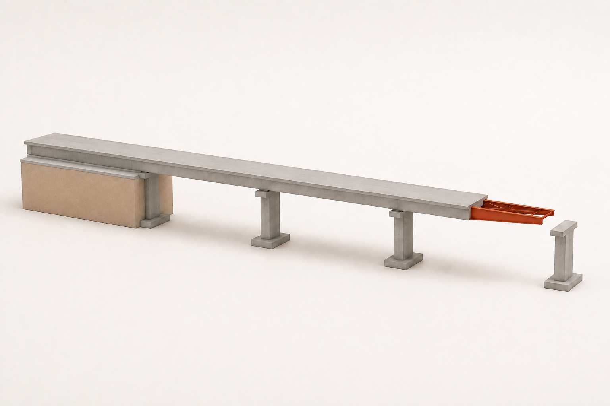{#fig-author-g04-b width=100%}

图像来源与本例条件

AI 生成教具插画。本情境含导梁；下一幅 F19 刻意采用不含导梁的静定教学模型，不能把其中内力数值直接标到这幅插画上。

作者选样：G04-B · 2026-09-07 · <a href="../assets/publication/imagegen-samples/public-records/G04-B.json">制作记录</a>

<!-- AUTHOR-SELECTED G04-B END -->

<!-- PRIORITY-FIGURE F19 START -->
{#fig-priority-F19 width=100% fig-alt="桥还没碰到下一个支点，悬空越长会怎样？。悬出长度3、6、9 m时，根部负弯矩分别为−45、−180、−405 kN·m。图中同时列出全梁最大绝对弯矩，避免将短悬臂阶段根部错误当作全梁控制点。"}

查看模型条件与绘图代码

每个阶段梁尾恰在后支点、支点距12 m；这是教学静定截取，不冒充真实完整顶推系统；均布自重；未接触前方支点；无导梁、摩擦、支点高差或非线性；显示的是阶段内力，非设计安全系数

课程组原创参数绘图 · F19 · <a href="../scripts/priority-figures/group_a.py">绘图 Python</a> · <a href="../scripts/priority-figures/figlib.py">公共绘图函数</a> · <a href="../assets/publication/priority-40/F19.png" download>下载 PNG</a> · <a href="../assets/publication/priority-40/F19.svg" download>下载 SVG</a>

<!-- PRIORITY-FIGURE F19 END -->

顶推过程中同一截面交替经历正、负弯矩，导梁、临时墩和滑移支承影响反力。成桥截面设计可能受施工阶段重复应力控制。模型需随推进位置更新支承关系和悬臂长度；钢束或临时加固按阶段激活。

顶推步长既要捕捉支承越过截面时的峰值，也要与实际推进路径一致。可先用影响线或粗步长定位，再细化关键位置。摩擦和支承高差可能引起水平力与扭转，需在专项模型中处理。

#### 预制架设与先简支后连续

预制T梁、小箱梁和组合梁架设涉及吊点、运输支承、临时横联和梁端稳定。吊装内力由吊点位置和构件当时截面决定，不能用成桥支承替代。落梁后各片梁在湿接缝和横隔形成前横向共同工作有限。

先简支后连续体系中，预制梁自重和早期作用由简支梁承担，连续构造形成后新增作用由连续体系承担。支点负弯矩区的现浇段、钢筋/钢束和材料龄期决定连续性能。最终内力是各阶段增量在相应截面和体系中的累积，不是把全部作用重新施加于最终模型。

#### 钢梁架设与组合形成

钢梁可采用整孔吊装、分段拼装、顶推或现场连接。未形成桥面板组合前，钢梁和横向联系承担钢梁、模板、湿混凝土与施工荷载；受压翼缘侧向稳定和连接状态是关键。混凝土达到规定参与条件后，后续作用由组合截面承担。

分段吊装的拼接、临时墩和闭合顺序产生制造与安装初应力。现场强迫对孔或几何调整的力不能在完成连接后无记录地消失。模型通过初始应变、节点位移或施工力保存其状态，并用实测线形校核。

#### 事件数据结构与平衡

每个施工事件至少含：事件编号、时间/龄期、前状态、激活/钝化构件、连接变化、支承变化、作用增量、预应力、温度基准、截面属性、测量、批准状态和后状态。构件自重通常在构件激活时施加一次；更换截面或材料属性不能再次自动施加同一自重。

阶段平衡检查当前所有外作用、反力和继承内力；状态传递检查位移、应力、预应变和几何是否按所用求解器定义继承。若软件重新置零位移，应区分显示零点和物理变形。不同软件的“激活构件”算法可能不同，需要最小算例验证。

#### 施工模型许可

线性阶段模型适用于小变形、材料关系和接触状态满足线性假定的问题；悬臂稳定、支承脱空、钢梁侧扭、索或大位移可能需要非线性。阶段数量不是越多越准确，关键是每个事件对应真实拓扑和作用。将多个不同事件合并会丢失路径，将无物理变化的时间细分只增加管理负担。

::: {.digital-note}
**数字资源4-16　梁桥施工事件与体系转换器。** 资源提供支架现浇、逐跨、平衡悬臂、顶推、预制架设和钢组合六类事件模板。页面在时间轴上同时显示拓扑、有效截面、作用增量、预应力与线形；每步必须通过自重唯一性、反力平衡和状态继承测试。
:::

### 组合梁阶段、界面剪力与疲劳耐久深化

钢—混凝土组合梁的优势来自两种材料在连接约束下共同变形。组合形成前后，钢梁、混凝土板、钢筋和连接件承担的应力不同。界面剪力传递是共同工作的必要条件，疲劳与耐久则要求把重复作用、构造细节和维护状态纳入同一对象链。

#### 阶段换算截面

在线弹性分析中，可选参考材料并以模量比换算截面。例如以钢为参考时，混凝土换算系数可写为$n_c=E_c/E_s$；以混凝土为参考则采用相反比值。两种表示在假定一致时应得到相同物理应变与应力，但不能混用面积和模量。

$E_c$随龄期、持续时间和开裂状态变化。短期、长期和负弯矩区可能需要不同截面。截面卡记录参考材料、模量、有效宽度、开裂、钢筋、板龄期和阶段。钢梁自重作用于钢截面，湿混凝土作用于当时钢梁及临时体系，形成组合后的铺装和车辆才作用于组合截面。

应力累加按阶段进行。设第$j$阶段在材料$i$中产生应力增量$\Delta\sigma_i^{(j)}$，目标时刻的线性累积可写为

$$
\sigma_i(t)=\sigma_{i,0}
+\sum_{j\le t}\Delta\sigma_i^{(j)}(t),
$$

单位Pa。时间相关项需按相应徐变收缩模型演化。不能把全部弯矩一次作用于最终换算截面后，再按材料模量比分配，以此替代阶段应力。

#### 界面纵向剪力

完全组合的线弹性梁中，界面单位长度剪力可由

$$
q_L=\frac{VQ}{I}
$$

理解。$q_L$单位N/m；$V$单位N；$Q$为界面一侧换算面积对整体中性轴的一次矩，单位m³；$I$为换算截面二次矩，单位m⁴。该式给出沿梁连续剪流，连接件把一定长度内的剪流离散传递。

$q_L$随剪力和截面变化，在集中作用、截面突变和支点附近还需考虑局部传力。连接件设计把界面剪流、单个连接抗力、间距、疲劳和构造按采用规范处理；本章不提供通用间距或抗力。若连接件柔度显著，界面滑移使应变不再完全相容，需要部分相互作用模型。

#### 部分相互作用

可用界面相对滑移$s(x)=u_s(x)-u_c(x)$描述钢梁与混凝土板纵向位移差，$s$单位m。连续连接本构可概念性写为

$$
q_L=k_s s,
$$

$k_s$为单位长度界面刚度，单位N/m²，使$q_L$单位N/m。实际连接可能非线性、离散且受循环退化，该式只用于说明完全组合与无组合之间的连续过渡。模型参数需由连接试验、规范或经核验资料获得。

部分相互作用模型应检查钢、混凝土轴力之和、截面总弯矩、界面剪流积分和端部边界。若端部无外部纵向界面力，剪流积分与材料轴力变化相对应。把连接刚度设得极大应趋近完全组合，设为很小应趋近独立构件；极限测试可发现单位错误。

#### 负弯矩区与开裂

连续组合梁中支点附近混凝土板可能受拉开裂。开裂后混凝土拉区、纵向钢筋、钢梁和连接共同决定刚度与应力；裂缝还影响耐久和疲劳。分析模型需要说明混凝土拉区是否参与、钢筋如何建模及开裂刚度如何获得。

负弯矩区不能简单沿用正弯矩换算截面。作用效应、裂缝宽度、钢筋应力、钢梁应力和连接疲劳分别进入相应验算。若采用未开裂刚度求总体内力，再用开裂截面验算，应说明方法依据和内力重分布边界。

#### 疲劳历程与循环计数

疲劳需要目标细节处的应力历程。名义应力范围为

$$
\Delta\sigma=\sigma_{\max}-\sigma_{\min},
$$

单位MPa。变幅历程可通过规定方法转换为若干应力范围与循环数。Palmgren—Miner线性累积的概念式为

$$
D_f=\sum_i\frac{n_i}{N_i},
$$

$n_i$为实际循环数，$N_i$为相应应力范围下的允许或预测循环数，二者均无量纲计数，$D_f$无量纲。是否采用该方法、疲劳曲线、截止限和判定按现行规范；本章不设允许$D_f$。

细节应力定义与模型一致。总体梁名义应力不能直接代表焊趾热点；壳模型热点方法需规定外推路径、网格和板厚；实体模型峰值可能含奇异性。剪力连接件、横隔端部、加劲肋、拼接和正交异性板细节分别建立提取对象。

车辆位置和多车道组合对疲劳历程的处理与极限状态峰值不同。疲劳模型、车辆频次和动力处理从采用规范或监测资料取得。不能用ULS最大应力除以分项系数推得疲劳范围。

#### 耐久环境与排水

钢梁防腐体系、构造缝隙、积水、盐雾和检修可达性影响腐蚀；混凝土桥面板裂缝、防水层、排水和氯盐环境影响钢筋与界面。梁端伸缩缝下、支座区、箱内低点、横隔开孔和排水管附近建立维护对象编号。

截面损失分析应基于检测厚度、范围和时间，不能用统一腐蚀率替代局部证据。钢板厚度变化会同时影响面积、惯性矩、局部稳定和疲劳应力；混凝土剥落、钢筋锈蚀和连接退化改变组合状态。评估模型从检测状态重新建立截面卡。

#### 维修施工状态

桥面板分块更换时，剩余钢梁的侧向约束、横向连接和交通偏载可能控制；涂装、支座更换和梁端修复需要临时支撑及顶升。维护方案应像建造方案一样建立事件模型。原成桥模型只作为起始状态，不能证明拆除状态安全。

疲劳与耐久记录最终进入全寿命章节，包括细节、应力历程、检查方法、缺陷阈值、维修事件和版本。智能工具可整理检测数据和缺项，不可自行判定细节类别或剩余寿命。

::: {.digital-note}
**数字资源4-17　组合梁界面—疲劳—维修工作台。** 时间轴从钢梁架设到桥面板更换，显示每阶段换算截面、材料应力增量、界面剪流和相对滑移。疲劳页绑定真实细节与应力提取方法，耐久页把检测厚度和维修事件反馈到截面；规范曲线与限值必须由核验规则包导入。
:::

### 控制截面与结构设计原理接口

桥梁总体分析输出作用效应，结构设计原理和材料桥梁规范完成截面抗力、正常使用、疲劳和构造验算。两者之间需要可追溯的数据接口。只把一张弯矩包络图交给截面设计，可能遗漏同时剪力、扭矩、轴力、阶段和局部效应。

#### 控制对象和截面集合

梁桥控制位置通常包括跨中、支点两侧、反弯点附近、变截面、支座/横隔、锚固、合龙、拼接、开孔、集中作用和构造变化处。控制位置由体系、作用和构造共同确定，不按固定等分点代替。正弯矩、负弯矩、最大剪力、最大扭矩、疲劳和变形可能由不同位置或状态控制。

每个截面定义几何切面、参考点、局部坐标、有效材料、阶段和设计对象。曲线梁的截面法向随里程变化；斜交支点截面可沿桥轴或支承线提取，两者不可混称。板壳截面合力由规定积分路径回收。

#### 成组作用效应

控制状态输出向量

$$
\mathbf E_d=
\begin{bmatrix}
N&M_y&M_z&V_y&V_z&T
\end{bmatrix}^{\mathsf T},
$$

$N,V_y,V_z$单位N，$M_y,M_z,T$单位N·m。向量附设计状况、组合编号、车辆位置、横向位置、施工阶段和模型版本。同一行分量共同进入截面或连接验算。

包络表可以分别按某个主响应排序，但每个包络点保留整行伴随分量。若$M_y$最大与$V_z$最大来自不同状态，形成两行验算，而不是拼为一行。截面设计程序若只接收标量，需明确其验算不考虑相互作用或另建相互作用接口。

#### 从内力到应力和抗力

在线弹性初步检查中，轴力和双向弯矩可通过截面几何恢复正应力，剪力和扭矩通过剪流/截面理论恢复。该步骤用于核查方向和数量级。钢筋混凝土与预应力混凝土的开裂、非线性应变分布、钢筋/钢束和材料强度，钢构件的屈服、局部稳定及组合截面的材料协同，均由相应截面模型和规范处理。

极限状态函数可概念性写为

$$
g(\mathbf R,\mathbf E)=
R(\mathbf R)-S(\mathbf E),
$$

$\mathbf R$包含材料、几何和抗力模型参数，$\mathbf E$为作用效应；两侧单位必须一致。工程分项系数表达式由现行规范给定，本章不从教学可靠度或经验自行生成。

#### ULS、SLS与疲劳分流

承载能力极限状态接口传递规定设计状况下的设计效应及相互作用分量；正常使用接口传递规定代表值组合下的应力、裂缝、挠度、转角和支座位移；疲劳接口传递重复作用模型下的应力范围与循环。三者的组合、材料状态和限值不同。

预应力梁还需传递施工/传力、短期和长期应力；组合梁需传递组合前后材料应力；钢梁稳定需传递未支长度、横向约束和弯矩梯度；箱梁扭转需传递畸变和局部板效应。一个“最大弯矩”字段不能覆盖这些任务。

#### 局部与总体接口

总体杆系向局部模型传递截面$N,M,V,T$或边界位移；局部模型回传应力分布、连接力和等效柔度。边界传递检查合力与力矩，避免总体作用和局部外力重复。局部结果进入规范验算时说明名义、热点、结构应力或实体应力定义。

局部刚度若显著影响总体分配，应迭代更新总体模型。例如柔性横隔影响扭转分配、连接滑移影响组合刚度、支座接触改变反力。若局部只影响应力集中而不改变总体，则可单向子模型。判断通过敏感性而不是模型名称。

#### 数据交付

截面设计接口至少包含：对象与里程、坐标、阶段截面、材料状态、组合与控制位置、成组效应、提取方法、数值精度、模型许可和来源。验算结果返回抗力/限值、控制模式、利用信息、构造要求、规范版本和签认状态。教学值继续标为教学值，不因进入验算表而升级。

::: {.digital-note}
**数字资源4-18　控制截面—截面验算数据桥。** 学习者从包络选择一个控制响应，页面自动携带同一状态的$N,M,V,T$、车辆位置、阶段和截面卡；随后分别路由至ULS、SLS、疲劳或局部模型。缺少伴随分量、材料状态或规范规则时停止验算并生成缺项清单。
:::

### 完整数值算例一：桥面板局部板带与二维板接口

#### 任务与教学参数

取两条主梁腹板中心之间的桥面板，横向计算跨径为$l=2.40\ \mathrm m$。先截取$b=1.00\ \mathrm m$宽的教学板带，板厚$h=0.220\ \mathrm m$，线弹性模量$E=34.0\ \mathrm{GPa}$，泊松比$\nu=0.20$。板带两端按简支建立解析基准。

板带跨中作用一个教学集中力$P=120\ \mathrm{kN}$，并有教学均布线荷载$q=5.50\ \mathrm{kN/m}$。$P$是把某一已定义局部作用映射到1 m板带后的教学值，不代表规范轮载；$q$同样不代表桥面板永久作用标准值。算例只检验板带平衡、弯矩、弹性挠度和向二维板模型的接口。

#### 截面和板刚度

板带截面二次矩为

$$
I_b=\frac{bh^3}{12}
=\frac{1.00\times0.220^3}{12}
=8.8733\times10^{-4}\ \mathrm{m^4}.
$$

梁式板带弯曲刚度为

$$
EI_b=30.1693\ \mathrm{MN\cdot m^2}.
$$

若建立二维各向同性薄板，其单位宽度板弯曲刚度为

$$
D=\frac{Eh^3}{12(1-\nu^2)}
=31.4264\ \mathrm{MN\cdot m}.
$$

$EI_b$与$D$量纲不同：前者用于宽度$b$的梁条，单位N·m²；后者为板的弯曲刚度，单位N·m。二者不能作为同一数值直接比较。

#### 反力和弯矩

集中力和均布作用均对称，两个支承反力分别为

$$
R_A=R_B=\frac{P+ql}{2}
=\frac{120+5.50\times2.40}{2}
=66.60\ \mathrm{kN}.
$$

跨中弯矩由两项组成：

$$
M_P=\frac{Pl}{4}=72.00\ \mathrm{kN\cdot m},
$$

$$
M_q=\frac{ql^2}{8}=3.96\ \mathrm{kN\cdot m}.
$$

总教学弯矩为$M=75.96\ \mathrm{kN\cdot m}$，对1 m宽板带也可写成$75.96\ \mathrm{kN\cdot m/m}$。采用后一单位时必须说明这是单位宽度结果，不能与整块板的总弯矩混用。

#### 弹性挠度

简支梁跨中集中力与全跨均布作用的跨中挠度分别为

$$
\delta_P=\frac{Pl^3}{48EI_b}
=1.1455\ \mathrm{mm},
$$

$$
\delta_q=\frac{5ql^4}{384EI_b}
=0.0788\ \mathrm{mm}.
$$

线性叠加得到$\delta=1.2243\ \mathrm{mm}$。该值基于未开裂、简支、1 m板带和点作用假定，不用于正常使用限值比较。实际铺装扩散、板的二维作用、连续边界和开裂刚度都会改变结果。

按毛截面线弹性关系，板带边缘应力数量级为

$$
|\sigma|=\frac{M(h/2)}{I_b}
=9.42\ \mathrm{MPa}.
$$

该应力只用于验证单位和弯曲方向。钢筋混凝土桥面板不能据此用未开裂弹性边缘应力完成承载或裂缝验算，需进入结构设计原理和材料规范的板截面模型。

#### 二维板模型升级

二维板模型采用至少三个纵向板跨范围，使局部加载远离人为端边界。轮载不再作为节点点力，而按教学接触矩形施加；接触矩形合力必须仍为$120\ \mathrm{kN}$。横向支承线可先简支，再以弹性或与主梁共同模型表示真实连续性。

二维结果输出$M_x,M_y,M_{xy}$，其中坐标固定为桥梁纵、横向。将沿纵向一定宽度积分或按规定设计截面平均后，与1 m板带$M_y$比较。板模型的横向分配会使峰值不同，差异应归因于板的纵向耦合、作用面积和边界，而不是直接选择较大值。

模型进行四项回归：总支承反力为$133.20\ \mathrm{kN}$；对称作用下响应关于板带中心对称；接触面积缩小时设计截面量趋于稳定或显示局部敏感；板纵向长度和边界扩大后目标区域结果趋于稳定。点应力不作为收敛指标。

#### 悬臂边板扩展

将同一作用移至外梁以外的悬臂板时，计算图式改变为悬臂而非简支条带。根部弯矩由作用相对腹板中心或实际固结线的力臂确定；护栏自重与防撞作用需按规范建立独立作用对象。不能继续使用$Pl/4$。

悬臂根部又与外梁翼缘和腹板共同变形，局部壳模型可用于核查。外梁纵向弯曲应力、悬臂横向板弯曲和护栏局部作用分别提取，随后按相同状态在材料设计中组合。

#### 模型许可与提交物

板带模型许可到规则支承线之间的横向弯矩和弹性挠度数量级；二维板模型许可到局部板弯矩分布和传给主梁的反力；总体梁格许可到主梁纵向效应。提交物包括自由体、单位表、反力、弯矩、挠度、二维边界、合力回收和不能回答的问题。

::: {.digital-note}
**数字资源4-19　桥面板板带—二维板贯通算例。** 页面先锁定1 m简支板带，重现$66.60\ \mathrm{kN}$反力、$75.96\ \mathrm{kN\cdot m}$弯矩和$1.2243\ \mathrm{mm}$挠度；随后开放接触面积、连续边界、悬臂和二维板。静态导出保留两个模型的共同轮位、合力与设计截面。
:::

### 完整数值算例二：不等刚度五梁的纵横向效应

#### 结构、作用与边界

取一跨$L=30.0\ \mathrm m$的直线简支五梁桥，考察跨中正弯矩。五条主梁相对桥面刚度中心的横坐标为

$$
[a_1,a_2,a_3,a_4,a_5]
=[-4.0,-2.0,0,2.0,4.0]\ \mathrm m.
$$

五梁竖向等效刚度比为

$$
[k_1,k_2,k_3,k_4,k_5]/k_0
=[1.0,1.2,1.4,1.2,1.0],
$$

$k_0$为任意共同刚度基准，单位N/m。教学作用由跨中集中力$P=200\ \mathrm{kN}$和全跨均布线荷载$q=10.0\ \mathrm{kN/m}$组成，横向合力偏心$e=+1.50\ \mathrm m$。全部作用为算法教学值，不对应规范车辆或车道。

本例纵向采用全桥等效简支梁，横向采用刚性横梁加不等竖向弹簧。它比现有四片等刚度算例增加刚度权重，但仍忽略主梁扭转、横梁有限刚度、轮迹离散和局部板效应。

#### 纵向跨中影响线效应

简支梁跨中弯矩影响线峰值为$L/4=7.50\ \mathrm m$，全跨面积为$L^2/8=112.50\ \mathrm{m^2}$。集中力位于跨中时贡献

$$
M_P=P\frac{L}{4}
=200\times7.50
=1500\ \mathrm{kN\cdot m}.
$$

均布教学作用贡献

$$
M_q=q\frac{L^2}{8}
=10.0\times112.50
=1125\ \mathrm{kN\cdot m}.
$$

全桥跨中教学弯矩为

$$
M_{\mathrm{tot}}=2625\ \mathrm{kN\cdot m}.
$$

这一步只获得全桥目标响应，尚未确定每片梁。集中力和均布作用被假定具有同一横向合力线；若实际二者横向位置不同，应分别分配后相加。

#### 不等刚度横向相容

<!-- PRIORITY-FIGURE F17 START -->
{#fig-priority-F17 width=100% fig-alt="某根梁的活载增量为负，就已经离开支承了吗？。已有恒载、新增活载与总反力分别列示。梁1的活载增量为−12 kN，但总反力为+48 kN，不能把负增量直接解释为已脱空。"}

查看模型条件与绘图代码

此Ri为横向分配模型的反力；真实支座接触须定义对应对象并求总状态；若总接触力不满足单向接触，需重建模型，不可直接将负值截零；不在图中声称该简化模型已验证真实支座安全

课程组原创参数绘图 · F17 · <a href="../scripts/priority-figures/group_a.py">绘图 Python</a> · <a href="../scripts/priority-figures/figlib.py">公共绘图函数</a> · <a href="../assets/publication/priority-40/F17.png" download>下载 PNG</a> · <a href="../assets/publication/priority-40/F17.svg" download>下载 SVG</a>

<!-- PRIORITY-FIGURE F17 END -->

<!-- FORMULA-SCAFFOLD ch03 START -->
::: {.formula-scaffold}
**先看这个问题。** 横向联系足够刚时，各梁的连接点仍排成一条直线。这条线既能一起下沉，也能倾斜。先看两种变化，再求每根梁分担多少。

一起下沉叠加横向转动各梁位移与分担

这组符号分别指什么？

aᵢ 是第 i 根梁到所选横向原点的距离，v₀ 是该原点的竖向位移，θ 是小转角，kᵢ 是等效竖向刚度。Pₜ 是总力，e 是作用线偏心。矩阵第一行守合力，第二行守合矩。刚度中心与总位移为零的位置不同。

:::
<!-- FORMULA-SCAFFOLD ch03 END -->

刚性横梁在目标截面处发生平移$v_0$和小转角$\theta$，第$i$梁位移为

$$
v_i=v_0+\theta a_i,
$$

反力为$R_i=k_i v_i$。合力与横向力矩方程写成

$$
\begin{bmatrix}
\sum k_i&\sum k_i a_i\\
\sum k_i a_i&\sum k_i a_i^2
\end{bmatrix}
\begin{bmatrix}v_0\\\theta\end{bmatrix}
=
\begin{bmatrix}P_t\\P_t e\end{bmatrix},
$$

$P_t$为任一待分配的横向合力，单位N；$v_0$单位m，$\theta$无量纲。该对称刚度布置满足$\sum k_i a_i=0$，故平移和转动方程解耦。

本例

$$
\sum k_i=5.8k_0,
\qquad
\sum k_i a_i^2=41.6k_0\ \mathrm{m^2}.
$$

第$i$梁分配系数为

$$
m_i=\frac{R_i}{P_t}
=\frac{k_i}{\sum k_j}
+\frac{k_i e a_i}{\sum k_j a_j^2}.
$$

代入得到未舍入结果

$$
[m_1,m_2,m_3,m_4,m_5]
=[0.028183,0.120358,0.241379,0.293435,0.316645].
$$

#### 守恒核查

系数和满足

$$
\sum_i m_i=1.000000,
$$

横向一阶矩满足

$$
\sum_i m_i a_i=1.500000\ \mathrm m=e.
$$

第一式检查竖向合力，第二式检查偏心力矩。若把刚度比全部误设为1，系数仍可能满足两式，却不再满足实际不等刚度相容；因此守恒是必要而非充分条件。

将$e$改为$-1.50\ \mathrm m$且保持结构镜像，系数应按梁号反序。将$e=0$时，系数变为刚度份额$k_i/\sum k$，中梁因刚度较大承担更多。该结果与等刚度体系中心加载各梁$1/5$不同。

#### 各梁跨中弯矩

把同一分配系数用于本教学全桥弯矩，得到

| 梁号 | $a_i$（m） | $k_i/k_0$ | $m_i$ | $M_i$（kN·m） |
|---:|---:|---:|---:|---:|
| 1 | -4.0 | 1.0 | 0.028183 | 73.98 |
| 2 | -2.0 | 1.2 | 0.120358 | 315.94 |
| 3 | 0.0 | 1.4 | 0.241379 | 633.62 |
| 4 | +2.0 | 1.2 | 0.293435 | 770.27 |
| 5 | +4.0 | 1.0 | 0.316645 | 831.19 |

未舍入弯矩和为$2625.00\ \mathrm{kN\cdot m}$。关于刚度中心的一阶矩为$2625\times1.50=3937.50\ \mathrm{kN\cdot m^2}$；该量用于横向分配守恒，不是梁截面扭矩单位，报告中应标明“纵向弯矩分配关于横向坐标的一阶矩”。

#### 梁格复核

梁格模型建立五条纵梁和若干横梁。纵梁相对弯曲刚度采用上述比例，真实横梁刚度从小到大参数化。横梁刚度趋于很大时，跨中分配应接近刚性横梁结果；刚度减小时，分配将与作用附近的局部梁和桥面传力有关。

集中力和均布作用分别运行，再验证线性叠加。偏心$+1.50$和$-1.50\ \mathrm m$做镜像测试。梁格结果按物理主梁回收跨中弯矩，计算

$$
m_{i,\mathrm{grid}}=
\frac{M_{i,\mathrm{grid}}}{\sum_jM_{j,\mathrm{grid}}}.
$$

若梁格总弯矩与$2625\ \mathrm{kN\cdot m}$不一致，先检查目标截面、轮载分配、支承和结果符号，而不比较分配系数。

#### 板壳与实际梁型接口

若五梁为T梁，桥面板、湿接缝和横隔形成横向刚度；若为小箱梁，单梁扭转和箱间连接同时参与。板壳模型可将顶板和腹板显式建立，并在跨中切面回收每片梁的合力。两种梁型即使纵向$EI$比例相同，横向分配也可能不同。

本例的刚性横梁分配不用于斜交、曲线、横隔不规则或连接损伤状态。空间模型许可需依据结构和验证决定。规范车辆的多轮迹横向位置也不能先合成为单一$e$而遗漏局部作用，除非所求总体响应和简化条件允许。

#### 进入设计的成果包

成果包包括纵向影响线、集中/均布贡献、横向刚度与梁位、相容矩阵、系数守恒、各梁成组响应、镜像测试和梁格许可。进入截面设计时，对控制梁读取同一状态的$N,M,V,T$；$831.19\ \mathrm{kN\cdot m}$仍是教学单项效应，不与抗力直接比较。

::: {.digital-note}
**数字资源4-20　不等刚度五梁分配算例。** 页面先重现$2625\ \mathrm{kN\cdot m}$纵向效应，再逐步开放刚度权重、偏心和平移—转动相容，输出五梁弯矩及两条守恒残差。高级层连续降低横梁刚度并与梁格结果对照，静态版提供中心、左偏和右偏三组状态。
:::

### 完整数值算例三：连续形成时机与预应力路径

#### 两条施工路径

取两跨等跨梁，每跨$L=30.0\ \mathrm m$，成桥均为连续体系且$EI$沿梁恒定。梁体结构重力等效为每跨教学均布作用$q_G=100\ \mathrm{kN/m}$。钢束在每跨支点处通过截面形心、跨中位于形心下$f_p=0.75\ \mathrm m$，指定教学有效预力$P=10.0\ \mathrm{MN}$。忽略损失、龄期和变截面，仅比较施工路径。

路径A在结构重力施加前已形成连续体系，随后施加$q_G$并张拉钢束。路径B先把两个预制梁段按独立简支状态承受$q_G$，再形成中支点连续，最后张拉同一钢束。最终几何、$q_G$和$P$相同，但早期作用所对应的结构体系不同。全部数值为解析教学值，不代表实际施工方案。

#### 结构重力作用

两等跨连续梁在两跨同时承受均布作用时，中支点弯矩为

$$
M_{B,G}^{(A)}=-\frac{q_GL^2}{8}
=-11.25\ \mathrm{MN\cdot m},
$$

每跨跨中弯矩为

$$
M_{m,G}^{(A)}=\frac{q_GL^2}{16}
=+5.625\ \mathrm{MN\cdot m}.
$$

路径A的两个外支反力各为$3q_GL/8=1125\ \mathrm{kN}$，中支反力为$5q_GL/4=3750\ \mathrm{kN}$，总和$6000\ \mathrm{kN}$。

路径B中，结构重力施加时两跨独立简支，每跨跨中弯矩为

$$
M_{m,G}^{(B)}=\frac{q_GL^2}{8}
=11.25\ \mathrm{MN\cdot m},
$$

梁端弯矩为零。形成连续构造时，已经由简支梁承担的重力不自动重新分配；在本教学理想化中，连续后没有因强迫转角或支座调整引入新增连接弯矩。实际连接施工、收缩和徐变可能产生重分布，需要时间分析。

#### 预应力等效作用

每跨抛物线束的等效均布作用大小为

$$
|q_p|=\frac{8Pf_p}{L^2}
=\frac{8\times10.0\times10^6\times0.75}{30.0^2}
=66.667\ \mathrm{kN/m}.
$$

方向向上，按向下为正取$q_p=-66.667\ \mathrm{kN/m}$。两条路径张拉时均已形成连续体系，因此预应力总弯矩相同：中支点

$$
M_{B,p}=-\frac{q_pL^2}{8}
=+7.50\ \mathrm{MN\cdot m},
$$

跨中

$$
M_{m,p}=\frac{q_pL^2}{16}
=-3.75\ \mathrm{MN\cdot m}.
$$

预应力等效作用的外支反力各为$-750\ \mathrm{kN}$，中支反力为$-2500\ \mathrm{kN}$；负号表示支承对梁的竖向作用方向与结构重力反力相反。实际支座是否允许该增量与总反力共同判断。

#### 路径结果比较

路径A把两项均作为连续体系增量，得到中支点总教学弯矩

$$
M_B^{(A)}=-11.25+7.50=-3.75\ \mathrm{MN\cdot m},
$$

跨中总教学弯矩

$$
M_m^{(A)}=5.625-3.75=1.875\ \mathrm{MN\cdot m}.
$$

总外支反力各为$375\ \mathrm{kN}$，中支反力$1250\ \mathrm{kN}$，合计$2000\ \mathrm{kN}$，等于净均布作用$(100-66.667)\times60$的舍入值。

路径B保留结构重力的简支历史，再叠加连续体系中的预应力：中支点总弯矩为$+7.50\ \mathrm{MN\cdot m}$，跨中为$11.25-3.75=7.50\ \mathrm{MN\cdot m}$。若两个简支跨在中间分别提供$1500\ \mathrm{kN}$重力反力，叠加预应力后外支反力各$750\ \mathrm{kN}$、中支反力$500\ \mathrm{kN}$，总和同样为$2000\ \mathrm{kN}$。

| 结果 | 路径A：先连续 | 路径B：后连续 |
|---|---:|---:|
| 中支点弯矩（MN·m） | -3.75 | +7.50 |
| 跨中弯矩（MN·m） | +1.875 | +7.50 |
| 外支反力（每个，kN） | 375 | 750 |
| 中支反力（kN） | 1250 | 500 |
| 总反力（kN） | 2000 | 2000 |

两条路径均满足整体平衡，但内力和反力分配不同。整体平衡不能识别施工路径是否正确，还需事件与相容证据。

#### 主次效应和应力接口

跨中钢束主弯矩为$-Pf_p=-7.50\ \mathrm{MN\cdot m}$，支点偏心为零。连续体系等效作用总弯矩在跨中为$-3.75$、中支点为$+7.50\ \mathrm{MN\cdot m}$，因此次弯矩在跨中为$+3.75$、中支点为$+7.50\ \mathrm{MN\cdot m}$。主次分解与两条路径的预应力增量相同，但与结构重力历史叠加后的总截面应力不同。

截面应力计算需为预制阶段和连续阶段分别提供$A,I$与材料状态。若中支点连续段为后浇材料，其龄期和有效截面不同。路径B的早期简支重力应力不能用最终连续截面重新计算后覆盖。

#### 徐变收缩扩展

路径B的预制梁在连续前已承受重力，其徐变历史与后浇连续段不同；形成连续后，差异收缩与徐变会在冗余约束下引起次内力。数字模型为每个材料区记录浇筑时间、加载时间、湿度/尺寸参数和应力增量。具体模型由采用规范确定，本算例不提供长期系数。

可设置三个时间检查点：连续形成瞬间、桥面系完成、目标运营龄期。每个时刻输出支点弯矩、跨中弯矩、顶底缘应力和线形。若长期结果只由成桥净均布作用计算，就会丢失路径B的早期应力。

#### 模型回归与许可

梁单元模型分别按事件建立路径A、B。回归量包括各阶段总反力、控制弯矩、预应力等效作用和截面状态。把结构重力从简支阶段移至连续阶段，应从路径B切换到路径A结果；将$P$置零，应恢复各自结构重力基准。

本模型许可到线弹性等截面两跨梁的阶段趋势，不用于预应力损失、开裂、剪切、扭转和实际施工验算。设计接口保留两条路径，而不是选择数值较小者。

::: {.digital-note}
**数字资源4-21　连续形成时机与预应力路径算例。** 页面并排运行“先连续”和“后连续”事件序列，在相同最终作用下显示两组弯矩与反力。学习者可逐项核查重力、预应力和总反力；高级层加入材料龄期和徐变收缩规则，但解析教学基准保持独立。
:::

### 完整数值算例四：组合梁分阶段应力与界面剪流

#### 教学梁和施工状态

取跨径$L=32.0\ \mathrm m$的简支钢—混凝土组合梁。钢梁和施工设施自重等效为$q_s=18.0\ \mathrm{kN/m}$，湿混凝土等效作用$q_w=45.0\ \mathrm{kN/m}$，两项在组合形成前由钢梁承担。组合形成后，另有教学附加均布作用$q_a=20.0\ \mathrm{kN/m}$和跨中教学集中力$P=300\ \mathrm{kN}$。

钢梁教学截面模量取$W_s=0.200\ \mathrm{m^3}$；形成组合后，为演示钢梁底缘增量，取相应换算组合截面对钢梁底缘的教学截面模量$W_{c,b}=0.350\ \mathrm{m^3}$。界面剪流计算另取换算截面$I_c=1.50\ \mathrm{m^4}$、界面一侧一次矩$Q_c=0.300\ \mathrm{m^3}$。所有参数仅用于计算链验证，未按任何规范选择。

#### 组合前作用

组合前总均布作用为

$$
q_1=q_s+q_w=63.0\ \mathrm{kN/m}.
$$

简支梁跨中弯矩和每端反力为

$$
M_1=\frac{q_1L^2}{8}
=8064\ \mathrm{kN\cdot m},
$$

$$
R_1=\frac{q_1L}{2}=1008\ \mathrm{kN}.
$$

按教学钢梁毛截面模量，底缘线弹性应力增量数量级为

$$
\sigma_{s,1}=\frac{M_1}{W_s}
=40.32\ \mathrm{MPa}.
$$

该值未考虑施工侧向稳定、残余应力、局部屈曲和应力符号，仅用于说明湿混凝土不能由尚未形成的组合截面承担。

#### 组合后增量

附加均布作用的跨中弯矩为

$$
M_{q,a}=\frac{q_aL^2}{8}
=2560\ \mathrm{kN\cdot m},
$$

跨中集中力贡献为

$$
M_P=\frac{PL}{4}
=2400\ \mathrm{kN\cdot m}.
$$

组合后新增跨中弯矩$M_2=4960\ \mathrm{kN\cdot m}$。按教学组合截面对钢梁底缘截面模量，钢梁底缘新增应力数量级为

$$
\Delta\sigma_{s,2}=\frac{M_2}{W_{c,b}}
=14.17\ \mathrm{MPa}.
$$

若两阶段应力方向一致，教学累计为$54.49\ \mathrm{MPa}$。这不是把总弯矩$13024\ \mathrm{kN\cdot m}$除以某一个截面模量；正确累积保留组合前、后的承担截面。

混凝土板应力需用换算截面形心、模量比和混凝土位置恢复，本例未给出这些数据，保持为待计算。截面设计不能以钢梁底缘两个数值代替全截面应力。

#### 组合后界面剪流

组合后新增作用在支点处的剪力为

$$
V_2=\frac{q_aL}{2}+\frac{P}{2}
=320+150=470\ \mathrm{kN}.
$$

按完全组合线弹性教学截面，支点附近界面剪流为

$$
q_L=\frac{V_2Q_c}{I_c}
=\frac{470\times0.300}{1.50}
=94.0\ \mathrm{kN/m}.
$$

若仅为离散化检查，取教学连接分组长度$s_c=0.50\ \mathrm m$，该长度内需传递的纵向剪力为$q_Ls_c=47.0\ \mathrm{kN}$。这不是连接件设计抗力或间距结论；实际连接件数量、抗力、疲劳、构造和纵向变化按现行规范确定。

组合前$q_1$不应进入已形成组合截面的界面剪流计算，因为湿混凝土作用时界面尚未传递组合内力。若施工中通过模板或临时连接产生其他界面作用，应作为施工对象另行记录。

#### 部分相互作用扩展

完全组合模型假定钢梁和混凝土板界面无相对滑移。高级模型以连接刚度和离散连接件求$s(x)$及$q_L(x)$。当连接刚度趋大时，钢梁和混凝土纵向应变趋于相容；趋小时，组合刚度下降。输入连接本构必须来自试验或规范，而非为匹配完全组合结果任意调节。

结果核查包括：钢梁与混凝土轴力的变化等于界面剪流积分；截面合力等于总体梁内力；端部边界满足定义；连接刚度极限符合物理。若局部点力引起剪流峰值，需检查加载分布与连接离散。

#### 疲劳与维修状态

设某教学名义应力历程在一次车辆通过中从$25\ \mathrm{MPa}$变化到$55\ \mathrm{MPa}$，教学范围为$\Delta\sigma=30\ \mathrm{MPa}$。该值只验证历程提取和循环计数，不对应细节类别或允许值。疲劳接口还需细节位置、应力定义、车辆模型、循环数和规范曲线。

桥面板更换时，先移除相应板块和铺装，钢梁截面及横向联系重新承担施工与交通转换作用；本例的$W_{c,b}$和$I_c$不再有效。维修阶段建立新截面卡和连接状态，完成钢梁稳定、界面解除/恢复及临时支撑分析。

#### 模型许可与交付

单梁阶段模型许可到组合前后跨中弯矩、反力和线弹性应力增量；界面剪流式许可到完全组合、规则截面的连续剪流数量级；连接件和热点疲劳需要局部或规范模型。交付包括事件表、两个截面卡、应力增量、界面剪流、疲劳数据字段和维修失效清单。

::: {.digital-note}
**数字资源4-22　组合梁阶段—界面剪流数值链。** 页面按钢梁、湿混凝土、组合形成和运营增量依次显示$8064$与$4960\ \mathrm{kN\cdot m}$，并以$94.0\ \mathrm{kN/m}$界面剪流作为回归点。任何试图用最终截面重新承担早期作用的操作都会触发阶段错误。
:::

### 完整数值算例五：闭口、开口箱梁扭转与曲线接口

#### 截面和作用

取跨度$L=40.0\ \mathrm m$的教学箱梁，壁厚中线形成宽$5.0\ \mathrm m$、高$2.0\ \mathrm m$的单室矩形，围成面积$A_m=10.0\ \mathrm{m^2}$，周长$14.0\ \mathrm m$，各壁教学厚度均为$t=0.200\ \mathrm m$。剪切模量取$G=14.0\ \mathrm{GPa}$。

跨中竖向教学集中力$V=400\ \mathrm{kN}$作用线距截面剪切中心$e_s=2.00\ \mathrm m$，产生外扭矩

$$
T_0=Ve_s=800\ \mathrm{kN\cdot m}.
$$

两端假定提供对称扭转约束，因此每端扭矩反力$400\ \mathrm{kN\cdot m}$，梁的每半跨内扭矩大小$T=400\ \mathrm{kN\cdot m}$。参数为教学值，截面不代表实际构造。

#### 闭口状态

单室闭口薄壁截面的扭转常数近似为

$$
J_c=\frac{4A_m^2}{\displaystyle\oint\frac{\mathrm ds}{t}}
=\frac{4\times10.0^2}{14.0/0.200}
=5.7143\ \mathrm{m^4}.
$$

每半跨的近似恒定环流为

$$
q_T=\frac{T}{2A_m}
=20.0\ \mathrm{kN/m},
$$

壁板平均扭转切应力为

$$
\tau_T=\frac{q_T}{t}=0.100\ \mathrm{MPa}.
$$

扭转率为

$$
\frac{\mathrm d\varphi}{\mathrm dx}
=\frac{T}{GJ_c}
=5.00\times10^{-6}\ \mathrm{rad/m}.
$$

从端部至跨中长度$20\ \mathrm m$，若忽略翘曲和畸变，扭转角为$1.00\times10^{-4}\ \mathrm{rad}=0.100\ \mathrm{mrad}$。

#### 开口施工状态

假设施工阶段沿顶板中线形成贯通开口，截面按四块狭长矩形板的开口薄壁近似。扭转常数为

$$
J_o\approx\sum_i\frac{b_it^3}{3}
=\frac{14.0\times0.200^3}{3}
=0.03733\ \mathrm{m^4}.
$$

同样内扭矩下，开口近似扭转率为

$$
\frac{T}{GJ_o}
=7.65\times10^{-4}\ \mathrm{rad/m},
$$

半跨扭转角约$0.0153\ \mathrm{rad}=15.3\ \mathrm{mrad}$，约为闭口自由扭转结果的153倍。该比值只说明剪流闭合的量级作用；开口截面还可能发生翘曲、局部板变形和边界约束，不能用此简化角作为施工设计结果。

#### 平衡与边界检查

全桥扭矩平衡为两端反扭矩之和等于$T_0$。截面环流产生的内扭矩回算为$2A_mq_T=400\ \mathrm{kN\cdot m}$，与半跨内力一致。若误把外扭矩$800\ \mathrm{kN\cdot m}$直接用于每半跨，会使反力和环流加倍。

垂直反力仍需与$400\ \mathrm{kN}$竖向力平衡；弯矩、剪力和扭矩作为同一工况成组保存。箱梁扭转支承在真实桥中由支座横向位置、横隔和墩台提供，本例对称扭转约束是教学边界。

#### 横隔与畸变升级

闭口公式假定截面保持形状。建立壳模型后，在无横隔、端横隔和若干中横隔状态下比较整体转角与箱室菱形畸变。壳模型按中面面积和厚度回收$J$数量级，并在跨中切面把剪应力积分回算$T$。

横隔无限刚模型可作为极限，但不用于自身应力。实际横隔开孔、加劲和连接进入局部模型。若壳模型总扭转角与闭口梁公式差异显著，依次检查边界、翘曲约束、畸变、局部轴和网格，而不直接调节$G$。

#### 曲线桥接口

把同一箱梁置于平面半径$R=150\ \mathrm m$的教学曲线上时，局部切向和径向坐标随里程变化，竖向弯曲与扭转可能耦合。本例$T_0=Ve_s$仍可检查局部偏载产生的扭矩，但不包含曲率引起的全部空间响应。

空间梁模型从很大$R$逐渐减至$150\ \mathrm m$，检查结果连续；直线极限应回到上述闭口基准。随后用壳模型检查曲线、横隔和畸变。支座方向按曲线局部轴定义，并核查全桥关于总体参考点的力矩。

#### 模型许可和设计接口

闭口薄壁公式许可到均匀厚度、单室、自由扭转的剪流与转角数量级；开口公式只许可到无翘曲约束的趋势；空间梁许可到总体弯扭；壳模型许可到畸变和板件应力。设计接口传递同一状态的$M,V,T$、扭转剪流、横隔力和局部板效应。

::: {.digital-note}
**数字资源4-23　箱梁开闭口扭转与曲线接口。** 页面以$5.7143$和$0.03733\ \mathrm{m^4}$两个教学扭转常数为解析基准，逐步显示偏心扭矩、环流、扭转角、开口翘曲提示、横隔畸变和曲线坐标。闭口切换为开口时，模型许可同时更新，不把153倍关系作为设计储备。
:::

### 完整数值算例六：连续刚构温度变形与墩柔度

#### 一维教学模型

为说明连续刚构中“温度作用是否产生内力”取决于约束柔度，取长度$L=90.0\ \mathrm m$的等效梁—墩纵向体系。梁体教学截面$A=5.00\ \mathrm{m^2}$，弹性模量$E=35.0\ \mathrm{GPa}$，线膨胀系数$\alpha=1.00\times10^{-5}/^\circ\mathrm C$，均匀升温$\Delta T=30.0^\circ\mathrm C$。

墩、基础和其他纵向约束合并为一个等效弹簧，教学刚度$K_s=40.0\ \mathrm{MN/m}$。该一维弹簧仅为量级模型，不代表具体墩高、支座和基础；所有参数均为课程组教学值，不用于实际温度设计。

#### 自由温度伸长

完全自由时，梁体温度应变为

$$
\varepsilon_T=\alpha\Delta T
=3.00\times10^{-4},
$$

自由伸长为

$$
\Delta_0=\alpha\Delta TL
=0.0270\ \mathrm m=27.0\ \mathrm{mm}.
$$

自由状态温度应力为零。只要支承允许27 mm相对变形且没有摩擦、间隙或其他约束，均匀升温不因材料本身产生轴向应力。实际桥梁还需考虑温度基准、非均匀温度和支承方向。

#### 梁体与弹簧协调

约束后产生轴向压力$N_T$。温度自由伸长由弹簧变形和梁体弹性压缩共同抵消：

$$
\Delta_0=
\frac{N_T}{K_s}
+\frac{N_TL}{EA}.
$$

$N_T$单位N；$K_s$单位N/m；$L/(EA)$和$1/K_s$单位m/N。求得

$$
N_T=
\frac{\Delta_0}
{\dfrac{1}{K_s}+\dfrac{L}{EA}}
=1.0582\ \mathrm{MN}.
$$

等效弹簧变形为

$$
\Delta_s=\frac{N_T}{K_s}
=26.456\ \mathrm{mm},
$$

梁体弹性压缩为

$$
\Delta_b=\frac{N_TL}{EA}
=0.544\ \mathrm{mm}.
$$

两者之和$27.000\ \mathrm{mm}$，满足相容。梁体平均压应力数量级为$N_T/A=0.212\ \mathrm{MPa}$，只用于单位检查。

#### 两个边界极限

当$K_s\rightarrow0$时，弹簧几乎不提供约束，$N_T\rightarrow0$，体系趋近自由伸长。当$K_s\rightarrow\infty$时，梁体完全不能伸长，

$$
N_{T,\mathrm{fixed}}=EA\alpha\Delta T
=52.5\ \mathrm{MN},
$$

相应平均应力$E\alpha\Delta T=10.5\ \mathrm{MPa}$。实际连续刚构位于两种极限之间，并由多个墩柱、基础和梁体共同分配。极限测试用于发现弹簧单位和约束错误，不把完全固定值作为设计上限直接采用。

#### 空间刚构模型

真实模型需显式建立梁、墩和基础弹簧，分别定义纵、横向及转动刚度。墩高不同会使温度反力分配不均；曲线、斜交和固定点设置会引起弯矩与扭转。温度基准与合龙温度进入初始状态，均匀温度和梯度温度分别建模。

模型回归先把所有墩纵向刚度按比例缩小，检查反力趋近零；再按比例放大，检查梁轴力趋近完全固定数量级。全桥轴向反力和水平力矩必须平衡，墩顶位移与梁伸长相容。支承存在摩擦或间隙时，线性弹簧许可终止，需接触或状态分析。

#### 长期和基础接口

混凝土收缩徐变会改变梁与墩的相对变形，基础位移又改变初始长度和内力。刚构合龙时刻、材料龄期和温度共同决定后续状态。长期模型把温度、收缩、徐变和基础变位作为不同输入，不用一个“等效降温”无说明地合并。

下部结构接口接收每个墩顶的轴力、剪力、弯矩、位移和转角及相应状态。上部结构不得只把等效总弹簧反力分给各墩；分配由真实墩梁模型计算。基础刚度变化需反馈上部体系重新分析。

#### 教学结论与模型许可

本算例证明均匀温度变形在自由状态不产生应力，在弹性约束下由梁体和约束柔度共同决定内力；不证明某座连续刚构的温度反力为1.0582 MN。等效一维模型许可到轴向数量级和两个极限，空间杆系用于墩梁分配，局部模型用于墩梁固结和基础连接。

::: {.digital-note}
**数字资源4-24　刚构温度—墩柔度算例。** 页面先显示27.0 mm自由伸长，再以梁体轴向柔度和墩基础等效弹簧分配变形，重现1.0582 MN教学轴力。拖动$K_s$时同步显示自由与完全固定极限；高级层将一个弹簧展开为多墩空间模型。
:::

### 梁桥模型许可与回归基准体系

模型许可用“对象—状态—作用—响应—精度—排除项”表达。模型通过验证后，也只能回答许可内的问题。梁式桥同一几何在预制、架设、连续形成、维修和损伤状态可能需要不同许可。

#### 一级：解析与单梁

解析和单梁模型用于总体竖向平衡、规则梁弯矩剪力、影响线、弹性挠度和阶段趋势。输入包括跨径、支承、线性$EA,EI,GA,GJ$及作用。它不能回答多梁横向分配、箱梁畸变、局部板弯曲、锚固和连接应力。

基准包括简支反力$qL/2$、弯矩$qL^2/8$、跨中影响线$L/4$、单位力挠度和温度自由伸长。连续梁使用独立的三弯矩或刚度法基准。任何复杂模型先回到该级检查总反力和纵向数量级。

#### 二级：空间梁与梁格

空间梁表达总体弯扭和支承空间布置，梁格表达多主梁横向共同工作。许可可包括主梁成组$N,M,V,T$、各支座反力、总体扭转和横向分配。它不能直接提供桥面板局部、箱室畸变和焊接热点。

基准包括中心加载对称、左右偏载镜像、合力/偏心矩守恒、曲率趋零回归直梁、斜交趋正交回归正交桥。横梁刚度趋大/趋小的极限应有物理解释。梁格的主梁结果按物理对象汇总，不以单根网格构件代替。

#### 三级：板壳总体模型

板壳模型许可到桥面板弯曲、剪力滞、箱梁畸变、钢板局部稳定和横隔受力。输入增加板厚、偏置、开孔、连接、网格和局部坐标。模型需要从网格回收截面面积、形心、惯性矩及$N,M,V,T$，与低层模型对接。

板壳模型不自动许可到锚固区三维应力、接触承压、焊趾断裂或混凝土局部破坏。点荷载、尖角和刚性连接可能产生奇异峰值，设计量需按定义平均、积分或外推。

#### 四级：局部壳与实体

局部模型用于支点横隔、预应力锚固、拼接、剪力连接、焊接细节和局部接触。边界从总体模型传递位移或截面合力，需检查合力、力矩和边界功。边界距离通过敏感性确定。

局部模型输出的应力类型与后续验算一致：名义应力、结构应力、热点或材料应力分别记录。细网格产生的最大值不自动成为设计应力。局部柔度若显著影响总体分配，需反馈总体模型迭代。

#### 五类回归测试

1. **平衡测试**：全桥力、力矩、阶段增量和截面合力闭合。
2. **对称/镜像测试**：几何与作用镜像后，结果按坐标规则变换。
3. **尺度测试**：线性作用加倍、刚度加倍、几何缩放符合理论趋势。
4. **极限测试**：支承、横梁、连接和曲率参数趋于已知边界。
5. **交叉模型测试**：不同层级在共同量上吻合，新增差异来自新增物理。

每个测试包含输入、预期关系、未舍入基准、容差类型和失败分类。解析测试容差主要来自浮点与求解；梁格—壳比较包含离散与模型形式；试验比较还包含测量和材料不确定性。不能统一用一个百分比阈值。

#### 网格、步长与搜索收敛

板壳网格至少以三个层级比较设计量，如截面合力、板带平均弯矩、扭转角或屈曲倍数。移动荷载搜索先粗后细，在影响线折点和峰值附近加入候选。施工事件的步长由拓扑变化决定，不能用时间细分代替缺失事件。

若目标是点奇异应力，网格不会收敛，应改为规范定义的结构量。若控制车辆位置随步长变化而效应已稳定，报告位置和效应两种差异。若非线性路径在峰值附近对步长敏感，采用适当控制算法并说明。

#### 回归基准映射

| 基准 | 解析/教学结果 | 被测资源 | 主要发现的错误 |
|---|---|---|---|
| 简支跨中影响线 | 峰值$L/4$ | 4-2、4-6、4-12 | 路径、单位、插值 |
| 五梁守恒 | $\sum m_i=1$、$\sum m_ia_i=e$ | 4-13、4-20 | 梁位、刚度、偏心 |
| 板带算例 | 反力、弯矩、挠度 | 4-11、4-19 | 板带单位、边界 |
| 连续路径算例 | 两组弯矩/反力 | 4-15、4-16、4-21 | 阶段重置、预力重复 |
| 组合梁算例 | 阶段应力与$q_L$ | 4-17、4-22 | 截面错用、界面单位 |
| 箱梁扭转 | $J_c,J_o$与环流 | 4-14、4-23 | 开闭口状态、扭矩平衡 |
| 刚构温度 | 自由伸长与柔度极限 | 4-24 | 温度单位、支承刚度 |

#### 模型变更管理

改变支座、横隔、截面、钢束、施工事件或材料后，依赖表标记受影响结果。旧模型和结果保留为已替代，不覆盖。回归先运行最小解析基准，再运行受影响模型，最后检查图表和数据导出。

AI生成或修改模型脚本时，必须提交变更差异、测试和人工审查。语言模型可以说明可能影响，不能自行提升模型许可或关闭失败测试。缺少规范依据的系数保持空白。

::: {.digital-note}
**数字资源4-25　梁桥模型许可与回归中心。** 资源按单梁、空间梁/梁格、板壳和局部模型登记许可，并把七组章节基准映射到相关交互。任一参数或代码变更后，系统显示需重跑的测试、共同量差异和仍未覆盖的问题。
:::

### 梁桥数据对象与程序审计

数字梁桥的可复核性依赖统一数据对象。几何图、截面表、作用、施工时间轴、有限元模型和验算表不能各自保存无关联的同名参数。数据对象以唯一编号连接来源、状态、单位和版本。

#### 几何对象

路线和桥轴记录里程、平曲线、竖曲线、横坡与超高；总体布置记录跨径、墩台轴线和控制高程；截面对象记录参考点、局部轴、板件/梁件、材料和阶段；构件对象记录起终截面、连接、制造分段和施工事件。曲线梁局部轴生成规则作为模型输入保存。

几何改变后不只更新三维显示。桥宽影响桥面面积、自重、横向分布和车道；梁高影响$I,W$、自重、钢束偏心和净空；腹板位置影响剪切、横向板跨和支座传力。依赖图将这些结果标为待更新。

#### 作用与车辆对象

每项作用记录分类、数值、单位、空间分布、时间、阶段、来源、互斥/从属关系和代表值状态。车辆对象记录轴/轮、轴距、轮距、车道路径、横向位置、移动规则和动力处理。车辆派生效应还保存控制位置和成组响应。

永久作用应由几何与材料重度可追溯计算，不只输入总线荷载。施工设备有位置和移动事件；温度有基准、场分布和边界；预应力由钢束对象生成。规范取值从经确认规则包读取，教学数据显著标识。

#### 截面与材料对象

截面卡包含面积、形心、$I_y,I_z,I_{yz}$、扭转/翘曲属性、剪切面积、材料分区、有效宽度、开裂状态和阶段。几何属性与有效刚度分开：同一几何$I$在不同材料、龄期或开裂状态下对应不同$EI$。

组合梁、预制梁与现浇层、先简支后连续体系均需多张阶段截面卡。截面软件输出必须带坐标和参考点；导入有限元前用一个单位轴力、弯矩和扭矩回读方向。

#### 结果对象

结果对象由位置、阶段、工况/组合、模型、坐标、分量、单位、值和提取算法构成。包络点保留控制行，不只保存数值。板壳结果附表面、积分点、平均/外推和网格；模态附归一化、参与因子与质量模型；疲劳附历程和细节。

图表从结果对象生成，不能手工改数。显示舍入与计算值分开，坐标轴含单位，变形图带放大倍数。网页、PDF和计算单共享同一结果哈希。

#### 程序分层

计算核心实现公式、数值模型与数据转换；规则层保存规范版本、条款和适用条件；界面层显示和交互；审计层保存输入、输出、测试和人工签认。更换规范时优先更新规则数据，不在程序多处散落修改系数。

程序遇到缺失单位、未知状态、非正定矩阵、未收敛求解或超出模型许可时停止并报告。不得把缺失视为零，把不收敛最后一步视为有效结果，或让AI根据“常见值”补齐。

#### 审计记录

一次运行至少记录：任务编号、数据版本、模型哈希、规则哈希、软件/求解器、单位制、坐标、随机种子（如有）、输入摘要、测试、异常、人工修改、复核人与时间。哈希用于发现文件变化，不替代内容审查。

独立复核者从一项控制结果反向追踪到车辆位置、作用、截面、阶段和模型，再用手算或另一程序复算共同量。若只能打开原作者电脑上的商业软件文件，交付不完整；应同时提供中性数据和静态摘要。

#### 权利与隐私

外部图、视频、代码、标准和软件截图分别登记权利。规范条文和表格不整段复制到公开程序，使用合法取得的规则数据并保留版本。课程录像只提炼原创讲解线索，学生对话和身份不进入教材。工程项目模型脱敏后仍需确认授权。

::: {.digital-note}
**数字资源4-26　梁桥数据对象与审计器。** 资源检查几何、截面、作用、车辆、阶段和结果之间的编号与依赖，定位单位、坐标、版本和包络控制行缺失。导出包同时包含可阅读PDF、机器数据、测试结果和权利台账，不导出未经核对的聊天文本。
:::

## 数字资源、短视频与教学实施

本章交互资源以同一组桥梁对象和参数为基础，按“体系—截面—局部板—移动作用—横向分布—预应力与施工—材料接口—验证”逐层开放。交互的作用是显示参数连续变化、空间关系和状态路径，正文公式与静态表仍是知识依据。

#### 参数状态与输入合同

每个参数包含对象编号、符号、数值、单位、坐标、阶段、来源、状态和有效范围。状态分为教学值、有来源待核、已核验和已审定。教学值在界面、导出表和截图中保持明显标识；规范系数只从教师指定且注明版本与条款的规则包读取。

输入控件不以滑块代替精确值。滑块用于观察趋势，同时提供数值框、单位和范围；达到公式适用边界时停止或切换模型。空白、零和不适用分别处理。曲率、斜交角、钢束偏心和支座方向同时显示几何示意，防止仅凭数值误解正负。

#### 计算核心

公式、数据转换和数值算法与界面分离。命令行测试和网页调用同一核心，确保静态答案、图形和导出值一致。计算使用未舍入值，显示层按教学精度舍入；导出同时保存原始值和显示值。

每个算法对象包含公式版本、符号表、量纲测试、解析基准和模型许可。影响线程序通过$L/4$峰值、轴组位置和积分面积测试；横向分配通过合力和力矩守恒；组合梁通过阶段截面与界面剪流；箱梁扭转通过$2A_mq_T=T$；温度刚构通过自由/完全固定极限。

若有限元在后台运行，界面显示模型版本、单元、网格、边界、求解状态和提取算法。不收敛、缺失输入或许可越界时，不显示最后一步结果为有效。预制云图必须标为固定示例，不能随滑块变化而伪装成实时计算。

#### 图形和状态控制

同组对比图使用相同坐标范围。影响线同时显示目标截面、单位力位置、纵标、轴坐标与贡献；横向分布同时显示梁位、合力线、各梁反力和两项残差；施工时间轴同时显示构件拓扑、有效截面、作用增量和线形。

三维箱梁允许旋转、剖切和隐藏板件，但当前截面、局部轴和支承始终可见。变形图显示放大倍数，模态或畸变图不赋予未定义的实际位移单位。颜色之外使用线型、符号和标签，确保色觉差异下仍可识别。

动画可以暂停、单步和跳到关键状态；任何瞬时曲线都有对应状态表。界面不设置与学习目标无关的积分、排名和装饰动画。声音用于补充施工顺序或空间观察，不逐字重复屏幕文字。

#### 分层信息密度

初学层每次只呈现一个主要关系。例如4-20先显示纵向影响线，再开放横向平移，最后加入转动；4-21先完成两条施工路径的结构重力，再加入预应力；4-23先闭口环流，再切换开口和曲线。单位、来源和适用条件不因简化而隐藏。

进阶层开放公式推导、参数批量比较、模型差异和受控错误；熟练层提供数据导入、脚本和自定义模型许可。已经掌握基本图式的学生可以折叠逐步提示，避免固定引导妨碍整体设计判断。

每个完整示例之后设置逐步撤除：第一题给全部中间值，第二题隐去部分步骤但保留检查点，第三题只给任务、数据合同和成果格式。教师根据完成证据决定是否开放下一层，不按点击次数判断掌握。

#### 静态替代

每个交互至少导出一张计算图式、一张参数表、一组关键状态图、一个已解基准和一个练习状态。影响线动画导出控制车辆坐标与逐轴贡献；三维截面导出平面、横断面和剖切；施工时间轴导出事件表；参数曲面导出二维切片和数据表。

PDF读者无需联网也能完成核心计算，交互只增加连续调参和空间观察。第三方服务不可用时，课程组自有脚本或中性数据仍可重现基准。移动端可使用二维替代，不强制复杂三维。

#### 自动验收

资源发布前检查：参数单位和状态；公式与脚本版本；解析基准；合力和力矩；镜像/尺度/极限测试；键盘操作；图形替代文字；静态导出；版权和隐私。错误分为计算、数据、显示和许可四类，计算或数据错误阻断发布。

更改一个参数或程序后，根据依赖图运行相关测试。修正影响线插值还需复核轴组、车道和控制行；修正截面属性还需复核自重、预应力、组合梁和温度。只重新打开页面不构成回归。

::: {.digital-note}
**数字资源4-27　梁桥数字实验自动验收台。** 资源汇总4-1至4-26的参数、计算核心、图形、静态替代和测试状态，逐项报告单位、基准、镜像、守恒、许可、可访问性及权利问题。通过只表示资源实现与声明一致，不表示工程设计合格。
:::

### 短视频、实体演示与三维空间资源

视频适合表现施工顺序、移动荷载、箱梁剪流和模型转换，实体演示适合呈现横向共同工作、开闭口扭转与支承约束，三维空间资源适合观察箱室、钢束、横隔和局部坐标。三种媒介分别承担不同信息，不重复朗读正文。

#### 视频类型

**概念动画**从一个计算图式出发，显示单位作用移动、影响线纵标或钢束转向力。画面只保留当前变量和公式，关键帧可暂停。动画比例和时间不代表实际结构，需显著说明。

**实体实验视频**拍摄课程组自制板条、多梁、开闭口截面或支座模型。镜头同时包含标尺、加载位置、支承和测量；展示原始观察与重复试验，不只保留最显著一次。缩尺模型不自动换算为实桥承载力。

**施工过程视频**使用课程组自摄、获授权工程影像或可合法引用的官方链接，说明支架、架设、悬臂、顶推与合龙事件。视频帧与本章事件表对应，避免用外观镜头替代结构状态。工程名称、拍摄者、日期和许可进入片尾与资源台账。

**软件/模型视频**展示从单梁到梁格、板壳和局部模型的共同量，而不是连续点击菜单。录屏固定软件版本、单位、坐标和模型许可；商业软件界面是否可公开由许可决定。核心数据另以中性格式提供。

#### 标准脚本结构

一段短视频按六个镜头单元组织：对象与状态；计算图式；参数和单位；物理过程；公式或模型结果；核查与边界。片头在十余秒内明确所求量和状态，避免先播放无关桥梁画面。片尾给出静态图、数据下载和来源，不设置对话式引导或未验证结论。

例如“箱梁开闭口扭转”视频先显示同一截面和偏心力，随后显示闭口环流，再切开顶板并观察扭转增大，最后用$J_c,J_o$教学值复算。画面中的变形有放大倍数，旁白说明该倍率只用于观察；不说“开口一定失效”。

“移动荷载与影响线”视频固定跨中截面，车辆轴组沿路径移动，屏幕同步显示每轴坐标、纵标和贡献。控制位置停留并导出计算表。动画只呈现已定义的作用效应及其组成，课堂判断过程不进入正式画面。

“先简支后连续”视频用两个时间轴并列路径A、B，在相同最终作用下显示不同弯矩。每个事件停留至拓扑和有效截面更新完成，再显示增量；不把全部结果一次叠加，减少瞬时信息负担。

#### 实体演示设计

横向分布演示可用五条弹性梁和可更换横向连接，中心与偏心加载下测量各梁反力或挠度。刚性横板、柔性连接和断开连接三种状态保持梁位和总力相同。教学重点是合力、力矩和相容，不把模型材料刚度比例直接对应实桥。

开闭口扭转演示使用相同外轮廓和材料量的薄壁模型，记录扭矩和转角。开口位置、端部翘曲约束和横隔会影响结果，需写入实验表。视频与4-23解析算例在趋势上对照，数值差异由尺度、材料和边界解释。

支承演示以可滑移、固定和弹簧连接显示均匀温度或规定变位。加载前核查摩擦和间隙，演示后区分理想功能与实际支座产品。任何模型失稳或破坏试验设置防护，不把教学破坏荷载换算成桥梁能力。

#### 三维与空间计算资源

三维资源的第一层是构件识别：顶板、底板、腹板、横隔、支座、钢束和连接拥有唯一编号。第二层是状态：隐藏或激活构件显示施工和维修拓扑。第三层才是结果：沿同一构件显示截面内力、变形或应力，并可回到参数和模型。

空间设备可将箱梁剖切、钢束曲线和曲线桥局部轴叠加在同一场景。比例尺、坐标和当前状态始终可见，不能用透视夸张代替数值。Apple Vision Pro等设备是可选入口，普通浏览器提供相同二维剖切和数据表。

三维模型不直接复用未经许可的商业项目BIM。课程组建立简化、自有教学几何；若引用公开模型，逐项核查许可和署名。模型中的材料颜色、施工设备和环境只用于识别，不宣称实际项目细节。

#### 字幕、转写与可访问性

视频配准确字幕和文字摘要，公式、符号与正文一致。课程录课转写先去除口头重复、学生姓名和对话，再改写为正式脚本；事故、跨径、材料和施工数据经外部来源核验后方可进入。字幕不逐字重复画面已有长段文字。

无声观看时，关键关系可由标注和状态表理解；听觉说明为图形提供补充。色彩不作唯一编码，动态图提供静态关键帧。视频链接失效时，正文与静态替代仍能完成任务。

#### 权利台账

每段外部视频只保留标题、作者/机构、URL、访问日期、许可与适合章节，不下载、剪辑或逐字转录。需要嵌入的片段取得明确授权；否则使用链接并由课程组重做动画/实验。公开视频的存在不等于可自由复制。

::: {.digital-note}
**数字资源4-28　梁桥短视频与空间资源脚本库。** 资源按概念动画、实体实验、施工影像和模型录屏提供脚本模板、镜头清单、字幕、静态关键帧与权利字段。首批脚本对应影响线、横向分布、开闭口扭转、先简支后连续、组合梁浇筑和刚构温度六个主题。
:::

### 教师资源与课堂实施建议

本章可在56学时课程中按培养方案安排约10～12学时，具体由课程组根据前置力学基础和后续桥型章节调整。内部素材池远大于课堂容量，教师通过核心、拓展和项目三层选择，不要求一次讲完全部内容。

#### 前置诊断

开课前用四个短任务检查：简支梁自由体与正负号；截面面积、形心和$I$；线性叠加与影响线；支承自由度。诊断只决定提示层级，不作为专业能力最终评分。学生若在单位和自由体上有困难，先使用第2章资源；已掌握者直接进入梁格和阶段模型。

#### 建议教学单元

| 单元 | 核心内容 | 课堂资源 | 学习证据 |
|---|---|---|---|
| 1 梁型与构造 | 七类体系、连接、施工状态 | 4-10 | 条件式梁型比较表 |
| 2 截面与桥面板 | 自重、效率、局部与横向板 | 4-1、4-11、4-19 | 截面卡和板带复算 |
| 3 移动作用 | 影响线、轴组、车道与控制行 | 4-2、4-6、4-12 | 车辆坐标和逐轴贡献 |
| 4 横向与空间 | 杠杆、偏压、梁格、板壳 | 4-13、4-20 | 两项守恒与模型差异 |
| 5 预应力与施工 | 束形、次内力、事件与线形 | 4-15、4-16、4-21 | 两条阶段路径计算单 |
| 6 钢与组合梁 | 组合形成、界面、疲劳耐久 | 4-17、4-22 | 阶段应力和剪流表 |
| 7 曲线、斜交与刚构 | 弯扭、温度、支承 | 4-14、4-23、4-24 | 模型许可和极限测试 |
| 8 设计接口与审查 | 控制截面、验算、证据包 | 4-18、4-25、4-26 | 可追溯控制状态 |

课时不足时保留单元1～5和8，钢组合、曲线斜交作为案例拓展；面向相关方向的班级可增加单元6～7。删减不改变核心成果：学生必须能够从体系和状态建立模型、由移动作用取得控制效应、验证横向守恒并把成组结果交给截面设计。

#### 完整示例与提示撤除

教师先完整演示4-19板带算例，明确对象、单位和边界；在4-20中保留纵向结果，要求学生完成横向矩阵；在4-21中只给两条事件序列，学生建立弯矩与反力表；综合任务只给桥位与成果格式。逐级撤除减少无效搜索，同时保持真实要素的相互作用。

熟练学生可直接比较梁格与板壳，不强制逐屏操作。初学和熟练模式共享相同基准、单位和模型许可，避免形成两套知识。课堂演示一次只改变一个主参数，多参数方案比较放到项目阶段。

#### 课堂活动

**梁型证据卡。** 每组选择两种梁型，在同一桥位约束下列出传力、施工、维护和需要升级的模型。结论写成条件式，不按固定跨径给唯一答案。

**车辆控制状态复核。** 一名学生生成影响线和车辆位置，另一名只依据导出表复算逐轴贡献和均布积分。两人交换角色后检查梁格横向分配。评分基于可复现，不基于软件速度。

**施工事件重排。** 教师改变连续形成、张拉或浇筑时机，学生判断哪些历史作用需在不同截面承担，并更新证据包。若只改变最终弯矩图而未修改事件和截面，任务未完成。

**模型许可辩护。** 学生为一项结果说明为什么单梁、梁格或壳模型足够，以及不能回答什么。另一组提出一个触发升级的条件。双方均需引用平衡、相容或构造证据。

#### 形成性评价量规

| 维度 | 需要修正 | 基本达到 | 充分 |
|---|---|---|---|
| 体系和状态 | 只给桥型名称 | 连接、支承和阶段基本明确 | 能解释路径变化与条件式选择 |
| 作用与位置 | 只有最大值 | 有影响线、车辆和横向坐标 | 保留控制行及成组响应 |
| 截面与构造 | 属性无来源/阶段 | 截面卡和主要构造一致 | 能处理局部、扭转与维修状态 |
| 模型与验证 | 仅有云图 | 有平衡和一个基准 | 多层模型共同量与许可完整 |
| 设计接口 | 直接判断合格 | 能输出ULS/SLS所需量 | 区分疲劳、局部与长期接口 |
| 数字与权利 | 无版本或来源 | 有运行与图源记录 | 可复现、可静态替代、权利闭合 |

评价不以模型规模、图片数量或文本长度加分。一个许可清楚并通过基准的简化模型，优于边界不明的精细模型。学生指出证据不足并停止结论，可以体现正确的工程判断。

#### 终结性项目

项目给出一座直线或曲线三跨梁桥的教学桥位资料，要求至少形成两种梁型候选。提交物包括体系与施工、三视图、截面参数、桥面板局部、影响线与车辆、横向分布、预应力或组合阶段、控制截面、模型验证、维护对象和来源台账。

项目中的规范车辆、材料强度和限值由教师提供经核验规则包；若只训练概念设计，相关字段可保持“待后续设计”，不得用经验值填充。至少一项结论需通过独立手算或另一模型复核。

#### 教师答案与受控错误

答案分为解析值、判断依据和模型差异三层。解析值包括六套新增数值算例的未舍入结果；判断依据说明适用边界；模型差异列出梁格、板壳或非线性结果可能偏离简化式的原因。答案不只提供最终截图。

受控错误库包括：桥面板点力、影响线单位、轴组拆散、横向系数不守恒、预应力重复、早期作用用最终截面、闭口$J$用于开口阶段、组合前作用进入界面剪流、温度°/rad或刚度单位错误、不同工况峰值拼接。每项错误带最小证据和修复后的回归测试。

#### 资源维护

每学期运行4-25和4-27全部测试，检查浏览器、脚本、模型、静态图和链接。规范更新时由专业教师维护规则包，公式教学层与规范数据层分开。外部图和视频逐项复核许可，未经授权素材只留内部来源线索或重绘任务。

::: {.digital-note}
**数字资源4-29　梁式桥教师实施与评价包。** 资源提供8个教学单元、六套新增算例答案、提示撤除任务、受控错误、量规、终结项目、规范规则接口和学期更新清单。教师可按10～12学时筛选，但核心数据合同和验证要求不变。
:::

### 内部素材池的筛选与出版转化

本章10万字符级稿件用于内部选材，不等于正式出版篇幅。筛选时优先保留能够建立体系判断、解释公式边界、连接设计接口和支撑数字实验的内容；同义解释、重复表格和只适合教师备课的细节转入教师资源。

#### 内容分层

**正文核心层**保留梁型体系、桥面板、影响线、横向分布、预应力施工、组合梁及控制截面。每一节包含对象、主公式、符号单位、适用边界、一个静态图和设计接口。

**案例层**保留六套数值算例中的代表性计算链。正式教材可完整保留两至三套，其余作为网页、附录或教师包；解析基准仍全部用于自动测试。

**拓展层**包括曲线斜交、畸变、部分相互作用、长期徐变和维修模型，供专业方向或项目学习。拓展内容与核心术语一致，不另建一套符号。

**教师层**包括课堂脚本、错误注入、答案、评价量规和更新流程，不直接挤占学生正文。公开视频和课程录课线索只进入来源与备课表，正式文本重新组织。

#### 图形筛选

优先使用课程组依据公式和自有模型生成的自由体、影响线、截面、剪流和阶段图。外部教材图在初稿中保留图号、来源和用途，出版前取得授权或按本书对象重绘；不是简单换颜色或AI润色。工程照片需要摄影和项目许可，无法确认则使用公开链接或自摄替代。

一张图只承担一个主要关系。箱梁总览与剪力滞云图分开；影响线与车辆位置可以同图，因为需要空间对应；公式变量直接标在图上。动态图必须导出关键静态帧和数据表。

#### 公式和数值筛选

经典公式保留推导所需的最小步骤、符号、单位和假定。规范公式与系数从现行正式文本核对，初稿不自编数值。教学算例参数统一标识，正式教材在算例开头和结果表重复一次状态，防止局部截图失去语境。

数值保留未舍入源文件和正文显示精度。若后续调整参数，正文、网页、答案和测试一并生成。未经模型或独立计算核验的有限元数值不进入正式示例，可保留为待开发字段。

#### 数字资源筛选

优先开发能显著增加纸面难以表达能力的资源：影响线连续移动、横向刚度变化、施工拓扑、三维束形、箱梁剖切和跨模型回溯。仅把文字做成翻页或选择题的资源优先级较低。每个资源必须有静态替代和最小复现包。

资源开发分为原型、核验、试用和发布四个状态。原型可使用教学数据；核验完成公式、单位和基准；试用检查学习负荷和可访问性；发布完成权利与版本签认。原型截图不得以发布资源名义进入申报附件。

#### 出版前审查

专业审查检查体系、公式、单位、规范接口和算例；教学审查检查顺序、图文对应和提示撤除；数字审查检查计算、交互、静态替代与可访问性；版权审查检查图、视频、软件和数据。四类审查分别签认，任何一类阻断项均不发布。

删除内容时保留内部编号和转移位置，防止引用断裂。正文删去的算例仍可作为测试，不随篇幅压缩丢失。出版稿与内部素材池使用不同版本号和目录，避免内部未核内容被误认为定稿。

::: {.digital-note}
**数字资源4-30　梁桥内部素材筛选台账。** 台账把每个小节、公式、算例、图、视频和交互标记为正文、案例、拓展或教师层，记录专业、教学、数字与版权审查状态。删减只改变发布层级，不删除解析基准和来源历史。
:::

### 荷载试验、监测与梁桥模型更新

设计模型给出在规定假定下的响应，荷载试验和运营监测提供实际结构在特定状态、环境与作用下的观测。二者结合可以核查总体刚度、横向分配、支承和动力特性，但不能仅凭少量测点唯一识别全部材料、连接和损伤参数。

#### 静载试验对象

静载试验首先确定目标响应，如跨中挠度、控制截面应变、支点反力或多梁横向分配。试验车辆或加载设备的轴重、轴距、轮距、纵横坐标和停放时间进入作用对象；测点具有构件编号、坐标、方向、量程、标定和采样时间。实际加载状态应能在分析模型中复现。

试验效应可写为观测向量

$$
\mathbf y_{\mathrm{obs}}=
\begin{bmatrix}
\delta_1&\cdots&\delta_m&
\varepsilon_1&\cdots&\varepsilon_n
\end{bmatrix}^{\mathsf T},
$$

$\delta$单位m或mm，$\varepsilon$为无量纲应变。模型预测$\mathbf y_{\mathrm{pred}}(\boldsymbol\theta)$依参数向量$\boldsymbol\theta$，可包括截面刚度、支承刚度、横向连接或附属质量。观测和预测必须在相同荷载、温度、坐标和零点下比较。

加载前记录零点和环境，分级加载并在每级保持至读数满足试验程序要求，卸载后检查残余。具体加载等级、允许值和判定按项目试验标准制定，本章不提供通用比例。教学数据若模拟试验，显著标为合成数据。

#### 影响线与横向分配的观测

车辆缓慢沿固定轮迹移动时，目标应变或挠度随车辆位置的曲线可作为实测影响响应。车辆位置同步误差会造成峰值偏移；因此位置、时间和传感器数据使用共同时间基准。实测曲线与4-12计算影响线比较时，先归一化作用，再检查形状、峰位和幅值。

多条横向轮迹或对称加载可用于观察横向共同工作。各主梁同一截面的应变/挠度形成分配向量，先检查总量和镜像，再与刚性偏压、梁格和板壳比较。应变分配与弯矩分配只有在截面和材料关系一致时可互换，不能把不同梁截面上的微应变直接当作弯矩系数。

连接损伤、支承异常和桥面铺装差异可能产生相似的横向变化。需要结合接缝观测、支座位移、温度和多种加载位置区分。只用一个偏载工况调整多个参数，通常缺乏可识别性。

#### 动力测试与环境影响

环境振动、车辆激振或规定激励可识别频率、振型和阻尼。传感器方向和位置决定能否观察某一模态；测点过少可能把竖弯与扭转模态混淆。频率比较同时核查质量模型、附属构件、支承和温度。

温度会改变材料、支承和路面状态，使频率与静力零点变化。运营监测中的长期趋势先进行环境与运营条件分层，不把季节变化直接解释为损伤。异常识别保存基线期、特征、阈值来源和误报记录；阈值由统计和工程审查确定。

#### 参数更新与可识别性

模型更新可通过最小化加权残差

$$
J(\boldsymbol\theta)=
\left[\mathbf y_{\mathrm{obs}}-
\mathbf y_{\mathrm{pred}}(\boldsymbol\theta)\right]^{\mathsf T}
\mathbf W
\left[\mathbf y_{\mathrm{obs}}-
\mathbf y_{\mathrm{pred}}(\boldsymbol\theta)\right]
$$

组织。$\mathbf W$为反映量纲、测量不确定性或权重的矩阵；$J$无量纲或具有所定义尺度。权重不能用于强迫某个期望结论。参数范围来自图纸、检测、材料试验或构造知识，未观测参数不应无限制调整。

若两个参数对观测具有相似灵敏度，单组试验无法唯一识别。可增加不同位置加载、支座位移、模态或局部应变，或保持参数为范围。模型与试验吻合不证明参数唯一正确；更新报告给出残差、敏感性、参数相关和未识别项。

#### 从更新到设计判断

更新后的模型首先重新运行设计基准：总反力、影响线、横向守恒、控制截面和模型许可。若只为解释试验而引入经验刚度，不能自动用于极限状态；需审查该刚度是否适用于设计作用幅值、长期和非线性状态。

检测发现截面损失、裂缝、连接退化或支座卡滞时，建立状态模型并重新分析作用效应。材料抗力和剩余寿命按相应评定标准处理。监测系统可以提示变化，不直接给出“安全/不安全”结论。

#### 数据与隐私

试验数据包包含原始数据、标定、同步、清洗、过滤、删除规则、环境、加载和版本。图中平滑曲线不能替代原始数据。公开教学数据需要项目授权并移除位置、人员和敏感运营信息；无法公开时，课程组使用结构相同的合成数据并明确标识。

#### 模型更新的审批与回退

模型更新分为基线、候选、验证和发布四个状态。基线模型保留原设计或上一轮评定的输入与许可；候选模型只包含本次拟调整参数及理由；验证模型通过独立试验工况和章节回归；发布模型经责任人确认后才供后续分析使用。候选模型即使对校准数据拟合更好，也不能跳过验证直接覆盖基线。

验证数据与校准数据分开。若全部测点都用于调参，较小残差可能来自过拟合；至少保留一组不同加载位置、时间或响应作为独立检验。比较报告同时给出基线与候选在校准组、验证组的残差，并检查参数是否仍位于物理范围。

发布后保存可回退版本。新模型若在另一设计状况下出现平衡、刚度或响应异常，应恢复上一基线并调查，而不是继续叠加经验修正。回退记录说明触发条件、受影响成果和重新发布要求。模型版本改变后，既有控制组合、截面验算和维护结论标为待复核。

参数更新与结构维修是不同事件。调整支承刚度参数只改变对结构状态的认识；实际更换支座、补强横隔或修复桥面板会改变物理结构，需要新的几何、施工和验收记录。数字教材界面以不同颜色和状态字段区分“模型校准”和“实体变更”，避免把数值调整误作工程处置。

教师使用工程监测案例时，只展示完成授权与脱敏的观测；学生不得从公开作业反推敏感桥位或运营规律。合成数据保留与真实任务相同的数据结构、噪声和缺失类型，但不声称来自具体工程。

::: {.digital-note}
**数字资源4-31　梁桥试验—监测—模型更新工作台。** 资源把试验车辆位置、应变/挠度、温度和模型预测对齐，显示影响响应、横向分配、模态及残差。参数更新前先检查可识别性，更新后自动重跑平衡、镜像和控制截面基准；合成数据与工程数据采用不同状态标签。
:::

### 数字资源清单

1. **数字资源4-1　箱梁截面参数实验**：联动面积、惯性矩、截面模量、扭转常数和自重。
2. **数字资源4-2　移动荷载与控制效应**：显示影响线纵标、轴贡献、控制位置和包络。
3. **数字资源4-3　模型审查记录**：检查参数、边界、结果图、单位与反力平衡。
4. **数字资源4-4　三跨连续箱梁贯通工作簿**：连接任务、截面、施工、移动作用、预应力与变形。
5. **数字资源4-5　梁型体系—构造—施工比较器**：在共同桥位边界下比较五类基础梁型。
6. **数字资源4-6　纵横向移动荷载完整工作簿**：贯通影响线、轴组、均布作用和横向分配。
7. **数字资源4-7　曲线与斜交模型许可检查**：从直线正交基准逐步增加空间几何。
8. **数字资源4-8　钢—混凝土组合阶段与疲劳接口**：显示组合形成、界面和应力历程。
9. **数字资源4-9　梁桥设计复核看板**：按体系、作用、模型、施工和运维回溯证据。
10. **数字资源4-10　梁式桥体系许可图谱**：覆盖板、T梁、小箱、连续箱、刚构、钢梁和组合梁。
11. **数字资源4-11　桥面板局部—横向—整体联动实验**：保持轮位一致连接板带、板和梁格。
12. **数字资源4-12　影响线—车道—影响面实验**：从单位力进入轴组、车道和空间影响面。
13. **数字资源4-13　横向分布守恒与模型升级**：比较杠杆、偏压、梁格和板壳。
14. **数字资源4-14　剪力滞—畸变—曲线斜交实验**：逐项增加宽翼缘、偏载和空间几何。
15. **数字资源4-15　预应力束形—损失—长期状态台**：联动三维钢束、有效力、次内力和线形。
16. **数字资源4-16　梁桥施工事件与体系转换器**：管理支架、逐跨、悬臂、顶推、预制和钢梁事件。
17. **数字资源4-17　组合梁界面—疲劳—维修工作台**：连接阶段截面、滑移、细节和维修。
18. **数字资源4-18　控制截面—截面验算数据桥**：把成组效应路由至ULS、SLS、疲劳和局部模型。
19. **数字资源4-19　桥面板板带—二维板贯通算例**：以解析反力、弯矩和挠度核验二维板。
20. **数字资源4-20　不等刚度五梁分配算例**：以相容矩阵和两项守恒核验空间分配。
21. **数字资源4-21　连续形成时机与预应力路径算例**：比较相同最终作用下的两条施工路径。
22. **数字资源4-22　组合梁阶段—界面剪流数值链**：保留组合前后截面和剪流回归点。
23. **数字资源4-23　箱梁开闭口扭转与曲线接口**：比较闭口环流、开口翘曲和曲线坐标。
24. **数字资源4-24　刚构温度—墩柔度算例**：连接自由温度伸长、梁轴向和墩基础约束。
25. **数字资源4-25　梁桥模型许可与回归中心**：管理四级模型许可及解析、镜像和极限测试。
26. **数字资源4-26　梁桥数据对象与审计器**：检查对象依赖、单位、版本和控制行。
27. **数字资源4-27　梁桥数字实验自动验收台**：检查计算、显示、静态替代和可访问性。
28. **数字资源4-28　梁桥短视频与空间资源脚本库**：管理镜头、字幕、关键帧和权利字段。
29. **数字资源4-29　梁式桥教师实施与评价包**：提供教学单元、答案、错误库与量规。
30. **数字资源4-30　梁桥内部素材筛选台账**：管理正文、案例、拓展、教师层及四类审查。
31. **数字资源4-31　梁桥试验—监测—模型更新工作台**：对齐加载、观测、预测、参数识别和设计回归。

## 本章小结、练习与资料

梁式桥设计以传力路径为基础，以体系约束为骨架，以截面和施工方法为实现条件。简支梁、连续梁和连续刚构的区别来自连接及边界，而不仅是跨数或外观。截面空腔可以降低自重并提高材料布置效率，但必须同时满足横向板受力、剪切、扭转、构造、施工和维护要求。影响线用于确定移动荷载的控制位置，横向分布用于描述多梁共同工作；二者共同构成车辆荷载作用效应分析的基础。数字模型应与分析目的匹配，并通过平衡、对称性、简化计算和模型层级比较形成可审查的证据链。

板桥、T梁、小箱梁和连续箱梁的差异，应从预制/现浇状态、横向连接、截面开闭口、局部构造和整体体系共同判断。预应力与施工阶段耦合，钢—混凝土组合梁还需区分组合形成前后的承担截面；剪力滞、界面剪力、长期变形和预拱度要求总体模型与局部模型相互传递和校核。三跨连续箱梁贯通案例表明，完整设计过程应保留参数来源、控制截面、模型版本、验算接口和待确认事项，而不是用单一效率指标或软件云图替代工程判断。

### 思考与练习

1. 画出简支梁、连续梁和连续刚构的计算图式，并分别指出梁体内部连接、墩梁连接和外部支承的差异。
2. 固定箱梁外轮廓，改变腹板和底板厚度，比较 $A$、$I$、$W/A$ 与自重的变化；说明为什么不能只按 $W/A$ 选择截面。
3. 推导简支梁任意截面弯矩影响线，并说明集中荷载组和均布荷载的最不利加载原则。
4. 对五片等刚度主梁，验证偏心压力法分配系数满足竖向合力与横向力矩平衡；讨论外梁纵标出现负值时还需核查哪些结构条件。
5. 为一座三跨连续箱梁拟定最小建模与审查清单，至少包括施工体系、支座方向、自重平衡、对称性、影响线和空间分布六类证据。

### 本章图源台账

| 本章图号 | 初稿所用来源 | 初稿用途 | 正式出版处置 |
|---|---|---|---|
| 图4-1 | 肖汝诚《桥梁结构体系》第3章图3-12，正文第72页 | 竖向荷载传递路径 | 核查授权，优先按传力关系重新绘制 |
| 图4-2 | `longyu8101/qlgc` 图2-6-2 | 连续梁跨径布置 | 核查原始出版信息后重绘 |
| 图4-3 | `longyu8101/qlgc` 图2-3-2 | 装配式梁桥横向连接 | 统一线型、符号并重绘 |
| 图4-4 | `longyu8101/qlgc` 图2-3-15 | 箱梁箱室分类 | 核查授权或重绘 |
| 图4-5 | `longyu8101/qlgc` 图2-6-9 | 桥宽与箱室布置 | 仅保留定性关系，重新绘制 |
| 图4-6 | WSDOT Standard Plan 5.6-A1-10 | 识读预制梁参数族 | 保留官方链接；是否转载依使用条款确定 |
| 图4-7 | `longyu8101/qlgc` 图2-6-13 | 横隔构造类型 | 重绘并补充构造边界 |
| 图4-8 | `longyu8101/qlgc` 图2-4-48 | 永久作用自由体 | 用TikZ按本书符号重绘 |
| 图4-9 | `longyu8101/qlgc` 图2-4-51 | 内力包络概念 | 重绘并统一正负号 |
| 图4-10 | `longyu8101/qlgc` 图2-4-13 | 纵横向计算分解 | 重绘为影响面—影响线联动图 |
| 图4-11 | `longyu8101/qlgc` 图2-4-14 | 横向分布系数 | 重绘并与交互资源统一梁号 |
| 图4-12 | `longyu8101/qlgc` 图2-4-18 | 箱梁杠杆近似 | 核查适用条件后重绘 |
| 图4-13 | `longyu8101/qlgc` 图2-4-20 | 偏心压力法 | 按本章坐标系重绘 |
| 图4-14 | `longyu8101/qlgc` 图2-6-16 | 连续梁预应力布置 | 核查原始出版信息并重绘 |

### 本章参考资料

1. 肖汝诚. 《桥梁结构体系》. 人民交通出版社. 第3章“梁桥体系”。
2. `longyu8101/qlgc` 在线《桥梁工程》教材源文件，<https://github.com/longyu8101/qlgc/blob/master/source/index.rst>。
3. 中华人民共和国交通运输部. 《公路桥涵设计通用规范》JTG D60—2015，发布公告及规范PDF：<https://xxgk.mot.gov.cn/2020/jigou/glj/202006/t20200623_3312312.html>。
4. 中华人民共和国交通运输部. 《公路钢筋混凝土及预应力混凝土桥涵设计规范》JTG 3362—2018，发布公告及规范PDF：<https://xxgk.mot.gov.cn/jigou/glj/202006/t20200623_3312720.html>。
5. Barker, R. M., & Puckett, J. A. *Design of Highway Bridges: An LRFD Approach*. Wiley.
6. Chen, W. F., & Duan, L. (eds.). *Bridge Engineering Handbook*. CRC Press.
7. California Department of Transportation. *Bridge Design Practice*, especially Chapter 4 “Structural Modeling and Analysis” and Chapter 5 concrete girder chapters, <https://dot.ca.gov/programs/engineering-services/manuals/bridge-design-practice>。
8. California Department of Transportation. *Bridge Design Details*, typical sections and post-tensioned concrete details, <https://dot.ca.gov/programs/engineering-services/bridge-design-details>。
9. Washington State Department of Transportation. *Bridge Standard Drawings—Prestressed Concrete I and WF Girders*, <https://wsdot.wa.gov/publications/fulltext/Bridge/Web_BSD/5.6_A1_10.PDF>。
10. Federal Highway Administration. *Manual for Refined Analysis in Bridge Design and Evaluation* and bridge LRFD resources, <https://www.fhwa.dot.gov/pgc/index.cfm?ddisc=110&dsub=937>。
