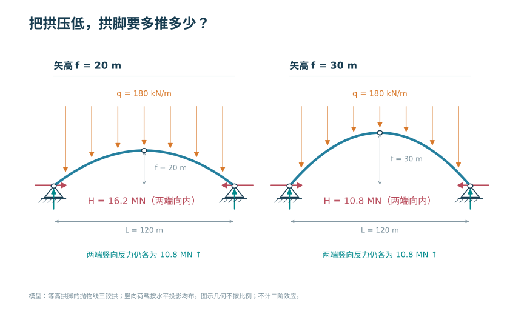
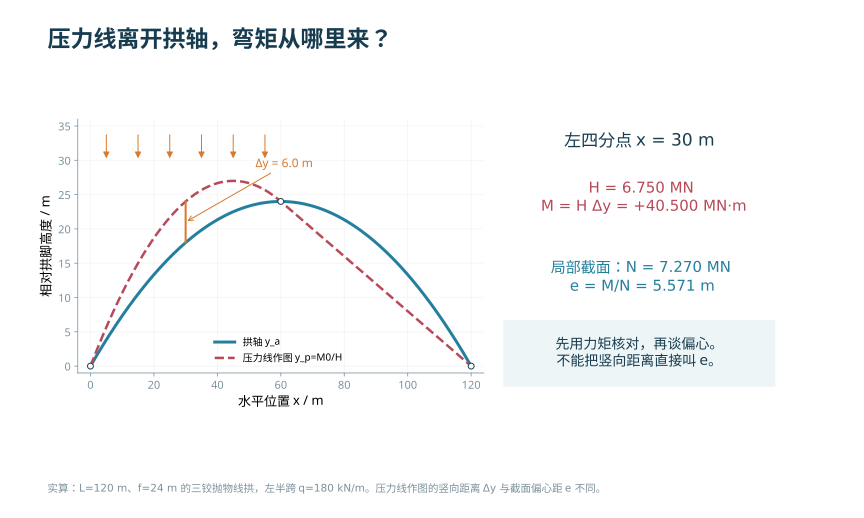
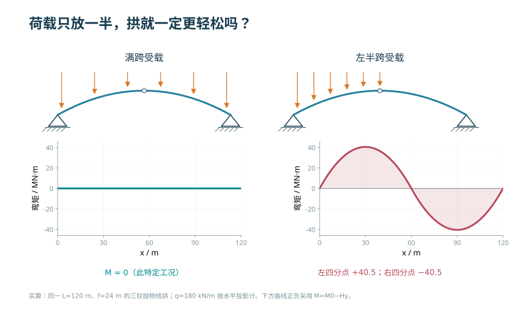
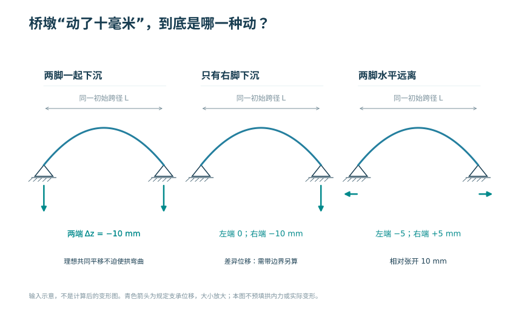

# 拱桥设计

<!-- CORE-ROUTE START -->

<!-- VISUAL-ENTRY START -->

先从一个看得见的问题开始
<h3>桥上只来了一侧的车，原来的拱形还合适吗？</h3>
逐渐增大左右半跨荷载的不对称度，比较同一条拱轴上的剩余弯矩。
<a href="../interactive/learning-map.html?chapter=ch04">看图进入实验 →</a>

<!-- VISUAL-ENTRY END -->
<!-- PRIORITY-CHAPTER-GALLERY START -->

从本章的 4 幅新图开始

<a href="#fig-priority-F20">把拱压低，拱脚要多推多少？</a><a href="#fig-priority-F21">压力线离开拱轴，弯矩从哪里来？</a><a href="#fig-priority-F22">荷载只放一半，拱就一定更轻松吗？</a><a href="#fig-priority-F23">桥墩“动了十毫米”，到底是哪一种动？</a>

<!-- PRIORITY-CHAPTER-GALLERY END -->

<h2>本章的核心思考</h2>
让几何贴近力流，同时保留弯曲与稳定判断。
<ol><li>用 M=M₀−Hy 解释拱的水平推力。</li><li>改变荷载，检验合理拱轴的适用条件。</li><li>把整体内力转换为截面偏心，区分不同的无拉要求。</li></ol>
<h3>跨课程类比</h3>
轴力＋弯矩 → 压力线偏心；柔索平衡 → 合理拱轴

<strong>反例与边界：</strong>只在某种荷载下合理的拱轴，不会自动对半跨活载合理；纯压也可能失稳。

建议课堂集中完成标为“课堂核心”的3个单元，其余单元用于课前观察和课后迁移。每个单元配独立短视频、操作实验、目标检验与开放论证题。

<article>
C05U01 · 课堂核心
<h3>拱通过推力抵消梁式弯矩</h3>
拱的水平推力乘以拱高，可以抵消对应梁的弯矩。

<a href="../interactive/core-learning.html?unit=C05U01" target="_blank">操作与迁移任务</a> · <a href="../interactive/core-learning.html?unit=C05U01&amp;view=video" target="_blank">观看短视频</a>
</article><article>
C05U02 · 课堂核心
<h3>合理拱轴只对应指定荷载</h3>
对称均布荷载下的合理拱轴，遇到不对称活载后会产生剩余弯矩。

<a href="../interactive/core-learning.html?unit=C05U02" target="_blank">操作与迁移任务</a> · <a href="../interactive/core-learning.html?unit=C05U02&amp;view=video" target="_blank">观看短视频</a>
</article><article>
C05U03 · 课前/课后迁移
<h3>整体弯矩转成截面偏心</h3>
用偏心等于弯矩除以轴力，把拱的整体受力转成局部截面应力问题。

<a href="../interactive/core-learning.html?unit=C05U03" target="_blank">操作与迁移任务</a> · <a href="../interactive/core-learning.html?unit=C05U03&amp;view=video" target="_blank">观看短视频</a>
</article><article>
C05U04 · 课堂核心
<h3>无拉应力与压力线位置</h3>
未开裂矩形截面无拉应力要求压力合力位于核心内。

<a href="../interactive/core-learning.html?unit=C05U04" target="_blank">操作与迁移任务</a> · <a href="../interactive/core-learning.html?unit=C05U04&amp;view=video" target="_blank">观看短视频</a>
</article><article>
C05U05 · 课前/课后迁移
<h3>矢跨比改变水平推力</h3>
同跨度同均布荷载下，拱矢高降低，水平推力按矢高倒数增加。

<a href="../interactive/core-learning.html?unit=C05U05" target="_blank">操作与迁移任务</a> · <a href="../interactive/core-learning.html?unit=C05U05&amp;view=video" target="_blank">观看短视频</a>
</article><article>
C05U06 · 课前/课后迁移
<h3>拱与悬索是受力的对应形态</h3>
在水平投影均布荷载模型中，悬索与合理拱均呈抛物线平衡关系，但轴力符号相反。

<a href="../interactive/core-learning.html?unit=C05U06" target="_blank">操作与迁移任务</a> · <a href="../interactive/core-learning.html?unit=C05U06&amp;view=video" target="_blank">观看短视频</a>
</article><article>
C05U07 · 课前/课后迁移
<h3>拱肋变细，稳定不会自动跟上</h3>
提高惯性矩可以提高理想压杆临界力，实际拱仍需检查空间稳定。

<a href="../interactive/core-learning.html?unit=C05U07" target="_blank">操作与迁移任务</a> · <a href="../interactive/core-learning.html?unit=C05U07&amp;view=video" target="_blank">观看短视频</a>
</article><article>
C05U08 · 课前/课后迁移
<h3>合龙相当于锁定自由变形</h3>
约束建立前后，同一自由变形会对应不同的内力。

<a href="../interactive/core-learning.html?unit=C05U08" target="_blank">操作与迁移任务</a> · <a href="../interactive/core-learning.html?unit=C05U08&amp;view=video" target="_blank">观看短视频</a>
</article><article>
C05U09 · 课前/课后迁移
<h3>梁拱组合靠刚度分担作用</h3>
共同变形的构件按刚度分担作用，不能仅凭名称判断谁承担更多荷载。

<a href="../interactive/core-learning.html?unit=C05U09" target="_blank">操作与迁移任务</a> · <a href="../interactive/core-learning.html?unit=C05U09&amp;view=video" target="_blank">观看短视频</a>
</article><article>
C05U10 · 课前/课后迁移
<h3>半跨荷载是检验类比的反例</h3>
荷载失去对称性时，剩余弯矩显现，必须保留弯曲验算。

<a href="../interactive/core-learning.html?unit=C05U10" target="_blank">操作与迁移任务</a> · <a href="../interactive/core-learning.html?unit=C05U10&amp;view=video" target="_blank">观看短视频</a>
</article>

<a href="../core-thinking.html">返回全书核心思维与尺度规律</a> · <a href="../core-resources.html">查看110个教学单元总索引</a> · <a href="../interactive/thinking-analogies.html">打开跨课程并排类比</a>

<!-- CORE-ROUTE END -->

::: {.chapter-objectives}
**学习目标。** 完成本章学习后，学生应能够：按桥面位置、主拱形式和拱脚约束识别拱桥体系；建立从桥面系至拱肋、拱座和基础的荷载路径；说明拱轴线、压力线、矢跨比和水平推力之间的关系；分析偏载、温度、基础变位与施工过程对拱桥内力的影响；识别面内与面外稳定问题；建立包含拱肋、横向联系、吊杆或立柱及桥面系的计算模型，并完成基本结果核验。
:::

::: {.source-note}
**内部初稿图源说明。** 本章扫描图暂用于知识定位和图文结构审查，每幅图后均标注文件、原图号和用途。正式出版前逐项核查权利状态，并根据情况取得许可、链接原始资料或按统一制图标准重新绘制。
:::

<figure class="chapter-video-card"><video controls preload="metadata" playsinline poster="../assets/videos/manim/posters/M08_arch_thrust_line.png" src="../assets/videos/manim/M08_arch_thrust_line.mp4"></video><figcaption>M08　拱轴、压力线与偏心</figcaption></figure>

## 组成、体系与传力

拱桥的主要承重构件为拱圈或拱肋。桥面作用通过拱上建筑、立柱或吊杆传至主拱，再经拱脚传给拱座、桥台和基础。与梁桥相比，拱脚除竖向反力外通常还承受水平推力，因此桥位地质、基础变形和拱座布置直接参与上部结构体系的形成。

按桥面系相对主拱的位置，拱桥可分为上承式、中承式和下承式。上承式拱桥由填料、腹孔结构或立柱把桥面荷载向下传给主拱；下承式拱桥由吊杆把桥面荷载向上传给拱肋；中承式拱桥在拱脚附近采用拱上支承，在跨中区域采用悬吊支承。分类的目的不是记忆外形，而是明确荷载从桥面到主拱所经过的构件及其受力性质。

@fig-ch04-deck-position 展示上承式、下承式与中承式拱桥的组成。

{#fig-ch04-deck-position width=96%}

::: {.source-note}
**图源（内部初稿）。** 在线教材项目 `longyu8101/qlgc`，原图3-1-1“拱桥结构组成示意”，文件 `source/_static/fig/3-1-1.jpg`，<https://github.com/longyu8101/qlgc/blob/master/source/_static/fig/3-1-1.jpg>。本稿用于识别桥面系、立柱或吊杆、拱肋与桥台之间的传力关系，正式版拟统一线型并重绘。
:::

对任一拱桥，读图和建模应依次确认：主拱是一条整体拱圈还是若干分离拱肋；桥面作用通过填料、立柱还是吊杆传递；拱脚能否转动和移动；是否设置承担水平分力的系杆；两片拱肋之间由何种横向构件保持整体稳定。上述信息共同决定模型拓扑。

### 体系分类与约束

#### 无铰拱、两铰拱与三铰拱

按拱脚和拱顶是否设置铰，可分为无铰拱、两铰拱与三铰拱。三铰拱为静定体系，可由平衡条件求支反力与截面内力，对支座相对位移和温度变化不产生相同意义上的超静定附加内力，但拱顶铰及拱脚铰构造会影响刚度和维护。两铰拱为一次超静定体系，无铰拱通常为三次超静定体系；后两者整体刚度较大，但对温度、收缩徐变和基础位移更敏感。

#### 普通拱与系杆拱

普通推力拱由基础承担拱脚水平分力。系杆拱设置纵向受拉系杆，在上部结构内部闭合大部分水平分力，可减轻地基和桥台承担的水平推力，适用于地基条件或桥位布置不利于承受大推力的情形。系杆拱并非“无水平力”，而是把力的闭合位置从地基转移至系杆及其锚固体系；系杆、吊杆、端横梁和节点因此成为关键构件。

#### 体系比较

| 体系 | 静定性质 | 主要优点 | 主要敏感因素 | 模型重点 |
|---|---|---|---|---|
| 三铰拱 | 静定 | 内力可由平衡求得，对支座位移较不敏感 | 铰构造、整体刚度与线形 | 铰位置与转动释放 |
| 两铰拱 | 一次超静定 | 刚度与构造之间较协调 | 温度、拱脚水平位移 | 水平推力与变形协调 |
| 无铰拱 | 三次超静定 | 整体性和刚度较高 | 温度、收缩徐变、基础变位 | 拱脚固结与基础刚度 |
| 系杆拱 | 组合体系 | 上部结构内闭合水平分力 | 系杆、吊杆、锚固和端横梁 | 构件连接及索杆仅受拉特性 |

### 拱与梁的受力差异

同一竖向荷载作用于相同跨度的梁和拱时，梁主要依靠弯曲传力，拱则利用拱脚水平反力形成轴向压力，从而减小弯矩和剪力。拱仍可能承受显著弯矩：活载偏置、拱轴与压力线不一致、温度、弹性压缩、收缩徐变、基础变位和施工误差都会使压力线偏离截面形心线。

@fig-ch04-beam-arch 展示梁与拱的反力及截面内力对比。

{#fig-ch04-beam-arch width=78%}

::: {.source-note}
**图源（内部初稿）。** 在线教材项目 `longyu8101/qlgc`，原图3-1-2“拱和梁受力分析对比”，文件 `source/_static/fig/3-1-2.jpg`，<https://github.com/longyu8101/qlgc/blob/master/source/_static/fig/3-1-2.jpg>。用于说明水平推力对拱截面内力的作用，正式版拟按统一正负号重绘。
:::

以三铰拱为例，设相同荷载作用在同跨度简支梁上产生弯矩 $M^0(x)$，拱轴在该截面的竖坐标为 $y(x)$，拱脚水平推力为 $H$，则

$$
M(x)=M^0(x)-Hy(x).
$$

若拱顶铰的竖坐标为矢高 $f$，由拱顶铰弯矩为零可得

$$
H=\frac{M_C^0}{f},
$$

其中 $M_C^0$ 为同荷载作用下相应简支梁在拱顶投影截面的弯矩。该关系说明：在跨度与荷载不变时，矢高减小会增大水平推力；同时，$Hy(x)$ 项改变全拱弯矩分布。

若截面切线与水平线夹角为 $\varphi$，同位置简支梁剪力为 $V^0(x)$，在统一符号约定下可将拱截面轴力与剪力写成水平、竖向合力在局部坐标上的投影。教材计算前必须先画出正方向，避免只记公式而混淆符号。无论采用何种约定，轴力、剪力和弯矩均应能由截面一侧自由体平衡复核。

#### 三铰拱任意荷载的关系

对三铰拱，在与同跨简支梁相同竖向荷载下，竖向支反力与简支梁相同。取拱顶铰为 $c$，由该点弯矩为零可得

$$H=\frac{M_c^0}{f_c},$$

其中 $M_c^0$ 为相同荷载下简支梁在拱顶投影处的弯矩，$f_c$ 为拱顶相对支承连线的竖距。任意截面的拱弯矩为 $M(x)=M^0(x)-Hy(x)$。若 $y(x)$ 与 $M^0(x)$ 成比例，拱在该特定荷载下可接近无弯矩状态。合理拱轴必须对应明确荷载，不存在对所有作用均无弯矩的单一拱轴。

#### 两铰拱的水平推力

两铰拱为一次超静定结构。释放水平约束形成基本体系，以水平推力 $H$ 为多余力，由两拱脚相对水平位移为零的协调条件可概括为

$$
H=\frac{\displaystyle\int\frac{M^0y}{EI}\,\mathrm ds+\text{轴向变形及其他作用项}}
{\displaystyle\int\frac{y^2}{EI}\,\mathrm ds+\text{相应柔度项}}.
$$

符号随基本体系约定而定。该式说明水平推力由变形协调决定，受 $EI$、$EA$、拱轴、温度和支座位移影响。不能使用三铰拱静力公式代替两铰或无铰拱分析。

#### 无铰拱与温度效应

无铰拱两端转动和位移均受约束，整体性和刚度较高，但对温度、收缩徐变和基础变位敏感。均匀温差使拱圈试图伸缩，约束形成附加轴力与弯矩；拱脚相对位移和转角也会引起全拱内力重分配。

温度效应方向不能由“升温一定增大推力”简单判断，需结合拱轴、边界与刚度。交互模型分别切换三铰、两铰和无铰边界，施加相同温差和拱脚沉降，比较反力和弯矩。

### 拱桥影响线与活载布置

拱桥活载沿跨移动时，拱圈轴力、弯矩、剪力和水平推力均变化。三铰拱可由简支梁影响线与 $M=M^0-Hy$ 建立截面弯矩影响线；超静定拱采用单位荷载法或数值移动荷载分析。控制截面包括拱顶、四分点、拱脚和截面变化处。

某截面弯矩影响线可能有正负区，车辆或车道荷载布置在使目标效应不利的区域。最大拱脚轴力、最大拱顶弯矩和最大水平推力通常由不同位置控制。拱上建筑或吊杆把桥面荷载离散传给主拱，移动荷载模型应与立柱、吊杆及横梁位置匹配。

偏心交通会引起两拱肋受力不均、横梁弯曲及拱肋面外弯曲。平面模型加横向分布系数只适于规则、横向联系明确的初步分析；宽桥、斜交、曲线或单拱肋体系需使用空间模型和影响面。

## 几何参数、拱轴与压力线

#### 跨径、矢高与矢跨比

<!-- PRIORITY-FIGURE F20 START -->
{#fig-priority-F20 width=100% fig-alt="把拱压低，拱脚要多推多少？。相同跨度和竖向均布荷载下，三铰抛物线拱矢高由20 m增至30 m，水平推力由16.2 MN降至10.8 MN；竖向反力不变。"}

查看模型条件与绘图代码

三铰、等高拱脚；抛物线拱轴；均布荷载以水平投影计；一阶静力

课程组原创参数绘图 · F20 · <a href="../scripts/priority-figures/group_b.py">绘图 Python</a> · <a href="../scripts/priority-figures/figlib.py">公共绘图函数</a> · <a href="../assets/publication/priority-40/F20.png" download>下载 PNG</a> · <a href="../assets/publication/priority-40/F20.svg" download>下载 SVG</a>

<!-- PRIORITY-FIGURE F20 END -->

拱的计算跨径 $l$、计算矢高 $f$ 及矢跨比 $f/l$ 是总体布置的基本参数。矢高较小的坦拱有利于降低桥面或拱顶高度，但会提高水平推力和拱脚基础要求；矢高增大可减小推力，却可能增加结构高度、拱肋长度、风作用面积及施工难度。参数选择还需满足通航、行洪、道路纵坡、景观和施工场地条件。

@fig-ch04-rise-span 展示拱桥跨径、矢高与拱轴线参数。

{#fig-ch04-rise-span width=72%}

::: {.source-note}
**图源（内部初稿）。** 在线教材项目 `longyu8101/qlgc`，原图3-3-2“拱桥矢跨比”，文件 `source/_static/fig/3-3-2.jpg`，<https://github.com/longyu8101/qlgc/blob/master/source/_static/fig/3-3-2.jpg>。用于统一净跨径、计算跨径、净矢高与计算矢高的几何概念；正式版拟以矢量图重绘。
:::

#### 压力线与合理拱轴

<!-- PRIORITY-FIGURE F21 START -->
{#fig-priority-F21 width=100% fig-alt="压力线离开拱轴，弯矩从哪里来？。同一左半跨均布荷载下，压力线作图与拱轴出现偏离。在左四分点，竖向差6 m对应M=HΔy=40.5 MN·m；沿截面法向计算的压力中心偏心为M/N，二者不可混用。"}

查看模型条件与绘图代码

仅该三铰拱、该荷载；y_p=M0/H为图解关系；N为局部轴向分量；不判定截面是否满足承载要求

课程组原创参数绘图 · F21 · <a href="../scripts/priority-figures/group_b.py">绘图 Python</a> · <a href="../scripts/priority-figures/figlib.py">公共绘图函数</a> · <a href="../assets/publication/priority-40/F21.png" download>下载 PNG</a> · <a href="../assets/publication/priority-40/F21.svg" download>下载 SVG</a>

<!-- PRIORITY-FIGURE F21 END -->

压力线是各截面内力合力作用点的连线。若截面轴力为 $N$、弯矩为 $M$，压力中心相对截面形心的偏心距为

$$
e=\frac{M}{N}.
$$

当压力线接近拱轴线时，$e$ 较小，截面以轴向受压为主。合理拱轴线是针对特定荷载和边界定义的：一种线形不可能同时与所有恒载、活载、温度和施工状态的压力线完全重合。设计目标通常是使主要长期作用下的压力线与拱轴接近，并使其他控制工况的偏心、应力和稳定满足要求。

对水平投影上均布荷载 $q$，跨度为 $l$、矢高为 $f$ 的抛物线三铰拱可取

$$
y(x)=\frac{4f}{l^2}x(l-x).
$$

相应简支梁弯矩为 $M^0(x)=qx(l-x)/2$，拱顶水平推力为

$$
H=\frac{ql^2}{8f}.
$$

代入 $M(x)=M^0(x)-Hy(x)$ 可得全拱 $M(x)=0$。这一结果成立于理想几何、指定荷载和三铰边界，用于揭示“荷载图式—压力线—拱轴线”的对应关系，不代表实际拱桥在全部作用下均为纯压。

实腹式与空腹式拱桥的恒载分布不同。实腹填料使单位水平长度上的恒载通常由拱顶向拱脚变化；空腹式结构则把部分恒载集中在腹孔墩或立柱位置，其压力线呈分段变化。悬链线、抛物线和圆弧线的选择应与荷载分布、施工放样、结构形式和分析结果相结合。

@fig-ch04-dead-load-pattern 展示实腹式与空腹式拱桥恒载分布示意。

{#fig-ch04-dead-load-pattern width=62%}

::: {.source-note}
**图源（内部初稿）。** 在线教材项目 `longyu8101/qlgc`，原图3-3-3“悬链线拱恒载分布图”，文件 `source/_static/fig/3-3-3.jpg`，<https://github.com/longyu8101/qlgc/blob/master/source/_static/fig/3-3-3.jpg>。本稿用于比较连续分布与集中传力特征，不直接采用原资料中的经验参数。
:::

<iframe loading="lazy" src="../interactive/ch04-arch-lab.html" title="拱桥拱轴线、压力线与参数分析"></iframe>

::: {.digital-note}
**数字资源5-1　矢跨比与压力线实验。** 保持跨度和荷载不变，调整矢高，观察水平推力、轴力、弯矩和压力线位置；再把均布荷载改为半跨加载，比较对称与反对称响应。页面应同时显示几何拱轴、压力线和截面偏心，避免把两条曲线混为一体。
:::

## 主拱、吊杆、系杆与桥面系

主拱可采用整体板拱、箱形拱、分离式肋拱或格构拱。截面选择与材料、跨径、桥宽、施工方法和稳定要求相关。矩形截面构造直接但材料离形心较近；I形和箱形截面可提高弯曲与面外刚度的材料效率；管形与格构截面便于形成钢或钢管混凝土拱肋，但节点、焊接、灌注和防腐要求更高。

@fig-ch04-rib-sections 展示拱肋常见截面形式。

{#fig-ch04-rib-sections width=78%}

::: {.source-note}
**图源（内部初稿）。** 在线教材项目 `longyu8101/qlgc`，原图3-2-12“肋拱拱肋截面形式”，文件 `source/_static/fig/3-2-12.jpg`，<https://github.com/longyu8101/qlgc/blob/master/source/_static/fig/3-2-12.jpg>。用于矩形、I形、箱形和管形截面的识别，正式版拟增加局部轴和主要稳定方向后重绘。
:::

钢管混凝土拱肋由钢管与核心混凝土共同受力。钢管可作为施工阶段的承重骨架和浇筑模板，核心混凝土有助于提高钢管局部稳定，钢管约束也会改变核心混凝土受力。其计算不能简单等同于钢管面积与混凝土面积的相加，应按现行钢管混凝土拱桥规范处理材料组合、界面共同工作、施工顺序、稳定、节点与灌注质量。

@fig-ch04-cfst-sections 展示钢管混凝土拱肋的单肢、哑铃形和格构截面。

{#fig-ch04-cfst-sections width=96%}

::: {.source-note}
**图源（内部初稿）。** 在线教材项目 `longyu8101/qlgc`，原图3-2-14“钢管混凝土拱拱肋横截面形式”，文件 `source/_static/fig/3-2-14.jpg`，<https://github.com/longyu8101/qlgc/blob/master/source/_static/fig/3-2-14.jpg>。用于截面构成识别，不采用原教材跨度范围和尺寸作为规范规定；设计应查用JTG/T D65-06—2015及现行配套标准。
:::

圬工、混凝土、钢筋混凝土、钢和钢管混凝土各有不同的材料与施工逻辑。圬工和素混凝土适于以受压为主且地基条件良好的结构；钢筋混凝土和预应力混凝土可承担施工与运营中的偏心和局部拉应力；钢拱自重较小、跨越能力强，但稳定、疲劳、防腐和制造安装控制更突出。材料选择应与体系和施工共同确定。

### 吊杆、立柱、横梁与桥面系

上承式拱桥的立柱或腹孔结构把桥面荷载传至主拱，除轴力外还可能因节点刚度、纵向变形和横向作用承受弯矩。中、下承式拱桥的吊杆连接拱肋与横梁，其拉力随吊杆间距、桥面刚度、拱肋刚度和荷载位置变化。柔性吊杆宜采用仅受拉单元模拟；若模型允许其受压，应检查是否产生非物理结果。

@fig-ch04-hangers 展示刚性、半刚性与柔性吊杆截面示意。

{#fig-ch04-hangers width=78%}

::: {.source-note}
**图源（内部初稿）。** 在线教材项目 `longyu8101/qlgc`，原图3-2-15“吊杆截面形式”，文件 `source/_static/fig/3-2-15.jpg`，<https://github.com/longyu8101/qlgc/blob/master/source/_static/fig/3-2-15.jpg>。用于说明吊杆刚度与构造差异；材料、锚固、防护和更换要求须依据现行标准及产品体系确定。
:::

吊杆是受力集中且耐久性敏感的构件。教学模型除计算拉力外，还应显示最短吊杆、端吊杆和刚度突变位置的响应，并讨论疲劳、防腐、锚固、检修和可更换性。横梁把桥面荷载汇集至吊点，纵梁与桥面板把局部轮载分配至相邻横梁。拱桥桥面系不能仅作为质量附加在主拱上，否则会遗漏其刚度和荷载分配作用。

### 拱上建筑、桥面系与系杆

上承式拱桥的桥面作用经纵梁、横梁和立柱传给主拱。实腹式拱上填料形成较连续的分布作用，空腹式构造通过立柱和拱上梁离散传力。立柱在竖向作用下以受压为主，在温度、制动、纵坡和拱圈变形协调下也可能受弯。立柱间距改变主拱局部弯矩和拱上梁跨度，应与总体受力共同确定。

中承式和下承式拱桥由吊杆把桥面系悬挂于拱肋。吊杆较短时对锚固偏差和桥面转角敏感，柔性吊杆还可能受振动与疲劳控制。横梁把桥面荷载传给吊杆或拱肋，需检查整体弯曲、局部轮载和连接。吊杆、横梁与拱肋的相交位置决定空间传力，不能只在立面模型中处理。

系杆拱中的系杆平衡拱脚水平推力，可采用预应力混凝土、钢箱或高强拉索等形式。系杆属于关键受拉构件，应考虑冗余、防腐、监测和更换。端横梁或拱脚节点汇集拱肋压力、系杆拉力、支座反力和桥面作用，需要局部传力分析。

### 主拱截面与材料配置

实体板拱或箱形拱圈具有连续横向宽度；分离拱肋通过横撑和桥面系形成空间体系，材料效率较高，但面外稳定与横向联系更重要。钢拱可采用箱形、桁式或钢管混凝土截面；混凝土拱可采用箱形、板式或肋式截面。

截面选择同时比较轴向受压效率、偏心弯矩、稳定、施工、混凝土浇筑或灌注、检查和防腐。闭口箱形截面抗扭和面外刚度较好，但箱内施工维护复杂；桁式拱肋自重较小，节点、杆件稳定和疲劳更突出。

拱肋轴线、截面形心线、刚度中心线和施工控制线应明确区分。变截面拱肋常在拱脚增大高度，但刚度变化也会改变超静定内力。参数化模型应由统一轴线生成截面与节点，避免构件偏心被无意忽略。

钢管混凝土拱肋施工初期由空钢管承担架设和湿混凝土作用，管内混凝土形成强度后才共同工作。分仓或分阶段泵送会形成不同刚度与初始应力；界面共同工作、灌注密实度和温度是质量控制重点。

## 空间共同工作与稳定

拱肋承受较大轴向压力，稳定问题贯穿施工和运营阶段。面内失稳发生在拱轴平面内，受矢跨比、拱肋刚度、荷载分布和拱脚约束影响；面外失稳涉及两片拱肋的横向间距、横撑刚度、桥面系约束、风作用和初始缺陷。局部稳定则与钢板或钢管壁厚、加劲和截面组成有关。

线弹性特征值屈曲可写为

$$
\left(\mathbf{K}+\lambda\mathbf{K}_G\right)\boldsymbol{\phi}=\mathbf{0},
$$

其中 $\mathbf{K}$ 为弹性刚度矩阵，$\mathbf{K}_G$ 为参考荷载下的几何刚度矩阵，$\lambda$ 为特征荷载系数。该分析可识别可能的屈曲模态，但不能直接代替考虑材料非线性、几何非线性、残余应力和初始缺陷的稳定验算。数字教材应把“模态形状用于识别薄弱方向”和“设计承载力需要规范方法或非线性分析”明确区分。

横向联系的作用是使分离拱肋共同抵抗横向变形与扭转，并控制面外失稳。横撑形式、数量和位置应与拱肋间距、桥面位置、景观净空和施工吊装协调。取消桥面以上横撑时，应由拱肋、吊杆和横梁组成的空间框架提供足够横向刚度，而不能仅凭外观决定。

::: {.digital-note}
**数字资源5-2　拱肋面外稳定。** 调整两片拱肋间距、横撑间距和横撑刚度，显示前几阶屈曲模态与特征值变化。页面只比较同一模型族的相对趋势，并提示初始缺陷、材料非线性和节点刚度尚未计入。
:::

## 施工方法、体系转换与时间效应

拱桥在合龙前往往不是完整拱。施工方法决定临时传力体系，也决定控制内力与稳定状态。

1. **支架施工**由拱架承担未合龙结构和新浇材料重量；落架顺序、支架变形与基础沉降会影响成拱线形和初始内力。
2. **预制节段吊装**利用缆索吊装、扣索或临时支承维持节段平衡；接头闭合和拱肋合龙后体系发生转换。
3. **转体施工**先在岸侧或适宜场地形成半拱或拱肋，再绕转轴就位；转体过程中重心、球铰、牵引系统和临时稳定构件控制安全。
4. **悬臂拼装或浇筑**由扣索、塔架和已成结构共同承担未闭合拱肋；扣索索力与节段安装误差直接影响合龙状态。
5. **劲性骨架法**先形成可自承的钢骨架，再分阶段浇筑或灌注混凝土；骨架与组合截面在不同阶段承担不同荷载。

@fig-ch04-bare-arch-construction 展示支架施工与无支架吊装的裸拱阶段示例。

{#fig-ch04-bare-arch-construction width=78%}

::: {.source-note}
**图源（内部初稿）。** 在线教材项目 `longyu8101/qlgc`，原图3-4-9“裸拱施工示例”，文件 `source/_static/fig/3-4-9.jpg`，<https://github.com/longyu8101/qlgc/blob/master/source/_static/fig/3-4-9.jpg>。用于区分支架落架与吊装合龙前后的裸拱状态，照片原始权利信息待核，正式出版前须替换为获授权工程照片或课程组自有资料。
:::

成桥状态不能覆盖施工控制。模型应记录构件激活、临时支承或扣索、节段自重、合龙、卸架或拆索、灌注与材料龄期等事件。施工控制的输出至少包括关键截面应力、拱轴线形、拱脚反力、扣索或吊索力及面外位移。

## 计算模型、影响线与结果核验

#### 平面模型

平面杆系模型适于理解拱轴、水平推力、面内弯矩和施工阶段基本规律。上承式拱桥应明确立柱与桥面梁的连接释放；中、下承式拱桥应明确吊杆仅受拉、横梁或桥面梁的连续方式；系杆拱还应把系杆与端部连接纳入模型。将全部交点设为刚接会高估体系刚度，将实际刚接误设为铰接则可能遗漏弯矩传递。

@fig-ch04-fe-models 展示上承式、中承式和下承式拱桥的平面有限元模型。

{#fig-ch04-fe-models width=66%}

::: {.source-note}
**图源（内部初稿）。** 在线教材项目 `longyu8101/qlgc`，原图3-4-25“简单体系拱桥全桥有限元计算模型”，文件 `source/_static/fig/3-4-25.jpg`，<https://github.com/longyu8101/qlgc/blob/master/source/_static/fig/3-4-25.jpg>。用于识别单元、节点与连接释放，正式版拟由课程组三维模型自动生成统一示意图。
:::

裸拱模型只包含主拱及当时实际存在的约束。拱脚固结或铰接应根据构造和基础条件确定；在无支架安装过程中，还可能存在扣索、缆风、临时横撑和非对称节段。@fig-ch04-bare-model 仅表示最简平面边界，不能替代具体施工模型。

{#fig-ch04-bare-model width=60%}

::: {.source-note}
**图源（内部初稿）。** 在线教材项目 `longyu8101/qlgc`，原图3-4-26“裸拱有限元计算模型”，文件 `source/_static/fig/3-4-26.jpg`，<https://github.com/longyu8101/qlgc/blob/master/source/_static/fig/3-4-26.jpg>。本稿用于说明拱脚约束与离散节点，正式版拟补充扣索和面外约束后重绘。
:::

#### 空间模型

空间模型应包含两片或多片拱肋、横向联系、桥面系以及必要的立柱、吊杆和支座。可采用梁单元建立整体模型，用板壳单元细化桥面和箱形拱肋；局部锚固、节点和钢管连接则另建子模型。整体模型与局部模型之间应通过截面力、位移或边界应力传递，避免在局部模型中任意施加无法平衡的荷载。

#### 最小核验集

- 竖向反力之和与全部竖向荷载相等；
- 左右对称结构在对称荷载下反力、变形与内力对称；
- 三铰拱的水平推力与 $H=M_C^0/f$ 结果一致；
- 在与合理拱轴对应的理想荷载下，弯矩应接近理论值；
- 半跨加载应产生明显反对称弯矩分量；
- 温度升降和拱脚位移方向与约束反力方向一致；
- 空间模型前几阶模态能反映面内或面外整体变形，而非局部单元振动；
- 施工阶段合龙前后，约束数量和内力突变可由体系转换解释。

::: {.prompt-card}
**模型审查提示词示例。** “审查一座下承式系杆拱教学模型。先列出拱肋、系杆、吊杆、横梁、桥面梁和支座的单元类型与连接自由度；再检查竖向力、水平力和力矩平衡。对吊杆受压、对称荷载产生非对称变形、拱脚水平力未由系杆或支座闭合等情况逐项报警。缺少构造信息时标为‘待确认’，不得自行假定刚接。”
:::

## 教学案例与参数化分析

设一座跨径 $120\ \mathrm{m}$ 的中承式双肋拱作为参数化教学对象，比较矢高 $f=20\ \mathrm{m}$、$24\ \mathrm{m}$ 和 $30\ \mathrm{m}$ 三组几何。所列尺寸仅用于展示参数趋势，不作为规范推荐。

第一步，在三铰平面模型中施加水平投影均布荷载，以 $H=ql^2/(8f)$ 核对水平推力。随着矢高增加，水平推力应减小；同时记录拱肋长度和桥面交点位置的变化。第二步，改为半跨加载，观察压力线偏离拱轴以及拱顶、四分点和拱脚弯矩。第三步，把拱脚铰改为固结，并施加均匀温度变化，比较超静定附加内力。第四步，在空间模型中改变横撑间距，比较第一面外屈曲模态。

施工方案设置为“缆索吊装节段＋扣索调整＋合龙”。模型需至少包含左右不对称安装阶段、合龙前阶段、合龙及拆索阶段。学生提交的结果不是一张最终应力云图，而是一份包含参数、边界、施工事件、平衡校核和控制状态的证据表。

### 极限状态与课程接口

拱桥总体模型提供各构件在施工和运营组合下的轴力、弯矩、剪力、扭矩、位移及稳定相关结果。材料结构课程据此完成偏心受压、受拉、局部稳定、疲劳、连接与锚固等构件验算。拱肋“以受压为主”不等于只验算轴压；吊杆“以受拉为主”也不等于忽略疲劳、锚固、腐蚀和更换状态。

规范引用应与材料和桥型对应。截至本稿编写时，作用及组合执行JTG D60—2015；钢筋混凝土及预应力混凝土构件执行JTG 3362—2018；钢结构执行JTG D64—2015；钢管混凝土拱桥可查用JTG/T D65-06—2015；圬工桥涵应注意交通运输部已于2025年发布JTG 3361—2025。教材定稿时须再次核对标准状态、勘误和项目适用范围。

::: {.digital-note}
**跨课程概念入口。** [Direct Force Paths](https://epsassets.manchester.ac.uk/structural-concepts/Statics/paths/paths_con.php) 可用于观察荷载传递，[Smaller Internal Forces](https://epsassets.manchester.ac.uk/structural-concepts/Statics/forces/forces_con.php) 用于比较体系几何与内力，[Buckling](https://epsassets.manchester.ac.uk/structural-concepts/Statics/buckling/buckling_con.php) 用于进入受压稳定。本章把这些概念落实到拱轴、压力线、拱脚推力和空间稳定。
:::

### 拱桥体系的进一步分类

#### 按主拱、桥面与水平力闭合方式分类

拱桥分类应服务于模型建立和构造判断。按主拱构造，可分为板拱、箱形拱、肋拱和桁式拱；按桥面位置，可分为上承式、中承式和下承式；按拱脚约束，可分为三铰、两铰和无铰体系；按水平力闭合方式，可分为由地基承担推力的普通拱和由系杆在上部结构内部闭合水平力的系杆拱。四种分类维度可以组合，不能把其中一项当作完整桥型名称。

例如，“下承式钢管混凝土系杆拱”至少包含五项建模信息：桥面位于拱肋下部；桥面经吊杆向拱肋传力；主拱为钢管混凝土组合截面；水平推力主要由系杆闭合；拱肋和桥面系构成空间共同工作体系。仍需进一步说明拱肋数量、吊杆布置、系杆形式、支座自由度、横向联系和施工方法。

| 分类维度 | 候选类型 | 决定的主要问题 | 数字模型字段 |
|---|---|---|---|
| 桥面位置 | 上承、中承、下承 | 立柱或吊杆传力，桥面与拱肋交点 | `deck_position`、`vertical_member_type` |
| 拱脚约束 | 三铰、两铰、无铰 | 静定次数、转动释放、温度与基础变位 | `spring_ux`、`spring_rz`、`hinge_id` |
| 水平力闭合 | 推力拱、系杆拱 | 水平力进入地基或系杆 | `thrust_path`、`tie_member_id` |
| 主拱截面 | 板、箱、肋、桁、钢管混凝土 | 刚度、稳定、局部构造与施工 | `section_family`、`composite_stage` |
| 横向体系 | 单肋、双肋、多肋及不同横撑 | 偏载、扭转和面外稳定 | `rib_spacing`、`bracing_layout` |
| 成桥方式 | 支架、吊装、转体、悬臂、劲性骨架 | 临时传力、合龙与初始状态 | `stage_sequence`、`temporary_system` |

#### 三铰、两铰与无铰体系的力学层次

三铰拱可由整体平衡确定反力，其跨中铰强制弯矩为零，适合说明水平推力和拱轴关系。两铰拱的拱脚允许转动而限制相对水平位移，水平推力是由变形协调确定的一个多余未知量。无铰拱还限制拱脚转动，水平力和端弯矩共同由协调条件确定。三者的差别不是“多几个铰”的图形差别，而是独立约束、冗余力和由强迫变形产生附加内力的差别。

可用统一柔度形式表达后两类体系。设释放约束后的基本体系多余力向量为 $\boldsymbol X$，外部作用在相应广义位移上产生 $\boldsymbol\Delta_0$，柔度矩阵为 $\boldsymbol F$，则兼容条件为

$$
\boldsymbol F\boldsymbol X+\boldsymbol\Delta_0
=\boldsymbol\Delta_c,
$$

式中，$\boldsymbol\Delta_c$ 为支承规定的广义位移，单位可包含 m 和 rad；$\boldsymbol F$ 中各元素的单位随广义力和位移定义而定。对于不发生支承移动的理想约束，$\boldsymbol\Delta_c=\boldsymbol0$，有

$$
\boldsymbol X=-\boldsymbol F^{-1}\boldsymbol\Delta_0.
$$

两铰拱可只取水平推力为多余力；平面无铰拱还需包含端弯矩等多余力。矩阵表达提示两点：刚度分布改变会改变超静定力；温度、收缩、徐变和基础位移可通过 $\boldsymbol\Delta_0$ 或 $\boldsymbol\Delta_c$ 进入同一协调框架。实际设计应采用与结构材料、截面变化和施工状态相符的分析模型，不能把上述通式当作规范验算公式。

### 压力线、拱轴线与截面工作状态

#### 压力线的计算与判读

在平面受力下，截面轴力 $N$ 和弯矩 $M$ 的合力相对于截面形心的偏心距为 $e=M/N$。若采用轴力受压为正的约定，截面边缘弹性正应力可概括为

$$
\sigma_{1,2}=\frac{N}{A}\pm\frac{M}{W}
=\frac{N}{A}\left(1\pm\frac{Ae}{W}\right),
$$

其中，$N$ 的单位为 N 或 kN，$M$ 为 N·m 或 kN·m，$A$ 为 m²，$W$ 为 m³，$e$ 为 m，$\sigma$ 为 Pa 或 kPa。使用该式时各量必须采用相容单位。式中未计材料非线性、开裂、组合截面分阶段形成和局部应力，仅用于说明压力线偏离形心会形成弯曲应力。

压力线是随作用组合和结构状态变化的结果。恒载压力线接近拱轴，并不保证半跨交通、温度梯度、横风或施工不对称状态仍然接近。设计可将若干控制状态的压力线叠加形成“压力线带”，再与截面核心区、截面高度和材料受拉能力比较。对圬工或素混凝土拱，压力线位置关系尤其重要；对钢筋混凝土、钢或钢管混凝土拱，仍需按相应材料模型完成偏心受压、稳定和构造验算。

::: {.digital-note}
**数字资源5-3　压力线带。** 选择恒载、全跨交通、半跨交通、温度和拱脚位移工况，页面在同一拱轴上显示 $N(s)$、$M(s)$、$e(s)$ 及压力线。截面位置使用弧长 $s$（m）索引；单位切换只改变显示，不改变底层 SI 数据。界面不以内置颜色直接判定“合格”，限值必须由采用的材料与桥型标准导入。
:::

#### 合理拱轴的适用范围

合理拱轴是给定荷载分布、支承关系和结构假定下，使弯矩较小或满足某一目标的轴线。对水平投影均布荷载，抛物线三铰拱可达到理想无弯矩状态；对沿拱轴分布的自重、拱上填料或离散立柱荷载，其对应压力线并非同一抛物线。真实拱桥还包含截面自重随弧长变化、桥面系集中传力和材料刚度变化，因此合理线形通常通过迭代获得。

若以拱轴控制点纵坐标组成向量 $\boldsymbol y$，以控制工况下弯矩向量为 $\boldsymbol M_k(\boldsymbol y)$，可建立教学优化目标

$$
J(\boldsymbol y)=
\sum_{k=1}^{n_c}w_k
\left\|\boldsymbol D_k\boldsymbol M_k(\boldsymbol y)\right\|_2^2
+\lambda\left\|\boldsymbol L\boldsymbol y\right\|_2^2,
$$

其中，$w_k$ 为工况权重，$\boldsymbol D_k$ 用于量纲统一或选择控制截面，$\boldsymbol L$ 为线形平顺约束，$\lambda$ 为平顺项权重。该式只是一种概念性目标；优化结果仍须满足净空、施工放样、截面承载和稳定。权重改变时应检查线形敏感性，不能把某次优化得到的曲线命名为唯一合理拱轴。

### 矢跨比、水平推力与基础接口

对前述抛物线三铰拱，$H=ql^2/(8f)$。在 $q$ 和 $l$ 不变时，水平推力相对矢高的局部敏感性为

$$
\frac{\mathrm dH}{H}=-\frac{\mathrm df}{f}.
$$

这表明矢高相对增加一定比例时，理想模型中的水平推力相对减少相同比例。跨度的影响更强：

$$
\frac{\mathrm dH}{H}=2\frac{\mathrm dl}{l}
-\frac{\mathrm df}{f}+\frac{\mathrm dq}{q}.
$$

上述微分关系适用于给定公式附近的参数趋势，不适用于直接确定工程尺寸。矢高改变还会改变拱肋长度、倾角、桥面交点、面外风荷载、施工塔架与景观，不能只按最小水平推力选择。

基础接口至少输出竖向力、水平力、弯矩和其组合，同时记录作用位置和方向。推力拱中，基础水平变形会反过来改变上部内力，因此上、下部结构不宜完全分离。初步阶段可用平动与转动弹簧表示地基—基础柔度，随后根据地质与基础分析更新。若水平弹簧刚度为 $k_x$（N/m）、基础水平位移为 $u_x$（m），线性关系 $H_f=k_xu_x$ 只表示局部等效模型；土体非线性、开裂、滑移和冲刷后的刚度需要专项分析。

### 温度、收缩徐变与基础变位

<!-- PRIORITY-FIGURE F23 START -->
{#fig-priority-F23 width=100% fig-alt="桥墩“动了十毫米”，到底是哪一种动？。相同“10 mm”可以是共同沉降、差异沉降或相对水平张开。必须先定义运动对象、方向与边界，再计算三铰、两铰或无铰拱的附加响应。"}

查看模型条件与绘图代码

规定运动输入示意，不含响应计算；共同平移判断忽略地基额外约束、动力和几何变化；具体内力取决于结构边界与刚度

课程组原创参数绘图 · F23 · <a href="../scripts/priority-figures/group_b.py">绘图 Python</a> · <a href="../scripts/priority-figures/figlib.py">公共绘图函数</a> · <a href="../assets/publication/priority-40/F23.png" download>下载 PNG</a> · <a href="../assets/publication/priority-40/F23.svg" download>下载 SVG</a>

<!-- PRIORITY-FIGURE F23 END -->

均匀温差 $\Delta T$ 使自由构件产生热应变

$$
\varepsilon_T=\alpha_T\Delta T,
$$

其中，$\alpha_T$ 为线膨胀系数（1/K），$\Delta T$ 为 K 或 ℃ 的温差。温度梯度则使截面不同位置具有不同自由应变，可形成曲率。无铰拱或受约束两铰拱不能自由实现这些变形，协调条件产生附加轴力和弯矩。温度基准应说明闭合或合龙时的结构温度，而不是把当天气温直接作为全截面温度。

混凝土收缩徐变对拱桥的影响与结构形成顺序有关。收缩可视为随时间发展的本征应变；徐变使恒载和预应力作用下的变形随龄期发展，并在超静定体系中引起内力重分配。模型至少记录构件浇筑时间、加载龄期、合龙时间、环境参数和材料模型版本。若只在成桥模型施加一个统一收缩应变，会遗漏不同节段和不同约束形成时间的差异。

基础变位可分为两拱脚共同沉降、差异沉降、水平相对位移和转动。共同竖向平移主要改变全桥高程；差异沉降和水平相对位移会改变拱轴几何并产生显著附加弯矩；基础转动对无铰拱端弯矩尤其敏感。变位工况必须写明哪一拱脚、哪个方向、正负号和施加阶段。

| 输入 | 单位 | 模型施加方式 | 必查结果 |
|---|---|---|---|
| 均匀温差 $\Delta T$ | K或℃温差 | 单元热应变 | 拱脚水平力、轴力、弯矩、拱顶位移 |
| 截面温度梯度 | K/m或分层温度 | 截面温度场 | 曲率、边缘应力、横向联系效应 |
| 收缩应变 $\varepsilon_{sh}(t)$ | 无量纲 | 随龄期本征应变 | 长期位移、超静定内力 |
| 徐变函数或系数 | 按所用模型 | 时变刚度与应变 | 内力重分配、合龙状态 |
| 支承位移 $u_x,u_z$ | m或mm | 强迫位移 | 全拱弯矩、反力和线形 |
| 支承转角 $\theta$ | rad | 强迫转角 | 拱脚及邻近截面弯矩 |

::: {.source-note}
**参数回查。** 温度模式、材料参数、作用组合、基础变位考虑方式及验算限值应按项目采用的通用规范、材料规范、桥型规范和地质基础标准查取。本表只统一物理量、单位和模型入口，不提供规范数值。标准原文和表格不得以未经授权的扫描图代替正式文本。
:::

### 面内、面外与构件局部稳定

#### 面内稳定

面内稳定发生在拱轴平面内，受轴压力水平、拱轴曲率、截面刚度、拱脚约束和荷载对称性影响。面内对称屈曲与反对称屈曲的控制条件可能不同；半跨荷载或施工不对称会同时形成较大弯矩。初步判断可比较轴力与基于构件长度的欧拉量级，但曲线拱、变截面和弹性支承不能直接等同于一根直杆。

结构的二阶平衡可表示为

$$
\boldsymbol R(\boldsymbol u,\lambda)=
\boldsymbol F_{\mathrm{int}}(\boldsymbol u)
-\lambda\boldsymbol F_{\mathrm{ext}}=\boldsymbol0,
$$

其中，$\boldsymbol u$ 为位移，$\lambda$ 为荷载参数。特征值屈曲在参考状态附近识别分叉模态；几何与材料非线性分析则沿平衡路径追踪刚度退化。设计模型需按所用规范设置初始缺陷、材料本构和残余应力，教材不预设缺陷幅值。

#### 面外稳定与空间约束

面外稳定涉及拱肋侧向弯曲、扭转和横撑变形。两片拱肋间距增加可能提高体系横向尺度，但横撑长度和柔度也随之变化；横撑间距减小通常提高约束连续性，却增加构造、焊接和景观影响。桥面横梁、吊杆平面和端横梁能否提供面外约束取决于连接刚度，不能在模型中无条件设为刚性横隔。

空间稳定检查应依次完成：识别前若干阶整体模态；检查模态是否对网格和边界敏感；在最不利施工与运营状态引入相应初始缺陷；进行二阶或非线性分析；同时检查横撑、节点和单肢局部稳定。只报告一个特征值而不显示模态、参考荷载和构件状态，不能形成设计证据。

#### 局部稳定和稳定层级

钢箱、钢管和格构拱还包括板件局部屈曲、钢管局部屈曲、腹杆或弦杆屈曲以及节点失效。稳定层级可表示为“材料点—板件或管壁—单肢—组合截面—拱肋—全桥空间体系”。上一级的约束来自下一级构件，下一级又承受上一级分析传递的内力。总体梁单元模型不能输出焊趾局部应力，局部壳模型也不能脱离全桥边界单独决定整体稳定。

### 系杆拱与钢管混凝土拱的设计要点

#### 系杆拱的内部平衡

在理想对称竖向作用下，系杆轴向拉力与拱脚水平分力在端部节点附近平衡，可概括为 $T_t\approx H$。实际端节点还承受主梁、横梁、吊杆和支座作用，并可能因偏载、温度和施工产生弯矩与剪力。系杆截面、锚固和端横梁需共同形成清楚的力流。

系杆可为刚性梁式构件，也可为柔性索式构件。刚性系杆能够参与弯曲和桥面系受力，柔性系杆原则上只承担拉力，需要独立的桥面纵向刚度与支承。模型应正确设置系杆与端节点、横梁及桥面系的偏心。若把柔性系杆建成可受压梁单元，可能在温度或施工状态出现非物理压力。

吊杆布置可为竖直、斜吊杆或网络式。吊杆力随桥面梁刚度、吊点间距和交通位置变化；斜吊杆还能改变纵向剪切传递，但连接和疲劳更复杂。吊杆松弛或更换时，荷载向相邻吊杆和桥面梁重分配，因此应分析单吊杆退出及临时支承状态。这里的退出工况和接受准则按项目风险与规范确定，本章不规定系数。

#### 钢管混凝土的阶段性共同工作

钢管混凝土拱肋应区分空钢管、灌注过程中、核心混凝土达到规定性能后和长期运营四类状态。空钢管阶段由钢管及横向联系承担架设和湿混凝土作用；分仓灌注时，各管肢刚度和自重逐步变化，可能产生不对称；形成组合截面后，钢管与核心混凝土共同工作；长期还需考虑收缩徐变、钢管防腐、脱空与灌注质量。

若第 $k$ 阶段截面切线刚度为 $(EA)_k$、$(EI)_k$，其响应只对该阶段之后施加的作用有效。阶段效应原则上写为

$$
\boldsymbol r_n=\sum_{k=1}^{n}
\mathcal H_k\!\left(\Delta\boldsymbol F_k,
(EA)_k,(EI)_k,\boldsymbol q_{k-1}\right),
$$

其中，$\Delta\boldsymbol F_k$ 为阶段新增作用，$\boldsymbol q_{k-1}$ 为继承的初始状态，$\mathcal H_k$ 为该阶段响应算子。存在几何或材料非线性时不能简单线性相加，公式仅说明“新增作用由当时体系承担”。钢管、核心混凝土的设计强度、组合刚度、稳定与节点计算均应回查 JTG/T D65-06—2015 及项目采用标准。

::: {.source-note}
**专项规范来源。** 交通运输部《公路钢管混凝土拱桥设计规范》JTG/T D65-06—2015 的发布信息见[官方公告](https://xxgk.mot.gov.cn/jigou/glj/202006/t20200623_3312288.html)。公告链接用于确认标准身份与施行信息；具体条文、公式与构造要求应使用合法正式文本。本节为课程组重新组织的力学说明，未复制规范表格或外部教材图。
:::

### 施工体系转换的状态表达

拱桥施工可表示为状态序列

$$
\mathcal S_0\xrightarrow{e_1}\mathcal S_1
\xrightarrow{e_2}\cdots
\xrightarrow{e_n}\mathcal S_n,
$$

其中，$\mathcal S_k$ 包含已激活构件、边界、材料龄期、几何、内力和温度，$e_k$ 为安装、张拉、灌注、合龙、卸架或拆索事件。每个事件既可能新增荷载，也可能改变刚度和约束。施工计算表必须区分“作用发生时的体系”和“结果读取时的体系”。

合龙前，左右半拱可能由扣索、塔架和临时横撑保持稳定；合龙事件增加拱顶连接并锁定合龙温度与几何偏差；拆索或落架把荷载转移到完整拱；安装桥面系又改变恒载分布和空间约束。若合龙前左右半拱标高或转角不一致，应按施工控制程序调整，不能在数值模型中强制节点重合而不记录闭合力。

施工阶段的最低输出包括：拱顶和四分点空间坐标、关键截面 $N$、$M$、$V$，拱脚反力，扣索或临时支承力，第一面外模态及安全控制项。每个阶段记录环境温度、构件实测重量、索力或支架沉降，形成预测—量测—识别—调整—复算闭环。

### 参数化贯通案例：120 m 双肋拱

#### 案例范围与参数

建立计算跨径 $l=120\,\mathrm m$ 的对称双肋拱教学模型。为观察公式趋势，取水平投影均布作用 $q=180\,\mathrm{kN/m}$，分别设置矢高 $f=20$、$24$、$30\,\mathrm m$。该作用代表两片拱肋分担后的一个平面教学体系，所有数值均为课程组设置，不是规范荷载、桥型推荐尺寸或真实工程参数。

参数表还包括：拱肋间距 $b_r$（m）、横撑间距 $a_b$（m）、拱肋 $EA$（kN）与 $EI$（kN·m²）、温差 $\Delta T$（K）、左右拱脚位移 $u_{Ax},u_{Az},u_{Bx},u_{Bz}$（mm）、系杆轴向刚度 $EA_t$（kN）、施工阶段和荷载激活编号。具体材料与截面值由交互模型中的“教学数据集”提供，不作为正文规范取值。

#### 第一步：全跨均布作用和平衡核验

三铰拱每侧竖向反力为

$$
V_A=V_B=\frac{ql}{2}
=\frac{180\times120}{2}=10800\,\mathrm{kN}.
$$

三组矢高的水平推力分别为

$$
H_{20}=\frac{180\times120^2}{8\times20}=16200\,\mathrm{kN},
$$

$$
H_{24}=13500\,\mathrm{kN},\qquad
H_{30}=10800\,\mathrm{kN}.
$$

矢高从 $20\,\mathrm m$ 增至 $30\,\mathrm m$，本理想模型水平推力减小三分之一。该结果必须与竖向反力同时显示：矢高只改变水平推力，不改变同一竖向荷载下的总竖向平衡。

取四分点 $x=30\,\mathrm m$。抛物线纵坐标为 $y=0.75f$，简支梁弯矩为

$$
M^0=\frac{qx(l-x)}{2}
=243000\,\mathrm{kN\cdot m}.
$$

三组几何均有 $Hy=243000\,\mathrm{kN\cdot m}$，故 $M=M^0-Hy=0$。这一核验同时检查几何生成、荷载方向、单位和弯矩符号。

#### 第二步：半跨作用与压力线偏离

<!-- PRIORITY-FIGURE F22 START -->
{#fig-priority-F22 width=100% fig-alt="荷载只放一半，拱就一定更轻松吗？。抛物线拱在满跨均布荷载下弯矩为零；仅在左半跨加载会形成一正一负的弯矩。总竖向荷载减小并不意味着每个截面弯矩减小。"}

查看模型条件与绘图代码

无自重以外另加项，比较的q相同；拱轴与边界保持不变；一阶三铰拱

课程组原创参数绘图 · F22 · <a href="../scripts/priority-figures/group_b.py">绘图 Python</a> · <a href="../scripts/priority-figures/figlib.py">公共绘图函数</a> · <a href="../assets/publication/priority-40/F22.png" download>下载 PNG</a> · <a href="../assets/publication/priority-40/F22.svg" download>下载 SVG</a>

<!-- PRIORITY-FIGURE F22 END -->

将同一 $q$ 仅施加于左半跨。简支体系跨中弯矩为 $M_c^0=ql^2/16$，对 $f=24\,\mathrm m$，

$$
H=\frac{ql^2}{16f}=6750\,\mathrm{kN}.
$$

左四分点简支梁弯矩为 $ql^2/16=162000\,\mathrm{kN\cdot m}$，而 $Hy=6750\times18=121500\,\mathrm{kN\cdot m}$，因此

$$
M_{l/4}=+40500\,\mathrm{kN\cdot m}.
$$

右四分点简支梁弯矩为 $ql^2/32=81000\,\mathrm{kN\cdot m}$，得到

$$
M_{3l/4}=-40500\,\mathrm{kN\cdot m}.
$$

结果呈现一正一负的偏载弯矩，并说明不存在同时适配全跨与半跨作用的单一无弯矩拱轴。页面应显示两个截面的 $N$、$M$ 和 $e=M/N$；若尚未计算 $N$，不得只凭弯矩颜色绘制压力线。

#### 第三步：边界、温度与基础位移

将三铰模型依次切换为两铰和无铰，保持几何、材料和温差输入一致。计算表不预填温度附加内力，而要求模型输出并核对以下趋势：三铰体系能通过铰转动和支承条件释放相应变形；两铰体系因水平位移协调形成附加推力；无铰体系还因转动受限形成端弯矩。再分别施加右拱脚 $+x$ 水平位移和 $-z$ 沉降，检查位移方向反转时线性模型内力符号是否相应反转。

温度与支承位移的具体组合和接受限值从采用规范导入。本步骤评分依据是边界清楚、单位正确、反力方向可解释和结果可追溯，不以某个固定数值为标准答案。

#### 第四步：空间稳定参数

把平面拱复制为两片拱肋，以 $b_r$ 和 $a_b$ 生成横向联系。依次改变横撑刚度和间距，保存前三阶屈曲模态。若最低模态由拱肋整体侧移逐渐转为单根横撑局部变形，应检查横撑截面、节点和模型离散；不能仅按特征值大小排序而忽略模态性质。随后以最低整体模态作为一种初始缺陷形状，进入几何非线性教学分析。缺陷幅值在正式设计中按项目采用标准确定。

#### 第五步：推力拱与系杆拱比较

在相同上部几何下加入系杆，并把拱脚水平支承释放。系杆拉力应与拱肋水平分力在端节点附近闭合，外部基础水平反力显著改变。比较表同时输出系杆拉力、端横梁内力、拱肋弯矩、支座反力和桥面线形。若只看到基础水平力减小而未得到系杆和端节点新增内力，模型传力链不完整。

#### 第六步：施工体系转换

设置“左右节段吊装—扣索调整—拱顶合龙—拆除扣索—安装桥面系”五类事件。选择一个不对称节段状态检查塔架、扣索和拱肋面外位移；合龙前核对两端间隙、相对高差和转角；合龙后记录闭合力；拆索后检查荷载转移；安装桥面系后形成最终压力线。每一步输出相对于前一步的增量和累计状态。

#### 第七步：成果与交互字段

成果包括几何表、边界表、作用表、平衡核验、压力线带、温度和支承位移响应、稳定模态、系杆力流及施工事件日志。交互字段为 $l$、$f$、$q$、$EA$、$EI$、$b_r$、$a_b$、横撑刚度比例、$\Delta T$、四个支承位移、$EA_t$ 和施工阶段。所有长度用 m、位移显示可用 mm但底层转为 m、力用 kN、弯矩用 kN·m。

::: {.digital-note}
**数字资源5-4　拱桥参数贯通实验。** 页面按“理想平衡—偏载—强迫变形—空间稳定—系杆—施工转换”六个页签组织。每次只开放当前问题所需参数；右侧保留统一证据栏，显示公式假定、单位、模型版本、来源状态和未完成核验。导出文件包含原始输入，不以截图代替计算数据。
:::

::: {.source-note}
**案例与图件说明。** 本案例的数值、公式代入和拟制图均由课程组生成。拟新增的压力线带、边界切换、屈曲模态和施工状态图应从本案例模型直接导出，并在图旁标注“课程组教学模型、参数版本和生成脚本”。如版式阶段继续参照在线教材或扫描教材构图，须逐图登记书名或网址、原图号、作者及版权状态，正式出版时取得许可或独立重绘，不得仅改变颜色后使用原图。
:::

## 曲线平衡、强迫变形与基础接口

#### 曲线坐标与截面内力

对于轴线为一般平面曲线的拱，采用弧长 $s$ 描述截面位置。轴线切向与总体 $x$ 轴夹角为 $\varphi(s)$，曲率为

$$
\kappa(s)=\frac{\mathrm d\varphi}{\mathrm ds}.
$$

在截面局部坐标中，以轴力 $N(s)$、剪力 $Q(s)$ 和弯矩 $M(s)$ 描述内力，以沿切线方向的分布作用 $p_t(s)$ 和沿法线方向的分布作用 $p_n(s)$ 描述单位弧长作用。若采用轴力受拉为正、剪力和弯矩按教材图示正向，则微段平衡可写成一组形式为

$$
\frac{\mathrm dN}{\mathrm ds}-\kappa Q+p_t=0,
$$

$$
\frac{\mathrm dQ}{\mathrm ds}+\kappa N+p_n=0,
$$

$$
\frac{\mathrm dM}{\mathrm ds}-Q=0.
$$

$s$ 的单位为 m，$\kappa$ 为 1/m，$N,Q$ 为 kN，$M$ 为 kN·m，$p_t,p_n$ 为 kN/m。改变内力正号约定时，方程中的相应符号也随之改变；计算书必须给出微段自由体，不能只摘录方程。三式表明，曲率使轴力与剪力相互耦合，直梁的 $\kappa=0$ 只是其中的特例。

若已知截面左侧全部外力在总体坐标中的合力 $(R_x,R_z)$ 和合力矩 $M_O$，也可先由整体静力获得总体分量，再投影到局部坐标：

$$
N=R_x\cos\varphi+R_z\sin\varphi,
$$

$$
Q=-R_x\sin\varphi+R_z\cos\varphi.
$$

截面弯矩由该侧外力对截面形心取矩得到。该方法适合用自由体检查有限元结果：选定任一截面，截面内力与该侧荷载和支承反力应满足三向平衡。对空间拱还需增加横向剪力、扭矩和另一方向弯矩，平面投影不足以完成核验。

#### $M=M^0-Hy$ 的使用条件

关系 $M(x)=M^0(x)-Hy(x)$ 简洁而重要，但有明确前提：拱脚连线作为 $y=0$ 基准；外部竖向作用与对比简支梁相同；$H$ 是两拱脚之间的水平反力；所考察的是平面内弯矩；几何按未变形轴线取矩。若两拱脚不等高，存在水平分布作用、支承转角、空间偏载或显著大位移，应从完整自由体或非线性平衡重新建立关系。

对任意竖向荷载，$M^0(x)$ 可以来自静力计算或简支梁影响线。三铰拱由拱顶铰条件直接得到 $H$；两铰和无铰拱的 $H$ 还取决于刚度与变形协调。因此，将同一 $M^0-Hy$ 形式用于不同边界时，$H$ 的求法不同。教材交互页面应把“平衡恒等式”和“多余力求解”分成两个步骤显示。

#### 两铰拱的能量柔度推导

<!-- FORMULA-SCAFFOLD ch04 START -->
::: {.formula-scaffold}
**先看这个问题。** 暂时允许一侧拱脚水平移动，它会移开多少？再施加一个水平力，把它推回规定位置。刚好推回时，这个力就是要找的水平约束力。

暂时允许水平移动单位水平力能推回多少满足规定位置

这组符号分别指什么？

先读成“原有位移＋水平力引起的位移＝规定位移”。Δ₀ 是释放约束后的位移，fH 是单位水平力对应的柔度，H 是未知水平力。长分式的分子是需抵消的位移，分母是单位力的移动能力；正向必须按图中约定。

:::
<!-- FORMULA-SCAFFOLD ch04 END -->

以两铰拱为例，释放一侧水平约束形成静定基本体系，把水平推力 $H$ 作为多余力。在线弹性、小变形条件下，结构应变能可写为

$$
U(H)=\frac12\int_0^{L_s}
\left[
\frac{M^2(s,H)}{E(s)I(s)}
+\frac{N^2(s,H)}{E(s)A(s)}
+\frac{\chi_sQ^2(s,H)}{G(s)A_s(s)}
\right]\mathrm ds,
$$

其中，$L_s$ 为拱轴弧长（m），$E,G$ 为弹性模量与剪切模量（kPa或Pa），$A$ 为面积（m²），$I$ 为惯性矩（m⁴），$A_s$ 为有效剪切面积（m²），$\chi_s$ 为与剪切变形定义一致的系数。细长拱初步分析常忽略剪切项，但厚拱、箱形或局部柔性构造应判断其影响。

设外部作用在释放基本体系中产生 $M_0,N_0,Q_0$，单位水平多余力产生 $m_H,n_H,q_H$，则

$$
M=M_0+Hm_H,\quad
N=N_0+Hn_H,\quad
Q=Q_0+Hq_H.
$$

由释放方向的位移协调，可写为

$$
\frac{\partial U}{\partial H}
+\Delta_H^{(T)}+\Delta_H^{(sh)}
=\Delta_H^{(s)},
$$

其中，$\Delta_H^{(T)}$ 为温度自由变形在该广义位移方向的投影，$\Delta_H^{(sh)}$ 为收缩等本征应变贡献，$\Delta_H^{(s)}$ 为支座规定相对位移，单位为 m。整理得

$$
H=-\frac{
\displaystyle\int_0^{L_s}
\left(
\frac{M_0m_H}{EI}+
\frac{N_0n_H}{EA}+
\frac{\chi_sQ_0q_H}{GA_s}
\right)\mathrm ds
+\Delta_H^{(T)}+\Delta_H^{(sh)}-\Delta_H^{(s)}
}{
\displaystyle\int_0^{L_s}
\left(
\frac{m_H^2}{EI}+
\frac{n_H^2}{EA}+
\frac{\chi_sq_H^2}{GA_s}
\right)\mathrm ds
}.
$$

分母为释放方向柔度，单位为 m/kN；分子为该方向的自由位移，单位为 m，因此 $H$ 的单位为 kN。式中正负号取决于多余力和位移正向，实际推导应先画基本体系。该式说明，轴向变形、截面变刚度、温度和支座位移均可能影响推力；只保留弯曲项属于需说明的近似。

#### 无铰拱的矩阵柔度

平面无铰拱可选择水平力和两个端弯矩作为多余力，记

$$
\boldsymbol X=
\begin{bmatrix}H&M_A&M_B\end{bmatrix}^{\mathrm T}.
$$

由三个释放方向的协调条件得到

$$
\boldsymbol F\boldsymbol X
=\boldsymbol\Delta_s-
\boldsymbol\Delta_0-
\boldsymbol\Delta_T-
\boldsymbol\Delta_{sh},
$$

其中 $\boldsymbol F$ 是 $3\times3$ 柔度矩阵，各列来自相应单位多余力；$\boldsymbol\Delta_0$ 为外部荷载自由位移，$\boldsymbol\Delta_T$、$\boldsymbol\Delta_{sh}$ 为温度与收缩贡献，$\boldsymbol\Delta_s$ 为支座位移与转角。矩阵同时包含平动和转动，必须保留每行、每列的物理单位，不能仅把数值复制到无量纲矩阵求解器。

柔度法适于解释超静定来源和参数敏感性。复杂空间拱一般由刚度法或有限元求解，但仍可用释放一个关键约束的柔度计算核对水平反力数量级。若材料开裂、接触开闭或几何大位移明显，线弹性柔度不再固定，应采用增量迭代模型。

::: {.boundary}
**推导边界。** 本节平衡方程适用于连续轴线的微段静力；柔度公式进一步假定线弹性、小变形和已知边界。钢筋混凝土开裂、圬工无拉力、钢管混凝土分阶段组合、拱脚基础非线性以及面外屈曲均需采用相应材料与非线性模型。公式用于建立核验基线，不替代现行桥型和材料规范。
:::

### 恒载分布与合理轴线的迭代

#### 三种荷载集度的区分

合理拱轴推导中必须说明荷载按什么长度计量。设单位水平投影长度的竖向荷载为 $q_x(x)$（kN/m），单位拱轴弧长的自重为 $w_s(s)$（kN/m），两者关系为

$$
q_x(x)=w_s(s)\frac{\mathrm ds}{\mathrm dx}
=w_s(s)\sqrt{1+[y'(x)]^2}.
$$

若材料重度为 $\gamma$（kN/m³）、截面面积为 $A(s)$（m²），拱肋自重 $w_s=\gamma A$。因此，即使 $A$ 沿弧长不变，按水平投影计的荷载也会随坡度增加。桥面铺装和桥面板通常先按桥面水平或线路长度计量，再通过立柱或吊杆离散传给拱肋。把上述荷载全部写成一个常数 $q$，可能得到与真实恒载压力线不同的轴线。

上承式空腹拱的恒载可分为拱肋连续自重、立柱集中反力、桥面梁连续作用和横向联系自重；下承式拱则包括拱肋自重、吊杆集中力、桥面横梁反力和系杆自重。每一类荷载应保留施加路径，不能为追求平滑压力线而任意连续化。

| 恒载来源 | 原始量及单位 | 向主拱的转换 | 需要保留的证据 |
|---|---|---|---|
| 拱肋自重 | $\gamma A(s)$，kN/m弧长 | 沿弧长体力或等效节点力 | 材料重度、截面面积、曲线雅可比 |
| 桥面板与铺装 | kN/m²或构件体积 | 经纵横梁形成支点反力 | 桥面宽度、横向分配和构件阶段 |
| 立柱 | 构件自重与上部反力，kN | 节点集中力及节点弯矩 | 柱梁、柱拱连接刚度 |
| 吊杆 | 桥面横梁反力，kN | 沿吊杆轴线的拉力 | 吊点位置、无应力长度和初拉力 |
| 二期设施 | kN/m或kN | 按安装后的成桥体系施加 | 安装时间、作用范围和模型版本 |

#### 几何—自重—压力线闭合迭代

拱轴改变会改变弧长、自重和截面方向，自重又改变压力线。参数化合理轴线可采用以下迭代：

1. 给定满足净空和施工的初始轴线 $y^{(0)}(x)$；
2. 根据轴线和截面计算弧长、连续自重及立柱或吊杆位置；
3. 在指定恒载状态求水平推力和各截面 $N^{(k)},M^{(k)}$；
4. 由 $e^{(k)}=M^{(k)}/N^{(k)}$ 得到压力线相对轴线偏移；
5. 在几何、平顺、矢高和施工约束下修正控制点；
6. 重新生成截面和荷载，直至几何变化、平衡误差和目标函数均达到所设数值容差；
7. 用未参与优化的偏载、温度和施工工况验证。

数值收敛容差是算法参数，不是规范限值。报告应给出控制点最大变化、压力线最大偏心、总体平衡误差和迭代次数。若目标函数下降而某一局部曲率突变，应增加平顺约束或调整参数化方式，而不是继续迭代至数学收敛。

#### 成桥恒载与施工恒载的区别

成桥合理轴线以长期主要作用为目标，但施工阶段可能由完全不同的体系承担自重。钢管混凝土拱中，空钢管先承担自身和湿混凝土；吊装拱肋在合龙前由扣索与塔架承担；系杆拱在系杆尚未形成有效拉力前，临时支承可能承担水平分力。因此，成桥恒载压力线不能直接判断施工安全。

数字模型应为每一恒载项保存 `birth_stage`。构件在第 $k$ 阶段激活后，其自重由当时结构承担；后续刚度形成不会自动消除既有内力。若软件采用“钝化—激活”方法模拟组合截面，应核对新材料是否带入不合理初始应力。

### 影响线、偏载与空间传递

#### 三铰拱影响线的构成

设单位竖向移动力位于水平坐标 $z$，相应简支梁在拱顶投影 $c$ 处的弯矩影响线为 $\eta_{M_c^0}(z)$，则三铰拱水平推力影响线为

$$
\eta_H(z)=\frac{\eta_{M_c^0}(z)}{f_c}.
$$

对拱上固定截面 $x$，弯矩影响线为

$$
\eta_M(x;z)=\eta_{M^0}(x;z)-y(x)\eta_H(z).
$$

这里 $z$ 是移动荷载位置，$x$ 是响应截面，两者不得混淆。$\eta_H$ 对单位力的量纲为无量纲，$\eta_M$ 的量纲为 m。轴力和剪力影响线还需把简支梁竖向反力与 $H$ 投影到截面切、法方向。每条影响线均应附控制截面、局部轴和正号。

根据虚位移原理，超静定拱的影响线也可通过 Müller—Breslau 原理解释：释放所求广义力对应约束并施加单位广义位移，所得变形形状与影响线成比例。数值模型可通过单位移动力逐点求解，但解析或运动学解释有助于识别影响线正负区和程序异常。

#### 桥面荷载到拱肋的离散映射

桥面车辆不一定直接作用在拱轴上。设桥面离散轮载向量为 $\boldsymbol P_w$，桥面板、纵梁和横梁把其转换为吊杆或立柱节点力 $\boldsymbol P_v$，可在线性范围写为

$$
\boldsymbol P_v=\boldsymbol G_d\boldsymbol P_w,
$$

其中 $\boldsymbol G_d$ 为桥面系分配矩阵。随后主拱响应为

$$
\boldsymbol r_a=\boldsymbol H_a\boldsymbol P_v
=\boldsymbol H_a\boldsymbol G_d\boldsymbol P_w.
$$

$\boldsymbol H_a$ 为吊点或柱脚到拱响应的影响矩阵。分层表达便于判断“车辆横向分配”和“主拱纵向影响线”分别由哪个模型完成。若桥面系与拱肋刚接且共同变形显著，$\boldsymbol G_d$ 并非常数，应在全桥空间模型中直接加载。

#### 偏载与两肋分配

双肋拱在对称荷载下理论上响应对称；单侧车道加载会通过桥面板、横梁、吊杆和横撑形成两肋不等受力，并伴随全桥扭转。定义两肋某响应为 $r_L,r_R$，可用教学不均匀指标

$$
\eta_r=\frac{|r_L-r_R|}
{\max(|r_L|+|r_R|,r_0)},
$$

其中 $r_0$ 是防止分母接近零的参考量，需在报告中说明。$\eta_r$ 只用于比较模型方案，不是规范验算指标。改变横梁刚度、拱肋间距或横撑布置时，应同时观察两肋差异、桥面扭转和横向构件内力。

移动加载程序需输出车辆纵向位置、横向车道、各吊点力及成组响应。最大左肋轴力、最大右肋弯矩、最大横梁扭矩可能来自不同位置；构件复合验算仍需使用同一位置的整组内力，不能拼接峰值。

::: {.digital-note}
**数字资源5-5　拱桥影响线与偏载。** 页面上部为桥面车辆路径，下部同步显示吊点力、三铰解析影响线与空间模型影响面。学生可切换“刚性横向分配”和“弹性桥面系”，比较两肋响应。输出包含车辆位置、$\boldsymbol G_d$、控制组合和两肋不均匀指标。
:::

### 系杆、吊杆与桥面系共同工作

#### 变形协调而非单纯静力分解

系杆拱的基本平衡可由 $T_t\approx H$ 说明，但实际内力分配由拱肋、系杆、桥面梁和吊杆的变形协调决定。系杆伸长会使两拱脚相对张开，改变拱肋轴力和弯矩；桥面梁弯曲会改变吊点竖向位移和吊杆力；吊杆伸长又改变桥面与拱肋之间的相对位移。在线性化状态下，可写成分块方程

$$
\begin{bmatrix}
\boldsymbol K_{aa}&\boldsymbol K_{ad}&\boldsymbol K_{at}\\
\boldsymbol K_{da}&\boldsymbol K_{dd}&\boldsymbol K_{dt}\\
\boldsymbol K_{ta}&\boldsymbol K_{td}&\boldsymbol K_{tt}
\end{bmatrix}
\begin{bmatrix}
\boldsymbol u_a\\\boldsymbol u_d\\\boldsymbol u_t
\end{bmatrix}
=
\begin{bmatrix}
\boldsymbol F_a\\\boldsymbol F_d\\\boldsymbol F_t
\end{bmatrix},
$$

下标 $a,d,t$ 分别表示拱肋、桥面与吊杆系统、系杆。耦合矩阵来自共同节点、刚性臂或实际连接。模型若遗漏锚固偏心、端横梁刚度或吊杆仅受拉特性，将改变共同工作结果。

#### 吊杆力与桥面局部效应

吊杆间距决定桥面横梁或纵梁的局部跨度。吊杆力并不等于相邻桥面均布荷载的简单支承反力：桥面梁连续性、拱肋变形、系杆刚度和交通位置都会重分配。短吊杆因长度小，在相同锚点相对位移下产生较大应变变化；端吊杆附近还存在体系刚度突变。教学模型应比较等面积吊杆与按控制力配置吊杆两种方案，并检查相邻索力突变、疲劳应力幅和锚固可达性。

吊杆初始长度、温度和安装张力也是成桥状态参数。若所有吊杆仅按成桥几何长度无初拉力激活，模型可能得到与施工实际不符的桥面线形。施工阶段应记录吊杆安装、张拉、桥面铺装和临时支承解除顺序。

#### 构件退出与替代传力

吊杆更换或偶然退出时，原吊点作用经桥面梁向相邻吊杆和拱肋重分配。分析序列应包含临时支承建立、旧吊杆卸载、拆除、新吊杆安装和张拉。模型输出相邻吊杆力增量、桥面局部弯矩、拱肋弯矩、系杆拉力和线形。是否需要考虑特定退出情景、作业交通条件和接受准则由项目规范与风险分析确定，本章只提供建模框架。

端部节点是拱肋压力、系杆拉力、桥面梁轴力和支座反力汇集处。全桥杆系模型用于得到六分量节点作用，局部板壳或实体模型用于追踪端横梁、锚块、加劲板和连接中的力流。局部模型边界应满足合力与合力矩等效。

### 稳定验证层级与数值可信度

#### 从模态识别到非线性承载

拱桥稳定验证宜按层级推进：

1. **线弹性静力分析**：获得轴力、弯矩、边界反力和初始变形；
2. **线性特征值屈曲分析**：识别可能的面内、面外、横撑或局部模态；
3. **含初始缺陷的几何非线性分析**：研究二阶效应、极限点和模态转化；
4. **几何—材料非线性分析**：加入材料屈服、开裂、组合截面和残余应力；
5. **构件与局部验算**：按材料规范检查板件、管壁、单肢、连接和锚固；
6. **施工状态稳定**：对尚未合龙、横撑未完成、灌注未完成等状态重复相应层级。

每一层解决的问题不同。特征值分析中的 $\lambda_1$ 是参考荷载模式的理想分叉因子，不等同于含缺陷结构的设计承载力；非线性分析得到极限点，还需确认材料本构、缺陷、残余应力和加载路径符合项目要求。

#### 初始缺陷与模态组合

真实拱肋存在制造、安装和残余变形。初始缺陷可以采用测量线形、规范规定形状或特征模态组合。若以模态 $\boldsymbol\phi_i$ 组合，初始几何写为

$$
\boldsymbol u_0=\sum_{i=1}^{m}a_i\boldsymbol\phi_i,
$$

其中 $a_i$ 为具有长度单位的幅值。正式设计的幅值和组合方式按材料与桥型标准确定；教材交互只比较相同幅值定义下不同模态的相对影响。面外最低模态并不总是最不利缺陷，荷载不对称和横撑局部柔性可能使其他模态控制。

#### 网格、单元与求解路径

空间杆系模型可研究整体稳定，但不能表示钢箱板件局部屈曲；壳模型能表示板件和截面畸变，但对节点、接触与焊接残余应力仍需适当理想化。网格收敛应同时检查静力响应、特征值和非线性极限点。若只检查位移而忽略模态性质，网格加密可能产生新的局部模态而被误判为不收敛。

几何非线性求解可采用荷载控制、位移控制或弧长法。接近极限点时，单纯荷载控制可能无法越过刚度奇异位置；弧长法可追踪下降段，但得到的后屈曲路径是否具有工程意义仍需结合构造和材料判断。报告应保存迭代残差、步长、收敛准则和失稳前后变形图。

#### 稳定验证检查表

| 检查层级 | 输入 | 必要输出 | 常见误判 |
|---|---|---|---|
| 特征值 | 参考状态、荷载模式、几何刚度 | 前若干特征值与归一化模态 | 把第一特征值直接当设计安全系数 |
| 几何非线性 | 初始缺陷、加载路径、边界 | 荷载—位移曲线、极限点、内力重分配 | 忽略施工初始内力或只看最后一步 |
| 材料非线性 | 本构、残余应力、组合截面阶段 | 塑性或开裂区、刚度退化、极限状态 | 用材料强度默认值替代规范模型 |
| 局部模型 | 总体边界、板厚和节点 | 局部屈曲、连接与应力集中 | 用局部峰值替代规定应力定义 |
| 施工稳定 | 阶段构件、临时约束、风和偏差 | 阶段最低模态、空间位移、临时力 | 用成桥横撑和刚度分析未完成体系 |

### 施工方案比较与监控数据解释

#### 方案比较的统一边界

支架法、缆索吊装、转体、悬臂拼装和劲性骨架法必须在相同成桥结构、场地与评价期内比较。施工方法会改变临时结构、航道或道路占用、构件分段、合龙方式、质量控制点和初始内力，不宜只比较工期名称。

| 施工方法 | 主要临时传力 | 关键空间条件 | 典型控制状态 | 监控重点 |
|---|---|---|---|---|
| 支架或拱架 | 支架、基础与模板体系 | 河谷或水中可布置支架 | 浇筑、落架和支架不均匀沉降 | 支架变形、拱轴标高、落架反力 |
| 缆索吊装与扣索 | 塔架、承重索、扣索与已装拱段 | 锚碇、吊装净空和运输 | 最大不对称悬臂、合龙和拆索 | 扣索力、拱段坐标、塔架偏位 |
| 转体 | 转盘、球铰、牵引与临时稳定 | 岸侧拼装区和转体扫掠空间 | 启动、匀速、制动和就位 | 重心、倾斜、牵引力和风 |
| 悬臂拼装 | 扣索、临时塔与拱段 | 节段运输和高空作业 | 单侧偏差、长悬臂与合龙 | 线形、扣索力、面外位移 |
| 劲性骨架 | 钢骨架先承重，后形成组合截面 | 骨架制造与吊装、混凝土输送 | 骨架合龙、分环分段浇筑 | 骨架应力、灌注顺序、组合形成 |

表中不列优劣排序。某场地的水文、航道、道路交通、地形、设备和环境条件会改变方案适用性。方案报告需为每种候选方法绘制状态序列和最不利临时自由体，再比较临时工程量、风险与监控能力。

#### 监控观测模型

施工观测包括拱段空间坐标、拱顶间隙、扣索力、临时支承反力、关键截面应变、环境与构件温度、风速和施工事件。将观测写为

$$
\boldsymbol y_k=
\boldsymbol h_k(\boldsymbol p_k,\mathcal S_k)
+\boldsymbol\varepsilon_k,
$$

其中，$\mathcal S_k$ 是实际完成的阶段状态，$\boldsymbol p_k$ 包括构件重量、刚度、索力、支承沉降和温度，$\boldsymbol\varepsilon_k$ 包含测量与模型误差。比较前必须确认模型阶段与现场事件一致；如果现场已安装横撑而模型尚未激活，残差不能解释为材料参数误差。

温度修正宜使用同一时间窗内的构件温度，而非仅用气象站气温。拱肋日照会产生截面和两肋温差，量测线形应注明测量时间、太阳辐射和风。可选取温度相对稳定时段建立基线，再利用热—结构模型解释其他时段。

#### 残差的分层诊断

预测与实测残差 $\boldsymbol e=\boldsymbol y_m-\boldsymbol y_p$ 应按以下顺序解释：

1. 核对测点编号、坐标、高程基准、传感器零点和数据完整性；
2. 核对施工事件、节段重量、索张拉记录和临时支承状态；
3. 进行温度和时间效应修正；
4. 用敏感矩阵判断哪些参数能够解释残差方向；
5. 检查参数是否可识别及修正后其他观测是否改善；
6. 在模型中预演调整指令，并核查新的最不利状态；
7. 保存原预测、原数据、修正依据和批准记录。

单个测点异常不宜立即触发全桥调索；多个独立观测呈一致模式时，参数修正才具有更强证据。若不同参数产生近似相同残差，应保留参数区间并增加观测，不以数学最小二乘强行选择一个原因。

::: {.digital-note}
**数字资源5-6　施工方案与监控诊断。** 用户选择施工方法后，页面生成阶段拓扑图和监控量清单。可导入教学CSV，按阶段、温度和测点查看预测—实测残差；诊断结果只列“可能来源—支持证据—反证—待核查”，不自动给出调索或落架指令。
:::

### 参数化案例的数据协议与敏感性分析

#### 输入数据表

前述120 m双肋拱案例应使用结构化输入，而不是把参数散落在程序代码中。建议的最小输入表如下：

| 组别 | 字段 | 符号/单位 | 数据状态 | 检查规则 |
|---|---|---|---|---|
| 几何 | 计算跨径 | $l$/m | 教学给定 | 大于0，与节点投影一致 |
| 几何 | 矢高 | $f$/m | 可调 | 大于0，满足控制剖面 |
| 几何 | 拱轴控制点 | $(x_i,y_i)$/m | 生成 | 单调编号、左右对称模式可选 |
| 空间 | 拱肋间距 | $b_r$/m | 可调 | 与横梁和桥面宽度协调 |
| 空间 | 横撑位置 | $s_j$/m | 可调 | 位于有效拱轴范围内 |
| 截面 | 面积与惯性矩 | $A$/m²，$I_y,I_z$/m⁴ | 教学数据集 | 正值、局部轴定义明确 |
| 材料 | 弹性模量与重度 | $E$/kPa，$\gamma$/kN/m³ | 教学数据集 | 单位一致、注明阶段 |
| 作用 | 水平投影均布作用 | $q_x$/kN/m | 教学给定 | 不与弧长自重重复 |
| 强迫变形 | 温差、支承位移 | K、mm、rad | 可调 | 方向与参考温度明确 |
| 系杆 | 面积、模量、初始应变 | m²、kPa、无量纲 | 可选 | 仅受拉属性与端节点正确 |
| 施工 | 构件激活和事件 | `stage_id` | 给定序列 | 时间单调、依赖事件已完成 |
| 数值 | 网格、步长、容差 | m、无量纲 | 用户设置 | 保存版本并开展收敛检查 |

字段同时记录 `source_type`：`teaching` 表示教学设置，`measured` 表示量测，`standard_lookup` 表示需从正式标准查取，`project_approved` 表示经项目程序审定。交互资源默认只允许修改 `teaching` 字段；其他字段需显式切换数据集并留下日志。

#### 输出与检查表

| 输出组 | 主要量 | 单位 | 最低检查 |
|---|---|---|---|
| 全桥平衡 | $\sum F_x,\sum F_z,\sum M$ 残差 | kN、kN·m | 与输入合力相容 |
| 截面响应 | $N,Q,M,T$ 与 $e=M/N$ | kN、kN·m、m | 截面位置、局部轴和组合完整 |
| 支承 | 反力、位移和弹簧变形 | kN、mm、rad | 作用—反作用与边界一致 |
| 压力线 | $(x_p,y_p)$ 或法向偏移 | m | 不把 $N\approx0$ 点直接计算为无限偏心 |
| 稳定 | 特征值、模态、极限路径 | 无量纲、mm | 参考荷载与缺陷明确 |
| 施工 | 阶段增量与累计状态 | 与各响应相同 | 激活、卸载和体系转换可解释 |
| 监控 | 预测、实测、温度修正与残差 | mm、kN、με、K | 时间戳、测点和版本一致 |

压力线计算在 $|N|$ 很小时数值敏感，程序应设置显示保护并报告轴力，不得静默裁剪偏心。稳定特征向量的幅值可任意缩放，比较时使用归一化形态而非绝对位移。

#### 无量纲敏感性

设输出 $r$ 受参数 $x_i$ 影响，可用中心差分估计归一化敏感性

$$
S_i^*=
\frac{x_i}{r_{\mathrm{ref}}}
\frac{r(x_i+\Delta x_i)-r(x_i-\Delta x_i)}{2\Delta x_i},
$$

其中 $r_{\mathrm{ref}}$ 为基准响应或另行规定的非零尺度。$\Delta x_i$ 应足以超过数值噪声，又不应跨越不同模型拓扑。对横撑数量这类离散参数，不使用微分敏感性，而直接比较候选布置。

本案例至少分析以下参数—响应关系：

| 参数 | 首要响应 | 同时观察的副作用 | 预期基础趋势 |
|---|---|---|---|
| $f/l$ | 水平推力 $H$ | 拱肋长度、结构高度、施工 | 理想均布三铰模型中 $H\propto1/f$ |
| 拱轴控制点 | 恒载偏心 $e$ | 曲率平顺、放样和偏载弯矩 | 只对参与优化工况改善 |
| $EI/EA$ 分布 | 两铰或无铰推力与弯矩 | 温度和基础位移敏感性 | 由柔度积分共同决定 |
| $b_r$ 与横撑刚度 | 面外模态 | 横撑内力、桥面扭转 | 需由空间模型判断 |
| 系杆 $EA_t$ | 拱脚相对位移、系杆力 | 拱肋弯矩、端节点力 | 刚度增大通常加强内部闭合但非无限刚性 |
| 吊杆刚度 | 吊杆力分配 | 桥面局部弯矩与短吊杆响应 | 与桥面梁、拱肋共同决定 |
| 合龙温度 | 锁定内力 | 成桥线形与支承反力 | 正负方向由体系和参考状态决定 |

#### 数字实验任务序列

数字实验按四个层级推进。第一层仅保留三铰、抛物线和水平投影均布作用，复现解析推力与零弯矩；第二层加入自重按弧长分布、立柱或吊杆离散力，比较压力线；第三层切换两铰、无铰和系杆，施加温度与基础位移；第四层进入双肋空间模型、施工状态和稳定分析。每进入一层，学生必须说明新增自由度、参数和无法继续使用的简化公式。

实验报告固定回答：当前工程对象是什么；荷载经何路径传递；采用哪些边界与材料假定；解析核验量是什么；参数改变引起的主效应和副效应是什么；结果依据何种数据；哪些结论仍需规范或试验复核。页面核心图形为拱轴—压力线、影响线、截面响应、稳定模态和阶段曲线，操作记录与正式结果分栏保存。

#### 质量门槛

案例提交前执行以下门槛：几何节点连续且拱脚、拱顶坐标正确；结构自重转换不重复；对称状态通过对称性检查；三铰解析推力误差在所设数值容差内；支座位移正负工况响应可解释；系杆力与端部水平平衡闭合；前三阶模态无孤立自由节点；施工阶段不存在尚未连接的激活构件；全部图表含单位、工况、阶段和模型版本；外部图源与数据具有可追溯记录。

::: {.source-note}
**新增图表的形成方式。** 本轮扩写未插入新的扫描图。一般曲线微段、柔度基本体系、影响线、共同工作矩阵、稳定层级和案例数据图均应由课程组依据上述公式与自有模型绘制。若后续为核对构造而查看《桥梁结构体系》、在线教材或工程报告，参考图只进入内部台账；正式图逐幅标注“重绘依据与数据来源”，并进行相似性与版权审查。
:::

### 拱座—基础—上部结构的耦合边界

#### 六自由度基础接口

普通推力拱把显著水平力传给拱座和基础。若上部模型把拱脚完全固结，等于假定基础在三个平动和三个转动方向均无变形；若把拱脚理想铰接，则又完全释放相应转动。真实基础通常位于二者之间，其变形与地层、基础形式、埋置、邻近岸坡和作用水平有关。

在总体坐标中，可用等效基础刚度矩阵建立接口：

$$
\begin{bmatrix}
\boldsymbol F\\\boldsymbol M
\end{bmatrix}
=
\boldsymbol K_f
\begin{bmatrix}
\boldsymbol u\\\boldsymbol\theta
\end{bmatrix},
$$

其中，$\boldsymbol F=[F_x,F_y,F_z]^{\mathrm T}$，单位为 kN；$\boldsymbol M=[M_x,M_y,M_z]^{\mathrm T}$，单位为 kN·m；$\boldsymbol u$ 为 m；$\boldsymbol\theta$ 为 rad。$\boldsymbol K_f$ 为 $6\times6$ 矩阵，对角项表示各方向直接刚度，非对角项表示平动—转动及不同方向的耦合。矩阵元素具有不同单位，输入程序时不得把数值无量纲化后遗失物理尺度。

基础刚度可由地基—基础专项模型在参考状态附近凝聚得到。若完整模型自由度分为拱脚接口 $b$ 和内部地基自由度 $i$，线性静力凝聚为

$$
\boldsymbol K_f=
\boldsymbol K_{bb}-
\boldsymbol K_{bi}\boldsymbol K_{ii}^{-1}\boldsymbol K_{ib}.
$$

该矩阵与基础类型、土层、边界范围和作用水平相联系。土体开裂、滑移、离缝或桩土非线性明显时，固定矩阵只在其线性化邻域适用，应采用分级刚度、非线性弹簧或上—下部整体分析。

#### 边界敏感性和双向反馈

拱桥上部先把反力交给基础，基础分析再给出位移和转角；这些变形返回上部后会改变水平推力和弯矩。可采用迭代：以初始 $\boldsymbol K_f^{(0)}$ 分析上部；将接口力传给基础模型；更新割线或切线刚度；返回上部重新计算，直到接口力和位移在约定容差内一致。容差属于数值控制参数，需同时报告力和位移收敛。

基础刚度敏感性不应只改变一个水平弹簧。至少分别考虑顺桥平动、竖向沉降、拱轴平面内转动和横桥向约束；空间拱还应考虑两拱脚和两拱肋基础之间差异。对称桥梁在对称地层和作用下应得到对称反力；若两岸地层不同，模型不应人为镜像。

冲刷、岸坡变形或施工开挖可能改变运营期边界。全寿命模型可设置 `foundation_state`，例如设计地层、施工开挖、冲刷后与加固后状态，分别关联基础刚度和承载模型。状态转换必须有地质、水文或检测依据，不由智能工具自动生成。

#### 接口核验表

| 核验项 | 上部模型输出 | 基础模型输出 | 闭合条件 |
|---|---|---|---|
| 坐标与位置 | 拱脚节点、局部轴、作用点 | 基础顶参考点 | 坐标、高程与刚性偏心一致 |
| 力与力矩 | 六分量反力 | 六分量外部作用 | 同一点转换后大小相等、方向相反 |
| 位移与转角 | 拱脚需求或强迫变形 | 基础柔度响应 | 六自由度定义和正号一致 |
| 刚度 | 上部对边界的需求 | 凝聚刚度或非线性关系 | 适用状态、单位和线性化点明确 |
| 组合与阶段 | 控制工况和施工状态 | 相同工况的地基状态 | 不用成桥基础刚度替代施工开挖状态 |
| 不确定性 | 上部响应敏感性 | 地层参数范围 | 对控制结论给出范围而非单点假精度 |

::: {.source-note}
**边界说明。** 本节六自由度矩阵和凝聚式为通用结构分析关系，不提供地基参数。具体基础刚度、承载、沉降、冲刷和地震地基变形应由项目勘察、试验及采用的基础和抗震标准确定。拟配接口示意图由课程组模型重绘，不使用未经授权的教材扫描图。
:::

### 施工监控数据的教学诊断示例

#### 数据预处理

设某扣索吊装阶段以向下位移为正，模型预测拱顶竖向位移为 $18\,\mathrm{mm}$、左四分点为 $10\,\mathrm{mm}$。现场原始读数分别为 $24\,\mathrm{mm}$ 和 $13\,\mathrm{mm}$。根据同阶段构件温度观测和已验证的温度响应模型，需从原始读数中分别扣除 $2\,\mathrm{mm}$ 和 $1\,\mathrm{mm}$ 的温度分量，得到同一参考温度下的修正观测 $22\,\mathrm{mm}$ 和 $12\,\mathrm{mm}$。

| 测点 | 模型预测/mm | 原始观测/mm | 温度分量/mm | 修正观测/mm | 残差/mm |
|---|---:|---:|---:|---:|---:|
| 拱顶 $Y_1$ | 18 | 24 | 2 | 22 | +4 |
| 左四分点 $Y_2$ | 10 | 13 | 1 | 12 | +2 |

全部数据为教学设置。正残差表示实测向下位移大于预测。数据表必须保留时间戳、施工事件、测量次数、构件温度、仪器编号和坐标基准；若两个读数并非同一稳定时段，不应组成同一观测向量。

#### 参数敏感性解释

选择两个候选参数：$p_1$ 为本阶段已安装构件重量相对模型值的偏差（%），$p_2$ 为左侧扣索力相对指令值的偏差（%）。在基准模型附近分别进行正、负扰动，得到教学敏感矩阵

$$
\boldsymbol S_p=
\begin{bmatrix}
3.0&-2.0\\
1.5&-0.5
\end{bmatrix}
\quad\mathrm{mm/\%}.
$$

第一列表示重量每增加 $1\%$，两测点向下位移分别增加 $3.0$ 和 $1.5\,\mathrm{mm}$；第二列表示扣索力变化的相应方向。由

$$
\begin{bmatrix}4\\2\end{bmatrix}
=
\begin{bmatrix}3.0&-2.0\\1.5&-0.5\end{bmatrix}
\begin{bmatrix}\Delta p_1\\\Delta p_2\end{bmatrix}
$$

可得 $\Delta p_1=1.33\%$、$\Delta p_2=0$。这表示在该教学线性模型中，两个残差的空间模式与重量偏差一致，不需要通过改变扣索力才能解释。

该结果不是调控指令。进入下一步前还要核对已安装构件实测重量、吊具和临时设施是否纳入模型，并查看扣索力实测值。如果重量记录不支持 $1.33\%$ 偏差，说明候选参数集或温度修正可能不完整。若观测误差不可忽略，应使用权重和参数先验，报告置信范围而不是只报两位小数。

#### 更新验证与防止过拟合

将候选重量修正回写模型后，应预测未参与识别的右四分点位移、拱脚反力和另一根扣索力。只有独立观测也得到改善，参数修正才获得进一步支持。如果两个拟合点残差归零而其他测点恶化，可能是参数过拟合或模型拓扑错误。

监控决策按三级处理：残差在量测与模型预期波动内，记录并继续观测；残差超过项目预警条件但结构状态允许复核，暂停后续关键事件并检查；残差指向可能的体系或构件安全问题，按批准的应急程序处置。分级阈值必须来自项目监控方案和正式标准，本例不设置数值。

::: {.digital-note}
**数字资源5-7　监控残差诊断。** 用户导入预测、原始观测、温度和敏感矩阵，页面逐步显示基准统一、残差、参数可识别性和独立测点验证。允许隐藏某一测点开展交叉验证；任何参数修正默认标记为“分析候选”，不得直接生成现场张拉指令。
:::

#### 案例综合检查清单

本章贯通案例可按以下顺序验收：

1. 解析三铰模型在全跨均布作用下满足竖向平衡、推力公式和四分点零弯矩；
2. 半跨作用产生符号相反的四分点弯矩，移动荷载位置和响应截面索引无混淆；
3. 两铰和无铰的柔度或有限元结果能够解释温度、收缩和支承位移的方向；
4. 双肋模型在对称作用下通过镜像检查，偏载时给出桥面—吊杆—拱肋的空间传力；
5. 系杆加入后，外部水平反力、系杆拉力和端节点内力满足整体平衡；
6. 稳定分析同时报告参考状态、模态、缺陷、网格和求解路径；
7. 施工模型的合龙、拆索和桥面安装事件具有可解释的增量响应；
8. 监控数据经过阶段、时间和温度统一，参数更新由独立观测验证；
9. 所有规范值保留正式文本回查路径，教学参数有明显标识；
10. 所有外部图片、数据和视频素材均有来源、许可与定稿处理记录。

#### 与构件设计章节的结果交接

拱桥总体分析向结构设计原理或材料设计模块交付的不是一条最大轴力曲线，而是按构件、截面、阶段和组合组织的成组内力。拱肋偏心受压需同时读取 $N,M_y,M_z,V_y,V_z,T$；系杆读取拉力、弯矩及锚固端六分量；吊杆读取最大索力、应力幅、温度和更换状态；横梁、端横梁及节点还需保留局部轮载与空间偏心。每条记录附局部坐标、正号和控制作用位置。

截面抗力、稳定折减、裂缝或疲劳计算由相应材料和桥型规范完成，总体模型不自行填补未查定的抗力参数。若构件设计改变截面面积、惯性矩或连接刚度，应返回总体模型更新自重与刚度并重新形成作用效应。由此构成“总体效应—构件验算—截面更新—总体复算”的闭环，避免把第一次总体内力永久冻结。

#### 最小复算件与文件命名

为使案例可以脱离特定商业软件复核，提交成果应包含四个最小复算件。其一是三铰拱解析表，逐点列出 $x,y,M^0,H,Hy,M,N,Q$；其二是两铰拱柔度表，列出积分点弧长、$EA,EI$、单位力内力和各积分项；其三是空间模型平衡表，列出两肋、横撑、吊杆、系杆及支承的成组反力；其四是施工状态表，逐阶段列出激活构件、边界、增量作用和累计响应。复算件采用开放表格或文本格式，不能只提交二进制模型。

文件名宜包含桥梁对象、模型层级、阶段、版本和日期，例如 `ARCH120_GLOBAL_STAGE05_V03`。同一响应图标题中保留模型版本、工况和单位；修改几何或边界后生成新版本，不覆盖已用于比对的旧结果。解析表、有限元结果与交互页面使用同一构件编号，使教师能够从压力线上的异常点反查截面、荷载和施工事件。

复核顺序为“原始输入—解析基线—数值模型—参数试验—规范接口”。若解析基线未通过，不进入参数优化；若数值模型未通过整体平衡与对称性检查，不解释局部应力；若参数试验超出已验证范围，结果标记为外推。这样的门槛将交互活动转化为可审计的结构分析过程，也避免以图形平滑程度代替工程正确性。

### 从体系分类到构造模型

拱桥分类的目的不是记忆名称，而是由名称确定荷载路径、自由度、构造接口和计算模型。任何一座拱桥至少需要从桥面相对拱肋位置、拱肋材料与截面、铰与约束、水平力闭合、腹部构造、横向联系和施工方法七个维度描述。

#### 分类矩阵

| 维度 | 主要类型 | 首要力学问题 | 模型中必须体现 |
|---|---|---|---|
| 桥面位置 | 上承、中承、下承 | 荷载由立柱或吊杆传至拱肋 | 立柱／吊杆、横梁和桥面系偏心 |
| 拱脚约束 | 三铰、两铰、无铰 | 静定程度与强迫变形 | 转动、水平与竖向边界 |
| 水平力闭合 | 推力拱、系杆拱 | 推力传给基础或在上部闭合 | 拱座基础或系杆—端横梁 |
| 腹部构造 | 实腹、空腹 | 恒载分布和局部柔度 | 填料连续荷载或立柱离散荷载 |
| 主拱材料 | 圬工、混凝土、钢、钢管混凝土、组合 | 压弯、稳定、施工形成 | 阶段材料、截面和连接 |
| 空间布置 | 单肋、双肋、多肋、箱形整体 | 横向分配和面外稳定 | 横梁、横撑、桥面板和节点 |
| 施工方法 | 支架、悬臂扣挂、转体、整体提升／吊装、劲性骨架 | 临时体系和锁定内力 | 激活、约束、索力、合龙与卸载事件 |

例如“下承式系杆拱”只说明桥面位置和水平力主要在上部闭合，并没有说明拱脚转动、拱肋是否钢管混凝土、吊杆布置和施工方法。结构模型名称应由多个维度组成，并附状态编号。

#### 上承式拱桥

上承式拱桥的桥面荷载经纵梁、横梁、立柱或拱上填料传至主拱。实腹拱的恒载可能沿水平投影或拱背形成连续分布；空腹拱则通过腹拱或立柱形成离散集中力和局部弯矩。桥面系常对两片拱肋提供横向联系，但其刚度是否计入主体系需与构造和连接相符。

拱上立柱通常以压力为主，其顶底约束、细长比及与横梁的框架作用影响横向稳定。若模型把所有立柱两端铰接，可能低估横向框架约束；若全部刚接，又可能高估桥面系对拱肋的面外约束。应根据节点构造建立边界区间并进行敏感性分析。

#### 中承式与下承式拱桥

中、下承式拱桥由吊杆将桥面荷载传至拱肋。吊杆与横梁、系杆或纵梁的交点决定局部力流。柔性吊杆通常仅受拉；模型若允许受压，会在某些移动荷载工况产生不真实的“压吊杆”。吊杆松弛、退出和更换需要非线性或分阶段模型。

中承式桥面在拱肋中部穿越，端部常同时存在立柱与吊杆，体系转换区的几何与刚度突变显著。下承式系杆拱中，系杆可能兼作主梁，也可能与桥面梁分设；两种构造的轴力、弯矩和锚固路径不同。模型应明确系杆是单纯轴向杆、梁柱构件还是预应力组合构件。

#### 拱肋、横撑与节点

两片拱肋通过K形、米字形、一字形或其他横撑形成空间体系。横撑不仅决定最低面外模态，也把偏载从一片拱肋传至另一片。横撑端节点可能承受弯矩、剪力和扭矩；把横撑视为只受轴力杆件之前，应由构造和局部分析证明。

拱脚是轴力、弯矩、剪力和横向力集中的接口。推力拱中，拱肋—拱座—基础—岩土形成连续力流；系杆拱中，拱肋水平分力经端节点进入系杆，但竖向反力、地震和局部不平衡仍传给支承。端节点三维应力、锚固和施工可达性需要局部模型，不由总体梁单元自动解决。

::: {.source-note}
**分类与构造来源。** 本节的分类框架依据课程组对《桥梁结构体系》、在线《桥梁工程》拱桥篇及现行公路桥梁设计标准的综合整理，文字和表格为重新编写。在线教材入口：<https://github.com/longyu8101/qlgc/blob/master/source/index.rst>。原教材与扫描书中的桥型图只作内部构造核对，正式出版采用课程组实桥照片、获授权工程图或独立重绘。
:::

::: {.callout-note}
**候选图5-11　拱桥七维分类与构造树。** 课程组以统一线型重绘上承、中承、下承及推力／系杆两条水平力路径；交互版选择分类后只显示对应构件、边界和施工事件。不得从扫描教材直接裁图拼接。
:::

### 曲线平衡、压力线与合理拱轴的统一表达

#### 曲线微段平衡

设平面拱轴以弧长 $s$ 参数化，切线与全局 $x$ 轴夹角为 $\theta(s)$，曲率

$$
\kappa(s)=\frac{\mathrm d\theta}{\mathrm ds}.
$$

取切向单位向量 $\mathbf t$ 和法向单位向量 $\mathbf n$，分布作用在两方向的分量为 $p_t(s)$、$p_n(s)$，单位均为kN/m。按本节正号，微段平衡为

$$
\frac{\mathrm dN}{\mathrm ds}
-\kappa Q+p_t=0,
$$

$$
\frac{\mathrm dQ}{\mathrm ds}
+\kappa N+p_n=0,
$$

$$
\frac{\mathrm dM}{\mathrm ds}+Q=0.
$$

$N,Q$ 的单位为kN，$M$ 为kN·m。不同教材可能采用相反法向或弯矩正号；程序验证应由一段已知曲线和端力复算，而不是只比较公式外形。

若压力线与拱轴重合且截面只受轴向力，理想状态有 $M=0$、$Q=0$，于是

$$
\frac{\mathrm dN}{\mathrm ds}+p_t=0,
\qquad
\kappa N+p_n=0.
$$

第二式说明曲率、轴力与法向荷载必须相互匹配。对于沿水平投影均布、沿弧长均布、离散立柱力或吊杆力，$p_t,p_n$ 不同，合理拱轴也不同。抛物线、圆弧和悬链线不能脱离荷载定义直接比较“合理性”。

#### 压力线的几何位置

在平面截面处，若轴力 $N\ne0$，合力作用线相对截面形心的法向偏心可写为

$$
e(s)=\frac{M(s)}{N(s)}.
$$

$e$ 的单位为m。压力线点可由

$$
\mathbf r_p(s)
=
\mathbf r_c(s)+e(s)\mathbf n(s)
$$

构造，其中 $\mathbf r_c$ 为拱轴形心线。若轴力正号取拉为正而拱中受压为负，偏心方向需与弯矩正号一并核对。$N$ 接近零处 $e$ 会数值发散，页面应同时显示 $N,M$，并对低轴力区标记“压力线不适用”，不能静默截断。

截面应力在线弹性、平截面且未开裂条件下可写为

$$
\sigma(y_s)
=
\frac{N}{A}
+\frac{M}{I}y_s,
$$

其中 $A$ 为m$^2$，$I$ 为m$^4$，$y_s$ 为m，$\sigma$ 为kPa。圬工或无拉区分析关注压力线是否位于相应核心范围；钢筋混凝土、钢和钢管混凝土拱还需按材料规范进行压弯、稳定和非线性验算，不能把“压力线在截面内”当作充分条件。

#### 一般荷载下的索多边形解释

将竖向集中荷载 $P_i$ 作用于简支梁，选定水平推力 $H$ 后，弯矩除以 $H$ 可给出相应压力线纵坐标：

$$
y_p(x)=\frac{M^0(x)}{H}.
$$

对离散荷载，$M^0(x)$ 为分段线性，压力线形成索多边形。选取不同 $H$ 相当于改变极距，压力线整体高度随之变化。三铰拱由拱顶铰条件确定 $H$；两铰和无铰拱的 $H$ 还取决于变形协调和刚度分布。

这一构造适合解释“压力线由荷载与推力共同确定”。实际拱肋存在轴向变形、剪切、弯曲刚度、支承和施工内力，不能只用图解多边形代替超静定分析。

#### 多工况合理拱轴

成桥恒载可能由拱肋自重、拱上建筑、桥面系、铺装和附属构造组成，其施加时的体系不同。设第 $j$ 个代表状态的弯矩为 $M_j(s;\mathbf a)$，$\mathbf a$ 为拱轴控制参数，可定义教学目标

$$
J(\mathbf a)
=
\sum_{j=1}^{n_c}w_j
\int_0^L
\left[
\frac{M_j(s;\mathbf a)}
{N_{\mathrm{ref}}(s)h(s)}
\right]^2
\mathrm ds.
$$

$h(s)$ 为截面参考高度，m；$N_{\mathrm{ref}}$ 为非零参考轴力，kN；括号内无量纲；$w_j$ 为无量纲权重。约束可包括跨径与矢高、净空、曲率连续、拱脚角度、制造和施工可行性。该目标只用于几何比较，不能取代活载、温度、稳定和极限状态验算。

如果只最小化单一恒载弯矩，优化轴线可能对偏载、施工或基础变位更敏感。因此输出应同时给出各状态弯矩包络和参数敏感性，不只给加权总目标。

#### 自重—几何迭代

拱肋单位弧长自重

$$
q_s(s)=\gamma(s)A(s),
$$

$\gamma$ 为kN/m$^3$，$A$ 为m$^2$，故 $q_s$ 为kN/m。转换为水平投影荷载时

$$
q_x(x)=q_s(s)\frac{\mathrm ds}{\mathrm dx}
=q_s(s)\sqrt{1+\left(\frac{\mathrm dy}{\mathrm dx}\right)^2}.
$$

轴线变化会改变弧长、截面方向和自重分布，截面调整又改变 $A(s)$，因此需迭代：

1. 以初始轴线和截面计算自重；
2. 将所有恒载映射到其实际施加阶段；
3. 计算压力线、弯矩和稳定；
4. 调整轴线或截面；
5. 重新计算自重，直至几何和作用变化满足设定容限。

容限是数值控制参数，应同时检查几何、总重、反力和目标函数。若只检查轴线坐标而截面自重仍变化，迭代尚未闭合。

::: {.digital-note}
**数字资源5-8　曲线微段与压力线实验。** 页面让学生拖动一般曲线控制点和离散荷载，实时显示切向／法向作用、$N,Q,M$、压力线和低轴力警告。可切换水平投影均布、弧长均布和立柱集中荷载，观察合理轴线改变。公式、单位和本节正号始终可见，工程模式不输出规范验算结论。
:::

### 超静定次内力与初始变形

两铰和无铰拱的水平推力与端弯矩由变形协调确定。温度、收缩、徐变、预应变、基础位移和施工锁定均可在无新增外力时产生内力，因此称为强迫变形效应或次内力。它们并不“次要”，在刚度较大、温差明显或基础变形敏感的拱桥中可能控制设计。

#### 柔度法的一般形式

选择 $n$ 个超静定力组成 $\mathbf X$，释放相应约束得到基本体系。协调方程为

$$
\mathbf F\mathbf X
+\boldsymbol\Delta_L
+\boldsymbol\Delta_0
=\boldsymbol\Delta_{\mathrm{sup}},
$$

其中 $\mathbf F$ 为 $n\times n$ 柔度矩阵；$\boldsymbol\Delta_L$ 为基本体系在外荷载下相应位移；$\boldsymbol\Delta_0$ 为温度、收缩、徐变、预应变等自由变形；$\boldsymbol\Delta_{\mathrm{sup}}$ 为支承规定变位。矩阵元素与位移类型相应具有m/kN、rad/(kN·m)或耦合单位，不能将不同自由度数值不加缩放地比较大小。

单位力法下，柔度项可包含弯曲、轴向和剪切贡献：

$$
F_{ij}
=
\int
\frac{\overline M_i\overline M_j}{EI}\,\mathrm ds
+
\int
\frac{\overline N_i\overline N_j}{EA}\,\mathrm ds
+
\int
\frac{\overline Q_i\overline Q_j}{\kappa_sGA}\,\mathrm ds.
$$

$\overline M_i,\overline N_i,\overline Q_i$ 是基本体系受第 $i$ 个单位广义力时的内力；$\kappa_s$ 为剪切修正系数。细长拱中弯曲项可能主导某些协调量，但扁平拱、深截面或大轴力下不能未经检查删除轴向项。

#### 温度和收缩

均匀温变引起自由轴向应变

$$
\varepsilon_T(s)=\alpha_T(s)\Delta T(s),
$$

温度梯度可形成自由曲率 $\kappa_T(s)$。对应单位力方向的自由变形可写为

$$
\Delta_{0i}
=
\int\overline N_i\varepsilon_T\,\mathrm ds
+
\int\overline M_i\kappa_T\,\mathrm ds
+
\int\overline N_i\varepsilon_{\mathrm{sh}}\,\mathrm ds,
$$

其中 $\alpha_T$ 为1/K，$\Delta T$ 为K，$\varepsilon_{\mathrm{sh}}$ 为无量纲收缩应变。具体符号由虚功和单位力方向确定。无铰拱还会因端转角受限产生弯矩；两铰拱主要由跨向长度协调形成推力变化。

不同构件温度并不一致。钢管、核心混凝土、桥面系、系杆和吊杆具有不同热惯性；日照还会形成横向与竖向温差。采用单一全桥温度时，应说明所代表的状态和敏感性。

#### 徐变与施工龄期

混凝土徐变取决于应力发生时间、材料龄期、湿度和构件尺寸。施工阶段 $t_k$ 施加的恒载在后续产生徐变应变，不能全部按成桥同一龄期计算。线性黏弹性概念下，可用徐变柔量 $J(t,t_k)$ 表示

$$
\varepsilon(t)
=
\int_0^t J(t,\tau)\,\mathrm d\sigma(\tau),
$$

$J$ 的单位为1/Pa，$\sigma$ 为Pa。实际规范模型的参数和离散算法按项目采用标准。钢管混凝土拱的钢管与核心混凝土共同受力形成时间取决于灌注、硬化、卸架和桥面施工，阶段顺序直接影响长期内力分配。

#### 支承变位和拱脚转动

右拱脚水平位移、竖向沉降或转动可组成

$$
\boldsymbol\Delta_{\mathrm{sup}}
=
\begin{bmatrix}
u_{Bx}-u_{Ax}\\
u_{Bz}-u_{Az}\\
\theta_B-\theta_A
\end{bmatrix}.
$$

平动用m，转动用rad。上部模型应从基础模型取得同一作用点、坐标和阶段的六自由度变形。基础沉降通常同时包含平动与转动，把所有影响简化为单个竖向弹簧可能遗漏拱轴平面内转角。

#### 施工锁定内力

合龙时若两端存在相对位移 $\Delta\mathbf u_c$，强制闭合会形成锁定内力。在线性近似下

$$
\Delta\mathbf F_c
=
\mathbf K_c\Delta\mathbf u_c,
$$

$\mathbf K_c$ 为合龙接口凝聚刚度。实际闭合可能通过配重、温度选择、扣索调整或顶推实现；闭合力不能由“节点合并”命令隐藏。模型应保存合龙前两端坐标、转角、临时作用、闭合操作和合龙温度。

#### 次内力的证据等级

| 层级 | 模型 | 可回答 | 主要限制 |
|---|---|---|---|
| 解析柔度 | 平面线弹性、简化截面 | 方向、数量级、参数敏感性 | 不含空间、非线性和阶段细节 |
| 分阶段杆系 | 梁柱、索、支承和龄期 | 施工、温度、收缩徐变 | 节点局部和材料开裂简化 |
| 空间非线性 | 双肋、横撑、几何非线性 | 偏载、面外与稳定耦合 | 参数与边界需确认 |
| 监控更新 | 量测线形、索力、温度和反力 | 校正关键状态参数 | 可识别性和测量误差 |

::: {.digital-note}
**数字资源5-9　超静定次内力账本。** 页面按荷载、均匀温度、温度梯度、收缩徐变、支承变位和合龙偏差分栏，逐项显示自由变形、协调条件和超静定力。学生可切换三铰、两铰、无铰与系杆体系；任一工况必须标记发生阶段和参考温度。
:::

### 影响线、偏载与空间作用深化

#### 影响线的能量解释

对线弹性结构，单位移动荷载作用于位置 $\xi$ 时，响应 $r(\xi)$ 构成影响线。依据互等定理，对某一广义位移的影响线也可由对应位置施加单位广义力后的变形图得到。对超静定拱，影响线形状包含拱轴、刚度和边界，不能由简支梁影响线乘固定系数获得。

设响应为

$$
r(\xi)=\mathbf c^{\mathsf T}\mathbf u(\xi),
\qquad
\mathbf K\mathbf u(\xi)=\mathbf f(\xi),
$$

则

$$
r(\xi)
=
\mathbf c^{\mathsf T}\mathbf K^{-1}\mathbf f(\xi).
$$

$\mathbf c$ 定义目标截面内力、支反力或位移提取方式。计算一系列 $\xi$ 时，应保持结构状态和边界不变。若移动荷载导致吊杆松弛、支座滑移或明显几何非线性，影响线叠加不再严格适用，应直接移动加载求解。

#### 车辆与车道加载

影响线用于寻找纵向不利位置，实际车辆加载还需按采用规范处理车道、轴重、间距、多车道折减或冲击等。教材不自编这些数值，而把规范车辆转换为带来源的轴列：

$$
R(\xi_0)
=
\sum_{j=1}^{n_a}P_j
\eta_R(\xi_0+d_j),
$$

$P_j$ 为第 $j$ 个轴重，kN；$d_j$ 为相对首轴位置，m；$\eta_R$ 为目标响应的影响线纵坐标，其单位由响应决定。连续分布荷载则对影响线同号有利区积分。程序应保存控制首轴位置和每一轴贡献，而不是只报包络值。

#### 横向偏载

双肋拱的车辆荷载先由桥面板、纵梁和横梁分配到吊杆或立柱，再传入两片拱肋。可将横向系统写为

$$
\mathbf K_d\mathbf v
=
\mathbf B_p\mathbf P,
\qquad
\mathbf F_h
=
\mathbf B_h^{\mathsf T}\mathbf K_d\mathbf v,
$$

$\mathbf K_d$ 为桥面系横向／扭转刚度，$\mathbf v$ 为位移，$\mathbf P$ 为车轮或车道荷载，$\mathbf F_h$ 为吊杆或立柱节点力。矩阵的具体形式取决于梁格、板壳或实体模型。

只用杠杆法按横向距离分配适合某些刚性横梁概念判断，不能覆盖柔性横梁、桥面扭转、系杆弯曲和空间拱肋变形。模型应先以对称车辆检查两肋反力镜像，再以单侧车道检查总竖向力和横桥向力矩平衡。

#### 空间影响面

把车辆纵向位置 $x$ 与横向位置 $y$ 同时作为变量，可形成响应影响面 $\eta_R(x,y)$。车辆组响应

$$
R
=
\sum_{j=1}^{n_w}
P_j\,\eta_R(x_j,y_j).
$$

影响面适合解释偏载为何同时改变拱肋面内弯矩、面外弯矩、扭矩、吊杆力和横梁弯矩。可视化时应固定一个目标响应，不在同一颜色图中混合多种单位。

#### 构件退出后的移动荷载

一根吊杆退出或横梁刚度退化后，结构拓扑改变，原影响线不再有效。应先更新结构状态，再重算影响线与控制车辆。若研究吊杆突然断裂，还可能包含动力放大和瞬态重分配，静力影响线只能作为初筛。

::: {.digital-note}
**数字资源5-10　纵向影响线与横向影响面。** 学生选择拱脚推力、拱肋弯矩、吊杆力或横梁弯矩，拖动车辆轴列并切换左右车道。页面分栏显示每个车轮贡献、两肋分配、总力与总力矩平衡；切换吊杆退出后自动使旧影响面失效并要求重算。
:::

::: {.callout-note}
**候选图5-12　同一车辆对四类构件的影响面。** 课程组从120 m双肋拱教学模型输出拱肋、吊杆、横梁和系杆四幅等值图，统一车辆位置坐标但分别保留单位和色标。图件不使用商业软件界面截图，正式版由开放数据脚本重绘。
:::

### 系杆拱与钢管混凝土拱的阶段性能

#### 系杆—拱肋—桥面系的闭合

理想系杆拱在端节点满足水平平衡

$$
T_t\approx H_a,
$$

其中 $T_t$ 为系杆拉力，$H_a$ 为拱肋水平分力，单位均为kN。实际结构中，端横梁、主梁、支座摩擦、拱脚节点刚度和施工临时约束也可能分担水平力，因而应在同一截面或同一刚性区域边界上核对六分量平衡。

系杆具有有限轴向刚度 $E_tA_t$，伸长会使两拱脚相对位移并改变拱肋推力与弯矩。对均匀轴力的概念估计

$$
\Delta l_t
=
\frac{T_tl_t}{E_tA_t},
$$

$l_t$ 为m，$E_t$ 为kN/m$^2$，$A_t$ 为m$^2$，故 $\Delta l_t$ 为m。若系杆同时作为桥面主梁，还承受局部轮载、横梁反力和弯矩，不能只用轴向杆。预应力系杆需记录张拉阶段、锚固回缩、摩阻和长期损失。

端节点将拱肋压弯、系杆拉力、端横梁剪弯扭和支座反力集中到有限空间。总体模型应输出节点边界上的

$$
\mathbf F_b=
[N,V_y,V_z,T,M_y,M_z]^{\mathsf T},
$$

分别采用kN和kN·m，再施加于壳或实体局部模型。局部模型的截断面应足够远离集中区，并保持总体模型的力和位移边界相容。只把最大系杆拉力施加在一个节点，可能产生不真实的局部峰值。

#### 吊杆布置与共同工作

竖直吊杆、斜吊杆或网状吊杆改变桥面与拱肋之间的剪切传递和体系刚度。吊杆长度、倾角和间距影响轴向刚度

$$
k_{h,i}=\frac{E_iA_i}{l_i},
$$

单位为kN/m。较短吊杆的几何误差、端部刚度和温度变化对索力比例更敏感。斜吊杆可能提高整体剪切刚度，但交叉点、锚固、安装顺序和疲劳应力范围更复杂。

吊杆只受拉时，其切线刚度取决于是否处于张紧状态。可用分段关系表达

$$
N_i=
\begin{cases}
k_{h,i}\Delta l_i+N_{0i},&
k_{h,i}\Delta l_i+N_{0i}>0,\\
0,&\text{否则},
\end{cases}
$$

$N_{0i}$ 为初始拉力。移动荷载使某吊杆卸载接近零时，结构刚度改变，线性影响线叠加需谨慎。吊杆退出分析还应检查相邻吊杆、横梁、系杆和拱肋的重分配。

吊杆疲劳由交通应力范围、风振、连接偏心和锚固细节共同决定。总体模型提供轴力时程或影响线，局部锚固模型提供应力集中；二者使用同一事件和构件编号。只用最大索力不能评价疲劳。

#### 钢管混凝土拱的形成阶段

钢管混凝土拱肋通常经历空钢管架设、合龙、管内混凝土灌注与硬化、桥面系安装和运营等状态。不同阶段承担作用的截面不同：

| 阶段 | 主要受力截面 | 典型作用 | 需保存的状态 |
|---|---|---|---|
| 空钢管架设 | 钢管、横撑与临时体系 | 自重、风、扣索或吊装 | 初始几何、焊缝、临时索力 |
| 合龙 | 已形成钢管拱 | 合龙操作、温度和闭合力 | 合龙坐标、温度、锁定内力 |
| 混凝土灌注 | 钢管与已硬化部分 | 湿混凝土重量、泵送压力 | 灌注顺序、龄期、钢管应力 |
| 核心硬化 | 逐步形成组合截面 | 后续灌注与施工荷载 | 材料龄期、界面与收缩徐变 |
| 桥面安装 | 组合拱肋 | 立柱／吊杆、横梁、桥面恒载 | 成桥索力、压力线和稳定 |
| 运营 | 长期组合体系 | 交通、温度、风、地震 | 长期重分配、疲劳与检测 |

如果在成桥组合截面上一次施加全部拱肋自重和湿混凝土重量，会错误地让核心混凝土承担其形成前的作用。阶段模型应在相应构件激活时施加载荷，并传递钢管已有应力。

#### 组合截面与界面

在完全共同变形的线弹性概念下，截面轴向刚度可写为

$$
(EA)_{\mathrm{comp}}
=
E_sA_s+E_cA_c,
$$

弯曲刚度按同一参考轴计算

$$
(EI)_{\mathrm{comp}}
=
E_sI_s+E_cI_c+
E_sA_sd_s^2+E_cA_cd_c^2.
$$

$E$ 为kN/m$^2$，$A$ 为m$^2$，$I$ 为m$^4$，$d$ 为m。该式只描述弹性变形协调，不包括钢管约束核心混凝土、局部屈曲、界面滑移、残余应力和非线性。构件抗力按现行钢管混凝土拱桥设计规范计算。

若考虑界面滑移，可用沿界面剪力流 $q_i$ 与相对滑移 $s_i$ 的关系

$$
q_i=\mathcal B(s_i),
$$

$q_i$ 的单位为kN/m，$s_i$ 为m。界面模型需要试验或可靠资料。大面积脱空、灌注不密实或界面缺陷会同时影响共同工作、耐久和检测解释，不宜用任意折减系数处理。

#### 灌注顺序和稳定

管内混凝土湿重随灌注段移动，可能使两肋、上下弦或左右半跨产生不对称响应。灌注方案应记录每一仓长度、方向、流量、开始和结束时间、混凝土温度及已硬化段。阶段输出至少包括拱顶和四分点线形、钢管应力、扣索或支承反力以及面外位移。

空钢管阶段截面刚度和自重均小于成桥组合阶段，可能控制整体与局部稳定。泵送压力、管壁局部应力和施工缺陷属于构造或局部分析问题；总体梁模型不能代替。混凝土强度发展在达到规定条件前不计入相应刚度和承载，具体条件由施工技术文件和规范确定。

::: {.source-note}
**钢管混凝土拱桥规范。** 《公路钢管混凝土拱桥设计规范》JTG/T D65-06—2015由交通运输部发布，官方入口：<https://xxgk.mot.gov.cn/jigou/glj/202006/t20200623_3312288.html>。本节只给阶段建模和一般力学关系；材料参数、构造、稳定与承载要求须从项目采用的有效规范正文回查，不复制规范表格。
:::

::: {.digital-note}
**数字资源5-11　系杆与钢管混凝土阶段实验。** 页面可在推力拱与系杆拱之间切换，显示外部基础水平反力、系杆伸长和端节点六分量；钢管混凝土页按空钢管、分仓灌注、硬化、桥面安装切换有效截面和既有应力。所有材料强度与施工条件由教师导入，默认仅提供教学数据。
:::

::: {.callout-note}
**候选图5-13　钢管混凝土拱受力形成序列。** 课程组用六幅统一剖面与轴测线图表示空钢管、合龙、湿混凝土、硬化、桥面施工和成桥；每幅图标出承担新增荷载的截面。可参考规范和课程组施工模型核对，不复制工程照片。
:::

## 非线性承载、局部构造与可更换性

#### 参考状态

稳定分析首先定义参考状态 $\mathcal S_0$：几何、边界、材料龄期、初始内力、施工阶段和已施加作用。拱桥的几何刚度由轴力决定，同一成桥几何若采用不同施工锁定内力，会得到不同稳定结果。特征值分析、几何非线性分析和材料非线性分析必须从可比参考状态开始。

线性特征值问题可写为

$$
\left[
\mathbf K_E(\mathcal S_0)
+\lambda\mathbf K_G(\mathcal S_0,\mathbf P)
\right]\boldsymbol\phi=\mathbf0,
$$

$\mathbf K_E$ 为弹性刚度，$\mathbf K_G$ 为参考荷载模式 $\mathbf P$ 形成的几何刚度，$\lambda$ 为荷载比例特征值，$\boldsymbol\phi$ 为屈曲模态。$\lambda$ 只对所选荷载模式和线性化状态有意义；若恒载、活载、温度等不能按同一比例增长，需构造与设计状况相符的加载路径。

#### 四层稳定验证

1. **构件局部稳定：** 钢管、箱壁、腹板、加劲肋和横撑局部屈曲；混凝土压碎和钢管局部屈曲相互作用；
2. **单肋面内稳定：** 拱轴平面内压弯、初始几何和材料非线性；
3. **双肋面外稳定：** 拱肋侧弯—扭转、横撑和桥面系空间约束；
4. **体系稳定：** 吊杆、系杆、立柱、支承与施工临时体系共同作用。

最低特征值模态可能是局部横撑或网格伪模态，不必控制全桥；高阶整体模态也可能在实际缺陷或偏载下参与。应对模态按物理类型分类，并用网格、边界和构造复核。

#### 几何材料非线性分析

含初始缺陷的平衡方程为

$$
\mathbf R[
\mathbf u,\lambda;
\mathbf u_0,\boldsymbol\theta_m
]
=\mathbf0,
$$

$\mathbf u_0$ 为初始几何缺陷，m；$\boldsymbol\theta_m$ 为材料与残余应力参数。采用弧长法或位移控制可追踪极限点后的平衡路径。输出应包括荷载—位移曲线、塑性或损伤分布、关键内力、迭代与能量，而不只给一个极限系数。

初始缺陷可以由规范规定形式、实测线形、特征模态组合或制造安装容差构造。设

$$
\mathbf u_0
=
\sum_{r=1}^{n_b}a_r\boldsymbol\phi_r,
$$

$a_r$ 为m。幅值和组合由项目标准与测量决定。只采用第一阶模态可能遗漏局部、反对称或施工偏差；可对几种物理合理模式进行包络。

材料非线性需与截面类型相符。钢拱关注屈服、残余应力和板件局部屈曲；混凝土拱关注开裂、压碎和约束；钢管混凝土拱关注钢管—核心混凝土共同作用及阶段已有应力。纤维梁适合总体截面非线性，但不能自动解析局部板屈曲或界面脱空。

#### 空间约束和横撑失效

面外稳定取决于拱肋间距、横撑间距与刚度、桥面系连接和拱脚横向约束。设两拱肋侧向位移为 $v_1,v_2$，可分解为同向侧移和反向开合：

$$
v_s=\frac{v_1+v_2}{2},
\qquad
v_a=\frac{v_1-v_2}{2}.
$$

横撑对 $v_a$ 通常更敏感，桥面系与支承对 $v_s$ 影响显著。仅观察一片拱肋的侧移不能区分两类模态。模型应在对称和反对称初始缺陷、对称和偏载作用下分别检查。

横撑或吊杆退出属于拓扑变化。应先形成损伤前平衡，再移除或退化构件，计算静力重分配；若考虑突然失效，需进一步进行动力分析。备用传力路径的存在必须由内力和变形证明，不能由构件数量推断。

#### 稳定验证矩阵

| 核验 | 线性特征值 | 几何非线性 | 几何材料非线性 | 局部模型／试验 |
|---|---|---|---|---|
| 模态和薄弱方向 | 适合 | 可跟踪 | 可跟踪 | 局部 |
| 初始缺陷 | 不显式 | 必须 | 必须 | 实测或制造偏差 |
| 极限点 | 不能可靠给出 | 可 | 可 | 可验证 |
| 材料屈服／开裂 | 不含 | 不含 | 含 | 细部含 |
| 局部板屈曲 | 梁模型不含 | 梁模型不含 | 需壳／实体 | 重点 |
| 施工已有应力 | 作为参考状态 | 保留 | 保留 | 按阶段边界 |

::: {.digital-note}
**数字资源5-12　拱桥稳定验证阶梯。** 同一120 m双肋拱依次运行特征值、几何非线性和几何材料非线性教学模型。学生选择面内、面外、横撑局部及组合缺陷，页面显示参考状态、模态相关性和极限路径；任何极限系数均标记模型层级和荷载路径。
:::

### 施工方法、体系转换与基础联合

#### 支架施工

支架法在施工期间由支架承担拱圈、模板和湿混凝土作用，卸架后荷载转移到拱。支架沉降、弹性压缩和卸落顺序会形成初始线形与内力。模型至少包括分段浇筑或安装、材料龄期、支架刚度与沉降、合龙以及分级卸架。

若把拱圈在最终几何中整体激活并一次施加自重，不能反映支架阶段与卸架重分配。卸架应作为支承刚度逐步降低或规定沉降的事件，并监测拱顶、四分点、拱脚和支架反力。

#### 悬臂扣挂施工

悬臂拼装阶段的半拱由扣索、扣塔和锚固体系稳定。每安装一节段，扣索力、拱肋弯矩和面外稳定均变化。控制量包括节段端坐标、扣索力、扣塔位移、拱脚反力和最低空间模态。

扣索调整属于多变量控制。若观测向量为 $\Delta\mathbf y$、扣索调整为 $\Delta\mathbf T_c$，线性化关系

$$
\Delta\mathbf y
\approx
\mathbf S_c\Delta\mathbf T_c
$$

只在当前阶段和小扰动附近有效。矩阵病态时，多组调索可产生相近线形；应结合索力范围、调整量、对称性和独立测点约束，不能只追求残差最小。

#### 转体施工

转体拱桥在转体前由临时体系支承，转动过程中边界、风作用和设备状态变化，转体就位后再合龙和转换。分析状态包括转体前静止、启动、匀速、制动、临时停顿、就位与合龙。球铰或转轴反力、牵引力、重心偏心、抗倾覆和风环境需成组评价。

转体到位的坐标误差通过合龙段和后续约束形成内力。模型应保存实测轴线、姿态、温度和临时支撑，而不是把最终节点直接对齐。动力效应是否需要考虑由转体方案和专项分析确定。

#### 劲性骨架、整体提升与吊装

劲性骨架法中，骨架先承担自身、模板和部分混凝土作用，混凝土硬化后形成组合拱。骨架与混凝土的受力阶段和界面类似钢管混凝土的阶段问题。整体提升或吊装则需检查吊点、临时加固、吊具、起吊姿态、风和就位转换；吊点反力与成桥支点不同，可能控制局部构造和稳定。

#### 合龙与拆除临时体系

合龙控制包含间隙、相对高差、横向偏位、转角、温度和合龙力。可将接口相对状态写为

$$
\Delta\mathbf d_c
=
[\,\Delta u,\Delta v,\Delta w,
\Delta\theta_x,\Delta\theta_y,\Delta\theta_z\,]^{\mathsf T}.
$$

平动用mm或m，转动用rad。合龙方案决定哪些分量通过配重、索力、顶推或温度调整，哪些由合龙构件变形吸收。合龙后拆索或卸架按规定顺序进行，每一步核对荷载转移和支反力。

#### 基础联合与施工期岸坡

施工开挖、锚碇、扣塔和大型吊装可能改变拱座周边地层；运营期冲刷、岸坡变形和地震又改变基础边界。基础刚度不是一个全寿命固定矩阵。建议定义

$$
\mathbf K_f
=
\mathbf K_f(\mathcal S_k,I),
$$

其中 $\mathcal S_k$ 为施工或运营状态，$I$ 为作用水平。不同状态的凝聚矩阵必须来源于同一接口坐标。非线性明显时传递完整力—位移关系。

普通推力拱宜同时检查拱座滑移、倾覆、地基承载和变形对上部的反馈；系杆拱虽显著减少永久水平推力，基础仍承担竖向、制动、风、地震和不平衡作用。不得因设置系杆而删除基础水平自由度和相关工况。

#### 监控闭环

施工监控按预测、量测、识别、决策、实施和复核循环。每个观测值关联阶段事件和稳定时刻。合龙与拆除临时体系属于不可轻易逆转事件，执行前应形成“模型预测—当前实测—拟操作—操作后预测—停止条件”五联表。

::: {.source-note}
**施工监控规范。** 《公路桥梁施工监控技术规程》JTG/T 3650-01—2022由交通运输部发布，官方入口：<https://xxgk.mot.gov.cn/jigou/glj/202210/t20221025_3699857.html>。本节提供阶段建模与证据链，不自行规定线形、索力或停工阈值；项目实施要求须回查有效标准和批准的监控方案。
:::

::: {.callout-note}
**候选图5-14　五类拱桥施工法的状态对照。** 课程组用相同颜色语义绘制支架、悬臂扣挂、转体、劲性骨架和整体吊装，每幅只标临时传力、关键转换和主要监控量。工程照片可用于内部构图研究，正式版优先使用课程组自有模型与获授权照片。
:::

## 贯通算例与工程审查

本节继续使用前述 $l=120$ m、$f=24$ m、$q=180$ kN/m的教学体系，把压力线、系杆、偏载、稳定、施工和基础连接为一套可复算任务。所有新增数值均为教学数据，用于程序核验，不代表规范限值或推荐截面。

#### 输入状态

| 组别 | 教学输入 | 单位／说明 |
|---|---:|---|
| 几何 | $l=120,\ f=24,\ b_r=18$ | m |
| 恒载 | $q=180$ | kN/m，单平面水平投影 |
| 系杆方案A | $E_t=2.0\times10^8,\ A_t=0.080$ | kN/m$^2$，m$^2$ |
| 系杆方案B | $E_t=2.0\times10^8,\ A_t=0.120$ | 同上 |
| 基础水平刚度 | $k_{Ax}=k_{Bx}=5.0\times10^6$ | kN/m，教学线性值 |
| 合龙接口刚度 | $k_c=300$ | kN/mm，单一平动示意 |
| 合龙相对偏差 | $\Delta u_c=4$ | mm |
| 偏载 | 左侧车道形成教学节点荷载组 | 由CSV导入 |
| 稳定 | 三种整体缺陷及横撑局部缺陷 | 幅值由教学数据集 |

#### 一：推力、系杆和基础三种边界

理想三铰推力已得

$$
H=\frac{ql^2}{8f}=13500\ \mathrm{kN}.
$$

若普通推力拱以两个等值水平弹簧表示拱座，忽略其他耦合时每侧数量级位移

$$
u_A\approx\frac{H}{k_{Ax}}
=2.70\ \mathrm{mm}.
$$

该计算只用于验证单位和弹簧方向；真实基础需使用六自由度刚度或非线性关系。

系杆方案A若按均匀拉力 $T_t=H$，伸长

$$
\Delta l_{t,A}
=
\frac{13500\times120}
{2.0\times10^8\times0.080}
=0.10125\ \mathrm m
=101.25\ \mathrm{mm}.
$$

方案B伸长为67.50 mm。有限刚度系杆实际拉力与拱脚相对变形耦合，不会严格等于刚性拱的13500 kN；交互模型应迭代求平衡。该手算提供上限式初始核验。

三种边界分别输出：普通推力拱的基础水平反力和位移；方案A、B的系杆拉力、伸长、外部水平反力、拱肋弯矩和端节点力。比较不能只看外部反力，还要检查系杆变形是否影响桥面线形与伸缩构造。

#### 二：偏载与影响面

从左车道教学轴列求目标吊杆、左拱肋四分点弯矩和右拱肋面外弯矩。程序保存每个车轮贡献

$$
R_j=P_j\eta_R(x_j,y_j)
$$

并核对

$$
\sum R_{z,\mathrm{support}}
=
\sum P_j,\qquad
\sum M_x^{\mathrm{support}}
=
\sum P_jy_j.
$$

对称复制到右车道后，左右响应应镜像。若总竖向反力正确而横向力矩不闭合，可能是车道坐标、局部轴或横梁偏心错误。

再将一根中跨吊杆设为退出，重算影响面。输出相邻吊杆增量、横梁弯矩、两肋弯扭和系杆局部响应。旧影响面标记为“拓扑已改变，不可用”。

#### 三：合龙偏差

用单自由度教学接口估算未经调整强制闭合的力

$$
\Delta F_c
=k_c\Delta u_c
=300\times4
=1200\ \mathrm{kN}.
$$

这是合龙截面的等效接口力，不是现场操作指令。实际六自由度闭合需用凝聚刚度矩阵，并考虑扣索、温度、两半拱已有内力和调整顺序。页面允许把4 mm偏差分解为测量、温度和制造部分，只有经批准的可调整部分进入控制模拟。

#### 四：钢管混凝土阶段

将拱肋分为八个对称灌注仓，设置“左、右肋同步”和“单肋先行”两种教学序列。每完成一仓，更新湿重和已硬化段刚度，输出两肋拱顶高差、面外位移和钢管应力增量。若单肋先行产生明显反对称响应，后续措施可以是调整灌注顺序或增加经验证的临时横向约束，而不是在成桥模型中提高横撑刚度掩盖施工状态。

#### 五：稳定阶梯

先由成桥基准状态计算特征模态并分类为面内对称、面外同向、面外反向和横撑局部。再分别以相应模态构造初始缺陷，进行几何非线性分析；最后加入材料非线性。教学结果表必须采用如下格式：

| 模型层级 | 参考状态 | 荷载路径 | 初始缺陷 | 极限或控制结果 | 未包含 |
|---|---|---|---|---|---|
| 特征值 | 成桥恒载平衡 | 指定比例模式 | 无 | $\lambda_1$及模态 | 缺陷、材料非线性 |
| GNA | 同一状态 | 同一模式 | 几何完善 | 荷载—位移路径 | 材料非线性 |
| GNIA | 同一状态 | 同一模式 | 规定教学缺陷 | 极限点与位移 | 材料屈服／开裂 |
| GMNIA | 同一状态 | 同一模式 | 同上 | 塑性／损伤及极限 | 局部界面缺陷视模型而定 |

不在正文虚构各层极限系数；学生模型运行后自动填入，并附网格、求解器和收敛日志。若层级越高反而给出不合理更大能力，应核查缺陷、材料、荷载控制和路径，而不选择有利结果。

#### 六：基础敏感性

对 $k_x$、竖向刚度、平面内转动刚度分别取教学低、中、高三档。输出水平推力、拱脚转角、四分点弯矩和压力线。只改变水平刚度而其他方向无限刚的模型作为第一层；完整六自由度矩阵作为第二层；由基础非线性关系迭代作为第三层。

当基础较柔时，普通推力拱可能产生更大附加弯矩；系杆拱外部水平反力较小，但系杆伸长和端节点仍控制。比较结果应解释作用转移，而不能笼统写“系杆拱不受基础影响”。

#### 七：施工监控更新

沿用前文两个位移测点，再增加右四分点和一项拱脚水平反力作为验证数据。参数识别只使用前两个测点，后两个用于交叉验证。候选参数包括节段重量、扣索力、基础水平刚度和温度零点；敏感矩阵按列进行物理缩放，检查奇异值和可识别性。

若重量与基础刚度列近似相关，不同时给出两个确定修正值，而报告可接受组合并建议增加拱脚反力或另一阶段观测。参数更新写入新模型版本，原预测与原始观测不可覆盖。

#### 八：方案结论

案例结论按四栏输出：

| 结论类型 | 示例 | 证据 | 待办 |
|---|---|---|---|
| 已核验 | 三铰解析推力、反力与单位闭合 | 手算与数值基线 | 保留测试 |
| 教学比较 | 系杆面积增加使理想伸长由101.25降至67.50 mm | 弹性杆数量级式 | 完整耦合模型 |
| 模型推断 | 某灌注序列反对称响应较大 | 阶段空间模型 | 监控和施工审查 |
| 不可判定 | 稳定是否满足规范要求 | 尚无正式参数与规范限值 | 回查标准并运行GMNIA |

#### 交互数据协议

数字资源输入分为六个文件：桥梁对象、几何截面、材料、作用与车辆、施工事件、观测与来源。最小字段如下。

| 文件 | 关键字段 | 规则 |
|---|---|---|
| bridge.json | id、坐标系、单位制、规范版本 | 一个项目只有一个主坐标定义 |
| geometry.csv | member_id、node、$x,y,z$、section_id | 构件和节点稳定编号 |
| section.csv | $A,I_y,I_z,J,E,\gamma$、阶段 | 单位和材料龄期完整 |
| load.csv | case_id、位置、方向、幅值、发生阶段 | 水平投影与弧长荷载分开 |
| stage.csv | event_id、激活／钝化、边界、温度、时间 | 依赖事件必须先完成 |
| monitor.csv | sensor_id、时间、阶段、值、单位、质量标志 | 原始、修正与预测分栏 |

底层采用统一SI制，界面可显示kN、mm和kN·m。每次运行生成数据集哈希、程序版本和随机种子。压力线、影响面、稳定路径和施工曲线均从同一结果文件绘制。

算法门槛采用以下顺序：

    validate_schema_and_units()
    build_geometry_and_local_axes()
    verify_three_hinged_arch_baseline()
    map_loads_to_actual_stages()
    solve_stage_equilibrium()
    verify_force_and_moment_balance()
    generate_influence_surface_if_linear()
    run_stability_ladder()
    compare_monitoring_and_holdout_data()
    export_evidence_package()

若解析基线、平衡或阶段拓扑未通过，后续参数优化按钮保持禁用。任何AI辅助解释只能读取已验证结果和来源字段，不能修改模型或生成现场控制值。

::: {.digital-note}
**数字资源5-13　120 m双肋拱设计工作台。** 整合数字资源5-8至5-12，按“分类—压力线—次内力—影响面—组合截面—稳定—施工—监控—证据包”九个页签组织。教师可锁定规范字段，学生只修改教学参数。导出包包含开放表格、公式、阶段日志和图片来源状态。
:::

::: {.callout-note}
**候选图5-15　120 m贯通案例证据页。** A3横向图左侧放解析推力、压力线和影响面，中部放系杆／基础与钢管混凝土阶段，右侧放稳定阶梯、监控残差和结论状态。所有数值标记为课程组教学参数，正式图由资源5-13直接导出。
:::

### 拱桥谱系与拓扑识别深化

#### 三组相互独立的分类问题

拱桥名称往往把多个维度压缩在一起。为避免由一个名称推断过多信息，可把分类分成三组。第一组回答桥面怎样把作用送入拱肋，包括上承、中承、下承以及桥面穿越拱肋的混合区；第二组回答拱上或拱下构件怎样组织，包括实腹、空腹、立柱、吊杆、桁架腹杆与刚架；第三组回答水平分力怎样闭合，包括由拱座—基础承担的推力拱、由系杆承担的系杆拱以及部分水平力在多个构件间分配的组合形式。

三组分类不能相互替代。下承式拱桥可以采用系杆，也可以把水平推力传入基础；空腹拱既可以由立柱传力，也可以形成桁式或刚架式腹部；钢管混凝土只说明材料与截面，不说明桥面位置、静定程度或施工方法。设计模型的名称至少应包含桥面位置、水平力闭合、主拱形式、材料和施工参考状态。

建议采用如下拓扑标签：

$$
T_{\mathrm{arch}}=
\langle D,W,R,M,C,S\rangle,
$$

式中，$D$ 为桥面相对拱肋位置；$W$ 为腹部构造；$R$ 为拱脚和水平力闭合方式；$M$ 为主拱材料与截面；$C$ 为横向联系；$S$ 为形成体系的施工方法。该标签不是规范分类代码，而是教材和数字模型的对象合同。例如，`D=through, W=hangers, R=tied, M=CFST-box, C=K-brace, S=cable-hoist` 表示采用吊杆的中/下承式钢管混凝土系杆拱，并提示模型必须存在吊杆、系杆、端节点、横撑和缆索吊装阶段。

#### 上承式：实腹与空腹的区别

上承式实腹拱通过填料、拱上结构或拱背把桥面作用较连续地传给主拱。对圬工小跨径拱，填料可能参与荷载扩散并改变局部压力线；将所有桥面荷载简化为拱轴上的若干节点力之前，应说明扩散范围、填料性质和模型尺度。实腹并不等于“荷载沿弧长均布”，桥面恒载通常先按水平投影、拱背几何或实际体积分配。

上承式空腹拱通过立柱、腹拱或框架把荷载离散传入主拱。立柱间距改变拱肋局部弯矩，立柱与桥面系的刚接程度影响整体温度和纵向制动力路径。若立柱较高，还需检查立柱自身稳定、横向框架和地震下的轴压弯曲。拱上连续梁可能跨越若干立柱，其支点沉降等同于主拱变形的函数，不能把上部桥面系完全从主拱模型中删除。

实腹与空腹方案的比较应采用相同桥面、跨径、材料统计边界和基础条件。实腹方案的附加恒载可能使压力线更稳定地接近某一拱轴，却增加推力和基础需求；空腹方案减轻自重并提供开敞外观，同时引入立柱、节点和局部动力。二者不存在脱离场地和材料的普遍优劣。

#### 中承与下承：吊杆区、立柱区及穿越区

中承式拱桥的桥面在拱肋中部穿越，靠近跨中多采用吊杆，靠近拱脚可能采用立柱或短刚臂。吊杆区将桥面反力向上传给拱肋，立柱区将桥面作用向下传给拱肋，两区交界处会出现几何、刚度和传力方向改变。该穿越区通常还容纳端横梁、系杆、拱肋和桥面梁交汇，应在空间模型和局部模型中分别处理。

下承式拱桥的桥面位于拱肋以下，吊杆把横梁或主梁悬挂于拱肋。若系杆与桥面主梁合一，主梁同时承担轴向拉力、车辆弯矩、横向荷载和局部节点力；若系杆独立设置，桥面梁与系杆之间仍需有明确的端部和中间连接。吊杆布置可以是竖直、斜吊杆或网络式，布置改变面内刚度、荷载分配、疲劳交叉点和更换顺序。不能仅凭立面网格密度评价优劣。

#### 刚架拱、桁式拱与组合体系

刚架拱通过拱腿、横梁、立柱或斜撑的刚接形成整体框架作用，构件弯矩和节点转角不可忽略。模型若把节点全部铰接，会把刚架拱误化为桁架；全部刚接也需由构造、裂缝和连接刚度支持。对混凝土刚架拱，节点区受力与施工缝位置具有直接关系；对钢结构，板件、焊缝和节点刚度影响疲劳与稳定。

桁式拱以弦杆构成拱形总体受力，腹杆承担剪切并维持弦杆间距。拱形上、下弦的轴力与局部弯矩取决于节点刚度、节间荷载和桥面连接。计算简图可先采用理想铰接桁架核对轴力，再用空间梁单元或壳单元表示节点、偏心和横向联系。节点处弦杆轴线不共点时产生的附加弯矩应显式保留。

组合体系包括梁拱组合、刚架—拱组合、桁架—拱组合以及部分系杆与基础共同闭合水平力的结构。识别组合体系时不追求一个唯一类别，而应画出重力、纵向、横向和施工状态的力流。某构件在成桥恒载下是次要联系，在偏载、风、地震或吊杆退出后可能成为关键替代路径。

#### 谱系比较表

| 谱系分支 | 桥面到拱肋的主要路径 | 水平力闭合 | 主要局部接口 | 首要施工状态 |
|---|---|---|---|---|
| 上承实腹拱 | 铺装/填料—拱圈 | 拱座与基础 | 拱圈接缝、拱背、防水排水 | 砌筑/浇筑、支架卸落 |
| 上承空腹拱 | 桥面梁—立柱/腹拱—主拱 | 拱座或组合系杆 | 立柱脚、盖梁、腹拱连接 | 立柱激活、桥面连续化 |
| 中承拱 | 吊杆与立柱分区传递 | 拱座或系杆 | 穿越区、端横梁、吊杆锚固 | 吊杆张拉、桥面合龙 |
| 下承系杆拱 | 桥面横梁—吊杆—拱肋 | 系杆—端节点 | 系杆/横梁、吊杆、端节点 | 系杆生效、吊杆调整 |
| 刚架拱 | 梁柱和拱腿弯剪轴共同传递 | 基础或组合闭合 | 刚结节点、施工缝 | 支架、分段浇筑与合龙 |
| 桁式拱 | 桥面—节点—腹杆—弦杆 | 基础或下弦/系杆 | 节点板、弦杆拼接、横联 | 节段吊装、临时扣挂 |

::: {.digital-note}
**数字资源5-14　拱桥谱系与拓扑合同。** 学生分别选择桥面位置、腹部构造、水平力闭合、材料截面、横向联系和施工方法，页面生成拓扑标签及必须存在的构件和阶段。若选择“下承系杆”却删除系杆或端节点，系统显示水平力路径中断；若选择“实腹”却输入离散立柱荷载，系统要求说明荷载转换。资源不按类型给出默认优劣排序。
:::

### 一般拱轴的平衡、压力线与截面核心

#### 笛卡尔坐标下的平衡关系

令平面拱轴为 $y=y(x)$，$x$ 沿弦线水平向右，$y$ 由弦线向上为正。截面切线斜率 $y'=\mathrm dy/\mathrm dx$，弧长微分为

$$
\mathrm ds=\sqrt{1+y'^2}\,\mathrm dx.
$$

对仅承受竖向分布荷载的平面体系，取向下荷载集度 $q(x)>0$，单位kN/m，且无分布水平荷载时，截面内力的全局水平分量 $H$ 为常数。与同跨简支梁在相同竖向荷载下的弯矩 $M^0(x)$ 比较，可写

$$
M(x)=M^0(x)-H,y(x).
$$

式中 $M$、$M^0$ 单位为kN·m，$H$ 单位kN，$y$ 单位m。该关系要求拱脚连线、坐标、竖向荷载和水平推力定义一致；存在分布水平荷载、支点不等高、空间偏载或显著二阶效应时，应重新从自由体平衡建立关系。

若要求特定荷载下 $M(x)=0$，则

$$
y(x)=\frac{M^0(x)}{H}.
$$

两边二次求导，在本节正号下有

$$
H\frac{\mathrm d^2y}{\mathrm dx^2}=-q(x).
$$

该式说明合理轴线的曲率由荷载沿水平投影的分布决定。$q$ 为常数时得到抛物线；若荷载按拱轴弧长均布，则转换到水平投影后包含 $\sqrt{1+y'^2}$，方程为非线性；若荷载由等间距立柱形成，应采用离散索多边形或分段平衡，不能将其直接称为“均布荷载合理拱轴”。

截面切向和法向单位向量为

$$
\boldsymbol t=\frac{(1,y')}{\sqrt{1+y'^2}},
\qquad
\boldsymbol n=\frac{(-y',1)}{\sqrt{1+y'^2}}.
$$

若截面合力的全局分量为 $(H,V)$，则采用压为正且本节法向约定时，轴力与剪力可由

$$
N=H t_x+V t_y,
\qquad
Q=H n_x+V n_y
$$

求得。不同软件的构件局部轴和内力正号可能相反，导入结果前应以已知自由体核验，不能只按列名对应。

#### 支点不等高与水平作用

拱脚不等高时，弦线可取两拱脚连线，或采用全局水平基准，但公式中的 $y$ 和支反力必须与选择一致。若采用全局坐标，左、右支反力的水平与竖向分量需同时由整体平衡和约束协调确定；“水平推力恒定”仅在无分布水平作用时成立。

风、制动、流水或地震可产生沿全局水平方向的分布作用 $p_x(x)$。此时截面水平分量满足

$$
\frac{\mathrm dH(x)}{\mathrm dx}+p_x(x)=0,
$$

$H$ 随位置变化，不能继续使用单一常数乘 $y$ 的简式。处理一般作用时，以前文弧长坐标微段平衡或有限元方程为主，$M^0-Hy$ 仅保留为竖向荷载解析基线。

#### 压力线与截面合力位置

平面压弯截面的压力线偏心为 $e=M/N$。为避免 $N$ 接近零造成误导，可同时输出无量纲偏心

$$
\eta_e=\frac{|e|}{k},
$$

其中 $k$ 为截面相应方向的核心距，单位m。对线弹性、均质且仅考虑一个弯曲方向的截面，正负边核心距分别为

$$
k_+=\frac{I}{A c_-},
\qquad
k_-=\frac{I}{A c_+},
$$

$I$ 为关于形心轴的惯性矩，单位m$^4$；$A$ 为面积，单位m$^2$；$c_+,c_-$ 为形心至两侧最外缘距离，单位m。矩形截面高度为 $h$ 时，两侧核心距均为 $h/6$。只有在材料不承受拉应力、应力线性分布且截面完整的假定下，压力线位于核心可作为无拉应力的判断。

对双向偏压，截面正应力可写为

$$
\sigma(y_s,z_s)
=\frac{N}{A}
+\frac{M_y}{I_y}z_s
+\frac{M_z}{I_z}y_s,
$$

其中 $M_y,M_z$ 为两个主轴方向弯矩，单位kN·m；$I_y,I_z$ 单位m$^4$；$y_s,z_s$ 单位m；若力和长度采用kN、m，$\sigma$ 单位kPa。截面非对称、主轴旋转或存在翘曲时需采用完整截面性质。空间拱的“压力线”应扩展为截面合力作用点轨迹，并与核心区域或材料相互作用面比较。

钢筋混凝土、钢和钢管混凝土截面能够承担一定拉力和塑性重分配，$\eta_e>1$ 不等于立即失效；圬工或素混凝土拱在开裂、接缝张开后，应采用无拉材料、接触或极限分析。压力线是受力解释工具，不替代材料与构件验算。

#### 压力线带与多状态几何

单一合理轴线只能对应一项理想荷载。实际桥梁有自重、拱上构造、桥面、活载、温度、基础变位和施工状态，因而应形成压力线带。设第 $j$ 个状态在弧长 $s$ 处的偏心为 $e_j(s)$，可定义包络

$$
e_{\min}(s)=\min_j e_j(s),
\qquad
e_{\max}(s)=\max_j e_j(s).
$$

绘图时同时给出对应的 $N_j(s)$，并标记控制状态。不能把不同位置的最大 $M$ 与最小 $N$ 任意相除形成不存在的组合偏心。对施工阶段，压力线应按当时有效截面和边界绘制，不能投到尚未形成的成桥截面上。

几何优化可以最小化多状态偏心、弯曲能或材料量，但应保留净空、曲率、制造、施工和稳定约束。推荐同时输出帕累托方案，而不是把多个有量纲指标未经说明地加成一个分数。若优化使拱脚曲率突变、横撑难布置或施工节段不规则，结构总体上未必更优。

::: {.digital-note}
**数字资源5-15　一般拱轴微分平衡与核心距。** 页面允许输入 $y(x)$、水平投影荷载、离散立柱力和截面参数，逐点显示 $H,V,N,Q,M,e$ 及截面核心。学生可切换抛物线、圆弧、悬链近似和样条曲线，但只有满足当前荷载平衡的曲线标记为对应状态的压力线。低轴力、双向偏压和公式越界分别提示，不以颜色直接给出规范合格结论。
:::

### 移动作用、非对称加载与空间偏载

#### 纵向最不利位置与控制行

影响线的教学目标是解释“同一车辆为什么在不同位置产生不同效应”。对轴列 $P_i$，首轴位置为 $x_0$，相对间距为 $d_i$，目标响应为

$$
R(x_0)=\sum_{i=1}^{n_a}P_i\eta_R(x_0+d_i).
$$

程序应遍历允许位置并保存完整控制行：$x_0$、各轴位置、各轴贡献、车道、结构状态和目标响应。若只保存最终最大值，无法核查车辆是否跨越允许区、哪个轴落在影响线峰值以及最不利状态是否因吊杆退出或支承改变而失效。

对分布荷载 $w(x)$，响应为

$$
R=\int_{\Omega_w}w(x)\eta_R(x)\,\mathrm dx.
$$

$w$ 单位为kN/m；若 $R$ 为弯矩，$\eta_R$ 单位为m。加载区 $\Omega_w$ 应依据采用规范的有利/不利加载规则确定，教材不预置车道荷载及折减系数。影响线正负区仅说明线性叠加的效应方向，不自动等于规范加载区。

#### 拱脚推力与截面弯矩的不同影响线

同一车辆对拱脚水平推力、拱肋弯矩、吊杆力和桥面横梁弯矩具有不同最不利位置。三铰拱的推力可由拱顶简支梁弯矩除以矢高得到，因而其影响线与拱顶弯矩相关；某截面拱肋弯矩则是简支梁弯矩影响线与 $y(x)$ 倍推力影响线之差。即使全跨均布恒载使拱肋弯矩为零，局部车辆仍会产生正负弯矩区。

可写为

$$
\eta_{M_a}(x;\xi)
=\eta_{M^0}(x;\xi)-y(x)\eta_H(\xi),
$$

其中 $x$ 为目标截面，$\xi$ 为单位荷载位置；$\eta_{M_a}$ 和 $\eta_{M^0}$ 的单位为m，$\eta_H$ 为无量纲。公式适用于平面、线弹性和固定拓扑的三铰基线。两铰和无铰拱的 $\eta_H$ 需由柔度或数值模型求得。

#### 横向分配不等于固定比例

若两片拱肋中心距为 $b_r$，横向刚性横梁承受竖向合力 $P$，作用点相对中心偏心为 $e_y$，最简单静力分配为

$$
P_L=P\left(\frac12+\frac{e_y}{b_r}\right),
\qquad
P_R=P\left(\frac12-\frac{e_y}{b_r}\right).
$$

$P,P_L,P_R$ 单位为kN，$e_y,b_r$ 单位m。该式满足总力和关于中心的力矩平衡，只适用于两条支承线、横梁足够刚且没有扭转柔度的概念检查。桥面板、纵梁、横梁、系杆和拱肋发生弹性变形时，分配比例随纵向位置和目标响应改变，应采用梁格、板壳或空间模型。

空间影响面 $\eta_R(x,y)$ 把纵向和横向位置共同保留。对轮组 $P_i$，有

$$
R=\sum_iP_i\eta_R(x_i,y_i).
$$

生成影响面之前应冻结结构状态、局部轴和荷载落点映射。一个吊杆失效、一个支座脱空或横撑刚度显著改变后，原影响面全部失效。几何非线性明显时，影响面也依赖荷载水平，需用移动加载直接求解。

#### 非对称活载引起的空间响应

单侧车道加载不仅使左右拱肋竖向反力不同，还产生横向弯曲、扭转和横撑内力。建议保存以下成组输出：两肋轴力和面内弯矩；两肋面外弯矩与扭矩；横撑端力；吊杆和立柱力；系杆轴力与横向弯矩；支座六分量。总竖向力平衡只能发现漏载，横向力矩平衡才能发现车轮横坐标或横梁偏心错误。

定义两肋某响应的偏载指标

$$
\rho_R=
\frac{|R_L-R_R|}
{|R_L|+|R_R|+R_0},
$$

$R_0$ 为与响应同量纲的小参考值，防止分母接近零。$\rho_R$ 仅用于比较同一响应和同一模型的左右不均匀，不是规范限值。若左右响应异号，必须同时查看原始值，不能由一个0～1附近的指标替代物理解释。

#### 线性影响面的边界

影响线和影响面依赖叠加原理。吊杆只受拉、索垂度、支座滑移、接触开闭、材料开裂、几何大变形和车辆—桥动力耦合均可能破坏严格线性。教学流程先用线性影响面定位候选不利区域，再在控制位置用相应非线性模型复算。若控制位置随荷载幅值改变，应报告多个幅值下的控制行。

车辆作用的正式取值、车道布置、冲击或动力系数及多车道规则必须从项目采用的现行标准回查。本节提供位置搜索、贡献分解和空间平衡方法，不以自编轴重替代规范。

::: {.digital-note}
**数字资源5-16　拱桥控制车辆与空间影响面。** 页面同时显示纵向影响线、横向支承分配和二维影响面。用户拖动轴列时，表格保存每一轴/轮贡献、总力和横向力矩；切换吊杆退出、横梁柔度或支座状态后，旧结果自动失效。规范车辆数据由教师从合法标准字段导入，资源默认只含显著标识的教学轴列。
:::

### 超静定拱的强迫变形与时间效应

#### 次内力必须绑定参考状态

温度、收缩、徐变、预应力、支承变位和合龙偏差产生的内力，取决于它们发生时结构已经形成到什么程度。相同温降作用于三铰裸拱、已经封铰的无铰拱、已连接桥面系的系杆拱或正在更换支座的结构，得到的约束效应不同。因此每一项强迫变形至少记录参考温度、材料龄期、存在构件、连接状态、支承状态和此前已有应力。

设第 $k$ 阶段平衡方程为

$$
\boldsymbol K_k\Delta\boldsymbol u_k
=\Delta\boldsymbol f_k
-\boldsymbol f^{0}_{T,k}
-\boldsymbol f^{0}_{sh,k}
-\boldsymbol f^{0}_{cr,k}
+\boldsymbol f^{0}_{sup,k},
$$

其中 $\boldsymbol K_k$ 为当前阶段切线或线性刚度矩阵；$\Delta\boldsymbol u_k$ 为增量位移；$\Delta\boldsymbol f_k$ 为外作用增量；$\boldsymbol f^{0}_{T,k}$、$\boldsymbol f^{0}_{sh,k}$、$\boldsymbol f^{0}_{cr,k}$ 分别为温度、收缩和徐变对应的等效节点作用；$\boldsymbol f^{0}_{sup,k}$ 表示规定支承变位的等效作用。力分量单位为kN、力矩分量为kN·m。符号取决于程序初应变约定，必须用自由伸长或简单约束杆基准例核对。

#### 均匀温变、梯度温度与构件差温

均匀温变使自由长度变化

$$
\Delta L_T=\alpha_T\Delta T L,
$$

式中，$\alpha_T$ 为线膨胀系数，单位1/K；$\Delta T$ 为相对参考温度变化，单位K；$L$ 为参考长度，单位m；$\Delta L_T$ 单位m。三铰拱可以通过铰转动和拱脚位移释放一部分变形，两铰与无铰拱因水平距离和转角受限形成超静定力。系杆拱中，拱肋与系杆温度可能不同，端节点协调会同时改变系杆力和拱肋弯矩。

截面温度梯度产生自由曲率。对线性温差且同一材料截面，可作概念表示

$$
\kappa_T\approx\alpha_T\frac{\Delta T_g}{h},
$$

$\Delta T_g$ 为截面两参考面的温差，单位K；$h$ 为两参考面距离，单位m；$\kappa_T$ 单位1/m。实际桥梁温度分布、等效温差和组合按采用规范确定。钢管、核心混凝土、桥面板、系杆与吊杆受日照和热惯性影响不同，不能把一项均匀温变同时代表全部构件。

温度参考状态必须与施工闭合相连。合龙或系杆锁定时的温度定义了后续零应变基准；若只在成桥模型中施加全年温差，却没有记录闭合温度和施工已有应力，计算结果缺少物理起点。

#### 收缩、徐变及预应力的相互作用

混凝土收缩可作为随龄期发展的自由应变 $\varepsilon_{sh}(t,t_0)$；徐变使应变依赖应力历史。对于分阶段线性黏弹性计算，可写为

$$
\varepsilon_c(t)
=\frac{\sigma_c(t_0)}{E_c(t_0)}
+\frac{\sigma_c(t_0)}{E_c(t_0)}\varphi(t,t_0)
+\varepsilon_{sh}(t,t_0)
+\alpha_T\Delta T,
$$

其中，$\sigma_c$、$E_c$ 单位为kPa或MPa并保持一致；$\varphi$ 为无量纲徐变系数；各应变无量纲。该式只示意单次加载的组成；多次浇筑、张拉和加载需按应力历史积分或采用规范认可的逐步方法。

在钢管混凝土拱中，空钢管阶段的应力已存在于钢管；核心混凝土硬化后，新增荷载由组合截面共同承担；核心收缩和徐变又使钢管与混凝土内力随时间重分配。在钢筋混凝土拱中，桥面和拱肋不同龄期、不同湿度及构件尺寸会形成差异应变。有效模量法可以作第一层长期估算，但若分期加载和内力重分配决定合龙或线形，应采用时间步分析并核对规范模型。

预应力系杆还存在张拉时点、锚具滑移、摩阻、弹性压缩和长期损失。系杆张拉不是独立于拱肋的轴力输入；端节点和桥面系发生变形后，拱肋压力线和桥面高程同时改变。模型应保存张拉控制量、锁定量、测量温度和后续实测，而不能用最终有效力回填所有施工阶段。

#### 基础沉降、水平位移和转动组合

拱座位移通常是六分量组合。左右拱座在总体坐标中的规定变位可写为

$$
\Delta\boldsymbol d=
\begin{bmatrix}
\Delta u_x&\Delta u_y&\Delta u_z&
\Delta\theta_x&\Delta\theta_y&\Delta\theta_z
\end{bmatrix}^{\mathsf T}.
$$

平动单位为m或mm，转动单位为rad。均匀竖向沉降可能主要改变桥面标高，差异沉降会形成拱肋弯矩；两拱脚相向水平移动使拱轴受迫改变；绕横桥向转动产生面内效应，绕竖向或纵向转动则可能引起两肋空间不一致。

基础模型输出应在拱肋—拱座接口点凝聚，坐标、正号和阶段与上部模型一致。把沉降以“某支点下降”输入后，还需检查基础反力是否与地基分析中的作用组合一致，避免一边采用特征反力、另一边采用极限组合变位。

#### 组合与包络的边界

长期、温度和基础效应不能脱离设计状况任意相加。对线性模型，不同分量可以按规范组合系数叠加，但控制截面的 $N,M,Q$ 应来自同一组合行；对开裂、吊杆松弛、接触或几何非线性模型，组合顺序和历史可能影响结果，应直接分析代表路径。规范取值与组合规则统一转至第3章并回查有效文本，本节只定义物理分量和阶段。

::: {.digital-note}
**数字资源5-17　超静定拱时间—约束账本。** 页面以时间轴显示浇筑、硬化、张拉、合龙、落架和运营温度。学生选择一项温度、收缩徐变或拱座位移后，系统只施加到当时存在且受约束的构件；输出自由变形、约束变形、附加内力和参考状态。具体规范温度与材料参数由教师导入，默认数据均带“教学”标识。
:::

### 主拱材料、截面与节点接口

#### 圬工拱与接缝模型

圬工拱由块体、砂浆接缝、拱上填料及拱背构造共同工作。压应力、接缝张开、块体转动和剪切滑移是主要机理。在线弹性第一层模型中可用等效截面和弹性模量估算压力线；当压力线接近或越过核心、接缝拉应力不可接受时，应采用无拉材料、离散块体、接触或极限分析验证。材料参数应来自试验、现状调查和适用标准。

砌块接缝的概念接触条件可写为

$$
p_n\ge0,\qquad g_n\ge0,\qquad p_n g_n=0,
$$

其中 $p_n$ 为法向压应力，单位kPa；$g_n$ 为接缝张开量，单位m。切向抗滑与法向压力、砂浆黏结及界面状态有关，具体本构不得由教材随意给定。既有圬工拱还需识别填料拱效应、渗水、基础移动和维修材料兼容性。

实腹圬工拱的桥面轮载通过填料扩散，二维拱圈模型不能直接回答局部轮载与拱圈宽度方向分布。可先用横向分配或三维连续体得到拱圈作用，再进入压力线分析；对多孔拱还需考虑桥墩、腹拱和相邻孔共同作用。

#### 钢筋混凝土与预应力混凝土拱

混凝土拱以压弯为主，但偏载、温度、收缩徐变和施工状态会产生拉应力与裂缝。截面设计需按材料规范处理承载能力、裂缝、疲劳、构造和耐久，本章重点确定总体内力、稳定长度、局部轴及施工已有应力。大体积拱座和拱脚还需处理温度控制与施工缝。

钢筋配置应响应主拉应力、弯矩反向、横向弯曲和局部节点。只沿拱轴设置纵向钢筋不能覆盖横撑节点、立柱脚、吊杆锚固或施工吊点。预应力可以用于系杆、桥面梁、拱肋节段或合龙控制，其作用线、张拉阶段和锚固局部必须进入模型。

混凝土截面刚度不是固定的 $E_cI_g$。初步总体模型可使用规范认可的有效刚度或区间；当开裂显著影响内力重分配、稳定或长期变形时，应采用相应非线性/分阶段模型并以试验或监测校核。截面抗力计算转入结构设计原理课程接口，不在本章重复材料本构推导。

#### 钢拱的实腹、箱形与桁式截面

钢拱可采用箱形肋、工字或板梁式肋、圆管、桁式肋及组合截面。闭口箱形截面具有较好的扭转和面外性能，也引入板件局部稳定、焊接残余应力、内部防腐和检查问题；桁式拱以较小材料形成较大结构高度，节点、弦杆稳定和大量疲劳细节成为控制；圆管或钢管截面气动与外观连续，但节点相贯和内部防护需要专项。

薄壁钢箱截面的总体梁单元只包含等效 $EA,EI,GJ$ 等性质，不能自动捕捉板件局部屈曲、畸变、剪力滞和焊接细节。局部模型从总体模型提取同一控制状态的六分量截面力，并施加相容边界。若局部模型截断位置过近或边界过硬，应通过延长模型与子模型敏感性检验。

钢材等级、断裂韧性、板厚、焊接和疲劳类别应从项目适用标准取得。提高材料强度可能减小板厚，但不能相应提高所有稳定和疲劳能力；截面优化需同时考虑制造、焊接可达、无损检测、排水、涂装和内部通行。

#### 钢管混凝土拱的分阶段截面

钢管混凝土拱由钢管与核心混凝土组成。空钢管架设阶段主要由钢管承担自重、风、施工设备和湿混凝土；混凝土硬化并形成可靠界面后，后续作用由组合截面承担。不能把成桥组合刚度回溯到空管阶段。

在完全共同变形的线弹性概念模型中，组合轴向刚度为

$$
(EA)_{c}=E_sA_s+E_cA_c,
$$

弯曲刚度关于共同参考轴可写为

$$
(EI)_{c}=E_s(I_s+A_sd_s^2)+E_c(I_c+A_cd_c^2),
$$

其中 $E_s,E_c$ 单位kN/m²；$A_s,A_c$ 单位m²；$I_s,I_c$ 单位m⁴；$d_s,d_c$ 为各材料形心至参考轴距离，单位m。公式未考虑开裂、塑性、约束效应、界面滑移、徐变收缩和施工已有应力，只用于检查截面换算和阶段刚度方向。

灌注方案需定义管径、仓段、进排浆、对称顺序、湿重、泵送压力、温度和质量检验。若多肢钢管由缀板或腹杆组成，单肢灌注会产生反对称荷载和横向变形。硬化判据不是时间到达即自动激活，需由材料试验与施工方案确定。

#### 拱脚、合龙、横撑和桥面连接节点

拱脚节点把主拱的轴力、剪力、弯矩和扭矩传给拱座或系杆端部。总体模型若将拱肋轴线与支承点直接相交，可能遗漏实际偏心、加劲和力的扩散。局部模型需包括端板、隔板、锚固、混凝土承压、钢筋或预应力以及施工浇筑顺序。

合龙节点在施工阶段先承担定位和锁定，成桥后成为连续主拱的一部分。临时连接、永久焊接或湿接缝的生效时点影响锁定内力。模型应区分“几何闭合”“临时承力”“永久连接”和“临时体系卸载”四个事件。

横撑节点承受由偏载、风、拱肋侧倾和稳定模式产生的轴力、弯矩与扭矩。横撑轴线与拱肋剪心不重合时会引入附加扭转。把K形横撑简化为轴向杆需核对端部构造；横撑拆除、更换或损伤后，应重算空间稳定与影响面。

桥面横梁—系杆、吊杆—横梁和吊杆—拱肋连接是下承式系杆拱的连续疲劳链。局部刚度过大可能把桥面转角转化为吊杆锚头弯曲，过柔又会增大变形。总体模型可使用弹簧或刚臂表示连接区间，局部模型和试验负责确定其许可。

#### 材料—节点—模型接口表

| 对象 | 总体模型必要属性 | 局部或材料模型问题 | 施工输入 | 运维输入 |
|---|---|---|---|---|
| 圬工拱圈 | 等效轴压弯刚度、宽度、边界 | 接缝张开、滑移、块体破坏 | 砌筑顺序、支架卸落 | 裂缝、渗水、变形与修补 |
| 混凝土拱肋 | 有效刚度、龄期、收缩徐变 | 开裂、压弯抗力、节点钢筋 | 浇筑段、施工缝、温控 | 裂缝、氯盐/碳化、排水 |
| 钢拱肋 | $EA,EI,GJ$、局部轴、初始缺陷 | 板屈曲、焊缝、畸变与疲劳 | 拼装、临时加固、焊接 | 腐蚀、裂纹、涂层与检查 |
| 钢管混凝土 | 空管/组合阶段截面、既有应力 | 界面、约束、本构和局部节点 | 灌注仓、湿重、硬化时点 | 脱空、腐蚀、内部状态 |
| 吊杆/系杆 | 只受拉或梁索模型、初应变 | 锚固、弯折、疲劳与断裂 | 张拉、锁定、临时索 | 索力、护套、锚头和更换 |

::: {.digital-note}
**数字资源5-18　材料截面与节点接口浏览器。** 学生选择圬工、混凝土、钢或钢管混凝土拱，页面显示总体模型可用属性、必须升级的局部问题及施工生效阶段。点击拱脚、合龙、横撑或吊杆节点可追踪六分量内力和构件编号；任何材料参数都要求单位、龄期/温度、来源和适用模型。
:::

### 吊杆、系杆、横撑与桥面系的疲劳和可更换性

#### 变幅应力与循环统计

吊杆、系杆、横梁、横撑及其连接可能承受交通、风和温度引起的变幅应力。疲劳评价以应力范围、循环次数、平均应力影响和细节类别为基础。对经过雨流计数得到的第 $i$ 个应力范围 $\Delta\sigma_i$ 和循环数 $n_i$，采用相应S—N关系得到允许循环数 $N_i$ 后，可用Miner线性累积形式

$$
D=\sum_i\frac{n_i}{N_i}
$$

组织损伤计算。$D$ 无量纲；$N_i$ 必须来自项目采用标准中与细节、应力定义和环境相符的曲线。该线性累积模型不能描述腐蚀、断丝、残余应力、序列效应和多轴疲劳的全部影响，教材不设统一判定阈值。

吊杆名义轴向应力范围可由 $\Delta T/A$ 初算，但锚头弯曲、索夹、护套约束、风致振动和车辆动力可能产生附加应力。短吊杆因端部转角约束更敏感；斜吊杆交叉处还需避免碰索和护套磨损。监测到的索力变化必须区分温度、交通、传感器漂移和真实刚度变化。

#### 系杆和横梁连接

系杆承担拱肋水平分力，一旦发生脆性破坏可能影响体系完整。系杆同时受整体拉力和桥面弯曲时，疲劳细节应使用局部结构应力或相应标准方法，不能把总体梁单元形心应力直接作为焊趾应力。横梁与系杆连接处的变形协调、腹板间隙和加劲构造可能形成二次应力。

美国联邦公路管理局关于系杆拱的技术通告指出，吊杆连接、系梁焊接和横梁连接曾出现开裂，并强调替代设计与冗余评价；其钢桥疲劳参考手册也用系杆拱说明纵横向车辆位置需在空间模型中共同确定。来源：FHWA, “Tied Arch Bridges,” Technical Advisory T 5140.4, 1978，<https://www.fhwa.dot.gov/bridge/t514004.cfm>；FHWA, *Design and Evaluation of Steel Bridges for Fatigue and Fracture Reference Manual*, FHWA-NHI-16-016, 2016，<https://www.fhwa.dot.gov/bridge/steel/pubs/nhi16016.pdf>。这些文件用于问题识别，不替代现行项目标准；其中图表仅作内部核对，正式出版需授权或独立重绘。

#### 构件退出与更换状态

可更换设计先定义允许退出的对象。设正常体系刚度为 $\boldsymbol K$，移除第 $j$ 根吊杆后的体系为 $\boldsymbol K^{(-j)}$。必须重新计算重力、车辆、风及施工临时作用，不能把正常状态内力乘一个统一放大系数。若研究突然断裂，还需根据断裂时间尺度和阻尼评估动力效应。

更换一根吊杆的概念顺序包括交通控制、临时承载或邻索调整、卸载目标吊杆、锚头拆除、安装与张拉、桥面线形复测、临时措施撤除和复核。每一步的拓扑、索力与容许施工窗口不同。吊杆可以从构造上拆下，并不意味着体系在拆除期间满足安全和适用要求。

系杆通常更难整体更换，可通过多束、分舱、防护与可检测设计提高可管理性。若一个系杆由多束组成，应明确单束退出时剩余束和端锚的传力；若系杆兼作桥面梁，局部更换还受车辆弯矩和横向稳定控制。横撑和桥面板更换也会改变两肋空间联系。

::: {.digital-note}
**数字资源5-19　拱桥疲劳链与构件退出。** 页面从车辆影响面生成教学应力历程，演示雨流计数、S—N分箱和Miner累积；所有曲线参数由教师从合法标准导入。学生可移除一根吊杆、一束系杆或一根横撑，重算影响面、空间模态和替代传力，并形成更换阶段表。资源不输出现场允许操作值。
:::

### 拱桥稳定、二阶效应与基础耦合

#### 平衡路径与切线刚度

拱肋以轴压为主，变形会改变轴力作用线并产生二阶弯矩。非线性平衡可写为

$$
\boldsymbol g(\boldsymbol u,\lambda)
=\boldsymbol f_{\mathrm{int}}(\boldsymbol u)
-\lambda\boldsymbol f_{\mathrm{ref}}=\boldsymbol 0,
$$

其中 $\boldsymbol u$ 为位移，$\lambda$ 为参考荷载参数，$\boldsymbol f_{\mathrm{int}}$ 和 $\boldsymbol f_{\mathrm{ref}}$ 为内力与参考外力向量。迭代增量满足

$$
\boldsymbol K_T\Delta\boldsymbol u=-\boldsymbol g,
\qquad
\boldsymbol K_T=\frac{\partial\boldsymbol g}{\partial\boldsymbol u}.
$$

$\boldsymbol K_T$ 包含材料、几何和边界贡献。极限点附近荷载控制可能无法继续，应采用位移控制、弧长法或其他经验证的路径跟踪。收敛失败不等于结构达到承载极限，也可能来自步长、接触、材料或数值设置。

#### 特征值屈曲的定位

在线性参考状态附近，特征值问题可写为

$$
(\boldsymbol K_E+\lambda_i\boldsymbol K_G)\boldsymbol\phi_i=\boldsymbol0,
$$

其中 $\boldsymbol K_E$ 为弹性刚度，$\boldsymbol K_G$ 为参考轴力产生的几何刚度，$\lambda_i$ 为特征值，$\boldsymbol\phi_i$ 为模态。特征值帮助识别面内对称/反对称、面外同向/反向以及横撑局部模式，但理想完善结构的 $\lambda_i$ 不能直接作为实际极限承载力。

最低特征模态不一定是唯一危险缺陷。制造、安装和施工测量可能包含多个模态及局部弯曲。初始缺陷可写为

$$
\boldsymbol{u}_0=\sum_{i=1}^{m}a_i\boldsymbol{\phi}_i+\boldsymbol{u}_{\mathrm{meas}},
$$

$a_i$ 为长度单位的模态幅值，$\boldsymbol{u}_{\mathrm{meas}}$ 为经处理的实测偏差。幅值和组合按采用标准、制造要求或测量证据确定，本章不虚构默认值。使用实测缺陷时还需去除刚体移动并与设计轴线采用相同坐标。

#### 面内、面外和局部稳定的传递

面内失稳与拱轴曲率、轴压、边界、截面刚度和非对称荷载有关；面外失稳由两肋间距、横撑、桥面系、扭转刚度和拱脚侧向约束共同决定。横撑不是越刚越好：过强局部节点可能承受更大疲劳力，布置也受净空、景观和吊装控制。应比较构件、节点和整体体系而非只提高一个刚度参数。

局部稳定包括钢箱板件、钢管壁、桁架弦杆、腹杆、横撑和节点板。梁单元GMNIA若未包含板件和畸变，不能证明局部稳定；壳单元局部模型又必须从总体模型取得真实轴力、弯矩、扭矩和边界。总体与局部可通过子模型迭代：总体给作用，局部识别有效刚度和薄弱模式，再判断是否需要回写总体。

#### 材料非线性与相互作用

钢拱需考虑屈服、残余应力、几何缺陷和局部屈曲；混凝土拱需考虑开裂、受压非线性、徐变及钢筋；钢管混凝土需考虑钢管与核心混凝土共同作用和阶段已有应力。稳定验算的参考强度、缺陷和相互作用公式均由相应现行规范确定。

截面层可用无量纲作用比组织结果，例如

$$
\eta_{NM}=\frac{N}{N_R}+\frac{|M_y|}{M_{Ry}}+\frac{|M_z|}{M_{Rz}},
$$

其中 $N_R,M_{Ry},M_{Rz}$ 是与当前材料、稳定和规范方法相符的抗力。该线性形式仅为教学结果表结构，并非通用验算式，不能作为工程判定。正式验算应采用规定的压弯相互作用、稳定系数和组合。

#### 拱座—基础—地基的反馈

推力拱把水平力直接送入拱座。拱座设计需同时满足承载、滑移、倾覆、变形、耐久与施工，并把力传入岩体或土体。基础刚度和上部内力相互影响：假定完全固定可能高估约束内力，假定自由滑动又可能低估反力和变形。建议以六自由度关系

$$
\begin{bmatrix}\boldsymbol F\\\boldsymbol M\end{bmatrix}
=\boldsymbol K_f
\begin{bmatrix}\boldsymbol u\\\boldsymbol\theta\end{bmatrix}
$$

作为线性接口，或传递非线性力—位移曲线。$\boldsymbol F$ 单位kN，$\boldsymbol M$ 单位kN·m，$\boldsymbol u$ 单位m，$\boldsymbol\theta$ 单位rad；$\boldsymbol K_f$ 各分块单位不同，必须保留接口坐标和尺度。

岩质拱座还需识别岩层产状、节理、楔体、风化和开挖扰动；土质基础需处理沉降、水平变形和循环作用；岸坡上的拱座与整体边坡稳定相互影响。施工开挖、临时锚碇和排水可能改变地基状态，运营期冲刷、渗水和地震又可能改变边界。基础不是在成桥分析中永远不变的弹簧。

#### 分层验证流程

1. 用平面弹性模型核对推力、弯矩与压力线；
2. 用空间线性模型识别面外模态、偏载与横撑力；
3. 引入基础刚度区间，检查内力和模态敏感性；
4. 依据规范和测量定义整体与局部初始缺陷；
5. 分别执行几何非线性和几何—材料非线性路径；
6. 对局部板件、节点和连接建立子模型或试验；
7. 检查施工参考状态、荷载路径、收敛与独立复算；
8. 将基础反力和变位返回岩土模型，直至接口一致。

::: {.digital-note}
**数字资源5-20　稳定—基础双向迭代。** 页面先显示平面推力与压力线，再逐级打开空间横撑、初始缺陷、材料非线性和六自由度基础。学生可比较固定、线性区间及非线性基础，但每次切换都生成新参考状态。输出包括特征模态、平衡路径、局部升级清单和基础接口残差，不把特征值直接标为承载能力。
:::

### 拱桥施工方法与体系转换详解

#### 施工方案的统一描述

施工方法应以状态和事件描述，而不只写工法名称。状态说明当前存在的永久与临时构件、连接、边界、材料龄期、已有应力和外部环境；事件说明安装、浇筑、张拉、转体、合龙、落架、拆索或支承转换。设第 $k$ 阶段状态为

$$
\mathcal S_k=
\{\mathcal V_k,\mathcal E_k,\boldsymbol b_k,
\boldsymbol q_k,\boldsymbol\varepsilon_k^0,t_k\},
$$

其中，$\mathcal V_k$ 为构件集合，$\mathcal E_k$ 为连接集合，$\boldsymbol b_k$ 为边界，$\boldsymbol q_k$ 为作用，$\boldsymbol\varepsilon_k^0$ 为温度、预应力和安装形成的初始应变，$t_k$ 为时间或材料龄期。一次施工事件 $E_k$ 将 $\mathcal S_k$ 转为 $\mathcal S_{k+1}$。若事件删除临时支承并增加永久连接，刚度和内力都要重新平衡。

五类工法采用同一比较边界：成桥功能和桥面、主拱几何、材料数量统计范围、施工期环境、设备可达、临时用地、质量控制、公众风险和运维交付。只比较永久工程量，会遗漏支架、扣塔、锚碇、转体系统和临时加固；只比较施工速度，也可能把不可逆合龙或高风险吊装压缩为一个持续时间。

#### 支架法与分级卸落

支架法通过地基—支架—模板或拼装架支承未形成的拱圈。其适用性取决于桥下占用、水深、洪水、地基承载、沉降、交通和支架高度。支架可以减少裸拱悬臂，却把稳定责任转移到大量临时构件、节点和基础。

支架设计状态至少包括搭设完成、预压、分段浇筑或砌筑、合龙、材料达到转换条件、分级卸落和拆除。预压的目的不是“消除所有沉降”，而是识别非弹性变形、校核承载和建立施工标高修正。观测应把地基沉降、支架压缩、模板变形和主拱变形分开。

设第 $i$ 个支架点竖向刚度为 $k_i$，卸落量为 $\Delta_i$，其反力增量的第一层近似为

$$
\Delta R_i\approx-k_i\Delta_i.
$$

$k_i$ 单位kN/m，$\Delta_i$ 单位m，$\Delta R_i$ 单位kN。支架点通过拱肋耦合，真实反力并非各点独立；该式只用于核对方向和数量级。分级卸落模型应同时更新全部支承，并检查反力是否平稳转移到拱座。

卸落顺序由结构体系、支架布置、材料状态和施工方案确定，不在教材中规定统一方案。每一级至少设置反力、拱顶与四分点位移、拱脚位移、裂缝或应变和异常停止条件。若观测与预测差异超过经批准阈值，应保持当前状态并核查，不自动继续下一步。

#### 缆索吊装与斜拉扣挂

缆索吊装系统通常包括主索、起重索、牵引索、索塔、锚碇、跑车和吊具。系统首先承担节段运输与就位，拱肋节段在闭合前还由扣索或临时支撑保持。每安装一段，主索垂度、索塔反力、锚碇力、半拱内力和面外稳定都改变。

对跨中集中吊重 $P$ 的对称主索作极简数量级检查，若两侧索段近似直线、与水平夹角为 $\alpha$，单侧索力可写为

$$
T=\frac{P}{2\sin\alpha}.
$$

$T,P$ 单位kN。$\alpha$ 减小时索力迅速增大；实际主索还承受自重、多个吊点、弹性伸长、温度、风和动力，需使用索结构模型。该式不能用于选定设备，只用于检查吊点力、角度和单位。

扣挂体系由半拱、扣索、扣塔和锚索构成。扣索张拉既改变节段端坐标，也改变拱脚和锚碇反力。控制向量可包括扣索力 $\boldsymbol T$，观测向量可包括节段端位移、关键应力与塔顶偏位 $\boldsymbol y$。当前阶段附近有

$$
\Delta\boldsymbol y\approx\boldsymbol S_T\Delta\boldsymbol T.
$$

若 $\boldsymbol S_T$ 病态，仅凭线形残差无法唯一识别各扣索调整，应增加索力、塔位移和反力等独立观测，并限制调整幅度。现场控制指令必须由批准的监控系统产生，本数字教材仅演示敏感性和可识别性。

缆索系统还受风、雷电、滑轮制动、通信、停电和突发封航影响。每次起吊需定义可回退状态：若风或设备达到停工条件，节段能否落回、锁定或临时支承。不能把“吊到位”作为唯一成功路径。

#### 悬臂拼装与临时系固

钢拱、钢管混凝土拱或节段混凝土拱可从两岸向跨中悬臂。半拱在未合龙时不能依靠完整拱作用，常通过扣索、临时塔、后锚或刚性支架形成受弯和受压的施工体系。控制阶段通常不是最长悬臂长度本身，而可能是某次偏置安装、临时横撑尚未闭合、单肋超前或突发风状态。

每一节段需记录重量、重心、吊点、安装姿态、临时连接、永久连接生效条件和测量点。节段重量偏差和温度会累积到合龙口。若左右半拱端部相对状态为 $\Delta\boldsymbol d_c$，应同时处理三个平动和三个转动分量；只把纵向间隙调整为零，可能留下横向错位和扭转锁定。

合龙前设置决策门：临时体系与锚固已复核；预测与实测线形在批准范围；合龙温度窗口明确；风和降水满足作业条件；焊接、栓接或湿接缝的材料与人员就绪；合龙后荷载路径和下一步拆索顺序已验证。合龙连接形成后不立即等于成桥，应按监控序列分级解除扣索和临时支承。

#### 转体施工

转体施工先在不影响被交对象的位置形成半跨或整跨结构，再绕竖轴平转或绕横轴竖转至桥位。它能够减少跨越交通、铁路或河谷上方的长期作业，但增加转体支承、平衡、牵引、限位、就位和合龙系统。

平转结构在转盘中心的竖向合力为 $W$，重心偏心为 $e$ 时，倾覆力矩为

$$
M_e=W e.
$$

$W$ 单位kN，$e$ 单位m，$M_e$ 单位kN·m。风、坡度、牵引不同步和施工不平衡还会贡献附加力矩。抗倾覆与承载应按项目施工标准和专项方案验算，本章不规定安全系数。

牵引力 $F_t$ 作用于有效半径 $r_t$ 时提供转动力矩 $F_t r_t$。启动、匀速、制动和临停分别对应不同摩阻与动力状态。若采用两组牵引设备，应检查不同步造成的扭转。转体过程中连续观测角度、速度、支承反力、姿态、风和关键应力；程序应在规定角度自动比较实测与预测，但现场停止条件由批准方案设置。

就位后仍需临时锁定、坐标复测、支座或合龙接口处理和体系转换。转体前模型中的转盘约束不会自动变为成桥拱座约束，必须把支承转换作为独立事件并保存锁定内力。

#### 劲性骨架、整体提升与整体吊装

劲性骨架法以钢骨架形成初期拱形，并承担模板、湿混凝土和施工荷载；混凝土达到规定状态后形成组合截面。骨架刚度过小会造成线形和稳定问题，过大则增加用钢和内力重分配。模型应按浇筑分区激活湿重、硬化刚度及徐变收缩，不把完整混凝土截面一次激活。

整体提升或整体吊装把已组装拱肋、拱片或系杆拱整体运输就位。吊装状态的支点和局部内力与成桥不同，吊耳、临时横撑和运输支架可能控制设计。起吊分析至少包含构件自重、吊具、起升加速度、风、重心误差和单点不同步；吊点反力应回传局部节点设计。

整体架设减少高空连接，却要求运输通道、设备能力和可靠天气窗口。若吊装跨越运营道路或航道，还需定义隔离、应急落位和公众风险。就位后支承转换和永久连接仍需单独分析。

#### 工法比较与施工监控量

| 工法 | 主要临时传力 | 关键不可逆事件 | 首要观测 | 易遗漏问题 |
|---|---|---|---|---|
| 支架法 | 拱圈—模板—支架—临时基础 | 合龙、分级卸落 | 支架反力、沉降、拱肋线形 | 洪水、地基差异沉降、卸架重分配 |
| 缆索吊装/扣挂 | 节段—扣索—扣塔—锚碇 | 合龙、拆扣索 | 扣索力、端坐标、塔顶位移 | 单肋超前、风、索力不可识别 |
| 悬臂拼装 | 半拱弯压—后锚/扣索 | 跨中合龙 | 悬臂端六分量、拱脚反力 | 横向稳定、临时连接刚度 |
| 转体 | 结构—转盘—承台/平衡体系 | 启动、就位锁定、支承转换 | 反力、姿态、速度、风 | 重心偏差、牵引不同步、制动 |
| 劲性骨架 | 湿混凝土—骨架—基础 | 组合生效、卸载 | 骨架应力、线形、混凝土状态 | 既有应力、分区浇筑、温度 |
| 整体提升/吊装 | 构件—吊点—设备基础 | 起离、越障、落位 | 吊点力、姿态、同步、风 | 吊耳局部、应急落位、设备包络 |

监控量必须有观测方程。测得拱顶位移并不能唯一判断扣索力或基础刚度；温度、测量基准、材料龄期和荷载也会影响读数。数据解释按“质量标志—环境修正—预测残差—参数可识别性—独立验证—现场决策”逐级进行。自动系统只能提示异常候选，不能在没有人工批准时调整张拉、落架或转体。

美国联邦公路管理局《桥梁施工结构稳定工程参考手册》专设拱桥章节，区分真拱与系杆拱的推力闭合，并以分阶段架设说明永久结构在施工中需要临时支承和稳定系统。来源：FHWA, *Engineering for Structural Stability in Bridge Construction Reference Manual*, FHWA-NHI-15-044, 2015，<https://www.fhwa.dot.gov/bridge/pubs/nhi15044.pdf>。本节对其思想作重新组织，不复制手册图；正式出版的工法示意由课程组按统一对象与状态重绘。

::: {.digital-note}
**数字资源5-21　六类拱桥施工状态编排器。** 资源以“构件—连接—边界—作用—材料状态—事件”统一描述支架、缆索扣挂、悬臂、转体、劲性骨架和整体吊装。学生改变工序时，页面重算阶段拓扑并显示不可逆事件前的检查门。监控数据只生成残差与候选原因，现场阈值和控制指令不内置。
:::

::: {.callout-note}
**候选图5-16　拱桥施工状态与力流六联图。** 课程组依据相同桥位、相同拱轴绘制六类工法，在每幅图中只保留当前承重构件、临时边界、设备和下一转换事件。FHWA-NHI-15-044中的图仅用于核对工法语义，不描摹版式或线图；若需引用原图须另行确认美国政府作品状态、第三方内容及出版要求。
:::

### 新增数值案例一：三铰抛物线拱的压力线与偏载

#### 任务与输入

本案例建立一个可以逐行手算的解析基准，用于验证拱轴、水平推力、内力正号和压力线程序。桥梁为平面三铰抛物线拱，跨径 $L=40$ m，矢高 $f=8$ m。沿水平投影的教学均布荷载为 $q=50$ kN/m。拱轴取

$$
y(x)=\frac{4f}{L^2}x(L-x),
\qquad0\le x\le L.
$$

为演示截面核心，在四分点暂取矩形均质截面，宽 $b=1.8$ m、高 $h=1.2$ m。该截面是诊断数据，不代表圬工或混凝土拱的推荐尺寸，也不用于规范验算。

#### 状态A：全跨均布荷载

全跨荷载合力为

$$
W=qL=50\times40=2000\ \mathrm{kN}.
$$

由对称性，竖向反力 $R_A=R_B=1000$ kN。拱顶铰处弯矩为零，因此水平推力

$$
H=\frac{M_C^0}{f}
=\frac{qL^2/8}{f}
=\frac{50\times40^2}{8\times8}
=1250\ \mathrm{kN}.
$$

同跨简支梁弯矩

$$
M^0(x)=\frac{q}{2}x(L-x).
$$

而 $Hy(x)=q x(L-x)/2$，故任意截面

$$
M(x)=M^0(x)-Hy(x)=0.
$$

这说明所取抛物线是该特定荷载定义下的压力线。结论不适用于拱轴弧长均布、自重随曲线变化、离散立柱或其他状态。

#### 状态B：左半跨均布荷载

荷载仅作用于 $0\le x\le20$ m，总力仍为 $W_h=1000$ kN，合力作用于 $x=10$ m。简支梁反力为

$$
R_B=\frac{1000\times10}{40}=250\ \mathrm{kN},
\qquad
R_A=750\ \mathrm{kN}.
$$

拱顶处简支梁弯矩

$$
M_C^0
=750\times20
-50\times\frac{20^2}{2}
=5000\ \mathrm{kN\cdot m},
$$

故三铰拱水平推力

$$
H_h=\frac{5000}{8}=625\ \mathrm{kN}.
$$

在左四分点 $x=10$ m，拱轴高程

$$
y(10)=\frac{4\times8}{40^2}\times10\times30=6\ \mathrm m.
$$

简支梁弯矩为

$$
M^0(10)=750\times10-50\times\frac{10^2}{2}
=5000\ \mathrm{kN\cdot m},
$$

因此拱肋弯矩

$$
M(10)=5000-625\times6
=1250\ \mathrm{kN\cdot m}.
$$

在右四分点 $x=30$ m，左半跨全部荷载位于截面左侧，

$$
M^0(30)=750\times30-1000(30-10)
=2500\ \mathrm{kN\cdot m},
$$

故

$$
M(30)=2500-625\times6=-1250\ \mathrm{kN\cdot m}.
$$

两个四分点弯矩等值反号，清楚显示反对称加载使压力线在拱轴两侧移动。

#### 轴力、偏心与核心检查

在 $x=10$ m，$y'=0.4$，故 $\cos\theta=1/\sqrt{1+0.4^2}=0.9285$，$\sin\theta=0.3714$。该截面左侧竖向剪力分量为

$$
V=R_A-qx=750-50\times10=250\ \mathrm{kN}.
$$

按本节方向，轴向压力数量级

$$
N=H_h\cos\theta+V\sin\theta
=625\times0.9285+250\times0.3714
\approx673.2\ \mathrm{kN}.
$$

偏心为

$$
e=\frac{M}{N}
=\frac{1250}{673.2}
\approx1.857\ \mathrm m.
$$

矩形截面核心距 $k=h/6=0.200$ m，故 $|e|/k\approx9.28$。这不是对真实拱桥的安全结论，而是说明所给小截面在半跨教学荷载下已远离无拉核心，不能继续用“全跨恒载无弯矩”的结论评价偏载。

截面面积 $A=bh=2.16$ m²，截面模量

$$
W=\frac{bh^2}{6}=0.432\ \mathrm{m^3}.
$$

按线弹性完整截面估算，平均压应力为 $N/A\approx311.7$ kPa，弯曲应力幅为 $M/W\approx2893.5$ kPa，截面两缘应力约为 $3205$ kPa压应力和 $-2582$ kPa拉应力。对无拉圬工，这一状态意味着接缝张开或接触区重分配，需要改变截面、拱轴、荷载传递或采用能承受拉力的材料与构造；不能把负应力直接当作圬工实际拉应力。

#### 核验与迁移

案例的程序验收点为：全跨状态任意节点弯矩接近零；半跨状态左右四分点弯矩等值反号；外力与反力平衡；拱顶弯矩为零；压力线坐标由 $M/N$ 和局部法向得到；单位切换不改变底层结果。若使用有限元梁单元，还应检查铰释放、局部轴和节点荷载映射。

迁移任务包括把矩形截面替换为箱形或双肋截面、把半跨均布改为离散立柱力、把一侧拱脚升高并重新建立平衡。每次迁移均先说明原解析式哪些仍成立。

::: {.digital-note}
**数字资源5-22　三铰拱解析基准与核心检查。** 资源锁定本案例的40 m/8 m几何，逐行显示全跨和半跨荷载的反力、推力、四分点内力、偏心与边缘应力。学生修改截面时只更新核心和应力；修改荷载定义后，页面要求重新确认合理拱轴。解析CSV作为全章模型的自动回归测试。
:::

### 新增数值案例二：两铰拱的温度与拱座变位

#### 基本体系与柔度数据

某80 m跨两铰钢拱采用线弹性教学模型。释放右拱脚水平约束，取正的冗余力 $X$ 为使右拱脚相对左拱脚沿跨向外移的广义力。通过单位力积分得到水平柔度

$$
F_{XX}=1.60\times10^{-5}\ \mathrm{m/kN}.
$$

该柔度为课程数据，已包含拱肋弯曲和轴向变形，不代表任何实际桥梁。拱肋线膨胀系数取 $\alpha_T=1.20\times10^{-5}$ /K，均匀升温 $\Delta T=25$ K。忽略横向温差和材料非线性。

#### 自由温度伸长

以跨向长度作第一层近似，自由伸长为

$$
\Delta_T
=\alpha_T\Delta T L
=1.20\times10^{-5}\times25\times80
=0.0240\ \mathrm m
=24.0\ \mathrm{mm}.
$$

实际曲线拱的自由变形应沿弧长积分，并包含支点转动和截面温度；本值用于验证协调方程数量级。

协调方程写为

$$
F_{XX}X+\Delta_T=\Delta_{\mathrm{sup}},
$$

$\Delta_{\mathrm{sup}}$ 为右拱脚相对左拱脚的规定外移，单位m。

#### 三种支承情景

情景A中两拱脚水平距离保持不变，$\Delta_{\mathrm{sup}}=0$，故

$$
X_A=\frac{0-0.0240}{1.60\times10^{-5}}
=-1500\ \mathrm{kN}.
$$

负号表示约束力方向与所定义的正向外移力相反，其物理作用是阻止自由膨胀。

情景B中右拱脚因基础变形向外移动5 mm，即 $\Delta_{\mathrm{sup}}=0.005$ m，

$$
X_B=\frac{0.005-0.0240}{1.60\times10^{-5}}
=-1187.5\ \mathrm{kN}.
$$

外移释放了部分温度约束。情景C中右拱脚向内移动5 mm，$\Delta_{\mathrm{sup}}=-0.005$ m，

$$
X_C=\frac{-0.005-0.0240}{1.60\times10^{-5}}
=-1812.5\ \mathrm{kN}.
$$

支承向内移动与升温自由膨胀方向相反，约束力增大。三种情景的结果不能说明基础外移有利，因为基础变位还会产生竖向、转动和长期影响；这里只分离一个水平自由度。

#### 附加弯矩数量级

若四分点拱轴距弦线高度 $y_q=12.0$ m，且单位冗余力在该截面产生的弯矩关系为 $\Delta M=-Xy_q$，则三种情景的附加弯矩幅值为

$$
|\Delta M_A|=18000,\quad
|\Delta M_B|=14250,\quad
|\Delta M_C|=21750\ \mathrm{kN\cdot m}.
$$

这些数值使用教学柔度和单一坐标关系，仅用于说明刚性两铰拱对毫米级支承变位的敏感性。完整模型还需叠加原荷载弯矩、轴力和空间效应，并按同一设计状况组合。

#### 收缩等效情景

若混凝土系杆或桥面构件在连接后产生等效自由收缩应变 $\varepsilon_{sh}=-180\times10^{-6}$，在80 m参考长度上的自由缩短为

$$
\Delta_{sh}=\varepsilon_{sh}L=-0.0144\ \mathrm m.
$$

该自由变形是否全部进入拱脚协调，取决于构件连接、龄期和体系，不得直接与拱肋温度伸长相加。交互模型分别设置“尚未连接”“部分连接”“完全协调”三种状态，只有完全协调状态才使用同一广义自由度。$-180\times10^{-6}$ 为教学值，工程取值回查材料模型和现行规范。

#### 证据包

案例提交单位力内力表、柔度积分、自由温度变形、三种支承变位、附加内力和符号检查。验证包括把 $F_{XX}$ 改为两倍时约束力幅值减半；把支承外移设为24 mm时 $X=0$；把结构改为三铰拱时释放相应冗余。若程序未满足这些极限情形，不进入多自由度基础分析。

::: {.digital-note}
**数字资源5-23　两铰拱温度—基础协调算例。** 页面按柔度法显示自由伸长、支承规定变位和冗余力。学生切换固定、外移、内移及六自由度基础，观察推力和弯矩；每项变形都绑定发生阶段和参考温度。课程柔度与收缩值不能导出为工程默认参数。
:::

### 新增数值案例三：系杆拱偏载、疲劳与吊杆退出

#### 几何与恒载闭合

教学桥为跨径 $L=100$ m、矢高 $f=20$ m的双肋下承式系杆拱，两肋中心距 $b_r=16$ m。单一纵向平面内等效恒载 $q=150$ kN/m。按三铰抛物线数量级，水平推力为

$$
H_d=\frac{qL^2}{8f}
=\frac{150\times100^2}{8\times20}
=9375\ \mathrm{kN}.
$$

理想系杆承担同量级拉力。若系杆弹性模量 $E_t=2.0\times10^8$ kN/m²、有效面积 $A_t=0.100$ m²，忽略拱肋与桥面变形时，弹性伸长为

$$
\Delta L_t=\frac{H_dL}{E_tA_t}
=\frac{9375\times100}{2.0\times10^8\times0.100}
=0.046875\ \mathrm m
=46.9\ \mathrm{mm}.
$$

该值是刚性拱、单一系杆的上层检查；实际拉力由拱肋缩短、桥面梁弯曲、端节点和施工锁定共同决定。

#### 横向偏载分配

一组教学车辆轮载合力 $P=1600$ kN，作用点距桥面中心线向左偏 $e_y=4.0$ m。先假定横梁刚性，左右拱肋的竖向份额为

$$
P_L=1600\left(\frac12+\frac4{16}\right)
=1200\ \mathrm{kN},
$$

$$
P_R=1600\left(\frac12-\frac4{16}\right)
=400\ \mathrm{kN}.
$$

核对总力 $P_L+P_R=1600$ kN；关于中心的力矩

$$
(P_L-P_R)\frac{b_r}{2}
=(1200-400)\times8
=6400\ \mathrm{kN\cdot m}
=Pe_y.
$$

若空间梁格得到左、右份额为1120 kN和480 kN，两者仍满足总力但表示桥面扭转和柔度重新分配。应进一步核对横向力矩及横梁、系杆弯矩，不能以“更平均”判断模型更正确。

#### 吊杆应力历程与教学疲劳计算

目标吊杆有效金属面积为 $A_h=0.0120$ m²。空间影响面得到一次车辆通行引起的轴力范围 $\Delta T_1=340$ kN，则名义应力范围

$$
\Delta\sigma_1=\frac{340}{0.0120}
=28333\ \mathrm{kPa}=28.33\ \mathrm{MPa}.
$$

课程提供两档循环统计：$n_1=1.0\times10^5$ 次、对应教学S—N曲线允许循环数 $N_1=3.0\times10^6$；第二档应力范围18 MPa，$n_2=2.0\times10^5$，$N_2=1.0\times10^7$。Miner累积为

$$
D=\frac{1.0\times10^5}{3.0\times10^6}
+\frac{2.0\times10^5}{1.0\times10^7}
=0.0533.
$$

该结果只验证分箱和单位，$N_i$ 为教学数据，不对应任何规范细节类别；不能据此声明疲劳满足要求。真实评价需使用与吊杆体系、锚固、腐蚀、弯折和动力相符的标准曲线，并检查数据时间基准。

#### 一根吊杆退出

假设目标吊杆退出前承担静力 $T_0=1800$ kN。一个简化替代路径把其静力份额的55%和45%分配给相邻两根吊杆，则增量为

$$
\Delta T_{a}=0.55\times1800=990\ \mathrm{kN},
\qquad
\Delta T_{b}=0.45\times1800=810\ \mathrm{kN}.
$$

两者之和等于退出吊杆力，只满足局部总力检查。真实重分配取决于拱肋、横梁、系杆和桥面连续性，其他吊杆及支座也会参与。若吊杆突然断裂，还需考虑动力放大和断裂冲击；本静力比例只用于更换状态的初始手算。

构件退出后应重算车辆影响面。原目标吊杆响应消失，相邻吊杆、横梁和系杆的控制车辆位置可能改变。更换阶段先按批准方案限制交通并设置临时承载，再卸载、拆除、安装和张拉；完成后核对桥面高程、相邻索力和端锚状态。任何一步不能直接使用正常运营影响面。

#### 结论与边界

案例得出四项可核结论：恒载水平力需由约9375 kN量级的系杆拉力闭合；偏载在刚性横梁假定下形成1200/400 kN分配并满足力矩；教学吊杆名义应力范围为28.33 MPa；退出静力份额按给定规则分成990/810 kN。是否满足强度、疲劳和更换安全均不可由这些数值单独判定，需导入正式标准、空间模型和施工方案。

::: {.digital-note}
**数字资源5-24　系杆拱偏载—疲劳—更换联算。** 资源依次执行刚性横梁手算、空间影响面、教学雨流分箱和吊杆退出。每一步都显示力与力矩平衡；吊杆退出会使旧影响面和疲劳结果失效。S—N参数仅能从教师锁定的数据表读取，工程模式要求连接到已授权标准和项目细节类别。
:::

### 新增施工案例四：钢管混凝土拱的吊装、灌注与合龙

#### 构件和施工数据

教学结构为跨径180 m、矢高36 m的双肋钢管混凝土拱。每片拱肋由4根圆钢管弦管构成；弦管外径 $D=1.00$ m、壁厚 $t=0.020$ m。一个吊装节段沿拱轴参考长度 $l_s=12.0$ m。钢材重度取 $\gamma_s=78.5$ kN/m³，湿混凝土重度取 $\gamma_c=24.0$ kN/m³。吊具及临时构造重量60 kN。所有数值为施工教学数据，不是实际工程或规范推荐。

单根弦管钢材面积

$$
A_s=\frac{\pi}{4}[D^2-(D-2t)^2]
=\frac{\pi}{4}(1.00^2-0.96^2)
\approx0.06158\ \mathrm{m^2}.
$$

四根钢管一个节段的钢材体积

$$
V_s=4A_sl_s
=4\times0.06158\times12
\approx2.956\ \mathrm{m^3},
$$

钢管自重

$$
W_s=\gamma_sV_s
\approx78.5\times2.956
\approx232.0\ \mathrm{kN}.
$$

单根钢管核心面积

$$
A_c=\frac{\pi}{4}(D-2t)^2
=\frac{\pi}{4}\times0.96^2
\approx0.7238\ \mathrm{m^2}.
$$

四管一个节段的核心混凝土体积与湿重为

$$
V_c=4A_cl_s\approx34.74\ \mathrm{m^3},
$$

$$
W_c=\gamma_cV_c
\approx24.0\times34.74
\approx833.9\ \mathrm{kN}.
$$

#### 空钢管与灌注后吊装比较

若采用对称双索腿吊装，索腿相对水平夹角 $\alpha=35^\circ$。空钢管节段连同吊具的起吊荷载

$$
P_{\mathrm{empty}}=232.0+60=292.0\ \mathrm{kN}.
$$

忽略动力和索自重时，单侧索腿拉力

$$
T_{\mathrm{empty}}
=\frac{292.0}{2\sin35^\circ}
\approx254.5\ \mathrm{kN}.
$$

若核心混凝土在吊装前已经灌注，起吊荷载约为

$$
P_{\mathrm{filled}}=232.0+833.9+60
=1125.9\ \mathrm{kN},
$$

单侧索腿拉力约

$$
T_{\mathrm{filled}}
=\frac{1125.9}{2\sin35^\circ}
\approx981.5\ \mathrm{kN}.
$$

这项比较说明“先架钢管、后灌混凝土”可显著降低单次吊装重量，但不能据此自动选定工法。空钢管阶段刚度、局部稳定、风和后续泵送成为新的控制问题；实际吊索力还需计入动力、偏心、吊点角度变化和设备工况。

#### 灌注顺序与反对称响应

若同一纵向仓段只先灌注左肋，左右肋新增重量差为833.9 kN。课程空间模型在该阶段给出“拱顶左右高差对单仓不平衡荷载”的局部灵敏度

$$
s_w=0.0040\ \mathrm{mm/kN}.
$$

则第一层线性估计

$$
\Delta w_{\mathrm{crown}}
=s_w\Delta W
=0.0040\times833.9
\approx3.34\ \mathrm{mm}.
$$

$s_w$ 是该教学模型在当前边界下计算得到的灵敏度，不能迁移到其他跨径或横撑。若左右肋同仓同步且重量相等，一阶反对称分量接近零，但总对称变形和轴力仍增加。施工方案需比较“同肋连续灌注”“两肋对称灌注”和“分仓交替”，并检查泵送能力、施工缝、硬化时间与稳定。

#### 合龙偏差与强制闭合

两半拱合龙前测得接口状态为：纵向间隙6 mm、横向偏位3 mm、竖向高差 $-4$ mm，另有三个转角待测。若只对纵向自由度采用教学凝聚刚度 $k_u=250$ kN/mm并强制消除6 mm间隙，产生的接口力数量级为

$$
F_u=k_u\Delta u=250\times6=1500\ \mathrm{kN}.
$$

该力并非现场允许闭合力。真实接口是六自由度矩阵，横向偏位和转角会产生弯矩与扭矩；扣索、温度、配重或顶推的调整又改变全桥内力。正确流程是统一测量基准、分解温度和制造偏差、用当前阶段模型预测调整、经审查后实施，并在永久连接生效后分级拆索。

#### 阶段清单

1. 架设索塔、主索、扣塔及锚固，完成系统试验和基准测量；
2. 对称吊装空钢管节段，逐段形成临时横撑与扣索路径；
3. 达到最大悬臂前复核面内、面外稳定及施工风；
4. 测量两半拱六自由度相对状态，选择合龙窗口并完成临时/永久连接；
5. 分级解除扣索，使空钢管拱承担规定荷载；
6. 按批准分仓顺序灌注核心混凝土，实时核对重量、线形和两肋差；
7. 按试验确定的硬化状态激活组合刚度，而非按日历自动切换；
8. 安装立柱/吊杆、桥面系和附属构造，继续保存新增作用的承担截面；
9. 建立成桥温度、线形、应力/索力和材料质量基线。

每一步设置构件、边界、作用、监测、停止条件和可回退状态。若单肋差异超过批准范围，先保持当前泵送或停止状态并核查重量、温度、传感器和模型，不能由AI自动给出下一仓灌注指令。

#### 结论

空钢管节段教学吊索力约254.5 kN/索腿，灌注后约981.5 kN/索腿；单肋一个仓段湿重833.9 kN，在给定教学灵敏度下产生3.34 mm拱顶高差；纵向6 mm强制闭合在给定刚度下产生1500 kN接口力。四项结果分别服务于吊装、灌注对称性和合龙诊断，均不能单独替代设备、稳定、材料和施工监控验算。

::: {.digital-note}
**数字资源5-25　钢管混凝土拱施工状态计算器。** 页面从管径、壁厚和节段长度计算空管与湿重，比较不同吊索角度；分仓页按两肋灌注顺序更新重量、有效截面和反对称响应；合龙页保留六自由度测量。程序明确区分空钢管、湿混凝土、硬化组合和成桥状态，所有现场控制阈值均为空并要求项目导入。
:::

## 数字实验、视频与教师资源

#### 四案例的联合实验

四个新增案例分别承担不同的验证功能。案例一是静定解析基准，检验压力线、核心和内力正号；案例二用柔度协调检验温度与支承变位；案例三连接空间偏载、疲劳和构件退出；案例四连接构件重量、吊装、组合生效和合龙。学生不需要一次运行所有高阶模型，而应从可手算基线逐级升级。

综合资源的数据流为

$$
\text{几何/状态}
\rightarrow\text{解析平衡}
\rightarrow\text{空间分配}
\rightarrow\text{材料与稳定}
\rightarrow\text{施工事件}
\rightarrow\text{证据包}.
$$

每一箭头都有准入条件。解析平衡未通过时不解释空间云图；空间模型未通过横向力矩平衡时不计算吊杆疲劳；施工阶段未定义组合生效时点时不使用钢管混凝土成桥刚度；模型与监测不在同一温度和阶段时不作参数更新。

| 实验任务 | 基线输入 | 交互变量 | 必交输出 | 失效注入 |
|---|---|---|---|---|
| A 压力线 | 40 m三铰拱 | 荷载区、矢高、截面 | 反力、$N,M,e$与核心 | 拱轴荷载定义混淆 |
| B 次内力 | 80 m两铰拱 | 温度、柔度、拱座位移 | 自由变形、冗余力、符号 | mm/m单位错误 |
| C 偏载疲劳 | 100 m系杆拱 | 车道、横梁刚度、吊杆状态 | 控制行、分箱、退出路径 | 旧影响面未失效 |
| D 施工转换 | 180 m钢管混凝土拱 | 节段、索角、灌注仓、合龙差 | 重量、阶段拓扑、监控量 | 成桥刚度回溯空管阶段 |

::: {.digital-note}
**数字资源5-26　拱桥四案例综合实验室。** 资源串联5-22至5-25，自动执行单位、极限情形、平衡和状态检查。教师可注入坐标反号、错误荷载投影、吊杆退出后复用旧影响面或提前激活核心混凝土等错误。导出包含手算页、开放CSV、模型许可、差异报告和人工签认，不以网页截图作为证据。
:::

#### 视频脚本一：为什么合理拱轴只对应特定荷载

**建议时长：8 min。** 画面先显示40 m三铰抛物线拱和全跨均布荷载，简支梁弯矩图除以水平推力后与拱轴重合；随后删除右半跨荷载，压力线离开拱轴，左右四分点出现等值反号弯矩。第三段切换“沿水平投影均布”“沿弧长均布”和“立柱集中力”，只改变荷载定义，不改变绘图风格。结尾显示截面核心，并说明压力线进入截面不等于全部材料验算完成。

#### 视频脚本二：系杆拱的水平力去了哪里

**建议时长：7 min。** 第一镜为推力拱自由体，水平反力进入拱座；第二镜增加系杆，水平分力在端节点进入系杆，但竖向、风、地震和不平衡作用仍进入支承。第三镜放大系杆—横梁和吊杆锚固，展示车辆偏载和疲劳路径。最后移除一根吊杆，画面只显示重分配和需要重算的结果，不播放无依据的倒塌。

#### 视频脚本三：空钢管怎样成为组合拱

**建议时长：10 min。** 时间轴按空钢管节段吊装、合龙、拆扣索、分仓灌注、硬化、桥面安装推进。画面左侧保持构件和边界，右侧显示当前有效 $EA,EI$、已有应力和新增重量。单肋先灌时显示反对称线形，双肋同步时显示对称分量。视频不把“灌注完成”直接等于“组合生效”，硬化状态由检测字段触发。

#### 视频脚本四：六种工法的同场比较

**建议时长：12 min。** 使用同一深谷和同一拱轴，依次切换支架、缆索扣挂、悬臂、转体、劲性骨架和整体吊装。每种工法只回答三个问题：当前由谁承重、下一不可逆事件是什么、需要观测什么。结尾把六张状态图排成矩阵，让学生选择场地条件并形成条件式推荐，不按动画效果评“先进程度”。

#### 工程史料与公开视频使用边界

美国国家公园管理局公开资料将新河峡谷大桥描述为钢结构连续跨空腹桁式拱桥，拱跨约518.1 m，并说明建设时使用跨谷缆索系统运送钢构件。该工程可用于说明深谷、桁式拱和缆索架设之间的关系。来源：National Park Service, “New River Gorge Bridge,” <https://www.nps.gov/places/new-river-gorge-bridge.htm>及<https://home.nps.gov/neri/planyourvisit/nrgbridge.htm>。网页照片的权利状态逐张不同；NPS图库也明确要求核实每张图片的署名和版权。教材正文只转述事实并使用自绘阶段图，任何照片使用均需单独核权。

视频素材分三档。第一档为课程组自摄、自绘和模型动画，可在确认人员、场地和项目许可后直接制作；第二档为政府或运营机构公开视频，教材设置链接、二维码和时间码，不默认下载或剪辑；第三档为电视纪录片、平台课程和商业软件演示，仅作为教师备课线索，未经许可不嵌入资源。所有视频提供字幕、公式文本、静态分镜和数据表。

#### 教师资源包

教师包包括四案例原始表、答案与容差、六工法阶段卡、材料和节点模型许可、影响面与吊杆退出数据、稳定缺陷组、监控异常样本、来源权利台账和离线版。答案区分解析确定值、教学模型值、需规范回查值和不可判定项，避免学生把一个完整算例误解为工程通用模板。

教学组织可分为四次课内活动。第一次用案例一训练手算—可视化对应；第二次让不同小组持有温度、基础和材料龄期的部分信息，通过接口表完成案例二；第三次在案例三中分别承担车辆加载、空间模型、疲劳和运维角色；第四次以案例四进行施工决策门审查。每次均要求先提交原始判断，交互反馈后再提交修订及原因。

教师验收数字资源时执行：输入模式和单位测试；解析基准回归；资源编号和链接；键盘操作与色盲可读；PDF/CSV静态替代；模型和浏览器版本；外部图像、代码、字体与数据许可；工程/教学数据隔离。任何规范参数更新必须记录来源版本并重新运行案例，不静默覆盖往届结果。

::: {.digital-note}
**数字资源5-27　教师包、视频分镜与版权台账。** 资源提供四个视频的镜头表、旁白、公式字幕和静态替代，附四案例分层答案、错误注入、评分量规及外部资料权利字段。网页失效时，教师仍可用PDF、SVG和CSV完成全部活动；外部工程照片默认不打包。
:::

#### 新增图件与来源台账

| 候选图号 | 内容 | 数据或事实来源 | 初稿方式 | 正式出版处置 |
|---|---|---|---|---|
| 图5-16 | 六类施工状态与力流 | FHWA-NHI-15-044用于语义核对 | 课程组统一拓扑重绘 | 不复制原手册图，核验政府/第三方权利 |
| 图5-17 | 拱桥谱系六维树 | 本章分类矩阵 | SVG参数图 | 课程组原创，保留脚本与术语审校 |
| 图5-18 | 一般拱轴、压力线与核心 | 本章公式和案例一 | TikZ/SVG重绘 | 公式与数值复核后发布 |
| 图5-19 | 空间影响面与控制车辆 | 案例三教学模型 | 资源5-24导出 | 同步提供CSV和无障碍文本 |
| 图5-20 | 材料—节点—模型接口 | 现行标准目录及课程模型 | 自绘剖面与局部轴 | 构造由专业教师、规范版本双审 |
| 图5-21 | 吊杆疲劳与退出路径 | FHWA-NHI-16-016、T 5140.4作问题核对 | 课程组抽象力流 | 不复制手册案例图；正式规范回查 |
| 图5-22 | 温度—基础协调 | 案例二教学数据 | 解析曲线与表格 | 显著标记教学柔度和边界 |
| 图5-23 | 钢管混凝土形成序列 | 案例四原创参数 | 课程组三维线框与阶段图 | 不使用未授权工程照片 |
| 图5-24 | 新河峡谷桥工法启发 | NPS官方事实页 | 只保留来源卡和自绘深谷示意 | 照片逐张核权；优先不复制 |

图源台账把“图像权利”和“事实来源”分开。课程组自绘图仍需标出公式、工程尺度或构造事实来源；政府网页中的图片也不能在未核实单张署名和第三方权利时默认公开复制。数字版若仅链接外部资源，应定期检查链接、访问条件和无障碍替代。

### 既有拱桥的体系识别与改造接口

#### 先识别实桥，而不是先套用原设计模型

既有拱桥的现状体系可能与竣工图或原设计假定不同。支承铰可能因锈蚀、杂物或维修层而转动受限，伸缩构造可能锁定，圬工接缝可能张开，桥面加铺改变恒载，排水渗漏改变填料和材料，基础移动改变拱轴，后加横撑或管线又改变空间质量和刚度。因此状态评价从“几何—材料—连接—边界—作用—病害—维修史”七类证据开始。

几何测量至少包括拱轴、跨径、矢高、拱肋或拱圈截面、拱脚与桥面高程以及两肋横向相对位置。测得曲线应区分设计形、施工预拱、恒载变形、温度和基础移动。若把当前有变形几何直接设为无应力初始几何，可能漏掉已有弯矩；若强行恢复到图纸几何，也可能制造不存在的初始偏差。

材料调查按结构类型组织。圬工关注块体与砂浆、接缝、填料、空洞和渗水；混凝土关注强度、裂缝、钢筋/预应力、氯盐或碳化及长期变形；钢结构关注截面损失、裂纹、连接、残余变形和防护；钢管混凝土还关注管内混凝土密实、脱空、界面和灌注记录。抽样数据具有空间代表性边界，不能由一个回弹值、芯样或超声测点直接生成全桥均匀材料。

#### 病害与传力假设的对应

病害记录应落到构件、位置、方向、尺度、时间和环境，而不只附照片。例如，拱顶纵向裂缝可能与横向分配、拱圈分离或基础差异有关；拱脚斜裂缝可能与推力、剪切、基础移动或温度相关；吊杆护套破损提示耐久风险，但并不直接给出承载损失；横撑节点裂纹可能影响疲劳和面外稳定。每项病害需提出多个可能机理及其可区分证据。

可以建立“病害—模型假设”矩阵：

| 观测 | 可能影响的模型假设 | 补充证据 | 不应直接下的结论 |
|---|---|---|---|
| 圬工接缝张开 | 完整线弹性截面、无拉区、支承变位 | 裂缝随温度/荷载变化、拱轴与基础测量 | 单凭宽度确定剩余承载力 |
| 拱肋横向偏位 | 初始几何、横撑刚度、拱脚侧向约束 | 三维测量、横撑节点与历史数据 | 直接采用最低特征模态解释 |
| 吊杆索力差异 | 初应变、桥面分配、温度、锚固状态 | 同步温度、频率、相邻索与标定 | 单次索力偏差等同断丝比例 |
| 系杆/横梁连接裂纹 | 局部刚度、二次应力、疲劳细节 | 无损检测、应力历程、构造图 | 用总体名义应力直接定性安全 |
| 拱脚位移 | 固结边界、地基刚度、压力线 | 长期测量、地下水、岸坡和地质 | 所有内力变化均归因于沉降 |
| 钢管混凝土脱空迹象 | 组合刚度、界面、有效截面 | 多方法检测、施工记录、局部验证 | 未校准检测直接量化面积损失 |

#### 模型族与不确定性

既有桥宜建立模型族而不是唯一“精确模型”。例如，拱脚可采用固定、转动弹簧和六自由度基础三个边界；横撑节点可采用刚接、半刚接区间；圬工可采用完整弹性、无拉连续体和离散接触；钢管混凝土可采用完全组合和界面退化边界。先比较哪些输出对模型选择敏感，再决定补充检测。

设候选模型为 $M_j$，观测为 $\boldsymbol y$，模型预测为 $\widehat{\boldsymbol y}_j$，带权残差可写为

$$
J_j=(\boldsymbol y-\widehat{\boldsymbol y}_j)^{\mathsf T}
\boldsymbol W
(\boldsymbol y-\widehat{\boldsymbol y}_j),
$$

$\boldsymbol W$ 根据测量不确定性和相关性构造。较小 $J_j$ 表示在指定数据下拟合较好，不证明模型机理唯一正确。若参数数量接近或超过独立观测量，模型可能过拟合；应保留未参与识别的测点或工况作验证。

静载试验可用于观察荷载—响应、横向分配和残余变形，动力试验可用于识别频率、振型和阻尼；其荷载水平、测点、环境和评价边界由项目方案与现行标准确定。试验结果不能直接替代极限状态，因为常规试验通常处于服务荷载和小振幅范围。模型更新只调整可识别参数，不把所有残差归入“刚度折减”。

#### 处置策略与施工状态

处置顺序包括恢复排水和防护、修复局部缺陷、恢复连接与约束、减轻附加恒载、改善基础或岸坡、增加横向联系、补强拱肋/拱圈、增设系杆或改变桥面体系等。任何措施都会改变某些荷载路径。增设系杆可降低基础水平推力，却把力集中到端部锚固；灌浆可恢复空洞，但材料相容、压力和排水需要控制；增加横撑可提高面外刚度，也可能增加节点疲劳力。

改造设计必须建立施工过程。更换吊杆、拆除桥面铺装、顶升支座、卸除填料或增设系杆时，旧体系逐步转为新体系，已有内力不会自动重置。设改造前状态为 $\mathcal S_0$，施工事件为 $E_1,\ldots,E_n$，目标状态为 $\mathcal S_n$；每个 $E_k$ 都需说明交通、临时支承、拆除对象、新构件生效和监测。若某一步导致压力线越界或空间联系不足，最终方案即使可行也不能实施。

#### 与全寿命章节的交接

本章负责识别拱桥体系、受力路径、模型许可和改造阶段；状态分级、可靠度更新、维护优化与寿命周期成本在第10章展开。交接包包括：实测几何与基准；材料和病害证据；边界模型族；作用和试验状态；控制内力、压力线与稳定；不可识别参数；处置候选及施工事件；后续检查和监测需求。

交接中的每项结论标记“观测事实”“模型推断”“规范判断”或“设计建议”。例如，“拱脚向外移动4 mm”为有基准和精度的观测；“移动导致四分点弯矩增加”为模型推断；“是否满足”为采用标准下的判断；“设置长期监测”为风险处置建议。四类语句不能混写成一个没有证据状态的结论。

::: {.digital-note}
**数字资源5-28　既有拱桥体系识别工作台。** 学生导入三维测量、裂缝/腐蚀、索力、温度和维修史，建立固定/弹性基础、完整/无拉材料及横撑刚度模型族。页面显示病害影响的模型假设和补充证据价值，不自动生成安全等级。处置页按事件重建改造过程，并向第10章导出证据状态与未决参数。
:::

### 拱桥计算书、模型与图纸的联合审查

#### 计算书的最小主线

一份可复核的拱桥计算书应从问题和边界开始，而不是从软件结果开始。建议主线为：设计依据与版本；桥位、总体布置和体系标签；材料与截面；设计状况与作用接口；成桥平衡和压力线；活载与空间偏载；温度、收缩徐变和基础变位；稳定与非线性；吊杆、系杆、横撑和节点；施工阶段与监控；基础接口；运维和更换；验证、风险及结论。

每项结果保留“对象—位置—方向—状态—组合—值—单位—来源模型”。拱肋最大弯矩若只给数值而没有轴力、控制位置和组合，无法进入压弯验算；吊杆最大索力若没有最小索力与应力范围，无法评价松弛和疲劳；特征值若没有参考状态与模态，无法用于稳定审查。

#### 全桥平衡和分级局部核查

成桥与每一施工阶段都应检查全局平衡：

$$
\boldsymbol r_F=\sum\boldsymbol F_{ext}+\sum\boldsymbol R,
\qquad
\boldsymbol r_M=\sum\boldsymbol M_O.
$$

$\boldsymbol r_F$ 单位kN，$\boldsymbol r_M$ 单位kN·m。残差容许值由求解器和项目计算精度确定，不在教材中给统一比例。对系杆拱，还要在端节点自由体中核对拱肋水平分力、系杆拉力与外部水平反力；对双肋拱，在横断面核对竖向力与横向力矩。

局部节点核查从总体模型提取同一控制行的六分量内力，不能分别取六个包络极值拼成一个不存在的状态。若要建立包络设计域，可保存若干真实控制组合点并取凸包，再由局部模型求响应。施工吊点、临时横撑和合龙节点应使用施工控制行，不用成桥车辆组合。

#### 图纸反向核查模型

从总体布置图反查跨径、矢高、拱轴、桥面高程和拱座；从横断面反查两肋间距、横撑、吊杆与系杆位置；从构造图反查节点偏心、连接刚度和可更换空间；从施工图反查节段、吊点、临时构件和生效事件。图纸上的构件若在模型中不存在，应说明由何种等效刚度或荷载表示；模型中的弹簧、刚臂或约束若在图纸中无物理构造，也必须关闭。

分析线和构件形心不重合时，偏心可通过刚臂或截面偏置表达。偏置改变节点弯矩和局部力流，应在模型图中显式显示。拱脚、系杆端部和吊杆锚固区不应以“共节点”掩盖真实尺寸。

#### 自动审查可以做什么

自动化适合检查字段、单位、对象关系和已知守恒条件：跨径和拱轴端点闭合；截面面积为正且厚度不越界；吊杆只连接已存在节点；施工事件依赖顺序；作用方向和单位；全桥反力；左右对称基准；结果是否来自当前输入哈希；图号、资源号和来源状态。自动审查发现问题后给出位置和证据，不自行修改工程参数。

以下问题仍需人工专业判断：拱轴是否兼顾多状态；基础刚度区间是否有地质依据；截面和横撑是否形成合理稳定体系；施工方法是否在现场资源下可实施；异常监测最可能的机理；材料和构造是否符合有效标准；方案风险是否可接受。AI可整理候选和差异，不能把语言流畅程度转化为审查通过。

#### 章节交付清单

| 成果 | 必含内容 | 独立核验 | 静态替代 |
|---|---|---|---|
| 体系与三视图 | 分类标签、力流、拱轴、构件与基础 | 自由体和尺寸链 | PDF/SVG |
| 解析基线 | 三铰/柔度手算、单位和正号 | 极限情形、对称性 | 开放表格 |
| 空间模型 | 双肋、横撑、桥面、偏载和边界 | 平衡、网格/模型层级 | 模型许可卡+结果表 |
| 稳定分析 | 参考状态、模态、缺陷和路径 | 层级比较、局部升级 | 曲线和日志 |
| 施工模型 | 事件、已有应力、监控和停止条件 | 阶段平衡、可回退性 | 阶段拓扑表 |
| 节点与疲劳 | 真实控制行、细节和循环 | 局部模型/试验接口 | 内力组与来源 |
| 基础接口 | 六分量反力/变位、坐标和刚度 | 上下部双向回传 | 接口合同 |
| 数字与版权 | 参数、脚本、版本、图源和许可 | 回归测试、人工签认 | 离线包 |

::: {.digital-note}
**数字资源5-29　拱桥计算书与图模联合审查。** 资源从计算书随机抽取一个结果，追踪到对象、控制组合、模型、输入和图纸；再从图纸随机抽取构件，反查模型等效。系统检查单位、平衡、版本和阶段，人工签认材料规范、稳定、基础与施工判断。导出为审查意见、关闭证据和回归测试报告。
:::

::: {.callout-note}
**候选图5-25　既有拱桥证据—模型—处置链。** 左侧为实测几何、病害和材料，中部为边界与材料模型族，右侧为处置施工事件和第10章交接。所有图标由课程组绘制，不使用病害照片替代数据；如采用现场照片，逐张取得项目和摄影授权并去除可识别信息。
:::

### 本章符号、单位与数据交换合同

#### 符号先绑定对象和坐标

同一字母在不同教材、规范和软件中可能表示不同量。本章公式采用局部定义优先原则：每个公式附近给出对象、正号、单位和适用条件；进入数字模型时，再以完整字段名消除歧义。例如，$H$ 在平面拱解析中表示水平推力，在空间结果表中应写成 `arch_resultant_global_x` 或相应局部轴分量，不能只存一列 `H`。

| 符号 | 本章主要含义 | SI底层单位 | 必须同时记录 |
|---|---|---|---|
| $L,l$ | 计算跨径或参考长度 | m | 量取端点、投影/弧长 |
| $f$ | 拱轴矢高 | m | 弦线和拱顶定义 |
| $x,y,s$ | 水平、竖向和弧长坐标 | m | 坐标基准、正向、状态 |
| $q,w,p_t,p_n$ | 分布作用 | kN/m | 沿水平投影或弧长、方向 |
| $H,V$ | 截面合力的全局分量 | kN | 自由体、正号、位置 |
| $N,Q,M,T$ | 轴力、剪力、弯矩、索/系杆力 | kN，kN·m | 构件局部轴和受拉/受压正号 |
| $A,I,W,J$ | 面积、惯性矩、截面模量、扭转常数 | m²，m⁴，m³，m⁴ | 截面版本、参考轴、是否有效截面 |
| $E,G$ | 弹性与剪切模量 | kN/m² | 材料、龄期、温度、阶段 |
| $e,k$ | 合力偏心和核心距 | m | 偏心方向、对应截面边缘 |
| $\alpha_T,\Delta T$ | 线膨胀系数和温变 | 1/K，K | 参考温度、构件和发生阶段 |
| $\boldsymbol K,\boldsymbol F$ | 刚度与柔度矩阵 | 各分块不同 | 自由度顺序、坐标、缩放 |
| $\lambda,\boldsymbol\phi$ | 荷载参数与特征模态 | 无量纲/按归一化 | 参考荷载、参考状态、归一化方法 |

显示层可以使用mm、MPa或t，但底层统一转换并保存原单位。例如，弹性模量 $2.0\times10^5$ MPa等于 $2.0\times10^8$ kN/m²；应力 $1$ MPa等于 $1000$ kPa。在公式中使用kN和m时，$N/A$ 的自然单位是kN/m²，即kPa。程序不能只改坐标轴标签而不换算数据。

#### 内力与位移方向

拱轴局部 $x_l$ 沿构件编号增加方向，$y_l,z_l$ 由右手系确定。内力结果导入后，以一段直构件和已知端力检查：轴压/轴拉正号、正剪力方向、正弯矩对应的受拉边、扭矩方向和端部内力是否采用同一约定。构件反向编号会改变部分局部内力符号，但不改变全局平衡；可视化应显示局部轴箭头。

支承位移采用总体坐标，基础凝聚刚度也在相同接口点和坐标表达。若岩土模型在基础底面输出、上部模型在拱脚轴线输入，需要通过刚体转换同时传递平动和转动，不能只平移三个刚度。温度和收缩属于初应变，不应被误作节点力后又重复计入。

#### 状态、组合和版本字段

每个结果行至少包含：`bridge_id`、`member_id`、`station`、`stage_id`、`load_case_id`、`combination_id`、`result_type`、`component`、`value`、`unit`、`axis`、`model_version`和`source_hash`。压力线还需保存 $N$ 与 $M$ 的同一控制行；稳定结果保存参考状态、参考荷载和缺陷；疲劳结果保存时间范围、应力定义与循环分箱；监控结果保存传感器、时间、温度和质量标志。

包络表由真实组合行生成。若某截面最大轴力和最大弯矩来自不同组合，两者分别保存，不拼成一个虚构的 $e=M/N$。为局部节点提供作用时，可输出若干控制六分量向量或经说明的作用域；局部模型结果回写时必须引用相同的总体模型版本。

#### 自动单位测试

数字资源至少设置四项单位测试：将全部长度由m显示为mm，物理结果不变；将截面面积扩大一倍，单纯轴向应力在同力下减半；将荷载和反力同时按N/kN转换，平衡残差无变化；将温差由摄氏温差输入时按K的相同差值处理。角度必须区分rad和°，进入三角函数前统一转换。

极限情形测试包括 $f\to0$ 时简化推力式显示超出许可而非产生可信极大值，$N\to0$ 时停止计算偏心，吊杆面积为零或负值时阻断求解，基础刚度趋于极大/极小时分别接近固定/释放基线。测试只核对程序逻辑，不代表模型在这些极限状态有工程意义。

::: {.digital-note}
**数字资源5-30　拱桥符号、单位与结果模式检查器。** 资源读取本章解析表、有限元结果、施工和监测CSV，检查对象、坐标、阶段、组合和单位。页面可在SI底层上切换工程显示单位，并用四项单位测试和极限情形测试阻断错误结果。输出为字段字典、转换日志和未通过清单，供全书第11章复用。
:::

#### 数字资源使用边界与验收

资源5-13承担教学计算与证据组织，不替代专业设计软件、规范验算或施工监控系统。发布前应使用三类基准验收：三铰拱解析解核对推力和弯矩；小型空间杆系核对偏载、系杆和支承反力；预设阶段模型核对构件激活、既有应力和合龙闭合力。每类基准保存输入、预期结果、实际结果、数值容差和程序版本。

页面所有可调参数均标记教学、实测、规范回查或项目审定状态。教学数据不得直接转换为工程数据；上传项目数据时，系统检查单位、坐标、阶段、来源和授权。图像导出包含桥梁状态、工况、单位、时间和数据集哈希；未通过平衡、拓扑或适用范围检查的结果带明显水印。

交互操作应支持键盘与文本输入，颜色之外用线型、符号和标签表达压力线越界、吊杆退出及稳定模态。二维图提供数据表，三维模型提供可关闭的运动放大。资源版本升级后用同一基准自动回归测试，避免可视化更新改变计算结果而未被发现。

## 本章小结、练习与资料

拱桥依靠拱脚水平推力把竖向荷载转化为以轴向压力为主的传力状态。桥面位置、拱脚约束、是否设置系杆以及主拱截面共同决定体系。拱轴线只能针对指定荷载接近压力线；偏载、温度、基础变位和施工过程都会产生弯矩与偏心。矢跨比同时控制水平推力、结构高度和施工条件。拱桥设计还必须处理面内、面外和局部稳定，并把临时支承、扣索、合龙与拆索纳入施工阶段模型。

### 思考与练习

1. 分别画出上承式、下承式和中承式拱桥从桥面至基础的荷载路径，并指出立柱与吊杆的主要受力差异。
2. 由三铰拱拱顶弯矩为零推导 $H=M_C^0/f$，说明矢跨比改变时水平推力和总体布置的联动关系。
3. 对抛物线三铰拱验证水平投影均布荷载下 $M(x)=0$，再说明半跨加载后为什么不再成立。
4. 比较无铰拱、两铰拱、三铰拱和系杆拱对温度及基础水平位移的敏感性。
5. 为一座中承式双肋拱列出施工阶段空间模型的最小构件、边界、作用和核验结果。

### 本章图源台账

| 本章图号 | 初稿所用来源 | 初稿用途 | 正式出版处置 |
|---|---|---|---|
| 图5-1 | `longyu8101/qlgc` 图3-1-1 | 桥面位置、组成和传力 | 按统一符号重绘 |
| 图5-2 | `longyu8101/qlgc` 图3-1-2 | 梁与拱受力比较 | 重绘并统一内力正号 |
| 图5-3 | `longyu8101/qlgc` 图3-3-2 | 跨径、矢高和拱轴 | 矢量重绘 |
| 图5-4 | `longyu8101/qlgc` 图3-3-3 | 实腹、空腹恒载分布 | 重绘并与压力线交互联动 |
| 图5-5 | `longyu8101/qlgc` 图3-2-12 | 拱肋截面分类 | 增加局部轴后重绘 |
| 图5-6 | `longyu8101/qlgc` 图3-2-14 | 钢管混凝土拱肋截面 | 核查授权并重绘 |
| 图5-7 | `longyu8101/qlgc` 图3-2-15 | 吊杆截面类型 | 结合现行构造重绘 |
| 图5-8 | `longyu8101/qlgc` 图3-4-9 | 裸拱施工状态 | 原照片权利待核，优先替换为自有工程图 |
| 图5-9 | `longyu8101/qlgc` 图3-4-25 | 成桥平面有限元模型 | 由课程组模型重新输出 |
| 图5-10 | `longyu8101/qlgc` 图3-4-26 | 裸拱平面模型 | 补充临时体系后重绘 |

| 图5-11 | 课程组依据分类矩阵原创 | 拱桥七维分类与构造树 | 自绘矢量图；原教材图仅作内部核对 |
| 图5-12 | 120 m双肋拱教学模型 | 车辆对拱肋、吊杆、横梁和系杆的影响面 | 由开放结果重绘，附单位与CSV |
| 图5-13 | 课程组施工阶段模型 | 钢管混凝土拱形成序列 | 自绘；不复制工程照片 |
| 图5-14 | 课程组施工模型与规范范围 | 五类施工法状态对照 | 自绘线图；外部照片须取得授权 |
| 图5-15 | 数字资源5-13教学数据 | 120 m贯通案例证据页 | 由交互资源导出SVG并保留版本 |

### 本章参考资料

1. 肖汝诚. 《桥梁结构体系》. 人民交通出版社. 拱桥体系相关章节。
2. `longyu8101/qlgc` 在线《桥梁工程》教材源文件，第三篇“拱桥”，<https://github.com/longyu8101/qlgc/blob/master/source/index.rst>。
3. 中华人民共和国交通运输部. 《公路桥涵设计通用规范》JTG D60—2015，<https://xxgk.mot.gov.cn/2020/jigou/glj/202006/t20200623_3312312.html>。
4. 中华人民共和国交通运输部. 《公路钢筋混凝土及预应力混凝土桥涵设计规范》JTG 3362—2018，<https://xxgk.mot.gov.cn/jigou/glj/202006/t20200623_3312720.html>。
5. 中华人民共和国交通运输部. 《公路钢管混凝土拱桥设计规范》JTG/T D65-06—2015，<https://xxgk.mot.gov.cn/jigou/glj/202006/t20200623_3312288.html>。
6. 中华人民共和国交通运输部. 《公路钢结构桥梁设计规范》JTG D64—2015，<https://xxgk.mot.gov.cn/jigou/glj/202006/t20200623_3312425.html>。
7. 中华人民共和国交通运输部. 《公路圬工桥涵设计规范》JTG 3361—2025，<https://xxgk.mot.gov.cn/jigou/glj/202509/t20250928_4177434.html>。
8. Chen, W. F., & Duan, L. (eds.). *Bridge Engineering Handbook*. CRC Press.
9. Timoshenko, S. P., & Gere, J. M. *Theory of Elastic Stability*. McGraw-Hill.
10. 中华人民共和国交通运输部. 《公路桥梁施工监控技术规程》JTG/T 3650-01—2022，<https://xxgk.mot.gov.cn/jigou/glj/202210/t20221025_3699857.html>。
11. Federal Highway Administration, *Engineering for Structural Stability in Bridge Construction Reference Manual*, FHWA-NHI-15-044, Washington, DC, USA, 2015. [Online]. Available: <https://www.fhwa.dot.gov/bridge/pubs/nhi15044.pdf>.
12. Federal Highway Administration, *Design and Evaluation of Steel Bridges for Fatigue and Fracture Reference Manual*, FHWA-NHI-16-016, Washington, DC, USA, 2016. [Online]. Available: <https://www.fhwa.dot.gov/bridge/steel/pubs/nhi16016.pdf>.
13. Federal Highway Administration, “Tied Arch Bridges,” Technical Advisory T 5140.4, Sep. 28, 1978. [Online]. Available: <https://www.fhwa.dot.gov/bridge/t514004.cfm>.
14. National Park Service, “New River Gorge Bridge,” Aug. 8, 2023. [Online]. Available: <https://www.nps.gov/places/new-river-gorge-bridge.htm>，访问日期：2026-09-04。
15. National Park Service, “New River Gorge Bridge—Bridge Construction,” Sep. 26, 2025. [Online]. Available: <https://home.nps.gov/neri/planyourvisit/nrgbridge.htm>，访问日期：2026-09-04。

::: {.boundary}
参考资料11～15用于施工稳定、疲劳问题和工程案例事实的核查，不替代项目采用的中国现行标准。外部手册和网页中的图表、照片、地图及视频均按单件权利状态处理；列入参考资料不等于取得复制、改编或数字传播许可。正式出版前还应复核网页版本、技术文件适用性及长期链接。
:::
