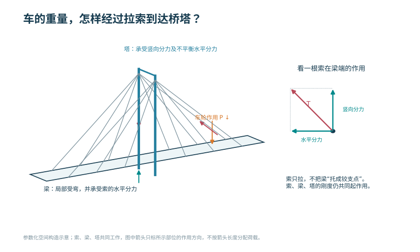
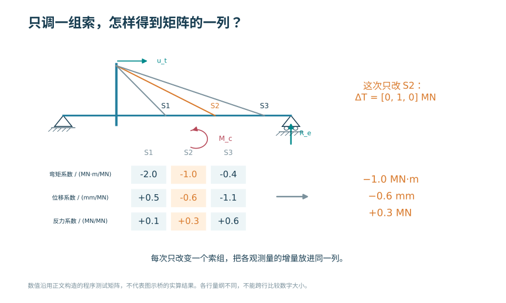
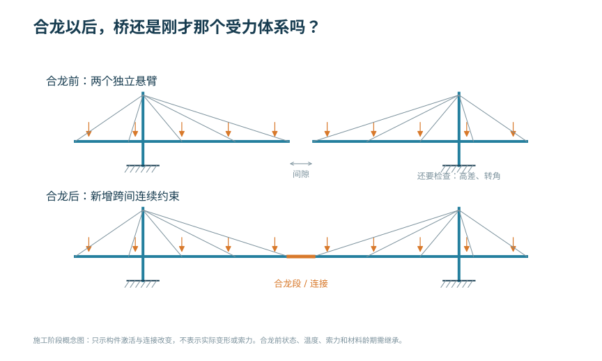
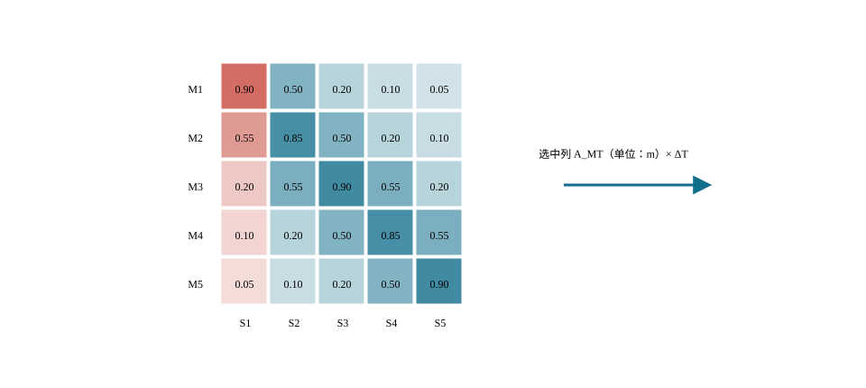

# 斜拉桥设计

<!-- CORE-ROUTE START -->
<div class="core-route" id="core-route">
<!-- VISUAL-ENTRY START -->
<div class="chapter-visual-entry"><p>先从一个看得见的问题开始</p><h3>只调整一个地方，为什么别的位置也会跟着变？</h3><p>改变第一控制量，比较两个控制点的响应，留意没有直接调整的那一处。</p><a href="../interactive/learning-map.html?chapter=ch05">看图进入实验 →</a></div>
<!-- VISUAL-ENTRY END -->
<!-- PRIORITY-CHAPTER-GALLERY START -->
<details class="priority-chapter-gallery"><summary>从本章的 3 幅新图开始</summary><div class="priority-thumb-grid"><a href="#fig-priority-F24"><span>车的重量，怎样经过拉索到达桥塔？</span></a><a href="#fig-priority-F25"><span>只调一组索，怎样得到矩阵的一列？</span></a><a href="#fig-priority-F26"><span>合龙以后，桥还是刚才那个受力体系吗？</span></a></div></details>
<!-- PRIORITY-CHAPTER-GALLERY END -->

<h2>本章的核心思考</h2><p class="core-thesis">斜拉桥的核心是耦合响应与可控性。</p><ol><li>用索倾角理解索力及其水平分量。</li><li>观察调整一根索对多个控制点的影响。</li><li>检查控制方向独立性，再谈优化和反算。</li></ol><div class="core-analogy"><h3>跨课程类比</h3><p>结构力学单位响应 → 索力影响矩阵；线性代数 → 可控性</p><p><strong>反例与边界：</strong>固定影响矩阵只在相应状态附近有效；不同施工阶段不能沿用未解释的同一矩阵。</p></div><p>建议课堂集中完成标为“课堂核心”的3个单元，其余单元用于课前观察和课后迁移。每个单元配独立短视频、操作实验、目标检验与开放论证题。</p><div class="core-unit-grid"><article><p class="core-tag">C06U01 · 课堂核心</p><h3>拉索把竖向荷载传给塔与梁</h3><p>相同竖向分量下，索倾角减小会提高索力和水平分量。</p><p><a href="../interactive/core-learning.html?unit=C06U01" target="_blank">操作与迁移任务</a> · <a href="../interactive/core-learning.html?unit=C06U01&amp;view=video" target="_blank">观看短视频</a></p></article><article><p class="core-tag">C06U02 · 课堂核心</p><h3>调整一根索会影响多个输出</h3><p>索力增量通过影响矩阵同时改变多个控制点响应。</p><p><a href="../interactive/core-learning.html?unit=C06U02" target="_blank">操作与迁移任务</a> · <a href="../interactive/core-learning.html?unit=C06U02&amp;view=video" target="_blank">观看短视频</a></p></article><article><p class="core-tag">C06U03 · 课前/课后迁移</p><h3>成桥目标是多个条件的共同满足</h3><p>不同控制变量对应不同响应方向，必须同时查看耦合输出。</p><p><a href="../interactive/core-learning.html?unit=C06U03" target="_blank">操作与迁移任务</a> · <a href="../interactive/core-learning.html?unit=C06U03&amp;view=video" target="_blank">观看短视频</a></p></article><article><p class="core-tag">C06U04 · 课堂核心</p><h3>影响列接近时，控制就不稳定</h3><p>两个控制变量作用方向越接近，为实现某些目标所需调整量越大。</p><p><a href="../interactive/core-learning.html?unit=C06U04" target="_blank">操作与迁移任务</a> · <a href="../interactive/core-learning.html?unit=C06U04&amp;view=video" target="_blank">观看短视频</a></p></article><article><p class="core-tag">C06U05 · 课前/课后迁移</p><h3>主梁轴压仍要和弯矩共同判断</h3><p>索的水平分量产生轴压，不能因此省略主梁弯矩与稳定校核。</p><p><a href="../interactive/core-learning.html?unit=C06U05" target="_blank">操作与迁移任务</a> · <a href="../interactive/core-learning.html?unit=C06U05&amp;view=video" target="_blank">观看短视频</a></p></article><article><p class="core-tag">C06U06 · 课前/课后迁移</p><h3>索越平，水平力越大</h3><p>竖向承载需求固定时，降低倾角显著提高水平分量。</p><p><a href="../interactive/core-learning.html?unit=C06U06" target="_blank">操作与迁移任务</a> · <a href="../interactive/core-learning.html?unit=C06U06&amp;view=video" target="_blank">观看短视频</a></p></article><article><p class="core-tag">C06U07 · 课前/课后迁移</p><h3>温度与约束改变成桥状态</h3><p>温度变形能否自由发生由体系约束决定，成桥状态依赖相应条件。</p><p><a href="../interactive/core-learning.html?unit=C06U07" target="_blank">操作与迁移任务</a> · <a href="../interactive/core-learning.html?unit=C06U07&amp;view=video" target="_blank">观看短视频</a></p></article><article><p class="core-tag">C06U08 · 课前/课后迁移</p><h3>阻尼与刚度解决不同问题</h3><p>增加阻尼主要降低共振附近的动力放大，不能等同于提高静力刚度。</p><p><a href="../interactive/core-learning.html?unit=C06U08" target="_blank">操作与迁移任务</a> · <a href="../interactive/core-learning.html?unit=C06U08&amp;view=video" target="_blank">观看短视频</a></p></article><article><p class="core-tag">C06U09 · 课前/课后迁移</p><h3>施工阶段不能沿用成桥有效长度</h3><p>临时横向支承改变有效长度，从而显著改变理想临界力。</p><p><a href="../interactive/core-learning.html?unit=C06U09" target="_blank">操作与迁移任务</a> · <a href="../interactive/core-learning.html?unit=C06U09&amp;view=video" target="_blank">观看短视频</a></p></article><article><p class="core-tag">C06U10 · 课前/课后迁移</p><h3>调索必须留下输入输出证据</h3><p>保存调整前后响应和索力增量，才能判断模型预测是否得到验证。</p><p><a href="../interactive/core-learning.html?unit=C06U10" target="_blank">操作与迁移任务</a> · <a href="../interactive/core-learning.html?unit=C06U10&amp;view=video" target="_blank">观看短视频</a></p></article></div><p><a href="../core-thinking.html">返回全书核心思维与尺度规律</a> · <a href="../core-resources.html">查看110个教学单元总索引</a> · <a href="../interactive/thinking-analogies.html">打开跨课程并排类比</a></p></div>
<!-- CORE-ROUTE END -->


::: {.chapter-objectives}
**学习目标。** 掌握斜拉桥的组成、索面和塔梁体系；理解斜拉索、主梁和桥塔之间的耦合；能说明合理成桥状态及施工索力控制的基本方法。
:::

<div class="chapter-video-strip"><figure class="chapter-video-card"><video controls preload="metadata" playsinline poster="../assets/videos/manim/posters/M09_stay_matrix.png" src="../assets/videos/manim/M09_stay_matrix.mp4"></video><figcaption>M09　斜拉索影响矩阵与成桥状态</figcaption></figure></div>

## 结构组成、体系选择与传力


<!-- PRIORITY-FIGURE F24 START -->
{#fig-priority-F24 width=100% fig-alt="车的重量，怎样经过拉索到达桥塔？。双索面斜拉体系的参数化轴测示意及单根索在梁端的分力。斜拉索向塔传力，也给主梁引入轴向作用；塔的竖向和不平衡水平作用最终需由基础承担。"}

<details class="figure-method"><summary>查看模型条件与绘图代码</summary><p>构件定位与分力示意，无全桥数值结果；只展示一根索的作用方向，不据箭头比例量取索力；索为受拉构件</p><p>课程组原创参数绘图 · F24 · <a href="../scripts/priority-figures/group_b.py">绘图 Python</a> · <a href="../scripts/priority-figures/figlib.py">公共绘图函数</a> · <a href="../assets/publication/priority-40/F24.png" download>下载 PNG</a> · <a href="../assets/publication/priority-40/F24.svg" download>下载 SVG</a></p></details>
<!-- PRIORITY-FIGURE F24 END -->


斜拉桥由主梁、斜拉索、桥塔、支承体系和基础组成。主梁承受局部弯曲并将荷载分配给斜拉索；斜拉索把竖向分力传至桥塔，同时对主梁产生轴向压力；桥塔再将竖向力和不平衡水平分力传至基础。索、塔、梁的相对刚度共同决定结构响应。

索面可采用单索面、双索面或空间索面；索形可采用辐射形、竖琴形或扇形。塔梁连接和纵向约束可形成漂浮、半漂浮、塔梁固结或支承等体系。体系选择应结合跨径、桥宽、抗风抗震、温度位移、施工和维护条件。

斜拉桥由桥面至基础的主要传力路径见 @fig-ch05-load-path。

{#fig-ch05-load-path width=78%}

::: {.source-note}
**图源（内部初稿）。** 在线教材项目 `longyu8101/qlgc`，原图4-1-1“斜拉桥作用（荷载）传递路径示意”，文件 `source/_static/fig/4-1-1.png`，<https://github.com/longyu8101/qlgc/blob/master/source/_static/fig/4-1-1.png>。用于说明索—塔—梁传力；正式出版前核查许可或统一重绘。
:::

主梁、斜拉索与桥塔的基本受力性质见 @fig-ch05-member-force。

{#fig-ch05-member-force width=74%}

::: {.source-note}
**图源（内部初稿）。** 在线教材项目 `longyu8101/qlgc`，原图4-1-2“斜拉桥构件受力示意”，文件 `source/_static/fig/4-1-2.png`，<https://github.com/longyu8101/qlgc/blob/master/source/_static/fig/4-1-2.png>。用于识别主梁弯压、拉索受拉和桥塔压弯；正式出版前核查许可或重绘。
:::

## 合理成桥状态与总体参数


斜拉桥具有可调内力特征。设第 $i$ 根拉索索力增量为 $\Delta T_i$，结构响应可在线弹性范围内写成

$$\Delta\mathbf r=\sum_i \mathbf a_i\Delta T_i,$$

其中 $\mathbf a_i$ 为单位索力引起的响应向量。通过选择初始索力，可使成桥主梁弯矩、塔顶位移或支反力接近目标状态。所谓合理成桥状态并非唯一索力值，而是在结构安全、线形、索力均匀性和施工可实现性等约束下的可接受解。

<div class="embed-wrap"><iframe loading="lazy" src="../interactive/ch05-stay-lab.html" title="斜拉桥索力与主梁弯矩耦合实验"></iframe></div>

::: {.digital-note}
**数字资源6-1　索力—弯矩耦合。** 选择拉索并调整索力增量，观察主梁弯矩、塔顶偏位和相邻索响应。资源显示影响矩阵和目标误差，提示索力调整具有全桥耦合性。
:::

### 总体尺寸与关键构造

主跨与边跨比例影响边跨压重、端支点反力和塔梁受力。主梁可采用混凝土箱梁、钢箱梁、钢—混凝土组合梁等；桥塔形式应满足受力、施工、景观和检修要求。拉索锚固区承受集中力并伴随复杂局部应力，是构造和局部分析重点。

斜拉索应考虑疲劳、防腐、减振、锚具和可更换性。长索易出现风雨振、涡激振动和参数振动，可根据实际条件采用表面处理、阻尼器、交叉索等措施。构造措施应有分析或试验依据。

## 施工阶段、无应力几何与索力控制


斜拉桥通常采用悬臂拼装或浇筑。每安装一个梁段并张拉相应拉索，体系刚度、几何和内力都会改变。施工分析应考虑梁段安装、张拉、临时支承、合龙、二期恒载和体系转换。正装分析用于预测施工响应；倒拆或优化方法可用于确定目标制造线形和初张拉力，最终仍需通过现场监测修正。

### 受力体系与约束条件

#### 竖向荷载的传递

桥面局部荷载首先由桥面板和主梁分配，再通过拉索竖向分力传至桥塔。对倾角为 $\theta_i$、索力为 $T_i$ 的第 $i$ 根拉索，其竖向与水平分量分别为

$$V_i=T_i\sin\theta_i,\qquad H_i=T_i\cos\theta_i.$$

当所需竖向支承分量 $V_i$ 一定时，索力为 $T_i=V_i/\sin\theta_i$。拉索较平缓时，$\sin\theta_i$ 减小，所需索力和作用于主梁的水平压力均会增大。这一基本关系说明，边跨布置、塔高和索距不能彼此独立选取。提高桥塔能够改善索的竖向支承效率，但会增加塔身、施工设备、风荷载与景观控制要求。

主梁承受拉索锚点之间的局部弯曲，并承担各拉索水平分力累积形成的轴向压力；桥塔承担竖向压力和两侧拉索不平衡产生的弯矩；边跨与辅助墩对主跨荷载形成锚固和平衡作用。若边跨过短或压重不足，端支点可能出现上拔；若边跨刚度过大，则温度和体系变形可能在塔、梁和支点之间形成较大约束效应。

多点弹性支承对主梁恒载弯矩分布的影响可通过 @fig-ch05-moment-compare 与连续梁作定性比较。

{#fig-ch05-moment-compare width=76%}

::: {.source-note}
**图源（内部初稿）。** 在线教材项目 `longyu8101/qlgc`，原图4-1-3“连续梁桥和斜拉桥恒载弯矩图比较示意”，文件 `source/_static/fig/4-1-3.png`，<https://github.com/longyu8101/qlgc/blob/master/source/_static/fig/4-1-3.png>。用于定性比较多点弹性支承作用，不作为比例或数值依据。
:::

索水平分力沿主梁逐段累积所形成的轴力变化趋势见 @fig-ch05-girder-axial。

{#fig-ch05-girder-axial width=76%}

::: {.source-note}
**图源（内部初稿）。** 在线教材项目 `longyu8101/qlgc`，原图4-1-4“斜拉桥主梁轴力图示意”，文件 `source/_static/fig/4-1-4.png`，<https://github.com/longyu8101/qlgc/blob/master/source/_static/fig/4-1-4.png>。用于说明索水平分力沿主梁累积的基本趋势。
:::

#### 横向荷载的传递

双索面通常在横向为桥面提供直接支承，主梁横向弯曲和扭转需求相对明确；单索面拉索多布置在桥面中央，偏心车辆和横风作用需由主梁扭转刚度与横向构造传递。空间索面可提高横向稳定性，但塔顶和锚固区的空间构造复杂。选择索面时需同时比较桥宽、主梁扭转刚度、塔形、锚固空间、施工张拉及索的检查更换条件。

#### 纵向漂浮与固定体系

塔梁纵向连接决定温度、制动和地震作用的主要传力路径。漂浮体系允许主梁相对桥塔纵向移动，可减小均匀温度和收缩徐变引起的约束效应，但需设置纵向限位、阻尼或耗能装置控制风和地震下的位移。塔梁固结可提高局部刚度并简化部分支承构造，却会把纵向变形和地震惯性力更直接地传给桥塔。半漂浮体系通过弹性约束或阻尼装置在正常使用和地震状态间取得不同刚度。

体系选择不宜只以“柔”或“刚”表述，而应建立自由度表。对于塔梁连接位置的纵向位移 $u_x$、横向位移 $u_y$、竖向位移 $u_z$ 及三个转角，逐项说明是否约束、由何种构件约束、正常使用与偶然状态下是否相同、装置的刚度和间隙如何进入模型。

### 索面、索形与索距

#### 辐射形、竖琴形与扇形

辐射形拉索集中于塔顶附近，索倾角较大，竖向支承效率高，但塔顶锚固密集、局部应力和施工空间要求高。竖琴形拉索近似平行，构造秩序明确，塔上锚点分散，但靠近跨中的索较平缓，索力和主梁轴力可能增加。扇形在两者之间折中，是工程中常见布置。

索形的比较应至少列出：最小与最大索倾角、塔上锚点间距、梁上索距、主梁最大无支承长度、索力离散程度、塔顶锚固区尺寸、施工张拉顺序和更换可达性。外观图只能帮助识别布置，不能替代上述力学和构造指标。

#### 索距与局部弯曲

将主梁简化为拉索锚点间的连续弹性支承梁，索距 $a$ 减小时，主梁局部弯矩通常降低，但拉索数量、锚具数量、施工张拉与维护工作量增加。若将锚点间主梁暂按简支梁估算，均布荷载 $q$ 下局部弯矩量级为

$$M_{\mathrm{loc}}\approx\frac{qa^2}{8}.$$

该式只用于概念比较。实际主梁具有连续性、轴力、剪切变形和索的弹性支承，局部弯矩还受索力、塔梁刚度和移动荷载位置影响。数字资源可让学生改变索距，同时显示局部弯矩近似值、索数和锚固构造数量，直观看到结构效率与构造复杂度之间的权衡。

### 主梁、桥塔与拉索

#### 主梁形式

混凝土主梁刚度大、压重作用明显，适合中等跨径和悬臂浇筑，但自重大、收缩徐变和施工阶段效应突出；钢箱梁自重较小、适合大跨和整体节段吊装，需重点处理疲劳、正交异性桥面板、焊接变形与防腐；钢—混凝土组合梁可发挥钢结构轻质和混凝土桥面板受压优势，需分析剪力连接、施工顺序和长期效应。

主梁截面不仅承担竖向弯曲。拉索水平分力使其处于弯压状态，偏心交通和风作用形成扭矩，索锚固处存在集中力和横向分力。总体杆系模型可用于索塔梁共同工作，锚固区则需用板壳或实体子模型分析局部应力和传力。

#### 桥塔受力

桥塔在对称恒载状态下以轴向压力为主；活载偏载、施工不对称、温度、风和地震会形成纵横向弯矩。塔柱几何轴线、拉索合力线和基础反力线之间的偏心决定弯矩水平。A形、H形、门形或独柱塔的横向刚度和索锚固方式不同，不能只按景观形态分类。

塔柱稳定验算应考虑轴力、弯矩、初始缺陷、二阶效应和施工阶段自由长度。薄壁箱形塔还涉及局部板件受力、横梁节点、索锚固区和施工爬模阶段。总体模型中的塔柱单元刚度应与实际截面、开孔和横梁连接相符。

#### 拉索的力学与构造

拉索的轴向伸长近似为

$$\Delta l_i=\frac{T_il_i}{E_iA_i},$$

但长索存在自重垂度，等效轴向刚度会低于直杆 $EA/l$。初步分析可采用等效弹性模量修正，精细分析采用悬链线索单元或几何非线性索单元。拉索还应考虑温度、锚具滑移、张拉误差、疲劳和振动。

斜拉索体系应具备防腐密封、排水、锚具保护、减振、检查和更换条件。索体表面形状会影响风雨振；阻尼器安装位置和参数需与索长、频率和目标模态协调。索的安全评价不只比较最大拉力，还要检查应力幅、锚固疲劳、索力均匀性和防护体系完整性。

### 合理成桥状态

#### 状态定义

斜拉桥的成桥状态可用主梁弯矩 $\mathbf M_b$、桥塔弯矩 $\mathbf M_t$、索力 $\mathbf T$、支反力 $\mathbf R_s$ 和几何线形 $\mathbf u$ 描述。设计目标不是让某一组内力全部为零，而是在安全、线形、材料效率和施工可实现性约束下形成均衡状态。

在线性化分析中，设索力调整量为 $\Delta\mathbf T$，响应变化为

$$\Delta\mathbf r=\mathbf A\Delta\mathbf T,$$

其中 $\mathbf A$ 为索力影响矩阵。给定目标响应 $\mathbf r^*$，可建立加权最小二乘问题：

$$
\min_{\Delta\mathbf T}
\left\|\mathbf W(\mathbf r_0+\mathbf A\Delta\mathbf T-\mathbf r^*)\right\|_2^2,
$$

并附加索力上下限、相邻索力差、塔顶位移、端支点反力等约束。权重矩阵 $\mathbf W$ 表示不同控制量的重要程度，其取值应说明依据并开展敏感性比较。

#### 零位移法、刚性支承连续梁法与优化法

零位移法通过调节索力使指定控制点位移接近目标，计算直观，但仅控制位移可能导致局部弯矩或索力分布不理想。刚性支承连续梁法先把索锚点视为竖向支点求得反力，再换算为拉索竖向分力，适于形成初始索力估计。优化法可同时控制主梁弯矩、塔偏位、索力均匀性和支反力，但结果受目标、权重和约束影响。

无论采用哪种方法，都应执行三项复核：索力与竖向荷载的总体平衡；塔两侧水平分力及基础反力平衡；在完整非线性模型中施加所得初始索力后，成桥线形和内力是否达到预期。

### 施工状态与制造线形

#### 正装分析

正装分析按实际顺序激活构件、施加自重、张拉拉索和完成合龙。第 $k$ 阶段的状态不仅依赖当前荷载，还继承此前阶段的位移、内力和材料时变效应。混凝土斜拉桥需记录节段龄期、弹性模量、收缩徐变、预应力及拉索张拉时间；钢箱梁需考虑制造误差、吊装姿态、临时连接和温度。

悬臂施工中，两侧节段通常对称安装，以控制桥塔不平衡弯矩。施工荷载、挂篮或吊机重量、节段偏差和张拉误差会造成不对称响应。模型应设置允许偏差工况，而不只计算理想对称状态。

#### 倒拆分析与无应力几何

倒拆法从目标成桥状态逆向移除桥面附加荷载、拉索和梁段，估计制造线形或安装控制值。非线性、收缩徐变和不可逆施工过程使严格逆运算受到限制，因此倒拆结果应由正装分析验证。构件制造长度、节段预拱度和拉索无应力长度属于不同物理量，成果表中必须分别定义。

拉索无应力长度可理解为在规定参考温度和无轴力条件下的长度。现场量测索长受温度、索力、垂度和锚具位置影响，不能直接与无应力长度比较。施工控制通常以梁段标高、塔顶偏位、索力和环境温度为观测量，通过模型预测与实测差异修正后续指令。

#### 合龙与体系转换


<!-- PRIORITY-FIGURE F26 START -->
{#fig-priority-F26 width=100% fig-alt="合龙以后，桥还是刚才那个受力体系吗？。合龙前两侧悬臂分别承担施工荷载；合龙后新增连接使体系连续。不能只把成桥模型一次加载，就认为已重现施工状态。"}

<details class="figure-method"><summary>查看模型条件与绘图代码</summary><p>示意图不含变形和内力结果；施工荷载、临时边界和初始状态需按阶段定义；图中塔基仅作支承定位，不指定实际构造</p><p>课程组原创参数绘图 · F26 · <a href="../scripts/priority-figures/group_b.py">绘图 Python</a> · <a href="../scripts/priority-figures/figlib.py">公共绘图函数</a> · <a href="../assets/publication/priority-40/F26.png" download>下载 PNG</a> · <a href="../assets/publication/priority-40/F26.svg" download>下载 SVG</a></p></details>
<!-- PRIORITY-FIGURE F26 END -->


合龙把两个独立悬臂转化为连续体系，合龙温度、临时锁定、配重和焊接或浇筑顺序会形成锁定效应。合龙前应预测间隙、相对高差和转角；合龙后应检查体系转换引起的内力重分配。不能用成桥模型一次加载替代这一过程。

## 活载、动力、稳定与特殊作用


斜拉桥动力特性由主梁、桥塔和拉索共同决定。主梁竖弯、侧弯、扭转模态可能与桥塔或拉索局部模态耦合。建立动力模型时需检查质量来源、索单元初始力、几何刚度、边界和阻尼假定。频率对索力和边界变化敏感，可作为模型校核指标，但频率吻合并不保证全部静力响应正确。

整体稳定分析包括主梁弯压稳定、桥塔压弯稳定和施工悬臂状态稳定。特征值屈曲可用于识别可能模式，设计判断还需考虑初始缺陷、材料非线性和二阶效应。对大跨斜拉桥，应将抗风分析纳入截面和体系设计；对强震区桥梁，应协调纵向约束、耗能装置、塔墩延性和防落梁构造。

### 活载效应与影响面

斜拉桥主梁受到密集弹性支承，活载沿桥移动时，拉索、主梁和桥塔响应同时变化。对线性化成桥状态，可对单位竖向荷载逐点移动，得到控制量 $r$ 的影响线 $\eta_r(x)$；多车道空间模型则形成随纵向位置 $x$ 和横向位置 $y$ 变化的影响面 $\eta_r(x,y)$。给定面荷载 $q(x,y)$，响应为

$$r=\iint_A\eta_r(x,y)q(x,y)\,\mathrm dA.$$

影响面适用于车辆纵横向布置和偏载分析。主梁弯矩、塔底弯矩、塔顶位移、端支点反力和单根索力的影响面形状不同，因此需要分别加载。把只对跨中弯矩最不利的车辆位置用于全部控制量，会遗漏塔和索的控制工况。

活载作用于主跨时，中跨索力增加并使桥塔向主跨偏移；端锚索、边跨压重和辅助墩限制这种位移。活载作用于边跨时，边跨支承和端锚条件又改变响应。教学模型可依次取消端锚索、辅助墩或边跨压重，比较塔顶位移和主梁弯矩，认识边跨并非只用于跨越，而是主跨刚度和水平平衡的重要组成。

对曲线或宽幅斜拉桥，偏心交通会形成主梁扭转和两索面索力差。双索面不能简单假定平均分担全部荷载；横向桥面刚度、横隔构件和主梁扭转刚度决定分配。空间模型应检查对称荷载下两索面响应对称、偏心荷载方向反转时索力差符号相应反转。

### 索力测试与施工监控

#### 索力识别

索力可由压力传感器、磁通量方法或基于振动频率的间接方法测定。理想弦模型中，长度 $l$、单位长度质量 $m$ 的拉索第 $n$ 阶频率近似为

$$f_n=\frac{n}{2l}\sqrt{\frac{T}{m}},$$

从而 $T\approx4ml^2f_1^2$。实际拉索具有弯曲刚度、垂度、边界弹性和减振器，短索或锚固复杂时必须采用修正模型。现场频谱中的峰值还可能受桥面、塔或相邻拉索振动污染，识别前需核对模态形态。

#### 监控量与修正

施工监控以梁段标高、桥塔坐标、索力、关键截面应变、温度和施工荷载为基本量。测量值 $y_m$ 与模型预测 $y_p$ 的差可分解为测量误差、参数误差、施工偏差和模型误差。发现偏差后，先检查温度基准、测点、施工事件和传感器，再通过参数敏感性判断调整索力、立模标高或后续节段重量。

设观测向量为 $\mathbf y$，待识别参数为 $\mathbf p$，在当前状态附近有

$$\Delta\mathbf y\approx\mathbf S_p\Delta\mathbf p,$$

其中 $\mathbf S_p$ 为参数敏感矩阵。参数识别若列数过多或高度相关，会出现多组参数解释同一偏差的情况。监控方案应选取可识别、可控制的少量参数，并对调整后的全桥响应重新计算。

#### 索力调整原则

调索应按成组和分级方式进行，限制单次调整量和相邻索力突变。每次调索后复测索力、梁面线形和塔顶坐标，确认误差方向与模型预测一致。只把某根索调到目标值可能使邻近索和主梁内力偏离目标；调索指令必须来自全桥模型，并包含温度、当前施工状态和张拉设备标定信息。

## 锚固区、疲劳与换索


梁上锚固区把拉索集中力分解为主梁轴向、竖向和横向分量。混凝土箱梁常设置锚固横梁、锚块或箱内锚固构造，钢箱梁采用锚箱、锚管和加劲肋。局部力流从锚具经承压板、锚块、腹板和横隔构件进入主梁，可能产生局部承压、劈裂、剪切、面外弯曲和疲劳应力。

总体杆系模型只能提供锚点的六分量作用。局部模型应取足够范围，通过截面合力或位移边界传递总体作用，并用圣维南区外的应力稳定性确定模型边界。网格需在承压板、焊趾、开孔和几何突变处加密，结果解释区分名义应力、结构应力和局部峰值。

塔上锚固区索距小、索力大，左右索面和两侧跨索力共同作用。混凝土塔可采用预应力或钢锚梁平衡横向分力，钢塔采用锚箱或隔板传力。局部构造需同时满足张拉空间、防腐密封、排水和换索作业。

### 疲劳、振动与换索状态

斜拉索承受交通引起的应力循环、风雨振和温度变化，锚具和钢丝是疲劳重点。疲劳分析以应力幅和循环次数为核心，不能只用最大索力判断。总体模型提供交通影响线和索力时程，局部疲劳类别或试验性能由相应标准确定。

减振措施包括外置或内置阻尼器、索面气动处理、交叉索等。阻尼器效果取决于安装位置与索长比、阻尼参数和目标模态；对低阶与高阶模态的控制可能不同。数字模型应显示阻尼器前后自由衰减曲线和模态阻尼，而不是只给出装置照片。

换索是必须分析的临时状态。移除一根索前需设置临时索或调整相邻索，控制主梁线形、塔偏位和局部锚固力；换索期间交通状态和风速条件可能受限。施工模型按卸载旧索、拆除、安装新索、分级张拉和恢复交通分阶段计算，并验证任何阶段的结构安全和可施工性。

## 参数化模型、影响矩阵与结果审查


参数化模型的核心参数包括主跨和边跨、塔高、梁上索距、索面位置、主梁截面、塔柱截面、索面积、塔梁约束、辅助墩位置及施工阶段。几何生成、构件编号、材料和截面赋值、索锚点对应关系应由同一参数源驱动，避免修改几何后荷载或结果提取位置未同步更新。

模型审查至少包括：

1. 总重、竖向支反力和索竖向分力是否平衡；
2. 对称结构和对称作用下索力、位移和反力是否对称；
3. 拉索是否连接到正确塔、梁锚点，局部坐标和初拉力方向是否一致；
4. 温度作用下固定点和活动方向是否符合支承体系；
5. 网格或单元划分改变后控制响应是否收敛；
6. 简化连续梁、索力分解或单位荷载法结果是否与模型量级一致；
7. 施工阶段激活、钝化和荷载时点是否与工序一致；
8. 结果表能否追溯到工况、组合、阶段、构件和截面。

::: {.callout-tip}
**受控提示词：索力方案复核。** 输入桥梁跨径、塔高、索距、塔梁约束、目标成桥状态、索力影响矩阵和约束条件。请检查量纲、矩阵维数、平衡条件、索力上下限、相邻索力突变、端支点反力及塔顶位移；列出需要在非线性正装模型中复核的项目。不得补造规范限值，不得把优化目标误写为唯一合理状态。
:::

## 贯通教学案例


教学案例采用对称双塔、双索面、扇形布索。先根据通航和桥位条件确定主跨，再以边跨平衡、塔高和索倾角形成总体几何；随后建立梁—塔—索空间杆系模型，施加结构重力和附加重力，计算初始索力；最后按施工节段进行正装模拟，并以主梁线形、塔顶偏位和索力作为控制量。

案例按四轮计算组织。第一轮使用等刚度主梁和等面积拉索，检查传力、平衡与对称性；第二轮依据索力水平调整索面积，以利用率和相邻索力差为指标；第三轮加入主梁变截面、塔柱刚度和实际边界，比较成桥内力；第四轮加入施工、温度、车辆和风作用，形成控制包络。每轮只增加必要复杂度，并保留与上一轮结果的差异说明。

交互活动包括：拖动塔高查看索倾角和主梁轴力变化；改变某根索力查看全桥弯矩响应；切换漂浮、半漂浮和固结体系查看温度与地震位移；对一组拉索施加张拉偏差，识别施工监测中最敏感的观测量。

### 数字资源与图件计划

1. 索面、索形和塔梁约束三维对照模型；
2. 拉索角度—索力—主梁轴力联动图；
3. 索距—局部弯矩—锚具数量参数图；
4. 索力影响矩阵与目标状态优化实验；
5. 正装、倒拆和制造线形对照动画；
6. 拉索振动、阻尼器和锚固构造拆解模型；
7. MIDAS或同类软件的成桥与施工阶段建模录像；
8. 索力方案一致性审查提示词与脚本。

本章待配图优先采用《桥梁结构体系》及课程组已有工程图中的体系、传力和构造图，在线教材只用于知识定位。每幅外部图在内部稿中注明书名、图号、页码或网页链接；出版前取得授权、链接原始公开资源或按力学关系重新绘制。

### 本章图源台账与参考资料

| 图号 | 内容 | 当前来源 | 定稿处理 |
|---|---|---|---|
| @fig-ch05-load-path | 斜拉桥传力路径 | 在线教材图4-1-1 | 核查许可或统一重绘 |
| @fig-ch05-member-force | 构件受力 | 在线教材图4-1-2 | 核查许可或统一重绘 |
| @fig-ch05-moment-compare | 恒载弯矩比较 | 在线教材图4-1-3 | 重绘并保留适用假定 |
| @fig-ch05-girder-axial | 主梁轴力趋势 | 在线教材图4-1-4 | 重绘并补充符号与单位 |

主要参考资料包括：课程组指定《桥梁工程》教材的斜拉桥篇；肖汝诚《桥梁结构体系》中关于索承体系和斜拉桥体系的章节；项目采用的现行公路斜拉桥设计、作用与组合、混凝土或钢结构、抗风、抗震和施工监控标准；`longyu8101/qlgc` 第四篇斜拉桥。涉及具体工程参数时另列设计文件或公开技术报告来源。

::: {.digital-note}
**跨课程概念入口。** 本章可先使用 [Equilibrium](https://epsassets.manchester.ac.uk/structural-concepts/Statics/equilibrium/equilibrium_con.php)、[Prestress](https://epsassets.manchester.ac.uk/structural-concepts/Statics/prestress/prestress_con.php) 和 [Horizontal Movements](https://epsassets.manchester.ac.uk/structural-concepts/Statics/horizontal/horizontal_con.php) 建立力分解、初始力与塔顶位移概念，再进入索力影响矩阵和施工控制。外链图文不复制进教材，课程组另制桥梁参数实验。
:::

### 索—塔—梁协同工作的力学表达

#### 共同平衡与相对刚度

斜拉桥不是“梁上增加若干拉杆”的普通连续梁。每根拉索把梁上锚点与塔上锚点连接，其索力变化同时作用于主梁和桥塔；主梁挠度、桥塔偏位又改变拉索长度和方向，从而反过来改变索力。边跨、辅助墩和端锚索则为主跨活载与恒载提供平衡。体系响应由几何、初始索力和索—塔—梁相对刚度共同决定。

对第 $i$ 根拉索，设梁端锚点与塔端锚点的空间单位向量为 $\boldsymbol n_i$，索力为 $T_i$（N或kN），则两端节点作用为大小相等、方向相反的

$$
\boldsymbol f_i=T_i\boldsymbol n_i.
$$

在顺桥竖直平面内，若索与水平线夹角为 $\theta_i$，则竖向分量 $V_i=T_i\sin\theta_i$，水平分量 $H_i=T_i\cos\theta_i$。$V_i$ 形成对主梁的弹性支承，$H_i$ 在主梁中累积为轴向压力，并在桥塔两侧不平衡时形成塔弯矩。空间索面还产生横向分量，必须在三维坐标中保持节点合力和合力矩平衡。

在给定成桥平衡状态附近，增量方程可写为

$$
\begin{bmatrix}
\boldsymbol K_{bb}&\boldsymbol K_{bt}&\boldsymbol K_{bc}\\
\boldsymbol K_{tb}&\boldsymbol K_{tt}&\boldsymbol K_{tc}\\
\boldsymbol K_{cb}&\boldsymbol K_{ct}&\boldsymbol K_{cc}
\end{bmatrix}
\begin{bmatrix}
\Delta\boldsymbol u_b\\
\Delta\boldsymbol u_t\\
\Delta\boldsymbol u_c
\end{bmatrix}
=
\begin{bmatrix}
\Delta\boldsymbol F_b\\
\Delta\boldsymbol F_t\\
\Delta\boldsymbol F_c
\end{bmatrix},
$$

其中，下标 $b,t,c$ 分别代表主梁、桥塔和拉索，自由度位移单位为 m 或 rad，刚度矩阵相应分块表示直接刚度与耦合刚度。公式仅用于说明耦合关系；索的几何刚度、主梁轴力二阶效应和支座非线性会使切线刚度随状态改变。

#### 协同工作的三项平衡检查

第一，全部拉索竖向分力、桥墩或辅助墩反力与上部结构总竖向作用应满足整体平衡。第二，塔两侧拉索水平分力差应与塔身弯矩、塔梁连接力和基础反力协调。第三，主梁轴力沿锚点逐段累积或释放，其跳变量应与该锚点索力水平分量一致。若模型中索力看似合理而三项平衡不成立，应先检查索的连接方向、初始应变、局部坐标和重复施力。

::: {.digital-note}
**数字资源6-2　索—塔—梁力流追踪。** 选择任一拉索后，页面显示 $T_i$、$V_i$、$H_i$ 及其在主梁和桥塔中的传递；沿主梁移动剖切面，显示轴力累积。力用 kN、弯矩用 kN·m、位移用 mm，并提供整体平衡误差。资源使用课程组教学模型，不包含规范限值。
:::

### 索面、塔形与主梁的联合选择

#### 索面选择

单索面通常布置于桥面中央或中央分隔带，桥面横向空间较完整，但偏心车辆和横风必须由主梁扭转、横梁和塔梁空间体系传递。双索面从两侧直接支承桥面，适合较宽桥面并有利于控制横向扭转，但边缘锚固、索区防护、桥面宽度和维护通道需要协调。空间索面可通过索的横向倾斜增强整体空间刚度，同时提高塔上锚固和张拉设备布置的复杂性。

索面选择不能孤立于主梁截面。抗扭刚度较大的闭口箱梁更能适应单索面偏心支承；双边索面可与双边腹板、边箱或桁梁节点形成直接传力。索锚点若偏离主梁剪切中心，会在竖向索力下产生附加扭矩，应在总体模型中保留真实偏心，或用等效节点力和力矩严格转换。

#### 塔形选择

桥塔可采用独柱、A形、倒Y形、H形、门形等。塔形首先决定索面汇聚方式和横向传力。独柱或中央塔与单索面匹配时，横向受力和塔梁构造集中；A形或倒Y形塔可通过倾斜塔柱形成横向框架效应，但塔柱合龙区和施工控制复杂；H形或门形塔构造清楚，塔柱间横梁的刚度与节点是空间受力关键。

桥塔选型至少核对：索锚固空间、塔柱自由长度、横向刚度、塔梁连接、施工爬模或节段安装、塔顶设备、检修通道、雷电与排水，以及风和地震作用下的变形。塔形的景观表达应建立在上述工程条件满足的基础上。

#### 主梁选择

主梁材料和截面影响自重、刚度、施工节段、索力水平和抗风性能。混凝土箱梁自重较大，可为边跨提供压重并具有较高刚度，但收缩徐变、施工龄期和悬臂浇筑周期明显影响索力与线形；钢箱梁轻质、适于大节段吊装，抗扭和抗风外形可协同设计，但正交异性桥面疲劳、焊接细节和防腐维护更突出；组合梁的混凝土桥面板与钢梁分阶段共同工作，连接件、浇筑顺序和长期效应必须进入模型。

联合选择可使用下表，不以单一“适用跨径”判断：

| 决策项 | 关键输入 | 主要响应 | 必须同步核查的构造或阶段 |
|---|---|---|---|
| 单/双/空间索面 | 桥宽、交通横向位置、塔形 | 主梁扭转、两索面索力差、横向位移 | 锚固位置、护栏、检查与换索空间 |
| 塔高和塔形 | 主跨、索倾角、净空、风环境 | 索力、主梁轴力、塔底弯矩 | 塔上锚固、横梁、施工设备和检修 |
| 主梁材料 | 跨径、架设能力、耐久环境 | 恒载索力、刚度、频率、长期变形 | 节段连接、桥面体系、防腐和施工顺序 |
| 梁上索距 | 局部弯曲、节段长度 | 主梁局部弯矩、索数和索力分布 | 锚箱或锚块数量、张拉与维护工作量 |
| 边跨和辅助墩 | 地形、基础和通航 | 塔顶偏位、端支点反力、主梁弯矩 | 压重、上拔、支座和温度位移 |

::: {.source-note}
**规范回查。** 公路斜拉桥总体、结构分析、构造和施工阶段要求应以项目采用的《公路斜拉桥设计规范》及配套标准为准。交通运输部发布 JTG/T 3365-01—2020 的公告见[官方页面](https://xxgk.mot.gov.cn/2020/jigou/glj/202006/t20200623_3313239.html)，公告同时说明其替代的旧版文件。链接用于核实标准身份和版本关系，具体条文及表格应查阅合法正式文本；本节为课程组重新组织的教学说明。
:::

### 合理成桥状态与索力影响矩阵

#### 状态目标和约束

合理成桥状态应同时描述几何和内力。常用控制量包括主梁控制截面弯矩、梁面线形、桥塔偏位与弯矩、索力及其相邻变化、端支点反力和基础反力。目标不宜设置为“所有主梁弯矩为零”，因为主梁仍需承担锚点间局部作用、活载和空间效应；把过多控制点强制为零还可能造成索力异常或端支点上拔。

设初始响应为 $\boldsymbol r_0$，索力修正为 $\Delta\boldsymbol T$，线性化影响矩阵为 $\boldsymbol A$，则

$$
\boldsymbol r=\boldsymbol r_0+\boldsymbol A\Delta\boldsymbol T.
$$

$\boldsymbol A$ 的第 $i$ 列可由第 $i$ 根索施加单位索力增量并重新平衡后得到。由于响应中弯矩、位移和反力单位不同，优化前应采用具有物理依据的尺度矩阵 $\boldsymbol W_r$ 进行归一化。一个带正则项的教学目标为

$$
\min_{\Delta\boldsymbol T}
\left\|\boldsymbol W_r
(\boldsymbol r_0+\boldsymbol A\Delta\boldsymbol T-\boldsymbol r^*)
\right\|_2^2
+\lambda\left\|\boldsymbol W_T\Delta\boldsymbol T\right\|_2^2,
$$

并满足

$$
\boldsymbol T_{\min}\le
\boldsymbol T_0+\Delta\boldsymbol T
\le\boldsymbol T_{\max},
$$

以及端支点反力、塔顶位移、相邻索力变化和施工张拉能力等约束。$\lambda$ 为正则化权重，防止为减少很小的目标误差而产生过大的索力调整。上下限和接受准则必须从项目采用标准、材料、锚具与施工能力确定，本教材不预置规范数值。

#### 影响矩阵的质量检查

影响矩阵计算前应固定成桥模型、边界和参考状态。单位索力增量既不能过小而被数值误差淹没，也不能过大而越出线性化邻域；可用正、负两次扰动形成中心差分：

$$
\boldsymbol a_i\approx
\frac{\boldsymbol r(\boldsymbol T_0+\Delta T_i\boldsymbol e_i)
-\boldsymbol r(\boldsymbol T_0-\Delta T_i\boldsymbol e_i)}{2\Delta T_i}.
$$

若正负扰动得到的斜率明显不同，说明几何或边界非线性不可忽略，线性矩阵只可用于生成初值。矩阵列还应检查相邻索响应的连续趋势、对称结构中的镜像关系和总体平衡。条件数过大表示某些索力调整对选定目标的作用高度相似，解可能对测量误差和权重敏感，此时应减少控制变量、增加约束或采用索组调整。

#### 从优化解回到完整模型

索力优化只在给定模型和目标下产生候选解。候选索力需回写到含索垂度、几何刚度、真实边界和阶段效应的完整模型，核对全桥平衡、主梁与塔内力、索力、线形和支点反力。若优化使用成桥一次加载模型，还必须证明索力和线形能够通过施工顺序实现。不能把数学残差最小等同于结构状态合理。

::: {.digital-note}
**数字资源6-3　索力影响矩阵。** 页面以热力图显示“调整哪根索会改变哪些响应”，并列出每一行和每一列的单位。用户可选择目标响应、权重和索组，比较无约束最小二乘、带边界约束及正则化结果。所有方案均须通过平衡和非线性复算页后才能标为“已核对”。
:::

<div class="embed-wrap compact"><iframe loading="lazy" src="../interactive/bridge-concept-screen.html?lab=staymatrix" title="斜拉桥索力影响矩阵实验"></iframe></div>

{#fig-ch05-stay-matrix .static-fallback width=82%}

### 正装、倒拆与无应力几何

#### 状态递推

正装分析按真实事件顺序计算。第 $k$ 阶段状态可概括为

$$
\boldsymbol q_k=
\mathcal F_k(\boldsymbol q_{k-1},
\Delta\boldsymbol F_k,\Delta\boldsymbol T_k,
\Delta t_k,\Theta_k),
$$

其中，$\boldsymbol q$ 包含几何、内力、索力和材料状态；$\Delta\boldsymbol F_k$ 为新增构件与施工作用；$\Delta\boldsymbol T_k$ 为本阶段张拉；$\Delta t_k$ 为时间增量；$\Theta_k$ 为温度、材料龄期和边界等参数。对混凝土主梁，$\mathcal F_k$ 还应反映收缩徐变和弹性模量发展；对钢梁，需考虑制造线形、吊装温度和连接形成。

倒拆分析从目标成桥状态逆向移除构件和作用，可辅助推求安装标高、制造预拱度和索的控制长度。严格倒拆要求过程可逆，而混凝土时变、摩擦、锚具回缩、接触和塑性等并不满足这一条件。因此倒拆用于生成初始控制值，随后必须用正装模型验证。

#### 无应力长度与无应力几何

无应力长度是拉索在规定参考温度、无轴力状态下的材料长度。若暂忽略索自重垂度、锚具变形和温度，仅按均匀弹性直杆近似，当前几何长度 $l_g$ 与无应力长度 $l_0$ 有

$$
l_g\approx l_0\left(1+\frac{T}{EA}\right),
\qquad
l_0\approx\frac{l_g}{1+T/(EA)},
$$

其中，$T$ 为 N，$E$ 为 Pa，$A$ 为 m²，$l_g,l_0$ 为 m。长索应考虑自重垂度和悬链线关系；现场控制还要统一锚具基准点、温度修正和张拉端回缩。

主梁节段的无应力几何是构件在装配前的制造几何，包含预拱度、切线方向、节段长度和接缝角度。它与成桥设计线形、某一施工阶段实测线形不是同一对象。成果表应明确：坐标采用哪个温度基准；是否含弹性压缩、徐变和施工设备变形；控制点位于梁顶、梁底还是结构轴线。

#### 合龙控制

合龙前，两个悬臂端的间距、高差和转角共同决定接头能否形成。合龙温度与临时锁定会把部分变形锁入体系。正装模型应预测合龙口六自由度相对位移，并根据允许的施工调整手段设置配重、临时索力或顶推。强行在模型中合并不重合节点会产生数值闭合力；该闭合力必须作为施工效应记录，而不能在成桥结果中无解释地保留。

### 活载、几何非线性与组合边界

斜拉桥成桥状态含显著初始索力和主梁轴向压力。活载响应应在该平衡状态附近求解。对当前状态，增量方程可写为

$$
\boldsymbol K_T(\boldsymbol u,\boldsymbol T)
\Delta\boldsymbol u=\Delta\boldsymbol F,
$$

其中，$\boldsymbol K_T$ 为包含材料刚度与几何刚度的切线矩阵，随位移 $\boldsymbol u$ 和索力 $\boldsymbol T$ 变化。若活载引起的几何变化较小，可在固定切线状态上用影响线或影响面近似；若索垂度、主梁二阶效应、支座状态切换或大位移显著，应在各有效布载情景下直接进行非线性分析。

几何非线性主要来自三处：拉索的初始垂度使轴向刚度与索力相关；主梁受压产生梁柱效应；桥塔偏位改变索角和水平分力。使用等效弹性模量的索单元时，应记录适用索力区间；使用悬链线索单元时，应定义单位长度质量、无应力长度、温度和初始几何。把拉索建成只依赖 $EA/l$ 的普通桁架，在长索或低索力状态可能高估刚度。

活载布置仍以控制量的影响线或影响面为依据。主梁弯矩、塔底弯矩、塔顶偏位、端支点反力和单索应力幅对应不同加载位置。若用线性影响面筛选候选位置，再做非线性复算，应在邻近位置移动荷载，确认控制点没有因非线性改变。组合程序需标记 `analysis_mode=linear_superposition` 或 `nonlinear_direct`，防止把非线性结果再次按单项效应叠加。

### 锚固区传力与疲劳

#### 总体作用到局部模型

梁上锚点的索力应按实际索方向分解为三向力，并考虑锚具中心相对主梁参考轴的偏心力矩。总体模型输出的六分量截面力应在局部子模型边界保持静力等效。局部模型范围需要跨过锚箱、横隔板或混凝土锚块，直至边界处应力分布相对稳定。

钢锚箱的力流通常经过承压构件、锚腹板、加劲肋、横隔板和主梁板件；混凝土锚固区则需处理局部承压、劈裂、拉压杆传力和预应力。有限元峰值应结合网格、几何突变和所采用的疲劳应力定义解释，不能直接把奇异点最大应力与名义应力限值比较。

#### 应力幅和累积损伤接口

若一根索在交通作用下的索力范围为 $\Delta T$（N），以有效金属面积 $A_s$（m²）形成的平均应力范围为

$$
\Delta\sigma=\frac{\Delta T}{A_s},
$$

单位为 Pa。锚具、焊接细节和局部构件的疲劳应力范围需由相应局部模型或试验定义，不能用索体平均应力代替。对离散应力谱，可用 Miner 线性累积形式说明数据接口：

$$
D=\sum_{j=1}^{m}\frac{n_j}{N_j},
$$

其中，$n_j$ 为第 $j$ 档实计或等效循环数，$N_j$ 为相应细节和应力范围下的允许循环数。$S$—$N$ 曲线、应力定义、截止限及验算准则应由项目采用的斜拉桥、钢结构或产品标准查取，本章不提供替代数值。

疲劳证据链应保留交通或监测数据的时间范围、循环计数方法、动力放大处理、腐蚀状态、锚具类别和模型版本。索体、锚具、阻尼器连接和梁塔锚固区可能由不同细节控制，应分别建账。

### 施工监控、参数识别与换索

#### 监控闭环

施工监控的目标是让实际结构沿可接受路径到达目标成桥状态。流程为：施工前预测；完成事件后测量；进行温度和时间基准修正；比较实测与预测；识别可能参数；形成下一阶段控制指令；在模型中预演并复核。测量偏差不直接等于施工误差，必须先排除测点移动、温度、仪器标定和事件记录不一致。

观测模型可写为

$$
\boldsymbol y=
\boldsymbol h(\boldsymbol p)+\boldsymbol\varepsilon,
$$

其中，$\boldsymbol y$ 为梁面高程、塔顶坐标、索力和应变等观测，$\boldsymbol p$ 为节段重量、弹性模量、温度、索力和边界参数，$\boldsymbol\varepsilon$ 为测量与模型误差。在当前参数附近线性化并采用加权正则估计：

$$
\Delta\boldsymbol p=
\left(\boldsymbol S_p^{\mathrm T}\boldsymbol R^{-1}\boldsymbol S_p
+\boldsymbol\Lambda\right)^{-1}
\boldsymbol S_p^{\mathrm T}\boldsymbol R^{-1}
(\boldsymbol y-\boldsymbol y_p),
$$

$\boldsymbol S_p$ 为敏感矩阵，$\boldsymbol R$ 为观测误差协方差，$\boldsymbol\Lambda$ 为正则矩阵。矩阵形式用于说明“观测误差和参数可识别性必须进入修正”，并不要求现场每次均采用该算法。参数修正后要重新预测全部控制量；若多个参数高度相关，应保留不确定范围而非强行给出唯一值。

::: {.source-note}
**施工监控标准回查。** 交通运输部发布《公路桥梁施工监控技术规程》JTG/T 3650-01—2022 的信息见[官方公告](https://xxgk.mot.gov.cn/jigou/glj/202210/t20221025_3699857.html)；一般桥涵施工要求还应核对 JTG/T 3650—2020 的[官方公告](https://xxgk.mot.gov.cn/jigou/glj/202006/t20200630_3321368.html)。监测项目、精度、预警和控制要求须查正式文本及项目监控方案，本教材只给数据组织和证据链。
:::

#### 换索状态

换索设计从“该索暂时不能提供原有刚度和索力”出发。作业序列通常包含交通与环境条件确认、临时支承或临时索建立、旧索分级卸载、拆除、锚固区检查、新索安装、分级张拉、全桥复测和交通恢复。每一阶段均需在全桥模型中保存索力、主梁线形、塔顶偏位、相邻索增量和锚固区作用。

换索模型必须区分索单元钝化与索力直接置零。瞬时删除会把原索力一次转移给体系，未必对应现场分级卸载。临时索或支架的安装也会引入预力和边界变化。若换索伴随车辆限载或风速作业条件，这些属于施工方案输入和现场控制要求，其取值从项目文件和专项规范查取。

换索完成后，目标不一定是恢复某一根索的原设计索力，而是恢复全桥可接受状态。新索索力、主梁线形、塔偏位和相邻索变化应成组核查，并建立新的运营监测基线。

### 参数化贯通案例：400 m 双塔双索面斜拉桥

#### 案例边界与变量

建立主跨 $L_m=400\,\mathrm m$、两侧边跨各 $L_s=160\,\mathrm m$ 的对称双塔双索面教学模型。桥面以上有效塔高基准为 $h=120\,\mathrm m$，梁上索距基准为 $a=12\,\mathrm m$。取单个教学平面分担的均布恒载 $q=220\,\mathrm{kN/m}$。上述数据用于演示参数关系，不是规范推荐值或真实工程设计。

可调字段包括 $L_m,L_s,h,a$（m），主梁 $EA_b,EI_b,GJ_b$，桥塔 $EA_t,EI_{ty},EI_{tz}$，各索 $E_i,A_i,l_{0i}$，索面横向坐标，塔梁六自由度约束，辅助墩位置，施工事件，温度和教学活载。刚度采用相容的 kN—m 单位体系；界面显示位移时可换算为 mm。

#### 第一步：塔高与索力分解

取距桥塔水平距离 $x=180\,\mathrm m$ 的一根代表索，其承担一个索距内的教学竖向作用

$$
V=qa=220\times12=2640\,\mathrm{kN}.
$$

忽略索自重、连续梁分配和两索面空间差异，仅用 $T=V/\sin\theta$ 比较塔高。因 $\tan\theta=h/x$，有

| $h$/m | $\sin\theta$ | $T$/kN | $H=Vx/h$/kN |
|---:|---:|---:|---:|
| 100 | 0.4856 | 5437 | 4752 |
| 120 | 0.5547 | 4759 | 3960 |
| 140 | 0.6139 | 4300 | 3394 |

提高塔高使该索更陡，在相同竖向分量下索力和主梁水平压力降低。但塔身材料、风作用、施工高度和锚固区布置也随之改变，不能据表直接确定塔高。

#### 第二步：索距与局部弯矩

按 $M_{\mathrm{loc}}\approx qa^2/8$ 比较 $a=10,12,14\,\mathrm m$：

| $a$/m | 教学局部弯矩/(kN·m) | 相对锚点与索数量趋势 |
|---:|---:|---|
| 10 | 2750 | 索和锚点较多 |
| 12 | 3960 | 基准方案 |
| 14 | 5390 | 索较少、局部弯矩较大 |

该简支量级公式不含主梁连续、轴力和索弹性。参数化杆系模型应给出实际锚点间弯矩，并用表中量级检查结果方向。

#### 第三步：建立教学索力影响矩阵


<!-- PRIORITY-FIGURE F25 START -->
{#fig-priority-F25 width=100% fig-alt="只调一组索，怎样得到矩阵的一列？。固定模型状态和输出定义，仅将第二索组增大1 MN时，三项响应增量就是影响矩阵第二列；矩阵沿用正文明确声明的教学测试数据，构件定位图不冒充矩阵来源模型。"}

<details class="figure-method"><summary>查看模型条件与绘图代码</summary><p>教学构造矩阵，不是具体桥的计算；列为索组增量，行依次为弯矩、位移、反力；仅线性局部影响，不直接用于调索设计</p><p>课程组原创参数绘图 · F25 · <a href="../scripts/priority-figures/group_b.py">绘图 Python</a> · <a href="../scripts/priority-figures/figlib.py">公共绘图函数</a> · <a href="../assets/publication/priority-40/F25.png" download>下载 PNG</a> · <a href="../assets/publication/priority-40/F25.svg" download>下载 SVG</a></p></details>
<!-- PRIORITY-FIGURE F25 END -->


选取三个索组修正量 $\Delta T_1,\Delta T_2,\Delta T_3$（MN），控制量为跨中弯矩 $M_c$（MN·m）、塔顶纵向位移 $u_t$（mm）和端支点反力 $R_e$（MN）。构造用于程序测试的影响矩阵

$$
\boldsymbol A=
\begin{bmatrix}
-2.0&-1.0&-0.4\\
0.5&-0.6&-1.1\\
0.1&0.3&0.6
\end{bmatrix}.
$$

矩阵三行单位分别为 MN·m/MN、mm/MN 和 MN/MN。设当前目标误差

$$
\boldsymbol r_0-\boldsymbol r^*
=\begin{bmatrix}4.2&0.4&-0.75\end{bmatrix}^{\mathrm T},
$$

教学修正量

$$
\Delta\boldsymbol T=
\begin{bmatrix}1.5&1.0&0.5\end{bmatrix}^{\mathrm T}\ \mathrm{MN}
$$

产生

$$
\boldsymbol A\Delta\boldsymbol T
=\begin{bmatrix}-4.2&-0.4&0.75\end{bmatrix}^{\mathrm T},
$$

在线性测试中恰好消除三项误差。该矩阵为课程组构造的可复算数据，不代表具体斜拉桥。实际矩阵往往为非方阵且含约束；即使残差为零，也需检查索力上下限、相邻变化和非线性复算。

#### 第四步：无应力长度量级

对 $h=120\,\mathrm m$ 的代表索，直线几何长度

$$
l_g=\sqrt{180^2+120^2}=216.333\,\mathrm m.
$$

另取教学材料参数 $E=195\,\mathrm{GPa}$、有效面积 $A=0.030\,\mathrm{m^2}$，以及上一步近似索力 $T=4.759\,\mathrm{MN}$。忽略自重垂度、温度和锚具变形时，

$$
\frac{T}{EA}=8.14\times10^{-4},
\qquad
l_0\approx\frac{216.333}{1+8.14\times10^{-4}}
=216.157\,\mathrm m.
$$

几何长度与无应力长度相差约 $0.176\,\mathrm m$。结果用于说明长度定义的重要性；长索正式计算必须使用相应索模型，并由制造、温度和锚具基准复核。

#### 第五步：正装和倒拆互校

设置“塔柱完成—零号梁段与临时固结—对称安装梁段—张拉对应索—边跨合龙—主跨合龙—二期恒载—解除临时约束”事件序列。倒拆由目标成桥状态给出初始制造线形和张拉候选值；正装按实际顺序复算。每阶段输出梁端标高、塔顶偏位、索力和塔底弯矩。

两者差异应分类为几何非线性、材料时变、温度基准、施工设备重量或数值实现差异。若正装成桥状态未达到目标，不直接修改最终节点坐标，而是调整有物理意义的无应力几何、张拉量或施工控制值并再次正装。

#### 第六步：教学活载与非线性复算

在成桥初始索力状态生成跨中弯矩、塔底弯矩、端支点反力和三根代表索力的影响线。分别保存各自控制车辆位置。先在线性切线模型筛选，再对控制位置及其相邻位置进行几何非线性直接分析，比较

$$
\delta_r=
\frac{r_{\mathrm{NL}}-r_{\mathrm L}}
{\max(|r_{\mathrm L}|,r_{\mathrm{ref}})},
$$

其中，$r_{\mathrm{ref}}$ 为避免响应接近零时比值失真的参考量，并须在报告中给出。教材不设统一接受阈值；是否可使用线性结果由分析目的、项目标准和专项论证确定。

#### 第七步：锚固疲劳与监控数据

选择一根索，从交通响应时程得到 $\Delta T$ 分档，按 $\Delta\sigma=\Delta T/A_s$ 转为索体平均应力范围，同时把总体锚点六分量传至局部锚固模型。循环计数、细节类别和 $S$—$N$ 数据保留来源字段。施工监控页导入“时间—温度—阶段—索力—梁面高程—塔顶坐标”，以同温度和同事件状态比较预测与实测。

系统只在敏感矩阵表明参数可识别时提出修正候选。例如，索力和梁面高程同时偏离可提示张拉量或节段重量；仅一个高程点偏离先检查测点与局部温度。所有候选以“待核对”状态输出。

#### 第八步：换索演练

选择一根中跨索，依次建立临时支承、分级卸载、旧索退出、新索安装和分级张拉阶段。曲线同时显示被换索、相邻索、主梁线形和塔顶位移。若相邻索力或端支点反力出现突变，返回调整卸载级次或临时体系。换索后建立新的无应力长度、索力、频率和温度基线。

#### 第九步：成果和交互字段

案例成果为总体几何与自由度表、索力分解表、影响矩阵与约束、无应力长度表、正装事件日志、活载控制位置、非线性比较、锚固疲劳接口、监控修正记录和换索状态表。所有结果记录 `model_version`、`stage_id`、`cable_id`、单位、数据来源和审查状态。

::: {.digital-note}
**数字资源6-4　斜拉桥参数贯通实验。** 页面依次开放“体系选择—索力分解—合理状态—无应力几何—施工—活载—监控—换索”。塔高、索距和索面积变化均驱动同一模型；影响矩阵优化结果需经完整模型复算。可视化只显示与当前问题相关的构件和曲线，导出数值、公式代入和版本记录，不以软件界面截图作为最终算法说明。
:::

::: {.source-note}
**案例、图件与视频版权说明。** 本案例数值、矩阵和推导由课程组为教学构造，不对应真实工程。拟新增的索力热力图、无应力几何、施工悬臂、锚固力流和换索动画应由课程组模型和脚本生成。既有四幅在线教材图已在原图后逐幅登记来源；后续如使用扫描教材、工程照片、公开视频帧或商业软件界面，须在相邻图注记录作者、原始链接或书名图号、许可状态和出版处理，未取得授权时仅作为内部选题线索，不进入公开版本。
:::

### 本章规范与资源回查表

| 内容 | 首要回查资料 | 本章使用方式 | 正式出版处理 |
|---|---|---|---|
| 斜拉桥总体、分析与构造 | JTG/T 3365-01—2020及项目采用版本 | 核对知识边界和术语 | 不复制整表，具体参数提示查条文 |
| 作用与组合 | JTG D60—2015及后续有效文件 | 连接第3章组合模块 | 保存标准版本和条款字段 |
| 施工一般要求 | JTG/T 3650—2020 | 建立阶段和工序接口 | 正式文本回查 |
| 施工监控 | JTG/T 3650-01—2022 | 建立预测—量测—修正证据链 | 正式文本回查 |
| 钢、混凝土与组合构件 | 项目采用的现行材料桥梁规范 | 截面、疲劳和锚固接口 | 按材料和细节分别回查 |
| 抗风、抗震与耐久 | 项目采用的现行专项规范 | 特殊作用与性能接口 | 转入相应章节，不在本章抄录参数 |

::: {.source-note}
**来源说明。** 上表中的交通运输行业标准名称以交通运输部官方公告核对，教材定稿和项目使用前仍需检查勘误、修订与替代关系。在线教材与《桥梁结构体系》用于知识结构比较，外链内容不嵌入出版文件；本章正文采用重新组织的语言、课程组公式推导和教学数据。
:::

## 索力优化、可控性与监控识别


#### 响应与控制变量的选择

影响矩阵的列对应可调索力或索组，行对应希望控制的结构响应。控制变量可以是单根索的张拉增量，也可以是若干对称索同步调整量；响应可以包含主梁弯矩、梁面标高、桥塔偏位、塔底弯矩、端支点反力和索力均匀性。变量选择决定了优化问题能否识别和能否实施。

单根索逐一调整可获得较大自由度，但施工设备、对称性和相邻索协调常使索组调整更符合实际。若采用索组映射矩阵 $\boldsymbol B_g$，单索修正与组变量 $\Delta\boldsymbol z$ 的关系为

$$
\Delta\boldsymbol T=\boldsymbol B_g\Delta\boldsymbol z,
$$

响应增量为

$$
\Delta\boldsymbol r=
\boldsymbol A\boldsymbol B_g\Delta\boldsymbol z.
$$

$\boldsymbol B_g$ 的每列规定一个可实施调整模式，例如左右对称索同调、塔两侧成对反向调整或某一施工批次索同步调整。矩阵应由施工工序确定，而不是为了得到更小残差临时组合。

#### 有限差分建立矩阵

在参考状态 $\boldsymbol T_0$ 附近，对第 $i$ 个控制变量施加正、负扰动 $\delta T_i$，并使结构重新达到平衡。中心差分列为

$$
\boldsymbol a_i=
\frac{
\boldsymbol r(\boldsymbol T_0+\delta T_i\boldsymbol e_i)
-\boldsymbol r(\boldsymbol T_0-\delta T_i\boldsymbol e_i)
}{2\delta T_i}.
$$

若 $\delta T_i$ 以 kN 计、响应行为弯矩 kN·m，则相应矩阵元素单位为 m；若响应行为位移 mm，元素单位为 mm/kN。矩阵不得在无单位说明的CSV中传播。对每一列还应记录扰动前后拉索实际索力、几何、支座状态和求解收敛信息。

扰动幅值需要进行稳定性检查。设用 $\delta T_i$ 和 $2\delta T_i$ 得到的列分别为 $\boldsymbol a_i^{(1)}$、$\boldsymbol a_i^{(2)}$，可用

$$
e_i^{(A)}=
\frac{\|\boldsymbol a_i^{(2)}-\boldsymbol a_i^{(1)}\|_2}
{\max(\|\boldsymbol a_i^{(1)}\|_2,a_0)}
$$

衡量线性化稳定性，$a_0$ 是防止分母接近零的参考量。误差较大时，应减小线性化范围或把该控制问题转为非线性直接优化。教材不设统一误差限，容差由数值精度和任务要求确定。

#### 量纲缩放

主梁弯矩、位移和反力的数量级不同，直接对原始矩阵进行最小二乘会使大数值响应支配目标。设响应尺度为对角矩阵

$$
\boldsymbol D_r=
\operatorname{diag}(r_{s,1},r_{s,2},\ldots,r_{s,m}),
$$

控制变量尺度为

$$
\boldsymbol D_T=
\operatorname{diag}(T_{s,1},T_{s,2},\ldots,T_{s,n}),
$$

则无量纲矩阵为

$$
\widetilde{\boldsymbol A}=
\boldsymbol D_r^{-1}\boldsymbol A\boldsymbol D_T.
$$

响应尺度可以采用工程允许偏差、基准响应或明确的教学尺度；控制变量尺度可采用可执行张拉步长或基准索力。尺度选择本身体现工程优先级，应在报告中列出。权重用于表达控制重要性，尺度用于统一量纲，二者不应混为一项。

#### 奇异值与病态性

对无量纲矩阵作奇异值分解

$$
\widetilde{\boldsymbol A}=
\boldsymbol U\boldsymbol\Sigma\boldsymbol V^{\mathrm T},
\qquad
\boldsymbol\Sigma=
\operatorname{diag}(\sigma_1,\ldots,\sigma_r),
$$

其中 $\sigma_1\ge\cdots\ge\sigma_r>0$。较大的奇异值方向表示较小索力调整即可明显改变响应；很小的奇异值表示某些索力组合对已选响应影响相近或很弱。条件数 $\kappa_2=\sigma_1/\sigma_r$ 较大时，观测误差或矩阵小变化可能导致索力解显著改变。

病态性具有明确物理来源：相邻拉索的作用模式高度相似；控制点过少；所选响应只覆盖局部区域；对称索同时作为独立变量却只使用对称响应；索力改变主要落在未观测的响应方向。处理方法包括合并索组、增加独立响应、加入施工约束、采用正则化和保留不确定范围，而不是提高输出小数位数。

若存在非零向量 $\boldsymbol v$ 使 $\widetilde{\boldsymbol A}\boldsymbol v\approx\boldsymbol0$，则 $\boldsymbol v$ 是近似零空间方向。沿该方向改变索力对当前控制响应几乎无影响，却可能显著改变未纳入目标的局部索力或疲劳状态。优化后必须检查全桥响应，而非只检查目标行。

#### 教学矩阵的数值质量

前述三索组教学矩阵中，取响应尺度 $[5\,\mathrm{MN\cdot m},1\,\mathrm{mm},1\,\mathrm{MN}]$，控制变量尺度均为 $1\,\mathrm{MN}$，得到

$$
\widetilde{\boldsymbol A}=
\begin{bmatrix}
-0.40&-0.20&-0.08\\
0.50&-0.60&-1.10\\
0.10&0.30&0.60
\end{bmatrix}.
$$

该课程组矩阵的奇异值约为 $1.478$、$0.541$、$0.0966$，条件数约为 $15.3$。它可以求解，但最弱方向对输入变化更敏感。若把第二列改成第一列的 $1.01$ 倍，两列线性相关，矩阵降秩；此时不能通过普通求逆得到唯一物理解，应合并两个索组或增加能区分它们的响应。

::: {.digital-note}
**数字资源6-5　索力矩阵诊断。** 资源依次显示原始有量纲矩阵、尺度矩阵、无量纲热力图、奇异值谱和近似零空间。用户可隐藏响应行或合并索组，观察秩与解的变化。系统不以单一条件数自动判定模型合格，而要求说明病态方向的结构含义。
:::

### 约束优化的物理含义与解的审查

#### 二次规划表达

索力调整可写为带约束二次规划：

$$
\min_{\Delta\boldsymbol T}
\frac12\Delta\boldsymbol T^{\mathrm T}
\boldsymbol H\Delta\boldsymbol T
+\boldsymbol f^{\mathrm T}\Delta\boldsymbol T,
$$

满足

$$
\boldsymbol C\Delta\boldsymbol T=\boldsymbol d,
$$

$$
\boldsymbol l\le
\boldsymbol B\Delta\boldsymbol T
\le\boldsymbol u.
$$

$\boldsymbol H$ 和 $\boldsymbol f$ 由加权响应误差与正则项展开得到；等式约束 $\boldsymbol C\Delta\boldsymbol T=\boldsymbol d$ 可表示对称调整、总体平衡或指定索组关系；不等式约束可表示最终索力范围、单次张拉能力、相邻索力差、塔顶位移和端支点反力。$\boldsymbol l,\boldsymbol u$ 的具体数值由项目采用规范、构件与施工能力确定。

拉格朗日乘子可帮助解释活动约束：某一边界的乘子绝对值较大，说明若放宽该约束，目标函数可能明显改善。但这不意味着应放宽安全或施工限制，而是提示目标与约束冲突，需要调整体系、控制变量或目标状态。

#### 正则化与“少调、匀调、可调”

正则项 $\lambda\|\boldsymbol W_T\Delta\boldsymbol T\|_2^2$ 表示限制总体调整幅度；一阶差分项

$$
\lambda_s\|\boldsymbol D_1
(\boldsymbol T_0+\Delta\boldsymbol T)\|_2^2
$$

可减少相邻索力突变；若希望减少需要实际操作的索数，可在教学讨论中引入稀疏目标，但其非光滑性和施工含义应明确。“少调”降低操作次数，“匀调”改善索力平顺，“可调”要求每一步都在设备与结构允许范围内。三者是工程目标，不应只以优化算法名称描述。

正则权重增加通常使调整量减小而目标残差增大。数字实验应绘制残差范数—调整范数曲线，由结构性能和施工可控性选择折中点；不能以训练误差最小作为唯一准则。

#### 解后审查

优化解至少经过以下审查：

1. 最终索力均为物理可实现的拉力，且满足项目规定边界；
2. 左右对称与塔两侧平衡符合目标状态，不出现无解释的不平衡塔弯矩；
3. 主梁、桥塔、支点和基础全部控制响应得到改善或仍在可接受范围；
4. 相邻索力和索面积变化具有构造连续性；
5. 张拉顺序能够实现该索力向量，任一中间状态均安全；
6. 完整几何非线性正装模型复算后，响应与线性预测差异得到解释；
7. 权重、尺度或观测小幅改变时，推荐索力不发生不可接受跳变。

若多个解具有接近的目标值，应优先比较施工步骤、索力储备、疲劳与换索影响，而不是把数值最小的一组视为唯一合理状态。

### 主梁轴向压力与稳定接口

#### 轴力的累积

拉索水平分力沿主梁累积。取从跨中向桥塔方向的主梁剖面，忽略其他纵向作用时，某截面轴力变化可由该段内拉索水平分力平衡得到。离散形式可概括为

$$
N_b(x_j)-N_b(x_{j-1})
=-H_j,
$$

其中，$H_j=T_j\cos\theta_j$，单位为 kN；负号按主梁受压为负的约定。若采用受压为正约定，符号相反。塔附近汇集的水平分力较多，主梁轴压力通常较大；边跨端锚、辅助墩、塔梁连接和预应力又会改变分布。

主梁截面不能只按弯曲梁验算。总体模型应输出同一组合下的轴力 $N$、弯矩 $M_y,M_z$、剪力和扭矩，材料设计模块按弯压、稳定和局部板件要求处理。把最大轴力和最大弯矩从不同活载位置拼接，会构造不存在的效应组合；应从各控制车辆位置提取成组内力。

#### 二阶效应与整体稳定

主梁轴压力会通过初始弯曲和活载挠度产生二阶弯矩。对简化梁柱，二阶平衡中包含几何刚度；对斜拉桥，主梁、索和塔共同提供约束，不能任意选取一根“计算长度”替代整体分析。几何非线性模型应以合理成桥初始力为基础，并检查不同索力方案对主梁稳定的影响。

稳定问题至少分为：主梁在竖向平面内的弯压稳定；侧向弯曲与扭转耦合；钢箱或组合梁板件局部稳定；施工长悬臂的空间稳定。特征值分析用于识别模态，含初始缺陷的几何—材料非线性分析用于研究极限路径，材料与截面规范用于构件和板件验算。三者不能互相替代。

定义教学轴压利用量

$$
\eta_N(x)=\frac{|N_b(x)|}{N_{\mathrm{ref}}},
$$

$N_{\mathrm{ref}}$ 是明确选定的比较尺度，可为某一方案基准轴力，不得冒充设计承载力。参数试验同时显示 $\eta_N$、主梁弯矩、塔底弯矩和索力，避免通过降低一项响应把需求转移到另一构件。

#### 局部锚点间梁段

索距减小可降低锚点间局部弯矩，但增加锚固构造数量和轴力输入点。局部梁段处于轴压、弯曲、剪切和锚固集中力共同作用下。杆系模型的 $M_{\mathrm{loc}}\approx qa^2/8$ 只给量级；钢箱梁需进一步分析顶底板、腹板、锚箱和横隔板，混凝土梁需分析锚块、横梁、预应力和局部拉压区。总体内力和局部锚固作用应取自同一组合和阶段。

### 多塔斜拉体系的刚度与荷载分配

#### 中间桥塔的约束特点

双塔斜拉桥中，边跨和端锚索为桥塔提供相对明确的反向约束。三塔及以上多塔体系的中间塔两侧均连接主跨，缺少传统意义上短边跨的锚固；当某一跨受活载时，中间塔可能产生较大纵向位移，使荷载通过相邻跨继续传递。多塔体系的关键不是简单增加桥塔数量，而是控制塔、梁和索网的纵向刚度分配。

把各塔顶或主要锚固区的纵向位移组成 $\boldsymbol u_t$，可在给定初始状态附近写为

$$
(\boldsymbol K_t+\boldsymbol K_c+\boldsymbol K_b+\boldsymbol K_s)
\boldsymbol u_t=\boldsymbol F_t,
$$

其中，$\boldsymbol K_t$ 为塔柱弯曲提供的刚度，$\boldsymbol K_c$ 为两侧索体系的切线刚度，$\boldsymbol K_b$ 为主梁连续性耦合刚度，$\boldsymbol K_s$ 为辅助墩、约束装置或其他稳定体系贡献。多塔体系中这些矩阵具有明显非对角项，一座塔的位移会影响相邻塔和跨。

#### 刚度增强途径

多塔体系可通过提高中间塔纵向刚度、设置辅助索或稳定索、优化主梁刚度、采用辅助墩、调整跨径与索面等途径控制变形。每种方法都有力流后果：加刚塔柱会提高塔底弯矩与基础需求；辅助索会引入新的锚固和疲劳构造；提高主梁刚度增加自重；辅助墩改变通航、基础和温度传力。方案比较应显示作用转移，而不只报告塔顶位移降低。

多塔参数试验至少包括单跨非对称活载、相邻跨同时加载、均匀温度、塔间温差、纵向风和地震输入。输出各塔顶位移、塔底弯矩、主梁弯矩、端反力和代表索力。若线性模型显示某一低频纵向整体模态，应在风和地震接口中重点检查阻尼和约束装置。

::: {.digital-note}
**数字资源6-6　多塔刚度路径。** 页面以三塔四跨教学体系为对象，允许改变中间塔、主梁、辅助索和辅助墩的相对刚度。加载某一跨后，以流线显示变形和内力向相邻跨传播。所有刚度均以相对教学参数表达，不提供工程推荐比值。
:::

### 风、地震与温度的模型接口

#### 风作用接口

斜拉桥抗风问题包括成桥和施工阶段主梁、桥塔及拉索的静力和动力响应。第9章系统讨论风环境、抖振、涡激振动、驰振和颤振；本章负责提供正确的斜拉桥结构状态。接口数据至少包括成桥与各施工状态的质量、刚度、初始索力、模态、结构阻尼假定、主梁外形和拉索几何。

施工单悬臂、塔柱独立状态和已架长索的动力特性与成桥不同，不能用成桥临界风速或模态替代。风洞或CFD所得气动力参数需对应同一截面外形、风攻角和构造状态。气动措施改变主梁外形时，应回到结构模型更新自重、刚度或附属构造。

#### 地震作用接口

抗震分析需要完整质量分布、塔墩与基础刚度、塔梁约束、支座或耗能装置、落梁防护和初始索力。漂浮或半漂浮体系在正常温度下允许纵向位移，在地震下可能由限位、阻尼和碰撞改变边界；分析模型应按装置力—位移关系和间隙建立状态，而不是用一个固定支承同时代表所有工况。

多塔或长联斜拉桥还可能对多点地震输入、地基差异和纵向低频模态敏感。采用反应谱或时程方法的范围、输入选取、组合和性能目标应回查项目抗震规范和专项研究。本章不重复第10章方法，只要求索力、几何刚度和施工初始状态能被抗震模型继承。

#### 温度接口

温度作用至少区分主梁均匀温度、桥塔温度、拉索温度和截面温度梯度。主梁整体升降温主要引起纵向伸缩及塔梁约束力；桥塔日照差可能引起塔顶偏位；拉索温度改变自由长度和索力；主梁或塔截面梯度产生曲率。若对全部构件施加同一温差，会遗漏不同材料、暴露和截面热惯性造成的差异。

拉索温度应变为 $\varepsilon_T=\alpha_c\Delta T_c$，其中 $\alpha_c$ 为拉索线膨胀系数（1/K），$\Delta T_c$ 为相对参考状态的温差（K）。对受约束索，其索力变化需由索—塔—梁共同平衡求得，不能直接套用完全固定直杆的 $EA\alpha\Delta T$。参考温度应与无应力长度和张拉记录一致。

#### 设计状况与组合

风、地震和温度是否同时出现、采用何种代表值和分析模型，取决于设计状况与现行规范。程序中三者分别保存 `action_case`、`state_model` 和 `combination_rule`；地震非线性时程、气动非线性或装置碰撞结果不得作为普通单项效应再次线性组合。专项分析输出应保留输入状态和适用范围。

::: {.source-note}
**标准边界。** 风、地震、温度的具体参数、组合与验算标准分别回查项目采用的通用、抗风、抗震和斜拉桥设计标准。本节只规定结构模型接口和数据一致性，不给出规范系数、目标值或试验判据。外部风洞照片、地震记录和监测曲线如用于正式教材，须使用开放许可数据或取得授权并逐项注明来源。
:::

### 拉索振动、阻尼与疲劳证据链

#### 拉索横向振动方程

<!-- FORMULA-SCAFFOLD ch05 START -->
::: {.formula-scaffold}
**先看这个问题。** 把同一根索拉得更紧，再轻轻拨一下，振动会怎样改变？先保持长度和单位长度质量不变，再比较振动快慢；随后再观察耗能怎样影响衰减。

<div class="meaning-flow" role="img" aria-label="索偏离原位 w，然后索力与抗弯提供恢复作用，然后惯性和耗能影响运动"><span>索偏离原位 w</span><span>索力与抗弯提供恢复作用</span><span>惯性和耗能影响运动</span></div>
<details><summary>这组符号分别指什么？</summary><p>w(x,t) 是位置 x 在时刻 t 的横向位移；m 表示单位长度质量，c 表示分布阻尼，T 是索力，EIc 是抗弯刚度，p 是横向分布作用。时间导数表示速度、加速度；空间导数描述索形变化。下标不是指数，动画也不能代替求解。</p></details>
:::
<!-- FORMULA-SCAFFOLD ch05 END -->

将拉索在一个振动平面内简化为具有弯曲刚度的受拉构件，其小振幅横向振动可概括为

$$
m\frac{\partial^2w}{\partial t^2}
+c\frac{\partial w}{\partial t}
+EI_c\frac{\partial^4w}{\partial x^4}
-T\frac{\partial^2w}{\partial x^2}
=p(x,t),
$$

其中，$w$ 为横向位移（m），$x$ 为沿索坐标（m），$m$ 为单位长度质量（kg/m），$c$ 为等效分布阻尼（N·s/m²），$EI_c$ 为弯曲刚度（N·m²），$T$ 为索力（N），$p$ 为单位长度横向作用（N/m）。理想弦模型忽略 $EI_c$，但短索、锚固区和阻尼器附近的弯曲刚度会影响频率和曲率。

索振机制包括涡激振动、风雨振、尾流干扰、驰振类不稳定、参数振动以及桥面或桥塔运动引起的强迫振动。不同机制的触发条件和控制措施不同，不能把所有明显振动归为“风振”。诊断需要风速风向、降雨、索面水线、索振幅频率、桥面塔振动和阻尼器状态等同步数据。

#### 阻尼识别与装置评价

自由衰减相邻同向峰值 $x_k,x_{k+n}$ 可给出对数减量

$$
\delta=\frac1n\ln\frac{x_k}{x_{k+n}},
$$

小阻尼单自由度近似下

$$
\zeta=\frac{\delta}{\sqrt{4\pi^2+\delta^2}}.
$$

振幅单位可为 mm，只要比值一致；$\delta$、$\zeta$ 无量纲。实际拉索多模态、受迫且边界含阻尼器，需先分离模态和自由衰减区间。阻尼器评价应比较目标模态、安装位置、行程、温度和耐久状态，不只比较一个名义阻尼系数。

外置阻尼器改变索在安装点的边界与耗能。安装位置过近锚端时，低阶模态在该点位移小，控制效率可能受限；位置增加又受桥面净空、检修和索面布置约束。气动表面措施、交叉索和阻尼器可以组合，但需检查对高阶模态、噪声、疲劳和维护的影响。

#### 从振动到疲劳

索振时程先转换为索力或应力时程，再采用明确的循环计数形成应力范围直方图。交通与风振可具有不同时间尺度和发生条件，应分别建立事件，再按设计使用期和暴露统计组合。疲劳证据链为

$$
\text{原始时程}\rightarrow
\text{数据清洗}\rightarrow
\text{响应或索力识别}\rightarrow
\text{循环计数}\rightarrow
\text{应力范围}\rightarrow
\text{细节 }S\!-!N\text{ 数据}\rightarrow
\text{损伤评价}.
$$

每一箭头都保存方法、参数和版本。传感器饱和、缺测、温度漂移和索力识别模型误差会影响尾部应力范围，不能在清洗后删除原始数据。疲劳类别与允许循环数由斜拉索产品、桥型和材料标准或试验资料确定。

::: {.digital-note}
**数字资源6-7　索振—疲劳联动。** 输入一段开放或课程组生成的索振时程，显示频谱、自由衰减、阻尼识别、索力范围和循环计数。用户切换理想弦与含弯曲刚度模型，观察短索索力识别差异。资源不内置工程疲劳类别，需从受控数据表导入。
:::

### 锚固区分析的层级和结果解释

#### 力流分解

索力在梁上或塔上锚固区分解为沿构件轴向、横向和竖向的集中分量。若锚具中心相对整体模型参考轴位置为 $\boldsymbol r_e$，等效到参考点的力矩为

$$
\boldsymbol M_e=\boldsymbol r_e\times\boldsymbol f_i.
$$

$\boldsymbol r_e$ 以 m、$\boldsymbol f_i$ 以 kN，则 $\boldsymbol M_e$ 为 kN·m。整体模型若以节点力施加但忽略偏心力矩，会低估主梁扭转、横隔板弯曲或塔壁局部作用。使用刚性臂时也要检查其是否引入非物理刚度。

局部模型的边界可采用截面合力分配、位移边界或整体—局部子模型。边界应远离锚具几何突变，并通过反力合计核对六分量。切取范围改变后，关注区应力和力流应趋于稳定；否则说明边界仍影响结果。

#### 应力口径

锚固区可能同时出现名义应力、结构应力、热点应力和有限元节点峰值。不同疲劳或强度方法使用不同口径，不能以颜色云图最大值直接比较。报告必须写明取值路径、外推方法、网格和所依据标准。接触边缘、点约束和尖角处可能出现数值奇异，应通过结构化应力或力流判断，而非不断加密追求“收敛峰值”。

混凝土锚固区可用拉压杆模型解释承压、劈裂和横向拉力路径；钢锚箱通过承压板、锚管、腹板、加劲肋和横隔板把力传入箱梁或塔壁。概念模型与有限元应相互核对：主要压杆方向、拉杆位置和支承反力不能只存在于后处理图中。

#### 施工和换索边界

张拉时锚固区承受千斤顶、锚具和临时装置作用，可能不同于成桥索力传递；换索时旧索卸载、新索分级张拉及临时索形成多组局部工况。锚固区检查应与全桥阶段编号一致，不得只使用最终最大索力。防腐密封、排水、可检查和设备操作空间也应在三维构造模型中验证。

### 正装—倒拆一致性与误差分解

#### 一致性不是数值完全相等

在线弹性、无时变、事件完全可逆且数值设置一致时，倒拆得到的制造与张拉参数经正装应回到目标成桥状态。实际斜拉桥包含几何非线性、收缩徐变、温度、锚具回缩、施工误差和临时设备，严格逆过程并不存在。因此一致性检查的目标是解释差异并把它控制在项目允许范围，而不是要求所有节点最后一位小数相同。

设正装成桥结果为 $\boldsymbol r_F$，目标为 $\boldsymbol r^*$，差异可概念性分解为

$$
\boldsymbol r_F-\boldsymbol r^*=
\boldsymbol e_g+
\boldsymbol e_m+
\boldsymbol e_t+
\boldsymbol e_b+
\boldsymbol e_n,
$$

其中，$\boldsymbol e_g$ 为几何与无应力长度差异，$\boldsymbol e_m$ 为材料和时变模型差异，$\boldsymbol e_t$ 为温度和时间基准差异，$\boldsymbol e_b$ 为边界与事件差异，$\boldsymbol e_n$ 为数值误差。分解可通过逐项启用模型功能和控制变量敏感性完成，不应凭经验把全部差异归因于索力。

#### 一致性检查顺序

1. 核对正装与倒拆的节点、单元、材料、截面和构件编号；
2. 核对每一构件的激活、钝化和自重施加时点；
3. 核对索力、初始应变、无应力长度三种输入方式是否重复；
4. 核对临时支承、塔梁固结、合龙和约束解除事件；
5. 关闭时变与温度，先验证可逆的线弹性基线；
6. 逐项加入几何非线性、收缩徐变、温度和锚具效应；
7. 对梁面线形、塔顶偏位、索力和支反力分别形成差异表；
8. 将修正后的制造或张拉参数重新正装，完成独立闭环。

索的输入方式尤其需要审查。若模型同时指定初始索力和由无应力长度产生的初应变，可能重复施加预力；若只指定成桥几何长度而无初始状态，可能得到松弛或错误索力。程序应在数据导入时强制选择控制方式并显示转换关系。

#### 施工监控中的模型更新

现场实测用于更新尚可控制的未来状态，而不是任意修改已完成阶段。已架节段的重量或刚度修正后，应从其真实安装阶段重新计算；仅在当前阶段修改整体刚度会错误改变历史效应。监控数据库同时保存“设计参数、识别参数、批准用于控制的参数”，并保留每次变更前后预测。

::: {.digital-note}
**数字资源6-8　正装—倒拆一致性检查。** 系统把两个模型的构件、事件、索输入方式和参考温度逐项对齐，先报告拓扑差异，再报告结果差异。用户可逐项启用时变、温度和几何非线性，观察误差来源；工具不自动修改现场控制值。
:::

### 换索工况的全桥—局部协同

#### 作业状态定义

换索是一组受控阶段，而非“删除单元—增加单元”两个计算步骤。建议至少定义：基线复测、交通与环境控制、设备及临时体系安装、旧索分级卸载、旧索解除锚固、锚固区检查、新索穿设、新索分级张拉、临时体系拆除和完成复测。每个阶段记录时间、温度、作业荷载、结构边界和允许进入下一阶段的检查项。

旧索卸载可用若干索力目标逐级降低，模型在每一级重新平衡。若设置临时索，其无应力长度和初张力先建立；若设置支架或顶升，其刚度、间隙和安装力进入模型。不能在删除旧索后再补加临时体系，因为顺序会改变主梁和相邻索峰值。

#### 控制量和停止条件

全桥控制量包括相邻索力增量、主梁线形与内力、塔顶偏位、端支点反力和整体扭转；局部控制量包括旧、新索锚具作用、临时构造受力、张拉端空间和锚固区应力。现场停止或回退条件由专项方案规定，本教材只要求每一级都有预测、量测和签认字段。

若实测索力与预测不一致，先核对温度、频率识别模型、千斤顶和锚具回缩；调整下一张拉级前，用当前实测状态更新全桥模型。换索完成后，以全桥状态而非单索目标值验收，并建立新索的零点、频率、索力、阻尼与防护检查基线。

#### 多根索与应急次序

相邻多索更换或单索异常退出时，作用重分配更强。方案应通过组合枚举识别换索顺序，而不能假定各根索更换相互独立。可将阶段安全与施工时间、设备换位和交通影响共同形成候选序列，但任何序列必须先满足结构和作业硬约束，再比较效率。

::: {.source-note}
**作业数据边界。** 换索步骤、交通限制、风速条件、分级张拉值和接受准则均由具体桥梁评估、专项设计、产品资料及现行标准确定。本文只给状态组织和模型接口，不可直接作为施工方案。拟配换索图与视频优先使用课程组自有项目资料；外部工程影像取得书面许可后方可出版。
:::

### 贯通案例的数据表、输出表与敏感性

#### 模型输入协议

400 m教学斜拉桥的输入采用分表管理：

| 数据组 | 关键字段 | 单位 | 数据状态与检查 |
|---|---|---|---|
| 线路与几何 | 主边跨、桥面宽、塔高、索距、锚点坐标 | m | 教学参数；左右镜像和净空单独检查 |
| 主梁 | $A,I_y,I_z,J,E,G,\gamma$ | m²、m⁴、kPa、kN/m³ | 截面局部轴与材料阶段明确 |
| 桥塔 | 塔柱与横梁截面、节点偏心 | 同上 | 塔形和索锚点一致 |
| 拉索 | 梁塔锚点、$E,A,m,l_0,T_0$ | kPa、m²、kg/m、m、kN | $l_0$ 与 $T_0$ 控制方式不得重复 |
| 支承 | 六自由度、刚度、间隙和装置关系 | kN/m、kN·m/rad、m | 正常、风、地震和换索状态区分 |
| 作用 | 构件自重、二期恒载、温度、教学活载 | kN、kN/m、K | 出生阶段、路径和单位明确 |
| 施工 | 梁段、索、张拉、合龙和解除约束事件 | 日期或阶段号 | 依赖事件必须先完成 |
| 监控 | 测点、频次、精度、温度与观测 | mm、kN、με、K | 时间、坐标和版本可追溯 |
| 数值 | 单元、网格、索模型、求解器与容差 | — | 线性/非线性模式和软件版本明确 |

所有表均含 `source_type`、`source_ref`、`review_status`。`teaching` 数据不能在导出时丢失标签；`standard_lookup` 字段没有合法来源时保持为空并阻止“工程模式”运行。

#### 输出数据包

| 输出包 | 核心内容 | 最低核验 |
|---|---|---|
| 成桥平衡 | 总重、支反力、索竖向分力、塔基础力 | 三向力与力矩闭合 |
| 合理状态 | 索力、梁塔弯矩、线形、端反力、目标残差 | 权重尺度、约束和非线性复算完整 |
| 施工状态 | 每阶段增量和累计内力、标高、索力 | 构件出生和荷载时点一致 |
| 活载包络 | 每个响应的车辆位置和成组内力 | 不跨位置拼接峰值 |
| 稳定动力 | 模态、频率、屈曲形态、非线性路径 | 初始索力、质量、缺陷和边界明确 |
| 锚固疲劳 | 六分量边界、应力口径、循环谱 | 全桥组合与局部工况一致 |
| 监控更新 | 原预测、原观测、修正与新预测 | 独立观测验证，保留历史版本 |
| 换索 | 阶段索力、线形、塔偏位和临时结构力 | 每一级有进入/停止条件字段 |

#### 参数敏感性矩阵

设参数向量

$$
\boldsymbol p=
[h,a,EA_c,EI_b,EI_t,k_x,T_{\mathrm{ref}}]^{\mathrm T},
$$

分别表示塔高、索距、索轴向刚度、主梁弯曲刚度、桥塔弯曲刚度、塔梁纵向约束刚度和参考温度。输出向量可取

$$
\boldsymbol r=
[T_{\max},N_{b,\max},M_{b,\max},
u_{t,\max},R_{e,\min},f_1]^{\mathrm T}.
$$

用中心差分形成有量纲敏感矩阵 $\boldsymbol S_{rp}=\partial\boldsymbol r/\partial\boldsymbol p$，再按输入和输出尺度无量纲化。参数改变若同时改变索数或塔形，属于拓扑变化，应以离散方案比较而非导数解释。

敏感性试验预期检查如下：

| 参数变化 | 首要响应 | 必须同时观察 | 需要警惕的错误解释 |
|---|---|---|---|
| 塔高 $h$ | 索倾角、索力和主梁轴压 | 塔身风荷载、塔底弯矩与施工 | 只因索力下降便认定更优 |
| 索距 $a$ | 锚点间局部弯矩 | 索数、锚固数量和维护 | 用简支近似替代全桥结果 |
| 索 $EA_c$ | 弹性支承和索力重分配 | 主梁线形、相邻索与温度 | 把等效模量用于所有索力水平 |
| 主梁 $EI_b$ | 活载弯矩和塔间传力 | 自重、稳定、风振与材料量 | 假定刚度增加没有代价 |
| 桥塔 $EI_t$ | 塔顶位移和多塔刚度 | 塔底弯矩与基础 | 把位移降低等同于全桥需求降低 |
| 纵向约束 $k_x$ | 温度、制动和地震传力 | 装置位移、塔墩和端反力 | 用同一线性刚度覆盖全部状态 |
| 参考温度 | 无应力长度、合龙和索力 | 主梁伸缩与塔偏位 | 混用气温、构件温度和设计基准 |

#### 影响矩阵案例的复核

当前教学矩阵的解 $[1.5,1.0,0.5]^{\mathrm T}\,\mathrm{MN}$ 是专门构造的精确线性解。数字实验进一步进行三项扰动：将第一项弯矩目标改变 $5\%$；将塔顶位移尺度从 $1\,\mathrm{mm}$ 改为 $2\,\mathrm{mm}$；在矩阵各元素叠加受控小扰动。比较无正则和有正则解的索力变化，并记录奇异值方向。若目标小变导致索力大幅反转，说明当前解缺少稳健性，应调整响应或索组。

再把优化索力写回几何非线性正装模型。输出线性预测 $\boldsymbol r_L$ 和正装结果 $\boldsymbol r_F$，按每一响应尺度计算

$$
e_j=\frac{r_{F,j}-r_j^*}{r_{s,j}}.
$$

误差向量不合格时，先判断来自矩阵线性化还是施工不可逆因素，再更新矩阵或无应力几何。不得直接在成桥阶段施加一组补偿节点力消除误差。

#### 数字实验顺序与提交物

实验按九步执行：核对总体几何和自由度；分解代表索力；建立线性成桥状态；生成并缩放索力影响矩阵；进行受约束优化；由无应力几何正装复核；移动教学活载并开展非线性复算；分析索振—疲劳和锚固接口；执行换索状态。每一步只有通过平衡、单位和版本检查才进入下一步。

提交物包括输入数据包、影响矩阵原始扰动结果、尺度与权重表、奇异值报告、优化活动约束、正装—倒拆差异表、活载控制位置、主梁轴压稳定接口、风震温度接口清单、索振时程处理记录、局部模型边界、换索阶段表和图源版权台账。结果图不能脱离数据包单独提交。

#### 可视化与认知负荷控制

索多、构件多时，页面默认只显示当前索组、相关响应和传力路径；影响矩阵采用可筛选热力图，悬停显示有量纲值和单位；施工动画把新增、已有和临时构件用固定语义区分；风、地震和换索不在同一页面同时播放。学生可以展开完整模型，但核心任务始终围绕一项因果关系。

模型结论旁固定显示三类标记：`解析或平衡核验`、`数值模型结果`、`规范待回查`。AI辅助模块只允许检查字段、生成候选索组或解释矩阵模式，其输出保留候选状态；规范系数、装置参数、索力边界和施工指令须经人工核对。

::: {.source-note}
**新增资源形成与版权。** 本轮新增矩阵谱、主梁轴力、多塔刚度、索振、锚固和换索图均应由课程组依据教学数据或获授权工程数据制作。本轮正文未新增扫描图。后续引用论文曲线、风洞照片、监控数据或商业软件截图时，应在图旁列明作者、题名、出版物或项目、年份、页码/图号、许可和改绘范围；仅列参考文献不足以取得复制权。
:::

### 索力测定、温度归一与不确定性

#### 频率法的输入与误差传播

前述理想弦公式 $T=4ml^2f_1^2$ 说明索力识别依赖单位长度质量 $m$、有效振动长度 $l$ 和频率 $f_1$。对小变化取对数微分，有

$$
\frac{\mathrm dT}{T}
\approx
\frac{\mathrm dm}{m}
+2\frac{\mathrm dl}{l}
+2\frac{\mathrm df_1}{f_1}.
$$

因此，频率相对误差在索力中约以两倍进入，有效长度误差也以两倍进入；单位长度质量还会受护套、填充和附属构件影响。公式仅为一阶误差传播，且限于理想弦模型。若短索弯曲刚度、锚固弹性、垂度、阻尼器或外置传感器质量不可忽略，应使用多阶频率拟合或相应修正模型。

将量测输入写为 $\boldsymbol z=[m,l,f_1,f_2,\ldots]^{\mathrm T}$，识别结果为 $T=h(\boldsymbol z)$。在当前值附近，索力方差可近似为

$$
\sigma_T^2\approx
\boldsymbol J_h\boldsymbol\Sigma_z\boldsymbol J_h^{\mathrm T}
+\sigma_{\mathrm{model}}^2,
$$

其中，$\boldsymbol J_h=\partial h/\partial\boldsymbol z$，$\boldsymbol\Sigma_z$ 是测量输入协方差，$\sigma_{\mathrm{model}}$ 表示弦模型、边界和垂度等模型误差。只报告单一索力而不说明频率峰、有效长度和模型版本，不足以支持施工调整。

#### 多阶频率与模态识别

理想弦的频率近似成整数倍，实际索因弯曲刚度、垂度和边界弹性而偏离。现场数据应先识别哪些峰属于拉索局部模态，排除桥面、桥塔、邻索和电气噪声。多阶拟合可以同时估计索力与等效弯曲刚度，但参数相关性可能使结果不唯一；应报告拟合频段、采用阶次、残差和置信区间。

阻尼器会改变局部边界与模态形态。传感器布置在某一模态节点附近时，该峰可能很弱；单点测量不一定包含所有目标模态。数字实验可显示沿索振型，让学生选择测点并观察频谱可见性，从而理解“未看到峰值”不等于该模态不存在。

#### 温度归一

索力随索体温度、主梁伸缩和桥塔位移共同变化。不同时间索力比较前，应统一结构状态和温度基准。可在稳定运营时段建立教学回归

$$
T(t)=T_{\mathrm{ref}}
+k_c[T_c(t)-T_{c,\mathrm{ref}}]
+k_b[T_b(t)-T_{b,\mathrm{ref}}]
+\epsilon(t),
$$

其中，$T_c,T_b$ 分别为索体和主梁代表温度（℃或K的温差），$k_c,k_b$ 为 kN/K，$\epsilon$ 包含交通、风和未建模影响。系数应由有足够覆盖范围且结构状态稳定的数据识别，不能从短时相关性直接解释为材料常数。日照下索表面与内部温度不同，测点位置和辐射条件需要记录。

施工索力比较更应使用同一事件时点。张拉完成后立即读取、锚固回缩后读取和温度稳定后读取对应不同状态，应分别存储。监控报告同时给出千斤顶或压力传感器结果、频率法结果及二者差异；二者基准、量测范围和误差模型不同，不能简单平均。

#### 数据质量标记

每条索力记录至少包含 `cable_id`、时间、施工阶段、方法、原始频率或压力、有效长度、单位长度质量、索温、梁温、仪器、标定、算法版本、估计值和不确定度。质量状态可分为：原始完整、经温度归一、受噪声影响、模型不适用、待复测和已审定。算法可提示异常，但状态提升需由监控责任人基于原始信号和施工记录确认。

| 异常现象 | 可能来源 | 首先核查 | 不宜直接采取的解释 |
|---|---|---|---|
| 单阶频率突然变化 | 识别错峰、传感器松动、环境激励变化 | 原始时程、其他阶频率、测点 | 立即判定索力突变 |
| 多阶频率一致变化 | 索力、温度或边界变化 | 索温、梁塔位移、阻尼器状态 | 只按气温线性修正 |
| 压力法与频率法偏差 | 锚具、有效长度、标定或模型误差 | 同时刻数据、设备和边界 | 无依据取两者平均 |
| 相邻索同时偏移 | 温度、塔梁整体变形或施工事件 | 全桥线形和塔顶坐标 | 分别逐根调索 |
| 一根索长期漂移 | 防护、锚固、传感器或真实索力变化 | 复测、外观、其他方法 | 仅用模型覆盖观测 |

::: {.digital-note}
**数字资源6-9　索力识别与温度归一。** 资源读取课程组生成的时程和温度数据，显示频谱、多阶拟合、误差传播与归一前后索力。用户改变有效长度和弯曲刚度假定，观察识别结果变化；输出保留原始信号和模型版本，不把平滑曲线替代原始记录。
:::

### 模型确认与独立复核层级

#### 从简单基线到完整模型

斜拉桥模型确认应逐级增加复杂度。第一级用单根索力分解核对 $T,V,H$；第二级用刚性支承连续梁或简化弹性支承梁核对恒载竖向分配；第三级建立线性索—塔—梁模型，核对平衡、对称和影响矩阵；第四级加入索垂度与几何刚度，核对切线响应；第五级加入施工事件和无应力几何，核对目标成桥状态；第六级用量测频率、索力、线形或荷载试验对关键参数进行确认。复杂模型必须保留与前一级差异的解释。

验证与确认应区分：验证回答方程、单元、程序和数据转换是否按预期实现；确认回答模型能否在目标用途上代表实际结构。解析平衡、网格收敛和软件对比属于验证；与施工监控或试验数据比较属于确认。频率吻合只能支持质量—刚度组合的某些方面，不能自动确认温度效应、锚固局部应力或换索状态。

#### 独立复核量

至少保留以下独立复核：

1. 总体竖向、纵向、横向力和力矩平衡；
2. 代表索的几何、索力分解和主梁轴力跳变；
3. 对称工况的镜像响应及反对称工况的符号；
4. 影响矩阵正、负扰动及不同扰动幅值一致性；
5. 主梁锚点间弯矩与简化梁量级；
6. 无应力长度由正装模型回到目标索力和线形；
7. 施工阶段增量与累计作用无重复；
8. 活载控制位置对应完整的成组响应；
9. 锚固局部模型边界六分量与总体模型一致；
10. 换索各级卸载、临时体系和新索张拉的作用转移闭合。

#### 结果状态与复核责任

输出状态分为“未验证、已通过数值验证、已由独立模型核对、已由观测支持、已审定”。同一模型的自平衡检查不能称为独立模型核对；由AI生成的解释不能改变结果状态。审定记录包含模型版本、规范版本、数据来源、复核人和适用范围。若模型用于新的桥型、施工状态或参数范围，应重新确认，而不能沿用原状态标签。

::: {.source-note}
**数据与责任说明。** 本节公式和表格为课程组教学组织，不提供工程测量精度、索力允许偏差或模型确认阈值。相关数值由项目采用的斜拉桥、施工监控、试验检测及产品标准确定。正式教材如使用真实监控时程，应完成数据脱敏、项目许可和著作权核查，并同时提供必要的元数据。
:::

### 跨章节数据交接

本章向作用组合模块交付各施工与运营状态的线性单项效应、非线性直接分析标记和控制车辆位置；向抗风章节交付质量、模态、阻尼假定、初始索力和截面外形版本；向地震与全寿命章节交付塔梁约束、装置关系、支承位移能力、索与锚固的检查更换信息；向智能建模章节交付构件编号、无应力几何、阶段事件、影响矩阵和验证记录。

数据交接采用同一模型标识和状态编号。风洞截面外形若改变导流板或栏杆，应回写结构模型的质量和风致参数；换索后形成的新无应力长度与监测基线应进入全寿命档案；材料或锚固验算导致索面积、梁板厚度或塔壁改变时，应重新计算恒载、合理索力和施工线形。任何下游修改均通过变更记录触发上游复算，不能只替换报告中的最终数值。

## 体系定型、构造与多尺度传力


斜拉桥方案比选不能把主跨、边跨、塔高、索面、主梁材料和纵向约束分别优化后再拼接。它们共同决定索的几何效率、主梁轴压、桥塔不平衡弯矩、端支点反力以及施工可达性。较稳妥的做法，是先建立能够排除明显不合理方案的“体系—构造—施工”联合矩阵，再对少量候选方案开展精细分析。

联合筛选至少包括以下七类变量：

1. **跨径与边跨约束。** 记录主跨、边跨、辅助墩位置、端支点是否允许拉力以及压重构造。边跨并非主跨的附属部分，而是平衡主跨索力水平分量和控制塔顶位移的重要组成。
2. **索面与索形。** 记录单索面、双索面或空间索面，以及扇形、半扇形、竖琴形等布置；同时记录梁上和塔上锚点坐标，而不只记录名称。
3. **塔形与横向约束。** 记录独柱、门形、H形、A形或钻石形塔的塔柱汇合位置、横梁层数、塔梁横向连接以及索面是否与塔柱受力平面一致。
4. **主梁体系。** 记录钢箱、混凝土箱、组合梁或其他截面形式的面积、弯曲刚度、扭转刚度、单位长度质量和锚固构造。总体模型与局部构造采用同一截面版本号。
5. **纵向体系。** 将漂浮、半漂浮、塔梁固结和弹性约束转换为自由度与装置关系，包括刚度、间隙、速度相关性、摩擦和极限位移；名称只用于索引。
6. **施工路径。** 明确梁段制造与运输尺度、吊装或悬臂浇筑能力、临时墩与施工索、合龙位置以及索张拉设备可达性。
7. **维护路径。** 检查锚具、阻尼器和索体能否接近，换索设备是否有布置空间，旧索退出时是否存在可建立的临时传力路径。

设第 $i$ 根索的梁端与塔端坐标差为 $(\Delta x_i,\Delta y_i,\Delta z_i)$，索弦长为

$$
L_i=\sqrt{\Delta x_i^2+\Delta y_i^2+\Delta z_i^2},
$$

索力矢量在桥梁纵、横、竖三个方向的分量为

$$
\begin{bmatrix}H_{x,i}\\H_{y,i}\\V_i\end{bmatrix}
=\frac{T_i}{L_i}
\begin{bmatrix}\Delta x_i\\\Delta y_i\\\Delta z_i\end{bmatrix}.
$$

式中，$L_i$、$\Delta x_i$、$\Delta y_i$、$\Delta z_i$ 用 m，$T_i$ 及其分量用 kN。该式把“索面名称”转化为可以核验的三维传力关系。对于单索面桥，$H_{y,i}$ 可能较小，但偏心交通产生的主梁扭矩仍需通过截面和横向构造闭合；对于空间索面，横向分量可参与稳定，但也会增加塔上锚固区横向力。

体系筛选时应保存被淘汰方案及原因。例如，“端支点在规定状态下出现不允许的拉力”“塔内锚固空间不足”“最大梁段质量超出运输吊装条件”属于硬约束；材料量、景观连续性、检查难度和施工工期可在满足硬约束后作为比较指标。把硬约束与偏好指标混入一个无量纲总分，会使不可实施方案因其他指标得分较高而被错误保留。

::: {.source-note}
**规范与图件回查。** 斜拉桥体系、构造和计算的正式设计要求应回查交通运输部发布的《公路斜拉桥设计规范》（JTG/T 3365-01—2020）及项目采用的现行通用规范，官方发布与解读入口：<https://xxgk.mot.gov.cn/jigou/glj/202006/t20200623_3313240.html>。本节分类和联合筛选流程为课程组教学重构，不替代规范条文。候选图6-5拟绘制“索面—塔形—主梁—约束”四层关联图，依据课程组参数模型重绘；若采用工程桥照片，只作内部选图并逐图取得摄影者或权利人许可。
:::

::: {.digital-note}
**数字资源6-10　体系联合筛选器。** 用户从跨径、桥宽、索面、塔形、主梁、纵向约束、施工和维护条件逐项选择，资源同步显示索力三维分解、端支点反力趋势、主梁轴压路径和设备可达性。输出保留硬约束、偏好指标与淘汰理由，不以单一“最优方案”替代设计说明。
:::

### 合理成桥状态的可控性、可观测性与稳健性

前述索力影响矩阵回答“某一索力增量会引起哪些响应变化”。在进一步使用矩阵前，还需判断：所选索组能否控制目标响应，现场量测能否辨识所需状态，以及参数和施工误差下求得的索力是否稳定。这三个问题分别对应可控性、可观测性和稳健性。

#### 控制变量与响应变量的物理配对

控制变量可以是索力增量、索的无应力长度增量、张拉端位移或施工配重，但同一次优化中必须明确唯一的物理输入。设控制变量为 $\boldsymbol q\in\mathbb R^n$，响应为 $\boldsymbol r\in\mathbb R^m$，线性化关系写为

$$
\Delta\boldsymbol r=\boldsymbol A_q\Delta\boldsymbol q.
$$

若 $q_i$ 是索力，单位为 kN；若为无应力长度，单位为 m；若为锚杯位移，单位可用 mm。矩阵第 $j$ 行单位因此是“第 $j$ 个响应单位/第 $i$ 个控制单位”。同一列中可以同时包含 kN·m/kN、mm/kN 和 kN/kN 等不同量纲，必须先尺度化后才能比较。

响应变量不宜只选梁面标高。建议至少从下列各组选择代表量：主梁控制截面弯矩、桥塔控制截面弯矩、塔顶纵横向位移、端支点反力、代表索力偏差、梁面线形及整体平衡残差。若只控制位移，可能得到弯矩集中或索力突变；若只控制内力，可能得到不满足制造与铺装要求的线形。

#### 有效控制子空间

对尺度化矩阵 $\widetilde{\boldsymbol A}$ 作奇异值分解

$$
\widetilde{\boldsymbol A}
=\boldsymbol U\boldsymbol\Sigma\boldsymbol V^{\mathrm T},
$$

其中 $\boldsymbol\Sigma=\operatorname{diag}(\sigma_1,\ldots,\sigma_p)$，$p=\min(m,n)$。较大的奇异值对应容易通过索力组合改变的响应方向，较小奇异值对应控制能力弱或索组作用近似抵消的方向。阈值不能脱离尺度、扰动误差和目标精度机械设定；应结合矩阵的数值噪声、线性化范围以及完整模型复算结果确定有效秩。

右奇异向量 $\boldsymbol v_k$ 表示索力协同变化模式，左奇异向量 $\boldsymbol u_k$ 表示相应的响应模式。若某一小奇异值方向表现为相邻索大幅正负调整，而全桥响应变化很小，该方向在数学上接近零空间，在工程上通常意味着“张拉工作量大、误差敏感、收益小”。优化中采用正则化或索组约束，实质是抑制这类调整模式。

对目标 $\boldsymbol d$，可采用如下稳健形式：

$$
\min_{\Delta\boldsymbol q}
\left\|
\boldsymbol W_r(\boldsymbol A_q\Delta\boldsymbol q-\boldsymbol d)
\right\|_2^2
+\lambda_1\|\boldsymbol W_q\Delta\boldsymbol q\|_2^2
+\lambda_2\|\boldsymbol D\Delta\boldsymbol q\|_2^2,
$$

并满足

$$
\boldsymbol q_{\min}\leq
\boldsymbol q_0+\Delta\boldsymbol q
\leq\boldsymbol q_{\max},
\qquad
\boldsymbol C(\boldsymbol q_0+\Delta\boldsymbol q)\leq\boldsymbol b.
$$

式中，$\boldsymbol W_r$ 为响应尺度或权重矩阵；$\boldsymbol W_q$ 为控制量尺度矩阵；$\boldsymbol D$ 可表示相邻索差分；$\lambda_1$、$\lambda_2$ 为正则化参数；$\boldsymbol C\boldsymbol q\leq\boldsymbol b$ 表示索力、塔偏位、端反力或设备行程等线性化约束。所有边界来自设计、施工设备或现行标准的受控数据，不在教材中给出通用数值。

#### 模型误差下的稳健检查

影响矩阵本身也有误差。可写为

$$
\boldsymbol A_q=\overline{\boldsymbol A}_q+\Delta\boldsymbol A_q,
$$

其中 $\overline{\boldsymbol A}_q$ 为名义矩阵，$\Delta\boldsymbol A_q$ 来自刚度、边界、索垂度和施工状态不确定性。教学中不必直接求复杂的鲁棒优化，而可采用扰动集合检验：改变主梁刚度、塔梁约束、温度与代表索刚度，在每个情景下复算同一调整方案。若某方案仅在名义模型中误差很小，却在轻微扰动下造成索力反转或端支点反力越界，应降低对该方向的控制强度或增加观测。

稳健检查至少报告三项：目标残差的变化范围、活动约束是否改变、控制变量对输入扰动的放大倍数。最小目标函数值不是唯一决策依据。较小但分布平滑、可由设备可靠实现且对参数扰动不敏感的调整方案，通常比高度精确却依赖相邻索大幅反向调整的方案更可实施。

#### 可观测性与监控配置

设待识别状态或参数为 $\boldsymbol p$，量测为

$$
\Delta\boldsymbol y=\boldsymbol S_y\Delta\boldsymbol p+\boldsymbol\varepsilon,
$$

其中 $\boldsymbol S_y$ 为观测敏感矩阵，$\boldsymbol\varepsilon$ 包含测量和模型误差。若不同参数对应的列近似线性相关，仅凭现有测点不能区分它们。例如，主梁刚度偏差与节段重量偏差可能都造成梁面标高变化；增加索力或塔顶坐标观测，才可能改善辨识。

监控设计应与控制设计同时进行：准备通过索力改变哪一类响应，就要布置能够确认该响应及其副作用的观测。每次调整后至少复测直接控制量、主要耦合量和整体平衡量。算法给出的“最可能参数”只属于识别候选；未通过独立观测和现场事件核对，不得直接转换为调索指令。

::: {.digital-note}
**数字资源6-11　可控—可观测索力实验。** 页面并列显示控制矩阵与观测矩阵的奇异值谱。用户可增删索组、控制截面和测点，观察有效秩、零空间、目标残差与噪声放大；再对刚度和边界施加扰动，比较名义最优与稳健候选。输出必须列明单位尺度、扰动范围和未能控制或辨识的方向。
:::

### 无应力几何、索单元状态与合龙坐标

斜拉桥制造和施工控制需要区分三类几何：设计成桥坐标、构件在参考温度下的无应力几何、当前施工阶段的有应力坐标。三者之间由弹性伸长、自重垂度、温度、收缩徐变、制造偏差和安装事件连接。若只交换一组节点坐标，常会在不同软件或不同阶段中重复施加预变形。

#### 直索近似与悬链线边界

对短索或概念校核，在索力近似均匀且垂度可忽略时，有

$$
L-L_0\approx L_0\left(\frac{T}{EA}+\alpha\Delta T_c\right),
$$

式中，$L$ 为当前弦长或近似有应力长度（m），$L_0$ 为参考温度下无应力长度（m），$T$ 为索力（kN），$E$ 为弹性模量（kPa），$A$ 为截面积（m²），$\alpha$ 为线膨胀系数（1/K），$\Delta T_c$ 为索体温差（K）。采用 kN—m 单位制时 $EA$ 用 kN。该式没有反映索自重垂度和沿索轴力变化，不适合直接确定长索制造长度。

对自重不可忽略的索，应采用悬链线或经验证的索单元。二维均布自重理想化下，可用水平分力 $H$ 和单位水平投影荷载 $w$ 表示索形；三维、风偏、支点高差及弹性伸长则需数值积分。输入应说明自重是按索弧长还是水平投影分布，输出同时给弦长、弧长、端力和最低点位置，防止把不同定义的长度混用。

#### 无应力长度与单元初始状态

常见索单元控制方式包括：给定无应力长度、给定初始应变、给定安装索力或通过张拉端位移形成索力。它们可以相互换算，但不能在同一阶段重复输入。数据文件建议设置互斥字段：

```yaml
cable_state:
  control_mode: unstressed_length   # 只能选一种控制方式
  reference_temperature_C: null
  unstressed_length_m: null
  imposed_strain: null
  target_force_kN: null
  jack_displacement_mm: null
  source_ref: null
  review_status: teaching
```

当 `control_mode` 为 `unstressed_length` 时，其他三个控制字段保持空值；程序可以计算等效初应变或目标索力，但需标注为派生量。温度场、弹性模量和锚具回缩分别保存，不得悄然吸收到所谓“修正索长”中。

#### 梁段制造线形与索长的协同

梁段制造坐标决定安装后的初始几何，拉索无应力长度决定张拉后的内力状态。二者协同求解通常包括：给定目标成桥坐标与内力；反演构件无应力几何；按真实施工顺序正装；比较成桥坐标和内力；更新制造预拱度或索控制量；再正装复核。若同时大幅修改梁段预拱和索长，问题可能出现多解，应限定每类变量的物理范围并优先调整现场可控量。

#### 合龙坐标与锁定效应

合龙控制量不只包括两端高差。设两合龙端相对位移和转角为

$$
\boldsymbol g=
[\Delta x,\Delta y,\Delta z,
\Delta\theta_x,\Delta\theta_y,\Delta\theta_z]^{\mathrm T},
$$

前三项用 mm，后三项用 rad 或 mrad。合龙段制造尺寸、焊接收缩或混凝土浇筑、临时锁定、日照温差和配重共同决定最终锁定作用。监测数据必须附带构件温度、风和观测时间；仅用气温修正合龙间隙，可能不能反映塔、梁和索的不同温度场。

正装—倒拆闭环可按四个层次判断：拓扑和事件一致；线弹性、无时变基线可逆；加入几何非线性后的目标状态可接受；加入温度、收缩徐变和实际龄期后的偏差可由施工控制量覆盖。倒拆结果属于制造和张拉的初始候选，最终控制值由正装、量测和审批共同形成。

::: {.source-note}
**规范与数据边界。** 无应力长度、索力控制、合龙及施工阶段验算应回查项目采用的斜拉桥设计规范和《公路桥梁施工监控技术规程》（JTG/T 3650-01—2022）；交通运输部标准发布页：<https://xxgk.mot.gov.cn/jigou/glj/202210/t20221025_3699857.html>。本文变量和数据结构用于教学，不给出现场允许偏差、单次调索幅度或合龙温度范围。候选图6-6拟由课程组重绘“目标成桥—倒拆候选—正装复核—现场更新”状态环，不直接复制规范或软件界面。
:::

::: {.digital-note}
**数字资源6-12　无应力几何与合龙状态。** 用户在直索、等效模量索和悬链线索之间切换，比较弦长、弧长、无应力长度、索力和温度效应；随后按阶段激活梁段和拉索，观察合龙六自由度误差。资源强制索输入方式互斥，并将制造量、现场控制量和模型派生量分色显示。
:::

### 主梁轴力路径、二阶效应与稳定验算链

斜拉索对主梁提供竖向弹性支承的同时，也把水平分力逐段输入主梁。因此，斜拉桥主梁不是普通连续梁，而是轴力随锚点发生变化的弯压构件。主梁材料、截面和索面方案的比较，必须同时保留弯矩、轴力、扭矩和施工阶段，不宜只以成桥竖向弯矩衡量效率。

#### 锚点平衡与轴力跳变

在第 $i$ 个索梁锚点处，取主梁局部坐标 $x$ 沿桥向，锚点左、右截面的轴力分别为 $N_i^-$ 和 $N_i^+$，则局部平衡给出

$$
N_i^+-N_i^-+H_{x,i}+P_{x,i}=0,
$$

式中，$H_{x,i}$ 为该索作用于主梁的纵向分量（kN），$P_{x,i}$ 为锚点处其他纵向集中力（kN）。符号取决于局部轴方向，程序应把节点力和截面内力画在同一自由体上核对。若没有其他纵向作用，沿跨向累计索水平分力即可得到主梁轴力的基本阶梯形分布。数值模型在锚点两侧输出的轴力差，应与节点索力纵向分量在容差内闭合。

索梁锚点通常还存在竖向、横向分量和偏心矩。总体梁单元可用刚臂或偏心连接把索力传到截面剪心；若索力直接施加于主梁中心线，可能漏掉锚点偏心产生的扭矩和横向弯矩。局部锚固模型则应接收完整六分量作用，不应只接收轴向索力。

#### 轴力作用下的梁柱方程

对轴力在梁段内近似常值、挠度较小的平面梁段，横向平衡可概念性写为

$$
EI_y\frac{\mathrm d^4v}{\mathrm dx^4}
+N\frac{\mathrm d^2v}{\mathrm dx^2}=p_y(x),
$$

式中，$E$ 为弹性模量（kPa），$I_y$ 为相应弯曲轴的截面惯性矩（m⁴），$v$ 为挠度（m），$x$ 为纵向坐标（m），$N$ 为轴向压力（kN，本文取压力为正），$p_y$ 为线荷载（kN/m）。$EI_yv''''$ 与 $Nv''$ 的量纲均为 kN/m。该方程用于解释几何刚度，不直接替代变轴力、薄壁扭转和大位移有限元分析。

有限元切线平衡写为

$$
(\boldsymbol K_E+\boldsymbol K_G)\Delta\boldsymbol u
=\Delta\boldsymbol P,
$$

其中 $\boldsymbol K_E$ 为材料和截面弹性刚度，$\boldsymbol K_G$ 为由当前轴力、索力和应力状态形成的几何刚度。改变初始索力会同时改变外观相同结构的 $\boldsymbol K_G$ 和模态，因此动力、稳定与索力优化必须采用一致的成桥初始状态。

#### 稳定问题的三个尺度

主梁稳定至少分为三个尺度：

- **锚点间梁段。** 受局部轴压、弯矩和索力偏心作用，检查板件局部屈曲、梁段侧向弯扭以及横隔构件约束。
- **塔间主梁。** 索的弹性支承、塔梁约束和桥面横向连接共同控制整体侧移或扭转模态。
- **全桥协同。** 主梁、桥塔和拉索的几何刚度耦合，施工悬臂、不对称活载、横风或地震可能产生与成桥对称状态不同的控制模态。

特征值屈曲问题可写为

$$
(\boldsymbol K_E+\lambda\boldsymbol K_G)\boldsymbol\phi=\boldsymbol0,
$$

其中 $\lambda$ 为荷载或参考应力状态的放大系数，$\boldsymbol\phi$ 为屈曲模态。它适合识别可能的失稳方向和比较方案，但不能直接视为含缺陷、材料屈服及索松弛条件下的承载力。进一步分析应按目标问题选择几何非线性、材料非线性、初始缺陷和残余应力，并说明缺陷形状来源。

稳定验证建议采用递进层级：先以单梁或梁柱算例验证符号和几何刚度；再以成桥线性特征值分析识别模态；然后在代表施工与运营状态中引入几何缺陷开展非线性路径分析；最后检查局部板壳模型和总体模型之间的轴力、弯矩、扭矩及约束传递。不同层级回答的问题不同，不能以一个特征值覆盖全部稳定判断。

#### 施工阶段的轴压峰值

成桥状态不一定控制主梁稳定。悬臂施工阶段的边界、吊机位置、临时支承和已张拉索组与成桥不同；梁段局部轴力与弯矩可能在合龙前达到峰值。阶段模型应输出每一梁段的“出生时轴力、阶段峰值、成桥值和控制阶段”，并保持构件局部坐标一致。

若用包络组合局部模型输入，应保留同一阶段和同一荷载位置对应的成组内力。把不同阶段的最大轴力、最大弯矩和最大扭矩无条件拼在一起，会形成不存在的作用状态；反之，只检查成桥最大索力也可能漏掉施工不对称引起的弯扭控制状态。

::: {.source-note}
**图件与出版处理。** 候选图6-7为“索水平分力—主梁轴力阶梯—几何刚度—稳定模态”四联图，拟由课程组依据自建杆系模型重绘，图中数值均标为教学算例。正式出版如引用实际桥梁屈曲模态或商业软件云图，应取得项目和软件权利许可，并附模型状态、变形放大倍数及色标单位；无这些信息的截图不进入正文。
:::

::: {.digital-note}
**数字资源6-13　主梁轴力与稳定路径。** 选择一根或一组拉索，页面显示各锚点索力分解及主梁轴力跳变；调整塔高、索距、主梁刚度和初始索力后，比较一阶弯矩、二阶弯矩与特征模态。资源把“解析平衡”“特征值结果”“非线性路径”分栏呈现，不以特征值替代承载力结论。
:::

### 拉索振动、疲劳与锚固区的连续证据链

拉索的总体响应、疲劳损伤和锚固区局部受力属于同一证据链的不同环节。风或桥面运动首先形成索的动力响应；响应转换为随时间变化的索力、弯曲和锚端转角；应力时程经循环计数进入疲劳评价；锚固构造再按相应作用组合进行局部分析与检查。只展示索的振动动画，不能说明疲劳安全；只用成桥平均索力，也不能覆盖锚具附近的循环应力。

#### 动力方程与适用边界

忽略垂度、弯曲刚度并把索力视为常量时，索横向振动可由理想弦方程表示：

$$
m\frac{\partial^2w}{\partial t^2}
+c\frac{\partial w}{\partial t}
-T\frac{\partial^2w}{\partial s^2}
=p(s,t),
$$

式中，$m$ 为单位长度质量（kg/m），$w$ 为横向位移（m），$t$ 为时间（s），$c$ 为单位长度等效黏性阻尼（N·s/m²），$T$ 为索力（N），$s$ 为沿索坐标（m），$p$ 为单位长度横向激励（N/m）。当索的弯曲刚度不可忽略时，可增加 $EI_c\partial^4w/\partial s^4$；当索力随桥面或桥塔运动周期变化时，$T=T(t)$，方程具有参数激励特征。

该简化方程不能同时代表所有索振现象。现象辨识应结合激励条件、频率关系、振型、风雨状态和运动轨迹：

| 现象 | 主要辨识线索 | 模型重点 | 容易混淆之处 |
|---|---|---|---|
| 涡激振动 | 响应在一定风速区间锁定于涡脱频率附近 | 气动力、表面和雷诺数条件、阻尼 | 不能仅凭窄带频谱确认 |
| 风雨振 | 降雨、斜风、索表面水线与大振幅相关 | 水线、气动稳定性、索面方向 | 与无雨条件下涡振区分 |
| 驰振 | 气动力随攻角变化导致负气动阻尼 | 断面气动导数与稳定判据 | 圆索附属物或结冰会改变断面 |
| 参数振动 | 桥面或塔运动使索力/端点周期变化，频率存在特定关系 | 时变张力和端部运动 | 与直接外力共振区分 |
| 尾流干扰 | 上游索或构件尾流影响下游索 | 索间距、风向和群索作用 | 单索风洞结果可能不足 |
| 端部局部振动 | 锚端边界、阻尼器或护套局部响应 | 弯曲刚度、约束和局部细节 | 理想弦模型可能漏掉高阶效应 |

现场现象可能叠加，分类用于选择证据和模型，不是凭一段视频给出唯一标签。输入数据至少包括风速风向、降雨、索体和主梁温度、索振加速度或位移、桥面与塔运动、索力及阻尼装置状态。

#### 阻尼的识别和装置评价

自由衰减近似为单模态时，相邻若干峰值 $x_k$ 可求对数衰减率

$$
\delta=\frac{1}{j}\ln\frac{x_k}{x_{k+j}},
\qquad
\zeta=\frac{\delta}{\sqrt{4\pi^2+\delta^2}},
$$

其中 $j$ 为间隔周期数，$\zeta$ 为阻尼比。现场信号含多模态、非平稳风和测量噪声时，应给出拟合区间、模态分离方法与不确定度。阻尼器评价需比较安装位置、目标模态、行程、速度、温度和连接刚度，不能只报告一个名义阻尼系数。

外置阻尼器可在有限安装距离内耗能，其效率与目标模态在安装点的位移有关；交叉索改变索群模态和荷载传递；表面螺旋线或凹槽等气动措施改变雨水与绕流。措施选择应先对应已识别机制，再通过分析、试验或监测确认。对一个机制有效的措施，未必控制另一种索振。

#### 从响应时程到疲劳评价

索力时程可写为

$$
T(t)=T_0+\Delta T_{\mathrm{traffic}}(t)
+\Delta T_{\mathrm{wind}}(t)
+\Delta T_{\mathrm{temp}}(t)
+\Delta T_{\mathrm{deck}}(t),
$$

其中各项分别表示基准索力、交通、风、温度及桥面或塔运动引起的变化，单位为 kN。不同来源未必统计独立，也未必处于同一时间尺度；分解用于数据解释，最终疲劳输入应来自与目标细节相符的组合时程或规定方法。

名义轴向应力变化可用 $\Delta\sigma=\Delta T/A_m$ 估算，$A_m$ 为参与受力的金属截面积（m²）。锚端弯曲、丝间接触、锚具楔固和局部偏心会使实际应力范围高于名义值；所采用的疲劳抗力类别、试验结果和安全格式须回查相应现行标准及产品资料。雨流计数把应力时程转换为不同范围 $\Delta\sigma_j$ 与循环数 $n_j$；若采用线性损伤累积，概念式为

$$
D=\sum_j\frac{n_j}{N_j},
$$

其中 $N_j$ 为相应应力范围下的容许循环数。该式只说明数据接口，不在本教材中规定疲劳曲线或判定阈值。

#### 锚固区局部力流

索端作用在总体模型中应以六分量传递给局部模型：三向力 $(F_x,F_y,F_z)$ 用 kN，三向力矩 $(M_x,M_y,M_z)$ 用 kN·m。局部模型的边界截面需位于力流趋于稳定的位置，并校核边界合力与总体模型一致。钢锚箱关注承压、加劲肋、焊缝与面外变形；混凝土锚块关注局部承压、劈裂、剥落、横向拉力以及预应力传递；塔内钢锚梁还需检查两侧索力不平衡和支承接触。

局部结果应区分：用于整体平衡的截面合力、用于构造配筋或板件验算的结构应力、受网格和几何尖角影响的峰值。峰值随网格加密不收敛时，不能直接与名义疲劳曲线比较，应采用与评价方法相匹配的应力定义。锚固区施工阶段还要包括张拉设备、未成对索力、临时开孔和灌浆状态。

::: {.source-note}
**专业资料与版权。** 索振机制、阻尼措施和监测设计可参考美国联邦公路管理局（FHWA）公开技术资料 *Wind-Induced Vibration of Stay Cables*：<https://www.fhwa.dot.gov/publications/research/infrastructure/bridge/05083/chap4.cfm>，以及 *Dynamic Properties of Stay Cables on Cable-Stayed Bridges*：<https://www.fhwa.dot.gov/publications/research/infrastructure/structures/bridge/14067/003.cfm>。正文为课程组归纳，不照录原文；候选图6-8拟重绘“激励—索振—应力时程—循环计数—锚固局部”证据链。正式出版如采用FHWA图表，仍需逐项确认网页许可、署名和改编要求。
:::

::: {.digital-note}
**数字资源6-14　索振—疲劳—锚固联动台。** 用户导入课程组生成或获许可的风、雨、索振和索力时程，完成频谱、阻尼识别、循环计数及锚端六分量导出；可切换理想弦、含弯曲刚度和时变张力模型。资源只形成机制判别与计算候选，不内置未经回查的疲劳等级或处置阈值。
:::

### 施工监控识别、决策分级与换索控制

施工监控的核心不是让实测曲线追随计算曲线，而是以可追溯证据判断差异来源，并只调整尚可控制的后续状态。量测、识别、预测、决策和复测应形成闭环，任何一步都不应由黑箱算法直接越级。

#### 观测方程与误差构成

第 $k$ 施工阶段的观测可写为

$$
\boldsymbol y_k=
\boldsymbol h_k(\boldsymbol x_k,\boldsymbol p,
\boldsymbol e_{1:k},\boldsymbol T_k)
+\boldsymbol b_k+\boldsymbol\varepsilon_k,
$$

式中，$\boldsymbol x_k$ 为阶段结构状态，$\boldsymbol p$ 为材料、截面和边界参数，$\boldsymbol e_{1:k}$ 为截至当前的施工事件记录，$\boldsymbol T_k$ 为构件温度场，$\boldsymbol b_k$ 为系统偏差，$\boldsymbol\varepsilon_k$ 为随机测量误差。线形、索力、应变和塔顶坐标必须具有统一时间戳，否则交通、日照和施工操作会被错误解释为参数变化。

差异诊断按由近及远的顺序进行：先核对测点、仪器、坐标和温度；再核对梁段是否安装、临时支承是否解除、索是否完成锁定；随后核对节段重量、索参数、材料龄期和边界；最后才讨论模型形式。每一候选原因都需能预测不止一个观测量。例如，若把梁面标高偏差归因于某索索力，应同时检查该索频率、相邻梁段标高和塔顶位移的变化方向。

#### 识别与独立验证

参数更新可采用加权最小二乘或贝叶斯形式，但应限制待识别参数数量。以高斯线性化为例：

$$
\widehat{\Delta\boldsymbol p}
=\arg\min_{\Delta\boldsymbol p}
\left\|
\boldsymbol W_y(\boldsymbol S_p\Delta\boldsymbol p-\Delta\boldsymbol y)
\right\|_2^2
+\left\|
\boldsymbol W_p\Delta\boldsymbol p
\right\|_2^2.
$$

$\boldsymbol W_y$ 反映量测尺度与不确定度，$\boldsymbol W_p$ 反映参数先验范围。识别后应使用未参与拟合的观测验证；若所有测点都用于拟合，残差降低并不能证明预测能力提高。模型更新报告保留原参数、候选参数、采用参数、拟合观测、验证观测及其适用阶段。

#### 决策分级

监控结果可分为四层输出：

1. **数据提示。** 发现缺测、跳变、温度不同步或超出仪器量程；只触发复核。
2. **解释候选。** 给出若干可能原因及其对其他观测的预测，不改变模型基线。
3. **计算候选。** 在批准的参数范围内形成后续索力、立模标高或配重方案，并完成全桥复算。
4. **现场指令。** 由项目责任体系审核签发，包含阶段、设备、温度、操作级数、停止条件和复测项目。

AI可以辅助第一层的数据完整性检查、第二层的假设整理和第三层的候选枚举，但不能自动生成或签发第四层指令。任何候选都要能回到原始量测和模型版本。

#### 换索的状态路径与容量约束

换索阶段的状态变量至少包括旧索索力 $T_o$、新索索力 $T_n$、临时体系力 $T_t$、相邻索力向量 $\boldsymbol T_a$、主梁线形 $\boldsymbol u_b$、塔顶位移 $\boldsymbol u_t$ 和锚固区作用 $\boldsymbol R_a$。某一卸载级 $j$ 到下一阶段的增量平衡可写为

$$
\boldsymbol K_{t,j}\Delta\boldsymbol u_j
=\Delta\boldsymbol P_j
+\boldsymbol B_o\Delta T_{o,j}
+\boldsymbol B_n\Delta T_{n,j}
+\boldsymbol B_t\Delta T_{t,j},
$$

其中 $\boldsymbol K_{t,j}$ 为当前阶段切线刚度，$\boldsymbol B_o$、$\boldsymbol B_n$、$\boldsymbol B_t$ 为索力变化到结构自由度的映射。索卸载可能使结构刚度和几何状态明显变化，较大阶段需用非线性重新平衡，不能将单位影响线外推到全过程。

状态转换前的检查包括：临时构造是否达到设计状态；交通、风和温度是否满足专项条件；旧索和相邻索量测是否完成；张拉设备和锚具行程是否核对；锚固区是否存在损伤；异常时能否恢复到上一稳定状态。阶段完成后必须核对全桥平衡、相邻索力、塔梁位移与局部锚固作用，再决定是否进入下一阶段。

多索更换的次序可以作为离散优化问题，但结构硬约束优先。若以 $s$ 表示换索次序，可在满足每个阶段结构、设备和环境约束的条件下，比较交通影响、设备转场和总工期。算法输出的是候选次序；现场资源、天气窗口和检查结果发生变化时，应从当前真实状态重新规划。

#### 换索完成后的新基线

新索张拉到目标值不代表任务完成。应建立包括无应力长度或张拉记录、索体和梁塔温度、索力及其不确定度、频率、阻尼、锚具位置、防护状态、梁面线形和塔顶坐标的新基线。若新索材料、护套或阻尼器与原索不同，质量和动力参数应回写全桥模型；更换造成的永久索力重分配也应进入后续检查与寿命档案。

::: {.source-note}
**图件与工程责任。** 候选图6-9拟绘制“量测—质量检查—多假设识别—独立验证—计算候选—审批—复测”闭环，候选图6-10拟绘制单索更换十阶段状态图，均由课程组基于虚拟数据重绘。真实施工照片、监控曲线和换索视频只作内部候选，正式出版须取得项目业主、摄制者和数据权利人的书面许可，并进行工程信息脱敏。本节不提供可直接用于施工的张拉级数、风速限制或停止阈值。
:::

::: {.digital-note}
**数字资源6-15　监控证据链。** 页面保留原始观测、温度同步、模型预测、参数候选和独立验证；用户可选择测点参与拟合，观察验证残差和参数相关性。任何自动建议均标记为“计算候选”，无法导出为现场指令。
:::

::: {.digital-note}
**数字资源6-16　换索阶段沙盘。** 用户按基线复测、临时体系、旧索分级卸载、拆除、锚固检查、新索安装、分级张拉、临时体系退出和新基线建立推进；每一步显示全桥与局部控制量。环境或量测条件不满足时，资源停在当前稳定状态并要求记录处置，不替代专项施工方案。
:::

### 400 m教学桥的综合复核与决策记录

前述400 m双塔双索面教学桥已经给出总体尺寸、代表索力、索力影响矩阵和无应力长度量级。本节不另设一座桥，而是在同一模型标识下完成一次从输入冻结到成果签出的综合复核。目的在于使学生认识：计算结果只有与状态、来源、复核和决策记录绑定，才能成为可继续使用的设计信息。

#### 第一步：冻结计算基线

基线模型编号设为 `CSB400-B0`。主跨 $400\,\mathrm m$、边跨 $160\,\mathrm m$、有效塔高 $120\,\mathrm m$、梁上基准索距 $12\,\mathrm m$，沿用前述教学参数。输入冻结表不只保存数值，还保存坐标系、单位、状态和来源：

| 输入对象 | 冻结字段 | 核查方法 | 状态 |
|---|---|---|---|
| 总体几何 | 塔、墩、锚点、梁段与合龙节点坐标 | 左右镜像、跨径和高程闭合 | 教学基线 |
| 截面材料 | $A,I_y,I_z,J,E,G,\gamma$ | 单位、局部轴和自重独立核算 | 教学基线 |
| 拉索 | 两端坐标、$A,E,m,L_0$、控制方式 | 弦长、方向余弦和互斥字段 | 教学基线 |
| 边界装置 | 六自由度、刚度、间隙和状态 | 刚体模态与温度自由度测试 | 教学假定 |
| 施工事件 | 激活、张拉、合龙、解除与二期恒载 | 依赖关系和时间顺序 | 教学方案 |
| 标准参数 | 作用代表值、组合、材料与构造限值 | 仅记录回查路径 | 待项目指定 |

若几何或截面版本改变，模型编号升级；若只改变一种计算情景，则保留基线并另建 `scenario_id`。这样可以区分“结构方案变了”和“同一方案下的工况变了”。

#### 第二步：完成四项独立基线核验

第一项是总体平衡。自重和二期恒载单独施加，核对支反力总和与总荷载、基础力矩与荷载矩。第二项是代表索自由体：以前述水平距离 $180\,\mathrm m$、高差 $120\,\mathrm m$ 的索核对方向余弦、$T$、$V$ 和 $H$。第三项是轴力跳变：比较主梁锚点左右轴力差与索水平分量。第四项是对称性：完全对称输入下，两塔和两索面的镜像响应应满足符号约定。

每项核验保存解析值 $r_A$、模型值 $r_M$、差值和数值尺度。相对误差可写为

$$
e_r=\frac{r_M-r_A}{\max(|r_A|,r_s)},
$$

其中 $r_s$ 是预先声明的尺度，单位与 $r_A$ 相同。教材不规定统一容差；容差应由数值精度、模型用途和项目质量程序确定。响应接近零时必须使用绝对量或尺度化误差，不能用失真的百分比评价。

#### 第三步：诊断索力矩阵而非直接求解

沿用前述三索组教学矩阵 $\boldsymbol A$。在相应的行、列尺度下，其三个奇异值约为 $2.2981$、$1.4647$ 和 $0.1147$，最大与最小奇异值之比约为 $20.04$。这些数值由本章矩阵直接计算，可供读者复算；它们不对应工程阈值。较小的第三奇异值提示存在相对弱控方向，求解前需观察该方向对应哪些索组的反向调整。

原目标修正向量为 $[-4.2,-0.4,0.75]^{\mathrm T}$，解为 $[1.5,1.0,0.5]^{\mathrm T}\,\mathrm{MN}$。若只把第一项目标幅值增加 $5\%$，即改为 $[-4.41,-0.4,0.75]^{\mathrm T}$，直接解约为

$$
\Delta\boldsymbol T'
=
\begin{bmatrix}
1.5163&1.2231&0.3858
\end{bmatrix}^{\mathrm T}\ \mathrm{MN}.
$$

第一索组变化不大，第二、第三索组的变化更明显。这一结果不是说矩阵“不可用”，而是说明某些目标方向会被索组协同放大。后续应分别比较：直接精确解；限制相邻索组差值的约束解；加入正则项的平滑解。三种结果都写回完整模型，按目标残差、索力边界、施工可调性和参数扰动敏感度共同选择。

#### 第四步：由索力候选回到物理控制量

影响矩阵的控制量是索力增量，但现场可能以千斤顶读数、锚杯位移或无应力长度实施。转换必须在当前阶段、当前温度和当前索模型中进行。对每个索组建立如下记录：

| 字段 | 单位 | 含义 |
|---|---:|---|
| `delta_force_candidate` | kN | 线性影响矩阵给出的索力候选 |
| `unstressed_length_before` | m | 参考温度下调整前无应力长度 |
| `unstressed_length_after` | m | 非线性索单元迭代后的候选值 |
| `jack_displacement_candidate` | mm | 含设备与锚具模型的派生量 |
| `temperature_reference` | ℃ | 转换采用的索体参考温度 |
| `full_model_residual` | 各响应单位 | 正装非线性复算后的目标残差 |
| `approval_state` | — | 仅可为候选、已复核或已批准 |

如果索组由多根实际拉索组成，应说明组内分配规则。把组增量平均分配给各索只是一种候选；索倾角、截面积、当前索力和设备条件不同，组内可能需要带约束分配。任何分配都要重新检查局部锚固和主梁轴力跳变。

#### 第五步：施工阶段与稳定共同复核

将所选索长或张拉候选写入正装模型，依次完成塔柱、零号块、对称悬臂、边跨闭合、主跨合龙、二期恒载和临时约束解除。对每一阶段记录：当前体系；新增和累计荷载；塔顶偏位；梁端高程；索力；主梁最大轴压与弯矩；塔柱压弯；最低特征模态及其形态；是否需要非线性进一步分析。

选取三个代表阶段作非线性复核：最大单悬臂阶段、合龙锁定前后和最终成桥状态。初始缺陷采用经过说明的模态或量测形态，不在教材中预设幅值。若施工阶段控制而成桥不控制，应在成果中保留施工阶段，而不能只输出最终桥梁云图。

合龙复核表包含 $\Delta x,\Delta y,\Delta z$ 和三个相对转角、观测时间、塔梁索温度、临时锁定和配重。若预测与实测存在差异，先在数字沙盘中枚举配重、索调整或合龙时窗候选，再由专项程序审核；教材资源不导出现场操作值。

#### 第六步：风、交通和温度接口

本章不重复抗风章节的气动计算，而是交付一致的结构初始状态：三维外形版本、附属构件、质量与转动惯量、模态和振型、模态阻尼假定、索力、桥面和塔的参考坐标。若风洞或CFD研究改变栏杆、风嘴、检修车或导流构造，修改后的质量、刚度和外形均回写模型。

交通影响面分析为每一目标响应保存控制车辆位置和成组内力。温度情景区分整体升降温、主梁竖向或横向温差、桥塔和拉索温度；各温度量的定义与项目规范对应。三类情景可以进入组合，但在线性叠加前先检查塔梁装置、索几何和支点接触是否改变。若出现间隙开闭、支点滑移或明显几何非线性，应采用直接组合状态分析。

#### 第七步：监控观测和模型更新演练

在某一教学阶段，数字资源生成梁面高程、塔顶坐标、三根代表索力和温度观测，并人为加入已知的节段重量偏差、索张拉偏差和测量噪声。学生分三组处理：第一组只用高程识别；第二组加入索力；第三组再加入塔顶坐标和保留验证测点。比较参数相关性、拟合残差和验证残差。

预期现象是：只用高程可以得到多个拟合相近的参数组合；加入索力后，张拉偏差更易分离；加入塔顶坐标后，左右不平衡和整体刚度的判断改善。教学评价关注证据链是否完整，而不是是否恢复出生成数据中的“真值”。现实工程不存在可直接查看的真值，模型误差也不能被简单归入某个参数。

更新后只预测尚未施工的阶段，并保留未更新模型作为对照。若候选参数虽改善当前拟合，却使后续对称性、频率或独立测点更差，应拒绝更新。形成现场调整前，还应把计算候选、设备约束、环境条件和停止规则提交既定责任流程。

#### 第八步：换索情景的可恢复设计

选取一根中跨索建立十阶段换索表。除每阶段目标外，新增“上一稳定状态”“进入证据”“退出证据”和“回退动作”四列。旧索每级卸载后，核对被换索、相邻索、主梁、桥塔、端支点和临时体系；若量测偏差不能由温度或仪器解释，则停留在当前稳定状态并更新模型。

新索分级张拉完成后，不以单索力完全等于原目标作为唯一条件，而检查全桥线形、相邻索重分配和锚固区作用。最终模型编号更新为 `CSB400-B1`，并记录从 `B0` 到 `B1` 的构件、质量、索参数、阻尼器、基线索力和监测零点变化。

#### 第九步：成果签出

综合案例最终提交以下成果：

1. 基线输入、单位和来源清单；
2. 四项独立核验及误差尺度；
3. 原始与尺度化影响矩阵、奇异值和扰动结果；
4. 约束方案、活动约束及完整模型复算；
5. 无应力长度、制造线形和合龙六自由度记录；
6. 施工阶段轴力、稳定与控制状态；
7. 风、交通、温度及局部锚固交接包；
8. 监控识别的拟合—验证证据链；
9. 换索全过程和新基线；
10. 图源、数据权利、模型版本和审查签名。

计算文件、图表和结论使用同一个 `model_version` 与 `result_id`。正文图表点击后应能回到生成数据和公式；若数据或代码尚未公开，页面明确说明访问级别，不能以无法追溯的静态截图替代。

::: {.digital-note}
**数字资源6-17　400 m斜拉桥综合设计台。** 资源把本章已有的索力分解、矩阵诊断、无应力几何、施工、稳定、监控和换索页面接入同一模型。每个页面只开放当前步骤所需变量；完成平衡、单位和来源检查后才可签出结果。系统提供计算候选，不提供未经项目核定的规范限值和施工指令。
:::

### 数字交互数据协议与验收规则

数字教材的交互并不是正文之外的装饰。每个资源至少包含输入层、计算层、解释层和证据层。输入层显示变量、单位、范围来源和默认状态；计算层保留公式或模型版本；解释层突出因果关系与适用边界；证据层保存原始数据、校核、来源和审查状态。

建议统一交换对象如下：

```json
{
  "resource_id": "6-17",
  "model_version": "CSB400-B0",
  "scenario_id": "erection-closure",
  "input_set": "teaching-v1",
  "unit_system": "kN-m-s-K",
  "standard_refs": [],
  "source_assets": [],
  "solver": {"name": null, "version": null, "settings": {}},
  "verification": [],
  "review_status": "teaching",
  "export_time": null
}
```

`standard_refs` 未填写时仍可运行教学模式，但页面不得显示“满足规范”；工程模式则必须绑定标准版本、条款和参数来源。`source_assets` 记录图片、视频和数据的权利状态。`verification` 至少包含一个解析或独立数值核验。

交互资源按以下项目验收：

- **数值一致性。** 页面、下载表和正文示例在同一输入下结果一致；单位切换不改变物理量。
- **状态完整性。** 索力、几何、阶段和边界属于同一模型状态；不能把不同状态的峰值拼接。
- **可复算性。** 公式型资源可下载输入和计算过程；有限元型资源可下载最小模型说明、求解设置和关键结果。
- **可访问性。** 图形具有文字替代、色标单位和键盘操作；颜色不作为唯一信息编码。
- **认知负荷。** 默认界面只显示当前因果链；高级参数分层展开，术语与正文一致。
- **责任边界。** AI解释、参数推荐和自动优化均标记为候选；规范判断、工程数据和现场指令需要人工复核。
- **版权合规。** 每个外部图、视频、数据和代码包保存来源、许可、署名和修改说明；未获授权资产只进入内部台账。

::: {.digital-note}
**数字资源6-18　资源验收与追溯面板。** 面板自动检查空单位、重复控制字段、失配模型版本、缺失图源和未完成验证，并生成可供编校的资源清单。它检查记录是否齐全，不替代学术、规范或工程审查。
:::

## 体系谱系、合理状态与施工闭环


斜拉桥桥型名称只是方案索引，真正控制结构性能的是索在三维空间中的几何效率、塔和梁的相对刚度、边跨平衡、纵横向约束以及施工路径。联合定型应从跨越条件和功能要求出发，形成“跨径体系—索面—塔形—梁型—支承—施工—维护”的组合，而不是先固定建筑形态，再由索力优化弥补传力缺陷。

#### 桥型谱系的参数化表达

本章将桥型谱系表达为参数集合

$$
\mathcal B=\{L_m,L_s,n_p,\mathcal C,\mathcal P,
\mathcal G,\mathcal R,\mathcal E,\mathcal M\},
$$

式中，$L_m$、$L_s$ 分别为主跨和边跨长度，单位为 $\mathrm m$；$n_p$ 为塔数；$\mathcal C$ 为索面与索形；$\mathcal P$ 为塔形；$\mathcal G$ 为主梁材料和截面族；$\mathcal R$ 为纵横向约束；$\mathcal E$ 为施工方法和阶段；$\mathcal M$ 为检查、更换及交通组织条件。离散变量与连续变量共同存在，应先按净空、基础、端支点、施工和维护等硬约束筛选，再比较材料、工期、景观和全寿命指标。

对一根索，梁端坐标为 $\mathbf x_{b,i}$，塔端坐标为 $\mathbf x_{t,i}$，单位均为 $\mathrm m$。索弦向量与单位方向为

$$
\mathbf d_i=\mathbf x_{t,i}-\mathbf x_{b,i},
\qquad
\mathbf n_i=\frac{\mathbf d_i}{\|\mathbf d_i\|}.
$$

索力作用于梁端的理想集中力为 $\mathbf f_{b,i}=T_i\mathbf n_i$，其中 $T_i$ 以 $\mathrm N$ 或 $\mathrm{kN}$ 表示。若锚点相对主梁参考线的偏心为 $\mathbf e_i$，则传至参考线的力矩为

$$
\mathbf m_{b,i}=\mathbf e_i\times\mathbf f_{b,i}.
$$

$\mathbf e_i$ 单位为 $\mathrm m$，$\mathbf m_{b,i}$ 单位为 $\mathrm{N\,m}$。这组关系说明，改变索面不仅改变竖向分力，还改变主梁扭矩、横向弯矩和塔柱横向力。二维立面草图不能替代三维锚点核对。

#### 索面选择的力学与构造条件

单索面集中在桥轴附近，桥面偏心作用主要由主梁扭转和横向体系承担；双索面可直接提供较强的抗扭路径，但梁缘锚固、桥面宽度和横向构造更复杂；空间索面可使索产生横向分量，对塔横向稳定和景观有利或不利，取决于索塔几何和锚固区。索面比较至少输出四组指标：恒载下的竖向支承效率、偏载下的扭转与横向分配、塔柱与锚固区横向分力、施工和换索设备可达性。

设桥面横向偏心荷载合力为 $P$，其作用点至梁轴距离为 $e_P$，外扭矩为 $M_x=P e_P$。双索面间距为 $b_c$，左右索面竖向分力增量差为 $\Delta V$，则最简平衡关系为

$$
\Delta V\,b_c\approx M_x.
$$

$P$、$\Delta V$ 单位为 $\mathrm N$，$e_P$、$b_c$ 为 $\mathrm m$，$M_x$ 为 $\mathrm{N\,m}$。该式只用于检查扭矩量级；实际分配同时取决于主梁扭转刚度、横隔体系、索斜率、塔横向刚度和支座约束。若参数化程序改变 $b_c$，应同步更新真实锚点、索长、梁缘构造和塔柱坐标。

#### 塔形与索力闭合

塔形需要同时闭合纵桥向不平衡力、横桥向索面分力和塔底边界。主跨与边跨索在第 $j$ 层塔锚点形成的合力为

$$
\mathbf F_{p,j}=\sum_{i\in\mathcal I_j}s_iT_i\mathbf n_i,
$$

其中，$s_i=+1$ 或 $-1$ 表示按统一方向计入；$\mathcal I_j$ 为该锚点或锚固区连接的索集合。塔段轴力、剪力和弯矩应由各层合力逐级累积。边跨长度、辅助墩和压重改变边索反力后，塔顶纵向偏位和塔底弯矩也随之改变。

门形或H形塔可通过横梁形成横向框架；A形或钻石形塔通过塔柱倾斜汇聚索面力，但会引入塔柱轴力与横向弯矩耦合。塔横梁不是几何装饰，应说明其在施工阶段、横风、横向地震和非对称交通下的力流。塔内锚固采用钢锚梁、钢锚箱、混凝土锚块或其他构造时，总体模型的锚点刚度与局部模型边界需相容。

#### 主梁材料与截面族

钢箱梁质量较轻、扭转刚度可较高，适合工厂制造和节段吊装，但正交异性桥面、焊接细节、局部稳定与疲劳需要专门控制。混凝土箱梁刚度和质量较大，压应力利用及悬臂浇筑具有优势，但收缩徐变、龄期差、节段重量与施工期塔梁受力显著。组合梁可在材料效率、制造吊装和横向体系间取得不同平衡，同时引入连接与施工顺序问题。

对每个截面版本，应至少保存面积 $A$（$\mathrm{m^2}$）、竖横向惯性矩 $I_y,I_z$（$\mathrm{m^4}$）、扭转常数 $J$（$\mathrm{m^4}$）、翘曲常数 $I_\omega$（按采用理论给出单位）、单位长度质量 $m_l$（$\mathrm{kg/m}$）和剪心坐标。薄壁闭口箱、开口组合梁和多主梁体系的扭转理论不同，不能只用同一“扭转刚度”字段而不说明模型。

#### 纵向约束与边跨平衡

漂浮或半漂浮体系通过支座、阻尼器、限位和塔梁连接共同定义。温度下需要释放的位移方向，制动、风和地震下需要传递的水平力方向，可能不是同一边界。若用线性弹簧表示纵向装置，关系为 $F_x=k_xu_x$，其中 $k_x$ 以 $\mathrm{N/m}$ 表示；若装置具有间隙、摩擦、速度相关或屈服特征，应采用相应本构并声明适用状态。

边跨的平衡不能只用跨径比概括。端支点竖向反力 $R_e$、塔顶水平位移 $u_t$、主梁轴压 $N_g$ 和边索最大应力共同约束方案。辅助墩可以减少边跨变形和端部负反力，却改变活载分配、温度位移路径和施工阶段。压重可以改变端部反力，但增加恒载与基础需求。筛选报告应保存“为何需要辅助墩或压重”的自由体图。

#### 联合选择矩阵与可行域

设离散方案为 $b$，连续参数为 $\mathbf x$，硬约束写为

$$
g_k(b,\mathbf x)\le0,
\qquad k=1,\ldots,n_g,
$$

偏好指标为 $f_j(b,\mathbf x)$。硬约束包括跨越净空、端支点反力允许状态、运输吊装能力、锚固空间、稳定、换索路径等；偏好指标可包括材料量、施工期、维护可达性、碳和景观连续性。只有满足全部 $g_k$ 的方案进入多目标比较。

联合选择的第一轮使用解析力分解和尺度估算，第二轮采用平面杆系检查恒载与纵向不平衡，第三轮采用空间模型检查偏载、横风和扭转，第四轮将候选截面与锚固构造落位。每轮淘汰原因回写方案记录，避免后续优化重新生成已被构造约束否决的组合。

::: {.source-note}
**规范与资料边界。** 斜拉桥总体体系、计算和构造应以交通运输部发布的[JTG/T 3365-01—2020官方信息](https://xxgk.mot.gov.cn/2020/jigou/glj/202006/t20200623_3313239.html)及项目采用标准为准。FHWA的[混凝土桥梁资料入口](https://www.fhwa.dot.gov/bridge/concrete/)和[预制桥梁国际实践页面](https://international.fhwa.dot.gov/prefab_bridges/chapter_two_a.cfm)可用于核对构造与施工主题范围。外部图文只作导读，分类图、力流图和参数比较图由课程组重绘。
:::

::: {.digital-note}
**数字资源6-19　索面—塔形—梁型联合构型器。** 用户设置桥宽、跨径、边跨、塔高、梁截面族、索面与锚点，页面以三维矢量显示每根索的纵横竖分力、锚点偏心矩、端反力和主梁轴压趋势。硬约束与偏好指标分栏，未通过锚固空间或换索可达性检查的组合保留淘汰原因。
:::

### 斜索几何、弹性伸长、垂度与锚固边界

拉索设计与施工需要同时处理弦长、弧长、无应力长度、锚具工作长度和有效振动长度。不同长度对应不同物理对象，必须分别命名。图纸两锚点距离是弦长；索在自重和外荷载下的空间曲线积分为弧长；卸载至参考温度后的材料长度是无应力长度；锚具内部受力长度和外露自由段共同决定振动识别的有效长度。

#### 一般空间索形的平衡

以无应力材料坐标 $s_0$ 描述索，当前坐标为 $\mathbf r(s_0)$。忽略弯曲刚度时，索段平衡可写为

$$
\frac{\mathrm d}{\mathrm ds_0}
\left[T(s_0)\frac{\mathbf r'(s_0)}{\|\mathbf r'(s_0)\|}\right]
+\mathbf q_0(s_0)=\mathbf0,
$$

式中，$T$ 为索轴力，单位为 $\mathrm N$；$\mathbf q_0$ 为按无应力长度分布的荷载，单位为 $\mathrm{N/m}$；$\mathbf r'$ 为对 $s_0$ 的导数。材料相容关系在小应变弹性范围可写为

$$
\frac{\mathrm ds}{\mathrm ds_0}
=1+\frac{T(s_0)}{EA}+\alpha\Delta T_c(s_0),
$$

其中，$s$ 为当前弧长坐标；$E$ 为弹性模量，单位为 $\mathrm{Pa}$；$A$ 为金属有效面积，单位为 $\mathrm{m^2}$；$\alpha$ 为线膨胀系数，单位为 $\mathrm{K^{-1}}$；$\Delta T_c$ 为相对参考温度的索温，单位为 $\mathrm K$。高应力、松弛、护套与填充体系、锚具滑移等影响需按所采用模型另行处理。

给定两端坐标与无应力长度时，未知量是端力和空间索形；给定端力与两端坐标时，可反求无应力长度。两类边值问题不能通过同一输入表同时强制。数值求解通常采用射击法、悬链线单元或有限元迭代，残差至少包括端点坐标误差和长度相容误差。

#### 二维悬链线与抛物线近似

均布自重按水平投影为 $w$、水平分力为 $H$ 时，水平坐标 $x$ 下的理想悬链线可写为

$$
y(x)=\frac{H}{w}
\cosh\!\left(\frac{w}{H}(x-x_0)\right)+C,
$$

其中 $w$ 的单位为 $\mathrm{N/m}$，$H$ 为 $\mathrm N$，$x,y,H/w$ 均为 $\mathrm m$；$x_0,C$ 由端点条件确定。当垂度相对跨长较小、斜率变化有限时，可采用抛物线近似解释垂度与水平力关系，但长索、显著高差、三维风偏或低张力状态应回到一般索形。

索弧长为

$$
L=\int_{x_A}^{x_B}
\sqrt{1+\left(\frac{\mathrm dy}{\mathrm dx}\right)^2}\,\mathrm dx.
$$

弧长与弦长之差虽然可能只占较小比例，但对制造长度、索力和频率识别可产生可观影响。交互工具应同时显示绝对差值（mm）和相对差值，不宜只将变形放大绘图而不标比例。

#### 等效弹性模量的使用边界

概念设计中常用等效模量表示垂度引起的轴向柔度增加。其形式依索形、荷载定义和推导假定而异，可抽象写为

$$
E_{eq}=\frac{E}{1+\Psi(E,A,w,L,H)},
$$

其中 $\Psi$ 为无量纲垂度柔度项。该表达适合解释“长索、低水平分力时轴向等效刚度下降”，但不能代替制造索长、低张力松弛、三维索形和动力分析。教材数字资源不内置一个无来源公式作为所有索的通用模型，而允许教师导入经回查的具体表达并显示其假定。

#### 锚固与边界柔度

索的端到端伸长不仅来自自由段，还来自锚具、塔内锚固构件、梁端锚箱和连接区。线性化时可写为

$$
\Delta L_{sys}=
\int_0^{L_0}\frac{T(s_0)}{EA}\,\mathrm ds_0
+C_A\Delta T_A+C_B\Delta T_B+\Delta L_{seat},
$$

式中，$C_A,C_B$ 为两端锚固体系的柔度，单位为 $\mathrm{m/N}$；$\Delta T_A,\Delta T_B$ 为端部索力增量，单位为 $\mathrm N$；$\Delta L_{seat}$ 为锚具回缩或就位引起的长度变化，单位为 $\mathrm m$。若锚固柔度在张拉和卸载时不同，或存在摩擦与间隙，应采用分段关系。

锚具工作长度还影响频率法的有效长度。若用两锚点几何弦长替代真实振动长度，短索误差可能显著。频率识别报告应把几何弦长、假定有效长度、边界刚度和弯曲刚度列为不确定性参数。

#### 温度、弹性与制造量的分栏

索长表建议至少包含：两端三维坐标、弦长、目标状态弧长、参考温度下无应力长度、锚具工作长度、安装温度、索温、锚具回缩、张拉端位移、目标索力和数据来源。任何“修正索长”都应拆回这些物理分量。若用

$$
L_{cut}=L_0+L_{anchor}+L_{operation},
$$

表示下料或制造控制长度，则 $L_{anchor}$ 和 $L_{operation}$ 的定义、正负号与制造工艺必须由供货与施工文件明确。本式不提供通用构造余量。

#### 索—锚固—总体模型的验证

验证按三层进行。第一层用无自重直杆核对 $\Delta L=TL_0/(EA)$；第二层用已知二维悬链线核对端力、最低点和弧长；第三层把索单元接入塔梁模型，核对两端节点反力互为作用反作用、全桥重力与支点反力闭合。改变索离散单元数后，端力、弧长与主梁响应应趋于稳定。

::: {.source-note}
**专业资料与版权。** FHWA报告[Appendix G: Introduction to Mechanics of Inclined Cables](https://www.fhwa.dot.gov/publications/research/infrastructure/bridge/05083/appendg.cfm)可用于核对斜索力学主题和变量范围。本节公式由课程组按连续体平衡重新推导，未复制报告图表；正式版的悬链线示意、弦长—弧长—无应力长度图均由课程组绘制。
:::

::: {.digital-note}
**数字资源6-20　空间索形与长度账本。** 用户拖动塔、梁锚点并设置索重、面积、弹性模量、索温和锚固柔度，比较直索、抛物线、悬链线与数值索单元。页面同步显示弦长、弧长、无应力长度、端力和长度残差，控制方式互斥；所有制造余量保持空白，须由有来源数据导入。
:::

### 合理成桥状态的定义、求解与审查

“合理成桥状态”不是某一种固定索力分布，而是在指定几何、材料、边界、恒载、温度基准和长期效应条件下，满足平衡、结构性能、构造与可实施约束的一组状态。不同目标可能得到不同但均可行的索力，因此必须先声明目标和约束，再讨论优化算法。

#### 成桥状态的数据合同

目标状态记为

$$
\mathcal S^*=\{\mathbf X^*,\mathbf T^*,\mathbf R^*,
\boldsymbol\sigma^*,\boldsymbol\varepsilon^*,
\mathcal B^*,\Theta^*,t^*\},
$$

其中，$\mathbf X^*$ 为节点与构件几何坐标，单位为 $\mathrm m$；$\mathbf T^*$ 为索力，单位为 $\mathrm N$；$\mathbf R^*$ 为支承反力；$\boldsymbol\sigma^*$、$\boldsymbol\varepsilon^*$ 分别为应力与应变；$\mathcal B^*$ 为边界与连接状态；$\Theta^*$ 为温度场；$t^*$ 为目标龄期。混凝土桥还需明确收缩徐变、预应力损失和湿度历史的表示。没有共同的 $t^*$ 与 $\Theta^*$，两组“成桥索力”可能不可直接比较。

成桥状态的第一项检查是非线性平衡：

$$
\mathbf R(\mathbf X^*,\mathbf T^*,\mathbf p,
\mathbf f_G,\Theta^*,t^*)=\mathbf0,
$$

式中，$\mathbf p$ 为材料与截面参数；$\mathbf f_G$ 为纳入目标状态的恒载及其他永久作用。残差向量同时含力和力矩，需要按代表性尺度归一化。平衡满足并不表示截面、索、支座或线形均满足要求，后续还需性能与构造约束。

#### 索力影响矩阵与状态切线

若控制量选择无应力长度增量 $\Delta\mathbf L_0$，响应向量为 $\mathbf r$，在线性化点 $\mathcal S_0$ 附近有

$$
\Delta\mathbf r
=\mathbf A_L\Delta\mathbf L_0,
\qquad
\mathbf A_L=
\left.\frac{\partial\mathbf r}{\partial\mathbf L_0}
\right|_{\mathcal S_0}.
$$

若控制量选择索力增量，则矩阵为 $\mathbf A_T=\partial\mathbf r/\partial\mathbf T$。两者不是同一矩阵，因为改变无应力长度后全桥需要重新平衡，实际索力增量受索刚度、塔梁变形和几何非线性影响。教学中应优先采用与施工可控量一致的矩阵。

有限差分第 $i$ 列可写为

$$
\mathbf A_{L,i}\approx
\frac{\mathbf r(\mathbf L_0+h_i\mathbf e_i)
-\mathbf r(\mathbf L_0-h_i\mathbf e_i)}{2h_i}.
$$

$h_i$ 的单位与 $L_{0,i}$ 相同。步长过小会放大求解容差与输出舍入，步长过大又会越出线性区。应至少用两级步长检验列方向和量级稳定，并记录重新平衡是否收敛。若单根索扰动触发接触启闭或索进入低张力状态，矩阵只在该分支局部有效。

#### 约束、活动集与物理含义

设目标响应为 $\mathbf r_t$，尺度矩阵为 $\mathbf W_r$，基本问题可写为

$$
\min_{\Delta\mathbf q}
\frac12\|\mathbf W_r(
\mathbf r_0+\mathbf A\Delta\mathbf q-\mathbf r_t)\|_2^2
+\frac{\lambda}{2}\|\mathbf W_q\Delta\mathbf q\|_2^2,
$$

满足

$$
\mathbf q_{min}\le\mathbf q_0+\Delta\mathbf q\le\mathbf q_{max},
\qquad
\mathbf C\Delta\mathbf q\le\mathbf d.
$$

$\mathbf q$ 可为索力（N）、无应力长度（m）或张拉端位移（m），同一次求解需统一定义；$\mathbf r$ 可含弯矩、位移、反力和索应力，必须尺度化。上下界和 $\mathbf C\Delta\mathbf q\le\mathbf d$ 分别表达索力、设备行程、塔顶位移、端反力、相邻索差与对称施工等约束。约束值来自项目设计、设备和标准，不在本教材中预置。

求解后应报告活动约束。若某一索达到上界，表示目标继续改善将受该索能力或控制范围限制；若端支点反力约束活动，可能说明边跨平衡而非主跨弯矩控制方案；若大量相邻索差约束同时活动，目标或变量选择可能与可实施调整不相容。只报告最终索力而不报告活动约束，会丢失重要设计信息。

#### 病态性、正则化与可控方向

对尺度化矩阵作奇异值分解 $\widetilde{\mathbf A}=\mathbf U\boldsymbol\Sigma\mathbf V^{\mathsf T}$。条件数较大提示某些响应方向需要很大的控制量才能改变，但不能单独据此判定“矩阵不可用”。审查应结合小奇异值对应的结构模式、有限差分噪声、可接受目标误差和控制量上限。

截断奇异值解可写为

$$
\Delta\widetilde{\mathbf q}_r
=\sum_{k=1}^{r}
\frac{\mathbf u_k^{\mathsf T}\Delta\widetilde{\mathbf r}}
{\sigma_k}\mathbf v_k,
$$

其中 $r$ 为保留的有效方向数。增大 $r$ 可降低名义目标残差，却可能放大观测和模型误差。教学交互应让学生看到每加入一个小奇异值方向，索力调整幅度、目标残差和扰动敏感性如何共同变化。

对于矩阵扰动 $\Delta\mathbf A$ 和响应误差 $\boldsymbol\varepsilon_r$，名义方案需在情景集合内复算：

$$
\mathbf r^{(s)}=
(\mathbf A+\Delta\mathbf A^{(s)})
\Delta\mathbf q+\mathbf r_0+
\boldsymbol\varepsilon_r^{(s)}.
$$

情景可由梁塔刚度、边界、索温、节段重量和垂度模型的合理范围构成。若某一方案在小扰动下产生索力反号或端支点反力越界，应调整控制子空间、增加观测或重新定义目标。

#### 从候选解回到非线性模型

影响矩阵解只形成候选。必须在完整模型中更新实际控制量，重新求解几何非线性平衡，并核对：索力、塔顶位移、主梁弯矩和轴力、支点反力、锚点偏心矩、稳定与构造。若候选调整量较大，可分步更新并重建切线矩阵，形成序列线性化：

$$
\mathcal S_{k+1}=
\mathcal F(\mathcal S_k,\Delta\mathbf q_k),
\qquad
\mathbf A_{k+1}=
\left.\frac{\partial\mathbf r}{\partial\mathbf q}
\right|_{\mathcal S_{k+1}}.
$$

停止条件同时包含归一化响应残差、控制增量、非线性平衡和活动约束稳定。达到很小目标函数但平衡残差未收敛，不能接受。

::: {.digital-note}
**数字资源6-21　合理成桥状态与活动约束诊断。** 页面允许选择索力、无应力长度或张拉位移作为唯一控制量，显示影响矩阵单位、奇异值、活动约束和扰动情景。候选解自动回到几何非线性模型复算，线性预测与真实增量并列；无法控制的目标方向保持可见。
:::

### 正装、倒拆与无应力制造几何的闭环

正装回答“按真实施工事件实施后会到达什么状态”；倒拆回答“从目标成桥状态按理想逆序解除事件，可得到怎样的初始候选”；无应力几何描述构件在参考温度、解除外力后的制造或初始形状。三者互相校核，但不存在所有条件下严格可逆的简单关系。

#### 阶段状态与事件算子

令第 $k$ 阶段状态为

$$
\mathcal S_k=\{\mathbf X_k,\mathbf u_k,
\boldsymbol\eta_k,\mathcal A_k,\mathcal B_k,t_k,\Theta_k\},
$$

其中 $\mathcal A_k$ 为激活构件集合，$\mathcal B_k$ 为边界与接触状态，$\boldsymbol\eta_k$ 为材料和几何历史变量。施工事件 $e_{k+1}$ 通过

$$
\mathcal S_{k+1}=\mathcal E_{k+1}
(\mathcal S_k;e_{k+1})
$$

实现。事件包括梁段安装或浇筑、索安装与张拉、支架卸载、吊机移动、压重、临时索、合龙、体系转换和铺装。每个事件必须注明发生时间、温度、施加方式和状态继承规则。

新梁段被激活时，它不应承担激活前已由结构平衡的荷载；湿混凝土、模板和挂篮的重量由当时体系承担，混凝土硬化后材料刚度和自重归属按施工方法定义。拉索以无应力长度激活、以目标力激活或以张拉端位移激活会产生不同状态，字段必须互斥。

#### 倒拆的非可逆来源

在线弹性、小位移、无龄期和无接触变化的理想体系中，逐步卸载可能近似为正装逆过程。实际非可逆来源包括：几何刚度随状态改变；混凝土收缩徐变与弹性模量随龄期变化；支座摩擦和间隙具有路径依赖；索锚固回缩与设备控制不同；焊接或湿接缝锁定几何；临时构件的安装与拆除发生在不同受力状态。

因此，倒拆只产生制造坐标、立模标高、初始索长和张拉量的第一轮候选。将候选输入正装后，定义目标误差向量

$$
\mathbf e_c=
\begin{bmatrix}
\mathbf X_N-\mathbf X^*\\
\mathbf T_N-\mathbf T^*\\
\mathbf R_N-\mathbf R^*
\end{bmatrix},
$$

其中下标 $N$ 表示正装终态。三组误差单位不同，需要尺度化。根据可控变量修正制造几何或索长，再进行下一轮正装，直至满足项目规定的状态要求。

#### 梁段制造线形

梁段制造几何不仅是一条竖向预拱曲线。对空间箱梁，每个控制截面至少有三向坐标和三向转角；梁段长度、端面转角、扭转、横坡和锚点位置共同控制拼装。制造坐标可写为

$$
\mathbf X_{fab}=\mathbf X^*
-\mathbf u_G-\mathbf u_P-\mathbf u_T
-\mathbf u_{cr}+\mathbf c_m,
$$

其中，$\mathbf u_G$、$\mathbf u_P$、$\mathbf u_T$、$\mathbf u_{cr}$ 分别表示在明确模型下恒载、预应力或索力、温度与收缩徐变引起的位移贡献；$\mathbf c_m$ 为制造与拼装控制修正。对于几何非线性体系，各贡献不满足严格线性叠加，此式只作账目组织，最终坐标由阶段正装求解。

工厂制造、堆放、运输和现场拼装采用不同支承状态。节段在胎架上的测量坐标不能直接等同于自由状态无应力几何；需要记录支点、姿态和温度。数字模型应允许从制造测量状态转换到安装状态，并保存转换矩阵。

#### 合龙的六自由度与锁定内力

合龙端相对状态用三向间隙和三向转角表示。若强制闭合相对自由度 $\Delta\mathbf g$，线性化锁定内力可写为

$$
\Delta\mathbf Q_c=\mathbf K_c\Delta\mathbf g,
$$

其中，$\mathbf Q_c$ 含轴力、两向剪力、扭矩和两向弯矩；$\mathbf K_c$ 为合龙界面的凝聚刚度，单位随分量而变。该关系用于说明小的转角差也可能产生显著弯矩，不能把合龙控制缩减为竖向高差。

温度修正应至少区分主梁平均温度、竖向梯度、桥塔温度和索温。合龙观测需在稳定窗口重复，记录日照、风和施工设备位置。若通过配重、临时索或顶推调整合龙口，必须将这些事件写入阶段模型；合龙后撤除临时措施时重新平衡。

#### 正装—监测—更新

每一施工阶段形成预测区间而非单一点。观测到达后先做时间、坐标、仪器和施工事件核对，再更新少量可识别参数。若模型预测为 $\hat{\mathbf y}_k(\mathbf p)$，观测为 $\mathbf y_k$，残差为

$$
\mathbf v_k=\mathbf y_k-\hat{\mathbf y}_k(\mathbf p).
$$

残差需按线形、索力、塔偏位、应变等物理量分栏，不能只给一个总误差。更新参数后用未参与拟合的测点和下一个阶段验证。任何索力或立模调整候选均从当前实测状态正装至目标，而不是回到原始计划状态重新算。

::: {.digital-note}
**数字资源6-22　制造—正装—倒拆—合龙闭环。** 资源以事件时间轴连接梁段制造姿态、无应力几何、索长、正装状态、倒拆候选和六自由度合龙。学生可注入龄期差、锚具回缩、温度梯度和临时配重，观察为何倒拆不能简单替代正装。输出包含事件日志和误差分解。
:::

### 活载影响面与特殊作用接口

斜拉桥运营作用应建立在一致的成桥初始状态上。活载、温度、风和地震各有不同输入、时间尺度和非线性边界。线性单项效应可进入组合模块；显著几何非线性、接触或索松弛情形应按设计状况直接分析，并保存完整状态。

#### 移动荷载影响面

对桥面位置 $(x,y)$ 施加单位竖向荷载，响应 $r$ 的影响面为

$$
\eta_r(x,y)=r\,[P_z=1\text{ at }(x,y)].
$$

若实际车辆第 $a$ 个轴重为 $P_a$，位置为 $(x_a,y_a)$，在线性范围内响应为

$$
r=\sum_aP_a\eta_r(x_a,y_a)+r_{lane},
$$

其中 $r_{lane}$ 为相应车道分布作用贡献。$\eta_r$ 的单位为响应单位除以力单位。主梁弯矩、索力、塔底弯矩、端反力、梁端位移和扭矩均可建立影响面。

双索面桥的偏载分析需要横向坐标 $y$。将二维影响面压成桥轴上的一条影响线可能漏掉左右索力差、主梁扭转和横向塔力。车道布置、横向位置、轮迹与桥面系分配应按项目标准和模型层级建立。搜索最不利车位后，保存车辆身份、轴位、车道和响应符号，不能只保存峰值。

影响面依赖初始索力和几何状态。若活载引起显著索力变化、支座接触变化或大位移，可用线性影响面筛查控制位置，再对若干候选车位进行非线性直接分析。比较

$$
\delta_{NL}=
\frac{r_{NL}-r_{IL}}{\max(|r_{NL}|,r_{ref})},
$$

其中 $r_{NL}$ 为非线性直接结果，$r_{IL}$ 为影响面线性预测，$r_{ref}$ 为防止分母接近零的有来源尺度。$\delta_{NL}$ 只用于模型差异诊断，不是统一允许误差。

#### 温度作用的多场输入

斜拉桥温度至少区分均匀温变、主梁竖横向梯度、塔柱梯度、索温与支承温度。自由热应变为

$$
\boldsymbol\varepsilon_T=\alpha\Delta T\mathbf I,
$$

但结构内力由不同构件温度场、连接与边界约束共同产生。索温变化引起索长和垂度改变，塔梁温差改变锚点相对位置，支座初始位置决定剩余位移能力。气温、表面温度和截面代表温度不可混用。

施工监控中的温度归一应以同一时刻的梁、塔、索温数据为基础。若只有少量传感器，可建立温度场的不确定性范围，并把索力和线形预测给成区间。用单一气温线性回归消除所有日变化，可能误删结构真实响应。

#### 风作用接口

全桥风分析需要成桥或施工阶段的质量、频率、振型、阻尼、截面外形和索状态。风洞节段模型、气动导数或数值流体资料对应特定栏杆、风嘴、检修轨道和施工设备版本，外形改变后应回查。风引起的平均力、抖振、涡振和颤振属于不同问题，不能用同一静力系数说明。

对斜索，风与雨条件还需记录风向相对索面的夹角、降雨、索表面和温度。索振时程产生的锚端弯曲与循环索力需传递到疲劳模块。主梁整体颤振稳定不能由单索阻尼器解决；索面措施也不能替代全桥抗风验证。

#### 地震作用接口

地震模型应包含上部结构质量、塔梁约束、支座与限位、基础柔度和初始索力。索通常只受拉，强震下个别索若接近低张力区，线性杆单元可能失效；塔梁碰撞、支座滑移和阻尼器也具有状态依赖。空间索面和宽桥面需检查纵横扭转耦合。

成桥状态改变后，结构切线刚度和振型随之变化。地震计算读取的模型版本必须与索力优化、铺装恒载和支承状态一致。反应谱组合得到的各响应峰值不具有同一时刻性；局部锚固或连接若需要成组内力，应从时程或规定组合方法获得。

#### 主梁轴压与几何非线性

第 $i$ 个索梁锚点的纵向分力改变主梁轴力。对锚点间梁段，若轴力近似常量 $N_i$，几何刚度贡献随 $N_i$ 改变。运营偏载、横风和地震在已有轴压基础上产生弯扭响应。分析至少比较一阶、二阶弹性和必要的非线性路径，说明初始缺陷和材料模型。

特征值屈曲用于识别可能模态；非线性分析用于研究含初始缺陷的平衡路径；板壳局部模型用于检查箱壁、加劲肋和锚点之间局部稳定。三者输入的轴力、弯矩、扭矩和边界应来自同一状态。不得将不同活载位置或不同施工阶段的独立峰值无条件拼成一个局部荷载组。

#### 索—塔—梁局部模型的接口

锚固区局部模型应由总体模型截面切口和索端共同加载。边界合力检查为

$$
\sum\mathbf F_{cut}+\sum\mathbf F_{stay}=\mathbf0,
\qquad
\sum(\mathbf r\times\mathbf F)+\sum\mathbf M=\mathbf0.
$$

力用 $\mathrm N$，力矩用 $\mathrm{N\,m}$，位置向量用 $\mathrm m$。局部网格的坐标、索端方向和偏心必须与总体模型一致。对混凝土塔锚区，应区分承压、劈裂与横向拉力路径；对钢锚箱，应区分面板、隔板、加劲肋、焊缝和塔壁传力；对梁上锚点，还要检查索力如何进入腹板、顶底板和横隔构件。

局部模型的峰值应力可能受尖角、约束或网格奇异影响。评价时需采用与规范、试验或疲劳方法相匹配的名义、结构或热点应力口径。网格加密后峰值不收敛，不得直接与材料强度比较。

::: {.digital-note}
**数字资源6-23　影响面—温度—风震—局部传力接口台。** 页面以统一成桥状态生成主梁、索、塔和支点响应的二维影响面，保存最不利车辆坐标；随后叠加温度场或导入风、地震专题的成组作用。局部模型入口显示截面切口与索端六分量的平衡，禁止拼接不同状态的独立峰值。
:::

### 拉索动力机制、疲劳与防护体系

拉索具有质量小、柔度大、自身阻尼低和频率分布密集等特点。其振动不能仅以“风振”概括。雨风振、涡激振动、尾流干扰、驰振、参数振动和桥面运动引起的强迫振动，具有不同的触发条件、能量输入和控制措施。工程诊断应先识别机制与证据，再选择表面措施、阻尼器、交叉索或结构调整。

#### 索的频率、垂度和边界

理想弦两端简支、张力恒定时，第 $n$ 阶频率为

$$
f_n=\frac{n}{2L_e}\sqrt{\frac{T}{m_l}},
$$

式中，$f_n$ 单位为 $\mathrm{Hz}$；$L_e$ 为有效振动长度，单位为 $\mathrm m$；$T$ 为索力，单位为 $\mathrm N$；$m_l$ 为单位长度质量，单位为 $\mathrm{kg/m}$。该式适用于垂度和弯曲刚度可忽略、边界近似铰接的情况。短索、粗护套、锚固柔度和外置阻尼器会改变频率，长索的垂度和多模态也会使频率不再严格成整数比。

含弯曲刚度的简化频率可写成张力项与弯曲项共同作用的形式：

$$
\omega_n^2\approx
\frac{T}{m_l}\left(\frac{n\pi}{L_e}\right)^2
+\frac{EI_c}{m_l}\left(\frac{n\pi}{L_e}\right)^4,
$$

其中，$EI_c$ 为索的等效弯曲刚度，单位为 $\mathrm{N\,m^2}$；$\omega_n=2\pi f_n$，单位为 $\mathrm{rad/s}$。此式仍采用理想边界。实际索力识别可用多阶频率同时估计 $T$、$EI_c$ 和边界参数，但若参数列高度相关，应报告不可辨识性。

#### 涡激振动与锁定区

圆柱绕流的特征涡脱频率常用

$$
f_s=St\frac{U}{D},
$$

式中，$St$ 为斯特劳哈尔数，无量纲；$U$ 为来流速度，单位为 $\mathrm{m/s}$；$D$ 为索外径，单位为 $\mathrm m$。当 $f_s$ 接近某阶索频率时可能出现锁定，但实际 $St$、气动力、表面粗糙度、倾角、湍流与雷诺数均影响响应。由单一频谱峰接近 $f_s$ 不能独立确认涡振；还需风速区间、幅值随风速演化和运动轨迹等证据。

涡振通常在有限风速区间出现，响应振幅受结构与气动阻尼平衡控制。教学资源可显示振幅—折算风速曲线，但不内置某一桥的允许振幅。若用外部风洞数据，必须保存模型尺度、表面、阻尼、倾角、湍流和相似准则。

#### 雨风振的证据链

雨风振常涉及倾斜索表面水线与气流耦合。诊断数据至少同步记录风速、风向、降雨、索振幅与频率、索面方向、表面状态和阻尼装置。观察到“下雨时索振”只是候选证据；需要排除桥面强迫、尾流和其他机制。

表面螺旋线、凹槽等措施通过改变水线和绕流；外置阻尼器通过耗能；交叉索通过改变索群模态。三类措施作用路径不同。表面措施有效性依赖索管几何和制造质量；阻尼器有效性依赖安装点位移、速度、行程和连接刚度；交叉索可能引入局部模态与新的连接疲劳细节。措施应通过适用试验、分析和运营观测确认。

#### 尾流干扰与群索

当一根索位于另一根索或塔柱的尾流区，来流湍流度、平均速度和气动力可能显著改变。控制变量包括索间距、前后相对位置、风向、频率比和阻尼。单索风洞试验无法覆盖全部群索尾流问题。数字实验应允许旋转风向，显示上游构件与下游索的相对位置，并标注“机制筛查，需专项试验或资料”。

交叉索把独立拉索连接成索网。在线性化状态下可写为

$$
\mathbf M_c\ddot{\mathbf q}+
\mathbf C_c\dot{\mathbf q}+
(\mathbf K_T+\mathbf K_x)\mathbf q
=\mathbf f_a(t),
$$

其中，$\mathbf K_T$ 为索张力形成的刚度，$\mathbf K_x$ 为交叉索及连接刚度。连接位置和预张力改变整体与局部模态。不能只比较最低频率提高多少，还要检查交叉索力、连接疲劳和某些短段局部振动。

#### 参数振动与端点运动

桥面或塔端运动会周期性改变索的张力或几何边界。单模态近似可写为

$$
\ddot q+2\zeta\omega_0\dot q+
\omega_0^2[1+h\cos(\Omega t)]q
=p(t),
$$

式中，$q$ 为模态坐标；$\zeta$ 为阻尼比；$\omega_0$ 为索的基准圆频率；$h$ 为无量纲参数激励幅；$\Omega$ 为端点或张力调制频率；$p(t)$ 为直接强迫项。特定频率关系下可能出现参数不稳定，但实际阈值受阻尼、非线性、模态耦合和端点运动影响。看到索频率接近桥面频率的某一比例，只能作为进一步分析线索。

主桥模型应向索动力模型提供锚点三向位移和索力时程；索动力分析向主桥与局部锚固模型返回索端循环力、位移和阻尼器反力。若仅固定两端分析单索，会漏掉桥面运动输入。

#### 阻尼器的效率与验证

线性黏性阻尼器理想力为

$$
F_d=c_d\dot u_d,
$$

式中，$F_d$ 单位为 $\mathrm N$；$c_d$ 为阻尼系数，单位为 $\mathrm{N\,s/m}$；$u_d$ 为阻尼器两端相对位移。实际装置可能有密封摩擦、温度、幅值、频率和速度依赖，安装支架柔度使装置实际行程小于索在该点的位移。

装置评价至少核对目标模态形状在安装点的位移、装置行程与速度、连接反力、环境温度、长期密封和检查更换。现场自由衰减识别的阻尼比应带拟合区间和置信范围，安装前后试验采用可比激励与信号处理。阻尼比提高并不直接证明所有风速和机制下振幅满足要求。

FHWA的[Wind-Induced Vibration of Stay Cables](https://www.fhwa.dot.gov/publications/research/infrastructure/bridge/05083/)与[Dynamic Properties of Stay Cables](https://highways.dot.gov/sites/fhwa.dot.gov/files/FHWA-HRT-17-037.pdf)提供斜拉索动力、实桥试验与减振措施的机构资料。本章只归纳机制与证据类型；报告中的试验图、数值和建议不直接复制或作为我国项目规范值。

#### 疲劳、腐蚀与多重防护

索的名义应力时程为

$$
\sigma_n(t)=\frac{T(t)}{A_m},
$$

其中 $A_m$ 为参与受力的金属面积，单位为 $\mathrm{m^2}$。锚端转角、弯曲、丝间接触和局部偏心使局部应力不同于名义轴向应力。用于疲劳的应力口径必须与试验和疲劳抗力一致。

腐蚀防护应形成从钢丝或钢绞线表面、填充或单丝护套、外护套、锚具密封、排水与检修的多道屏障。屏障状态不是一个“完好/损坏”标签，应记录位置、范围、水分通道、密封、护套裂纹、锚头积水、内部检测能力和修复历史。发现外护套损伤不等同于已发生钢丝截面损失，但说明屏障链需要调查与恢复。

疲劳累积可由雨流计数和规定疲劳关系计算；循环源应区分交通、风振、桥面运动和施工。不同时间尺度可分别形成事件库，再按有依据的联合规则累积。若索力监测只保存日均值，将无法恢复风振的高频循环。

#### 从现象到处置的分级证据

索振处置可分为：确认数据质量；判别候选机制；检查护套、阻尼器和锚具；建立短期风险控制；开展专项分析或试验；实施措施；复测验证。每一层都有退出条件。视频识别可辅助定位振动索和幅值，但标尺、相机姿态、帧率和运动跟踪误差必须记录。

::: {.digital-note}
**数字资源6-24　索振机制判别与防护证据台。** 页面同步显示风、雨、索振、桥面运动和索力时程，允许比较涡振、雨风振、尾流与参数振动的证据。用户选择表面措施、阻尼器或交叉索后，系统展示其作用路径、适用证据和新增局部力，不自动给出处置结论。
:::

### 监控参数识别、决策权限与换索恢复

施工和运营监控的任务，是用质量可控的观测缩小对结构状态的认识，并支持下一项可逆、可审核的行动。参数识别不能把所有预测—实测差异都解释为结构刚度变化；差异可能来自温度、施工事件、仪器、坐标、边界、材料龄期和模型形式。

#### 参数—观测灵敏度与可识别性

设参数向量为 $\mathbf p$，观测为 $\mathbf y$，在参考点线性化：

$$
\Delta\mathbf y=\mathbf S_p\Delta\mathbf p+
\boldsymbol\varepsilon,
\qquad
\mathbf S_p=\frac{\partial\mathbf h}{\partial\mathbf p}.
$$

参数可以是节段重量修正、主梁刚度、塔梁边界、索无应力长度、索温修正或锚固柔度。观测可含梁面高程、塔顶坐标、索力、应变与支点反力。不同单位必须以观测协方差或有物理含义的尺度处理。

Fisher信息的线性高斯近似为

$$
\mathbf I_p=\mathbf S_p^{\mathsf T}
\mathbf R_y^{-1}\mathbf S_p,
$$

其中 $\mathbf R_y$ 为观测误差协方差。$\mathbf I_p$ 接近奇异表示某些参数组合不能由现有观测区分。增加同类型、同位置的测点未必改善识别；增加对不同参数灵敏度方向的索力、塔偏位或温度观测可能更有效。

#### 温度归一与同步

索力、梁面高程和塔顶坐标具有显著日照与温度响应。简单线性模型可写为

$$
y(t)=y_{ref}+\boldsymbol\beta^{\mathsf T}
[\boldsymbol\Theta(t)-\boldsymbol\Theta_{ref}]
+r(t),
$$

其中，$\boldsymbol\Theta$ 包含梁、塔、索及环境温度；$\boldsymbol\beta$ 为温度响应系数；$r(t)$ 为施工事件与其他响应。$\boldsymbol\beta$ 只能在相应阶段、边界和温度范围内使用。若在张拉、吊机移动或混凝土硬化期间拟合温度关系，会把施工效应混入温度系数。

所有观测使用统一时钟。索振加速度、气象和桥面运动可能需要亚秒级同步；施工线形与索力至少应能够对应同一温度窗口和事件状态。缺少同步时，应扩大不确定性或停止联合识别。

#### 识别、预测与独立验证

参数后验概念上写为

$$
p(\mathbf p\mid\mathbf y)
\propto p(\mathbf y\mid\mathbf p)p(\mathbf p).
$$

更新后不仅报告均值，还报告相关性、区间和后验预测。拟合观测与验证观测分开：例如用部分梁面标高与索力识别节段重量和索长，用塔顶坐标和未参与拟合的下一阶段响应验证。若验证残差增加，应拒绝更新或修正模型形式。

AI可辅助生成数据质量清单、候选差异来源和参数相关图，但不能越过“计算候选—工程复核—现场指令”的权限边界。现场调整必须由项目责任体系批准，并包含稳定回退状态、操作级数和复测条件。

#### 换索前的状态评估

换索前先确认旧索、相邻索、塔梁、锚固区和临时体系状态。旧索名义索力并非唯一输入：若存在断丝、护套损伤、锚具腐蚀或阻尼器失效，卸载路径与设备连接可能受影响。现场调查需明确旧索是否可控卸载、锚固区能否承受临时力、交通与风环境如何限制工序。

换索设计以当前状态而非原设计状态为基线。设当前状态估计为 $\hat{\mathcal S}_0$，换索事件序列为 $\mathcal E_1,\ldots,\mathcal E_N$，则

$$
\mathcal S_j=\mathcal E_j(\mathcal S_{j-1}),
\qquad j=1,\ldots,N.
$$

每一稳定状态检查主梁线形、塔偏位、相邻索力、临时构件力、锚固区和设备行程。环境条件或观测失效时，系统停留在可恢复状态，不自动进入下一事件。

#### 卸载—拆除—安装—张拉

旧索分级卸载会把竖向与水平分力转移至相邻索、主梁、塔和临时体系。若第 $j$ 级旧索力减少 $\Delta T_{o,j}<0$，线性影响矩阵只能筛查响应方向；较大调整需在当前几何和边界下重新平衡。拆除后结构可能进入一根索缺失的临时状态，该状态的风、温度和交通限制必须由专项设计确定。

新索安装应明确无应力长度、参考温度、锚具与张拉控制方式。张拉目标可能同时受索力、梁面线形和塔偏位约束，不能只追求新索达到旧索名义值。临时体系退出后再次复测，确认荷载转移完成。

#### 换索后的新基线和寿命接口

新基线至少包括：新索组成与批次、无应力长度或张拉记录、锁定温度、索力及识别不确定性、频率与阻尼、锚具坐标、护套与密封、阻尼器参数、梁面线形、塔顶坐标和相邻索响应。若新旧索质量、直径或阻尼不同，应更新全桥动力和风致模型。

换索不是把资产档案中的“索龄”统一归零。新索形成新的材料与防护时间轴，塔梁、锚固区和其他索保留原状态；换索过程中发现的锚固病害进入新的检查与维护任务。数字孪生或资产数据库按构件身份和有效时间保存版本。

::: {.source-note}
**检查与更换资料边界。** FHWA已撤销的旧技术建议页面[ Cable Stays of Cable-Stayed Bridges](https://www.fhwa.dot.gov/bridge/t514025.cfm)只可作为历史资料使用，页面明确标注其撤销状态，不应作为现行规定。正式换索与防护要求以项目采用的现行国内标准、拉索系统技术文件、专项设计和试验为准。教材不移植旧资料中的构造数值。
:::

::: {.digital-note}
**数字资源6-25　参数识别—独立验证—换索状态台。** 用户选择用于拟合和验证的测点，观察参数相关性、后验预测与验证残差；随后从当前状态进入旧索卸载、新索安装和临时体系退出。任何缺失温度、事件或锚固检查都会触发降级，资源不生成现场指令。
:::

## 扩展算例与教师故障注入


以下案例均采用课程组构造的教学数据，不对应真实桥梁，不提供规范限值或现场指令。每套案例遵循“问题—输入—简化计算—完整模型—验证—决策边界”的顺序，并配套可复算数据。正式工程应以项目勘察、设计、施工、监测、试验和现行标准替换所有教学值。

#### 案例一：360 m主跨方案的索面—塔形—梁型联合选择

##### 设计条件与候选方案

某跨河通道设双向六车道，教学桥面总宽30 m，主跨360 m，两侧边跨各150 m，桥下通航净空和两岸桥塔位置已作为硬约束。提出两个候选：方案A为单索面、独柱塔、混凝土箱梁；方案B为双索面、H形塔、钢—混组合梁。材料和跨径只用于演示联合筛选，不表示方案推荐。

| 输入 | 教学值 | 单位 | 决策用途 |
|---|---:|---|---|
| 主跨 $L_m$ | 360 | m | 体系尺度 |
| 单侧边跨 $L_s$ | 150 | m | 塔力与端反力平衡 |
| 桥面宽 $B$ | 30 | m | 索面、横向与交通 |
| 代表索梁端至塔端纵向差 $\Delta x$ | 120 | m | 索力分解 |
| 代表索竖向差 $\Delta z$ | 90 | m | 索力分解 |
| 代表索目标竖向分力 $V$ | 4200 | kN | 教学恒载支承 |
| 偏载合力 $P$ | 6000 | kN | 横向筛查 |
| 偏载至桥轴距离 $e_P$ | 6.0 | m | 扭矩筛查 |

代表索弦长为

$$
L_c=\sqrt{120^2+90^2}=150\ \mathrm m,
$$

方向余弦为 $n_x=0.80$、$n_z=0.60$。为提供 $V=4200\ \mathrm{kN}$ 的竖向分力，教学索力为

$$
T=\frac{V}{n_z}=7000\ \mathrm{kN},
\qquad H_x=Tn_x=5600\ \mathrm{kN}.
$$

该水平分力进入主梁与桥塔平衡，不能在截面选择时遗漏。多根索的水平分力沿梁累积，使主梁同时承受弯曲、轴压与局部锚固作用。

##### 偏载和索面比较

偏载外扭矩为

$$
M_x=Pe_P=6000\times6.0
=36000\ \mathrm{kN\,m}.
$$

方案B两索面中心距取教学值 $b_c=24\ \mathrm m$，若仅由左右索面竖向分力差平衡，需

$$
\Delta V\approx\frac{M_x}{b_c}
=1500\ \mathrm{kN}.
$$

实际空间模型中，主梁扭转、横隔体系、支座和塔横向变形共同分担，$1500\ \mathrm{kN}$ 只是自由体量级。方案A单索面不能形成同样的索面力偶，必须由箱梁扭转和横向构造闭合。由此，方案A若继续保留，需要以截面扭转刚度、畸变、桥面横向传力和塔梁连接为重点；方案B则需要检查梁缘锚固、塔横梁和两索面不同步张拉。

##### 边跨与端支点筛查

平面杆系教学分析给出成桥恒载下，方案A端支点反力为正但在某一偏载状态接近零；方案B因边跨结构较轻，在同一状态出现端部拉力候选。两方案均不直接淘汰：A进入支承与偏载敏感性复核，B比较辅助墩、边跨配重和索力重分配。任何增加配重的方案同步更新基础反力和全寿命材料量。

端支点反力、塔顶偏位与主梁轴力被列为联合目标。只调边索以消除负反力可能增加塔顶纵向偏位和塔底弯矩，需用影响矩阵显示耦合。若需要大幅相邻索反向调整才能满足端反力，说明体系几何可能比索力本身更需修改。

##### 施工与维护硬约束

方案A混凝土箱梁采用教学悬臂浇筑路径，需考虑龄期、收缩徐变和挂篮；方案B采用钢梁段吊装与桥面板分阶段结合，需核对最大吊装质量、结合前稳定和剪力连接。单索面塔内锚固空间与双索面两侧锚固检修路径分别建模。两方案均检查阻尼器更换、锚头排水和整索或单股更换的设备空间。

##### 结论边界

第一轮结果不以加权总分选出“最佳”。方案A的重点风险为宽桥面偏载扭转、混凝土长期状态和塔内锚固；方案B的重点风险为边跨平衡、梁缘局部锚固、组合施工与两索面协调。两者均满足跨越条件后，进入空间分析、施工和全寿命比较。塔高、截面和索距尚未定型，结论许可仅为概念方案筛选。

::: {.digital-note}
**数字资源6-26　360 m体系联合选择案例。** 提供A、B两套参数模型和硬约束表，学生调整索面间距、塔高、边跨配重与主梁截面，观察索力三维分解、扭矩、端反力、轴压和施工设备包络。系统保留每个淘汰理由，不把权重评分越过硬约束。
:::

::: {.source-note}
**候选视频6-D　从桥型名称到三维力流。** 课程组拟制作14 min原创动画，以本例逐步显示索面、塔形、梁型和边跨如何共同改变力流。桥梁工程照片若用于导入，采用自有或书面授权素材并单独署名。
:::

#### 案例二：四索组调索、无应力长度与合龙复核

##### 任务与尺度化响应

某双塔斜拉桥在目标合龙前的教学状态中，选择靠近跨中的索组1和靠近塔侧的索组2作为主要控制量，其余两组用于对称性和备用。响应取跨中弯矩偏差 $r_M$ 与塔顶纵向偏位 $r_u$。为便于矩阵审查，令弯矩尺度为 $10^4\ \mathrm{kN\,m}$，位移尺度为1 mm，索力调整尺度为100 kN。当前尺度化响应为

$$
\widetilde{\mathbf r}_0=
\begin{bmatrix}6\\5\end{bmatrix},
$$

目标为零。有限差分得到教学矩阵

$$
\widetilde{\mathbf A}=
\begin{bmatrix}
-0.8&-0.3\\
0.2&-0.5
\end{bmatrix},
$$

矩阵列单位已由尺度化消除。第一列说明增加索组1索力主要降低跨中弯矩，但使塔顶偏位略增加；第二列同时降低二者。该符号应通过单索扰动自由体和完整模型核对。

##### 无约束解与活动约束

求解 $\widetilde{\mathbf A}\Delta\widetilde{\mathbf T}=-\widetilde{\mathbf r}_0$ 得

$$
\Delta\widetilde T_1=3.26,
\qquad
\Delta\widetilde T_2=11.30,
$$

即索组调整约为326 kN与1130 kN。教学设备和相邻索差约束使第二组一次允许调整范围设为不超过800 kN；该800 kN只是本案例设备状态，不是规范限值。无约束解不可实施，第二组上界成为活动约束。

固定 $\Delta\widetilde T_2=8$ 后，按等权最小二乘选取 $\Delta\widetilde T_1$。由

$$
\min_x(-0.8x+3.6)^2+(0.2x+1)^2
$$

得 $x=3.94$，即约394 kN。线性预测残差为弯矩尺度量0.447、位移尺度量1.788，说明设备约束下不能同时把两项目标调至零。工程决策需要接受部分残差、引入第三索组或修改配重，而不是绕过设备约束。

##### 无应力长度换算

索组1代表索无应力长度为 $L_0=180\ \mathrm m$，$EA=2.0\times10^6\ \mathrm{kN}$。忽略垂度与锚固柔度，仅作直杆量级估算，增加索力394 kN所需缩短无应力长度约为

$$
\Delta L_0\approx-
\frac{\Delta T L_0}{EA}
=-\frac{394\times180}{2.0\times10^6}
=-0.0355\ \mathrm m.
$$

35.5 mm不是现场张拉端位移，因为实际还包含塔梁变形、垂度、锚固柔度、回缩和温度。它用于检查索力调整与长度控制的量级。完整索单元计算后输出无应力长度候选，并明确参考温度。

##### 正装和合龙六自由度

将两索组候选输入正装模型，从当前阶段继续安装两个梁段并施加临时配重。合龙前教学预测为：纵向间隙12 mm、横向错位3 mm、竖向高差8 mm，绕纵、横、竖轴相对转角分别为0.15、0.42和0.10 mrad。若只调整竖向高差，会遗漏横向错位和横桥向弯矩锁定。

模型设置三个温度情景：均匀基准、主梁升温且索温滞后、单侧日照。学生比较合龙口六自由度变化，并决定是等待温度窗口、调整临时配重还是形成索力调整候选。任何操作均在正装模型中继续至成桥状态，核对铺装恒载、端反力和塔顶偏位。

##### 倒拆—正装误差分解

理想线弹性倒拆得到的制造坐标输入正装后，若关闭收缩徐变、温度、锚具回缩和几何非线性，终态误差接近数值容差；逐项打开后，误差按“龄期—温度—锚固—几何”记录。贡献不必满足线性相加，但逐项试验可定位来源。最终索长和制造线形仅在全事件正装复核后签出。

##### 结论边界

本例表明：矩阵无约束解受到设备上限约束；允许残差比违反物理约束更合理；索力调整需转化为带参考温度的无应力长度或实际张拉控制；合龙必须检查六自由度与温度情景。案例不提供实际允许偏差、设备能力或调索级数。

::: {.digital-note}
**数字资源6-27　调索—无应力长度—合龙案例。** 页面显示二维影响矩阵、无约束与有约束解、活动约束、直杆长度量级和完整索单元结果；正装时间轴给出六自由度合龙误差。教师可注入单位尺度遗漏、控制方式重复和温度时间戳错位。
:::

::: {.source-note}
**候选视频6-E　为什么索力解不能直接成为张拉指令。** 课程组拟制作16 min原创视频，从矩阵解、设备约束、无应力长度、锚固回缩到正装合龙逐层展开；画面使用本例数据，不截取商业软件教程。
:::

#### 案例三：180 m长索振动诊断与疲劳证据

##### 基线与频率量级

某代表长索教学参数为有效长度 $L_e=180\ \mathrm m$、单位长度质量 $m_l=60\ \mathrm{kg/m}$、索力 $T=8.0\ \mathrm{MN}$、外径 $D=0.18\ \mathrm m$。理想弦第一频率为

$$
f_1=\frac{1}{2\times180}
\sqrt{\frac{8.0\times10^6}{60}}
=1.014\ \mathrm{Hz},
$$

第二阶约为2.028 Hz。现场合成记录在有雨、平均风速约9 $\mathrm{m/s}$ 时出现2.03 Hz窄带响应，运动幅值明显增大。频率与第二阶接近只说明结构模态，不足以确认气动机制。

若取教学 $St=0.20$，以涡脱关系反算2.03 Hz对应风速为

$$
U_{vs}=\frac{fD}{St}
=\frac{2.03\times0.18}{0.20}
=1.83\ \mathrm{m/s},
$$

与观测9 $\mathrm{m/s}$ 不一致。考虑倾角、表面和实际 $St$ 后仍需专项核对，但单纯涡激振动的证据较弱。有雨、特定风向与大幅响应支持雨风振候选；同时检查桥面运动，未发现接近参数激励关系的稳定频率。结论为“雨风振优先候选，需表面水线和更广风速区间证据”，而不是自动分类。

##### 阻尼识别

一次受控激励的自由衰减中，第1个与第6个同向峰值分别为20 mm和14 mm，间隔5周期。对数衰减率为

$$
\delta=\frac15\ln\frac{20}{14}=0.0713,
$$

阻尼比

$$
\zeta=\frac{0.0713}
{\sqrt{4\pi^2+0.0713^2}}=0.0113.
$$

安装教学阻尼装置后，相同定义的峰值由20 mm降至8 mm，得 $\delta=0.1833$、$\zeta=0.0292$。两次试验的温度、激励幅、模态和信号处理保持一致。数值表明目标模态衰减加快，但不直接证明雨风、尾流和其他模态均得到控制。

##### 疲劳时程与锚固接口

从索力时程去除可说明的慢温度分量后，雨流计数得到三个教学范围：$\Delta T=60,120,180\ \mathrm{kN}$，相应循环数为 $1.0\times10^5,2.0\times10^4,3.0\times10^3$。若金属面积 $A_m=0.010\ \mathrm{m^2}$，名义应力范围分别为6、12和18 MPa。疲劳允许循环数不在本例内置，学生从教师提供的受控教学表导入，并明确该表不作为规范值。

锚端局部模型还接收横向振动产生的弯矩和转角。总体索力时程只给轴向分量，视频位移和锚端加速度帮助构建弯曲输入。若局部热点应力随网格不收敛，改用与疲劳方法匹配的结构应力或试验校准口径。

##### 措施比较

候选措施为表面改造、外置阻尼器和交叉索。依据当前雨风振候选，表面措施和阻尼器优先进入专项比较；交叉索需额外检查索群模态和连接疲劳。阻尼器方案还需核对安装位置、目标模态行程、支架力、温度和维护。实施后以同类风雨事件和受控衰减试验验证，而不只比较安装前后某一天最大幅值。

##### 结论边界

理想弦频率与多源观测完成机制筛查，阻尼试验显示目标模态衰减增加，疲劳时程形成名义应力接口。案例没有给出疲劳抗力、允许振幅和装置设计参数；这些内容须由现行标准、产品试验与专项抗风研究确定。

::: {.digital-note}
**数字资源6-28　长索振动—阻尼—疲劳案例。** 提供同步风雨、桥面运动、索振和索力合成数据，学生计算理想频率、涡脱反算、对数衰减与雨流分箱，建立机制证据矩阵。措施页面显示表面、阻尼器和交叉索的作用边界与新增局部作用。
:::

::: {.source-note}
**候选视频6-F　一条2.03 Hz谱峰能说明什么。** 课程组拟制作12 min原创微课，逐项比较模态频率、涡脱反算、雨风条件、桥面运动、阻尼和疲劳；结论停留在证据支持的机制层级。
:::

#### 案例四：代表索更换的全桥—局部施工状态

##### 当前状态与传力

某代表索现状索力教学值为 $T_o=6000\ \mathrm{kN}$。其梁端至塔端几何差为 $\Delta x=160\ \mathrm m$、$\Delta z=120\ \mathrm m$，忽略横向差，弦长200 m，方向余弦为0.8与0.6。因此旧索作用于梁端的水平和竖向分量量级分别为

$$
H_o=4800\ \mathrm{kN},
\qquad V_o=3600\ \mathrm{kN}.
$$

旧索退出时，两个分量均需由相邻索、主梁、桥塔和临时体系重新闭合。只补偿竖向3600 kN会漏掉主梁轴力与塔不平衡力。

现状调查给出：索力识别标准差教学值为120 kN；一侧锚具附近护套损伤，但尚无充分证据量化钢丝损失；梁端锚箱外观可检查，内部状态需进一步NDE；阻尼器连接可拆。以上观测、推断和未知分别列入状态表。

##### 临时体系候选

方案A使用一根平行临时索承担旧索竖向分力的70%，其方向近似与旧索相同。临时索目标力量级为 $0.70T_o=4200\ \mathrm{kN}$，其竖向和水平分量约为2520与3360 kN。剩余竖向1080 kN与水平1440 kN由相邻索和塔梁增量承担。方案B不设平行临时索，依次微调四根相邻索并限制交通；它减少临时锚固，但全桥耦合和调索次数更大。

4200 kN不是设备或临时索设计值，只是按方向相同的静力分配量级。临时锚固、施工风、温度、设备、局部构造和相邻索能力需专项复核。

##### 阶段与停止条件

案例设置九个稳定状态：现状复测；安装临时锚固与设备；临时索预张；旧索分级卸载；旧索零力确认与拆除；锚固区检查；新索安装；新索分级张拉与临时索退出；全桥新基线。每一阶段输出旧索、新索、临时索及四根相邻索力，主梁锚点位移、塔顶偏位、端反力和局部锚固六分量。

若第 $j$ 级卸载量为 $\Delta T_{o,j}$，预测响应为 $\Delta\mathbf r_j=\mathbf A_o\Delta T_{o,j}+\mathbf A_t\Delta T_{t,j}$。实际复测与预测差异超出经批准的诊断区间时，停在当前稳定状态，复核温度、设备、索力识别与锚固状态；教材不设统一停工阈值。

风速、降雨、雷电、索振、交通和仪器状态作为阶段门槛。任一关键传感器丢失或时钟不同步时，不允许算法自动推进。现场指令由项目责任人签发，教学资源只能生成计算候选与检查表。

##### 新索控制与历史恒载

新索以参考温度下无应力长度和分级张拉形成状态。若在临时体系承担部分既有恒载时锁定新索，临时索退出会使新索和相邻构件再次分配。模型必须按事件求解，不能直接把新索索力设置为6000 kN后删除旧索与临时索。

更换构件不“继承”旧索材料应变，但安装后承担当时结构状态转换产生的力。阶段模型保存锁定前后索力与梁塔位移，最终目标综合考虑全桥平衡、线形和相邻索，而不机械恢复旧索名义值。

##### 锚固区发现异常的分支

拆除旧索后若发现锚固区状态与基线不符，事件树分为：确认不影响新索安装；实施局部修复并复核；需要扩大检测或临时加固；无法在当前窗口继续。每个分支给出保持结构稳定和恢复交通的条件。施工计划必须预先定义这种停留和回退路径。

##### 完成后的证据包

最终包包括旧索卸载记录、新索材料与组成、无应力长度、参考温度、张拉与回缩、每级量测、临时体系力、锚固检查、阻尼器、全桥线形、塔顶坐标、相邻索力、模型版本和审批记录。新索质量与阻尼回写动力模型，锚固发现进入寿命维护台账。

##### 结论边界

本例通过索力分解说明换索同时迁移竖向和水平力；临时索方案与相邻索调整方案具有不同局部与全桥约束；新索控制依赖真实阶段。案例所有索力分级、环境条件和设备参数均为待项目设计字段。

::: {.digital-note}
**数字资源6-29　单索更换全链案例。** 三维页面显示旧索水平与竖向分力如何转移至临时索、相邻索、主梁和塔，时间轴按九个稳定状态推进。教师可注入锚固异常、温度突变、传感器离线和设备行程不足，学生需停留、诊断并选择回退路径。
:::

::: {.source-note}
**候选视频6-G　旧索不是“删除”，新索不是“替换数值”。** 课程组拟制作18 min阶段动画，逐级展示卸载、临时传力、锚固检查、新索锁定和临时体系退出。真实换索录像仅在获得项目、摄制者和人员授权后使用。
:::

### 案例复算与教师故障注入包

四套案例使用统一的数据契约，学生每次提交输入表、计算脚本或公式、模型版本、验证、来源和结论边界。教师包提供正确基线与受控错误，不在学生界面直接提示故障位置。

联合选择案例注入索坐标轴交换、偏心矩遗漏、截面质量未更新和硬约束被权重抵消；调索案例注入矩阵列单位错误、有限差分步长过小、索力与无应力长度重复输入、倒拆结果未经正装；索振案例注入采样率错误、风雨时间错位、把模态频率直接当机制、自由衰减峰值跨模态；换索案例注入只补偿竖向力、新索承担安装前恒载、临时构件提前退出和监测离线仍自动推进。

每项错误配套四列：可观察征兆、独立检查、对结论的影响、最小修复。学生需要通过量纲、平衡、极限情形、模型层级或数据血缘定位问题。修复后必须运行回归测试，确保其他案例基线未被破坏。

::: {.digital-note}
**数字资源6-30　斜拉桥四案例教师验证包。** 包含参数字典、合成数据、正确基线、故障模型、单元测试、参考输出和评分记录。数字资源6-19至6-29均通过同一资源编号、模型版本与来源台账连接；工程模式缺少标准版本或责任签名时，不显示“合格”或“现场指令”。
:::

### 索梁与索塔锚固区的多尺度传力

总体杆系模型将斜拉索连接到主梁或桥塔参考节点，适合求全桥位移和截面合力；锚固区的承压、劈裂、面外弯曲、加劲肋与焊缝应力，需要板壳或实体局部模型。多尺度分析的关键不是模型越细越好，而是总体与局部之间的力、位移、坐标和状态能否闭合。

#### 锚点六分量与偏心传递

总体模型在锚点输出索端力 $\mathbf F_s=(F_x,F_y,F_z)^{\mathsf T}$。若索节点到局部模型参考点的偏心为 $\mathbf e$，则参考点合力矩为

$$
\mathbf M_s=\mathbf M_0+\mathbf e\times\mathbf F_s,
$$

其中 $\mathbf M_0$ 为索单元端部可能传递的弯矩；理想索单元通常 $\mathbf M_0=\mathbf0$，含端部弯曲刚度或连接构件时则需按模型确定。力单位为 $\mathrm N$，偏心单位为 $\mathrm m$，力矩单位为 $\mathrm{N\,m}$。

总体模型的桥梁坐标、构件局部坐标和局部子模型坐标之间用正交变换矩阵 $\mathbf Q$ 映射：

$$
\mathbf F^{(l)}=\mathbf Q\mathbf F^{(g)},
\qquad
\mathbf M^{(l)}=\mathbf Q\mathbf M^{(g)}.
$$

力与力矩必须使用同一旋转，不允许只按视觉方向重排分量。输出接口保存 $\mathbf Q$、锚点坐标和右手系说明。通过单位轴向力测试，可以核对三维方向与符号。

#### 子模型边界的两种方式

力控制边界将总体模型截面合力分配为局部边界结点力；位移控制边界则把总体位移场插值到切口。力边界易于检查合力，但可能不能重现截面翘曲；位移边界保留总体变形模式，但若切口过近或总体模型自由度不足，可能施加过强约束。两者可作为互校。

对局部边界 $\Gamma$，力边界需满足

$$
\int_\Gamma\mathbf t\,\mathrm dA=\mathbf F_{cut},
\qquad
\int_\Gamma\mathbf r\times\mathbf t\,\mathrm dA
=\mathbf M_{cut},
$$

其中 $\mathbf t$ 为边界面力，单位为 $\mathrm{Pa}$；$\mathbf F_{cut}$、$\mathbf M_{cut}$ 为总体模型切口合力。切口应位于局部扰动逐渐衰减且截面定义清楚的位置。若切口穿过锚箱或横隔板，传统梁截面合力可能不足以表示真实分布。

位移边界下，应比较局部模型边界反力积分与总体切口合力。差异较大时检查坐标、刚臂、截面翘曲、切口位置和总体模型偏置。不能通过任意缩放局部结果来强制匹配。

#### 混凝土锚固区

混凝土塔或梁锚块把集中斜向索力扩散至箱壁、塔柱或横梁。传力路径通常包含局部承压压杆、横向拉杆、劈裂与剥落作用、预应力与普通钢筋、锚垫板及构造连接。局部分析应先绘制简化压杆—拉杆路径，再用实体模型检查三维分布。

若锚垫板平均承压以 $\sigma_b=F_n/A_b$ 筛查，$F_n$ 为垂直于垫板的分力，单位为 $\mathrm N$；$A_b$ 为有效承压面积，单位为 $\mathrm{m^2}$；$\sigma_b$ 单位为 $\mathrm{Pa}$。该平均值不能替代局部峰值、扩散、边缘距离和配筋验算。锚具、孔道、钢筋与预应力冲突应通过可施工三维布置检查。

混凝土材料非线性模型对开裂与局部压碎敏感，网格、断裂能或裂缝带宽需验证。若任务只是构造力流与配筋方向，线弹性主应力加压杆—拉杆模型可能比未经验证的复杂损伤云图更可解释。

#### 钢锚箱与钢锚梁

钢锚箱将锚垫板力传至面板、腹板、加劲肋、横隔板和主梁箱体或塔壁。局部模型需显式表示偏心、板厚、加劲肋端部和连接。焊缝评价采用与相应方法匹配的名义、结构或热点应力，不将几何尖角处节点峰值直接作为疲劳应力范围。

钢锚梁连接两侧索时，左右索力不平衡可能控制支承、梁端和塔壁。成桥对称状态不能覆盖单侧张拉、换索、风与偏载。局部荷载库至少包含成桥恒载、施工最大不平衡、活载控制位置、温度、索振循环与换索临时状态，并保持每个荷载组的同一时刻或同一分析工况。

#### 模型验证和结果恢复

局部模型验证包括：总力与总矩闭合；网格和单元敏感性；边界位置敏感性；力边界与位移边界互校；简化压杆—拉杆或板梁模型对照；对称工况的对称性；零偏心与单位载荷极限情形。结果表同时保存主应力、膜应力、弯曲应力、热点外推和截面合力的口径。

材料与构造验算需要的应力或内力从模型恢复，恢复算法和路径属于证据。若在云图上人工点击最大值，结果可能随网格、色阶和鼠标位置改变。数字资源应保存评价线、截面、平均域或外推点坐标，并允许重新生成。

::: {.digital-note}
**数字资源6-31　锚固区总体—局部传力检查。** 用户选择索梁或索塔锚点，页面显示三套坐标、偏心力矩、总体切口六分量和局部边界积分。可切换力边界与位移边界，比较切口、网格和评价口径。云图仅作定位，正式输出为可追溯的路径、截面与合力表。
:::

### 数字监控识别算例：测点增加是否改善可识别性

本算例补充前述施工案例中的参数识别。待识别参数为节段重量相对偏差 $p_w$ 与主梁等效刚度相对偏差 $p_E$，两者均无量纲。只使用两个相邻梁面高程时，尺度化灵敏度矩阵教学值为

$$
\mathbf S_2=
\begin{bmatrix}
1.00&0.90\\
0.80&0.72
\end{bmatrix}.
$$

第二行是第一行的0.8倍，矩阵秩为1。重量增加与刚度降低对两点高程产生近似同方向影响，无法分别识别。无论优化器返回多少小数，都存在一族等效解。

增加塔顶纵向位移或代表索力组合后，第三行灵敏度教学值取 $(0.20,-0.60)$，矩阵为

$$
\mathbf S_3=
\begin{bmatrix}
1.00&0.90\\
0.80&0.72\\
0.20&-0.60
\end{bmatrix}.
$$

构造真实教学参数 $p_w=0.04$、$p_E=-0.03$，无噪声观测增量为

$$
\Delta\mathbf y=
\mathbf S_3
\begin{bmatrix}0.04\\-0.03\end{bmatrix}
=\begin{bmatrix}0.013\\0.0104\\0.026\end{bmatrix}.
$$

前两项仍只约束同一参数组合，第三项提供不同方向信息。在加入观测误差后，采用加权最小二乘

$$
\widehat{\mathbf p}=
(\mathbf S_3^{\mathsf T}\mathbf R^{-1}\mathbf S_3)^{-1}
\mathbf S_3^{\mathsf T}\mathbf R^{-1}\Delta\mathbf y.
$$

$\mathbf R$ 为观测误差协方差。若第三项噪声很大或时间不同步，其理论灵敏度方向虽不同，实际信息贡献仍可能有限。测点设计需同时考虑灵敏度和数据质量。

#### 拟合与验证的分离

用三项观测识别后，不以同三项残差证明模型正确。保留另一根索力和下一阶段塔顶位移作为验证。若识别参数使拟合残差降低但验证偏差增大，说明参数吸收了模型误差。此时恢复原基线，检查施工事件、温度场或边界，而不继续增加待识别参数。

模型预测区间同时传播参数后验与观测误差。现场决策表只采用经独立验证的参数候选。若参数不可识别但下一阶段预测仍在可接受区间，可保留组合参数；若决策对两参数分别敏感，则需要新观测或试验。

#### 受控AI提示词与审计

监控数据可由AI辅助整理，但提示词必须限制任务与输出：

::: {.callout-tip}
**受控提示词：施工监控差异审查。** 输入当前阶段标识、已完成事件、梁塔索温度、各观测原始值及单位、预测区间、参数灵敏度矩阵、仪器状态和模型版本。请按“数据问题—事件问题—参数候选—模型形式”排序列出可能原因，指出每个原因还应影响哪些独立观测。不得补造索力允许偏差、现场调整量或施工指令；所有数值必须引用输入字段。
:::

AI输出与采用结果分开保存。工程师可采纳、修改或拒绝候选，并记录理由。任何生成脚本需通过单位、矩阵秩、已知参数恢复和噪声敏感性测试。聊天记录不能直接覆盖监控数据库。

::: {.digital-note}
**数字资源6-32　可识别性与监控测点设计实验。** 页面从两点秩亏矩阵开始，允许增加塔顶、索力、应变和温度观测，显示奇异值、参数相关性与预测区间。用户必须把部分测点留作验证；教师包可注入时钟错位、共同温度偏差和错误单位。
:::

## 数字资源、图源与验收


资源6-19至6-32是在既有6-1至6-18基础上的深化模块。所有资源共享桥梁坐标、构件标识、无应力几何、阶段状态和标准来源。模型修改通过唯一版本号传播：索面积变化触发自重、索力、频率、锚固与施工复算；截面变化触发质量、刚度、风和地震接口；换索后触发动力与全寿命新基线。

每个资源的图件分为三类：公式与概念图由课程组矢量重绘；参数曲线和云图由课程组模型生成并发布数据、脚本和版本；实桥照片、试验录像和外部报告图只在取得授权后进入正式教材。网页可直接访问不等于图像可复制，外链与嵌入分别审查。

数字资源验收至少包括：输入单位和范围来源；解析或独立模型基线；极限情形；网格、步长或扰动敏感性；输出量纲；状态一致；本地与网页版本一致；可访问性；版权与数据许可；模型许可和人工责任。AI解释不单独作为验证证据。

::: {.source-note}
**官方资料状态说明。** 斜拉桥标准版本由交通运输部官方公告回查；索振与动力资料优先链接FHWA正式报告。FHWA旧技术建议若页面标注撤销，只作为历史线索并在正文显著说明。正式出版前，对所有链接再次核验可访问性、发布日期、替代关系和版权条件。
:::

### 分析问题—模型许可—证据矩阵

斜拉桥同一几何模型可以派生多种分析模型，但不能用一个模型回答全部问题。模型许可应明确分析对象、可接受输入域、输出口径、验证证据和退出条件。建议将模型许可写成

$$
\mathcal L_M=
\{Q,\mathcal S,\mathcal X,\mathcal O,
\mathcal V,\mathcal U,\mathcal T\},
$$

其中，$Q$ 为问题；$\mathcal S$ 为结构与施工状态；$\mathcal X$ 为输入范围；$\mathcal O$ 为允许输出；$\mathcal V$ 为验证证据；$\mathcal U$ 为不确定性说明；$\mathcal T$ 为退出或升级触发条件。

| 问题 | 最低可用模型 | 必要证据 | 典型退出条件 |
|---|---|---|---|
| 桥型初筛 | 三维几何与自由体、平面杆系 | 索力分解、整体平衡、尺度 | 扭转、边跨或构造控制 |
| 合理成桥状态 | 几何非线性总体模型 | 影响矩阵质量、约束、非线性回代 | 索低张力、接触分支改变 |
| 制造与施工线形 | 全阶段正装与无应力几何 | 事件、龄期、温度、正装—倒拆闭环 | 现场事件或材料状态改变 |
| 活载最不利位置 | 空间线性影响面加控制车位复算 | 车辆坐标、符号、平衡 | 非线性或接触显著 |
| 总体稳定 | 特征值与含缺陷非线性模型 | 初始状态、缺陷、路径和网格 | 局部板件或材料破坏控制 |
| 索振诊断 | 同步风雨—结构观测与索动力模型 | 频率、阻尼、激励和机制证据 | 现象混合或数据不同步 |
| 锚固区 | 总体六分量加局部板壳／实体模型 | 力矩闭合、边界与网格敏感性 | 峰值奇异或细节缺失 |
| 施工监控更新 | 可识别参数模型 | 灵敏度、拟合—验证分离、数据质量 | 参数相关或验证失败 |
| 换索 | 当前状态全阶段模型 | 临时传力、环境门槛、可恢复状态 | 锚固异常或监测不可用 |

#### 计算验证与模型确认

计算验证回答方程是否被正确离散和求解。索单元用直杆与悬链线基线；影响面用单位荷载与互等关系；几何非线性用梁柱或索基准；阶段分析用构件激活和状态继承测试；局部模型用合力合矩、对称性与网格敏感性。每次软件、脚本或数据模式更新后运行回归测试。

模型确认回答所选理想化是否足以解释目标对象。施工期用梁面标高、塔顶坐标、索力与应变；索振用同步风雨、桥面运动和自由衰减；运营状态用检查、索力、频率和必要的荷载试验。确认数据的状态、温度和边界必须与模型对应。

误差分为数值误差、参数不确定性、观测误差和模型形式差异。四者不能合并为一个“安全系数”。数值误差通过收敛与基线减小；参数不确定性通过数据和敏感性传播；观测误差通过标定与概率模型描述；模型形式差异需要更换层级或限制许可。

#### 交互学习路径

学生首先在资源6-19中选择体系，用资源6-20核对一根索的长度账；随后在6-21形成合理状态候选，并在6-22以正装和合龙复核。运营问题在6-23建立影响面和特殊作用接口，索振在6-24形成机制证据，监控和换索在6-25推进。四套案例6-26至6-29用于整合，6-30提供故障注入；6-31与6-32分别深化局部传力和可识别性。

学习路径不要求一次显示全部变量。每个页面只开放当前因果链所需的控制量，其他参数以只读状态卡显示。学生可以回到上一步修改，但修改会使所有下游结果标记为过期。这样既降低无关界面负荷，又保留工程状态耦合。

#### 成果签出与责任

每个结论签出一份证据卡，包含问题、模型许可、结构状态、输入、公式或求解器、验证、不确定性、标准与图源、人工审查人。AI可以检查缺项、单位、编号和逻辑冲突，不能把未经复核的建议标记为设计结论或现场指令。

若规范版本未填、索控制方式冲突、矩阵秩不足、正装终态未复核、局部合力不闭合、监控验证失败或换索失去稳定回退状态，证据卡保持“未签出”。教学评价允许学生得出“现有证据不足”，但须提出最有价值的下一项计算、检测或试验。

::: {.digital-note}
**数字资源6-33　模型许可与章节证据签出面板。** 面板按问题匹配模型、状态与验证；任何上游参数变更会使下游结果过期。学生为每套案例签出证据卡，教师可查看基线测试、模型退出条件、图源和AI使用记录。资源不替代设计、施工和监测责任体系。
:::

### 新增图、数据与视频候选台账

| 编号 | 拟表达内容 | 形成方式与邻近来源 | 当前状态 | 正式出版处理 |
|---|---|---|---|---|
| 候选图6-5 | 索面—塔形—主梁—约束关联 | 课程组参数模型重绘；术语回查JTG/T 3365-01—2020 | 待绘 | 审核术语与几何，不使用扫描图 |
| 候选图6-6 | 目标成桥、倒拆、正装与现场更新状态环 | 课程组流程图；施工监控术语回查JTG/T 3650-01—2022 | 待绘 | 标注状态和审批边界 |
| 候选图6-7 | 索水平分力、轴力阶梯与稳定层级 | 课程组有限元结果重绘 | 待算 | 附模型、单位、放大倍数和验证 |
| 候选图6-8 | 索振—疲劳—锚固证据链 | 课程组重绘；机制参考FHWA公开技术资料 | 待绘 | 核查引用和改编许可 |
| 候选图6-9 | 施工监控的识别与决策闭环 | 课程组虚拟数据和流程图 | 待生成 | 不使用真实工程数据 |
| 候选图6-10 | 单索更换十阶段状态 | 课程组参数模型动画 | 待生成 | 真实影像另行取得授权 |
| 候选图6-11 | 400 m案例综合交付链 | 本章教学模型与可追溯数据 | 待生成 | 图表与数据包同步发布 |
| 候选数据6-A | 三索组影响矩阵与扰动集 | 本章课程组构造数据 | 可复算 | 随教材开放，附生成说明 |
| 候选数据6-B | 施工监控虚拟观测 | 课程组按已知扰动生成 | 待生成 | 明示合成数据，不伪装实测 |
| 候选视频6-A | 索力调整到成桥状态 | 参数模型屏幕动画加矢量标注 | 待制作 | 旁白和字幕由课程组制作 |
| 候选视频6-B | 拉索振动机制对比 | 教学方程动画；FHWA资料仅作机制核对 | 待制作 | 不截取外部视频帧 |
| 候选视频6-C | 换索状态与传力迁移 | 参数模型阶段动画 | 待制作 | 明示不构成施工方案 |
| 候选图6-12 | 单、双与空间索面的三维分力 | 课程组参数几何与矢量计算 | 待生成 | 附坐标、单位和生成脚本 |
| 候选图6-13 | 塔形—边跨—端反力闭合 | 课程组自由体与杆系模型 | 待绘 | 不以桥梁照片替代力流图 |
| 候选图6-14 | 弦长、弧长、无应力长度和锚具工作长度 | 课程组悬链线程序 | 待生成 | 公式、参数和误差同步发布 |
| 候选图6-15 | 成桥状态活动约束与奇异值 | 教学影响矩阵 | 可生成 | 标明尺度化和教学值 |
| 候选图6-16 | 制造—倒拆—正装—合龙事件环 | 课程组阶段模型 | 待生成 | 不复制商业软件流程图 |
| 候选图6-17 | 二维活载影响面与控制车辆 | 课程组空间模型 | 待算 | 保存车道、轴位和响应符号 |
| 候选图6-18 | 雨风、涡振、尾流和参数振动证据矩阵 | 课程组自绘，FHWA报告作机制回查 | 待绘 | 外部报告图仅链接或获权 |
| 候选图6-19 | 锚固区总体—局部六分量闭合 | 课程组杆系与板壳模型 | 待算 | 附切口、网格和应力口径 |
| 候选图6-20 | 换索九状态传力迁移 | 课程组三维阶段动画 | 待生成 | 明示教学状态，不作施工指令 |
| 候选数据6-C | 360 m两方案联合筛选数据 | 课程组构造 | 可复算 | 参数均标教学设定 |
| 候选数据6-D | 四索组矩阵、无应力长度与合龙状态 | 课程组构造 | 可复算 | 附有限差分步长和状态版本 |
| 候选数据6-E | 同步风雨—索振—桥面运动时程 | 课程组合成 | 待生成 | 保存随机种子、采样率和单位 |
| 候选数据6-F | 单索更换全阶段结果 | 课程组阶段模型 | 待生成 | 不包含真实设备限值 |
| 候选视频6-D | 从桥型名称到三维力流 | 课程组原创动画 | 待制作 | 实桥照片另行获权 |
| 候选视频6-E | 索力解到张拉控制的边界 | 课程组原创录屏 | 待制作 | 不截取商业教程 |
| 候选视频6-F | 一条谱峰的机制证据 | 课程组原创微课 | 待制作 | 外部试验只作链接导读 |
| 候选视频6-G | 旧索退出与新索接管 | 课程组原创阶段动画 | 待制作 | 明示不构成施工方案 |
| 候选视频6-H | 锚固区总体—局部模型接口 | 课程组原创模型演示 | 待制作 | 云图附模型与色标 |
| 数字资源6-19 | 索面—塔形—梁型联合构型器 | 课程组原创 | 已形成策划 | 硬约束与偏好分栏 |
| 数字资源6-20 | 空间索形与长度账本 | 课程组原创 | 已形成策划 | 不内置制造余量 |
| 数字资源6-21 | 合理成桥状态与活动约束诊断 | 课程组原创 | 已形成策划 | 候选解必须非线性回代 |
| 数字资源6-22 | 制造—正装—倒拆—合龙闭环 | 课程组原创 | 已形成策划 | 保存事件、温度和龄期 |
| 数字资源6-23 | 影响面与特殊作用接口台 | 课程组原创 | 已形成策划 | 禁止拼接异时峰值 |
| 数字资源6-24 | 索振机制与防护证据台 | 课程组原创 | 已形成策划 | 不自动给出处置结论 |
| 数字资源6-25 | 参数识别与换索状态台 | 课程组原创 | 已形成策划 | 现场指令需人工签发 |
| 数字资源6-26 | 360 m体系联合选择案例 | 课程组教学模型 | 可复算策划 | 所有数值标教学设定 |
| 数字资源6-27 | 调索—无应力长度—合龙案例 | 课程组教学矩阵与阶段模型 | 可复算策划 | 不提供实际允许偏差 |
| 数字资源6-28 | 长索振动—阻尼—疲劳案例 | 课程组合成时程 | 可复算策划 | 疲劳曲线由受控表导入 |
| 数字资源6-29 | 单索更换全链案例 | 课程组阶段模型 | 可复算策划 | 不提供张拉级数与环境阈值 |
| 数字资源6-30 | 四案例教师验证包 | 课程组基线与故障注入 | 已形成策划 | 学生端不显示答案 |
| 数字资源6-31 | 锚固区总体—局部传力检查 | 课程组多尺度模型 | 已形成策划 | 结果路径可追溯 |
| 数字资源6-32 | 可识别性与测点设计实验 | 课程组教学矩阵 | 已形成策划 | 拟合与验证测点分离 |
| 数字资源6-33 | 模型许可与证据签出面板 | 课程组原创 | 已形成策划 | 缺证据时保持未签出 |

::: {.source-note}
**来源台账说明。** 表中JTG/T 3365-01—2020与JTG/T 3650-01—2022应通过交通运输部官方公告核对有效版本；FHWA资料入口已在索振小节列出。候选图、数据和视频尚未形成正式出版资产，不应把“列入台账”解释为已取得第三方许可。正式使用前逐项完成作者、权利人、链接、访问日期、许可条款、修改范围和署名格式核查。
:::

#### 本章补充官方与机构资料

1. 中华人民共和国交通运输部，《公路斜拉桥设计规范》JTG/T 3365-01—2020，官方发布页：<https://xxgk.mot.gov.cn/2020/jigou/glj/202006/t20200623_3313239.html>。用于核对标准名称、编号、实施与替代关系；设计参数和条文须查合法正式文本。
2. 中华人民共和国交通运输部，《公路桥梁施工监控技术规程》JTG/T 3650-01—2022，官方发布页：<https://xxgk.mot.gov.cn/jigou/glj/202210/t20221025_3699857.html>。用于核对监控工作范围与版本，不复制标准表格。
3. 中华人民共和国交通运输部，《公路桥涵施工技术规范》JTG/T 3650—2020，官方发布页：<https://xxgk.mot.gov.cn/jigou/glj/202006/t20200630_3321368.html>。用于施工阶段的一般接口，具体工序与质量要求回查正式文本。
4. Federal Highway Administration, *Wind-Induced Vibration of Stay Cables*, FHWA-HRT-05-083：<https://www.fhwa.dot.gov/publications/research/infrastructure/bridge/05083/>。用于索振机制、实验证据与减振措施的机构导读；报告明确其并非标准或法规。
5. Federal Highway Administration, *Dynamic Properties of Stay Cables*, FHWA-HRT-17-037：<https://highways.dot.gov/sites/fhwa.dot.gov/files/FHWA-HRT-17-037.pdf>。用于实桥索动力试验、频率与阻尼测量方法的来源回查。
6. Federal Highway Administration, *Appendix G: Introduction to Mechanics of Inclined Cables*：<https://www.fhwa.dot.gov/publications/research/infrastructure/bridge/05083/appendg.cfm>。用于核对斜索力学变量，教材公式与图件由课程组重新推导和绘制。
7. Federal Highway Administration, *Mitigation of Wind-Induced Vibration of Stay Cables: Numerical Simulations and Evaluations*, FHWA-HRT-14-049：<https://www.fhwa.dot.gov/publications/research/infrastructure/structures/bridge/14049/002.cfm>。用于交叉索、外置阻尼器与数值验证主题的扩展阅读。
8. Federal Highway Administration, *Concrete Bridges*：<https://www.fhwa.dot.gov/bridge/concrete/>。用于预应力、施工稳定和桥梁构造相关技术资料索引，具体文件另行登记版本。
9. University of Manchester, *Seeing and Touching Structural Concepts*：<https://epsassets.manchester.ac.uk/structural-concepts/>。只用于平衡、预应力与水平位移等交互教学方式的观察，外部图文不嵌入教材。

::: {.source-note}
**引用与版权处理。** 上述网页和报告用于核对知识范围、术语和研究证据。正式版不复制受保护的标准表格、报告长段文字、试验图或工程照片；如需采用第三方图件，逐项确认权利人、许可、署名、修改范围与访问日期。课程组自制图仍保留生成数据、脚本和审查记录。
:::

#### 教师资源的实施与复核建议

本章资源可按“概念定型—状态求解—施工实现—运营专项—既有状态”五次课内任务组织。第一次使用资源6-19、6-20，要求学生从三维几何与单索长度账解释体系；第二次使用6-21、6-22，形成带活动约束的合理成桥状态并完成正装回代；第三次使用6-23、6-27，保存影响面控制车位和合龙六自由度；第四次使用6-24、6-28、6-31，建立索振至疲劳和锚固局部的证据；第五次使用6-25、6-29、6-32，完成监控识别与换索状态。6-30、6-33用于综合审计。

教师不按交互页面操作次数评分，而检查学生是否能够：保持坐标和单位一致；区分目标状态、无应力状态和当前施工状态；解释影响矩阵小奇异值的结构含义；将候选解返回完整模型；保留风、温度、交通与地震的状态边界；区分索振现象、疲劳输入和锚固局部结果；在换索条件不满足时停留于稳定状态。

每次作业附一页“最小证据表”：问题、工程对象、输入来源、公式或模型、独立核验、结果单位、适用条件、未决事项和下一步。若学生使用AI生成脚本或文字，还需提交提示词、模型版本、人工修改、单元测试和拒绝采纳的错误建议。AI使用本身不加分，能够发现并纠正坐标、单位、状态和模型边界错误才构成有效证据。

课程组在发布资源前完成双人复核：技术复核人检查公式、单位、模型与规范边界；数字复核人检查数据血缘、浏览器一致性、键盘操作、替代文本和下载包。涉及真实工程的监测或换索数据还需完成项目许可、脱敏和权利审核。任何一项未完成，资源保持“内部教学”状态，不进入公开教材。

## 本章小结、练习与资料

斜拉桥是索、塔、梁共同工作的高次超静定体系。索力可调使结构具有状态优化能力，也使设计和施工控制更加耦合。数字分析应连接索力变化、结构响应和施工阶段。桥型选择需要把索面、塔形、梁型、边跨、纵向约束、施工与维护联合考虑；单根索则需区分弦长、弧长、无应力长度、锚固柔度和有效振动长度。合理成桥状态必须绑定几何、恒载、温度、龄期和边界，影响矩阵解经过约束、病态性与扰动审查后仍需回到几何非线性模型复算。

制造线形、倒拆候选、正装状态和合龙六自由度构成施工几何闭环。运营期的活载影响面、温度、风与地震应读取同一成桥状态，主梁轴压、几何刚度和局部锚固作用不可分割。索振诊断需要同步风雨、桥面运动、索响应与阻尼证据，并把循环作用传递至疲劳和锚固区。施工监控通过可识别参数与独立观测更新模型；换索则从当前状态建立临时传力、稳定停留与新基线。数字资源用于显示因果、保存状态和形成证据，不替代规范回查、专项试验、工程复核和现场责任。

1. 画出斜拉桥竖向荷载的传递路径。
2. 比较单索面与双索面对主梁受力和构造的影响。
3. 说明为什么调整一根索会影响多处主梁弯矩。
4. 列举合理成桥状态可采用的四项控制指标。
5. 说明正装分析与施工监测的关系。
