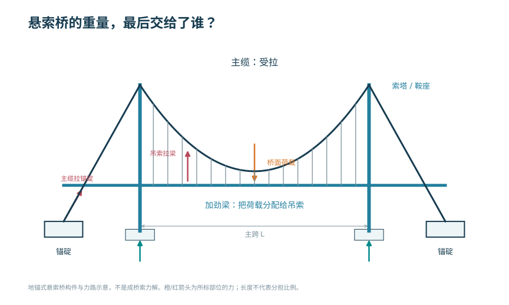
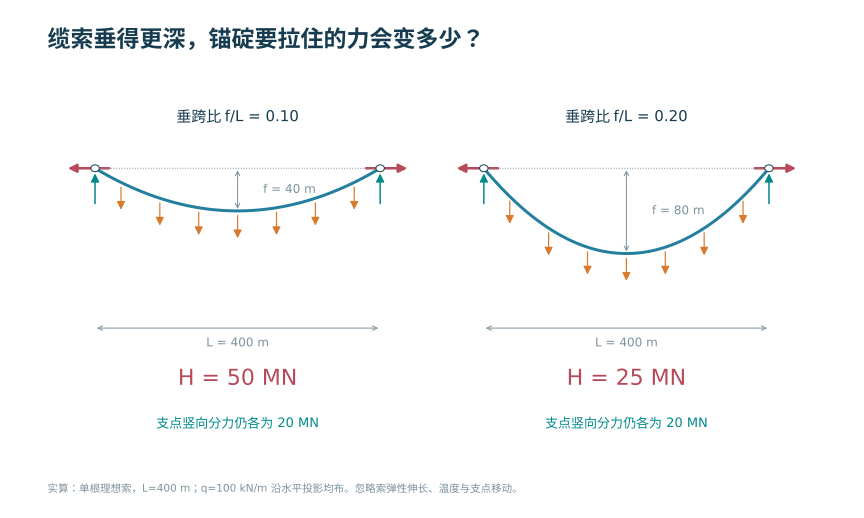
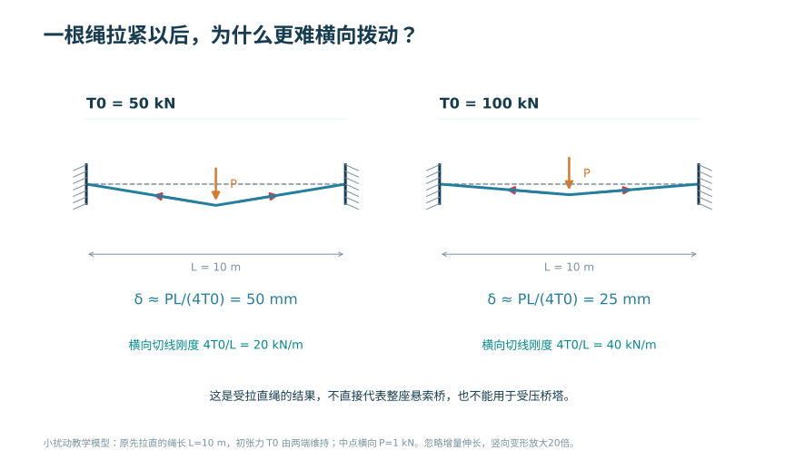
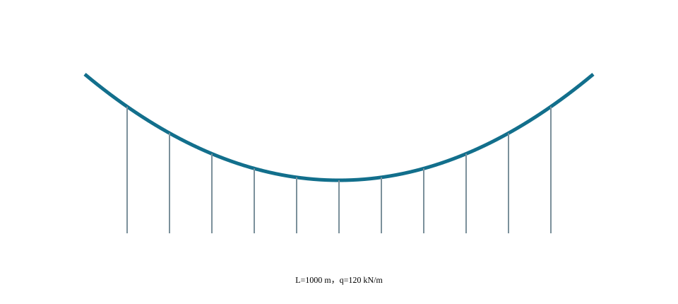

# 悬索桥设计

<!-- CORE-ROUTE START -->
<div class="core-route" id="core-route">
<!-- VISUAL-ENTRY START -->
<div class="chapter-visual-entry"><p>先从一个看得见的问题开始</p><h3>把缆索拉得更平，桥两端要多用多少力？</h3><p>减小垂跨比，比较水平分力和支点索力。</p><a href="../interactive/learning-map.html?chapter=ch06">看图进入实验 →</a></div>
<!-- VISUAL-ENTRY END -->
<!-- PRIORITY-CHAPTER-GALLERY START -->
<details class="priority-chapter-gallery"><summary>从本章的 3 幅新图开始</summary><div class="priority-thumb-grid"><a href="#fig-priority-F27"><span>悬索桥的重量，最后交给了谁？</span></a><a href="#fig-priority-F28"><span>缆索垂得更深，锚碇要拉住的力会变多少？</span></a><a href="#fig-priority-F29"><span>一根绳拉紧以后，为什么更难横向拨动？</span></a></div></details>
<!-- PRIORITY-CHAPTER-GALLERY END -->

<h2>本章的核心思考</h2><p class="core-thesis">找形不是画一条曲线，而是求一组平衡条件。</p><ol><li>区分沿水平投影均布荷载与沿索长自重。</li><li>同时比较垂度、张力和锚碇需求。</li><li>把地基、锚碇和主缆放回同一柔度链。</li></ol><div class="core-analogy"><h3>跨课程类比</h3><p>拱与索的对应平衡形 → 拉压体系比较；弹簧串联 → 体系柔度</p><p><strong>反例与边界：</strong>拱和索的力符号、稳定问题、施工状态不同；主缆受拉不意味着加劲梁无需弯曲验算。</p></div><p>建议课堂集中完成标为“课堂核心”的3个单元，其余单元用于课前观察和课后迁移。每个单元配独立短视频、操作实验、目标检验与开放论证题。</p><div class="core-unit-grid"><article><p class="core-tag">C07U01 · 课堂核心</p><h3>索形由荷载与边界共同决定</h3><p>指定荷载模型和端点后，索的垂度与水平分力相互联系。</p><p><a href="../interactive/core-learning.html?unit=C07U01" target="_blank">操作与迁移任务</a> · <a href="../interactive/core-learning.html?unit=C07U01&amp;view=video" target="_blank">观看短视频</a></p></article><article><p class="core-tag">C07U02 · 课堂核心</p><h3>小垂度不是免费减小位移</h3><p>减小垂度会提高水平分力，锚碇和索的需求随之增加。</p><p><a href="../interactive/core-learning.html?unit=C07U02" target="_blank">操作与迁移任务</a> · <a href="../interactive/core-learning.html?unit=C07U02&amp;view=video" target="_blank">观看短视频</a></p></article><article><p class="core-tag">C07U03 · 课前/课后迁移</p><h3>主缆张力与截面应力分开看</h3><p>荷载增加会提高索力，截面应力还要除以有效面积。</p><p><a href="../interactive/core-learning.html?unit=C07U03" target="_blank">操作与迁移任务</a> · <a href="../interactive/core-learning.html?unit=C07U03&amp;view=video" target="_blank">观看短视频</a></p></article><article><p class="core-tag">C07U04 · 课前/课后迁移</p><h3>缆索与拱的类比保留了什么</h3><p>拱和索可以共用平衡几何的思路，但受压构件还必须检查稳定。</p><p><a href="../interactive/core-learning.html?unit=C07U04" target="_blank">操作与迁移任务</a> · <a href="../interactive/core-learning.html?unit=C07U04&amp;view=video" target="_blank">观看短视频</a></p></article><article><p class="core-tag">C07U05 · 课前/课后迁移</p><h3>吊索传力不等于加劲梁不受弯</h3><p>加劲梁仍承担荷载不均匀引起的弯曲，不能用主缆受拉替代梁的计算。</p><p><a href="../interactive/core-learning.html?unit=C07U05" target="_blank">操作与迁移任务</a> · <a href="../interactive/core-learning.html?unit=C07U05&amp;view=video" target="_blank">观看短视频</a></p></article><article><p class="core-tag">C07U06 · 课前/课后迁移</p><h3>几何放大后，频率下降</h3><p>几何、材料和质量分布相似时，梁型体系的频率随尺度倒数变化。</p><p><a href="../interactive/core-learning.html?unit=C07U06" target="_blank">操作与迁移任务</a> · <a href="../interactive/core-learning.html?unit=C07U06&amp;view=video" target="_blank">观看短视频</a></p></article><article><p class="core-tag">C07U07 · 课前/课后迁移</p><h3>锚碇是水平力的终点</h3><p>在给定垂度的柔索模型中，均布荷载增大会增加水平分力，力流必须闭合到锚碇和基础。</p><p><a href="../interactive/core-learning.html?unit=C07U07" target="_blank">操作与迁移任务</a> · <a href="../interactive/core-learning.html?unit=C07U07&amp;view=video" target="_blank">观看短视频</a></p></article><article><p class="core-tag">C07U08 · 课堂核心</p><h3>支承柔度参与体系刚度</h3><p>串联系统由较柔的环节控制整体位移，局部加硬可能收益有限。</p><p><a href="../interactive/core-learning.html?unit=C07U08" target="_blank">操作与迁移任务</a> · <a href="../interactive/core-learning.html?unit=C07U08&amp;view=video" target="_blank">观看短视频</a></p></article><article><p class="core-tag">C07U09 · 课前/课后迁移</p><h3>周期荷载不只是更大的静载</h3><p>接近固有频率时，稳态动力响应受频比和阻尼共同控制。</p><p><a href="../interactive/core-learning.html?unit=C07U09" target="_blank">操作与迁移任务</a> · <a href="../interactive/core-learning.html?unit=C07U09&amp;view=video" target="_blank">观看短视频</a></p></article><article><p class="core-tag">C07U10 · 课前/课后迁移</p><h3>用拱轴反例理解找形与使用状态</h3><p>这里用固定合理拱轴承受非对称荷载作类比：一种荷载下的平衡形状，不能代替另一荷载下的状态。</p><p><a href="../interactive/core-learning.html?unit=C07U10" target="_blank">操作与迁移任务</a> · <a href="../interactive/core-learning.html?unit=C07U10&amp;view=video" target="_blank">观看短视频</a></p></article></div><p><a href="../core-thinking.html">返回全书核心思维与尺度规律</a> · <a href="../core-resources.html">查看110个教学单元总索引</a> · <a href="../interactive/thinking-analogies.html">打开跨课程并排类比</a></p></div>
<!-- CORE-ROUTE END -->


::: {.chapter-objectives}
**学习目标。** 说明悬索桥的组成和荷载路径；理解垂跨比、主缆拉力和几何刚度的关系；识别加劲梁、索塔、锚碇、风致响应和施工控制的关键问题。
:::

<div class="chapter-video-strip"><figure class="chapter-video-card"><video controls preload="metadata" playsinline poster="../assets/videos/manim/posters/M10_suspension_sag.png" src="../assets/videos/manim/M10_suspension_sag.mp4"></video><figcaption>M10　悬索线型、矢跨比与水平分力</figcaption></figure></div>

## 组成、体系与荷载路径


<!-- AUTHOR-SELECTED G06-C START -->
**沿着主缆看过去，它的两端接到了哪里？**

{#fig-author-g06-c width=100%}

<details class="figure-method"><summary>图像来源与本例条件</summary><p>AI 生成线稿淡彩插画，用于辨认构件与相互位置；力的方向见 F27，数值和尺寸以对应算例为准。</p><p>作者选样：G06-C · 2026-09-07 · <a href="../assets/publication/imagegen-samples/public-records/G06-C.json">制作记录</a></p></details>
<!-- AUTHOR-SELECTED G06-C END -->

<!-- PRIORITY-FIGURE F27 START -->
{#fig-priority-F27 width=100% fig-alt="悬索桥的重量，最后交给了谁？。地锚式悬索桥中，桥面经加劲梁、吊索和主缆传力，索塔与锚碇共同承担主缆传来的作用。自锚式的主缆水平分力路径不同，不能套用本图。"}

<details class="figure-method"><summary>查看模型条件与绘图代码</summary><p>地锚式；构件和受力方向示意，非数值分析；索塔、锚碇和基础均须另行设计</p><p>课程组原创参数绘图 · F27 · <a href="../scripts/priority-figures/group_b.py">绘图 Python</a> · <a href="../scripts/priority-figures/figlib.py">公共绘图函数</a> · <a href="../assets/publication/priority-40/F27.png" download>下载 PNG</a> · <a href="../assets/publication/priority-40/F27.svg" download>下载 SVG</a></p></details>
<!-- PRIORITY-FIGURE F27 END -->


悬索桥由桥面系和加劲梁、吊索、主缆、索塔、鞍座、锚碇及基础组成。桥面荷载经加劲梁分配给吊索，再传至主缆；主缆竖向分力由索塔承担，水平分力通常传至锚碇。自锚式悬索桥则由加劲梁平衡主缆水平分力，其成桥顺序和体系形成过程与地锚式悬索桥不同。地锚式悬索桥的主要传力路径见 @fig-ch06-load-path。

{#fig-ch06-load-path width=82%}

::: {.source-note}
**图源（内部初稿）。** 在线教材项目 `longyu8101/qlgc`，原图5-1-1“悬索桥荷载传递路径”，文件 `source/_static/fig/5-1-1.png`，<https://github.com/longyu8101/qlgc/blob/master/source/_static/fig/5-1-1.png>。用于识别桥面—吊索—主缆—塔/锚碇传力，正式出版前核查许可或重绘。
:::

各主要构件的轴力、弯矩及水平反力关系见 @fig-ch06-member-force。

{#fig-ch06-member-force width=82%}

::: {.source-note}
**图源（内部初稿）。** 在线教材项目 `longyu8101/qlgc`，原图5-1-2“悬索桥构件受力”，文件 `source/_static/fig/5-1-2.png`，<https://github.com/longyu8101/qlgc/blob/master/source/_static/fig/5-1-2.png>。用于说明主缆受拉、塔柱受压、锚碇承受水平分力与加劲梁弯曲。
:::

## 主缆线形、垂跨比与基本平衡


在均布荷载沿水平投影分布的简化条件下，主缆可近似为抛物线。主跨跨度为 $L$、垂度为 $f$、单位水平长度荷载为 $q$ 时，水平分力近似为

$$H=\frac{qL^2}{8f}.$$

支点处主缆拉力由水平与竖向分力合成。减小垂跨比可降低塔高，但会显著增大主缆水平分力、锚碇受力和体系刚度要求。实际计算应考虑主缆自重沿缆长分布、几何非线性、温度和施工线形。

<div class="embed-wrap compact"><iframe loading="lazy" src="../interactive/bridge-concept-screen.html?lab=suspension" title="悬索桥垂跨比与主缆水平分力实验"></iframe></div>

{#fig-ch06-sag-force .static-fallback width=88%}

<div class="embed-wrap"><iframe loading="lazy" src="../interactive/ch06-cable-stiffness.html" title="主缆垂度、拉力与几何刚度实验"></iframe></div>

::: {.digital-note}
**数字资源7-1　主缆几何刚度。** 调整垂跨比、恒载水平和初始拉力，显示主缆线形、水平分力和活载变形。所有曲线应标明分析假定；抛物线只用于均布荷载下的基本规律解释。
:::

## 加劲梁、桥塔、锚碇与局部构造


加劲梁分配集中荷载并控制桥面变形和扭转响应，可采用钢桁梁、钢箱梁或其他形式。截面选择与抗风稳定、制造运输、桥面系和检修空间密切相关。桥塔主要承受轴力并受纵横向弯矩影响；鞍座使主缆在塔顶改变方向，其传力和滑移控制是局部构造重点。

地锚式体系的锚碇承担巨大的主缆拉力，应结合地形地质选择重力式或隧道式等形式。锚碇和基础不仅要满足承载力，还应控制位移，因为微小位移也会改变主缆和桥面线形。

### 风致响应与施工控制

大跨悬索桥柔度大，应检查颤振、涡激振动、抖振和静风稳定。截面气动外形、结构频率与阻尼、风场特征共同决定响应。风洞试验和数值分析应与结构设计迭代进行，而不是在总体方案确定后孤立校核。

施工通常经历猫道和主缆架设、索夹与吊索安装、加劲梁节段吊装、桥面施工和线形调整。未形成完整体系时的内力与稳定状态可能比成桥状态更不利。施工监控应以主缆线形、索塔偏位、吊索力和加劲梁标高为主要观测量。

### 体系组成与自由度

#### 地锚式体系

地锚式悬索桥的主缆跨越索塔后进入锚碇，主缆水平分力由锚碇和地基承担。加劲梁主要承担局部车辆荷载的分配、桥面线形控制和抗风所需的弯扭刚度，不需要平衡全部主缆水平分力。锚碇位置、引桥衔接和地质条件会显著影响总体布置；良好岩体可采用隧道式锚碇，覆盖层或一般地基常需大型重力式锚碇，具体选型取决于场地和受力条件。

#### 自锚式体系

自锚式悬索桥的主缆锚固于加劲梁端部，由加劲梁承担主缆水平压力。其成桥后可在无大型地锚条件下实现水平力自平衡，但施工过程中只有在加劲梁或临时支承形成相应受力体系后才能架设和张拉主缆。施工顺序常与地锚式体系相反，必须把临时支架、顶推或吊装、主缆张拉和体系转换完整纳入分析。

#### 约束与纵向变形

主缆跨过塔顶鞍座改变方向，鞍座是否允许滑移、施工阶段是否临时锁定、索塔与加劲梁之间如何约束，都会改变温度和不对称荷载下的响应。全桥自由度表应包括加劲梁纵横竖向位移、塔梁相对位移、鞍座滑移、主缆锚固以及支座和阻尼装置的刚度与间隙。

悬索桥不能用平面索模型解释所有现象。竖向对称作用可由平面模型认识主缆和加劲梁共同工作；偏心车辆、横风和扭转振动需要空间模型；索夹、鞍座、吊索锚固和正交异性桥面板等局部问题需采用局部精细模型。

### 主缆的基本平衡

#### 抛物线近似


<!-- PRIORITY-FIGURE F28 START -->
{#fig-priority-F28 width=100% fig-alt="缆索垂得更深，锚碇要拉住的力会变多少？。在水平投影均布荷载的理想索模型中，垂度由40 m增至80 m，水平分力H从50 MN减至25 MN，竖向分力仍各20 MN。H是水平分量，不是支点索力总值。"}

<details class="figure-method"><summary>查看模型条件与绘图代码</summary><p>抛物线索，等高支点；不含弹性伸长和索自重沿索长差异；图示纵横比不供量图</p><p>课程组原创参数绘图 · F28 · <a href="../scripts/priority-figures/group_b.py">绘图 Python</a> · <a href="../scripts/priority-figures/figlib.py">公共绘图函数</a> · <a href="../assets/publication/priority-40/F28.png" download>下载 PNG</a> · <a href="../assets/publication/priority-40/F28.svg" download>下载 SVG</a></p></details>
<!-- PRIORITY-FIGURE F28 END -->


在主跨水平投影跨度为 $L$、垂度为 $f$，且竖向荷载 $q$ 沿水平投影均匀分布的条件下，主缆近似抛物线。取跨中为坐标原点，缆线可写成

$$y(x)=\frac{4f}{L^2}x^2,$$

相应水平分力为

$$H=\frac{qL^2}{8f}.$$

支点处竖向分力为 $V=qL/2$，主缆拉力为

$$T_s=\sqrt{H^2+V^2}.$$

上述公式说明，在跨度和荷载一定时，减小垂度会近似按 $1/f$ 增大水平分力。垂跨比 $f/L$ 既影响索塔高度和景观比例，也影响主缆截面、锚碇规模、加劲梁几何刚度和活载变形。

抛物线公式有明确边界：荷载按水平投影均布，忽略主缆自重沿索长的差异，不考虑温度、弹性伸长、塔顶位移和活载非均匀性。主缆仅在自重作用下形成悬链线；恒载包含均匀吊索传递的桥面重量时，成桥线形常可用抛物线近似。教材交互图必须同时显示当前采用哪种假定。

#### 悬链线与无应力长度

对于单位索长自重为 $w_c$ 的理想柔索，以最低点为原点，悬链线可写为

$$y(x)=\frac{H}{w_c}\left[\cosh\left(\frac{w_cx}{H}\right)-1\right].$$

真实主缆线形还受弹性伸长和温度影响。成桥几何长度、受力后的索长与无应力长度不是同一量。以轴力 $T(s)$、弹性模量 $E$、面积 $A$ 表示，忽略更复杂效应时，无应力微段与受力微段的关系可概括为

$$\mathrm ds_0\approx\frac{\mathrm ds}{1+T(s)/(EA)}.$$

制造和架设控制需要由目标成桥线形反求无应力长度，并考虑参考温度。现场测得的跨中垂度只有与温度、塔顶坐标、索股状态和测量时刻对应时才可用于判断。

#### 不对称活载与几何刚度

恒载使主缆建立较大初始拉力，活载引起线形变化并形成附加几何刚度。若一侧跨或主跨局部加载，主缆、吊索、加劲梁和索塔共同调整。活载响应与恒载初始状态有关，不能把主缆当作具有固定线弹性刚度的直杆。

数字实验可先固定恒载，改变垂跨比并比较 $H$；再固定垂跨比，改变恒载水平观察几何刚度和活载位移；最后施加半跨活载，显示主缆线形、塔顶偏位和加劲梁弯矩。三步分别揭示静力平衡、初始应力刚化和不对称响应。

#### 微分平衡与索力分布

柔索不能承受弯矩和压力，其线形由荷载与边界共同决定。设$x$为主跨水平坐标，$y(x)$为以跨中最低点为零、向上为正的缆线高程；主缆水平分力为$H$，沿水平投影的竖向分布荷载为$q(x)$，单位分别为N和N/m。对微段列竖向平衡，在$H$沿跨近似不变且不计水平分布荷载时，有

$$
H\frac{\mathrm d^2y}{\mathrm dx^2}=q(x).
$$

若$q(x)=q$为常数，积分并施加$y(0)=0$、$y(\pm L/2)=f$，得到本章前述抛物线。任一点切线斜率为$y'(x)$，竖向分力$V(x)=Hy'(x)$，主缆拉力为

$$
T(x)=H\sqrt{1+\left[y'(x)\right]^2}.
$$

式中，$T$单位为N。该表达说明最大拉力位置不仅由$H$决定，也受端部斜率影响。计算表应同时给出$H$、端部$V$和$T$，并用塔顶或锚点的矢量平衡复核。对边跨高程不等、荷载不均或塔顶可位移的情况，$H$和边界需由全桥相容条件共同求得，不能把对称公式逐跨独立套用。

抛物线与悬链线的差别来自荷载度量。桥面恒载经近似等间距吊索传递时，荷载可近似沿水平投影均布，线形接近抛物线；主缆仅受自身重力时，重力沿变形后索长分布，线形为悬链线。令$a=H/w_c$，其中$w_c$为单位索长自重，单位N/m，则对称悬链线满足

$$
y(x)=a\left[\cosh\left(\frac{x}{a}\right)-1\right],
\qquad
f=a\left[\cosh\left(\frac{L}{2a}\right)-1\right],
$$

对应索长为

$$
S=2a\sinh\left(\frac{L}{2a}\right).
$$

式中，$a$、$x$、$L$、$f$和$S$均为长度。给定$L$与$f$时，$a$需由非线性方程求解。垂度相对跨度较小时，悬链线在一定条件下接近抛物线；这只是渐近关系，不意味着两者在主缆自重、端部斜率和索长计算中可以无条件互换。

#### 混合荷载、索长与相容条件

成桥状态的主缆同时承受主缆自重、索夹与吊索重量、加劲梁和桥面恒载，荷载既包含沿索长分布部分，也包含经吊点传来的离散或沿水平投影分布部分。此时一般不存在单一抛物线或悬链线闭式解。可把主缆划分为索段，在节点处施加吊索力，以节点坐标、索段轴力和无应力长度为未知量建立非线性平衡。

设受力后索段弧长微元为$\mathrm ds$，参考温度下无应力长度微元为$\mathrm ds_0$，线膨胀系数为$\alpha$，索温相对参考温度变化为$\Delta T_c$，在小弹性应变下可写成

$$
\mathrm ds\approx \mathrm ds_0
\left(1+\alpha\Delta T_c+\frac{T(s)}{EA}\right),
$$

其中$E$为钢丝等效弹性模量，单位Pa；$A$为主缆有效钢丝面积，单位m$^2$；$T(s)$为沿索长的拉力，单位N；$\alpha$单位1/°C。由目标成桥线形反求制造长度时，应沿全索积分，并区分钢丝面积、索股面积和外包络面积。温度、弹性伸长、鞍座位置与塔顶位移均应使用同一参考状态。

边跨和锚跨还需满足鞍座两侧几何与受力相容。若鞍座在某施工阶段允许滑移，则两侧索长和摩擦条件共同决定位置；若临时锁定，则两侧不平衡水平分力由塔顶或锁定装置承担。模型卡应逐阶段记录“鞍座滑移、锁定、顶推或固定”的状态，不能只在成桥模型中给出一个永久边界。

#### 初始平衡与数值求解

主缆有限元分析应先形成恒载平衡状态，再计算活载、风或温度增量。设节点位移为$\boldsymbol{u}$，内力向量为$\boldsymbol{F}_{\mathrm{int}}(\boldsymbol{u})$，外力为$\boldsymbol{F}_{\mathrm{ext}}$，平衡残量为

$$
\boldsymbol{r}(\boldsymbol{u})=
\boldsymbol{F}_{\mathrm{ext}}-
\boldsymbol{F}_{\mathrm{int}}(\boldsymbol{u}).
$$

Newton类迭代在第$i$步求解

$$
\boldsymbol{K}_{\mathrm T}^{(i)}\Delta\boldsymbol{u}^{(i)}
=\boldsymbol{r}^{(i)},
\qquad
\boldsymbol{u}^{(i+1)}=\boldsymbol{u}^{(i)}+\Delta\boldsymbol{u}^{(i)},
$$

其中$\boldsymbol{K}_{\mathrm T}$为切线刚度矩阵，包含材料刚度和初始拉力形成的几何刚度；位移单位为m，残量单位为N。收敛判据应同时检查归一化力残量、位移增量和目标线形误差。只使节点落在目标线形而仍有明显不平衡力，或只达到力平衡而线形不符合控制高程，均不能作为成桥初始状态。

索单元必须具有只受拉特性。某吊索或主缆段试算为压力时，应进入松弛—再激活迭代或采用适合的非线性单元，而不是报告负索力。总索力宜分解为恒载平衡力$N_0$和后续增量$\Delta N$，即$N=N_0+\Delta N$；教学交互应分别显示三者，防止把增量误作总值。

::: {.digital-note}
**数字资源7-2　线形假定切换器。** 在相同跨度与垂度下切换“沿水平投影均布”“沿索长自重”和“吊点离散传力”，同步显示抛物线、悬链线与离散索模型的线形、端部斜率、水平分力和索长差。页面固定坐标比例并标注公式适用条件，不把任一简化曲线标为通用精确解。
:::

#### 一般空间柔索的矢量平衡

抛物线和悬链线都可由一般柔索平衡导出。以受力后索长$s$为参数，索轴线位置向量为$\boldsymbol{r}(s)$，切向单位向量为$\boldsymbol{t}=\mathrm d\boldsymbol{r}/\mathrm ds$，轴向拉力为$T(s)$，沿受力后索长的分布荷载为$\boldsymbol{p}_s(s)$，则微段平衡为

$$
\frac{\mathrm d}{\mathrm ds}\left[T(s)\boldsymbol{t}(s)\right]
+\boldsymbol{p}_s(s)=\boldsymbol{0}.
$$

式中，$\boldsymbol{r}$和$s$单位为m，$T$单位为N，$\boldsymbol{p}_s$单位为N/m。方程同时包含拉力大小变化和切线方向变化。若荷载只有竖向分量、索处于同一竖直平面且不存在水平分布荷载，水平分力才可取为常数$H$。空间风荷载、索面横向偏移或塔顶横移会使索形成为三维曲线，此时不能继续用单一$y(x)$描述。

吊索和索夹向主缆传递的是离散集中力。设索夹节点$i$两侧主缆拉力向量为$T_i^-\boldsymbol{t}_i^-$与$T_i^+\boldsymbol{t}_i^+$，吊索和其他节点作用合力为$\boldsymbol{P}_i$，节点平衡为

$$
T_i^-\boldsymbol{t}_i^-+T_i^+\boldsymbol{t}_i^+
+\boldsymbol{P}_i=\boldsymbol{0}.
$$

该式是检查离散索模型最直接的证据。吊索间距不均、施工阶段缺少部分吊索或梁段重量离散时，索夹处切线方向发生折变；用光滑抛物线代替全部离散平衡会掩盖局部索力变化。可视化模型应显示节点力多边形，并将力矢量与几何缩放分开。

若采用水平坐标$x$参数化平面索，且竖向荷载$q_x(x)$按水平投影分布，则

$$
\frac{\mathrm d}{\mathrm dx}\left(H\frac{\mathrm dy}{\mathrm dx}\right)=q_x(x).
$$

当$H$为常数时退化为$Hy''=q_x$；当存在水平荷载或端部方向变化时，$H$不再必然为常数。教材中的解析推导均应在公式旁标明荷载是按水平投影、索长还是离散节点给定，避免三种荷载密度使用同一符号而不作换算。

#### 索长相容的积分形式

设参考温度$T_{\mathrm{ref}}$下的无应力总长为$L_0$。在线弹性、温度沿索可变且忽略松弛收缩等其他应变时，受力后几何索长与无应力长度满足

$$
L_0=\int_0^{S}
\frac{1}{1+\alpha[T_c(s)-T_{\mathrm{ref}}]+T(s)/(EA)}
\,\mathrm ds,
$$

式中，$S$为受力后的几何索长m，$T_c(s)$为索温°C，$\alpha$为1/°C，$E$为Pa，$A$为m$^2$。若分母中的应变较小，可采用一阶近似；若材料本构、温度场或应力水平不满足该条件，应使用相应非线性关系。相容方程把索形、索力、材料和温度联系起来，是空缆线形控制与成桥找形的共同基础。

不等高支点、边跨与锚跨可按分段积分。每段具有自己的几何边界和荷载，主缆通过鞍座的连续性、滑移条件和索股总长将各段耦合。若鞍座锁定，各段无应力长度分别保持；若允许滑移，总索长保持但分段长度可重新分配，同时受摩擦约束。施工计算应说明采用哪一种相容条件。

对于离散索单元，单元$j$参考长度$l_{0j}$、当前长度$l_j$与轴力$N_j$可按本构关系联系，总相容写成$\sum_j l_{0j}=L_0$并满足节点平衡。求解未知量可能包括节点坐标、索段轴力、鞍座位置和无应力长度修正。为避免多个解或病态，应给定足够的几何控制点、边界与目标状态，并对迭代初值和收敛路径进行记录。

#### 边跨、锚跨与塔顶相容

主跨不能脱离边跨和锚跨单独确定。主鞍座两侧的索力方向决定塔顶纵向与竖向作用，塔顶位移又改变两侧跨度和索长。边跨是否设置吊索、边跨梁的支承形式、锚点高程与锚跨倾角均会影响主跨恒载平衡。对不对称边跨，应按真实几何求解，不将主跨对称公式直接镜像。

在简化二维状态中，设主鞍座两侧拉力为$T_m,T_s$，与水平夹角为$\theta_m,\theta_s$，塔顶纵向和竖向合力分别为

$$
R_x=T_s\cos\theta_s-T_m\cos\theta_m,
\qquad
R_z=T_s\sin\theta_s+T_m\sin\theta_m.
$$

式中，力单位为N，角度单位rad或°但计算函数需统一。正负号随坐标方向确定。对称状态下$R_x$可接近零；施工不对称、温差或边跨布置不同时，$R_x$由塔柱、鞍座临时装置或基础承担。

边跨主缆的荷载度量也需说明。无吊索边跨主要受主缆自重，线形更接近悬链线；设吊索或附属构件后则包含离散作用。锚跨较短但斜率大，其温度与锚点位移对索长相容仍可能重要。全桥状态表分别保存主跨、边跨、锚跨的几何长度、无应力长度、温度和索力。

教学三维模型把塔顶、散索鞍与锚点作为独立控制对象，验证索段端点连续且没有悬空。有限元导出保留鞍座两侧独立索段及其连接状态；只用于视觉展示的连续曲线不能代替施工阶段的滑移或锁定模型。

#### 状态方程与参数灵敏度

把全桥平衡、索长相容和目标线形约束写成

$$
\boldsymbol{g}(\boldsymbol{z},\boldsymbol{p})=\boldsymbol{0},
$$

其中$\boldsymbol{z}$包含节点坐标、索力、塔顶位移等状态量，$\boldsymbol{p}$包含无应力长度、温度、构件重量、材料和边界参数。对参数$p_k$的小变化，在Jacobian可逆的局部范围内有

$$
\frac{\partial\boldsymbol{z}}{\partial p_k}
=-\left(\frac{\partial\boldsymbol{g}}{\partial\boldsymbol{z}}\right)^{-1}
\frac{\partial\boldsymbol{g}}{\partial p_k}.
$$

该式用于说明线形对温度、制造长度和锚点位移的敏感性，单位由具体状态量与参数决定。接近吊索松弛、鞍座滑移或稳定边界时，状态关系可能不光滑，局部导数不再可靠，应改用分段情景和完整非线性重分析。

数字任务可选择一个主缆控制点，分别扰动索温、单位重量、无应力长度和锚点纵向位置，绘制控制点高程、水平分力与塔顶作用的归一化灵敏度。扰动范围来自测量精度或教学情景，不作为施工容许偏差。

#### 一般空间索形的离散求解

工程主缆的空间状态通常由主跨、边跨与锚跨共同决定，并受到两索面位置、横风、塔顶位移、散索鞍和离散吊点的影响。数值模型不预设整条主缆为抛物线，而以控制节点和索段表示几何。设节点$i$的坐标为$\boldsymbol{x}_i=[x_i,y_i,z_i]^{\mathsf T}$，相邻节点构成索段$e=(i,j)$，当前弦长和方向向量为

$$
l_e=\|\boldsymbol{x}_j-\boldsymbol{x}_i\|,
\qquad
\boldsymbol{n}_e=
\frac{\boldsymbol{x}_j-\boldsymbol{x}_i}{l_e}.
$$

$x_i,y_i,z_i$与$l_e$的单位为m，$\boldsymbol n_e$无量纲。若索段的无应力长度为$l_{0e}$、温度变化为$\Delta T_e$、有效面积为$A_e$、弹性模量为$E_e$，在线弹性小应变本构下可写为

$$
\varepsilon_e=
\frac{l_e-l_{0e}(1+\alpha_e\Delta T_e)}
{l_{0e}(1+\alpha_e\Delta T_e)},
\qquad
N_e=E_eA_e\varepsilon_e,
$$

其中$\alpha_e$单位为1/°C，$N_e$单位为N。该关系只表示材料伸长；索的横向刚度主要来自当前拉力与几何变化。若$N_e\leq0$，只受拉单元应退出有效集合或按求解器的松弛算法处理，不能把负值作为“压索力”保留。

内部节点$i$的平衡方程为

$$
\boldsymbol{g}_i(\boldsymbol{x},\boldsymbol{l}_0)=
\sum_{e\in\mathcal E_i}s_{ie}N_e\boldsymbol n_e
+\boldsymbol P_i=\boldsymbol0,
$$

式中，$\mathcal E_i$为连接于节点$i$的索段集合，$s_{ie}$根据索段方向取$+1$或$-1$，$\boldsymbol P_i$为吊索、索夹、自重、风或施工装置传来的节点合力，单位N。索段自重若按受力后索长连续分布，应由一致荷载或足够精度的数值积分进入节点，不能与已经包含自重的吊点反力重复。两索面横向不对称时，$y$方向平衡与$x,z$方向同等重要。

给定全部无应力长度而求节点坐标属于正分析；给定目标坐标并反求$l_{0e}$、索股长度修正或鞍座位置属于反分析。后者常同时包含平衡、线形控制和制造总长约束。可把未知量写为

$$
\boldsymbol z=
\{\boldsymbol x_f,\boldsymbol l_{0u},
\boldsymbol d_s,\boldsymbol u_t\},
$$

其中$\boldsymbol x_f$为自由索节点坐标，$\boldsymbol l_{0u}$为待识别无应力长度，$\boldsymbol d_s$为鞍座位移或索段长度转移量，$\boldsymbol u_t$为塔顶位移。方程组由节点平衡$\boldsymbol g_F$、索长相容$\boldsymbol g_L$、目标线形$\boldsymbol g_X$和鞍座状态$\boldsymbol g_S$组成：

$$
\boldsymbol G(\boldsymbol z)=
\begin{bmatrix}
\boldsymbol g_F\\
\boldsymbol g_L\\
\boldsymbol g_X\\
\boldsymbol g_S
\end{bmatrix}
=\boldsymbol0.
$$

方程数量与独立未知量必须匹配。若对每个索夹既规定全部三维坐标又规定全部索段长度和索力，约束可能过多；若只给总索长而缺少控制高程，可能存在多个相近解。模型卡应列出未知量、独立方程和人为固定的基准自由度，并用Jacobian秩或奇异值检查病态。

Newton迭代为

$$
\boldsymbol J^{(k)}\Delta\boldsymbol z^{(k)}
=-\boldsymbol G^{(k)},
\qquad
\boldsymbol z^{(k+1)}
=\boldsymbol z^{(k)}+\lambda_k\Delta\boldsymbol z^{(k)},
$$

其中$\boldsymbol J=\partial\boldsymbol G/\partial\boldsymbol z$为Jacobian，$\lambda_k$为线搜索或阻尼系数。不同方程具有N和m等不同单位，收敛检查应分别尺度化，不能把未经归一化的力残量与坐标误差直接相加。建议至少保存：最大节点不平衡力、全桥合力与合矩残量、最大控制点坐标误差、索长相容误差、最小索力、迭代次数和步长。收敛容许值由模型精度、数据质量和分析目的预先确定，本书不设统一数值。

迭代初值可由分跨抛物线、悬链线或前一相邻施工状态提供。第一步只计算自重控制的空缆；第二步加入索夹和吊索；第三步加入加劲梁恒载；第四步耦合塔顶与锚碇柔度；最后加入温度和空间作用。逐级加载使每一步都能用前一步检查，且比一次引入全部非线性更便于定位。若迭代因吊索松弛、鞍座状态切换或局部刚度突变而失败，应缩小荷载步或采用弧长、主动集等相应方法，同时保留未收敛状态，不以改变容差掩盖。

#### 索长积分与数值精度

对于以参数$\xi\in[0,1]$表示的光滑索段，几何索长为

$$
S=\int_0^1
\left\|\frac{\mathrm d\boldsymbol r}{\mathrm d\xi}\right\|
\mathrm d\xi.
$$

若温度与索力沿程变化，无应力长度可写为

$$
L_0=\int_0^1
\frac{\left\|\mathrm d\boldsymbol r/\mathrm d\xi\right\|}
{1+\alpha(\xi)\Delta T(\xi)+N(\xi)/[E(\xi)A(\xi)]}
\mathrm d\xi.
$$

$S,L_0$单位均为m。数值实现可采用高斯积分或自适应积分，并通过增加积分点检查索长与端力稳定。若以直线索单元逼近曲线，几何弦长之和总小于同一节点间的光滑曲线弧长；单元过粗会同时影响自重、无应力长度和几何刚度。网格检查不只比较跨中高程，还比较总索长、端部切线、最大及最小索力和低阶横向频率。

悬索桥施工中，主缆制造控制常以索股在规定温度与张力下的基准长度、标记点或相对长度组织。模型的$l_{0e}$应能回溯到这一参考，而不是由成桥坐标逐段反算后即视为制造值。弹性模量、温度、单位重、塔顶和锚点坐标的误差会在长索上累积；应分别记录测量、材料和模型不确定性，以情景或统计方法传播。没有概率依据时采用上下界情景，不为方便计算而假定正态分布。

#### 鞍座节点的黏着与滑移互补条件

鞍座两侧索段在局部切向上的拉力差与接触摩擦有关。若以$T_1,T_2$表示两侧拉力，$\mu$表示等效摩擦参数，$\theta$表示包角，则极限关系常以指数形式表达两侧张力比的边界；具体取值和适用形式应由设计方法、试验和构造确定。本章更关注状态组织：黏着时索与鞍座相对位移增量为零，而切向作用不超过可用摩擦；滑移时切向作用达到相应边界，索长从一侧向另一侧转移。

可将相对滑移量$\Delta s$和滑移函数$\Phi(T_1,T_2,\mu,\theta)$写为互补关系的概念形式：

$$
\Delta s\geq0,\qquad
\Phi\leq0,\qquad
\Delta s\,\Phi=0,
$$

并对相反方向另设一组条件。$\Delta s$单位为m，$\Phi$按所选定义可为力或无量纲张力比函数。该式说明黏着与滑移不能同时按线性弹簧叠加。施工阶段还可能设置临时锁定、鞍座顶推或解除锁定，均应作为边界事件进入状态表。

数值模型需输出鞍座两侧拉力矢量、相对滑移、累计索长转移、塔顶水平力及状态标识。状态改变前后分别检查节点三向平衡和总索长。教学交互只在已给定摩擦模型和参数时显示状态判断；参数为空时展示符号关系和待确认项，不虚构滑移阈值。

### 吊索与索夹

吊索把加劲梁反力传给主缆。吊索间距减小可降低加劲梁局部弯矩并改善荷载分配，但索夹、锚具和维护数量增加。柔性吊索只承受拉力；当局部上拔或动力响应导致索力接近零时，可能出现松弛，线性模型不再适用。

吊索长度沿跨变化，温度、制造误差和主缆线形偏差会影响安装。更换单根吊索时，荷载向相邻吊索和加劲梁重分配，施工方案应分析卸载、临时吊点、张拉顺序和桥面交通状态。短吊索对端部转动、锚固偏角和疲劳更敏感，构造设计须防止弯折和腐蚀水积聚。

索夹依靠夹持力和摩擦把吊索力传入主缆。局部计算需检查索夹抗滑、螺杆预紧、主缆表面压力和防腐密封。总体模型可将吊点理想化为节点，局部构造不能由总体杆系单元直接得到。

### 加劲梁的功能与截面

#### 荷载分配

加劲梁跨越相邻吊点，把集中轮载分配给多根吊索，并限制桥面局部挠曲。若吊索间距为 $a$，在概念阶段可用连续弹性支承梁认识局部弯矩随 $a^2$ 增长的趋势；全桥活载响应还受主缆变形和整体边界影响。

#### 弯扭刚度与气动外形

钢桁加劲梁具有通透构造和较大结构高度，钢箱梁可形成流线型闭口薄壁截面并提供较高扭转刚度。截面选择需共同评价竖向弯曲、扭转、颤振稳定、涡振、制造运输、节段连接、正交异性桥面板疲劳和检修空间。增加结构刚度并不是抗风的唯一途径，气动外形优化、导流构造和阻尼措施也可改变响应；中央稳定板的概念性布置见 @fig-ch06-aero-guide。

{#fig-ch06-aero-guide width=68%}

::: {.source-note}
**图源（内部初稿）。** 在线教材项目 `longyu8101/qlgc`，原图5-2-1“设置中央稳定板气动措施示意”，文件 `source/_static/fig/5-2-1.png`，<https://github.com/longyu8101/qlgc/blob/master/source/_static/fig/5-2-1.png>。用于说明气动构造思路，具体效果须由适用风洞试验或经验证分析确定。
:::

薄壁箱梁在偏心车辆和风作用下除圣维南扭转外还可能出现畸变和翘曲。总体梁单元需要适当的扭转常数和剪切中心信息；对宽箱梁和局部连接，应使用梁格、板壳或实体子模型校核。

#### 节段连接与疲劳

大跨钢箱梁常采用工厂制造节段、现场吊装连接。横隔板、吊索锚固、U肋与横梁连接、顶底板拼接是疲劳和制造质量控制重点。施工阶段的临时吊点与永久受力位置不同，应核查吊装阶段局部应力和整体稳定。

### 索塔、鞍座与锚碇

索塔主要承受主缆竖向分力形成的轴力，同时受不对称活载、风、温度和地震引起的纵横向弯矩。塔柱长细比、横梁位置、基础刚度和塔顶鞍座约束共同决定稳定与动力特性。对施工阶段裸塔和单侧架梁状态，应单独检查自由长度和偏心受压。

鞍座控制主缆转向和接触压力。成桥状态可近似认为主缆与鞍座相对稳定，施工中索股入鞍、预偏、顶推或滑移过程会改变两侧张力平衡。局部设计包括槽形、接触压力、抗滑、鞍体强度、底座和塔顶传力。

重力式锚碇依靠自重、底面摩阻、地基承载和被动土压力等抵抗主缆拉力；隧道式锚碇利用岩体传力。验算包括抗滑、抗倾覆、基底应力、整体稳定、变形和局部锚固体系。锚碇微小位移会改变主缆线形和桥面标高，因此基础变形与主缆施工控制应联立考虑。

### 结构分析层级

#### 解析模型

抛物线和悬链线模型用于校核主缆线形、水平分力和参数趋势。其价值在于提供独立量级判断。解析结果与有限元差异较大时，应首先检查荷载分布假定、垂度定义、边界和主缆自重，而不是立即增加网格。

#### 平面总体模型

平面模型可表示主缆、吊索、加劲梁和索塔的竖向共同工作，适合对称竖向荷载和施工顺序初步分析。主缆与吊索采用只受拉、几何非线性单元；加劲梁和索塔采用梁单元；锚碇可先理想固定，再通过弹簧引入基础柔度。

#### 空间总体模型

空间模型用于横风、偏载、扭转、双缆面共同工作及横向支承分析。两根主缆、横向联系、塔横梁和加劲梁截面扭转属性应正确表达。质量应包括结构、桥面附属和规定交通质量，并检查竖弯、侧弯、扭转及塔模态。

#### 局部模型

局部板壳或实体模型服务于吊索锚固、索夹、鞍座、钢箱梁细节和塔梁节点。由总体模型提取边界内力时，应保持合力与合力矩一致；局部模型不能脱离总体结构任意施加单个峰值。

## 合理成桥状态与全过程施工


#### 成桥平衡状态

合理成桥状态同时满足目标主缆线形、吊索力、加劲梁标高、塔顶位置和锚碇反力。给定目标线形后，可通过迭代更新无应力长度和初始应变，使恒载下节点坐标接近目标。收敛判据应同时包括几何误差与不平衡力，不能只看求解器完成。

#### 主缆架设

施工依次包括先导索牵引、猫道架设、索股牵引入鞍、索股线形调整、紧缆和索夹安装。每根索股调整时的温度和参考状态决定其无应力长度。空缆线形与成桥线形不同，空缆垂度控制必须使用相应阶段模型。

#### 加劲梁架设

加劲梁可从跨中、塔侧或多个作业面吊装，顺序影响主缆线形、塔顶偏位和已安装节段受力。吊装一个节段后，荷载经局部吊索进入主缆，引起全跨几何调整。施工模型要逐段激活梁、连接和桥面荷载，检查临时铰、闭合口和风作用。

#### 体系转换与铺装

节段闭合、临时连接转为永久连接、桥面铺装和附属设施施工会继续调整内力与线形。成桥索力不应简单平均分配；吊索力和加劲梁弯矩由目标线形、吊点间距、施工顺序与刚度共同决定。现场监控以温度修正后的主缆标高、塔顶位移、吊索力和梁段标高与模型比较，并更新后续控制值。

## 活载、风、地震与运营作用


#### 静风与扭转发散

平均风产生阻力、升力和气动力矩。随着风速增加，结构变形会改变迎角和气动力；当气动负刚度抵消结构扭转刚度时，可能发生静力扭转发散。静风分析应考虑气动力系数随攻角变化和几何非线性。

#### 涡激振动

流体绕过截面形成交替涡脱落，当脱落频率与结构频率接近时可能发生锁定。涡振通常是有限振幅响应，但会影响舒适性、疲劳和施工安全。评价需结合风速区间、振幅、阻尼、质量和截面气动特性。

#### 抖振

抖振由脉动风和空间相关湍流激励产生，是随机响应问题。分析输入包括平均风剖面、湍流强度、谱、相干函数和气动导纳，输出常为位移、加速度和内力统计量。结果应说明平均值、标准差、峰值因子和组合方式。

#### 颤振

颤振是结构运动诱导气动力与结构振动耦合形成的自激不稳定。临界风速与竖弯、扭转频率比、质量、惯量、阻尼和气动导数有关。节段模型风洞试验与全桥气弹模型试验服务于不同问题，数值流体分析需经试验或可靠资料验证。

#### 加劲梁弯扭与风工程接口

风工程接口从结构截面、风场和动力特性三类数据出发。参考风速$U$单位为m/s，空气密度$\rho$单位为kg/m$^3$，桥面参考宽度$B$单位为m。单位桥长的静风阻力、升力和力矩可写为

$$
D'=\frac12\rho U^2BC_D,\qquad
L'=\frac12\rho U^2BC_L,\qquad
M'=\frac12\rho U^2B^2C_M,
$$

式中，$D'$和$L'$单位为N/m，$M'$单位为N·m/m；$C_D$、$C_L$、$C_M$为与攻角、雷诺数和截面构造有关的无量纲气动力系数。系数应来自适用风洞试验、经验证数值分析或权威资料，不由教材示意曲线代替。栏杆、检修车轨道、中央分隔、导流板和施工临时构件可能改变气动外形，试验模型与设计构造应对应。

结构动力方程为

$$
\boldsymbol{M}\ddot{\boldsymbol{u}}+
\boldsymbol{C}\dot{\boldsymbol{u}}+
\boldsymbol{K}\boldsymbol{u}=
\boldsymbol{F}_{\mathrm w}(t,\boldsymbol{u},\dot{\boldsymbol{u}}),
$$

其中$\boldsymbol{M}$、$\boldsymbol{C}$、$\boldsymbol{K}$分别为质量、阻尼和刚度矩阵，$\boldsymbol{F}_{\mathrm w}$为风荷载或运动诱导气动力。若右端仅是预先给定的脉动风荷载，则可研究抖振；若气动力随位移和速度反馈，则涉及颤振等气动弹性问题。静态风荷载、随机抖振和自激颤振的模型输入与判据不同，不应由同一个“风荷载工况”概括。

涡脱落频率常以

$$
f_s=\mathrm{St}\frac{U}{B}
$$

估计，式中$f_s$单位Hz，$\mathrm{St}$为斯特劳哈尔数。该式只用于识别可能的频率接近区间；锁定范围、振幅和阻尼效应需由试验或专门模型确定。结构模态应至少区分竖弯、侧弯、扭转和塔模态，并报告广义质量、频率、阻尼假定和模态参与。用播放速度驱动三维动画不能称为实际风速响应。

风工程设计是迭代过程。改变加劲梁宽高比、风嘴、检修轨道或中央开槽会同时影响$EI$、$GJ$、质量、转动惯量和气动力系数。参数界面应并列显示结构属性和气动数据来源，防止只改变外形图而未更新力学模型。施工阶段的单箱节段、未闭合梁、猫道和吊装设备具有不同气动状态，应分别建立风荷载与稳定检查。

::: {.digital-note}
**数字资源7-3　加劲梁弯扭—风工程接口。** 学生选择截面方案后，页面显示质量、竖弯刚度、扭转刚度、竖弯与扭转频率，并加载有来源的气动力系数数据。交互只比较趋势与证据完整性；没有试验数据的方案显示“待风工程确认”，不生成临界风速结论。
:::

### 地震、温度与运营维护

悬索桥周期长、模态密集，地震响应可能受空间变化地震动、行波效应和多点输入影响。主塔、加劲梁、支座、阻尼装置、吊索与锚碇共同参与。设计应防止梁端过大位移、吊索松弛、塔柱损伤和关键连接失效。

温度变化同时影响主缆、吊索、加劲梁和索塔。材料温差、日照梯度与季节均匀温度会改变线形和索力。运营监测中应先剔除或建模温度效应，再识别长期趋势，不能把季节性位移直接解释为损伤。

检查维护对象包括主缆防护、索夹密封、吊索锚头、加劲梁疲劳细节、鞍座、塔顶和锚碇排水。设计阶段应提供检修道、除湿系统、索夹和吊索更换条件，并把构件编号与数字模型和检查数据库关联。

#### 风—结构分析的数据接口

悬索桥风工程不是在总体模型上施加一个横向静力即可完成。结构模型至少向风工程提供加劲梁、主缆、吊索和索塔的几何、质量、转动惯量、刚度、阻尼假定和模态；风工程再向结构分析返回静风系数、抖振所需谱与相干信息、涡振参数或气动导数。每一组气动数据应绑定截面版本、栏杆和附属构造、攻角、试验尺度、雷诺数范围、风洞与数据处理版本。改变风嘴、中央开槽、检修轨道或施工设备后，不能继续沿用未对应的气动数据。

结构第$r$阶广义模态质量和广义刚度分别为

$$
m_r=\boldsymbol\phi_r^{\mathsf T}\boldsymbol M\boldsymbol\phi_r,
\qquad
k_r=\boldsymbol\phi_r^{\mathsf T}\boldsymbol K\boldsymbol\phi_r,
$$

式中，$\boldsymbol\phi_r$为振型，$\boldsymbol M$与$\boldsymbol K$为质量和刚度矩阵；若位移采用m、力采用N，则$m_r$的量纲随振型归一方式而定，$k_r/m_r=\omega_r^2$的单位为s$^{-2}$。报告模态频率时还需说明振型归一、有效质量、截面转动惯量和结构状态。施工阶段的未闭合加劲梁、猫道、吊装梁段及临时连接具有不同的质量与边界，不能只采用成桥模态。

对静风，结构变形会改变局部攻角，必要时迭代更新风荷载。对抖振，风场沿跨、沿高程和两索面之间具有空间相关性，离散风荷载点应与结构节点或插值位置对应。对颤振，气动力随位移和速度反馈，临界状态需由适用的气动导数和多模态耦合求得。教材交互可以显示“结构属性—气动数据—分析类型”的连接关系，但没有气动数据时只能标识缺口，不能外推临界风速。

#### 地震输入、多点激励与大位移接口

长跨悬索桥不同塔基和锚碇之间距离较大，地震输入可能具有到时差、相干损失和场地差异。设支承输入位移为$\boldsymbol u_g(t)$，结构相对位移为$\boldsymbol q(t)$，线性动力方程可按所采用的多点输入方法写成分块或等效荷载形式。无论具体形式如何，必须区分绝对位移、相对位移和支承运动，避免把地面位移既作为边界又重复作为惯性荷载。

单一一致输入的概念式为

$$
\boldsymbol M\ddot{\boldsymbol q}
+\boldsymbol C\dot{\boldsymbol q}
+\boldsymbol K\boldsymbol q
=-\boldsymbol M\boldsymbol\Gamma\ddot u_g(t),
$$

其中$\boldsymbol\Gamma$为影响向量，$u_g$单位为m，$\ddot u_g$单位为m/s$^2$。该式适用于按统一输入建立的相对坐标模型；多点输入时应采用相应约束和输入矩阵。质量来自加劲梁、索塔、缆索、附属设施及规定的其他质量，不能由静力重力工况自动等同。阻尼模型对长周期、密集模态和附加耗能装置的适用性需说明。

地震分析关注塔梁纵横向位移、梁端与伸缩缝、支座和限位装置、主缆与吊索总索力、塔柱内力、锚碇和基础作用。若吊索可能松弛、限位可能碰撞或耗能装置出现滞回，线性反应谱不足以描述状态切换，应采用经验证的非线性时程或其他适用方法。输入记录、缩放和组合规则依项目采用标准执行，本章不设统一系数。

风与地震结果的共同审查包括质量、坐标、边界、模态、时间步和能量。二者的输入机制不同，不能把一个“动力放大系数”同时用于风和地震。时程动画必须以真实时间轴和求解结果驱动；只按帧播放静力变形时，应标注为状态浏览。

#### 温度场、基准状态与长期变化

主缆、吊索、钢加劲梁和混凝土索塔的温度响应不同。均匀索温变化引起自由热应变$\varepsilon_T=\alpha\Delta T$；加劲梁截面温度梯度产生曲率；索塔日照可形成横向或纵向弯曲。模型中每个温度工况必须说明参考温度、构件温度或温度场、测量时刻和结构边界。施工控制高程若在不同温度下直接比较，会把可逆温度变形误作制造或安装误差。

长期线形变化还可能来自材料徐变收缩、主缆及吊索松弛、基础位移和构件更换。监测基线应建立在可识别的温度与交通状态上。温度回归可用于去除主要环境相关项，但回归残差不等同于损伤；模型解释还需与相邻测点、索力、梁塔位移、检查和维护记录相互印证。

## 挠度理论、弯扭与模型边界


经典挠度理论把恒载下主缆的初始平衡与活载引起的附加变形联系起来。恒载由主缆承担并建立初始水平分力 $H_g$；活载引起加劲梁弯矩、主缆水平分力增量和共同挠度。在线性化表达中，加劲梁弯矩可理解为外荷载弯矩与主缆水平分力对变形曲线产生的抵消项之间的差异。

挠度理论的意义在于说明：增加恒载可提高主缆初始张力和几何刚度，减小活载相对变形；加劲梁刚度把局部荷载扩散到更长范围；主缆线形变化又反过来调整吊索力。它不是把加劲梁视为独立连续梁，也不是把主缆视为固定不动的支点。

有限元分析中，几何刚度由初始索力自动进入切线刚度。为验证模型，可把恒载平衡状态的 $H_g$ 与 $qL^2/(8f)$ 比较，把半跨活载下的加劲梁弯矩和位移与挠度理论或独立程序比较。差异应从荷载分布、边跨、塔顶位移和索弹性伸长等方面解释。

#### 挠度理论的增量表达

为说明主缆与加劲梁共同工作，可在恒载平衡状态附近建立简化增量方程。设$w(x)$为活载引起的共同竖向位移，向下为正；$E_gI_g$为加劲梁竖向弯曲刚度，单位N·m$^2$；$H_g$为恒载状态主缆水平分力，单位N；$h$为活载引起的水平分力增量，单位N；$y_g(x)$为恒载主缆线形；$p(x)$为沿桥向的活载，单位N/m。在小增量、吊索保持受拉、主缆与梁竖向变形协调并采用一致正负号时，可用下列形式说明各项作用：

$$
E_gI_g\frac{\mathrm d^4w}{\mathrm dx^4}
-H_g\frac{\mathrm d^2w}{\mathrm dx^2}
=p(x)-h\frac{\mathrm d^2y_g}{\mathrm dx^2}.
$$

第一项表示加劲梁弯曲对曲率变化的抵抗，第二项表示恒载索力形成的几何刚度，右侧第二项表示新增水平分力沿初始曲线产生的竖向分担。$h$不是任意给定量，而应由主缆索长相容、弹性伸长以及塔顶、锚碇边界共同确定。不同教材对坐标和位移正号的选取可能使方程符号不同，使用时必须连同坐标约定核对；本式用于解释耦合机制，不替代具体桥梁的非线性分析。

若把$H_g$误设为零，加劲梁将独自承担活载，往往夸大弯矩和位移；若把主缆视为固定不动的连续支点，又会低估体系变形。挠度理论的关键不是背记一个通解，而是识别三个共同量：主缆初始拉力、加劲梁弯曲刚度和索长相容。数字实验应允许逐项关闭这些机制，并用结果差异说明每项假定的后果。

#### 几何刚度和切线响应


<!-- PRIORITY-FIGURE F29 START -->
{#fig-priority-F29 width=100% fig-alt="一根绳拉紧以后，为什么更难横向拨动？。同长、同一小横向荷载下，提高初张力会提高拉直绳的横向切线刚度，线性扰动位移近似反比于初张力。图示变形放大20倍，斜拉方向只作示意。"}

<details class="figure-method"><summary>查看模型条件与绘图代码</summary><p>只适用于初始拉直且有恒定预张力的绳；小斜率、忽略荷载引起的张力增量；没有将直绳结果当作全桥初应力有限元结果</p><p>课程组原创参数绘图 · F29 · <a href="../scripts/priority-figures/group_b.py">绘图 Python</a> · <a href="../scripts/priority-figures/figlib.py">公共绘图函数</a> · <a href="../assets/publication/priority-40/F29.png" download>下载 PNG</a> · <a href="../assets/publication/priority-40/F29.svg" download>下载 SVG</a></p></details>
<!-- PRIORITY-FIGURE F29 END -->


在离散模型中，恒载平衡状态的切线刚度可写为

$$
\boldsymbol{K}_{\mathrm T}
=\boldsymbol{K}_{\mathrm M}+\boldsymbol{K}_{\mathrm G}(\boldsymbol{N}_0),
$$

其中$\boldsymbol{K}_{\mathrm M}$为材料与截面刚度，$\boldsymbol{K}_{\mathrm G}$为由初始轴力$\boldsymbol{N}_0$形成的几何刚度。对于受拉主缆，初始拉力通常提高横向扰动的切线刚度；对于受压塔柱，轴压力可能降低某些侧向或屈曲方向的切线刚度。因此，“恒载增加使体系更刚”只适用于主缆某些响应，不能无条件用于索塔和加劲梁。

教学模型可在保持几何、材料和活载不变时改变$N_0$，绘制跨中位移与主缆增量索力；但每个$N_0$都应对应可平衡的初始线形。若只在结果显示中人为增加一个基准索力而不更新几何刚度，位移不会随其变化，这只能称为参考值叠加，不能称为初应力分析。

几何非线性计算应逐级验证：第一步以单根柔索验证抛物线或悬链线；第二步以主缆—吊索—刚性梁验证对称荷载与半跨荷载；第三步引入加劲梁柔度；第四步加入塔顶位移与边跨；最后扩展空间、施工和动力。每一步均检查外力、塔顶反力、锚碇水平力和节点残量平衡。

#### 空间弯扭与横向联系

两根主缆和两列吊索并不自动保证加劲梁不扭转。偏心车辆或横风在桥轴周围产生扭矩，加劲梁扭转后左右吊索长度变化与索力增量不同，主缆产生空间位移，塔横梁和横向支承参与传力。空间模型至少应包含两条主缆、两列吊索、加劲梁弯扭刚度、横梁或横向联系、塔柱与横梁、横向支承及相应质量分布。

设桥面竖向合力为$P$，相对剪切中心横向偏心为$e_y$，则扭矩量级为$T_x=P e_y$，单位N·m。该式可核对偏载输入和左右支承反力偶。加劲梁的圣维南扭转刚度为$GJ$，单位N·m$^2$；宽薄壁箱梁还可能发生畸变和翘曲，单一$GJ$不能完整描述。通过“竖向弯曲模态—扭转模态—侧弯模态”分类，可以检验质量、约束和局部坐标是否合理。

::: {.digital-note}
**数字资源7-4　挠度理论证据链。** 页面并列显示外荷载弯矩、主缆分担项、加劲梁弯矩和共同位移。学生改变$H_g$、$E_gI_g$与半跨荷载位置，先预测曲线变化，再查看计算；右侧保存平衡、相容和网格检查。公式曲线与有限元结果采用同一坐标和单位。
:::

#### 活载位置、影响线与增量状态

成桥恒载状态确定后，车辆或人群等活载通过桥面板、横梁和加劲梁传至吊索。若结构在该状态附近可线性化，目标响应$r$对单位移动荷载位置$\xi$的影响线可由切线刚度模型求得。对轴列$P_j$、相对位置$a_j$，准静力响应为

$$
r(\xi)=\sum_j P_j\,I_r(\xi+a_j),
$$

式中，$P_j$单位N，$I_r$的单位随响应而定；若$r$为位移，$I_r$单位m/N，若$r$为内力，则按内力与力的比值确定。该叠加要求切线体系、边界和吊索有效集合在扫描过程中不变。

若某个车位导致吊索松弛、支座接触切换或显著几何变化，影响线不再是固定函数。此时需对每个关键车位在恒载状态上进行非线性求解，记录有效吊索集合和总索力。可先用线性影响线筛选可能控制区域，再在局部加密位置进行非线性复核；不能将发生状态切换后的结果继续按线性叠加。

活载进入吊点前存在横向分配。平面模型可采用有依据的分配系数或单索面等效荷载，空间模型则显式表示左右吊索、横梁与加劲梁扭转。所有映射至少保持竖向合力和相对桥轴的一阶矩：

$$
\sum_iF_{z,i}=P,
\qquad
\sum_i y_iF_{z,i}=Py_P,
$$

式中，$F_{z,i}$为分配至第$i$个吊点或节点的力N，$y_i$和$y_P$为横桥向坐标m。轮载移过网格或横梁边界时，映射应连续，避免反力和扭矩非物理跳变。

结果图把恒载基准$N_0$、活载增量$\Delta N(\xi)$和总索力$N(\xi)$分开。加劲梁弯矩、主缆增量水平分力、塔顶位移和锚碇作用使用同一车位坐标，便于识别控制状态。全过程采用固定纵轴范围或色标，数值极值从原始单元结果提取，平滑曲线仅用于显示。

准静力扫描中的“播放速度”只控制界面，不能作为实际车速。若研究车速、路面不平顺、车辆悬挂或共振，应建立质量、阻尼和时间积分模型，并验证模态、时间步与输入。教材基础任务止于准静力影响线，高阶动力结果以折叠资源或专业求解器导入。

#### 挠度理论的能量解释与边界

<!-- FORMULA-SCAFFOLD ch06 START -->
::: {.formula-scaffold}
**先看这个问题。** 主缆容易弯曲，为什么还会帮助桥面抵抗变形？先固定一个已平衡的成桥状态，再增加少量荷载，看看主缆拉力和加劲梁怎样共同起作用。

<div class="meaning-flow" role="img" aria-label="恒载平衡后的基准，然后增加小幅活载，然后主缆与梁共同响应"><span>恒载平衡后的基准</span><span>增加小幅活载</span><span>主缆与梁共同响应</span></div>
<details><summary>这组符号分别指什么？</summary><p>w 是相对成桥恒载状态增加的位移，w′ 是倾斜程度，w″ 是弯曲程度。EgIg 对应梁的抗弯能力，Hg 是初始主缆水平分力；Πc 包含索伸长和边界协调等贡献。改变初始索力必须重新建立相容平衡，不能随意当作独立旋钮。</p></details>
:::
<!-- FORMULA-SCAFFOLD ch06 END -->

在恒载平衡附近、小增量且主缆水平分力近似为$H_g$时，体系增量势能可用下式说明加劲梁弯曲与主缆几何刚度的共同贡献：

$$
\Pi[w]=
\frac12\int_0^L E_gI_g(w'')^2\,\mathrm dx
+\frac12\int_0^L H_g(w')^2\,\mathrm dx
-\int_0^L p(x)w(x)\,\mathrm dx
+\Pi_c,
$$

式中，$w$为增量竖向位移m，$E_gI_g$为N·m$^2$，$H_g$为N，$p$为N/m；$\Pi_c$表示主缆弹性伸长、水平分力增量及边界相容带来的能量项，单位J。第一积分抑制曲率，第二积分反映初始拉力对斜率变化的抵抗。对$\Pi$取驻值并引入索长相容，可得到相应的增量平衡方程。

这一能量表达有三项边界。第一，吊索必须保持受拉并能使梁缆竖向位移协调；若吊索松弛，约束集合发生改变。第二，位移与转角应足够小，使恒载状态附近的线性化成立；超大位移需回到更新构形的非线性平衡。第三，$H_g$来自真实恒载平衡，不是人为设定的弹簧系数。边跨、塔顶柔度、锚碇位移和鞍座滑移均会进入$\Pi_c$或边界条件。

恒载与活载的分解用于分析，不意味着物理上互不作用。恒载确定初始构形、初始索力和几何刚度，活载在该状态上产生增量；若活载相对恒载较大、局部作用导致吊索松弛或几何显著改变，需要把两者在同一非线性路径中求解。把所有荷载一次施加到无初应力直线索上，所得构形和增量不能代表已建成悬索桥。

挠度理论是准静力理论，不包含质量、阻尼和运动诱导气动力。它可用于解释车辆位置、刚度与主缆分担，但不能由播放动画推断共振或颤振。动力问题必须使用$\boldsymbol{M}$、$\boldsymbol{C}$、$\boldsymbol{K}$及时间相关作用，并在恒载平衡构形上建立切线动力模型。

#### 空间弯扭的截面与边界接口

加劲梁总体空间梁模型至少需要轴向刚度$EA$、两向弯曲刚度$EI_y$、$EI_z$、圣维南扭转刚度$GJ$、质量$m$和单位长度极惯量$I_m$。这些量的单位分别为N、N·m$^2$、N·m$^2$、N·m$^2$、kg/m和kg·m。薄壁闭口箱梁的剪切中心与形心可能不重合；风荷载、车辆荷载和吊索力相对剪切中心的偏心会产生扭矩。

两索面悬索桥的空间变形可分解为共同竖向位移$w=(w_L+w_R)/2$和近似扭转变量$\varphi=(w_R-w_L)/b_c$，其中$w_L$、$w_R$为左右吊点竖向位移m，$b_c$为两索面间距m，$\varphi$单位rad。该关系只适用于小转角并用于解释；真实箱梁扭转还包括截面翘曲、畸变和横隔板变形。左右吊索增量之和主要参与竖向平衡，差值形成扭转恢复作用。

塔—梁纵向约束、横向支座、中央扣或阻尼装置会改变低阶模态。模型中每个连接以六自由度关系记录；模态结果同时检查刚体模式、左右对称性、质量参与和局部索振型。若只用每根主缆一个直线单元，无法表达索内振动；若目标仅为全桥低阶模态，可采用足够分段并进行网格敏感性。

#### 加劲梁广义弯扭方程

加劲梁的空间响应可先用沿桥向的一维广义模型理解。设$w(x)$为竖向位移，$v(x)$为横向位移，$\varphi(x)$为绕桥轴扭转角；竖向和横向弯曲刚度分别为$E I_y$与$E I_z$，圣维南扭转刚度为$GJ$。在不计截面畸变且采用小变形的简化条件下，各分量的基本能量项可写为

$$
U_b=\frac12\int_0^L
\left[
EI_y(w'')^2+EI_z(v'')^2+GJ(\varphi')^2
\right]\mathrm dx.
$$

$EI_y,EI_z,GJ$单位均为N·m$^2$，$w,v$单位为m，$\varphi$单位为rad，$U_b$单位为J。主缆与吊索对$w,v,\varphi$提供与恒载初始状态相关的几何刚度和约束，加劲梁截面不对称、剪切中心偏离或构造偏心还会形成耦合项。因此上述式子是能量组成的基准，不是空间悬索桥的完整控制方程。

设左右吊点相对加劲梁参考轴的横向坐标为$\pm b_c/2$，小转角下吊点竖向位移近似为

$$
w_L=w-\frac{b_c}{2}\varphi,\qquad
w_R=w+\frac{b_c}{2}\varphi.
$$

若左右吊索增量分别为$\Delta N_L,\Delta N_R$，其竖向分量和差值分别参与竖向与扭转平衡。吊索倾斜、主缆横向位移和横梁柔度显著时，应采用真实三维方向余弦和连接模型，不继续使用纯竖向吊索近似。两索面间距$b_c$单位为m；吊索力单位为N。

在离散模型中，每个加劲梁站点可使用空间梁六自由度，横梁连接左右吊点，主缆和吊索采用只受拉单元。若桥面板和箱梁截面局部变形重要，则升级为壳—梁—索混合模型。统一节点存储可采用$[u_x,u_y,u_z,\theta_x,\theta_y,\theta_z]$，但索单元只对平动自由度贡献刚度；只连接索的独立节点若保留自由转角会造成奇异，应通过相连梁壳、运动约束或自由度消元处理，而非添加任意小转动弹簧。

#### 翘曲扭转、畸变与模型升级

闭口钢箱或流线型箱梁的总体扭转常由圣维南扭转主导，但截面约束变化、横隔间距、吊点集中力和开口施工状态可能使翘曲与畸变不可忽略。若引入翘曲自由度，双力矩与翘曲刚度的具体定义随理论和单元实现而异，需使用相应理论手册。总体空间梁模型可用于得到扭矩和截面合力，不能直接提供箱壁板局部应力或横隔板开孔热点。

模型升级按问题进行：

1. 对称恒载和总体竖向位移可用平面梁—索模型；
2. 偏载、横风、横向支承和扭转模态采用空间梁—索模型；
3. 截面畸变、横隔作用和吊点局部传力采用壳模型；
4. 锚固、焊接或接触细节采用局部壳或实体子模型；
5. 涉及屈曲、疲劳或材料非线性时，补充相应本构、缺陷和细节方法。

每次升级都比较共同量：总反力、跨中位移、控制截面$N,V_y,V_z,T,M_y,M_z$和低阶频率。若空间梁与壳模型的截面合力明显不同，应先检查参考轴、偏置、截面刚度、横隔与边界，而不是直接选择更精细模型的彩色结果。

#### 偏载的力与力矩守恒

车辆轮载从桥面映射到加劲梁或壳网格时，至少保持

$$
\sum_iF_{zi}=P,\qquad
\sum_i x_iF_{zi}=Px_P,\qquad
\sum_i y_iF_{zi}=Py_P,
$$

式中，$P$为轮组竖向力，单位N；$(x_P,y_P)$为作用点坐标m；$F_{zi}$为离散节点力。有限接触斑接近桥面边缘时，不应把越界采样点简单夹回边界，因为这会改变荷载重心。映射规则应基于有效接触或扩散区域，并报告三个守恒残量。

加劲梁的扭矩不仅来自$P y_P$，还可能来自风力作用线与剪切中心偏心、吊索锚点与参考轴偏心及横向支承反力偶。结果表应分别保存外加扭矩、截面内扭矩、左右索面力偶和支承反力偶。在全桥静力平衡中，它们关于同一参考轴闭合。使用不同局部轴的构件内力需先转到共同坐标。

#### 弯扭模态与参数检查

空间模态中，竖弯、侧弯和扭转往往混合。可根据加劲梁中心线位移、左右边线差和截面转角构造模态分类指标，但指标只用于识别，不替代完整振型。每一模态记录频率、广义质量、主要位移方向、塔与缆索参与以及结构状态。模态缩放只用于显示，不代表实际振幅。

质量模型包括结构自重对应质量、铺装、护栏、检修设施和分析情景要求的其他质量。单位长度质量$m$为kg/m，单位长度转动惯量$I_m$为kg·m。若只把质量集中在梁轴上而未给转动惯量，可能高估扭转频率；若主缆、吊索和索塔质量遗漏，某些耦合模态也会失真。质量与重力荷载分别校核，不因自重工况存在就认为动力质量自动完整。

网格敏感性分别改变加劲梁单元长度、横梁站距、主缆分段和吊索表示。比较竖弯、侧弯、扭转频率及关键振型相关性。若以模态保证准则比较两个离散模型，应先把振型映射到相同物理测点与方向；MAC接近1只表明形状相关，不能说明频率、质量或阻尼同时正确。

#### 总体响应到板件与疲劳细节

空间总体模型输出控制截面的成组内力，而加劲梁板件设计需把这些合力恢复为板壳内力或应力。总体—局部传递采用边界位移或分布面力，并验证

$$
\int_A\boldsymbol t\,\mathrm dA=\boldsymbol F,\qquad
\int_A\boldsymbol r\times\boldsymbol t\,\mathrm dA=\boldsymbol M.
$$

$\boldsymbol t$为边界面力Pa，$\boldsymbol F$为N，$\boldsymbol M$为N·m。边界位置向外移动后，关注区应力或板壳内力应稳定。点力、刚性臂端和尖角峰值需进行网格与奇异性判断。

钢箱梁疲劳细节的控制状态可能来自车辆横向和纵向位置组合。总体移动荷载分析保存控制车位及同现的弯矩、扭矩、剪力和吊索力；局部模型在同一状态下恢复结构应力或项目采用方法规定的应力。节点平滑云图只用于显示，数值采用原始积分点、提取路径或规定外推。疲劳循环统计、细节类别和组合规则按项目适用标准确定，本章不自设阈值。

#### 建议静态图与版权处理

本节建议配置四张课程组自绘图：左右吊点位移分解与扭转角；偏载合力和力矩守恒；空间梁—壳—局部实体的模型层级；总体截面合力到疲劳路径应力的传递。图中参数从案例数据自动生成，图注注明“非比例原理图”或具体教学模型版本。若需展示实际流线型箱梁、风洞模型或疲劳裂纹照片，应使用课程组自有或已获书面许可的资料，并记录拍摄者、工程、时间与授权范围；网络检索图仅保留链接和候选来源，不直接进入出版版。

#### 气动力数据进入结构模型

截面静力系数、颤振导数或其他气动数据必须与截面版本、栏杆/风嘴构造、攻角、试验尺度、风速或折合风速范围关联。结构模型读取气动数据时，以截面ID和版本匹配，不允许仅凭文件名替换。若截面方案改变，旧气动数据自动标记为不适用。

抖振分析的风场数据可包含平均风速剖面、湍流强度、功率谱、相干函数与气动导纳；颤振分析还需运动诱导气动力数据。结构端提供频率、振型、广义质量、广义惯量和结构阻尼。两侧数据通过共同的坐标、符号和参考宽度连接，力矩正方向必须核对。

可视化任务设置“结构数据完整度”和“气动数据完整度”两张卡。只具备结构模态时，可以显示可能参与的竖弯—扭转关系，但不得输出临界风速；具备经授权且适用的试验数据后，才开放相应计算。任何数值结论附数据来源、试验条件与算法版本。

::: {.callout-note}
**模型边界。** 本章用于说明主缆—吊索—加劲梁的静力、几何非线性与风工程接口。颤振导数识别、随机振动统计、计算流体力学和风洞相似准则属于桥梁抗风专项内容；教材只建立数据接口与证据要求，不以示意参数替代专项设计。
:::

## 主缆、吊索、索夹与鞍座


主缆通常由大量高强钢丝组成索股，再由多股平行索股紧缆形成近圆截面。主缆面积由最大索力、材料性能、施工与运营阶段及耐久要求确定；索鞍和索夹位置还需控制局部接触与弯曲。设计应区分钢丝面积、索股名义面积和紧缆后外形面积。

预制平行钢丝索股的基准丝控制索股长度。制造长度必须对应参考温度和无应力状态，现场架设通过调整基准丝垂度或绝对标高控制。索股间长度偏差会造成成缆后应力不均。主跨、边跨和锚跨的测量需考虑塔顶位移、鞍座预偏和环境温度。

紧缆把松散索股压成规定空隙率和圆度，随后安装索夹、防护缠丝或包带及涂装、除湿系统。主缆防护一旦失效，水分可沿钢丝间隙传播，内部腐蚀难以从外观识别。设计应设置密封、排水、除湿监测和可检查细节。

#### 制造数据与架设控制

主缆制造控制从“目标成桥状态”反推索股无应力长度。制造数据至少包括索股编号、钢丝构成、有效面积、参考温度、基准丝长度、标记点间距、锚头尺寸和检验记录。索股长度不是按成桥几何直接量取：需扣除恒载拉力下弹性伸长，换算温度，并考虑鞍座和锚固区几何。所有换算使用同一里程、坐标和温度基准。

平行钢丝索股架设时，基准丝或基准索股先建立控制线形，后续索股在可比温度和边界下调整。若温度沿跨不均匀，单一气温不能代表钢丝温度；应记录主跨、边跨及阴阳面温度，并根据施工控制方法进行修正。每股完成后保存跨中标高、控制点标高、塔顶位置、鞍座状态和锚跨张力，形成可追溯的索股批次记录。

紧缆改变索股之间的排列和主缆外形，可能使截面直径、空隙和局部线形发生调整。索夹放样应依据紧缆后的实测基准和设计吊点，而非直接沿三维显示曲线等分。索夹位置误差会改变吊索倾角、加劲梁吊点和局部索力；数字模型应把“主缆节点”“索夹中心”“吊索锚点”作为有联系但不同的对象保存。

主缆截面验算需分别考虑施工与运营阶段的最大、最小拉力及弯曲影响，材料参数、有效面积和安全储备按项目现行标准确定。本章不提供统一容许应力或安全系数。交互案例只比较拉力、应力和参数趋势，所有示范面积均标注为教学输入。

#### 索股制造—架设数据链

主缆索股从材料批次到成桥状态形成连续数据链。材料层记录钢丝规格、弹性模量、截面面积、强度与检验批次；索股层记录钢丝数量、锚头、基准丝、无应力长度、标记点和参考温度；架设层记录牵引批次、鞍座位置、跨中及控制点标高、索温、环境与调整量；成缆层记录紧缆后直径、空隙、防护和索夹放样；成桥层记录恒载状态线形与索力。每层对象使用稳定ID，避免施工软件编号变化后失去对应关系。

制造长度计算宜按区段给出。设索股第$j$区段目标几何长度为$S_j$，区段平均拉力为$\bar T_j$，平均温差为$\Delta T_j$，在小应变近似下，其参考无应力长度可估为

$$
L_{0j}\approx
\frac{S_j}{1+\bar T_j/(EA)+\alpha\Delta T_j}.
$$

式中，$L_{0j}$和$S_j$单位m，$\bar T_j$单位N，$E$单位Pa，$A$单位m$^2$，$\alpha$单位1/°C。实际计算应沿索力与温度变化积分，并按制造工艺、锚头变形和项目标准修正；该分段式用于审核数据方向和数量级。

放样标记点的里程与空间坐标应同时保存。里程控制索夹和吊点的沿索位置，空间坐标控制目标线形；二者受索长和温度联系但不相同。若只在三维图上拖动索夹到目标坐标，而未更新索段无应力长度，模型可能在几何上吻合而在力学上不平衡。

现场线形观测应记录仪器坐标系、棱镜或测点偏置、测量时间和索温。测量坐标先转换到桥梁统一坐标，再与同温度、同阶段模型比较。对日照显著时段，可通过多时段测量识别温度周期，不将单次观测直接作为永久调整依据。

#### 索股误差的分层处理

误差来源包括钢丝与锚头制造、温度换算、测量、塔顶或锚点坐标、鞍座状态和实际重量。处理时先判断误差属于整体平移、跨度相关趋势还是局部离散偏差。全跨系统高程差可能来自温度或基准；左右索股相反变化可能来自横向温差或塔偏；单个标记点异常可能来自测点或局部索股状态。

参数反演采用多测点而非单点拟合。目标函数可写为

$$
J(\boldsymbol{p})=
\sum_{i=1}^{n}w_i
\left[z_i^{\mathrm{cal}}(\boldsymbol{p})-z_i^{\mathrm{obs}}\right]^2,
$$

式中，$z_i^{\mathrm{cal}}$和$z_i^{\mathrm{obs}}$为计算与实测高程m，$w_i$为根据测量不确定度选取的权重，单位使$J$具有一致量纲，$\boldsymbol{p}$为待识别参数。权重、参数先验范围和未参与识别的复核测点均须记录。即使$J$很小，若参数越出物理范围或其他状态量不平衡，也不能接受。

调整方案可能包括索股端部调整、鞍座预偏修正或后续梁段控制值修正。每次调整前用阶段模型预测其对塔偏、相邻索股、锚碇和后续工序的影响，实施后复测并关闭记录。教学任务只演示识别逻辑，不提供施工容许偏差。

## 锚碇、基础与纵向稳定


主缆在锚碇内通过散索鞍、锚杆或锚固系统把集中拉力分散。重力式锚碇的总体抗滑可概括为抗滑力与滑动力比较，抗倾覆由稳定力矩和倾覆力矩比较；基底压力和地基变形需满足相应标准。摩擦、黏聚、被动土压力等是否计入及其折减必须有规范和地质依据。

隧道式锚碇将拉力传入周围岩体，关键在于锚塞体—围岩界面、岩体结构面和整体稳定。数值模型需覆盖足够岩体范围，并由现场试验、地质调查和经验参数校准。把岩体边界全部固定会高估刚度，应进行边界范围敏感性。

锚碇设计还应考虑排水、防腐、检查和主缆除湿管线。锚室环境湿度直接影响钢丝耐久性。设计图和数字模型要表达工作人员、检测设备和维护更换材料的运输路径。

#### 鞍座的转向、摩擦与塔顶作用

主缆通过主鞍座改变方向。设鞍座两侧主缆拉力向量分别为$\boldsymbol{T}_1$与$\boldsymbol{T}_2$，则作用于鞍座的合力为

$$
\boldsymbol{R}_s=-(\boldsymbol{T}_1+\boldsymbol{T}_2),
$$

式中，力的单位为N或kN，方向按同一全局坐标定义。对称恒载下纵向分量可能接近抵消，竖向分量传入塔柱；不对称架梁、半跨活载或温度变化时，两侧张力和角度不同，塔顶产生纵向力与弯矩。空间模型还需考虑主缆横向偏角与鞍座横向作用。

若以柔索绕圆柱的库仑摩擦理想化鞍槽，两侧拉力比的上限可由

$$
\frac{T_2}{T_1}\leqslant \exp(\mu\theta)
$$

作概念判断，式中$\mu$为摩擦系数，无量纲；$\theta$为包角，单位rad。该关系假定柔索、连续接触和库仑摩擦，仅用于说明摩擦、包角与抗滑能力的关系。实际主鞍座、散索鞍和索股在槽内的接触、压紧与施工控制应按专门试验、构造和项目标准确定，不能由该式给出设计结论。

在接触压力近似均匀、曲率半径为$R$、等效接触宽度为$b$时，压力数量级可由$p\sim T/(Rb)$估计，$p$单位Pa，$T$单位N，$R$与$b$单位m。实际压力沿槽宽和包角不均匀，需要局部接触模型或试验。鞍座底座和塔顶横梁把集中作用扩散到塔柱，应建立“主缆—鞍槽—鞍体—底座—塔顶”的局部传力图。

#### 锚碇的矢量平衡与变形控制

锚碇外部作用至少包括主缆拉力、结构自重、地基反力、地下水、土压力以及施工阶段作用。总体验算从三向合力和三向力矩平衡开始，再按地基与结构类型检查滑移、倾覆、承载、变形和岩体稳定。抗滑和抗倾覆中可计入的摩阻、黏聚或被动土压力必须有项目地质与标准依据，本章不提供通用折减值。

锚固体系把主缆拉力逐级分散到锚体。数字模型至少区分主缆、散索鞍、散索股、锚杆或锚固构件、锚体和地基；每级界面检查合力守恒和局部承压。重力式锚碇可用刚体平衡和地基弹簧形成概念模型，再用实体或地基连续体研究局部应力与变形；隧道式锚碇应显式描述锚塞体、围岩范围和结构面。固定远端边界的位置需做敏感性检查。

锚碇位移通过主缆索长相容影响垂度、索力和桥面标高。设锚点沿索向位移为$\Delta l_a$，其作用可与主缆温度伸长和弹性伸长一起进入索长方程。教学参数分析同时显示锚点位移、跨中垂度、水平分力和加劲梁标高，使学生看到“局部基础变形—全桥几何状态”的联系。

#### 锚碇—地基—主缆的共同作用

把锚碇完全固定适合作为初步上限刚度情景，但不能回答地基变形对索长和成桥线形的反馈。总体模型可在锚点或锚体参考点设置六自由度凝聚关系：

$$
\begin{bmatrix}
\boldsymbol F_a\\
\boldsymbol M_a
\end{bmatrix}
=
\boldsymbol K_a
\begin{bmatrix}
\boldsymbol u_a\\
\boldsymbol\theta_a
\end{bmatrix},
$$

式中，$\boldsymbol F_a$单位为N，$\boldsymbol M_a$单位为N·m，$\boldsymbol u_a$单位为m，$\boldsymbol\theta_a$单位为rad；$\boldsymbol K_a$含平移、转动和耦合刚度，各分块量纲不同。参考点与全局坐标必须随矩阵一起保存。只设置沿主缆方向的一个弹簧，无法表示竖向、横向、转动及二者耦合。

$\boldsymbol K_a$可由局部实体—岩土模型通过六个单位广义位移凝聚得到，也可由试验、监测或有依据的简化方法给出。凝聚时，施加单位平移或转动并汇总参考点反力，形成矩阵各列；随后检查矩阵的对称性、正定或适用的稳定性质以及坐标变换。若土体或结构面具有显著非线性，单一线性矩阵只在规定荷载与位移范围内有效，应采用分段、宏单元或完整局部模型。

锚点位移对主缆的影响取决于其沿索切向和垂直索线的分量。设锚跨端部单位切向为$\boldsymbol n_a$，锚点平移为$\boldsymbol u_a$，其一阶索长变化为

$$
\Delta L_a\approx \boldsymbol n_a^{\mathsf T}\boldsymbol u_a.
$$

$\Delta L_a$与$\boldsymbol u_a$单位为m。横向或转动也会改变空间索线和散索鞍方向，必要时由完整几何更新求解。锚碇柔度改变后，应重新求恒载平衡而不是在刚性锚点结果上简单叠加位移，因为索力和几何刚度同时变化。

#### 地下水、施工开挖与长期状态

锚碇和围岩/地基状态与施工和地下水有关。基坑开挖、降水、锚体浇筑、回填、索股加载及后续水位变化可能形成不同边界和应力路径。局部地基模型应记录初始地应力、开挖卸荷、结构形成与主缆加载顺序。若仅研究总体索长敏感性，可将这些影响凝聚为刚度和初始位移情景，但需说明不能回答局部岩土稳定。

地下水作用包括浮力、水压力、渗流与材料耐久影响。总体平衡中，浮力和水压力不得既通过有效重度又作为外力重复计入。排水系统改变后，水位情景和锚室湿度应分别处理：前者影响地基与锚体作用，后者影响钢丝和锚固耐久。参数来源应为勘察、水文、监测或专项分析，本章不规定水位或渗透系数。

长期监测可包含锚体位移、塔顶和跨中线形、锚室温湿度、地下水位及主缆索力可识别量。多变量共同变化时，先根据温度和水位分组，再判断是否存在不可逆趋势。单个锚点位移仪漂移可能在索长相容中放大为看似显著的线形变化，因此需要稳定基准、冗余测点和独立测量。

#### 局部模型的边界与稳定评价

重力式锚碇局部模型至少包含锚体、基底或围岩范围、主缆/散索作用点和可能控制的结构面；隧道式锚碇则需表达锚塞体、围岩、界面和结构面方向。远端边界应离开关注区，并通过扩大模型范围检查锚体位移、界面力和控制区域应力。固定边界过近会高估刚度并低估变形。

总体索模型向局部模型传递锚点三向合力与三向合矩，局部模型返回位移或凝聚刚度。两次映射分别检查

$$
\int_{\Gamma}\boldsymbol t\,\mathrm d\Gamma
=\boldsymbol F_a,\qquad
\int_{\Gamma}\boldsymbol r\times\boldsymbol t\,\mathrm d\Gamma
=\boldsymbol M_a,
$$

式中，$\boldsymbol t$为边界面力，若$\Gamma$为面积其单位为Pa；$\boldsymbol r$为相对参考点位置m。点载或完全刚性加载面附近的峰值不直接用于地基或混凝土判定，应按有物理意义的加载板、锚固构造、平均区或路径解释。

稳定评价按明确极限状态分别组织，不把一个“安全系数”概括全部机制。抗滑关注作用方向、可能滑面与可计入抗力；抗倾覆关注参考边和作用矩；基底或围岩关注应力、承载与变形；结构本体关注局部承压、开裂或钢筋/钢构件；耐久关注水、湿度、裂缝与防护。每项作用、抗力、系数和限值回到项目采用的正式标准、勘察与材料资料，教材只提供数据结构和检查顺序。

#### 锚碇模型的验证与确认

锚碇模型的最低验证包括：三向合力和合矩平衡；刚体位移约束检查；六单位位移下反力方向与矩阵对称；网格、边界范围和界面参数敏感性；重力、水和主缆作用的单位检查。确认可利用地基试验、施工期位移、主缆加载过程、地下水和运营监测，但用于参数校准与用于独立验证的数据应分开。

与全桥模型耦合后，再检查刚性锚碇和柔性锚碇两个极限情景。锚碇刚度增大时，锚点位移应趋小；恢复参考温度时温度索长项消失；对称左右索面在对称作用下应得到对应响应。若锚点柔度改变导致吊索松弛、鞍座滑移或明显几何变化，应在完整非线性状态中重求，不使用局部线性灵敏度外推。

本节建议自绘“主缆—散索鞍—锚固系统—锚体—地基”的分级传力图、六自由度凝聚图和刚柔锚碇情景对照图。工程锚碇剖面、施工照片和勘察曲线仅在具备许可时使用；内部稿先记录来源、图号、项目、版权与脱敏状态，出版版优先采用不含专有尺寸的原理重绘。

#### 防水、除湿与检查空间

主缆与锚碇耐久体系包括钢丝防护、索夹与缠丝密封、除湿空气路径、锚室排水和湿度监测。监测点布置应能区分环境湿度、供回风状态和局部渗水，异常数据需结合检修观察解释。数字模型中的构件ID与检查数据库一致，使腐蚀、渗漏、索夹松动和涂层缺陷能够定位到空间对象。

检修设计应表达人员通道、设备搬运、除湿管线、排水沟和关键构件可达范围。图示采用课程组自绘剖面；若参考项目照片或厂家系统图，只在内部稿记录来源，正式出版前取得授权或用不含专有细节的原理图重绘。

#### 鞍座黏着—滑移状态

鞍座两侧张力不等时，接触区可能处于黏着、局部滑移或整体滑移状态。概念模型可把相对滑移量$\delta_s$与切向传力$F_s$写成具有摩擦上限的关系：黏着时$\delta_s=0$且$|F_s|<F_{f}$；达到摩擦边界后允许$\delta_s\ne0$，传力方向与相对运动相反。$F_{f}$由接触压力、包角、摩擦和构造共同决定，不能由一个无来源的常数代替。

施工阶段主鞍座可能设置预偏或顶推，以控制后续不对称架梁引起的塔顶作用。设鞍座纵向位置为$x_s$，塔顶结构位移为$u_t$，鞍座相对塔顶的机械移动为$u_s$，则主缆转向点全局位置增量为$\Delta x=x_s^{(k)}-x_s^{(k-1)}+u_t+u_s$。各项单位为m或mm，分别对应阶段几何、塔身变形和设备操作。三者必须分开记录，避免把塔顶结构位移误判为鞍座滑移。

模型可采用三层表示。第一层固定转向点，用于总体平衡；第二层允许给定鞍座位移或阶段预偏；第三层建立接触与摩擦非线性，研究两侧索股重分配。只有第三层能够直接模拟滑移起始，但其摩擦参数和接触离散需要试验或可靠资料。课程交互默认前两层，第三层仅导入专业求解结果。

鞍座局部模型的边界作用由两侧主缆合力和塔顶支承反力构成。局部网格关注槽体、横向肋、底座和锚固，不用全桥索单元的线应力直接判断鞍体强度。总体—局部转换检查三向合力与三向力矩，并保留最不利施工阶段。

#### 锚碇稳定的计算组织

锚碇总体稳定以刚体自由体图为起点。设所有外力为$\boldsymbol{F}_i$，相对参考点的位置为$\boldsymbol{r}_i$，则

$$
\sum_i\boldsymbol{F}_i=\boldsymbol{0},
\qquad
\sum_i\boldsymbol{r}_i\times\boldsymbol{F}_i=\boldsymbol{0}.
$$

主缆拉力应按锚跨实际方向分解，不只取水平分量；结构自重、地下水浮力、土压力、地基反力和施工临时作用使用同一坐标。稳定评价分别对应抗滑、抗倾覆、基底应力、承载、变形和整体岩土体破坏。各评价采用的分项、组合与允许条件按项目标准确定，本章只规定作用与抗力不得重复或遗漏。

基底在全截面线弹性受压的简化条件下，法向应力可由轴力和双向弯矩叠加估计：

$$
p(x,y)=\frac{N}{A}
+\frac{M_x}{I_x}y
-\frac{M_y}{I_y}x,
$$

式中，$p$单位Pa，$N$单位N，$A$单位m$^2$，$M_x,M_y$单位N·m，$I_x,I_y$单位m$^4$，$x,y$单位m。该式要求基底保持接触且地基可用线性压力分布表达；若出现拉应力、接触区变化或显著岩土非线性，应使用压缩接触和更适当的地基模型。

抗滑问题可用驱动力和可动用抗力的方向分解组织，但摩阻、黏聚、被动土压力与锚固是否可共同计入，必须依据地质条件、变形相容和标准规定。把所有名义抗力简单相加可能重复计算同一土体或忽略达到抗力所需的位移。隧道式锚碇则重点检查锚塞体与围岩界面、潜在结构面和足够范围岩体的共同作用。

锚碇变形应与主缆状态联算。总体稳定满足并不代表变形可忽略；锚点沿索向位移会改变索长相容，横向或竖向位移会改变锚跨方向。参数案例分别设置刚性锚点、线性六自由度基础和非线性地基情景，比较主缆线形、索力、塔顶作用与桥面高程。

#### 锚固体系与耐久接口

主缆在散索鞍后分散为索股并进入锚固构件。传力链按主缆—散索鞍—索股—锚头—锚杆/锚梁—锚体—地基逐级建立。每一级明确力的作用位置、接触面积、刚度与检查方式；局部模型从总体模型取得同一工况下的合力，而不是分别取各分量最大值拼合。

锚室温湿度、渗水和除湿运行状态属于结构耐久数据。检查路线应覆盖散索区、锚头、排水沟和设备空间，并能更换密封、传感和除湿部件。数字图件采用自主重绘剖面标注空气与水流路径；工程照片在授权和脱敏后才可使用。

::: {.digital-note}
**数字资源7-5　鞍座与锚碇状态台。** 交互页面显示鞍座两侧张力矢量、预偏、塔顶位移与黏着/滑移状态，并将锚碇外力投影到抗滑、倾覆和基底压力图。摩擦与地基参数没有来源时只显示符号关系，不输出是否满足。
:::

### 桥面板与加劲梁局部设计

正交异性钢桥面板由面板、纵肋、横梁和加劲梁共同工作。轮载作用具有局部性，面板与纵肋连接、纵肋与横梁交叉部位和拼接细节易受疲劳控制。总体空间梁模型不能得到焊接细节应力，需要桥面板局部板壳模型和适当轮载接触范围。

疲劳分析应从交通模型得到应力幅谱，按细节类别评价。局部热点应力对网格和外推位置敏感，模型报告需说明单元类型、网格、焊缝表示和应力提取方法。桥面铺装刚度、温度和损伤会影响轮载分布，是否计入需说明。

钢桁加劲梁的节点、弦杆和桥面系传力更为离散。构件轴力可由总体模型获得，节点板、连接和二次弯曲需局部分析。杆系理想铰接与实际节点刚度之间的差异应通过构造和模型敏感性处理。

#### 总体内力到局部细节

加劲梁总体模型提供轴力$N$、剪力$V_y,V_z$、扭矩$T$和弯矩$M_y,M_z$，局部板壳模型研究顶板、底板、腹板、横隔板、纵肋及连接。局部边界应保持截面合力和合矩：

$$
\int_A\boldsymbol{t}\,\mathrm dA=\boldsymbol{F},
\qquad
\int_A\boldsymbol{r}\times\boldsymbol{t}\,\mathrm dA=\boldsymbol{M},
$$

式中，$\boldsymbol{t}$为边界面力Pa，$A$为截面面积m$^2$，$\boldsymbol{r}$为相对参考点位置m，$\boldsymbol{F}$和$\boldsymbol{M}$为总体截面合力N与合矩N·m。局部截断边界应离关注细节足够远，并通过移动边界位置检查结果稳定性。

吊索锚固处的集中力经横梁、腹板和加劲肋扩散。总体梁单元中的“节点力”不是实际单块板件承受的集中力；局部模型需按锚箱、耳板、横隔或实际构造传递。轮载局部模型则以接触斑或经说明的扩散范围施加，保持合力和相对参考点的一阶矩。点载、尖角或完全固定边界引起的应力奇异不以单节点最大值评价。

#### 正交异性桥面与疲劳证据

正交异性钢桥面板的局部响应具有多尺度特征：面板在纵肋间弯曲，纵肋在横梁间弯曲，横梁将作用传至主梁或箱体，整体加劲梁再与吊索和主缆共同变形。同一轮载同时产生局部板弯、纵肋弯曲和总体应力，疲劳评估需在一致的交通位置与结构状态下叠加这些分量。

疲劳荷载历史可转换为应力幅$\Delta\sigma_j$及相应循环次数$n_j$。在采用线性累积损伤假定且相应细节S—N关系已确定时，可用

$$
D=\sum_j\frac{n_j}{N_j}
$$

组织计算，其中$N_j$为应力幅$\Delta\sigma_j$对应的允许或预测循环次数，$D$无量纲。S—N曲线、应力定义、厚度修正和验收判据按项目标准确定；该式不提供通用容许值。交通增长、车道位置和动力影响均需有来源。

名义应力、结构应力、热点应力和局部缺口应力具有不同建模与细节分类。报告必须写明采用哪一种应力、提取位置和网格。热点应力通常由规定路径外推而非读取焊趾节点平滑峰值；若教材未给出适用细节方法，只展示网格敏感性和应力路径，不进行数值判定。

#### 节段吊装和连接状态

钢箱梁节段在运输、起吊、临时支承和永久连接时具有不同边界。吊点位置相对节段重心偏心会产生弯扭；薄壁箱在局部吊点作用下可能畸变，需要临时加固或吊具扩散。施工模型保存吊点力、吊具几何、临时横撑和风作用，局部模型检查吊耳、横隔与板件。

节段闭合前的临时铰或部分连接只传递特定内力；焊接或螺栓连接完成后，体系刚度和无应力状态改变。施工阶段激活连接时需说明节点坐标、初始间隙和锁定内力。把未闭合节段从一开始设为完全连续，会改变吊索力、主缆线形和闭合口需求。

连接制造与疲劳数据按构件ID归档，包括板厚、焊缝/螺栓、无损检测、修补和安装偏差。三维可视化只显示构造位置；用于疲劳评估的局部有限元网格、边界和应力提取另行保存，避免把展示模型误作分析模型。

::: {.digital-note}
**数字资源7-6　加劲梁多尺度模型。** 在同一控制工况下联动显示全桥梁单元截面合力、节段板壳内力和疲劳细节应力路径。用户切换轮位与吊索作用，系统检查总体—局部合力守恒并区分原始积分点、外推与平滑显示结果。
:::

### 施工监控数据解释

主缆线形对温度高度敏感。施工测量宜在温度较稳定时段进行，并同时记录气温、缆温、梁温和风。理论标高应转换到测量时刻的温度状态后再比较。只以当天实测值与统一设计温度值比较，会产生系统偏差。

索塔偏位反映两侧主缆或施工荷载的不平衡，但也受日照温差和基础变形影响。监控可在一天内多时段观测，建立日照周期后提取施工引起的增量。吊索力测量同样需要考虑频率识别模型和边界条件。

若实测与预测偏差超过控制范围，处理顺序为：核查测量与温度；核查施工记录和实际重量；核查模型阶段与边界；识别少量敏感参数；预测不同纠偏方案；审批后实施并复测。未经完整模型分析，不宜通过单点强制调整把局部标高“调平”。

#### 施工状态的闭环控制

施工控制以“预测—测量—识别—调整—复测”为闭环。第$k$阶段的状态向量可写为

$$
\boldsymbol{s}_k=
\{\boldsymbol{x}_{c,k},\boldsymbol{x}_{g,k},
\boldsymbol{N}_{h,k},\boldsymbol{u}_{t,k},
\boldsymbol{R}_{a,k},\boldsymbol{T}_k\},
$$

其中$\boldsymbol{x}_{c,k}$为主缆控制点坐标，$\boldsymbol{x}_{g,k}$为加劲梁控制点坐标，$\boldsymbol{N}_{h,k}$为吊索力，$\boldsymbol{u}_{t,k}$为塔顶位移，$\boldsymbol{R}_{a,k}$为锚碇反力或位移，$\boldsymbol{T}_k$为构件温度场。坐标与位移单位为m或mm，力单位为N或kN，温度单位为°C。预测值和测量值须换算到同一温度和阶段后才能形成残差。

残差不直接等于施工误差。它可能来自测量噪声、实际节段重量、温度梯度、边界状态、材料参数或模型遗漏。参数识别应选择少量可辨识参数，并检查多个观测量能否共同解释。若只调整一个吊索力使一个测点标高吻合，其他吊索、塔顶或锚碇反力可能恶化。纠偏方案应由更新模型预测其全桥影响，经审批后实施。

施工状态记录包括日期、工序、构件批次、实际重量、温度、风、测量设备、坐标基准、模型版本和操作人。三维时间轴只用于组织信息，仍需保留原始测量与计算文件。临时连接、吊点、牵引设备和施工风状态在该阶段结束后虽被移除，其作用仍应保留在历史记录中。

#### 运营状态指标与维护决策

运营监测宜围绕可解释的状态量设置，而不是追求传感器数量。主缆可关注温度修正后的线形、索力或应变、锚室湿度和腐蚀证据；吊索可关注频率、阻尼、锚头状态和断丝/腐蚀；加劲梁关注挠度、加速度、疲劳细节应变与焊缝检测；索塔关注倾斜、裂缝和基础变形。每项指标均说明测点、方向、采样频率、温度补偿和报警依据来源。

吊索频率反算索力常以理想弦模型作为初值，例如

$$
f_n\approx\frac{n}{2L_h}\sqrt{\frac{T_h}{m_h}},
$$

式中$f_n$为第$n$阶频率，单位Hz；$L_h$为吊索长度，单位m；$T_h$为索力，单位N；$m_h$为单位长度质量，单位kg/m。短索、弯曲刚度、端部转动刚度、减振器和垂度会使该式产生偏差，正式评估应使用经标定的索力识别模型。温度与交通变化导致的日常波动应与长期趋势分离。

构件状态与体系后果需要联动。单根吊索更换模型依次模拟交通调整、临时吊点受力、旧索卸载、新索安装张拉和恢复交通，比较相邻吊索增量、加劲梁局部弯矩和桥面线形。主缆防护局部缺陷则需结合湿度、腐蚀检测和剩余钢丝状态，不能由外观照片直接推断全缆承载。维护决策保存“观测—诊断—模型—方案—复测”证据链。

#### 主缆与吊索检测的证据层级

主缆状态不能由单一外观检查确定。外层防护检查识别涂层、缠丝、密封和渗水；内部检查关注钢丝腐蚀、断丝、含水和截面损失；环境监测记录温湿度与除湿系统；结构监测记录线形、应变或索力可识别量。不同方法覆盖范围和不确定性不同，应在构件里程上配准后综合判断。

抽检开缆或局部检测只能代表相应位置。由局部样本推断全缆状态需说明抽样方案、相似环境分区和统计方法；没有足够代表性时，用“已检区域状态”表述，不外推为全桥结论。检测造成的防护开启与恢复也是施工状态，应记录临时密封、复原材料和复检。

吊索检测包括外护套、锚头、索体、减振器、索力与振动。频率法反算索力时，理想弦公式仅为起点；弯曲刚度、垂度、端部刚度和附属装置会改变频率。可用多阶频率联合识别，并以已知张力或其他方法校准。识别结果保存原始信号、频谱、选用模态、模型和置信区间。

#### 加劲梁与索塔检测

钢加劲梁检查围绕疲劳细节、涂层、变形和排水。无损检测的范围、方法和灵敏度与细节类型对应，检测未发现缺陷不等同于缺陷绝对不存在。裂纹长度或应变幅趋势需要结合车辆位置、温度与历次修补解释。对正交异性桥面，可将轮载事件与局部应变同步，核对总体模型控制轮位和局部模型应力路径。

索塔检查关注混凝土裂缝或钢结构连接、塔顶与塔身变形、鞍座底座及基础。塔顶日照温差引起的周期位移可大于某些长期变化，宜在多时段数据中提取温度相关成分。倾斜、沉降和主缆不平衡可能产生相似塔顶表现，需要塔身多点、基础和两侧索力共同判断。

#### 数据质量与异常确认

传感数据进入模型前标记量程、采样率、时钟、坐标方向、零点、缺测和设备更换。对两个传感器的比较，先确认单位、方向和时间同步。异常识别算法输出的是待复核事件，不直接输出损伤类型。一个可复核事件包包含原始片段、清洗规则、环境与交通状态、相邻测点、模型预测和人工结论。

设观测值为$y(t)$，温度等环境变量为$\boldsymbol{x}(t)$，可用经验证的基线模型$\hat y=f(\boldsymbol{x})$形成残差$e(t)=y(t)-\hat y(t)$。残差仍可能含未观测环境、交通与设备误差。阈值应由基线数据、测量能力和管理要求确定，本章不规定统一倍数。模型更新后需在独立时段检验残差是否改善且不掩盖真实事件。

维护处置分为继续观察、加密检测、限制运营、维修或更换等层级，具体触发条件由管理制度和专项评估确定。教材数字任务要求学生把算法警报转化为“需要哪些补充证据”，而不是直接给出结构安全结论。

::: {.digital-note}
**数字资源7-7　运维证据工作台。** 使用合成数据联动主缆湿度、吊索频率、梁体应变和塔顶位移。学生检查时间同步、温度影响和测点方向，形成异常事件包与补充检测计划。资源不使用未授权实桥数据，也不自动诊断具体损伤。
:::

#### 构件更换与体系重分配

吊索、索夹、阻尼器和支座属于需要检查并可能更换的构件。更换设计不只是预留操作空间，还要给出临时受力体系。以单根吊索更换为例，至少设置更换前运营、交通卸载、临时吊点受力、旧索分级卸载、新索分级张拉和交通恢复等状态；每一步检查相邻吊索力、加劲梁弯矩、桥面标高与临时设备反力。若更换位置接近塔侧短吊索，还应考虑梁端转角、锚点偏角和索的弯曲敏感性。

主缆索夹维护会改变局部密封和夹持状态。作业方案须避免将索夹抗滑、吊索承载和主缆防护视为互不相关的三项工作。检查记录以主缆里程和索夹ID定位，包含外观、紧固、密封、湿度、腐蚀产物和历次处置；需要卸载或开夹时，先用总体模型确定吊点增量，再由局部构造分析确定工艺边界。

运维参数更新遵循“观测值、识别值、设计值分开保存”。传感器直接测得的频率、温度和位移属于观测值；由模型反算的索力、刚度或边界状态属于识别值；设计计算采用的有效参数与判据属于设计值。三者具有不同不确定性和审批程序，不应在数据库中覆盖同一字段。数字教材通过时间轴展示三类值的对应关系，并要求学生对每次参数更新说明证据和适用期。

### 全施工阶段与运营状态序列

#### 施工状态表

悬索桥施工分析以状态而非动画帧组织。每个阶段保存已激活构件、边界、荷载、索段无应力长度、鞍座状态、温度、施工设备和目标响应。典型状态序列可包括基础与锚碇、索塔施工、主鞍座安装、猫道、索股牵引与调整、紧缆、索夹、吊索、首个梁段、对称或非对称梁段吊装、临时连接、合龙、桥面铺装、附属设施及成桥调整。实际项目按工法增删，不以此表代替施工组织设计。

| 状态 | 新增或改变对象 | 主要计算量 | 现场对应证据 |
|---|---|---|---|
| 空塔与锚碇 | 塔、基础、锚体、鞍座底座 | 塔顶坐标、基础变形 | 测量基准、塔顶与锚点坐标 |
| 空缆 | 索股、鞍座状态、猫道影响 | 空缆垂度、塔偏、锚力 | 索温、控制点标高、鞍座位置 |
| 紧缆与索夹 | 主缆截面、索夹位置 | 索长变化、索夹里程 | 主缆直径、空隙、放样记录 |
| 梁段吊装 | 梁段、吊索、临时连接 | 主缆线形、吊索力、梁标高 | 实际重量、吊点、测量与风 |
| 合龙与体系转换 | 永久连接、临时约束移除 | 合龙口、锁定内力、塔偏 | 合龙温度、焊接/连接记录 |
| 铺装与附属 | 二期恒载、气动外形 | 成桥线形、索力、模态 | 实测重量、成桥测量 |

每一阶段先检查新增重量与支反力平衡，再检查上一状态向本状态的增量。对于几何非线性，上一阶段的变形构形、索力和边界历史应传入下一阶段；不能每阶段都从无应力初始几何重新计算。施工风分析使用当时的截面、临时设备和边界，不沿用成桥气动数据。

#### 主缆与加劲梁施工的状态继承

先导索、牵引系统和猫道首先建立跨越能力，但猫道不是主缆。猫道线形、抗风与施工荷载属于临时结构专题；若其重量或连接通过索塔、锚碇影响永久结构，应在相应阶段计入。主缆采用空中纺线或预制平行钢丝索股等工法时，施工对象、张力控制与数据组织不同，模型必须与实际工法对应。

索股进入主鞍座和散索鞍后，空缆控制可采用基准丝或控制索股。每增加一股，已架索股、塔顶和锚碇状态都会变化；将最终主缆面积一次激活仅可用于某些总体趋势，不足以模拟逐股调整。若施工控制目标集中在最终空缆线形，可对分组架设进行等效，但应通过若干显式索股阶段检查等效方法。

紧缆前后的几何、截面和接触状态不同。紧缆阶段可以通过更新有效截面、索夹放样几何和局部构造表示；不得通过随意提高弹性模量模拟紧密程度。索夹安装后，吊索上锚点才形成明确的离散传力位置。吊索无应力长度由主缆索夹和梁上锚点的目标几何、安装张力与温度共同确定。

加劲梁架设方法决定不对称程度。若从跨中向两塔侧推进，初期荷载集中于跨中附近；若从塔侧或多个作业面推进，塔区和边跨状态不同；若采用整节段吊装，吊点与临时连接控制局部和总体响应。教材不预设唯一工法，而由状态表读取梁段顺序、重量、吊点、临时连接和施工风。

阶段继承可写为

$$
\mathcal S_{k+1}=\mathcal U
(\mathcal S_k,\Delta\mathcal E_k,
\Delta\mathcal B_k,\Delta\mathcal L_k,
\Delta\mathcal T_k),
$$

式中，$\mathcal S_k$为第$k$阶段的构形、内力与材料状态；$\Delta\mathcal E_k$为构件激活/钝化，$\Delta\mathcal B_k$为边界改变，$\Delta\mathcal L_k$为新增荷载，$\Delta\mathcal T_k$为温度与时变信息，$\mathcal U$为非线性更新算子。该式强调下一阶段从当前状态继续，而不是重复从初始无应力几何开始。

#### 合龙口与连接锁定

合龙控制量包括空间间隙、相对转角、温度、主缆和吊索状态、塔顶偏位以及临时调整设备。设合龙两侧控制点位置为$\boldsymbol{x}_L$与$\boldsymbol{x}_R$，相对间隙向量为

$$
\boldsymbol{g}_c=\boldsymbol{x}_R-\boldsymbol{x}_L-\boldsymbol{g}_{\mathrm{target}},
$$

式中，各量单位为m或mm，$\boldsymbol{g}_{\mathrm{target}}$为施工目标间隙。除平移外还需检查两个节段截面转角。合龙温度改变主缆、梁和塔的几何，预测值应换算到计划作业时段。

临时连接锁定时会把当前相对位移转化为初始应变或锁定内力。模型应在锁定阶段保存连接形成的参考状态；若直接把连接从施工开始设为永久刚接，将丢失路径。焊接收缩、栓接滑移和现场调整属于具体工艺参数，需由制造与施工资料提供。

合龙后继续施加桥面铺装、栏杆、检修设施和其他二期恒载。附属构造不仅增加重量，也可能改变风工程截面与质量惯量。最终成桥验收将实测线形、索力、塔顶位置和模态与成桥模型比较，形成运营初始基线。

#### 施工风与异常情景

施工阶段结构刚度、质量、阻尼和气动外形不断变化。未闭合加劲梁、单个悬吊节段、猫道和吊装设备可能对风更敏感。施工风工况应使用当时的结构状态和作业限制，不能直接套用成桥模态或截面系数。需要动力或气动弹性结论时，应采用施工状态风洞或经验证分析。

异常情景用于应急准备，可包括梁段吊装中止、临时连接失效、单个吊点异常或风速上升。情景模型明确假定、触发状态与可恢复操作，不将极端假想事件混入正常施工组合。分析输出服务于安全停机、节段稳定和人员设备撤离方案；具体阈值由专项施工设计确定。

#### 施工控制量的相关性

主缆标高、塔顶偏位、吊索力和梁段标高不是独立控制量。同一重量误差可能同时改变四者，同一温度变化也会产生相关响应。施工控制宜用多量联合判断：若主缆和梁标高按温度模型同向变化而索力关系正常，可优先解释为温度；若塔偏、两侧索力和合龙口同时偏离，则需检查不对称重量、鞍座或阶段边界。

测量残差向量$\boldsymbol{e}=\boldsymbol{y}^{\mathrm{obs}}-\boldsymbol{y}^{\mathrm{cal}}$可按测量协方差$\boldsymbol{R}$形成加权指标

$$
J_e=\boldsymbol{e}^{\mathsf T}\boldsymbol{R}^{-1}\boldsymbol{e},
$$

其中$\boldsymbol{y}$包含单位一致或经尺度化的观测量，$J_e$无量纲。该指标用于综合多测点，不能自动确定异常原因；$\boldsymbol{R}$须反映测量精度与相关性。教学案例可使用合成数据说明方法，明确标注不是实桥控制限值。

#### 运营检查、检测与模型更新

运营期建立构件—缺陷—作用后果矩阵。主缆防护破损可能导致内部湿度和腐蚀；索夹密封失效可能影响局部防护；吊索锚头渗水、钢丝损伤或减振器失效会改变疲劳与振动；加劲梁裂纹或涂层破损对应局部细节；鞍座、锚碇和塔顶渗水可能影响不可见构件。每项缺陷关联检查方法、数据、模型参数和处置路径。

监测频率和数据处理服从物理时间尺度。交通应变按车辆事件提取，风振按风场和结构响应同步分析，温度与线形按日/季节变化建模，腐蚀与沉降按长期趋势评价。不同采样频率的数据先对齐时间和坐标，不将高频噪声与长期趋势混合。缺测、漂移和设备更换均保留质量标记。

模型更新遵循“独立确认”。一部分静载、环境振动或监测数据用于校准主缆、加劲梁、塔和边界参数，另一部分数据用于检验更新后模型能否预测未参与校准的状态。若多个参数对观测量作用近似相同，应报告不可辨识性，而不是给出唯一小数值。

维修或更换完成后形成新基线。新旧基线的模型版本、构件状态和传感器变更分开保存；结构响应突变可能来自维修改善，也可能来自测量系统改变。数字教材中的运维模块用合成或已授权数据，实桥资料须脱敏并注明数据权属和使用范围。

### 主缆—吊索制造安装与质量追溯

#### 从材料批次到空间构件

主缆不是以外包络直径直接定义的均质圆杆。设计、制造和分析之间至少区分钢丝、索股、成缆有效钢丝面积、防护层和外包络几何。轴向刚度与强度计算采用相应有效钢丝面积和经确认的材料性能；空气阻力、夹持和外观尺寸可能采用外包络；单位长度质量还包括防护材料、缠丝及附属构造。各面积和质量字段必须分别命名，避免三维几何半径被直接转换为有限元面积。

制造台账以材料批次、钢丝盘号、索股号、标记点、基准温度、测量张力和长度为主线。设一段基准长度在测量温度$T_m$和测量拉力$N_m$下为$L_m$，在采用线弹性一阶修正且参数与测量方法适用时，可概念性换算到参考温度$T_r$和参考力$N_r$：

$$
L_r\approx L_m
\left[
\alpha(T_r-T_m)+
\frac{N_r-N_m}{EA}
\right]L_m.
$$

$L_r,L_m$单位为m，$N_r,N_m$单位为N，$E$单位Pa，$A$单位m$^2$。实际制造换算应采用项目技术条件、标定设备和必要的非线性或批次修正；本式用于说明温度与张力必须伴随长度记录，而非规定验收算法。

索股架设以塔顶、锚点、跨中及其他控制点高程和相对垂度为主要几何证据。测量时记录索温、气温、风、时刻、张力状态和测量基准。多根索股尚未紧缆时可能存在相互位置和临时整形影响；紧缆后截面形状、空隙率、直径与标记点位置改变，应形成新的构件状态。三维数字模型分别保存“单索股架设”“紧缆后主缆”“索夹安装后”和“成桥”版本，不以同一条视觉曲线覆盖。

#### 索夹、吊索与梁段安装

索夹安装位置由主缆成形状态和吊点几何共同确定。夹位误差不仅改变吊索竖向位置，也可能改变邻近主缆折线与吊索长度。安装前应将理论夹位转换到现场可测的弧长、标记点或坐标基准，并进行温度修正；安装后记录实际位置、螺杆预紧过程、防水密封和吊索连接方向。总体模型中的索夹节点只是力学集中点，不能替代索夹摩擦、接触压力和螺杆局部验算。

吊索制造长度应与上下锚点、锚具调节量、安装温度和目标成桥状态对应。短吊索的端部转角占其长度比例较大，锚头偏折、减振装置和加劲梁转动会显著影响局部疲劳；总体索单元只给轴力，需把端部转角和位移传递给局部模型或专门细节方法。吊索编号应在设计、制造、安装、监测和更换记录中保持稳定，左右索面与里程方向不依赖软件内部单元号。

梁段吊装时，吊索力与加劲梁连接状态逐步变化。设第$k$阶段新梁段重量为$W_k$，临时吊点和已安装吊索反力为$R_{jk}$，则竖向平衡至少满足

$$
\sum_jR_{jk}-W_k-\sum P_{zk}=0,
$$

式中各力单位为N或kN，$P_{zk}$表示本阶段其他竖向作用。还应检查相对塔顶或统一参考点的力矩。若梁段在铰接、临时连接和永久连接之间转换，弯矩与扭矩传递能力随阶段改变，模型边界必须同步更新。梁段几何对接、焊接收缩或栓接锁定对最终线形的影响按项目工艺处理。

#### 制造—安装偏差的模型表达

偏差分为事实值、容许范围和分析情景。事实值来自测量，容许范围来自有效技术文件，分析情景用于研究响应敏感性，三者不得混写。主缆单位重、索股基准长度、索夹位置、吊索长度、梁段重量、塔顶坐标和锚点位置均可形成偏差变量。对每个变量记录作用对象、参考状态、符号、单位和相关性。

偏差传播不宜一次对所有参数随机采样。先用局部灵敏度识别主要变量，再根据数据依据选择区间或概率模型。若只知道测量误差范围，采用上下界或情景组合；只有样本、分布和相关性具有依据时，才计算概率。参数扫描每次重新求得恒载平衡，因为无应力长度和索温改变会改变几何刚度，不能只在既有结果上叠加数值。

现场反馈形成“预测—测量—归因—更新—复核”闭环。实测高程与预测不符时，先核对坐标、温度和测量质量，再检查实际重量、索股或吊索长度、塔顶与鞍座状态；确认参数后生成新模型版本，并用未参与更新的测点检验。纠偏指令属于施工专项设计成果，数字教材仅训练证据组织，不自动生成现场控制值。

### 运营检查、腐蚀与疲劳的状态链

#### 主缆检查分区

主缆检查按可达性和作用机制分区：跨中与一般悬空段；索夹邻域；主鞍和散索鞍弯折区；锚跨和锚固区；防护系统接口。一般段关注防护、湿度、钢丝状态和截面损失；索夹区关注密封、滑移痕迹与夹持；鞍座区关注弯折、接触、润滑或防护状态；锚固区关注水分、应力集中和可检查性。检查数据以构件ID和索长坐标定位，不只保存在照片文件名中。

腐蚀状态不能由外观直接换算为统一截面折减。抽检钢丝、无损检测、湿度与环境、断丝空间分布和材料试验共同支持状态评估。模型情景可将有效面积、轴向刚度或局部断丝分区作为参数，比较主缆应力、线形和体系重分配；参数与判定依据由专项评估确定。若损伤具有空间聚集性，均匀折减全缆会掩盖局部风险。

#### 索夹滑移的观测与判别

索夹滑移可能表现为夹位相对主缆标记变化、吊索倾角或梁体几何变化。观测必须统一温度与测量基准，区分主缆整体伸缩、索夹与缆体相对运动以及相机或测量点变化。可建立相对位移

$$
\delta_{\mathrm{rel}}(t)=
s_{\mathrm{clamp}}(t)-s_{\mathrm{cable}}(t),
$$

式中，两项均沿主缆弧长坐标计量，单位为mm或m。单次非零值需要与测量不确定性比较；持续增长且与荷载或温度不能解释时，再结合螺杆预紧、密封与邻近吊索响应开展复核。教学页面可以显示黏着、疑似滑移和已确认滑移三种证据状态，但不能仅凭一条位移曲线自动诊断。

#### 吊索疲劳与更换状态

吊索疲劳作用来自车辆引起的轴力循环、风致振动、雨风振、涡振和端部弯曲等。总体模型可提供随车位或时间变化的轴力，局部或专门模型将轴力、端部转角和弯曲转换为细节应力。若应力历程为$\sigma(t)$，雨流计数等方法可得到若干应力幅区间$\Delta\sigma_i$及循环数$n_i$；疲劳累积与细节曲线的采用按项目标准确定，本章不提供统一允许值。

更换吊索需经历卸载或临时承重、旧索解除、新索安装、分级张拉和体系恢复。每阶段检查主缆、相邻吊索、加劲梁、塔和临时构件。新索目标力与目标长度应对应当时温度、交通和桥面状态；更换完成后建立新的索力、线形和振动基线。若只在成桥模型中把旧索面积替换为新索面积，无法反映更换路径和临时重分配。

#### 状态评估的证据等级

状态评估按“观测—识别—力学解释—确认—处置”分级。观测包括湿度、位移、频率、应变和外观；识别将原始信号转为索力、残差或趋势；力学解释通过温度、交通和模型情景判断可能机制；确认使用复测、专项检测或独立方法；处置由责任主体结合风险与标准决定。算法异常分数不是损伤概率，参数识别值也不是未经确认的材料事实。

数字资源对多时段数据采用固定单位和时间基准，显示缺测、漂移、传感器更换与维护事件。模型更新保留先验参数、所用数据、后验或识别结果、相关性和独立验证。外部实桥图像与监测数据在获得许可并脱敏前只保存在内部台账，正式教材优先使用课程组合成数据说明方法。

### 模型验证、结果表达与适用边界

悬索桥模型首先验证初始状态，然后验证增量响应。初始状态检查主缆和吊索是否全部受拉、恒载与支反力是否平衡、目标线形是否达到、塔顶和锚点反力是否闭合；增量分析检查活载、温度或风作用下的线性或非线性假定是否成立。若初始状态错误，后续模态、活载和风致结果即使求解收敛也没有明确物理意义。

| 检查对象 | 低成本基准 | 总体模型证据 | 需要升级模型的现象 |
|---|---|---|---|
| 主缆恒载平衡 | 抛物线或悬链线、塔顶矢量平衡 | 节点残量、$N_0$、目标线形误差 | 混合荷载、塔顶位移、鞍座滑移显著 |
| 活载竖向响应 | 挠度理论、对称性、量级 | 位移、梁弯矩、$\Delta N$和控制位置 | 吊索松弛、明显大位移或接触切换 |
| 偏载与扭转 | $T=Pe$、左右反力偶 | 两缆面与加劲梁空间响应 | 截面畸变、桥面局部疲劳 |
| 施工状态 | 单阶段重量与反力 | 阶段线形、塔偏、索力、闭合口 | 临时连接、风或局部吊点控制 |
| 风致响应 | 频率量级、模态分类 | 竖弯/扭转频率与质量 | 自激气动力、流固耦合或非线性 |
| 锚碇与鞍座 | 三向合力与合矩 | 基础柔度、鞍座两侧张力 | 接触、岩体结构面和局部承压 |

网格敏感性分别针对线形、索力、加劲梁内力和频率。长主缆仅用一个直杆单元不能表示曲线和几何刚度；分段加密后控制点线形、端部拉力和低阶频率应趋于稳定。移动荷载位置步长针对响应包络检查，风或地震时程还需检查时间步。壳模型的焊接热点不使用节点平滑最大值作为唯一依据，而应报告原始积分点结果、提取路径和网格方案。

结果图必须标注状态。主缆图同时给出空缆、成桥恒载和当前工况变形后的坐标；索力图区分$N_0$、$\Delta N$与总索力；施工线形图标注构件温度与参考温度；模态图注明振型缩放仅为显示。跨工况比较使用固定坐标范围或固定色标，避免自动缩放使微小变化看起来与主要响应相同。

教学浏览器模型可承担线形比较、平衡检查和参数趋势，但普通双向线性杆单元不能模拟只受拉松弛、找形和初应力几何刚度。涉及成桥状态反演、阶段施工、颤振、接触或材料非线性时，应使用经过验证的专业求解器；网页继续作为参数前端和结果解释界面。所有导入结果记录求解器、版本、单元、收敛准则和运行标识。

静态图建议自主重绘四类证据图：荷载分布与线形假定对照；塔顶和锚点力多边形；恒载—活载增量分解；总体—局部模型边界传递。外部教材或工程照片仅在图源台账中保留书名、图号、页码、网址与许可状态；未取得授权前不进入正式出版版面。

#### 量纲与极限情景检查

解析与数值结果进入案例前进行量纲检查。$H$与$T$为力，$EI$与$GJ$为力乘长度平方，位移为长度，频率为1/s；若使用N—m与kN—mm混合输入，必须在数据入口显式换算。图表轴、导出字段和正文公式采用同一单位，不能只在界面标签上修改单位而不改变数值。

极限情景用于检验模型趋势：活载趋于零时增量响应应趋于零；左右对称结构与荷载产生镜像结果；加劲梁弯曲刚度显著增大时局部曲率减小但主缆和支点作用仍需平衡；锚碇柔度趋近零时回到刚性锚点；索温恢复参考温度时温度应变项消失。极限情景不是实际设计方案，但能快速发现符号、连接和状态继承错误。

线性增量模型还应通过比例检查：活载放大$\lambda$倍时，在有效吊索集合和切线刚度不变的范围内，增量位移与内力应相应放大$\lambda$倍；若比例关系失效，应判断是数值错误还是进入了几何非线性、松弛或接触切换。比例检查不用于恒载找形，因为初始构形本身随荷载改变。

## 参数化与贯通案例


以双塔三跨地锚式悬索桥为对象，参数包括主跨 $L$、垂跨比 $f/L$、边中跨比、吊索间距、加劲梁弯扭刚度、主缆面积、索塔刚度和锚碇水平柔度。第一层用抛物线公式计算 $H$ 与塔顶合力；第二层建立平面几何非线性模型；第三层扩展为空间模型并计算模态；第四层加入分阶段架设和风作用。

每层模型均保存假定、输入、输出和独立复核。改变垂跨比时同时显示塔高、主缆拉力、锚碇水平力与活载位移；改变加劲梁扭转刚度时显示偏载扭转和扭转频率；改变吊索间距时显示局部弯矩和吊索数量。交互图强调参数的多目标影响，不以单一“最优值”结束。

::: {.callout-tip}
**受控提示词：主缆计算审查。** 输入跨度、垂度、荷载分布、主缆面积、材料参数、温度、边界和目标线形。请先判断可否使用抛物线公式，再核对水平分力、支点拉力、单位和总体平衡；列出必须由几何非线性模型补充的效应。不得在未给定规范和统计资料时生成设计取值。
:::

#### 案例一：参数契约与解析基准

案例采用双塔三跨地锚式悬索桥，不给定可直接用于工程的固定尺寸。输入文件包括主跨$L$、边跨长度、主跨垂度$f$、塔顶与锚点坐标、加劲梁桥面宽度$B$、吊索间距$a_h$、主缆有效面积$A_c$、弹性模量$E_c$、单位索长自重$w_c$、加劲梁$EI$与$GJ$、索塔$EI_t$、锚碇等效刚度及各阶段恒载。所有量附单位、来源和版本；设计标准未给定的字段保持为空，不由程序补齐。

第一步绘制桥面—横梁—吊索—主缆—塔/锚碇—基础的荷载路径，并建立构件ID。第二步用$H=qL^2/(8f)$计算均布桥面恒载下的抛物线水平分力，用悬链线方程计算主缆自重控制的空缆线形。两条曲线按相同塔顶和最低点显示，比较索长、端部斜率和塔顶拉力。第三步计算锚点、塔顶的矢量平衡，并把不平衡残差作为进入非线性模型前的检查门。

#### 案例二：恒载成桥状态

总体平面模型采用几何非线性只受拉索单元表示主缆和吊索，以梁单元表示加劲梁与索塔。目标成桥坐标作为约束条件之一，通过调整主缆与吊索无应力长度形成恒载平衡。计算输出包括每段主缆$N_0$、吊索$N_{h0}$、塔顶位移、锚碇水平力、加劲梁标高和节点残量。若任何吊索处于压力状态，程序标记松弛并重新建立有效体系。

初始状态验证依次比较：主跨$H$与抛物线估算；空缆段与悬链线；全桥竖向反力与总恒载；锚碇水平力与主缆端部水平分量；左右对称量；网格加密前后的控制点坐标和索力。解析差异不要求为零，但必须能由主缆自重、离散吊点、边跨、塔顶柔度和索弹性伸长解释。

#### 案例三：活载与挠度理论

成桥平衡后施加对称全跨、主跨半跨和局部移动活载。每个工况保存加劲梁弯矩、共同位移、主缆水平分力增量$h$、吊索增量$\Delta N_h$和塔顶偏位。半跨活载用于显示不对称变形及塔顶纵向作用；移动荷载的动画速度标为播放速度，不解释为车辆动力速度。

参数实验依次改变$f/L$、$E_gI_g$和恒载水平。改变$f/L$时同步更新塔顶几何、主缆索长、$H$和锚碇作用；改变$E_gI_g$时比较局部弯矩扩散与主缆增量；改变恒载时重新求得平衡状态与几何刚度，不能只修改显示的基准索力。输出采用平行坐标或多图联动呈现塔高、主缆拉力、锚碇水平力、加劲梁位移和材料量，不设置无约束的单指标“最优值”。

#### 案例四：空间弯扭与风工程接口

空间模型生成两根主缆、两列吊索、桥面或加劲梁空间梁、横梁、双柱塔和横向联系。节点去重只用于物理连续点；吊索锚点、主缆索夹与梁上横梁通过明确连接对象关联。模型采用$x$桥向、$y$横桥向、$z$竖向，Three.js显示坐标通过统一转换函数生成，有限元导出仍保持工程坐标。

偏载工况验证左右吊索索力差、加劲梁扭矩与支承反力偶；对称工况验证镜像响应。模态计算识别竖弯、侧弯与扭转模态，保存频率和广义质量。风工程数据作为独立数据表接入，包含截面版本、攻角、试验尺度、风速范围和$C_D$、$C_L$、$C_M$或气动导数；未提供数据时只展示结构模态和待确认接口。

#### 案例五：施工、制造与运维贯通

施工时间轴从空塔与锚碇、猫道、索股架设、紧缆、索夹与吊索、梁段吊装、合龙、铺装至成桥。每阶段激活构件、荷载和边界，保存主缆线形、塔顶偏位、吊索力和梁段标高。任一索股或梁段的实测数据可按温度换算后与预测比较，版本差异记录实际重量和操作时间。

运营情景选择主缆温度变化、锚碇微小位移、单根吊索刚度退化或更换。模型只计算这些假定对线形和内力的影响，不把参数变化直接等同于真实损伤。学生最终提交：参数与来源台账；解析基准；成桥平衡模型；活载/空间结果；施工状态表；一项运维情景；验证矩阵与结论边界。

::: {.digital-note}
**数字资源7-8　悬索桥参数贯通实验。** 单一参数源驱动解析曲线、平面非线性模型、空间三维模型、施工时间轴和结果图。每次调整均显示哪些对象被更新，并保留原始与新运行编号；教学三维网格可导出为OBJ，有限元节点—单元数据单独导出。视觉模型不代替可审计计算模型。
:::

#### 案例数据表与运行组织

参数案例采用结构化数据，而不是把数值散写在脚本中。几何表保存控制点、主跨、边跨、垂度、索面间距、吊点和截面站；材料表保存主缆、吊索、加劲梁与索塔的材料和来源；构件表引用几何与材料；状态表保存阶段激活、温度和荷载；结果表保存目标响应。以下字段为最小集合。

| 数据表 | 关键字段 | 单位或类型 | 审核要点 |
|---|---|---|---|
| 项目元数据 | `project_id`、坐标、参考温度、版本 | 文本、°C | $x$桥向、$y$横向、$z$竖向是否一致 |
| 几何控制 | 塔顶、锚点、跨中、吊点坐标 | m | 坐标基准、左右索面和里程方向 |
| 主缆 | $A_c,E_c,w_c,L_0$、索段与索股ID | m$^2$、Pa、N/m、m | 有效面积、无应力长度和参考温度 |
| 吊索 | 上下锚点、$A_h,E_h,L_{0h}$ | 坐标、m$^2$、Pa、m | 只受拉、锚点对应、短索边界 |
| 加劲梁 | $EA,EI_y,EI_z,GJ,m,I_m$ | N、N·m$^2$、kg/m、kg·m | 参考轴、剪切中心、截面版本 |
| 索塔与锚碇 | 截面、基础六自由度刚度 | N、N·m、N/m等 | 局部轴、施工边界、参数来源 |
| 施工状态 | 激活对象、荷载、鞍座、温度、时间 | ID、N、°C、d | 状态继承和实际重量 |
| 风工程接口 | 截面ID、攻角、气动力数据、试验版本 | 无量纲及元数据 | 与结构截面严格匹配 |
| 目标响应 | 位置、量名、方向、单位、组合/阶段 | 结构化字段 | 原始值、平滑显示与控制状态 |

数据读取后先进行模式校验：必填字段存在；ID唯一且引用有效；物理量附单位；吊索上端连接主缆索夹、下端连接梁上吊点；主缆分段连续；左右索面和塔位置成对；施工状态只激活已存在对象；风工程数据的截面版本匹配。模式校验通过只说明数据结构完整，不说明工程参数正确。

每次运行形成`RunID={ModelVersion,DataVersion,SolverVersion,StateID,CaseID}`。解析、平面、空间和局部模型可以使用不同求解器，但结果通过相同构件ID、位置与状态关联。参数扫描不覆盖基准结果，每个案例保存变更参数、运行状态、收敛记录与验证结论。失败案例保留错误原因，不从响应图中静默删除。

#### 案例验证矩阵

| 层级 | 验证对象 | 独立基准 | 通过后可解释的结论 | 尚不可解释 |
|---|---|---|---|---|
| 解析索形 | 抛物线、悬链线、端部拉力 | 微分平衡、索长积分、力多边形 | 荷载度量与垂跨比趋势 | 混合荷载完整成桥状态 |
| 平面恒载 | 成桥找形、$N_0$、塔偏与锚力 | 解析量级、对称性、总平衡 | 竖向共同工作和施工增量 | 偏载扭转与横风 |
| 平面活载 | $w,M,\Delta N$ | 挠度理论、半跨与全跨对照 | 活载位置和刚度作用 | 动力放大与疲劳细节 |
| 空间总体 | 弯扭、横向分配和模态 | $T=Pe$、镜像对称、质量检查 | 偏载、横风和低阶模态 | 板件热点和气动稳定结论 |
| 施工阶段 | 状态继承、无应力长度、连接 | 每阶段重量/反力和测量 | 线形控制与体系转换 | 未建模工艺和临时事故 |
| 局部模型 | 锚固、鞍座、板壳细节 | 合力合矩、边界/网格敏感性 | 局部传力和应力路径 | 无材料/接触依据的破坏判定 |
| 运维情景 | 温度、刚度退化、更换 | 多测点趋势、独立数据 | 参数变化的体系影响 | 从单一异常自动诊断损伤 |

平衡检查包括全桥三向合力与三向力矩。线形检查比较塔顶、跨中及四分点坐标；索力检查区分$N_0$、$\Delta N$和总索力；数值检查包括网格、荷载步和必要的时间步敏感性。空间模型的左右对称工况应给出镜像响应，半跨或偏载应产生方向合理的不对称。所有容许差异在任务开始前由教师或项目规定，不由程序运行后调节到“通过”。

施工与运维确认使用合成数据或有权使用的测量数据。校准数据与确认数据分开；测点位置、方向、温度和采样条件对应。气动接口只验证数据版本和坐标，不以结构模型替代风洞或经验证的气动模型。局部热点以未平滑结果和提取路径为工程读数，平滑云图只用于显示。

#### 数字学习任务

| 任务 | 学生操作 | 必须提交的证据 | 主要认知目标 |
|---|---|---|---|
| 索形边界 | 切换水平投影均布、索长自重和离散吊点 | 方程、线形、索长与端力对照 | 区分抛物线与悬链线适用条件 |
| 垂跨比权衡 | 扫描$f/L$并重求恒载平衡 | 塔高、$H$、最大$T$、锚力和位移联图 | 认识几何与受力多目标关系 |
| 挠度理论 | 比较全跨、半跨和移动活载 | 外荷载、缆索分担、梁弯矩和位移 | 理解恒载初应力与活载增量 |
| 鞍座状态 | 改变预偏、锁定与允许滑移情景 | 两侧张力、塔顶力、相容条件 | 识别施工边界改变 |
| 空间弯扭 | 移动车道横向位置并改变$GJ$ | 左右吊索、扭矩、反力偶和模态 | 建立偏载—扭转—索面联系 |
| 阶段吊装 | 调整梁段安装顺序 | 阶段线形、索力、塔偏与合龙口 | 认识路径依赖和状态继承 |
| 局部疲劳 | 从总体模型选择控制轮位 | 截面合力、局部路径应力、网格记录 | 区分总体效应与局部细节 |
| 运维诊断 | 给定温度与索频率合成数据 | 观测、识别、独立验证与不确定性 | 避免由单点异常直接下结论 |

每项任务先填写变化方向与相对幅度的预判，再运行交互。运行后学生用平衡、相容或独立模型解释差异。数字资源的界面可按教学层级收起高级参数，但导出报告必须显示实际采用的全部参数和模型层级。

#### 方案比较与不确定性表达

方案比较至少包括垂跨比、加劲梁截面、吊索间距、索塔刚度和锚碇柔度。每个方案在相同作用、状态和评价指标下运行，输出主缆最大/最小拉力、加劲梁位移与弯扭、塔顶作用、锚碇作用、材料量、施工控制量和风工程数据完整性。某一方案在单项指标上占优，不等于总体优选。

若参数$p$在区间内变化，响应$r$可用局部灵敏度或有限样本包络表示。参数有统计依据时才进行概率分析；没有统计依据时使用情景或区间，不假定分布。教学页面区分“设计输入”“测量不确定性”“模型假定”和“显示参数”，显示缩放、颜色和播放速度不进入力学计算。

参数化模型可导出教学三维OBJ、有限元节点—单元表和结果CSV。OBJ只用于视觉交换，不含水面、车辆、标签等非结构对象；有限元导出检查节点去重但保留伸缩、支座和滑移处独立节点；结果数据保留单位、坐标、状态和运行ID。任何导出均不自动附加工程适用声明。

::: {.digital-note}
**数字资源7-9　案例证据包生成器。** 完成任务后自动汇总参数表、状态表、解析对照、平衡残量、网格敏感性和图源信息。系统只检查字段与证据是否齐全；规范符合性、气动稳定和施工可实施性由相应专业审查。
:::

#### 索体系疲劳与异常状态

主缆在总体上承受较大恒定拉力，但钢丝在索鞍、索夹和锚固附近还可能承受弯曲、接触与局部应力；吊索则受车辆、风和梁端转动引起的循环索力与弯曲。疲劳评价需要应力幅及循环统计，不能以最大总索力代替。总体模型提供索力时程或影响线，局部模型提供锚固和偏转区的应力转换，材料与细节类别按项目标准确定。

索力异常判断应同时参考温度、交通状态、相邻吊索和桥面线形。单根吊索识别值下降可能来自温度、测量模型、减振器或边界变化，不必然表示断丝；多根相邻吊索与梁体位移共同变化，则可能指向局部体系或施工状态。数字页面并列显示原始频率、温度修正、识别索力和相邻构件响应，保留算法版本。

吊索松弛、断索或临时拆除属于边界改变问题。情景分析应重新求解只受拉体系，检查相邻吊索、加劲梁、主缆和塔的重分配，而不是从线性结果中简单删除该索的内力。异常情景用于制定检查与应急方案，其发生概率、组合和验收标准须另有依据。

教材建议自绘“索力时间序列—温度回归—异常残差—复核处置”四联图。若采用实桥监测曲线，内部稿先记录项目、测点、时间、数据处理和授权状态；正式出版前进行脱敏并取得书面许可，不用无法追溯来源的网络截图。

### 贯通案例A：地锚式悬索桥的设计—制造—成桥状态

#### 案例目标与问题分解

本案例采用双塔、三跨、双索面地锚式悬索桥作为教学对象。参数均从案例数据文件读取，包括主跨和边跨、塔顶与锚点控制坐标、成桥垂度、吊点间距、加劲梁截面、主缆与吊索材料、锚碇等效边界和施工阶段。数据文件中的数值只服务于教学演算，不构成实际桥梁的推荐比例。案例要求把概念设计、索形分析、制造长度、施工状态、空间弯扭和风工程接口组织为同一证据链。

分析问题分为六项：A1确定不同荷载度量下的索形基准；A2由目标成桥几何求主缆与吊索初始状态；A3把制造与温度数据转换为可架设的索股控制；A4模拟梁段安装、合龙与铺装；A5研究偏载和横风下加劲梁弯扭；A6形成锚碇、鞍座和索夹的总体—局部接口。每一问题具有独立模型和共同输出，不用一个单元层级回答全部细节。

#### 第一步：建立对象与参数契约

模型采用$x$桥向、$y$横桥向、$z$竖向。对象ID分为主缆左右索面、吊索左右索面与里程、加劲梁节段、左右索塔、鞍座、锚碇和施工阶段。Three.js几何由同一参数源生成两条主缆、两列吊索、加劲梁、横梁、塔和锚碇；有限元导出保留工程坐标。索夹、吊索锚点和横梁具有明确拓扑，不能仅因视觉相交而认为连接。

几何契约至少包含塔顶、散索鞍、锚点、主跨最低点和各吊点三维坐标；材料契约包含$E,A,\rho,\alpha$及参考温度；状态契约包含空缆、索夹安装、吊索安装、逐段吊梁、合龙、铺装和成桥。每个物理量均带单位、来源与版本。风工程数据、摩擦参数、基础刚度或施工偏差若未给定，字段保持“待复核”，不调用默认值补齐。

自制总体示意图应同时画出竖向荷载路径和水平分力路径。竖向荷载由桥面与加劲梁经吊索、主缆、索塔和锚碇传至基础；主缆水平分力由地锚式锚碇平衡，塔顶承担两侧索力矢量之差。图中箭头只表达传力方向，具体大小由相应状态模型计算。图源标为“课程组依据结构体系自主重绘”，不复制工程照片或教材版面。

#### 第二步：解析索形与一般数值索形对照

主跨均布恒载先采用抛物线估算$H=qL^2/(8f)$，空缆自重采用悬链线估算，随后用空间离散索统一求解。三种模型使用相同塔顶和控制点，并比较水平分力、端部切线、索长和跨中高程。抛物线中的$q$明确为沿水平投影的荷载N/m；悬链线中的单位重按索长定义；离散索模型分别施加索段自重与吊点集中作用。

空间模型对每个索夹节点检查

$$
\boldsymbol r_i=
\sum_{e\in\mathcal E_i}s_{ie}N_e\boldsymbol n_e
+\boldsymbol P_i,
$$

并报告$\|\boldsymbol r_i\|$。残量单位为N。全桥还检查三向合力和相对统一参考点的三向合矩。解析式与离散解的差异按主缆自重、吊点离散、塔顶柔度、边跨与索弹性伸长解释，不将差异简单归为软件误差。

网格采用粗、中、细三组索段划分。共同响应包括总索长、跨中高程、端部斜率、最大/最小索力、塔顶作用和第一竖向/横向模态。若几何外观已平滑但端部拉力或频率仍明显变化，说明网格尚不足。线形曲线用相同纵横比例，避免自动缩放使微小差异看似显著。

#### 第三步：目标成桥状态与制造长度

以目标成桥坐标、恒载和边界为输入，通过调整主缆分段无应力长度、吊索无应力长度或选定控制变量求解平衡。未知量与目标量的数量和独立性先列入表格。求解器同时检查力残量、坐标误差、索长相容、最小吊索力与鞍座状态。所有主缆段和吊索必须处于拉力状态；出现松弛时更新有效体系。

成桥平衡状态输出$N_0$、塔顶偏位、锚碇三向作用、加劲梁恒载内力和控制点坐标。抛物线$H$只作为量级基准。随后将无应力长度与制造测量状态联系：每个索股记录材料批次、参考温度、测量温度、测量张力、标记点和换算方法。制造长度与有限元$l_0$之间的映射由文件说明，不把模型离散段直接当作现场下料段。

参数情景分别改变索温、单位重、塔顶纵向位移和锚点位置。每个情景重新求得平衡，并输出控制点高程与索力变化。参数若只有测量范围而无概率依据，结果表示为区间或情景包络；不生成虚构失效概率。

#### 第四步：主缆与加劲梁施工状态

施工序列从塔和锚碇基线开始，依次建立猫道或临时设施状态、索股架设、紧缆、索夹定位、吊索安装、梁段吊装、临时连接、永久连接、合龙、铺装和附属设施。猫道和临时设备是否进入结构模型由分析问题决定，但其重量与风面积不能在相关阶段遗漏。

每个阶段输出新增重量、支反力和锚碇作用、主缆线形、塔顶偏位、已安装吊索力、梁段标高与合龙口。相邻阶段差值必须能由一个明确事件解释。梁段吊装不对称情景用于检查塔顶纵向力与加劲梁扭转；成桥一次加载模型作为对照，不代替阶段结果。

索鞍状态按“锁定—允许滑移—顶推—再锁定”等实际事件组织。若允许滑移，保存两侧张力、索长转移和摩擦状态；若锁定，塔顶与临时装置承担不平衡力。阶段转换后重新检查节点平衡和总索长。施工控制值由专项设计确定，教材交互只展示计算链和测量反馈。

#### 第五步：空间弯扭与风工程接口

空间总体模型采用两条主缆、两列吊索、空间梁或梁壳加劲梁、塔和横向联系。中心对称荷载用于镜像验证，偏心车道以车轮或等效竖力与扭矩进入，满足

$$
\sum F_z=P,\qquad
\sum y_iF_{zi}=Pe_y,
$$

其中$P$单位为N或kN，$e_y$单位为m。移动静力扫描输出加劲梁弯矩、扭矩、左右吊索增量、主缆空间位移和控制车位；播放速度只控制浏览，不表示实际车速。若吊索总力$N_0+\Delta N$接近零，进入只受拉非线性复算。

模态分析识别竖弯、侧弯、扭转、索塔和缆索局部模态。加劲梁截面版本与质量、$EI_y,EI_z,GJ$和转动惯量绑定。气动力数据以独立文件接入并核对截面版本；无匹配数据时，案例只完成结构模态和数据缺口表。静风、涡振、抖振和颤振分别使用相应模型，不能从一个静力风工况推断全部结论。

#### 第六步：鞍座、锚碇与局部模型

从总体模型提取鞍座两侧张力矢量、塔顶作用、锚碇合力和合矩，作为局部模型的边界。鞍座局部模型可研究接触压力、主缆弯折、座体与塔顶传力；锚碇模型可研究锚固体系、混凝土或岩体传力和局部稳定。局部模型的边界远离关注区，并通过合力、合矩和边界位置敏感性检查。

锚碇总体检查按抗滑、抗倾覆、基底或岩体作用等项目组织，具体组合、参数与判据来自项目采用的现行标准和勘察资料。教学数据不足时只保留符号式与待确认项，不生成“满足/不满足”。索夹局部检查同样需要摩擦、预紧、接触和材料数据；总体节点力不等于局部构造已经验算。

#### 案例A验证矩阵与交付

| 检查门 | 核心证据 | 主要响应 | 未通过时的回退 |
|---|---|---|---|
| A-G0 参数契约 | ID、坐标、单位、来源 | 控制点和构件清单 | 回到数据基线 |
| A-G1 索形基准 | 抛物线、悬链线、离散索 | $H$、索长、端力、线形 | 核对荷载度量与边界 |
| A-G2 成桥平衡 | 节点残量、索长与目标坐标 | $N_0$、塔偏、锚力 | 调整未知量和迭代初值 |
| A-G3 制造安装 | 温度、张力、长度与标记点 | 索股与吊索控制长度 | 核对参考状态 |
| A-G4 施工阶段 | 阶段重量、反力和事件 | 线形、索力、合龙口 | 核对激活与状态继承 |
| A-G5 空间与风 | 对称、偏载、质量与数据版本 | 弯扭、模态、吊索总力 | 核对拓扑与气动接口 |
| A-G6 局部传力 | 边界合力合矩与网格 | 鞍座、锚碇、索夹响应 | 移动边界或升级模型 |

交付包包括参数契约、解析基准、成桥初始状态、制造长度映射、施工状态表、空间模型、风工程数据接口、局部模型边界、V&V矩阵和图源台账。每个图表带运行标识、状态、单位、坐标、结果位置和适用边界。

### 贯通案例B：既有悬索桥吊索异常与更换

#### 调查边界与初始基线

本案例以一座已运营悬索桥的“若干吊索识别索力偏离历史基线”为教学情景。数据全部为合成或经授权后脱敏的数据，不指向具体工程。任务不是由异常曲线直接判定损伤，而是建立温度、交通、测量、主缆—吊索—加劲梁共同作用、专项检查和更换施工之间的证据链。

初始资料包括成桥模型版本、历次维修、主缆及吊索编号、温度、交通状态、吊索频率或索力识别结果、梁体与塔顶位移、索夹相对位置、防护与排水检查。每个观测包含时间、位置、方向、单位、采样和质量标记。传感器更换、算法升级和数据缺测作为事件保存，避免把测量系统变化误作结构突变。

#### 观测归一与异常确认

吊索频率与索力的换算依赖索长、质量、弯曲刚度、边界和减振装置，不能无条件使用理想弦关系。教学中可用理想弦式

$$
f_n=\frac{n}{2L_h}\sqrt{\frac{N_h}{\mu_h}}
$$

作初步量级检查，其中$f_n$单位Hz，$L_h$单位m，$N_h$单位N，$\mu_h$为单位长度质量kg/m；短索、弯曲刚度、端部约束和附加装置显著时需采用适用识别模型。原始频率、识别模型版本、温度修正和识别索力分别保存。

先在相近温度和交通状态下比较同一吊索历史，再与左右对应索和相邻索比较。异常指标至少要求多时段持续或由独立方法复核。同步查看梁体高程、局部应变、索夹相对位置和锚头外观。若温度或测量模型能够解释偏差，则更新基线而非直接进入更换；若多证据仍不一致，安排专项检查和受控荷载测试。

#### 状态模型与情景分析

状态模型以经验证的成桥平衡状态为基准，分别设置：吊索轴向刚度区间变化；初始长度或索力偏差；端部弯曲或约束变化；索夹可能滑移；吊索退出或断索情景。每个情景重新求解只受拉体系，输出相邻吊索总力、主缆局部线形、加劲梁弯矩与位移、塔和支承变化。不能在原线性结果中简单把该索内力设为零。

情景分析用于判断“哪些观测对哪种机制敏感”和“需要补充什么检查”，不用于未经证据给出损伤概率。若若干情景对现有观测产生近似响应，说明参数不可辨识，应增加不同方向或受控工况数据。模型更新使用部分数据校准，保留另一部分独立验证。

#### 疲劳与腐蚀证据

总体移动荷载或监测得到吊索轴力历程，端部局部模型把轴力和梁端转角转换为锚固附近应力。疲劳评价保留应力幅、循环计数、细节类别、环境和数据时段；最大总索力不能代替疲劳应力幅。腐蚀检查记录位置、湿度、防护状态、截面损失和取样依据；若采用有效面积折减，折减区段与来源必须明确。

主缆索夹处若出现相对位移迹象，建立索夹黏着或滑移情景并检查两侧张力与塔梁线形。滑移、吊索长度变化和梁体温度可能对局部几何产生相似影响，需通过弧长标记、多测点和检查结果区分。任何单点照片或单次频率都不是完整证据。

#### 吊索更换施工状态

专项方案明确交通状态、临时承重构造、旧索卸载、新索安装、分级张拉和恢复顺序。模型以阶段$B_0$至$B_n$表示每次边界和索力变化。临时吊点与加劲梁、主缆之间的传力在总体模型中显式建立；设备和局部锚固另行验算。每阶段检查竖向和水平平衡、相邻吊索力、梁体高程、主缆线形与塔顶位移。

新索目标状态应与更换时温度、桥面交通和邻索状态对应。分级张拉记录千斤顶或张拉设备读数、伸长、索力识别、梁面高程和时间。实测与预测差异超过专项方案阈值时按既定停检、复测和回退程序处理；本教材不自拟施工控制限值。

更换后进行外观与锚固检查、索力和线形复测、必要的受控荷载或振动测试，并形成新基线。旧索拆检结果可反向验证腐蚀、疲劳或识别假定，但不能以单根旧索状态无条件外推全桥。模型版本、构件状态和测量系统在更换完成日期共同切换。

#### 案例B结果表达

结果面板并列显示原始观测、温度/交通条件化结果、模型情景和确认状态。颜色不作为唯一编码，异常点同时用符号和文字标识。空间三维视图用于选择构件，关键工程图采用索长坐标—时间、吊索编号—索力差、施工阶段—梁面高程和相邻索重分配曲线。跨状态比较使用固定坐标与色标。

最终提交包括数据质量表、异常事件包、候选机制、补充检测计划、模型情景、吊索更换阶段表、测量—模型对照、新基线和结论边界。处置决定由具有相应职责的人员依据项目标准和专项设计作出，交互页面不自动给出“继续运营”或“必须更换”结论。

::: {.digital-note}
**数字资源7-10　空间索形数值实验。** 学生编辑塔顶、锚点、索夹、吊点、无应力长度和温度，页面同步显示节点力多边形、索长相容、Jacobian状态与迭代残量。可切换平面或空间、黏着或滑移和吊索松弛情景；专业非线性结果由外部求解器导入，浏览器不冒充生产级索求解器。
:::

::: {.digital-note}
**数字资源7-11　制造与架设追溯台。** 以索股和吊索ID连接材料批次、参考温度、测量张力、基准长度、标记点、架设高程、紧缆和索夹状态。页面只执行单位与参考状态换算；验收值从项目有效技术文件读取。
:::

::: {.digital-note}
**数字资源7-12　风震数据接口检查器。** 对结构模型、截面气动数据和地震输入分别检查版本、坐标、质量、阻尼、时间步及状态。缺少风洞数据或场地输入时显示证据缺口，不根据通用动画生成临界风速或地震结论。
:::

::: {.digital-note}
**数字资源7-13　贯通案例A：成桥状态与施工。** 单一参数源驱动解析索形、空间非线性初始状态、制造长度表、施工阶段、偏载弯扭和总体—局部边界。图形和教学数据由课程组自制，外部照片仅采用授权或开放许可素材。
:::

::: {.digital-note}
**数字资源7-14　贯通案例B：吊索异常与更换。** 使用合成监测数据完成质量检查、温度条件化、候选情景、补充检测、临时体系和分级换索。系统记录证据与模型版本，不由异常分数自动诊断损伤或决定处置。
:::

#### 数字交互的数据同步与静态替代

悬索桥交互资源由同一状态对象驱动三维几何、索力图、加劲梁内力、施工时间轴和数据表。学生选择某一施工阶段或移动荷载位置后，所有视图显示相同的状态ID；若外部专业求解结果尚未载入，页面不得用插值动画冒充计算。结构变形与索形的显示倍率属于视觉参数，始终与真实坐标值并列，并且不写回计算模型。

线形交互至少提供三种锁定视图：等比例坐标用于判断真实垂度，竖向放大用于比较小变形，局部索夹视图用于观察力矢量。切换视图时原始数值不变。跨状态比较采用固定纵轴、固定色标或同一参考线；若自动缩放用于查看细节，应在图内醒目标注，防止把视觉幅度理解为工程幅度。

主缆和吊索结果按“初始值—增量—总值”三列显示。施工状态显示无应力长度、当前长度、温度和拉力；运营状态显示观测、条件化结果、模型预测和残差。任何平滑、插值、频率识别或异常评分都有方法与版本。下载的CSV或JSON保留单位、坐标、构件ID、状态ID、运行标识和质量标记，与页面读数一致。

交互中的滑块分为物理输入、分析控制和显示控制。物理输入包括跨径、垂度、截面、索长、温度与边界；分析控制包括网格、荷载步、时间步和求解容差；显示控制包括颜色、倍率和播放速率。三类控件在视觉上分区。改变物理输入使原有结果失效并要求重新求解；改变显示控制不改变运行标识；改变分析控制生成新的数值运行。

浏览器中的教学求解器只承担已验证的解析线形、小型矩阵或线性准静力演示。一般空间找形、施工阶段、只受拉接触、风致随机响应、颤振和地震非线性由专业求解器完成，再以结构化结果导入。交互页面显示求解器、版本、模型层级和适用边界，避免把可旋转的三维模型称为已经完成的工程有限元分析。

每个网页提供不依赖颜色的图例、键盘操作、暂停与逐帧读取、公式的可复制文本和替代说明。网络不可用时，PDF保留参数表、三种索形对照、状态方程、施工状态表、两个案例验证矩阵和关键结果图。静态图由与网页相同的数据脚本生成并保存数据摘要值，以便核对PDF和网页是否来自同一运行。

数字资源发布前执行四类测试：内容测试核对公式、单位与模型边界；数值测试核对平衡、相容、解析基准和网格；交互测试核对状态同步、导出和窄屏操作；版权测试核对图片、字体、第三方库和数据许可。外部网站只采用可点击链接与教学模式归纳，不复制长段图文；课程组重绘图保留参考来源和重绘责任。

## 体系谱系、找形与状态迁移


#### 地锚式单跨与三跨体系

地锚式悬索桥由主缆把水平分力传入独立锚碇。主跨两侧可设有吊索边跨，也可使边跨主缆直接通向散索鞍和锚点；边跨长度、塔位、锚点高程和是否设加劲梁共同决定塔顶不平衡力、主缆长度与引桥衔接。所谓“三跨悬索桥”通常强调两边跨与主跨的连续总体布置，但主缆和加劲梁在边跨是否承担桥面、采用何种支承，仍需在体系图中单独说明。

对称地锚式体系的基本传力可以概括为：桥面竖向作用经加劲梁与吊索传至主缆；主缆在塔顶转向，竖向分力进入桥塔，水平分力经边跨或锚跨传向锚碇；加劲梁承担局部弯曲、剪切和扭转，并限制活载下的桥面变形。这个传力图是方案识别的起点，不表示塔柱只受轴压，也不表示加劲梁不承受轴力。

塔顶两侧索力只有在几何、温度和荷载对称时才可能使纵向分量近似平衡。边跨较短、锚点高程不同、施工进度不对称或一侧活载时，塔顶产生纵向合力和弯矩。方案比较应同时观察主跨水平分力、塔顶不平衡、边跨索力、锚碇作用以及加劲梁位移，不能只以主跨跨中垂度评价。

#### 自锚式体系与形成顺序

自锚式悬索桥把主缆锚固在加劲梁端部，成桥后主缆水平分力主要由加劲梁轴向压力平衡。桥台或基础通常不需要承担与地锚式相同的主缆水平锚固力，但加劲梁、端锚区、塔梁连接和施工临时体系由此成为关键。成桥受力自平衡不等于施工过程天然自平衡。

典型施工逻辑是先形成能够承担轴压和锚固力的加劲梁或临时支承体系，再架设主缆和吊索，随后通过张拉、落架或体系转换把桥面重量转移到缆索体系。若加劲梁尚未闭合或端部锚固尚未形成，主缆水平力需要临时构造承担。计算模型必须逐阶段记录构件激活、临时支承、主缆锚固点和梁端约束。

成桥时可用全桥水平平衡检查主缆水平分力与加劲梁轴力的关系，但局部端锚区存在力流扩散、弯剪耦合和构造应力，需要精细模型。简单地在梁两端施加一对轴力能够检查总体平衡，不能替代端部锚固、横隔和连接设计。

自锚体系对温度和收缩更敏感于构件间相容。加劲梁温度伸缩改变锚点间距，主缆温度改变索长，桥塔和支座约束又控制共同变形。温度组合应区分主缆、加劲梁和桥塔的温度场，不能以一个统一温差覆盖全部构件。

#### 多跨悬索体系

当连续跨越多条航道、海峡或岛礁时，可以采用两个以上主跨的多跨悬索体系。中间桥塔两侧主缆连续，竖向恒载接近对称时塔顶纵向力较小；不对称活载、施工顺序或一跨极端作用会使中塔产生较大纵向位移，并通过主缆把变形传向相邻跨。中塔纵向刚度、塔顶鞍座状态和是否设置中间锚固构造显著影响体系刚度。

多跨体系不能把每个主跨作为独立两塔悬索桥计算后拼接。各跨共享主缆索长、塔顶位置和几何刚度，一个跨的活载会改变邻跨线形与塔顶平衡。总体模型至少覆盖相邻主跨、边跨、塔、锚碇和连续主缆；控制情景包括单跨加载、相邻跨反向加载、不对称温度、施工不同步及风地震空间作用。

若设置中间锚碇、重力式锚墩或主缆固定装置，需明确它承担的是永久水平力、施工临时不平衡还是偶然状态下的限位。装置的轴向刚度和允许位移会改变多跨耦合，不能只在三维图中画出而不进入边界模型。

#### 空间索面与组合体系

主缆索面可以平行竖直布置，也可向塔顶收拢或采用空间倾斜布置。空间索面改变横向稳定、吊索方向、塔顶横向力、索夹构造和加劲梁扭转传递。若左右主缆在桥塔处横向收拢，主缆切线具有横向分量，塔顶横梁和鞍座需承受空间合力。

悬索体系还可能与斜拉、连续刚构或桁梁形成组合受力。组合体系的名称不能代替传力分析；应逐项说明主要竖向承重路径、水平力平衡、桥面刚度来源、施工阶段和体系转换。数字教材在统一节点—构件图上显示构件受拉、受压与弯扭作用，但不以颜色直接给出设计结论。

#### 体系选择的约束矩阵

体系比较可从跨越条件、锚碇地质、塔位与通航、施工水域、加劲梁运输、抗风、地震、耐久、维护可达性和城市景观十类约束展开。各指标先写物理含义和证据，再作多方案判断。评分权重属于项目决策，不在教材中设置通用数值。

| 比较项 | 地锚式 | 自锚式 | 多跨或空间体系 | 需提交的证据 |
|---|---|---|---|---|
| 水平力闭合 | 主缆—锚碇—地基 | 主缆—加劲梁端锚 | 主缆—多塔—锚碇/中间约束 | 自由体图与阶段平衡 |
| 地质依赖 | 锚碇与地基显著 | 梁端锚固和基础共同控制 | 中间塔、锚点与全线共同控制 | 勘察、位移和刚度模型 |
| 施工先后 | 先主缆、后梁段为常见路径 | 先形成梁或临时承压体系 | 跨间同步与塔顶平衡突出 | 全过程状态表 |
| 活载刚度 | 主缆几何刚度与加劲梁 | 加劲梁轴压参与更明显 | 相邻跨与中塔耦合 | 单跨/多跨加载比较 |
| 温度响应 | 主缆、塔、锚点相容 | 主缆与加劲梁锚距相容 | 多跨索长与塔位相容 | 分构件温度情景 |
| 运维重点 | 主缆、锚室、吊索、梁塔 | 端锚区与梁轴压状态 | 中塔纵向状态和跨间耦合 | 检查路径与可更换性 |

体系选择记录包括方案编号、几何、材料、锚固路径、施工路线、模型层级、控制作用、关键风险、数字资源运行号和待专项事项。结论可写为“在已获得资料下优先深化某方案”，不把尚未完成的风洞、地质或施工研究表述为已经满足。

#### 新增完整计算案例一：垂度变化与体系水平力

本例用于校验抛物线索的量纲与趋势，参数全部为**课程组教学值**。取主跨水平跨度 $L=600\ \mathrm m$，桥面与加劲梁经吊索传给单根等效主缆的沿水平投影均布作用 $q=180\ \mathrm{kN/m}$，跨中垂度先取 $f_1=60\ \mathrm m$。忽略主缆自重沿索长分布、弹性伸长、温度和塔顶位移。

水平分力为

$$
H_1=\frac{qL^2}{8f_1}
=\frac{180\times600^2}{8\times60}
=135000\ \mathrm{kN}=135.0\ \mathrm{MN}.
$$

塔顶竖向分力为

$$
V=\frac{qL}{2}=54000\ \mathrm{kN}=54.0\ \mathrm{MN},
$$

塔顶附近索力为

$$
T_{s,1}=\sqrt{H_1^2+V^2}
=145.40\ \mathrm{MN}.
$$

若垂度改为 $f_2=75\ \mathrm m$，则

$$
H_2=108.0\ \mathrm{MN},
\qquad
T_{s,2}=\sqrt{108.0^2+54.0^2}
=120.75\ \mathrm{MN}.
$$

垂度增加25%，水平分力从135.0 MN降至108.0 MN，降幅20%；竖向分力在本简化模型中不变。对地锚式体系，$H$进入锚碇和锚跨；对自锚式体系，成桥后相同数量级的水平平衡需由加劲梁与端锚区承担。这个对照只说明传力位置改变，不表示两种桥采用相同截面或施工状态。

抛物线几何长度可由

$$
S=\frac{L^2}{8f}
\left[
u\sqrt{1+u^2}+\operatorname{asinh}(u)
\right],
\qquad u=\frac{4f}{L}
$$

计算。$L$、$f$、$S$ 均以m计，$u$无量纲。代入得 $S_1\approx615.64\ \mathrm m$、$S_2\approx624.14\ \mathrm m$。垂度增加同时使几何索长增加约 $8.50\ \mathrm m$，说明方案调整不能只更新 $H$ 而保留旧制造长度。

本计算单的独立检查包括：$2Hf=qL^2/4$ 的平衡关系；$T_s^2=H^2+V^2$；几何长度大于水平跨度；垂度趋近零时 $H$ 显著增大。若把 $q$ 从全桥两根主缆总作用转换为单根主缆作用，必须说明分配；本例已直接定义为单根等效主缆的教学作用，不能再除以2。

::: {.digital-note}
**数字资源7-15　悬索桥体系拓扑与传力比较器。** 页面在地锚式、自锚式、多跨和空间索面之间切换，固定桥位约束并显示主缆水平力闭合、塔顶不平衡、加劲梁轴力和锚固路径。初级页只显示自由体与构件状态，高级页开放施工顺序、温度和跨间耦合；缺少地质、风工程或施工证据的方案只标记待深化，不生成综合评分结论。
:::

### 主缆找形的模型层级与状态迁移

#### 几何线形、平衡线形与制造线形

悬索桥主缆至少涉及三种不能混用的线形。几何线形由设计坐标描述，用于总体布置和净空；平衡线形是在指定结构状态、温度和作用下满足节点平衡与构件相容的受力几何；制造线形或无应力长度描述索股在参考温度和规定测量条件下的长度控制。几何坐标相同而无应力长度不同，会得到不同索力；索力相同而温度不同，也会改变几何线形。

初步方案可由抛物线或悬链线建立几何和水平分力的量级。深化模型把吊点、索夹、主缆自重、边跨、塔顶和锚点离散；成桥找形进一步反求无应力长度、预应力或施工控制量；施工分析则从可实施的初始状态逐步恢复目标成桥状态。四层模型分别回答“形状趋势、离散平衡、目标状态、施工路径”，不能用最后一层的复杂性掩盖前面三层的基本错误。

每个线形状态保存 `state_id`、设计阶段、温度场、构件集合、节点坐标、主缆与吊索无应力长度、索力、塔顶和锚点位置、鞍座状态、外作用、求解器及收敛指标。三维显示只读取已收敛状态；拖动节点形成的视觉曲线若未重新求平衡，明确标为几何草图。

#### 力密度法的平衡骨架

对节点 $i$ 与 $j$ 之间的索段 $e$，定义力密度

$$
q_e=\frac{N_e}{l_e},
$$

其中 $N_e$ 为索段轴向拉力，单位N；$l_e$ 为当前弦长，单位m；$q_e$ 的单位为N/m。若拓扑和各索段力密度给定，节点平衡可在三个坐标方向写成线性形式。设连接矩阵为 $\mathbf C$，自由节点坐标向量为 $\boldsymbol x_f$，固定节点坐标为 $\boldsymbol x_c$，则某一坐标方向可概括为

$$
\mathbf C_f^{\mathsf T}\mathbf Q\mathbf C_f
\boldsymbol x_f
=\boldsymbol p_f-
\mathbf C_f^{\mathsf T}\mathbf Q\mathbf C_c
\boldsymbol x_c,
$$

其中 $\mathbf Q=\operatorname{diag}(q_e)$，$\boldsymbol p_f$ 为自由节点外作用。左侧矩阵量纲为N/m，乘坐标m后得到N。三个方向共享拓扑和力密度，但外作用分量不同。

力密度法适合生成满足节点平衡的初始几何，也便于观察索网拓扑和空间荷载。然而，预先指定 $q_e$ 并不自动满足材料本构、给定无应力长度或目标索力。得到平衡骨架后，需要依据 $N_e=E_eA_e\varepsilon_e$ 和索长相容更新力密度，或把结果作为非线性有限元的初始状态。

若自由节点缺少足够约束、索网含机构或力密度选择不合理，平衡矩阵可能奇异。程序报告秩、条件数和零模态，并用约束图显示未固定的刚体或机构自由度；不通过随意固定多个节点消除警告，因为额外约束会改变真实传力。

#### 目标索力与目标线形的反分析

找形可选不同控制变量：给定无应力长度求平衡坐标和索力；给定目标线形反求索段无应力长度；给定部分吊索力或梁面高程同时调整吊索长度；给定鞍座位置和塔顶目标位移反求阶段预偏。控制变量和目标量数量必须与独立约束相容。

设未知参数为 $\boldsymbol p$，包括主缆无应力长度修正、吊索无应力长度或鞍座位置；平衡求解给出状态 $\boldsymbol z(\boldsymbol p)$；目标残差为

$$
\boldsymbol r_t(\boldsymbol p)=
\begin{bmatrix}
\boldsymbol z_h(\boldsymbol p)-\boldsymbol z_h^*\\
\boldsymbol N_c(\boldsymbol p)-\boldsymbol N_c^*\\
\boldsymbol u_t(\boldsymbol p)-\boldsymbol u_t^*
\end{bmatrix},
$$

其中第一组为控制点高程残差m，第二组为索力残差N，第三组为塔顶位移残差m。不同量纲不能直接等权求和，应按测量精度、设计重要性或归一化尺度建立权重。目标并非越多越好；相互矛盾的目标会使反分析得到不真实参数。

外层可用Newton、最小二乘或其他受约束算法更新 $\boldsymbol p$，每次参数变化后内层重新求非线性平衡。运行记录保存内外层残差、步长、Jacobian或灵敏度、约束活动状态和终止原因。仅报告“迭代收敛”而没有目标误差、力平衡与索长误差，不能证明初始状态有效。

#### 温度与索长相容的状态切换

索股制造参考温度、架设调整温度、紧缆温度、索夹放样温度和成桥基准温度可能不同。索温也可能沿跨和截面不均匀。每次换算应说明使用的是空气温度、钢丝表面温度还是估计平均索温，并保存测点、时刻和方法。

在线弹性小应变条件下，单一索段当前长度可写为

$$
l=l_0
\left(1+\alpha\Delta T+\frac{N}{EA}\right),
$$

其中 $l_0$ 为参考温度无应力长度m，$\alpha$ 为线膨胀系数1/K，$\Delta T$ 为温差K，$N$ 为拉力N，$E$ 为Pa，$A$ 为 $\mathrm{m^2}$。沿程 $N$、$A$ 或温度变化时分段积分。钢丝松弛、锚头变形、鞍座接触和施工调整另列，不得塞进一个未经定义的“长度修正”。

同一测量坐标与模型比较时，先把塔顶、锚点、鞍座和测点统一到同一温度与阶段，再比较主缆标高。若只对主缆进行温度修正而保持塔和锚点坐标不变，可能把支承热位移误认为索长误差。

#### 离散索模型的收敛与网格

主缆离散节点通常设置在索夹、鞍座、锚点和荷载变化处，必要时在区间内加密。网格加密应比较索长、最大索力、塔顶合力、控制点高程和局部折角。只比较跨中垂度可能掩盖索夹附近力变化。弯曲刚度忽略的理想柔索在集中力处允许切线折变；为视觉平滑添加样条不能写回力学模型。

Newton迭代中的切线刚度包含材料和几何部分。初始几何离目标过远、吊索出现压力或鞍座状态切换时，直接全量加载可能不收敛。可使用荷载步、弧长、线搜索或先以力密度平衡作为初值，但每种数值措施应记录。通过减小残差容差而获得的收敛不是可靠改进。

状态验证包括节点三向平衡、固定点反力、所有索段拉力、索长相容、对称性、解析极限和网格敏感性。若左右对称模型在对称作用下得到不对称结果，先检查编号、边界和初始扰动；不要把它解释为真实空间效应。

#### 新增完整计算案例二：温度与弹性伸长的索长账

本例只校验状态换算，参数均为**教学值**。取参考温度下无应力索长 $L_0=620.000\ \mathrm m$，等效轴向刚度 $EA=45.0\ \mathrm{GN}$，教学平均拉力 $N=120.0\ \mathrm{MN}$，线膨胀系数 $\alpha=1.20\times10^{-5}\ \mathrm{K^{-1}}$，索温相对参考温度升高 $\Delta T=20.0\ \mathrm K$。假定全索温度和拉力均匀，忽略松弛和锚头变形。

温度应变与弹性应变分别为

$$
\varepsilon_T=\alpha\Delta T
=2.40\times10^{-4},
$$

$$
\varepsilon_e=\frac{N}{EA}
=\frac{120.0\times10^6}{45.0\times10^9}
=2.6667\times10^{-3}.
$$

总一阶伸长为

$$
\Delta L=L_0(\varepsilon_T+\varepsilon_e)
=620.000(0.00024+0.0026667)
=1.8021\ \mathrm m,
$$

受力几何长度为 $L\approx621.8021\ \mathrm m$。其中温度贡献 $0.1488\ \mathrm m$，弹性贡献约 $1.6533\ \mathrm m$。计算单分别显示两项，不把总差值归因于温度。

若几何端点和索形被理想化为完全约束，且只研究升温引起的轴力增量，一阶关系为

$$
\Delta N_T\approx-EA\alpha\Delta T
=-10.8\ \mathrm{MN}.
$$

负号表示升温在固定长度条件下减小原拉力。真实悬索桥会通过垂度、塔顶、鞍座和锚点位移释放部分温度伸长，不能把完全约束值直接用作主缆设计增量。本例输出“自由伸长”和“完全约束轴力”两个极限情景，为全桥非线性模型提供数量级边界。

独立复核检查应变无量纲、$EA$与 $N$ 单位一致、升温自由长度增加、完全约束时拉力下降。若输入的是重度或应力而非总拉力，需先按有效钢丝面积换算，外包络面积不能代替钢丝面积。

::: {.digital-note}
**数字资源7-16　主缆找形层级与残量检查器。** 资源按抛物线/悬链线、力密度平衡、非线性索单元和目标状态反分析四层开放，分别显示几何、节点力、无应力长度和内外层残差。改变温度、塔顶或锚点后，旧状态立即标记失效；专业求解结果可导入，但必须附模型、求解器、网格和收敛记录。
:::

::: {.digital-note}
**数字资源7-17　索长—温度—拉力状态换算器。** 页面同时显示参考无应力长度、温度伸长、弹性伸长和受力几何长度，并提供自由变形与完全约束两个极限情景。本节620 m教学基准用于单位回归；工程模式不提供默认弹性模量、面积或温度，只接受带来源和参考状态的数据。
:::

### 吊索、索夹与鞍座的局部—总体联系

#### 吊索的轴向作用和几何约束

吊索把加劲梁吊点作用传至主缆索夹，主要承受拉力。其总体轴向刚度可写为 $k_h=EA/L_h$，其中 $E$ 为Pa，$A$ 为 $\mathrm{m^2}$，$L_h$ 为m，$k_h$ 为N/m。短吊索轴向刚度较大，但端部转角、安装偏差和局部弯曲的相对影响也可能更显著；长吊索可能对风雨振动和几何非线性更敏感。

吊索无应力长度决定梁面标高和初始索力。安装时的温度、梁段重量、临时吊点和主缆状态必须与目标长度对应。模型应允许吊索松弛：若计算轴力趋于负值，吊索退出受力并重新求全桥平衡。把负索力保留为“受压吊索”会错误增加体系刚度。

吊索端部不是理想铰点的同义词。叉耳、销轴、锚杯、球铰或其他连接具有不同转动和局部应力路径；加劲梁转角与吊索风振可在锚固区产生弯曲。总体模型输出轴力、方向与端部位移，局部模型依据实际构造评估销轴、耳板、焊缝、锚具和弯曲应力。

#### 索夹的夹持、摩擦与吊索作用

索夹把吊索集中力传给主缆，并依靠夹紧、摩擦和几何接触保持位置。总体索模型将索夹作为节点，检查两侧主缆张力向量与吊索合力；局部模型研究索夹螺栓预紧、接触压力、抗滑、夹体应力和防护密封。两层通过同一状态的三向合力与力矩连接。

索夹位置以沿索弧长里程、三维坐标和吊点编号共同定义。紧缆后主缆直径、索股排列和温度会影响放样。只按水平投影等距布置可能使实际弧长位置偏差；只按三维坐标拖动又可能破坏相邻索段无应力长度。施工数据同时保存设计弧长、放样弧长和实测坐标。

索夹滑移判断不能只看单侧吊索力。应计算主缆切向力差、吊索沿索向分量、夹体自重和可能的温度/施工状态，再由经试验或项目规定的夹持模型评估。索夹处防护层、缠丝终止和密封构造还决定水分进入路径，抗滑与耐久是同一构造的不同性能。

#### 鞍座的接触区和状态机

主鞍座与散索鞍改变主缆方向并传递接触压力。总体模型至少区分四个状态：固定转向点；按给定位移移动；与塔顶共同移动但索不相对滑动；索与鞍槽发生局部或整体滑移。每个施工阶段明确一个状态，不能只在成桥模型中设置一次。

理想柔索绕固定曲面时，接触力沿包角分布。库仑摩擦的指数关系用于检查两侧张力比与包角的趋势，但真实索股在多槽鞍座中的夹持、横向接触、槽底压力和索股间作用需要专门模型或试验。模型的摩擦系数、包角、接触压力和表面状态都应有来源。

黏着—滑移可写为互补条件的概念形式。设相对滑移增量为 $\Delta s$，可动用摩擦上限为 $F_f$，切向不平衡为 $F_t$：黏着时 $\Delta s=0$ 且 $|F_t|\le F_f$；滑移时 $|F_t|=F_f$ 且摩擦方向与 $\Delta s$ 相反。这个状态切换使响应非线性，不能把两侧独立线性索力相加后再判断。

#### 新增完整计算案例三：鞍座理想摩擦状态

本例只校验库仑柔索概念模型，全部参数为**教学值**，不用于鞍座设计。设鞍座两侧拉力 $T_1=100.0\ \mathrm{MN}$、$T_2=112.0\ \mathrm{MN}$，有效包角 $\theta=0.80\ \mathrm{rad}$。维持理想黏着所需的最小摩擦参数为

$$
\mu_{\mathrm{req}}
=\frac{\ln(T_2/T_1)}{\theta}
=\frac{\ln(1.12)}{0.80}
=0.1417.
$$

若教学情景A给定 $\mu_A=0.18$，理想张力比上界为

$$
\exp(\mu_A\theta)=\exp(0.144)=1.1549>1.12,
$$

概念模型允许黏着；若情景B取 $\mu_B=0.12$，上界为 $\exp(0.096)=1.1008<1.12$，概念模型不能以全黏着平衡该张力比，需要进入滑移或重新分配状态。

这两个 $\mu$ 是用于测试状态机的教学参数，不代表钢丝—鞍槽实际摩擦。工程判断还需索股夹持、接触压力、槽形、表面、防护、施工步骤与试验依据。即使指数不等式满足，局部接触压力、鞍体强度和塔顶作用仍需分别检查。

计算单保存两侧张力方向，而不仅是大小。若两侧索线与水平夹角分别为 $\theta_1$、$\theta_2$，鞍座合力必须按矢量求和；摩擦计算使用沿接触切向的张力比，不能用塔顶竖向合力代替。独立回归测试包括交换 $T_1,T_2$ 后使用较大/较小张力比、$\theta\to0$ 时可维持差值趋小、$T_1=T_2$ 时 $\mu_{\mathrm{req}}=0$。

::: {.digital-note}
**数字资源7-18　吊索—索夹—鞍座状态实验台。** 用户选择吊索长度、索夹位置和鞍座固定/预偏/黏着/滑移状态，页面显示节点力多边形、索长误差、吊索松弛与两侧张力比。本节摩擦案例作为状态机回归；真实摩擦、预紧和验收参数必须从项目试验或有效文件导入，浏览器不输出构造是否合格。
:::

### 加劲梁弯曲、扭转与畸变的模型边界

#### 加劲梁的三类作用

加劲梁首先把车辆、桥面和局部施工作用沿纵向分配给多根吊索，限制吊点之间的局部弯曲；其次与主缆的几何刚度共同控制全桥竖向变形；再次承担偏心交通与风作用引起的整体扭转，并为桥面板、风嘴、检修道和附属设施提供局部承载路径。截面选型需要同时处理弯曲、扭转、畸变、气动外形、制造分段和维护空间。

钢箱加劲梁通常具有较高的闭口扭转刚度和连续气动外形，但薄壁板件、横隔、正交异性桥面、焊接疲劳与箱内除湿构成局部设计重点。钢桁加劲梁通透、构件力流明确，适合分件制造和拼装，但上下弦、腹杆、横联与桥面系共同形成空间桁架，节点和风致作用不能由单片平面桁架完全表达。混合或复合截面需说明材料连接和施工形成顺序。

截面方案比较至少包含单位长度质量 $m$、竖向弯曲刚度 $EI_v$、横向弯曲刚度 $EI_h$、Saint-Venant扭转刚度 $GJ$、翘曲刚度 $EI_\omega$、畸变约束、转动惯量、气动外形和局部板件体系。各量单位分别为kg/m、$\mathrm{N\cdot m^2}$、$\mathrm{N\cdot m^2}$、$\mathrm{N\cdot m^2}$、相应翘曲量纲以及 $\mathrm{kg\cdot m}$ 或 $\mathrm{kg\cdot m^2/m}$。程序数据字典应明确采用的是整截面、单位长度还是单元积分量。

#### 竖向挠度理论的线性化入口

在给定恒载平衡状态附近，悬索桥活载增量由主缆几何、吊索和加劲梁共同承担。一个用于教学的单模态线性化表达可写为

$$
EI_g\frac{\mathrm d^4v}{\mathrm dx^4}
-H_g\frac{\mathrm d^2v}{\mathrm dx^2}
=p(x),
$$

其中 $v$ 为竖向增量m，$x$ 为纵向坐标m，$EI_g$ 为加劲梁竖弯刚度 $\mathrm{N\cdot m^2}$，$H_g$ 为恒载主缆水平分力N，$p$ 为单位长度增量作用N/m。式中的 $-H_gv''$ 表达初始索力对增量变形的几何约束。真实挠度理论还包含主缆水平分力增量、索长相容、吊索离散和塔/边跨耦合，本式只用作解析回归基准。

若 $H_g=0$，方程退化为普通梁弯曲；若 $EI_g$ 减小，主缆几何刚度分担增加，但吊点间局部弯曲和扭转仍需加劲梁。不能据 $H_g$ 很大就得出“加劲梁无需刚度”的结论，也不能把主缆水平力直接作为加劲梁轴压力，除非体系与平衡路径明确。

活载分析从恒载平衡状态出发。输出宜分为恒载总值、活载增量和组合总值。主缆总索力不能由增量绝对值代替，加劲梁恒载内力和活载增量也必须使用同一初始构形与构件局部轴。

#### 整体扭转与翘曲

偏心车辆、横风和两索面不同步作用会引起加劲梁扭转。闭口薄壁箱梁可用整体扭转角 $\varphi(x)$ 描述Saint-Venant扭转，在需要时加入翘曲自由度。概念方程可写为

$$
-GJ\frac{\mathrm d^2\varphi}{\mathrm dx^2}
+EI_\omega\frac{\mathrm d^4\varphi}{\mathrm dx^4}
=m_t(x),
$$

其中 $\varphi$ 以rad计，$GJ$ 为 $\mathrm{N\cdot m^2}$，$EI_\omega$ 的量纲与翘曲理论定义一致，$m_t$ 为单位长度扭矩N。边界条件由横隔、吊点、连接和支承确定。若采用仅含一个扭转自由度的梁单元，必须说明它不能恢复截面板件畸变。

左右吊索力差可形成对加劲梁的扭矩。设两索面横向间距为 $b_c$，同一断面左右吊索竖向力为 $P_L,P_R$，关于桥轴的简化扭矩为

$$
T_z=\frac{b_c}{2}(P_R-P_L).
$$

$b_c$ 以m计，吊索力以N计，$T_z$ 以N·m计。该式只作横向自由体检查；真实吊点偏置、吊索倾角与横梁传力应使用三维坐标矢量。

#### 截面畸变与横隔体系

薄壁箱梁在扭矩和偏心竖向力下可能出现截面畸变，即顶、底板和腹板之间的夹角与相对位置变化。Saint-Venant扭转假设截面形状保持，无法描述畸变应力。横隔板、斜撑和局部加劲控制畸变并把吊点集中力扩散到全截面。

总体梁模型向节段板壳模型传递同一状态下的 $N,V_y,V_z,M_y,M_z,T$ 以及吊点集中力；板壳模型返回板件应力、横隔力和局部变形。映射需要保持三向合力和三向合矩。若将总体扭矩直接均分给四块板而没有满足闭口剪流与横隔边界，可能得到不平衡局部应力。

畸变模型的边界应远离关注横隔或吊点，并采用截面广义位移或分布力加载。局部网格加密比较热点位置、结构应力路径和合力；节点峰值不能直接作为疲劳设计应力。疲劳细节所用名义应力、热点应力或结构应力方法必须与采用标准一致。

#### 正交异性桥面与剪力滞接口

钢箱加劲梁桥面板在轮载下产生纵肋、横隔与面板共同作用。全桥移动荷载确定控制车辆状态和总体内力，局部板壳模型在同一轮位下计算面板弯曲和细节应力。不能把总体弯矩包络与局部轮载包络拼成一个不存在的状态。

宽箱截面还存在剪力滞，纵向正应力沿宽度不均。总体有效宽度或梁单元结果用于整体刚度时，应说明参数来源与适用状态；局部板壳模型可恢复实际分布。结构分析原理中的截面应力 $\sigma=M y/I$ 只代表平截面基准，不能直接作为宽箱顶板每一点的设计应力。

混凝土桥面或钢—混组合加劲梁还涉及收缩徐变、界面剪力和施工阶段。组合前钢梁承担的作用不能重新分配给成桥组合截面；成桥后作用按组合截面刚度分配。悬索体系的主缆找形与组合梁阶段必须在同一施工时间轴上连接。

#### 新增完整计算案例四：挠度理论的正弦基准

本例验证简化增量方程的量纲和参数方向，参数均为**教学值**。取简支等刚度加劲梁主跨 $L=600\ \mathrm m$，竖弯刚度 $EI_g=8.0\times10^{12}\ \mathrm{N\cdot m^2}$，恒载主缆水平分力 $H_g=135.0\ \mathrm{GN}$。施加正弦分布增量作用

$$
p(x)=p_0\sin\frac{\pi x}{L},
\qquad p_0=30.0\ \mathrm{kN/m}.
$$

设响应 $v(x)=A\sin(\pi x/L)$，令 $k=\pi/L=5.23599\times10^{-3}\ \mathrm{m^{-1}}$。代入教学方程得到

$$
A=\frac{p_0}{EI_gk^4+H_gk^2}.
$$

两个刚度项分别为

$$
EI_gk^4=6.0129\times10^3\ \mathrm{N/m^2},
$$

$$
H_gk^2=3.7011\times10^6\ \mathrm{N/m^2}.
$$

故跨中振幅

$$
A=8.093\times10^{-3}\ \mathrm m=8.093\ \mathrm{mm}.
$$

若在同一方程中令 $H_g=0$，普通梁基准为 $A_0=p_0/(EI_gk^4)=4.989\ \mathrm m$。巨大差异只说明此单模态方程中几何刚度项的作用，不能把8.093 mm视为实际600 m悬索桥挠度。真实体系需要主缆索长相容、水平力增量、离散吊索、边跨和塔变形；教学参数也未依据具体桥梁选取。

回归测试包括：$p_0$ 加倍时 $A$ 加倍；$H_g$ 增大时 $A$ 减小；$H_g\to0$ 时回到梁解；$EI_g\to0$ 时仍需声明吊点间局部弯曲不由连续方程解决。有限元对照使用相同边界和正弦加载，并分别输出梁弯曲项与几何刚度项。

::: {.digital-note}
**数字资源7-19　加劲梁弯曲—索几何刚度分担器。** 页面以普通梁正弦基准开始，逐步加入恒载水平分力、离散吊索与边跨相容，显示外作用、加劲梁弯矩、主缆分担和共同位移。解析式与有限元采用相同坐标和单位；教学值不进入工程模型，真实桥梁结果必须从经验证的空间模型导入。
:::

::: {.digital-note}
**数字资源7-20　加劲梁弯扭畸变多尺度查看器。** 同一车辆或风状态联动全桥梁单元、节段板壳和疲劳细节，显示整体弯曲、Saint-Venant扭转、翘曲与截面畸变的模型许可。界面检查总体—局部六分量守恒，并保留原始积分点与显示平滑的区别。
:::

### 桥塔、锚碇与全桥纵向稳定

#### 桥塔体系与边界

悬索桥桥塔可采用门式、A形、钻石形或其他空间构造，塔柱和横梁共同承担主缆竖向作用、塔顶纵横向不平衡、风、地震及施工设备作用。塔柱轴力通常显著，但横向风、纵向索力差、塔梁连接和基础变形会形成双向弯矩与扭转。计算输出必须保留 $N$—$M_y$—$M_z$ 共存状态。

塔顶主鞍座作用由两侧主缆张力矢量求和。鞍座底座、塔顶横梁和塔柱把集中作用扩散。总体模型可以用参考点和刚性连接传递合力；局部模型按底板、锚栓、横梁和塔柱实际构造分配。参考点改变时力矩需按 $\boldsymbol M_{O'}=\boldsymbol M_O+(\boldsymbol r_O-\boldsymbol r_{O'})\times\boldsymbol F$ 转换。

塔基约束来自基础与地基。完全固定和六自由度弹簧可作为两类边界情景，必要时与桩土或实体地基模型耦合。塔基转动会显著改变塔顶位移和主缆相容；只比较塔柱应力而忽略塔顶几何状态是不完整的。

#### 轴压与二阶效应

桥塔在大轴力下横向刚度受几何二阶效应影响。切线方程可概括为

$$
(\mathbf K_M+\mathbf K_G)\Delta\boldsymbol u
=\Delta\boldsymbol P,
$$

其中 $\mathbf K_M$ 为材料刚度，$\mathbf K_G$ 为由当前轴力和应力状态形成的几何刚度。矩阵量纲与所用自由度一致。初始缺陷、塔柱曲率、施工偏位和索力不平衡应按项目标准或有依据模型进入；不能只用理想直塔的线性内力判断稳定。

特征值屈曲可以识别可能模态和提供模型诊断，但特征值乘子不等于含材料非线性、初始缺陷和实际边界的承载能力。工程稳定评价需依据相应规范方法或几何材料非线性分析。教材资源并列显示特征模态与带初缺陷路径，避免把彩色模态图当作最终结论。

施工阶段塔柱的横向支撑、横梁形成、主鞍座预偏和主缆加载顺序均改变稳定状态。成桥模型的轴力和边界不能用于早期裸塔状态；吊装设备、猫道风和一侧索股架设需建立独立快照。

#### 锚碇稳定与变形的分层结论

锚碇应分别报告总体平衡、抗滑、抗倾覆、基底或围岩应力、结构本体和位移相容。一个机制满足不能替代其他机制。主缆拉力、结构重力、土水作用和地基反力按同一坐标形成自由体；可计入的摩阻、黏聚或被动抗力由地质和规范确定。

位移结论进入全桥索长。锚点沿索向位移改变有效跨度与无应力长度相容，横向位移改变空间索面，转动改变散索鞍和锚跨方向。局部岩土模型输出六自由度凝聚关系或状态相关响应，全桥模型重新找平衡。仅在刚性锚碇结果上外加一个位移不能反映索力反馈。

#### 新增完整施工案例五：塔顶两侧索力不平衡

本例用于校核施工状态的鞍座—桥塔矢量作用，参数均为**教学值**。设塔顶主跨侧主缆拉力 $T_m=145.0\ \mathrm{MN}$，与水平夹角 $\theta_m=21.8^\circ$；边跨侧拉力 $T_s=140.0\ \mathrm{MN}$，夹角 $\theta_s=18.0^\circ$。取纵向正方向由塔指向边跨，两侧水平分量相反，竖向分量均向下。

塔顶纵向与竖向作用为

$$
R_x=T_s\cos\theta_s-T_m\cos\theta_m
=-1.483\ \mathrm{MN},
$$

$$
R_z=T_s\sin\theta_s+T_m\sin\theta_m
=97.111\ \mathrm{MN}.
$$

合力幅值为

$$
R=\sqrt{R_x^2+R_z^2}=97.122\ \mathrm{MN}.
$$

负的 $R_x$ 表示在本坐标下作用指向主跨。尽管纵向力仅约为竖向力的1.5%，它作用于高塔顶部并可能产生显著纵向弯矩和预偏需求。若计算只把两侧拉力相加为285 MN，既丢失方向也不能形成塔柱受力。

本状态可对应边跨与主跨索股、猫道或梁段施工不同步。下一阶段若鞍座移动、塔顶变形或拉力改变，需重新计算角度与索长；不能保持本阶段角度只替换索力。计算单保存两个张力向量、鞍座参考点、塔顶位移、纵横竖合力和底座力矩。

独立复核包括三角函数使用角度/弧度转换、对称情景 $T_s=T_m$ 且 $\theta_s=\theta_m$ 时 $R_x=0$、交换两侧后纵向力反号、竖向分量保持向下。工程预偏和施工控制限值由专项设计确定，本例不提供允许值。

::: {.digital-note}
**数字资源7-21　桥塔—鞍座不平衡与二阶效应台。** 页面以两侧索力矢量生成塔顶作用，联动显示塔顶预偏、塔柱轴弯状态和基础转动；随后可切换线性、特征值诊断与带初缺陷非线性路径。教学案例用于方向回归，真实施工控制值和初始缺陷必须从项目文件导入。
:::

### 活载、风、地震与运营作用的统一状态

#### 车辆活载与索梁共同响应

车辆作用先在桥面车道与影响面上确定合法位置，再通过加劲梁和吊索进入主缆。悬索桥几何非线性明显时，影响线可以在给定恒载平衡状态附近用于增量分析；大幅不对称加载、吊索松弛或支承接触变化需逐状态非线性求解。

车辆控制状态应保存车道、轴位、动力处理、同位置的加劲梁 $N,M,V,T$、吊索力增量、主缆增量和塔顶位移。最大梁弯矩、最大吊索力与最大塔偏可能由不同车辆位置控制。验算时使用控制状态整行，不能拼接各分量峰值。

疲劳任务保留移动车辆产生的应力历程。吊索锚头、正交异性板、桁架节点和钢箱焊接细节需要局部应力路径与循环计数；ULS车辆效应不能按一个比例折算为疲劳范围。交通实测、规范疲劳模型和教学轴组分库存放。

#### 风作用的三条分析路线

静风路线从平均风场和气动力系数形成三分力，计算平均位移、扭转和静力稳定；抖振路线把脉动风谱、空间相关和气动导纳输入随机振动；涡振与颤振路线需要截面气动特性、结构模态、阻尼及必要的风洞或数值证据。三条路线共享几何和模态，但输入、输出及判据不同。

气动力数据至少包含截面构造版本、附属设施状态、攻角、雷诺数或试验相似条件、风速范围、坐标正方向、系数定义、试验/计算来源和不确定性。一个截面的气动力系数不能自动用于施工开口截面、安装风嘴前状态或后期加装声屏障状态。

模态映射需保持结构坐标与气动坐标一致。竖弯、侧弯和扭转模态符号任意，但气动力广义坐标的正方向必须与模态一致。频率和振型来自含恒载几何刚度的成桥或施工状态，不能使用无初拉力直线索模型的模态进入风分析。

#### 风致稳定的证据等级

风致稳定结论按解析趋势、节段模型试验、全桥气弹模型、经验证数值方法和实桥观测分层。解析模型帮助识别质量、频率、阻尼与气动导数的作用；节段模型提供截面气动力；全桥模型反映空间模态和边界；实桥观测用于确认特定运营状态。不同层级结果不能只比较一个临界风速数字。

风洞报告需保存模型比例、质量与刚度相似、阻尼、来流、攻角、附件、测试方法和数据处理。课程视频可展示试验流程与响应曲线，但不得截取未授权项目画面或脱离条件复述结论。教材静态图优先采用课程组自绘流程与获得许可的公开机构资料。

#### 地震、多点输入与装置状态

大跨悬索桥跨越范围广，地震输入可能具有空间差异；是否采用多点输入、行波、场地差异及其模型按项目抗震要求确定。质量包括加劲梁、桥面、主缆、吊索、塔和规定参与对象，重量与质量单位分开。恒载初始索力与几何刚度应进入地震前平衡状态。

支座、阻尼器、限位、塔梁连接和伸缩装置可能具有间隙、摩擦、屈服或速度相关本构。地震响应不能由三个独立线性方向最大值直接相加；多方向组合和时程处理按采用标准执行。输出包括塔柱、加劲梁、吊索、主缆、支座、锚碇与基础的同步状态。

地震后状态需检查吊索松弛、支承位移、伸缩间隙、塔顶鞍座和锚固体系。数值不收敛与构件失效分开标记；接触频繁切换时检查时间步与能量平衡。教学资源只演示数据接口，不使用通用波形给出具体桥梁抗震结论。

#### 温度、车辆与维护状态

运营温度至少区分主缆、加劲梁、桥塔和支承温度，记录参考时刻与空间差异。主缆升温改变索长与垂度，加劲梁升温改变支承位移和自锚锚距，塔温梯度引起塔顶位移。单一空气温度只能作为环境观测，不能无条件替代各构件有效温度。

维护期间的单侧封闭、检修车、吊篮、临时平台、除湿设备和吊索更换改变作用与边界。每个维护方案形成独立设计状况，明确车辆区域、临时支承和退出构件。成桥运营组合中增加一个“维修荷载”而不改变模型，不能描述换索或顶升状态。

::: {.digital-note}
**数字资源7-22　活载—风—地震状态路由器。** 页面从同一恒载平衡状态分流到移动车辆、静风/抖振/涡振颤振、地震和维护情景，显示每条路线所需模型、数据与输出。状态不一致、气动截面版本不匹配或线性许可失效时阻断计算；资源只管理接口和证据，不生成未经试验的临界风速或规范地震结论。
:::

### 主缆与加劲梁的全过程施工状态

#### 施工控制基准

悬索桥施工控制从统一的坐标、里程、温度和时间基准开始。塔顶、锚点、鞍座、索夹、吊点和梁段控制点均具有稳定ID，测量坐标转换到全桥坐标。高程记录说明基准面，索长记录说明无应力或受力状态，温度记录说明测点和代表方法。

施工目标不是让每个中间状态都落在成桥设计线形，而是按照可实施路径使最终状态满足目标，同时保证各中间状态的承载、稳定与可控制性。每阶段至少保存构件激活、边界、作用、温度、预偏、计算线形、预测索力、允许控制依据和实测值。控制阈值由项目专项文件给出，教材不设置通用数字。

测量—计算比较使用同阶段、同温度和同作用。日照、风和施工设备移动使观测短时变化，关键调整宜在规定稳定条件下进行，并保留原始时序。对明显异常先检查仪器、基准、测点遮挡、温度和数据同步，再判断结构偏差。

#### 基础、锚碇与桥塔先行状态

锚碇和桥塔施工决定后续主缆边界。锚点坐标、散索鞍和主鞍座安装位置应在主缆架设前形成可追溯基线；塔顶高程和纵横向偏位需结合塔身温度、基础变形和鞍座预偏解释。裸塔阶段的风和稳定边界不同于成桥状态。

重力式锚碇施工依次经历开挖、地基处理、锚体分层形成、锚固构件安装和回填；隧道式锚碇涉及洞室开挖、围岩支护、锚塞体与界面。每一阶段的地下水、温度、混凝土时变和临时支护均可能影响最终锚点。全桥模型可读取经局部模型或监测确认的锚点位移，不用理想固定边界覆盖已观测变形。

桥塔节段吊装或浇筑的阶段模型记录自重、风、爬模/吊机、横梁形成和临时横向联系。主鞍座安装后，其中心、槽线、预偏和允许移动状态成为主缆模型边界。塔顶实测坐标应扣除明确的温度与仪器影响，不通过人为移动模型节点消除所有差值。

#### 先导索、猫道与牵引系统

先导索建立跨越通道，随后架设牵引索、承重索与猫道。猫道为索股架设提供作业平台，其自重、抗风、锚固和与主缆目标线形的相对位置需要独立设计。猫道不是成桥主缆的一部分，但施工风和人员设备作用会通过临时锚固和塔顶传力。

跨江跨海牵引方案需结合通航、航空、环保和水域组织；本章只描述结构状态。每次牵引记录索体、绞车、导轮、锚固、路径、张力与环境。先导索或猫道在风中振动时，应按临时结构风工程处理，不能用成桥加劲梁截面的气动数据。

猫道线形与主缆线形之间需要满足作业净距和可达性。温度和施工荷载改变猫道垂度，观测采用独立构件ID。数字三维模型把猫道、主缆和牵引系统分层开关，防止将猫道构件误导出到成桥有限元模型。

#### 主缆索股架设

主缆可采用预制平行钢丝索股法或空中纺丝等施工方法，具体选择取决于跨径、装备、质量控制和项目条件。预制索股具有制造长度和标记点控制；空中纺丝在现场逐根或逐束形成主缆，需要更完整的计数、张力和线形质量链。两种方法不能共用一张简化工序图而忽略控制对象差异。

预制索股进入现场后核对索股ID、锚头、基准丝、标记点、盘卷状态和材料批次。牵引跨越主鞍座与散索鞍后，按规定温度和边界调整基准索股线形；后续索股与基准状态比较。测量至少连接主跨、边跨、锚跨、塔顶和鞍座状态。

逐股架设使主缆截面和塔顶作用不断变化。若左右索面或塔两侧进度不同，塔顶纵横向不平衡需由阶段模型检查。索股调整不是把每股跨中高程独立拉到同一值；索股温度、锚头就位、鞍座槽位和已架索股共同作用决定可比状态。

空中纺丝则把钢丝数量、往返循环、导轮路径、张力、断丝或修补、整形和分股记录连接到最终截面。数字资源采用流程和数据字段说明，不复制设备厂商专有工艺图；工程参数来自项目施工技术文件。

#### 紧缆、索夹与吊索安装

索股完成后通过整形和紧缆形成目标截面，检查直径、圆度、空隙和索股排列。紧缆会改变主缆外形和表面里程，索夹放样以紧缆后基线为准。主缆外包络面积用于几何与接触，轴向刚度与应力采用有效钢丝面积，两者在数据模型中分开。

索夹安装记录弧长里程、三维坐标、索夹方向、配对吊点、紧固批次和防护状态。螺栓预紧、接触与抗滑按项目工艺和试验控制；教材不提供扭矩或夹紧阈值。安装后复测索夹位置，防止累积里程误差在跨中或塔侧集中。

吊索按构件ID、无应力长度、温度、锚具和安装端管理。安装次序改变主缆局部荷载和加劲梁后续吊点，因此阶段模型按实际顺序激活。尚未连接梁段的吊索不能承担设计梁重；临时牵引索或提升索是独立构件，拆除时钝化。

#### 加劲梁节段吊装

梁段可由跨中向塔侧、由塔侧向跨中或按多作业面对称架设，具体取决于运输、吊机、临时连接与风环境。每个梁段在起吊、离开驳船或运输架、空中提升、临时悬挂、初连、永久连接和解除吊具时具有不同边界。

起吊模型包括梁段重量与重心、吊点位置、吊具角度、提升同步、局部加劲和风作用。安装到吊索后，梁段重量进入主缆，改变相邻索夹位置、塔顶偏位和全桥线形。若相邻梁段只临时铰接，不能采用成桥连续加劲梁刚度；焊接或栓接达到规定状态后才激活相应连接。

对称架设有助于控制塔顶不平衡，但“同一数量梁段”不保证作用严格对称：梁段重量、位置、临时设备、温度和连接状态可能不同。控制表比较左右累计重量、纵向力矩、塔顶位移和主缆高程，并保留具体梁段ID。

施工风状态使用当前梁段组合外形。单个梁段、开口长悬臂、未安装风嘴或临时栏杆时的气动特性可能不同于成桥。达到专项停工条件或响应阈值时依项目预案执行，本教材不自定风速界限。

#### 合龙、桥面系与最终体系

加劲梁合龙需要控制合龙口三向位置、转角、温度、临时连接力和吊索/主缆状态。几何闭合不等于无内力闭合；若强制对齐存在错位，连接会引入初始力。模型可用相对位移约束模拟合龙，并保存闭合前后连接力和状态变量。

合龙温度成为后续温度作用的重要基准。永久连接形成后，结构整体弯扭刚度改变；临时铰、吊具和定位构件按施工顺序退出。若采用体系调整、吊索复张或鞍座顶推，应在合龙前后分别记录目标和实测结果。

铺装、护栏、风嘴、检修道和机电设施分批安装，逐步改变主缆恒载、加劲梁质量与气动外形。每一批次使用当时体系施加。最终成桥状态通过索形、梁面、塔顶、吊索力、支座和锚点共同确认，而不是只把桥面标高调到设计曲线。

#### 新增完整施工案例六：梁段双吊点起吊平衡

本例校核梁段重心和吊点反力，参数均为**教学值**，不替代吊装专项设计。取梁段重量 $W=3000\ \mathrm{kN}$，两吊点相对梁段几何中心位于 $x_1=-6.0\ \mathrm m$、$x_2=+6.0\ \mathrm m$；实际重心向第二吊点方向偏移 $e=1.50\ \mathrm m$。忽略吊具自重、动力和风，两个提升力均竖直。

由竖向平衡与关于几何中心的力矩平衡：

$$
R_1+R_2=3000,
$$

$$
-6R_1+6R_2=3000\times1.50=4500\ \mathrm{kN\cdot m}.
$$

解得

$$
R_1=1125.0\ \mathrm{kN},
\qquad
R_2=1875.0\ \mathrm{kN}.
$$

若误按对称分配，各吊点取1500 kN，竖向合力正确但缺少 $4500\ \mathrm{kN\cdot m}$ 的平衡力矩，梁段会转动或由其他约束承担附加力。吊点反力差为750 kN，应进入吊具、梁段局部和提升同步控制。

真实吊装还需考虑吊索倾角、吊具几何、加速度、风、驳船运动、局部弹性和控制系统。本例仅验证静态平衡。双吊机或多吊点时采用三维坐标求解合力矩，并检查问题是否静定；超静定吊具的力分配需要刚度和预紧信息。

::: {.digital-note}
**数字资源7-23　悬索桥全过程施工状态轴。** 从塔锚基线、先导索和猫道、索股架设、紧缆、索夹吊索、梁段提升、合龙到桥面系逐阶段显示激活构件、边界、温度、作用、控制量和实测值。学生只能在当前阶段读取有效模型，成桥构件不会提前承担作用；专业施工控制数据按结构化文件导入。
:::

::: {.digital-note}
**数字资源7-24　梁段起吊自由体与临时连接实验。** 页面读取梁段重量、重心、吊点和吊具方向，实时显示三向合力、合矩与吊点反力；安装后可切换临时铰、初连和永久连接状态。本节双吊点案例用于静力回归，动力、风和设备能力必须由专项模型与施工文件提供。
:::

### 腐蚀、疲劳、除湿与构件更换

#### 主缆耐久的多层防线

主缆耐久包括钢丝材料与表面防护、索股与紧缆空隙、缠丝或包带、外层涂装/密封、除湿空气和检查监测。任何一层缺陷都不必然等同于钢丝损伤，但会改变水分进入和滞留的可能路径。状态记录按位置、时间和防护层级组织。

除湿系统的作用是控制主缆内部环境，而不是仅降低锚室空气湿度。数据包括供回风状态、分区、压力或流量、相对湿度、温度、露点、传感器位置与校准。单个传感器读数不能代表整跨；异常需结合相邻点、设备状态、天气和检修结果判断。

主缆检查可采用外观、防护层检测、开窗检查、钢丝取样或其他有依据方法。取样具有局部性，应记录沿索里程、周向位置、深度和选择原则。由局部钢丝状态估计全缆有效面积涉及统计与模型不确定，不由交互页面自动外推。

若把截面损失带入结构模型，应建立位置相关的有效面积、弹性刚度与强度情景，并重求恒载平衡。主缆面积减小不仅改变应力，也改变弹性伸长、线形和几何刚度。简单地把原索力除以折减面积只能提供局部应力数量级，不能反映全桥重分配。

#### 吊索疲劳、腐蚀与风振

吊索受车辆重复轴力、加劲梁转角、端部弯曲、风雨振动、涡振和安装偏差共同影响。疲劳评估需要端部或索体应力历程、循环计数、细节模型和环境；最大索力不是疲劳应力范围。短吊索尤其应检查端部相对转角与局部弯曲。

腐蚀状态包括外护套、密封、钢丝、锚具与排水。频率变化可用于索力或刚度识别，但结果受边界、弯曲刚度、温度、附加质量和振幅影响；同一频率下降可能有多种机制。数字资源把频率、温度、索力模型与检查证据并列，不直接输出“腐蚀率”。

风雨振动或涡振观测记录风速风向、降雨、振幅、频率、阻尼装置和持续时间。摄像或加速度数据需校准空间尺度。处置可涉及表面措施、阻尼器、连接调整或更换，其选择由专项评价确定。

#### 索夹、鞍座与锚固区维护

索夹维护关注螺栓或夹持状态、相对滑移迹象、密封与水分；鞍座关注槽区、主缆相对位置、底座、锚固和塔顶传力；锚固区关注索股、锚头、锚室环境和排水。三类构件均处于主缆力流关键位置，检查记录需与索股和空间坐标对应。

温度引起的可逆位移、测量基准变化和真实滑移必须区分。索夹疑似滑移可用相邻标记点弧长、三维坐标、吊索力、梁面和主缆温度联合判断；单张照片不能说明累积滑移量。鞍座滑移或底座移动同样需要相对塔顶坐标。

#### 吊索更换的状态转换

更换吊索不是把一根构件属性替换为新值，而是旧索卸载、临时承重、新索安装、分级张拉和体系恢复的连续状态。每一步改变相邻吊索、主缆局部线形、加劲梁弯矩和吊点位移。模型需采用只受拉单元，并在旧索退出后重新求平衡。

临时承重构造的安装位置、刚度、预紧和退出顺序进入模型；设备作用和局部锚固另行验算。新索目标长度或索力对应更换时温度、交通和相邻索状态。分级张拉记录设备读数、伸长、索力识别、梁面和时间，以实测闭环控制。

更换完成后形成新构件ID或状态版本，旧索拆检结果与在役观测连接。旧索损伤可以验证某一位置的机制，但不能无条件代表全部吊索。新基线包括索力、频率、线形、锚固外观与监测配置。

#### 加劲梁与桥塔疲劳耐久

钢箱或钢桁加劲梁疲劳集中在焊接、纵肋—横隔、吊点、桁架节点与连接。作用模型保留车辆位置和应力历程，局部模型保留细节几何与网格证据。涂层、排水、箱内除湿和检修可达性影响腐蚀环境，结构评估与维护记录使用同一构件ID。

桥塔耐久关注混凝土裂缝、钢构件涂层、塔顶鞍座区、横梁和基础环境。塔身温度与长期位移监测可用于识别可逆变化和趋势；测量基准稳定性是结论前提。塔柱局部缺陷进入截面或材料模型时，应重新评价轴弯和稳定，而不是仅在三维模型上改变颜色。

#### 状态评价和决策边界

监测异常、检查缺陷、模型情景和规范评价构成不同证据。自动算法可以筛查异常和提出需要核实的构件，不能独立确认损伤原因或决定更换。状态结论至少注明数据质量、适用时间、候选机制、补充检测、模型版本、未决事项和责任人。

风险沟通不使用“健康度95分”等缺少物理定义的单一评分替代原始证据。若采用分级状态，分级规则、阈值来源和处置流程必须可见。教学合成数据与真实工程数据分开，真实数据需获得授权、脱敏并遵守项目要求。

::: {.digital-note}
**数字资源7-25　主缆—吊索耐久证据地图。** 资源沿主缆弧长和吊索编号联动防护层、温湿度、检查、频率、索力与维修记录，明确原始观测、条件化结果和模型情景。合成数据用于教学；系统不由单点湿度、频率或照片自动推断腐蚀和剩余寿命。
:::

::: {.digital-note}
**数字资源7-26　吊索更换状态与相邻构件重分配台。** 页面按旧索卸载、临时承重、新索安装、分级张拉和恢复顺序显示相邻索力、主缆局部线形、梁面与加劲梁内力。每一阶段保存温度、交通、设备和模型版本；真实张拉目标与停检条件必须从专项设计导入。
:::

### 风致稳定与气动分析的闭环接口

#### 结构状态先于气动参数

风工程分析首先确定结构状态：成桥、梁段架设、合龙前、桥面系未完成、检修设施改变或运营附属设施更新。每个状态具有不同截面外形、质量、频率、阻尼、主缆几何刚度和边界。气动数据必须绑定相同状态；成桥闭口箱梁的风洞数据不能无条件用于单个开口梁段。

结构模型向风工程接口输出三维外形、截面站位、单位长度质量与转动惯量、模态频率、振型、结构阻尼假定、边界和恒载平衡状态。风工程返回静力系数、气动导数或其他识别参数、适用风速/攻角、试验或数值条件及不确定性。数据交换以坐标与符号契约为核心。

加劲梁截面发生风嘴、导流板、中央稳定板、栏杆、检修道、声屏障或铺装变化时，气动版本更新；结构质量和刚度也可能更新。依赖图同时标记模态分析和气动力数据失效，避免只修改三维外观。

#### 静风三分力与坐标

二维截面静风力可按阻力、升力和力矩三个分量组织，一般形式为

$$
D=\frac12\rho U^2BC_D,
\qquad
L_a=\frac12\rho U^2BC_L,
\qquad
M_a=\frac12\rho U^2B^2C_M,
$$

其中 $\rho$ 为空气密度 $\mathrm{kg/m^3}$，$U$ 为参考风速 $\mathrm{m/s}$，$B$ 为参考宽度m；$D,L_a$ 为单位桥长作用N/m，$M_a$ 为单位桥长扭矩N；$C_D,C_L,C_M$ 无量纲。系数定义、参考宽度、攻角和正方向必须与试验报告一致。

三分力转换到全桥模型时，根据桥轴、风向和截面局部轴逐站转换。曲线桥或空间风场中，各截面相对风向不同。力矩参考点改变时需进行力矩平移；如果试验力矩以截面中心计，而结构模型节点在剪切中心或桥面中心，必须保存偏置。

静风分析不仅施加外力，还可能随结构转角更新攻角，形成气动刚度和静力扭转发散问题。小位移一次加载可作为初步情景，几何和气动力显著耦合时采用迭代平衡。程序报告风速步、位移、扭转、残量和是否越出气动数据范围。

#### 涡激振动与限幅响应

涡激振动常在一定约化风速范围内出现，响应具有锁定区和非线性限幅特征。结构频率、阻尼、质量、截面外形、攻角和来流共同影响。二维节段模型试验可识别特定模态方向的振幅—风速关系；全桥响应还需考虑振型和空间相关。

约化风速可定义为

$$
U_r=\frac{U}{f_nB},
$$

其中 $U$ 为 $\mathrm{m/s}$，$f_n$ 为Hz，$B$ 为m，$U_r$ 无量纲。不同资料可能采用不同参考长度或频率，引用时需保持定义。约化风速用于整理相似关系，不是一个通用失效指标。

涡振数据至少保存模态、振幅定义、风速、攻角、阻尼、来流、模型尺度和测试时长。位移振幅、加速度和应力响应服务于不同性能判断。教学动画显示锁定区与振型，不用夸大变形或无来源阈值制造结论。

#### 抖振的随机输入和输出

抖振由湍流脉动风引起。输入包括平均风速、湍流强度、谱、空间相干、风攻角、气动导纳和结构模态；输出可以是位移、加速度、内力或应力的统计量。时域与频域方法需使用一致风场和坐标，并通过简单情景交叉核验。

随机响应结果应说明均值、标准差、峰值处理、时段和置信信息。把一段随机时程的单次最大值当作确定性包络会依赖随机种子和样本长度。教学资源允许重复生成多条合成时程，比较统计收敛；工程风场参数和峰值规则由专项研究确定。

空间风场与多模态响应需要检查网格站位、相干矩阵和时间步。相干矩阵应保持合法，生成样本后检查目标谱与相关性。结构模态截断应比较响应收敛；只保留第一竖弯模态无法回答横向和扭转响应。

#### 颤振与模态耦合

颤振是气动力与结构运动耦合导致的动态失稳。分析需要竖弯、侧弯、扭转等相关模态以及随约化频率变化的气动导数或等价数据。输出临界状态时应同时报告模态参与、频率、阻尼变化、攻角、结构与气动版本，而不只给一个风速。

二维节段数据映射到三维全桥时，需沿桥积分模态形状和局部风向。模态符号本身可正可负，但气动坐标与广义坐标必须一致。若气动导数在所需约化频率之外外推，报告外推范围与敏感性。

不同方法所得临界状态可作为交叉证据。简化解析模型用于趋势与代码回归，节段模型提供截面数据，全桥气弹模型检验空间耦合，经验证的数值方法可补充流场解释。方法差异应回到假定和试验条件，不以“取最小值”替代专业判断。

#### 施工阶段风稳定

施工阶段可能出现裸塔、猫道、仅主缆、离散梁段、长悬臂、合龙前开口和附属设施未安装等状态。它们的频率、阻尼和气动外形变化显著。施工计划与风工程状态表逐一对应，给出允许施工窗口、监测与应急措施的依据。

梁段提升过程中既有自由悬吊摆动，也有接近已架梁段时的气动干扰和碰撞风险。结构计算输出吊具刚度、梁段质量惯量和边界；专项分析确定相应风作用。教材视频可以展示状态变化，但不模拟具体现场操作指令。

猫道和主缆未形成加劲梁约束时的风振属于临时索结构问题。索股架设进度改变质量和阻尼，左右不同步还引起塔顶横向力。成桥风洞数据与成桥模态不能直接用来确认临时状态。

#### 新增完整计算案例七：约化风速与模型状态

本例只核对无量纲参数和版本联动，所有数值为**教学值**。设某成桥加劲梁扭转模态频率 $f_t=0.250\ \mathrm{Hz}$，参考宽度 $B=35.0\ \mathrm m$，教学风速 $U=35.0\ \mathrm{m/s}$。约化风速为

$$
U_r=\frac{35.0}{0.250\times35.0}=4.000.
$$

若增加附属设施后，结构重新计算得到 $f_t=0.230\ \mathrm{Hz}$，在同一 $U$ 与 $B$ 下

$$
U_r'=\frac{35.0}{0.230\times35.0}=4.348.
$$

约化风速增加约8.70%。这并不表示稳定性按同一比例降低，因为附属设施还可能改变气动系数、阻尼与气动导数。正确的数据流程是同时使旧模态和旧气动截面版本失效，重新建立结构—气动配对。

若风洞模型几何比例为教学值 $\lambda_L=1/100$，按所采用相似准则进行频率、风速和质量换算时，各比例必须由试验方案确定。本例不提供通用换算式，避免在不同相似目标之间误用。计算单只保存 $U$、$f_t$、$B$ 和 $U_r$ 的定义回归。

::: {.digital-note}
**数字资源7-27　风工程证据链与截面版本管理器。** 资源把结构状态、模态、静风三分力、涡振、抖振和颤振数据按截面版本连接；改变栏杆、风嘴或施工开口状态后，旧气动数据自动失效。页面可计算约化风速和做坐标转换，但没有风洞或经验证数据时不输出临界风速和稳定结论。
:::

### 悬索桥模型验证与计算证据

#### 整体与分区平衡

模型验证先检查完整结构的三向合力和三向合矩，再按主缆、加劲梁、桥塔、锚碇和基础划分自由体。整体平衡正确但分区不平衡，通常说明连接力、坐标转换或内外力提取存在问题。参考点和正方向随结果保存。

对恒载平衡状态，结构外反力应与全部自重、附属恒载和预设作用平衡；主缆在索夹节点满足两侧张力与吊索力矢量平衡；加劲梁吊点反力与吊索力方向一致；塔顶鞍座合力等于两侧主缆张力的反向矢量和；锚点反力与锚跨张力对应。每层允许数值残差，但残差需要相对于作用量级归一化并给出计算容差。

全桥对称模型在对称几何、材料、作用和边界下应得到对称或规定反对称响应。左右索面、两塔和两边跨的对应量构成回归对。若为了求解引入微小初始扰动，需检查响应是否在扰动趋零时恢复对称；若出现真正的分岔或稳定问题，则由非线性路径与特征模式解释。

#### 索长、几何与材料相容

每个索段同时保存无应力长度、温度、当前几何长度、轴力和材料应变。由节点坐标计算的弦长与单元内部当前长度应一致；全索分段长度之和与制造/状态表对应；鞍座滑移时总长保持而分段长度允许按接触状态调整。

相容残差可以写为

$$
r_{L,e}=l_e-l_{0e}
\left(1+\alpha_e\Delta T_e+\varepsilon_{m,e}\right),
$$

其中 $r_{L,e}$、$l_e$、$l_{0e}$ 单位为m，$\varepsilon_{m,e}$ 为材料轴向应变，无量纲。对线弹性索，$\varepsilon_{m,e}=N_e/(E_eA_e)$；使用非线性本构时替换相应关系。报告最大绝对残差、相对残差和所在索段。

吊索相容还需检查梁端吊点、索夹和锚具偏置。视觉模型常用中心线相交，而实际构造存在连接长度；结构模型采用等效节点时，应记录刚性臂或连接修正。若制造长度表采用锚具基准点而模型采用节点中心，两者不可直接比较。

#### 能量与切线一致性

保守静力状态可通过外功、内能和残量方向检查。对小增量 $\Delta\boldsymbol u$，切线刚度的一致性可用有限差分验证：

$$
\mathbf K_T\Delta\boldsymbol u
\approx
\boldsymbol F_{\mathrm{int}}(\boldsymbol u+\Delta\boldsymbol u)
-\boldsymbol F_{\mathrm{int}}(\boldsymbol u).
$$

两侧单位为N或相应广义力。扰动过大会进入非线性高阶项，过小会受舍入误差影响，应在多个幅值上检查误差区间。接触、摩擦或吊索松弛切换处切线不光滑，采用单侧扰动并标记状态。

模态分析使用恒载平衡状态的切线刚度和一致质量。无初拉力的直线柔索具有机构特征，不能用人为增加弯曲刚度获得看似合理频率。检查总质量、质量重心、主要频率、振型正交性和网格收敛，并说明是否包含加劲梁、桥面设施、主缆、吊索与附加质量。

#### 极限情景与解析退化

复杂模型需要若干可解释的极限情景。主缆只受沿水平投影均布作用且对称时，数值线形应接近抛物线；只受均匀索长自重时应与悬链线对照；吊索间距趋小时，离散作用逐步接近连续分布；加劲梁弯曲刚度增大时吊点间局部变形应减小。

温差回到零时温度索长项消失；锚碇刚度趋大时锚点位移趋零；左右索力完全对称时塔顶纵向合力趋零；摩擦参数趋大时在理想模型中更易保持黏着；吊索刚度趋零时该索逐步退出传力。极限趋势与预期不符时先检查符号和边界。

极限情景不是设计包络。它们用于验证数学实现和理解参数方向，有些情景并不物理可实现。资源把“回归基准”“教学情景”和“工程状态”以不同标签显示。

#### 网格、荷载步与状态切换

主缆网格在索夹、鞍座和荷载变化处布点，加劲梁网格与吊点、横隔和控制截面对应，桥塔网格在横梁和截面变化处加密。网格比较关注索长、索力、线形、塔顶作用、加劲梁内力与模态，不只比较最大位移。

非线性求解比较荷载步、收敛容差和初始状态。步长减小后关键结果应趋于稳定；若状态切换位置显著漂移，需检查接触、松弛或摩擦算法。施工阶段不能通过一个荷载参数同时激活所有构件，事件顺序是物理输入。

局部板壳和接触模型还需比较网格、边界范围、加载面与结果提取。应力峰值随网格不断增大时，判断是否存在几何尖角或点载奇异，改用结构应力、平均区或真实构造；不能只报告最大节点值。

#### 状态依赖和缓存失效

任何影响恒载平衡的输入变化，都可能使后续活载、风、地震和模态结果失效。变化包括主缆无应力长度、温度、吊索长度、梁段重量、塔顶或锚点位置、鞍座状态和构件刚度。计算平台维护依赖图，从输入变化向下游传播“待重算”状态。

显示参数如变形放大倍数、颜色和相机不改变计算运行号；分析参数如网格、荷载步和容差生成新运行；物理参数生成新模型状态。三类控制分区可以防止学生把旋转或缩放三维图误认为结构状态改变。

缓存结果读取前比对模型哈希、状态ID、求解器版本和结果字段。若只更改文件名或图注，计算哈希可保持；若更改温度单位、坐标或吊索属性，旧结果必须失效。手工强制启用缓存需要记录责任人与理由。

#### 七套新增案例的回归矩阵

| 案例 | 核心不变量 | 教学基准结果 | 模型升级时保持的证据 |
|---|---|---|---|
| 垂度与水平力 | 抛物线平衡、索力合成 | $H_1=135.0$ MN，$H_2=108.0$ MN | 解析式、单位、单根主缆定义 |
| 索长状态换算 | 温度与弹性伸长分项 | $L\approx621.8021$ m | 参考温度、无应力长度、两极限情景 |
| 鞍座摩擦 | 张力比与包角 | $\mu_{\mathrm{req}}=0.1417$ | 张力方向、黏着/滑移状态 |
| 挠度理论 | 正弦模态代入 | $A=8.093$ mm | 方程边界、$H\to0$退化 |
| 塔顶不平衡 | 两侧张力矢量和 | $R_x=-1.483$ MN | 角度、坐标、施工状态 |
| 梁段起吊 | 合力与合矩 | $R_1=1125.0$ kN，$R_2=1875.0$ kN | 重心、吊点、局部模型接口 |
| 约化风速 | 无量纲定义 | $U_r=4.000$，更新后4.348 | 模态与气动截面版本 |

回归矩阵的数值均来自本章明确给出的教学参数。升级为三维有限元或专业风工程模型后，不要求复杂结果等于解析基准，而要求在相同简化边界下能够退化并复现。工程参数导入后另建运行，避免覆盖教学基准。

::: {.digital-note}
**数字资源7-28　悬索桥模型质量门。** 构建或导入模型后依次执行整体/分区平衡、索长相容、对称、切线、极限情景、网格和状态依赖检查，并运行七套教学基准。测试报告链接到节点、构件、状态和公式；数值通过只证明实现与既定模型一致，不替代规范、试验与专业审查。
:::

## 数字实验、短视频与教学实施


#### 数字实验一：体系传力

学生在相同主跨几何下切换地锚、自锚和多跨体系，先完成自由体图，再观察主缆水平分力的闭合路径。提交物包括构件状态、水平力去向、施工前置条件和待专项证据。页面不显示综合优劣评分，要求学生根据桥位和地质约束形成方案记录。

#### 数字实验二：索形与相容

实验以抛物线解析式为预训练，再切换悬链线和离散索。学生依次改变垂度、沿水平投影作用、索长自重、温度和无应力长度，核对平衡与相容。系统先隐藏非必要参数，完成解析复算后开放空间节点、鞍座和塔顶位移。

提交包含参数表、节点力多边形、索长账、迭代残量和模型边界。只提交一张三维线形截图不得分；线形必须链接到状态ID和机器可读坐标。

#### 数字实验三：挠度理论与弯扭

学生使用正弦基准比较 $EI_g$ 与 $H_g$ 对竖向响应的贡献，再在空间模型中施加偏心车辆，观察左右吊索力差、加劲梁扭矩和截面畸变接口。初级任务只改变一个参数，高级任务处理同一车辆状态的 $M$—$V$—$T$ 共存。

实验要求区分普通梁挠曲线、主缆线形变化、截面扭转角和畸变。不同量使用独立纵轴和单位，避免把四种变形绘在一条无量纲曲线上。

#### 数字实验四：施工状态闭环

学生选择一个索股架设或梁段吊装阶段，核对计算、实测和调整后的状态。系统提供合成测量数据，包括温度变化、一个坐标基准错误和一个真实梁段重心偏差。学生先完成质量检查，再提出调整或补测，不直接点击“自动校正”。

提交物包括原始数据、条件化过程、自由体、状态差异、调整预测和实施后复测。教师量规评价证据完整、物理解释和边界，不奖励把残差强行拟合为零。

#### 数字实验五：风工程接口

学生检查结构截面版本、模态和风洞数据是否相容，计算约化风速并完成坐标变换。一个故障情景在成桥截面增加声屏障但仍引用旧气动数据，学生须依据版本和外形而非结果大小识别问题。

高级任务比较静风、涡振、抖振和颤振四条数据路线的输入输出，说明哪些结论必须有风洞或专项分析。系统不提供可被误认作规范限值的默认临界风速。

#### 数字实验六：吊索运维与更换

学生使用合成频率、温度、索力和检查数据确认异常是否稳定存在，再建立吊索退出、临时承重和新索张拉的阶段模型。资源提供多种可解释情景，要求设计补充检测以区分，而不是自动给出损伤标签。

最终提交新旧状态对照、相邻吊索重分配、梁面高程、主缆局部线形和新基线。处置阈值由教师提供的规则包给出并注明教学属性。

#### 短视频脚本结构

短视频每段聚焦一个不可分割的判断。建议设置十个主题：地锚与自锚水平力；抛物线和悬链线的荷载度量；索长与温度；索夹节点力；鞍座黏着—滑移；加劲梁弯扭；塔顶不平衡；索股与猫道；梁段合龙；吊索更换。

每段采用四镜头结构：第一镜头给对象、状态和问题；第二镜头用自由体或实体构造显示传力；第三镜头用公式或数据完成一次复核；第四镜头列适用边界和交互任务。旁白不重复屏幕全文，动画可以暂停，关键帧提供SVG静态替代。

真实工程施工或风洞视频只采用权利明确的高校、官方机构、专业组织或经授权课程组素材，画面标注项目、发布者与链接。不得下载、剪辑或逐字转录权利不明视频用于出版；可以在内部资料表记录其教学组织方式，并用课程组自制模型重新表达原理。

#### 三维与空间教学

三维模型用于识别主缆、吊索、索夹、鞍座、塔、加劲梁和锚碇的空间关系。构件选择后显示ID、状态、力方向和数据来源；变形倍率始终可见。分解视图用于观察索夹与吊点，剖切视图用于箱梁和锚室，时间轴用于施工状态。

空间显示不替代计算证据。节点—单元模型、网格、荷载和结果以独立文件导出，三维材质与相机不写入力学模型。若使用头戴式空间设备展示拱桥或悬索桥，仍提供桌面网页、键盘操作和PDF静态路径，避免硬件成为学习前提。

#### 教师资源包

教师包包括概念图母版、七套解析基准、合成施工与监测数据、故障注入配置、规范数据空模板、课堂提问、评分量规和答案证据。规范参数不固化在网页源代码，教师按课程采用版本导入并记录来源。

故障注入包括：把全桥总作用误给单根主缆；把外包络面积用于钢丝应力；温度参考状态混用；索夹里程与坐标错位；吊索允许受压；鞍座两侧角度用度数直接传入弧度函数；拼接不同车辆状态的弯扭峰值；用成桥气动数据计算施工开口截面；换索时不重求平衡。

评分分为体系判断、平衡相容、数值实现、证据审计和表达。学生可以使用AI解释代码或检查表格，但必须提交提示词、输入、输出、人工验证与修正；模型和规范结论以可复算证据为准。

::: {.digital-note}
**数字资源7-29　悬索桥六项递进实验与短视频入口。** 资源按体系、索形、弯扭、施工、风工程和运维六条任务线组织，先给解析或自由体基准，再逐步开放空间非线性。每项任务提交参数、计算、图形和边界；视频采用四镜头结构并提供可暂停、字幕和静态替代。
:::

::: {.digital-note}
**数字资源7-30　教师基准与故障注入工作台。** 教师可运行七套数值回归、选择九类典型错误、导入经核对的规范规则并生成评分量规。教学数据、工程数据和外部专业结果分层存储；AI建议保持待核实状态，解除质量门需要计算证据或人工签认。
:::

### 贯通案例C：多跨体系的不对称状态与设计判断

#### 案例任务与抽象层级

本案例以两主跨连续悬索体系为对象，研究单跨活载或施工不同步引起的中塔纵向位移及跨间重分配。案例不指定真实桥名和规范参数，先用切线弹簧模型建立数量级，再规定空间非线性模型所需证据。全部数值均为**课程组教学值**。

体系由左主跨、中央桥塔和右主跨组成，两侧主缆通过中塔鞍座连续。恒载基准状态假定左右平衡，中塔纵向位移为零。某一增量状态使塔顶产生向左的未平衡水平作用 $\Delta H=12.0\ \mathrm{MN}$。在基准状态附近，把左、右索跨对塔顶纵移的切线恢复刚度分别取为 $k_L=250\ \mathrm{MN/m}$、$k_R=300\ \mathrm{MN/m}$，中塔与基础等效纵向刚度取 $k_T=800\ \mathrm{MN/m}$。

这三个刚度来自教学抽象，不是可直接由主缆 $EA/L$ 替代的工程量。实际索跨切线刚度包含几何、边跨、索长和吊索/梁耦合；塔刚度包含轴压、横梁、基础和二阶效应。案例的目的，是建立不平衡—位移—恢复力的基本关系。

#### 切线平衡计算

设中塔向左位移为 $u$，取其绝对值计算，则增量平衡为

$$
(k_L+k_R+k_T)u=\Delta H.
$$

各刚度单位为MN/m，$u$ 为m，故

$$
u=\frac{12.0}{250+300+800}
=8.889\times10^{-3}\ \mathrm m
=8.889\ \mathrm{mm}.
$$

三条恢复力分量为

$$
\Delta H_L=k_Lu=2.222\ \mathrm{MN},
$$

$$
\Delta H_R=k_Ru=2.667\ \mathrm{MN},
$$

$$
\Delta H_T=k_Tu=7.111\ \mathrm{MN}.
$$

代数和为 $2.222+2.667+7.111=12.000\ \mathrm{MN}$，满足增量平衡。恢复力并非由塔单独承担；约40.7%的教学不平衡通过两侧索跨切线刚度重分配，约59.3%由塔—基础分支承担。

若在概念模型中把中塔完全固定，$u=0$，全部不平衡表现为固定点反力；若忽略塔刚度，只保留两索跨，$u=12/(250+300)=21.818\ \mathrm{mm}$。两个极限情景夹住基准结果并用于检查参数方向。它们不代表实际允许位移。

#### 空间模型升级

空间模型不直接输入三个等效弹簧，而从恒载平衡主缆、吊索、加劲梁、桥塔和基础求切线关系。左跨加载需要保存车辆或施工状态、两索面、吊索松弛、加劲梁弯扭和鞍座状态；中塔输出纵横竖位移、轴力与双向弯矩；右跨输出被动线形和索力变化。

若鞍座允许主缆相对滑移，左右索段无应力长度重新分配，切线关系可能分段；若中塔轴压二阶效应显著，$k_T$ 随状态改变；若吊索松弛，跨侧刚度不再线性。此时按增量加载直接求解，并把切线模型只作为初始回归。

模型检查包括：恒载对称状态塔顶纵向合力接近零；单跨作用反向时线性小扰动结果反号；交换左右刚度与加载跨后响应镜像；总体增量水平力平衡；左右索长相容；网格和荷载步收敛。最大塔位移、主缆力、加劲梁弯扭和吊索力可能由不同状态控制，均保存完整状态行。

#### 方案判断记录

参数研究依次改变中塔纵向刚度、索跨几何刚度、鞍座状态和跨间加载。中塔过柔可能放大跨间位移和邻跨扰动，过刚则使塔与基础承担更多不平衡；方案选择还受抗震、施工、材料、造型和基础条件制约。教材不提供一个最优刚度比。

方案记录应包括：研究目的、基准状态、参数来源、加载情景、切线或非线性许可、塔顶位移、各分支恢复力、相邻跨响应、施工可实现性、风震接口和未决专项。若某结论依赖教学刚度，只能写为方法演示，不能用于方案推荐。

::: {.digital-note}
**数字资源7-31　多跨悬索桥跨间耦合实验。** 页面先以三弹簧切线模型显示单跨不平衡在左右索跨与中塔间的分配，再导入空间非线性状态，联动显示塔顶位移、邻跨线形、吊索力和加劲梁弯扭。教学基准用于平衡回归；鞍座滑移、吊索松弛或二阶效应激活后，资源禁止线性外推。
:::

### 设计成果、数字交付与审查门

#### 方案阶段成果

方案阶段至少形成桥位约束、跨径与塔锚布置、体系传力、加劲梁与索面候选、施工总体路径、风震与地质专项需求、维护可达性和方案比较记录。三维模型用于核对空间冲突与传力对象，二维总体布置和自由体图仍是正式表达基础。

参数均标注来源与成熟度。来自测量或勘察的为项目数据，来自规范的绑定版本与条款，来自参考桥的注明可比边界，尚未确定的以变量或区间表示。不得为使三维模型完整而让AI补齐塔高、索径或锚碇尺寸。

#### 初步与施工图阶段成果

深化成果包括恒载平衡与成桥找形、主缆与吊索参数、加劲梁总体内力与局部接口、桥塔和锚碇作用、活载组合、风震专项接口、施工阶段、耐久防护、检查更换和监测需求。每项结论链接模型、状态和计算单。

施工图阶段还需把总体力流落实到鞍座、索夹、吊索锚具、加劲梁吊点、端锚、塔顶、锚固和检修构造。教材只给成果结构，不替代项目标准和专业设计。规范系数、材料强度、限值与构造尺寸均由正式依据确定。

#### 数字模型的分层交付

视觉模型、几何模型、分析模型和资产/运维模型具有不同用途。视觉模型可以简化构件但必须避免表现错误；几何模型保存轴线、截面和构造位置；分析模型保存单元、材料、边界、作用与结果；资产模型保存构件ID、检查和更换状态。四者通过对象映射连接，不要求使用同一网格。

交付包包括：

```text
00_manifest/
01_basis_and_sources/
02_geometry_and_system/
03_form_finding/
04_global_analysis/
05_local_models/
06_aerodynamic_seismic/
07_construction_control/
08_durability_maintenance/
09_figures_interactive/
10_tests_reviews/
```

`manifest` 保存文件、版本、校验值、状态和责任人。网页和PDF从同一结果数据生成，三维显示参数不进入分析输入。外部专业软件结果以开放表格或结构化文件保留关键量，不能只交付软件截图。

#### 五道审查门

第一道为体系与边界：水平力是否闭合，地锚/自锚/多跨定义是否与施工一致。第二道为平衡与相容：主缆节点、索长、塔顶、锚点和吊索是否形成有效恒载状态。第三道为多尺度：全桥响应到加劲梁、塔、锚碇和连接的力是否守恒。

第四道为状态全过程：主缆制造、猫道、索股、索夹吊索、梁段合龙、桥面系和运营更换是否使用真实顺序。第五道为专项与证据：风、地震、岩土、疲劳和耐久结论是否有适用数据、试验或规范来源。任何一道未通过，相关结论标为待完善，不用综合评分掩盖。

审查意见以“对象—状态—证据—问题—动作—责任—关闭条件”记录。模型修改后自动列出失效结果并重新运行回归。关闭问题需要新计算、来源或签认，不以文字说明“已优化”代替。

#### 图件与交互成果

纸面/PDF至少保留体系传力、索形假定、主缆节点平衡、索长状态、加劲梁弯扭、塔锚自由体、施工状态、风工程接口和运维更换九类图。交互网页在这些静态证据上增加参数、旋转或时间轴；网页失效时，正文仍能完成核心推导。

每幅图附来源性质：课程组自绘、课程组计算、授权工程资料或公开许可外部资料。AI生成的写实桥梁图不用于表达具体构造；若使用AI辅助清理背景或统一色彩，保留原图许可、修改说明和人工校核。

::: {.digital-note}
**数字资源7-32　悬索桥设计交付与五道审查门。** 资源按方案、找形、总体、局部、专项、施工和运维汇集文件，检查对象映射、状态ID、单位、来源、模型哈希与七套回归。审查意见链接到构件和证据，问题只有在补充计算、来源或签认后关闭；网页截图不能作为唯一交付。
:::

### 悬索桥状态数据字典与自动化审计

#### 对象、关系与状态

悬索桥数字模型以稳定对象标识连接不同阶段和模型层级。对象至少包括锚点、锚碇、塔、鞍座、主缆、索股、索夹、吊索、加劲梁节段、横隔、桥面板、支座、风致附件、临时构造和监测点。对象ID不随软件编号变化，软件节点或单元作为可更新映射保存。

关系表描述“连接、承载、从属、对应和替代”。吊索上端对应索夹、下端对应加劲梁吊点；索股属于主缆并经过鞍座；梁段之间在不同阶段具有临时铰、初连或永久连接；新吊索在更换完成后替代旧吊索。关系带生效和失效状态，避免从成桥拓扑反推施工过程。

状态表是本章的核心索引。每个 `state_id` 记录时间或阶段、结构拓扑、参考温度、构件温度、作用、边界、鞍座状态、模型版本和审定状态。恒载找形、活载、风、地震、施工和维护结果均引用一个状态；来自不同状态的结果不能因单位相同而直接组合。

#### 主缆与吊索字段

主缆段字段包括端点、当前长度、参考无应力长度、有效钢丝面积、外包络几何、材料、温度、拉力、索股组成和状态。有效面积用于轴向刚度与应力，外包络用于气动、接触和防护，两者不得共用一个 `area` 字段。

索股字段连接钢丝批次、锚头、基准丝、制造长度、参考温度、标记点、架设批次、槽位和紧缆状态。索夹字段同时记录弧长里程、三维坐标、吊索对应、夹持与密封状态。吊索字段记录无应力长度、有效面积、锚具、安装温度、初始索力、频率/索力识别和更换版本。

每个长度字段附 `length_state`，例如 `unstressed_reference`、`stressed_geometry` 或 `measured_between_marks`；每个温度字段附测点与代表方法。缺少状态的“长度620 m”不进入索长相容计算。

#### 加劲梁、塔锚与局部模型字段

加劲梁节段记录几何、截面、质量、重心、弯扭刚度、横隔、吊点、连接、气动外形和施工状态。总体梁单元、节段板壳和疲劳细节通过 `region_map` 连接；同一控制状态的六分量合力及局部轮载一起传递。

桥塔对象保存塔柱和横梁、材料与截面、初始几何、基础凝聚关系、主鞍座参考点和施工临时联系。锚碇对象保存锚点、散索鞍、锚固链、锚体、地基/围岩、地下水与监测。六自由度刚度矩阵必须带参考点、坐标和有效荷载范围。

局部模型记录父总体模型、边界切面、加载映射、网格、材料、接触、结果提取和验证。若总体状态更新，局部结果标为待重算；只有边界变化未影响局部关注区且经人工确认时才能继续使用。

#### 作用、规则与结果字段

作用对象记录物理来源、类别、单位、空间区域、阶段、方向、代表值、从属/互斥关系和来源。车辆状态保存轴位与车道，风状态保存截面气动版本和风场，地震状态保存输入和多点关系，温度状态保存构件温度与参考温度。

规则文件与计算引擎分开。规则记录采用标准、版本、条款、适用状态与人工审定；引擎执行枚举、求解和结果组织。没有来源的规范系数保持空值，教学乘子只在沙盒中生效。AI不得根据变量名推断并写入规则。

结果记录包括响应对象、位置、分量、单位、总值/增量、控制状态、求解器、收敛、模型哈希和数据质量。包络表只保存控制值和候选状态引用，不复制并拼接不同状态的分量。图形读取结果ID并把状态显示在图注。

#### 依赖与变更传播

主缆无应力长度变化使恒载平衡、吊索力、塔顶作用、模态、活载、风震和施工控制结果失效；加劲梁风嘴变化使几何、质量、气动数据和相关风结果失效；吊索更换使局部构件、相邻索力、主缆线形、梁面与新监测基线更新。依赖图应覆盖跨专业结果。

变更记录包含旧值、新值、单位、原因、来源、操作者、时间和受影响对象。系统生成待重算清单，但是否可以保留某项结果由责任人判断并签认。旧运行只读保留，不能通过覆盖文件消除历史。

#### 自动化检查和人工边界

自动检查包括ID唯一、引用完整、单位可换算、坐标存在、状态相容、索段只受拉、作用和反力平衡、索长相容、模型/气动版本配对、资源编号、文件校验和与七套基准。检查失败定位到字段和对象。

人工审查包括体系选择、地质与锚碇模型、规范适用、施工可实施性、风洞与抗震证据、局部疲劳方法、监测异常机制和处置决策。程序测试全部通过并不等于设计满足要求；报告分别列“计算实现状态”和“工程审定状态”。

AI可以把施工记录转换为候选状态表、生成数据检查脚本、比较版本和提出异常原因清单。所有AI输出附输入范围和人工核查，且默认不进入已审定字段。真实项目名称、坐标、监测和人员信息按授权与脱敏要求处理。

::: {.digital-note}
**数字资源7-33　悬索桥状态数据字典与变更审计器。** 资源用稳定ID连接主缆索股、索夹吊索、梁段、塔锚、作用、施工和运维状态，自动检查长度/温度状态、单位、坐标、引用与模型版本。修改任一对象后生成跨找形、模态、风震、施工和监测的待重算清单；AI建议不能直接写入已审定数据。
:::

### 与材料力学、结构设计原理及专项课程的边界

悬索桥是多个基础理论在同一工程体系中的组合。材料力学提供轴拉、轴压、弯曲、剪切、扭转、稳定和能量方法的基本关系；结构设计原理把材料、截面、连接和构造转化为抗力与正常使用性能；桥梁工程确定体系、作用、施工和控制状态；桥梁抗风、抗震与岩土工程处理各自需要的专项输入和非线性机制。

#### 主缆与吊索的轴拉接口

在均匀轴向应力的基准下，钢丝有效面积上的平均应力为

$$
\sigma=\frac{N}{A_s},
$$

其中 $N$ 为索力N，$A_s$ 为有效钢丝面积 $\mathrm{m^2}$，$\sigma$ 为Pa。该式用于检查单位与平均量，不能描述鞍座弯曲、索夹接触、钢丝间不均匀、锚具局部应力和腐蚀离散。材料强度、有效面积、设计抗力和安全度处理进入结构设计原理与相应悬索桥标准。

主缆的轴向伸长通过 $N/(EA_s)$ 进入索长相容，因此同一 $A_s$ 同时影响平均应力、弹性伸长和全桥几何刚度。若检查发现截面损失，不能只在抗力端折减面积而保持找形模型的 $EA$ 不变。吊索同样需要把轴向刚度、端部弯曲和锚具构造分层处理。

#### 桥塔轴弯与稳定接口

桥塔总体模型输出同一状态的轴力和双向弯矩，结构设计模块依据材料、截面、二阶效应和构造进行验算。材料力学的线性应力叠加

$$
\sigma=\frac{N}{A}
+\frac{M_y}{I_y}z
-\frac{M_z}{I_z}y
$$

可以作为弹性截面基准，其中 $A$ 为 $\mathrm{m^2}$，$I_y,I_z$ 为 $\mathrm{m^4}$，$y,z$ 为m；它不覆盖开裂、屈服、局部板件、双向相互作用和整体稳定。悬索桥章节负责给出正确的施工或运营共存内力，并说明塔基、鞍座和初始偏位；不在此重复完整构件抗力公式。

#### 加劲梁弯扭与局部构造接口

普通梁弯曲、薄壁扭转和剪流是加劲梁分析的基础。悬索桥总体模型把移动作用、主缆几何刚度和吊索离散联系起来，得到控制状态；结构设计模块进一步检查钢箱或桁梁截面、横隔、正交异性桥面、吊点和连接。总体弯矩 $M$ 与截面模量 $W$ 的 $\sigma=M/W$ 只作名义应力基准，不能代替剪力滞、畸变和疲劳细节分析。

学生应能沿同一控制状态说明三层关系：全桥作用决定加劲梁广义内力；截面和横隔把广义内力分配到板件或杆件；连接细节把局部作用传向焊缝、螺栓或节点。三层采用不同模型，但通过合力、合矩、位移和能量检查相互连接。

#### 风、地震与岩土专项接口

材料力学中的自由振动帮助理解质量、刚度、频率和阻尼；悬索桥总体模型提供含恒载几何刚度的模态；风工程再引入气动力和湍流，抗震分析引入地震输入与装置本构。任何专项结果都需要返回主缆、吊索、加劲梁、塔、支座和锚碇的同步状态，不能只给临界风速或塔顶位移一个数字。

锚碇自由体和平衡属于桥梁体系分析，地基承载、结构面和地下水属于岩土专项，锚体混凝土与锚固构件属于结构设计。全桥模型可接收六自由度凝聚刚度或位移，但必须保存局部模型的参考点和有效范围。

#### 教学组织与迁移任务

教学先用单构件关系识别单位和方向，再把它放回悬索桥状态。例如先以 $N/EA$ 计算索段弹性应变，再进入索长相容；先以梁弯曲理解 $EI_gv''''$，再加入主缆几何刚度；先以两力矢量求塔顶合力，再进入塔柱轴弯和二阶效应。每次迁移都明确增加的对象和假定。

考核不要求在本章重复推导全部材料或截面抗力，而要求学生能选择正确接口、保留同状态内力、说明简化边界，并知道何时升级模型。这样既维持桥梁工程的体系主线，也使结构设计原理、材料力学和专项课程形成可追溯连接。

#### 关键术语与符号的一致性

本章统一使用“主缆”表示跨越塔顶并进入锚固体系的主要承重缆索，“吊索”表示连接主缆索夹与加劲梁吊点的竖向或倾斜构件；“索股”是构成主缆的制造与架设单元。“索段”是计算离散对象，不必等同于一根制造索股。术语在图、表、网页和三维对象中保持一致。

“垂度”说明所对应跨度、支点连线和结构状态；“垂跨比”写为 $f/L$，不把空缆、成桥和活载后的垂度混为同一值。“索长”必须带无应力/受力、参考温度和测量基点。“索力”区分恒载总值、后续增量和组合总值。

“鞍座移动”区分塔顶结构位移、鞍座相对塔顶的机械预偏或顶推以及主缆相对鞍槽滑移。“线形误差”区分测量坐标差、温度条件化差和力学平衡残差。“扭转”表示截面整体转动，“翘曲”表示纵向位移分布，“畸变”表示截面形状变化，三者不以一张扭转云图互相替代。

所有符号首次出现均定义量纲。$H$ 默认表示指定状态和指定索面的主缆水平分力，$T$ 表示索力时注明位置，$f$ 表示垂度时不与频率混用；模态频率采用 $f_n$，索长采用 $L_0$ 或 $S$ 并说明状态。若外部软件符号不同，在导入映射表中转换，不直接改变教材公式。

### 数字资源与图件计划

1. 地锚式与自锚式悬索桥传力路径三维模型；
2. 抛物线、悬链线和有限元线形对照；
3. 垂跨比—水平分力—塔高—活载变形联动实验；
4. 空缆、成桥和温度变化线形动画；
5. 加劲梁弯扭模态与风致现象演示；
6. 主缆架设和梁段吊装施工阶段时间轴；
7. 锚碇、鞍座、索夹和吊索锚固构造拆解；
8. 主缆平衡与模型一致性审查脚本。

#### 数字资源编号总表

1. 数字资源7-1：主缆几何刚度。
2. 数字资源7-2：线形假定切换器。
3. 数字资源7-3：加劲梁弯扭—风工程接口。
4. 数字资源7-4：挠度理论证据链。
5. 数字资源7-5：鞍座与锚碇状态台。
6. 数字资源7-6：加劲梁多尺度模型。
7. 数字资源7-7：运维证据工作台。
8. 数字资源7-8：悬索桥参数贯通实验。
9. 数字资源7-9：案例证据包生成器。
10. 数字资源7-10：空间索形数值实验。
11. 数字资源7-11：制造与架设追溯台。
12. 数字资源7-12：风震数据接口检查器。
13. 数字资源7-13：贯通案例A——成桥状态与施工。
14. 数字资源7-14：贯通案例B——吊索异常与更换。
15. 数字资源7-15：悬索桥体系拓扑与传力比较器。
16. 数字资源7-16：主缆找形层级与残量检查器。
17. 数字资源7-17：索长—温度—拉力状态换算器。
18. 数字资源7-18：吊索—索夹—鞍座状态实验台。
19. 数字资源7-19：加劲梁弯曲—索几何刚度分担器。
20. 数字资源7-20：加劲梁弯扭畸变多尺度查看器。
21. 数字资源7-21：桥塔—鞍座不平衡与二阶效应台。
22. 数字资源7-22：活载—风—地震状态路由器。
23. 数字资源7-23：悬索桥全过程施工状态轴。
24. 数字资源7-24：梁段起吊自由体与临时连接实验。
25. 数字资源7-25：主缆—吊索耐久证据地图。
26. 数字资源7-26：吊索更换状态与相邻构件重分配台。
27. 数字资源7-27：风工程证据链与截面版本管理器。
28. 数字资源7-28：悬索桥模型质量门。
29. 数字资源7-29：悬索桥六项递进实验与短视频入口。
30. 数字资源7-30：教师基准与故障注入工作台。
31. 数字资源7-31：多跨悬索桥跨间耦合实验。
32. 数字资源7-32：悬索桥设计交付与五道审查门。
33. 数字资源7-33：悬索桥状态数据字典与变更审计器。

上述资源按“概念基准—专业接口—施工运维—验证交付”四层组织。7-1至7-5用于稳定主缆平衡、索长、挠度理论和塔锚传力的基本概念；7-6至7-14把总体—局部、制造、施工、风震和运维连接为案例；7-15至7-27深化体系、找形、构件、全过程和风工程；7-28至7-33负责验证、教学、跨间耦合、交付与数据治理。

初级界面一次只呈现一个核心变量和一项可复算结果，完成后再开放耦合参数；高级复核界面直接提供完整对象表、状态表和残量。两个界面读取同一计算状态，教学支架不改变物理模型。所有资源提供参数表、公式、结果表、SVG和机器可读导出；三维和动画仅为附加视图。

资源间通过稳定ID传递数据。7-16形成的恒载平衡进入7-19、7-21、7-22和7-27；7-23形成的施工状态进入7-11和7-24；7-25的检查证据进入7-26；7-28对全部状态执行回归；7-32和7-33汇总交付。任一上游状态变化，下游结果标记待更新，不能复制旧数值保持页面完整。

本章静态图优先采用指定教材和课程组工程资料中的体系、缆索、锚碇和施工图。内部稿逐图记录书名、图号和页码；定稿时取得许可、链接公开原件或重新绘制。气动试验照片和数据须使用试验单位授权资料并注明模型比例与试验条件。

数字资源应同时提供键盘操作、清晰单位、色盲友好配色和静态替代图。三维变形必须标注放大倍数，动画暂停后仍可逐状态读取数值；外部求解结果附软件、版本、模型和运行ID。网络不可用时，教材PDF中的公式、关键状态图与数据表仍应形成完整叙述。

### 本章图源台账与参考资料

| 图号 | 内容 | 当前来源 | 定稿处理 |
|---|---|---|---|
| @fig-ch06-load-path | 悬索桥传力路径 | 在线教材图5-1-1 | 核查许可或重绘 |
| @fig-ch06-member-force | 构件受力 | 在线教材图5-1-2 | 核查许可或重绘 |
| @fig-ch06-aero-guide | 中央稳定板气动措施 | 在线教材图5-2-1 | 作为原理图使用并核查许可 |
| 拟增图7-A | 地锚、自锚与多跨水平力闭合 | 课程组依据本章自由体自行绘制 | 保留矢量数据与公式 |
| 拟增图7-B | 几何、平衡与制造线形对照 | 课程组教学参数计算 | 参数、状态ID和脚本随图保存 |
| 拟增图7-C | 空间索节点与力密度平衡 | 课程组自行绘制 | 不复制外部软件截图 |
| 拟增图7-D | 吊索—索夹—鞍座分级传力 | 课程组原理重绘 | 构造细节与现行资料复核 |
| 拟增图7-E | 加劲梁弯曲、扭转、翘曲和畸变 | 课程组多尺度模型 | 变形倍率与模型边界入图 |
| 拟增图7-F | 主缆及梁段全过程施工时间轴 | 课程组依据通用工序绘制 | 项目特有工序另行授权 |
| 拟增图7-G | 主缆防护、除湿与检查分区 | 课程组原理重绘 | 不使用厂家专有系统图 |
| 拟增图7-H | 静风、涡振、抖振、颤振证据链 | 课程组自行绘制 | 气动数据仅用授权资料 |
| 拟增图7-I | 多跨三弹簧基准与空间模型 | 课程组教学计算 | 明示教学刚度和极限情景 |
| 拟增图7-J | 吊索更换阶段与相邻重分配 | 课程组合成数据 | 不映射为具体实桥状态 |

#### 图件采集、重绘与版权边界

在线教材和参考书中的既有图仅用于内部知识范围、构图与术语核对。正式使用前逐图确认作者、书名或页面、图号、出版者/网站、链接、访问日期和许可；无法确认复制许可时，根据公开事实和课程组计算重新绘制，不沿用原图的线条、标注布局或独创表达。

项目照片、施工视频、风洞图和监测曲线只有在获得权利人许可并完成工程信息脱敏后进入出版资源。图注说明项目、拍摄或数据单位、时间、处理方式和许可范围。仅在内部稿参考的材料不随教材发布，台账状态标为“内部参考”。

课程组计算图保存源数据、脚本、软件与版本、参数、单位和运行ID。静态SVG与网页从同一数据生成，并以关键摘要值回归。若AI用于去除无关背景、统一配色或生成示意底图，记录工具和修改范围，由专业教师检查结构几何、构造和受力方向；AI写实图不作为工程事实证据。

无障碍图件避免只用颜色区分构件或状态，采用线型、纹理、符号和文字并行编码。三维截图附方向标、比例或主要尺寸，变形图附倍率；概率、风振或时程图附坐标、单位、时段和参数。图注能够在脱离正文时说明对象、状态与来源。

主要参考资料包括：课程组指定《桥梁工程》教材悬索桥篇；肖汝诚《桥梁结构体系》中关于柔性索承体系、几何刚度和悬索桥体系的章节；项目采用的现行公路悬索桥、抗风、抗震和钢结构设计标准；`longyu8101/qlgc` 第五篇悬索桥。主缆线形和风致响应的具体数据必须注明分析模型、试验条件与来源。

::: {.digital-note}
**跨课程概念入口。** 主缆初拉力和几何刚度可与 [Equilibrium](https://epsassets.manchester.ac.uk/structural-concepts/Statics/equilibrium/equilibrium_con.php) 对照；活载和风致响应可配合 [Free Vibration](https://epsassets.manchester.ac.uk/structural-concepts/Dynamics/freevibration/vibration_con.php)、[Resonance](https://epsassets.manchester.ac.uk/structural-concepts/Dynamics/resonance/resonance_con.php) 和 [Damping](https://epsassets.manchester.ac.uk/structural-concepts/Dynamics/damping/damping_con.php)。本章负责把一般动力概念映射到主缆—吊索—加劲梁体系。
:::

## 本章小结、练习与资料

悬索桥依靠主缆的几何形态和初始拉力形成主要刚度。垂跨比同时影响塔高、缆力、锚碇和变形；加劲梁、风致响应和施工线形必须在统一体系中研究。

1. 画出地锚式悬索桥的竖向与水平荷载路径。
2. 根据 $H=qL^2/(8f)$ 分析垂度变化对水平分力的影响。
3. 比较地锚式与自锚式悬索桥的水平力平衡方式。
4. 列出四类主要风致现象及其关注指标。
5. 说明主缆施工线形为何需要温度修正。
