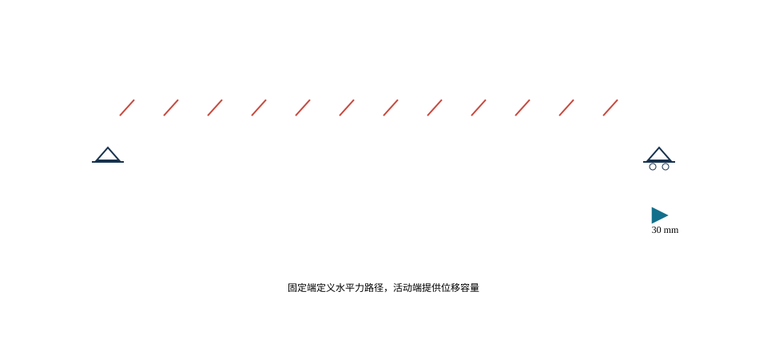

# 支座、墩台与基础

<!-- CORE-ROUTE START -->

<!-- VISUAL-ENTRY START -->

先从一个看得见的问题开始
<h3>天热时桥要变长，能不能把两端都固定住？</h3>
在均匀温度变形模式下，把左固定、右活动改成两端固定，再比较温度位移与约束轴力。
<a href="../interactive/learning-map.html?chapter=ch07">看图进入实验 →</a>

<!-- VISUAL-ENTRY END -->

<h2>本章的核心思考</h2>
先说自由度，再说支座型号。
<ol><li>画出温度自由变形与水平力路径。</li><li>用共同侧移与刚度分配解释墩台分工。</li><li>用偏心底压检验接触、脱空与边界变化。</li></ol>
<h3>跨课程类比</h3>
热应变与协调 → 支承内力；偏心受压 → 基础底压

<strong>反例与边界：</strong>释放约束有收益也有代价；土体和仅受压支承不能承担线性模型随意算出的拉力。

建议课堂集中完成标为“课堂核心”的3个单元，其余单元用于课前观察和课后迁移。每个单元配独立短视频、操作实验、目标检验与开放论证题。

<article>
C08U01 · 课堂核心
<h3>支座首先定义自由度</h3>
支座释放位移可以减少温度内力，但还必须安排可靠的水平力路径。

<a href="../interactive/core-learning.html?unit=C08U01" target="_blank">操作与迁移任务</a> · <a href="../interactive/core-learning.html?unit=C08U01&amp;view=video" target="_blank">观看短视频</a>
</article><article>
C08U02 · 课前/课后迁移
<h3>均匀温升：自由与完全约束</h3>
温升增大时自由伸长与完全约束应力均线性增加，二者属于不同边界情形。

<a href="../interactive/core-learning.html?unit=C08U02" target="_blank">操作与迁移任务</a> · <a href="../interactive/core-learning.html?unit=C08U02&amp;view=video" target="_blank">观看短视频</a>
</article><article>
C08U03 · 课堂核心
<h3>刚度分配解释多墩水平力</h3>
共同侧移时，较硬的墩分担更多水平力。

<a href="../interactive/core-learning.html?unit=C08U03" target="_blank">操作与迁移任务</a> · <a href="../interactive/core-learning.html?unit=C08U03&amp;view=video" target="_blank">观看短视频</a>
</article><article>
C08U04 · 课堂核心
<h3>偏心传力也发生在基础底面</h3>
平均底压与偏心弯曲项叠加，压力合力位置改变接触状态。

<a href="../interactive/core-learning.html?unit=C08U04" target="_blank">操作与迁移任务</a> · <a href="../interactive/core-learning.html?unit=C08U04&amp;view=video" target="_blank">观看短视频</a>
</article><article>
C08U05 · 课前/课后迁移
<h3>墩高通过三次方影响侧向刚度</h3>
同截面悬臂墩柱的顶部侧向刚度为3EI除以H的三次方，墩高加倍时刚度降为八分之一。

<a href="../interactive/core-learning.html?unit=C08U05" target="_blank">操作与迁移任务</a> · <a href="../interactive/core-learning.html?unit=C08U05&amp;view=video" target="_blank">观看短视频</a>
</article><article>
C08U06 · 课前/课后迁移
<h3>地基与墩柱串联共同变形</h3>
总柔度是串联柔度之和，基础柔度可能控制整体变形。

<a href="../interactive/core-learning.html?unit=C08U06" target="_blank">操作与迁移任务</a> · <a href="../interactive/core-learning.html?unit=C08U06&amp;view=video" target="_blank">观看短视频</a>
</article><article>
C08U07 · 课前/课后迁移
<h3>约束改变，内力就重新分配</h3>
一个支承刚度改变，会影响整个离散支承体系的分配。

<a href="../interactive/core-learning.html?unit=C08U07" target="_blank">操作与迁移任务</a> · <a href="../interactive/core-learning.html?unit=C08U07&amp;view=video" target="_blank">观看短视频</a>
</article><article>
C08U08 · 课前/课后迁移
<h3>脱空不是把负反力删掉</h3>
负反力与只能受压的支承条件冲突，需要重新确定接触区。

<a href="../interactive/core-learning.html?unit=C08U08" target="_blank">操作与迁移任务</a> · <a href="../interactive/core-learning.html?unit=C08U08&amp;view=video" target="_blank">观看短视频</a>
</article><article>
C08U09 · 课前/课后迁移
<h3>顶升用单位响应建立调整规律</h3>
多个顶升点的位移调整同时影响各控制响应，适合用影响矩阵组织。

<a href="../interactive/core-learning.html?unit=C08U09" target="_blank">操作与迁移任务</a> · <a href="../interactive/core-learning.html?unit=C08U09&amp;view=video" target="_blank">观看短视频</a>
</article><article>
C08U10 · 课前/课后迁移
<h3>同温差放大结构，力和应力不同步</h3>
完全约束热应力不随几何尺度改变，但热轴力随面积增长。

<a href="../interactive/core-learning.html?unit=C08U10" target="_blank">操作与迁移任务</a> · <a href="../interactive/core-learning.html?unit=C08U10&amp;view=video" target="_blank">观看短视频</a>
</article>

<a href="../core-thinking.html">返回全书核心思维与尺度规律</a> · <a href="../core-resources.html">查看110个教学单元总索引</a> · <a href="../interactive/thinking-analogies.html">打开跨课程并排类比</a>

<!-- CORE-ROUTE END -->

::: {.chapter-objectives}
**学习目标。** 识别支座约束与位移功能；理解上部结构作用向墩台和基础的传递；能够根据温度位移、墩身刚度和地基条件建立下部结构分析模型。
:::

<figure class="chapter-video-card"><video controls preload="metadata" playsinline poster="../assets/videos/manim/posters/M11_thermal_restraint.png" src="../assets/videos/manim/M11_thermal_restraint.mp4"></video><figcaption>M11　温度变形与纵向约束</figcaption></figure>

## 支座功能、自由度与约束体系

支座把上部结构反力传给下部结构，并按总体设计允许或限制转动与位移。常用支座可分为固定、单向活动和多向活动等功能类型，其实现形式包括板式橡胶、盆式和球型等。支座选型应依据反力、转角、位移、耐久性、检修和更换条件，不能只按竖向承载力确定。

全桥支承布置必须形成明确、稳定且不过度约束的体系。固定点决定纵向水平作用的主要传递路径；活动支座释放温度、收缩徐变和其他强迫位移。曲线桥、斜桥和宽桥还应检查横向位移方向、转动耦合和限位装置受力。

<iframe loading="lazy" src="../interactive/ch07-boundary-lab.html" title="桥梁边界条件与支承体系实验"></iframe>

::: {.digital-note}
**数字资源8-1　支承自由度实验。** 切换固定、单向和多向活动支座，显示被约束与被释放的自由度、温度变形方向和水平力路径。错误布置以约束冲突或刚体自由度警示呈现。
:::

## 温度、制动与水平力分配

长度为 $L$ 的梁体在均匀温差 $\Delta T$ 下，自由伸缩量为

$$\Delta L=\alpha L\Delta T,$$

其中 $\alpha$ 为线膨胀系数。若位移受约束，则会产生附加内力。对于多个墩共同约束上部结构的简化体系，可按各墩—支座组合的等效纵向刚度分配水平力：

$$F_i=\frac{k_i}{\sum_j k_j}F.$$

实际模型还应考虑支座摩阻、墩身开裂、基础柔度、几何非线性和接触间隙。刚度分配说明了“较刚构件吸引较大水平力”的一般规律，也提示设计时不能把全部桥墩简单设为固定。

<iframe loading="lazy" src="../interactive/bridge-concept-screen.html?lab=thermal" title="桥长、温差与支座位移实验"></iframe>

{#fig-ch07-thermal-boundary .static-fallback width=88%}

## 桥墩、桥台与局部传力

桥墩形式包括实体墩、柱式墩、薄壁墩、框架墩和空心墩等。选择时应综合高度、反力、刚度、河道阻水、碰撞、防洪、施工和景观。连续刚构高墩既是承重构件也是体系柔度的重要来源，墩高和截面变化会改变温度、制动和地震作用分配。

桥台承担上部结构反力并衔接路堤，常见问题包括台后填土沉降、搭板跳车、排水不畅和土压力变化。整体式桥台通过取消伸缩装置改善维护，但对温度循环下的土—结构相互作用有更高要求。

## 基础、群桩与地基—结构相互作用

基础可分为扩大基础、桩基础、沉井基础等。选型取决于地层、地下水、冲刷、承载力、沉降、施工设备和环境限制。桥梁基础除竖向承载外，还应检查水平荷载、倾覆、滑移、群桩效应、局部冲刷和偶然作用。

地基不是绝对固定边界。初步总体分析可用等效弹簧表示基础柔度，重要桥梁或软弱地基应开展更完整的土—结构相互作用分析。不同模型层级的参数来源、适用范围和不确定性应明确记录。进入空间分析前，可先由 @fig-ch07-bearing-types 核对支座功能分类。

{#fig-ch07-bearing-types width=76%}

::: {.source-note}
**图源（内部初稿）。** 在线教材项目 `longyu8101/qlgc`，原图6-1-2“支座功能分类”，文件 `source/_static/fig/6-1-2.png`，<https://github.com/longyu8101/qlgc/blob/master/source/_static/fig/6-1-2.png>。构造名称和自由度在定稿时按现行标准核对。
:::

支座处需要成组输入反力、位移和转角，基本关系见 @fig-ch07-bearing-actions。

{#fig-ch07-bearing-actions width=76%}

::: {.source-note}
**图源（内部初稿）。** 在线教材项目 `longyu8101/qlgc`，原图6-1-3“作用于桥梁支座的反力、位移和转角”，文件 `source/_static/fig/6-1-3.png`，<https://github.com/longyu8101/qlgc/blob/master/source/_static/fig/6-1-3.png>。用于建立支座设计输入清单。
:::

连续梁桥固定点与活动方向的一种典型布置见 @fig-ch07-bearing-layout，工程采用时仍须结合平曲线、斜交角和墩台刚度复核。

{#fig-ch07-bearing-layout width=74%}

::: {.source-note}
**图源（内部初稿）。** 在线教材项目 `longyu8101/qlgc`，原图6-1-10“连续梁桥支座设置示意”，文件 `source/_static/fig/6-1-10.png`，<https://github.com/longyu8101/qlgc/blob/master/source/_static/fig/6-1-10.png>。用于说明固定点与活动方向，具体布置须结合桥梁平纵线形。
:::

桥墩可按墩帽、墩身和基础分层识别，其组成见 @fig-ch07-pier。

{#fig-ch07-pier width=58%}

::: {.source-note}
**图源（内部初稿）。** 在线教材项目 `longyu8101/qlgc`，原图6-2-1“桥墩示意图”，文件 `source/_static/fig/6-2-1.png`，<https://github.com/longyu8101/qlgc/blob/master/source/_static/fig/6-2-1.png>。用于识别墩帽、墩身与基础的组成。
:::

桥台除承担上部结构反力外，还与台后填土、侧墙和桥路过渡相连，主要组成见 @fig-ch07-abutment。

{#fig-ch07-abutment width=70%}

::: {.source-note}
**图源（内部初稿）。** 在线教材项目 `longyu8101/qlgc`，原图6-3-1“桥台示意图”，文件 `source/_static/fig/6-3-1.png`，<https://github.com/longyu8101/qlgc/blob/master/source/_static/fig/6-3-1.png>。用于说明台帽、台身、侧墙与台后填土关系。
:::

## 耐久、碰撞、检查与可更换设计

支座和伸缩装置处于水、盐和杂物易聚集位置，是病害高发部位。设计应提供排水、检修、顶升和更换空间。墩台基础应结合氯盐、冻融、冲刷、碰撞和疲劳环境设置保护与监测措施。数字模型可关联构件编号、检查记录和更换方案，形成设计—运营数据连续性。

### 支承体系的自由度表达

#### 从名称到约束矩阵

“固定支座”“单向活动支座”和“多向活动支座”描述的是功能，不直接等同于某一种产品。空间节点具有三个平移和三个转动自由度，支承布置应逐项说明哪些自由度被约束、哪些被释放、哪些由有限刚度或间隙控制。理想固定支座通常限制水平两个方向的相对位移并传递竖向反力，同时允许梁端转动；单向活动支座限制一个水平位移并释放另一个；多向活动支座释放两个水平位移。实际支座的转动、摩阻和剪切变形均有有限刚度。

设上部结构支承节点位移为 $\mathbf u_s$，支座等效刚度为 $\mathbf K_b$，下部结构顶点位移为 $\mathbf u_p$，支座反力可写为

$$\mathbf R_b=\mathbf K_b(\mathbf u_s-\mathbf u_p-\mathbf u_0),$$

其中 $\mathbf u_0$ 表示安装偏位、温度预设或间隙等初始量。理想约束是 $\mathbf K_b$ 某些分量趋于很大的极限情况。直接在有限元模型中把相关自由度完全固定，可能忽略支座和墩台共同柔度并高估水平力。

#### 稳定且不过约束

全桥支承体系必须消除刚体自由度，否则结构在静力计算中不稳定；同时应允许温度、收缩徐变和预应力引起的必要变形，避免重复约束。同一直线梁桥通常设置明确的纵向固定点，其余支点释放纵向位移；横向约束则需保证全桥稳定并适应桥宽和转动。多联桥梁还应协调各联固定点、伸缩缝和桥台位移。

曲线桥的切向、径向与全局坐标不一致。支座活动方向应按桥轴局部方向定义，并检查温度伸缩时梁端轨迹；斜桥的主梁转动会引起支座横向位移和反力偏心；宽桥温度变形可能呈扇形展开。仅把所有活动支座方向设置为全局纵向，可能造成非预期横向约束。

#### 摩阻、限位与脱空

滑动支座摩阻可近似写为 $F_f=\mu N$，但摩阻方向随相对运动改变，且静摩擦与动摩擦、温度和老化会影响取值。板式橡胶支座通过剪切变形适应水平位移，水平力与剪切刚度有关。限位装置和防落梁装置通常具有间隙，只有相对位移达到间隙后才参与受力。

当竖向反力可能变为拉力时，普通承压支座不能传递上拔力，支座可能脱空并导致边界改变。曲线桥、斜桥、宽桥和大悬臂结构应检查偏载、温度与地震工况下的最小反力。若设抗拉装置，须在模型和构造中明确其刚度、间隙与设计作用。

#### 六自由度广义关系

每个支点在局部坐标中具有三个平动和三个转动自由度。取$x_l$沿桥轴切向，$y_l$沿横桥向或支承线规定方向，$z_l$竖向向上，支座相对位移与转角向量为

$$
\boldsymbol{q}_b=
\begin{bmatrix}
u_{x_l}&u_{y_l}&u_{z_l}&
\theta_{x_l}&\theta_{y_l}&\theta_{z_l}
\end{bmatrix}^{\mathsf T},
$$

对应广义力为

$$
\boldsymbol{Q}_b=
\begin{bmatrix}
F_{x_l}&F_{y_l}&F_{z_l}&
M_{x_l}&M_{y_l}&M_{z_l}
\end{bmatrix}^{\mathsf T}.
$$

平动单位为m或mm，转角单位为rad；力单位为N或kN，力矩单位为N·m或kN·m。在线性范围内可写成$\boldsymbol{Q}_b=\boldsymbol{K}_b(\boldsymbol{q}_b-\boldsymbol{q}_{b0})$，其中$\boldsymbol{K}_b$为$6\times6$支座刚度矩阵，$\boldsymbol{q}_{b0}$表示安装预偏、初始转角或初始间隙。理想固定或释放是相应刚度趋近很大或很小的模型极限，真实产品应使用有来源的刚度、摩阻、间隙与承载边界。

曲线桥、斜桥和支承线不正交时，局部刚度需转换到全局坐标：

$$
\boldsymbol{K}_{b,g}=
\boldsymbol{T}^{\mathsf T}
\boldsymbol{K}_{b,l}\boldsymbol{T},
$$

其中$\boldsymbol{T}$为坐标转换矩阵，无量纲。转换后全局矩阵可能出现耦合项，表示沿局部活动方向的运动在全局$x$、$y$中同时具有分量。支座布置图必须显示局部坐标箭头，不能只写“单向活动”而省略活动方向。

#### 体系稳定与约束秩

自由空间刚体有三个平移和三个转动模式。全桥支座与墩台边界应消除会导致计算机构的刚体模式，同时保留温度、收缩徐变和安装需要的运动。可由约束矩阵$\boldsymbol{C}$检查

$$
\boldsymbol{C}\boldsymbol{u}=\boldsymbol{d},
$$

式中，$\boldsymbol{u}$为总体自由度向量，$\boldsymbol{d}$为规定运动。约束不足时，刚度矩阵出现非预期零特征值；重复或冲突约束可能不引起奇异，却会产生异常大的温度反力。因而“求解成功”不是支承体系正确的充分条件。

支承体系最小测试采用六个单位运动或单位作用：纵向、横向、竖向单位力检查传力对象，三个方向单位力矩检查支座对和横向间距形成的反力偶。均匀升温工况检查自由伸缩轨迹；自重工况检查竖向反力和最小反力；对称与反对称横向荷载检查左右支点反力。每项检查都保存理论方向、模型结果与差异说明。

#### 刚性梁面的平移与转动

在水平作用的概念分析中，可把同一联上部结构视为平面内刚体。设参考点平移为$\boldsymbol{d}$，绕竖轴小转角为$\theta_z$，第$i$支点相对参考点位置为$\boldsymbol{r}_i$，则该支点平面位移近似为

$$
\boldsymbol{u}_i=
\boldsymbol{d}+\theta_z\boldsymbol{e}_z\times\boldsymbol{r}_i.
$$

在线性弹簧假定下，支点水平力为

$$
\boldsymbol{F}_i=
\boldsymbol{K}_{h,i}
(\boldsymbol{u}_i-\boldsymbol{u}_{0,i}),
$$

其中$\boldsymbol{K}_{h,i}$为该支点在全局平面内的$2\times2$等效刚度矩阵，单位N/m；$\boldsymbol{u}_{0,i}$为温度自由位移、预偏或基础运动。由$\sum\boldsymbol{F}_i=\boldsymbol{P}$及$\sum\boldsymbol{r}_i\times\boldsymbol{F}_i=M_z\boldsymbol{e}_z$求得$\boldsymbol{d}$和$\theta_z$。这一表达比$F_i\propto k_i$多考虑了支点平面位置和整体转动，适用于曲线、斜交或偏心作用的初步分析。

若上部结构平面内并非刚体，应在总体模型中直接表示梁体变形；若支座存在摩阻、间隙、屈服或速度相关阻尼，$\boldsymbol{F}_i$与位移关系为非线性或路径相关，需按加载历史迭代。本节公式用于检查方向与数量级，不取代专业分析。

::: {.digital-note}
**数字资源8-2　六自由度支承矩阵。** 学生在三维桥梁上逐项启用或释放$u_x,u_y,u_z,\theta_x,\theta_y,\theta_z$，页面同步显示局部—全局转换、刚体模态、温度轨迹和单位作用反力。产品名称不自动生成约束，必须由自由度表确认。
:::

#### 约束秩与刚体模态的数值检查

对空间上部结构，刚体位移可写为参考点平移$\boldsymbol{d}$和小转角$\boldsymbol{\theta}$。位置为$\boldsymbol{r}_i$的支点刚体位移为

$$
\boldsymbol{u}_i=\boldsymbol{d}
+\boldsymbol{\theta}\times\boldsymbol{r}_i.
$$

把各支座受约束方向投影到上述六个刚体参数，可形成刚体约束矩阵$\boldsymbol{C}_r$。若$\operatorname{rank}(\boldsymbol{C}_r)<6$，至少存在一个未被消除的空间刚体模式；若秩为6，说明刚体运动被约束，但不能证明没有重复约束或温度冲突。矩阵秩需结合尺度和数值容差判断，坐标量级差异较大时先进行无量纲化。

重复约束可通过约束反力和热位移工况识别。设无外力但有自由温度位移$\boldsymbol{u}_T$，理想无冲突情况下活动方向反力应符合预期；若多个支点同时锁定同一纵向模式，将产生自平衡水平反力。对每一个冗余约束，可临时释放并比较温度反力和刚体稳定，判断它承担的是必要稳定功能还是非预期温度约束。

特征值检查应区分全桥真实低频柔性模态与数值刚体模态。完全未约束的三维模型理论上有六个刚体模态；加入支承后不应残留非预期零能模态。弹性支座和地基使低频不为严格零，需结合变形图和能量位置判断。只依据求解器“无奇异警告”不能替代此检查。

#### 热位移模式与约束正交性

均匀升温产生的自由位移场$\boldsymbol{u}_T$应尽量位于支承允许的运动子空间。设$\boldsymbol{C}\boldsymbol{u}=\boldsymbol{0}$表示理想约束，则$\boldsymbol{C}\boldsymbol{u}_T$衡量自由热位移与约束的冲突。其非零分量对应可能产生的约束反力，但实际大小还受梁体、墩台、支座和基础刚度影响。

对直线桥，选择纵向固定点后，温度位移从固定点向两端累积；对曲线桥，自由位移沿线路切向积分并伴随平面转动；对斜桥，梁端支承线与桥轴交角使相对位移投影到支座局部纵横向。宽桥的左右支点还可能因平面转动产生不同位移。支承布置应同时查看平面轨迹和六自由度表。

收缩徐变、预应力和基础位移也可形成“自由变形模式”，但时间尺度、空间分布和组合规则与温度不同。模型把它们分别定义，再计算约束反力；不能通过任意调整温差吸收长期变形。支座安装预偏只改变初始位置，不消除结构长期作用本身。

#### 刚度中心与平面扭转

对平面内线性支点，设第$i$支点的$2\times2$刚度矩阵为$\boldsymbol{K}_i$，位置为$(x_i,y_i)$。若忽略交叉耦合且关注某一方向，例如$x$向，刚度中心横坐标可按

$$
y_K=\frac{\sum_i k_{x,i}y_i}{\sum_i k_{x,i}}
$$

理解；$k_{x,i}$单位N/m，$y_K,y_i$单位m。外力作用线与刚度中心偏离会产生平面扭转，曲线桥、斜桥和刚度不均体系尤为明显。一般情况下应使用完整矩阵和平衡方程，不将两个方向独立处理。

支点布置优化不是简单把固定支座置于几何中心。固定点位置影响温度位移、伸缩装置、制动力路径和墩台需求；刚度中心受支座、墩柱和基础共同决定，并可能随开裂、摩阻或隔震状态变化。参数交互应同时显示几何中心、质量中心、刚度中心和水平作用线，但不以它们重合为唯一目标。

#### 曲线与斜交桥的局部轴生成

支座方向应由线路和支承线几何生成，不宜逐点凭图面手工输入。设桥梁中心线为$\boldsymbol r(s)$，其中$s$为弧长，桥向单位切向为

$$
\boldsymbol e_x(s)=
\frac{\mathrm d\boldsymbol r/\mathrm ds}
{\|\mathrm d\boldsymbol r/\mathrm ds\|}.
$$

若以全局竖向$\boldsymbol e_z$为参考，在桥面局部坡度允许的情况下，可由

$$
\boldsymbol e_y=
\frac{\boldsymbol e_z\times\boldsymbol e_x}
{\|\boldsymbol e_z\times\boldsymbol e_x\|},
\qquad
\boldsymbol e_z^{\,l}=
\boldsymbol e_x\times\boldsymbol e_y
$$

建立右手局部基。坐标向量无量纲，$\boldsymbol r$与$s$单位为m。若桥面有横坡和超高，应使用桥面法向或设计支座平面定义局部竖向，不把全局竖向无条件作为支座法向。

斜交桥支承线与桥轴切向夹角为$\beta$时，支座导向可以沿桥轴、沿支承线法向或按结构设计规定的方向。三者不是同义。设支座局部纵向单位向量为$\boldsymbol a_i$、横向为$\boldsymbol b_i$、竖向为$\boldsymbol c_i$，则方向余弦矩阵为

$$
\boldsymbol R_i=
\begin{bmatrix}
\boldsymbol a_i^{\mathsf T}\\
\boldsymbol b_i^{\mathsf T}\\
\boldsymbol c_i^{\mathsf T}
\end{bmatrix}.
$$

平动和小转角均按$\boldsymbol R_i$转换，六自由度转换矩阵由两个$\boldsymbol R_i$组成分块对角阵。矩阵应满足$\boldsymbol R_i\boldsymbol R_i^{\mathsf T}=\boldsymbol I$且$\det\boldsymbol R_i=+1$。若局部基不正交或左右手系错误，支座刚度和结果方向均会失真。

#### 曲线桥自由热变形的积分

对均匀温度应变$\varepsilon_T=\alpha\Delta T$，桥轴微段自由伸长为$\varepsilon_T\,\mathrm ds$。以固定参考点$s_0$为起点，中心线点$s$的一阶自由位移可概念性写为

$$
\boldsymbol u_T(s)=
\int_{s_0}^{s}\alpha(\xi)\Delta T(\xi)
\boldsymbol e_x(\xi)\,\mathrm d\xi
+\boldsymbol u_{T0},
$$

其中$\boldsymbol u_T$单位为m，$\alpha$单位为1/°C，$\Delta T$单位为°C。对于曲线，积分方向沿途变化，因此终点位移不必平行于任一全局轴。若桥宽不可忽略，左右支座还叠加桥面平面转动和横向温差引起的差异位移。

支座$i$的自由热位移在其局部方向的分量为

$$
\boldsymbol q_{T,i}=
\boldsymbol T_i
\begin{bmatrix}
\boldsymbol u_T(\boldsymbol r_i)\\
\boldsymbol\theta_T(\boldsymbol r_i)
\end{bmatrix},
$$

式中，$\boldsymbol T_i$为六自由度坐标转换矩阵。若导向释放方向与$\boldsymbol q_{T,i}$的主要平动方向不一致，活动支座仍会产生横向或纵向约束反力。交互页面应同时显示自由轨迹、支座局部轴、受约束后的实际轨迹和反力，而不仅显示“伸长了多少”。

上述积分只描述由温度应变形成的自由模式。连续梁弯曲、墩台变形、基础运动、收缩徐变和预应力会改变实际位移，必须在总体模型中共同求解。温度梯度还会引起转角和竖向变形，不由中心线均匀伸长式覆盖。

#### 支承线偏心与平移—扭转耦合

斜交支承线使左右支座在桥向位置上不同，曲线桥的质量中心、几何中心与刚度中心也可能不重合。第$i$支点平面位移与刚性梁面广义位移$\boldsymbol d=[d_x,d_y,\theta_z]^{\mathsf T}$之间为

$$
\boldsymbol u_i=
\begin{bmatrix}
1&0&-y_i\\
0&1&x_i
\end{bmatrix}
\boldsymbol d.
$$

若支点局部刚度为$\boldsymbol K_{i,l}$，其全局平面刚度为$\boldsymbol K_i=\boldsymbol R_{2i}^{\mathsf T}\boldsymbol K_{i,l}\boldsymbol R_{2i}$。总体广义刚度

$$
\boldsymbol K_r=
\sum_i\boldsymbol B_i^{\mathsf T}
\boldsymbol K_i\boldsymbol B_i
$$

同时包含两向平移、绕竖轴扭转和耦合项。$\boldsymbol K_i$的单位为N/m，$\boldsymbol K_r$中转动相关项因坐标臂而分别具有N、N·m等相应量纲。组装前应统一参考点和单位。

对于偏心纵向制动力$P_x$或横风$P_y$，绕参考点的扭矩为$M_z=x_PP_y-y_PP_x$。若只把合力分配给各固定支座而遗漏$M_z$，会低估一侧支点和墩柱作用。反过来，支点反力应满足

$$
\sum_i\boldsymbol F_i=\boldsymbol P,\qquad
\sum_i\boldsymbol r_i\times\boldsymbol F_i
=\boldsymbol M.
$$

力单位为N，力矩单位为N·m。上述平衡既用于线性刚度模型，也用于检查非线性摩阻、限位和隔震分析每一步的结果。

#### 六自由度连接的模型层级

支座与上、下部结构连接可分为四级。一级是理想自由度，用固定与释放建立总体传力路径；二级是线性六自由度刚度，表示产品、墩台和基础的有限柔度；三级加入摩阻、间隙、压剪耦合、脱空或滞回；四级采用局部实体、接触和锚固构造研究承压与连接。模型升级由目标响应决定，不能因三维显示需要而把所有支座都建成实体。

线性连接关系可写为

$$
\boldsymbol Q_i=
\boldsymbol K_i
(\boldsymbol q_i-\boldsymbol q_{0i}),
$$

其中$\boldsymbol q_{0i}$包含安装预偏、初始转角、基础位移或规定间隙前的参考位置。$u_x,u_y,u_z$单位为m，$\theta_x,\theta_y,\theta_z$单位为rad；对应力与力矩单位分别为N和N·m。矩阵中的平移—转动耦合项需要给出参考点，移动参考点后矩阵会改变。

普通承压支座的法向关系应允许脱空或不传拉力。可用互补条件的概念形式表示

$$
g_n\geq0,\qquad
N_n\geq0,\qquad
g_nN_n=0,
$$

其中$g_n$为法向间隙m，$N_n$为压向接触力N，具体正号按模型定义。限位间隙、滑动摩阻和隔震屈服同样具有状态。结果表不仅保存峰值，还保存各支点处于黏着、滑动、接触、脱空或屈服的时刻与持续范围。

#### 支承系统的可审计检查表

每个支座对象至少含：中心坐标；局部三轴；上、下连接对象；六自由度功能；刚度或本构；安装预偏与温度；法向承载与是否允许拉力；摩阻和间隙；转角与位移需求；产品资料版本；检查和更换空间。软件中的产品名称只作属性，不替代这些字段。

模型建立后按固定顺序测试：无支承模型应出现预期六个刚体模态；加入支承后刚体约束满足分析需求；竖向单位力得到正确承压路径；纵横向单位力和三个单位力矩形成可解释反力；均匀升降温产生相反位移趋势；自重与偏载检查最小反力和脱空；局部轴旋转后全局合力与合矩仍守恒。任何失败先回到几何、方向和连接，不用增加大刚度掩盖。

本节建议配置三张课程组自绘图：曲线桥自由热位移矢量场；斜交支承线局部轴与位移投影；多支点刚度中心、质量中心和作用线。支座产品剖面和工程照片只在获得厂家或项目许可后使用，内部稿记录型号、版本和授权；未授权资料不进入出版版。

### 支座选型与验算

支座选型以反力、位移、转角和动力功能为基本输入。竖向承载力只是第一项条件，还应核对允许转角、设计位移、滑移面压力、橡胶剪切应变、锚固、疲劳、耐久和更换空间。盆式、球型和橡胶支座各有适用范围，具体产品参数需由现行标准和合格技术资料确定。

支座反力必须来自不利组合包络。最大竖向压力、最小竖向反力、最大纵向和横向力、最大位移及最大转角可能不同时出现，设计表应保留其组合编号。温度位移应同时考虑安装温度与设计温度区间。若支座预偏，施工图应明确预偏方向、数值、参考温度及现场复核程序。

支座垫石和锚固区将集中反力扩散到墩台帽梁。局部验算包括承压、劈裂、冲切、配筋和边缘距离。支座中心偏位会产生附加弯矩，施工容许偏差应进入不利情况分析。总体杆系模型不能直接提供垫石局部应力，需建立局部传力模型。

#### 支座分类的力学接口

支座可按承载与变形机制分类。板式橡胶支座利用橡胶层剪切适应平面位移，并通过压缩与转动变形传递竖向作用；盆式或球型支座将竖向承压、转动和滑移功能组合在不同部件中；固定、导向与多向活动描述平面约束方向；隔震或耗能装置通过延长周期、屈服、摩擦或黏滞等机制改变地震响应。分类名称只说明主要机制，建模仍需落到六自由度、力—位移关系和构造边界。

| 支座或装置机制 | 主要传力 | 允许运动 | 模型接口 | 需核对的非理想因素 |
|---|---|---|---|---|
| 橡胶剪切 | 竖向压力、水平剪力 | 平面剪切与有限转角 | 三向弹性或耦合刚度 | 压剪耦合、温度、老化、脱空 |
| 滑动面 | 竖向压力、摩阻 | 一个或两个平面方向滑移 | 法向接触加摩擦 | 静/动摩擦、污染、磨耗、初始位置 |
| 固定承载 | 竖向与双向水平力 | 设计允许转角 | 高平面刚度、转动关系 | 锚固、间隙、局部变形 |
| 导向承载 | 竖向及导向侧水平力 | 沿导向方向位移 | 局部轴刚度与限位 | 导向间隙、方向偏差、卡阻 |
| 球面或盆式转动 | 竖向压力及规定水平力 | 多向转角 | 转动自由度或实体接触 | 接触压力、转角耦合、密封 |
| 隔震支座 | 竖向承载、可控水平滞回 | 较大水平位移 | 非线性滞回单元 | 速率、温度、循环、残余位移 |
| 黏滞或其他耗能装置 | 速度/位移相关水平力 | 连接两端相对运动 | 速度或滞回本构 | 连接刚度、行程、温度、耐久 |

表中模型接口是分析抽象，不是产品验收条款。实际产品的承载、位移、转角、疲劳、耐久和试验要求按项目采用的支座与抗震装置标准及有效技术文件确定。教材不提供型号选用范围或无来源的刚度、摩擦系数。

#### 上下部构造接口

支座上部连接主梁或梁底预埋板，下部连接垫石、墩帽或桥台。传力链为梁体局部板件—上座板—转动/滑移部件—下座板—锚固—灌浆层—垫石—盖梁/台帽。总体模型常以一个节点或连接单元表示支座，局部构造需单独检查集中反力扩散、局部承压、劈裂、锚固和边缘距离。

支座中心与主梁参考轴、盖梁节点存在偏置时，作用平移应保持合力与力矩。设偏置向量$\boldsymbol{e}$从分析节点指向支座中心，支座力$\boldsymbol{F}$移至分析节点后附加$\boldsymbol{M}_e=\boldsymbol{e}\times\boldsymbol{F}$。$\boldsymbol{e}$单位m，$\boldsymbol{F}$单位N，$\boldsymbol{M}_e$单位N·m。刚性臂或多点约束实施后，用三向单位力检查力矩是否正确传递。

垫石顶面高程、平整度和灌浆层影响实际承压。数字构造模型保存支座中心、上下板外形、锚栓孔、顶升点和检查空间，但不把厂家专有细节写成通用构造。未经许可的产品剖面只用于内部识别，定稿采用课程组自绘的功能层示意。

#### 力—位移包络与状态标识

支座不是对每个工况都保持同一线性状态。可把状态分为压紧、滑动、间隙未闭合、限位接触、可能脱空和抗拉装置参与。每个状态具有不同有效自由度和切线刚度。若普通承压支座法向反力$N<0$，应进入脱空重分析，不能让线性弹簧继续传递拉力。

结果表按同一状态保存$F_x,F_y,F_z,M_x,M_y,M_z$与$u_x,u_y,u_z,\theta_x,\theta_y,\theta_z$，并附组合、温度初始位置和阶段。选型包络需保留控制点而非只保留每列最大值，因为最大竖向反力、最大位移和最大转角通常来自不同状态，产品能力也可能存在相互作用。

::: {.digital-note}
**数字资源8-3　支座构造—模型接口。** 以分层爆炸图展示梁底、上座板、转动/滑移部件、下座板、锚固、灌浆与垫石。点击构件显示对应自由度、输入参数和局部验算对象；图形由课程组自主重绘，不复制厂家剖面。
:::

#### 功能规格与选型矩阵

支座选型应从功能规格开始，而不是先确定产品名称。输入矩阵至少包含：各极限状态下最大和最小竖向反力；纵、横向水平力；两个方向位移；绕三个轴的转角；循环次数和速度特征；可能上拔；环境温度与腐蚀；安装高程与施工偏差；检查、顶升和更换条件。每个极值保留对应组合和阶段，不把不同组合的最大力、最大位移和最大转角拼成一个不存在的状态。

支座局部平均承压数量级可由$\sigma=R_z/A_{\mathrm{eff}}$检查，其中$R_z$为竖向反力，单位N；$A_{\mathrm{eff}}$为有效承压面积，单位m$^2$；$\sigma$单位Pa。若反力作用线相对垫石或墩帽参考点偏心$\boldsymbol{e}$，附加力矩为$\boldsymbol{M}_e=\boldsymbol{e}\times\boldsymbol{R}$。实际接触压力、橡胶剪切、滑板压力、球面转动和锚固按相应支座标准与产品技术文件验算；概念公式只用于发现面积、单位或偏心错误。

固定支座、导向支座、多向活动支座、弹性支座、隔震支座和阻尼装置承担的功能不同。隔震或耗能装置的力—位移、力—速度关系会随温度、加载速率、循环与老化变化，不能用一个常数刚度覆盖所有分析。若地震工况采用等效线性参数，应记录迭代目标状态和适用范围；若采用非线性本构，应记录骨架曲线、循环规则和试验来源。

#### 安装预偏与现场验收

支座安装位置与结构参考温度相关。设计算时刻自由位移为$\Delta u_T$，安装温度与参考温度不同，支座预偏应按施工阶段、收缩徐变和预计温度变化共同确定。预偏值必须明确方向、符号、参考温度和测量基准；现场验收同时记录梁温、气温、墩顶位置、滑移方向和实际偏位。仅凭滑板刻度而无温度记录，无法判断是否异常。

支座安装后应检查上下钢板平整、中心位置、转角、锚固、灌浆与防尘防水。局部错位可能改变有效承压面积并引入偏心；活动方向错误可能在温度变化时产生水平力。数字台账将每个支座ID与安装照片、测量值、产品批次和模型节点对应，便于后续检查。

#### 顶升与更换的阶段分析

支座可更换性由永久结构和施工方案共同保证。设计阶段应预留千斤顶位置、临时支承面、操作净空和反力传递路径。更换分析至少包括交通组织或卸载、千斤顶同步加载、梁体微量顶升、旧支座卸载拆除、新支座安装、分级落梁和恢复运营。每个阶段检查梁端相对位移、相邻支座反力、盖梁局部承压、主梁横向分配和伸缩装置状态。

多点同步顶升可写成位移控制问题。若第$i$顶升点竖向位移为$u_i$，反力向量由模型关系$\boldsymbol{R}=\boldsymbol{K}_{\mathrm{eff}}\boldsymbol{u}$得到，其中$\boldsymbol{K}_{\mathrm{eff}}$为顶升点凝聚刚度矩阵。顶升位移误差可能导致反力重分配，因此施工控制不只规定总顶升量，还应规定各点同步性、加载级别与停检条件；具体限值由项目设计与施工方案确定。

更换后复测支座高程、中心、预偏、梁体线形和支反力可识别量，并更新模型状态。未经授权的厂家构造图不直接进入教材；定稿采用课程组重绘的功能示意，产品照片和参数表仅在厂家书面许可及版本有效时使用。

### 温度、制动与水平力分配

#### 自由温度位移

均匀温差下长度 $L$ 的自由伸缩为 $\Delta L=\alpha L\Delta T$。若固定点距梁端为 $L_1$，该梁端的自由位移近似为 $\alpha L_1\Delta T$。设置固定点的位置会改变两端伸缩量和伸缩装置需求；固定点靠近联中部可均衡两端位移，但需结合桥墩刚度和地形确定。

温度梯度使梁截面产生曲率。支承允许转动时主要形成梁端转角和竖向变形，受到连续性和约束时会产生附加反力。均匀温度与温度梯度应作为不同作用项建立，不能由一个总温差覆盖。

#### 墩—支座等效刚度

多个桥墩共同约束上部结构时，可在概念模型中把第 $i$ 个墩—支座体系表示为串联刚度：

$$\frac{1}{k_i}=\frac{1}{k_{p,i}}+\frac{1}{k_{b,i}}+\frac{1}{k_{f,i}},$$

其中 $k_p$、$k_b$ 和 $k_f$ 分别为墩身、支座与基础的等效水平刚度。在共同位移且线性条件下，水平总力 $F$ 近似按

$$F_i=\frac{k_i}{\sum_jk_j}F$$

分配。较刚构件吸引较大水平力，但实际还受固定点、摩阻、间隙、墩身开裂与地基非线性影响。该式用于判断趋势和复核量级，不替代整体分析。

#### 制动力与支座摩阻

制动力沿行车方向由桥面和主梁传至固定支座、桥墩及基础。连续梁多支点体系中，活动支座摩阻也可能分担一部分。模型应区分规范规定的制动力、支座摩阻和阻尼装置力，避免把同一物理效应重复计入。制动力作用位置与桥面高度形成的偏心可能在墩顶产生附加弯矩。

#### 温度位移的空间轨迹

直线桥在均匀温变下主要沿桥轴伸缩；曲线桥沿各控制点切向形成位移，并伴随平面转动；斜桥梁端沿支承线的相对运动可能同时含纵、横向分量。若中心线弧长坐标为$s$，切向单位向量为$\boldsymbol{t}(s)$，均匀温度应变$\alpha\Delta T$引起的自由增量可概括为

$$
\mathrm d\boldsymbol{u}_T=
\alpha\Delta T\,\boldsymbol{t}(s)\,\mathrm ds.
$$

式中，$\mathrm ds$单位为m，$\boldsymbol{u}_T$单位为m。积分所得位移路径取决于线路曲率和选定固定点。支座活动方向应与实际轨迹协调；把所有支座活动方向统一设为全局$x$，可能在曲线桥产生非预期径向反力。交互图应显示梁体自由轨迹、支座局部轴和受约束后的反力，而不是只显示伸缩长度。

温度梯度使梁端产生转角和竖向位移，支座允许转角不足时会产生边缘承压或附加弯矩。均匀温变、竖向梯度和横向温差应作为不同输入；它们的代表值与组合按项目采用的标准取得。安装温度、最高/最低有效温度和长期收缩徐变也应区分，不把不同物理来源合并为一个任意温差。

#### 制动、风与偏心力矩

制动力沿桥面作用，其作用线通常高于支座和墩顶参考点。若纵向力$F_x$与参考点竖向偏心$e_z$，则产生横向轴弯矩$M_y=F_xe_z$；横向风力与桥轴偏心也会形成扭矩。上部结构、支座对和墩台共同传递这些广义力，分析输入应保留作用位置，不能把所有水平力直接移到墩顶而遗漏偏心力矩。

线性共同位移条件下，水平力可由支点刚度分配；存在滑动摩阻时，支点力满足与法向反力和运动方向有关的非线性关系。若采用理想库仑模型，滑动阶段摩阻量级为$F_f=\mu N$，其中$\mu$无量纲，$N$单位N。静摩擦、动摩擦、温度、污染和老化均会改变关系，$\mu$应来自有效产品与试验资料。制动力和支座摩阻代表不同物理输入，组合时应避免重复施加同一传力效应。

#### 地震水平力与位移协调

地震作用首先是质量惯性效应。简化表达为

$$
\boldsymbol{M}\ddot{\boldsymbol{u}}+
\boldsymbol{C}\dot{\boldsymbol{u}}+
\boldsymbol{K}\boldsymbol{u}=
-\boldsymbol{M}\boldsymbol{\Gamma}a_g(t),
$$

式中，$\boldsymbol{M}$、$\boldsymbol{C}$和$\boldsymbol{K}$分别为质量、阻尼和刚度矩阵，$a_g(t)$为地面加速度，单位m/s$^2$；$\boldsymbol{\Gamma}$为输入方向向量。桥墩、支座、基础柔度和隔震装置共同决定振型、周期和水平力分配。用静力总水平力按常温线性刚度分配，只能作为某些概念工况，不能覆盖非线性隔震、多模态和多点输入。

长桥或场地差异明显时，不同墩台的支承运动可能具有幅值、相位或频谱差异。总体模型应按分析要求输入一致激励或多点激励，并把支座相对位移、梁端碰撞、防落梁构造和最小支承长度作为独立响应。支座、限位与碰撞具有间隙和接触切换，地震前温度位置还会改变可用间隙；分析情景应包括代表性的初始温度位置，而不是始终从支座居中开始。

采用隔震或耗能装置时，力的分配由装置滞回、墩台刚度和地震输入共同决定。输出至少包括上部结构位移、装置最大位移和累计耗能、墩底内力、基础作用、梁端相对位移与残余位移。具体设防目标、性能指标、组合与构造按项目采用的现行抗震标准确定，本章不列统一系数。

::: {.digital-note}
**数字资源8-4　水平作用分配实验。** 在同一联桥上切换温度、制动、横风和地震惯性作用，显示力的作用线、平面转动、各支点力和墩底弯矩。线性弹簧、摩阻、间隙与隔震滞回分层开放，并明确静力界面不能代替动力时程。
:::

#### 多墩平移—扭转分配矩阵

刚性梁面概念模型可写成三自由度方程。取广义位移$\boldsymbol{d}_r=[d_x,d_y,\theta_z]^{\mathsf T}$，第$i$支点平面位移为$\boldsymbol{u}_i=\boldsymbol{B}_i\boldsymbol{d}_r-\boldsymbol{u}_{0i}$，其中

$$
\boldsymbol{B}_i=
\begin{bmatrix}
1&0&-y_i\\
0&1&x_i
\end{bmatrix}.
$$

支点力为$\boldsymbol{F}_i=\boldsymbol{K}_i\boldsymbol{u}_i$。由平面合力与绕参考点力矩平衡，得到

$$
\left(\sum_i\boldsymbol{B}_i^{\mathsf T}
\boldsymbol{K}_i\boldsymbol{B}_i\right)
\boldsymbol{d}_r
=\boldsymbol{P}_r+
\sum_i\boldsymbol{B}_i^{\mathsf T}
\boldsymbol{K}_i\boldsymbol{u}_{0i},
$$

式中，$\boldsymbol{P}_r=[P_x,P_y,M_z]^{\mathsf T}$，前两项单位N，第三项单位N·m；$x_i,y_i$单位m，$\theta_z$单位rad。矩阵对角项反映两向平移刚度与扭转刚度，非对角项反映平移—扭转耦合。选择参考点在某一方向的刚度中心，可使相应耦合项减小，但在各向异性或局部轴不同的支点中不一定能同时消除全部耦合。

该矩阵可用于手算复核温度、制动、横风和偏心惯性作用。若支点刚度来自支座、墩与基础串联，先在相同方向和参考位置凝聚；若墩台顶部具有转动与平动耦合，应使用更完整的六自由度刚度而不是标量串联。上部结构不满足刚性梁面假定时，总体有限元模型是主模型，三自由度方程仍用于检查合力、扭矩和趋势。

支点进入滑动、限位接触或隔震屈服后，$\boldsymbol{K}_i$随状态变化。增量求解在每一步更新有效切线刚度和初始位移项；结果不仅保存峰值，还保存哪个支点何时发生状态切换。用所有支点初始弹性刚度计算一次比例，不能代表完整非线性分配。

#### 地震惯性作用与隔震接口

地震分析所需质量包括上部结构、桥面附属、墩台及按模型范围计入的其他质量。质量位置影响平面扭转，集中到桥轴可能遗漏宽桥或偏心构造的转动惯量。质量矩阵与支点刚度共同决定振型；模态分析至少检查纵向、横向、竖向或扭转主导模式及参与质量。

隔震设计在“降低上部结构或墩台力”与“增加装置、梁端和伸缩缝位移”之间权衡。装置输入不只是初始刚度，还可能包括屈服力、屈后刚度、摩擦、速度指数、阻尼、行程与恢复特性。参数单位随本构而定，均应来自有效试验或技术文件。等效线性分析需说明有效刚度和阻尼对应的目标位移，并迭代检查；非线性时程需报告加载历史和滞回能量。

两端相对运动装置的变形为

$$
\boldsymbol{q}_d=
\boldsymbol{T}_d
(\boldsymbol{u}_2-\boldsymbol{u}_1)-\boldsymbol{q}_{d0},
$$

式中，$\boldsymbol{u}_1,\boldsymbol{u}_2$为装置两端自由度，$\boldsymbol{T}_d$为坐标投影矩阵，$\boldsymbol{q}_{d0}$为安装偏位或初始间隙。装置力由$\boldsymbol{q}_d$及其速度、历史状态决定。若连接构件或锚固区柔度明显，不能把装置本构直接跨接到理想刚体节点。

地震下支座可能经历压剪、转动、滑移、限位碰撞或脱空。普通承压支座不应在线性模型中传递未配置的拉力。梁端、挡块和防落梁装置的碰撞具有间隙和局部冲击，需分层研究；总体模型输出接触力和相对位移，局部模型检查挡块、锚固和盖梁传力。

多点地震输入时，各墩台地面运动不同，结构响应由惯性效应与拟静力支承位移共同形成。模型应明确输入坐标、时间同步、相干或行波假定和地基边界。没有相应场地和地震资料时，教材只展示输入接口，不构造“标准”时程。

::: {.digital-note}
**数字资源8-5　多墩平移—扭转与隔震。** 由支点坐标和二维刚度自动组装三自由度矩阵，显示平移、转动与各支点力；切换线性、滑动、限位和隔震本构后展示状态路径。地震输入缺少来源时只允许使用标注为合成的教学波形。
:::

#### 温度—制动—地震的状态顺序

温度、制动和地震对支承系统的作用机制不同。温度首先形成自由应变和初始位置，制动作为运营期水平外力在该位置上加载，地震则通过质量惯性和支承运动产生动力响应。若支座含摩阻、限位、脱空或隔震滞回，三者的先后会改变初始间隙、黏滑状态和可用位移，不能仅在最终结果表中线性叠加。

可将分析状态写为

$$
\mathcal S_k=
\{\boldsymbol q_k,\boldsymbol Q_k,
\boldsymbol\eta_k,T_k,\mathcal B_k\},
$$

式中，$\boldsymbol q_k$与$\boldsymbol Q_k$为各支点广义位移和广义力，$\boldsymbol\eta_k$为摩阻、塑性、接触等内部状态变量，$T_k$为温度状态，$\mathcal B_k$为当时边界集合。温度从安装基准发展到运营基准后，保存支座预偏、伸缩缝开口和限位间隙；制动或风在这一状态上求解；地震情景再选择具有代表性的高、低温初始位置。各代表状态及组合依据项目现行标准和专项分析确定，本书不设固定数量与系数。

在线性范围内，可以把各基本工况效应叠加；一旦支点进入滑动、限位、脱空或屈服，应直接按组合路径求解。结果表保留状态进入与退出的时间或荷载步、最大和残余位移、装置力、墩底作用及控制初始温度。只有最大绝对值而无状态路径，不能判断间隙何时闭合或摩阻方向如何变化。

#### 制动力的三维传力

制动力作用于桥面标高，经桥面板、主梁、支座、墩台和基础传递。设作用点相对支承参考面的偏心向量为$\boldsymbol e$，制动力为$\boldsymbol F_b$，移至参考点时附加力矩为

$$
\boldsymbol M_b=\boldsymbol e\times\boldsymbol F_b.
$$

$\boldsymbol e$单位为m，$\boldsymbol F_b$单位为N，$\boldsymbol M_b$单位为N·m。曲线桥中车辆切向随里程变化，多个制动力应先在各自局部方向定义，再转换到统一全局坐标；斜桥的作用线相对支承线还可能形成平面扭矩。

上部结构平面内刚度足够大时，可用三自由度刚性梁面模型分配；柔性上部结构、长联或支点错位明显时，应采用空间梁格或壳模型。活动支座摩阻如果作为传力机制，法向反力和滑移状态必须同时更新，且不得把已由支座本构产生的摩阻又作为外加制动力重复输入。

验证采用三个层级：总制动力与所有支点水平反力平衡；关于参考点的外力矩与反力矩平衡；固定点、刚度中心和各墩基础作用符合预期力流。若某一较刚墩吸引过大水平力，应进一步检查其开裂有效刚度、基础柔度和连接状态，而不是任意降低支座刚度以调结果。

#### 地震下支点相对位移与装置需求

地震作用的装置需求由上部结构绝对运动、墩台运动和局部连接共同形成。设装置上下端位移分别为$\boldsymbol u_u(t)$与$\boldsymbol u_l(t)$，装置局部相对变形为

$$
\boldsymbol q_d(t)=
\boldsymbol T_d
[\boldsymbol u_u(t)-\boldsymbol u_l(t)]
-\boldsymbol q_{d0},
$$

其中$\boldsymbol q_{d0}$为安装预偏和地震前温度状态，平动单位m，转角单位rad。装置力可能依赖$\boldsymbol q_d$、$\dot{\boldsymbol q}_d$和内部历史变量。输入记录、阻尼、本构、时间步和初始状态共同决定峰值与残余变形。

多点输入中，不同墩台的地面运动不相同。结构总响应包括惯性分量与支承运动引起的拟静力分量。模型必须说明采用绝对坐标、相对坐标还是大质量等实现方法，并用单墩或两支点基准检查。当输入同相且相同时，多点实现应退化到一致输入结果；只施加静态支承位移时，应能恢复对应拟静力反力。

隔震或耗能装置降低某些构件力的同时通常增加位移需求。结果应并列上部结构位移、装置剪力和轴力、耗能、墩底与桩基作用、梁端相对位移、防落梁和伸缩装置需求。任何“减震率”都要说明比较基准、响应量和输入集合，不能作为装置普遍性能。

#### 水平力分配的验证矩阵

| 工况 | 最小基准 | 主要检查 | 需要保留的状态 |
|---|---|---|---|
| 均匀温变 | $\Delta L=\alpha L\Delta T$或曲线积分 | 自由轨迹、约束反力、升降温反向 | 安装温度、预偏、滑移 |
| 温度梯度 | 截面自由曲率 | 梁端转角、支座转动与边缘接触 | 梯度方向和时刻 |
| 制动 | 合力、偏心力矩与线性刚度分配 | 各支点力、墩底弯矩、基础力 | 黏着或滑动 |
| 横风 | 作用线与平面扭矩 | 左右支点、横向固定点、梁体转动 | 风向与结构状态 |
| 线性地震 | 单自由度或简化模态 | 质量、周期、参与质量与反力 | 输入方向和阻尼 |
| 隔震时程 | 装置单元滞回试验 | 位移、力、耗能、残余与时间步 | 初始温度和内部变量 |
| 多点输入 | 同相退化与静态支承位移 | 相对位移、拟静力和惯性分量 | 各支点输入时序 |

每项验证在运行前规定比较量和可接受差异。装置产品参数、地震输入、组合与验收指标从有效资料读取。教学页面可使用标注为合成的曲线展示状态路径，但不把合成数据作为设计输入。

### 桥墩的体系作用

#### 形式与受力

实体墩整体性好、耐撞击，但材料量和阻水面积较大；柱式墩轻巧通透，帽梁和柱脚是关键部位；薄壁墩纵向柔度较大，常用于连续刚构或需要适应温度变形的桥梁；空心墩适合高墩，可提高材料效率，但施工、局部稳定和检查更复杂；框架墩能够跨越道路或适应宽桥，横梁节点和横向刚度需重点分析。

桥墩受上部结构竖向反力、制动力、风、流水、冰、撞击和地震作用，并承受自身重力和温度。曲线桥、斜桥的支座反力可能含扭矩和双向水平力。总体分析应输出墩顶六分量作用，截面设计再形成轴力—双向弯矩—剪力—扭矩组合。

#### 细长墩与二阶效应

高墩在轴力和水平作用下可能出现显著二阶效应。简化放大系数只能在适用条件内使用；复杂截面、变截面和材料非线性宜采用几何非线性分析。模型需包含初始缺陷、开裂刚度或相应有效刚度假定。施工阶段裸墩自由高度大，稳定可能比成桥状态更不利。

#### 墩梁固结与连续刚构

连续刚构的桥墩既传递竖向力和弯矩，又提供纵向柔度。墩高和截面刚度改变温度、收缩徐变、制动和地震力分配。两主墩刚度差异过大时，荷载和位移集中；高低墩组合应开展参数分析。墩梁固结区是应力集中和钢筋布置密集部位，总体梁单元结果需配合局部模型与构造设计。

#### 墩柱二阶效应与有效刚度

桥墩在轴力$P$和侧向位移$\Delta$共同作用下产生附加弯矩$P\Delta$。控制截面的总弯矩可概括为

$$
M_2=M_1+P\Delta,
$$

式中，$M_1$为一阶分析弯矩，$M_2$为包含整体侧移二阶效应后的弯矩，单位均为N·m；$P$单位N，$\Delta$单位m。该式说明机制，但$\Delta$本身受到二阶效应影响，显著情况下需采用几何非线性迭代，而不是在一阶结果后只加一次$P\Delta$。

理想等截面悬臂墩的顶部水平线性刚度为$k=3EI/L_p^3$，其中$E$单位Pa，$I$单位m$^4$，墩高$L_p$单位m，$k$单位N/m。该式可作为固定基础、弹性范围和小变形下的量级基准。真实桥墩还受基础转动、支座、变截面、盖梁、开裂和双向弯曲影响。采用有效刚度时应说明开裂状态、轴力水平和来源，不能把软件材料默认弹性刚度直接视为所有极限状态的有效刚度。

弹性临界荷载的经典表达$P_{cr}=\pi^2EI/(K L_p)^2$只适用于理想直杆、规定端部条件和线弹性稳定问题；$K$为有效长度系数，无量纲。桥墩与盖梁、基础和上部结构共同工作时，端部约束不是简单铰或固结，施工期裸墩与成桥状态也不同。实际设计应结合整体屈曲模态、几何缺陷、材料非线性和相应标准进行，不由经典公式直接给出承载结论。

双柱墩或框架墩在横向荷载下，盖梁协调两柱位移并分配轴力和弯矩；曲线桥竖向偏载还可能在两柱间形成轴力差。结果输出保持同一组合下$N$、$M_x$、$M_y$、$V_x$、$V_y$和$T$的并发关系。参数交互改变墩高、截面惯性矩和基础转动刚度，显示一阶位移、二阶增量、体系周期与支点水平力，不以单一“越刚越好”评价方案。

::: {.digital-note}
**数字资源8-6　桥墩二阶效应。** 对比固定基础悬臂、弹性基础墩和墩梁体系，逐步增加轴力与初始偏心，显示一阶挠曲线、$P\Delta$附加弯矩和切线刚度变化。教学参数不作为规范限值，进入非线性区域时提示需采用专业求解与截面本构。
:::

### 桥台与路桥过渡

桥台承担上部结构端反力并挡土，与路堤、锥坡、搭板和排水系统共同形成路桥过渡。台后填土的压实与长期沉降、地基固结、温度伸缩和车辆反复作用会造成桥头跳车。搭板只能平缓差异变形，不能替代地基处理、排水和分层压实。

土压力与台背位移相关。主动、静止或被动状态取决于结构允许位移和施工过程；整体式桥台在温度循环下反复推挤台后土，土—结构相互作用具有循环和非线性特征。计算模型应说明采用的土压力状态、填土参数、墙背摩擦和地下水条件。

桥台还需处理伸缩装置、支座检查、梁端排水、挡块与防落梁构造。泄水直接冲刷台帽或支座会加速病害，设计图应把排水路径表达完整。台前锥坡和护砌需满足冲刷与稳定要求。

#### 路桥过渡的变形链

桥头平顺性由梁端、支座、桥台、地基、台后填土、搭板和路面共同决定。可将相对高程变化分解为

$$
\Delta z(x,t)=
s_f(x,t)+s_e(x,t)+s_c(x,t)
-u_b(x,t)+\Delta z_0(x),
$$

式中，$s_f$为地基沉降，$s_e$为填土压密与固结，$s_c$为施工和材料长期变形，$u_b$为桥梁端部竖向位移，$\Delta z_0$为施工初始高程差，单位均为m或mm。该分解不是统一计算公式，而是建立原因台账：同一桥头错台可能来自不同机制，维护措施必须针对原因。

台后填土竖向应力、含水状态、压实度和排水条件随施工过程变化。墙后水平应力可概念表示为

$$
\sigma_h(z)=K\,[\gamma z+q_s-u_w(z)],
$$

式中，$\sigma_h$单位Pa，$K$为与土体状态和墙体位移有关的侧压力系数，$\gamma$为土重度N/m$^3$，$z$为深度m，$q_s$为地表附加压力Pa，$u_w$为孔隙水压力Pa。$K$的主动、静止、被动或循环取值取决于结构运动、填筑过程和排水条件，须由岩土设计与项目标准确定。

搭板可将局部沉降差分散到一定长度，其受力可用梁或板在弹性/非线性地基上的模型认识。搭板一端与桥台连接方式、另一端地基沉降、板下脱空和车辆重复作用会改变弯矩与转角。数字交互同时显示沉降槽、搭板曲率和车辆竖向加速度的定性联系，但舒适性判定需要道路平整度与车辆模型，不由静态变形图直接给出。

整体式桥台取消常规伸缩缝后，梁体温度伸缩通过桥台和桩反复推拉台后土。每一温度循环可能改变土压力、间隙和累积变形。模型应包括梁体温度、桥台墙身、基础柔度和循环土作用，并按适用桥长、地基和环境条件评价；本章不设置通用适用长度。

桥台排水是传力和耐久的一部分。桥面泄水、伸缩缝渗水、台背地下水和锥坡地表水需要有连续排水路径；反滤和排水失效会提高孔压、软化填土并加速支座、墩帽和混凝土劣化。三维构造图应标出水流方向、检查口和可维护部位。

#### 桥台土压力状态与施工路径

桥台土压力取决于台背相对土体的位移。墙体远离填土可趋向主动状态，接近无侧移可接近静止状态，挤向填土并达到足够位移时才可能动员被动抗力。三种状态所需位移不同，不能仅按力的大小任意选择。整体式桥台在季节温度循环中反复推拉土体，还涉及循环累积和刚度退化。

施工顺序影响初始土压力。桥台施工、台背分层填筑、压实设备、搭板与路面施工、上部结构合龙和运营温度依次改变边界。土体自重、压实附加作用、车辆附加荷载和地下水分别列项；排水失效时孔隙水压力不能被土压力系数吸收。土参数包括重度、强度、刚度、排水条件与填筑质量，均来自勘察、试验和施工资料。

对沿墙高$H_a$的分布水平压力$\sigma_h(z)$，合力及相对墙底作用点可由

$$
P_h=\int_0^{H_a}\sigma_h(z)\,\mathrm dz,
\qquad
z_P=\frac{\int_0^{H_a}z\sigma_h(z)\,\mathrm dz}{P_h},
$$

求得。若按单位墙宽，$P_h$单位N/m，$z_P$单位m；三维桥台需考虑实际宽度、翼墙与空间效应。压力分布和土压力系数按项目方法确定，本式只用于保持合力与力矩。

#### 沉降槽与搭板响应

台后沉降可能沿纵向形成渐变槽，也可能在刚柔交界处集中。沉降预测应区分地基即时变形、固结、填土压密、施工时间差和运营循环。桥台本身沉降、相邻桥墩沉降和梁体长期挠度共同决定相对线形；全部支点同量沉降主要改变高程，差异沉降才在超静定上部结构中产生附加内力。

搭板可按梁或板在弹性地基上研究，示意方程为

$$
EI\frac{\mathrm d^4w}{\mathrm dx^4}
+k_s(x)w=q(x),
$$

式中，$EI$为搭板单位宽度或相应模型弯曲刚度，单位N·m或N·m$^2$，取决于二维/梁模型定义；$w$为m，$k_s$为与模型维度一致的地基反力系数，$q$为分布荷载。该线性方程用于解释支承损失与曲率，脱空、非线性土和重复荷载需采用相应模型。

搭板一端连接桥台、另一端置于路基，其连接转动、支承长度和板下空隙影响响应。数字模型应把搭板、枕梁、填土和排水作为独立对象；只画一块倾斜板不能解释过渡效果。维护时依据高程、脱空检测、排水和路面病害判断原因，再选择注浆、路基处理、搭板维修或结构调整。

#### 桥台构造与检查界面

梁端附近集中设置支座、伸缩装置、挡块、排水和检查空间。三维构造需检查千斤顶能否布置、人员是否可达、渗水是否避开支座与锚固、伸缩缝杂物是否可清理。翼墙、锥坡和护砌与桥台共同保持路基稳定并抵抗冲刷。

图件优先自绘“梁端—支座—台帽—搭板—填土—排水”的剖面和三维分解。引用标准图、教材图或工程照片时，在内部台账记录具体来源与许可；正式版只使用授权图或依据力学功能重新绘制的非专有示意。

### 基础选型

#### 勘察信息

基础选型所需资料包括地层分布、岩土强度和变形参数、地下水、液化与震陷可能性、河床冲淤、设计冲刷深度、漂石和障碍物、施工水位、环境腐蚀性以及邻近结构限制。勘察孔位置和深度应覆盖主要墩台与潜在持力层，不能用一个孔代表长桥全部地质条件。

#### 扩大基础

扩大基础通过底面把竖向力和弯矩传给浅层地基，适于浅部持力层良好且开挖可行的场地。验算包括地基承载、偏心与基底压力、滑移、倾覆、沉降和局部冲刷。基底合力偏心时，可在线弹性、全截面受压条件下用

$$p=\frac{N}{A}\pm\frac{M}{W}$$

估算边缘压力；出现脱开或地基非线性时需采用更合理模型。

#### 桩基础

桩基础通过桩侧摩阻和桩端阻力传递竖向荷载，并以桩身弯曲和土抗力承担水平荷载。群桩中的承台约束、桩距、土层、桩长和施工方法会影响群桩效应。竖向总承载力不能简单等于单桩承载力乘桩数；水平分析也需考虑不同深度土弹簧、循环退化和桩土相互作用。

高桩承台位于水中时，桩的自由长度和冲刷后无侧向支承长度增加，会降低水平刚度并提高弯矩。模型应以设计冲刷后的河床线确定土弹簧起始位置，并分析冲刷不确定性。

#### 沉井与特殊基础

沉井基础截面大、整体性好，适于深水或大型桥墩，但下沉、纠偏、封底和施工风险高。施工阶段土压力和刃脚反力与成桥状态不同。大型沉井、地下连续墙基础或复合基础需结合工程专题研究，教材着重其传力、施工和模型边界。

### 地基—结构相互作用

把基础完全固定可作为上限刚度模型，把地基表示为线性弹簧可用于初步参数分析，重要或复杂工程需要非线性土—结构模型。弹簧刚度不是材料常数，取决于基础尺寸、埋深、土层、加载方向、应变水平和边界范围。模型中必须记录参数来源和转换方法。

应至少比较固定基础与柔性基础两种边界下的自振周期、墩底弯矩、支座位移和上部结构内力。基础柔度通常延长周期并改变地震力分配，但可能增大位移。方向和程度随体系而变，不能把这一趋势作为所有桥梁的定量结论。

对于不均匀沉降，需把勘察预测值、施工监测值和结构允许值区分。支座调整或顶升可补偿部分高程差，但超静定结构在调整过程中产生内力重分配，维修方案应进行阶段分析。

### 冲刷、碰撞与耐久

桥墩基础附近流线收缩和马蹄涡会造成局部冲刷。设计河床高程应综合一般冲刷、局部冲刷和长期河床演变。冲刷不仅降低竖向承载，还增加桩或墩的自由长度，改变水平刚度、稳定和地震响应。监测可采用水深测量、声呐或埋设传感器，但数据解释需考虑季节水位和河床回淤。

通航河流中的船撞、道路附近的汽车撞击和漂流物撞击属于相应偶然作用。设计应结合航道、船型、速度、概率和防撞设施，建立局部碰撞与整体响应的分层模型。防撞设施可通过变形吸能降低结构需求，但其维护和更换应纳入方案。

氯盐、冻融、干湿循环和水位变化会加速墩台基础劣化。构造应避免积水和难以检查的封闭角落，合理设置保护层、防护涂层、排水与检修通道。支座和伸缩装置更换应在设计阶段给出顶升点、临时支承、千斤顶空间和施工交通组织。

### 桥墩截面与配筋接口

桥墩总体模型输出轴力 $N$、两个方向弯矩 $M_x,M_y$、剪力和扭矩。圆形或矩形钢筋混凝土墩的承载力属于结构设计原理和混凝土结构设计内容，本章重点建立组合与构造接口。每个控制截面应保存成对出现的 $N$—$M_x$—$M_y$，不能把不同组合的三个最大值任意拼成不存在的组合。

双向偏心受压可用相互作用面表示。给定轴力水平后，截面在 $M_x$—$M_y$ 平面具有承载边界；作用点位于边界内才满足相应承载要求。交互图可显示轴力变化如何收缩或改变弯矩承载域，并标出各组合点。具体截面计算、材料分项和构造限值按现行材料规范执行。

桥墩塑性铰区需满足抗震延性与能力保护要求，箍筋约束、纵筋锚固和搭接位置是构造重点。非塑性铰区、盖梁、节点和基础按预期超强弯矩形成的需求保护，避免剪切或锚固脆性破坏。一般运营组合的截面验算与地震性能验算采用不同模型和判据，应在成果表中分开。

### 盖梁、墩帽与局部受力

盖梁承受多个支座集中反力，可表现为弯曲梁、深梁或拉压杆体系。支座位置距柱或墩身较近时，荷载通过压杆直接传递；跨中区域则形成拉杆和弯曲。模型选择应依据剪跨比和力流，不应所有盖梁都套用细长梁假定。

拉压杆模型将不连续区表示为混凝土压杆、钢筋拉杆和节点。其基本平衡可由节点力多边形确定，随后检查压杆有效强度、拉杆配筋和节点承压。支座垫石、挡块和盖梁横向悬臂是典型局部区，应结合三维空间力流。

墩帽顶面应设置排水坡度并避免支座周围积水。支座更换时，临时千斤顶反力施加位置可能与永久支座不同，盖梁需按顶升工况检查局部承压和整体弯矩。顶升点应在施工图和数字模型中明确。

#### 支座—垫石—盖梁—墩柱的六分量接口

总体模型在一个支点通常输出三个力与三个力矩。构造设计不能只读取竖向反力最大值，还应保存同一阶段、同一组合下的广义作用

$$
\boldsymbol{Q}_b=
[F_x,F_y,F_z,M_x,M_y,M_z]^{\mathsf T},
$$

式中，$F_x,F_y,F_z$为支座参考点处沿桥梁全局轴的力，单位N；$M_x,M_y,M_z$为关于同一参考点的力矩，单位N·m。支座产品资料常按顺桥向、横桥向和竖向定义性能，故应以方向余弦矩阵$\boldsymbol{T}$转换为支座局部量$\boldsymbol{Q}_{b,l}=\boldsymbol{T}^{\mathsf T}\boldsymbol{Q}_b$。转换前后合力与关于统一参考点的合矩应相等。曲线桥、斜交桥和带横坡桥若直接把全局分量填入产品方向表，容易造成导向方向、转角轴和水平承载方向错置。

总体模型中的节点力需要在有限接触面上恢复为应力或等效面力。设支座底板或垫石顶面的接触区域为$A_c$，面力向量为$\boldsymbol{t}(\boldsymbol{x})$，则必须满足

$$
\int_{A_c}\boldsymbol{t}\,\mathrm dA=\boldsymbol{F},\qquad
\int_{A_c}(\boldsymbol{x}-\boldsymbol{x}_0)\times\boldsymbol{t}\,\mathrm dA=\boldsymbol{M},
$$

其中$\boldsymbol{x}_0$为总体模型支点参考坐标，单位m；$\boldsymbol{F}$和$\boldsymbol{M}$分别为接口合力与合矩。该式是总体—局部模型转换的守恒条件，不规定具体应力分布。均匀分布、线性分布、刚性板接触或非线性接触应根据底板刚度、灌浆层、垫石尺寸和研究目的选择。普通承压支座的接触面若出现大范围拉应力，应检查参考点偏心、接触边界和脱空，而不能依靠节点平均掩盖。

垫石与盖梁属于几何和受力不连续区。竖向力、水平力和锚固力可形成压杆、拉杆与节点区；挡块或限位装置的作用位置通常高于盖梁参考轴，还会带入附加扭矩。拉压杆模型的节点平衡写成

$$
\sum_{j=1}^{n_s}\boldsymbol{F}_{s,j}
+\sum_{k=1}^{n_t}\boldsymbol{F}_{t,k}
+\boldsymbol{F}_{\mathrm{ext}}=\boldsymbol{0},
$$

式中$\boldsymbol{F}_{s,j}$为第$j$根压杆力，$\boldsymbol{F}_{t,k}$为第$k$根拉杆力，均为N；$\boldsymbol{F}_{\mathrm{ext}}$为节点区外部作用。杆力方向由预期传力路径确定，压杆有效强度、拉杆配筋、锚固和节点承压按项目采用的材料规范验算。本式用于表达平衡与力流，不能替代规范规定的有效系数和构造要求。

盖梁是把离散支点反力分配到一个或多个墩柱的转换构件。对于双柱墩，偏心竖向反力可同时引起盖梁弯曲、柱顶轴力差和横向框架效应；对于独柱墩，支承线外的竖向偏心直接形成墩柱扭矩；对于曲线桥，恒载本身即可产生稳定的扭转需求。总体模型应保留实际支点横向坐标，局部盖梁模型应保留柱中心、垫石中心和挡块中心。若为计算方便把多个支座合并到墩轴节点，必须通过刚性臂传递偏心，并检查刚性臂没有虚增结构刚度。

盖梁模型层级可按问题选择：

1. 线杆模型用于总体弯矩、剪力和扭矩分配，适合支点间距较大且截面变化平缓的区域；
2. 梁—拉压杆混合模型用于支座靠近墩柱、开孔或悬臂较短的局部区；
3. 板壳或实体模型用于垫石、挡块、横向预应力、复杂预留孔和顶升区的空间应力；
4. 非线性接触模型仅在需要研究脱空、灌浆层损伤或锚固滑移时采用，并需有相应材料和界面参数。

局部模型的边界不宜直接固定在垫石附近。应从总体模型截取足够范围的盖梁与墩柱，通过截面广义力、位移或子结构边界传递作用，并比较扩大截取范围后的目标响应。关注垫石局部承压时，网格在接触边缘加密；关注盖梁整体弯矩时，不以接触边缘的奇异峰值作为控制量。结果恢复需区分未平滑积分点应力与显示用节点平均应力。

#### 永久支点与顶升点的状态转换

更换支座时，永久支点反力逐步卸载，临时千斤顶逐步受力。设第$s$个施工阶段的支承刚度为$\boldsymbol{K}^{(s)}$、外荷载为$\boldsymbol{P}^{(s)}$、节点位移为$\boldsymbol{u}^{(s)}$，线性增量形式为

$$
\boldsymbol{K}^{(s)}\Delta\boldsymbol{u}^{(s)}
=\Delta\boldsymbol{P}^{(s)}-\boldsymbol{r}^{(s-1)},
$$

其中$\boldsymbol{r}^{(s-1)}$为上一阶段带入本阶段的非平衡残量，单位N或N·m。若存在接触开闭、千斤顶行程控制或梁体几何非线性，$\boldsymbol{K}^{(s)}$为当前迭代切线刚度，必须记录收敛准则和加载步。教学中的线性阶段模型只用于说明反力转移；工程顶升还需考虑设备刚度、油路同步、支垫压缩、温度变化和现场测量。

顶升点与永久支座中心的水平偏距为$\boldsymbol{e}$时，千斤顶合力$\boldsymbol{F}_j$关于永久参考点产生$\boldsymbol{M}_j=\boldsymbol{e}\times\boldsymbol{F}_j$。多台千斤顶的控制不只是令竖向位移相同，还应限制梁体平移与扭转。对刚性横截面，可用

$$
w_j=w_0+\theta_x y_j-\theta_y x_j
$$

表达第$j$个顶升点竖向位移，式中$w_0$为参考点竖向位移m，$\theta_x,\theta_y$为绕相应轴转角rad，$(x_j,y_j)$为顶升点相对坐标m。该关系可用于把测点位移反算为梁体刚体运动，也可识别某台设备不同步造成的截面转动；当主梁或盖梁局部变形不可忽略时，应加入柔性构件响应。

施工状态的基本检查包括：顶升前后总竖向反力与重量平衡；关于选定参考点的合矩平衡；永久支座反力是否按预期降至可拆卸状态；千斤顶反力是否处于设备与构造专项设计能力内；梁端、伸缩装置、桥面附属和相邻联连接是否允许本阶段位移；盖梁、垫石和主梁顶升区是否满足局部承压与抗裂要求。具体控制值由专项设计、设备校准和监测方案确定，教材不提供统一阈值。

建议自主重绘两幅图：一幅以爆炸轴测表示“主梁—支座—垫石—盖梁—墩柱—承台”的六分量传递，另一幅以时间轴表示永久支点、千斤顶和新支座的激活/钝化。图中的构造比例与产品细部仅作原理示意；若定稿采用厂家图或工程照片，应取得许可并标注型号、项目和适用范围。

### 桩基水平分析

单桩在水平荷载下的基本方程可概括为

$$EI\frac{\mathrm d^4y}{\mathrm dz^4}+p(z,y)=0,$$

其中 $y(z)$ 为桩侧位移，$p(z,y)$ 为土的水平抗力。线性地基反力模型令 $p=k(z)y$，非线性分析可采用分层 $p$—$y$ 曲线。土抗力随深度、土类、循环次数和位移水平改变。

群桩中前排桩对后排桩形成遮蔽，横向间距和加载方向影响群桩效率。承台刚度使桩顶位移和转角协调，各桩轴力与弯矩不均。模型应包含桩位、桩长、分层土参数、承台和墩柱，并用竖向与水平静载试验或地区经验校准。

冲刷后土层被移除，桩的有效自由长度增加。参数分析至少比较无冲刷、设计冲刷和不利加深三种河床线，输出墩顶位移、桩顶与地面附近弯矩、体系周期和支座位移。若结论对冲刷深度高度敏感，应加强防护或监测，而不只取一个确定值。

#### 桩基竖向传力与沉降相容

单桩竖向承载由桩侧与桩端共同提供，可按平衡写成

$$
Q=\int_0^{L_p}\tau_s(z)\,U_p\,\mathrm dz+q_bA_b,
$$

式中，$Q$为桩顶轴力，单位N；$L_p$为桩长m；$\tau_s(z)$为深度$z$处桩侧剪应力Pa；$U_p$为桩身周长m；$q_b$为桩端应力Pa；$A_b$为桩端面积m$^2$。该式只表达力的组成，$\tau_s$和$q_b$随相对位移、土层、施工方法与加载历史变化，应由勘察、试验和适用设计方法确定。

群桩承台使各桩桩顶位移与转角相容，但桩顶轴力未必相等。竖向荷载偏心、承台刚度、桩位、土层变化和群桩相互影响会形成不均匀分配。刚性承台概念模型中，桩$i$竖向位移可写为$w_i=w_0+\theta_x y_i-\theta_y x_i$；再由各桩荷载—沉降关系求$Q_i$。若承台本身变形显著，应使用板壳或实体模型，不再强制刚体相容。

桩侧$t$—$z$与桩端$q$—$z$关系用于表达非线性荷载传递，曲线参数必须有场地与方法依据。线性弹簧可用于小变形趋势分析，但不能同时代表极限承载和工作状态沉降。竖向静载试验、施工记录和成桥沉降可用于校核，试验桩与工程桩的尺寸、施工和土层差异须说明。

#### 水平桩土模型与边界检查

本章前述$EIy''''+p(z,y)=0$中，$p$是单位桩长土反力，单位N/m；若写成$p=k_h(z)y$，则$k_h$单位N/m$^2$，其数值依赖桩径、深度和位移水平。采用$p$—$y$曲线时，每个深度弹簧的力—位移关系和循环规则应与土层相对应，不能把一个地基系数复制到全深度。

承台—群桩三维模型需检查：桩顶连接是固结、铰接还是有限刚度；桩的局部轴与土弹簧方向；水下和冲刷区是否误设土弹簧；前后排桩群效应；承台与土接触是否计入；远端桩尖和侧向边界是否影响关注响应。对线性模型，用单位水平力比较墩顶位移、桩顶剪力和弯矩；对非线性模型，报告加载路径、残余位移和循环退化假定。

地基—结构相互作用不仅改变基础内力，也改变全桥周期和上部结构作用分配。固定基础可作为高刚度情景，分层弹簧作为中等复杂度情景，连续土体或经验证的宏单元用于重要非线性问题。三种模型的结果不按“越精细越正确”排序，而按输入证据、目标响应和确认条件评价。

#### 冲刷情景与不确定性

冲刷通过移除河床以上和冲刷坑范围内的侧向土作用，增加桩或墩的无支承长度。若自由长度由$L_0$增加到$L_0+\Delta L_s$，理想悬臂侧向刚度按$1/L^3$变化，可用于预判墩顶位移和周期对冲刷的敏感性；实际体系还受土层、承台、群桩和上部结构影响。

模型至少设置现状河床、设计冲刷情景和不利敏感性情景，分别更新地面线、土弹簧起始深度、有效应力与水动力作用位置。输出比较桩身弯矩、墩顶位移、体系周期、支座相对位移和基础承载指标。情景深度来自水文、河床演变和项目设计资料，不由教材给出统一数值。

运营监测的水深或声呐数据可能受水位、回淤和测线位置影响。模型更新时保存测量日期、流量或水位、坐标基准和空间覆盖；单次局部深槽不直接等同于全周均匀冲刷。若分析显示关键响应对冲刷范围高度敏感，应进一步调查、设置防护和监测，而不是只调整一个确定深度。

::: {.digital-note}
**数字资源8-7　桩土与冲刷情景。** 交互模型显示分层土弹簧、桩身挠曲线、土反力和弯矩，切换河床线后同步更新无支承长度及全桥支点刚度。线性弹簧和$p$—$y$非线性分层展示，参数无来源时标记为教学假定。
:::

#### 桩群六自由度凝聚刚度

承台以下桩土体系可在参考点凝聚为六自由度关系

$$
\boldsymbol{Q}_f=
\boldsymbol{K}_f\boldsymbol{q}_f,
$$

其中$\boldsymbol{q}_f=[u_x,u_y,u_z,\theta_x,\theta_y,\theta_z]^{\mathsf T}$，$\boldsymbol{Q}_f=[F_x,F_y,F_z,M_x,M_y,M_z]^{\mathsf T}$。$\boldsymbol{K}_f$的平动对角项单位N/m，转动对角项单位N·m/rad，耦合项单位随所连接分量确定。非对称桩位、倾斜桩、分层土或偏心承台会产生平移—转动和方向耦合。

凝聚刚度必须对应作用水平、频率、排水状态和河床线。静力小变形刚度不能直接作为强震循环或机器振动的全频段参数；冲刷后需重新形成桩土边界。总体桥梁模型用$\boldsymbol{K}_f$提高效率，桩群子模型保存各桩内力和土反力，两者通过单位广义位移测试相互校核。

#### 桩群竖向承载与沉降组成

桩群竖向响应包括桩身弹性压缩、桩侧相对位移、桩端变形、桩间土共同沉降和承台影响。即使各桩材料和长度相同，偏心力矩与承台转动也会使轴力不同。结果表同时给出各桩$Q_i$、桩顶沉降、承台平移与转角，并检查$\sum Q_i=N$及关于承台参考点的力矩平衡。

群桩效率不是固定常数。桩距、桩长、施工扰动、土层与荷载水平改变桩间相互作用；某些条件下可按单桩叠加作初步判断，重要项目需按适用方法、试验或经验证模型评价。竖向静载试验提供荷载—沉降关系，但试验桩与工程桩在施工、龄期、承台和群桩条件上的差异应说明。

填土或软土固结相对桩身下沉可能形成负摩阻。其作用与桩顶荷载、地层固结、地下水和施工顺序有关。计算中区分中性点以上的下拉作用与以下的正摩阻，并避免同时把同一土层固结效应作为外荷载和弹簧反力重复计入。具体取值与组合按岩土资料和项目标准确定。

#### 水平响应、循环与方向性

单桩水平响应受弯曲刚度$EI$、桩径、土层、轴力和桩顶连接控制。群桩中前排桩扰动土体后，后排桩的$p$—$y$关系可能折减，且折减随加载方向改变。双向地震或曲线桥水平作用下，不能始终用同一“前排—后排”顺序；必要时采用二维平面土弹簧、三维连续体或方向相关群桩模型。

循环荷载可能导致土抗力退化、间隙和残余位移。非线性分析记录加载序列、循环次数、卸载规则和孔压/排水假定。若只有单调加载资料，模型结论限于相应范围。桩身材料开裂与屈服同样改变刚度，土非线性与结构非线性应分开标识，便于识别主导机制。

桩顶与承台连接可以近似固结、铰接或有限刚度，选择取决于构造、埋置与损伤状态。单位转角和单位平移工况可检查连接对桩顶弯矩和群桩分配的影响。承台与周围土接触是否参与水平抗力也需说明；若计入，应避免与桩土弹簧重复。

#### 冲刷与地震相互作用

冲刷移除上部土层后，基础刚度、周期、墩底与桩身内力都会变化。较柔基础可能降低某些惯性力，却增加位移、二阶效应和梁端需求；不能只以单一响应判断“有利”或“不利”。地震模型应在代表性冲刷情景下重新计算模态和非线性状态，而不是仅在成桥固定基础结果上修正一个系数。

河床线具有空间变化。单墩周围局部冲刷坑可按不同方位定义土弹簧起始深度；将最深点均匀应用于所有方向可能过度简化。概念阶段可用均匀和非均匀两类情景包络，详细阶段由水文地形和检测资料建立三维边界。

::: {.digital-note}
**数字资源8-8　桩群凝聚与全桥反馈。** 学生对桩群施加六个单位广义位移，生成$\boldsymbol{K}_f$并回填总体模型；改变土层、桩位和冲刷边界后，比较桩内力、基础刚度、全桥周期和支座位移。未经场地标定的参数标为教学情景。
:::

#### 承台运动与各桩桩顶变形

群桩不是若干独立单桩承载力的简单相加。刚性承台近似下，承台参考点六自由度为$\boldsymbol{q}_c=[u_x,u_y,u_z,\theta_x,\theta_y,\theta_z]^{\mathsf T}$。第$i$根竖直桩桩顶位于$(x_i,y_i,z_i)$，忽略高阶小量时，其平移可写为

$$
\begin{aligned}
u_{x,i}&=u_x+\theta_y z_i-\theta_z y_i,\\
u_{y,i}&=u_y+\theta_z x_i-\theta_x z_i,\\
u_{z,i}&=u_z+\theta_x y_i-\theta_y x_i .
\end{aligned}
$$

式中$u_x,u_y,u_z$和$u_{x,i},u_{y,i},u_{z,i}$单位均为m，$\theta_x,\theta_y,\theta_z$单位为rad，坐标单位为m。承台参考面若取在桩顶平面，可令$z_i=0$；参考点改变时，广义力矩和耦合刚度必须同步转换。斜桩还需把桩顶平移、转角投影到桩的局部轴，轴向变形不再等同于全局竖向位移。

设第$i$根桩桩顶局部广义刚度为$\boldsymbol{k}_i$，承台运动到桩顶自由度的转换矩阵为$\boldsymbol{B}_i$，则线性小变形下

$$
\boldsymbol{K}_{\mathrm{pile}}=
\sum_{i=1}^{n_p}
\boldsymbol{B}_i^{\mathsf T}\boldsymbol{k}_i\boldsymbol{B}_i .
$$

其中$n_p$为桩数；$\boldsymbol{K}_{\mathrm{pile}}$为凝聚到承台参考点的六自由度刚度。若考虑承台底面与土接触，可另加$\boldsymbol{K}_{\mathrm{cap-soil}}$；但其作用区和本构不能与桩侧、桩端弹簧重复。对线弹性保守体系，矩阵应近似对称；若单位位移形成的$\boldsymbol{K}$显著不对称，应检查坐标、反力符号、非保守边界或数值精度。

竖向荷载偏心时，即使所有桩的轴向刚度相同，桩顶轴力也随$(x_i,y_i)$变化。若承台绕$y$轴转动，位于$x$正负两侧的桩产生相反的竖向位移增量。桩顶轴力应同时满足

$$
\sum_i Q_i=N,\qquad
\sum_i Q_i y_i=M_x,\qquad
-\sum_i Q_i x_i=M_y,
$$

式中$Q_i$为第$i$根桩轴力N，$N$为承台竖向合力N，$M_x,M_y$为关于承台参考点的力矩N·m。公式正负号取决于坐标和内力约定，模型卡应附示意图。对于非线性$t$—$z$、$q$—$z$关系，上述平衡仍成立，但刚度和轴力需迭代求解。

#### 竖向—水平—转动耦合的工程来源

耦合项并非数值模型的附带产物，而有明确构造来源。桩位不对称会使水平力引起承台扭转；斜桩把水平位移转换为轴向力；分层土和局部冲刷使不同桩的水平刚度不等；高桩承台和自由桩段会放大转动；轴力改变桩身几何刚度；承台嵌入土体又提供额外侧向和转动约束。模型是否保留耦合，应由目标响应决定。

对于只估算总体纵向位移的规则直桥，可先用各墩等效水平刚度；对于曲线桥、独柱墩、偏心承台、斜桩、局部冲刷或地震双向输入，应至少形成六自由度凝聚矩阵。若某耦合项对目标响应很小，可通过敏感性证明后简化，而不是在建模前默认删除。简化报告同时给出完整与简化模型的位移、支点力和墩底作用差异。

竖向轴力对水平桩响应的影响可在几何刚度中表达。概念上，增量平衡写成

$$
\left(\boldsymbol{K}_m+\boldsymbol{K}_g(N)\right)
\Delta\boldsymbol{u}
=\Delta\boldsymbol{P},
$$

式中$\boldsymbol{K}_m$为材料与地基切线刚度，单位N/m及相应转动量纲；$\boldsymbol{K}_g(N)$为由当前轴力状态形成的几何刚度；$\Delta\boldsymbol{u}$为位移增量；$\Delta\boldsymbol{P}$为荷载增量。该式仅说明耦合机制。桩土大变形、土体开裂或液化等问题需采用经验证的专门模型，不能以一个线性$P$—$\Delta$修正覆盖。

#### 承台板壳与桩顶连接

刚性承台假定需通过变形量级检验。若承台跨度、厚度、开孔、桩位或局部荷载使板弯曲明显，各桩桩顶竖向位移不再严格满足刚体平面关系，应采用板壳或实体单元。桩顶可通过刚性区、嵌入连接或具有有限刚度的连接区与承台相连；约束设置应传递实际的轴力、剪力和弯矩，不得因节点未对齐而意外形成铰接。

从总体杆系到承台局部模型，接口应传递同一阶段下的$\boldsymbol{Q}_c=[F_x,F_y,F_z,M_x,M_y,M_z]^{\mathsf T}$，并满足力和力矩守恒。局部模型的桩头反力求和后应返回相同的$\boldsymbol{Q}_c$。若总体模型以刚性臂连接墩柱与承台中心，局部模型应保留刚性臂代表的真实偏心；若该刚性臂只是数值构造，则需检查是否把本应由承台变形承担的转角锁死。

承台实体模型常在桩头、墩柱根部和几何转角处出现局部应力峰值。验算量应按适用材料设计方法恢复为截面力、拉压杆或规定区域平均量；网格加密后无限增大的单点峰值不作为构造能力。拟研究冲切、局部承压或锚固时，模型应包含相应几何、材料和界面，且与规范定义的控制面对应。

#### 非均匀冲刷面的三维表达

河床与冲刷坑应作为具有坐标和时间属性的曲面，而不仅是一个“冲刷深度”。设河床面为$z_b(x,y,t)$，桩轴线上某位置$(x_i,y_i,z)$的土弹簧只有在$z<z_b(x_i,y_i,t)$且处于有效土层时才激活。对于局部冲刷坑，不同桩、同一桩的不同方位可能具有不同的暴露长度；二维平面模型应说明采用的是迎水面、背水面还是等效包络。

冲刷情景更新至少同步处理四项：删除暴露区的侧向土反力；调整剩余土层的有效应力和参数状态；更新水流、浮力或附加质量作用位置；重新形成基础刚度并回填总体模型。只延长桩的自由段而保留原地面处弹簧，会重复约束；只修改基础刚度而不更新全桥模态，则不能反映上、下部共同作用。

冲刷调查点位、声呐轨迹、河床网格和分析桩位应使用同一坐标基准。若测量覆盖不足，数字模型可以显示“已测区域”和“外推区域”，但不得将外推结果伪装成实测面。情景之间的差异宜表示为响应包络和控制对象转换，例如由某根迎水桩控制转为承台转动或支座位移控制。

#### 桩群子模型的验证清单

桩群分析至少进行下列独立检查：

1. 单根桩在均匀土层和线性弹簧下，与解析解或高精度基准的位移、弯矩趋势一致；
2. 对称桩群在对称竖向或水平作用下，反力和变形满足对称性；
3. 承台合力、合矩与各桩桩顶力和土反力积分平衡；
4. 六个单位广义位移形成的凝聚矩阵，在适用条件内满足量纲、符号和互易性；
5. 网格、桩单元长度、土弹簧离散间距与边界深度改变后，关注响应趋于稳定；
6. 冲刷区、自由桩段和水层没有残留土弹簧，河床变化后模型版本和运行标识更新；
7. 竖向静载、水平试验、施工记录或监测用于确认时，试验对象与模型在桩型、尺寸、土层、施工和加载路径上具有可比性。

建议数字界面把承台平移、转动和每根桩的桩顶六分量并列显示。点击某根桩可查看轴向$t$—$z$、端部$q$—$z$、水平$p$—$y$关系及其来源；切换河床面时，失活弹簧以虚线保留，便于核查边界变化。静态PDF则给出承台运动示意、桩力平衡表和六单位位移矩阵，不依赖动画才能理解。

本节图件宜由课程组依据上述坐标和守恒关系自主重绘。桩土曲线若来自标准、研究文献或商业软件资料，应在图注列明方法、版本、土类与授权状态；未经许可的曲线截图只进入内部调研台账，不进入出版文件。

### 地基—结构相互作用的验证与不确定性

#### 弹簧、宏单元与连续体模型

地基模型按问题分层。独立方向线性弹簧适合小变形趋势和参数扫描；六自由度宏单元可表达基础平移、转动及其耦合；沿桩分布的非线性弹簧适合桩身内力和土反力；连续体模型用于复杂地层、群桩相互作用、接触和空间边界。模型复杂度提高会增加所需参数，不保证不确定性自动降低。

从桩土子模型凝聚到总体模型时，对六个单位广义位移分别求取反力列向量，组装$\boldsymbol{K}_f$。线弹性互易条件下，矩阵应近似对称；明显不对称可能来自坐标、边界或求解误差。非线性模型的切线或割线刚度依赖目标状态，应附对应的竖向力、水平位移、循环和河床情景。

连续体边界需远离基础影响区，并设置与物理场相容的侧边、底边和自由表面。扩大模型范围后关注响应应趋于稳定；直接固定紧邻桩群的土体边界会高估刚度。网格在桩土接触和地层界面附近加密，同时检查单元畸变和局部峰值。

#### 静力与动力参数边界

土体刚度随应变水平变化。小振幅环境振动识别的刚度通常对应小应变状态，不能不加说明地用于大位移地震或极限承载；静载试验得到的荷载—位移关系也不能覆盖所有循环与频率。模型卡记录参数获取方法、应变/位移范围、排水条件、加载速率和温度等元数据。

动力SSI可能包含土体辐射阻尼与频率相关刚度。若采用常数弹簧和比例阻尼，只能在规定频段内近似。高级模型可在频域使用复阻抗或在时域使用等效边界，但需保持因果性并经过基准验证。本章数字任务只比较固定基础与有来源的等效弹簧；频率相关模型作为扩展接口。

地下水和液化等状态会改变有效应力与土体刚度。是否进行液化判别及其参数按场地勘察和现行抗震标准确定；教材不构造统一折减系数。若情景包含刚度退化，应同时更新竖向承载、水平响应和残余位移，而不是只修改一个弹簧。

#### 参数区间与结论稳健性

基础刚度、土阻力和冲刷边界通常具有不确定性。没有统计资料时，采用有物理依据的低、中、高情景，不人为假定概率分布。对目标响应$r$和参数$p$，局部敏感度可用

$$
S_{r,p}=\frac{p_0}{r_0}
\frac{r(p_0+\Delta p)-r(p_0-\Delta p)}{2\Delta p}
$$

估计，式中$p_0,r_0$为基准值，$\Delta p$为扰动。$r_0$接近零、状态切换或响应不单调时，应直接绘制原始曲线或情景包络。参数范围来自勘察、试验、反演或专业判断，并说明责任来源。

稳健结论应在合理情景内保持。例如，若某固定点方案在所有基础刚度情景下均造成一个矮墩水平力集中，则问题较明确；若不同情景使控制墩发生转换，应报告条件性结论并提出补充勘察或试验。把不确定参数固定为多位小数并不能增加可信度。

#### 验证与确认路径

桩土方程实现可用单桩弹性基准、单位荷载和能量检查验证；群桩模型检查承台平衡、对称性与坐标旋转；凝聚矩阵通过六单位位移重构；冲刷情景检查被移除土层不再产生反力。网格、边界范围和荷载步分别开展敏感性。

确认资料包括地勘原位试验、室内试验、单桩或群桩试验、施工成孔记录、沉降与水平位移监测。试验与模型在桩径、长度、施工方法、土层和加载方式上对应。用于校准的试验点不再作为独立验证点；若资料不足，模型结论限定为参数研究。

::: {.digital-note}
**数字资源8-9　SSI证据矩阵。** 用户选择弹簧、宏单元或连续体层级，页面列出所需参数、可回答问题和验证试验；对基础刚度与冲刷范围进行情景扫描，输出控制响应转换而不虚构概率。
:::

### 沉降与差异变形

基础沉降包括即时变形、固结和长期次固结，不同墩台的地层、荷载和施工时间差会造成差异沉降。简支体系主要表现为桥面线形和支座转角变化，连续体系还会形成附加内力。对线性模型，可通过单位支座位移计算影响系数并组合可能沉降模式。

沉降不是越保守地同时给所有支点相同最大值越不利。全桥共同下沉不产生相对变形，控制效应由差异模式决定。应依据地质预测、相关性和施工顺序构造合理模式，例如单墩沉降、相邻墩同向不同幅度或桥台与桥墩差异。

施工期可通过预压、地基处理和分阶段监测控制沉降。运营期发现差异变形时，需区分基础沉降、支座压缩、墩身收缩徐变和梁体长期挠度，再决定顶升、支座调整或基础加固。

### 伸缩装置与梁端构造

伸缩装置适应温度、收缩徐变、活载和地震引起的梁端相对位移，同时保证车辆平顺、排水和耐久。设计位移应由安装温度与极端温度、长期收缩徐变、制动和地震等分别计算并按规范组合。装置名义行程不能直接等于结构计算位移，还需考虑安装偏差和余量。

梁端转角、纵坡和斜交会使伸缩缝开口沿宽度不均。曲线桥可能同时存在纵横向位移。三维模型应输出伸缩缝两侧相对位移向量，而不只输出一个纵向值。排水构造应防止渗水落到支座和盖梁。

无伸缩缝或整体式桥台通过结构连续减少伸缩装置，但温度循环转移到台后土和桩基。适用性取决于桥长、线形、地基、温度范围和循环土压力，需要专门的土—结构相互作用和构造措施。

### 墩台基础施工状态与监测

#### 基础施工与初始状态

基础在上部结构形成前已经历开挖、围堰、成孔、沉桩或下沉、封底、承台施工及回填。施工方法可能改变周围土体、地下水和桩身初始缺陷。成桥模型中的基础刚度和承载参数应与实际施工状态对应，不只采用勘察前的原状土参数。

桩基施工记录包括桩位、垂直度、孔径、桩长、地层、成孔/沉桩过程、混凝土或钢材批次、完整性检测和异常处理。桩位偏差会改变承台力矩与群桩分配；桩长和持力层变化会改变竖向与水平响应。数字模型保存设计值、实测值和采纳值三列，任何模型更新有审核记录。

扩大基础与沉井需记录基底地层、开挖扰动、地下水、封底和下沉姿态。沉井施工中的刃脚反力与井壁土压力是阶段性作用，成桥后边界不同。若施工偏斜或纠偏可能留下初始应力和几何偏差，应在专项分析中评估，而不是仅把最终顶面坐标调平。

#### 墩台施工与临时边界

桥墩分节浇筑或拼装时，裸墩自由高度、模板与支架、塔吊附着和施工风形成临时状态。墩帽或盖梁完成前，柱顶约束与成桥不同；高墩的二阶效应和稳定需按阶段检查。混凝土龄期、弹性模量、收缩徐变和温度随时间变化，阶段模型使用与施工时间相符的材料状态。

桥台填土通常分层施工，台背土压力和沉降随填筑次序形成。两侧不对称回填可能产生偏心和位移；压实设备附加作用与构造净距需在施工方案中考虑。搭板和路面施工前后的沉降基线分开保存，排水设施在回填过程中保持畅通。

支座安装发生在墩台与梁体状态之间。安装前复测垫石高程和中心，安装时记录温度与预偏，落梁后记录接触和实际偏位。若采用临时支座或砂筒等过渡构造，体系转换阶段需显式钝化临时边界并激活永久支座，检查反力突变。

#### 施工监测与反馈

基础施工监测可包括桩顶高程、承台沉降、围堰与河床、地下水及邻近结构；墩台监测包括垂直度、控制点坐标、温度与裂缝；落梁和体系转换监测包括支反力可识别量、梁体线形与支座偏位。测量结果统一到桥梁坐标和高程基准，并保留测量时间与仪器。

施工偏差处理顺序为：核对测量和基准；核对实际几何、材料与工序；更新阶段模型；比较备选纠偏方案；审批后实施并复测。未经分析不得通过单点顶升或强制对位把局部几何调整到图纸值，因为可能把偏差转化为锁定内力。

::: {.digital-note}
**数字资源8-10　下部结构施工时间轴。** 以桩基—承台—墩台—支座—落梁为主线，逐阶段显示构件、边界、材料龄期、测量和模型状态；学生处理一个桩位或垫石高程偏差，提交模型更新与纠偏证据。
:::

### 支座更换施工控制

#### 顶升体系与反力路径

更换永久支座时，荷载由主梁传至千斤顶、临时支承、盖梁或台帽，再传至墩台和基础。临时受力位置通常与永久支座不同，会改变主梁横向分配、盖梁弯矩与局部承压。设计图应明确可顶升区域、临时垫块、设备净空和防倾覆措施，不能在施工阶段临时寻找位置。

设$n$个顶升点位移为$\boldsymbol{u}_j$、反力为$\boldsymbol{R}_j$，在线性小位移范围内有$\boldsymbol{R}_j=\boldsymbol{K}_j\boldsymbol{u}_j$。凝聚刚度$\boldsymbol{K}_j$通常不是对角矩阵，一个点位移会改变其他点反力。控制系统可采用力、位移或混合控制，但模型与现场记录必须说明实际控制量。总竖向反力应与施工状态竖向荷载平衡，反力相对参考点的力矩也应闭合。

目标顶升量由解除旧支座受力和获得操作间隙确定，不宜无必要增大。梁体、桥面铺装、伸缩装置和附属连接均限制可接受的相对位移与转角。具体同步误差、加载级差和停检阈值由专项施工设计与设备能力确定，本章不提供通用数值。

#### 分阶段控制与异常处置

更换状态表至少包括施工前基线、交通调整、设备就位与预压、分级顶升、旧支座卸载、拆除与垫石处理、新支座安装、分级落梁、设备卸载和恢复交通。每阶段记录千斤顶力与位移、梁体控制点高程、相邻支座反力可识别量、裂缝或伸缩缝状态、温度和时间。

预压用于消除设备与垫层间隙并检查传力，不等同于正式顶升。分级加载期间比较实测力—位移与模型预测；若某点反力异常增大、位移不同步或梁体扭转超出专项控制条件，应保持或回退到安全状态，核查设备、接触和模型。异常处置流程必须在施工前确定。

旧支座卸载判据应由千斤顶反力、梁体位移和支座状态共同确认，不能只看一个压力表。拆除后检查梁底、垫石、锚固与实际高程；发现尺寸或损伤与设计不符时，更新构造模型并复核新支座安装。落梁按反向分级进行，防止单点先接触导致反力集中。

#### 更换后的状态确认

新支座安装后复测中心、标高、局部方向、预偏、转角与接触，检查锚固、灌浆、密封和排水。通过车辆或静载条件下可获得的位移、反力代理量及梁体线形建立新基线。旧支座拆检结果反馈到同类支座检查计划，但不能未经统计与环境分析直接外推到全部构件。

施工文件包保存设备校准、操作记录、温度、照片、测量、模型版本和审批。教材演示采用自制支承示意与合成数据；实际项目照片、施工曲线和厂家参数进入正式教材前须取得许可并脱敏。

::: {.digital-note}
**数字资源8-11　同步顶升控制台。** 学生布置顶升点并分级输入位移，页面计算反力重分配、梁体平移与扭转，显示总力和合矩残量；设置一个设备刚度或接触异常，要求学生依据证据提出停检与回退步骤。
:::

### 数字模型与审查

支承—下部结构模型可分四级：理想约束总体模型；含支座、墩身和基础线性刚度的整体模型；含摩阻、间隙、开裂和土非线性的专项模型；支座锚固、墩梁节点和承台桩基局部精细模型。模型层级随问题增加，而不是以自由度数量代表可信度。

模型审查清单包括：支座局部轴与活动方向；刚体自由度和重复约束；温度自由位移与反力；竖向反力合计；最小反力和脱空；水平力在墩台间的分配；基础刚度参数与冲刷后地面线；施工阶段临时支承；结果组合编号；顶升更换工况。

::: {.callout-tip}
**受控提示词：边界条件审查。** 输入桥梁平、纵线形，各支点局部坐标，支座类型、活动方向、刚度、间隙，墩台和基础刚度。请列出约束自由度，检查刚体运动、重复约束、温度变形冲突和可能脱空；输出需要用独立简化模型验证的水平力路径。不得自行补造支座参数或规范限值。
:::

#### 结果并发、组合与方向约定

支承体系结果必须保持并发关系。一个支座在同一阶段和组合下的六分量力、六分量位移和状态标识共同组成结果点；桥墩截面的$N$—$M_x$—$M_y$、桩基的轴力—弯矩以及隔震装置的力—位移也应成组保存。分别取各列绝对最大值拼成一组“最不利作用”，可能形成从未同时出现的状态。

组合数据包括基本工况ID、系数、方向、同现组、互斥组、阶段和来源条款。线性作用可在满足叠加条件时组合；摩阻、间隙、脱空、隔震滞回和桩土非线性具有路径依赖，通常需要按完整加载路径求解或采用经验证的方法包络。程序不得把线性组合界面直接用于非线性结果而不警告。

局部坐标与正负号随结果保存。支座$F_x,F_y$按支座局部轴还是全局轴、墩底$M_x,M_y$按何种截面轴、桩身弯矩沿深度的正方向，均在图例与数据字段中说明。曲线桥相邻支点局部轴不同，比较前可转换到统一全局或桥轴坐标，不能直接对不同局部方向数值排序。

结果包至少包含控制组合、控制状态、控制位置、数值、单位、坐标、原始或平滑标识、模型与数据版本。云图只用于空间识别，选型和验算使用结构化数值。对不同参数或冲刷情景，固定图轴与色标并显示绝对差值，避免自动缩放造成误读。

#### 量纲、对称性与极端情景

支承体系模型先做量纲检查。支座平动刚度为N/m，转动刚度为N·m/rad；墩柱$EI$为N·m$^2$；土反力$p$若按单位桩长定义则为N/m；地震加速度为m/s$^2$。使用kN、m与MPa混合单位时，输入层显式换算，结果轴和导出字段同时标单位。

对称直桥和对称荷载应得到成对支点反力；反对称横向作用应形成相应反力偶。均匀提高全部线性水平刚度而保持外力不变时，共同位移减小但总水平反力仍与外力平衡；固定基础极限应与高基础刚度情景接近；支座摩阻设为零时滑动方向不产生摩阻力；限位间隙趋于很大时限位不参与。

温差趋于零时热位移和由其引起的反力消失；各支点施加相同刚体基础位移时，若上部结构无相对约束冲突，不应产生虚假变形；冲刷深度增加时土弹簧移除范围扩大，但响应变化方向仍由全桥体系决定。极端情景用于检验程序和理解趋势，不作为实际构造方案。

非线性路径还需正反加载检查。摩阻、隔震滞回和土体循环模型在卸载后可能有残余位移；若程序结果完全沿加载路径原路返回，应确认本构是否本来就是弹性。所有极端情景保存为自动测试，以防参数化脚本更新后破坏既有力学关系。

## 教学与贯通案例

案例设置一联四跨连续梁，桥位存在纵坡和轻微平曲线。先采用理想支座确定一个纵向固定点和横向稳定约束，再计算设计温度区间的自由伸缩；第二步把各墩、支座和基础换为等效弹簧，比较制动力分配；第三步加入曲线局部坐标、摩阻和限位间隙；第四步检查地震位移、最小竖向反力和支座更换工况。

交互界面用颜色标出每个被约束的自由度，并以箭头显示温度变形和水平力传递。若约束不足，模型显示刚体运动；若重复约束，显示异常温度反力。学生需要提交“支承布置图—自由度表—计算模型—反力与位移包络—更换方案”五项成果。

#### 案例基线与参数契约

教学对象为一联四跨连续箱梁，桥轴含小半径平曲线趋势并与部分墩台支承线斜交。案例不指定可直接用于工程的标准跨径，跨径、桥宽、纵坡、平曲线半径、支点坐标和墩高由参数文件读取。输入分为四组：上部结构几何与质量；支座六自由度和产品状态；墩台截面与材料；基础、土层和冲刷情景。每项参数包含单位、来源、适用状态和版本。

首先建立全桥局部坐标：$x_l$为支点处桥轴切向，$y_l$按支承线或设计规定方向，$z_l$向上。每个支点输出局部基向量、中心坐标、初始偏位和六自由度表。构件采用稳定ID，如`BRG-P2-L`、`PIER-P2`和`PILE-P2-03`，支座、墩柱、承台及桩基之间的连接可追溯。教学三维模型采用同一工程坐标；可视化坐标映射不改变分析与导出坐标。

#### 步骤一：理想支承与刚体检查

第一层只保留梁体和理想支座，选择一个明确的纵向固定体系，并布置足以抵抗横向平移和平面转动的横向约束。对未约束模型求取刚体模态，对加入支座后的模型检查约束秩。依次施加全桥自重、纵横向单位力、竖轴单位力矩和均匀温变。

自重下竖向反力总和应与结构重量平衡；纵向单位力应传到预定固定点；横向单位力和竖轴力矩应由空间位置合理的支点形成反力与反力偶；均匀温变应沿曲线桥自由轨迹伸缩。边界敏感性算例可设置一项可控偏差：将一个活动支座方向由局部轴改为全局$x$轴，记录坐标定义不一致所产生的横向反力，再恢复正确局部方向并比较结果，形成边界审查记录。

#### 步骤二：支座—墩—基础等效刚度

第二层用支座水平刚度$k_b$、墩身刚度$k_p$与基础刚度$k_f$替代理想水平约束。直线单自由度情况下先用

$$
\frac{1}{k_{\mathrm{eq}}}=
\frac{1}{k_b}+\frac{1}{k_p}+\frac{1}{k_f}
$$

复核串联刚度，随后在全桥模型中采用二维或六自由度矩阵。式中各刚度单位为N/m。参数界面同时显示各组成柔度$1/k$，使学生识别控制总变形的是哪一环节。墩高或基础柔度改变时，温度、制动和风的支点分配自动更新。

制动力按实际作用高程进入上部结构，保留偏心力矩。线性模型的支点力与共同平移、平面转动结果同刚性梁面手算比较；随后加入活动支座摩阻和限位间隙，按加载方向逐步求解。结果图区分“未滑动”“滑动”“间隙闭合”和“可能脱空”等状态，不把非线性结果与线性刚度分配公式混为一谈。

#### 步骤三：温度、地震与初始位置

均匀温变先计算以固定点为基准的自由轨迹，再计算支座与墩台约束后的反力。竖向和横向温度梯度作为独立工况输入，输出各支座相对位移与转角。安装温度改变时，系统更新支座初始偏位和伸缩缝开口，但不改变未经确认的规范代表值。

地震层采用有来源的质量、阻尼和输入，先进行模态分析，识别纵向、横向、扭转及墩台局部模态；再按课程阶段采用反应谱或时程方法。线性支座与隔震/限位模型分别运行，比较梁体位移、装置变形、墩底作用和梁端相对位移。高阶分析明确初始温度位置，因为它决定限位间隙和可用行程。地震作用与运营温度、制动工况采用的组合规则由项目现行标准给出，教学程序只读取结构化组合表。

#### 步骤四：桥墩二阶效应与桩土作用

第三层将墩柱和基础显式建模。桥墩先用$3EI/L_p^3$估算线弹性水平刚度，并与总体模型单位力结果比较；轴力较大或墩高较高时，分别运行一阶和几何非线性分析，输出$P\Delta$弯矩增量。材料有效刚度与初始缺陷均列入参数台账，不使用未说明的软件默认值。

桩基竖向模型保存各桩轴力与沉降，检查总桩顶轴力、承台平衡及偏心荷载下的分配；水平模型按土层布置线性弹簧或有来源的$p$—$y$曲线，检查桩顶连接、土弹簧方向和深度。固定基础、线性地基与非线性地基三层结果并列，比较全桥周期、墩底弯矩、支座位移和桩身弯矩，不以自由度数量判断模型优劣。

冲刷情景从河床与土层对象中移除相应侧向支承。现状、设计与敏感性情景分别运行，并保存河床线来源。若冲刷使某一支点明显柔化，温度和制动力可能向其他较刚墩台重分配，地震周期与位移也随之改变；案例据此说明基础环境变化会反馈到上部结构支承体系。

#### 步骤五：桥台过渡与支座更换

桥台模型加入台后填土、地基沉降、搭板和排水状态。学生构造桥台与相邻桥墩的差异沉降模式，观察梁端转角、支座反力、伸缩缝开口和搭板曲率。整体式桥台作为扩展情景，以温度循环作用于桥台和台后土；没有经验证的循环土参数时，只展示机制和敏感性，不给出适用性结论。

支座更换选择一个中墩支点，依次建立运营、交通调整、同步顶升、旧支座卸载、新支座安装和落梁阶段。顶升点在盖梁上的位置与永久支座不同，模型输出盖梁弯矩、局部承压、相邻支座反力和主梁横向变形。学生需要提出千斤顶布置、同步控制量、测量项目与异常回退条件；具体施工阈值由项目专项设计确定。

#### 步骤六：验证矩阵与成果表达

案例采用“作用—路径—响应—证据”矩阵。自重以重量和反力平衡验证；温度以自由伸缩与约束反力验证；制动以刚性梁面分配与偏心矩验证；地震以模态质量、输入和装置滞回验证；桥墩以悬臂刚度与二阶增量验证；桩基以承台平衡、试验或地区经验确认；冲刷以河床情景和刚度趋势验证；顶升以阶段平衡和现场可实施性验证。

最终成果包括支承布置图、六自由度表、温度轨迹图、水平力分配表、墩台与基础模型、冲刷情景、顶升更换方案、图源台账和模型卡。每个反力、位移和内力结果均附工况/组合、阶段、坐标、单位和运行标识。课程评分强调模型边界与证据，而不是是否选用了某一品牌支座或软件。

::: {.digital-note}
**数字资源8-12　支承体系贯通案例。** 同一参数源驱动桥梁三维布置、六自由度支座、墩柱、承台、分层桩土与桥台过渡。学生改变固定点、活动方向、墩高、基础柔度、冲刷深度和初始温度，界面联动显示力流、位移与检查项；产品参数与规范系数为空时必须由教师提供，系统不得自行补定。
:::

#### 案例输入数据与对象表

案例采用单一数据源，所有数值由教师提供的项目文件读取，不在正文写入无来源的“典型值”。项目表定义坐标、单位、设计阶段和采用标准；线路表定义桥轴与支承线；梁体表定义质量、刚度和参考轴；支座表定义位置、局部轴、六自由度关系和状态；墩台表定义几何、材料与有效刚度；基础表定义桩位、土层、河床和边界；作用表定义温度、制动、风、地震和基础位移；组合表定义同现与系数来源。

| 对象表 | 最小字段 | 单位/类型 | 审核问题 |
|---|---|---|---|
| `alignment` | 里程、$(x,y,z)$、切向、支承线 | m、无量纲向量 | 局部轴是否连续、斜交方向是否正确 |
| `deck` | 质量、重心、$EA,EI_y,EI_z,GJ$ | kg/m、N、N·m$^2$ | 质量与刚度是否对应同一截面版本 |
| `bearing` | 中心、局部轴、$\boldsymbol{K}_b$、间隙、预偏 | m、N/m、N·m/rad | 六自由度、状态与产品资料是否一致 |
| `pier` | 墩高、截面、材料、有效刚度 | m、m$^2$、m$^4$、Pa | 施工/运营/地震状态是否区分 |
| `pile_group` | 桩位、桩长、承台、土层、连接 | m、ID | 竖向、水平和转动是否相容 |
| `soil` | 分层、荷载—位移关系、排水和循环 | 曲线与元数据 | 来源、方向、应变水平和频率范围 |
| `scour` | 河床面、局部坑形、时间与来源 | 三维坐标、日期 | 土弹簧是否按情景更新 |
| `abutment` | 墙身、填土、搭板、排水、伸缩 | 几何与材料 | 土压力状态和施工顺序是否明确 |
| `load_case` | 类型、位置、方向、时程/温度 | N、m、m/s$^2$、°C | 作用线、坐标和来源是否完整 |
| `response` | 对象、量、方向、单位、阶段/组合 | 结构化字段 | 是否保留并发六分量与控制状态 |

数据入口检查ID唯一、引用有效、单位可换算、支座局部基向量正交、桩土层覆盖正确、冲刷区不保留土弹簧、普通承压支座不定义拉向刚度。参数缺失时生成`NEEDS_REVIEW`，不以软件默认值静默补齐。

#### 完整案例计算链

计算链从手算到总体，再到局部和施工，逐层增加机制。

**第一层：重量、自由位移和理想边界。** 由几何与密度计算结构重量，与自重工况支反力总和比较；由$\Delta L=\alpha L\Delta T$计算直线近似自由伸缩量，再沿曲线线路积分得到平面轨迹；建立理想固定、导向和多向支座，进行约束秩与六个刚体模式检查。此层只回答稳定与方向，不用于产品选型。

**第二层：线性柔性支承。** 用支座、墩柱与基础的等效刚度替代理想约束，先以标量串联式核对单个方向，再组装多支点三自由度平移—扭转矩阵。施加纵向制动、横风和偏心力矩，比较手算与总体模型支点力。改变固定点和刚度分布，解释力向刚墩集中的趋势与平面扭转。

**第三层：状态非线性。** 引入滑动摩阻、限位间隙、脱空与隔震装置。按温度初始位置逐步加载，记录每个支点状态转换。若支座脱空，重新求解接触集合；若滑动，摩阻方向随相对运动更新；若限位闭合，新增约束与冲击/接触作用。结果保存路径而非只保存最终峰值。

**第四层：墩台与基础。** 显式建立墩柱、盖梁、承台和桩。用$3EI/L^3$核对墩顶小位移刚度，用$P\Delta$检查二阶量级；桩群施加六个单位广义位移形成凝聚刚度，与总体模型连接。竖向作用检查各桩轴力、承台平衡和沉降，水平作用检查$p$—$y$响应、群桩方向与桩身弯矩。

**第五层：桥台和路桥过渡。** 加入台后土压力状态、搭板、地基沉降和排水情景。构造单台沉降、相邻墩台差异沉降及温度循环，提取梁端相对位移、支座转角、伸缩缝开口和搭板曲率。整体式桥台作为扩展模型，明确循环土参数来源。

**第六层：冲刷与地震。** 根据现状、设计和敏感性河床线更新桩土边界，分别计算模态和水平响应。地震分析采用有来源的质量、阻尼和输入；对线性与隔震模型比较上部结构位移、装置行程、墩底作用、桩身内力和梁端相对位移。无场地资料时只完成方法演示，不生成工程地震需求。

**第七层：支座更换。** 选择一个支点建立施工状态，先分析千斤顶位置和凝聚刚度，再分级顶升、卸载、拆换和落梁。全过程检查总力、合矩、同步位移、盖梁局部作用与相邻支座反力。更换完成后更新支座ID的状态版本，旧产品检测记录保留。

#### 验证与确认矩阵

| 问题 | 验证方法 | 主要响应 | 确认或来源证据 | 结论边界 |
|---|---|---|---|---|
| 自重与竖向支承 | 体积重量、总反力、对称性 | $R_z$、最小反力 | 设计几何与材料 | 不替代局部承压验算 |
| 约束稳定 | 约束秩、刚体模态、单位作用 | 六自由度反力/位移 | 支承布置与构造 | 不证明产品性能 |
| 温度 | 自由位移、局部轴、升降温反向 | 位移、反力、伸缩缝开口 | 有效温度与安装记录 | 温度梯度另行输入 |
| 制动与风 | 合力、作用线、刚度分配 | 支点力、墩底弯矩、扭转 | 作用来源与几何 | 摩阻非线性需路径分析 |
| 地震与隔震 | 模态质量、时步、滞回能量 | 位移、装置力、基础作用 | 场地输入、装置试验 | 不以教学波形作设计 |
| 墩柱二阶 | 一阶/非线性对照、网格 | $P\Delta$、切线刚度 | 截面有效刚度依据 | 材料破坏需截面本构 |
| 桩群 | 单桩/群桩平衡、六单位位移 | 桩力、沉降、$\boldsymbol{K}_f$ | 勘察与试验 | 参数适用于规定应变与方向 |
| 冲刷 | 河床情景、边界敏感性 | 周期、位移、桩弯矩 | 水文地形与检测 | 不把单点深度均匀外推 |
| 顶升更换 | 阶段平衡、同步误差情景 | 千斤顶力、梁体扭转 | 设备与施工监测 | 控制值由专项设计确定 |

网格敏感性针对桥墩弯矩、桩身弯矩、盖梁局部力和支座反力；非线性分析同时检查荷载步或时间步。原始单元结果用于数值判断，节点平滑只用于云图。确认资料包括支座产品试验、桩基试验、施工测量、静载或监测，但校准数据与独立确认数据应分开。

#### 数字学习任务

| 任务 | 操作变量 | 提交证据 | 主要能力 |
|---|---|---|---|
| 自由度审查 | 支座局部轴与六自由度 | 约束秩、单位作用、温度轨迹 | 从名称转化为边界矩阵 |
| 固定点比较 | 固定点位置、墩高和基础刚度 | 两端位移、水平力、扭转 | 理解变形与传力权衡 |
| 曲斜桥温度 | 曲率、斜交角、安装温度 | 平面轨迹、支座局部分量 | 建立空间运动概念 |
| 非线性支座 | 摩阻、间隙与初始位置 | 状态路径、包络与残余位移 | 区分线性分配和状态切换 |
| 桥墩—桩群 | 墩高、桩位、土层 | 二阶增量、凝聚刚度、桩内力 | 连接上部与地基结构 |
| 冲刷—地震 | 河床情景与输入方向 | 周期、装置位移、桩弯矩 | 认识环境与动力耦合 |
| 桥台过渡 | 沉降槽、搭板与排水情景 | 梁端、搭板曲率、处置建议 | 从病害回到机制 |
| 支座更换 | 顶升点与同步误差 | 阶段反力、梁体扭转、回退方案 | 形成可施工控制链 |

数字任务采用预测—计算—验证—解释四栏。参数没有来源时标为教学假定；标准系数和产品能力必须由教师给定。学生最终导出模型卡、对象表、组合与状态表、验证矩阵、结果包和图源台账，不能只提交截图。

::: {.digital-note}
**数字资源8-13　支承体系案例证据包。** 系统从对象数据自动生成六自由度表、计算链、运行ID、平衡检查、敏感性和图源信息。它能发现缺字段、重复约束、单位错误和结果不可追溯，但不替代规范审查、岩土判断与施工审批。
:::

#### 运营检查与模型更新

支承体系检查按“可见构造—运动功能—体系响应”组织。可见构造包括滑板、橡胶、钢件、防尘罩、锚栓、垫石和排水；运动功能包括实际偏位、转角、摩阻、限位间隙和可能脱空；体系响应包括梁端位移、墩台变形、伸缩缝开口和基础沉降。只拍摄支座外观而不记录温度、方向与测量基准，难以判断偏位是否异常。

模型更新不直接把一次测量值当成确定参数。观测位移可能同时包含温度、支座变形、墩身变形、基础沉降和测量误差；应通过多时段、多测点和独立工况识别。更新后的支座或基础刚度记录先验范围、所用数据、识别不确定性与适用期，并使用未参与识别的数据复核。

冲刷、基础沉降和支座老化可能缓慢改变水平力路径。定期比较同一温度区间或同类车辆工况下的支点反力可识别量、墩顶位移和振动特征，比直接比较不同季节的原始值更可靠。若出现趋势异常，先核对传感器、环境和施工记录，再安排专项检测和模型情景分析。

“数字孪生”一词仅用于模型与持续传感数据、状态更新和决策流程确有连接的系统。只有一次离线有限元分析和三维动画时，应称为数字模型或交互仿真。教材案例保留数据接口，但不把演示页面表述为已建成工程的实时数字孪生。

### 运营期支承系统状态评估

#### 支座与伸缩装置的联合检查

支座偏位应与梁体温度、固定点距离和伸缩缝开口联合判断。正常温度运动在不同支点具有相关方向；单个支座出现与整体温度轨迹不一致的偏位、卡阻或异常转角时，才需要进一步检查滑移面、导向、锚固和垫石。检查记录包括支座ID、局部坐标、梁温与气温、偏位两分量、转角可识别量、接触、腐蚀、渗水和照片方向。

伸缩装置损伤可能使梁端运动受阻，并将水平力传回支座与桥台；支座卡阻也会改变伸缩缝开口。两者应作为同一运动链检查。排水失效会同时影响伸缩装置、支座和盖梁耐久，处置时应恢复水流路径而不只更换单个零件。

#### 墩台与基础状态指标

桥墩状态指标包括墩顶位移、倾斜、裂缝、材料劣化、冲撞损伤和基础相对位移。高墩日照温差产生周期侧移，测量时需记录截面温度；水中墩位移还可能随水流、风和上部结构温度变化。裂缝评价结合位置、方向、宽度变化和荷载状态，不能由单张照片判定受力机制。

桥台检查连接台后沉降、搭板、路面、伸缩缝、排水、翼墙和锥坡。桥头跳车是车辆—路面现象，其根源可能包括沉降槽、搭板脱空或伸缩装置病害。高程测量、探地或脱空检测、排水检查与车辆响应可形成多证据诊断。

基础状态通常不能直接观察。沉降、倾斜、桩基响应、河床地形和水下检测用于间接判断。冲刷监测需统一坐标与河床基准，区分洪水期冲刷和回淤；发现局部深槽后，结合水文和三维范围更新模型，不直接按最深点修改全部土层。

#### 状态更新与决策边界

设观测向量为$\boldsymbol{y}$、模型预测为$\boldsymbol{h}(\boldsymbol{p})$，参数识别可通过最小化加权残差

$$
J(\boldsymbol{p})=
[\boldsymbol{y}-\boldsymbol{h}(\boldsymbol{p})]^{\mathsf T}
\boldsymbol{R}^{-1}
[\boldsymbol{y}-\boldsymbol{h}(\boldsymbol{p})]
$$

组织，$\boldsymbol{R}$为测量误差协方差。各量单位需先一致或适当尺度化。目标函数减小不证明参数唯一，支座刚度、墩身刚度和基础刚度可能对同一墩顶位移产生相似影响；需增加不同方向、不同温度或独立荷载的数据改善可辨识性。

观测值、识别参数和设计采用值分开存储。识别结果先用于情景分析，再由专业人员结合检查、试验和标准决定是否调整模型或采取措施。只有持续数据、状态更新和决策闭环确实建立时，系统才可称为数字孪生；离线模型和动画称为数字模型或交互仿真。

处置选择包括继续观察、专项检测、交通或环境限制、排水修复、支座调整/更换、墩台修复、冲刷防护和基础加固。教材不自动给出处置等级，只要求每项建议具有观测证据、力学解释、计算情景、风险边界和复测计划。

::: {.digital-note}
**数字资源8-14　支承系统运营证据链。** 使用合成或授权数据联动温度、支座偏位、伸缩缝开口、墩顶位移、沉降和河床；学生辨别季节运动、局部卡阻与基础变化，输出补充检查和模型更新方案。
:::

### 贯通案例A：曲线斜交连续梁的支承体系设计

#### 工程问题与分析范围

本案例研究一联平面曲线且支承线斜交的连续箱梁。目标不是给定某座工程的支座型号或规范数值，而是建立可复核的支承体系工作链：由线路生成各支点局部轴；把梁体温度运动、制动、横风和地震惯性投影到支座方向；由支座、桥墩和基础共同刚度分配水平力；把支点六分量传到垫石、盖梁和墩柱；再把基础柔度、差异沉降和冲刷反馈至总体模型。

课程数据包应由教师给出线路控制点、跨径、梁体参考轴和质量、各支点坐标与支承线、墩高与截面、支座候选功能、桩位、土层及河床情景。材料性质、作用代表值、组合系数、地震输入和产品能力来自明确的标准、勘察或有效技术文件。正文只定义字段、单位、关系和审查方法，不以“典型值”替代项目数据。

案例采用桥梁全局坐标$x$沿起点至终点里程增长方向、$y$为局部横桥向、$z$向上。曲线线路处$x$轴应理解为逐点切向而非一个固定笛卡尔方向；所有支座另保存局部基$\{\boldsymbol{e}_{1i},\boldsymbol{e}_{2i},\boldsymbol{e}_{3i}\}$。支承线斜交角、线路切向角和支座导向角分列，防止把三种角度合并为一个字段。

::: {.digital-note}
**数字资源8-15　曲斜桥局部轴与约束审查。** 页面根据线路和支承线生成每个支座的局部轴，显示正交性、右手性和沿里程连续性；学生逐项指定六自由度，系统以单位平移、单位转动和温度自由运动检查欠约束、过约束与方向错置。三维模型只负责几何与结果联动，工程求解由经验证的分析模型完成。
:::

#### 步骤一：几何基准与六自由度契约

首先形成不可含糊的对象表。每个支座具有唯一ID、里程、全局坐标、梁底连接点、垫石中心、局部三轴、偏置、安装温度、预偏、刚度/间隙/摩阻模型和数据来源。梁体参考轴与实际支座中心之间通过有物理意义的偏置连接，偏置传递合力和合矩。桥墩、盖梁、承台与桩群也各有参考点；任意两个模型之间交换六分量时，记录参考点转换。

用$\boldsymbol{E}_i=[\boldsymbol{e}_{1i}\ \boldsymbol{e}_{2i}\ \boldsymbol{e}_{3i}]$检查

$$
\boldsymbol{E}_i^{\mathsf T}\boldsymbol{E}_i\approx\boldsymbol{I},
\qquad \det(\boldsymbol{E}_i)>0.
$$

矩阵各列为无量纲单位向量，$\boldsymbol{I}$为单位阵。误差容限按数值精度设置并记录，不作为结构标准限值。随后施加六个单位刚体运动，检查自由方向无意外反力、约束方向具有预期反力、全桥没有未控制刚体模态。若导向方向随线路变化，不能用同一个全局$x$方向代替所有支座局部纵向。

支承方案至少比较两类：设置明确纵横向固定点的集中约束方案，以及通过若干柔性墩或装置分担的分散约束方案。比较指标包括自由温度运动、支座最大相对位移、各墩水平力、平面扭转、基础作用、施工安装和可更换性。方案选择还要满足构造与运营条件，不由单一“最大反力最小”自动决定。

#### 步骤二：温度轨迹与安装状态

以梁体有效温度变化$\Delta T$为例，曲线参考轴微段的自由位移增量可沿切向积分。支点$i$的自由运动向量$\boldsymbol{u}_{T,i}^{0}$转换至支座局部坐标后，得到

$$
\boldsymbol{u}_{T,i}^{l}=
\boldsymbol{E}_i^{\mathsf T}
\boldsymbol{u}_{T,i}^{0}.
$$

其中位移单位为m。实际相对位移还应包含支点运动、梁体转动、收缩徐变及安装初始位置。温度均匀变化与截面温度梯度分开建模；升温和降温分别运行，以检查摩阻、间隙或限位造成的路径差异。

安装预偏以“设计几何位置—安装时理论位置—现场实测位置”三列记录。支座名义中心、上座板实际中心和下座板实际中心不得混为一个坐标。若落梁温度与设计基准不同，按确认的温度和施工阶段更新初始相对位置；若温度或测量资料缺失，状态标记为待复核，不以默认零偏位继续产品行程判断。

结果图在同一平面中画出线路、支承线、自由温度轨迹和约束后的支点运动。箭头标注真实方向，位移变形注明放大倍数；表格同时给出全局与局部分量、安装温度和来源。静态图保留升温与降温两幅关键状态，网页允许拖动$\Delta T$观察轨迹，但有效温度范围由课程数据包提供。

#### 步骤三：制动、横风与平移—扭转分配

将梁体视为平面内刚性分配构件作第一层核对。设梁面参考点平移为$u_x,u_y$、绕竖轴转动为$\theta_z$，第$i$个支点位移由其坐标和局部刚度确定。组装三自由度矩阵后求各支点水平力，并检查

$$
\sum_i \boldsymbol{F}_i=\boldsymbol{F}_{\mathrm{ext}},
\qquad
\sum_i \boldsymbol{r}_i\times\boldsymbol{F}_i
=\boldsymbol{M}_{\mathrm{ext}}.
$$

力单位为N，力矩单位为N·m，$\boldsymbol{r}_i$为支点相对统一参考点的位置向量m。制动力作用线、风荷载合力高度和梁体重心偏心必须进入右端外力矩；若只分配合力而删除合矩，独柱墩和曲线梁的扭转将被低估。

第二层采用柔性梁体和实际墩台模型，比较刚性梁面近似的适用程度。若两者支点力差异明显，应识别梁体平面变形、支承线斜交、装置非线性或基础柔度中的主导原因。摩阻模型必须区分黏着与滑动状态；限位和挡块只在间隙闭合后传力。荷载反向时重新判断状态，不能把正向最大刚度直接用于反向。

支点力下传至盖梁和墩柱时，保留竖向反力、水平力和三个力矩的同现关系。盖梁局部模型分别施加控制组合的六分量，不将不同组合的最大值拼接。挡块作用、支座导向力和垫石承压的位置按实际偏心布置，并通过合力—合矩检查确认局部荷载映射。

::: {.digital-note}
**数字资源8-16　盖梁与垫石传力检查器。** 从总体模型读取一个支点的六分量和参考点，投影到支座局部轴并分配到接触面、锚固或挡块；页面同步显示压杆—拉杆路径、盖梁截面力和关于墩轴的合矩。学生改变作用点但保持合力，观察局部与整体响应的差异。
:::

#### 步骤四：桥墩、桩群与冲刷反馈

对每个桥墩分别建立支座、墩柱和基础的串联/耦合刚度。初步阶段用单位水平力和单位转矩取得支点六自由度柔度；详细阶段建立墩柱—承台—群桩模型。桩群对六个单位广义位移求反力，形成$\boldsymbol{K}_f$；回填总体模型后，再比较各墩水平力和梁体运动，直至接口参考点、坐标与单位一致。

曲线斜交体系中，纵向制动可能在某些墩的局部横向产生分量；平面扭转也会使桩群承受水平力与扭矩组合。桩群子模型输出各桩轴力、剪力、弯矩、承台位移和土反力。各桩桩顶力求和应恢复承台六分量，土反力与结构内力应满足整体平衡。若采用凝聚刚度，明确它对应的竖向轴力、位移水平、加载方向和河床状态。

冲刷按三维河床情景更新。案例至少包含基准河床、资料给定的设计情景和一个有依据的敏感性情景。每个情景重新形成基础刚度、全桥模态和支承响应。可能出现的结果并非“冲刷使所有内力增大”，而是柔度变化导致作用在不同墩之间转移，并同时改变梁体位移、支座行程和桩身弯矩。报告应指出控制对象是否发生转换。

::: {.digital-note}
**数字资源8-17　桩群—冲刷—总体反馈。** 同一三维河床面驱动各桩土弹簧激活状态，并以六单位位移生成基础凝聚矩阵；总体模型读取该矩阵后显示支点力、模态和装置位移变化。界面把测量区、外推区与教学假定分层显示，禁止用无来源的统一折减系数代替边界更新。
:::

#### 步骤五：地震接口与成果审查

地震分析从质量、阻尼、输入方向和边界状态开始。曲线桥的纵横向并非在所有位置与全局轴一致，输入方向、支座局部方向和主要振型方向应分别描述。采用反应谱时记录组合方法与来源；采用时程时记录加速度单位、时间步、基线处理、尺度方法和多支承输入假定。隔震、摩阻、限位与碰撞属于状态非线性，应使用与目标问题相符的求解器，并通过单装置基准验证。

不同冲刷和温度初始位置下分别计算装置位移、墩底作用、桩身内力和梁端相对位移。若初始温度使限位间隙一侧减小，地震可用行程会发生改变；这一状态需显式进入模型。地震结果用于结构与装置需求审查，产品能力和构造限值来自有效文件，教学界面不自动给出通过/不通过结论。

案例成果包括：线路与支承局部轴图、六自由度契约、温度轨迹、水平力分配、盖梁局部接口、墩柱二阶检查、桩群凝聚矩阵、冲刷情景、地震模型卡、验证矩阵和图源台账。每张结果图可追溯至对象版本、工况/组合、阶段、求解器和运行ID。课程评分要求学生指出至少一项模型简化及其影响，而不只列出最大值。

::: {.digital-note}
**数字资源8-18　曲斜桥贯通设计工作台。** 以一套结构化数据联动线路、支座、墩台、基础和作用；每次参数修改生成新运行ID，并自动执行局部轴、约束秩、合力合矩、矩阵对称性和结果量纲检查。网页提供教学情景，工程结论须回到经验证的软件、项目资料与专业审查。
:::

### 贯通案例B：既有桥支座卡阻、差异沉降与顶升更换

#### 现状问题与证据整理

本案例从运营检查发现的“某支座偏位异常、相邻伸缩缝开口与温度不协调、桥面局部线形变化”出发。此类表象可能由支座卡阻、安装偏差、墩台移动、基础差异沉降、梁体长期变形或测量误差共同造成。案例不要求学生依据一张照片给出病害结论，而是建立观测—假设—分析—补充检查—施工控制的证据链。

首先建立现状基线：支座与伸缩装置唯一ID；照片方向与拍摄日期；梁温、气温和日照条件；支座局部两向偏位、转角可识别量、接触和锚固状态；伸缩缝沿桥宽开口；梁端、墩顶和承台控制点坐标；桥面高程；河床与冲刷资料；历次维修和交通事件。所有测量统一到桥梁坐标与高程基准，原始值、温度归一化值和模型采用值分开保存。

可检验假设至少包括：

1. 支座功能正常，观测差异主要来自季节温度和测量时刻；
2. 某导向支座摩阻增大或卡阻，导致水平力向该墩集中；
3. 支座安装预偏或梁底垫石几何与档案不一致；
4. 某墩台发生差异沉降或平面位移；
5. 冲刷或地基状态改变基础刚度，使温度轨迹和动力特征发生变化。

每个假设列出预期观测模式。例如，支座卡阻通常使该支点局部相对位移减小、墩顶随温度的受力或位移相关性改变，并可能影响伸缩缝；基础沉降则同时影响控制点高程、梁端转角和相邻支点反力。若不同假设对现有数据给出相似预测，应提出新增测点或受控工况，而不强行选择唯一参数。

#### 模型更新与可辨识性

用观测向量$\boldsymbol{y}$与模型预测$\boldsymbol{h}(\boldsymbol{p})$构造残差。参数$\boldsymbol{p}$可包括支座滑动刚度或摩阻状态、墩柱有效刚度、基础平移/转动刚度和支点沉降。因为不同参数可能对一个位移测点产生相似影响，需用多温度、多方向和高程/振动等不同类型数据提高可辨识性。

对灵敏度矩阵

$$
\boldsymbol{S}_{jk}=
\frac{\partial h_j}{\partial p_k},
$$

$h_j$为第$j$个预测量，$p_k$为第$k$个参数。若两列高度相关，则相应参数难以由现有数据分别识别。此时可固定有独立试验依据的参数、增加观测，或只识别组合刚度。灵敏度的量纲随观测和参数而变，数值比较前应尺度化。模型拟合不能越过参数的物理和资料边界。

更新采用分层方式：先核对几何、单位、传感器和温度；再更新确定的现状位置与沉降；随后比较支座正常、卡阻和基础柔度情景；只有在数据充分时才识别连续参数。用于更新的数据与用于独立复核的数据分开。若模型只能解释趋势，结论表述为“支持或不支持某一机制”，不把识别值作为产品剩余能力。

#### 顶升更换方案的状态模型

确认需要更换支座后，建立不少于以下状态：现状运营；交通与附属调整；临时支撑就位但未受力；分级预压；同步顶升；旧支座卸载并拆除；垫石或灌浆处理；新支座安装；分级落梁；临时体系撤除；复测与恢复运营。每个状态记录激活构件、边界、外荷载、目标位移、设备状态和监测项目。

顶升点布置由可达空间、主梁横隔/腹板、盖梁受力和设备能力共同确定。主梁箱室或横隔板若为局部承压控制区，应建立局部板壳或实体模型；盖梁在永久支点与临时顶升点之间形成新的力流，需检查弯曲、剪切、扭转、压杆—拉杆及局部承压。总体与局部模型通过同一六分量接口传递，禁止把千斤顶力平均到一个不对应实际位置的节点。

多台千斤顶可采用力控、位移控或混合控制。分析中给每台设备设置竖向刚度、初始间隙和行程变量，以同步误差情景检查梁体横向转动和相邻支点反力。设备本构和控制精度来自专项方案与校准文件。温度在顶升过程中变化时，应判断其对梁体水平运动、伸缩装置和千斤顶侧向稳定的影响。

阶段计算每一步检查

$$
\varepsilon_F=
\frac{\left\|\sum\boldsymbol{F}_{\mathrm{support}}
-\sum\boldsymbol{F}_{\mathrm{external}}\right\|}
{\max\left(\left\|\sum\boldsymbol{F}_{\mathrm{external}}\right\|,F_{\mathrm{ref}}\right)},
$$

其中$\varepsilon_F$为无量纲力平衡残量，$F_{\mathrm{ref}}$为避免分母接近零而选取的参考力，单位为N。相同方法检查合矩。数值容限依据求解精度和问题尺度设置；施工报警值则由专项设计确定，两者不得混淆。

::: {.digital-note}
**数字资源8-19　顶升换座状态机。** 时间轴显式显示永久支座、临时垫块、千斤顶和新支座的激活/钝化；学生设置顶升点与同步误差，页面联动主梁刚体运动、局部变形、盖梁力流、设备反力和总力—合矩残量。控制阈值须从教师提供的专项文件读取。
:::

#### 异常情景与回退逻辑

施工模拟至少加入三类异常：一台千斤顶刚度或行程偏离；旧支座未完全卸载或接触突然释放；梁体横向运动受伸缩装置、附属构造或另一支座限制。每类异常都应先描述可观测信号，再规定暂停、保载、复测或回落的逻辑。教材只训练状态识别与证据组织，现场动作必须由审批后的施工组织设计和指挥体系执行。

若顶升反力实测值与模型显著不符，依次核对传感器零点与标定、顶升位移、千斤顶有效面积、实际接触、交通与温度、支点坐标和模型边界。不能仅通过调整某个支座刚度使曲线贴合。模型更新后重新计算下一阶段，并保存更新原因、责任人、时间和被替代版本。

新支座落梁时控制其中心、导向方向、预偏和接触。落梁完成后，以总反力、梁体高程、伸缩缝开口、支座相对位置和墩顶坐标形成新基线；旧支座检测结果与更换前假设相互核对。若拆检不支持原诊断，应保留这一反证，并更新其他支点的检查策略。

#### 差异沉降与后续评估

若证据表明支点异常包含基础差异沉降，单纯更换支座只能调整上部结构局部标高，不能消除沉降机制。模型分别施加支点竖向位移、转角和基础柔度变化，比较主梁附加内力、支座反力、伸缩缝、桥面线形及墩台作用。连续梁中支点沉降产生附加反力，简支梁则主要表现为线形和支座转角，两者处置逻辑不同。

基础评估结合高程时间序列、墩台倾斜、桩基/地基资料、河床冲刷和邻近施工。短期测量需消除温度与观测基准变化；长期趋势用同一基准和不确定度表达。需要加固时，新增构件和施工过程也作为状态进入模型，并检查对原桩群和承台的荷载重分配。

换座后的验证不以“页面显示绿色”结束，而由独立证据闭环：支座方向和接触复测；温度变化期间的位移轨迹；桥面和梁端高程；伸缩缝共同运动；必要的荷载或振动复核；排水与检修条件。规定观察期内若响应偏离预期，触发进一步检查而非自动给出结构安全结论。

::: {.digital-note}
**数字资源8-20　既有支承体系诊断证据包。** 将多时段温度、偏位、高程、河床和施工数据按ID对齐，比较卡阻、安装偏差、差异沉降与基础柔化情景；导出假设—证据矩阵、顶升阶段表和换后基线。工具不根据单张图像自动判定病害，也不替代现场专业鉴定。
:::

### 数字交互的统一状态与出版边界

本章所有交互采用同一个状态标识连接三维构造、自由度表、计算曲线和验证表。例如状态“CASE-B-LIFT-05”同时确定几何位置、激活支承、千斤顶控制量、温度、交通状态和模型版本；用户在任一视图切换状态，其他视图同步更新。这样可避免三维动画显示已顶升而结果图仍引用运营状态。

界面把三类参数分开：物理参数控制几何、材料、边界和作用；分析参数控制单元、网格、荷载步、迭代与输出；显示参数只控制视角、变形放大和动画速度。改变显示速度不改变顶升加载速率，改变云图范围不改变计算结果。所有图例包含单位、正方向、阶段、变形放大倍数和运行ID。

交互结果必须具备静态替代。曲斜桥案例至少输出局部轴图、温度轨迹、支点六分量表和冲刷情景矩阵；换座案例至少输出阶段时间轴、千斤顶反力、梁体刚体运动、盖梁控制截面和换后基线。表格可导出CSV或开放格式文档，字段定义随文件一同提供。图形不用颜色作为唯一状态编码，并提供文字说明。

三维浏览器模型用于对象识别、参数联动和结果解释，不自动成为工程有限元模型。节点重合只有在真实构造连续时才合并；支座、接触、间隙、桩土非线性和施工阶段需由适合的求解器处理。若教学浏览器采用线性弹簧或刚性梁面，其标题与导出文件明确标注“概念模型”，避免与专业分析结果混用。

课程组自主绘制自由度、传力和状态流程图。支座厂家剖面、工程检测照片、地质与河床数据必须有授权和脱敏记录；标准和文献只作方法与术语依据，图形需获许可或重绘。每个外部链接保存题名、机构、访问日期与许可状态；网页失效时，正文的公式、表格和静态图仍能完成主要学习任务。

#### 两套案例的共同验证矩阵

贯通案例不是若干云图的集合。提交前应以同一矩阵核对“对象是否真实、作用是否守恒、状态是否连续、结论是否有证据”。曲斜桥设计案例强调从目标功能形成支承体系，既有桥案例强调由观测反推可能机制；二者的数据结构一致，但确认资料和结论强度不同。

| 审查层 | 曲斜桥设计案例 | 既有桥换座案例 | 共同的否决性问题 |
|---|---|---|---|
| 几何与坐标 | 线路切向、斜交支承线、支座局部轴 | 现状坐标、实际偏位、顶升点 | 局部轴非正交、参考点不一致 |
| 边界与状态 | 固定、导向、滑动、限位和基础柔度 | 现状接触、千斤顶激活、旧新支座转换 | 欠约束、重复约束、阶段激活错误 |
| 作用映射 | 温度、制动、风、地震及偏心 | 交通、温度、顶升力和沉降 | 合力或合矩不守恒、单位错误 |
| 结构响应 | 支点六分量、墩柱、盖梁、桩群 | 梁体运动、盖梁局部、设备反力 | 拼接不同组合极值、坐标方向混用 |
| 数值验证 | 刚体模式、手算分配、网格和情景 | 阶段平衡、同步误差、局部网格 | 无基准、未做敏感性、只看平滑云图 |
| 工程确认 | 勘察、标准、产品试验与作用资料 | 现场测量、设备校准、拆检和换后复测 | 参数无来源、校准与验证使用同一证据 |
| 出版追溯 | 自主图、公开链接、模型卡 | 授权照片、脱敏数据、施工状态表 | 未标授权、截图无法追溯、页面与正文状态不一致 |

矩阵中的“否决性问题”表示当前成果不具备进一步比较的基础，并不等同于工程结构不安全。例如合矩不平衡首先说明荷载映射或坐标有误；修正后才讨论方案差异。对于无法在课程条件下确认的岩土、地震或产品参数，成果应明确停留在方法演示或情景分析层级。

每组学生还需完成一次交叉复核：复核者只读取对象表、模型卡和导出结果，不观看原操作者的操作过程；若不能重现主要图表，应补齐软件版本、输入文件、运行ID和状态定义。交叉复核能够把“会操作界面”转化为“能够交付可审计分析”，也是数字化教材区别于单次课堂演示的重要环节。

## 支承矩阵、刚度中心与观测辨识

#### 从支座功能到广义边界

桥梁支座不是平面图上的一个符号，而是连接上部结构与下部结构的空间边界。对支点参考点定义广义位移

$$
\boldsymbol{q}
=
\begin{bmatrix}
u_x&u_y&u_z&\theta_x&\theta_y&\theta_z
\end{bmatrix}^{\mathsf T},
$$

其中$u_x,u_y,u_z$为沿桥向、横桥向和竖向平移，单位为m；$\theta_x,\theta_y,\theta_z$为绕相应轴的转角，单位为rad。与其功共轭的广义力为

$$
\boldsymbol{p}
=
\begin{bmatrix}
F_x&F_y&F_z&M_x&M_y&M_z
\end{bmatrix}^{\mathsf T},
$$

其中$F_x,F_y,F_z$单位为N，$M_x,M_y,M_z$单位为N·m。采用一致单位后，虚功满足$\delta W=\delta\boldsymbol{q}^{\mathsf T}\boldsymbol{p}$。这一关系是检查坐标转换和力矩参考点是否一致的基本依据。

在支座局部坐标系中，小位移切线关系可写为

$$
\boldsymbol{p}_{b}
=
\boldsymbol{K}_{b}
\left(\boldsymbol{q}_{b}-\boldsymbol{q}_{b0}\right),
$$

式中，下标$b$表示支座局部坐标；$\boldsymbol{K}_{b}$为$6\times 6$切线刚度矩阵，其平移对角项单位为N/m，转动对角项单位为N·m/rad，平移—转动耦合项分别具有N/rad或N的量纲；$\boldsymbol{q}_{b0}$为安装预偏、初始间隙、无应力位置或制造偏差形成的初始状态。线性弹性支座在限定工作区间内可取常矩阵；摩擦滑移、限位接触、抬离和材料非线性支座则需按状态更新切线刚度和内力，不能把所有工况都替换成一个恒定弹簧。

支座功能可由允许运动子空间和受约束子空间共同描述。设$\boldsymbol{C}$为约束矩阵，则理想约束满足

$$
\boldsymbol{C}\boldsymbol{q}_{b}=\boldsymbol{d},
$$

其中$\boldsymbol{d}$为规定运动，平移分量单位为m，转动分量单位为rad。固定支座、单向活动支座和多向活动支座的差异，实质上是$\boldsymbol{C}$的行空间不同。约束秩$r=\operatorname{rank}(\boldsymbol{C})$表示独立约束数量，零空间$\mathcal{N}(\boldsymbol{C})$表示理想允许运动。工程模型还要区分“允许运动”和“低刚度运动”：前者是运动学描述，后者仍可能产生摩阻力、剪切变形力或导向间隙接触力。

对全桥支承体系，检查不应停留在单个支座名称。将各支座约束转换到同一全局坐标，并计入其相对梁体参考点的位置后，形成体系约束矩阵$\boldsymbol{C}_{g}$。若应被约束的刚体模态仍位于$\mathcal{N}(\boldsymbol{C}_{g})$，模型可能欠约束；若温度自由伸缩模态被不必要地排除，体系可能过约束。二者都可能在有限元结果中表现为异常反力，但成因不同。

#### 局部轴、坐标转换与参考点迁移

设局部正交基为$\boldsymbol{e}_{x'},\boldsymbol{e}_{y'},\boldsymbol{e}_{z'}$，方向余弦矩阵

$$
\boldsymbol{R}
=
\begin{bmatrix}
\boldsymbol{e}_{x'}^{\mathsf T}\\
\boldsymbol{e}_{y'}^{\mathsf T}\\
\boldsymbol{e}_{z'}^{\mathsf T}
\end{bmatrix}.
$$

当局部轴与全局轴均为右手正交系时，$\boldsymbol{R}\boldsymbol{R}^{\mathsf T}=\boldsymbol{I}$且$\det\boldsymbol{R}=+1$。六自由度仅作同一点的坐标旋转时，可写

$$
\boldsymbol{q}_{b}
=
\boldsymbol{T}_{R}\boldsymbol{q}_{g},
\qquad
\boldsymbol{T}_{R}
=
\begin{bmatrix}
\boldsymbol{R}&\boldsymbol{0}\\
\boldsymbol{0}&\boldsymbol{R}
\end{bmatrix},
$$

支座刚度转换为

$$
\boldsymbol{K}_{g}
=
\boldsymbol{T}_{R}^{\mathsf T}
\boldsymbol{K}_{b}
\boldsymbol{T}_{R}.
$$

式中$\boldsymbol{K}_{g}$仍以同一参考点表示。若支座中心与梁体主节点不重合，还需考虑刚体偏置。设从梁体参考点指向支座中心的位置向量为$\boldsymbol{r}$，单位为m；小转角条件下，支座中心平移为

$$
\boldsymbol{u}_{b}
=
\boldsymbol{u}_{0}
-[\boldsymbol{r}]_{\times}\boldsymbol{\theta}_{0},
$$

其中$[\boldsymbol{r}]_{\times}$为位置向量的反对称矩阵。由此得到刚体映射

$$
\boldsymbol{q}_{b}
=
\boldsymbol{B}\boldsymbol{q}_{0},
\qquad
\boldsymbol{B}
=
\begin{bmatrix}
\boldsymbol{I}&-[\boldsymbol{r}]_{\times}\\
\boldsymbol{0}&\boldsymbol{I}
\end{bmatrix}.
$$

多个支座相对于同一刚性横梁参考点的凝聚刚度为

$$
\boldsymbol{K}_{0}
=
\sum_{i=1}^{n}
\boldsymbol{B}_{i}^{\mathsf T}
\boldsymbol{T}_{Ri}^{\mathsf T}
\boldsymbol{K}_{bi}
\boldsymbol{T}_{Ri}
\boldsymbol{B}_{i}.
$$

该式清楚地说明：即使各支座局部刚度都是对角矩阵，只要支座存在横向、纵向或竖向偏置，凝聚到梁体参考点后也会出现平移—转动耦合。曲线桥、宽箱梁、斜交桥和偏心墩帽中，这些耦合通常不能忽略。适用条件是梁体支点横隔或盖梁在所讨论的自由度上可近似刚体；若局部板件变形显著，应以板壳或实体子模型校核，不能用刚体映射掩盖横隔板柔度。

#### 约束的投影形式与反力恢复

对理想约束，可用拉格朗日乘子建立增广方程

$$
\begin{bmatrix}
\boldsymbol{K}&\boldsymbol{C}^{\mathsf T}\\
\boldsymbol{C}&\boldsymbol{0}
\end{bmatrix}
\begin{bmatrix}
\boldsymbol{q}\\
\boldsymbol{\lambda}
\end{bmatrix}
=
\begin{bmatrix}
\boldsymbol{f}\\
\boldsymbol{d}
\end{bmatrix},
$$

其中$\boldsymbol{K}$为结构刚度矩阵，$\boldsymbol{f}$为外荷载向量，$\boldsymbol{\lambda}$为约束反力。各分量的单位随对应约束为平移或转动而分别为N或N·m。该形式便于直接恢复约束反力，但必须检查增广矩阵的秩；重复约束可能使方程奇异，近重复约束则会造成条件数过大。

另一种表达是构造允许运动基$\boldsymbol{N}$，满足$\boldsymbol{C}\boldsymbol{N}=\boldsymbol{0}$，令$\boldsymbol{q}=\boldsymbol{q}_p+\boldsymbol{N}\boldsymbol{\eta}$，其中$\boldsymbol{q}_p$满足规定运动。约化方程为

$$
\boldsymbol{N}^{\mathsf T}\boldsymbol{K}\boldsymbol{N}\boldsymbol{\eta}
=
\boldsymbol{N}^{\mathsf T}
\left(\boldsymbol{f}-\boldsymbol{K}\boldsymbol{q}_p\right).
$$

该方法直接在允许运动子空间求解，适合解释温度自由模态和支承布置。教学交互可同时显示$\boldsymbol{C}$的行空间、零空间和全桥刚体动画：删除一行约束时，界面显示新出现的刚体模态；旋转某一导向支座时，界面实时更新允许运动方向，但不以“固定、活动”文字标签替代矩阵。

反力恢复后需至少完成三项检查。第一，所有支点力与外力满足合力平衡；第二，所有支点力矩及由支点力对统一参考点形成的力矩满足合矩平衡；第三，在理想无摩擦自由方向上不应出现与模型假定矛盾的反力。若第三项不满足，应核对坐标方向、刚性连接、重复支承和数值罚刚度。

::: {.digital-note}
**数字资源8-21　六自由度约束矩阵实验。** 页面显示支座局部轴、$\boldsymbol{C}$、$\boldsymbol{K}_{b}$及全桥凝聚矩阵。学生通过启闭约束、旋转导向轴和移动支座位置，观察约束秩、刚体模态、温度自由运动与反力变化。静态替代材料给出同一状态的矩阵、自由度表和合力—合矩复核表。
:::

#### 曲线桥与斜交桥的方向连续性

曲线桥的“沿桥向”随里程变化。可在梁体中心线$\boldsymbol{r}(s)$上用单位切向

$$
\boldsymbol{t}(s)
=
\frac{\mathrm d\boldsymbol{r}/\mathrm ds}
{\left\|\mathrm d\boldsymbol{r}/\mathrm ds\right\|}
$$

定义局部纵向，其中$s$为弧长，单位为m。桥面法向可由设计横坡和竖曲线确定，再以叉乘构造横向。若线路曲率变化或存在缓和曲线，各支点局部轴须由同一算法连续生成；逐墩人工输入方位角容易造成方向跳变。

斜交桥还存在支承线方向。设中心线切向为$\boldsymbol{t}$，支承线在桥面内的单位方向为$\boldsymbol{a}$，则法向于支承线的桥面内方向为$\boldsymbol{n}_{a}$。导向支座究竟沿$\boldsymbol{t}$、沿$\boldsymbol{n}_{a}$还是沿构造指定方向滑动，必须由体系功能确定。仅写“纵向活动”在斜交条件下不充分。设计图、模型卡和产品安装图应采用同一方位角基准，并说明角度从哪一轴向哪一轴旋转。

对平面圆曲线，均匀温升产生的无约束位移不是所有支点沿一个全局方向等量移动。若圆心为$\boldsymbol{o}$、支点位置为$\boldsymbol{x}_i$，均匀线膨胀系数为$\alpha$、温差为$\Delta T$，在理想径向膨胀近似下

$$
\Delta\boldsymbol{x}_i
\approx
\alpha\Delta T\left(\boldsymbol{x}_i-\boldsymbol{o}\right).
$$

式中$\alpha$单位为$1/^\circ$C，$\Delta T$单位为$^\circ$C，位移单位为m。实际连续梁还受固定点、墩台柔度、曲率、支座摩阻和温度梯度影响，因此该式主要用于检查位移方向与数量级。若模型给出的自由温升轨迹与几何膨胀方向完全相反，应先检查坐标和约束，再解释结构效应。

曲线、斜交和宽桥面还要检查梁体平面转动。将支点局部水平力$\boldsymbol{F}_{hi}$转换到统一全局坐标后，关于参考点的竖轴力矩为

$$
M_z
=
\sum_i
\left[
\left(\boldsymbol{x}_i-\boldsymbol{x}_0\right)
\times\boldsymbol{F}_{hi}
\right]\cdot\boldsymbol{e}_z.
$$

该式中位置单位为m，力单位为N，所得力矩单位为N·m。若只核对$\sum F_x$和$\sum F_y$而不核对$M_z$，偏心制动力、横风和斜向地震的扭转分配错误可能被遗漏。

::: {.digital-note}
**数字资源8-22　曲斜桥支承方向生成器。** 输入线路平曲线、纵坡、横坡和支承线斜交角，自动生成每个支点的右手局部轴，并显示沿线路、沿支承线和全局坐标三种分量。资源包含方向连续性、正交性、行列式和温度轨迹四项自动检查，外部工程模型只在坐标契约通过后导入。
:::

### 专题深化二：水平作用的传力路径与状态组合

#### 温度作用：自由运动、约束反力与初始位置

温度分析至少区分均匀温度变化、沿梁高温度梯度、横向温差和局部日照效应。均匀温差主要驱动整体伸缩；梁高温度梯度主要引起曲率；横向温差可使宽箱梁产生横向弯曲和扭转。各类温度作用的取值与组合应来自项目采用的现行标准和气象资料，本章不提供脱离桥址条件的通用数值。

对长度$L$、线膨胀系数$\alpha$的直梁，均匀温差$\Delta T$下自由伸缩量为

$$
\Delta L_{\mathrm{free}}=\alpha L\Delta T.
$$

其中$L$单位为m。若两端完全约束，均匀温升在理想线弹性、截面温度均匀且忽略徐变滑移时产生轴力

$$
N_T=EA\alpha\Delta T,
$$

$E$单位为Pa，$A$单位为m$^2$，$N_T$单位为N。真实桥梁位于“完全自由”和“完全约束”之间，应由支座、墩柱、桥台、基础和上部结构串联刚度共同求解，而不能在自由位移公式与完全约束轴力公式之间任选其一。

设上部结构在某一水平模态上的等效轴向刚度为$k_s$，支承—下部结构等效刚度为$k_b$，两者单位均为N/m。把自由温度位移$\Delta L_{\mathrm{free}}$视为本征变形，单支承简化体系的约束力为

$$
F_T
=
\frac{k_s k_b}{k_s+k_b}
\Delta L_{\mathrm{free}}.
$$

当$k_b\rightarrow0$时$F_T\rightarrow0$；当$k_b\rightarrow\infty$时$F_T\rightarrow k_s\Delta L_{\mathrm{free}}$。这两个极限为结果回代提供了物理边界。多支点体系用整体刚度方程求解，但仍应检查此类极限趋势。

支座安装温度决定其初始位置。设计状态量至少包括安装时梁温、支座中心与设计中心的相对位置、预偏方向、可用行程、限位间隙及施工闭合阶段。运营时某一温度状态的总位移，应由安装基准到当前状态积分得到。把“零温度”误当作安装温度，会直接改变可用行程和地震碰撞间隙。

#### 制动力与车辆纵向作用

制动力首先作用于桥面与车辆接触区域，再经桥面板、主梁、横隔构造和支座传至墩台基础。总体模型可将其等效为桥面参考线上的纵向力，但必须保留横向和竖向作用位置。若合力$F_b$相对于支承体系刚度中心存在横向偏心$e_y$，则同时产生

$$
M_z=F_b e_y.
$$

其中$F_b$单位为N，$e_y$单位为m，$M_z$单位为N·m。曲线桥中车辆切向沿线路改变，分段荷载转换到全局坐标后还会形成横向合力；斜交桥中支座导向轴与制动力方向不同，可产生导向分力和摩阻分力。分析应保存原始车道作用、等效节点力和全桥合力—合矩三层数据。

当多墩共同承担水平力且梁体可近似刚性时，第$i$个支点在单一平移方向的分配可写为

$$
F_i
=
k_i
\frac{F}{\sum_j k_j},
$$

其中$k_i$为支座—墩—基础串联等效刚度，单位N/m。若作用偏心或支点不共线，应扩展到平移—扭转矩阵，不能继续使用标量比例。支点串联刚度在相互独立的一维近似下为

$$
\frac{1}{k_i}
=
\frac{1}{k_{bearing,i}}
+\frac{1}{k_{pier,i}}
+\frac{1}{k_{foundation,i}},
$$

各项单位为m/N。该式只适用于同一方向、同一参考点且各部件近似串联；空间耦合体系应凝聚为$6\times6$柔度或刚度矩阵。

#### 横风、竖向风与扭转

风作用可包含横向力、竖向力和扭矩，其分布随桥面外形、风攻角、湍流特性和结构运动而变。本章只讨论从上部结构到下部结构的接口；风荷载模型、颤振和抖振分析属于风工程专题。支承体系分析不得把风作用仅作为横向集中力，而遗漏作用高度和气动力矩。

设风合力作用点相对支承参考点的竖向偏心为$e_z$，横向偏心为$e_y$，则横向风力$F_y$除产生横向剪力外，还可能产生绕桥轴的力矩$M_x=-F_y e_z$和绕竖轴的力矩$M_z=-F_y e_x$，具体符号由坐标约定确定。分析报告应给出向量叉乘结果而不是只写正负号。宽箱梁支承点之间的竖向反力差可由扭矩平衡估算，并用于检查支座是否出现脱空趋势。

在准静力状态下，若两条支承线横向间距为$2b$，扭矩$M_x$仅由两侧竖向反力增量$\pm\Delta R$平衡，则

$$
\Delta R=\frac{M_x}{2b}.
$$

$b$单位为m，$M_x$单位为N·m，$\Delta R$单位为N。该式假定横梁刚性、两侧支承对称且忽略局部变形，可作为总体模型的合矩检查，不能代替横隔板和局部承压分析。

#### 地震惯性力、隔震与基础输入

地震传力从质量分布、输入运动、阻尼和边界状态开始。上部结构惯性力经支座、限位与碰撞构件进入墩台和基础；墩台自身质量也产生惯性力；基础运动受场地和土—结构相互作用影响。采用现行公路桥梁抗震标准时，必须使用正确的标准名称与版本。交通运输部公开页面确认《公路桥梁抗震设计规范》为JTG/T 2231-01—2020；JTG 3361—2025是圬工桥涵设计规范，二者不得混用。

线性多自由度体系的相对运动方程为

$$
\boldsymbol{M}\ddot{\boldsymbol{u}}
+\boldsymbol{C}\dot{\boldsymbol{u}}
+\boldsymbol{K}\boldsymbol{u}
=
-\boldsymbol{M}\boldsymbol{\Gamma}a_g(t),
$$

其中$\boldsymbol{M}$为质量矩阵，单位kg；$\boldsymbol{C}$为阻尼矩阵，单位N·s/m；$\boldsymbol{K}$为刚度矩阵，单位N/m；$\boldsymbol{u}$为相对位移向量，单位m；$\boldsymbol{\Gamma}$为无量纲影响向量；$a_g(t)$为地面加速度，单位m/s$^2$。若考虑多支承不同输入，右端应改为与各支点输入相对应的影响矩阵，不能用一个统一地震加速度代表所有基础运动。

隔震支座通过延长周期、耗散能量和限制传力改变地震响应，但可能增加装置位移。其概念关系可用等效刚度$k_{\mathrm{eff}}$和等效阻尼表示，详细参数必须来自产品试验与项目采用标准。限位器、剪力键、碰撞和支座抬离具有间隙或接触非线性；在未触发前不传力，触发后刚度和冲量显著改变。把它们始终设为线性弹簧会同时误判小震约束和大震冲击。

基础柔度既改变周期，又改变上部结构与墩柱之间的内力分配。若以单自由度近似，总刚度$k_{\mathrm{eq}}$和参与质量$m$对应的圆频率为

$$
\omega=\sqrt{\frac{k_{\mathrm{eq}}}{m}},
\qquad
T=2\pi\sqrt{\frac{m}{k_{\mathrm{eq}}}},
$$

其中$\omega$单位rad/s，$T$单位s。冲刷使基础侧向刚度下降时，周期通常增大，但地震内力并不必然单调增大或减小；还取决于反应谱形状、阻尼、限位触发和不同桥墩刚度重分配。

::: {.digital-note}
**数字资源8-23　温度—制动—风—地震传力路径。** 学生选择作用类型后，界面从桥面作用位置追踪到支座、盖梁、墩柱、承台和地基；同时显示全桥合力、合矩及各接口六分量。地震页面只演示状态和传力，不内置未经核准的谱参数或装置能力。
:::

#### 作用状态表与组合映射

支承体系的作用组合不能只由若干结果包络图构成。对每个计算状态建立记录：

| 字段 | 内容 | 量纲或取值 |
|---|---|---|
| 状态ID | 唯一标识 | 文本 |
| 结构阶段 | 成桥、运营、顶升、落梁等 | 枚举 |
| 梁温与温度场 | 安装基准、均温、梯度 | $^\circ$C |
| 支座状态 | 黏着、滑移、接触、脱空、损伤 | 枚举 |
| 作用向量 | 力、力矩、规定运动 | N、N·m、m、rad |
| 基础状态 | 河床面、土弹簧、地下水、沉降 | m、N/m等 |
| 求解类型 | 线性、非线性、反应谱、时程 | 枚举 |
| 来源 | 标准、勘察、试验、监测或教学设定 | 文本 |

组合系数、同时出现规则和验算限值均由项目采用的有效标准读取。数字教材可以帮助建立“作用—状态—响应”的映射，但不得通过把不同状态下的单项最大值随意相加生成一个不存在的结构状态。非线性体系尤其需要按完整组合重新求解，因为摩阻、间隙和接触的激活顺序会影响结果。

::: {.digital-note}
**数字资源8-24　作用组合状态审计器。** 资源从结构化状态表生成求解批次，自动检查安装温度、支座接触、基础状态和作用方向是否齐全；结果按完整状态存储，禁止跨状态拼接极值。教师版提供一组含坐标、单位和阶段错误的数据，供学生定位并修正。
:::

## 墩台基础专题深化

#### 桥墩体系与分析层级

桥墩把支座传来的六分量作用传至基础，同时承受自身重力、温度、风、水流、漂浮物、车辆或船舶撞击以及地震惯性作用。常见形式包括实体墩、柱式墩、双柱或多柱墩、薄壁墩、空心墩和刚构墩。形式选择与桥高、上部结构宽度、水平作用、景观、施工条件、检查空间及基础布置共同相关。

总体分析通常把墩柱理想化为梁柱单元。对长度$H$、弹性模量$E$、截面惯性矩$I$的等截面悬臂柱，忽略剪切变形时，柱顶水平刚度为

$$
k_h=\frac{3EI}{H^3},
$$

其中$H$单位m，$E$单位Pa，$I$单位m$^4$，$k_h$单位N/m。该式适用于小变形、线弹性、柱底固结且柱顶自由转动的单柱初步估算。若盖梁约束柱顶转角、基础柔度显著、截面沿高变化或墩柱开裂，需按实际边界求解。对双柱墩，横桥向平移与盖梁转动耦合；不能简单把两根单柱刚度相加后用于所有方向。

轴力$N$存在时，侧移$\Delta$引起二阶弯矩。概念上可写

$$
M_{\mathrm{tot}}=M_1+N\Delta,
$$

其中$M_1$为一阶弯矩，单位N·m；$N$单位N；$\Delta$单位m。该式用于说明几何二阶效应，不等同于任何具体标准的放大系数。详细分析需同时考虑初始缺陷、材料状态、边界柔度和荷载路径。通过特征值屈曲得到的临界系数只能作为稳定趋势证据，不自动代表带缺陷、非线性结构的实际承载能力。

墩柱截面分析的输入不应只取一个“最大弯矩”。支点六分量需经盖梁分配为各柱的轴力、双向弯矩、剪力和扭矩，并与相同完整组合下的材料状态相对应。曲线桥和偏心盖梁中，纵向作用可能转换为墩柱双向弯曲与扭转；宽桥面横风也可造成两柱轴力差。截面验算按项目采用标准执行，本章重点是保持接口力的方向、参考点与组合一致。

#### 盖梁、墩帽和支座垫石

盖梁并非把支座反力平均分给墩柱的刚性横杆。支座集中力经垫石、盖梁腹部和柱顶扩散，其局部力流可能包含承压、劈裂、弯曲、剪切和扭转。永久支点、临时顶升点、挡块和抗震装置的作用位置不同，施工阶段的控制截面也可能不同。

初步总体模型可用梁单元表示盖梁，但至少保留：

1. 支座和顶升点的真实横向、纵向坐标；
2. 垫石顶面标高和作用参考点；
3. 墩柱中心及柱顶刚域；
4. 挡块、剪力键或限位器的间隙与作用方向；
5. 盖梁自重、附属构造和施工临时荷载。

对支座反力$\boldsymbol{F}_i$和支座力矩$\boldsymbol{M}_i$，迁移到盖梁参考点$\boldsymbol{x}_0$后的合力与合矩为

$$
\boldsymbol{F}_0=\sum_i\boldsymbol{F}_i,
\qquad
\boldsymbol{M}_0
=
\sum_i
\left[
\boldsymbol{M}_i+
\left(\boldsymbol{x}_i-\boldsymbol{x}_0\right)
\times\boldsymbol{F}_i
\right].
$$

位置单位为m，力单位为N，力矩单位为N·m。盖梁梁单元、板壳子模型和实体局部模型在同一截面处积分得到的六分量，应在合理离散误差内相符。若仅比较某个节点的应力峰值，无法验证荷载是否完整传入局部模型。

垫石和灌浆层承担接触面找平与局部承压，同时决定支座底板安装精度和排水。局部模型应区分实际接触面与为了数值收敛设置的辅助约束。硬接触、弹性接触和绑定连接代表不同物理假定；结果需说明是否允许开裂、脱空和滑移。垫石边缘高应力可能是几何尖角的数值奇异，也可能反映真实偏压，需通过网格敏感性、截面合力和构造细节共同判断。

#### 桥台、背墙与台后填土

桥台同时承担上部结构反力、挡土和桥路衔接功能。分析对象至少包括台身或台帽、背墙、耳墙或翼墙、支座垫石、伸缩装置、搭板连接、台后排水和基础。重力式桥台、轻型桥台、桩柱式桥台和整体式桥台的边界不同，不能共用一个固定节点模型。

背墙受台后土压力、车辆荷载经填土扩散形成的附加作用、温度运动引起的接触以及地震状态下的惯性和土压力变化。土压力沿高分布可概念化为

$$
\sigma_h(z)=K\sigma_v'(z)+u(z),
$$

其中$\sigma_h$为总水平应力，单位Pa；$K$为与土体状态和墙体位移有关的无量纲土压力系数；$\sigma_v'$为有效竖向应力，单位Pa；$u$为孔隙水压力，单位Pa；$z$为深度，单位m。$K$不是可随意选择的常数，应根据填土性质、排水、压实、墙体位移和项目采用的岩土方法确定。墙体位移不足以形成主动状态时，直接使用主动土压力可能低估作用。

桥台与上部结构发生接触时，纵向力—位移关系常呈间隙、非线性和滞回特征。概念模型可写为

$$
F_a=
\begin{cases}
0, & \delta\le g,\\
f_a(\delta-g), & \delta>g,
\end{cases}
$$

其中$\delta$为梁端相对位移，$g$为初始间隙，单位均为m；$F_a$为接触力，单位N；$f_a$为由背墙、填土和连接共同决定的非线性函数。该模型只用于建立状态意识，工程参数需由试验、可靠经验模型和项目资料确定。

背墙与主台身连接处可能因梁端碰撞、填土作用和构造突变形成局部需求。总体模型用于确定接口六分量和接触时序，局部板壳或实体模型用于恢复背墙根部、台帽和连接区的受力。若背墙被预期作为地震时可损伤构件，应在性能目标和可修复性中明确，而不是在模型中偶然发生。

#### 搭板与路桥过渡

搭板跨越桥台与台后路基之间可能出现的差异沉降区。其功能不是消除沉降，而是把竖向折角分布到一定长度，并保护桥端行车平顺性和相关构造。搭板常可按一端支承于桥台、另一端支承于枕梁或填土的板构件分析；实际边界还受板下脱空、摩擦、连接钢筋和排水影响。

在最简的一维几何估算中，若搭板有效长度为$L_a$，远端相对桥台沉降为$s_a$，小转角下平均坡折角约为

$$
\theta_a\approx\frac{s_a}{L_a},
$$

其中$s_a,L_a$单位为m，$\theta_a$单位rad。该式只说明增加过渡长度可减小平均折角，不能代替搭板强度、裂缝和局部支承分析。沉降槽往往不是线性形状，板下可能局部失去支承；应根据勘察、填筑、排水和监测资料建立情景。

设计模型至少区分三种状态：板下连续支承；桥台后局部脱空；较长范围沉降导致搭板跨越。对板下弹性支承模型，可写

$$
EI\,\frac{\mathrm d^4w}{\mathrm dx^4}
+k_s w=q(x),
$$

其中$E$单位Pa，$I$为单位宽度或条带的截面惯性矩，量纲按模型取m$^4$或m$^3$；$w$单位m；$k_s$为相应条带的地基反力系数，量纲需与$q$一致；$q$为线荷载N/m或面荷载N/m$^2$。使用该式时必须说明采用的是梁条还是板模型，避免地基系数量纲混淆。

台后排水失效、回填压实不足、冻胀或冲蚀可能使沉降持续发展。搭板、伸缩装置、支座和桥面高程应联合检查：单独调整桥面铺装可能改善短期平顺性，却不能解释基础或回填的变形机制。FHWA公开桥梁设计资料把搭板视为跨越台后潜在沉降区的结构构件；该资料可作为构造比较的外部参考，但具体长度、连接和荷载仍以我国项目标准与设计文件为准。

::: {.digital-note}
**数字资源8-25　墩帽—桥台—搭板传力拆解。** 三维模型可逐层显示支座、垫石、盖梁、墩柱、背墙、搭板和填土；选择任一接口时显示六分量及参考点迁移。搭板页面在连续支承、局部脱空和沉降槽三种状态间切换，并提供静态挠曲线和量纲核对。
:::

### 专题深化四：基础类型、群桩耦合与地基—结构相互作用

#### 基础选型的证据链

基础方案由上部和下部结构作用、地层、水文、冲刷、施工水位、环境耐久、邻近设施、设备能力、工期和全寿命维护共同决定。交通运输部发布的《公路桥涵地基与基础设计规范》JTG 3363—2019强调掌握具体工程地质条件、因地制宜选择基础，并关注气、水、土环境下的耐久。教材中的类型比较用于组织信息，承载与构造数值应从项目采用的现行规范和勘察成果读取。

基础选型表至少包含：

| 证据类别 | 需要回答的问题 | 典型数据及单位 |
|---|---|---|
| 地层 | 承载层、软弱夹层、液化或岩溶在哪里 | 层顶高程m、厚度m、指标及试验方法 |
| 地下水与河流 | 水位、流速、冲刷和腐蚀环境如何变化 | 高程m、流速m/s、时间序列 |
| 作用 | 六分量及其组合、循环和施工状态是什么 | N、N·m、次数、阶段 |
| 变形 | 总沉降、差异沉降、转动和水平位移控制什么对象 | m、rad |
| 施工 | 围堰、成孔、沉井下沉、噪声振动和净空是否可行 | 工序、设备、容许空间 |
| 运维 | 水下检查、冲刷监测、修复和加固是否可达 | 检查频次、测点和通道 |

同一基础方案应分别评价承载、变形、稳定、耐久、施工和环境影响。仅以竖向承载力比较扩大基础与桩基础是不完整的，因为控制条件可能是横向刚度、冲刷后自由长度、差异沉降或水中施工风险。

#### 浅基础

扩大基础通过基底接触应力把墩台作用传给近地表持力层。初步线性、全截面受压条件下，矩形基底面积为$A=BL$，绕两个主轴的截面模量为$W_x,W_y$，基底应力可写为

$$
q(x,y)
=
\frac{N}{A}
\pm\frac{M_x}{W_x}
\pm\frac{M_y}{W_y},
$$

其中$q$单位Pa，$N$单位N，$M_x,M_y$单位N·m，$B,L$单位m。该式假定基底刚性、接触线性且不受拉。当计算出现负接触应力时，不能继续按全截面线性分布解释，应采用仅受压接触区重新求解，并检查倾覆、滑移、承载与变形。

浅基础沉降可分为即时变形、固结和次固结等组成。不同地层和排水条件对应不同方法与时间尺度。总沉降相同而发生时间不同，对连续梁、伸缩装置和桥头平顺性的影响也不同。设计需关注相邻基础和桥路之间的差异量，并把基础沉降作为规定运动反馈到全桥模型。

河中浅基础还需结合冲刷后基底埋置、河床稳定和防护状态。冲刷计算属于水文与河床演变问题，不能用一个“土弹簧折减率”代替。结构模型应读取定义清楚的河床面或冲刷高程，删除暴露段土支承，并检查基础承载与整体稳定所依据的覆盖条件是否仍成立。

#### 桩基础

单桩竖向荷载由桩侧摩阻和桩端阻力共同承担，沉降包含桩身压缩、桩端土变形、桩侧荷载传递和群桩相互作用。概念平衡为

$$
N_{\mathrm{head}}
=
\int_0^L \tau(z)P\,\mathrm dz
+Q_b,
$$

其中$N_{\mathrm{head}}$为桩顶轴力，单位N；$\tau(z)$为桩侧剪应力，单位Pa；$P$为桩周长，单位m；$L$为桩长，单位m；$Q_b$为桩端力，单位N。$\tau$与相对位移有关，$Q_b$与桩端沉降有关，因此极限承载分量不能直接当作小变形刚度。

单桩水平响应受桩弯曲刚度$EI$、土体非线性、地层分布、桩头约束、轴力和冲刷后自由长度影响。梁—弹簧模型可写为

$$
EI\frac{\mathrm d^4y}{\mathrm dz^4}
+p(y,z)=0,
$$

其中$y$为水平位移m，$z$为深度m，$EI$单位N·m$^2$，$p$为单位桩长土反力N/m。若线性化为$p=k_h(z)y$，则$k_h$单位N/m$^2$。工程$p$-$y$关系必须与土类、埋深、循环、地下水和分析方向相符。FHWA的精细桥梁分析手册与桩基础手册可作为模型层级和验证思路的公开参考，但参数仍需由项目岩土资料确定。

桩群响应不能由单桩能力简单相加。竖向方面存在承台—桩—土共同变形和群桩影响；水平方向存在前后排桩的土体“遮蔽”和方向相关性；承台底面和侧面是否接触土体也改变体系刚度。模型应说明是否考虑群桩效应、采用何种方法、参数依据及适用位移范围。

#### 沉井与深水基础

沉井通过井壁和刃脚在开挖、下沉、封底与成桥状态之间经历显著边界变化。设计分析至少区分：

1. 预制或分节施工状态；
2. 初始下沉与井壁摩阻发展；
3. 穿越不同地层时的偏斜与突沉风险；
4. 刃脚支承和开挖不均状态；
5. 封底混凝土受力与抗浮状态；
6. 井内填充、顶盖和墩身连接；
7. 成桥后的竖向、水平与转动响应；
8. 冲刷、水流和耐久状态。

沉井成桥模型可在初步阶段用六自由度基础刚度表示，但该矩阵需从适合的土—结构模型或可靠方法获得。施工期的井壁摩阻、刃脚反力和水压力随下沉深度变化，不能用成桥凝聚刚度反推施工安全。数字资源应把施工状态与运营状态分开，避免学生误认为基础只有一个不变边界。

#### 群桩六自由度凝聚

<!-- FORMULA-SCAFFOLD ch07 START -->
::: {.formula-scaffold}
**先看这个问题。** 把承台上的压力从中央挪到一角，下面的桩还会平均分担吗？先从竖向作用出发，观察承台下沉和两个方向的倾斜，再扩展到完整空间关系。

承台下沉和倾斜各桩压缩量不同总力与两个力矩平衡

这组符号分别指什么？

在后面的竖向简化中，w 是参考点下沉，θx、θy 是两个方向的小转角；(xᵢ,yᵢ) 是桩位，δᵢ 是桩顶竖向位移，kvᵢ 是轴向等效刚度，Nᵢ 是桩轴力。这是多梁分担从一个转角到两个转角的类比；群桩相互作用、接触与抗拔条件另行处理。

:::
<!-- FORMULA-SCAFFOLD ch07 END -->

设承台参考点广义位移为$\boldsymbol{q}_c$，各桩顶自由度通过刚体或弹性承台映射到桩顶。对第$i$根桩，局部凝聚刚度为$\boldsymbol{K}_{pi}$，转换和偏置映射为$\boldsymbol{A}_i$，则刚性承台近似下

$$
\boldsymbol{K}_{c}
=
\sum_{i=1}^{n}
\boldsymbol{A}_i^{\mathsf T}
\boldsymbol{K}_{pi}
\boldsymbol{A}_i
+\boldsymbol{K}_{soil,c},
$$

其中$\boldsymbol{K}_{soil,c}$表示承台底面和侧面直接土抗力；若模型忽略该部分，应明确写为零。$\boldsymbol{K}_{c}$为$6\times6$矩阵，其量纲结构与支座矩阵相同。只有在保守力、线弹性和一致自由度下，矩阵才应近似对称；若来自非线性增量状态，则需说明切线、割线或卸载刚度。

当承台用板壳或实体单元表示时，可通过静力凝聚把内部自由度消去。将自由度分为保留的接口自由度$r$和内部自由度$i$：

$$
\begin{bmatrix}
\boldsymbol{K}_{rr}&\boldsymbol{K}_{ri}\\
\boldsymbol{K}_{ir}&\boldsymbol{K}_{ii}
\end{bmatrix}
\begin{bmatrix}
\boldsymbol{q}_{r}\\
\boldsymbol{q}_{i}
\end{bmatrix}
=
\begin{bmatrix}
\boldsymbol{p}_{r}\\
\boldsymbol{0}
\end{bmatrix},
$$

则线性静力凝聚矩阵为

$$
\boldsymbol{K}_{\mathrm{cond}}
=
\boldsymbol{K}_{rr}
-\boldsymbol{K}_{ri}
\boldsymbol{K}_{ii}^{-1}
\boldsymbol{K}_{ir}.
$$

式中矩阵各块的量纲由自由度类型决定。凝聚前需确认$\boldsymbol{K}_{ii}$可逆；模型若包含内部刚体模态或未处理接触，逆矩阵可能不存在。动力问题还涉及质量和频率依赖，静力凝聚矩阵不能无条件用于所有频率。

对称群桩在竖向线弹性、桩间相互作用暂忽略时，可用简化式检验。第$i$根桩轴向刚度为$k_{vi}$，平面坐标为$(x_i,y_i)$，承台竖向位移和转角为$w,\theta_x,\theta_y$，则

$$
\delta_i=w+\theta_x y_i-\theta_y x_i,
\qquad
N_i=k_{vi}\delta_i.
$$

其中$\delta_i,w,x_i,y_i$单位m，转角单位rad，$N_i$单位N。求和得到

$$
\begin{bmatrix}
V\\M_x\\M_y
\end{bmatrix}
=
\begin{bmatrix}
\sum k_{vi} & \sum k_{vi}y_i & -\sum k_{vi}x_i\\
\sum k_{vi}y_i & \sum k_{vi}y_i^2 & -\sum k_{vi}x_i y_i\\
-\sum k_{vi}x_i & -\sum k_{vi}x_i y_i & \sum k_{vi}x_i^2
\end{bmatrix}
\begin{bmatrix}
w\\\theta_x\\\theta_y
\end{bmatrix}.
$$

该式适用于桩顶与刚性承台相连、桩轴向响应线性且桩位坐标统一的教学核查。若出现桩顶拉力、桩端脱开、材料非线性或承台柔性，应换用相应模型。它的价值在于能用手算复核软件给出的竖向力和双向力矩分配。

#### 水平、转动与竖向耦合

群桩水平作用常伴随承台转动。桩头水平位移$u$和转角$\theta$可用二维柔度关系表示：

$$
\begin{bmatrix}
u\\\theta
\end{bmatrix}
=
\begin{bmatrix}
f_{HH}&f_{HM}\\
f_{MH}&f_{MM}
\end{bmatrix}
\begin{bmatrix}
H\\M
\end{bmatrix}.
$$

其中$u$单位m，$\theta$单位rad，$H$单位N，$M$单位N·m；因此$f_{HH}$单位m/N，$f_{HM}$单位1/N，$f_{MH}$单位1/N，$f_{MM}$单位1/(N·m)。线弹性保守体系按互等定理应有$f_{HM}=f_{MH}$；数值差异过大时需核对自由度、参考点和反力恢复。

斜桩、桩位偏心、非对称冲刷和分层土可产生竖向—水平耦合。即使所有桩均竖直，水平力作用高度也会通过承台转动转化为桩轴力差。基础矩阵用于总体模型时，应保留显著的非对角项；为方便软件输入而删除耦合项，需先比较其对支点反力、墩底内力、模态和位移的影响。

#### 沉降、冲刷与SSI状态更新

基础沉降对全桥可表现为两种不同输入：一是地基刚度变化导致受力变形增大；二是作为规定支点位移直接施加。二者不能相互替代。已观测沉降应按测量基准、时间和不确定度作为规定运动输入；预测沉降则由岩土模型给出，并通过上下部结构相互作用计算附加内力。

冲刷更新应从河床面几何开始。设第$i$个土弹簧原埋深为$z_i$，情景河床高程使其暴露，则该弹簧应移除或按明确方法重设，而不是对所有弹簧统一乘以折减系数。更新后依次核对：

1. 桩的无侧向支承长度；
2. 桩身弯矩和剪力峰值位置；
3. 承台是否暴露及其水动力与碰撞条件；
4. 基础六自由度刚度；
5. 墩顶位移、支座反力和全桥周期；
6. 不同墩之间的作用重分配。

SSI可按问题复杂度采用固定基础、线性弹簧、非线性宏单元、梁—弹簧桩土模型或连续体模型。模型选择应由目标响应决定。若只估算静力水平分配，线性凝聚刚度可能足够；若研究强震循环、土体开裂、液化或接触，需采用能表达相应机制的方法。任何复杂模型都要由简单模型、单位位移试验、极限趋势和独立资料验证。

::: {.digital-note}
**数字资源8-26　基础类型与群桩六自由度工作台。** 资源在扩大基础、群桩和沉井三类对象间切换，显示其施工边界与成桥边界；群桩模块对承台施加六个单位位移，生成凝聚矩阵并自动核对对称性、正定性、力—位移量纲和桩顶合力—合矩。
:::

#### 耐久环境与可检查性

支座和下部结构耐久不能只用统一保护层或涂层描述。应按构件位置识别水、土、盐雾、除冰盐、干湿循环、冻融、渗漏、泥沙磨蚀和杂散电流等环境，并把排水路径、检修空间和可更换性纳入构造。基础耐久特别依赖地下水和土体化学环境；交通运输部JTG 3363—2019官方文本明确提出基础结构应按不同环境进行耐久性设计。

支座耐久检查包括橡胶老化和开裂、钢件腐蚀、滑移面污染、锚固松动、灌浆和垫石破损、排水渗漏及异常偏位。墩台还应检查水位变动区、浪溅或盐雾区、冻融区、裂缝和冲蚀。构件照片需要有方向、尺度、日期和对象ID；同一缺陷在不同时间的变化量比单张近景图更有诊断价值。

耐久退化进入结构模型时要区分“观测量”和“力学参数”。例如表面锈蚀是观测，钢筋有效面积损失、黏结退化或支座摩阻变化才是模型参数；二者之间需要检测、试验或有依据的换算。AI图像识别可辅助筛查和编号，但不能由照片直接生成未经验证的承载能力折减。

可检查性是设计输入。支座周边需有观察、测量、清理和更换空间；盖梁应为千斤顶和临时垫块提供经设计的受力位置；箱梁或墩内应布置安全通道和必要照明。基础和冲刷监测点应有稳定基准。数字模型可预演检查视线和设备碰撞，但最终净空需结合施工、运维和安全要求确认。

::: {.digital-note}
**数字资源8-27　下部结构耐久分区与检查台账。** 三维对象按气、水、土和渗漏路径分区，检查照片、裂缝、偏位、高程与河床测点绑定到唯一ID。资源只输出证据完整度和变化趋势，不依据单张图像自动给出承载能力结论。
:::

### 专题深化五：碰撞、落梁与支座失效状态

#### 梁端相对运动与接触

相邻联、梁端与桥台之间是否碰撞，取决于相对运动而不是某一侧的绝对位移。设两侧梁端沿接触法向的位移为$u_1(t)$和$u_2(t)$，初始净间隙为$g_0$，则闭合量可定义为

$$
\delta_c(t)=u_1(t)-u_2(t)-g_0.
$$

$u_1,u_2,g_0,\delta_c$单位均为m。当$\delta_c\le0$时理想间隙未闭合；当$\delta_c>0$时发生接触。最简单的罚函数接触关系为

$$
F_c=
\begin{cases}
0,&\delta_c\le0,\\
k_c\delta_c+c_c\dot{\delta}_c,&\delta_c>0,
\end{cases}
$$

其中$F_c$单位N，$k_c$为接触刚度N/m，$c_c$为接触阻尼N·s/m。该关系仅用于解释数值状态；实际碰撞涉及局部压碎、接触持续时间、高频响应和能量耗散，参数需通过适用模型、试验或可靠文献确定。罚刚度过小会产生不合理穿透，过大又会使时间步和方程条件数恶化。

碰撞方向由接触面法向决定。斜交桥梁端接触并非纯全局纵向；接触力可同时形成纵向、横向和扭转响应。曲线桥相邻联的切向不同，需在各自梁端坐标和统一全局坐标中同时核对。只沿一个全局方向设置间隙单元，可能漏掉角部先接触现象。

碰撞检查的输入包括安装与现状间隙、温度初始位置、支座活动行程、相邻结构振型和相位、基础输入差异、伸缩装置构造及梁端几何。现场量测间隙应记录梁温和测点位置；沿桥宽只测一个点不能识别梁端转角。

#### 落梁风险与支承长度

落梁风险与梁端相对位移、支承几何、支座破坏模式、限位装置和冗余传力路径有关。分析中可定义某方向的几何余量

$$
m_u=L_{\mathrm{avail}}-\left|u_{\mathrm{rel}}\right|,
$$

其中$L_{\mathrm{avail}}$为从当前支承位置到控制边界的可用长度，$u_{\mathrm{rel}}$为相对位移，单位均为m；$m_u>0$仅表示该简化几何状态仍有余量，不等同于满足抗震设计。有效支承长度的定义、计算与构造要求必须采用项目有效标准。

三维条件下，梁端接触投影是一个随平移和转动变化的多边形。可用支座顶面、梁底承压区和挡块几何建立相对位姿，计算有效重叠面积$A_{\mathrm{ov}}$及其质心。当$A_{\mathrm{ov}}$减小时，竖向反力可能偏心并使局部承压恶化；不能在仍有少量几何重叠时就认为支承能力保持不变。

防落梁装置和限位器应按其实际方向、间隙、刚度、延性和锚固路径建模。装置受力需继续传至横隔板、梁端、盖梁、墩柱和基础。给模型增加一个“刚性限位”会降低计算位移，却可能把不可实现的冲击力转移到局部构造。概念设计可比较无装置、柔性约束、耗能约束和不同间隙，但工程能力需由构件设计与试验确认。

交通运输部发布的JTG/T 2231-01—2020是我国公路桥梁抗震设计的正式依据之一；国外公开资料可用于比较脆弱性识别和加固思路。例如FHWA《Seismic Retrofitting Manual for Highway Structures: Part 1—Bridges》系统讨论桥梁抗震评估与加固，但其具体构造和数值不得直接替代我国现行标准。

#### 支座失效后的替代路径

支座可能出现滑移面卡阻、橡胶剪切异常、锚固损伤、脱空、限位提前接触或局部破坏。失效后，原设计自由度和传力路径发生改变。分析不宜仅把损坏支座删除，还应根据可观察机制设置情景：

- 卡阻：自由方向刚度或摩阻增加，温度力向该墩集中；
- 脱空：竖向仅受压接触失活，反力转移到同墩其他支座；
- 锚固滑移：达到阈值后出现相对位移和滞回；
- 限位破坏：达到能力后刚度下降，后续位移增大；
- 垫石损伤：接触面和作用高度变化，局部偏压加重。

每种情景必须保存触发条件和证据级别。已检查确认的状态可用于现状模型；尚未确认的状态只能作为敏感性情景。比较结果时同时查看上部结构、同墩其他支座、盖梁、墩柱和基础，因为局部释放或卡阻可能把需求转移到远处。

::: {.digital-note}
**数字资源8-28　碰撞与落梁几何实验。** 资源以梁端相对位姿驱动间隙闭合、角部接触和支承重叠面积，显示温度初始位置、斜交角、相位差和限位器状态的影响。所有图均标注为几何与概念分析；规范支承长度和装置能力由课程提供的有效文件另行读取。
:::

## 顶升更换与施工阶段

#### 施工状态与分析目标

顶升更换把原有永久支承体系临时转化为千斤顶、钢垫块、临时支架和局部梁体共同承担的体系。施工分析的核心不是得到一个总顶升力，而是回答：

1. 每个阶段由哪些构件传力；
2. 各顶升点反力和位移如何协调；
3. 主梁、横隔板、盖梁和墩柱是否出现新的局部控制状态；
4. 同步误差、设备刚度差和温度变化是否可识别；
5. 发生异常时能否保载、回落并恢复稳定边界。

阶段变量至少包括旧支座接触、千斤顶接触、临时垫块、交通状态、附属构造约束、新支座灌浆强度和落梁接触。上一阶段的位移、内力、温度和接触状态应继承到下一阶段。若每阶段均从无应力结构重新计算，无法表达卸载、脱空和落梁过程。

#### 千斤顶—梁体—盖梁耦合

第$i$台千斤顶可在工作范围内用竖向弹簧与控制位移表示：

$$
F_i=k_{ji}
\left(
\delta_i^{\mathrm{cmd}}-\delta_i^{\mathrm{str}}-g_i
\right),
$$

其中$F_i$为顶升力N，$k_{ji}$为设备、管路、垫块和接触综合切线刚度N/m，$\delta_i^{\mathrm{cmd}}$为控制端位移m，$\delta_i^{\mathrm{str}}$为梁体与盖梁相对位移m，$g_i$为初始间隙m。仅在括号内为正且设备已接触时传压；详细控制还需考虑油压—有效面积换算、摩擦、回程和联动系统。

千斤顶显示压力$p_i$与力的概念换算为

$$
F_i=p_iA_{ei},
$$

$p_i$单位Pa，$A_{ei}$为经校准的有效面积m$^2$。名义缸径面积不一定等于有效面积，压力表、传感器和数据采集系统也有误差。专项方案应给出校准证据、量程、精度和冗余测量。

顶升点反力必须满足全桥或单墩控制体的合力—合矩平衡。设竖向外荷载为$W$，顶升点横向坐标为$y_i$，外荷载合力横向坐标为$y_W$，在忽略其他竖向支承的某一阶段：

$$
\sum_i F_i=W,
\qquad
\sum_i F_i y_i=W y_W.
$$

单位分别为N和N·m。该两式可用于检查顶升力分配，但不能确定所有多余未知量；实际分配还取决于梁体、横隔板、盖梁、设备和临时体系的刚度。

#### 力控、位移控与同步误差

力控便于维持预定反力比例，但可能因各点刚度不同产生差异位移；位移控便于限制梁体扭转，但各点力可能偏离。工程中常采用分级、同步、力—位移双控，并设置暂停复核点。教材不预设通用报警阈值，所有控制值来自专项设计和设备能力。

可用梁体刚性横向近似建立同步误差的第一轮估算。若梁体参考点竖向位移为$w$、绕桥轴转角为$\theta_x$，第$i$个横向位置$y_i$处梁体位移为

$$
w_i=w+\theta_x y_i.
$$

测得的各点位移应先扣除盖梁和临时体系自身变形，再用于推定梁体刚体运动。若残差呈局部突变，可能存在传感器误差、接触不实或横隔板局部变形，不宜用刚体拟合强行平滑。

顶升每一级完成后，至少核对顶升力、梁体高程、横向转角、旧支座卸载量、伸缩缝、附属管线和总力—合矩残量。反力偏差和位移偏差应联合解释。例如某点位移滞后且反力偏大，可能是局部刚度较大；位移滞后且反力偏小，则可能是未接触、泄漏或测量问题。

#### 旧支座卸载、新支座安装与落梁

旧支座是否完全卸载应由顶升反力变化、支座接触观察和梁体位移共同判断。模型可用仅受压接触表示旧支座，其反力降至接近零只是一项数值证据；现场还需确认粘连、锚固和摩阻是否释放。拆除过程中不得把尚未确认卸载的支座直接从模型中钝化。

新支座安装需核对中心位置、顶面标高、导向方向、预偏、接触面和灌浆层状态。落梁阶段逐级释放千斤顶，使反力转移至新支座。若新支座标高或垫石平整度存在偏差，可能先由少数支座接触，产生不均匀反力。模型可设置初始间隙并通过接触迭代求解，最终用实测反力或可观测替代量验证。

临时顶升点通常不与永久支点重合。主梁横隔板和盖梁在施工阶段形成新的剪切、弯曲和局部承压路径。总体模型给出顶升点六分量，局部模型检查板件与混凝土区域；局部模型的边界应远离关心区，并通过截面合力与总体模型对接。FHWA公开的加速桥梁施工资料明确提示需分析顶升、移动和架设荷载及临时应力变形，可作为施工状态思路的外部参考。

#### 异常与回退状态

施工模型应预先分析至少以下异常：

1. 单台千斤顶未接触或刚度偏低；
2. 某点行程超前或滞后；
3. 旧支座粘连突然释放；
4. 临时垫块局部压缩或滑移；
5. 温度变化引起水平约束力；
6. 新支座提前接触或标高偏差；
7. 数据链中断或一个传感器漂移。

每个异常状态定义可观测信号、稳定保载条件和回退边界。模型只为专项方案提供预期响应模式，现场处置由批准的组织、指挥和安全程序控制。教材交互不得输出直接施工指令。

::: {.digital-note}
**数字资源8-29　顶升换座多阶段计算器。** 资源把预压、卸载旧支座、顶升、临时承托、安装、落梁和复测组织为有向状态图。每一状态显示激活边界、千斤顶力—位移、梁体刚体运动、盖梁局部接口及平衡残量；异常分支只能在满足稳定条件时回退。
:::

### 贯通案例C：偏心纵向力作用下的平移—扭转分配

#### 问题、模型与教学数据

某宽桥面连续梁在一个桥墩横向布置四个等效水平支点。案例用于复核支承位置、局部方向和偏心作用形成的平移—扭转耦合，不代表具体工程设计。取全局$x$轴沿该墩处线路切向，$y$轴横桥向，$z$轴竖直向上；梁体支点横隔在平面内近似刚体。四个支点的横坐标为

$$
y_1=y_2=+6.0\ \mathrm m,
\qquad
y_3=y_4=-6.0\ \mathrm m.
$$

各支点沿$x$方向的支座—墩—基础串联切线刚度均取

$$
k_i=200\ \mathrm{MN/m}.
$$

以上均为教学设定值。仅研究梁体参考点沿$x$方向平移$u$和绕$z$轴转动$\theta$，不计竖向、横向和局部横隔板变形。纵向制动力合力为$F_x=12.0$ MN，其作用线位于$y_e=-3.0$ m。按照本章的位移正号，支点位移为

$$
u_i=u-y_i\theta.
$$

外力对广义转角的功共轭力矩为

$$
M_z=-y_eF_x
=-(-3.0)(12.0)
=36.0\ \mathrm{MN\cdot m}.
$$

#### 步骤一：形成刚度矩阵

每个支点的力为$F_i=k_i(u-y_i\theta)$。汇总得到

$$
\begin{bmatrix}
F_x\\M_z
\end{bmatrix}
=
\begin{bmatrix}
\sum k_i&-\sum k_i y_i\\
-\sum k_i y_i&\sum k_i y_i^2
\end{bmatrix}
\begin{bmatrix}
u\\\theta
\end{bmatrix}.
$$

因为支点关于$y=0$对称，$\sum k_i y_i=0$。数值为

$$
\sum k_i
=4(200)
=800\ \mathrm{MN/m},
$$

$$
\sum k_i y_i^2
=4(200)(6.0)^2
=28\,800\ \mathrm{MN\cdot m/rad}.
$$

矩阵两个对角项量纲不同：第一项把平移映射为力，第二项把转角映射为力矩。不能因为数值矩阵写在同一表格中就忽略量纲。

#### 步骤二：求位移和支点力

由对角方程得到

$$
u=\frac{12.0}{800}
=0.0150\ \mathrm m
=15.0\ \mathrm{mm},
$$

$$
\theta
=\frac{36.0}{28\,800}
=0.00125\ \mathrm{rad}.
$$

代回各支点。对$y=+6.0$ m的两个支点：

$$
u_+=0.0150-6.0(0.00125)
=0.00750\ \mathrm m,
$$

$$
F_+=200(0.00750)
=1.50\ \mathrm{MN}.
$$

对$y=-6.0$ m的两个支点：

$$
u_-=0.0150-(-6.0)(0.00125)
=0.02250\ \mathrm m,
$$

$$
F_-=200(0.02250)
=4.50\ \mathrm{MN}.
$$

负偏心一侧的支点力较大。若只按$\sum k_i$分配而忽略扭矩，四个支点都会得到3.00 MN，虽然合力正确，却不能平衡偏心力矩。

#### 步骤三：合力与合矩回代

合力回代为

$$
\sum_i F_i
=2(1.50)+2(4.50)
=12.0\ \mathrm{MN},
$$

与输入合力相等。按本案例的广义力矩正号，

$$
-\sum_i y_iF_i
=-\left[
2(6.0)(1.50)
+2(-6.0)(4.50)
\right]
=36.0\ \mathrm{MN\cdot m},
$$

与输入力矩相等。力平衡和矩平衡均通过。每个支点的弹性应变能为$\tfrac12k_i u_i^2$；总应变能也应等于$\tfrac12(F_xu+M_z\theta)$，可作为第三项检查。

数值回代：

$$
\frac12
\left[
2(200)(0.0075)^2+
2(200)(0.0225)^2
\right]
=0.1125\ \mathrm{MN\cdot m},
$$

$$
\frac12
\left[
12.0(0.0150)+36.0(0.00125)
\right]
=0.1125\ \mathrm{MN\cdot m}.
$$

两者一致。这里MN·m作为能量单位，$1$ MN·m=$10^6$ J。

#### 步骤四：曲斜桥方向扩展

若四个支座的导向轴相对全局$x$轴分别旋转，不再能用单一标量刚度。对第$i$个支点，沿导向约束方向的单位向量为$\boldsymbol{n}_i=[\cos\phi_i,\sin\phi_i]^{\mathsf T}$，平面平移刚度可写为

$$
\boldsymbol{k}_{hi}
=k_i\boldsymbol{n}_i\boldsymbol{n}_i^{\mathsf T}.
$$

$\phi_i$由线路、斜交支承线和产品安装方向共同确定。将$\boldsymbol{k}_{hi}$通过支点偏置凝聚到梁体$(u_x,u_y,\theta_z)$后求解。学生应比较三种布置：全部沿线路切向、全部法向于支承线、按各支点局部切向。比较项目包括温度自由运动、制动力分配、横向漂移和扭转反力。不能只比较一个最大支点力。

#### 步骤五：模型许可与工程扩展

本算例的许可范围是线弹性、小位移、平面刚体横隔和相同切线刚度。以下情况需升级模型：

- 摩阻滑移或限位接触使刚度随状态变化；
- 墩柱和基础具有显著方向耦合；
- 横隔板柔度使四个支点不能由一个刚体控制；
- 支座竖向反力影响水平摩阻；
- 地震惯性、碰撞或抬离需要动力和接触分析；
- 曲线桥的几何非线性或多墩耦合不可忽略。

完整工程成果还需检查装置行程、墩柱和基础内力、盖梁局部受力及现行标准组合。算例的12 MN、200 MN/m等均为教学值，不可作为工程推荐值。

::: {.digital-note}
**数字资源8-30　偏心水平力矩阵算例。** 页面按“几何—方向—刚度—作用—求解—回代”显示全部数据。拖动作用线后，支点力、合力、合矩和能量同时更新；教师可启用一个预设错误符号的版本，要求学生用合矩回代定位错误。
:::

### 贯通案例D：四桩承台的竖向—转动分配与冲刷反馈

#### 问题、假定与桩位

某桥墩采用$2\times2$竖直桩群，刚性承台参考点位于桩群形心。四根桩的平面坐标为

$$
(x_i,y_i)
=
(+2,+2),\ (-2,+2),\ (+2,-2),\ (-2,-2)\ \mathrm m.
$$

为演示竖向—转动分配，先把每根桩在当前工作点的轴向切线刚度取为$k_v=3000$ MN/m。该值为教学设定，不代表桩的承载能力。承台承受竖向压力$V=240$ MN、绕$x$轴力矩$M_x=480$ MN·m及绕$y$轴力矩$M_y=-240$ MN·m。正号按前述关系

$$
\delta_i=w+\theta_x y_i-\theta_y x_i,
\qquad
N_i=k_v\delta_i.
$$

忽略桩间相互作用、桩身非线性、承台柔性和桩土受拉边界；因此本步骤只用于检验矩阵与力矩分配。

#### 步骤一：凝聚刚度

由于桩位和刚度对称，

$$
\sum k_vx_i
=\sum k_vy_i
=\sum k_vx_iy_i
=0.
$$

竖向平移刚度为

$$
K_{ww}=4k_v
=4(3000)
=12\,000\ \mathrm{MN/m}.
$$

绕$x$轴转动刚度为

$$
K_{\theta_x\theta_x}
=\sum k_v y_i^2
=4(3000)(2.0)^2
=48\,000\ \mathrm{MN\cdot m/rad}.
$$

绕$y$轴同样为$48\,000$ MN·m/rad。故

$$
w=\frac{240}{12\,000}
=0.0200\ \mathrm m,
$$

$$
\theta_x
=\frac{480}{48\,000}
=0.0100\ \mathrm{rad},
\qquad
\theta_y
=\frac{-240}{48\,000}
=-0.00500\ \mathrm{rad}.
$$

这些位移和转角明显偏大，说明本例为了展示分配而放大了作用；它们不构成工程可接受性结论。

#### 步骤二：各桩轴力

依次代入四个桩位：

| 桩位$(x,y)$ / m | $\delta=w+\theta_xy-\theta_yx$ / m | $N=k_v\delta$ / MN |
|---|---:|---:|
| $(+2,+2)$ | $0.020+0.010(2)-(-0.005)(2)=0.050$ | $150$ |
| $(-2,+2)$ | $0.020+0.010(2)-(-0.005)(-2)=0.030$ | $90$ |
| $(+2,-2)$ | $0.020+0.010(-2)-(-0.005)(2)=0.010$ | $30$ |
| $(-2,-2)$ | $0.020+0.010(-2)-(-0.005)(-2)=-0.010$ | $-30$ |

负值表示线性模型要求该桩提供30 MN拉力。它不是可以直接接受的计算结果，而是边界切换的信号：需要核对桩—承台连接是否能传拉、桩和土在该状态下的抗拔机制、永久竖向荷载是否遗漏，以及是否应采用仅受压或非线性轴向模型。

#### 步骤三：三项平衡回代

竖向合力为

$$
\sum N_i
=150+90+30-30
=240\ \mathrm{MN}.
$$

绕$x$轴力矩为

$$
\sum y_iN_i
=2(150+90)-2(30-30)
=480\ \mathrm{MN\cdot m}.
$$

绕$y$轴按本章正号为

$$
-\sum x_iN_i
=-\left[
2(150+30)-2(90-30)
\right]
=-240\ \mathrm{MN\cdot m}.
$$

三项均与输入一致，证明坐标、矩阵和回代关系自洽；但“自洽”不代表物理边界已满足。下一轮非线性分析应处理负轴力桩的状态，并重新分配。

#### 步骤四：承台柔性与局部模型

若承台厚度、桩距和柱墩尺寸使刚体假定不足，应建立板壳或实体承台模型。总体模型在墩底提供六分量；局部模型包含墩柱—承台连接、桩顶嵌固或连接、承台自重和必要土接触。通过单位广义位移得到新的$6\times6$凝聚矩阵，再反馈总体模型。

验证顺序为：

1. 用刚体承台手算复核对称工况；
2. 细化承台网格并检查反力、截面合力和局部应力；
3. 比较刚体与柔性承台下各桩桩顶力；
4. 检查边界迁移范围对关心区结果的影响；
5. 对柱—承台和桩—承台局部构造按项目标准另行验算。

若局部模型给出的桩顶合力和合矩不能恢复总体输入，首先检查约束、参考点和结果积分，而不是解释云图峰值。

#### 步骤五：冲刷后的水平刚度与周期

再研究同一基础在横桥向的简化动力反馈。设基准河床状态下，墩—基础横向等效刚度为

$$
k_{h0}=400\ \mathrm{MN/m},
$$

某一有资料依据的冲刷情景中更新土支承后为

$$
k_{h1}=220\ \mathrm{MN/m}.
$$

参与该模态的等效质量取$m=8000$ t=$8.0\times10^6$ kg，均为教学数据。单自由度周期为

$$
T_0
=2\pi\sqrt{\frac{8.0\times10^6}
{400\times10^6}}
=0.889\ \mathrm s,
$$

$$
T_1
=2\pi\sqrt{\frac{8.0\times10^6}
{220\times10^6}}
=1.198\ \mathrm s.
$$

周期比回代为

$$
\frac{T_1}{T_0}
=\sqrt{\frac{k_{h0}}{k_{h1}}}
=\sqrt{\frac{400}{220}}
=1.348,
$$

而$1.198/0.889=1.348$，两种计算一致。结果只说明基础柔化使该简化模态周期增加约34.8%；地震力、位移和构件需求还需结合反应谱或时程、阻尼、其他桥墩和非线性边界重新求解。

#### 步骤六：从情景到工程判断

本例完整成果应包含：河床面来源、被移除或更新的土弹簧、基准与冲刷状态的基础矩阵、桩身弯矩和位移、全桥周期和支点力变化。$k_{h1}$不能由“冲刷深度比例”直接拍定，而应由更新后的桩土模型计算。本例只给出已凝聚结果以演示反馈链。

对负轴力桩、冲刷后自由长度、循环水平响应和液化等问题，需要使用适当非线性模型及岩土专业资料。交通运输部JTG 3363—2019是我国公路桥涵地基与基础设计的重要正式依据；FHWA GEC 12可作为受水平荷载桩群建模与验证的公开补充阅读。国外方法中的系数和适用条件不得直接移植。

::: {.digital-note}
**数字资源8-31　群桩分配与冲刷反馈算例。** 学生输入桩位、轴向刚度和承台六分量，页面生成凝聚矩阵、各桩力及三项平衡回代；出现拉力时自动标记“边界待更新”而非给出通过结论。冲刷页面由河床面更新弹簧，再把基础矩阵反馈全桥周期和支点力。
:::

### 贯通案例E：四点顶升的同步误差与阶段回代

#### 施工状态与教学参数

某箱梁支点横隔两侧各布置两台千斤顶，横向坐标为$y=+4.0$ m和$y=-4.0$ m，每侧两台。某一顶升级中，原支座已刚好卸载，梁体与支点横隔在横向可近似刚体，竖向荷载合力$W=80.0$ MN作用于$y_W=0$。每台千斤顶综合切线刚度取$k_j=5000$ MN/m。正侧两台控制位移均为14.0 mm，负侧两台均为12.0 mm。以上为教学设定值。

定义梁体参考点上移$w$为正，绕$x$轴转角$\theta$使$y>0$一侧上移。千斤顶压缩量和顶升力为

$$
c_i=\delta_i^{\mathrm{cmd}}-(w+y_i\theta),
\qquad
F_i=k_jc_i.
$$

$c_i,\delta_i^{\mathrm{cmd}},w$单位m，$\theta$单位rad，$F_i$单位MN，$k_j$单位MN/m。假定四台均保持接触、无水平滑移，且外荷载无横向偏心。

#### 步骤一：利用平衡求各侧反力

设每台正侧千斤顶力为$F_+$，每台负侧为$F_-$。竖向平衡与绕参考点力矩平衡为

$$
2F_++2F_-=80.0,
$$

$$
2(4.0)F_++2(-4.0)F_-=0.
$$

第二式给出$F_+=F_-$，代入第一式得

$$
F_+=F_-=20.0\ \mathrm{MN}.
$$

每台千斤顶压缩量为

$$
c_i=\frac{F_i}{k_j}
=\frac{20.0}{5000}
=0.00400\ \mathrm m
=4.00\ \mathrm{mm}.
$$

#### 步骤二：求梁体刚体运动

正侧梁体上移量为

$$
w+4\theta
=14.0-4.0
=10.0\ \mathrm{mm}.
$$

负侧梁体上移量为

$$
w-4\theta
=12.0-4.0
=8.0\ \mathrm{mm}.
$$

两式相加、相减得到

$$
w=9.0\ \mathrm{mm},
\qquad
\theta
=\frac{10.0-8.0}{8.0}
=0.000250\ \mathrm{rad}.
$$

回代正侧：$w+4\theta=0.009+4(0.00025)=0.010$ m；负侧：$w-4\theta=0.008$ m，与前述位移一致。四台反力合计80.0 MN，合矩为零。

这个结果说明：两侧控制位移相差2.0 mm时，即使四台千斤顶力完全相同，梁体仍产生$0.00025$ rad横向转角。只监测油压而不监测梁体位移，无法识别这一刚体转动。

#### 步骤三：偏心荷载情景

保持四台控制位移由同步系统实时调整，若竖向荷载合力仍为80.0 MN但作用于$y_W=+1.0$ m，则

$$
2F_++2F_-=80.0,
$$

$$
2(4.0)F_++2(-4.0)F_-
=80.0(1.0).
$$

令两侧总反力为$R_+=2F_+$和$R_-=2F_-$，有

$$
R_++R_-=80.0,
\qquad
4R_+-4R_-=80.0.
$$

解得$R_+=50.0$ MN、$R_-=30.0$ MN，即每台正侧25.0 MN、每台负侧15.0 MN。合力回代$50+30=80$ MN，合矩回代$4(50)-4(30)=80$ MN·m，与$Wy_W=80$ MN·m一致。

若控制系统仍强制四台相同力，就不能同时满足偏心外荷载的力矩平衡；差额将由其他未计入的接触、旧支座、临时支架或梁体加速度承担。这正是阶段模型必须完整列出所有边界的原因。

#### 步骤四：单台刚度偏差

回到合力居中的状态，假定一台正侧千斤顶实际刚度降低10%，变为4500 MN/m，其余仍为5000 MN/m。此时不能再按同侧两台平均。应为四台分别建立力—位移关系，并以梁体竖向平衡和力矩平衡求$w,\theta$；若横向还允许局部翘曲，则需增加横隔板柔度自由度。

这一情景的现场可观察特征可能是：同一控制位移下，该台反力偏低；同侧另一台反力上升；梁体局部测点与刚体拟合残差增大。分析顺序是先核对接触和传感器，再判断刚度偏差。不能通过修改荷载合力让数值自动平衡。

#### 步骤五：局部构造与阶段继承

总体模型得到每台千斤顶反力后，将其按真实接触面积和位置传入横隔板与盖梁局部模型。局部模型检查梁底承压、横隔板剪切和弯曲、盖梁正负弯矩转换、垫板刚度及边缘接触。局部模型反力合计须恢复总体反力。

下一阶段拆除旧支座时，继承当前$w,\theta$、千斤顶内力和温度；安装新支座后设置实际标高和初始间隙；落梁时逐级减小控制位移并激活新支座接触。最终状态检查：

1. 新支座反力之和与运营荷载平衡；
2. 支座相对位置、导向方向和接触符合设计；
3. 梁体横向转角与伸缩缝沿宽度开口可接受；
4. 盖梁与横隔板没有遗留临时作用；
5. 新基线的高程、温度、反力或替代测量完整。

本案例只说明计算和监测的对应关系。设备能力、同步误差限值、分级量和异常处置必须由批准的专项设计确定。

::: {.digital-note}
**数字资源8-32　四点顶升回代实验。** 页面同时绘制控制位移、设备压缩、梁体刚体运动和千斤顶反力。学生必须通过竖向力、横向力矩和位移相容三组方程后才能进入下一施工状态；可切换偏心荷载、刚度偏差、未接触和传感器漂移情景。
:::

### 案例共用的验证、确认与交付

#### 计算验证

三个新增案例分别采用合力—合矩—能量、桩顶力回代和施工相容三种独立检查。实际分析还应包括：

- 坐标基与右手性检查；
- 刚度矩阵对称性、秩与条件数检查；
- 零荷载、单位位移和对称工况基准；
- 网格、弹簧离散和时间步敏感性；
- 非线性状态的增量平衡与能量检查；
- 接口截面合力与节点反力的双重恢复。

计算验证回答“方程是否按预期求解”。即使所有残量很小，若支座方向、土参数或施工状态不符合真实桥梁，模型仍可能没有工程意义。

#### 工程确认

工程确认回答“模型是否足以支持当前决策”。支承体系需由产品资料、安装记录和检查确认；桥墩与盖梁由竣工图、测量和材料资料确认；基础由勘察、施工记录、试验、河床和监测确认；顶升阶段由专项方案、设备校准和现场测量确认。不同证据的时间和空间尺度需匹配。

对每个结论标注模型许可，例如“可用于温度行程初步比较”“可用于当前河床情景下的线性支点分配”“仅用于顶升方案的第一轮刚体检查”。模型升级或参数超出校准范围时，许可需重新评估。

#### 可追溯交付

交付包至少包括：

1. 对象表与坐标契约；
2. 作用、组合和施工状态表；
3. 支座、墩台和基础模型卡；
4. 原始输入、脚本、软件版本和运行ID；
5. 手算基准与回代表；
6. 参数来源、适用范围和不确定性；
7. 图源、数据授权和脱敏台账；
8. 结论、模型许可和待确认事项。

AI可辅助生成数据结构、检查单位、比较矩阵和组织报告，但任何生成的公式、代码和参数均需经过基准例与人工审查。提示词和回答随运行ID保存，不能只保留最后的平滑曲线。

::: {.digital-note}
**数字资源8-33　第8章验证与确认工作台。** 将案例A至E的几何、边界、作用、求解、回代、工程证据和模型许可放在同一矩阵中。教师可按“计算正确、证据充分、结论不过界、成果可复现”四维评分，学生可导出开放格式审计包。
:::

#### 教师资源与分层任务

基础任务要求学生完成支座自由度识别、温度自由位移、单向水平力分配和一项合力—合矩回代。进阶任务增加曲斜局部轴、群桩耦合和冲刷情景。综合任务要求学生从现场检查或教学合成数据建立换座状态模型，并写出模型许可。不同层级共享同一对象ID与数据格式，避免练习彼此割裂。

教师版提供四类“可诊断错误”：支座局部轴反向；支点力参考点错误；群桩矩阵删除耦合项；顶升阶段旧支座提前钝化。学生需用物理平衡和状态证据定位错误，而不是依靠软件警告。评分重点为问题定义、量纲、回代、证据与结论边界。

外部资源采用链接和自主重绘，不复制受版权保护的长段文字或插图。交通运输部公开标准页面用于核对标准名称与状态；FHWA资料用于展示另一套公开的分析和施工组织思路。出版前仍需逐项核对链接、访问日期、授权状态及我国现行标准版本。

::: {.digital-note}
**数字资源8-34　教师错例库与静态替代包。** 包含错误模型、修正模型、手算工作表、CSV字段说明和无障碍静态图。每个错例仅改变一个可追踪因素，并附预期症状而不直接显示答案；纸质或PDF读者可用同一数据完成复核。
:::

### 专题深化七：支座选型与全寿命构造接口

#### 由功能需求形成选型表

支座选型应从结构功能和作用状态出发，而不是先指定产品名称。每个支点先形成六自由度需求表：

| 自由度或作用 | 需要明确的内容 | 证据来源 |
|---|---|---|
| $u_x,u_y$ | 设计位移、安装预偏、方向、往复次数、间隙 | 总体分析、温度与地震资料 |
| $u_z$ | 是否允许抬离、压缩变形、沉降协调 | 支点反力、基础与施工状态 |
| $\theta_x,\theta_y,\theta_z$ | 转角需求、转轴、组合状态 | 梁端变形、施工误差 |
| $F_x,F_y$ | 常遇水平力、极端水平力、摩阻或限位力 | 作用组合与装置模型 |
| $F_z$ | 最小、最大竖向反力及变化范围 | 同一完整组合的支点结果 |
| $M_x,M_y,M_z$ | 产品是否传递、由何构造承担 | 支座本构与局部模型 |

然后比较弹性支座、盆式支座、球型支座、滑动支座、隔震支座及项目允许的其他类型。比较维度包括承载与变形机制、转动能力、摩阻、稳定、锚固、耐久、安装误差适应性、检查和更换空间。具体分类名称、产品性能和试验要求以现行产品标准和有效技术文件为准。

竖向承载能力不能与转角、位移分开审查。较大转角会使接触压力不均；竖向反力改变滑动摩阻；水平力和偏心可能增加锚固及垫石需求；低竖向反力状态可能出现脱空或滑移稳定问题。产品技术文件中的单项能力只有在相应组合与试验条件下才有意义。

#### 弹性支座的概念响应

对平面尺寸$A$、橡胶总厚度$t_r$的弹性支座，在均匀剪切和小变形概念下，水平剪切刚度可估为

$$
k_s=\frac{GA}{t_r},
$$

其中$G$为橡胶剪切模量Pa，$A$单位m$^2$，$t_r$单位m，$k_s$单位N/m。该式不包含形状系数、层间约束、大剪切应变、温度和老化等影响，只可用于数量级和模型回代。产品设计应按适用标准进行压缩、剪切、转角、稳定与构造验算。

水平位移$\Delta$对应平均剪切应变

$$
\gamma=\frac{\Delta}{t_r},
$$

$\gamma$无量纲。安装预偏、温度位移和地震位移应按同一符号累积至具体状态，不能分别取绝对最大值后相加而忽略其方向和同时性。若支座还承受转角，应使用与产品机制相符的方法计算局部变形。

弹性支座在总体模型中通常具有有限水平刚度，而不是理想自由滑动。其水平力可能在长期温度循环中传至多个墩台。若初步模型用理想活动支座，详细模型再加入橡胶剪切刚度，应比较全桥固定点、温度力和支座位移是否发生实质变化。

#### 滑移、摩阻与导向

滑动支座概念摩阻力可写为

$$
F_f\le\mu N,
$$

其中$F_f$为摩阻力N，$N$为接触压力合力N，$\mu$为无量纲摩擦系数。等号仅表示达到滑移条件；黏着阶段的位移—力关系还取决于构造和局部弹性。$\mu$可能受材料、压力、温度、速度、污染、磨损和使用历史影响，不能把单一常数用于所有状态。

导向构造只允许沿特定轴运动，并把法向水平力传给支座、锚固和下部结构。曲斜桥中，导向轴在设计图、产品放样和分析模型中必须一致。若导向间隙为$g_d$，相对法向位移$\delta_n$未超过间隙时可能不接触；超过后才产生导向力。安装误差会使实际间隙两侧不等，应在极端状态和运营检查中记录。

支座滑移面和导向面产生的力，应按真实作用高度迁移到垫石和盖梁。水平力与竖向反力共同形成局部偏压；若锚固中心与滑移面不重合，还会出现局部力偶。仅把水平力施加在盖梁中性轴上会遗漏这一局部效应。

#### 转动、接触与稳定

支座转动能力用于适应主梁在恒载、活载、温度、预应力、徐变收缩、支点沉降和施工误差下的梁端转角。输入应取同一状态的转角向量，而非把绕两个轴的最大值无条件组合。球面或盆式机制、弹性层变形和接触面的转动边界不同，应采用对应产品模型。

当支座承压面存在转角和偏心时，可用合力偏心距作第一轮检查：

$$
e_x=\frac{M_y}{N},
\qquad
e_y=\frac{M_x}{N},
$$

其中$e_x,e_y$单位m，$M_x,M_y$单位N·m，$N$单位N。该式要求$N\ne0$且力矩与合力关于同一参考点。偏心距只描述合力位置，不能独立确定真实接触压力；支座接触机制、刚度和几何仍需按产品方法分析。

支座稳定涉及材料、几何、约束和位移状态。总体模型中的一个竖向弹簧不能替代产品稳定验算。支座周边挡块也不应承担未设计的竖向稳定功能。对于可能抬离的状态，模型采用仅受压接触，并把反力转移后的同墩其他支座和横隔板作为整体检查对象。

#### 安装、检查与更换

支座设计交付不仅包含型号和反力，还需给出支点坐标、局部轴、安装温度或状态、预偏、顶底板相对位置、锚固、垫石标高、灌浆、排水、检查净空和更换条件。施工测量应把产品中心、梁底基准和墩台基准连接起来。

运营检查将设计自由度表转化为可观察项目。例如，沿导向轴位移是否随梁温变化；法向间隙是否一致；支座是否均匀接触；转动是否导致异常边缘压缩；锚固和垫石是否损伤。对于不能直接测量的内力，通过位移、温度、反力替代量或模型更新形成证据，不由图像自动推断。

可更换性要求在设计阶段预留顶升点、设备净空、临时垫块位置和局部承载路径。永久支点与顶升点坐标应同时进入BIM或对象模型；否则后期虽然理论上“可以顶升”，现场可能没有安全接触位置。更换状态按本章案例E的阶段链计算，并由专项设计确定控制值。

FHWA公开的桥梁支座设计示例把平纵向移动、三个转角、竖向和水平作用、稳定、加劲与锚固放在同一工作流中，可用于对比完整输入项；我国项目的产品选型和验算仍应采用国内现行标准及合同文件。

::: {.digital-note}
**数字资源8-35　支座功能—产品—构造选型表。** 学生先填写六自由度需求和状态来源，再比较候选支座的传力、位移、转角、耐久、检查与更换条件。资源不按单项承载数值自动推荐产品，任何产品数据均需绑定有效文件和版本。
:::

### 专题深化八：多墩体系的刚度中心与观测辨识

#### 刚度中心与平面扭转

对近似刚性桥面、各支点沿某全局方向具有标量刚度$k_i$的简化体系，可定义该方向的刚度中心横坐标

$$
y_k=\frac{\sum_i k_i y_i}{\sum_i k_i}.
$$

$y_k,y_i$单位m。当外力作用线通过$y_k$且支点方向一致时，理想情况下不产生该方向的刚度偏心扭转。若外力作用于$y_F$，偏心为$e=y_F-y_k$，扭矩为$M=Fe$。实际空间体系应由完整凝聚矩阵定义耦合，标量刚度中心只用于初步解释。

多墩连续梁的水平分配需同时考虑各墩支座、墩柱和基础柔度。若第$i$墩的一维串联柔度为$f_i$，则$k_i=1/f_i$。基础柔度增加或某支座卡阻会移动全桥刚度中心，并改变相邻墩内力。曲线桥中各墩局部轴不同，应先将刚度矩阵转换到统一坐标，再讨论整体中心。

设全桥平面广义刚度为

$$
\boldsymbol{K}_{p}
=
\begin{bmatrix}
K_{xx}&K_{xy}&K_{x\theta}\\
K_{yx}&K_{yy}&K_{y\theta}\\
K_{\theta x}&K_{\theta y}&K_{\theta\theta}
\end{bmatrix},
$$

自由度为$(u_x,u_y,\theta_z)$。非对角项表示方向和扭转耦合。通过移动参考点可在某些线性情形下降低平移—转动耦合，但不能消除由各支点方向不同、结构非对称或材料耦合产生的全部项。报告应说明矩阵所对应的参考点。

#### 刚度分配的极限情景

为判断结果是否合理，可设置四个极限情景：

1. 某活动方向刚度趋近于零，体系反力应转移至其他约束；
2. 某墩基础刚度趋于无穷大，位移减小且承担比例通常增加；
3. 所有墩刚度按同一比例放大，在刚性梁静力分配中比例不变、位移按比例减小；
4. 对称几何和作用下，镜像支点反力应相等。

这些趋势不是所有非线性状态的定理，但可快速识别单位、方向和边界错误。例如，所有支点刚度同时乘10后，线性静力反力分配不变而位移缩小到原来的$1/10$；若软件结果反力比例大幅改变，应检查是否存在其他未缩放构件、接触状态切换或数值问题。

温度作用的极限趋势不同。若自由伸缩方向刚度趋近于零，约束力趋近于零、位移接近自由温度位移；若约束刚度增大，温度力增加。将机械外力分配和本征温度变形混为同一比例规则，会得到错误结论。

#### 由监测辨识支承状态

运营监测可使用梁温、气温、支座相对位移、墩顶位移、伸缩缝开口、梁端转角、高程和振动特征。对正常活动支座，某些位移与有效梁温在一定季节区间内近似线性：

$$
d(t)=a+bT_{\mathrm{eff}}(t)+\varepsilon(t),
$$

其中$d$为位移m，$T_{\mathrm{eff}}$为有效温度$^\circ$C，$a$单位m，$b$单位m/$^\circ$C，$\varepsilon$为测量误差与未建模效应。斜率和残差的变化可能提示边界改变，但也可能来自温度场代表性不足、传感器漂移或基础运动。

用多元模型可加入日照温差、时间滞后和相邻测点，但复杂度必须与数据量匹配。训练期和验证期分开，不能用同一段数据既识别参数又宣称独立验证。异常识别先输出“偏离既有关系”，再由检查和结构分析判别原因。

支座卡阻与基础移动可能产生相似位移信号。提高可辨识性的方式包括：沿桥宽测量两个以上梁端点以分离平移和转动；同时测支座两侧相对位移与墩顶绝对位移；使用多个温度周期；结合高程、裂缝、反力替代量和振动信息。若证据仍不足，保留多个机制情景。

#### 不确定性与区间传播

支座摩阻、墩柱开裂刚度、桩土参数、冲刷面和安装位置常具有不确定性。设响应$g(\boldsymbol{p})$依赖参数向量$\boldsymbol{p}$，局部一阶灵敏度为

$$
\Delta g
\approx
\sum_j
\frac{\partial g}{\partial p_j}
\Delta p_j.
$$

各导数的量纲为响应量纲除以相应参数量纲。该式适用于参数变化较小且响应光滑的局部分析；接触、滑移和脱空附近不光滑，应采用分情景或直接非线性计算。

区间分析不等于把所有不利端点同时组合。参数相关性和物理一致性需保留。例如冲刷面、土弹簧和地下水状态来源于同一河床情景，应成组更新；支座摩阻与竖向反力在同一组合中计算。报告给出控制响应是否在合理参数区间内保持同一趋势，以及哪些参数需要进一步勘察或检测。

#### 数据质量与模型更新门槛

进入模型更新的数据应通过时间同步、坐标、单位、零点、温度补偿、缺失值和异常值检查。原始数据只追加不覆盖，清洗规则和剔除记录可追溯。将支座位移从mm转换为m时，应在字段元数据中记录，而不是只改表头。

模型更新设三级门槛：第一级校核测量与几何；第二级比较离散状态，如正常、卡阻、脱空或沉降；第三级才识别连续参数。若连续参数高度相关，只报告可识别的组合量或区间。更新后的模型用独立时间段、受控加载或另一类观测验证。

数字化教材可让学生拖动参数并观察结果，但必须显示参数来源和许可范围。超出区间时，界面提示“需要新证据或新模型”，不外推绿色/红色结论。

::: {.digital-note}
**数字资源8-36　多墩刚度中心与状态辨识。** 资源联动支点刚度矩阵、刚度中心、温度轨迹和监测散点。学生通过卡阻、基础柔化和测量漂移三类情景比较相似表象，并用新增测点提高可辨识性。
:::

#### 章节级数据字典

为使支座、墩台、基础、监测和施工数据可交换，本章规定最小字段：

| 对象 | 必备字段 | 单位或格式 |
|---|---|---|
| 支座 | ID、坐标、局部轴、类型、六自由度状态、安装状态 | m、方向余弦、枚举 |
| 墩台 | ID、参考点、截面、材料、阶段、接口六分量 | m、Pa、N、N·m |
| 基础 | ID、类型、桩位/基底、地层、河床、凝聚矩阵 | m、分层、带量纲矩阵 |
| 作用 | ID、作用点、向量、阶段、组合、来源 | N、N·m、m、rad |
| 监测 | 传感器ID、对象ID、时间、数值、单位、质量码 | ISO时间、显式单位 |
| 施工 | 状态ID、前序状态、激活对象、控制量、复核结果 | 有向关系、带量纲值 |

矩阵必须附自由度顺序和参考点，不能只提供36个无标签数值。坐标以数值和坐标系ID同时存储；时间包含时区；缺失值不用零代替。每次模型运行记录输入文件哈希、脚本或软件版本和输出摘要。

::: {.digital-note}
**数字资源8-37　第8章对象字典与交换模板。** 提供CSV、JSON和人可读表格三种等价表示，导入时检查单位、坐标、自由度顺序、时间和对象引用。模板只规范信息结构，不替代工程软件的专用数据格式。
:::

## 数字资源、图件与教学实施

1. 固定、单向和多向活动支座自由度动画；
2. 直、曲、斜桥温度变形轨迹交互模型；
3. 墩—支座—基础串联刚度与水平力分配实验；
4. 支座脱空、限位接触和摩阻非线性演示；
5. 桥墩、桥台、扩大基础、桩基和沉井三维拆解；
6. 冲刷深度—自由长度—墩顶位移参数图；
7. 顶升更换支座施工阶段动画；
8. 边界条件自动检查与结果追溯表。

上述八类资源在制作时进一步分成“概念观察、参数实验、计算验证、工程证据”四层。概念观察允许学生旋转三维对象、显示局部轴和传力路径；参数实验只开放有明确物理意义和适用区间的变量；计算验证必须导出矩阵、平衡和回代表；工程证据层只链接经授权的图纸、试验或监测资料。动画速度、云图缩放和视角属于显示参数，不写回计算模型。

本章资源8-1至资源8-20承接原有支承布置、下部结构、冲刷和换座案例；资源8-21至资源8-29补充六自由度矩阵、作用状态、基础与施工阶段；资源8-30至资源8-38对应三个可回代算例、验证工作台、数据字典及标准与图源溯源台账。各资源均需生成一张静态替代图、一份字段说明和一个最小算例，使网络不可用时仍可完成核心学习任务。

资源发布前进行四级核验：内容教师核对概念和公式；工程教师核对作用路径与适用边界；开发人员核对计算、单位和无障碍交互；编辑核对图题、编号、链接和版权。资源更新保留旧版本及变更说明，教材正文引用稳定的资源ID，不直接依赖易变的网页文件名。

本章待配图应优先使用现行标准图示、指定教材构造图和课程组自有照片。内部稿逐图标注来源、图号、页码或工程授权状态；定稿时统一重绘自由度和传力图，对产品构造使用厂家授权技术图并注明型号适用范围。

数字资源在桌面和窄屏设备上均应显示自由度、坐标和单位，颜色之外再用线型、符号与文字区分固定、活动、滑动和接触状态。三维变形标注放大倍数，支点反力以数值和箭头同时表达；动画可暂停并逐阶段查看。

离线PDF保留六自由度表、作用路径、案例验证矩阵和关键公式，使读者不依赖网页也能完成基本学习。网页资源注明代码和第三方库版本；外部软件结果记录求解器与模型版本。支座产品、工程照片、地勘与监测数据在授权和脱敏前仅进入内部图源台账，不嵌入正式资源。

公式和图形还应提供可复制的文本说明，支座状态不用颜色作为唯一编码。案例数据可下载为带字段定义的CSV或JSON；屏幕展示的数值、导出文件和PDF表格使用相同单位与符号，便于学生复核而非依赖截图。

### 本章图源台账与参考资料

| 图号 | 内容 | 当前来源 | 定稿处理 |
|---|---|---|---|
| @fig-ch07-bearing-types | 支座功能分类 | 在线教材图6-1-2 | 术语校核后重绘或获许可 |
| @fig-ch07-bearing-actions | 支座设计输入 | 在线教材图6-1-3 | 补充空间自由度后重绘 |
| @fig-ch07-bearing-layout | 连续梁支座布置 | 在线教材图6-1-10 | 作为典型示例，不直接套用 |
| @fig-ch07-pier | 桥墩组成 | 在线教材图6-2-1 | 核查许可或重绘 |
| @fig-ch07-abutment | 桥台组成 | 在线教材图6-3-1 | 核查许可或重绘 |

主要参考资料包括：课程组指定《桥梁工程》教材支座与墩台篇；肖汝诚《桥梁结构体系》中关于边界、下部结构柔度和地基共同作用的论述；项目采用的现行公路桥梁支座、墩台基础、抗震和耐久标准；`longyu8101/qlgc` 第六篇桥梁支座与墩台。产品参数只采用合格厂家在有效版本技术文件中给出的数据。

#### 可核验的标准与公开技术来源

下表用于内部写作和资源溯源。标准条文是否现行、是否适用于具体项目，仍须在定稿和项目应用时由编写组复核。网页资料仅用于教学结构、模型思路和对比阅读，不取代我国现行标准。

| 来源 | 官方链接 | 本章用途 | 版权与使用方式 |
|---|---|---|---|
| 交通运输部：《公路桥涵地基与基础设计规范》JTG 3363—2019发布公告 | [交通运输部公告](https://xxgk.mot.gov.cn/jigou/glj/202006/t20200623_3313201.html) | 核对标准名称、编号、实施日期和基础设计范围 | 引用书目信息和方法性概述；条文、表格与图形按出版授权处理 |
| JTG 3363—2019官方公开文本 | [交通运输部PDF](https://xxgk.mot.gov.cn/2020/jigou/glj/202006/P020241118606971921611.pdf) | 地质资料、基础选型、环境与耐久的依据入口 | 不复制大段条文；公式、系数和限值回到有效正式版本核对 |
| 交通运输部：《公路桥梁抗震设计规范》JTG/T 2231-01—2020发布页面 | [交通运输部标准页面](https://xxgk.mot.gov.cn/2020/jigou/glj/202006/t20200630_3321370.html) | 核对公路桥梁抗震标准名称与版本 | 仅作标准入口和术语依据；不得误写为JTG 3361—2025 |
| FHWA：Elastomeric Bearing Design Example | [FHWA支座示例](https://www.fhwa.dot.gov/bridge/lrfd/fc_7.cfm) | 对比支座移动、转角、压缩、剪切、稳定和锚固的完整输入链 | 以链接和自主算例概括，不复制图表或项目数值 |
| FHWA：GEC 12, Design and Construction of Driven Pile Foundations | [FHWA GEC 12入口](https://www.fhwa.dot.gov/engineering/geotech/pubs/gec12/index.cfm) | 桩基础、水平群桩效应和验证思路的扩展阅读 | 仅作国外公开方法比较；参数与系数不得直接移植 |
| FHWA：Manual for Refined Analysis in Bridge Design and Evaluation | [FHWA精细分析手册](https://www.fhwa.dot.gov/bridge/pubs/hif18046.pdf) | 梁—土弹簧、连续体SSI、模型层级和结果验证 | 自主重绘模型层级图；引用时注明机构、题名和版本 |
| FHWA：HEC-18 Evaluating Scour at Bridges | [FHWA水力资料入口](https://www.fhwa.dot.gov/engineering/hydraulics/library_arc.cfm?id=151&pub_number=17) | 冲刷评估、检查和结构状态更新的外部阅读 | 不把国外经验系数写成国内规范值；图件需授权或重绘 |
| FHWA：Seismic Retrofitting Manual for Highway Structures, Part 1—Bridges | [FHWA抗震加固手册](https://www.fhwa.dot.gov/publications/research/infrastructure/bridge/06032/) | 碰撞、落梁脆弱性和加固策略的比较阅读 | 使用概念归纳和链接，不照搬构造尺寸与设计值 |
| FHWA：Accelerated Bridge Construction资料 | [FHWA ABC章节](https://www.fhwa.dot.gov/bridge/pubs/07022/chap04.cfm) | 顶升、移动、架设和临时状态的施工分析意识 | 自主编制状态图；现场控制要求服从专项设计 |
| Manchester Structural Concepts | [Direct Force Paths](https://epsassets.manchester.ac.uk/structural-concepts/Statics/paths/paths_con.php) | 传力路径与边界观察的课前概念入口 | 只链接原页面并自主重绘桥梁对象，不截取原交互画面 |

《桥梁结构体系》和课程组指定教材用于桥型体系、下部结构柔度与桥梁工程常规表述的内部对照。出版引用需按实际版本补齐作者、出版社、年份和页码；扫描图在取得许可前不进入成书。GitHub在线教材用于核对传统章节范围和术语，其许可文件与具体图件权利需逐项确认，不因代码仓库公开就推定所有素材可自由再版。

#### 图件与数据的出版处理

图件分为四类。第一类是课程组依据公式自主绘制的自由度、矩阵和传力图，可作为正式图；第二类是基于公开数据重算的曲线和云图，应同时发布数据、脚本和来源；第三类是标准、教材和机构网页中的原图，只有在许可明确时使用，否则仅在内部图源台账保留链接并自主重绘；第四类是工程照片、地勘和监测资料，必须取得授权、脱敏并删除可识别项目敏感信息。

自主重绘不是对原图进行描边或改变配色。重绘应从本章对象、坐标和公式重新组织视觉结构，图注写明“据某资料所述机制自主绘制”及来源链接。对于支座产品剖面，应优先使用取得许可的厂家图，并注明型号和版本；概念教材图不应让读者误认为是某一产品的施工详图。

数值数据标明“教学合成”“公开数据再计算”或“工程授权”。教学合成数据如案例C至E的刚度、作用与设备参数，只用于验证公式和交互，不对应实际桥梁。公开数据再计算需保存下载日期、字段、单位和清洗脚本。工程授权数据需限制访问范围，并在教材公开版使用足以教学但不能反推项目的信息。

::: {.digital-note}
**数字资源8-38　标准、图源与数据溯源台账。** 每条记录包含题名、机构、版本、URL、访问日期、许可状态、拟用位置、重绘状态和复核人。资源构建时自动检查失效链接与缺失授权，但是否采用仍由编写组和出版机构确认。
:::

#### 章节终检清单

内容终检按以下顺序执行：

1. 检查支座、墩台、基础和施工阶段是否使用同一坐标与对象ID；
2. 检查所有公式的符号、单位、正方向和适用条件是否首次出现即说明；
3. 检查温度、制动、风和地震是否从作用点追踪到地基；
4. 检查曲线与斜交支承方向是否由几何关系生成，而非仅按图面方向推定；
5. 检查群桩矩阵的参考点、自由度顺序、耦合项和河床状态；
6. 检查碰撞、脱空、摩阻和限位是否采用与状态相符的非线性；
7. 检查换座阶段是否继承位移、内力、温度和接触状态；
8. 检查案例C至E的合力、合矩、能量或位移相容回代；
9. 检查所有规范数值均来自有效文件，没有把教学值写成推荐值；
10. 检查每一外部图、数据和链接的来源、版权、替代材料及访问日期。

只有计算验证通过且工程证据达到模型许可要求时，结果才能用于相应层级的方案比较。若仍缺岩土、产品、地震或施工资料，应明确列为待确认事项，不通过补写一个看似精确的参数结束分析。

::: {.digital-note}
**跨课程概念入口。** [Horizontal Movements of Frame Structures Induced by Vertical Loads](https://epsassets.manchester.ac.uk/structural-concepts/Statics/horizontal/horizontal_con.php) 可作为边界与侧移的课前观察，[Direct Force Paths](https://epsassets.manchester.ac.uk/structural-concepts/Statics/paths/paths_con.php) 可用于支座—桥墩—基础传力。本章进一步加入温度、摩阻、间隙、基础柔度和桥梁构造。
:::

#### 定稿核查事项

定稿前逐项复核标准名称、编号、版本和适用范围，尤其区分支座产品、桥梁抗震、墩台基础、岩土、水文冲刷及施工验收的责任边界。正文中的符号关系用于教学解释，不替代条文规定；任何系数、限值和产品能力必须回到项目采用的正式标准或有效技术文件。

案例中的地形、地质、地震、产品和监测数据均标明“教学合成”“公开授权”或“项目授权”。未经授权的扫描图、厂家剖面和工程曲线不进入出版版；需要表达构造时依据功能自主重绘，并在图注说明非比例示意及适用边界。所有网页资源提供静态替代图和数据下载，使纸质/PDF正文能够独立成立。

## 本章小结、练习与资料

下部结构设计的核心是把上部结构的运动需求和六分量作用转化为明确、连续且可检查的边界与传力路径。支座布置决定温度、制动、风和地震作用如何进入墩台基础；盖梁与桥台承担集中力扩散和桥路衔接；基础刚度、沉降与冲刷又反馈全桥作用分配。曲线与斜交桥必须统一局部轴和参考点，接触、滑移、脱空与碰撞必须按状态处理。支座可检查、可维护和可更换性应在设计阶段形成构造与施工条件。

1. 某曲线连续梁一个桥墩设四个支座。请建立每个支座的六自由度需求表，说明如何从线路切向、支承线和竖向构造局部右手坐标，并写出由支座中心迁移至梁体参考点的刚体映射。给出识别欠约束、重复约束和温度过约束的检查步骤。
2. 某两墩连续梁沿桥向等效串联刚度分别为$k_1=120$ MN/m、$k_2=80$ MN/m。纵向机械合力为10 MN且作用线通过刚度中心。计算两墩分担力与梁体平移；再说明均匀温升不能直接套用同一荷载比例公式的原因，并列出温度分析还需确定的安装状态。
3. 选择一座斜交跨河桥，绘制横风和地震作用由桥面经支座、垫石、盖梁、墩柱、承台至地基的六分量传力链。分别讨论一个支座脱空、某墩基础横向刚度下降和梁端限位接触时，哪些边界发生变化，哪些合力—合矩项目必须回代。
4. 对案例D的四桩承台，将绕$y$轴力矩改为零，其余教学参数不变。计算$w,\theta_x$和各桩轴力，完成竖向力及绕$x$轴力矩回代；再说明当某桩出现拉力或冲刷使桩身自由长度增加时，为什么必须升级线性刚性承台模型。
5. 为一次单墩四点顶升换座编制状态表，至少包含现状、预压、旧支座卸载、顶升、临时承托、新支座安装、落梁和复测。为每个状态列出激活边界、力—位移观测、平衡检查和进入下一状态所需证据；提出两种同步异常及其可观察信号，但不自行设定现场控制限值。
