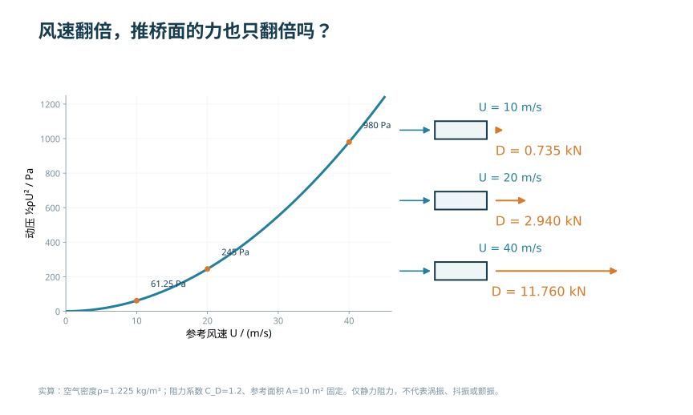
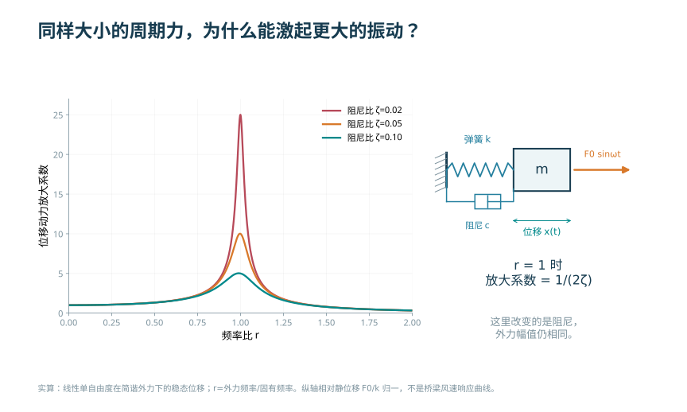
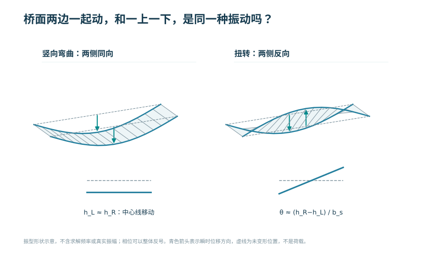
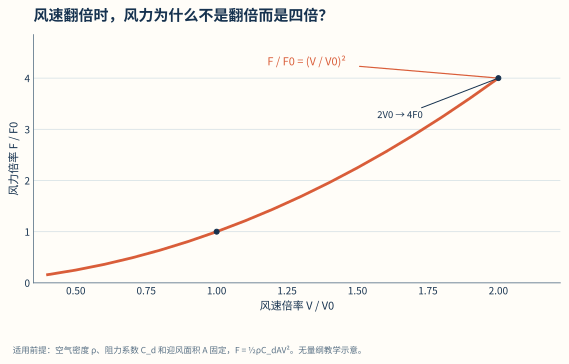
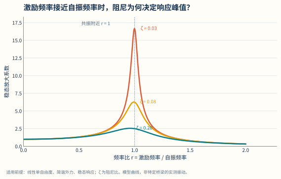

# 桥梁抗风与气动响应

<!-- CORE-ROUTE START -->
<div class="core-route" id="core-route">
<!-- VISUAL-ENTRY START -->
<div class="chapter-visual-entry"><p>先从一个看得见的问题开始</p><h3>风速增加一倍，桥的晃动幅度也会增加一倍吗？</h3><p>选择一个现象并改变风速，观察平均偏移、晃动节奏和幅值怎样变化。</p><a href="../interactive/learning-map.html?chapter=ch09-wind">看图进入实验 →</a></div>
<!-- VISUAL-ENTRY END -->
<!-- PRIORITY-CHAPTER-GALLERY START -->
<details class="priority-chapter-gallery"><summary>从本章的 3 幅新图开始</summary><div class="priority-thumb-grid"><a href="#fig-priority-F33"><span>风速翻倍，推桥面的力也只翻倍吗？</span></a><a href="#fig-priority-F34"><span>同样大小的周期力，为什么能激起更大的振动？</span></a><a href="#fig-priority-F35"><span>桥面两边一起动，和一上一下，是同一种振动吗？</span></a></div></details>
<!-- PRIORITY-CHAPTER-GALLERY END -->

<h2>本章的核心思考</h2><p class="core-thesis">用无量纲比值组织风与动力问题。</p><ol><li>声明气动系数条件，再用风速平方律。</li><li>用频比和阻尼比区分静力、共振与抑振。</li><li>用雷诺数、弗劳德数反问模型的相似条件。</li></ol><div class="core-analogy"><h3>跨课程类比</h3><p>动力学单自由度 → 桥梁模态响应；量纲分析 → 风洞相似</p><p><strong>反例与边界：</strong>简谐稳态不是地震反应谱；固定斯特劳哈尔数不能预测锁定幅值或颤振。</p></div><p>建议课堂集中完成标为“课堂核心”的3个单元，其余单元用于课前观察和课后迁移。每个单元配独立短视频、操作实验、目标检验与开放论证题。</p><div class="core-unit-grid"><article><p class="core-tag">C09U01 · 课堂核心</p><h3>风力为什么跟风速平方有关</h3><p>固定气动系数、空气密度与迎风面积时，风力随风速平方变化。</p><p><a href="../interactive/core-learning.html?unit=C09U01" target="_blank">操作与迁移任务</a> · <a href="../interactive/core-learning.html?unit=C09U01&amp;view=video" target="_blank">观看短视频</a></p></article><article><p class="core-tag">C09U02 · 课前/课后迁移</p><h3>改变尺寸也改变受风面积</h3><p>保持面压力不变而几何相似放大时，线荷载随桥宽一次增长，而弯曲应力保持不变。</p><p><a href="../interactive/core-learning.html?unit=C09U02" target="_blank">操作与迁移任务</a> · <a href="../interactive/core-learning.html?unit=C09U02&amp;view=video" target="_blank">观看短视频</a></p></article><article><p class="core-tag">C09U03 · 课前/课后迁移</p><h3>气动系数是条件，不是常数真理</h3><p>系数变化能显著改变风力，固定系数平方律只是在指定条件下的模型。</p><p><a href="../interactive/core-learning.html?unit=C09U03" target="_blank">操作与迁移任务</a> · <a href="../interactive/core-learning.html?unit=C09U03&amp;view=video" target="_blank">观看短视频</a></p></article><article><p class="core-tag">C09U04 · 课前/课后迁移</p><h3>质量与刚度共同决定频率</h3><p>质量固定时，频率随刚度平方根增加。</p><p><a href="../interactive/core-learning.html?unit=C09U04" target="_blank">操作与迁移任务</a> · <a href="../interactive/core-learning.html?unit=C09U04&amp;view=video" target="_blank">观看短视频</a></p></article><article><p class="core-tag">C09U05 · 课堂核心</p><h3>共振用频率比辨认</h3><p>响应峰值靠近频比为一的位置，位置和高度还受阻尼影响。</p><p><a href="../interactive/core-learning.html?unit=C09U05" target="_blank">操作与迁移任务</a> · <a href="../interactive/core-learning.html?unit=C09U05&amp;view=video" target="_blank">观看短视频</a></p></article><article><p class="core-tag">C09U06 · 课前/课后迁移</p><h3>阻尼降低共振附近的稳态放大</h3><p>增加阻尼可以降低稳态放大峰，但静力柔度仍由刚度决定。</p><p><a href="../interactive/core-learning.html?unit=C09U06" target="_blank">操作与迁移任务</a> · <a href="../interactive/core-learning.html?unit=C09U06&amp;view=video" target="_blank">观看短视频</a></p></article><article><p class="core-tag">C09U07 · 课前/课后迁移</p><h3>涡脱落频率也有尺度关系</h3><p>固定斯特劳哈尔数的模型中，脱落频率与流速成正比、与特征尺寸成反比。</p><p><a href="../interactive/core-learning.html?unit=C09U07" target="_blank">操作与迁移任务</a> · <a href="../interactive/core-learning.html?unit=C09U07&amp;view=video" target="_blank">观看短视频</a></p></article><article><p class="core-tag">C09U08 · 课堂核心</p><h3>几何相似不等于动力相似</h3><p>在同流速下改变尺寸，会同时改变雷诺数与弗劳德数。</p><p><a href="../interactive/core-learning.html?unit=C09U08" target="_blank">操作与迁移任务</a> · <a href="../interactive/core-learning.html?unit=C09U08&amp;view=video" target="_blank">观看短视频</a></p></article><article><p class="core-tag">C09U09 · 课前/课后迁移</p><h3>气动措施与结构措施分开比较</h3><p>改变截面气动系数属于减小作用，增加结构阻尼属于改变响应。</p><p><a href="../interactive/core-learning.html?unit=C09U09" target="_blank">操作与迁移任务</a> · <a href="../interactive/core-learning.html?unit=C09U09&amp;view=video" target="_blank">观看短视频</a></p></article><article><p class="core-tag">C09U10 · 课前/课后迁移</p><h3>从风洞到计算都要验证假定</h3><p>数值加密只检查离散误差，不能证明湍流模型与边界条件已经真实。</p><p><a href="../interactive/core-learning.html?unit=C09U10" target="_blank">操作与迁移任务</a> · <a href="../interactive/core-learning.html?unit=C09U10&amp;view=video" target="_blank">观看短视频</a></p></article></div><p><a href="../core-thinking.html">返回全书核心思维与尺度规律</a> · <a href="../core-resources.html">查看110个教学单元总索引</a> · <a href="../interactive/thinking-analogies.html">打开跨课程并排类比</a></p></div>
<!-- CORE-ROUTE END -->


::: {.chapter-objectives}
**学习目标。** 完成本章学习后，学生应能够：说明平均风、脉动风和桥位风环境的基本含义；由风速平方关系判断静风荷载的数量级；区分静风效应、抖振、涡激振动、驰振与颤振的激励机制和评价指标；由质量、刚度、阻尼、振型和气动外形解释桥梁风致响应；建立桥面节段、全桥和施工阶段的分层分析方案；说明风洞试验、计算流体力学和现场监测各自能够回答的问题；根据证据选择结构、气动与机械控制措施。
:::

::: {.source-note}
**本章定位。** 本章把原综合专题中的抗风内容独立展开，作为材料力学、结构动力学、桥梁体系和试验技术的交叉单元。公式用于说明基本物理关系；具体风参数、验算方法、临界状态和安全系数应按项目采用的现行桥梁抗风标准及专项研究确定。
:::

<div class="chapter-video-strip"><figure class="chapter-video-card"><video controls preload="metadata" playsinline poster="../assets/videos/manim/posters/M12_modal_resonance.png" src="../assets/videos/manim/M12_modal_resonance.mp4"></video><figcaption>M12　模态、频比与共振</figcaption></figure><figure class="chapter-video-card"><video controls preload="metadata" playsinline poster="../assets/videos/manim/posters/M13_wind_phenomena.png" src="../assets/videos/manim/M13_wind_phenomena.mp4"></video><figcaption>M13　风速平方律与风致现象</figcaption></figure></div>

## 风工程任务与桥梁体系


桥梁计算图常把风表示为一组静态箭头。这种表示适合说明平均压力的方向，却没有包含风速随时间和空间的变化，也没有表达结构运动对气动力的反馈。对于刚度较大、尺度较小的常规桥梁，等效静风分析可能控制构件或附属设施；对于大跨、柔性、轻型或施工状态特殊的桥梁，动力和气动稳定问题可能成为体系与截面的先决条件。

风作用的分析链可写为

$$
\text{区域气候}\rightarrow\text{桥位风场}\rightarrow
\text{截面气动力}\rightarrow\text{结构动力系统}\rightarrow
\text{响应与稳定}\rightarrow\text{设计措施}.
$$

链中任一环节都不能由一张风速图或一张流线云图代替。区域基本风速需转换到桥面高度和桥位地形；截面气动力随攻角、雷诺数和附属物变化；结构响应由质量、刚度、阻尼和振型决定；施工阶段的几何、边界和气动外形又与成桥不同。

#### 与材料力学和结构设计原理的联系

材料力学提供应力、变形、弯曲与扭转的基本关系。平均横风使桥塔和主梁产生侧向弯曲，偏心升力或力矩使桥面扭转；截面弯扭刚度 $EI$、$GJ$ 直接影响静力变形与动力频率。薄壁箱梁的剪切中心、翘曲和畸变属于从材料力学进入桥梁截面设计的重要接口。

结构设计原理把风作用效应与构件抗力、疲劳、稳定和正常使用限值连接。风致响应可能控制主梁应力、索塔弯矩、拉索振幅、桥面加速度、构件疲劳或施工稳定。抗风并不是独立于构件设计的附加校核，而是可能反向决定主梁宽高、扭转刚度、栏杆形式、导流构造和施工顺序。

#### “看得见并能操作”的概念组织

曼彻斯特大学 *Seeing and Touching Structural Concepts* 将静力概念按平衡、截面、弯曲、剪切与扭转、应力分布、跨度与挠度、直接传力路径、稳定、预应力等组织，又将动力概念按能量交换、自由振动、共振、阻尼和减振组织。其可借鉴之处不是网页外观，而是“概念—实体或动画示范—实际例子—学生再表达”的闭环。

本章相应采用四层页面：第一层只显示当前现象和一个可调参数；第二层显示结构与风的能量或力学关系；第三层展开方程、频谱和适用条件；第四层连接风洞、CFD或全桥分析。初学者不必一开始同时处理全部气动导数和多模态矩阵，已有动力学基础的读者可以直接展开第三、第四层。

## 桥位风环境与数据质量


#### 平均风与脉动风

瞬时风速可分解为平均分量和脉动分量：

$$U(t)=\overline U+u'(t).$$

$\overline U$ 为选定平均时距内的平均风速，$u'(t)$ 为围绕平均值的波动。脉动风的标准差 $\sigma_u$ 与平均风速之比可定义纵向湍流强度

$$I_u=\frac{\sigma_u}{\overline U}.$$

相同平均风速并不意味着相同动力输入。沿海开阔地、城市建筑群、山谷和峡谷具有不同湍流、风向和空间相关性。长桥上不同位置的脉动风也不完全同步，需要通过相干函数或多点随机过程表示。

#### 高度、地表与地形

风速随高度的变化可用幂律或对数律描述。概念阶段常写为

$$
\overline U(z)=\overline U(z_r)\left(\frac{z}{z_r}\right)^\alpha,
$$

其中 $z_r$ 为参考高度，$\alpha$ 与地表粗糙度有关。该式的参数和适用范围按采用标准。山口、峡谷、陡坡、海岸和邻近高层建筑会产生加速、偏转或局部湍流，复杂桥位可能需要地形风洞或经过验证的数值模拟。

#### 风向与攻角

来流相对桥轴的水平夹角和相对桥面的竖向攻角都会改变阻力、升力和力矩。桥面纵坡、地形上升流、车辆和栏杆也会改变有效攻角。抗风研究不应只计算正横风；应在规范或专项规定的风向与攻角范围内识别控制状态。

#### 风速样本与统计量

风速记录应首先说明测点高度、采样频率、记录时长、仪器类型和平均时距。设离散记录为 $U_i$，样本数为 $n$，则平均风速与脉动风标准差可分别写为

$$
\overline U=\frac{1}{n}\sum_{i=1}^{n}U_i,
\qquad
s_u=\sqrt{\frac{1}{n-1}\sum_{i=1}^{n}(U_i-\overline U)^2}.
$$

式中，$\overline U$ 和 $s_u$ 的单位均为 m/s。计算湍流强度时，平均值和标准差必须来自相同测点、相同方向和相同时间窗口。若将10 min平均风速与数秒阵风的标准差直接相除，所得指标不具有明确统计含义。

风速是矢量。桥位记录通常需分解为顺风向 $u$、横风向 $v$ 和竖向 $w$ 三个脉动分量，并同时保存平均风向。对于跨度较大的桥梁，只在岸边设置一个测点难以表示跨中、桥塔附近及不同高度的风场差异；测点布置应由地形、桥轴方向和目标模态共同确定。

#### 极值风速与重现期

桥梁抗风设计需要从有限年限观测推断较低超越概率的极值风速。若以年最大风速为样本，一种教学性表示是I型极值分布

$$
F_U(u)=\exp\left[-\exp\left(-\frac{u-b}{a}\right)\right],
$$

其中 $F_U(u)$ 为年最大风速不超过 $u$ 的概率，$a>0$ 为尺度参数，单位为 m/s，$b$ 为位置参数，单位为 m/s。若各年最大值近似独立且同分布，重现期 $T$ 对应的分位值可写为

$$
U_T=b-a\ln\left[-\ln\left(1-\frac{1}{T}\right)\right].
$$

$T$ 的单位为年。该式用于解释“观测期、概率模型与设计风速”的联系，不意味着所有桥位均应采用同一分布。台风区、非台风区、混合风气候和短期资料外推需要采用与资料相符的方法，并报告参数估计误差和置信区间。

**教学计算。** 取 $a=2.5\ \mathrm{m/s}$、$b=25.0\ \mathrm{m/s}$，可得50年和100年分位值约为34.8 m/s和36.5 m/s。这里的数值只用于核对公式和数量级，不是任何地区的规范设计风速。项目设计还需完成基准高度、平均时距、地表类别、地形和设计阶段之间的转换。

#### 相关函数、功率谱与空间相干

脉动风的自协方差可写为

$$
R_{uu}(\tau)=\mathrm E[u'(t)u'(t+\tau)],
$$

其单位为 $\mathrm{m^2/s^2}$。归一化自相关函数为 $\rho_{uu}(\tau)=R_{uu}(\tau)/R_{uu}(0)$。由自相关函数可定义积分时间尺度

$$
T_u=\int_0^\infty \rho_{uu}(\tau)\,\mathrm d\tau,
$$

并在冻结湍流近似下估计积分长度尺度 $L_u\approx \overline U T_u$。$T_u$ 的单位为 s，$L_u$ 的单位为 m。

一侧功率谱密度 $S_u(f)$ 满足

$$
\sigma_u^2=\int_0^\infty S_u(f)\,\mathrm df.
$$

若频率 $f$ 以 Hz 表示，则 $S_u(f)$ 的单位为 $(\mathrm{m/s})^2/\mathrm{Hz}$。任何风谱图都应同时写明横坐标是 $f$、圆频率 $\omega$ 还是无量纲频率，以及纵坐标是否经过归一化。缺少这些信息的曲线不能直接进入抖振计算。

跨径方向两点 $i$、$j$ 的平方相干函数可写为

$$
\gamma_{ij}^2(f)=
\frac{|S_{ij}(f)|^2}{S_{ii}(f)S_{jj}(f)},
\qquad 0\le \gamma_{ij}^2\le1,
$$

其中 $S_{ij}$ 为互功率谱。相干性随测点间距和频率增加通常会降低，因此长桥各处脉动风不能简单按完全同步加载。数字实验应允许改变测点间距、平均风速和相干衰减参数，显示全相关与部分相关输入对模态响应的差异。

::: {.source-note}
**规范依据。** 本章写作时核对的交通运输部官方发布版本为《公路桥梁抗风设计规范》JTG/T 3360-01—2018，自2019年3月1日起施行，并替代JTG/T D60-01—2004。链接：<https://xxgk.mot.gov.cn/jigou/glj/202006/t20200623_3313096.html>。上述极值分布和简化统计式用于教学解释；具体基本风速、设计风速、地表和地形参数应按项目采用的现行标准逐条确定，出版前再次核验标准状态。
:::

::: {.callout-note}
**候选图9-2　桥位风场的四层数据图。** 建议用课程组实测或开放数据重绘为四联图：风向玫瑰、年最大风速序列、脉动风功率谱、两测点相干函数。每一联均显示测点、单位、采样频率和统计窗口。若采用气象部门或工程项目资料，须取得数据使用许可；内部稿可先保留来源页和字段占位，不使用来源不明的网络截图。
:::

## 静风三分力、攻角与数量级


#### 风速平方关系


<!-- PRIORITY-FIGURE F33 START -->
{#fig-priority-F33 width=100% fig-alt="风速翻倍，推桥面的力也只翻倍吗？。固定气密度、阻力系数和面积时，风速10、20、40 m/s对应静力阻力0.735、2.940、11.760 kN；速度翻倍，动压和阻力均变为4倍。蓝色箭头示来流，橙色箭头示阻力。"}

<details class="figure-method"><summary>查看模型条件与绘图代码</summary><p>ρ、C_D、A固定；静力阻力D=½ρU²C_DA；未引入任何桥型专用系数或规范风速</p><p>课程组原创参数绘图 · F33 · <a href="../scripts/priority-figures/group_b.py">绘图 Python</a> · <a href="../scripts/priority-figures/figlib.py">公共绘图函数</a> · <a href="../assets/publication/priority-40/F33.png" download>下载 PNG</a> · <a href="../assets/publication/priority-40/F33.svg" download>下载 SVG</a></p></details>
<!-- PRIORITY-FIGURE F33 END -->


对给定参考面积和气动力系数，阻力可写为

$$
D=\frac12\rho U^2C_DA,
$$

升力和力矩常按单位桥长表示为

$$
L=\frac12\rho U^2BC_L,
\qquad
M=\frac12\rho U^2B^2C_M,
$$

其中 $\rho$ 为气密度，$U$ 为参考风速，$B$ 为桥面参考宽度，$C_D$、$C_L$、$C_M$ 为气动力系数。系数与截面、攻角、附属物和试验条件有关，不能把外形相似断面的数据直接当作项目值。

#### 坐标、参考尺寸和变量单位

桥面气动力公式只有在坐标和参考尺寸明确时才可复算。本章取 $x$ 沿桥轴，$y$ 沿桥面横向，$z$ 竖直向上；阻力 $D$ 沿来流的顺风方向，升力 $L$ 沿 $z$ 方向，气动力矩 $M$ 绕 $x$ 轴。不同规范、风洞机构和软件可能采用不同正方向，导入数据前必须转换到同一坐标系。

为避免把总力与单位长度力混淆，桥面断面常写为

$$
q=\frac12\rho U^2,
\qquad
D'=qHC_D,\quad
L'=qBC_L,\quad
M'=qB^2C_M,
$$

其中撇号表示单位桥长。变量及SI单位如下。

| 变量 | 含义 | SI单位 | 使用说明 |
|---|---|---|---|
| $\rho$ | 空气密度 | $\mathrm{kg/m^3}$ | 与温度、海拔和气压有关 |
| $U$ | 选定状态下的参考风速 | $\mathrm{m/s}$ | 必须写明高度、平均时距和转换关系 |
| $q$ | 速度压 | Pa或$\mathrm{N/m^2}$ | 由同一 $\rho$、$U$ 计算 |
| $B$ | 桥面参考宽度 | m | 常用于升力、力矩和约化频率 |
| $H$ | 迎风参考高度 | m | 常用于桥面阻力，具体定义按试验或标准 |
| $C_D,C_L,C_M$ | 阻、升、力矩系数 | 无量纲 | 正方向和参考面积必须与数据源一致 |
| $D',L'$ | 单位桥长气动力 | $\mathrm{N/m}$或$\mathrm{kN/m}$ | 进入总体结构模型前按单元长度离散 |
| $M'$ | 单位桥长气动力矩 | $\mathrm{N\,m/m}$或$\mathrm{kN\,m/m}$ | 绕桥轴，注意与节点总力矩区分 |

塔柱、拉索和吊杆的参考尺寸与桥面不同。例如圆柱或近圆柱构件通常以直径作为特征尺寸，桥塔可按投影宽度和分段高度计算。教材中的计算表应给每一类构件单独设置参考尺寸列，不把桥面宽度统一代入全部构件。

#### 静力系数随攻角的变化

气动力系数是攻角 $\alpha$ 的函数：

$$
C_D=C_D(\alpha),\qquad
C_L=C_L(\alpha),\qquad
C_M=C_M(\alpha).
$$

在参考攻角 $\alpha_0$ 附近，可以用局部线性展开说明变形反馈：

$$
C_M(\alpha_0+\Delta\alpha)
\approx C_M(\alpha_0)+
\left.\frac{\mathrm dC_M}{\mathrm d\alpha}\right|_{\alpha_0}\Delta\alpha.
$$

若桥面扭转角改变有效攻角，力矩系数斜率便会形成随位移变化的气动力矩。斜率的符号和大小与本章的攻角、扭转角和力矩正方向有关；使用风洞报告数据时，应先画出方向示意图再代入公式。

在气动力系数与参考面积不变的教学假定下，风速倍率与气动力倍率的平方关系见 @fig-ch09-wind-square。

{#fig-ch09-wind-square width=82%}

::: {.source-note}
**图源。** 课程组既有数字教材脚本生成，原数据文件为 `04-wind-speed-square-law.csv`。图中采用归一化参数，只说明其他条件不变时气动力随 $U^2$ 变化，不代表具体桥梁的设计风荷载。
:::

<div class="embed-wrap compact"><iframe loading="lazy" src="../interactive/bridge-concept-screen.html?lab=windforce" title="风速平方与静风力实验"></iframe></div>

风速从 $U_1$ 变为 $U_2$，若系数和面积暂视为不变，则

$$\frac{D_2}{D_1}=\left(\frac{U_2}{U_1}\right)^2.$$

这一关系适合建立数量感，但真实气动力系数可能随攻角、雷诺数和结构运动变化。风速平方说明输入幅值的增长，并不能单独解释为何某一较低风速区间出现显著涡振或为何颤振在临界风速后发散。

#### 静力响应与稳定

平均风作用下，桥面可能发生侧移和扭转。若气动力系数随变形后的攻角变化，气动力和结构变形相互影响。静风扭转发散可理解为气动负刚度抵消结构扭转刚度的失稳问题。概念上可写为

$$K_{\theta,\mathrm{eff}}(U)=K_\theta-K_{\theta,a}(U),$$

当有效刚度趋近零时，线性平衡解对扰动高度敏感。实际判定需采用截面气动导数或静力系数、结构几何非线性和规范规定方法。

对单一扭转自由度，若以广义扭转坐标 $\theta$ 表示，可写成

$$
I_\theta\ddot\theta+C_\theta\dot\theta+
\left[K_\theta-K_{\theta,a}(U)\right]\theta
=M_0(U),
$$

其中 $I_\theta$ 为广义转动惯量，单位为 $\mathrm{kg\,m^2}$；$C_\theta$ 为广义阻尼系数，单位为 $\mathrm{N\,m\,s/rad}$；$K_\theta$ 和 $K_{\theta,a}$ 分别为结构与气动扭转刚度，单位为 $\mathrm{N\,m/rad}$。由于 $K_{\theta,a}$ 常与 $U^2$ 成比例，有效刚度可能随风速增加而降低。实际全桥还需考虑侧弯、竖弯、扭转、索塔及几何非线性耦合。

静风稳定检查不等于只算一个“临界风速”。还应检查平均侧移、扭转角、塔顶位移、主梁和桥塔应力、支座反力、拉索索力变化及附属设施受力；对施工状态，需检查临时支承、吊装设备和未闭合截面的稳定。若采用线性等效静力分析，应说明为何可忽略变形后气动力和几何非线性。

::: {.callout-note}
**候选图9-3　静力系数—攻角—变形反馈。** 建议课程组以一套教学截面数据自绘三条系数曲线，并配一幅“来流—攻角—升力—力矩—扭转角”方向图。若曲线来自节段模型报告，图后须写明桥名、模型比例、附属物状态、湍流条件、试验机构和授权状态；不能只标“来源于风洞试验”。
:::

## 结构动力、模态与广义响应

::: {.callout-tip}
**每次都用同样的力推，为什么换一个节奏，晃动就变了？** 先把“力有多大”和“多久重复一次”分开。再看两个连在一起的物体：它们有哪些比较简单的共同运动？这是从一个振子走向桥梁模态的一条学习路径。

MIT李彦杰的[受迫振动课](../course-guide.qmd#v02)提供课堂演示与讲义；[耦合振子与模态课](../course-guide.qmd#v03)先从相连物体的运动出发，再讨论特殊振型。带着“哪些位置几乎不动、为什么”去看，再回到本节的振型图。零振幅不表示该处没有内力；这一线性小振动入口也不能替代颤振机制的解释。
:::


#### 单自由度模型


<!-- PRIORITY-FIGURE F34 START -->
{#fig-priority-F34 width=100% fig-alt="同样大小的周期力，为什么能激起更大的振动？。单自由度简谐稳态响应随频率比与阻尼改变。阻尼比0.02、0.05、0.10在r=1时的位移放大系数分别为25、10、5；该模型不直接描述桥梁颤振。"}

<details class="figure-method"><summary>查看模型条件与绘图代码</summary><p>线性单自由度，简谐力恒幅；已达稳态，不是启动瞬态；ζ&gt;0；忽略非线性</p><p>课程组原创参数绘图 · F34 · <a href="../scripts/priority-figures/group_b.py">绘图 Python</a> · <a href="../scripts/priority-figures/figlib.py">公共绘图函数</a> · <a href="../assets/publication/priority-40/F34.png" download>下载 PNG</a> · <a href="../assets/publication/priority-40/F34.svg" download>下载 SVG</a></p></details>
<!-- PRIORITY-FIGURE F34 END -->


结构自由振动与受迫振动的基本方程为

$$m\ddot x+c\dot x+kx=F(t).$$

无阻尼固有圆频率和阻尼比为

$$\omega_n=\sqrt{\frac{k}{m}},\qquad
\zeta=\frac{c}{2\sqrt{km}}.$$

简谐力频率 $\omega$ 与固有频率之比为 $r=\omega/\omega_n$。线性稳态位移动力放大系数为

$$
R_d=\frac{1}{\sqrt{(1-r^2)^2+(2\zeta r)^2}}.
$$

不同阻尼比下动力放大系数随频率比的变化见 @fig-ch09-dynamic-amplification。

{#fig-ch09-dynamic-amplification width=84%}

::: {.source-note}
**图源。** 课程组既有数字教材脚本生成，数据文件为 `05-single_dof_dynamic-amplification.csv`。曲线用于解释频率比和阻尼，不直接表示桥梁涡振或颤振响应。
:::

<div class="embed-wrap compact"><iframe loading="lazy" src="../interactive/bridge-concept-screen.html?lab=resonance" title="频率比、阻尼与动力放大实验"></iframe></div>

单自由度模型适合解释自由振动、共振和阻尼，却不能直接识别桥面竖弯—扭转耦合颤振。它是进入多自由度动力学的最小模型，也是检查数值程序方向和数量级的基准。

#### 多自由度与模态

全桥动力方程为

$$
\mathbf M\ddot{\mathbf u}+\mathbf C\dot{\mathbf u}+\mathbf K\mathbf u=\mathbf F(t).
$$

忽略阻尼和外力，可得到特征问题

$$
(\mathbf K-\omega_i^2\mathbf M)\boldsymbol\phi_i=\mathbf0.
$$

$\omega_i$ 为第 $i$ 阶固有圆频率，$\boldsymbol\phi_i$ 为振型。桥梁可能具有竖弯、侧弯、扭转、桥塔和拉索局部模态。振型是全桥空间运动形态，单个测点频谱不能完整确定振型。

#### 能量观点

一周期内，外部或运动相关气动力输入能量，结构阻尼消耗能量。若运动相关气动力的净输入超过结构耗散，振幅会增长。能量观点把共振、阻尼和颤振区分开：共振可以由外部周期力持续输入；颤振则包含结构运动对气动力的反馈，达到临界状态后等效气动阻尼可能变为负值。

#### 约化参数与量纲一致性

气动弹性结果常用无量纲参数表达。以桥面宽度 $B$ 为参考尺寸时，约化频率和约化风速可分别写为

$$
K=\frac{\omega B}{U},
\qquad
U_r=\frac{U}{fB}=\frac{2\pi}{K}.
$$

$K$、$U_r$ 均无量纲。研究拉索或钝体涡振时，也常以直径或高度 $D$ 代替 $B$。因此“约化风速为8”只有在说明特征尺寸和频率后才完整。

质量—阻尼参数可用Scruton数表示。一种常用定义为

$$
Sc=\frac{2m\zeta}{\rho D^2},
$$

其中 $m$ 为单位长度质量，单位为 kg/m；$\zeta$ 为阻尼比；$\rho D^2$ 同样具有 kg/m 的量纲，故 $Sc$ 无量纲。文献也可能用对数衰减率或不同常数定义质量—阻尼参数，比较试验结果前应统一定义，不应只比较数值大小。

#### 从单点频谱到模态证据

某测点出现清晰谱峰，只能说明该点在相应频率附近存在显著响应。识别全桥振型至少需要多个同步测点的幅值和相位；识别扭转运动，需要比较桥面两侧测点的反相程度；识别索振，还需区分局部索模态与全桥模态。阻尼可由自由衰减、随机减量、频响函数或系统识别获得，不同方法的估计偏差应进入结果说明。

## 涡振、抖振、驰振与颤振


风致现象应先按“输入是否随机、气动力是否由结构运动反馈、响应是否局限于一段风速、评价量是峰值还是稳定边界”分类，再选择计算或试验方法。

| 现象 | 主要输入或反馈 | 典型频率特征 | 随风速变化的典型表现 | 主要评价量 | 常用证据 |
|---|---|---|---|---|---|
| 平均静风 | 平均风产生的平均气动力 | 近似零频 | 响应通常随速度压增长 | 平均位移、内力、扭转角、静力稳定 | 静力系数、总体模型 |
| 抖振 | 大气湍流的随机脉动 | 宽频输入，经结构模态筛选 | 均方响应随风场与结构参数连续变化 | 标准差、峰值、疲劳与舒适性 | 风谱、相干、导纳、模态 |
| 涡激振动 | 周期脱涡与结构运动耦合 | 窄带，常接近某阶固有频率 | 在有限风速区间出现锁定和有限振幅 | 锁定区、最大振幅、加速度和疲劳 | 风速—振幅图、频率锁定 |
| 驰振 | 准定常气动力形成负气动阻尼 | 常由单一低阶模态控制 | 超过起振风速后振幅可能持续增大 | 起振条件、极限环振幅 | 静力系数斜率、响应分支 |
| 颤振 | 运动相关气动力与弯扭等模态耦合 | 一个或多个模态频率随风速靠近、耦合 | 有效阻尼趋零并转负，形成气动不稳定 | 颤振临界风速、临界振型、阻尼裕度 | 气动导数、节段／全桥气弹试验 |

表中的“典型表现”用于辨识，不替代项目判据。例如非线性涡振可能出现多稳态和滞回；单自由度扭转颤振与耦合颤振的模态特征也不同。

#### 抖振

抖振主要由自然风湍流的随机波动激励。输入包含一段频率范围和空间相关结构，桥梁以自身频率、振型和阻尼对其进行动力筛选。输出通常用位移、加速度和内力的均值、标准差或峰值表示。抖振分析需要风谱、相干、气动导纳和模态信息。

#### 涡激振动

钝体尾流交替脱涡的特征频率常用斯特劳哈尔关系表示：

$$f_s=St\frac{U}{D},$$

其中 $D$ 为特征尺寸，$St$ 为斯特劳哈尔数。当脱涡与结构振动相互耦合，可能在一段风速内出现锁定和有限振幅响应。越过锁定区后响应可能下降，因此涡振不是简单的“风越大振幅必越大”。桥面、拉索、吊杆和栏杆均可能发生涡振。

#### 颤振

颤振是运动相关气动力与结构振动耦合形成的自激不稳定。桥面竖弯和扭转模态可能耦合；气动力每周期向结构输入的能量超过阻尼耗散时，振幅发散。颤振临界风速取决于截面气动特性、质量、转动惯量、频率比和阻尼，需要节段模型风洞试验、气动导数和相应分析。

#### 驰振、抖振与其他现象

细长构件或非圆截面在一定气动力斜率条件下可能发生驰振；拉索还可能发生风雨振、尾流驰振和参数振动。车辆、行人和风也可能共同影响桥梁舒适性。现象命名必须以输入、频率、相位、振型和响应随风速变化的证据为基础，不应仅凭一段“桥在晃”的视频判定。

在准定常、小攻角和单自由度横风振动假定下，Den Hartog型筛查条件可写成

$$
\left.\frac{\mathrm d C_L}{\mathrm d\alpha}\right|_{\alpha_0}
+C_D(\alpha_0)<0.
$$

该条件表示气动力可能提供负阻尼，但其结论依赖坐标、系数正号、准定常假定和截面运动形式。桥面、拉索或附属构件的实际驰振分析还需考虑有限振幅、三维性、湍流和结构非线性，不能仅凭一条静力系数曲线下结论。

#### 抖振的频域表达

对某一广义坐标 $q$，线性频域分析可概念化写为

$$
S_q(\omega)=|H_q(\omega)|^2S_F(\omega),
\qquad
\sigma_q^2=\int_0^\infty S_q(\omega)\,\mathrm d\omega,
$$

其中 $S_F$ 为广义脉动风荷载功率谱，$H_q$ 为结构频率响应函数，$S_q$ 为响应谱。若用峰值因子 $g_p$ 从均方根响应估计峰值，可写为

$$
q_{\max}\approx \overline q+g_p\sigma_q.
$$

峰值因子不是固定常数，它与记录时长、带宽和超越概率有关。全桥抖振分析还需把不同位置的风速互谱、气动导纳和多个结构模态纳入，不能把单点风谱直接乘以静力影响线得到所有结果。

#### 颤振的二自由度框架

<!-- FORMULA-SCAFFOLD ch09-wind START -->
::: {.formula-scaffold}
**先看这个问题。** 把桥面先当作一个短节段：它既能上下移动，也能绕桥轴扭转。空气作用还会随着这些运动改变。我们要看两种运动怎样相互影响。

<div class="meaning-flow" role="img" aria-label="上下位移 h，然后扭转角 α，然后运动与气动力互相影响"><span>上下位移 h</span><span>扭转角 α</span><span>运动与气动力互相影响</span></div>
<details><summary>这组符号分别指什么？</summary><p>方程第一行管上下平衡，第二行管转动平衡。mh、Iα 是两类惯性，ch、cα 是阻尼，kh、kα 是刚度；Lse、Mse 是随运动变化的气动力和气动力矩。看见定性运动不等于已算出临界风速。</p></details>
:::
<!-- FORMULA-SCAFFOLD ch09-wind END -->

以竖向位移 $h$ 和扭转角 $\alpha$ 为广义坐标，桥面节段可写为

$$
\begin{bmatrix}
m_h&0\\0&I_\alpha
\end{bmatrix}
\begin{bmatrix}
\ddot h\\\ddot\alpha
\end{bmatrix}
+
\begin{bmatrix}
c_h&0\\0&c_\alpha
\end{bmatrix}
\begin{bmatrix}
\dot h\\\dot\alpha
\end{bmatrix}
+
\begin{bmatrix}
k_h&0\\0&k_\alpha
\end{bmatrix}
\begin{bmatrix}
h\\\alpha
\end{bmatrix}
=
\begin{bmatrix}
L_{se}\\M_{se}
\end{bmatrix}.
$$

$L_{se}$、$M_{se}$ 为与位移和速度有关的自激气动力。经典线性方法通过随约化频率变化的气动导数描述这些力。随风速增加求解复特征值，当某一模态的总阻尼降至零时得到线性颤振临界状态。气动导数依赖断面外形、攻角、附属构造和试验方法；只拥有静力 $C_D$、$C_L$、$C_M$ 时不能完成耦合颤振计算。

::: {.source-note}
**理论来源。** 桥面颤振导数的经典表达可追溯至 R. H. Scanlan 和 J. J. Tomko, “Airfoil and Bridge Deck Flutter Derivatives,” *Journal of the Engineering Mechanics Division*, vol. 97, no. 6, pp. 1717–1737, 1971, DOI: <https://doi.org/10.1061/JMCEA3.0001526>。本章只采用其通用理论框架并重新表述，不复制论文图表。
:::

::: {.callout-note}
**候选图9-4　五类风致现象的响应图谱。** 建议课程组统一生成五联图：平均位移—风速、抖振均方根—风速、涡振锁定区、驰振响应分支、颤振有效阻尼—风速。各图采用教学数据并明确“非同一座桥、不可比较绝对数值”，用于显示曲线形态和判据，不使用公开视频截图替代数据图。
:::

<div class="embed-wrap tall"><iframe loading="lazy" src="../interactive/ch09-wind-phenomena-lab.html" title="平均风、抖振、涡振与颤振辨识"></iframe></div>

::: {.digital-note}
**数字资源9-1　风致现象辨识。** 在统一桥面断面上切换平均静风、抖振、涡振与颤振，比较输入类型、频谱、锁定区和运动反馈。页面为定性教学模型，不输出工程临界风速。
:::

### 塔科马海峡桥案例

1940年塔科马海峡桥在投入使用数月后于风中倒塌，成为桥梁气动稳定研究的重要历史案例。教学中应区分事故前已观察到的竖向波动、倒塌当日的大幅扭转运动以及后续对气动弹性机制的认识发展，不能把全部现象简化为普通外力共振。

倒塌当日桥面大幅扭转运动的历史影像帧见 @fig-ch09-tacoma。

{#fig-ch09-tacoma width=82%}

::: {.source-note}
**图源（内部初稿）。** 原始影像由 Barney Elliott 拍摄，课程组既有资料按 CC0 影像帧制作；事件时间、桥梁参数和调查史以 Washington State Department of Transportation 的 Tacoma Narrows Bridge History 专页核对。正式出版前再次核实影像元数据和署名要求。
:::

这一案例的教学重点包括：结构跨度增加、加劲梁变浅和桥面变窄使体系更加柔；实桥观测发现的运动应通过风速、频率、振型和相位定量描述；事故后风洞试验和气动构造研究进入大跨桥梁设计；新桥采用更具通风性和扭转刚度的体系并辅以阻尼措施。历史资料本身包含不同阶段解释，教材应说明证据年代，不把早期“共振”表述直接等同于现代颤振理论。

#### 公开视频的使用方式

公开视频适合显示桥面竖弯、扭转、涡脱落、风洞模型和控制措施。每段视频前给出观察任务，例如“比较桥面两侧的相位”“记录响应明显增长所处风速区间”；视频后列出画面直接支持的事实和仍需补充的数据。视频不承担事故机理的单独证明，未经授权不截帧作为出版插图。

## 风洞试验、相似与不确定性


#### 节段模型

节段模型保留桥面典型截面及附属物，在二维近似流场中测量静力系数、涡振响应和气动导数。模型需满足几何、质量、转动惯量、频率和阻尼等相似要求。栏杆、检修道、导流板、车辆或施工设备是否安装会改变气动特性，试验报告必须记录。

#### 全桥气弹模型

全桥气弹模型表示主梁、桥塔和索的空间模态及沿桥变化风场，用于研究复杂地形、多模态和施工状态。模型尺度受风洞尺寸限制，相似关系和阻尼实现更困难。节段模型与全桥模型回答的问题不同，结果不应简单相互替代。

#### 试验可重复性

不同缩尺、风洞、来流湍流、阻尼和附属物可能产生不同结果。出现差异时，应比较试验条件和不确定性，而不是按机构权威度选择。建议保留原始时程、风速、攻角、阻尼、质量和模型构造，使关键曲线可复算。

#### 节段模型的相似参数与试验矩阵

节段模型并非只把桥面截面按比例缩小。若几何比例为 $\lambda_L=L_m/L_p$，下标 $m$、$p$ 分别表示模型与原型，则模型长度、宽度、栏杆、风嘴、检修道和中央分隔带应遵循一致的几何比例；弹性悬挂系统还需实现目标竖向和扭转频率、单位长度质量、质量惯量与阻尼。试验报告至少记录以下内容。

| 项目 | 需要记录的量 | 目的 |
|---|---|---|
| 几何 | 比尺、模型长度、阻塞比、端板、附属物状态 | 判断二维近似和细部模拟程度 |
| 流场 | 风速范围、攻角、湍流强度、积分尺度、温湿度 | 复现实验输入 |
| 竖向系统 | 质量、频率、阻尼、弹簧与导向机构 | 计算约化风速和质量—阻尼参数 |
| 扭转系统 | 转动惯量、扭转频率、阻尼、转轴位置 | 识别弯扭耦合和颤振状态 |
| 测量 | 位移、加速度、气动力、采样频率和时长 | 形成可追溯时程与频谱 |
| 工况 | 栏杆、车辆、风嘴、导流板、检修车、施工状态 | 判断细部改变的影响 |

几何相似容易理解，但雷诺数、质量比、频率比和阻尼不一定能够同时完全相似。针对静力系数、涡振、气动导数或颤振，不同试验目的对相似参数的敏感程度不同。报告应说明未能满足的相似条件及其可能影响。

建议试验矩阵按四步展开：先做无风自由衰减，识别频率和阻尼；再做静力测力，得到系数随攻角的曲线；随后在弹性悬挂状态逐级升、降风速，记录涡振锁定区与滞回；最后进行自由振动或强迫振动试验，识别自激力参数并判断颤振。每次改变构造措施后，应重复最少基准工况，而不是只测试预期有利的攻角。

::: {.source-note}
**试验方法参考。** R. H. Scanlan, “Aeroelastic Simulation of Bridges,” *Journal of Structural Engineering*, vol. 109, no. 12, pp. 2829–2837, 1983, DOI: <https://doi.org/10.1061/(ASCE)0733-9445(1983)109:12(2829)>，系统讨论了节段、局部和全桥模型及层流、湍流条件下的桥梁气弹试验。引用其方法分类，不复制受版权保护的图表。
:::

#### 全桥气弹模型的层级与检查

全桥气弹模型需要同时近似整体几何、质量分布、刚度分布、主要频率、振型和阻尼。斜拉索、主缆、吊索和桥塔对低阶模态有显著贡献时，不能只用一根均匀梁代表。对于施工状态，还要改变梁段长度、临时支承和未安装构件。

全桥试验前应把模型的无风模态与原型有限元目标逐阶对照，至少比较频率、振型形态和广义质量的主要差异；试验后再把抖振和稳定结果与频域／时域计算对照。若二者不一致，应追踪风场、阻尼、模态截断、附属物、传感器和数据处理，而不把全桥模型结果视为无需解释的“最终答案”。

节段模型适合高效率比较多个断面方案，全桥模型适合检查空间相关、地形影响和多模态总体行为。二者之间还可采用多节段、条带或气弹骨架模型。教材应以“问题—模型—相似条件—可测结果”选择试验类型。

::: {.source-note}
**全桥试验参考。** T. Wu, S. Li, and M. Sivaselvan, “Real-Time Aerodynamics Hybrid Simulation: A Novel Wind-Tunnel Model for Flexible Bridges,” *Journal of Engineering Mechanics*, vol. 145, no. 9, 2019, DOI: <https://doi.org/10.1061/(ASCE)EM.1943-7889.0001649>。该文说明传统节段与全桥模型的用途及混合模拟思路。本章只用于建立模型层级，不复用论文插图。
:::

::: {.callout-note}
**候选图9-5　节段模型与全桥气弹模型。** 内部稿可先放两类试验装置照片占位，图下注明实验室、项目、拍摄者、年份、网页或报告页码。正式出版优先采用课程组自有风洞照片；若引用高校或工程机构网页照片，应取得书面许可或仅链接原页面。
:::

## CFD建模与验证确认


CFD可以显示压力、流线、涡量和非定常气动力，有利于理解分离、再附和参数变化。数值结果依赖计算域、入口湍流、边界、网格、时间步和湍流模型。一张瞬时云图只表示特定模型与时刻，不能直接证明工程安全。

基本验证流程包括：对同一截面计算两个以上网格和时间步；检查平均阻力、升力、力矩及其频谱是否收敛；比较尾流主频是否随风速合理变化；与公开基准或风洞结果对照；明确二维和三维模型的差异。若目标是颤振，还需进行流固耦合或由强迫振动识别气动导数，刚性静止截面模拟不能单独完成。

#### CFD问题定义

数值模拟开始前应把目标写成可检验的问题。例如，“比较两种风嘴对零攻角平均力矩系数的影响”与“预测三自由度颤振临界风速”需要完全不同的计算域、边界、网格、运动模型和验证证据。常见层级包括：稳态RANS求平均系数；非稳态RANS或尺度分辨模拟求非定常压力和脱涡；强迫振动识别运动相关气动力；双向流固耦合直接模拟结构运动。

不可把更复杂的湍流模型自动等同于更可靠的工程结果。数值耗散、入口湍流、近壁处理、二维假定和计算时长都可能改变气动力。模型选择应由目标频率、分离特征、可用算力和验证资料共同决定。

#### 网格、时间步和统计收敛

网格检查至少选择粗、中、细三组在壁面、风嘴、栏杆和尾流区域有系统变化的网格。若只增加远场无关单元而关键剪切层分辨率不变，不能称为有效网格收敛。时间步应根据无量纲时间步、Courant数和目标频率确定，并报告每一脱涡周期内的时间步数。

瞬态解达到统计稳定前的数据应舍弃。平均系数、均方根系数和主频需要在足够多个周期上统计，并用不同时间窗口检查变化。若升力均值接近零，相对误差可能失去意义，应同时报告绝对差值。

CFD验证表建议包含：

1. 几何与附属物是否和试验模型一致；
2. 计算域边界距离与阻塞比；
3. 入口速度、湍流强度、长度尺度和风向；
4. 壁面条件、湍流模型及近壁分辨率；
5. 网格数量、关键部位尺寸和质量指标；
6. 时间步、总时长、舍弃时段和统计时段；
7. $C_D$、$C_L$、$C_M$ 的均值、均方根和频谱；
8. 斯特劳哈尔数、压力分布和主要流动结构；
9. 与风洞或公开基准的误差；
10. 二维／三维、刚性／运动模型和缩尺效应的限制。

#### 验证、确认和不确定性

计算验证回答离散方程是否被足够准确地求解，模型确认回答所用物理模型能否代表目标试验或实桥。前者依赖网格、时间步、残差、守恒和代码测试；后者依赖与风洞、理论或现场数据比较。两类工作不能由一张“云图相似”合并。

若多个数值设置都能给出相近平均阻力，但升力谱峰、相位或气动导数差异明显，应按目标现象选择判据。用于静风的模型通过平均系数验证，不代表它已经适用于涡振或颤振。教材算例应把“已验证量”和“尚未验证量”分栏列出。

::: {.source-note}
**CFD参考。** K. C. S. Kwok 等桥梁风工程研究通常强调风洞和数值模型的互补；本章采用可复现数值模拟的一般验证框架。关于风洞与CFD比较，可参见开放综述 “Wind-Induced Phenomena in Long-Span Cable-Supported Bridges: A Comparative Review of Wind Tunnel Tests and Computational Fluid Dynamics Modelling,” *Applied Sciences*, vol. 11, no. 4, 1642, 2021, <https://doi.org/10.3390/app11041642>。正式教材不直接复制文中图片。
:::

::: {.callout-note}
**候选图9-6　同一断面的多证据对照。** 建议自绘“风洞压力测点—CFD表面压力—平均系数曲线—尾流主频”四联图。数据若来自课程组研究，应写明项目和数据责任人；若取自公开论文，仅在开放许可允许的范围内使用，并在图注给出DOI与许可，不以重新配色替代授权。
:::

## 抗风措施、施工与运营监测


抗风措施分为结构措施、气动措施和机械控制。结构措施改变质量、弯曲或扭转刚度和频率；气动措施改变截面周围流动，如开槽、导流板、稳定板、风嘴或栏杆优化；机械措施增加阻尼或控制力，如黏滞阻尼器、调谐质量阻尼器和拉索减振器。

措施选择先明确所针对现象。增加阻尼可能有效降低共振或涡振峰值，却不能自动解决所有颤振问题；加大刚度改变频率和临界风速，也会增加材料和地震力；气动构造可能改善一个攻角，却需检查其他风向及施工阶段。设计应形成“问题—机理—参数—措施—证据”表。

#### 措施比较与验证闭环

| 措施类别 | 直接改变的量 | 可能改善的现象 | 必须同时检查的问题 |
|---|---|---|---|
| 增大弯曲或扭转刚度 | 频率、振型和静力变形 | 静风变形、部分涡振或颤振状态 | 自重、地震作用、材料量、连接和施工 |
| 调整质量与转动惯量 | 质量比、频率比和惯性耦合 | 涡振、颤振和舒适性 | 结构受力、施工设备和长期附加重量 |
| 增加结构阻尼 | 总阻尼和共振峰 | 涡振、抖振、拉索振动 | 阻尼器行程、耐久、温度和维护 |
| 风嘴、导流板、稳定板或开槽 | 静力系数、分离点和自激力 | 静风、涡振、抖振或颤振 | 雨水、积雪、检修、噪声和不同攻角 |
| 栏杆、护栏和检修道优化 | 细部绕流和有效攻角 | 涡振、力矩和局部风环境 | 交通安全、通透率、结冰和运营状态 |
| 拉索表面与减振装置 | 拉索气动外形、阻尼和边界 | 风雨振、涡振和参数振动 | 疲劳、锚固、安装偏差和更换 |

措施验证遵循“基准状态—单项改变—同一测试矩阵—多指标比较—最不利状态复核”。例如导流板使零攻角颤振临界风速提高时，还应检查负攻角、施工期未安装导流板状态、涡振振幅、静力系数和维护可达性。只展示有利的一条曲线会掩盖设计代价。

### 施工阶段与运营监测

裸塔、大悬臂、未合龙梁段、猫道和主缆架设阶段的刚度、阻尼及气动外形与成桥不同。施工期虽短，也可能遭遇强风。施工组织应规定临界作业风速、停工条件、临时拉索或支承、设备固定和预警流程；专项分析覆盖最不利暴露状态。

运营监测可记录风速风向、桥面加速度、位移、应变、拉索振动和温度。数据解释先校核传感器、采样率、时钟和缺测，再由频谱、振型与阻尼辨识现象。报警阈值需要结合正常环境基线和工程限值，不能把单点峰值直接等同于结构异常。

#### 施工阶段抗风状态表

施工期抗风首先建立阶段清单，而不是直接套用成桥模型。建议至少包括：

1. 独立桥塔达到最大自由高度；
2. 最大单悬臂或双悬臂尚未合龙；
3. 斜拉桥某侧索未张拉或张拉不同步；
4. 悬索桥猫道、主缆、吊索和首个梁段安装；
5. 加劲梁架设至最不利不对称长度；
6. 临时支承拆除与体系转换；
7. 栏杆、风嘴、导流板和铺装尚未形成最终断面；
8. 吊机、架桥机、挂篮、临时平台和材料堆载处于工作或停放状态。

每个阶段记录持续时间、可能季节、结构几何、边界、质量、阻尼、频率、气动外形、临时措施和允许工况。若阶段持续时间很短，可以采用相应概率水平的施工期风速，但具体取值仍由现行标准和项目风险确定；不能因为“只持续数天”便省略抗风分析。

临时拉索或支承既可能提高某方向刚度，也可能引入新的局部模态或不利约束。停工风速应与测风位置、平均时距、阵风换算和设备制造商限制相一致。现场预警至少形成“测量—转换—阈值—责任人—动作—恢复条件”的闭环。

#### 监测系统与数据质量

抗风监测可分为环境、结构响应和状态信息三组。

| 信息组 | 典型测量 | 单位或数据形式 | 主要用途 |
|---|---|---|---|
| 环境 | 三维风速、风向、温度、气压、降雨 | m/s、角度、°C、Pa、mm | 风场统计、风雨振辨识和空气密度修正 |
| 总体响应 | 加速度、位移、倾角、应变、支座反力 | $\mathrm{m/s^2}$、m、rad、应变、kN | 模态、抖振、涡振、静风与疲劳 |
| 局部状态 | 索力、阻尼器行程、锚固振动、视频 | kN、mm、$\mathrm{m/s^2}$、影像 | 拉索与控制装置性能 |
| 运维状态 | 交通、栏杆状态、检修车位置、施工活动 | 事件与时间戳 | 排除运营条件变化造成的混淆 |

数据质量检查包括量程、灵敏度、采样率、同步误差、漂移、缺失、异常跳变和传感器姿态。低频静风位移与高频索振需要不同传感器和采样设置。频谱出现峰值时，应排查采样混叠、设备自振和电源频率等非结构信号。

#### 事件识别与报警

建议采用三级判读。第一层检查原始数据和设备状态；第二层提取10 min平均风、湍流强度、响应均方根、峰值、主频和阻尼；第三层与温度、交通、风向和历史基线联合分析。只有当环境输入、空间响应和模型预测相互支持时，才将事件解释为具体风致现象。

报警阈值可包含设备阈值、运营舒适性阈值、构件性能阈值和气动稳定安全阈值。不同阈值对应不同处置，如检查传感器、限制交通、停工、现场巡检或启动专项分析。教材案例不自行规定工程报警数值，而给出阈值制定所需的证据字段。

#### 控制装置的运行评价

阻尼器或调谐装置安装后，需要比较装置启用前后在相近风况下的响应，并结合模型修正风速、风向和交通差异。评价量包括等效阻尼、峰值响应、累计疲劳、装置行程、温度和维护记录。若只选择一次有利事件比较，可能把风况差异误判为控制效果。

::: {.callout-note}
**候选图9-7　施工阶段抗风状态序列。** 建议采用课程组MIDAS模型或自绘线图，依次显示裸塔、最大悬臂、合龙前和成桥四个状态，并在每幅图旁列出频率、阻尼、迎风面积和临时约束。若使用工程项目施工照片，内部稿保留来源，正式出版需项目单位及摄影权利人授权。
:::

::: {.callout-note}
**候选视频9-1　一次强风事件的数据回放。** 画面依次显示风速风向、桥面两侧加速度、时频图和模态动画，旁白只解释可由数据支持的事实。优先采用课程组自有监测数据；若无开放数据，则用明确标注的合成信号演示，不把公开视频中的晃动画面当作监测数据。
:::

### 桥位风数据链与质量控制

桥梁抗风计算不是从输入一个设计风速开始，而是从说明这个风速如何获得、代表什么统计量开始。区域气象资料、桥址短期观测、地形修正、桥面高度换算和设计状况选择构成一条连续的数据链。链上任何一次平均、插值或换算都会改变结果含义，因而应同时保存原始数据、处理参数和版本记录。

#### 数据源层级与用途

不同来源的数据不能简单按记录长度排序。区域气象站能够提供较长的气候序列，却可能远离桥址或处在不同地表条件；桥址测风能够反映局部地形和桥面高度，但记录年限通常较短；再分析资料空间连续，适合识别大尺度天气过程，却不能直接替代桥址近地风；风洞与CFD可以研究复杂地形中的局部加速和偏转，但其入口与边界仍需由观测资料约束。建议按下表组织证据。

| 数据层 | 典型来源 | 时间与空间特点 | 可支持的任务 | 不能单独支持的结论 |
|---|---|---|---|---|
| 区域长期资料 | 国家气象站、机场站、海洋站 | 年限长，桥址代表性需核查 | 风向气候、年最大序列、台风路径背景 | 桥面高度的局部阵风和跨桥相干 |
| 桥址专项观测 | 测风塔、激光雷达、超声风速仪 | 位置针对性强，年限可能较短 | 地形增速、湍流、竖向风、方向性 | 长重现期分位值的独立稳定估计 |
| 数值再分析 | 业务或科研再分析格点 | 时空连续，分辨率有限 | 天气过程分类、缺测辅助、区域一致性 | 山谷、桥塔附近的细尺度绕流 |
| 地形模型 | 地形风洞或经确认的CFD | 可控制来流和风向 | 桥位增速、偏转、不同塔位差异 | 与入口无关的绝对设计风速 |
| 施工与运营监测 | 塔吊风速计、桥上长期监测 | 与结构状态同步 | 事件复核、模型更新、预警 | 未经历过的极端状况本身 |

数据汇总表至少包含数据责任机构、站号或测点号、经纬度、海拔、仪器高度、地表类别、仪器型号、采样频率、平均时距、时间基准、缺测率和质量标志。若站点发生迁移、仪器更新或周边建筑变化，应把记录分段处理。只保存一列风速而删除站点历史，会使后续极值分析难以判断突变来自气候还是观测条件。

美国国家海洋和大气管理局NCEI的Integrated Surface Database示例说明，长期地面资料通常把来自多种观测系统的数据统一到公共格式，并保留风速、风向、阵风及质量控制字段；其Station Histories页面还专门保存站名、位置、设备和观测条件变化。这里引用这两类页面是为了说明“观测值与元数据必须成对保存”，并不把国外数据直接用作中国桥址设计输入。

::: {.source-note}
**数据管理参考。** NOAA National Centers for Environmental Information, Integrated Surface Database：<https://www.ncei.noaa.gov/products/land-based-station/integrated-surface-database>；Station Histories：<https://www.ncei.noaa.gov/products/land-based-station/station-histories>。页面用于数据字段和质量控制方法参考。若正式教材采用页面图示或数据样本，应另行核对美国政府作品范围、页面中第三方内容及具体数据许可；本章不复制页面图片。
:::

#### 从仪器坐标到桥梁坐标

三维测风仪常输出仪器坐标下的速度分量 $(u_s,v_s,w_s)$。桥梁分析需要转换到以桥轴、桥面横向和竖向为基准的坐标。设仪器水平零向与桥轴的夹角为 $\psi_0$，忽略仪器倾斜时，可写为

$$
\begin{bmatrix}
u_x\\u_y\\u_z
\end{bmatrix}
=
\begin{bmatrix}
\cos\psi_0&-\sin\psi_0&0\\
\sin\psi_0& \cos\psi_0&0\\
0&0&1
\end{bmatrix}
\begin{bmatrix}
u_s\\v_s\\w_s
\end{bmatrix}.
$$

$u_x,u_y,u_z$ 的单位均为m/s。若仪器支架存在滚转角、俯仰角，需采用完整三维旋转矩阵，并由安装测量或静态标定确定角度。对每一个统计窗口，可由水平平均分量确定来流偏角

$$
\beta=\operatorname{atan2}(\overline u_x,\overline u_y),
$$

具体正方向以项目坐标定义为准。使用 $\operatorname{atan2}$ 而不是单纯反正切，可以保留象限信息。桥面攻角可由平均竖向分量和水平合速度估计：

$$
\alpha_w=
\tan^{-1}
\left[
\frac{\overline u_z}
{\sqrt{\overline u_x^2+\overline u_y^2}}
\right].
$$

测风仪倾斜误差可能被误判为稳定的竖向风。桥址观测报告应给出零漂、支架姿态和坐标旋转方法。对于斜交风，气动力系数使用的是断面有效来流，而不是气象学风向的原始读数；桥轴方位角、风向定义“风从何处来”还是“速度指向何处”也应统一。

#### 平均时距、阵风与统计口径

平均风速是带时间尺度的统计量。若连续速度为 $U(t)$，长度为 $T_a$ 的移动平均可写为

$$
\overline U_{T_a}(t)
=\frac{1}{T_a}
\int_{t-T_a}^{t}U(\tau)\,\mathrm d\tau .
$$

$T_a$ 的单位为s。不同平均时距会得到不同峰值，不能把短时阵风与长时平均风直接比较。阵风系数可定义为

$$
G_{T_g,T_a}
=
\frac{U_{\max,T_g}}{\overline U_{T_a}},
$$

其中 $U_{\max,T_g}$ 是由持续时间 $T_g$ 的短时平均得到的最大值。任何阵风系数都应同时标注 $T_g$ 与 $T_a$。气象观测系统自身的报告算法也可能不同，例如美国国家气象局ASOS页面说明其风向、风速与阵风采用特定的更新和平均方式。该例表明，在桥位数据合并前必须核对观测定义，而不能只按列名“wind speed”拼接。

::: {.source-note}
**平均口径参考。** U.S. National Weather Service, ASOS Wind Sensor：<https://www.weather.gov/asos/WindSensor.html>。该页面用于说明观测系统的平均与更新口径会影响数据含义，不作为我国桥梁设计风速取值依据。正式出版若使用示意截图需按网页许可办理，本章仅文字转述并保留链接。
:::

当区域站与桥址站的平均时距、测高或地表不同，应逐项转换而不是使用一个总的“修正系数”。一种便于审计的表达为

$$
U_{\mathrm{deck},T_a}(\theta)
=
U_{\mathrm{ref},T_r}(\theta)
\,K_T(T_r\!\rightarrow T_a)
\,K_z(z_r\!\rightarrow z_d,\theta)
\,K_{\mathrm{ter}}(\theta)
\,K_{\mathrm{dir}}(\theta),
$$

式中各 $K$ 为无量纲转换因子，分别对应平均时距、测高与地表、局部地形和方向性；$\theta$ 为风向扇区。此式采用数据链逐项分解形式，不指定任何规范系数。若项目标准把若干因素合并定义，应遵循该标准而避免重复计入。

#### 长短期资料联合与极端事件分类

桥址只有短期资料时，可与附近长期站建立同期关系。设桥址同期年或月极值为 $U_b$，参考站同期量为 $U_r$，可采用带截距的统计关系

$$
U_b=a_0+a_1U_r+\varepsilon ,
$$

其中 $a_0$ 的单位为m/s，$a_1$ 无量纲，$\varepsilon$ 为残差。回归应按风向或天气类型检验；山谷中的某一风向可能出现明显增速，而全风向回归会把它平均掉。需要报告样本量、残差分布、异常点处理、交叉验证误差以及外推范围。相关性高不等于极值尾部关系可靠，必要时应采用联合概率或区域频率方法。

台风、季风、雷暴下击暴流和局地峡谷风的形成机制、持续时间和方向分布不同。将不同母体无区别地拟合单一分布，可能使尾部推断失真。项目可依据天气记录、路径资料和风向—持续时间特征对事件分类，再分别估计年发生率和条件强度。若资料不足以稳定区分，应将模型选择作为不确定性来源，而不能通过增加小数位掩盖证据不足。

极值分析至少报告：样本选取方法、独立事件间隔、阈值或年最大定义、分布候选、参数估计方法、拟合诊断、重现水平及置信区间。重现期不是事件按固定年数出现的周期；对服役年限 $N$，若每年超越概率为 $p$ 且暂按年际独立，则至少一次超越的概率为

$$
P_N=1-(1-p)^N.
$$

该式用于解释年超越概率与寿命期风险的关系。实际设计状况和目标可靠度按采用标准确定。

#### 脉动风处理、谱估计与空间一致性

从原始时程得到风谱之前，先处理尖峰、掉线、结冰、量程饱和和时钟漂移。异常值不宜无记录地删除；建议保留原值、质量标志和修正值三列。若仪器响应带宽不足，所得高频谱衰减可能来自传感器而非真实湍流。桥面、塔顶与跨中多台仪器必须使用统一时钟，否则互谱相位与相干函数会失真。

离散风速序列 $u_n$ 的谱估计通常包含去均值或去趋势、分段、窗函数、重叠和平均。设采样间隔为 $\Delta t$，奈奎斯特频率为

$$
f_N=\frac{1}{2\Delta t}.
$$

目标气动或结构频率应低于 $f_N$ 并保留抗混叠裕度。长度为 $T_s$ 的数据段的基本频率分辨率约为

$$
\Delta f\approx\frac{1}{T_s}.
$$

增加段长提高低频分辨率，但减少可平均的独立段数；增加平均段数降低谱估计方差，却可能掩盖风场非平稳变化。数字教材应让学生同时看到时程、分段位置和谱，而不能只给最终平滑曲线。

两点互谱 $S_{ij}(f)$ 是复数，包含共同频率成分的幅值与相位。平方相干只表示线性相关程度，不保留传播相位。长跨桥抖振输入的构造应同时考虑自谱、互谱矩阵的共轭对称和半正定性。若经验相干模型使某些频率的谱矩阵不再半正定，随机场模拟会产生不可实现的协方差，应在生成阶段检查特征值。

#### 数据质量门槛与可追溯输出

桥位风数据进入设计前建议设置四道门槛。

1. **来源门槛：** 测点身份、位置、测高、时间基准、仪器和采样定义完整。
2. **质量门槛：** 缺测、越界、结冰、漂移、方向跳变和同步误差均有标志。
3. **统计门槛：** 平均时距、独立事件、非平稳分段、谱估计参数和置信区间明确。
4. **转换门槛：** 从参考站到桥面高度、从气象风向到桥梁坐标、从观测期到设计状况的每一步均可重算。

推荐的机器可读字段包括：记录标识、原始文件校验值、测点坐标、传感器姿态、单位、采样率、时区、处理脚本版本、质量标志字典、平均时距、风向扇区、转换因子来源、输出变量和不确定性。图表应由这些字段自动生成。若图中某个点无法追溯到原始时间段与处理版本，该图只能用于说明，不能作为项目判定证据。

::: {.callout-note}
**候选图9-8　从区域气象到桥面风场的数据血缘图。** 由课程组重绘六个节点：长期站、桥址短期站、事件分类、测高与地形转换、方向扇区、设计输入；每条箭头标出单位、平均时距和不确定性。可在交互版点击节点查看元数据和质量标志。图的知识依据为本节列出的官方数据管理页面与项目采用标准，不复制外部图形。
:::

### 静力三分力与攻角反馈

#### 风轴、桥轴和断面轴

桥面三分力常在风轴下测量：阻力沿平均来流，升力垂直来流，力矩绕桥轴。总体有限元模型则通常在全局桥轴坐标中加载。设水平来流与桥面横向的夹角为 $\beta$，风轴下单位长度阻力、横向力分别为 $D'_w$、$S'_w$，其全局水平分量可写成

$$
\begin{bmatrix}
F'_x\\F'_y
\end{bmatrix}
=
\begin{bmatrix}
\sin\beta&-\cos\beta\\
\cos\beta& \sin\beta
\end{bmatrix}
\begin{bmatrix}
D'_w\\S'_w
\end{bmatrix}.
$$

矩阵形式取决于风向正方向，上式只表示本章坐标约定。任何数据接口都应通过一个已知工况进行方向测试：例如正横风、正阻力应产生规定方向的整体侧移。若软件节点局部轴随曲线桥变化，还需逐单元转换。

桥面、塔柱与索采用不同参考尺寸。桥面常以宽度 $B$、迎风高度 $H$ 表示单位长度三分力；桥塔可按局部分段宽度 $b_t(z)$ 和投影高度；圆索以直径 $D_c$ 为特征长度：

$$
D'_c=\frac12\rho U_\perp^2D_cC_{D,c},
$$

其中 $U_\perp$ 为垂直于索轴的来流分量，单位为m/s，$D_c$ 为索外径，单位为m。斜索的偏航、倾角、表面螺旋线、雨水和相邻索尾流会使等效系数偏离理想圆柱结果。

#### 有效攻角

来流竖向攻角并不等于结构实际感受到的攻角。在线性、小转角近似下，可写成

$$
\alpha_{\mathrm e}(x,t)
=
\alpha_w(x,t)-\theta(x,t)
+\frac{\dot h(x,t)}{U}
+\alpha_g(x),
$$

其中 $\alpha_w$ 为来流攻角，$\theta$ 为桥面扭转角，$h$ 为竖向位移，$\dot h/U$ 是运动造成的附加来流角，$\alpha_g$ 表示桥面纵坡、预拱或局部几何方向。式中符号按本章“正扭转减小正攻角”的约定；采用其他约定时必须整体改写，不能只改变一项符号。对于较大运动或斜风，应由相对速度矢量直接计算，不再使用线性叠加。

平均静风分析可暂忽略 $\dot h/U$，但结构扭转与静力矩之间仍形成反馈。设单位长度气动力向量

$$
\mathbf f_a=
\begin{bmatrix}
D'&L'&M'
\end{bmatrix}^{\mathsf T},
$$

在参考状态附近对位移向量 $\mathbf q=[v,h,\theta]^{\mathsf T}$ 线性化：

$$
\mathbf f_a(\mathbf q,U)
\approx
\mathbf f_{a0}(U)+
\mathbf K_a(U)\mathbf q,
\qquad
\mathbf K_a=
\left.\frac{\partial\mathbf f_a}{\partial\mathbf q}\right|_{\mathbf q=0}.
$$

$\mathbf K_a$ 是单位长度气动刚度矩阵，其分量单位随自由度不同而变化，例如力对位移为N/m$^2$，力矩对转角为N·m/(m·rad)。总体离散后方可与结构刚度矩阵在一致自由度和单位下相减。

#### 静风非线性平衡与稳定检查

把气动力随变形更新后，静力平衡可写为

$$
\mathbf R(\mathbf u,U)
=
\mathbf K_s(\mathbf u)\mathbf u
-\mathbf F_g
-\mathbf F_a(\mathbf u,U)
=\mathbf0,
$$

其中 $\mathbf K_s(\mathbf u)$ 表示包含几何非线性影响的结构切线关系，$\mathbf F_g$ 为恒载等既有作用，$\mathbf F_a$ 为风荷载。牛顿迭代的切线矩阵为

$$
\mathbf K_{\mathrm{tan}}
=
\frac{\partial\mathbf R}{\partial\mathbf u}
=
\mathbf K_{\mathrm{str,tan}}
-\mathbf K_{\mathrm{a,tan}}.
$$

当切线矩阵最小特征值接近零，平衡路径可能发生极限点或分岔。此处“接近零”不是直接的工程判据；数值算法、载荷步、初始缺陷与边界条件都会影响求解。线性静风位移、几何非线性平衡和静力发散分析是三个层级，应按跨径、柔度和项目要求选择。

静风分析的输入输出检查表如下。

| 环节 | 输入 | 输出 | 核查重点 |
|---|---|---|---|
| 截面测力 | 断面、攻角、雷诺数、附属物 | $C_D,C_L,C_M$ 曲线 | 坐标、参考尺寸、重复性 |
| 空间映射 | 风向、高度、分段系数 | 单元单位长度三分力 | 风轴到单元轴转换 |
| 结构平衡 | 刚度、初始内力、支承 | 位移、内力、反力 | 二阶效应和索力更新 |
| 气动反馈 | 变形后攻角、系数插值 | 更新气动力 | 插值范围、超界处理 |
| 稳定判定 | 切线刚度、路径与扰动 | 临界状态与模态 | 网格、步长、初缺陷 |

#### 从单位长度力到有限元结点

对长度为 $l_e$ 的两节点梁单元，若单位长度横向气动力 $p(s)$ 在局部坐标 $s\in[0,l_e]$ 上分布，等效结点荷载为

$$
\mathbf f_e
=
\int_0^{l_e}\mathbf N^{\mathsf T}(s)p(s)\,\mathrm ds,
$$

$\mathbf N$ 为与该自由度一致的形函数矩阵。把 $p\,l_e/2$ 平分到两端只对均布荷载和相应低阶插值成立；空间非均匀风、曲线桥和多点相干输入需要按积分点处理。气动力矩还应分配到扭转自由度，不能用偏心竖向力重复计入力矩。

::: {.callout-warning}
气动力系数表、风轴坐标和结构单元坐标之间最容易出现符号错误。建议在完整模型前设置一个单元、一个正横风、一个正攻角的最小算例，核对阻力、升力、力矩、位移和反力方向。该测试应纳入计算脚本的自动回归检查。
:::

### 结构动力和模态数据接口

#### 模态投影及归一化

全桥有限元振型的绝对幅值取决于归一化方法。对第 $r$ 阶振型 $\boldsymbol\phi_r$，广义质量、广义刚度和广义力分别为

$$
M_r=\boldsymbol\phi_r^{\mathsf T}\mathbf M\boldsymbol\phi_r,
\qquad
K_r=\boldsymbol\phi_r^{\mathsf T}\mathbf K\boldsymbol\phi_r,
\qquad
Q_r(t)=\boldsymbol\phi_r^{\mathsf T}\mathbf F(t).
$$

$M_r$ 的单位随振型归一化而变化；若振型分量按位移量纲保存，则 $M_r$ 为kg，$K_r$ 为N/m，$Q_r$ 为N。模态方程为

$$
M_r\ddot q_r+2\zeta_r\omega_rM_r\dot q_r+
\omega_r^2M_rq_r=Q_r(t).
$$

将振型乘以常数会同时改变 $M_r$、$Q_r$ 和模态坐标 $q_r$，物理位移 $\mathbf u=\sum_r\boldsymbol\phi_rq_r$ 不变。数据交换时必须保存归一化规则；只给“广义质量数值”而不给振型尺度，数值无法复核。

对沿桥单位长度分布的风力 $\mathbf f(x,t)$，连续形式的广义力为

$$
Q_r(t)
=
\int_0^L
\boldsymbol\phi_r^{\mathsf T}(x)
\mathbf f(x,t)\,\mathrm dx.
$$

因此风场空间相干与振型正负区域共同决定模态输入。一个长波、全相关脉动风可能在振型正负区间发生抵消；局部不相关风则以另一方式叠加。仅用跨中风速乘以全跨长度，不能表达这种空间滤波。

#### 弯曲、扭转和耦合模态


<!-- PRIORITY-FIGURE F35 START -->
{#fig-priority-F35 width=100% fig-alt="桥面两边一起动，和一上一下，是同一种振动吗？。参数化桥面带的纯竖弯与纯扭转形状对照，以及同一横截面的观察方式。真实桥梁可能有耦合模态；需同一断面同步测量才可用两侧位移分解。"}

<details class="figure-method"><summary>查看模型条件与绘图代码</summary><p>示意模态形状，无特征值求解；小转角且横截面近似刚体；非畸变截面；没有声称现实模态均为纯弯/纯扭</p><p>课程组原创参数绘图 · F35 · <a href="../scripts/priority-figures/group_b.py">绘图 Python</a> · <a href="../scripts/priority-figures/figlib.py">公共绘图函数</a> · <a href="../assets/publication/priority-40/F35.png" download>下载 PNG</a> · <a href="../assets/publication/priority-40/F35.svg" download>下载 SVG</a></p></details>
<!-- PRIORITY-FIGURE F35 END -->


桥面两侧同步测点可将竖向平动与扭转近似分解。设左右侧竖向位移为 $h_L,h_R$，两测点横向间距为 $b_s$，小转角下

$$
h_c=\frac{h_L+h_R}{2},
\qquad
\theta\approx\frac{h_R-h_L}{b_s}.
$$

$h_c$ 的单位为m，$\theta$ 为rad。若测点不在同一横断面、时间不同步或桥面存在畸变，上式不再代表纯刚体截面运动。空间振型识别应布置多个断面，以区分竖弯阶次、扭转和局部构件运动。

大跨斜拉桥与悬索桥常出现频率接近的总体模态。风速变化时，运动相关气动力会改变等效频率与阻尼，模态形态也可能交换。仅追踪“第3阶”可能发生编号跳变，宜用模态保证准则

$$
\operatorname{MAC}(\boldsymbol\phi_a,\boldsymbol\phi_b)
=
\frac{
|\boldsymbol\phi_a^{\mathsf T}\boldsymbol\phi_b|^2
}{
(\boldsymbol\phi_a^{\mathsf T}\boldsymbol\phi_a)
(\boldsymbol\phi_b^{\mathsf T}\boldsymbol\phi_b)
}
$$

或质量加权形式追踪相邻工况的振型。MAC接近1说明向量形态相近，但具体阈值应结合测点数、噪声和工程目的确定，本章不规定统一数值。

#### 阻尼识别及其不确定性

阻尼是风致响应最敏感、也最难稳定确定的参数之一。自由衰减中，相邻相隔 $n$ 周期峰值的对数衰减率为

$$
\delta_n=\frac{1}{n}\ln\frac{x_k}{x_{k+n}},
$$

小阻尼时可近似 $\zeta\approx\delta_n/(2\pi)$。若振幅相关、存在多模态拍振或传感器噪声，应在不同幅值段分别拟合，不能由两个峰值直接给出唯一阻尼。环境激励下可采用随机减量、频域分解、协方差驱动随机子空间等方法，但识别结果会受记录长度、模型阶次和温度交通影响。

教材和工程计算应区分：

- **结构阻尼：** 无风或低风状态下由材料、连接和边界耗散形成；
- **附加装置阻尼：** 阻尼器、减振索等提供，可能随频率、振幅和温度变化；
- **气动阻尼：** 与风速和运动状态有关，可为正或负；
- **识别的等效阻尼：** 从有限时程拟合得到，可能同时含以上各项。

把现场识别的等效阻尼直接作为无风结构阻尼输入，会重复计入气动贡献。建议保存估计值、置信区间、识别方法、振幅、风速风向、温度和交通状态。

#### 施工状态的模态更新

施工阶段每安装一个梁段、张拉一组索或改变临时支承，质量、刚度、初始内力和边界都会变化。索与主缆的切线刚度依赖张力，几何刚度不可忽略。施工风分析的模态应由相应阶段的平衡状态线性化得到：

$$
\left[
\mathbf K_{\mathrm{mat}}
+\mathbf K_{\mathrm{geo}}(\mathbf N_0)
-\omega_r^2\mathbf M
\right]\boldsymbol\phi_r=\mathbf0,
$$

其中 $\mathbf K_{\mathrm{mat}}$ 为材料刚度，$\mathbf K_{\mathrm{geo}}$ 为由初始轴力 $\mathbf N_0$ 形成的几何刚度。不能在成桥模型中仅删除几个构件而不重新建立施工张力与边界。

#### 结构模型向风工程模型的最小数据包

| 字段 | 单位 | 来源 | 接口检查 |
|---|---|---|---|
| 节点坐标、桥轴里程和局部轴 | m | 总体有限元 | 坐标与风向一致 |
| 构件质量和质量惯量 | kg/m、kg·m | 设计模型或实测 | 是否含铺装、栏杆、设备 |
| 刚度和初始内力 | SI一致单位 | 设计／施工阶段 | 索力、几何刚度是否更新 |
| 频率和振型 | Hz、归一化向量 | 特征分析 | 阶次、MAC和网格充分性 |
| 阻尼 | 无量纲 | 规定、试验或监测 | 来源、振幅与环境状态 |
| 气动力作用点与参考尺寸 | m | 断面及风洞模型 | 与剪切中心、质量中心关系 |
| 施工阶段标签 | 文本与时间 | 施工计划 | 几何、附属物和持续时间 |
| 输出需求 | m、m/s²、Pa、N等 | 性能目标 | 峰值、均方根或稳定边界 |

建议接口程序自动完成四项核验：总质量与设计模型一致；振型正交误差在设定容限内；一个均布单位力的广义力可人工复算；局部轴与气动力正方向通过最小单元测试。容限由项目数值精度要求规定，不在教材中给固定值。

::: {.callout-note}
**候选图9-9　风场—断面气动力—总体模态的数据接口。** 左侧为多点风速与谱矩阵，中部为桥面、塔、索三类气动力模型，右侧为有限元振型和广义响应。课程组用矢量图重绘，交互版点击每条连线显示变量、单位、坐标系和数据责任人。不得直接复制商业软件界面。
:::

### 四类风致现象的方程与辨识边界

抖振、涡激振动、驰振和颤振都可能表现为位移或加速度增大，但它们的输入、反馈和稳定性含义不同。工程辨识应形成三类证据：风场与天气证据说明外部输入；多点响应证据说明频率、振型、相位和振幅；模型或试验证据说明气动力是否依赖结构运动。只满足其中一类，通常只能提出候选机理。

#### 涡激振动：锁定与有限幅响应

斯特劳哈尔关系 $f_s=StU/D$ 描述静止钝体尾流主频随风速的近似变化。当 $f_s$ 接近某阶结构频率 $f_n$ 时，结构运动可能反过来调节尾流频率，使一段风速范围内的主响应频率保持接近 $f_n$，这称为锁定。常用横坐标为约化风速

$$
U_r=\frac{U}{f_nD},
$$

纵坐标可用约化振幅 $A/D$。$D$ 对桥面可以是梁高或试验约定尺寸，对索为外径；必须与数据来源一致。锁定区边界和最大振幅受质量比、阻尼、湍流、攻角、雷诺数及附属物影响，不应仅由单个 $St$ 反推。

用于解释尾流与结构相互作用的一类最小模型为

$$
m\ddot y+c\dot y+ky
=
\frac12\rho U^2D\,C_L(q),
$$

$$
\ddot q+\epsilon\omega_s(q^2-1)\dot q+\omega_s^2q
=
A_w\frac{\ddot y}{D}.
$$

$y$ 为横风位移，单位m；$q$ 为无量纲尾流变量；$\omega_s=2\pi StU/D$；$\epsilon$ 与 $A_w$ 为待由试验识别的模型参数。该方程用于说明“尾流振子与结构振子耦合”，不是桥面涡振的通用设计公式。若没有项目试验数据标定 $\epsilon$、$A_w$ 和气动力幅值，模型不能预测真实最大振幅。

涡振证据通常包括：响应在有限风速段明显；主频与某阶固有频率接近；升、降风速可能出现不同分支；振幅趋于有限值而非线性无界增长。宽频随机响应中偶然出现一个谱峰并不足以证明锁定；稳定的窄带设备噪声也可能产生相似频谱。需要检查风速—响应图、时频轨迹、桥面多点相位及重复事件。

#### 抖振：随机场经结构系统滤波

设离散位置的脉动风向量为 $\mathbf w(t)$，线性化的抖振力可写为

$$
\mathbf F_b(t)=\mathbf B_a(U)\mathbf w(t),
$$

$\mathbf B_a$ 为由速度压、静力系数斜率、参考尺寸和气动导纳构成的映射矩阵。若风速谱矩阵为 $\mathbf S_w(\omega)$，则力谱矩阵为

$$
\mathbf S_F(\omega)
=
\mathbf B_a(\omega)
\mathbf S_w(\omega)
\mathbf B_a^{\mathsf H}(\omega),
$$

其中上标 $\mathsf H$ 表示共轭转置。结构频率响应函数为

$$
\mathbf H(\omega)
=
\left[
-\omega^2\mathbf M+
\mathrm i\omega\mathbf C+
\mathbf K
\right]^{-1},
$$

则响应谱矩阵

$$
\mathbf S_u(\omega)
=
\mathbf H(\omega)\mathbf S_F(\omega)\mathbf H^{\mathsf H}(\omega).
$$

某一响应分量 $u_j$ 的方差为

$$
\sigma_{u_j}^2
=
\int_0^\infty S_{u_j u_j}(\omega)
\frac{\mathrm d\omega}{2\pi}.
$$

若谱以Hz定义，则积分形式相应为 $\int_0^\infty S(f)\,\mathrm df$，不能混用 $f$ 和 $\omega$ 的谱单位。由方差得到峰值还需峰值因子、记录时长和带宽；把固定“均值加三倍标准差”用于所有响应缺乏统计依据。

气动导纳表示有限断面对不同尺度湍流的空间平均。把准定常气动力直接用于高频脉动，等价于假定导纳恒为1，可能高估或误估高频输入。长桥还需保留不同位置风速的互谱。抖振是外部随机激励下的有界响应；在既定线性模型中，响应均方值随风速连续变化，不以总阻尼过零作为定义。

#### 驰振：准定常负气动阻尼的条件

考虑横风位移 $y$ 的细长构件，若相对攻角近似为 $\alpha\approx\dot y/U$，横风气动力线性化后可写为

$$
F_y
\approx
\frac12\rho U^2D
\left[
C_{L0}
+
\left(
\frac{\mathrm d C_L}{\mathrm d\alpha}
+C_D
\right)_{\alpha_0}
\frac{\dot y}{U}
\right].
$$

与 $\dot y$ 成正比的项移到方程左侧，可得到等效气动阻尼贡献。按本节坐标定义，若

$$
\left(
\frac{\mathrm d C_L}{\mathrm d\alpha}
+C_D
\right)_{\alpha_0}<0,
$$

气动力可能提供负阻尼，这就是Den Hartog型必要倾向条件。不同文献的升力与位移正方向不同，判据符号可能写成相反形式；应用时应从本项目的力方向重新推导，而不是机械抄录不等式。

该准定常条件主要适合某些细长、非圆或结冰构件的初步筛查。它没有给出非线性极限振幅，也不自动适用于二维桥面弯扭耦合、强三维尾流或雨水参与的拉索振动。起振风速还与结构阻尼、质量和频率有关，需由相应理论或试验确定。

#### 颤振：复特征值与稳定边界

在线性频域中，运动相关气动力可以写成复数气动矩阵 $\mathbf A_a(U,\omega)$。弯—扭耦合系统满足

$$
\left[
-\omega^2\mathbf M
+\mathrm i\omega\mathbf C
+\mathbf K
-\mathbf A_a(U,\omega)
\right]\widehat{\mathbf q}
=\mathbf0.
$$

由于 $\mathbf A_a$ 同时依赖 $U$ 与 $\omega$，求解通常需要迭代。也可将状态方程写成随风速变化的复特征问题

$$
\mathbf A_s(U)\mathbf z_j
=\lambda_j(U)\mathbf z_j,
\qquad
\lambda_j=-\zeta_j\omega_j+\mathrm i\omega_{dj}.
$$

当某一相关模态的实部由负变为零并继续为正，线性小扰动系统失稳；相应风速是该模型、攻角和结构状态下的线性颤振临界风速。数值上应随风速连续追踪特征向量，而不是只按特征值排序，以免弯扭模态靠近时换号或换阶。

气动导数或状态空间气动力模型来自强迫振动、自由振动或系统辨识。静止断面的 $C_D,C_L,C_M$ 不能独立给出运动相关项。颤振临界风速也不等于实桥必然产生大幅运动的风速；它是所采用线性化模型的稳定边界，工程评价还需按规范处理检验风速、攻角、参数不确定性和施工状态。

#### 现象辨识矩阵

| 证据 | 抖振 | 涡激振动 | 驰振 | 颤振 |
|---|---|---|---|---|
| 外部风输入 | 宽频湍流及空间相关 | 尾流主频与结构接近 | 平均风与准定常力斜率 | 平均风触发运动相关气动力 |
| 响应频谱 | 模态处增强但常保留宽带背景 | 锁定区内窄带显著 | 常为一阶或低阶窄带 | 弯扭等模态耦合、频率演化 |
| 风速—幅值 | 通常连续增长 | 有限区间形成响应峰或平台 | 超过起振后可能增长 | 临界附近总阻尼趋零 |
| 关键相位 | 与随机力统计相关 | 尾流—运动相位锁定 | 气动力速度项输入能量 | 每周期自激力净输入能量 |
| 主要试验 | 湍流场测力／气弹响应 | 弹性悬挂升降风速 | 静力系数与弹性响应 | 气动导数、自由振动或全桥气弹 |
| 易混淆项 | 强风下的随机大响应 | 设备窄带、局部附件共振 | 非线性涡振分支 | 扭转涡振或参数随风速漂移 |

现场事件宜按下列顺序辨识：先校核传感器和风速口径；再由多点相位判断总体或局部振型；随后比较主频随风速变化；再估计阻尼或单位周期能量；最后由风洞或气动力模型验证候选机理。结论可分为“确认”“较强支持”“候选”“资料不足”四级，并列出缺失证据。

::: {.callout-note}
**候选图9-10　风速—频率—振幅—阻尼四坐标诊断图。** 课程组用同一组合成数据绘制：左上显示风速时程，右上为时频图，左下为约化振幅—约化风速，右下为识别阻尼—风速。交互版切换四类现象时只改变数据生成机制，轴和单位保持一致。图由课程组脚本生成，正式稿附CSV与算法版本。
:::

### 主梁、索与桥塔的风致问题

#### 主梁与附属构造

主梁决定桥面主要气动外形。箱梁腹板倾角、风嘴、中央开槽、检修道、栏杆通透率、声屏障和积雪会改变分离点、上下表面压力及力矩斜率。道路车辆和列车还会改变瞬时迎风面积与局部流场。抗风断面不能只按主体钢箱梁外轮廓建模；应建立成桥、施工、检修车停放、声屏障安装等明确构造状态。

主梁的结构响应包括侧弯、竖弯、扭转、畸变和局部板振动。风洞节段模型通常把截面近似为刚体，适合总体气动弹性，却不能直接反映薄壁箱梁畸变与局部板屈曲。风洞所得单位长度三分力进入空间有限元后，还应检查横隔板、支座、索梁锚固和桥面系的局部效应。这是桥梁风工程与结构设计原理的接口。

#### 拉索、吊杆与主缆

理想张紧索的横向小振动方程可写为

$$
m_c\frac{\partial^2 y}{\partial t^2}
+c_c\frac{\partial y}{\partial t}
-T_c\frac{\partial^2 y}{\partial s^2}
=f_c(s,t),
$$

其中 $m_c$ 为单位长度质量，单位kg/m；$c_c$ 为单位长度等效阻尼，单位N·s/m$^2$；$T_c$ 为索力，单位N；$s$ 为沿索坐标，单位m；$f_c$ 为单位长度横向荷载，单位N/m。忽略垂度、弯曲刚度和端部弹性时，两端简支索的第 $n$ 阶频率近似

$$
f_n=\frac{n}{2L_c}\sqrt{\frac{T_c}{m_c}}.
$$

长斜拉索需要进一步考虑垂度、轴向伸长、端部支承、阻尼器和索—梁—塔耦合。桥面或锚点很小的周期运动也可能激发索的参数或端部运动响应，因此观察到“索在振”不代表风直接作用于索是唯一输入。

索的候选风致机理包括单索涡振、雨风振、干索倾斜驰振、相邻索尾流驰振、桥面尾流作用和湍流抖振。雨风振识别至少需要降雨、风速风向、索倾角和表面水线证据；结冰后截面不再近似圆形，应重新评价气动力斜率。外置阻尼器、索间连接和表面螺旋线分别改变阻尼、有效长度／频率及水线与分离流动，它们的效果应针对具体索体系试验或验证。

FHWA关于斜拉索风致振动的报告将索动力特性、桥梁整体动力、索面几何、暴露条件和质量—阻尼参数列为分析要素，并讨论表面处理、阻尼器和索间连接等措施。该报告同时声明其为研究和指南性资料而非标准。教材引用它用于建立问题清单，项目取值仍按现行适用标准和专项论证。

::: {.source-note}
**拉索参考。** Federal Highway Administration, Wind-Induced Vibration of Stay Cables, FHWA-HRT-05-083：<https://www.fhwa.dot.gov/publications/research/infrastructure/bridge/05083/>；Design Guidelines章节：<https://www.fhwa.dot.gov/publications/research/infrastructure/bridge/05083/chap4.cfm>。正式出版不复制网页照片和报告图，若需采用数据或图表应逐项核对权利和引用要求。
:::

#### 桥塔和高耸临时构件

桥塔既受沿风平均荷载，也可能在横风方向受周期脱涡和湍流作用。塔柱沿高度的截面、风速、湍流与边界条件变化明显，不能把一个二维系数无区别地应用于全高。双柱或门式桥塔还可能存在相互干扰和面内、面外不同模态。

独立成塔阶段通常比成桥后缺少主梁和索的约束，频率、阻尼及受风面积不同。塔吊、爬模、临时平台和电梯会改变质量和气动外形。施工模型至少包括塔身分段、基础与临时支承、附着设备、预期停放姿态及阶段持续时间。若涡脱频率跨越塔的一段固有频率，应进一步进行响应分析或试验，而不是仅以平均侧移判断。

#### 构件之间的气动干扰

双幅桥、平行索、桥塔与索、列车与桥面之间会形成尾流遮蔽或放大。上游构件降低下游平均风速并不一定有利，因为其尾流湍流和周期性可能增加动力输入。双幅桥的间距、错高和风向改变干扰效应；单幅断面风洞结果不能直接覆盖全部工况。

空间有限元中可把干扰效应作为分段气动力系数、相关结构或专项气动力矩阵输入。缺乏可靠数据时，应通过保守包络与专项试验界定，而不随意采用一个“遮挡折减系数”。数字教材可以让学生移动上下游构件，观察尾流区域与作用对象改变，但页面应明确该动画是机理示意，不输出工程系数。

::: {.callout-note}
**候选图9-11　桥面、塔、索的风致问题地图。** 采用课程组原创轴测线图，以颜色区分平均风、尾流、运动反馈和雨水路径；每个热点链接到相应方程、所需数据和验证方法。外形可参考公开桥型照片确定一般构造，但不得描摹特定摄影作品；正式出版如需实桥照片应由课程组拍摄或取得许可。
:::

### 风洞相似准则与试验实施深化

#### 相似比例的基本关系

设模型与原型的长度、速度比例分别为

$$
\lambda_L=\frac{L_m}{L_p},
\qquad
\lambda_U=\frac{U_m}{U_p}.
$$

时间和频率比例由运动相似得到

$$
\lambda_T=\frac{T_m}{T_p}
=\frac{\lambda_L}{\lambda_U},
\qquad
\lambda_f=\frac{f_m}{f_p}
=\frac{\lambda_U}{\lambda_L}.
$$

若空气密度比例为 $\lambda_\rho$，要保持单位长度质量比

$$
\mu=\frac{m}{\rho B^2}
$$

相似，则单位长度质量比例应满足

$$
\lambda_m=\lambda_\rho\lambda_L^2.
$$

这里 $m$ 为单位长度质量，kg/m。单位长度质量惯量 $I_m$ 的量纲为kg·m，若保持 $I_m/(\rho B^4)$ 相似，则

$$
\lambda_I=\lambda_\rho\lambda_L^4.
$$

阻尼比、弯扭频率比、质量中心和弹性轴相对位置也应匹配。模型频率、质量和惯量往往相互制约，需要通过弹簧、配重与悬挂几何迭代调整。

雷诺数比例为

$$
\frac{Re_m}{Re_p}
=
\frac{\lambda_U\lambda_L}{\lambda_\nu},
$$

$\lambda_\nu$ 为运动黏度比例。在同一空气介质中 $\lambda_\nu$ 近似为1，小比例模型通常不能同时满足原型雷诺数与气弹时间比例。对具有尖锐分离边的桥面截面，某些系数对雷诺数可能相对不敏感，但圆索、圆角、栏杆和表面粗糙构件可能非常敏感。是否可放松雷诺相似必须由试验目的、敏感性试验或既有证据说明。

#### 地形风洞、节段模型和全桥模型的分工

地形风洞解决“风到达桥梁之前如何被地形改变”；刚性测力或测压模型解决“断面在给定来流下产生何种平均和脉动力”；弹性悬挂节段模型解决“典型断面发生何种二维气弹响应”；全桥气弹模型解决“空间模态、不同位置来流和索塔梁耦合如何共同响应”。四类模型可以串联，却不能以其中一个替代全部。

地形模型需模拟上游足够范围的地貌与地表粗糙度，并在无桥状态先校准目标边界层。测点高度、风向步长、参考风速位置和阻塞比必须记录。若桥塔和桥面会明显改变局部风场，可在后续模型中加入结构；但地形增速与结构气动力的参考位置必须一致。

#### 节段模型试验流程

1. **需求冻结：** 列出需测静力系数、涡振、气动导数还是颤振，确定成桥与施工断面、攻角和附属物矩阵。
2. **模型验收：** 测量外形、表面、质量、质心、转动惯量、弹簧刚度、频率和阻尼；记录容差。
3. **流场校准：** 无模型测量平均风速、均匀性、湍流强度、积分尺度及风洞背景频谱。
4. **静力试验：** 按攻角升降顺序测量三分力，做零点漂移、重复性和阻塞修正检查。
5. **涡振试验：** 逐级升风和降风，达到稳定统计后记录振幅、频率与相位；若出现大响应，执行预定停机条件。
6. **自激力识别：** 采用强迫振动或自由衰减，记录运动与气动力同步时程，给出识别频率范围和不确定性。
7. **措施对比：** 保持其余条件一致，重复基准攻角和最不利状态，检查改进是否引入新问题。
8. **数据交付：** 保存原始时程、校准文件、模型照片、参数表、处理脚本、异常记录和版本。

涡振存在滞回或多稳态时，试验结果会受初始扰动、升降风路径和稳态等待时间影响。每个点应说明取峰值、均方根还是稳定振幅，并给重复试验离散性。颤振试验接近不稳定区时应采用逐级逼近与停机保护，不能为获得“更清晰画面”越过设备和模型安全边界。

#### 全桥气弹模型流程

全桥模型首先由原型施工或成桥有限元得到目标频率、振型、质量与刚度分布，再设计气弹骨架和外形罩。模型验收不是只比较前三阶频率，还应比较目标振型的节点位置、弯扭比例和有效质量。多个模态频率相近时，应以MAC或测点相位防止误配。

来流可按地形试验给出的沿桥平均风、湍流和相干进行模拟。受风洞尺度限制，纵向积分尺度可能不能完全相似，应报告偏差及其对目标模态输入的影响。试验输出应包括多点位移／加速度、塔顶响应、索或主缆运动、关键内力代理量和来流同步记录。

全桥模型适合验证多模态和空间效应，却也存在结构简化、阻尼实现、传感器附加质量及模型支承误差。节段与全桥结果不一致时，应逐项比较断面状态、攻角、频率比、阻尼、流场、缩尺和数据处理，而不是预设某一模型“更真实”。

#### 试验不确定性预算

一个可审查的试验结论应附不确定性预算。对颤振临界风速，可至少考虑风速校准、模型频率、阻尼、质量惯量、攻角、模型几何、重复试验和判读插值；对静力系数，还应考虑天平校准、零漂、阻塞和参考面积。若输出量 $Y=g(x_1,\ldots,x_n)$，小扰动且输入近似独立时，合成标准不确定度可估为

$$
u_c^2(Y)
\approx
\sum_{i=1}^{n}
\left(
\frac{\partial g}{\partial x_i}
\right)^2
u^2(x_i).
$$

存在相关输入时还需协方差项。该式是通用传播框架；实际分布、覆盖因子和报告方法应由实验室质量体系确定。教材交互可以让学生改变单项测量误差，观察哪些参数控制结论不确定性。

::: {.callout-note}
**候选图9-12　四类风洞模型与证据边界。** 采用课程组自有照片时，图注记录风洞、模型比尺、拍摄者、年份和试验目的；若暂无照片，用统一线稿占位，分别画地形、刚性测力、弹性节段和全桥气弹模型。正式出版不直接使用外部实验室网页图片，除非取得书面授权或确认开放许可。
:::

### CFD的验证、确认与工程适用性深化

#### 从问题定义到可核验量

CFD开始前应定义关注量，例如平均阻力系数、力矩系数斜率、表面压力、脱涡频率、脉动力谱、气动导数或流固耦合稳定边界。每个关注量需要独立的网格、时间步和试验比较。平均阻力收敛并不保证脉动升力或相位准确。

**代码验证**检查离散方程和程序实现是否正确，可采用制造解、解析解或标准算例；**计算验证**估计特定求解的离散误差，包括迭代、网格和时间步；**模型确认**把数值结果与独立试验或现场数据比较，判断物理模型对预定用途是否充分。确认误差同时包含试验不确定性和数值不确定性，不能把两条曲线目测接近作为完整确认。

#### 网格与时间步收敛的量化

对系统加密比近似为 $r$ 的三组网格，若关注量在渐近、单调收敛区，可由细、中、粗网格结果 $\phi_1,\phi_2,\phi_3$ 估计表观阶次

$$
p
\approx
\frac{
\ln\left|
\dfrac{\phi_3-\phi_2}{\phi_2-\phi_1}
\right|
}{\ln r}.
$$

外推值可写为

$$
\phi_{\mathrm{ext}}
\approx
\phi_1+
\frac{\phi_1-\phi_2}{r^p-1}.
$$

若结果振荡、加密比不一致或尚未进入渐近区，上述简式不适用，应使用更一般的网格收敛分析并解释异常。时间步也需独立加密；同时改变网格与时间步会混淆误差来源。

桥面绕流的关注量可能对局部网格而非总单元数敏感。应报告前缘、风嘴、栏杆、剪切层和尾流的尺寸，壁面处理与相应无量纲壁面距离，以及计算域边界位置。力系数历史达到周期状态不等于统计收敛；非定常湍流结果需比较不同统计窗口的均值、方差和谱峰。

#### 边界条件与湍流输入

入口平均速度、湍流强度和长度尺度应与目标风洞或桥位状态一致。合成湍流还需检查各分量风谱、互谱、空间衰减及从入口传播到断面前的保持程度。出口过近可能反馈压力，侧边界或顶边界过近会产生阻塞，二维模型会强制尾流沿跨度完全相关。

稳态RANS适合某些平均流问题；非稳态RANS、DES或LES可提供非定常信息，但计算代价与入口、网格要求不同。选择模型应由关注频率和分离机理决定。使用尺度分辨模拟时，如果网格和统计时长不足，更高阶的名称不会自动带来更可信结果。

#### 风洞对照与确认矩阵

| 关注量 | 首选对照 | 一致性检查 | 仍可能存在的限制 |
|---|---|---|---|
| 平均三分力 | 同几何刚性测力试验 | 攻角曲线和重复性 | 雷诺、阻塞、表面细部 |
| 表面压力 | 同测点测压试验 | 均值、均方根、相位 | 测孔和网格位置差异 |
| 脱涡主频 | 尾流或升力谱 | $St$及频谱宽度 | 二维相关性、湍流输入 |
| 气动导数 | 强迫振动试验 | 幅值、相位、约化频率 | 识别模型与振幅依赖 |
| 涡振响应 | 弹性悬挂试验 | 锁定区、幅值、升降风 | 结构阻尼和非线性 |
| 颤振边界 | 自由振动／全桥试验 | 阻尼—风速、临界模态 | 多模态、尺度和参数误差 |

NASA Turbulence Modeling Resource按验证案例与确认案例组织网格、实验和参考结果，可用于教授CFD验证确认的基本逻辑；其中算例并非桥梁断面，不能当作桥梁气动模型的直接确认。桥梁项目仍需与本断面风洞或适当公开基准对照。

::: {.source-note}
**CFD验证确认参考。** NASA Turbulence Modeling Resource：<https://www.nasa.gov/nasa-turbulence-modeling-resource/>；ASME关于V&V标准框架的公开说明：<https://www.asme.org/getmedia/86af3020-b2e6-47ba-838a-200a1a897287/33929.pdf>。这些资料用于术语和流程参考，不构成桥梁设计标准。正式出版如需复制表图须核对许可，本章均为重新组织的文字和自建公式示意。
:::

#### 流固耦合与数值安全

刚性截面计算得到的非定常力可用于涡脱落分析，但无法自动给出结构运动反作用。强迫振动方法给定 $h(t)$ 或 $\alpha(t)$ 并识别气动力幅值与相位；双向流固耦合则同时求解流体和结构。分区耦合在轻质结构中可能出现附加质量不稳定，需要检查子迭代、松弛与能量传递。

接近气动失稳时，振幅增长会超出线性和网格适用范围。数值程序应设置位移、转角、网格质量和能量的停算门槛，保存失稳前数据，而不是让网格崩溃后的无界结果进入临界风速判断。计算获得的零阻尼点应通过不同初始扰动、时间步和识别窗口复核。

::: {.callout-note}
**候选图9-13　CFD验证确认阶梯图。** 自下而上为几何与边界、代码测试、网格／时间步、统计收敛、独立风洞对照、预定用途判断。每一级点击后显示“输入—检查量—通过证据—残余限制”。课程组原创绘制，不使用商业软件截图；流线或压力云图仅作该级的辅助证据。
:::

## 教学与贯通案例


选择两个外形和结构高度不同的桥面方案，先以相同 $U$ 和参考面积比较平均风荷载数量级；再由质量、弯扭频率和阻尼建立单自由度或双自由度模型；随后用节段模型资料或教学气动参数比较涡振区和颤振趋势；最后评价导流构造、刚度和阻尼措施。

案例提交六项证据：桥位风条件；断面和附属物；结构动力参数；气动力或试验来源；响应与稳定结果；措施前后对比及适用范围。所有参数标明“规范值、试验值、文献值或教学值”。

#### 算例条件

为演示风速、静力系数、结构参数和试验结果之间的传递关系，取一座桥的概念断面进行分步计算。全部数值均为教学参数，不对应实际工程，也不代替规范设计。

| 参数 | 数值 | 单位 | 性质 |
|---|---:|---|---|
| 空气密度 $\rho$ | 1.225 | $\mathrm{kg/m^3}$ | 教学值 |
| 参考风速 $U$ | 32 | $\mathrm{m/s}$ | 教学值 |
| 桥面宽度 $B$ | 30 | m | 教学几何 |
| 迎风高度 $H$ | 3.0 | m | 教学几何 |
| 阻力系数 $C_D$ | 1.25 | — | 教学气动力 |
| 升力系数 $C_L$ | 0.10 | — | 教学气动力 |
| 力矩系数 $C_M$ | 0.025 | — | 教学气动力 |
| 简化侧弯参考跨径 $L_0$ | 120 | m | 数量级筛查 |
| 侧弯刚度 $EI_y$ | $5.0\times10^{11}$ | $\mathrm{N\,m^2}$ | 数量级筛查 |
| 竖弯频率 $f_h$ | 0.55 | Hz | 教学模态 |
| 扭转频率 $f_\alpha$ | 0.72 | Hz | 教学模态 |
| 竖弯阻尼比 $\zeta_h$ | 0.006 | — | 教学模态 |
| 竖弯广义质量 $M_h$ | $2.2\times10^6$ | kg | 指定振型归一化下的教学值 |
| 特征高度 $D$ | 3.0 | m | 涡振筛查 |
| 斯特劳哈尔数 $St$ | 0.12 | — | 教学值 |
| 脉动风标准差 $\sigma_u$ | 4.8 | $\mathrm{m/s}$ | 教学值 |

气动力系数必须来自同一断面、同一正方向和相同附属物状态。表中三个系数仅用于演示单位和计算链；实际项目不应从本表取值。

#### 第一步：计算速度压

$$
q=\frac12\rho U^2
=\frac12\times1.225\times32^2
=627.2\ \mathrm{N/m^2}.
$$

单位检查为

$$
\frac{\mathrm{kg}}{\mathrm{m^3}}
\frac{\mathrm{m^2}}{\mathrm{s^2}}
=\frac{\mathrm{kg}}{\mathrm{m\,s^2}}
=\frac{\mathrm N}{\mathrm{m^2}}.
$$

#### 第二步：计算桥面单位长度平均气动力

$$
D'=qHC_D
=627.2\times3.0\times1.25
=2352\ \mathrm{N/m}
=2.352\ \mathrm{kN/m},
$$

$$
L'=qBC_L
=627.2\times30\times0.10
=1881.6\ \mathrm{N/m}
=1.882\ \mathrm{kN/m},
$$

$$
M'=qB^2C_M
=627.2\times30^2\times0.025
=14112\ \mathrm{N\,m/m}
=14.112\ \mathrm{kN\,m/m}.
$$

三个结果分别是单位桥长的横向力、竖向力和绕桥轴力矩。输入总体有限元时，应按单元分配长度转换成节点或单元荷载；若软件要求全局坐标力，还要依据桥轴和风向完成坐标转换。

#### 第三步：静力数量级筛查

把120 m长的参考段暂时理想化为承受均布横向荷载 $D'$ 的简支梁，则支点剪力和跨中弯矩为

$$
V_{\max}=\frac{D'L_0}{2}
=\frac{2.352\times120}{2}
=141.1\ \mathrm{kN},
$$

$$
M_{\max}=\frac{D'L_0^2}{8}
=\frac{2.352\times120^2}{8}
=4233.6\ \mathrm{kN\,m}.
$$

按Euler—Bernoulli梁估算跨中侧移：

$$
\delta_{\max}
=\frac{5D'L_0^4}{384EI_y}
=0.0127\ \mathrm m
=12.7\ \mathrm{mm}.
$$

该模型只用于手算核查全桥模型的数量级。真实桥梁的连续性、索塔和缆索约束、侧向荷载分布、剪切变形及空间耦合均未包括，因此不能将12.7 mm作为设计结果。

#### 第四步：检查风速平方效应

若只把风速由32 m/s提高到40 m/s，其余参数暂不变，则

$$
\frac{q_{40}}{q_{32}}
=\left(\frac{40}{32}\right)^2
=1.5625.
$$

单位长度阻力相应变为

$$
D'_{40}=1.5625\times2.352=3.675\ \mathrm{kN/m}.
$$

侧移的线性估计也增至约19.8 mm。该比例关系只适用于气动力系数和结构刚度近似不变的静力筛查；若攻角随扭转改变或结构进入非线性状态，应重新求解。

#### 第五步：估计涡振敏感风速

由斯特劳哈尔关系，脱涡频率接近竖弯频率时的中心风速为

$$
U_{\mathrm{VIV},0}
=\frac{f_hD}{St}
=\frac{0.55\times3.0}{0.12}
=13.75\ \mathrm{m/s}.
$$

以 $D$ 为特征尺寸的约化风速为

$$
U_r=\frac{U_{\mathrm{VIV},0}}{f_hD}
=8.33.
$$

13.75 m/s只是由频率匹配得到的中心估计。锁定区上下界、最大振幅和滞回需要节段模型或经验证的涡振模型；不能把这一中心风速写成“发生涡振的唯一风速”。

#### 第六步：建立竖弯模态基准

竖弯圆频率为

$$
\omega_h=2\pi f_h=3.456\ \mathrm{rad/s}.
$$

在给定振型归一化下，广义刚度与广义阻尼为

$$
K_h=M_h\omega_h^2
\approx2.63\times10^7\ \mathrm{N/m},
$$

$$
C_h=2\zeta_hM_h\omega_h
\approx9.12\times10^4\ \mathrm{N\,s/m}.
$$

若阻尼比因模型识别差异从0.006降到0.003，$C_h$ 约减半。在频率比 $r=1$ 的理想谐波模型中，峰值动力放大系数由 $1/(2\zeta)$ 从约83.3增至166.7，说明小阻尼结构对阻尼估计非常敏感。该放大系数并非真实涡振振幅，仍需与气动力和非线性限制共同求解。

#### 第七步：抖振响应的统计表达

假定经风谱、相干、气动导纳和模态频响计算，参考点竖向脉动位移标准差为

$$
\sigma_h=12\ \mathrm{mm}.
$$

若教学中取峰值因子 $g_p=3.5$，则相对平均位置的峰值脉动位移估计为

$$
h_{\mathrm{pk}}=g_p\sigma_h
=42\ \mathrm{mm}.
$$

若需与平均静风位移组合，应保持方向、相关性和组合规则一致。本例的12 mm和3.5均为教学输入；实际峰值因子需由记录时长、带宽、超越概率和采用标准确定。

#### 第八步：由试验数据识别颤振临界状态

假定同一断面的弹性悬挂试验给出以下等效模态阻尼。数据是为演示插值和判据而构造的教学数据。

| 风速 $U$（m/s） | 50 | 60 | 66 | 68 | 70 |
|---:|---:|---:|---:|---:|---:|
| 等效阻尼比 $\zeta_{\mathrm{eff}}$ | 0.010 | 0.006 | 0.002 | 0.000 | -0.002 |

线性判据下，等效阻尼降至零的风速约为68 m/s。负阻尼点表示小扰动将增长，不代表试验可以无条件继续提高风速。工程评价还应完成模型风速向原型风速换算、攻角包络、附属物状态、结构频率和阻尼修正，并与项目要求的检验风速比较。

#### 第九步：比较两类改进措施

若在转动惯量近似不变时将扭转刚度提高25%，扭转频率按平方根关系由0.72 Hz提高为

$$
f_{\alpha,2}=0.72\sqrt{1.25}
\approx0.805\ \mathrm{Hz}.
$$

这会改变弯扭频率比和颤振状态，但新临界风速必须使用更新后的气弹模型重新计算。若另将竖弯阻尼比由0.006提高到0.010，理想共振放大系数由83.3降至50，可预期对涡振和窄带响应有利；它并不自动证明颤振临界风速满足要求。

#### 第十步：形成工程复核表

| 检查项 | 本例结果 | 尚缺证据 |
|---|---|---|
| 平均风荷载 | 已按教学系数计算单位长度三分力 | 规范风速、真实静力系数与攻角包络 |
| 静力响应 | 简支梁给出12.7 mm数量级 | 全桥空间模型、支承与几何非线性 |
| 涡振 | 中心风速估计13.75 m/s | 锁定区、振幅、阻尼和附属物试验 |
| 抖振 | 演示峰值脉动位移42 mm | 风谱、相干、导纳、模态和组合依据 |
| 颤振 | 教学试验数据给出68 m/s零阻尼点 | 缩尺换算、攻角、施工状态和安全储备 |
| 措施 | 计算刚度和阻尼改变的直接效应 | 改后风洞／数值验证及构造、施工、维护影响 |

该表体现抗风设计结论的证据边界：公式筛查、总体有限元、节段试验、全桥试验、CFD和监测各自回答不同问题，任何单项结果都不应超出其适用范围。

### 数字资源9-2：桥面断面参数实验

建议在现有风致现象交互基础上增加“静风与模态计算”页面。控件和输出采用以下最小集合。

| 控件 | 建议范围 | 单位 | 同步输出 |
|---|---:|---|---|
| 风速 $U$ | 0—80 | m/s | 速度压、三分力、风速平方曲线 |
| 空气密度 $\rho$ | 1.0—1.30 | $\mathrm{kg/m^3}$ | 速度压和三分力 |
| 桥面宽度 $B$ | 10—40 | m | 升力、力矩、截面图 |
| 迎风高度 $H$ | 1.5—5.0 | m | 阻力和截面图 |
| $C_D,C_L,C_M$ | 分别给合理教学范围 | — | 三分力方向和数值 |
| $f_h,f_\alpha$ | 0.1—2.0 | Hz | 约化风速、频率比和模态标记 |
| $\zeta$ | 0.002—0.030 | — | 动力放大与质量—阻尼参数 |
| $St$ | 0.08—0.20 | — | 涡振中心风速 |

页面默认参数与本算例一致，并设置“恢复基准值”。系数控件旁显示“教学数据／试验数据”选择；选择试验数据时要求上传带元数据的CSV。页面不显示笼统的“安全／危险”，而输出“已计算的量、所用假定、仍需的工程证据”。风速达到教学颤振线时，停止动画并提示该线来自指定数据，不继续渲染无界振幅。

#### 交互数据字段

导出文件至少包含资源版本、时间、坐标系、参数单位、气动力系数来源、结构频率、阻尼、计算公式、结果和警告。对任意一次截图，教材读者都能由导出表重建同一状态。单独保存颜色或画面而不保存参数，不满足可复算要求。

::: {.callout-note}
**候选视频9-2　十步算例屏幕讲解。** 建议时长10—12 min，镜头依次呈现断面、单位表、风速平方、涡振中心风速、模态参数、抖振统计量和颤振零阻尼点。旁白不重复读取公式，而说明每一步新增了什么证据、尚不能下什么结论。画面和数据均由课程组生成。
:::

::: {.callout-tip}
**受控提示词：风致现象证据检查。** 输入桥位风速、桥面断面、质量与转动惯量、弯扭频率、阻尼、试验或计算结果。请先把直接观测、模型假定和推断分开，再比较平均静风、抖振、涡振与颤振的必要证据；列出尚缺风速时程、频率、振型、相位、阻尼或气动参数中的哪些项目。不得仅凭视频画面确定机理，不得生成未经提供的临界风速。
:::

### 贯通案例：从桥位风到控制方案

本案例用于演示抗风设计证据链，桥型和数值均为课程组构造的教学参数，不对应实际工程，也不是规范推荐值。案例不以一个“安全系数”结束，而以设计输入、计算层级、需补试验、候选措施和监测反馈五类成果结束。前文桥面断面算例说明单项计算，本节说明这些计算如何进入项目决策。

#### 案例任务与结构状态

拟研究一座主跨600 m的教学斜拉桥，钢箱梁桥面总宽 $B=30$ m、代表迎风高度 $H=3.0$ m。成桥初步有限元给出第一对关注模态：竖弯频率 $f_h=0.55$ Hz，扭转频率 $f_\alpha=0.72$ Hz；竖弯广义质量 $M_h=2.20\times10^6$ kg，初步阻尼比 $\zeta_h=0.006$。断面教学测力数据在零攻角取 $C_D=1.25$、$C_L=0.10$、$C_M=0.025$。所有系数与上一算例一致，便于交叉复核。

分析包含三种状态：

| 状态 | 结构与外形 | 本节目标 | 需要补充的证据 |
|---|---|---|---|
| S1成桥常态 | 铺装、栏杆、风嘴均安装 | 静风、抖振、涡振与颤振筛查 | 全攻角系数、气动导数、阻尼区间 |
| S2最大悬臂 | 尚未合龙，临时设备停放 | 施工期静风和气动稳定 | 阶段频率、临时断面试验、施工期风 |
| S3检修状态 | 检修车位于跨中一侧 | 附属设备对气动与模态的影响 | 检修车姿态、许可风速与专项试验 |

设计目标不在此虚构限值。项目表应从采用规范和建设单位任务书中回查基本风、检验风速、施工期风、允许位移／加速度、构件承载与疲劳要求，并记录条文版本。案例只演示取得这些目标之后的工作流程。

#### 第一步：建立风资料卡

附近长期气象站给出某方向扇区的教学参考风速 $U_{\mathrm{ref}}=28.0$ m/s；其平均时距、测高和统计概率均假定已经按任务定义确认。桥址同期观测与地形研究给出以下教学转换因子：

| 因子 | 数值 | 物理含义 | 工程项目的证据 |
|---|---:|---|---|
| $K_T$ | 1.04 | 平均时距转换 | 采用标准或同期统计 |
| $K_z$ | 1.08 | 参考测高至桥面高度 | 地表与风廓线参数 |
| $K_{\mathrm{ter}}$ | 1.05 | 桥址地形增速 | 桥址实测、地形风洞或经确认CFD |
| $K_{\mathrm{dir}}$ | 0.98 | 方向扇区换算 | 风向统计和项目规定 |

桥面参考风速为

$$
U_d
=28.0\times1.04\times1.08\times1.05\times0.98
=32.36\ \mathrm{m/s}.
$$

该乘积只为演示数据链。正式项目需确认各因子定义互不重叠。例如规范风速已包含地表换算时，不得再次乘入同类因子。若四个因子分别具有标准不确定度且暂按独立，可由

$$
\left(\frac{u(U_d)}{U_d}\right)^2
\approx
\left(\frac{u(U_{\mathrm{ref}})}{U_{\mathrm{ref}}}\right)^2
+
\sum_j
\left(\frac{u(K_j)}{K_j}\right)^2
$$

估计相对标准不确定度。因子由同一资料拟合时通常相关，应加入协方差，不能直接采用独立假定。

资料卡还记录风向扇区、空气密度、湍流强度、谱和相干。若某一项没有项目数据，状态标记为“待识别”，而不是填入常见值。这样，后续软件可以阻止缺少风谱时生成看似完整的抖振峰值。

#### 第二步：计算平均三分力并核查单位

取教学空气密度 $\rho=1.225\ \mathrm{kg/m^3}$，速度压

$$
q_d=\frac12\rho U_d^2
=\frac12\times1.225\times32.36^2
\approx641.3\ \mathrm{Pa}.
$$

单位桥长三分力为

$$
D'=q_dHC_D
\approx2.405\ \mathrm{kN/m},
$$

$$
L'=q_dBC_L
\approx1.924\ \mathrm{kN/m},
$$

$$
M'=q_dB^2C_M
\approx14.43\ \mathrm{kN\,m/m}.
$$

自动核查程序检查量纲：Pa乘m得到N/m，Pa乘m$^2$得到N·m/m。若输入表把 $M'$ 错写成kN·m后再乘单元长度，会造成量纲和数量级错误。进入全桥模型前还需按风向把阻力转换到全局轴，并对沿桥风速、塔区遮挡和桥面曲线分段。

若使用竖弯模态的教学有效长度 $L_{\mathrm{eff}}=420$ m，则平均升力的广义力近似

$$
Q_{h,0}=L'L_{\mathrm{eff}}
\approx808\ \mathrm{kN}.
$$

这里 $L_{\mathrm{eff}}$ 已包含振型正负和归一化影响，只用于数值演示。竖弯广义刚度为

$$
K_h=(2\pi f_h)^2M_h
\approx26.29\ \mathrm{MN/m},
$$

相应线性平均模态位移为

$$
q_{h,0}=\frac{Q_{h,0}}{K_h}
\approx30.7\ \mathrm{mm}.
$$

该值不是桥面跨中总位移，需乘相应位置的振型分量，并与恒载、温度和其他作用按采用标准组合。它也未包含攻角反馈与几何非线性。与前一简支梁算例的12.7 mm不同，是因为模型、刚度表达和加载范围不同；两者不应强行相等。

#### 第三步：完成四类现象的初筛

1. **抖振。** 已有平均风速而桥位谱与空间相干尚未确认，因此只能建立所需输入和频率响应函数，不能给出项目峰值。先以前文教学 $\sigma_u=4.8$ m/s 检查程序，再将结果标记为“教学运行”。
2. **涡振。** 取教学 $St=0.12$、特征高度 $D=3.0$ m，第一竖弯频率对应的中心风速

   $$
   U_{\mathrm{VIV},0}
   =\frac{f_hD}{St}
   =13.75\ \mathrm{m/s}.
   $$

   该值处于日常可能经历的风速范围，但只表示频率接近位置。锁定区和振幅必须由弹性悬挂试验或经验证模型确定。
3. **驰振。** 当前只有零攻角三个系数，没有 $\mathrm dC_L/\mathrm d\alpha$，无法计算准定常倾向条件；状态记为“资料不足”，不得由截面外形目测判断。
4. **颤振。** 教学弹性悬挂数据给出约68 m/s的零等效阻尼点。该值需进行模型—原型换算，并补攻角、阻尼、附属物和结构状态包络。它是候选稳定边界，不直接与尚未回查的项目检验风速作合格判定。

筛查表将“可计算”与“可判定”分开：

| 现象 | 已有数据 | 本轮可输出 | 正式判定前缺项 |
|---|---|---|---|
| 抖振 | 平均风、频率、教学湍流 | 教学谱响应和敏感性 | 桥位谱、相干、导纳、峰值规则 |
| 涡振 | $f_h,D,St$ | 中心风速数量级 | 锁定区、振幅、阻尼、攻角试验 |
| 驰振 | 零攻角系数 | 缺项提示 | 系数—攻角斜率和适用模型 |
| 颤振 | 教学零阻尼数据 | 插值得到候选临界点 | 气动导数、模型换算、攻角与状态 |

#### 第四步：设置风洞与CFD验证矩阵

先对S1成桥断面进行刚性测力和弹性悬挂试验。刚性测力覆盖项目规定攻角，获得三分力曲线及斜率；弹性试验按升降风测试竖弯、扭转和弯扭自由度，记录阻尼与锁定区。S2最大悬臂断面若栏杆、风嘴或临时设备不同，应作为独立外形建模。S3检修状态可先用刚性测力比较，若系数或流动显著改变，再进入弹性试验。

CFD不复制全部风洞工况，而承担三个明确任务：

- 解释零攻角与不利攻角下的压力贡献和分离位置；
- 比较两种候选导流构造的局部流动，筛减风洞方案数；
- 检查检修车和不完整风嘴是否形成新的尾流作用区。

每个任务均以同一几何的风洞系数或压力作为确认对象。气动导数和临界风速若未由运动模型验证，不从刚性CFD外推。计算交付包含三组网格、两组时间步、统计窗口、力系数和压力测点对照。

#### 第五步：施工状态复核

教学施工模型给出最大悬臂阶段竖弯频率0.38 Hz、扭转频率0.51 Hz、阻尼比0.004；这些是假定输入，不代表常见工程值。若仍以 $D=3.0$ m、$St=0.12$ 作初筛，竖弯涡振中心风速变为

$$
U_{\mathrm{VIV},S2}
=\frac{0.38\times3.0}{0.12}
=9.5\ \mathrm{m/s}.
$$

较低的中心风速并不意味着必然出现更大振幅，但提示施工状态可能在更常遇风速下接近频率锁定。与此同时，实际施工断面的 $St$、阻尼、质量和临时附属物均已变化，因此该结果只能决定“应安排专项试验或监测”，不能由成桥试验曲线直接取振幅。

施工期控制表包括：

| 触发信息 | 数据位置 | 行动 | 恢复条件 |
|---|---|---|---|
| 预报强风接近作业窗口 | 气象预报与桥址测风 | 停止吊装，设备转入规定停放状态 | 预报与现场风均回到批准范围 |
| 实测平均风或阵风达到阶段阈值 | 经校准的桥塔／梁端风速计 | 执行停工、撤离或临时约束程序 | 持续满足项目规定时段 |
| 梁端振动出现稳定窄带增长 | 多点加速度和视频 | 核查涡振／设备自振，启动专项判断 | 原因确认且措施验证 |
| 临时拉索或阻尼器异常 | 行程、索力与巡检 | 限制作业并检查连接 | 修复、复测和批准 |

表中阈值由施工专项设计、采用规范和设备要求确定。测风位置与阈值采用的平均时距必须一致；若阈值基于桥面高度风速，而仪器位于塔顶，应先执行批准的转换。

#### 第六步：比较控制方案

设置三个候选方案：A为优化风嘴或导流构造；B为增加针对涡振模态的附加阻尼；C为提高主梁扭转刚度。此时证据不足以直接选定构造，因此先形成“进入验证的方案组合”。

| 评价项 | A气动构造 | B附加阻尼 | C提高扭转刚度 |
|---|---|---|---|
| 直接作用 | 改变分离、静力系数和自激力 | 提高指定模态耗能 | 提高扭转频率并改变频率比 |
| 对涡振的预期 | 可能移动或削弱锁定区 | 通常降低共振峰值 | 可能移动中心风速 |
| 对颤振的预期 | 需由气动导数／试验确认 | 不保证充分提高临界风速 | 可能改善，也需重新求解 |
| 结构代价 | 细部、排水、检修和疲劳 | 行程、连接、温度与维护 | 自重、材料、连接和施工 |
| 施工适用性 | 构造未安装时无效 | 可设临时装置 | 取决于梁段形成顺序 |
| 验证安排 | 重复全攻角风洞矩阵 | 幅值—频率—阻尼试验 | 更新有限元与气弹试验 |

初步决策为：A、B进入组合验证，C保留为结构备选。这不是“确定采用A+B”，而是因为A直接针对断面气动、B对有限幅涡振有清晰参数接口，且两者可分别试验；若A在不利攻角恶化静力矩或颤振，或B的行程与维护不满足，则回到C或其他方案。每次设计改变均重新检查S1—S3三个状态。

可采用无量纲多指标函数整理试验方案：

$$
J(\mathbf x)
=
w_1\frac{R_{\mathrm{VIV}}(\mathbf x)}{R_{\mathrm{ref}}}
+w_2\frac{U_{\mathrm{req}}}{U_{\mathrm{cr}}(\mathbf x)}
+w_3\frac{C_{\mathrm{life}}(\mathbf x)}{C_{\mathrm{ref}}}
+w_4P_{\mathrm{maint}}(\mathbf x),
$$

$\mathbf x$ 为构造和控制参数；$R_{\mathrm{VIV}}$ 为涡振响应指标；$U_{\mathrm{cr}}$ 为稳定临界风速；$C_{\mathrm{life}}$ 为寿命周期成本；$P_{\mathrm{maint}}$ 为维护惩罚；$w_i$ 为经项目决策确认的权重。该目标函数只用于方案透明比较，不能把规范必须满足的约束用权重抵消。所有强制性能目标应另写为约束 $g_j(\mathbf x)\le0$。

#### 第七步：布置监测与模型更新

桥面至少在多个代表断面两侧布置同步加速度测点，以分解竖弯和扭转；桥塔布置塔顶及中部响应，代表索布置局部加速度或视频测量；桥上风仪记录三维风、风向、温度和降雨。装置方案B还记录阻尼器行程和温度。所有系统使用统一时间基准。

事件发生后，先由低风或停风段识别结构频率和阻尼，再在强风段建立风速—响应—温度—交通联合数据集。设某参数 $\theta_m$ 表示模型频率或阻尼，监测数据为 $\mathbf y$，可以用贝叶斯形式表示更新逻辑：

$$
p(\theta_m\mid\mathbf y)
\propto
p(\mathbf y\mid\theta_m)p(\theta_m).
$$

$p(\theta_m)$ 是设计或试验形成的先验，$p(\mathbf y\mid\theta_m)$ 是包含测量与模型误差的似然。更新后分布不是“真实值”，仍依赖模型假定。若监测识别频率偏差来自温度或交通变化，不应全部解释为结构损伤或控制失效。

控制效果评价采用相似风况配对或统计模型校正。比较前后事件时至少控制风速、风向、湍流、降雨、温度、交通和结构状态。若安装阻尼器后恰好未再经历相同风向，不能只凭最大响应下降宣称措施有效。

#### 第八步：形成结论页

贯通案例最终输出一页工程结论：

1. 桥面参考风速32.36 m/s来自明确的教学数据链，所有因子和单位可追溯；
2. 平均三分力和线性竖弯模态位移已完成数量级计算，但需全桥非线性与组合复核；
3. 涡振中心风速仅用于确定试验覆盖范围，锁定区和振幅尚未判定；
4. 颤振候选零阻尼点来自教学试验数据，需换算、攻角与状态包络；
5. 最大悬臂状态频率下降，需单独试验和现场控制，不采用成桥参数替代；
6. A气动构造与B附加阻尼进入组合验证，任何采用决定以完整试验矩阵为依据；
7. 运营监测用于确认风况、模态、阻尼和控制效果，并保留不确定性。

结论页同时列出“尚缺证据及责任人”。数据组负责桥位风谱与转换，结构组负责阶段模态及非线性，风洞组负责断面系数和气弹结果，CFD组负责预定关注量的验证确认，施工组负责阈值动作流程，运维组负责传感器与事件复核。这样可以避免一个软件输出被误当作全链条结论。

### 数字资源9-3：抗风证据链工作台

#### 交互界面

页面按从左到右六个卡片组织：桥位风、断面气动力、结构模态、现象筛查、验证矩阵、控制方案。每次只展开当前卡片，顶部保留一条数据血缘线。学生修改参数后，所有受影响的下游卡片显示“需重新计算”，未受影响的上游数据不变。

建议字段如下：

| 卡片 | 可调字段 | 输出 | 自动警告 |
|---|---|---|---|
| 桥位风 | 参考风速、$K_T,K_z,K_{\mathrm{ter}},K_{\mathrm{dir}}$ | 桥面风速、速度压、数据链 | 因子来源缺失或重复 |
| 断面 | $B,H,C_D,C_L,C_M,\alpha$ | 三分力和方向图 | 单位、参考尺寸、插值超界 |
| 结构 | $f_h,f_\alpha,M_h,\zeta$ | 刚度、频率比、模态卡 | 归一化和状态标签缺失 |
| 筛查 | $St,D$、谱、气动导数状态 | 四类现象证据表 | 用中心风速代替锁定区 |
| 验证 | 网格、时间步、风洞工况 | V&V矩阵和缺项 | 只验证非目标量 |
| 控制 | 刚度、阻尼、气动构造方案 | 对比表和重算清单 | 结论超出已有证据 |

#### 最小计算脚本

以下伪代码可直接转写为Python、JavaScript或Quarto计算单元。正式资源应附单元测试、输入JSON模式和版本号。

    def deck_wind_speed(u_ref, factors):
        assert u_ref >= 0
        assert all(k > 0 for k in factors.values())
        u_deck = u_ref
        for name in ["time", "height", "terrain", "direction"]:
            u_deck *= factors[name]
        return u_deck

    def deck_forces(rho, u, B, H, coeff):
        q = 0.5 * rho * u**2
        drag = q * H * coeff["CD"]
        lift = q * B * coeff["CL"]
        moment = q * B**2 * coeff["CM"]
        return {"q_Pa": q,
                "D_N_per_m": drag,
                "L_N_per_m": lift,
                "M_Nm_per_m": moment}

    def modal_properties(freq_hz, modal_mass_kg, damping_ratio):
        omega = 2.0 * pi * freq_hz
        stiffness = modal_mass_kg * omega**2
        damping = 2.0 * damping_ratio * modal_mass_kg * omega
        return stiffness, damping

    def viv_center_speed(freq_hz, length_m, strouhal):
        if strouhal <= 0:
            raise ValueError("Strouhal number must be positive")
        return freq_hz * length_m / strouhal

    def evidence_gate(inputs):
        status = {}
        status["buffeting"] = (
            "computable" if inputs.has_spectrum
            and inputs.has_coherence and inputs.has_admittance
            else "screening only")
        status["flutter"] = (
            "computable" if inputs.has_flutter_derivatives
            else "not computable from static coefficients")
        return status

脚本中不设置通用“安全／危险”布尔值。软件只能判断公式是否具有所需输入、单位是否一致以及证据层级，工程合格判定由采用标准、项目目标和审查流程完成。对空气密度、负风速、零频率、系数表超界和缺失数据均应有显式异常处理。

#### 单元测试和可复算要求

至少设置以下测试：

1. 所有转换因子为1时，桥面风速等于参考风速；
2. 风速加倍且系数不变时，三分力均扩大4倍；
3. 桥面宽度加倍时，升力扩大2倍、力矩扩大4倍；
4. 模态振型整体缩放后，重构物理响应不变；
5. 缺少气动导数时，颤振模块停止并列出缺项，而不是调用静力系数估算；
6. 采用不同风速平均时距时，页面要求提供转换依据；
7. 导出后重新导入，结果在预设数值容限内一致。

导出包包含输入、单位、来源、坐标定义、处理脚本版本、时间戳、结果、警告和一张自动生成的证据链图。教学作业提交导出包而非单张截图。教师可以比较学生在同一结构参数下选择了哪些验证层级和控制方案，评价其是否区分“计算结果”和“工程证据”。

::: {.callout-note}
**候选视频9-3　从桥位风到控制方案。** 建议制作12—15 min课程组原创录屏。前3 min核对风资料与平均时距，中间6 min完成三分力、模态和四类现象筛查，后3—6 min比较施工状态、验证矩阵与候选措施。画面保留单位和证据状态，不展示来源不明的实桥事故片段。
:::

::: {.callout-note}
**候选图9-14　贯通案例决策页。** 用课程组脚本输出一张A3横向矢量图，左侧是32.36 m/s教学风速的数据链，中部是三分力、模态和现象筛查，右侧是风洞／CFD／施工／监测及A—C措施矩阵。所有数值带“教学参数”水印，图后提供CSV和公式。正式出版不使用外部受版权保护图片。
:::

## 专题深化：从桥位风到气动响应


桥位设计风参数不是某一个数据库中的单列数值，而是测量、质量控制、区域气候、桥址地形和目标结构状态共同形成的结果。长期气象站适合描述多年气候与极值，再分析资料适合补充空间分布和事件过程，桥址短期测风适合识别局地增速、风向偏转与湍流，地形风洞或经确认的地形CFD用于把有限测点信息扩展到桥塔、桥面和施工区域。四类资料的时空尺度不同，应通过同期数据和明确的转换模型联合，不能直接拼接为一条“长记录”。

#### 测风系统和元数据

桥址测风设备可布置于岸侧桅杆、桥塔、施工平台、主梁和邻近代表地形位置。每个测点至少记录：经纬度与高程；传感器距局部安装面的高度；仪器型号、量程、分辨率与标定日期；采样频率；内部平均或滤波方式；安装臂方向；附近塔柱、栏杆、吊机和建筑的遮挡；时钟系统；缺测和维护记录。仪器输出若已经经过厂商滤波，应保存原始设置，避免后续把滤波后的序列误作高频湍流。

三维超声风速仪通常给出仪器坐标分量 $(u_s,v_s,w_s)$。转换到桥轴坐标可写为

$$
\boldsymbol U_b(t)=\boldsymbol R_{bs}\boldsymbol U_s(t),
\qquad
\boldsymbol U_s=[u_s,v_s,w_s]^{\mathrm T},
$$

其中 $\boldsymbol R_{bs}$ 为由安装姿态与桥轴方位形成的正交旋转矩阵。风向定义采用“风来自何方”还是“速度指向何方”，需在数据字典中明确。旋转后以选定时段平均风向建立顺风、横风、竖风局部坐标；复杂地形存在持续竖向平均分量时，不应在没有说明的情况下强制把平均竖向速度旋转为零。

测点受塔柱或安装臂尾流干扰时，应依据风向扇区设置质量标志。删除数据与保留但降级属于不同操作：原始层不删除，处理层保存 `wake_flag`、`icing_flag`、`clock_flag`、`range_flag` 和人工复核记录。若不同测点时钟偏差达到目标振动周期的显著比例，空间相干和风—响应相位会受到直接影响，应先校时再计算互谱。

::: {.source-note}
**观测方法来源。** 表面风测量、自动站、采样、标定与质量管理可回查世界气象组织 *Guide to Instruments and Methods of Observation*（WMO-No. 8），官方入口：<https://community.wmo.int/site/knowledge-hub/programmes-and-initiatives/instruments-and-methods-of-observation-programme-imop/guide-instruments-and-methods-of-observation-wmo-no-8>。本节按桥梁工程数据接口重新组织，不复制WMO图表。正式项目的仪器性能与布置还应符合项目采用标准和监测专项设计。
:::

#### 再分析资料的作用边界

再分析资料把数值天气模型和多源观测同化为规则网格数据，可提供长期、连续的区域风场背景。它适合检索台风路径附近的大尺度过程、识别季节和方向分布、寻找与桥址短期观测重叠的时段，也可作为长期订正的参考序列。网格中的近地风代表模型地形和下垫面，不等于桥面高度的实测风，更不能直接给出桥位湍流谱和局地峡谷增速。

以同期观测 $U_o(t)$ 和再分析风速 $U_r(t)$ 为例，可按风向扇区 $s$、季节 $m$ 建立教学性订正模型

$$
U_o(t)=a_{s,m}+b_{s,m}U_r(t)+\epsilon(t),
$$

其中 $a_{s,m}$ 的单位为 m/s，$b_{s,m}$ 无量纲，$\epsilon$ 为残差。模型应在独立时段验证均值、分位数和极值尾部，不能因总体相关系数较高便认为强风段无偏。若采用分位数映射，应保存经验分布、外推规则和单调性；超出同期样本范围的极端值需要单独评估。

ERA5等公开再分析资料可用于课程演示，但下载时应保存产品、变量、网格、时区、版本和访问日期。10 m或100 m风分量的物理含义、陆海掩膜、表面粗糙度及更新记录均需随数据归档。正式出版只链接数据产品与课程组生成图，不复制数据门户界面。

::: {.source-note}
**再分析数据源。** Copernicus Climate Data Store 的 ERA5 hourly data on single levels 提供数据说明、质量与版本信息，数据集 DOI：<https://doi.org/10.24381/cds.adbb2d47>，产品页：<https://cds.climate.copernicus.eu/datasets/reanalysis-era5-single-levels?tab=documentation>。该产品页面标明许可信息；课程组下载、处理和发布派生数据时仍需遵守当时有效许可并保留引用。再分析数据只作区域背景或长期订正来源，不替代桥址测风与地形研究。
:::

#### 地形模型与桥面风场映射

对于山谷、海峡、陡坡和城市边缘桥位，桥轴附近风速可能因地形加速、分离和风向偏转沿跨显著变化。地形研究的输入包括数字高程、地表粗糙度、建筑或植被、入流风廓线和方向扇区；输出不应只给“增速系数”，还应给出桥面和塔高范围的平均风、竖向攻角、湍流强度、积分尺度及其空间分布。

设参考点风速为 $U_r$，桥面坐标 $x$、高度 $z$ 和方向 $\theta$ 下的平均风写为

$$
\overline U_b(x,z,\theta)
=K_{\mathrm{topo}}(x,z,\theta)
K_{\mathrm{height}}(z,\theta)U_r,
$$

其中两个 $K$ 均无量纲。若地形模型已经以目标高度的参考风为入口，则不得再次乘入同一高度换算；若 $K_{\mathrm{topo}}$ 包含地表过渡，也不能再重复施加粗糙度系数。每个因子需要定义分母位置和平均时距。

地形风洞应记录缩尺、模拟半径、粗糙元、边界层廓线、阻塞和测点；地形CFD应记录域、网格、入口湍流和与测风或风洞的确认。二者均可生成沿跨风场，但对局地分离、湍流尺度和极端方向的可信度不同。正式设计应根据目标量选择方法，并保留不确定性。

#### 长短期资料联合

若桥址只有 $n_s$ 年短期记录，而参考站或再分析具有 $n_l$ 年长期资料，可采用同期关系进行长期订正。推荐流程为：

1. 对齐时钟、平均时距、测高和风向定义；
2. 仅在同期且质量合格的样本上建立扇区或事件类型模型；
3. 用留出年份检验平均、方差、方向分布和高分位数；
4. 将模型应用于长期参考记录，生成桥址替代序列；
5. 将观测误差、订正残差和地形转换不确定性传到极值分析；
6. 以桥址实测极端事件复核替代序列的时间和方向；
7. 保留原始、订正与最终设计输入三层数据。

台风、季风、雷暴下击暴流或其他强风机制的统计特征可能不同。若样本包含多种机制，先按气象证据分类，再分别建模或采用混合分布；不能只因某个分布对全部点拟合较好便忽略机制差异。事件分类字段保存路径资料、气压、降雨、风向转变和数据来源，机器分类结果需人工复核。

::: {.digital-note}
**数字资源9-4　桥位风数据血缘。** 页面从仪器原始三分量开始，依次展示坐标旋转、质量标志、平均时距、同期订正、地形映射和设计扇区。点击任一输出可追溯至原始文件与处理版本；用户若重复使用高度或地形因子，系统给出维度和定义冲突提示。
:::

### 极值风统计的模型选择与不确定性

极值分析的目标是在明确的风速口径下估计低超越概率分位值。输入记录必须先统一平均时距、测高、方向和气候机制。年最大值法与阈值超越法使用的信息量和独立性处理不同，应并列检查而非择其结果较大者作为“保守值”。

#### 广义极值分布

对独立的块最大值 $X$，广义极值分布可写为

$$
G(x)=\exp\left\{-
\left[1+\xi\left(\frac{x-\mu}{\sigma}\right)\right]^{-1/\xi}
\right\},
$$

条件为 $1+\xi(x-\mu)/\sigma>0$。式中，位置参数 $\mu$ 与尺度参数 $\sigma>0$ 的单位均为 m/s，形状参数 $\xi$ 无量纲；$\xi\to0$ 时趋于Gumbel分布。若每个块为一年，重现期 $T$ 年对应非超越概率 $p=1-1/T$，分位值为


$$
x_T=\mu+\frac{\sigma}{\xi}
\left\{
[-\ln(1-1/T)]^{-\xi}-1
\right\},
$$

当 $\xi\neq0$。$T$ 是概率描述，不表示每隔 $T$ 年必然出现一次。参数由有限样本估计，尤其 $\xi$ 对尾部外推敏感；报告必须给置信区间、诊断图与样本年限。

块的选择要与气候和数据完整性一致。某年缺失强风季关键月份时，该年最大值可能偏低，不能与完整年份等权使用。若一年内台风和非台风极值混合，可按机制分别拟合并在年超越概率层面组合。

#### 阈值超越法

对超过阈值 $u$ 的超越量 $Y=X-u$，广义Pareto分布写为

$$
H(y)=1-\left(1+\xi\frac{y}{\beta}\right)^{-1/\xi},
\qquad y\ge0,
$$

并满足 $1+\xi y/\beta>0$。$u$、$y$ 与尺度参数 $\beta>0$ 的单位为 m/s，$\xi$ 无量纲。阈值过低会引入非尾部数据，过高则样本不足；应结合平均余超图、参数稳定性和事件机制选择。

连续强风过程中多个采样点并非独立极值。可按气象事件或规定时间窗聚类，每簇保留一个峰值，并记录簇持续时间、方向和机制。聚类窗不是任意平滑参数，需由风暴时间尺度与资料分辨率说明。POT方法还需估计独立超越事件率，才能转换为年超越概率和重现期分位值。

::: {.source-note}
**极值方法来源。** 美国国家标准与技术研究院（NIST）的 Extreme Wind Speeds 技术页面区分块极值和阈值超越两类常用数据组织：<https://www.itl.nist.gov/div898/winds/overview.htm>。本节使用通用GEV/GPD表达并重新推导，具体分布、阈值和事件分类由桥位资料决定。任何NIST示例数据或图表若进入正式教材，须核对其使用声明并重新生成图形。
:::

#### 参数不确定性和模型不确定性

极值风速不确定性至少来自：仪器和缺测；长期订正；地形与高度转换；气候机制分类；极值模型；参数估计；未来气候非平稳性。参数置信区间可由似然、参数自助法或其他适用方法估计。模型比较应同时查看分位数图、重现水平图、尾部残差和留一检验，不能只按全样本拟合优度排序。

对含时间趋势或气候指标的非平稳模型，可令

$$
\mu(t)=\mu_0+\mu_1g(t),
$$

其中 $g(t)$ 为无量纲时间或气候协变量，$\mu_0$、$\mu_1$ 用 m/s。增加协变量会提高模型灵活性，也增加外推依赖；只有在物理与统计证据共同支持时采用。设计寿命内气候变化情景应与项目风险研究衔接，不宜用短期线性趋势直接外推。

#### 数值算例一：由年最大风速到桥面方向风速

设某教学数据集已完成质量控制和气候机制筛选，采用GEV拟合得到

$$
\mu=30.0\ \mathrm{m/s},\qquad
\sigma=2.8\ \mathrm{m/s},\qquad
\xi=0.08.
$$

这些参数为课程组构造值，不对应任何地区。按上式计算：

| 重现期 $T$/年 | 非超越概率 $1-1/T$ | 分位风速 $x_T$/（m/s） |
|---:|---:|---:|
| 50 | 0.980 | 42.82 |
| 100 | 0.990 | 45.57 |
| 200 | 0.995 | 48.46 |

以50年教学分位值为例，假定从参考口径到桥面某方向扇区需要三个互不重复的教学因子：测高因子 $K_z=1.06$、地形因子 $K_t=1.04$、方向因子 $K_d=0.97$，则

$$
U_{50,b}=42.82\times1.06\times1.04\times0.97
=45.79\ \mathrm{m/s}.
$$

该结果只有在三因子的分母口径一致、物理作用互不重叠时才成立。若地形研究已经输出桥面高度的方向风速，$K_z$ 与 $K_d$ 可能已包含于 $K_t$，此时再次相乘会重复放大。

进一步假设 $x_{50}$ 与三个因子的相对标准不确定度分别为 $6\%$、$2\%$、$4\%$ 和 $2\%$，且仅为演示暂按独立，则一阶传播给出

$$
\frac{u(U_{50,b})}{U_{50,b}}
=\sqrt{0.06^2+0.02^2+0.04^2+0.02^2}
=0.0775,
$$

即标准不确定度约为 $3.55\ \mathrm{m/s}$。若因子来自同一同期拟合，它们往往相关，应加入协方差项。工程设计不能把 $45.79\pm3.55\ \mathrm{m/s}$ 直接当作规范设计值；本例的作用是说明尾部拟合与地形转换如何共同影响最终输入。

算例应完成五项复核：改用Gumbel限制 $\xi=0$ 比较分位值；删除一个年份做留一检验；用参数自助法显示置信带；把台风与非台风样本分组；检查转换因子定义是否重复。学生提交分位值之外，还需提交样本完整性图、参数不确定性与模型选择说明。

::: {.digital-note}
**数字资源9-5　极值风与转换不确定性。** 用户可在块最大值和阈值超越之间切换，查看样本、事件聚类、参数稳定性、重现水平和置信带；随后把分位值送入高度、地形和方向转换。资源对因子重复、样本缺年和外推范围给出提示，不内置规范设计风速。
:::

### 平均风、湍流谱、相干与阵风的统一数据结构

平均风决定静力平衡和随机响应的线性化状态，湍流谱描述各频率上的能量，相干描述不同位置的同步程度，阵风则与平均时距和峰值统计有关。四者应来自相容的时间窗和空间坐标。只给湍流强度而没有谱形，无法确定结构模态附近的输入；只给单点谱而没有相干，会高估或低估长跨结构的广义力。

#### 平均时距与平稳分段

对长度为 $T_w$ 的窗口，平均风速为

$$
\overline U_{T_w}(t_0)
=\frac{1}{T_w}\int_{t_0}^{t_0+T_w}U(t)\,\mathrm dt.
$$

$T_w$ 用 s，$U$ 用 m/s。窗口应足以分离平均与脉动，又不能跨越明显的天气非平稳变化。强对流、台风眼墙或风向快速转变时，固定窗口内的均值和谱可能失去平稳意义，应采用事件分段并保存趋势项。

平稳性检查可比较窗口前后半段均值、方差与风向，也可用滑动统计量识别突变。去趋势会影响低频谱能量，必须记录方法和截止尺度。为美化谱曲线进行过度平滑，会掩盖模态附近能量和置信区间。

#### 谱矩阵与空间相干

将 $n$ 个位置的脉动风组成 $\boldsymbol u(t)$，其频域输入由互谱矩阵

$$
\boldsymbol S_u(f)=
[S_{u_i u_j}(f)]_{n\times n}
$$

描述。对每一频率，$\boldsymbol S_u$ 应为Hermitian半正定矩阵。对角元素是自谱，非对角元素包含相干和相位：

$$
S_{u_i u_j}(f)
=\gamma_{ij}(f)
\sqrt{S_{u_i}(f)S_{u_j}(f)}
\exp[\mathrm i\varphi_{ij}(f)].
$$

其中 $\gamma_{ij}$ 为相干幅值，$\varphi_{ij}$ 为相位。只使用实数指数相干等价于忽略传播相位，是否可接受取决于桥长、风向和目标频率。输入矩阵若因独立拟合而不半正定，随机场生成会失败或产生非物理结果，应进行一致性检查。

可对 $\boldsymbol S_u(f)$ 作Cholesky或特征分解，生成相关多点风速。合成时程应回算每点均值、方差、自谱、互谱和相干，并给随机种子。一个随机实现不足以估计峰值分布，需用多实现或足够长记录评估统计收敛。

#### 阵风、峰值因子与气动导纳

阵风系数可概念性写为

$$
G_{t_g,T_w}=
\frac{U_{\max,t_g}}{\overline U_{T_w}},
$$

其中 $U_{\max,t_g}$ 是以 $t_g$ 平均得到的窗口内最大风速，分子分母单位均为 m/s。不给出 $t_g$、$T_w$ 和观测持续时间的阵风系数不可直接比较。桥面气动力还受到空间平均影响；气动导纳 $\chi(f)$ 描述湍流速度到气动力的频率依赖折减，不能用一个阵风系数替代完整抖振输入。

线性化阻力脉动可示意为

$$
D'(t)\approx\overline D'
+\rho\overline UHC_Du'(t)
+\frac12\rho\overline U^2H
\frac{\partial C_D}{\partial\alpha}\alpha'(t),
$$

并在频域乘入相应气动导纳。式中第一项为平均阻力，后两项分别体现顺风脉动和攻角脉动；$D'$ 用 N/m。更完整的桥面抖振模型包含升力、力矩、三分量湍流及交叉谱。

::: {.digital-note}
**数字资源9-6　多点湍流场与阵风口径。** 用户选择平均时距、测点间距、谱模型、相干与传播相位，资源生成可复现的多点时程，并反算谱矩阵。切换阵风平均时距时，页面同步显示峰值和阵风系数变化；若谱矩阵非半正定或时钟不同步，停止向结构模块传递。
:::

### 三分力系数、攻角与静风气动弹性平衡

桥面静力三分力系数是桥位平均风进入结构模型的核心接口。系数由表面压力和剪切应力积分得到，既依赖断面几何，也依赖栏杆、风障、检修车、排水管和施工设备。系数表必须与几何版本绑定；附属物改变后，不能继续沿用原曲线而只修改迎风面积。

#### 从表面压力到三分力

对单位桥长断面边界 $\Gamma$，表面压力 $p(s)$ 与切应力 $\tau_w(s)$ 形成的合力可写为

$$
\boldsymbol F'
=\int_\Gamma[-p(s)\boldsymbol n(s)+\boldsymbol\tau_w(s)]\,\mathrm ds,
$$

绕参考点 $O$ 的力矩为

$$
\boldsymbol M'_O
=\int_\Gamma
\boldsymbol r_O(s)\times
[-p(s)\boldsymbol n(s)+\boldsymbol\tau_w(s)]\,\mathrm ds.
$$

$p$、$\tau_w$ 用 Pa，$\mathrm ds$ 用 m，所得单位长度力用 N/m；$\boldsymbol r_O$ 用 m，单位长度力矩用 N·m/m。风洞压力测点只给离散压力，积分前需说明测点插值和模型端部处理；CFD表面力则需核对参考压力、壁面方向和积分区域。

若断面参考点由几何中心改为剪切中心，阻力和升力不变，但绕桥轴力矩发生转移。二维平面内，若升力作用线相对原点横向偏心 $e_y$，新旧力矩满足

$$
M'_{O_2}=M'_{O_1}-e_yL'+e_zD',
$$

符号随坐标定义。比较不同试验机构的 $C_M$ 时，必须统一矩心、参考宽度和正方向。

#### 风轴系数到桥轴荷载

设水平来流与桥面法向的偏角为 $\beta$，竖向攻角为 $\alpha$。风轴中的阻力、侧力和升力需通过旋转矩阵转换到桥轴。概念上写为

$$
\boldsymbol f_b'=
\boldsymbol R_{bw}(\alpha,\beta)
\boldsymbol f_w',
$$

其中 $\boldsymbol f_w'=[D',S',L']^{\mathrm T}$，$\boldsymbol R_{bw}$ 为正交矩阵。桥梁为曲线或风向沿跨变化时，转换应逐单元进行。将全桥统一施加“横桥向风”可能漏掉顺桥向分量、桥塔不同迎风面及曲线梁扭转。

系数表通常在离散攻角测得。插值应保存原始点和插值方法，并限制在试验范围内。高阶样条可能在稀疏点间产生非物理振荡；用于静风发散的系数斜率对插值尤其敏感。可用分段线性和形状保持插值作敏感性比较，斜率差异进入不确定性。

#### 有效攻角和变形反馈

局部有效攻角可写为

$$
\alpha_e(x,t)=\alpha_0(x)
+\theta(x,t)
+\arctan\frac{w(x,t)-\dot h(x,t)}
{\overline U(x)+u(x,t)},
$$

其中 $\alpha_0$ 为地形和桥面纵横坡形成的基准攻角，$\theta$ 为桥面扭转角，$u,w$ 为顺风和竖向脉动风，$\dot h$ 为竖向运动速度。各角度用 rad，速度用 m/s。小扰动线性化可以简化分母和反正切，但风速较低、振幅较大或施工断面旋转明显时，应回到非线性表达。

静风平衡写为

$$
\boldsymbol R_s(\boldsymbol u)
=\boldsymbol F_a[\boldsymbol u,U,\alpha_0],
$$

$\boldsymbol R_s$ 为结构恢复力，$\boldsymbol F_a$ 为随变形改变的平均气动力。采用增量迭代时，切线方程为

$$
(\boldsymbol K_s-\boldsymbol K_a)\Delta\boldsymbol u
=\boldsymbol r,
\qquad
\boldsymbol K_a=\frac{\partial\boldsymbol F_a}{\partial\boldsymbol u}.
$$

当某一特征方向上气动切线刚度抵消结构刚度，可能发生静力发散。迭代不收敛也可能来自步长、插值不连续或接触边界变化，不能不经诊断直接解释为发散。

单扭转自由度的教学近似中，若单位长度气动力矩

$$
M'=\frac12\rho U^2B^2
[C_{M0}+C_{M\alpha}\theta],
$$

并以有效长度 $L_e$ 投影到广义坐标，则气动刚度为

$$
K_a(U)=\frac12\rho U^2B^2L_eC_{M\alpha}.
$$

在本文正号下，$C_{M\alpha}>0$ 时可能削弱结构恢复刚度；教学临界值为

$$
U_D=\sqrt{
\frac{2K_\theta}
{\rho B^2L_eC_{M\alpha}}
}.
$$

$K_\theta$ 用 N·m/rad，$L_e$ 用 m，$C_{M\alpha}$ 是按rad求导的无量纲斜率。若系数按度拟合，必须先换算；正号不同则判据符号随之改变。实际桥梁需要沿跨积分并考虑侧移、扭转和几何非线性。

::: {.digital-note}
**数字资源9-7　三分力与静风反馈。** 页面同时显示断面、矩心、坐标和原始系数点。用户调整攻角、附属物版本与扭转角后，资源完成坐标转换、插值、单位长度荷载和非线性平衡；切换插值方法可观察系数斜率及发散估计变化。超出试验攻角范围时禁止外推判定。
:::

### 模态、广义气动力与抖振响应

风荷载沿跨分布并具有空间相关性，全桥响应通常以模态坐标计算。模态法的关键不是只取若干频率，而是保持振型归一化、广义质量、气动力分布和观测点重构相容。

#### 模态归一化和广义量

令物理位移表示为

$$
\boldsymbol u(t)=\boldsymbol\Phi\boldsymbol q(t),
$$

$\boldsymbol\Phi=[\boldsymbol\phi_1,\ldots,\boldsymbol\phi_m]$ 为保留振型，$\boldsymbol q$ 为广义坐标。第 $r$ 模态的广义质量、刚度和阻尼为

$$
M_r=\boldsymbol\phi_r^{\mathrm T}\boldsymbol M\boldsymbol\phi_r,
\quad
K_r=\boldsymbol\phi_r^{\mathrm T}\boldsymbol K\boldsymbol\phi_r,
\quad
C_r=2\zeta_rM_r\omega_r.
$$

若 $\boldsymbol u$ 用 m，$M_r$ 的单位取决于振型归一化；在以无量纲振型且某点分量为1时，$M_r$ 用 kg，$K_r$ 用 N/m，$C_r$ 用 N·s/m。振型整体乘以常数会改变广义量，却不应改变重构的物理响应。交换数据时必须同时传递振型与其归一化说明。

分布气动力 $\boldsymbol f(x,t)$ 对模态 $r$ 的广义力为

$$
Q_r(t)=\int_0^L
\boldsymbol\phi_r^{\mathrm T}(x)
\boldsymbol f(x,t)\,\mathrm dx.
$$

若 $\boldsymbol f$ 为单位长度力 N/m、振型无量纲，则 $Q_r$ 用 N。扭转分量需要与单位长度力矩及振型扭转分量相配；把rad作为有量纲角度或无量纲角度需在实现中统一。

#### 模态频响和谱积分

忽略模态间结构耦合时，第 $r$ 模态频响函数为

$$
H_r(f)=
\frac{1}{K_r-M_r(2\pi f)^2+\mathrm iC_r(2\pi f)}.
$$

若广义力功率谱为 $S_{Q_r}(f)$，则

$$
S_{q_r}(f)=|H_r(f)|^2S_{Q_r}(f),
\qquad
\sigma_{q_r}^2=\int_0^\infty S_{q_r}(f)\,\mathrm df.
$$

以Hz为频率时，$S_{Q_r}$ 用 N²/Hz，$|H_r|^2$ 用 m²/N²，$S_{q_r}$ 用 m²/Hz。使用圆频率谱时需处理 $\mathrm d\omega=2\pi\mathrm df$，不能把两种谱直接代入同一积分。

多模态响应在观测点 $j$ 写为

$$
S_{u_j}(f)=
\sum_r\sum_s
\phi_{jr}\phi_{js}^*S_{q_rq_s}(f).
$$

若广义风力相关或模态频率接近，交叉谱项可能重要。简单按各模态方差平方和组合等价于假定模态响应不相关，应说明依据。扭转和竖弯响应重构还应保留相位，才能形成桥面两侧加速度。

#### 阻尼与初始状态

阻尼可以来自材料、连接、支座、附属构造和气动作用，并随振幅、频率、温度和施工状态变化。风洞模型阻尼、有限元阻尼和实桥识别阻尼不是同一数据。抖振分析采用的阻尼应与结构状态、模态和响应幅值相符，并作合理区间敏感性。

随机减量、自由衰减和输出仅系统识别各有条件。自由衰减易于解释，但需要可辨识的衰减段；随机减量从平稳随机记录提取近似自由衰减；输出仅识别依赖持续激励和模态可观测性。报告同时给算法、时间段、滤波、置信区间和拟合残差。

#### 数值算例二：教学广义力谱的抖振积分

沿用本章教学竖弯模态：

$$
M_h=2.20\times10^6\ \mathrm{kg},
\quad f_h=0.55\ \mathrm{Hz},
\quad\zeta_h=0.006.
$$

由此

$$
\omega_h=2\pi f_h=3.456\ \mathrm{rad/s},
$$

$$
K_h=M_h\omega_h^2
=2.627\times10^7\ \mathrm{N/m},
$$

$$
C_h=2\zeta_hM_h\omega_h
=9.123\times10^4\ \mathrm{N\,s/m}.
$$

为单独检验频响积分程序，构造在 $0\le f\le2\ \mathrm{Hz}$ 内恒定的白噪声广义力谱

$$
S_Q(f)=1.0\times10^{10}\ \mathrm{N^2/Hz},
$$

区间外取零。该谱不是桥位风谱，不含相干与气动导纳，仅用于数值基线。代入 $S_q=|H|^2S_Q$，若以足够细的频率间隔进行梯形积分，可得

$$
\sigma_q^2\approx1.043\times10^{-3}\ \mathrm{m^2},
\qquad
\sigma_q\approx0.0323\ \mathrm m=32.3\ \mathrm{mm}.
$$

若只把阻尼比提高到 $0.012$，其余参数和谱不变，数值积分给出 $\sigma_q\approx22.8\ \mathrm{mm}$。标准差并未减半，因为共振附近频响的带宽和峰值同时变化。该结果可用细化频率步长、延长上限频率和解析白噪声极限相互核对。

完整桥位抖振计算把教学白噪声谱替换为由多点风谱、相干、三分力线性化和气动导纳形成的广义力谱。建议按以下顺序验证：单点单模态白噪声；单点有色谱；多点完全相干；多点无相干；实测或规定相干；多模态重构。每一步保留与前一步差异，才能定位错误。

若教学记录时长为 $T_r$，由谱积分得到的标准差仍只是二阶统计量。峰值需要说明 $T_r$、带宽和峰值因子；疲劳需要响应时程或谱疲劳方法。不能把 $3\sigma$ 无条件视为任意设计时长的最大值。

::: {.digital-note}
**数字资源9-8　广义力与抖振谱积分。** 用户从单自由度白噪声基线逐层加入有色风谱、气动导纳、空间相干和多模态。页面同步显示 $S_u$、$S_Q$、$|H|^2$ 与 $S_q$，并进行方差面积校核；切换Hz与rad/s时自动展示Jacobian。算例可导出频率网格和积分表。
:::

### 气动不稳定与有限幅响应的统一辨识

平均静风、涡振、驰振和颤振都可能随风速增长，但其能量来源和数学判据不同。辨识时应同时查看外部风输入、结构运动、响应频率、相位、有效阻尼和振幅分支。单一“振幅突然变大”不足以确定机制。

#### 涡振锁定与非线性饱和

钝体静止时的主脱涡频率可用 $f_s=StU/D$ 表示。结构可动后，在一定风速区间内涡脱落频率可能被结构频率牵引，形成锁定。响应通常集中于一个或少数模态，振幅受结构阻尼、质量比和非线性气动力限制，不会由线性共振公式无限增长。

一种教学性尾流振子模型为

$$
m\ddot y+c\dot y+ky
=\frac12\rho U^2DC_{L0}q,
$$

$$
\ddot q+\varepsilon\omega_s(q^2-1)\dot q
+\omega_s^2q=A\frac{\ddot y}{D},
$$

其中 $y$ 为横向或竖向响应（m），$q$ 为无量纲尾流变量，$C_{L0}$、$\varepsilon$、$A$ 为需由试验识别的参数，$\omega_s=2\pi StU/D$。该模型用于展示流固同步和有限幅，不应在没有标定的情况下预测工程振幅。

风洞试验应逐级升风和降风，以识别锁定区、滞回和多稳态；同时记录无风与有风阻尼、振幅、频率、相位和来流湍流。以一个中心风速代替整个锁定区，会遗漏控制振幅与疲劳的区段。

#### 驰振与准定常判据

对某些非圆形细长构件，横向位移速度改变瞬时攻角，准定常气动力可能产生负阻尼。在明确坐标和系数定义后，Den Hartog型组合量可写为

$$
H_g=\frac{\mathrm dC_L}{\mathrm d\alpha}+C_D.
$$

在一种常用正号下，$H_g<0$ 表示存在驰振倾向。若升力、位移或攻角正方向改变，判据符号也会改变。准定常假定要求气动力可由瞬时静力系数表示；当运动频率、尾流记忆或三维效应显著时，需采用非定常气动力模型或试验。

驰振与涡振可在相近风速范围相互作用。观测到响应越过锁定区后继续增长，可能提示驰振分支，也可能来自断面状态、阻尼或其他模态改变。需要系数斜率、风速—振幅升降程和运动相位共同判断。

#### 颤振的状态空间表达

弯扭耦合颤振可写成频率相关的复特征问题：

$$
\left[
-\omega^2\boldsymbol M
+\mathrm i\omega(\boldsymbol C+\boldsymbol C_a)
+\boldsymbol K+\boldsymbol K_a
\right]\boldsymbol q=\boldsymbol0,
$$

其中 $\boldsymbol C_a(U,K)$ 和 $\boldsymbol K_a(U,K)$ 为由气动导数形成的气动阻尼与刚度矩阵。由于约化频率 $K=\omega B/U$ 又依赖未知频率，通常需要迭代或状态空间方法。临界风速处某一复特征值实部越过稳定边界，等效阻尼为零。

识别颤振应报告临界模态由哪些结构模态耦合、频率如何随风速变化、阻尼在哪个方向穿零、升降风是否一致，以及断面攻角和附属物状态。只报告一个临界风速而无模态和气动导数质量检查，难以复核。非线性颤振可能在临界附近形成极限环振动，线性临界值仍是小扰动稳定边界，不直接给出后临界振幅。

#### 静力发散与颤振的区别

静力发散是切线刚度丧失，临界模态对应近零频的静态形态；颤振是含惯性和气动记忆的动态不稳定，通常表现为某一有限频率模态阻尼趋零。数值上，静风迭代失稳、结构几何屈曲和气动发散也需区分：前者可能是求解器问题，后两者的切线刚度来源不同。可分别关闭变形后气动力和结构几何非线性，观察临界路径变化。

::: {.digital-note}
**数字资源9-9　锁定、驰振、颤振与发散诊断。** 同一断面依次运行尾流振子、准定常驰振、二自由度颤振和静风非线性平衡。页面固定显示风速、响应频率、振幅、有效阻尼与切线刚度，要求学生依据多项证据分类；模型参数均标明教学或试验来源。
:::

### 拉索、吊杆与索群的风致机制

拉索和吊杆具有质量小、阻尼低、频率密集、长细比大的特点，其风致响应既受局部绕流控制，也受桥面和桥塔端点运动影响。索体护套、表面缺陷、雨水、结冰、相邻索尾流、阻尼器和锚固边界均可能改变机制。

#### 风雨振

斜拉索在风雨共同作用下，雨水可能在索表面形成运动水线，改变等效断面和气动力。辨识至少需要降雨、风速风向、索面方向、索振轨迹和频率；无降雨时的大振幅事件不能直接归为风雨振。表面螺旋线、凹槽或其他措施改变水线和绕流，但其效果需在目标索径、风向与降雨条件下验证。

#### 尾流干扰与索群作用

下游索位于上游索尾流中时，来流均值、湍流和相干发生变化，可能形成尾流驰振或干扰振动。关键无量纲参数包括索间距与直径比、风向、雷诺数和质量—阻尼参数。单索试验不能覆盖索群全部问题；可先以刚性索测压或测力识别尾流区，再用弹性模型或全桥监测验证响应。

#### 参数振动与端点激励

桥面或桥塔运动使索端点周期运动，并可能使索力随时间变化。对某一模态坐标 $q$，教学性Mathieu型方程为

$$
\ddot q+2\zeta\omega_c\dot q
+\omega_c^2[1+h_p\cos(\Omega t)]q
=F_d(t),
$$

其中 $\omega_c$ 为索模态圆频率（rad/s），$h_p$ 为无量纲参数调制幅值，$\Omega$ 为端点或索力调制圆频率（rad/s），$F_d$ 为直接激励项。某些频率关系附近可能出现参数不稳定，但实际边界受垂度、阻尼、非线性和端点运动方向影响，不能只用 $\Omega\approx2\omega_c$ 一条关系判定。

索振监测应在索、桥面和桥塔同步布点，比较频率、相位和包络。若索响应只在桥面某模态显著时出现，且端点运动与索振具有稳定关系，参数或端点激励假设得到支持；若事件与降雨和特定风向高度相关，则应进一步检查风雨机制。

#### 索振到疲劳与装置维护

加速度需通过模态或测量方法转换为位移和曲率，索力时程需区分平均索力与动态增量。锚端局部弯曲、阻尼器夹具和护套连接可能控制疲劳，不能只用跨中轴向应力。阻尼器性能评价包括目标模态、安装距离、行程、速度、温度、密封和连接；装置改变边界后应重新识别索频率与阻尼。

::: {.source-note}
**专业资料来源。** 拉索风致振动的机制和减振设计可参考FHWA公开报告 *Wind-Induced Vibration of Stay Cables*：<https://www.fhwa.dot.gov/publications/research/infrastructure/bridge/05083/chap4.cfm>。本节为课程组归纳和方程重构，不复制报告图表；具体索面构造、阻尼目标与疲劳要求应回查项目采用标准、产品试验和专项研究。
:::

::: {.digital-note}
**数字资源9-10　拉索多机制辨识。** 资源同步生成索、桥面、塔顶、风和降雨时程。用户可分别启用风雨、水线、上游索尾流、端点运动和索力调制，比较频谱、时频、轨迹与相位；页面输出支持与反对每种机制的证据，不根据单一峰值自动分类。
:::

### 桥塔、设备与施工状态的抗风分析

桥塔在施工期可能以高耸悬臂独立受风，主梁最大悬臂阶段则具有低频、低阻尼和不完整断面。塔吊、施工电梯、挂篮、吊机、临时索和材料堆载会同时改变迎风面积、质量、刚度和阻尼。因此，施工期抗风模型应从阶段事件生成，而不是在成桥模型上简单删除若干构件。

#### 桥塔沿高度风荷载

桥塔分段 $i$ 的平均横风荷载可写为

$$
F_i=\frac12\rho U_i^2 C_{D,i}b_i\Delta z_i,
$$

式中，$U_i$ 为该段代表高度平均风速（m/s），$C_{D,i}$ 为相应截面和风向的阻力系数，$b_i$ 为迎风参考宽度（m），$\Delta z_i$ 为分段高度（m），$F_i$ 用 N。塔底平均弯矩为各段 $F_i$ 对塔底力矩之和。塔身截面、风向和邻近塔柱遮挡随高度变化时，应分段采用系数和坐标。

脉动风作用下，塔的侧向和顺风响应可由多点风谱投影到塔模态。矩形、圆角或开孔塔柱可能出现横风涡振；施工模板、爬模和塔吊会形成新的局部气动外形。若塔顶风仪受塔身尾流影响，应布置冗余风向扇区或通过校准模型修正。

#### 最大悬臂和合龙前状态

大跨斜拉桥与悬索桥的合龙前梁端位移对风敏感。模型应包含实际已安装索、临时支承、吊机位置和桥面附属物。施工阶段模态需由该阶段切线刚度和质量计算，索力与几何刚度不得沿用成桥值。合龙口相对位移可分为低频平均偏移、抖振标准差和可能的窄带涡振分量，不宜无条件代数相加。

吊装梁段的抗风还涉及吊索摆动和姿态控制。吊段作为六自由度刚体时，可写为

$$
\boldsymbol M_r\ddot{\boldsymbol q}
+\boldsymbol C_r\dot{\boldsymbol q}
+\boldsymbol K_r\boldsymbol q
=\boldsymbol F_w(t)+\boldsymbol F_c(t),
$$

其中 $\boldsymbol q$ 包含三向平动和三向转动，$\boldsymbol F_c$ 为吊索、导向索和控制设备作用。吊段气动力系数随姿态变化；现场允许风速、导向索力和设备能力由专项方案确定，本教材只给建模接口。

#### 阶段风险与天气窗口

施工期设计风与阶段持续时间、季节和可恢复性有关。建立阶段清单时应记录开始结束条件、最小稳定体系、遇强风后的停工姿态、恢复检查和应急资源。天气窗口决策同时使用预报与现场测风，二者时空尺度不同；阈值必须对应明确的测点、高度和平均时距。

若预报误差以随机变量 $E=U_{\mathrm{obs}}-U_{\mathrm{fcst}}$ 表示，可利用历史同类天气估计条件分布，从而给出达到作业阈值的概率。该概率是调度信息，不代替结构极限状态。对不可快速恢复的吊装或合龙作业，应把作业时长、预报提前量和中断后稳定状态纳入决策。

#### 施工监测与模型更新

施工监测至少同步记录桥位风、梁端和塔顶加速度或位移、临时索力、设备状态及施工事件。阶段频率变化可能来自构件安装、临时约束、温度或索力，而不一定表示损伤。更新模型时只修改有观测支持的参数，并保留原模型用于对照。

施工状态的抗风结果按“已计算、已试验、已现场确认”分级。成桥节段模型可以支持相同断面构造的某些结论，但若施工断面、频率比和边界不同，不能直接继承其稳定评价。

::: {.digital-note}
**数字资源9-11　施工状态风风险日历。** 用户按事件激活塔段、梁段、索、吊机和临时约束，页面更新迎风面积、质量、频率和控制模态；再叠加天气预报与现场测风，生成阶段风险与待核查清单。所有停工和恢复阈值由教师或项目受控表导入，资源不预设工程值。
:::

### 风洞相似、仪器与不确定性预算

风洞试验需要先定义预定用途，再选择地形模型、刚性测力模型、弹性节段模型或全桥气弹模型。相似不是“比例越小越好”，而是在风洞空间和速度能力下，使控制现象的无量纲参数、质量、频率、阻尼和外形达到可接受的一致。

#### 基本缩尺关系

以下标 $m$、$p$ 表示模型与原型，并定义尺度比 $\lambda_X=X_m/X_p$。几何相似给出

$$
\lambda_L=\frac{L_m}{L_p}.
$$

选定风速比 $\lambda_U$ 后，时间和频率尺度为

$$
\lambda_t=\frac{\lambda_L}{\lambda_U},
\qquad
\lambda_f=\frac{\lambda_U}{\lambda_L}.
$$

若模型与原型空气密度相同，要使单位长度气动力与惯性相似，单位长度质量比约为

$$
\lambda_{m'}=\lambda_\rho\lambda_L^2,
$$

弯曲和扭转刚度比约为

$$
\lambda_{EI}=\lambda_{GJ}
=\lambda_\rho\lambda_U^2\lambda_L^4.
$$

这些关系基于相应线性梁与气动力尺度；全桥索、塔、集中质量和转动惯量需逐项推导。结构阻尼是无量纲量，但模型装置和测量系统会引入附加阻尼，应实测而非假定自动相似。

若采用Froude相似并在相同重力加速度下，$\lambda_U=\sqrt{\lambda_L}$。节段模型常根据约化风速、质量比和频率选择其他速度尺度。报告必须说明采用哪组相似准则及未满足项。

雷诺数尺度为

$$
\lambda_{Re}=\frac{\lambda_U\lambda_L}{\lambda_\nu},
$$

$\nu$ 为运动黏度（m²/s）。在同一空气介质中，缩小长度且风速受限时，模型雷诺数通常低于原型。尖角分离箱梁对某些Re效应可能不敏感，圆柱、圆角、栏杆和表面细节则可能敏感；应通过不同风速、表面处理或补充试验判断，不能一概忽略。

#### 节段模型悬挂与边界

弹性节段模型应实现目标质量、质心、转动惯量、竖向与扭转频率和阻尼。端板用于减弱三维端部效应，但尺寸过大或与壁面相互作用也会改变流场。悬挂装置需限制非目标自由度，同时降低摩擦和间隙；弹簧非线性会使频率随振幅变化。

试验前后均应在无风下识别频率和阻尼，检查弹簧温度和零点漂移。升风与降风采用相同稳定等待和记录时长。出现振幅增长时，保护停机规则应预先设定；停止试验的风速不是物理临界点，应在结果中区分。

静力测力模型记录六分量天平坐标、矩心和零漂；压力模型记录测点管路、扫描频率和管路动态修正；强迫振动试验记录运动幅值、频率、相位与驱动机构。气动导数识别需要从总力中分离惯性、结构阻尼和气动力，基线误差会影响低阻尼项。

#### 全桥气弹模型

全桥模型需实现主要模态的频率、振型、质量和阻尼。骨架刚度与外形壳体应尽量解耦，壳体连接不得显著增加刚度。拉索和吊杆的质量、初张力与气动阻力会影响模态；仅用几何线替代可能不足。模型支承、塔基和锚固边界应与原型状态相符。

地形边界层与全桥模型结合时，先在无桥状态测量沿跨平均风、湍流谱与积分尺度，再安装桥模，避免桥模本身遮挡风场标定。全桥抖振响应应与有限元频域或时域结果对照；差异按风场、模态、阻尼、缩尺和测量分解。

#### 仪器链和不确定性

试验量 $Y=f(X_1,\ldots,X_n)$ 的合成标准不确定度可按一阶传播写为

$$
u_c^2(Y)=
\sum_i\left(\frac{\partial f}{\partial X_i}\right)^2u^2(X_i)
+2\sum_{i<j}
\frac{\partial f}{\partial X_i}
\frac{\partial f}{\partial X_j}
u(X_i,X_j).
$$

来源包括风速标定、空气密度、模型尺寸、天平、角度、采样、零漂、重复性、阻塞修正和数据处理。系统误差不能通过延长记录自动消失；随机误差可随独立样本增加而降低，但强相关时间序列的有效样本数小于采样点数。

风速—振幅曲线的不确定性不仅是纵坐标误差。风速、频率和模型尺寸共同影响约化风速，阻尼和质量影响响应分支；临界风速由插值或稳定边界识别，还包含工况间距与停机规则影响。报告可给重复试验散点和置信带，不宜只画光滑单线。

#### 数值算例三A：全桥模型尺度设计

设教学全桥模型几何比

$$
\lambda_L=\frac1{80},
$$

原型目标风速 $U_p=40\ \mathrm{m/s}$，风洞模型风速取 $U_m=10\ \mathrm{m/s}$，故 $\lambda_U=1/4$。则

$$
\lambda_t=\frac{1/80}{1/4}=\frac1{20},
\qquad
\lambda_f=20.
$$

原型 $0.50\ \mathrm{Hz}$ 模态在模型中目标频率为 $10.0\ \mathrm{Hz}$。若原型主梁单位长度质量为 $18,000\ \mathrm{kg/m}$，同一空气密度下模型目标为

$$
m_m'=18,000\left(\frac1{80}\right)^2
=2.8125\ \mathrm{kg/m}.
$$

若原型弯曲刚度 $EI_p=5.0\times10^{12}\ \mathrm{N,m^2}$，模型目标刚度为

$$
EI_m=EI_p\lambda_U^2\lambda_L^4
=7.63\times10^3\ \mathrm{N,m^2}.
$$

该数值量级说明模型壳体、传感器和导线质量不可忽略。若外形壳体本身已经超过目标质量或刚度，不能靠后续配重恢复全部相似。模型设计应在制造前建立质量和刚度预算，并在完成后以模态试验确认。

原型和模型雷诺数比为 $\lambda_{Re}=1/320$（暂取同一空气运动黏度）。因此该尺度方案不满足Re相似。试验报告应说明目标断面对Re的敏感性，并通过速度扫查、表面细节或其他证据评估缩尺影响。

::: {.digital-note}
**数字资源9-12　风洞缩尺与不确定性设计器。** 输入几何比、风速比、原型质量、刚度、频率和风洞能力，资源计算时间、频率、单位长度质量、刚度与Re尺度；超出制造或风洞能力时显示冲突。仪器页按测量方程建立不确定性预算，并把随机重复性与系统标定分开。
:::

### CFD计算域、湍流模型与验证确认

桥梁CFD的可信度取决于预定用途。平均三分力、涡脱频率、瞬态压力、气动导数和流固耦合临界状态需要不同的空间、时间与湍流分辨。模型复杂度应随目标证据增加，而不是一次建立最大模型后用同一结果回答全部问题。

#### 计算域与边界

计算域需使入口湍流在到达桥面前保持目标性质，出口不反射主要扰动，上下和侧边界不过度约束流动。报告用桥面宽度或高度给出入口、出口、顶部和侧向距离，并给阻塞比。桥面附近、风嘴、栏杆、检修道和尾流剪切层需要局部加密；远场网格增长率应平缓。

二维模型适合快速筛选尖角断面的平均系数或主脱涡趋势，却不能表示展向涡结构、有限跨和三维湍流。三维域的展向长度与边界条件会影响相干和力波动；周期边界隐含重复结构，需检查域长敏感性。

入口边界至少包含平均廓线、湍流强度、长度尺度或谱及相干。直接施加随机扰动不保证目标湍流能传播到桥面；应在无桥预运行中比较入口和桥位截面的谱。出口回流或质量不守恒需诊断，不能只看残差下降。

#### 网格和近壁处理

网格报告包含总单元数、壁面首层高度、法向层数、增长率、关键剪切层与尾流分辨率、质量指标。壁面无量纲距离 $y^+$ 为

$$
y^+=\frac{u_\tau y}{\nu},
$$

其中 $u_\tau$ 为摩阻速度（m/s），$y$ 为首层中心距壁面距离（m），$\nu$ 为运动黏度（m²/s）。目标 $y^+$ 取决于湍流模型和壁面处理，不在本教材给统一值。尖角分离位置虽由几何限定，栏杆和圆角附近的近壁处理仍可改变力系数。

网格独立性应系统改变特征尺寸，而非只改变总单元数。粗、中、细网格保持相似加密路线，并分别检查平均 $C_D,C_L,C_M$、均方根、主频、压力分布和目标气动导数。不同输出的收敛速度可能不同。

#### 湍流模型选择

稳态RANS主要用于平均流场与初步系数，但大分离非定常流可能不存在物理稳态；URANS可表示部分非定常结构，其解析频率和相位受模型耗散影响；DES等混合方法在附面层和分离区切换，对网格敏感；LES解析大尺度湍流，计算域、入口湍流和统计时长要求高。方法名称本身不构成可信度，必须以目标量验证。

用于涡振或气动导数时，时间步需解析结构或强迫运动频率和尾流主频。Courant数只是局部数值条件之一；隐式求解允许较大时间步并不表示物理频率已解析。每个工况报告每周期时间步数、舍弃周期和统计周期。

#### 数值验证和网格收敛

设粗、中、细三个网格的特征尺寸比近似为 $r>1$，相应目标量为 $\phi_3,\phi_2,\phi_1$（1为细网格）。当差值单调并进入渐近区时，可估计表观阶

$$
p=\frac{\ln| (\phi_3-\phi_2)/(\phi_2-\phi_1) |}{\ln r}.
$$

Richardson外推为

$$
\phi_{\mathrm{ext}}
=\phi_1+\frac{\phi_1-\phi_2}{r^p-1}.
$$

网格收敛指数可按选定安全因子 $F_s$ 表示为

$$
GCI_{12}=F_s
\frac{|(\phi_1-\phi_2)/\phi_1|}{r^p-1}.
$$

$F_s$ 的选择、网格比不一致、振荡收敛和非渐近情形应按采用的V&V程序处理；教材不把某一个安全因子固定为所有问题的规定值。

#### 数值算例三B：三网格阻力系数检查

构造同一二维教学断面三组系统加密网格，取 $r=2$，计算得到

$$
C_{D,3}=1.300,
\quad C_{D,2}=1.260,
\quad C_{D,1}=1.245.
$$

则

$$
p=\frac{\ln(0.040/0.015)}{\ln2}
=1.415,
$$

外推值

$$
C_{D,\mathrm{ext}}
=1.245+\frac{1.245-1.260}{2^{1.415}-1}
=1.236.
$$

若仅作教学演示取 $F_s=1.25$，则细网格 $GCI_{12}\approx0.90\%$。该结果只表示该阻力系数序列的离散趋势，不证明升力谱、压力峰值或气动导数也收敛。应对每个目标量重复检查，并确认网格加密确实作用于分离和尾流区域。

时间步验证可保持细网格不变，使用至少三组系统变化的 $\Delta t$。统计误差通过把后处理记录分块，比较各块均值和谱。若离散误差小于统计波动，继续加密网格可能没有意义，应先延长统计时长。

#### 模型确认和流固耦合

确认矩阵按由简到繁组织：无桥入口风场；固定断面平均系数；压力分布和尾流主频；强迫振动气动力幅值与相位；弹性悬挂响应；必要时全桥或现场数据。每一级先完成数值验证，再与含测量不确定性的试验比较。

双向流固耦合需说明结构时间积分、流体时间步、耦合步、界面插值和每步收敛。附加质量效应、网格运动质量和耦合松弛可能影响稳定边界。应以已知单自由度或强迫振动基线验证能量方向，再开展颤振预测。

::: {.source-note}
**V&V来源。** NASA Glenn 的CFD Verification and Validation Tutorial区分迭代、空间、时间验证与实验确认，并给出分层流程：<https://www.grc.nasa.gov/www/wind/valid/tutorial/tutorial.html>。本节依据一般V&V思想和桥梁气动力目标重新表述，不复制NASA图形；GCI参数和接受准则应由项目质量程序确定。
:::

::: {.digital-note}
**数字资源9-13　CFD验证确认工作台。** 资源导入粗、中、细网格及多时间步结果，检查差值单调性、表观阶、外推与统计窗口；再把风洞系数、压力和频率加入确认矩阵。每个输出独立标记“已验证/未验证”，平均阻力通过不能自动提升气动导数状态。
:::

### 气动、结构与机械控制的协同设计

抗风措施应由已识别机制反推。气动措施改变流动分离和运动相关气动力；结构措施改变质量、刚度、频率、振型或传力路径；机械措施增加耗能或施加控制力。三类措施可能相互影响，例如导流板增加质量并改变检修路径，调谐质量阻尼器增加局部支承反力，提高扭转刚度又会改变地震响应和施工架设。

#### 气动措施

桥面风嘴、导流板、稳定板、中央开槽、栏杆通透率和检修道位置都可能改变 $C_D(\alpha)$、$C_L(\alpha)$、$C_M(\alpha)$、涡振分支及气动导数。措施评价使用与基准断面相同的攻角、湍流、质量、阻尼和升降风程序，并同时检查平均力、涡振、抖振和颤振。只比较零攻角或单一风速不能证明综合改进。

气动构造还需检查排水、积雪结冰、车辆安全、疲劳、腐蚀和可更换性。风嘴焊缝和导流板支架承受脉动压力与振动；开槽可能改变桥面排水和检修；风障在运营状态改善行车环境，却可能显著改变断面气动特性。每一种运营构造状态都需有对应系数版本。

#### 结构措施

提高 $EI$ 或 $GJ$ 可减小静力变形并改变频率，但材料增加带来恒载、地震惯性和施工难度。改变弯扭频率比可能移动颤振边界，却不能只凭频率比判断稳定。横隔板、斜撑和索面布置改变空间振型；局部加劲也可能改善桥面畸变而对总体扭转作用有限。

结构措施评价应从目标模态的广义刚度和质量出发。设措施前后为1、2，在模态形态变化不大时有

$$
\frac{f_2}{f_1}
\approx\sqrt{
\frac{K_2/M_2}{K_1/M_1}
}.
$$

若振型明显改变，应重新计算广义量而不能使用该比例式。施工阶段只形成部分闭合截面时，最终加劲构造的效果可能尚未发挥，需要临时措施。

#### 调谐质量阻尼器

在主模态坐标 $q$ 上设置质量 $m_t$、刚度 $k_t$、阻尼 $c_t$ 的调谐质量阻尼器（TMD），可写为

$$
M\ddot q+C\dot q+Kq
+c_t(\dot q-\dot x_t)+k_t(q-x_t)=Q(t),
$$

$$
m_t\ddot x_t+c_t(\dot x_t-\dot q)
+k_t(x_t-q)=0.
$$

$q,x_t$ 用 m，$M,m_t$ 用 kg，$K,k_t$ 用 N/m，$C,c_t$ 用 N·s/m。质量比 $\mu=m_t/M$、调谐频率 $f_t=(2\pi)^{-1}\sqrt{k_t/m_t}$ 和阻尼比 $\zeta_t=c_t/(2\sqrt{k_tm_t})$ 决定控制效果。实际设计还受安装位置振型幅值、可用质量、行程、碰撞限位、温度、摩擦和耐久影响。

**教学计算。** 沿用 $M=2.20\times10^6\ \mathrm{kg}$、$f=0.55\ \mathrm{Hz}$ 的模态，暂取教学质量比 $\mu=0.02$，则

$$
m_t=44,000\ \mathrm{kg}.
$$

若先按 $f_t=f$ 调谐，则

$$
k_t=m_t(2\pi f_t)^2
=5.25\times10^5\ \mathrm{N/m}.
$$

再取教学装置阻尼比 $\zeta_t=0.10$，有

$$
c_t=2\zeta_t m_t(2\pi f_t)
=3.04\times10^4\ \mathrm{N\,s/m}.
$$

这些值只用于建立两自由度模型，不是最优参数或工程推荐值。下一步应对结构频率和阻尼不确定性扫频，检查装置行程、连接力和失谐；若目标响应为非线性涡振，线性随机响应最优参数未必适用。

#### 黏滞、摩擦与半主动装置

黏滞阻尼器常用力—速关系

$$
F_d=c_d|v|^{n_d}\operatorname{sgn}(v),
$$

其中 $F_d$ 用 N，$v$ 用 m/s，$c_d$ 的单位随指数 $n_d$ 改变。产品试验应覆盖目标速度、行程、温度和循环；连接构件与支承反力进入结构设计。摩擦装置具有起滑阈值和滞回，微幅风振下可能不工作。半主动装置根据测量调整参数，但需要电源、传感、失效安全和控制时延评估。

拉索阻尼器的安装位置与索振型有关。以某一索模态位移 $w_r(s)$ 为例，阻尼器位置 $s_d$ 处模态速度决定耗能；位于节点附近时效率低。阻尼器和交叉索会改变边界及频率，应以安装后实测确认。

#### 多状态与稳健性

控制方案至少覆盖成桥常态、检修设备状态、施工不完整断面和装置失效状态。可把设计变量记为 $\boldsymbol x$，不确定参数为 $\boldsymbol\theta$，响应约束写为

$$
g_j(\boldsymbol x,\boldsymbol\theta,s)\le0,
\qquad s\in\mathcal S,
$$

$s$ 为结构与运营状态。强制约束不进入加权总分抵消；满足约束后，再比较成本、维护、碳排放和施工。对频率、阻尼、风攻角和气动导数设置合理扰动，检查措施排序是否稳定。

::: {.callout-note}
**候选图9-15　控制措施的作用变量图。** 课程组自绘三列图：气动措施连接系数与气动导数，结构措施连接质量和刚度，机械措施连接阻尼与控制力；下方统一回到响应、稳定、施工和维护。图不使用具体产品照片，商业装置后续仅在取得厂商图片许可并完成性能核查后作为案例。
:::

::: {.digital-note}
**数字资源9-14　抗风措施协同设计。** 用户选择目标现象和结构状态后，资源只开放有物理关系的措施参数；可对导流构造、刚度和TMD进行单项与组合扫参，并显示目标响应、装置行程、连接力和待复验工况。优化结果保持“候选”状态，必须通过同一风洞或数值矩阵复核。
:::

### 监测事件识别、模型更新与控制评价

运营监测把桥位风、结构响应和控制装置状态连接到实际桥梁。它可以确认某类风况是否发生、识别频率和阻尼、评价措施表现并更新模型；但监测数据也含传感器误差、交通、温度和运营事件。识别流程应从数据质量开始，以多个证据结束。

#### 同步与事件数据包

每个强风事件建立独立数据包，包括：事件起止时间；风速三分量、风向、温度、气压和降雨；桥面两侧、桥塔和代表索的响应；交通和检修状态；阻尼器行程或控制信号；传感器质量标志；预报和人工巡检。全部时钟转换到同一时间基准，同时保留原时区。

采样率按最高目标频率和抗混叠滤波确定。不同系统采样率可重采样到公共时间轴，但应先校正时钟偏差并保存插值方法。视频适合确认宏观振型和运营状态，帧率与视角不足时不作为高频位移的唯一量测。

#### 事件分段和特征量

以滑动窗计算平均风、风向、湍流强度、响应均方根、峰值和频谱。窗口内若风向突变或施工事件发生，应分段处理。涡振候选事件要求响应窄带、频率锁定和空间振型相互支持；抖振候选事件通常呈随机宽带输入经模态放大；颤振预警关注阻尼随风速下降和模态耦合，不能等待无界振幅出现后才判断。

桥面两侧竖向加速度 $a_L,a_R$ 可构造对称与反对称分量：

$$
a_h=\frac{a_L+a_R}{2},
\qquad
a_\alpha=\frac{a_L-a_R}{B_m},
$$

其中 $B_m$ 为两测点横向距离（m），$a_h$ 用 m/s²，$a_\alpha$ 近似为角加速度 rad/s²。公式假定截面近似刚体；宽桥面畸变明显时需增加测点和局部模态。

#### 模态和阻尼识别

多点输出仅系统识别可从互谱矩阵提取模态频率、振型和阻尼。识别前检查风输入是否近似平稳、目标模态是否充分激励及测点是否覆盖振型。多个方法的差异应保留；算法阶次过高可能把噪声拟合为虚假模态。

设观测谱矩阵为 $\widehat{\boldsymbol S}_y(f)$，模型预测为 $\boldsymbol S_y(f;\boldsymbol\theta)$，可通过加权误差形成参数候选：

$$
J(\boldsymbol\theta)=
\sum_{f\in\mathcal F}
\left\|
\boldsymbol W_f[
\widehat{\boldsymbol S}_y(f)-
\boldsymbol S_y(f;\boldsymbol\theta)]
\boldsymbol W_f^{\mathrm T}
\right\|_F^2.
$$

$\boldsymbol\theta$ 可含频率、阻尼和传感器尺度，$\mathcal F$ 为目标频带。识别范围、权重和初值改变时结果应稳定；否则只报告区间或多解。

#### 风场—响应联合更新

模型更新不能只调结构阻尼来拟合响应。抖振偏差可能来自风谱、空间相干、气动导纳、气动力系数、结构模态或传感器。可按层级更新：先用风仪确认输入；再以低风数据确认结构模态；随后以强风数据确认气动力或响应模型；最后用留出事件验证。

贝叶斯表达为

$$
p(\boldsymbol\theta\mid\boldsymbol y)
\propto p(\boldsymbol y\mid\boldsymbol\theta)
p(\boldsymbol\theta).
$$

似然应含测量与模型差异，先验来自设计、风洞和低风识别。后验分布反映在所用模型下的参数知识，不是“真实参数”。用同一事件拟合和宣称验证会高估可信度。

#### 报警与行动链

报警可分为数据、响应、机理和运营四层。数据报警提示传感器或同步异常；响应报警比较位移、加速度、应变或装置行程；机理报警根据频率锁定、阻尼下降等证据触发专项分析；运营报警连接限速、封闭、停工或巡检。每一级包含触发量、持续时间、冗余测点、责任人、动作和恢复条件。

机器学习可用于异常聚类和事件检索，但训练集必须包含季节、温度和交通变化。模型把罕见强风事件判断为“异常”并不等于结构异常；监督标签若来自自动阈值，会把原规则循环写回模型。原始信号、特征、版本和人工结论应共同保存。

#### 控制效果评价

安装措施前后的事件风况通常不同。可按风速、风向、湍流、降雨、温度和交通匹配事件，或建立含协变量的响应模型。评价同时报告目标响应、非目标响应、装置行程、连接力和故障。若导流构造降低一个风向的涡振，却提高其他攻角平均力矩，不能只报告有利事件。

::: {.callout-note}
**候选图9-16　监测证据瀑布。** 自上而下显示原始风与响应、质量标志、事件分段、频谱与振型、机制候选、模型更新、留出验证和运营动作。每一层只保留新增证据，不绘制“AI直接给结论”的跳跃箭头；全部曲线由课程组合成或获授权数据生成。
:::

::: {.digital-note}
**数字资源9-15　强风事件回放与模型更新。** 用户选择一个事件，页面同步播放风、桥面两侧、桥塔、拉索和装置数据；可改变窗口和测点，观察模态与阻尼稳定性。模型更新必须保留留出事件，自动输出支持证据、反证和剩余不确定性。
:::

### 三个工程案例的证据链比较

工程案例的价值不在于复述著名故事，而在于识别当时掌握了什么数据、采用了什么模型、如何修改体系或断面，以及后续如何验证。以下三例仅使用官方页面和可核对的学术文献描述，不依赖未授权图片。

#### 塔科马海峡桥：从运动影像到气动稳定框架

1940年塔科马海峡桥的历史资料显示，桥面在倒塌前已多次发生竖向波动，倒塌当日转入显著扭转运动。教学时应把三类证据分开：影像直接显示运动形态；气象与时间记录提供当时环境；后续模型试验和理论研究用于解释运动相关气动力。不能仅由影像把事件归结为恒频外力共振。

该案例对当代设计有四项接口。第一，体系柔度和断面气动外形需共同评价；满足静力强度不等于气动稳定。第二，竖弯、侧弯和扭转模态需要多自由度表示。第三，风洞模型必须按目标现象实现动力相似。第四，历史解释会随理论发展更新，教材应标出证据年代和术语差异。

对课堂中的历史影像，可设置观察表：桥面两侧是否同相；运动频率是否随风速变化；大幅扭转出现前后振型如何改变；画面不能提供哪些量。学生随后用二自由度模型说明“运动—气动力—能量输入”闭环，而不是从视频估计临界风速。

::: {.source-note}
**案例来源与图片权利。** 事件时间、桥梁历史和调查脉络回查Washington State Department of Transportation的Tacoma Narrows Bridge History：<https://www.wsdot.wa.gov/TNBhistory/>，气动弹性发展可参见 R. H. Scanlan, “Observations on Low-Speed Aeroelasticity,” *Journal of Engineering Mechanics*, vol. 128, no. 12, 2002，DOI：<https://doi.org/10.1061/(ASCE)0733-9399(2002)128:12(1254)>。WSDOT页面明确列有不同图片权利人，除已有合法影像外，本节不下载或复制网页图片；候选图9-17仅用课程组原创线条表示证据时间轴。
:::

#### 大贝尔特桥：实桥监测、风洞复核与导流措施

丹麦大贝尔特东桥案例可用于说明涡振的全尺度证据。公开论文报告了实桥压力与加速度同步测量、低风速锁定现象以及多个接近模态的响应；另有研究把现场监测、风洞试验与导流构造的设计和安装相连接。案例重点是“现象识别—模型复现—措施验证”，不是从某一次振幅推导所有桥面断面的通用结论。

课堂可把数据链抽象为五步：桥面多点加速度识别空间模态；桥位风速风向限定事件；压力与加速度相位支持气动力机制；节段模型在相容质量—阻尼和断面状态下复现；导流措施采用同一矩阵复验。实桥结果还提示，生理感受、运营可接受性与构件强度属于不同性能目标。

导流构造改变分离位置，可能削弱涡振，也增加制造和维护。措施安装后需以相近风况监测验证，并检查平均力和颤振。教材不复制论文曲线，而可用合成数据重建“锁定前—锁定—锁定后”三段频谱，让学生练习辨识。

::: {.source-note}
**案例来源。** J. B. Frandsen, “Simultaneous pressures and accelerations measured full-scale on the Great Belt East suspension bridge,” *Journal of Wind Engineering and Industrial Aerodynamics*, vol. 89, no. 1, pp. 95–129, 2001，DOI：<https://doi.org/10.1016/S0167-6105(00)00059-3>；A. Larsen, S. Esdahl, J. E. Andersen, and T. Vejrum, “Storebælt suspension bridge—vortex shedding excitation and mitigation by guide vanes,” 同刊，DOI：<https://doi.org/10.1016/S0167-6105(00)00054-4>。候选图9-18由课程组合成数据重绘，不复制论文图表；如后续使用实测数据，应取得权利人许可并提供元数据。
:::

#### 昂船洲大桥：超千米斜拉桥的断面与施工态协同

香港路政署资料显示，昂船洲大桥主跨为1 018 m，桥面约53 m宽，采用由横梁连接的流线型双箱钢梁，双箱断面用于提高强风下的稳定性。其结构特征适合说明：大跨斜拉桥的桥面气动外形、独柱高塔、长拉索和超长施工悬臂需要分别研究，再由全桥模型组合。

案例教学不复算项目设计数值，而围绕三项决策组织。第一，为什么分离双箱可能改变透流、涡脱落和扭转力矩；需要哪些静力系数、涡振和颤振试验才能回答。第二，成桥稳定不能覆盖长悬臂施工状态；阶段频率、临时设备和不完整断面应独立建模。第三，塔、梁和索使用不同风工程模型，最后通过空间模态和全桥响应连接。

可设置参数研究：保持总桥面宽和结构用量量级，改变双箱间开槽宽度；每个方案依次计算静力系数、涡振响应和颤振导数，再检查横梁、疲劳、排水与检修。CFD可解释槽口射流与尾流，风洞负责量化和确认，全桥分析负责结构响应。任何单一流线图不能替代这三层证据。

::: {.source-note}
**案例来源与出版处理。** 香港特别行政区政府路政署Stonecutters Bridge事实页给出跨径、桥宽、塔高和流线型双箱概况：<https://www.hyd.gov.hk/en/information_corner/hyd_factsheets/doc/e_Stonecutters_Bridge.pdf>。施工气动研究可参见同行评议论文“Construction aerodynamics of cable-stayed bridges for record spans: Stonecutters Bridge”（*Case Studies in Construction Materials*，检索页：<https://www.sciencedirect.com/science/article/abs/pii/S2352012416300686>）。候选图9-19采用课程组抽象双箱截面和施工阶段线稿；政府事实页照片、论文图和试验照片均不直接复制，除非取得明确许可。
:::

#### 案例比较

| 案例 | 首要问题 | 关键证据 | 措施或设计响应 | 不可外推之处 |
|---|---|---|---|---|
| 塔科马海峡桥 | 扭转气动不稳定与历史认识转变 | 影像、气象、调查、后续风洞与理论 | 断面通风、扭转刚度、气动试验体系 | 不能由影像给出普适颤振判据 |
| 大贝尔特桥 | 实桥箱梁涡振与运营感受 | 多点加速度、压力、风、节段试验 | 导流构造及现场复核 | 某桥锁定区和措施不适用于所有箱梁 |
| 昂船洲大桥 | 超千米斜拉桥成桥与施工气动 | 断面、塔、索、施工态和全桥试验 | 流线型双箱与分层专项研究 | 官方概况不包含全部设计参数 |

::: {.digital-note}
**数字资源9-16　工程案例证据拼图。** 页面不播放来源不明的事故集锦，而给出可授权的文字、课程组线稿和合成数据。学生把“直接观测、同期记录、模型复现、措施验证、后续监测”拖入正确位置，并标出每项证据能支持和不能支持的结论。
:::

## 数字实验、短视频与教师资源


本章数字资源应共用一个数据协议。桥位风资源输出风场版本，三分力资源输出断面版本，结构资源输出状态与模态版本，试验和CFD资源输出验证状态，控制与监测资源记录设计改变和实桥证据。上游数据改变后，下游结果自动失效，但历史版本保留。

#### 资源输入协议

```yaml
wind_case:
  site_id: null
  event_id: null
  averaging_time_s: null
  reference_height_m: null
  direction_definition: null
  coordinate_system: bridge-axis
  data_source: null
  licence: null
deck_state:
  geometry_version: null
  appendage_state: null
  construction_stage: null
aerodynamics:
  coefficient_version: null
  moment_reference: null
  attack_angle_unit: rad
  valid_range: null
structure:
  model_version: null
  modal_normalization: null
  damping_source: null
verification:
  status: unverified
  evidence: []
review_status: teaching
```

字段为空时资源可在教学模式运行，但输出不得标记为工程结论。外部数据同时保存下载链接、访问日期、许可和原始校验值；实桥项目数据保存脱敏与授权记录。

#### 视频9-4：桥位风资料如何形成

时长建议10 min。第一镜展示测点、坐标和平均时距；第二镜用同一事件对齐桥址、参考站和ERA5；第三镜展示地形模型沿跨增速与攻角；第四镜用GEV和POT比较极值尾部；结尾显示数据血缘。旁白只解释每一步改变了哪个统计口径，所有地图由开放数据与课程组脚本生成，不录制数据门户界面。

#### 视频9-5：三分力到静风发散

时长建议8 min。先在断面上显示压力积分和矩心，再旋转到桥轴；拖动攻角观察三分力系数；允许桥面扭转后展示有效攻角反馈和切线刚度；最后对比普通静力迭代不收敛与真正特征刚度趋零。画面固定显示方向与单位。

#### 视频9-6：四类振动同屏辨识

时长建议12 min。以相同坐标绘制涡振、抖振、驰振和颤振的风速、频谱、振幅、阻尼及能量；学生先暂停判断，再展开方程和证据。视频不以桥梁晃动画面制造视觉冲击，不把合成响应伪装为实测。

#### 视频9-7：风洞与CFD交叉验证

时长建议12 min。依次展示模型相似表、传感器零点、升降风、三网格和三时间步、压力测点对照、气动导数及未通过项。商业软件界面只在许可允许时短暂示意；正式画面优先采用课程组自有风洞、开放代码和原创矢量图。

#### 视频9-8：强风事件到控制评价

时长建议10 min。同步回放风、桥面两侧、塔、索和TMD；完成质量检查、事件分段、模态识别和机制候选；最后用匹配风况比较措施前后。报警动作以流程图显示，不在公开教材提供特定桥梁运营阈值。

::: {.digital-note}
**数字资源9-17　抗风数字实验总控台。** 总控台连接9-1至9-16，显示数据血缘、版本、单位、证据状态和版权状态。教师可选择“桥位风”“断面与模态”“验证与控制”三条学习路径；学生导出完整计算包、案例证据表和视频观察记录，而非提交网页截图。
:::

### 新增资源、图件与数据台账

| 编号 | 内容 | 来源或形成方式 | 内部状态 | 正式出版要求 |
|---|---|---|---|---|
| 资源9-4 | 桥位风数据血缘 | 课程组流程与WMO观测元数据框架 | 已定义 | 链接官方指南，不复制图表 |
| 资源9-5 | GEV/POT与转换不确定性 | 课程组构造数据；方法回查NIST | 已定义 | 发布生成数据与代码 |
| 资源9-6 | 多点谱、相干与阵风 | 课程组合成随机场 | 已定义 | 保存随机种子、谱定义和单位 |
| 资源9-7 | 三分力与静风反馈 | 自建断面系数表 | 已定义 | 工程系数须绑定试验授权 |
| 资源9-8 | 抖振谱积分 | 本章白噪声基线及后续桥位数据 | 已定义 | 区分教学谱与项目谱 |
| 资源9-9 | 四类不稳定诊断 | 课程组方程和合成响应 | 已定义 | 标注模型层级和参数来源 |
| 资源9-10 | 拉索多机制 | 课程组合成风、雨与端点运动 | 已定义 | 项目索数据需脱敏授权 |
| 资源9-11 | 施工风险日历 | 阶段模型与教学天气 | 已定义 | 不发布现场阈值 |
| 资源9-12 | 风洞缩尺与不确定性 | 课程组尺度计算 | 已定义 | 自有试验照片优先 |
| 资源9-13 | CFD V&V | 课程组三网格教学数据 | 已定义 | 开放网格统计，不用商业截图 |
| 资源9-14 | 措施协同设计 | 教学气动、结构和TMD模型 | 已定义 | 产品数据逐项许可与核查 |
| 资源9-15 | 监测事件回放 | 合成或课程组自有数据 | 已定义 | 实桥数据需授权和脱敏 |
| 资源9-16 | 工程案例证据拼图 | 官方文字、论文书目信息、原创线稿 | 已定义 | 不复制第三方图像 |
| 资源9-17 | 数字实验总控 | 上述资源的版本与证据清单 | 已定义 | 完成可访问性与回归测试 |
| 候选图9-15 | 三类控制措施作用变量 | 课程组原创矢量图 | 待绘 | 附数据和术语审核 |
| 候选图9-16 | 监测证据瀑布 | 课程组合成数据 | 待生成 | 不暗示AI自动决策 |
| 候选图9-17 | 塔科马证据时间轴 | WSDOT史实，课程组原创线稿 | 待绘 | 不复制受限历史照片 |
| 候选图9-18 | 大贝尔特锁定与措施链 | 课程组合成数据，论文仅作依据 | 待生成 | 实测曲线使用须取得许可 |
| 候选图9-19 | 昂船洲双箱与施工状态 | 路政署事实页，课程组抽象线稿 | 待绘 | 政府照片不直接复制 |
| 候选图9-20 | 三套数值算例证据页 | 本章教学参数与脚本 | 待生成 | 数值全部带教学标识 |
| 视频9-4—9-8 | 数据、三分力、现象、验证、监测 | 课程组原创录屏与动画 | 待制作 | 字幕、旁白、素材逐项登记 |

#### 资源验收检查

1. 资源9-1至9-17编号连续，正文名称与台账一致；
2. 所有风速均含高度、平均时距、方向和概率口径；
3. 所有系数均含坐标、参考尺寸、矩心、攻角范围和几何版本；
4. 所有模态均含结构状态、振型归一化、质量、频率和阻尼来源；
5. 所有谱均注明Hz或rad/s及单边/双边定义；
6. 所有临界值均注明判据、模型、攻角、附属物和不确定性；
7. 风洞结果含相似关系、仪器、升降风、重复性和未满足尺度；
8. CFD结果含域、网格、时间步、湍流模型、统计收敛和确认对象；
9. 控制措施含非目标响应、施工、维护和失效状态；
10. 外部图像、数据、视频和代码均完成来源、许可和修改记录。

::: {.source-note}
**出版边界。** 本轮新增内容只引入官方页面链接、论文书目信息和课程组拟生成资产，未新增第三方扫描图或网络图片。正式出版需再次核验标准现行性、网页许可、论文图表权利和工程数据授权。链接可作为读者回查入口，不等于取得复制许可。
:::

### 综合数值算例四：同一断面的多现象控制次序

前述算例分别计算了桥位风、三分力、抖振、涡振、颤振、风洞缩尺和CFD收敛。本节把这些结果放回同一600 m教学斜拉桥，说明不同临界或响应指标如何排序，以及措施为什么不能只针对“数值最小”的风速。全部数据沿用本章教学值，不构成规范要求或实际工程结论。

#### 输入状态与可用证据

结构状态取S1成桥常态，桥面宽度 $B=30\ \mathrm m$，迎风高度 $H=3.0\ \mathrm m$，竖弯频率 $f_h=0.55\ \mathrm{Hz}$，扭转频率 $f_\alpha=0.72\ \mathrm{Hz}$，竖弯阻尼比 $\zeta_h=0.006$。教学桥面参考风速为 $U_d=32.36\ \mathrm{m/s}$。三分力零攻角数据、教学抖振谱和弹性悬挂零阻尼点均已有，但完整攻角气动导数、真实桥位谱、施工断面和项目性能目标仍待补充。

将证据分为四级：

| 等级 | 本例内容 | 可支持结论 | 不可支持结论 |
|---|---|---|---|
| E1解析筛查 | 风速平方、Strouhal关系、单模态频响、静风单自由度 | 数量级、敏感参数和试验范围 | 工程振幅或最终临界风速 |
| E2教学数据 | 构造系数表、白噪声谱、零阻尼试验点 | 程序和数据接口复核 | 实桥满足规范 |
| E3待项目试验 | 全攻角测力、弹性悬挂、全桥气弹 | 指定断面和状态的响应与稳定 | 未试构造和未试状态 |
| E4待现场确认 | 风与响应监测、装置状态 | 实际事件与模型更新 | 未经历风况下的无条件外推 |

#### 第一步：平均风数量级

在 $U_d=32.36\ \mathrm{m/s}$、$\rho=1.225\ \mathrm{kg/m^3}$ 下，前述速度压约为 $641.3\ \mathrm{Pa}$，单位长度阻力、升力和力矩分别约为 $2.405\ \mathrm{kN/m}$、$1.924\ \mathrm{kN/m}$ 和 $14.43\ \mathrm{kN\,m/m}$。这些值进入全桥静力平衡，检查桥面侧移、扭转、塔底弯矩、索力变化和支承反力。

三分力仅在零攻角有教学数据，因此不能完成攻角包络和变形反馈。当前结果状态为“E2数量级已算，静风非线性待数据”。若结构静力变形使有效攻角发生明显变化，应使用完整 $C_D(\alpha),C_L(\alpha),C_M(\alpha)$ 曲线迭代。

#### 第二步：涡振可能先于设计强风出现

由 $St=0.12$、$D=3.0\ \mathrm m$ 和 $f_h=0.55\ \mathrm{Hz}$，教学涡振中心风速为

$$
U_{V,0}=13.75\ \mathrm{m/s}.
$$

它低于教学桥面参考风速，但二者含义不同：前者是频率接近的常遇风速位置，后者是指定概率和转换链下的参考风。涡振控制的是有限风速区间的振幅、加速度、疲劳或运营感受，不因为低于极值风便可忽略；也不能因为中心风速低便判断结构不安全。

所需后续证据为升降风弹性节段试验、多个阻尼和攻角、完整附属物状态以及锁定区振幅。若导流构造或附加阻尼用于控制涡振，应同时检查其对平均三分力和颤振的影响。

#### 第三步：抖振是连续随机响应

单模态白噪声基线给出 $\sigma_q=32.3\ \mathrm{mm}$，它验证了频响和谱积分程序，却不等于本桥抖振。正式输入需用桥位谱、空间相干、气动导纳和沿跨模态投影生成 $S_Q(f)$。当阻尼比教学性地由0.006增至0.012时，同一白噪声输入下标准差降至约22.8 mm，显示阻尼敏感性。

该结果支持“阻尼是重要不确定参数”，但不能直接把增加阻尼作为唯一措施。若桥位广义力谱在 $0.55\ \mathrm{Hz}$ 附近能量较低，实际收益可能不同；若其他模态或扭转响应控制，单模态TMD也可能转移响应。后续应计算位移、加速度、内力和疲劳，并保留模态交叉项检查。

#### 第四步：静力发散筛查

为检验静力发散模块，另给教学广义扭转刚度

$$
K_\theta=5.0\times10^7\ \mathrm{N\,m/rad},
$$

有效长度 $L_e=420\ \mathrm m$，零攻角附近教学力矩系数斜率 $C_{M\alpha}=0.030\ \mathrm{rad^{-1}}$。代入单自由度公式得

$$
U_D=
\sqrt{\frac{2K_\theta}
{\rho B^2L_eC_{M\alpha}}}
=84.8\ \mathrm{m/s}.
$$

这是按单一斜率、单模态和线性结构得到的教学估计。它高于后述68 m/s颤振候选点，说明该教学模型中动态不稳定可能先于静力发散控制；不能由此认为静风变形无关，因为平均扭转会改变颤振所处攻角。若系数斜率来自按度拟合而误作按rad，结果将产生严重错误，因此界面必须显示导数单位。

#### 第五步：颤振是稳定边界而非响应峰值

弹性悬挂教学数据中等效阻尼在 $68\ \mathrm{m/s}$ 附近穿零。该值高于教学参考风和涡振中心风速，却仍需与项目规定检验风速、模型—原型尺度、结构阻尼、攻角和施工状态比较。颤振评价不能由68 m/s处的一条曲线完成，应给出弯扭频率随风速变化、临界振型和气动导数不确定性。

控制次序由此形成：先保证所有规定状态的气动稳定硬约束；再控制常遇风速区的涡振与运营；随后评价抖振峰值、疲劳和舒适性；全程检查平均静风和构件承载。该次序是验证逻辑，不代表施工时间顺序。

#### 第六步：措施组合与复验矩阵

设置三个候选：A优化导流构造，B采用前述教学TMD，C提高扭转刚度。复验矩阵如下。

| 现象或状态 | A气动措施 | B机械措施 | C结构措施 | 共同输出 |
|---|---|---|---|---|
| 平均静风 | 全攻角三分力复测 | 近似无直接作用，检查附加重量 | 更新刚度、质量和静力 | 位移、扭转、内力、反力 |
| 涡振 | 升降风与多阻尼复测 | 检查振幅、行程、连接力 | 新频率下重扫风速 | 锁定区与最大响应 |
| 抖振 | 更新导纳与系数 | 目标和非目标模态响应 | 更新模态和广义量 | 标准差、峰值、疲劳 |
| 颤振 | 重新识别气动导数 | 不假定自动提高边界 | 更新弯扭频率和振型 | 临界风速、模态、阻尼 |
| 施工态 | 构造未安装时另算 | 临时装置可达性 | 刚度形成阶段 | 最大悬臂和合龙状态 |
| 运维 | 排水、腐蚀和检查 | 行程、温度、摩擦和更换 | 检查与疲劳细节 | 状态监测与维护计划 |

若A改善涡振却降低某一攻角的颤振边界，则不满足硬约束；若B在频率偏差下严重失谐，应调整带宽或采用多装置；若C增加质量导致其他作用显著增长，需返回总体设计。最终方案通过同一矩阵比较，不选择性省略不利工况。

#### 第七步：结论和剩余不确定性

本教学状态的结论不是“桥梁安全”，而是：静风三分力已有零攻角数量级；涡振试验应覆盖约13.75 m/s附近及相邻区间；白噪声谱积分程序得到32.3 mm基线；静力发散教学估计84.8 m/s；颤振教学候选点68 m/s；A—C措施需按全矩阵复验。尚缺桥位真实谱与相干、全攻角系数、气动导数、施工状态试验、项目性能目标和现场阻尼。

::: {.callout-note}
**候选图9-21　多现象风速轴与证据等级。** 课程组以统一风速轴标出涡振区、桥面参考风、颤振候选点与静力发散教学值；每个标记旁显示E1—E4证据等级和缺项。图不把不同性质的风速按大小直接判为“安全/危险”，数据由本章教学算例生成。
:::

::: {.digital-note}
**数字资源9-18　多现象控制次序。** 用户在同一断面上依次完成静风、涡振、抖振、颤振和发散计算，资源按硬约束、常遇响应和剩余证据组织结论。选择措施后自动生成复验矩阵，任何断面、模态或附属物版本改变都会使相关结果失效。
:::

### 模型审查、课堂任务与交付协议

抗风专项涉及气象、结构、风洞、数值流体、施工和监测多类模型。教材训练应要求学生解释模型之间的数据接口和责任边界，而不只完成单一软件操作。审查采用“对象—状态—输入—方法—验证—结论”六列记录。

#### 模型对象和状态审查

首先确认分析对象是桥面、桥塔、拉索、吊装梁段还是全桥；随后确认成桥、施工、检修或装置失效状态。桥面外形与附属物、结构有限元和风洞模型使用相同状态编号。若风洞试验是无栏杆断面，而结构模型是运营断面，结果不能直接合并。

状态审查至少问：

1. 质量、刚度、阻尼和初始内力是否属于同一阶段；
2. 气动力系数与桥面外形、攻角和Re范围是否相符；
3. 桥位风速与试验风速的高度、平均时距和方向是否相容；
4. 临时设备、检修车、风障和排水构造是否纳入；
5. 结构或气动措施是否已经回写所有下游模型。

#### 输入和单位审查

输入表不允许只写数值。风速含 m/s、测高、平均时距与概率；谱含 $(\mathrm{m/s})^2/\mathrm{Hz}$ 或相应单位及单双边定义；系数含参考尺寸和矩心；质量含 kg/m或广义质量归一化；刚度含 N·m²、N/m或N·m/rad；阻尼说明比值、对数衰减率或黏性系数。

常见错误包括：把模型风速当原型风速；把Hz谱代入rad/s积分；把总力当单位长度力；力矩系数矩心不一致；把按度斜率代入按rad公式；把不同振型归一化的广义质量混用；把阻尼百分数0.6写成0.6而非0.006。交互资源在计算前完成量纲和数量级提示，但最终审查仍需人工确认物理定义。

#### 验证与确认审查

解析筛查、网格收敛和代码单元测试属于验证；与风洞或实桥数据比较属于确认。风洞本身也需校准、相似和不确定性评价。审查表对每项结论列“支持证据、反证、未验证量和适用范围”。

若CFD平均 $C_D$ 与风洞一致，而升力谱和相位不一致，则只能确认平均阻力用途；若全桥模型频率吻合但阻尼不同，抖振和稳定结论仍需敏感性；若监测只经历某些风向，其他扇区不能自动确认为有效。

#### 分组课堂任务

一套完整教学任务可由六组协同：

- 风环境组建立测风、再分析、地形和极值数据链；
- 结构组冻结各阶段模态、广义量和静力模型；
- 断面组整理三分力、导纳、涡振与气动导数试验；
- CFD组对预定目标完成域、网格、时间和确认；
- 控制组建立A—C措施复验矩阵和维护接口；
- 监测组设计测点、事件包、识别和报警流程。

每组必须向下游交付字段齐全的数据包，并接受上游变更。最终答辩不以“软件结果更漂亮”评分，而检查平衡、单位、来源、适用边界、独立复核和决策逻辑。

#### AI辅助的受控范围

AI可用于检查字段缺失、解释量纲、生成候选试验矩阵、检索同一模型版本和比较措施清单；也可根据明确方程生成教学代码及单元测试。AI不得补写缺失的规范值、虚构气动导数、把公开视频判为事故机理、替代风洞或现场审批。所有生成内容保存提示词、输入来源、模型版本和人工复核状态。

受控提示词示例：

> 根据给定风速口径、断面版本、模态、阻尼和试验清单，逐项检查静风、抖振、涡振、驰振、颤振与发散的必要输入。只引用表中已提供数值；缺失项保持为空。输出每个现象的可计算量、不可判定量、单位检查和下一项验证，不生成安全结论。

#### 交付包和版本冻结

最终交付包包括：原始与处理风数据；极值与转换脚本；断面几何和系数表；有限元模态及归一化；风洞模型、仪器和不确定性；CFD网格、时间步和V&V；响应和稳定结果；措施复验；施工状态；监测方案；图源、数据与代码许可。每个结论可由 `result_id` 回到输入和生成程序。

版本冻结后如发生改变，按依赖关系使结果失效。例如栏杆变化使三分力、涡振、导纳和气动导数失效，并触发静风、抖振、颤振复算；主梁刚度变化使模态、静风和气动稳定失效；桥位风统计更新使全部设计风状态重新比较。变更记录说明发起人、原因、影响和复核。

::: {.callout-note}
**候选图9-22　抗风模型依赖与失效传播。** 课程组原创有向图由“风环境、断面、结构、试验、CFD、控制、监测”七类节点组成；点击栏杆、阻尼或风速版本可显示需要重算的下游结果。图不嵌入商业软件标识。
:::

::: {.digital-note}
**数字资源9-19　抗风模型审查与交付。** 页面按六列审查对象、状态、输入、方法、验证与结论，自动检查单位和版本依赖；支持六组协作、变更通知和结果失效。导出包括未完成项与责任字段，不能通过隐藏警告生成“已完成”标记。
:::

#### 数字模型的回归测试矩阵

数字资源发布后，公式、绘图库、浏览器或数据模式更新都可能改变结果。每次构建应自动运行一组不依赖工程保密数据的回归测试，并将结果与教材版本绑定。

| 测试对象 | 固定输入 | 预期关系 | 失败时首先检查 |
|---|---|---|---|
| 风速转换 | 所有因子取1 | 输出等于参考风速 | 因子顺序、重复换算和单位 |
| 速度压 | 风速扩大2倍 | $q$ 扩大4倍 | m/s与其他速度单位转换 |
| 三分力 | $B$扩大2倍、其余不变 | $L'$扩大2倍，$M'$扩大4倍 | 参考宽度与矩心 |
| 坐标转换 | 旋转矩阵为单位阵 | 桥轴力等于风轴力 | 风向“来自/指向”定义 |
| 模态缩放 | 振型乘任意常数 | 重构物理响应不变 | 广义质量和广义力是否同尺度 |
| 谱积分 | Hz谱转换为rad/s谱 | 方差保持一致 | $2\pi$ Jacobian与单双边谱 |
| 相干矩阵 | 两测点完全相关 | 合成时程相位和谱相符 | 矩阵半正定与随机种子 |
| 涡振筛查 | $f$和$D$同时按相反比例变化 | $fD/St$保持不变 | 特征尺寸和频率状态 |
| 静风反馈 | $C_{M\alpha}=0$ | 气动切线扭转刚度为零 | 斜率角度单位和正号 |
| 风洞缩尺 | 代入同一比例组 | 频率、质量和刚度满足尺度式 | 模型/原型分子方向 |
| CFD网格 | 使用本章三网格数据 | 得到既定表观阶和外推值 | 粗中细排序与网格比 |
| 版本传播 | 修改栏杆版本 | 相关气动力和响应全部失效 | 依赖图和缓存键 |

数值容差按计算类型分别设定：解析公式可采用接近机器精度的容差；随机时程比较统计量及随机种子；迭代和CFD只比较规定有效位数或区间。不能用一个绝对容差覆盖量级相差很大的力、位移、频率和无量纲系数。

回归测试通过只说明软件仍实现既定方程，不说明方程适用于某座桥。资源页面应把“软件测试通过”“模型验证通过”“试验确认通过”和“工程审定”显示为不同状态。若测试基准本身修订，应保留旧结果、修订原因、审核人和迁移说明，不可直接覆盖以消除差异。

开放教学数据包建议包含 `README`、变量字典、输入JSON、原始或合成CSV、最小计算脚本、期望输出和许可文件。合成数据在文件名与元数据中均标记 `synthetic`；由真实工程数据生成的匿名样本需说明脱敏会否改变频谱、相干或极值尾部，不能只删除桥名便视为完成数据治理。

#### 台账增补

| 编号 | 内容 | 形成方式 | 出版处理 |
|---|---|---|---|
| 资源9-18 | 同一断面多现象控制次序 | 本章全部教学算例汇总 | 数值带教学标记，附公式和CSV |
| 资源9-19 | 模型审查、变更与交付 | 课程组原创数据协议 | 公开字段模式与测试，不含项目密级数据 |
| 候选图9-21 | 多现象风速轴和证据等级 | 课程组脚本生成 | 不用颜色作为唯一证据编码 |
| 候选图9-22 | 模型依赖与失效传播 | 课程组原创矢量图 | 每次出版构建自动更新 |

以上增补与前表共同构成资源9-1至9-19的连续目录。资源编号表示教学组织顺序，不表示结论权威等级。

## 本章小结、练习与资料

1. 桥梁风作用需由桥位风场、截面气动力和结构动力系统共同描述。
2. 平均气动力在条件相同时与风速平方成正比，但动力响应不只由风速幅值决定。
3. 共振、抖振、涡振和颤振具有不同输入和能量机制，应由频率、振型、相位与响应随风速变化辨识。
4. 单自由度模型用于建立频率比和阻尼概念，多自由度模型用于桥梁弯扭和空间耦合。
5. 风洞、CFD和现场监测分别提供可控试验、流动机制和真实边界证据，三者需要相互校核。
6. 抗风措施必须对应具体机理，并同时检查其他风向、设计状态和施工阶段。

### 思考与练习

1. 风速从15 m/s增至30 m/s，在其他参数不变时平均风力增加多少倍？说明该结论的适用条件。
2. 给定 $m$、$k$ 和 $c$，计算固有频率和阻尼比，并绘制不同阻尼下动力放大曲线。
3. 从一段桥梁振动视频中列出能够直接观察的量，以及区分涡振与颤振仍缺少的数据。
4. 说明为什么只测桥面中心一个点不足以区分竖弯与扭转振型。
5. 比较节段模型和全桥气弹模型可回答的问题与主要相似条件。

#### 数字实践任务库（选用，不列入章末练习）

- 为一个CFD桥面绕流模型编制网格、时间步、边界和基准验证表。
- 分别给出一种结构、气动和机械抗风措施，并说明其改变的参数和目标现象。
- 根据塔科马海峡桥公开史料，按“观测事实—当时解释—后续证据—设计改变”整理事件。
- 为悬臂施工状态建立抗风检查清单，说明为何不能直接采用成桥动力参数。
- 设计一个二维交互图，使学生在不增加无关界面的情况下理解锁定区与颤振临界状态的区别。

### 数字资源与图源台账

| 资源 | 内容 | 来源与性质 | 定稿处理 |
|---|---|---|---|
| @fig-ch09-wind-square | 风速平方关系 | 课程组脚本和CSV | 保留公式、单位及下载数据 |
| @fig-ch09-dynamic-amplification | 单自由度动力放大 | 课程组脚本和CSV | 明确不等同于颤振曲线 |
| @fig-ch09-tacoma | 历史扭转运动帧 | Barney Elliott影像，既有资料标记CC0 | 复核元数据和署名 |
| 数字资源9-1 | 风致现象辨识 | 课程组既有交互页面 | 分层显示，保留适用边界 |
| Manchester概念演示 | 自由振动、共振、阻尼与减振 | University of Manchester公开网站 | 采用外链和教学结构，不复制图文 |
| WSDOT史料 | 塔科马海峡桥历史 | Washington State DOT | 引用网页；图片逐项核权 |
| 候选图9-2 | 风向玫瑰、极值序列、风谱和相干函数 | 课程组实测／开放数据待选 | 自绘四联图；逐项记录测点、采样与数据许可 |
| 候选图9-3 | 静力系数与攻角、扭转反馈 | 课程组教学数据或获授权节段试验 | 优先自绘；使用项目数据须写模型与授权 |
| 候选图9-4 | 五类风致现象响应图谱 | 课程组教学数据 | 自行生成，不用视频截图代替数据 |
| 候选图9-5 | 节段模型与全桥气弹模型 | 课程组风洞照片优先 | 外部实验室照片须获许可或改为外链 |
| 候选图9-6 | 风洞与CFD多证据对照 | 课程组试验／数值结果优先 | 论文开放许可逐项核验，不以重配色规避授权 |
| 候选图9-7 | 施工阶段抗风状态序列 | 课程组MIDAS模型或自绘线图 | 工程照片需项目方和摄影权利人授权 |
| 候选图9-8 | 区域气象至桥面风场数据血缘 | 课程组根据项目字段原创 | 仅借鉴官方数据管理逻辑，不复制网页图 |
| 候选图9-9 | 风场—断面—模态数据接口 | 课程组原创矢量图 | 不使用商业软件界面，附变量字典 |
| 候选图9-10 | 四类现象诊断四坐标图 | 课程组合成数据与脚本 | 附CSV、生成参数和算法版本 |
| 候选图9-11 | 桥面、塔、索风致问题地图 | 课程组原创线稿 | 实桥照片另行取得摄影与项目许可 |
| 候选图9-12 | 四类风洞模型及证据边界 | 课程组自有照片或原创线稿 | 外部实验室照片仅在书面授权后使用 |
| 候选图9-13 | CFD验证确认阶梯图 | 课程组依据公开V&V框架原创 | 标注NASA、ASME参考，不复制原图 |
| 候选图9-14 | 贯通案例决策页 | 课程组脚本和教学数据 | 带教学参数标识，附CSV和公式 |
| 候选视频9-1 | 强风事件数据回放 | 课程组监测数据或合成信号 | 显示数据证据；不截用来源不明的视频 |
| 候选视频9-2 | 十步断面抗风算例 | 课程组原创脚本、数据与录屏 | 公式、单位、假定和证据边界同步出现 |
| 候选视频9-3 | 从桥位风到控制方案 | 课程组原创录屏 | 保存输入文件、版本和旁白脚本 |
| 数字资源9-3 | 抗风证据链工作台 | 课程组原创程序 | 开放输入模式、单元测试和导出包 |
| 外部视频导读9-A | 塔科马海峡桥历史影像 | WSDOT历史站及其列明的权利机构 | 仅链接和布置观察任务；转载或截帧另行获权 |
| 外部视频导读9-B | 桥梁风工程系列讲座 | FHWA Aerodynamics Webinar Series | 作为教师备课和学生拓展入口，不复制讲稿或课件 |
| 外部视频导读9-C | 自由振动、共振、阻尼与减振 | University of Manchester结构概念网站 | 借鉴演示逻辑；课程组重新拍摄实体模型 |

### 主要参考资料

1. 项目采用的现行公路桥梁抗风设计规范及相关标准。
2. University of Manchester. *Seeing and Touching Structural Concepts*: Free Vibration, Resonance, Damping and Vibration Reduction.
3. Washington State Department of Transportation. *Tacoma Narrows Bridge History*.
4. Federal Highway Administration. Bridge aerodynamics research reports and webinar materials.
5. 课程组桥梁抗风课程、风洞试验与数字化教学资料。

### 补充参考资料

1. 中华人民共和国交通运输部，《公路桥梁抗风设计规范》，JTG/T 3360-01—2018，2018。官方发布页：<https://xxgk.mot.gov.cn/jigou/glj/202006/t20200623_3313096.html>。
2. R. H. Scanlan and J. J. Tomko, “Airfoil and Bridge Deck Flutter Derivatives,” *Journal of the Engineering Mechanics Division*, vol. 97, no. 6, pp. 1717–1737, 1971, doi: <https://doi.org/10.1061/JMCEA3.0001526>。
3. R. H. Scanlan, “Aeroelastic Simulation of Bridges,” *Journal of Structural Engineering*, vol. 109, no. 12, pp. 2829–2837, 1983, doi: <https://doi.org/10.1061/(ASCE)0733-9445(1983)109:12(2829)>。
4. T. Wu, S. Li, and M. Sivaselvan, “Real-Time Aerodynamics Hybrid Simulation: A Novel Wind-Tunnel Model for Flexible Bridges,” *Journal of Engineering Mechanics*, vol. 145, no. 9, 2019, doi: <https://doi.org/10.1061/(ASCE)EM.1943-7889.0001649>。
5. M. C. H. Hui, A. Larsen, and K. Falbe-Hansen, “Full-bridge aeroelastic model wind tunnel tests for the Stonecutters Bridge,” *HKIE Transactions*, vol. 20, no. 2, 2013, doi: <https://doi.org/10.1080/1023697X.2013.794554>。
6. “Wind-Induced Phenomena in Long-Span Cable-Supported Bridges: A Comparative Review of Wind Tunnel Tests and Computational Fluid Dynamics Modelling,” *Applied Sciences*, vol. 11, no. 4, 1642, 2021, doi: <https://doi.org/10.3390/app11041642>。
7. Federal Highway Administration, “FHWA Launches Aerodynamics Webinar Series,” FHWA-HRT-14-009, 2013：<https://www.fhwa.dot.gov/publications/focus/13dec/13dec03.cfm>。
8. Federal Highway Administration, *Wind-Tunnel Investigations of the Aerodynamics of Bridge Stay Cable Cross-Sectional Shapes*, FHWA-HRT-21-074, 2021：<https://www.fhwa.dot.gov/publications/research/infrastructure/structures/bridge/21074/index.cfm>。
9. Washington State Department of Transportation, *Tacoma Narrows Bridge History*：<https://wsdot.wa.gov/TNBhistory/>。该站明确说明照片和图像属于各图注所列机构，复制应联系相应权利人。
10. University of Manchester, *Seeing and Touching Structural Concepts*：<https://www.sites.se.manchester.ac.uk/structural-concepts/>。
11. NOAA National Centers for Environmental Information, *Global Hourly—Integrated Surface Database*：<https://www.ncei.noaa.gov/products/land-based-station/integrated-surface-database>。
12. NOAA National Centers for Environmental Information, *Station Histories*：<https://www.ncei.noaa.gov/products/land-based-station/station-histories>。
13. U.S. National Weather Service, *ASOS Wind Sensor*：<https://www.weather.gov/asos/WindSensor.html>。
14. Federal Highway Administration, *Wind-Induced Vibration of Stay Cables*, FHWA-HRT-05-083, 2007：<https://www.fhwa.dot.gov/publications/research/infrastructure/bridge/05083/>。
15. Federal Highway Administration, *Mitigation of Wind-Induced Vibration of Stay Cables: Numerical Simulations and Evaluations*, FHWA-HRT-14-049, 2014：<https://www.fhwa.dot.gov/publications/research/infrastructure/structures/bridge/14049/>。
16. NASA, *Turbulence Modeling Resource*：<https://www.nasa.gov/nasa-turbulence-modeling-resource/>。
17. ASME, *Verification and Validation in Computational Modeling: Standards Framework*：<https://www.asme.org/getmedia/86af3020-b2e6-47ba-838a-200a1a897287/33929.pdf>。
18. Washington State Department of Transportation, *Tacoma Narrows Bridge—Aftermath*：<https://www.wsdot.wa.gov/TNBHistory/bridges-aftermath.htm>。该页图像权利随图注而异，本章只用于史实核对。

::: {.source-note}
**媒体使用说明。** 上列论文、政府网页、公开视频和课程页面用于核对知识、教学顺序与候选素材来源。除课程组自有或已确认开放许可的资料外，不在正式教材中直接复制图、视频帧、课件或长段文字；采用外链时保留标题、机构、访问地址和必要的观察任务。
:::
