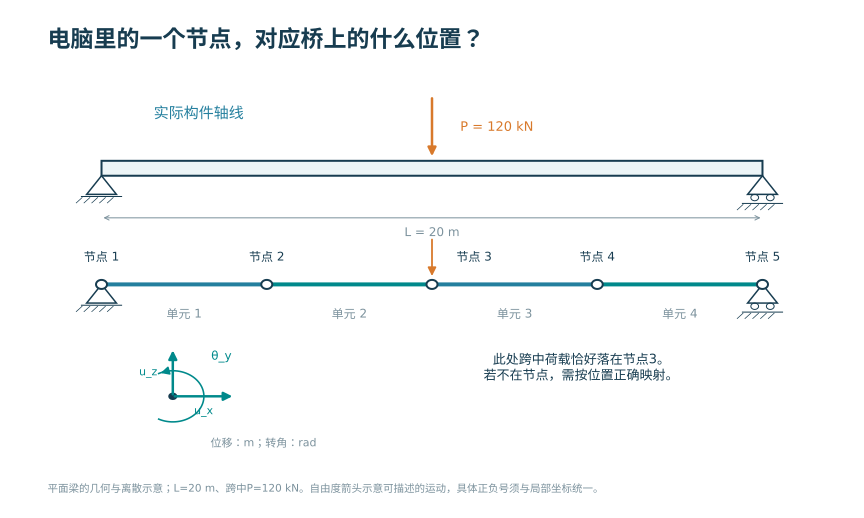
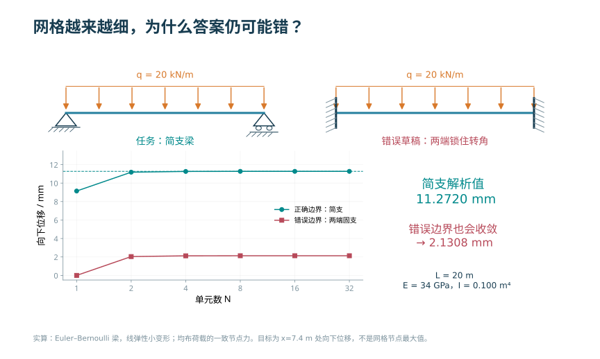
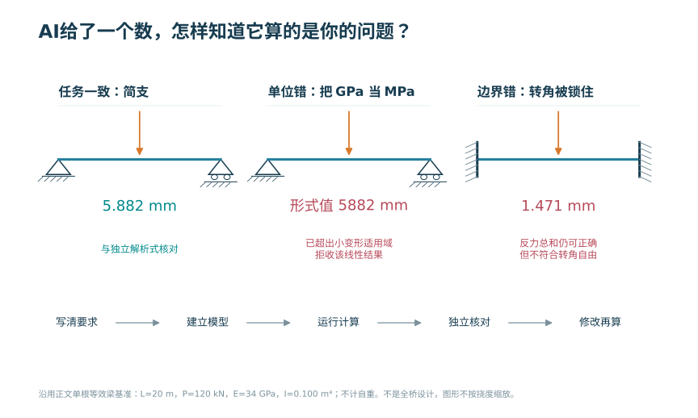
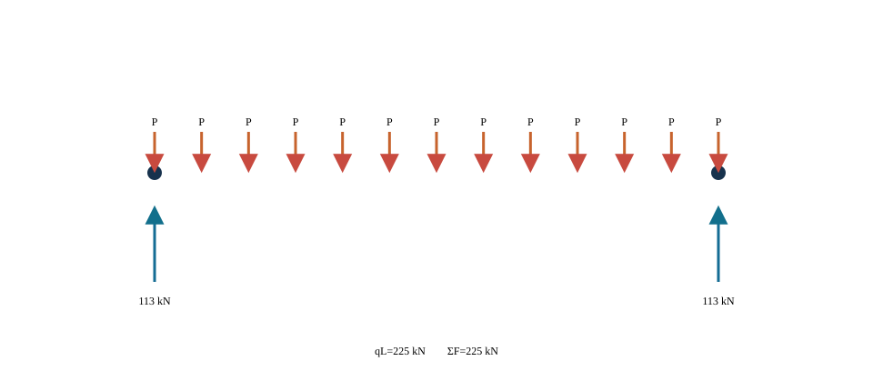
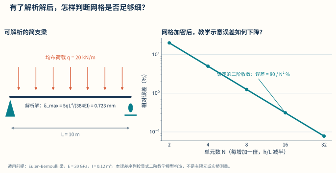

# 数字建模、有限元与智能设计

<!-- CORE-ROUTE START -->
<div class="core-route" id="core-route">
<!-- VISUAL-ENTRY START -->
<div class="chapter-visual-entry"><p>先从一个看得见的问题开始</p><h3>车只停在一侧，用一根梁还能说明整个桥面的变形吗？</h3><p>从整桥进入轮下局部，把车横向挪到另一处，比较受载侧与另一侧的竖向位移。</p><a href="../interactive/learning-map.html?chapter=ch10-fem">看图进入实验 →</a></div>
<!-- VISUAL-ENTRY END -->
<!-- PRIORITY-CHAPTER-GALLERY START -->
<details class="priority-chapter-gallery"><summary>从本章的 3 幅新图开始</summary><div class="priority-thumb-grid"><a href="#fig-priority-F38"><span>电脑里的一个节点，对应桥上的什么位置？</span></a><a href="#fig-priority-F39"><span>网格越来越细，为什么答案仍可能错？</span></a><a href="#fig-priority-F40"><span>AI给了一个数，怎样知道它算的是你的问题？</span></a></div></details>
<!-- PRIORITY-CHAPTER-GALLERY END -->

<h2>本章的核心思考</h2><p class="core-thesis">模型是可审计的推理链，不是软件截图。</p><ol><li>先守恒地映射荷载，再检查边界条件。</li><li>用解析基准与加密比较分离离散误差。</li><li>将数值验证、试验确认和参数反算分别说明。</li></ol><div class="core-analogy"><h3>跨课程类比</h3><p>平衡—协调—本构 → 矩阵组装；极限情形 → 程序审计</p><p><strong>反例与边界：</strong>网格收敛不能修复错误物理模型；增加小数位不能治愈病态或缺少独立信息。</p></div><p>建议课堂集中完成标为“课堂核心”的3个单元，其余单元用于课前观察和课后迁移。每个单元配独立短视频、操作实验、目标检验与开放论证题。</p><div class="core-unit-grid"><article><p class="core-tag">C11U01 · 课前/课后迁移</p><h3>从问题选择模型，而不是反过来</h3><p>梁模型可以解释整体弯曲，却不能自动回答局部锚固应力问题。</p><p><a href="../interactive/core-learning.html?unit=C11U01" target="_blank">操作与迁移任务</a> · <a href="../interactive/core-learning.html?unit=C11U01&amp;view=video" target="_blank">观看短视频</a></p></article><article><p class="core-tag">C11U02 · 课堂核心</p><h3>最小模型也要保留力和矩</h3><p>节点化荷载必须保留合力和一阶矩，才能避免人为改变传力。</p><p><a href="../interactive/core-learning.html?unit=C11U02" target="_blank">操作与迁移任务</a> · <a href="../interactive/core-learning.html?unit=C11U02&amp;view=video" target="_blank">观看短视频</a></p></article><article><p class="core-tag">C11U03 · 课前/课后迁移</p><h3>离散细化改变误差而非物理对象</h3><p>本例线性插值误差随网格细化下降，可与已知二次函数直接对照。</p><p><a href="../interactive/core-learning.html?unit=C11U03" target="_blank">操作与迁移任务</a> · <a href="../interactive/core-learning.html?unit=C11U03&amp;view=video" target="_blank">观看短视频</a></p></article><article><p class="core-tag">C11U04 · 课前/课后迁移</p><h3>刚度矩阵由平衡与协调组成</h3><p>相同位移条件下弹簧力按刚度分配，说明矩阵关系有可追溯的物理来源。</p><p><a href="../interactive/core-learning.html?unit=C11U04" target="_blank">操作与迁移任务</a> · <a href="../interactive/core-learning.html?unit=C11U04&amp;view=video" target="_blank">观看短视频</a></p></article><article><p class="core-tag">C11U05 · 课堂核心</p><h3>边界错误可以伪装成漂亮结果</h3><p>错误释放或锁定自由度会改变内力，网格再细也不会修复边界。</p><p><a href="../interactive/core-learning.html?unit=C11U05" target="_blank">操作与迁移任务</a> · <a href="../interactive/core-learning.html?unit=C11U05&amp;view=video" target="_blank">观看短视频</a></p></article><article><p class="core-tag">C11U06 · 课前/课后迁移</p><h3>求解之前先检查守恒</h3><p>加载映射若破坏合力或合矩，求解器仍可能顺利得到错误结果。</p><p><a href="../interactive/core-learning.html?unit=C11U06" target="_blank">操作与迁移任务</a> · <a href="../interactive/core-learning.html?unit=C11U06&amp;view=video" target="_blank">观看短视频</a></p></article><article><p class="core-tag">C11U07 · 课堂核心</p><h3>数值收敛与模型正确分两步证明</h3><p>对已知解析函数的收敛检验只证明离散实现，应再对照独立物理证据。</p><p><a href="../interactive/core-learning.html?unit=C11U07" target="_blank">操作与迁移任务</a> · <a href="../interactive/core-learning.html?unit=C11U07&amp;view=video" target="_blank">观看短视频</a></p></article><article><p class="core-tag">C11U08 · 课前/课后迁移</p><h3>病态问题不会被更多小数解决</h3><p>控制方向接近时，小误差会造成较大的参数反算变化。</p><p><a href="../interactive/core-learning.html?unit=C11U08" target="_blank">操作与迁移任务</a> · <a href="../interactive/core-learning.html?unit=C11U08&amp;view=video" target="_blank">观看短视频</a></p></article><article><p class="core-tag">C11U09 · 课前/课后迁移</p><h3>AI输出也必须经过方向与量纲检查</h3><p>用尺度指数和极限情形，可以快速发现漏掉长度因子的计算式。</p><p><a href="../interactive/core-learning.html?unit=C11U09" target="_blank">操作与迁移任务</a> · <a href="../interactive/core-learning.html?unit=C11U09&amp;view=video" target="_blank">观看短视频</a></p></article><article><p class="core-tag">C11U10 · 课前/课后迁移</p><h3>从单位影响到优化与反算</h3><p>影响矩阵连接控制量与输出，优化之前要知道它的适用范围与条件数。</p><p><a href="../interactive/core-learning.html?unit=C11U10" target="_blank">操作与迁移任务</a> · <a href="../interactive/core-learning.html?unit=C11U10&amp;view=video" target="_blank">观看短视频</a></p></article></div><p><a href="../core-thinking.html">返回全书核心思维与尺度规律</a> · <a href="../core-resources.html">查看110个教学单元总索引</a> · <a href="../interactive/thinking-analogies.html">打开跨课程并排类比</a></p></div>
<!-- CORE-ROUTE END -->


::: {.chapter-objectives}
**学习目标。** 完成本章学习后，学生应能够：根据设计问题选择解析模型、杆系模型、梁格、板壳或实体模型；说明有限元离散、单元刚度、总体组装、边界与荷载映射的基本过程；建立桥梁有限元模型的验证与确认方案；区分整体效应、局部应力和数值奇异；形成参数化建模、作用组合、结果提取和截面验算的数据链；利用桥梁设计软件与人工智能完成重复工作，同时保留输入、公式、版本和人工复核证据。
:::

::: {.source-note}
**本章定位。** 本章所称“桥梁FE”是桥梁有限元（finite element, FE/FEM）及其与桥梁设计软件的数据衔接。内容按“问题—模型—计算—验证—设计”组织，具体软件作为实现载体，不改变有限元建模、结果验证和设计复核的基本方法。
:::

<div class="chapter-video-strip"><figure class="chapter-video-card"><video controls preload="metadata" playsinline poster="../assets/videos/manim/posters/M15_model_hierarchy.png" src="../assets/videos/manim/M15_model_hierarchy.mp4"></video><figcaption>M15　有限元模型层级与可验证性</figcaption></figure></div>

## 设计问题、课程接口与模型选择


数字模型是对真实桥梁为解决特定问题所作的有目的简化。模型是否合适，不取决于外观是否像桥或自由度是否多，而取决于是否保留了控制该问题的几何、材料、连接、边界、作用和施工状态。

同一座桥可以有多种模型：用一根简支梁估算跨中弯矩和挠度；用平面连续梁分析纵向体系；用梁格研究横向分配；用空间杆系研究曲线、斜交和索塔梁共同工作；用板壳模型研究箱梁畸变、桥面板与钢箱局部响应；用实体子模型研究锚固、支承和节点。模型不按由简化到精细作单一优劣排序，而应分别对应明确的工程问题。

#### 模型问题表

建模前先填写下表：

| 项目 | 必须回答的问题 |
|---|---|
| 设计对象 | 哪座桥、哪个阶段、哪个构件或区域 |
| 目标响应 | 内力、位移、稳定、频率、疲劳应力还是局部承压 |
| 控制机制 | 弯曲、剪切、扭转、轴力、接触、几何非线性或材料非线性 |
| 必须保留 | 哪些构件、连接、边界、偏心和施工状态 |
| 可暂时忽略 | 哪些效应对目标响应次要，忽略依据是什么 |
| 独立基准 | 平衡、闭式解、简化模型、试验或另一软件 |
| 判定标准 | 误差、收敛、规范限值或方案比较指标 |

“整桥最大应力”不是充分的目标响应，因为不同单元应力定义和局部奇异会混在一起。应明确为“某组合下某截面合力”“某焊接细节的结构应力”或“某支座垫石范围的平均承压”等可解释量。

### 与材料力学和结构设计原理的接口

#### 材料力学作为最小基准

梁的轴向、弯曲、剪切和扭转关系为有限元单元提供物理基础。Euler–Bernoulli梁在均布荷载下的简支梁基准为

$$M_{\max}=\frac{qL^2}{8},\qquad
\delta_{\max}=\frac{5qL^4}{384EI}.$$

悬臂端集中力、两端固结梁、简支集中力等也可形成小型验证例。模型中的 $E$ 加倍而荷载和几何不变，线弹性位移应约减半；$q$ 加倍，内力和位移应约加倍；截面高度变化对 $I$ 的影响应符合几何计算。这些趋势比对照一张他人云图更能定位错误。

材料力学公式有适用边界。短深梁的剪切变形、薄壁开口截面的翘曲、宽箱梁剪力滞、板的双向弯曲和局部应力不能由一根Euler–Bernoulli梁完整表示。使用简化公式验证有限元时，比较的是共同保留的物理量。

#### 总体效应进入截面设计

有限元总体模型输出构件截面上的轴力、剪力、弯矩和扭矩，结构设计原理根据材料、截面和构造计算抗力、应力、裂缝与变形。数据接口写为

$$
\{\text{模型、阶段、工况、组合、构件、截面}\}
\longrightarrow
\{N,V_y,V_z,T,M_y,M_z\}
\longrightarrow
\{\text{承载力与使用性能验算}\}.
$$

同一组合下的成组内力必须保持关联，不能把不同工况的最大 $N$ 和最大 $M$ 拼成不存在的组合。截面局部轴方向、符号和单位在输出与验算程序间保持一致。截面设计改变刚度或自重后，必要时回写总体模型迭代。

#### 曼彻斯特概念资源的映射

曼彻斯特结构概念网站中的平衡、不同截面、弯曲、剪切与扭转、应力分布、跨度与挠度、直接传力路径、较小内力、屈曲、预应力和水平位移，恰好构成本章有限元验证的概念清单。每个有限元案例先用一个实体演示或简图指出现象，再给方程和单元模型，最后由学生把模型错误与结构概念对应。

例如，箱梁截面参数实验先移动材料观察惯性矩，再进入梁单元；支座实验先操作自由度，再设置约束矩阵；屈曲实验先观察受压杆侧移，再区分特征值屈曲与非线性承载力。这样可降低“软件字段—力学概念”之间的分离注意负荷。

## 模型形成、数据契约与可审计流程


有限元模型不是结构几何的直接复制，而是围绕设计问题建立的一组可检验假定。模型形成过程至少应回答四个问题：需要判断什么；哪些物理机制必须保留；哪些信息来自勘察、设计或试验；采用什么证据证明模型能够回答既定问题。为了使课程作业、软件分析和工程复核具有共同语言，本书将每项分析任务赋予唯一编号。例如，`Q-ULS-PIER-M`表示承载能力极限状态下墩顶弯矩问题，`Q-SLS-DECK-W`表示正常使用极限状态下桥面挠度问题。编号不替代文字说明，但能把分析问题、模型版本、组合规则和结果图表联系起来。

#### 从工程问题到计算任务

建模开始前编制“分析需求表”，其内容包括结构对象、设计阶段、目标响应、作用状态、精度要求、预期结论和复核方式。目标响应应写成可计算量，例如“第二跨跨中竖向位移，单位为mm”“中墩支点截面纵向弯矩，单位为kN·m”“横隔板开孔边缘结构热点应力，单位为MPa”。“查看整体受力”不是充分的分析目标，因为它无法确定单元类型、网格尺度和结果验收准则。

概念模型用于说明承重构件、连接关系、约束和直接传力路径；计算模型则把这些内容转化为节点、单元、材料、截面、边界、荷载和求解控制。两者之间应设置映射表。例如，概念模型中的“盆式支座”可以在总体模型中映射为纵、横、竖向具有不同约束或刚度的连接单元；在支座局部模型中则可能映射为钢板、混凝土、接触面与锚固构造。只写“设支座”不能形成可审计模型。

模型输入分为四类。事实型输入来自设计图、勘察、检测或试验，如跨径、板厚和混凝土弹性模量实测值；规定型输入来自项目明确采用的标准、设计文件或主管部门要求，如作用组合和材料设计指标；假定型输入用于补充尚未确定的信息，如支座摩阻或连接刚度；校准型输入通过试验、监测或历史数据反演获得。假定型与校准型输入必须单列，避免它们以“软件默认值”的形式进入模型。

#### 模型卡、版本和运行标识

每个可提交模型应有一页“模型卡”，至少包括：问题编号；桥型与结构范围；坐标、单位和符号约定；单元、材料与截面；连接与边界；作用与组合；施工阶段；求解类型；目标响应；验证项目；适用边界；未决事项；建模人、复核人和日期。运行结果采用下式形成标识：

$$
\mathrm{RunID}=\{V_m,V_d,V_s,C_a,t\},
$$

式中，$V_m$为模型版本，$V_d$为输入数据版本，$V_s$为求解器及版本，$C_a$为分析工况或组合编号，$t$为运行时间。图、表和导出数据均保存该标识。这样，当截面尺寸、材料参数或组合规则变化时，可以判断哪些结果已失效，而不是凭文件修改日期推测。

模型形成设置六个检查门：G0确认设计问题和目标响应；G1确认数据来源、单位和坐标；G2确认概念模型与荷载路径；G3确认离散、连接和边界；G4确认单项工况与求解控制；G5完成验证、确认和结论边界。未通过前一检查门，不宜直接批量运行后续组合。该过程把低成本错误尽量留在求解之前发现。

| 检查门 | 主要问题 | 可提交证据 |
|---|---|---|
| G0 分析定义 | 结论服务于哪个设计问题 | 分析需求表、目标响应清单 |
| G1 数据基线 | 数据来自何处、采用何种单位 | 输入台账、单位检查、坐标示意 |
| G2 概念模型 | 荷载经哪些构件传至基础 | 荷载路径图、保留与忽略清单 |
| G3 离散模型 | 单元、偏置、连接和支座是否相容 | 单元表、约束自由度表、连接测试 |
| G4 分析设置 | 工况、阶段和求解控制是否正确 | 单项工况试算、收敛记录 |
| G5 证据闭合 | 方程是否解对、对象是否代表充分 | 验证与确认矩阵、结论适用范围 |

::: {.digital-note}
**数字资源11-1　可审计模型卡。** 学生选择一个分析问题后，系统自动生成模型卡和检查门清单；任何参数修改都记录版本差异，并提示需要重新运行的工况和图表。资源不评价结构是否安全，只检查证据链是否完整。
:::

## 有限元基本关系与离散


有限元并不是与结构力学相互割裂的另一套计算方法。对由杆件组成的桥梁，位移法、矩阵位移法与有限元具有相同的基本骨架：选择能够描述结构运动的自由度，建立单元端力与端位移关系，将构件在共同节点处组装，施加边界与作用，求得节点位移，再由位移恢复构件内力。有限元把这一过程推广到板、壳、实体和其他连续体，并用插值函数近似单元内部的位移场。因此，学生掌握矩阵法，不只是为了完成一个数值算例，也是为了能够解释专业软件中节点、单元、局部坐标、总体组装和结果恢复的含义。

#### 自由度、局部坐标与单元关系


<!-- PRIORITY-FIGURE F38 START -->
{#fig-priority-F38 width=100% fig-alt="电脑里的一个节点，对应桥上的什么位置？。同一20 m简支梁从构件轴线到四个梁单元、五个节点的映射；跨中集中力施加在节点3。节点既有位置也携带自由度，单元连接节点并使用材料与截面刚度。"}

<details class="figure-method"><summary>查看模型条件与绘图代码</summary><p>平面梁离散示意，不含求解结果；支座与荷载位置由同一几何生成；θy仅作转动自由度图示，正负随坐标统一</p><p>课程组原创参数绘图 · F38 · <a href="../scripts/priority-figures/group_b.py">绘图 Python</a> · <a href="../scripts/priority-figures/figlib.py">公共绘图函数</a> · <a href="../assets/publication/priority-40/F38.png" download>下载 PNG</a> · <a href="../assets/publication/priority-40/F38.svg" download>下载 SVG</a></p></details>
<!-- PRIORITY-FIGURE F38 END -->


以平面梁单元为例，节点$i$和$j$各具有轴向位移$u_x$、竖向位移$u_z$和绕$y$轴转角$\theta_y$，局部自由度向量为

$$
\boldsymbol d_e=
\begin{bmatrix}
u_{xi}&u_{zi}&\theta_{yi}&u_{xj}&u_{zj}&\theta_{yj}
\end{bmatrix}^{\mathsf T}.
$$

位移采用m或mm，转角采用rad。在线弹性、小变形并满足Euler--Bernoulli梁假定时，构件轴向刚度由$EA/L$控制，弯曲刚度由$EI/L^3$及其相关项控制。$E$为弹性模量，单位Pa或MPa；$A$为截面面积，单位m$^2$或mm$^2$；$I$为关于弯曲轴的截面惯性矩，单位m$^4$或mm$^4$；$L$为单元长度。局部端力向量满足

$$
\boldsymbol q_e=\boldsymbol k_e\boldsymbol d_e-\boldsymbol f_e^{\,0},
$$

式中，$\boldsymbol k_e$为局部单元刚度矩阵，$\boldsymbol f_e^{\,0}$为分布荷载、温度或初始应变形成的固端力向量，$\boldsymbol q_e$含轴力、剪力和弯矩。该式的符号必须与单元方向和软件端力约定一并保存；仅截取结果表中的正负号而不保存局部轴，无法判断构件实际受拉、受压及弯曲方向。

空间桥梁中，构件局部$x_e$轴通常沿单元$i$端指向$j$端，局部$y_e$、$z_e$轴由截面方向确定。设局部与全局自由度之间的方向余弦变换矩阵为$\boldsymbol T_e$，则

$$
\boldsymbol d_e=\boldsymbol T_e\boldsymbol u_e,
\qquad
\boldsymbol k_e^{g}=\boldsymbol T_e^{\mathsf T}
\boldsymbol k_e\boldsymbol T_e,
\qquad
\boldsymbol f_e^{g}=\boldsymbol T_e^{\mathsf T}\boldsymbol f_e.
$$

$\boldsymbol T_e$无量纲，$\boldsymbol k_e^{g}$为全局坐标下的单元刚度。曲线梁、拱肋和空间塔柱若相邻单元局部轴不连续，可能出现截面结果符号跳变或$I_y$、$I_z$方向交换。模型审查应显示局部轴箭头，并在若干控制构件上核对截面主轴与实际构造方向。

#### 总体组装与直接刚度法

设单元自由度通过布尔定位矩阵$\boldsymbol A_e$与总体自由度相联系，即$\boldsymbol u_e=\boldsymbol A_e\boldsymbol u$，总体刚度和总体荷载可写为

$$
\boldsymbol K=
\sum_{e=1}^{n_e}\boldsymbol A_e^{\mathsf T}
\boldsymbol k_e^{g}\boldsymbol A_e,
\qquad
\boldsymbol F=
\sum_{e=1}^{n_e}\boldsymbol A_e^{\mathsf T}
\boldsymbol f_e^{g}+\boldsymbol F_n,
$$

式中，$n_e$为单元数，$\boldsymbol F_n$为直接施加于节点自由度的荷载。组装的物理含义是：连接于同一自由度的各构件在节点处位移相容，各单元端力与外力共同满足节点平衡。两个几何坐标完全相同但编号不同的节点不会自动组装；两个本应由支座或伸缩缝分开的节点若被误合并，则会形成不应存在的刚接。节点去重必须服从构造语义，不能只按坐标距离机械处理。

对已知位移自由度$c$和未知位移自由度$f$分块，总体方程为

$$
\begin{bmatrix}
\boldsymbol K_{ff}&\boldsymbol K_{fc}\\
\boldsymbol K_{cf}&\boldsymbol K_{cc}
\end{bmatrix}
\begin{bmatrix}
\boldsymbol u_f\\ \boldsymbol u_c
\end{bmatrix}
=
\begin{bmatrix}
\boldsymbol F_f\\ \boldsymbol F_c
\end{bmatrix}.
$$

若$\boldsymbol u_c$为支座沉降、温度伸缩端位移或其他规定值，则自由自由度满足

$$
\boldsymbol K_{ff}\boldsymbol u_f
=\boldsymbol F_f-\boldsymbol K_{fc}\boldsymbol u_c.
$$

求得$\boldsymbol u_f$后，约束反力为

$$
\boldsymbol R_c=
\boldsymbol K_{cf}\boldsymbol u_f+
\boldsymbol K_{cc}\boldsymbol u_c-
\boldsymbol F_c.
$$

位移采用m或mm，节点力采用N或kN，节点力矩采用N·m或kN·m；刚度矩阵的不同分块因自由度类型不同而含有N/m、N、N·m等量纲。用一个统一的“大数弹簧”替代理想约束虽便于输入，却可能造成矩阵病态并污染反力，应优先采用求解器明确支持的自由度消元、约束方程或拉格朗日乘子方法，并记录具体实现。

#### 虚功、等效节点荷载与结果可解释性

有限元荷载不是把工程作用随意放到最近节点，而是要求离散荷载与连续作用对允许位移场作相同的虚功。设单元位移场$\boldsymbol u(\boldsymbol x)=\boldsymbol N(\boldsymbol x)\boldsymbol d_e$，分布荷载为$\boldsymbol p(\boldsymbol x)$，则一致等效节点荷载为

$$
\boldsymbol f_e=
\int_{\Omega_e}\boldsymbol N^{\mathsf T}\boldsymbol p\,\mathrm d\Omega
+\int_{\Gamma_e}\boldsymbol N^{\mathsf T}\bar{\boldsymbol t}\,\mathrm d\Gamma,
$$

式中，$\bar{\boldsymbol t}$为边界面力。若$\boldsymbol p$分别表示线荷载、面荷载或体力，其单位分别为N/m、N/m$^2$或N/m$^3$。一致荷载能够保留合力和对节点转动自由度所作的功，因此梁上均布荷载除节点剪力外还会形成端部等效力矩。把均布荷载平均成两个节点集中力而遗漏等效端矩，会改变粗网格下的弯矩和变形。

结果恢复是上述过程的逆向解释。对梁单元，先从总体位移抽取$\boldsymbol u_e$，再转回局部坐标并计算$\boldsymbol q_e$；对壳和实体单元，则在积分点利用$\boldsymbol\varepsilon=\boldsymbol B\boldsymbol d_e$与$\boldsymbol\sigma=\boldsymbol D\boldsymbol\varepsilon$恢复应变和应力。求得节点位移并不等于已经得到可用于设计的“最大应力”。结果所在位置、局部坐标、截面合力积分、上下表面及平滑方法均属于结果定义的一部分。

#### 矩阵法与桥梁问题的对应

三跨连续梁可直接展示总体组装：每个梁段贡献局部刚度，墩顶节点使相邻跨位移和转角相容，支座删除或规定相应自由度，车辆荷载随位置改变$\boldsymbol F$而不改变线性模型的$\boldsymbol K$。梁格是在纵、横两个方向布置梁单元并在交点共享空间自由度；板壳模型进一步以二维插值描述桥面和箱梁板件；实体模型以三维插值描述局部应力扩散。不同模型保留的运动方式不同，但均需满足“运动学近似—本构—平衡—边界”的统一结构。

从矩阵法过渡到有限元时，应特别辨认三类差异。第一，杆系构件已有明确截面，输出多为截面合力；连续体单元先得到应力或应力合量，截面结果需要积分。第二，杆系节点通常具有清楚的构造含义；壳、实体节点多为数值插值点，不应把每个节点峰值直接视为实体构造应力。第三，桥梁分析往往包含施工阶段、预应力、索初始状态、移动荷载和支座非线性，总体方程可能随阶段或迭代改变，不能把一次线性组装的经验无条件推广。

#### 可计算链与交付门

本章采用下表把桥梁对象转换为可复核成果。每一行均应有输入文件或检查记录，后一环节不得只接收截图。

| 环节 | 核心问题 | 最小输入 | 主要检查 | 交付物 |
|---|---|---|---|---|
| 桥梁对象 | 分析的是何桥、何阶段、何部位 | 图纸、线路、构件和阶段标识 | 对象与版本是否唯一 | 对象清单、控制站表 |
| 分析问题 | 需要作何判断 | 极限状态、目标响应及位置 | 量、单位、精度是否明确 | 分析需求表 |
| 理想化 | 哪些机制必须保留 | 荷载路径、保留/忽略项 | 简化是否影响目标响应 | 概念模型、假定表 |
| 单元与材料 | 如何离散结构 | 单元族、本构、截面与局部轴 | 自由度和本构边界 | 单元/材料台账 |
| 边界与连接 | 结构如何相容并向基础传力 | 支座、连接、基础刚度 | 六自由度和单位作用 | 边界矩阵、连接测试 |
| 荷载与阶段 | 作用在何时、何处进入 | 工况、车道、温度、张拉与阶段 | 合力、合矩、状态继承 | 工况和阶段表 |
| 求解 | 方程属于何种类型 | 线性、非线性、动力及控制参数 | 残差、收敛和警告 | 运行日志、RunID |
| 结果恢复 | 原始自由度如何转为工程量 | 截面、路径、积分区和符号 | 原始/平滑、同现性 | 关键结果表 |
| V&V | 方程是否解对、模型是否合适 | 基准、网格、试验或监测 | 预定判据是否通过 | 验证确认矩阵 |
| 交付 | 结论能否被独立复现 | 以上全部数据和版本 | 引用、授权、适用边界 | 证据包与未决事项 |

这条链的目的不是增加表格数量，而是使每一个结论都能沿反方向追溯：从设计验算回到同现内力，从同现内力回到组合和基本工况，从基本工况回到荷载映射和阶段，从计算结果回到模型、求解器与输入来源。若任一环节只能由建模者口头补充，说明交付尚未闭合。

### 有限元离散

#### 弱式与单元方程

连续体的平衡、几何和本构关系经变分或虚功原理转化为离散方程。线弹性有限元总体形式为

$$\mathbf K\mathbf u=\mathbf F,$$

其中 $\mathbf K$ 为总体刚度矩阵，$\mathbf u$ 为节点自由度，$\mathbf F$ 为等效节点荷载。单元刚度通常写为

$$
\mathbf K_e=\int_{\Omega_e}\mathbf B^{\mathrm T}\mathbf D\mathbf B\,\mathrm d\Omega,
$$

$\mathbf B$ 将节点位移映射为应变，$\mathbf D$ 为材料本构矩阵。总体组装依据节点自由度对应关系把各 $\mathbf K_e$ 和 $\mathbf f_e$ 累加。

“求解器收敛”只说明离散方程得到数值解，不证明 $\mathbf B$、$\mathbf D$、边界和荷载代表了目标桥梁。建模错误往往不会导致程序报错。

#### 从强式、虚功到离散方程

矩阵位移法从构件端部关系出发，弱式有限元则从连续体平衡出发。两者在离散后得到相同类型的总体方程，但弱式能够清楚说明形函数、自然边界、等效节点荷载和应力恢复为何具有特定形式。下面从一维杆开始，再推广到梁和连续体。

设直杆轴线坐标为$x\in[0,L]$，横截面面积$A(x)$、弹性模量$E(x)$，轴向位移为$u(x)$，单位m；分布轴向荷载为$p(x)$，单位N/m。小变形线弹性下，轴力$N=EAu'$，强式平衡为

$$
-\frac{\mathrm d}{\mathrm dx}
\left(EA\frac{\mathrm du}{\mathrm dx}\right)=p
\quad\text{in }(0,L).
$$

边界分为给定位移的$\Gamma_u$与给定端力的$\Gamma_t$。在$\Gamma_u$上$u=\bar u$；在$\Gamma_t$上$nN=\bar t$，其中$n=\pm1$为端部外法向，$\bar t$单位N。强式要求$u$具有足够高的连续可导性。取在位移边界为零的任意虚位移$v(x)$，乘以平衡方程并分部积分，得到

$$
\int_0^L
\frac{\mathrm dv}{\mathrm dx}
EA\frac{\mathrm du}{\mathrm dx}\,\mathrm dx
=
\int_0^L vp\,\mathrm dx
+\left.v\bar t\right|_{\Gamma_t}.
$$

左侧是内虚功，右侧是外虚功。分部积分把对$u$的二阶导数降为一阶，故近似位移只需在单元间保持$C^0$连续。给定位移属于本质边界，需直接限制试探空间；给定端力属于自然边界，自动出现在弱式右端。将边界力误作位移约束，或把给定位移又作为节点力施加，会改变问题本身。

用形函数近似

$$
u_h(x)=\boldsymbol N(x)\boldsymbol d_e,
\qquad
v_h(x)=\boldsymbol N(x)\delta\boldsymbol d_e,
$$

其中$\boldsymbol d_e$为单元节点位移，单位m；$\boldsymbol N$无量纲。令$\boldsymbol B=\mathrm d\boldsymbol N/\mathrm dx$，Galerkin法取试函数与插值函数来自同一空间，可得

$$
\delta\boldsymbol d_e^{\mathsf T}
\left[
\int_0^{L_e}\boldsymbol B^{\mathsf T}EA\boldsymbol B\,\mathrm dx
\right]\boldsymbol d_e
=
\delta\boldsymbol d_e^{\mathsf T}
\left[
\int_0^{L_e}\boldsymbol N^{\mathsf T}p\,\mathrm dx
+\boldsymbol f_{t,e}
\right].
$$

由于$\delta\boldsymbol d_e$任意，得到$\boldsymbol k_e\boldsymbol d_e=\boldsymbol f_e$。这正是矩阵位移法需要的单元关系。线性两节点杆采用$N_1=1-x/L_e$、$N_2=x/L_e$时，积分得到$EA/L_e$乘以标准$2\times2$矩阵。由此可见，刚度矩阵不是经验系数表，而是位移近似、本构和单元域积分共同形成。

#### 梁方程的连续性要求

Euler--Bernoulli梁的挠度为$w(x)$，单位m；曲率在小转角下为$\kappa=w''$，弯矩$M=EIw''$。分布横向荷载$q(x)$单位N/m，强式为

$$
\frac{\mathrm d^2}{\mathrm dx^2}
\left(EI\frac{\mathrm d^2w}{\mathrm dx^2}\right)=q.
$$

两次分部积分后，弱式主体为

$$
\int_0^L
\delta w''\,EI\,w''\,\mathrm dx
=\int_0^L\delta w\,q\,\mathrm dx
+\left[\delta w\,\bar V+\delta w'\,\bar M\right]_{\Gamma_t},
$$

其中$\bar V$和$\bar M$分别为边界剪力N和弯矩N·m，符号随局部坐标定义。位移场包含二阶导数，经典位移型Euler--Bernoulli梁要求单元间同时保持挠度和斜率连续，故常用以节点挠度与转角为自由度的三次Hermite插值。这一要求解释了梁单元等效节点荷载中为何既有剪力又有端矩。

Timoshenko梁把截面转角$\varphi(x)$与挠度斜率$w'(x)$分开，剪切应变可写为$\gamma=w'-\varphi$。弱式只包含$w$与$\varphi$的一阶导数或函数本身，可采用$C^0$插值；其弯曲与剪切能分别为

$$
U_b=\frac12\int_0^L EI(\varphi')^2\,\mathrm dx,
\qquad
U_s=\frac12\int_0^L \kappa_sGA(w'-\varphi)^2\,\mathrm dx,
$$

式中$G$为剪切模量Pa，$\kappa_s$为无量纲剪切修正系数，$A$为面积m$^2$。当梁很薄且插值选择不当时，数值模型可能把本应接近零的剪切应变锁住，表现为剪切锁死和挠度偏小。减缩积分、混合插值或适当单元族可缓解，但不能以任意降低$G$来“调到”目标挠度。

桥梁杆系中，两类梁并非按构件名称固定选择。跨径较长、截面相对浅的主梁总体弯曲可先用Euler--Bernoulli梁；短横梁、深盖梁、高频动力或剪切变形占比较高时，需要Timoshenko梁或更高层级模型。选择依据是目标响应与长细比、剪切能占比和验证结果，而不是软件默认单元。

#### 连续体弱式与边界力

<!-- FORMULA-SCAFFOLD ch10-fem START -->
::: {.formula-scaffold}
**先看这个问题。** 节点移动了，材料就一定受力吗？整块平移和真正拉长并不一样。先看位移怎样变成应变，再看材料怎样把应变变成应力，最后把内部作用汇回节点。

<div class="meaning-flow" role="img" aria-label="节点位移 dₑ，然后B：位移转为应变，然后D：应变转为应力，然后Bᵀ：汇回节点作用"><span>节点位移 dₑ</span><span>B：位移转为应变</span><span>D：应变转为应力</span><span>Bᵀ：汇回节点作用</span></div>
<details><summary>这组符号分别指什么？</summary><p>N 把节点位移插值到单元内部；粗体 B 是应变—位移矩阵，关联单元几何与插值；粗体 D 是材料矩阵。Bᵀ通过虚功关系把应力贡献映回节点，积分累计单元内的贡献。这里 B 不是桥面宽度，D 也不是尺寸；先检验刚体平移不产生应变。</p></details>
:::
<!-- FORMULA-SCAFFOLD ch10-fem END -->

对三维连续体，位移向量$\boldsymbol u=[u_x,u_y,u_z]^{\mathsf T}$，应变$\boldsymbol\varepsilon=\boldsymbol L\boldsymbol u$，应力$\boldsymbol\sigma=\boldsymbol D\boldsymbol\varepsilon$。静力平衡强式写为

$$
\nabla\cdot\boldsymbol\sigma+\boldsymbol b=\boldsymbol0
\quad\text{in }\Omega,
$$

其中体力$\boldsymbol b$单位N/m$^3$。边界$\Gamma_t$上$\boldsymbol\sigma\boldsymbol n=\bar{\boldsymbol t}$，面力单位Pa；边界$\Gamma_u$上$\boldsymbol u=\bar{\boldsymbol u}$。弱式为

$$
\int_{\Omega}
\delta\boldsymbol\varepsilon^{\mathsf T}
\boldsymbol\sigma\,\mathrm d\Omega
=
\int_{\Omega}
\delta\boldsymbol u^{\mathsf T}\boldsymbol b\,\mathrm d\Omega
+\int_{\Gamma_t}
\delta\boldsymbol u^{\mathsf T}\bar{\boldsymbol t}\,\mathrm d\Gamma.
$$

离散位移$\boldsymbol u_h=\boldsymbol N\boldsymbol d_e$、应变$\boldsymbol\varepsilon_h=\boldsymbol B\boldsymbol d_e$代入后，在线弹性范围得到

$$
\boldsymbol k_e=
\int_{\Omega_e}\boldsymbol B^{\mathsf T}
\boldsymbol D\boldsymbol B\,\mathrm d\Omega,
\qquad
\boldsymbol f_e=
\int_{\Omega_e}\boldsymbol N^{\mathsf T}\boldsymbol b\,\mathrm d\Omega
+\int_{\Gamma_{t,e}}\boldsymbol N^{\mathsf T}
\bar{\boldsymbol t}\,\mathrm d\Gamma.
$$

上述体积分和面积分通过数值积分实现。Jacobian把自然坐标积分转换到实际单元；若Jacobian行列式为负或接近零，说明节点顺序错误、单元翻转或几何严重退化。求解器有时仍能输出数值，故需在求解前逐积分点检查Jacobian及网格质量。

弱式还说明总体—局部模型边界如何施加。若总体模型只提供截面六分量，把六个数值平均分到局部实体边界并不一定满足虚功等效。可构造一组分布面力或边界位移，使其合力、合矩和对应刚体/截面变形模式的功与源模型一致。传递后应计算

$$
\Delta W=
\boldsymbol Q_G^{\mathsf T}\delta\boldsymbol q_G
-\int_{\Gamma_I}\boldsymbol t_L^{\mathsf T}
\delta\boldsymbol u_L\,\mathrm d\Gamma,
$$

其中$\boldsymbol Q_G$为总体模型截面广义力，$\delta\boldsymbol q_G$为相应虚广义位移，$\boldsymbol t_L$和$\delta\boldsymbol u_L$为局部接口面力与虚位移。$\Delta W$在选定接口模式上应接近零。该检查比只核对竖向合力更完整，尤其适用于偏心剪力、扭矩和双向弯矩同时存在的箱梁或锚固区。

#### 势能、对称性与稳定性

线弹性保守体系的总势能可写为

$$
\Pi(\boldsymbol u)
=\frac12\int_{\Omega}
\boldsymbol\varepsilon^{\mathsf T}
\boldsymbol D\boldsymbol\varepsilon\,\mathrm d\Omega
-\int_{\Omega}\boldsymbol u^{\mathsf T}\boldsymbol b\,\mathrm d\Omega
-\int_{\Gamma_t}\boldsymbol u^{\mathsf T}
\bar{\boldsymbol t}\,\mathrm d\Gamma.
$$

平衡解满足$\delta\Pi=0$。在材料矩阵对称、荷载保守且约束处理一致时，离散刚度通常对称。若预期对称的矩阵出现明显不对称，应检查局部坐标转换、接触切线、随动力、约束或程序组装，而不应直接把矩阵强制对称。非保守气动力、某些摩擦或算法切线可形成非对称矩阵，此时求解器与稳定判据需要相应调整。

能量还可用于诊断模型。若一个自由度有较大位移却几乎不产生应变能，可能存在刚体或零能模态；若薄板网格中剪切能占比随厚度减小反而异常增大，可能存在锁死；若刚性臂区域储存了大量应变能，说明所用“刚臂”实际上被赋予了材料构件。能量分量需要按同一状态、同一单位解释，不以某个百分比自动判错。

有限元收敛依赖三个基本条件。完整性要求插值能够表示刚体运动和所需的低阶应变状态；协调性要求相邻单元满足问题所需的位移连续；稳定性要求除预期刚体模态外不存在零能模式。补片试验、刚体运动试验、常应变试验和网格细化分别从不同角度检验这些条件。通过某个单元级试验不能代替全桥边界、荷载和本构确认。

#### 桥梁多尺度模型的统一解释

一维梁、梁格、板壳和实体模型可视为对同一虚功关系采用不同运动学近似。梁预先把截面应力积分为$N,V_y,V_z,T,M_y,M_z$；壳把厚度方向积分为膜力、弯矩和横向剪力；实体直接保存三维应力。模型升级不是把几何画得更细，而是开放此前被约束或被平均的变形模式。

例如箱梁从空间梁升级为壳模型，新增板件膜内、局部弯曲、剪力滞和截面畸变；从壳升级为局部实体，新增厚度方向应力、真实接触和锚固扩散。每次升级应列明：新增自由度和参数；源模型到目标模型交换的物理量；共同可比较的截面合力或位移；新增但需验证的局部响应。若两个模型在共同响应上不能取得可解释的一致，不能直接以高自由度模型替代低阶基准。

混合模型组装时，所有单元必须共享统一的总体自由度索引或通过明确约束相连。壳节点常含六自由度，三维梁也含六自由度，而杆/索只对平动自由度提供刚度。一个只连接杆单元的独立节点若仍保留三个无刚度转角，会使总体矩阵奇异。处理方法可以是自由度压缩、与梁壳物理节点共享、或对无物理意义的转角作有说明的数值处理；不可随意添加小转动弹簧并把奇异警告隐藏。

#### 梁单元

梁单元以截面合力描述杆件，计算效率高，适合主梁、桥塔、桥墩、横梁和拱肋总体分析。输入包括轴线、截面面积、惯性矩、扭转常数、剪切面积、材料和局部坐标。截面形心与剪切中心偏离、构件实际偏心和刚域需明确处理。

Euler–Bernoulli梁忽略剪切变形，Timoshenko梁包含截面转角与剪切变形。细长梁两者接近，短深构件或高频动力问题需检查剪切影响。梁端释放表示特定内力不传递，不能把“支座允许转动”误操作为删除节点或释放不相关方向。

#### 桁架、索与只受拉单元

桁架单元只承受轴力，适合理想铰接杆；索单元只受拉且线形和刚度受初拉力影响，需要几何非线性。斜拉索、主缆和吊索若用普通桁架单元并允许受压，可能产生非物理结果。索的初应变、无应力长度和目标成桥状态必须一致。

#### 板壳单元

板壳单元描述中面膜内、弯曲和剪切行为，适合桥面板、箱梁板件、钢塔和薄壁节点。四边形或三角形单元的插值、积分和锁定性能不同。壳厚、偏置、局部坐标、共享节点或连接约束会显著影响力流。

用壳单元研究桥面轮载时，轮载应按接触或扩散范围施加，不宜全部集中到一个节点。荷载映射至少守恒合力和关于参考点的一阶矩。壳单元节点应力外推对网格敏感，设计应力采用适当平均、积分或规范定义。

#### 实体与局部子模型

实体单元适于三维应力、接触和复杂节点，但自由度多、边界影响显著。局部子模型从总体模型取得边界位移或截面合力，在局部区域细化。模型边界应远离关注区，并检查边界传递后合力和合力矩一致。

局部几何尖角、点荷载和完全刚性约束可能导致应力奇异，网格加密时峰值不断上升。此时需按物理接触面积、圆角、焊缝结构应力或截面合力解释，不能把节点最大值直接与材料强度比较。

#### 单元类型、自由度与适用边界

单元选择的依据是目标响应和主导变形机制，而不是模型外观。自由度是离散模型允许发生的独立运动，也是刚度、质量和荷载进入方程的位置。采用全局坐标$x$为桥向、$y$为横桥向、$z$为竖向；转角分别记为$\theta_x$、$\theta_y$、$\theta_z$，单位为rad。位移单位通常采用m或mm，同一模型不得混用而不换算。

| 单元 | 常用节点自由度 | 主要描述对象 | 适合回答 | 不宜直接回答 |
|---|---|---|---|---|
| 二维杆单元 | $u_x,u_z$ | 桁架杆、只计轴向的撑杆 | 轴力、节点位移、桁架整体刚度 | 弯矩、扭矩、节点局部应力 |
| 三维杆单元 | $u_x,u_y,u_z$ | 空间桁架、轴向拉压构件 | 空间轴力传递 | 构件弯扭和连接板应力 |
| 索单元 | $u_x,u_y,u_z$，常含初应力和几何刚度 | 斜拉索、吊索、主缆离散段 | 索力、垂度、体系几何非线性 | 抗弯、受压后的稳定承载 |
| 二维梁单元 | $u_x,u_z,\theta_y$ | 平面梁、连续梁 | 轴力、剪力、弯矩、挠度 | 横向分配和空间扭转 |
| 三维梁单元 | $u_x,u_y,u_z,\theta_x,\theta_y,\theta_z$ | 主梁、横梁、墩塔 | 总体空间内力、弯扭耦合 | 板件局部弯曲、孔边应力 |
| 梁格单元 | 节点通常取六自由度 | 桥面系等效纵横梁 | 偏载横向分配、总体扭转 | 翼缘与腹板连续应力场 |
| 板单元 | 以$w,\theta_x,\theta_y$为主 | 薄板横向弯曲 | 桥面板弯矩、支承条件影响 | 显著膜内受力和厚板横剪切 |
| 壳单元 | $u_x,u_y,u_z,\theta_x,\theta_y,\theta_z$ | 箱梁板件、钢桥面板、腹板 | 膜内力、板弯矩、局部屈曲形态 | 厚度方向应力和复杂接触 |
| 实体单元 | $u_x,u_y,u_z$ | 锚固区、支座区、节点块 | 三向应力、局部传力、接触 | 低成本的全桥组合扫描 |
| 弹簧或连接单元 | 按连接机制启用平动或转动自由度 | 支座、连接缝、土弹簧 | 方向刚度、间隙、摩阻的等效作用 | 未经标定的真实构造细节 |
| 刚性臂或多点约束 | 从属自由度由主自由度控制 | 偏置、刚性横隔、运动耦合 | 正确传递力与力矩 | 具有明显柔性的连接区 |

杆单元只在构件轴线方向提供刚度。局部坐标下的线弹性轴向刚度为

$$
\mathbf{k}_e=\frac{EA}{L}
\begin{bmatrix}
1&-1\\
-1&1
\end{bmatrix},
$$

式中，$E$为弹性模量，单位Pa或MPa；$A$为截面面积，单位m$^2$或mm$^2$；$L$为单元长度，单位m或mm。该式适用于小变形、均匀轴向杆。若斜拉索垂度、初拉力或体系位移显著改变刚度，应在平衡后的初始构形上考虑几何刚度。索内力宜分解为

$$
N_{\mathrm{tot}}=N_0+\Delta N,
$$

其中$N_0$为初始平衡状态索力，$\Delta N$为后续作用引起的增量，二者单位均为N或kN。若软件结果只输出增量而报告将其作为总索力，会造成状态解释错误。只受拉单元还需检查是否出现松弛；将索误设为可受压杆件，会人为增加体系刚度。

梁单元假定截面以某种形式维持整体作用。Euler—Bernoulli梁忽略横向剪切变形，适用于长细梁和总体弯曲；Timoshenko梁引入截面转角与挠曲线转角之差，更适合深梁、短构件或横剪切不可忽略的情形。截面刚度至少包括$EA$、$EI_y$、$EI_z$和$GJ$；空间薄壁箱梁还可能需要考虑翘曲扭转和剪力滞。仅给出面积与两个惯性矩而忽略扭转常数，并不能完整描述偏载下箱梁响应。

梁格把桥面系离散为纵、横向相交的梁。梁格节点的纵、横、竖向位移和转角应在交点处相容，横梁刚度、扭转刚度和等效分配宽度直接影响横向分配。梁格适合比较车道偏载下的纵梁反力与截面效应，但等效梁内力不是实际板件应力。采用等效正交板思路时，板弯曲刚度可写为

$$
D=\frac{Et^3}{12(1-\nu^2)},
$$

式中$t$为板厚，单位m或mm；$\nu$为泊松比，无量纲。该式适用于均质、各向同性、线弹性薄板。混凝土开裂、组合桥面、加劲肋和横隔构造需要相应的有效刚度或显式建模，不能直接套用均质薄板关系。

壳单元同时表示中面膜内和弯曲行为。教学用平壳通常在每节点存储六个自由度，但绕法线的钻孔转角可能主要用于数值稳定，并不等同于可直接解释的物理转角。壳内力$N_x,N_y,N_{xy}$的单位通常为N/m或kN/m，壳弯矩$M_x,M_y,M_{xy}$的单位通常为N·m/m或kN·m/m；不同软件的正负号、上下表面和局部坐标定义必须随结果一起记录。线弹性壳表面应力可由膜应力与弯曲应力恢复，但在点载、点约束、尖角和截面突变处，节点平滑值不应用作唯一设计依据。

实体单元适合描述厚度方向应力、局部接触和三维扩散，但计算量大，边界施加也更敏感。全桥采用实体模型并不会自动提高可信度。常用做法是以梁、梁格或壳模型获得总体位移和截面合力，再在支点、锚固区、横隔板或连接节点建立局部实体子模型。总体—局部边界的映射至少应保持截面合力和力矩：

$$
\int_A \boldsymbol{t}\,\mathrm dA=\boldsymbol{F},\qquad
\int_A \boldsymbol{r}\times\boldsymbol{t}\,\mathrm dA=\boldsymbol{M},
$$

式中，$\boldsymbol{t}$为边界面力，单位Pa；$A$为边界面积，单位m$^2$；$\boldsymbol{r}$为相对参考点的位置向量，单位m；$\boldsymbol{F}$和$\boldsymbol{M}$分别为总体模型传递的合力N和合矩N·m。局部模型边界应离开关注区域足够距离，并通过边界位置敏感性检查避免人为约束局部响应。

::: {.digital-note}
**数字资源11-2　单元与自由度选择器。** 学生选取“目标响应—结构尺度—主导机制”，交互页面给出候选单元及其可回答和不可回答的问题；切换梁、壳和实体后，同一桥段显示不同自由度、结果单位和计算成本。资源只提供选择依据，最终单元由模型卡记录。
:::

#### 梁、杆与索单元的模型边界

空间梁单元把三维构件的变形归纳为轴向伸缩、两个方向弯曲、扭转以及必要时的剪切变形。每个节点通常具有$u_x,u_y,u_z,\theta_x,\theta_y,\theta_z$六个自由度。其最基本的截面属性为$A$、$I_y$、$I_z$、$J$和剪切面积$A_{sy},A_{sz}$。面积单位为m$^2$，惯性矩和扭转常数单位为m$^4$，剪切面积单位为m$^2$。材料还需$E$、剪切模量$G$、密度$\rho$和热膨胀系数$\alpha$。若输入$E$与泊松比$\nu$而由程序计算$G=E/[2(1+\nu)]$，这一关系仅适用于各向同性线弹性材料。

梁单元的有效前提是截面响应能够由少量截面广义力描述。对于细长钢梁、混凝土梁、墩柱、横梁和桥塔总体分析，这是高效而可解释的选择；对于宽箱梁剪力滞、畸变、板件局部屈曲、节点板应力和厚度方向接触，梁假定不足。等效梁刚度不只是几何软件自动算出的数值，还必须与开裂状态、组合效应、剪切连接和施工阶段相对应。混凝土构件在不同极限状态中采用何种有效刚度，应依据项目的设计方法与分析目的，不在本章规定统一折减值。

杆单元只通过轴向变形传力，其三维线弹性应变和轴力为

$$
\varepsilon=\frac{(\boldsymbol u_j-\boldsymbol u_i)\cdot\boldsymbol n}{L},
\qquad
N=EA\varepsilon,
$$

式中，$\boldsymbol n$为由$i$端指向$j$端的单位向量，$L$单位为m或mm，$N$单位为N或kN。铰接桁架、临时撑杆或只需轴向总体作用的构件可采用杆单元。杆端实际具有刚性节点、偏心连接或次弯矩时，应升级为梁、连接或局部模型。只有杆件连接而未约束的节点转角对杆单元没有刚度贡献；在统一六自由度模型中，这些无用途转角必须由相连梁壳提供约束或在组装时妥善处理，否则会出现数值奇异。

索单元与线弹性杆的主要区别在于初始几何和受力状态。对索长$l$、水平投影或空间弦长$l_c$，索的切线刚度通常同时受材料刚度$EA/l$与当前拉力形成的几何刚度影响。一个简化表达为

$$
\boldsymbol K_{\mathrm t}=\boldsymbol K_{\mathrm m}(E,A,l)
+\boldsymbol K_{\mathrm g}(N,l),
$$

式中，$\boldsymbol K_{\mathrm t}$为切线刚度，$\boldsymbol K_{\mathrm m}$为材料刚度，$\boldsymbol K_{\mathrm g}$为几何刚度，$N$为当前索力，单位N或kN。该式只说明刚度组成，不代替具体索单元公式。主缆垂度、斜拉索垂度、无应力长度、张拉或调索顺序以及温度均可能影响初始平衡。教学浏览器中的双向线性杆只能显示给定参考索力与小增量，不能模拟索松弛、找形或真实张力刚度；工程分析必须使用经过验证的索初始平衡与几何非线性求解。

#### 梁格与等效桥面模型

梁格模型以纵梁、横梁和必要的斜向构件表示桥面系。纵向构件承担主弯曲和扭转，横向构件控制各纵向路径之间的荷载分配。桥面板、腹板和横隔的连续作用需要等效到梁格的$EI$、$GJ$和连接关系。若梁格线位于桥面或各主梁参考轴上，其几何偏置和构件交点必须明确；仅在平面投影中画出交叉线，不能保证竖向位置与转动兼容。

梁格适于比较车道偏载下的支反力、纵梁弯矩、横梁内力和总体扭转。其局限在于：等效构件内力不等于真实板件的单位宽度内力；集中轮载附近的桥面板局部弯曲需另用板壳模型；开口截面翘曲、箱梁畸变和横隔板开孔效应需要更细的自由度。梁格验证至少包括三项：中心对称荷载下左右响应对称；单侧荷载下总竖向反力与外力相等且反力偶与外力偏心矩相符；纵、横网格加密后控制截面合力稳定。

当桥面可近似为正交异性板时，纵横方向弯曲与扭转刚度可用$D_x,D_y,D_{xy}$等刚度参数表示，其单位为N·m或kN·m。将这些刚度离散到梁格时，应说明等效分配宽度和构件间距。对于钢正交异性桥面、组合梁桥和多主梁桥，不同构造的等效方式不同，应以相应理论、试验或经验证的细化模型为依据。

#### 板壳单元的应力合量与表面恢复

平壳单元通常在中面上定义，膜内应变$\boldsymbol\varepsilon_m$、曲率$\boldsymbol\kappa$和横向剪切应变$\boldsymbol\gamma_s$共同描述位移场。均质各向同性壳的膜力和弯矩合量可概念性写为

$$
\boldsymbol N=\boldsymbol A_s\boldsymbol\varepsilon_m,
\qquad
\boldsymbol M=\boldsymbol D_s\boldsymbol\kappa,
$$

其中$\boldsymbol N=[N_x,N_y,N_{xy}]^{\mathsf T}$的单位为N/m或kN/m，$\boldsymbol M=[M_x,M_y,M_{xy}]^{\mathsf T}$的单位为N·m/m或kN·m/m；$\boldsymbol A_s$和$\boldsymbol D_s$分别为膜内与弯曲刚度矩阵。对厚度$t$的对称均质壳，表面应变可由

$$
\boldsymbol\varepsilon^{\pm}=
\boldsymbol\varepsilon_m\pm\frac{t}{2}\boldsymbol\kappa
$$

恢复，上、下表面应力再由材料本构计算。$t$与模型长度单位一致。复合材料、分层铺装、钢—混组合或开裂混凝土不能直接用这一均质关系代表最终设计状态，需采用相应层合、本构或有效刚度模型。

四节点Reissner--Mindlin平壳适合薄至中等厚度的板壳，但需要控制剪切锁定和钻孔转角稳定。教学资源采用MITC4类混合插值减轻剪切锁定，仅用于小应变线弹性平壳；曲壳、大变形、材料开裂、塑性、接触和分层问题超出其求解边界。壳单元的法向和局部轴由节点顺序决定，错误节点顺序会造成法向反转、上下表面互换或负Jacobian。建模后应显示法向，检查每个积分点Jacobian为正，并通过常应变、纯弯和刚体运动测试。

轮载作用下，数学点载附近的板弯曲应力通常随网格变化。工程模型应依据接触面、铺装扩散或研究尺度建立有限加载区，并明确扩散依据。数值报告中，积分点或单元原始极值用于审查，节点外推和平滑云图用于展示。平滑会降低或移动峰值，故两者必须分栏，不得以视觉更连续的平滑值替换原始计算值。

#### 实体、连接与局部传力模型

实体单元以节点平动自由度插值三维位移，在小应变线弹性条件下满足

$$
\boldsymbol\varepsilon=\boldsymbol B\boldsymbol u_e,
\qquad
\boldsymbol\sigma=\boldsymbol D\boldsymbol\varepsilon,
$$

其中应变无量纲，应力$\boldsymbol\sigma$单位为Pa或MPa。实体单元可研究支座垫石、锚固块、钢混连接、横隔板节点和局部承压，但必须给出真实或经说明的接触面积、材料界面和边界传递。把全桥均改为实体网格会显著增加参数、自由度和检查成本，却不必然提高总体内力精度；全桥总体模型与局部实体子模型的分工通常更合理。

连接单元用相对位移$\boldsymbol\delta$和相对转角$\boldsymbol\theta$描述两端运动，可在线性范围写为

$$
\begin{bmatrix}
\boldsymbol F\\ \boldsymbol M
\end{bmatrix}
=
\begin{bmatrix}
\boldsymbol K_{tt}&\boldsymbol K_{tr}\\
\boldsymbol K_{rt}&\boldsymbol K_{rr}
\end{bmatrix}
\begin{bmatrix}
\boldsymbol\delta\\ \boldsymbol\theta
\end{bmatrix}.
$$

$\boldsymbol K_{tt}$中的平动刚度单位为N/m，$\boldsymbol K_{rr}$中的转动刚度单位为N·m/rad，耦合项量纲随力与位移类型确定。支座、伸缩缝、剪力连接件、横向限位和桩顶连接可以在特定尺度上这样等效。实际摩阻、间隙、脱空和屈服属于非线性连接，应记录加载方向与历史。连接参数没有可靠来源时，宜设置上、下界情景，不宜把软件缺省值作为已知事实。

#### 桩土模型与地基—结构相互作用

基础边界可按问题逐级表示。第一层把承台底视为固定，用于上部结构初步分配；第二层在承台参考点设置六自由度等效刚度矩阵；第三层显式建立墩、承台、群桩和沿深度分布的土弹簧；需要传播波、土体连续性或强非线性时，再采用连续土体或专门的地基—结构相互作用模型。

承台参考点的线性等效关系可写为

$$
\begin{bmatrix}
\boldsymbol F_b\\ \boldsymbol M_b
\end{bmatrix}
=\boldsymbol K_b
\begin{bmatrix}
\boldsymbol u_b\\ \boldsymbol\theta_b
\end{bmatrix},
$$

式中，$\boldsymbol K_b$为$6\times6$基础刚度矩阵，平动、转动及耦合项的单位需分别核对；$\boldsymbol F_b$单位为N或kN，$\boldsymbol M_b$单位为N·m或kN·m。矩阵应与坐标方向、参考点、荷载幅值和频率范围对应。只输入三个平动弹簧而忽略转动及耦合，可能错误估计高墩与群桩体系的水平力分配。

离散桩土模型可采用横向$p$--$y$、轴向$t$--$z$和桩端$q$--$z$关系：$p$为单位桩长的横向土抗力，常用单位N/m；$y$为桩身横向位移，单位m；$t$为桩侧单位面积或单位长度阻力，其定义及单位必须随模型说明；$z$为轴向相对位移，单位m；$q$为桩端压力，单位Pa。各曲线依赖土层、深度、排水条件、循环特性和项目采用方法，本章不给出统一参数。群桩还需考虑承台刚度、桩间相互作用和桩土非线性。若目标只是上部结构温度和制动力分配，可先用基础刚度上下界；若目标是桩身弯矩、地震响应或冲刷后承载，则必须扩展到相应深度和机制。

#### 不同模型之间的结果传递

总体梁、梁格、壳和实体模型之间应通过共同物理量交换，而不是直接复制不相容的节点结果。梁到壳或实体子模型通常传递截面六分量合力$N,V_y,V_z,T,M_y,M_z$，或传递经过验证的边界位移场；壳到实体可传递边界位移、膜力与弯矩等效分布。映射后应重新积分边界面力，验证合力和合矩与源模型一致。

局部模型反过来也可以提供等效连接刚度、有效截面刚度或热点位置，但回写总体模型前需明确线性化范围。若局部模型含接触、开裂或屈服，等效刚度可能随荷载水平和历史变化，不宜以单一常数覆盖所有工况。跨模型链中每次传递都保存源RunID、目标模型版本、坐标变换、插值方法、守恒残差和适用范围。

#### 单元选择的能量判据与识别能力

单元选择可从结构在目标工况下储存的主要变形能出发。设总应变能分解为

$$
U=U_N+U_{My}+U_{Mz}+U_T+U_V+U_{\mathrm{plate}}
+U_{\mathrm{contact}}+U_{\mathrm{soil}},
$$

各项依次代表轴向、双向弯曲、扭转、剪切、板壳局部、接触和地基变形能，单位均为J。并非所有软件都直接输出完整分量，但可用模型对照、单位作用或构件结果估计主导机制。若空间梁模型中的扭转与横向弯曲对偏载响应显著，一维平面梁不足；若壳模型中局部板弯曲只影响轮载附近而不改变总体截面合力，则可采用总体—局部两层模型。

能量占比很小不一定意味着可以删除某机制。某些局部失效、疲劳热点或接触开闭由较小的全局能量控制，却是设计问题的核心。因此还要问“目标量能否从所选自由度恢复”。梁单元即使能准确给出总体挠度，也无法识别横隔板开孔角部应力；实体单元即使输出三维应力，若缺少钢筋、焊缝或接触构造，也不能自动形成设计能力。

杆、梁、索、梁格、壳和实体之间可采用以下升级触发条件：

- 轴力路径明确且节点近似铰接时，杆单元足以描述总体力流；端部弯矩、节点刚度或偏心不可忽略时升级为梁或连接模型。
- 构件截面可由六个截面合力代表时采用空间梁；出现剪力滞、畸变、翘曲、局部板屈曲或板件应力需求时升级为壳或带附加自由度的专门梁。
- 柔索的无应力长度、垂度、初拉力和只受拉状态影响刚度时采用几何非线性索；普通双向线性杆只可作小增量教学基准。
- 桥面偏载主要关心纵横向分配和总体扭转时采用梁格；需要连续板带内力、局部轮载或箱梁板件响应时采用板壳。
- 厚度方向应力、三维锚固扩散、支座接触或复杂材料界面决定结论时采用局部实体；全桥组合扫描仍由梁或壳承担。
- 支座、土体或连接只需在给定位移范围内表达等效刚度时采用弹簧/连接；需要开闭、滑移、屈服、循环退化或频率相关作用时采用相应非线性或专门模型。

上述触发条件应写入分析需求表。若模型没有开放目标机制，后处理无法凭借更精细的颜色恢复它；若模型开放了大量缺乏参数证据的机制，自由度增加反而会扩大不确定性。

#### 梁格参数的双向等效

梁格的纵、横梁刚度应由桥面系在相应变形模式下的等效能量确定。设纵向梁格间距为$b_y$，某一纵向等效构件的弯曲刚度为$(EI)_g$，其对应单位宽度弯曲刚度数量级为

$$
D_x\approx \frac{(EI)_g}{b_y},
$$

其中$(EI)_g$单位N·m$^2$，$b_y$单位m，$D_x$单位N·m。横向同理。该关系只是规则等间距梁格的能量对应起点；横隔、腹板、翼缘共同作用、组合界面和非均匀间距需要更完整的等效。扭转刚度不能只由Saint-Venant常数机械分配，因为正交板的扭曲能与梁格交点转动、横梁和纵梁扭转共同相关。

梁格参数校核可施加四类单位变形：纵向纯弯、横向纯弯、均匀扭曲和刚体运动。比较原截面/板壳模型与梁格的总应变能、边界合力及关键位移。仅校准中心荷载挠度可能得到非唯一参数，无法保证偏载和扭转同样正确。若同一组等效刚度不能同时代表多个目标模式，应限制梁格适用工况或升级模型。

梁格交点的实际几何高程与偏置决定横向力如何进入主梁。横梁参考轴在桥面板中面、主梁剪切中心或底板处会形成不同刚臂。建立模型时应保存每条等效梁的物理来源、分配宽度、参考轴和适用状态；输出“横梁弯矩”时说明它是等效量，不直接等于某一道实际构件内力。

#### 壳单元积分、锁死与畸变

壳单元的数值积分必须在计算效率、零能模态与锁死之间平衡。全积分通常有较好稳定性，但低阶Reissner--Mindlin壳在薄板极限可能产生剪切锁死；减缩积分可减小过度约束，却可能引入沙漏或零能模态。混合插值、假定应变和稳定化是有理论依据的处理，稳定化系数属于数值参数而非材料性质。

判断剪切锁死可构造厚度序列$t/L$逐渐减小的简支板或悬臂板，比较无量纲挠度、弯曲能和剪切能。若网格加密后仍显著偏硬，且剪切能在薄板极限异常占优，应检查单元公式。判断膜锁死可在曲壳或弯曲占优问题中比较是否出现非物理膜内力。锁死不能通过任意降低剪切模量、厚度或材料刚度解决，因为这样会同时改变真实物理参数。

等参单元的Jacobian矩阵为

$$
\boldsymbol J(\xi,\eta)=
\frac{\partial(x,y)}{\partial(\xi,\eta)}.
$$

$\det\boldsymbol J$给出自然域到物理域的面积映射尺度。每个积分点应有正确符号且远离退化；长宽比、内角、翘曲和边长突变也需检查。单元质量指标只能筛查网格，不能代替补片试验和目标响应敏感性。桥面曲面使用平壳拼接时，相邻单元法向变化需与几何曲率和网格尺度一致；突然翻转的法向会交换上下表面结果。

#### 实体单元的阶次、不可压缩性与边界

低阶四面体便于自动划分复杂几何，但在弯曲占优区域可能过硬；高阶四面体或六面体能以较少单元获得更好的应变场，却对几何、积分和网格质量有各自要求。混凝土、橡胶或近不可压缩材料在泊松比接近$0.5$时可能出现体积锁死，需要混合压力—位移等专门公式。不能仅凭“实体单元”四字判断精度。

局部实体模型的外边界若太接近关注区，规定的位移或刚性截面会抑制真实应力扩散。可逐步外移边界，比较关注区的路径应力、区域平均、接触压力和截面合力。边界传递采用位移时容易保持相容，采用面力时容易保持合力；两者均需检查合矩和能量。Saint-Venant意义上的边界影响衰减需以模型敏感性证明，不由固定“若干倍截面尺寸”自动保证。

实体应力输出通常位于积分点。外推到节点、相邻单元平均和表面平滑会改变极值。对焊趾、孔边、锐角、点接触和刚性耦合边界，应先判断是否为数学奇异或几何理想化造成的集中，再选择结构应力、热点外推、路径线性化、区域平均或显式圆角/接触模型。具体评价方法与材料、构造和采用标准一致。

#### 弹簧、阻尼器与接触的状态变量

线性弹簧在局部坐标下可写为$\boldsymbol Q=\boldsymbol K_c\boldsymbol q$。若支座或连接存在初始间隙、摩擦、屈服和损伤，作用还依赖内部状态变量$\boldsymbol\eta$：

$$
\boldsymbol Q_{n+1}=
\mathcal H(\boldsymbol q_{n+1},
\dot{\boldsymbol q}_{n+1},
\boldsymbol\eta_n),
\qquad
\boldsymbol\eta_{n+1}=
\mathcal U(\boldsymbol q_{n+1},\boldsymbol\eta_n).
$$

$\boldsymbol q$中的平动单位为m、转动单位为rad；$\boldsymbol Q$中的力单位为N、力矩单位为N·m。$\mathcal H$为本构映射，$\mathcal U$为状态更新。线性静力中不包含速度项；黏滞阻尼器、摩擦速度效应或动力接触需在时间域中处理。把滞回曲线只作为一条单值“力—位移曲线”输入，会丢失卸载和残余状态。

法向无穿透接触的理想互补条件可概括为

$$
g_n\ge0,\qquad p_n\ge0,\qquad g_np_n=0,
$$

式中$g_n$为法向间隙m，$p_n$为接触压力Pa或离散接触力N，正号定义需在模型卡说明。接触闭合时$g_n=0$且可有压力，分离时$p_n=0$。罚函数把接触近似为高刚度弹簧，过小会穿透，过大可能导致条件数恶化；拉格朗日乘子或增广方法有不同自由度和收敛特性。参数选择需做穿透量、接触力和迭代敏感性，不能只以云图连续作为判断。

#### 拓扑和自由度的自动审查

网格生成后，应在材料和荷载之前先审查拓扑。节点度数为零表示孤立节点；仅连接一个杆件的自由节点可能形成机构；两个不同ID、坐标几乎相同且本应连续的节点提示断链；坐标相同但构造上由支座或接缝分离的节点则必须保留。自动去重只能在构件语义、连接类型和几何容差同时满足时执行。

可将节点—单元关系表示为图$\mathcal G=(\mathcal V,\mathcal E)$。连通分量数、节点度数、端点组和构件组之间的预期连接可作为拓扑测试。对壳网格还检查自由边、非流形边、重复面、法向一致性；对实体检查重复体、负体积和悬空表面；对索桥检查每根索两个端点均落在有效锚固对象上。

拓扑正确后再检查刚体模态。未约束的独立三维结构应具有预期的六个刚体模态；施加支承后，不应残留非预期零模态。统一六自由度存储中，杆/索独立节点的无刚度转角需单独识别，不能把它们与结构真实机构混在一起。自动审查输出对象ID、坐标、构件组和建议定位视图，使问题能够回到几何与构造，而不是只显示“矩阵奇异”。

## 模型层级、几何、连接与边界


<div class="embed-wrap"><iframe loading="lazy" src="../interactive/ch10-bridge-fem-hierarchy.html" title="桥梁有限元模型层级"></iframe></div>

::: {.digital-note}
**数字资源11-3　模型层级。** 对同一桥梁问题在解析梁、空间杆系、梁格、板壳和局部模型之间切换，显示每一级新增的自由度、可回答问题和新引入参数。默认只展开当前学习层级。
:::

模型升级遵循“当前模型无法回答明确问题”这一条件。若一根梁已足以判断跨中弯矩数量级，无需先建立实体桥；若需要偏载横向分配，升级为梁格或板壳；若需要锚固区局部应力，再建立子模型。每次升级记录新增机制、参数来源和验证基准。

### 几何、连接与边界

#### 几何轴线与偏置

桥面板中面、主梁形心线、支座中心和墩柱轴线常不重合。偏置会把轴力转化为弯矩，也会影响扭转。模型可用刚性连接、偏置参数或显式构件表示，但需检查是否无意增加刚度。刚臂只传递运动关系，不应贡献不存在的材料质量和刚度。

#### 连接

湿接缝、横隔梁、剪力连接件、支座、铰、索夹和锚固具有不同传力能力。共享节点代表完全连续；约束方程可表示指定自由度相等；弹簧或连接单元表示有限刚度、滑移、摩阻和间隙。连接的理想化必须与构造和目标响应一致。

#### 边界条件

空间模型需消除六个刚体自由度，又要释放温度和收缩所需位移。支座局部轴与桥梁全局轴可能不一致，曲线与斜桥尤需检查。重复约束会产生异常温度力，约束不足会使刚度矩阵奇异。边界审查先用自由度表，再用单位位移或温度工况验证。

#### 几何、偏置与局部坐标

几何审计不只核对跨径和标高，还要核对分析轴线与实体构件之间的空间关系。梁单元通常位于截面形心、剪切中心或人为选定的参考轴，桥面铺装、横梁节点和支座中心未必与该轴重合。若力$\boldsymbol{F}$由实际作用点平移到分析轴线，应附加偏置力矩

$$
\boldsymbol{M}_e=\boldsymbol{e}\times\boldsymbol{F},
$$

式中，$\boldsymbol{e}$为作用点相对分析轴的位置向量，单位m；$\boldsymbol{M}_e$单位为N·m或kN·m。刚性臂、多点约束或软件截面偏置均可实现该关系，但必须通过一个单位力工况检查传递的合力和力矩。对曲线桥和斜桥，局部轴方向随里程变化，截面内力必须结合局部坐标解释；局部轴翻转会使弯矩或扭矩图突变，却不一定表示结构响应突变。

几何数据宜分为线路层、结构控制线层、构件轴线层和有限元离散层。线路平曲线与竖曲线定义总体位置；墩台里程、支承线和横坡定义结构控制；主梁、腹板、横梁及索锚点生成构件轴线；网格尺寸和分段规则形成有限元节点。四层使用稳定标识相互关联，避免把可视化表面的顶点误作结构节点。

#### 连接与约束的最小测试

相邻构件在画面上接触，不表示自由度已经连接。共享节点表示相同位置的相应自由度完全相容；刚性连接表示从属点随主点作刚体运动；弹簧连接允许相对位移或转角并按刚度传力；接触连接需要定义法向开闭、切向摩阻和可能的滑移。每类连接在进入全桥模型前均可采用两构件最小模型测试：在一端施加单位位移或单位力，观察另一端位移、内力和反力是否符合预期。

多点约束可写为

$$
\mathbf{C}\mathbf{u}=\boldsymbol{d},
$$

式中，$\mathbf{C}$为约束矩阵，$\mathbf{u}$为全局自由度向量，$\boldsymbol{d}$为规定相对位移。对刚性横隔，$\boldsymbol{d}=\boldsymbol{0}$时表示从属节点按刚体关系运动。约束范围过大可能抑制真实板变形；约束不足则可能出现机构或局部断链。教学检查中可分别施加纵向、横向、竖向单位力和三个方向单位力矩，形成六项连接传递表。

#### 支座与基础边界

支座边界按自由度逐项定义。固定、纵向活动、横向活动和双向活动是对允许运动的描述，不是按名称直接选择软件图标。支承线方向与全局轴不重合时，支座约束宜在局部坐标中定义。支座刚度$k_i$的单位为N/m或N/mm，转动刚度$k_{\theta i}$的单位为N·m/rad；理想约束可视为相应刚度趋于很大，但数值模型中不应随意设置超大弹簧而导致病态矩阵。

边界审计包含三类工况：自重工况检查竖向反力及总平衡；温度升降工况检查预期自由方向是否能够伸缩；水平单位力工况检查固定墩、制动墩或基础弹簧的传力比例。若温度工况产生异常大的轴力，首先检查多余纵向约束、支座方向和施工闭合状态。基础柔度可用六自由度弹簧矩阵或桩土模型表示，其参数来源和适用频率范围必须记录；未完成地基—结构参数研究时，刚性基础与弹性基础应作为边界情景比较。

#### 施工阶段状态

预应力混凝土连续梁、分段架设钢梁、悬臂施工桥和体系转换桥梁的成桥内力依赖施工路径。第$k$阶段可表示为

$$
\mathcal{M}_k=\{\mathcal{E}_k,\mathcal{B}_k,\mathcal{L}_k,\mathcal{P}_k,t_k\},
$$

式中，$\mathcal{E}_k$为本阶段激活或钝化的单元集合，$\mathcal{B}_k$为边界与连接集合，$\mathcal{L}_k$为新增作用集合，$\mathcal{P}_k$为预应力或初始状态，$t_k$为龄期或持续时间。每一阶段的位移、内力和材料时变状态传递至下一阶段。若仅在成桥几何上一次施加全部恒载，可能遗漏架设体系、临时支承、合龙、张拉顺序以及收缩徐变的路径影响。

施工阶段表至少列出阶段名称、起止时间、激活构件、钝化构件、边界变化、施加荷载、张拉束、龄期和检查量。阶段激活应保持初始几何和无应力状态的定义一致；“激活单元即自动承担此前荷载”并非普遍规律，需核对求解器的阶段继承方式。MIDAS官方功能资料以结构组、边界组和荷载组的激活或钝化组织施工阶段，本书只引用这一通用工作流，不复制软件界面。参见[MIDAS Civil施工阶段分析](https://www.midasoft.com/civil-feature-construction-stage-analysis)和[悬臂浇筑施工阶段示例](https://support.midasuser.com/hc/en-us/articles/47452571740057--CIVIL-NX-Construction-Stage-Analysis-using-FCM-Bridge-Wizard)。

## 荷载映射、求解与结果恢复


结构重力应由密度和几何自动计算或由外部荷载施加，两种方式不得重复。桥面铺装、护栏和管线可用线或面荷载，并与工程量核对。车辆轮载从车道坐标映射到梁格或壳网格时保持合力和力矩，移动路径与桥梁线形一致。

温度可表示均匀温差、截面梯度或材料初应变；支座沉降用给定位移；预应力采用初应变、等效荷载或专用钢束模型；施工阶段按激活时间施加。每个工况记录物理含义、代表值、单位和规范来源。

作用组合应在独立模块中完成，保留单项工况。线性模型可组合单项效应；非线性、接触、索松弛或边界变化情况下需直接分析组合。结果表关联组合编号、阶段和规范版本。

#### 分布作用的等效节点化

荷载由工程对象映射到自由度时，应保持功等效。单元上的连续分布作用$\boldsymbol{p}(\boldsymbol{x})$转换为等效节点荷载

$$
\boldsymbol{f}_e=\int_{\Omega_e}\mathbf{N}^{\mathsf T}\boldsymbol{p}\,\mathrm d\Omega,
$$

式中，$\mathbf{N}$为位移形函数矩阵，$\Omega_e$为单元域，$\boldsymbol{p}$可为线荷载N/m、面荷载N/m$^2$或体力N/m$^3$。铺装、防撞护栏和附属设施可以按实际分布映射为面荷载或线荷载；简化为梁上线荷载时，应说明分配宽度和偏心。自重由密度、重力加速度和几何自动形成时，需要用材料体积与单位重独立计算总重，防止重复施加或遗漏非结构层。

<div class="embed-wrap compact"><iframe loading="lazy" src="../interactive/bridge-concept-screen.html?lab=loadmap" title="分布作用的一致节点力实验"></iframe></div>

{#fig-ch11-load-mapping .static-fallback width=88%}

#### 移动荷载与影响线

车辆位置以路径坐标$\xi$表示，则线性静力模型在每一位置满足

$$
\mathbf{K}\boldsymbol{u}(\xi)=\boldsymbol{F}(\xi),
$$

式中，$\mathbf{K}$为结构刚度矩阵，$\boldsymbol{u}(\xi)$为位移向量，$\boldsymbol{F}(\xi)$为该车位的等效节点荷载。目标响应$r(\xi)$可由位移、截面内力或支反力提取，其包络为$\max_{\xi}r(\xi)$和$\min_{\xi}r(\xi)$。位置步长决定能否捕捉窄峰；宜先粗扫识别控制区，再在峰值附近加密，并报告步长敏感性。

车轮作用从路面接触区映射到板壳节点时，应至少保持竖向合力和相对参考点的两个一阶矩：

$$
\sum_i F_{zi}=P,
\qquad
\sum_i x_iF_{zi}=x_P P,
\qquad
\sum_i y_iF_{zi}=y_P P,
$$

式中，$P$为单轮或轮组竖向力，单位N或kN；$(x_P,y_P)$为作用点坐标，单位m；$F_{zi}$为分配到节点$i$的竖向力。若仅按最近节点加载，车辆跨越网格线时可能出现非物理跳变。基于形函数、接触面积或守恒权重的分配应连续更新，并把轮载合力和一阶矩残差显示在交互页面中。

移动荷载静力动画是空间位置扫描，不等同于车辆动力时程。播放速度只是界面速度，不能解释为实际车速。只有模型包含质量、阻尼、路面不平顺和时间积分时，车速才进入动力问题。静力影响线适合教学车辆位置与响应极值的对应关系；规范车辆、车道折减和冲击效应应按项目采用标准建立，不由动画默认值代替。[MIDAS移动荷载分析](https://www.midasoft.com/civil-feature-moving-load-analysis)说明了用影响线或影响面搜索不利位置的专业软件思路，本书据此归纳工作流，不复制其界面与示例数据。

#### 温度、预应力与初始状态

均匀温度变化引起自由热应变

$$
\varepsilon_T=\alpha\Delta T,
$$

式中，$\alpha$为线膨胀系数，单位1/°C；$\Delta T$为温差，单位°C。自由伸缩结构理论上不产生轴向约束力；若存在支座、合龙或墩梁固结约束，温度应变通过兼容条件形成内力。截面温度梯度还会引起曲率，需按实际温度分布或项目采用标准定义，不能用均匀温变替代。

预应力可通过等效荷载、初始应变、实体锚固作用或索单元初拉力进入模型。以初始应变法为例，单元等效节点荷载可写为

$$
\boldsymbol{f}_{p,e}=\int_{\Omega_e}\mathbf{B}^{\mathsf T}\mathbf{D}\boldsymbol{\varepsilon}_p^0\,\mathrm d\Omega,
$$

式中，$\mathbf{B}$为应变—位移矩阵，$\mathbf{D}$为材料本构矩阵，$\boldsymbol{\varepsilon}_p^0$为预应力引起的初始应变。预应力筋有效力单位为N或kN，偏心距单位为m或mm。需要区分张拉控制力、各阶段损失后的有效预应力和二次效应；连续结构中的预应力反力及次内力应与施工阶段相一致。

#### 组合映射与可追溯数据

在线性分析范围内，组合响应可由基本工况结果叠加：

$$
S_C=\sum_{i=1}^{n}c_iS_i,
$$

式中，$S_i$为第$i$个基本工况的响应，$c_i$为该组合采用的系数，$S_C$为组合响应。非线性、接触、只受拉索或显著路径相关问题一般不能在结果层任意线性叠加，需按分析目的把作用同时进入求解或采用经验证的包络方法。

组合数据表应设置`combination_id`、极限状态、设计情景、基本工况标识、系数、同现组、互斥组、方向规则、来源条款、版本和审核状态。系数必须来自项目明确采用的现行标准或设计文件；教材交互可采用标注为“教学参数”的值展示变化规律，但不得将其冒充规范取值。自动组合程序至少通过三个测试：单一工况系数测试、互斥工况测试和正负方向包络测试。

::: {.digital-note}
**数字资源11-4　作用映射审计台。** 页面左侧选择自重、温度、预应力或移动轮载，中央显示工程作用到单元自由度的映射，右侧实时给出合力、力矩、单位和组合来源检查。全过程色标固定；数值极值从单元或积分点原始结果提取，节点平滑结果只用于显示。
:::

#### 桥梁作用对象与分析工况的映射

工程作用应先保持为具有物理含义的对象，再由不同层级模型分别离散。例如，防撞护栏在工程对象层具有材料、截面、布置线和单位长度重力；在总体梁模型中可映射为带偏心的线荷载，在壳模型中可沿桥面边缘分配，在施工阶段中从安装时刻起参与。若直接保存某一批节点力，模型改网格后既难以更新，也难以核对是否遗漏或重复。

| 作用对象 | 对象层必要信息 | 总体模型映射 | 局部模型映射 | 首要审计量 |
|---|---|---|---|---|
| 结构自重 | 几何、材料密度或重度、激活阶段 | 由构件体积自动生成 | 由局部实体/壳体积生成 | 总重、重心、阶段增量 |
| 二期恒载 | 铺装、护栏、管线的布置与单位重 | 面荷载、线荷载及偏心矩 | 实际覆盖区或等效分布 | 合力和对桥轴力矩 |
| 预应力 | 钢束线形、张拉端、控制力、损失和阶段 | 等效荷载、初应变或钢束对象 | 锚固区面力、接触或钢筋/钢束 | 轴力、偏心矩、张拉次序 |
| 均匀温变 | 参考温度、温差、材料$\alpha$ | 构件初始应变 | 各材料域热应变 | 自由伸缩与约束反力 |
| 温度梯度 | 截面温度分布、正负方向与时刻 | 等效曲率或专用截面温度 | 分层/节点温度场 | 截面轴力与曲率 |
| 支座沉降 | 支点、方向、位移值和阶段 | 规定节点位移 | 接触面或承台边界位移 | 反力与位移功 |
| 车辆作用 | 车道、轴列、轮迹、横向位置和规则 | 移动集中力、线荷载或影响线 | 有限接触斑/扩散区 | 车轮合力、偏心矩、控制车位 |
| 风与地震 | 空间分布、方向、质量、阻尼或输入记录 | 节点/构件荷载、反应谱、时程 | 局部压力或边界时程 | 基底剪力、质量、方向与频域 |

表中的数值取值均应来自项目采用的标准、设计文件、试验或明确标注的教学数据。本章不预设车道荷载、温度梯度、地震谱或组合系数，避免把示意参数误作为现行规定。

#### 移动荷载的空间离散与包络

对由若干车轴组成的荷载列，设第$a$个车轴力为$P_a$，轴距偏移为$s_a$，荷载列参考位置为$\xi$，则该轴的桥向坐标为$x_a(\xi)=\xi-s_a$。$P_a$单位为N或kN，$s_a$与$\xi$单位为m。在线性静力扫描中，刚度矩阵在车位之间保持不变，荷载向量随$\xi$变化，可对约束后的刚度矩阵仅作一次分解并重复回代。每一车位仍必须保留独立的作用向量、控制响应和反力平衡记录。

梁单元中，位于单元内局部坐标$a$处的集中力可按梁形函数形成一致节点力；板壳单元中，轮载可由形函数或有限接触斑权重分配至单元节点。映射应同时满足

$$
\sum_i\boldsymbol F_i=\boldsymbol P,
\qquad
\sum_i(\boldsymbol r_i-\boldsymbol r_0)\times\boldsymbol F_i
=(\boldsymbol r_P-\boldsymbol r_0)\times\boldsymbol P,
$$

式中，$\boldsymbol F_i$为节点等效力，$\boldsymbol r_i$和$\boldsymbol r_P$分别为节点与实际轮载作用点坐标，$\boldsymbol r_0$为任意统一参考点。若车辆跨越单元边界，力和力矩残差应连续且保持在模型卡预定容许范围内。把越界采样点简单“夹回”桥面边缘会改变接触斑重心；接触斑接近边界时，应采用有物理依据的缩减、重分布或轮迹有效范围规则。

某目标响应$r$的包络不只是两条极值曲线，还应保存控制状态：

$$
r_{\max}(x)=\max_{\xi,c}\,r(x;\xi,c),
\qquad
r_{\min}(x)=\min_{\xi,c}\,r(x;\xi,c),
$$

其中$c$表示车道、横向位置或其他离散布置。对每个极值应保存$\xi^*$、$c^*$、车辆方向、结构阶段、基本工况和组合ID。若仅保存$r_{\max}$而丢失控制车位，截面设计将无法取得同一状态下的$N,V,T,M$成组效应。

车位步长$\Delta\xi$应针对目标响应检查。支点剪力、短跨构件或局部桥面响应的影响线可能较尖，所需步长小于长跨总体弯矩。可先用较粗步长扫描，识别候选极值区，再在局部加密，并比较极值和控制位置。若使用影响面搜索多车道不利布置，还应验证车道坐标、加载长度、正负影响区处理及互斥规则。动画播放帧率只表示结果浏览速度；没有质量、阻尼、悬挂系统、路面不平顺与时间积分时，不能将播放速度标为车辆真实速度。

#### 施工阶段的状态继承

阶段分析的关键不是把工况按日期分组，而是定义结构、边界、材料龄期与初始状态如何从前一阶段传递。设第$k$阶段末状态为

$$
\boldsymbol s_k=
\mathcal G_k(\boldsymbol s_{k-1},
\Delta\boldsymbol F_k,
\Delta\boldsymbol\varepsilon_k^0,
\mathcal A_k,
\mathcal D_k,\Delta t_k),
$$

式中，$\boldsymbol s_k$可包含位移、内力、应变、材料时变变量和接触状态；$\Delta\boldsymbol F_k$为本阶段新增外力；$\Delta\boldsymbol\varepsilon_k^0$为温度、预应力、收缩等初始应变增量；$\mathcal A_k$和$\mathcal D_k$分别为激活和钝化对象集合；$\Delta t_k$为阶段持续时间。该表达用于组织状态，不限定具体求解器算法。

新激活构件以何种构形、无应力长度或初始内力进入体系，直接影响结果。例如，合龙段在当前变形构形上无应力闭合，与在原始几何上强制连接并非同一状态；斜拉索按目标索力、无应力长度或初应变激活，也会形成不同平衡；支架拆除是在既有受力状态上改变边界，不等同于把成桥荷载一次施加于最终体系。阶段表必须给出激活时的参考构形与初始状态定义。

每一阶段至少作四类审计：新增重力与反力增量平衡；关键连接激活后的位移连续或规定间隙闭合；预应力张拉端与固定端的状态符合输入；阶段累计量等于上阶段状态与本阶段增量按求解器规则组合。对收缩徐变等时变效应，应记录材料模型、龄期、环境及积分设置，并与简化算例或软件理论手册对照。阶段中断或不收敛不得静默跳过，后续阶段结果应标记为无效。

#### 从影响线到影响面的有限元表达

在线性弹性结构中，某个标量响应可表示为节点荷载的线性泛函。设目标响应$r=\boldsymbol c^{\mathsf T}\boldsymbol u$，$\boldsymbol c$可选取某节点位移、构件端力经恢复矩阵后的分量或支反力；总体方程为$\boldsymbol K\boldsymbol u=\boldsymbol F(\xi)$，则

$$
r(\xi)=\boldsymbol c^{\mathsf T}
\boldsymbol K^{-1}\boldsymbol F(\xi).
$$

若先求解伴随方程

$$
\boldsymbol K^{\mathsf T}\boldsymbol z=\boldsymbol c,
$$

则$r(\xi)=\boldsymbol z^{\mathsf T}\boldsymbol F(\xi)$。在线弹性互易体系中，$\boldsymbol K$对称，伴随场可解释为在目标响应对应位置施加单位广义作用所得的位移场。这一表达把结构力学中的影响线与有限元联系起来：移动单位荷载在路径不同位置与伴随位移作功，得到响应影响值。

$\boldsymbol c$的单位决定伴随荷载和影响线量纲。例如$r$为位移m时，$\boldsymbol c$无量纲；$r$为弯矩N·m时，$\boldsymbol c$由结果恢复关系形成，影响线相对单位力可具有m量纲。工程图表应标明单位载荷、目标响应、正方向和结构阶段，不把不同量纲的影响线放在同一纵轴上比较“大小”。

桥面具有二维可加载区域时，响应随桥向位置$x$和横向位置$y$变化，形成影响面$\eta_r(x,y)$。单轮力$P$作用下，线性响应为$P\eta_r(x,y)$；多轮车辆可写为

$$
r(\xi,c)=
\sum_{a=1}^{n_a}\sum_{w=1}^{n_w}
P_{aw}\,
\eta_r\!\left(x_{aw}(\xi),y_{aw}(c)\right),
$$

其中$P_{aw}$为第$a$轴第$w$轮的力N，$\xi$为车辆参考位置m，$c$为车道或横向布置标识，$x_{aw},y_{aw}$单位m。该式适用于刚度不随车位和荷载状态变化的线性静力问题。支座开闭、索松弛、材料开裂或显著几何非线性时，影响面不再是固定线性核，需要对代表性布置直接求解。

不利布置搜索应保留规则来源。均布荷载加载正影响区或负影响区、集中轴组选取控制位置、多车道同现与折减等均属于设计规则，不由有限元自动推导。教材只展示“响应核—车辆对象—规则—包络”的数据链；规范车辆、车道数、折减、冲击和组合值从项目采用的正式文本读取。

#### 移动荷载的路径、接触斑与离散误差

桥梁线形可用弧长参数$\xi$定义，车辆轮迹位置由线路点、切向、横向和桥面法向生成。曲线、超高或纵坡桥面中，全局$x$坐标不等于行驶距离，轮载方向也不一定与全局$-z$完全一致。车辆对象保存轴距、轮距、各轮力、行驶方向、车道偏移和接触斑；载荷映射再转换到单元局部或全局自由度。

对壳面内一点$\boldsymbol x_P$，等参形函数$\boldsymbol N(\xi_e,\eta_e)$可将力分配给节点。若采用有限接触斑$A_p$与压力$q_p(\boldsymbol x)$，一致节点力为

$$
\boldsymbol f_{p,e}
=\int_{A_p\cap\Omega_e}
\boldsymbol N^{\mathsf T}q_p\boldsymbol n_p\,\mathrm dA,
$$

其中$q_p$单位Pa，$\boldsymbol n_p$为荷载方向单位向量，$A_p$单位m$^2$。接触斑跨越多个单元时分别积分，汇总后检查总力、重心和关于两个桥面轴的一阶矩。把超出桥面边缘的采样点简单投回最近节点会移动合力位置，应按实际轮迹有效区或有说明的截断与重新归一化处理。

位置步长误差和空间网格误差应分开。固定网格改变$\Delta\xi$，判断包络与控制车位是否稳定；固定车位和接触斑改变网格，判断总体位移、截面合力和局部板响应。若同时改变网格、接触斑和车辆位置，无法判断差异来源。支点剪力、短构件反力和局部板弯矩常比跨中总体弯矩需要更密的车位扫描。

交互动画预先计算各车位结果并采用统一色标。播放帧率、暂停和拖动条属于显示参数，不改变$\boldsymbol F(\xi)$的物理含义。只有车辆质量、桥梁质量、悬挂、轮轨/轮桥接触、路面不平顺、真实速度和时间积分均进入模型时，才能研究速度、共振和冲击的动力关系。

#### 预应力的三种建模路径

预应力在总体桥梁模型中常有三种表达。第一，等效荷载法把曲线钢束对混凝土的作用表示为端部锚固力和沿线曲率荷载；第二，初应变或温降法在钢束或等效区域施加初始应变；第三，显式钢束法建立钢束、锚固和必要的接触/黏结。三种方法的输入和可回答问题不同，应以共同的截面轴力、弯矩、反力和线形核对。

设钢束有效力为$P(s)$、相对截面参考轴的偏心为$e(s)$，单位分别为N和m；在小曲率平面问题中，截面预应力作用可概括为轴力$N_p=-P$与弯矩$M_p=-Pe$，符号按局部轴规定。钢束方向变化还形成横向等效作用，其连续表达与$\mathrm d(P\boldsymbol t)/\mathrm ds$有关，$\boldsymbol t$为钢束切向。离散时必须保留端部合力和沿线转向产生的合力，避免既施加等效荷载又保留显式钢束作用而重复。

超静定连续梁中，预应力除截面直接效应外，还因结构约束产生次反力和次内力。可把预应力的总效应分解为基本静定效应与由相容条件形成的次效应，但软件输出方式不同，成果应说明提取定义。支座、施工临时约束或合龙顺序改变，次效应也改变；不能在最终体系一次施加等效荷载后追溯全部施工内力。

预应力状态至少保存张拉控制量、锚固后状态、短期损失、各施工阶段有效值和长期目标状态。损失模型可能涉及摩阻、锚具变形、弹性压缩、收缩、徐变和钢束松弛，各参数按材料、工艺、龄期与项目采用方法确定。本章不提供统一损失比例。若为教学合成值，应在输入文件、图题和导出结果中同时标识。

显式钢束与混凝土之间的连接需与问题一致。完全黏结模型令相应位置轴向变形相容；无黏结模型仅在锚固端和偏转处传力，并需要表示钢束全长平均伸长；锚固区局部作用需另建实体或拉压杆模型。把钢束节点与混凝土沿线全部刚接，会把无黏结问题误作黏结；只在端点连接又不能表示曲线束的转向作用。

#### 新激活构件的参考构形与初始力

施工阶段的关键问题是新构件以何种状态进入平衡。设阶段$k$开始时总体当前坐标为$\boldsymbol x_k=\boldsymbol X+\boldsymbol u_{k-1}$。新单元可能具有三种不同定义：

1. 以原始设计坐标$\boldsymbol X$为无应力构形激活；
2. 以当前变形坐标$\boldsymbol x_k$为无应力构形激活；
3. 以当前坐标激活，同时赋予初应变、无应力长度或目标内力。

三者产生不同的初始力和后续几何刚度。合龙段、支架、斜拉索、临时拉杆和更换支座必须明确采用哪一类。软件中“激活”按钮的默认规则不能替代工程定义；应以一个两构件最小算例验证激活前后位移和内力。

对含内部变量的时变材料，阶段状态可写为

$$
\boldsymbol s_k=
\{\boldsymbol u_k,\boldsymbol\sigma_k,
\boldsymbol\varepsilon_k^{\mathrm{cr}},
\boldsymbol\varepsilon_k^{\mathrm{sh}},
\boldsymbol\eta_k,\mathcal B_k,t_k\},
$$

其中$\boldsymbol\varepsilon^{\mathrm{cr}}$和$\boldsymbol\varepsilon^{\mathrm{sh}}$分别表示徐变与收缩应变，无量纲；$\boldsymbol\eta_k$表示接触、塑性或其他历史变量；$\mathcal B_k$为活动边界集合；$t_k$为时间。钝化构件时，应说明其内力是被移除、转移到其他构件，还是通过卸载步骤释放。直接删除一个带力构件而不施加等效卸载，会破坏阶段平衡。

阶段继承的审计表应列出每个状态变量的来源与去向。位移可累计也可在新参考构形下重置显示；内力可保存总量或增量；收缩徐变和塑性变量通常不可逆；接触集合可随阶段变化。不同软件的结果表可能显示阶段增量、累计值或包络值，导出时必须明确，否则相邻阶段无法相加或比较。

#### 非线性组合与状态树

线性基本工况可在结果层按系数组合，但路径相关体系应建立状态树。树节点表示施工/运营初始状态，边表示新增作用、卸载或边界变化，叶节点表示需评价的情景。温度高低位置、支座滑动方向、索是否松弛、接触是否闭合等可能使相同外力组合得到不同状态。

状态树不等于穷举所有参数。首先根据机制筛选可能改变边界或本构分支的状态，再由线性包络识别控制区，最后对代表性非线性组合直接求解。每个叶节点保存父状态、加载顺序、初始变量、收敛状态和结果。若某父节点不收敛或验证未通过，其后代结果自动标记为不可用。

专业软件的组合模块可能区分线性组合、包络、平方和开方、反应谱组合和非线性阶段结果引用。教材中的结构化组合表需把“数学运算”与“工程规则”分开：前者由程序实现并单元测试，后者由适用标准和项目文件提供并人工审查。

### 求解类型与结果恢复

桥梁模型建立完成后，首先选择能够回答问题的最低充分求解类型。线性静力适用于刚度与边界不随响应改变、变形较小且作用可按线性叠加的情形；模态与反应谱用于线性动力特征或设计谱响应；屈曲用于识别理想稳定模态；几何、材料或接触状态改变时采用相应非线性分析；车辆—桥梁相互作用、地震时程或风致振动需要动力积分。求解类型改变时，验证基准和结果含义也随之改变。

#### 线性静力与矩阵分解

约束后的线性方程$\boldsymbol K_{ff}\boldsymbol u_f=\boldsymbol F_f^*$可采用对称正定矩阵分解求解。若模型、边界和材料刚度不变，而只改变移动荷载位置或线性基本工况，可复用矩阵分解以降低批处理成本。复用前须确认支座开闭、索松弛、接触、施工激活和温度相关材料没有改变$\boldsymbol K_{ff}$。求解后自由自由度的残差为

$$
\boldsymbol r_f=\boldsymbol F_f^*-
\boldsymbol K_{ff}\boldsymbol u_f,
$$

$\boldsymbol r_f$的力分量单位为N，力矩分量单位为N·m。残差应按具有相同量纲的参考量分别归一化，不应把力和力矩直接放入同一个未经尺度化的欧氏范数。接近奇异、条件数过大或分解失败通常提示机构、重复释放、孤立自由度、刚度量级差异或单位错误，需要回到拓扑与边界定位。

#### 模态、动力与质量模型

无阻尼自由振动的离散方程为

$$
\boldsymbol K\boldsymbol\phi_j=
\omega_j^2\boldsymbol M\boldsymbol\phi_j,
\qquad
f_j=\frac{\omega_j}{2\pi},
$$

式中，$\boldsymbol M$为质量矩阵，$\omega_j$为第$j$阶圆频率，单位rad/s，$f_j$为频率，单位Hz，$\boldsymbol\phi_j$为振型向量。质量来源包括结构、铺装、附属设施及分析情景中应计入的其他质量。自重荷载与质量是不同数据对象：前者进入静力荷载向量，后者进入$\boldsymbol M$；由重度换算质量时须使用一致的重力加速度与单位制。遗漏附加质量可能明显高估频率，重复计入则相反。

线性动力平衡为

$$
\boldsymbol M\ddot{\boldsymbol u}(t)+
\boldsymbol C\dot{\boldsymbol u}(t)+
\boldsymbol K\boldsymbol u(t)=\boldsymbol F(t),
$$

其中$\boldsymbol C$为阻尼矩阵，$\boldsymbol F(t)$为时变外力；位移、速度和加速度单位分别为m、m/s和m/s$^2$。阻尼模型、输入记录基线、采样频率、持续时间与时间积分算法需纳入模型卡。时间步$\Delta t$不仅影响曲线平滑程度，也影响高频响应、数值耗散和稳定性；应围绕目标频率与响应进行时间步敏感性检查。

反应谱分析还涉及模态截断、方向输入和模态组合。报告应给出参与计算的振型数、各方向有效质量参与情况、采用的谱及其单位与阻尼条件，并说明组合结果为何通常不能回溯为一个同时发生的真实时刻。需要构件同现效应或非线性状态时，应采用与问题相符的分析方法。

#### 特征值屈曲与非线性稳定

以基准受力状态形成几何刚度$\boldsymbol K_G$，理想弹性特征值屈曲问题常写为

$$
(\boldsymbol K+\lambda_j\boldsymbol K_G)
\boldsymbol\phi_j=\boldsymbol0,
$$

式中，$\lambda_j$为相对于基准荷载的无量纲特征值，$\boldsymbol\phi_j$为屈曲模态。符号形式随软件对$\boldsymbol K_G$的定义可能变化，使用时应查理论手册。特征值给出理想弹性分岔趋势，不含实际几何缺陷、残余应力、材料屈服、接触与施工偏差，不能直接等同于结构承载力安全系数。

对受压拱肋、桥塔、高墩、钢箱板件或施工临时体系，应把特征模态用于识别可能失稳形态和构造薄弱方向，再依据分析目标建立几何非线性、材料非线性及初始缺陷模型。初始缺陷幅值和形状来自项目方法、测量、标准或研究方案，不由软件默认或人工智能自行确定。非线性荷载—位移曲线应同时记录控制点位移、切线刚度变化、材料状态、接触或索松弛以及能量与残差。

#### 非线性迭代与收敛证据

非线性平衡可表示为

$$
\boldsymbol R(\boldsymbol u)=
\boldsymbol F_{\mathrm{ext}}-
\boldsymbol F_{\mathrm{int}}(\boldsymbol u)=\boldsymbol0.
$$

Newton类迭代在第$i$次近似处求解

$$
\boldsymbol K_{\mathrm t}^{(i)}\Delta\boldsymbol u^{(i)}
=\boldsymbol R^{(i)},
\qquad
\boldsymbol u^{(i+1)}=
\boldsymbol u^{(i)}+\Delta\boldsymbol u^{(i)},
$$

式中，$\boldsymbol K_{\mathrm t}^{(i)}$为当前切线刚度，$\Delta\boldsymbol u^{(i)}$为位移修正。收敛不能只看迭代次数，应同时检查力残差、位移修正、能量或适用于所用求解器的指标，并把容限、荷载步、最大迭代数和线搜索等设置保存。放宽容差得到“完成”状态并不能证明物理平衡；未收敛状态不得进入包络或优化统计。

索松弛、支座间隙和接触开闭会使活动约束集合变化。此时作用组合通常不能简单由各基本工况结果线性叠加。加载顺序、卸载与再加载、阶段继承以及初始状态均可能影响最终结果。应以最小模型先验证每一种非线性机制，再把它加入全桥模型，避免多种状态切换同时发生而难以定位错误。

#### 构件结果恢复与工程量转换

求解器的基本输出是节点自由度。梁单元端力由局部刚度、局部位移和一致荷载恢复；若单元上有分布荷载，构件内部的剪力和弯矩还需叠加荷载沿单元的变化，仅连接端点内力可能遗漏单元内部极值。空间梁常输出$N,V_y,V_z,T,M_y,M_z$，其单位分别为N、N、N、N·m、N·m、N·m。截面应力可由截面合力与截面性质计算，但薄壁翘曲、剪力滞及局部板应力需相应模型支持。

壳单元应区分膜力、弯矩、横向剪力和表面应力。设计人员必须知道结果是积分点值、单元中心值、节点外推值还是节点平均值，以及位于上表面还是下表面。实体单元应力则需结合路径、区域平均、主应力、接触压力或截面积分解释。在孔角、刚性连接端、点约束和点载处出现的高应力应先做奇异性与网格检查。

索与吊杆结果分为初始状态$N_0$、后续作用增量$\Delta N$和总力$N_{\mathrm{tot}}=N_0+\Delta N$。如果$N_0$只是显示用参考值而非通过含几何刚度的平衡状态得到，必须标为“参考基线”，且不能暗中改变一阶模型的位移或增量。任何工况下$N_{\mathrm{tot}}\le0$均提示索可能松弛，需采用只受拉非线性模型重新分析。

支座和连接结果应在其局部轴中输出相对位移、转角、力与力矩；桩土模型还应按深度输出桩身弯矩、剪力、位移和土反力。把多个支座的局部横向直接相加前，应先转换到统一全局坐标。结果恢复完成后再次计算总体合力、合矩和能量，使“求解—恢复—平衡”形成闭环。

#### 数值敏感性矩阵

数值敏感性不是一次网格加密，而是针对每类离散参数设置与目标响应相匹配的检查。

| 分析对象 | 至少改变的离散量 | 宜比较的共同响应 | 不能单独采用的判断 |
|---|---|---|---|
| 梁/杆总体模型 | 单元长度、变截面控制点 | 反力、位移、控制截面合力 | 仅比较变形图外观 |
| 梁格 | 纵横构件间距、等效刚度 | 横向分配、扭矩、纵梁弯矩 | 只看某一节点峰值 |
| 壳模型 | 网格尺寸、畸变、加载斑 | 截面合力、板带内力、原始积分点极值 | 只比较平滑云图 |
| 实体子模型 | 单元尺寸、阶次、边界距离 | 路径/区域应力、边界合力、接触量 | 尖角单点最大应力 |
| 移动荷载 | 车位步长、接触斑离散 | 包络值与控制车位 | 动画是否流畅 |
| 施工阶段 | 阶段划分、状态继承设置 | 阶段位移、反力、关键内力 | 只比最终成桥一步 |
| 动力分析 | 网格、模态截断、时间步 | 频率、参与质量、峰值与频谱 | 只比单个时刻截图 |
| 非线性分析 | 荷载步、迭代容限、缺陷和网格 | 荷载—位移、状态转换与极限点 | 只看“已收敛”提示 |

改变一项数值参数时，应保持物理模型和结果定义不变。若改变网格同时改变轮载接触面积、材料区域或边界位置，则差异不能仅归因于网格。敏感性表记录模型版本、改变项、取值、共同响应、相对差异、控制位置与结论。对于不收敛的奇异量，应转换到有工程定义的路径、截面或平均量，而不是预设一个看似平稳的图形尺度。

#### 量纲尺度、条件数与病态诊断

桥梁总体矩阵同时包含平动与转动自由度，刚度量纲和数值尺度不同。长跨结构、极硬刚臂、柔性支座、微小连接弹簧和高刚度实体若直接组装，矩阵特征值可能跨越多个数量级。设约束后线性方程为$\boldsymbol K\boldsymbol u=\boldsymbol F$，在选定范数下条件数

$$
\kappa(\boldsymbol K)=
\|\boldsymbol K\|\,\|\boldsymbol K^{-1}\|
$$

为无量纲。条件数大表示输入舍入或残差可能被放大，但其数值依赖范数、变量尺度和约束处理，不能由一个通用阈值直接判定工程模型。更有用的做法是结合特征模态、枢轴、残差位置和物理拓扑定位病态来源。

可采用对角尺度矩阵$\boldsymbol S$令$\tilde{\boldsymbol u}=\boldsymbol S^{-1}\boldsymbol u$，形成

$$
\tilde{\boldsymbol K}=
\boldsymbol S^{\mathsf T}\boldsymbol K\boldsymbol S,
\qquad
\tilde{\boldsymbol F}=\boldsymbol S^{\mathsf T}\boldsymbol F.
$$

$\boldsymbol S$中平动和转动采用与结构尺度相称的参考量，使数值求解更稳定。尺度化只改变数值表示，不得改变物理刚度。若加入任意小弹簧后矩阵“可解”，应报告该弹簧对位移、反力和模态的影响；若结果对小弹簧高度敏感，说明原模型存在真实机构或未定义自由度。

大数罚函数约束会同时增大最大特征值并恶化条件数。位移消元适合简单规定自由度；多点约束可用主从消元、拉格朗日乘子或罚函数；各方法对矩阵正定性、规模和反力恢复不同。采用拉格朗日乘子时总体矩阵可能成为不定系统，不能继续使用只适用于对称正定矩阵的分解器。求解方法需与方程结构一致。

线性求解后同时报告绝对残差和尺度化残差。对自由度$i$，

$$
\eta_i=
\frac{|F_i-(\boldsymbol K\boldsymbol u)_i|}
{|F_i|+\sum_j|K_{ij}u_j|+F_{\min}},
$$

其中$F_{\min}$为避免分母为零的参考量，单位与该自由度对应的力或力矩一致。该逐自由度指标可定位残差集中位置。全局范数很小仍可能掩盖一个局部连接的大残差，因此需与对象ID和自由度方向关联。

#### 数值积分与结果积分的区分

单元刚度的Gauss积分、分布荷载的数值积分和结果截面积分是三类不同操作。刚度积分不足可能产生零能模态，过度或不适合的积分可能加重锁死；荷载积分不足会破坏合力和合矩；结果积分不足会使壳或实体截面合力无法恢复总体作用。模型卡应分别记录积分阶次和验证对象。

对于多项式阶次为$p$的等参单元，Jacobian和材料变化会提高被积函数复杂度，不能只按规则几何的理论次数机械选择积分点。变厚度壳、曲线边界、分层材料和温度梯度需检查积分精度。可以逐级增加积分阶次，比较单元能量、合力和目标响应；若结果因积分阶次显著变化，应查找几何、材料不连续或公式问题。

从实体应力恢复某截面广义力时，取截面法向$\boldsymbol n$，牵引$\boldsymbol t=\boldsymbol\sigma\boldsymbol n$，则

$$
\boldsymbol F_A=\int_A\boldsymbol t\,\mathrm dA,\qquad
\boldsymbol M_A=\int_A
(\boldsymbol r-\boldsymbol r_0)\times\boldsymbol t\,\mathrm dA.
$$

应力单位Pa，面积m$^2$，故$\boldsymbol F_A$单位N、$\boldsymbol M_A$单位N·m。积分截面应完整切过承载区域，参考点$\boldsymbol r_0$与总体模型一致。若局部模型边界或开孔使截面不规则，应以实际面积积分，不能只对一条节点路径求和。

壳模型的截面合力需把膜力、弯矩和剪力沿切线积分并转换到共同截面坐标。相邻壳局部轴不同，先逐单元转换再求和。节点平均应力只适合显示，不用于截面守恒；应采用积分点或经验证的单元结果。

#### 动力离散、时间积分与频域检查

动力分析除刚度外还需质量和阻尼。质量矩阵可为一致质量或集中质量；二者在低阶整体模态可能接近，在高阶模态、转动惯量和局部构件中差异增大。桥面铺装、护栏、车辆附加质量和水体附加质量应作为具有阶段和位置的对象，不能只为匹配频率而任意调整密度。

模态向量通常按质量归一：

$$
\boldsymbol\phi_i^{\mathsf T}
\boldsymbol M\boldsymbol\phi_j=\delta_{ij},
\qquad
\boldsymbol\phi_i^{\mathsf T}
\boldsymbol K\boldsymbol\phi_j=\omega_i^2\delta_{ij}.
$$

$\delta_{ij}$为Kronecker符号。数值上检查正交性、残差和刚体模态；结构对称时成对或接近的模态可能在不同网格中旋转组合，不能只按模态序号逐点比较，应比较子空间或MAC矩阵。

采用模态叠加时，物理位移近似为

$$
\boldsymbol u(t)\approx
\sum_{j=1}^{n_m}\boldsymbol\phi_j q_j(t),
$$

其中$q_j$为第$j$阶广义坐标，量纲随振型归一方式而定。模态截断依据目标方向有效质量、目标频率带和局部响应，而不只依据累计质量一个数。支座局部力、短构件或冲击响应可能比总体位移需要更多高阶模态。

直接时间积分的离散误差由时间步、算法数值阻尼和非线性迭代共同决定。对线性单自由度基准

$$
m\ddot u+c\dot u+ku=p(t),
$$

$m$单位kg，$c$单位N·s/m，$k$单位N/m。用谐波、脉冲或自由衰减解析解检验幅值、相位、频率和能量。对桥梁模型，至少比较$\Delta t,\Delta t/2,\Delta t/4$，并保证输出采样没有掩盖求解步内峰值。算法无条件稳定不等于任意大时间步仍有精度。

阻尼采用Rayleigh形式$\boldsymbol C=a_0\boldsymbol M+a_1\boldsymbol K$时，模态阻尼比

$$
\zeta_j=\frac12
\left(\frac{a_0}{\omega_j}+a_1\omega_j\right).
$$

$a_0$单位s$^{-1}$，$a_1$单位s。用两个频率拟合后，频带外阻尼可能过大或过小，需绘制$\zeta(\omega)$并说明关注频带。非线性模型中以初始刚度、当前刚度或切线刚度构造阻尼会产生不同耗能，具体实现应查求解器理论手册。

#### 屈曲路径、初始缺陷与极限点

特征值屈曲提供理想分岔模态，非线性稳定分析还需初始几何缺陷、材料状态、残余应力、边界和加载路径。可用若干低阶特征模态的线性组合构造缺陷

$$
\boldsymbol u_0=
\sum_{j=1}^{n_b}a_j\boldsymbol\phi_j,
$$

式中$a_j$为缺陷幅值m或无量纲尺度后的系数，来源于测量、制造偏差、标准或研究方案。只取第一模态不一定最不利，多模态相互作用、局部板屈曲与总体弯扭可能控制不同响应。教学值必须明确标为假定，不用于工程能力判定。

采用荷载控制时，经过极限点后可能无法继续；位移控制可跟踪特定控制位移，但控制自由度选择会影响路径；弧长法同时调整荷载因子与位移增量，可跨越某些极限点。弧长约束的形式、步长与分支选择属于求解设置，需要用已知拱、杆或板基准验证。求解曲线应显示荷载因子、控制位移、切线刚度、迭代残差和状态事件，而不只报告最后一个收敛点。

非线性失稳结论至少比较网格、缺陷形状与幅值、材料本构、边界和求解步长。特征值与非线性极限荷载不是同一指标：前者是理想线化分岔，后者包含选定缺陷和本构下的路径。两者差异应由机制解释，不能把较小者简单称为“安全系数”。

#### 材料积分点、接触与收敛分层

材料非线性在积分点更新应力和内部变量。给定应变增量$\Delta\boldsymbol\varepsilon$，本构积分返回$\boldsymbol\sigma_{n+1}$、一致切线$\boldsymbol D_{\mathrm t}$和状态$\boldsymbol\eta_{n+1}$。单轴材料点试验是最低验证层：施加单调、卸载、反向和循环应变路径，核对屈服、硬化、残余应变、耗能与切线。若材料点不通过，整桥收敛没有意义。

混凝土开裂、压碎、钢材塑性、索松弛和接触开闭可能同时存在，但应逐层加入。先验证每个机制的最小构件，再验证两种机制耦合，最后进入全桥。收敛日志区分：全局平衡残差、位移修正、材料点返回失败、接触穿透和活动集变化。只显示“第几步不收敛”不足以诊断。

若迭代在某状态反复开闭接触或索松弛，可采用更小荷载步、线搜索、活动集或合适的正则化；但任何稳定化都会改变数值或物理问题，应记录参数并检查敏感性。人工智能可以归类日志和推荐排查顺序，不能未经复核自动放宽容限、修改材料强度或删除不收敛工况。

## 验证、确认与不确定性


#### 第一层：方向、单位和平衡

变形方向、支反力位置和受拉受压应符合传力路径。对称结构在对称作用下应对称。静力总平衡至少检查

$$\sum\mathbf R+\sum\mathbf P=\mathbf0,$$

以及关于独立参考点的力矩平衡。毫米与米、N与kN、质量密度与重度混用会造成数量级错误，软件通常不会自动识别。

#### 第二层：闭式解和极端情况

从整桥模型抽取简支梁、悬臂、轴杆或对称子结构，与解析解比较。把 $E$、荷载、支座或几何做成极端值，检查趋势。若释放一个支座后内力方向没有合理变化，应先检查模型而不是解释云图。

<div class="embed-wrap"><iframe loading="lazy" src="../interactive/ch10-modeling-lab.html?mode=fem" title="简支梁有限元验证实验"></iframe></div>

::: {.digital-note}
**数字资源11-5　梁有限元审核台。** 使用Euler–Bernoulli梁单元和一致荷载，允许改变网格、荷载完整性与端部转动约束，同时显示平衡残差、闭式解和相对误差。
:::

#### 第三层：网格与目标响应


<!-- PRIORITY-FIGURE F39 START -->
{#fig-priority-F39 width=100% fig-alt="网格越来越细，为什么答案仍可能错？。以真实三次Hermite梁单元计算同一均布荷载：两端固支的错误边界也随网格加密收敛，但收敛值不等于任务要求的简支梁答案。"}

<details class="figure-method"><summary>查看模型条件与绘图代码</summary><p>简支梁任务，两端固支为故障对照；均布q，常EI，忽略剪切变形；目标位移取x=0.37L并按形函数恢复</p><p>课程组原创参数绘图 · F39 · <a href="../scripts/priority-figures/group_b.py">绘图 Python</a> · <a href="../scripts/priority-figures/figlib.py">公共绘图函数</a> · <a href="../assets/publication/priority-40/F39.png" download>下载 PNG</a> · <a href="../assets/publication/priority-40/F39.svg" download>下载 SVG</a></p></details>
<!-- PRIORITY-FIGURE F39 END -->


网格收敛必须针对用于结论的响应。整体位移收敛不代表孔边应力、支座反力或屈曲特征值已收敛。设网格尺度为 $h_j$，目标响应为 $r_j$，可比较

$$\varepsilon_j=\frac{|r_j-r_{j-1}|}{|r_j|}.$$

容许差异由问题和设计阶段确定。收敛到错误边界或错误本构的解仍然错误，所以网格检查不能替代物理验证。

简支梁目标响应随网格加密的收敛过程见 @fig-ch10-mesh。

{#fig-ch10-mesh width=84%}

<div class="embed-wrap compact"><iframe loading="lazy" src="../interactive/bridge-concept-screen.html?lab=mesh" title="离散数量与位移收敛实验"></iframe></div>

::: {.source-note}
**图源。** 课程组既有数字教材脚本生成，数据文件为 `06-simply-supported-beam-mesh-convergence.csv`。曲线用于说明目标响应随网格变化，不把单元数作为可信度的唯一指标。
:::

#### 第四层：独立程序或试验

另一软件、独立脚本、试验或监测可提供额外证据。两套软件若使用相同错误假定，也可能得到一致结果，因此需要尽量独立的数据链。差异出现时按输入、单位、边界、荷载、单元、本构和结果定义逐层定位，不直接把差异平均。

### 确认：模型是否代表研究对象

确认需要与真实构造、试验或现场数据比较。总体梁模型可准确预测整体挠度，却无法确认局部焊趾应力；精细实体模型若边界和材料不真实，也不能自动代表实际。模型结论必须附适用尺度和不能回答的问题。

参数校准应保留独立验证数据。若用同一组测量同时调整和评价模型，会高估预测能力。多个参数对观测响应具有相似影响时，参数不可唯一识别，应增加不同类型测点或缩小待校准参数集。

#### 验证、确认与校准的边界

验证（verification）回答“离散方程、数据映射和求解过程是否按预定模型正确实现”，确认（validation）回答“该模型是否足以代表目标工程对象和使用情景”。校准是利用试验或监测数据调整参数，使模型在规定观测量上接近实测；校准并不自动完成确认。若同一批数据既用于调整参数又用于评价模型，评价结果会偏于乐观，因此宜保留独立工况或独立测点用于确认。

验证矩阵以“检查对象—检查方法—验收准则—证据文件—责任人”为列。平衡残差可表示为

$$
\eta_F=\frac{\left\|\sum\boldsymbol{R}+\sum\boldsymbol{P}\right\|}
{\max\left(\left\|\sum\boldsymbol{P}\right\|,F_{\mathrm{ref}}\right)},
$$

$$
\eta_M=\frac{\left\|\sum\boldsymbol{M}_R+\sum\boldsymbol{M}_P\right\|}
{\max\left(\left\|\sum\boldsymbol{M}_P\right\|,M_{\mathrm{ref}}\right)},
$$

式中，$\boldsymbol{R}$和$\boldsymbol{P}$分别为支反力与外力，单位N；$\boldsymbol{M}_R$和$\boldsymbol{M}_P$分别为相对同一参考点的反力矩与外力矩，单位N·m；$F_{\mathrm{ref}}$与$M_{\mathrm{ref}}$为防止近零分母而设置的参考量。允许误差不采用本书统一常数，而应结合求解精度、输入舍入和分析目的在模型卡中预先规定。

| 分析类型 | 首要验证量 | 最小基准 | 主要确认依据 |
|---|---|---|---|
| 线弹性静力 | 平衡、刚体位移、线性缩放 | 简支梁、连续梁或桁架闭式解 | 静载试验、设计经验、相邻模型 |
| 施工阶段 | 激活顺序、状态继承、阶段平衡 | 减少阶段的手算或单跨模型 | 施工监控、线形和应力记录 |
| 移动荷载 | 车轮合力与力矩、位置步长 | 单位荷载影响线 | 已知控制位置、独立软件包络 |
| 特征值分析 | 质量、约束、模态正交 | 单自由度或均匀梁频率 | 环境振动或动载试验 |
| 屈曲分析 | 基准荷载、特征模态、网格 | Euler杆或板屈曲基准 | 试验、几何非线性含缺陷分析 |
| 材料/几何非线性 | 增量路径、残差、能量 | 单轴材料点或单构件试验 | 构件试验、破坏模式证据 |
| 反应谱 | 模态质量、组合方式、方向 | 简化振型或单自由度谱响应 | 独立程序、设计谱适用性 |
| 时程分析 | 时间步、阻尼、输入基线 | 单自由度解析或高精度积分 | 实测记录、频域特征与多记录统计 |

#### 网格、荷载位置与时间步敏感性

网格敏感性必须针对目标响应而不是针对“云图是否更光滑”。相邻两级网格的响应变化可写为

$$
\eta_h=\frac{|r_h-r_{h/2}|}{\max(|r_{h/2}|,r_{\mathrm{ref}})},
$$

式中，$h$与$h/2$为代表性网格尺寸，单位m或mm；$r_h$和$r_{h/2}$为相应目标响应；$r_{\mathrm{ref}}$为参考量。至少选取粗、中、细三组网格，分别比较整体位移、截面合力和局部应力。整体响应可能已稳定，而点载或尖角处的单点应力仍随网格加密持续增大；此时应采用结构应力、路径平均、热点外推或局部构造模型，而不是继续把单节点最大值视为收敛指标。

移动荷载位置步长$\Delta\xi$和动力分析时间步$\Delta t$也需检查。时间步敏感性可用

$$
\eta_{\Delta t}=
\frac{|r_{\Delta t}-r_{\Delta t/2}|}
{\max(|r_{\Delta t/2}|,r_{\mathrm{ref}})}
$$

评价。应报告积分算法、总时长、输出采样和至少三组时间步。时间步还应能分辨目标最高频率对应周期，但具体每周期步数属于数值分析选择，不作为教材给出的统一规范值。对移动静力扫描，比较不同$\Delta\xi$下的包络极值与控制车位；对移动动力问题，还需同时研究车辆速度、路面输入和阻尼。

#### 基础数值测试

单元和整体模型应通过以下低成本测试：未约束模型具有预期刚体模态；约束后不出现非预期零能模态；单位位移能得到方向正确的反力；作用放大$\lambda$倍时，线性响应也放大$\lambda$倍；弹性模量$E$放大时，力控问题位移近似按$1/E$变化；对称结构和对称荷载产生对称响应；反对称荷载产生相应反对称响应。壳与实体网格还可通过常应变、纯弯或补片测试检查单元实现和网格畸变影响。

结果导出需区分原始结果与显示结果。积分点或单元端结果用于数值极值和截面合力复核；节点平均、外推和平滑仅用于连续显示。图注应注明结果位置、局部坐标、上下表面、单位、组合和是否平滑。全过程或多方案比较使用固定色标，并同时给出数值范围，避免自动色标夸大微小差异或掩盖极值增长。

#### 试验与监测确认

确认可采用材料试验、构件试验、静载试验、环境振动、施工监控或运营监测。比较量必须在空间位置、方向、采样频率和状态上对应。例如，模型节点位移不应直接与跨越较长标距的测量值比较；应把模型结果按仪器标距或传感器方向转换。振型相关性可用模态保证准则

$$
\operatorname{MAC}(\boldsymbol{\phi}_a,\boldsymbol{\phi}_b)=
\frac{|\boldsymbol{\phi}_a^{\mathsf T}\boldsymbol{\phi}_b|^2}
{(\boldsymbol{\phi}_a^{\mathsf T}\boldsymbol{\phi}_a)
(\boldsymbol{\phi}_b^{\mathsf T}\boldsymbol{\phi}_b)},
$$

式中，$\boldsymbol{\phi}_a$和$\boldsymbol{\phi}_b$为在相同测点和方向截取的振型向量，MAC无量纲、取值为0至1。MAC接近1只表明两个向量形状相关，不能单独证明频率、质量或阻尼正确。若校准弹性模量、支座刚度或附加质量，应记录先验范围、目标函数、所用数据和参数可识别性，并用未参与校准的数据再次评价。

#### 验证金字塔与独立证据

复杂桥梁模型宜建立由低到高的验证金字塔。底层是材料点、单元和连接最小模型；第二层是简支梁、连续梁、板、拱、索或单墩等子系统；第三层是全桥单项工况；顶层才是施工、移动、动力和非线性组合。底层测试数量多、成本低，能够定位算法和单位；顶层测试接近工程问题，但多个误差可能相互抵消。只比较一项全桥位移相等，无法说明每个子模块正确。

每项验证先写预期再运行。验证卡至少包含：测试目的；输入与单位；解析解、独立程序或高精度参考；比较量与位置；预定容许差异；实际结果；是否通过；若失败的处置。容许差异由离散阶次、参考解精度和工程目的确定，不由结果出来后倒推。若更改判据，应记录原因并重新审查相关测试。

独立性具有层级。由同一脚本生成两个网格只能检查离散敏感性；由同一软件不同单元可检查部分公式影响；由不同软件但同一输入文件可检查求解实现；解析解、试验或独立测量提供更强的证据。两套软件结果一致仍可能共享同一个错误边界或单位，因此模型卡应说明证据在哪些环节独立。

回归测试用于保证脚本或参数库更新没有无意改变既有行为。每个基准保存输入摘要、关键输出、容差和软件/脚本版本。模型改进可能合理改变基准值，此时不应简单把新值设为“正确答案”，而应通过理论、缺陷修复说明和独立验证更新基线。测试结果与源代码版本一同归档。

#### 不确定性来源与传播层级

不确定性可分为自然变异、知识不足和数值误差。车辆位置、温度、材料或土层空间变异属于相应情景中的物理不确定性；边界、有效刚度、本构选择和施工状态不清属于模型不确定性；网格、车位步长、时间步和迭代容限属于数值误差。三者不应混成一个任意“安全系数”。

对输入向量$\boldsymbol p$和响应$r=g(\boldsymbol p)$，局部线性化的方差传播可写为

$$
\operatorname{Var}(r)\approx
\boldsymbol J_p\,
\boldsymbol\Sigma_p\,
\boldsymbol J_p^{\mathsf T},
\qquad
\boldsymbol J_p=
\left[
\frac{\partial r}{\partial p_1},
\ldots,
\frac{\partial r}{\partial p_m}
\right],
$$

其中$\boldsymbol\Sigma_p$为参数协方差矩阵，各分量量纲由参数决定；$\operatorname{Var}(r)$的单位为$r$单位的平方。该近似适用于响应在基准附近光滑、参数扰动较小的情形。接触开闭、屈曲、索松弛或控制组合切换会使响应非光滑，应采用情景、抽样或专门可靠度方法。

没有统计资料时，不应人为指定正态分布和变异系数。可采用由勘察、试验、标准或专业判断给出的低—中—高情景，绘制响应区间和控制机制变化。情景范围的来源与责任人比小数位数更重要。若分析显示结论对一个缺乏证据的参数高度敏感，应优先补充调查、试验或构造控制，而不是扩大自动抽样次数。

抽样分析需保存随机变量定义、相关性、分布依据、样本数、抽样方法、随机种子和失败样本。求解未收敛的样本不能当作零响应或直接删除；应区分数值失败、物理状态超出模型许可和输入错误。代理模型或机器学习近似须在独立样本上验证，并限制在训练参数域内使用。

#### 模型许可与适用域

模型许可是对“该模型可以在何种条件下回答哪些问题”的正式声明。它不是软件许可证，也不是一次永久批准。建议许可卡包含：

| 字段 | 应填写内容 |
|---|---|
| 模型ID与版本 | 稳定标识、文件摘要和求解器版本 |
| 许可问题 | 允许回答的响应、位置、极限状态或教学目标 |
| 对象与阶段 | 桥型、构件、施工/运营状态和环境条件 |
| 参数域 | 跨径、刚度、荷载、温度、位移或频率的验证范围 |
| 保留机制 | 弯剪扭、几何非线性、材料、接触、阶段或SSI |
| 排除机制 | 未建模或未经确认的作用与失效模式 |
| 验证证据 | 基准、测试版本、网格/时间步和结果 |
| 确认证据 | 试验、监测、同类工程或专家审查 |
| 使用限制 | 不可外推的参数、不得用于的工程判定 |
| 到期与复审 | 标准、软件、数据或构造变化触发条件 |

例如，教学用MITC4平壳可许可用于“小变形线弹性平桥面板的荷载分配、表面平面应力趋势与网格教学”，排除曲壳、大变形、混凝土开裂、塑性、接触和真实工程验算。Bridge Modeler输出可许可用于“构件识别、参数化三维几何和待审查拓扑导出”，不许可用于结构内力或安全结论。专业软件模型也需许可，因为求解器能力广并不等于当前输入已被确认。

模型发生以下变化时应重新许可：目标响应或极限状态改变；单元、本构、连接或边界改变；参数超出原验证域；施工阶段或初始状态改变；标准版本、软件主版本或脚本算法改变；新增监测表明原假定不再成立。纯显示颜色或视角变化不需重新许可，但仍应保持结果RunID不变。

#### 校准、确认与预测的隔离

设观测向量为$\boldsymbol y$、模型输出为$\boldsymbol h(\boldsymbol p)$，加权最小二乘可写为

$$
J(\boldsymbol p)=
[\boldsymbol y-\boldsymbol h(\boldsymbol p)]^{\mathsf T}
\boldsymbol R^{-1}
[\boldsymbol y-\boldsymbol h(\boldsymbol p)],
$$

$\boldsymbol R$为测量误差协方差，量纲与观测对应。目标函数较小不证明参数唯一，也不证明未观测响应准确。若弹性模量、支座刚度和基础刚度对少量挠度测点产生相似影响，参数可能强相关；可通过灵敏度矩阵秩、置信区间或多工况数据判断可辨识性。

数据分为校准集、确认集和未来预测情景。校准集用于调整有限参数；确认集在不再调整参数的条件下评价；预测情景不得超出许可域。若确认失败，应回到模型形式、数据质量和状态对应性，而不是继续用确认数据反复调参并仍称其为“独立验证”。

监测值与有限元结果比较前需建立观测算子。应变计给定标距和方向内的平均应变，位移计测量两个安装点间相对位移，加速度计具有方向和频带；模型结果应按同样空间与时间处理。把节点单点峰值直接与有限标距观测比较，会把离散差异误作模型误差。

## 板壳、空间截面与非线性案例


<details>
<summary>展开高级资源：移动轮载下的桥面壳模型</summary>
<div class="embed-wrap tall"><iframe loading="lazy" src="../interactive/ch10-bridge-shell-mitc4.html" title="移动轮载桥面壳有限元"></iframe></div>
</details>

::: {.digital-note}
**数字资源11-6　桥面壳有限元。** 四节点MITC4平壳模型显示移动轴列、固定全过程色标、轮载合力与一阶矩守恒。该资源放在验证层级之后，避免初学者先被高级界面占用注意。
:::

案例步骤为：先用简支梁估算纵向弯矩和挠度；再用等宽板估算横向扩散；建立桥面壳网格和支承；将轮载按接触范围映射并检查合力、力矩；逐级加密网格；比较整体位移、截面合力和局部应力；说明壳模型新增回答了哪些问题。

结果解释区分：节点位移可直接用于整体变形；壳内力需按局部坐标和单位宽度理解；表面应力由膜内与弯曲共同形成；点载或支承附近峰值可能网格敏感。固定色标用于比较车辆移动全过程，避免每帧自动色标使视觉上所有状态都同样“严重”。

### 空间截面与横向分配

<div class="embed-wrap tall"><iframe loading="lazy" src="../interactive/ch10-bridge-section-spatial-lab.html" title="桥梁截面与空间受力实验"></iframe></div>

::: {.digital-note}
**数字资源11-7　空间截面实验。** 调整箱室、腹板、桥宽和偏载位置，联动显示面积、惯性矩、扭转、横向分配与主梁反力。静态公式和三维几何使用同一参数源。
:::

该资源把材料力学中的截面性质与桥梁空间响应连接。掏空截面可显著减少面积和自重，同时只要材料仍远离中性轴，惯性矩下降可能较小；但板件局部稳定、剪力传递、扭转和施工复杂度会变化。参数比较应同时显示 $A$、$I$、截面模量、自重效应、局部板跨度和扭转指标，不能只追求一个效率比。

### 非线性分析

几何非线性包括大位移、P—Δ效应和索的初应力刚度；材料非线性包括混凝土开裂压碎、钢材屈服和接触滑移；边界非线性包括支座摩阻、间隙、脱空和拉索松弛。选择非线性模型前明确哪种机制可能改变目标结论。

增量迭代求解需报告荷载步、收敛准则、残差、最大迭代数和未收敛状态。程序收敛失败可能来自物理失稳、步长过大、接触切换或数值设置，不能简单通过放宽容差掩盖。非线性路径相关，作用施加顺序与施工状态需要一致。

特征值屈曲用于识别理想模态，几何和材料非线性分析用于研究缺陷下实际承载。动力时程需要质量、阻尼、时间步和输入记录。每种分析都应先有最小验证例。

## 参数化建模、软件工作流与Bridge Modeler


参数化模型把跨径、梁高、截面板厚、索距、塔高、墩高和边界等作为统一输入，自动生成几何、荷载、分析和结果图。参数之间存在约束，例如板厚改变自重和刚度，梁高改变净空和预应力布置，塔高改变索角与风荷载。脚本应由单一参数源更新所有依赖。

参数扫描不是盲目遍历。先由力学关系预测方向和可能敏感区，再选择有限组合；输出帕累托前沿或敏感性而非只给“最佳值”。任何自动优化结果都需满足规范、构造、施工和维护硬约束。

### MIDAS及同类桥梁软件的工作流

软件建模建议按以下顺序：建立单位和坐标；定义材料和截面；生成节点、单元和偏置；设置边界与连接；定义静力、移动、温度、预应力和施工阶段；执行单项工况验证；建立作用组合；提取控制截面和组合；导出截面验算或局部模型；形成复核记录。

软件操作录像按任务拆分：每段只完成一个可检查目标，并在开始时显示输入、结束时显示验证。完整操作可作为扩展视频，不在正文重复每个菜单。模型文件附软件版本、单位、规范模块和运行说明。

#### MIDAS类软件的可复核工作流

专业软件教学不以记忆菜单为目标，而以生成可交付的模型证据为目标。建议采用以下十二步流程，各步均有输入、操作、检查和输出。

1. **建立分析基线。** 选择一致单位，定义全局坐标和桥梁里程方向，记录软件名称、版本、求解器和项目采用的设计标准。输出坐标示意与模型卡首页。
2. **定义材料与截面。** 输入$E$、$G$、$\nu$、密度、热膨胀系数、强度与截面性质，注明单位和来源；用手算面积、惯性矩和单位长度质量抽查。变截面应核对插值方向和控制站点。
3. **形成几何与单元。** 由线路、控制截面和构件布置生成节点和单元，检查重复节点、零长度单元、局部轴和单元方向。模型显示与数据表同时审查。
4. **处理偏置和连接。** 把支座中心、桥面位置、横梁与主梁实际关系映射为偏置、刚性臂、共享节点或弹性连接；用单位力和单位力矩测试传递。
5. **定义支座与边界组。** 按自由度表设置固定和活动方向，建立施工阶段可能激活或转换的边界组；以温度和水平单位力检查多余或缺失约束。
6. **建立基本作用工况。** 分开保存自重、二期恒载、温度、基础位移、风、预应力及其他项目作用。每个工况先检查方向、合力、力矩和数量级。
7. **定义施工阶段。** 按构件、边界和荷载组设置激活、钝化与龄期，核对张拉、合龙、支架拆除和体系转换顺序；提取阶段位移、反力与关键截面内力。
8. **定义移动荷载。** 建立车道路径、车辆轴列或规范荷载模型，检查车道方向、偏心、轮载分配、位置步长和冲击处理；对一个目标截面绘制影响线并与简化模型比较。
9. **建立组合和包络。** 从有来源的组合数据生成极限状态组合，显式处理同现、互斥和正负方向。对一个组合进行人工展开，确认软件包络含义。
10. **选择分析类型并求解。** 先运行最简单的线性静力，再逐步增加阶段、移动、动力或非线性机制；保存警告、奇异信息、迭代残差和未收敛状态。
11. **提取目标响应。** 以问题编号选择截面、构件、车位和阶段，记录局部坐标、结果位置、单位、是否平滑以及包络规则。不得以一张全桥彩色云图代替结果表。
12. **形成可复核包。** 导出模型卡、输入表、组合表、验证矩阵、关键结果、软件运行日志和版本差异。复核人应能不依赖建模者口头解释复现关键结论。

上述流程适用于MIDAS及其他桥梁分析软件，但具体菜单、单元实现和结果符号应以相应版本的官方理论手册为准。课程录像每段对应一个检查目标：开头显示输入与判据，结尾显示验证结果；完整操作视频作为扩展材料。官方资料可参见[MIDAS CIVIL NX功能页](https://www.midasuser.com/en/product/civil/features?anchor=midas_civil_nx-2)。教材不使用未经授权的软件截图；需要界面说明时采用课程组自行录制且已核对许可范围的画面，或用自制流程图代替。

#### 软件无关的模型审查包

工程复核不应依赖建模者在特定软件中逐个打开对话框。无论采用MIDAS、其他通用有限元软件或课程组脚本，均可导出一套软件无关的审查包。第一部分是模型清单：节点、单元、材料、截面、偏置、连接和支座；第二部分是分析清单：工况、车道、阶段、组合、质量和求解控制；第三部分是证据清单：平衡、解析基准、网格与位置步长、警告日志和关键结果。表中对象采用稳定ID，并保存原软件内部ID作为辅助字段。

模型几何审查至少提供总体侧视、俯视、典型横断面和若干连接放大图。视图只用于定位，旁边必须有数据摘要：全桥长度和跨径、节点与单元数、构件分组、最小与最大单元长度、重复或近重复节点数、零长度或畸变单元数、孤立构件数。局部坐标抽查覆盖直线主梁、曲线段、横梁、墩塔和索；截面属性抽查同时给出面积、惯性矩、扭转常数、质量和参考点。

边界审查以六自由度矩阵为核心。每个支承点列出$u_x,u_y,u_z,\theta_x,\theta_y,\theta_z$是自由、固定、弹性、耦合还是非线性，并给出局部轴。再以温度、纵向单位力、横向单位力、竖向单位力和三个单位力矩工况检查预期的自由方向、传力方向和反力偶。若软件把支座按名称封装，审查包仍应展开为自由度与刚度，避免不同版本或不同使用者对“活动”“固定”的理解不同。

荷载审查采用“工程量—离散量—残差”三栏。工程量给出自重、铺装面积与重度、护栏长度与线重、车轴合力与偏心、温度和预应力状态；离散量给出实际进入求解器的节点力、单元荷载、初应变或规定位移；残差给出二者在合力、合矩、重心与阶段增量上的差异。组合审查随机或按控制性选择若干组合，人工展开基本工况和系数，并检查非线性结果是否被误作线性叠加。

结果审查包不追求“把软件所有结果都导出”，而围绕分析问题保存共同响应。总体模型保存控制截面的成组$N,V_y,V_z,T,M_y,M_z$、支反力、位移和控制车位；壳模型保存截面合力、板带内力、原始积分点与平滑显示的区别；实体模型保存路径、区域、接触面与截面积分结果。每张图表带有RunID、阶段、工况或组合、结果位置、局部轴、单位、极值规则和是否平滑。

#### 工具层级与责任边界

本教材将工具分为五层，各层可以交换数据，但不能相互冒充。

| 层级 | 主要任务 | 可形成的证据 | 不承担的结论 |
|---|---|---|---|
| Bridge Modeler Skill | 识别桥型与构件、建立参数契约、生成Three.js几何和节点—单元草案 | 坐标、构件组、锚点、节点去重和拓扑检查 | 不求解工程内力，不作规范判定 |
| 教学浏览器有限元 | 展示组装、荷载映射、移动位置、变形与基础结果 | 小模型平衡、解析对照和交互趋势 | 不承担复杂找形、真实非线性和项目设计 |
| 专业有限元软件 | 进行施工阶段、移动荷载、动力、非线性及大规模分析 | 求解日志、专业单元结果和模型文件 | 求解成功不自动证明模型适用 |
| 桥梁信息/设计平台 | 协调物理模型、分析模型、设计和交付数据 | 参数化几何、构件信息、图表与工程成果 | 平台联通不替代独立V&V和签认 |
| 工程师复核与签认 | 确认问题、标准、假定、证据和结论边界 | 审查意见、批准版本和未决事项 | 责任不能转移给软件或人工智能 |

Bridge Modeler Skill输出的梁、索、塔和桥面几何可作为专业模型的“待审查输入”。进入求解器之前，必须补充材料、截面、本构、连接、边界、作用、阶段和求解设置。Three.js中的圆柱索是视觉网格，OBJ是表面交换格式，STL面向闭合实体与打印；三者均不携带可靠的索初始力、截面刚度或只受拉算法。有限元节点—单元导出也只是拓扑草案，节点去重容差、单元类型和连接语义需复核后方可分析。

专业软件模型也可以反向驱动交互显示：把已验证的节点位移、构件内力、索力和壳积分点结果导出为结构化数据，由浏览器负责位置浏览、方案比较和教学解释。此时浏览器不重复求解，显示层必须保留原结果RunID、单位、局部坐标和固定色标。这样既利用专业求解器的能力，又能通过可交互界面降低学生查找控制阶段、车位和构件的认知负荷。

#### 可审计脚本的构建、执行与回归测试

参数化脚本分为读取、校验、生成、求解接口、结果解析和报告六个模块。读取模块只接受声明过的数据模式；校验模块检查单位、范围、引用和必填字段；生成模块根据稳定ID建立节点、单元和工程对象；求解接口将数据转换为目标软件格式；结果解析将软件输出恢复为统一量；报告模块生成模型卡、V&V矩阵和图表。分层后，修改一个软件接口不必改动工程参数，修改可视化界面也不会改变求解数据。

每次运行记录以下信息：源数据版本与校验摘要；脚本提交或版本标识；运行环境和依赖版本；目标软件及求解器版本；输入文件摘要值；运行开始与结束时间；警告、错误和非收敛状态；输出文件摘要值；人工复核状态。对于同一输入和确定性算法，重复运行应得到一致的关键结果。若含随机抽样，应保存随机种子及抽样方案。

自动测试按成本从低到高布置。模式测试检查字段、单位和引用；拓扑测试检查重复节点、孤立构件、零长度单元、壳法向和索端连接；物理测试检查自重、合力、合矩、自由热伸缩和线性缩放；基准测试与简支梁、悬臂、轴杆、单位板等结果比较；回归测试比较关键响应是否因代码修改发生未经解释的变化。回归差异并不必然代表错误，但必须能追溯到参数、算法或结果定义的明确改变。

人工智能可以提出代码框架、补充测试模板、把日志分类和生成待审查差异表，但不得在缺失字段处自行填入规范系数、材料设计值或支承约束。AI生成内容进入与人工代码相同的版本审查和测试流程。建议的机器可读输出为

```yaml
audit:
  run_id: RUN-2026-BOX-014
  model_version: 0.8.2
  status: NEEDS_REVIEW
  errors: []
  warnings:
    - object_id: BRG-P2-R
      rule: SUPPORT_LOCAL_AXIS_REQUIRED
  assumptions:
    - object_id: SEC-G1-03
      field: torsional_constant
      source: teaching_dataset
  evidence_needed:
    - check: wheel_load_first_moment
      load_case: ML-LANE-2
```

其中`status`只能由预设规则产生，不使用“看起来合理”等自然语言替代；`object_id`指向模型对象；`source`说明数值来源；`evidence_needed`列出尚未完成的检查。真实项目数据在调用外部人工智能服务前应按项目保密和数据分级要求处理。任何最终工程结论仍由具备相应职责的人员复核与签认。

### 教育设计工具与工程平台的定位

数字化教材可以同时使用教育设计工具和工程平台，但二者承担不同学习任务。ASCE Bridge Designer Cloud Edition面向学生与教师，以钢桁架桥构形、模拟车辆检验和造价迭代形成桥梁设计入门体验；OpenBridge Designer面向专业项目，将参数化桥梁建模、分析、设计和工程交付衔接。二者不能互换，前者的成功通车不构成真实桥梁设计验算，后者生成的模型和报告也仍需工程师依据项目标准复核。

| 比较项 | ASCE Bridge Designer | OpenBridge Designer |
|---|---|---|
| 主要对象 | 初学者、教师和竞赛活动 | 桥梁设计与交付团队 |
| 学习或工程目标 | 认识桁架构形、受力反馈、车辆试验和成本迭代 | 统一参数化几何、分析模型、设计信息和图纸/数量成果 |
| 模型范围 | 简化钢桁架桥及教学约束 | 多桥型、构件和专业流程的工程模型 |
| 反馈方式 | 快速模拟和成本反馈，突出设计循环 | 计算结果、规范设计、构造与交付数据协同 |
| 本教材用途 | 第一章或体系章中的“构形—试算—修改”入门活动 | 本章专业建模流程、数据贯通和版本管理示例 |
| 结论边界 | 不用于实际桥梁工程结论 | 工程平台输出仍需项目审查、验证与签认 |

ASCE官方页面说明Cloud Edition在浏览器中运行、向教育者免费开放，并以钢桁架桥设计和模拟卡车检验为核心；其软件按GPLv3发布。2026年7月起旧桌面版停止提供，教材链接应指向当前Cloud Edition。参见[ASCE Bridge Designer官方页面](https://www.asce.org/career-growth/pre-college-outreach/bridge-designer)和[Bridge Designer项目网站](https://bridgedesigner.org/)。本书仅链接官方页面并自主编写活动说明，不复制其插图、示例桥或界面；若嵌入软件，应另行核对开源许可证、服务条款和网络可用性。

Bentley官方资料将OpenBridge Designer定位为桥梁信息建模、分析、设计及成果交付的一体化环境，涵盖参数化模型、物理与分析模型协调、施工阶段及多类设计成果。参见[OpenBridge Designer产品页](https://www.bentley.com/en/products/openbridge-designer/)和[功能概览](https://www.bentley.com/software/openbridge-designer/)。本教材对其功能只作流程性归纳；软件名称、商标和界面属于权利人，定稿图示优先采用课程组自制数据流图。任何课程模型均标注软件版本和教学用途，不作为商业项目成果。

### 桥梁建模Skill的形成与应用

本课程的“桥梁建模Skill”是把桥型识别、参数澄清、几何重建、交互显示和有限元导出组织成可复用步骤的工作流。它位于概念模型与专业分析模型之间：帮助学生把语言描述变成结构化参数和可检查几何，但不替代结构计算、规范验算和工程签认。

#### 坐标与参数契约

Skill统一采用$x$为桥向、$y$为横桥向、$z$为竖向。Three.js内部采用不同的上方向，因此可视化程序通过唯一坐标转换函数完成映射，几何计算和导出数据始终保存桥梁工程坐标。坐标轴、单位和原点显示在交互页面中；在导出节点前，用已知桥台、塔顶和边线坐标进行三点核对。

参数契约按“桥型—构件—荷载路径—几何参数—导出目标”组织。桥型决定主要承重体系；构件表区分主梁、桥面、横梁、墩塔、拱肋、主缆、斜拉索和吊杆；荷载路径说明桥面作用如何经横向构件、主承重构件、支座和下部结构传至基础；几何参数包括跨径组合、桥宽、控制高程、截面尺度、构件间距和索锚点；导出目标区分教学三维模型、有限元节点—单元数据、OBJ视觉网格和STL打印网格。缺失关键参数时，系统标记为待确认，而不是自动补成工程数据。

#### 参数化重建与有限元导出

交互页面由同一参数对象驱动几何和数据表。参数变化触发模型清理和重建，以免旧构件与新构件叠置。曲线拱肋或索采用空间曲线生成，梁、塔、横梁和桥面按可识别构件分组；每个构件具有稳定标识，使显示对象可追溯到参数和有限元实体。

有限元导出使用坐标键对节点去重：若两个构件端点在给定几何容差内属于同一结构节点，则共享节点编号；若实际存在支座、伸缩缝或弹性连接，则保留独立节点并输出连接关系。去重容差必须与模型单位、最小构造尺寸相称，过大可能把相邻但不连接的构件合并，过小则造成视觉相接而计算断链。导出文件至少包含节点编号与$(x,y,z)$坐标、单元编号、单元类型、端节点、构件组、材料/截面引用和局部轴定义。

教学显示网格、OBJ和STL的对象边界不同。OBJ适合静态视觉交换，可包括桥面、主梁、塔、墩、横梁、索和栏杆，但不能代替分析模型；STL要求封闭、有厚度、可制造的三角网格，线状索和零厚度桥面不能直接打印；有限元导出则关注节点、单元和连接，不应把车、人、标签和水面等演示对象输出为结构单元。三类导出分别验证，不能因三维外观正确而认定有限元拓扑正确。

#### 斜拉桥构件规则与典型错误

斜拉索两端必须落在塔上锚固区和梁上锚固横梁或锚块，不能悬浮于塔侧或终止于桥面表面。扇形布置中，离塔更远的梁上锚点通常对应更高的塔上锚点；竖琴形布置按锚点高程和梁上距离排序，使同一索面内的索近似平行且不交叉。多个索面共享同一桥向锚固站时，只设置一根满足传力关系的全宽锚固横梁，不生成重复横梁。塔柱应避开车行空间，塔、索面、桥面和横梁的位置关系在正视、侧视和俯视三向检查。

典型错误包括坐标轴误映射、参数硬编码、重建时未清理旧对象、节点重复、索端悬空、索交叉、无用途横梁过多以及导出的细杆无实体厚度。验证按三个层级开展：视觉层检查桥型、比例和构件连续；拓扑层检查节点度数、孤立构件和连接关系；力学层用自重、单位竖力和单位水平力检查荷载路径与反力。Skill输出的是参数化模型和检查清单，不输出“安全”“满足规范”或“最优桥型”等工程结论。

::: {.digital-note}
**数字资源11-8　桥梁建模Skill示范。** 以梁桥、拱桥和斜拉桥为对象，学生先提交参数契约和荷载路径，再生成Three.js三维模型，最后导出节点—单元表并进行重复节点、孤立单元和坐标检查。界面与几何由课程组自主开发，外部桥梁照片仅在取得授权或采用开放许可后使用。
:::

## AI技能、程序审计与人工责任

### AI交来一份计算，先检查什么？ {#ai-check-case}


<!-- PRIORITY-FIGURE F40 START -->
{#fig-priority-F40 width=100% fig-alt="AI给了一个数，怎样知道它算的是你的问题？。同一等效梁任务的正确模型、弹性模量单位错误、两端固支边界错误对照。单位错的5882 mm只是超出小变形适用域的线性公式形式值，不能采纳；反力平衡也不能单独识别错误边界。"}

<details class="figure-method"><summary>查看模型条件与绘图代码</summary><p>单根等效梁，暂不计自重；正确基准为线弹性小变形简支梁；单位故障仅为诊断；不把越域大位移当作物理预测</p><p>课程组原创参数绘图 · F40 · <a href="../scripts/priority-figures/group_b.py">绘图 Python</a> · <a href="../scripts/priority-figures/figlib.py">公共绘图函数</a> · <a href="../assets/publication/priority-40/F40.png" download>下载 PNG</a> · <a href="../assets/publication/priority-40/F40.svg" download>下载 SVG</a></p></details>
<!-- PRIORITY-FIGURE F40 END -->


假设你请AI协助编写一段梁的计算程序。它很快给出模型、变形图和数字。现在要决定：这份计算是否完成了你交给它的任务？本节先用一个能手算复核的小例，再把方法接到桥梁建模与设计中。

**已有知识：**简支梁的支反力、跨中位移和单位换算。**本节要做到：**能够区分“程序解出了方程”和“模型忠实表达了任务”，并用一个独立结果解释判断。

[**选一份草稿，核对任务与计算**](../interactive/ai-design-lab.html)

**任务书。** 等效梁跨度20 m，两端竖向受约束、转角自由；弹性模量34 GPa，截面惯性矩0.100 m⁴；跨中向下集中力120 kN，暂不计自重。这是为验证程序设置的教学基准，尚未描述整座桥的横向受力、局部构造或设计荷载组合。

先看支承、箭头和读数，猜测自己需要检查什么，再打开核对结果。四份草稿中，有的改变了单位，有的改变了支承，还有的漏掉了一部分荷载。变形图分别归一显示，不能根据弯曲画得深浅判断计算出的位移大小。

**示范一次独立核对。** 两端支反力应各为60 kN。沿用材料力学中跨中集中力的简支梁关系，可以得到跨中向下位移：

$$
\delta=\frac{P L^3}{48 E I}
=\frac{120000\times20^3}{48\times34\times10^9\times0.100}
\approx 0.005882\ \mathrm{m}=5.882\ \mathrm{mm}。
$$

这里，$P$是力（N），$L$是跨度（m），$E$是弹性模量（Pa），$I$是截面惯性矩（m⁴），$\delta$表示向下位移的大小。网页另用16个Euler–Bernoulli梁单元计算，与此基准比较。解析式与有限元结果吻合，说明这个基准通过；后续的桥面板、索或施工阶段仍需各自检验。

**再想一步。** 若草稿只装入96 kN，两端反力合计也是96 kN，程序内部仍能平衡。只有再和任务书要求的120 kN比较，才会发现漏载。这与核对一张支出表相似：加总无误，还不能证明每笔支出都已记入。

<details>
<summary>把这一步接入智能桥梁设计</summary>

| 环节 | 可以交给AI与工具协助什么 | 人需要作出什么判断 |
|---|---|---|
| 写清任务 | 整理跨越条件、净空、桥面宽度、目标与待定项 | 哪些约束必须满足，哪些数据已有依据 |
| 生成候选 | Bridge Modeler按共同参数生成几何、构件与节点单元草案 | 外形是否表达了所需传力与施工方式 |
| 建立分析 | AI协助写导出、荷载与结果处理脚本 | 单元、截面、连接、边界和作用是否代表问题 |
| 计算与核对 | 求解器计算；脚本检查单位、平衡、基准和敏感性 | 哪些检查足以支持当前结论，哪些条件尚未检验 |
| 比较与修订 | 汇总候选的材料量、变形和其他经验证指标 | 在净空、施工、性能和维护之间怎样取舍 |

改变跨度之后，要同步更新几何、荷载位置、构件分段和结果截面；改变截面之后，还要检查惯性矩、自重等依赖量。参数化让这些更新有共同来源。优化则在明确的变量、目标和约束内搜索候选，仍需要计算与复核。

[查看实物构件与有限元层级](../interactive/ch10-bridge-fem-hierarchy.html) · [操作已有板有限元](../interactive/fem-workbench.html) · [AI气动优化研究报告导读](../course-guide.qmd#v08)

本页使用预先准备的AI辅助代码与教学故障，在本地浏览器求解；没有调用在线大模型，也没有自动完成工程设计。代码和模型导出位于实验页面内。

</details>

**自测。** （1）反力合计正确，能证明支承条件正确吗？（2）跨度由20 m改为24 m，其余参数保持不变，此基准位移应变化多少？（3）把此方法迁移到AI编写的另一段计算，你能列出任务要求、运行结果和独立证据各一项吗？

<details>
<summary>检查思路与参考结果</summary>

（1）不能。两端固支时反力合计也可以正确，但转角条件和位移不同。（2）本例不计自重、集中力不变，位移按跨度三次方变化，即原来的1.728倍，约10.165 mm；若同时改变截面或荷载，就要重新分析比例。（3）答案可以不同，但独立证据应检查计算中的实际量或性质，不能只让AI重复一句“结果正确”。

</details>


人工智能可辅助生成参数表、建模脚本、组合枚举、结果读取、异常检查和图表说明。它给出的代码和参数均属于待验证输入。规范系数、材料性能和工程数据必须回查原始来源，不能由语言模型补齐。

建议采用四步记录：原问题与已知数据；工具输出及版本；人工执行的平衡、闭式、网格或规范检查；最终采纳、修改或拒绝的内容。提示词本身作为项目附件，使后续人员知道自动结果如何形成。

::: {.callout-tip}
**受控提示词：有限元模型审查。** 输入分析目标、结构体系、单元类型、材料、截面、连接、边界、荷载、施工阶段和目标响应。请按“方向与平衡—单位与数量级—闭式或简化基准—网格与目标响应—独立证据”检查；逐项指出缺失数据和不可验证假定。不得因求解收敛或云图连续而判定模型正确，不得生成未提供的规范参数。
:::

### 参数化、批处理与数据架构

参数化的核心不是设置更多滑块，而是建立单一可信数据源和明确依赖关系。跨径变化应同步更新线路控制点、构件长度、分段、荷载位置和结果截面；板厚变化应同步更新截面面积、惯性矩、自重、局部板跨厚比以及材料数量。若三维模型、计算模型和图表分别保存一套参数，更新后很容易形成彼此矛盾的成果。

#### 数据分层与稳定标识

建议将模型数据分为六层：项目元数据层保存单位、坐标、标准和版本；几何层保存线路、控制站和构件轴线；属性层保存材料、截面和连接；分析层保存边界、荷载、阶段和组合；运行层保存求解器、控制参数和日志；结果层保存目标响应、包络、图表和验证状态。对象使用稳定ID，例如`GIRDER-G1-S02`表示主梁G1第2分段，几何调整时ID不随软件内部序号改变。

一个简化的数据结构可写为：

```yaml
project:
  id: BOX-3SPAN-TEACHING
  units: {length: m, force: kN, temperature: degC}
  axes: {x: longitudinal, y: transverse, z: upward}
model:
  version: 0.3.0
  members:
    - id: GIRDER-G1
      element_family: beam3d
      section_ref: SEC-BOX-VAR
  supports:
    - id: BRG-P1-L
      node_ref: N-P1-L
      dof: {ux: fixed, uy: fixed, uz: fixed, rx: free, ry: free, rz: free}
analysis_cases:
  - id: LC-SELF
    type: self_weight
    source: geometry_and_density
responses:
  - id: R-M-P1
    target: section_at_pier_P1
    quantity: My
    unit: kN_m
```

该示例只说明数据组织，不给出工程支座方案。字段值进入计算前应经过模式校验：长度和力必须带单位；引用对象必须存在；节点和构件ID唯一；边界自由度枚举合法；每个作用和组合具有来源；每个结果具有单位、局部坐标和运行标识。数据模式版本与模型版本分开管理，便于以后增加字段而不误判结构参数已改变。

#### 参数批处理与敏感性

批处理先定义基准工况，再改变有限数量的明确参数。每个计算案例具有`case_id`、参数向量、模型版本、随机种子（若有）、运行状态和结果摘要。失败案例不得从统计图中静默删除，应记录未收敛、输入越界或物理失效原因。计算任务可并行执行，但输出写入独立目录或数据库记录，避免多个进程覆盖同一结果文件。

参数$p$对响应$r$的局部归一化敏感度可用中心差分估计：

$$
S_{r,p}=\frac{p_0}{r_0}
\frac{r(p_0+\Delta p)-r(p_0-\Delta p)}{2\Delta p},
$$

式中，$p_0$和$r_0$为基准参数与基准响应，$\Delta p$为扰动量。该式要求扰动范围内模型状态与求解分支保持可比；当$r_0$接近零、接触状态改变或索发生松弛时，不宜直接使用归一化局部敏感度，应展示原始响应曲线或采用全局敏感性方法。参数范围应来自构造、材料、设计阶段或研究情景，不由程序随意外推。

移动荷载包络、施工阶段和作用组合批处理尤其需要“同现组”管理。一个极值结果必须能够回溯到车辆位置、阶段、基本工况及系数。只保存最大值而丢失控制组合，会使后续截面设计和审查无法复现。结果表建议同时保存`response_id`、`case_id`、`stage_id`、`combination_id`、`location`、`value`、`unit`、`sign_convention`和`raw_or_smoothed`。

#### 人工智能的受控输入与输出

人工智能适合把已经确认的参数契约转换为脚本框架、批量生成结构化工况、检查引用完整性或解释异常日志。它不应自行确定规范版本、组合系数、材料设计值、支座约束和可接受误差。受控提示词应提供输入模式、允许操作、禁止操作和输出模式；所有生成文件先进入审查分支，通过最小模型测试后再进入主模型。

::: {.callout-tip}
**受控提示词：参数化模型脚本。** 已知数据仅限附件中的`project`、`geometry`、`properties`、`supports`和`load_cases`。请生成可重复运行的模型构建函数，采用$x$桥向、$y$横桥向、$z$竖向；所有物理量显式换算到给定单位；节点按指定容差去重，但伸缩缝和支座两侧不得合并；输出节点、单元、连接、荷载和检查日志。不得补充缺失的规范系数、材料强度、支座自由度或施工阶段。遇到缺失字段时输出`NEEDS_REVIEW`及字段路径，不得自行补定。最后生成自重平衡、单位荷载传递、重复节点和孤立单元四项测试。
:::

人工智能审查结果也应结构化，例如分为`error`、`warning`、`assumption`和`evidence_needed`，并引用对象ID。自然语言建议只有在回到模型对象、输入来源和可执行检查后才具有工程意义。若模型或数据涉及真实项目，应遵守项目的数据分级和保密要求，不将未经授权的图纸、坐标、计算书或监测数据发送到外部服务。

## 贯通案例与模型升级


第一层建立连续梁解析或一维梁模型，计算恒载、车辆控制截面和温度位移；第二层建立梁格或空间梁模型，研究偏载横向分配和扭转；第三层选取支点或腹板区域建立壳模型，研究横向板和剪力滞；第四层建立锚固或支座局部子模型。每层均与上一层比较共同输出，并说明新增机制和成本。

案例预置四类可控建模偏差：未计自重、活动支座方向错误、桥面与主梁未连接、轮载单位错误。学生按检查成本排序，先用总重和支反力、自由位移、变形连续性和数量级定位问题，再用网格与局部应力检查。评价重点是形成定位证据和修正记录。

#### 案例对象与分析边界

教学桥采用$40+64+40\ \mathrm{m}$三跨预应力混凝土连续箱梁，桥宽、梁高、箱室和腹板尺寸由配套数据表给出。该尺寸仅用于演示建模流程，不是标准图，也不构成工程推荐。全局坐标$x$沿桥向、$y$沿横桥向、$z$竖向向上；桥台A0至桥台A3按里程递增编号，中墩为P1和P2。案例的共同材料参数包括混凝土弹性模量$E_c$（MPa）、泊松比$\nu$、体积重$\gamma_c$（kN/m$^3$）、线膨胀系数$\alpha$（1/°C）及预应力筋等效参数，所有数值从案例数据文件读取并注明来源。

案例不试图用一个模型回答全部问题，而设置四个目标：Q1检查恒载下总体弯矩、反力和挠曲线；Q2研究偏载下横向分配和扭转；Q3研究中墩附近负弯矩区箱梁板件响应；Q4研究横隔板开孔或支座承压区的局部三维应力。Q1使用连续梁或一维空间梁，Q2使用梁格或空间壳，Q3使用壳局部模型，Q4使用实体子模型。各模型共享几何控制站和材料来源，但具有独立的网格与结论边界。

| 步骤 | 模型或证据 | 主要输出 | 进入下一步的条件 |
|---|---|---|---|
| 0 | 分析需求表和荷载路径图 | 问题编号、目标响应、边界情景 | 目标量、单位和尺度明确 |
| 1 | 手算与解析基准 | 总重、反力、温度自由位移、内力量级 | 方向、单位和数量级可信 |
| 2 | 一维总体梁模型 | 阶段内力、位移、支反力、包络 | 与手算共同输出一致 |
| 3 | 梁格或空间模型 | 横向分配、扭转和偏载响应 | 对称、极限位置和网格检查通过 |
| 4 | 壳/实体局部模型 | 板壳内力、局部应力和传力路径 | 边界合力与合矩守恒 |
| 5 | 组合与设计接口 | 控制阶段、工况、位置和截面效应 | 组合可回溯到基本工况 |
| 6 | 验证与确认 | 检查矩阵、敏感性和适用范围 | 证据与结论一一对应 |

#### 步骤一：手算建立最小基准

若控制截面面积为$A_c(x)$，结构自重线荷载为

$$
g_k(x)=\gamma_c A_c(x),
$$

式中，$g_k$单位为kN/m，$\gamma_c$单位为kN/m$^3$，$A_c$单位为m$^2$。对分段变截面，可按控制站之间的几何变化积分或分段求和，总自重为$G_k=\int_0^L g_k(x)\,\mathrm dx$。总体模型竖向支反力之和应与结构自重、二期恒载和其他竖向作用之和相等。若铺装和防撞护栏作为附加线荷载输入，它们不得同时计入材料自重。

连续梁内力基准可由位移法、力法、结构分析程序或经过验证的解析表获得。手算不要求复现每个有限元节点，而应给出支点负弯矩、跨中正弯矩、反力和挠曲线的符号及量级。等截面简支梁在均布荷载$q$作用下的跨中挠度基准

$$
w_{\max}=\frac{5qL^4}{384EI}
$$

仅用于数量级对照，式中$q$为N/m，$L$为m，$E$为Pa，$I$为m$^4$，所得$w_{\max}$为m。三跨连续、变截面和预应力体系不能把该式作为最终解，但若有限元挠度比该量级相差多个数量级，应优先检查单位、边界和截面刚度。

均匀温变下长度$L$构件的自由伸缩为

$$
\Delta L=\alpha\Delta T L,
$$

式中，$\Delta L$和$L$采用同一长度单位。该结果用于检查活动支座方向：完全自由时应接近自由伸缩；完全约束时才形成显著温度轴力。偏心竖向作用$P$相对截面剪切中心偏心$e$时，扭矩量级为$T=Pe$，其中$P$单位kN，$e$单位m，$T$单位kN·m。该关系是横向偏载模型最直接的量级基准。

预应力的截面初始效应可用轴力$N_p$及相对截面参考轴的弯矩$M_p=N_pe_p$描述；$N_p$单位kN，偏心距$e_p$单位m，$M_p$单位kN·m。该关系用于核对等效荷载或初始应变模型的总体效应。实际有效预应力、损失和二次效应必须与案例阶段数据一致。

#### 步骤二：建立一维总体梁模型

以箱梁参考轴生成三维梁单元，控制节点至少设置在桥台、墩顶、跨中、变截面控制点、横隔板、预应力控制点和荷载路径变化处。网格划分既要表达几何和荷载变化，也要满足目标响应的收敛要求；等距细分不是唯一原则。截面表给出每个控制站的$A$、$I_y$、$I_z$、$J$和参考点，程序在区段内按明确规则插值。对薄壁闭口箱梁，扭转常数和剪切中心应由经核对的截面分析获得。

支座节点设置在实际支承中心，主梁参考轴与支座中心之间用偏置或刚性臂连接。A0、P1、P2和A3的纵横向自由度按案例边界表逐项定义，不用“一个固定、其余活动”的文字替代自由度表。先施加六个单位作用检查约束，再施加自重检查反力。温度试算用于发现多余纵向约束；横向单位力用于检查横向固定支点；扭矩工况用于检查两侧支座反力偶。

施工阶段依次表示节段或梁段形成、预应力张拉、临时支承变化、合龙、二期恒载和成桥状态。每阶段输出结构重量、累计竖向反力、墩顶弯矩、跨中位移及预应力增量。模型同时运行“成桥一次加载”的对照工况，通过差值说明路径依赖，而不把简化工况混入最终阶段结果。

车辆工况在一维模型中先沿桥轴或指定车道中心移动，提取跨中弯矩和支点剪力影响线。车辆每个轴重及轴距均保留来源，车位坐标与响应共同输出。细化位置步长后若控制车位和极值趋于稳定，才能形成包络。此层的车辆横向位置通过等效分配或偏心扭矩表示，不能用于得出局部桥面板应力。

#### 步骤三：梁格或空间壳模型

为研究偏载，建立纵向主梁—横梁梁格，或建立箱梁板壳空间模型。梁格纵梁代表箱梁纵向弯曲和扭转刚度，横梁代表横向分配；两者的等效宽度与刚度必须有截面或板理论依据。空间壳模型则显式建立顶板、底板和腹板中面，横隔板按目标问题决定是否建模。两类模型均与一维总体模型在对称恒载下比较总反力、跨中位移和关键截面合力。

横向分配教学交互设置车辆横坐标$y_v$。当$y_v=0$且结构与支承对称时，左右支反力和响应应对称；车辆向一侧移动时，近侧响应通常增大并伴随扭转。交互同时显示车辆位置、截面变形、各纵向路径反力和$T=Pe$量级线，避免只显示一张色彩图。对车辆跨越网格边界的全过程，轮载分配保持合力和一阶矩，并用固定色标比较响应。

空间模型网格在支点、横隔、集中作用和几何突变处局部加密，在规则区保持逐渐过渡。粗、中、细网格分别比较全桥位移、截面合力、横向分配系数和局部壳内力。若节点最大应力不收敛而截面合力稳定，应判断是否存在点载、点约束或尖角奇异，不以节点平滑值替代工程评价。

#### 步骤四：中墩与支座区局部模型

在P1附近截取包含变截面段、横隔板和足够过渡长度的壳局部模型。总体梁模型在截断面给出的$N,V_y,V_z,T,M_y,M_z$映射为边界位移或分布面力，并检查合力和合矩守恒。截断面向外移动后，关注区内板壳力和热点应力变化应处于预定容许范围，才能说明边界离关注区足够远。

若Q4涉及支座承压、锚固块或横隔开孔三向传力，再建立实体子模型。材料可先采用线弹性获得应力扩散和网格需求；若进一步研究混凝土开裂、接触或钢筋，应明确本构、界面、初始状态和试验依据。实体模型的边界来自已验证的总体或壳模型，不能直接在切割面施加一个未说明分布的集中力。

局部结果采用路径、区域或截面表达。壳模型输出单位长度膜力和弯矩；实体模型输出应力分量、主应力和接触量。跨模型比较时先积分为共同的截面合力，再比较局部场。可视化中同时显示局部坐标和结果位置，并将“未经网格和边界敏感性验证的单点峰值”标为待审查。

#### 步骤五：组合、设计接口与证据包

作用组合从结构化组合表读取。每个控制结果记录极限状态、阶段、组合ID、车辆位置、结构位置和正负号。总体梁模型向截面设计提供$N$、$V$、$T$、$M$及相应同现组；空间模型提供横向分配和扭转修正；局部模型提供板件或构造区的局部效应。承载能力和正常使用验算在相应设计章节完成，本章不以有限元应力颜色直接替代承载力、裂缝或变形判定。

最终证据包包括：分析需求表；参数与来源台账；手算基准；一维总体模型；空间或梁格模型；局部子模型；施工阶段表；组合表；验证与确认矩阵；网格、位置步长和必要的时间步敏感性；关键结果表；未决事项和适用边界。学生提交一张“模型升级图”，用箭头说明上一层输出如何成为下一层输入，并对每次升级回答“新增了什么物理机制、改变了哪个结论、付出了什么计算和数据成本”。

::: {.digital-note}
**数字资源11-9　三跨箱梁模型升级实验。** 资源以同一组参数驱动手算卡、一维梁、梁格/壳和局部模型。学生可切换遗漏自重、活动支座方向错误、桥面与主梁断链、轮载单位错误等故障，按“总重与反力—自由位移—变形连续—数量级—网格与局部结果”的顺序定位。系统记录检查证据，不以是否一次得到彩色云图评分。
:::

### 贯通案例二：双索面斜拉桥的初始状态与移动荷载

本案例用于说明参数化三维几何、索梁塔总体有限元、移动荷载、施工阶段和局部锚固模型如何形成一条连续但分工明确的数据链。案例采用双索面、半扇形布置的教学斜拉桥，跨径组合、桥宽、塔高、索距、梁塔截面及材料均由配套数据文件给出。所有数值醒目标注为教学数据，不作为桥型比例、构造尺寸或规范取值的推荐。全局$x$轴沿桥向、$y$轴沿横桥向、$z$轴竖向向上，里程从左岸向右岸递增。

案例设置五个分析问题：Q1验证恒载成桥状态的索力、梁塔内力和线形；Q2研究施工阶段张拉与合龙顺序对成桥状态的影响；Q3研究中心车道与偏心车道移动荷载引起的梁弯扭、塔横向弯矩和索力增量；Q4识别可能松弛的斜拉索及其对线性结果的限制；Q5把控制索锚点的总体效应传递给梁端或塔端局部模型。Q1至Q4由空间梁—索总体模型回答，桥面局部横向分配可升级为壳—梁—索混合模型，Q5采用局部壳或实体模型。

#### 参数契约与可视化几何

Bridge Modeler Skill首先建立参数契约，而不直接建立求解模型。契约至少包括：跨径控制线；主梁参考轴与桥面高程；塔柱、横梁和锚固区控制点；左右索面的横向位置；梁上与塔上锚点序列；索布置类型；桥面、主梁、桥塔、斜拉索和支承的构件ID；预期导出对象及单位。斜拉索$i$的几何端点可写为

$$
\boldsymbol r_{di}=(x_{di},y_s,z_d),
\qquad
\boldsymbol r_{ti}=(x_t,y_s,z_{ti}),
$$

式中，下标$d$表示梁端锚点，$t$表示塔端锚点；$y_s$为相应索面的横向坐标；各坐标单位为m。几何弦长为

$$
L_{ci}=\|\boldsymbol r_{ti}-\boldsymbol r_{di}\|.
$$

该弦长用于几何和数据检查，不等同于考虑垂度和张拉后的无应力索长。半扇形布置要求塔上锚点分布于塔顶附近的有限区段，梁上锚点沿桥向有序布置；同一索面内应检查索的交叉、重复与锚点悬空。左右索面镜像时，$x$、$z$对应而$y$符号相反；若桥面或塔型不对称，应取消镜像假定并分别列出锚点。

Three.js可视化只负责帮助学生从侧视、正视和俯视核对构件关系。参数改变时从单一参数源重建几何，旧对象先清除；塔、梁、横梁和索按构件组着色并显示稳定ID。导出节点时，真正刚接的梁塔节点可以共享，索锚点与梁或塔参考轴之间通常需要锚固横梁、刚性臂或局部连接表示，不能因两条显示线相交就自动合并。车辆、护栏、水面和标签属于演示对象，不进入有限元节点—单元表。

#### 总体模型的单元、材料与连接

最小总体模型可将主梁与桥塔表示为空间梁单元，将斜拉索表示为包含初始应力和几何刚度、且能够处理只受拉状态的索单元。空间梁每节点六自由度，索节点主要贡献三个平动自由度。梁端与塔端索锚固点通过有明确几何偏心的连接关系与主梁、塔柱参考轴相连；若锚点直接投影到参考轴，应附加等效刚臂并验证合力和力矩传递。

主梁截面表至少包含$A,I_y,I_z,J$及参考点，单位分别为m$^2$和m$^4$；若研究薄壁箱梁偏载响应，还需说明扭转、剪力滞和畸变是否由梁参数、附加自由度或壳模型表示。桥塔截面沿高程变化时，在控制站定义截面并记录插值规则。索属性包括弹性模量$E_s$、面积$A_s$、密度、热膨胀系数、无应力长度或初应变、初始索力定义和松弛规则。

索的轴向材料应变可用当前索长$l_i$与无应力长度$l_{0i}$概念性表示为

$$
\varepsilon_{mi}=\frac{l_i-l_{0i}}{l_{0i}}-\varepsilon_{Ti}-\varepsilon_{pi}^{0},
$$

式中，$l_i,l_{0i}$单位为m，$\varepsilon_{Ti}=\alpha_s\Delta T_s$为温度应变，$\varepsilon_{pi}^{0}$为用于表示张拉或制造长度的初始应变，均无量纲。简单线弹性材料力为$N_i=E_sA_s\varepsilon_{mi}$，单位N；实际索单元还需考虑垂度、几何非线性、张力状态和其理论实现。不得仅以弦长和$EA/L$替代大跨索的真实初始状态。

桥塔底和支承体系按六自由度表建模。若基础柔度可能影响塔柱弯矩、结构周期或横向力分配，设置刚性基础与六自由度弹性基础两个情景；基础矩阵的参考点、坐标和参数来源均需记录。主梁纵向约束应允许温度和收缩所需的体系运动，同时维持横向与竖向稳定。先以单位位移、单位力和均匀温变验证边界，再进入恒载找形。

#### 初始平衡与目标成桥状态

斜拉桥分析应明确参考状态。设计几何通常是目标成桥线形，而不是构件在无应力状态下直接拼合的几何。恒载、二期恒载、索初始长度、张拉顺序和临时支承共同决定成桥位移、索力与梁塔内力。设目标成桥状态的总体不平衡力为

$$
\boldsymbol g(\boldsymbol p)=
\boldsymbol F_{\mathrm{int}}(\boldsymbol u,\boldsymbol p)-
\boldsymbol F_{\mathrm{ext}}=\boldsymbol0,
$$

式中，$\boldsymbol p$可为索无应力长度、初应变或张拉控制量，$\boldsymbol u$为成桥位移。求解$\boldsymbol p$属于初始状态确定或找形问题，需要同时满足整体平衡和选定的线形/内力目标。目标过多或相互冲突时，问题可能无唯一解，应明确控制量、目标量和权重。

教学中可以先用线性影响矩阵理解调索。设$\Delta\boldsymbol p$为索力或初应变调整量，$\Delta\boldsymbol r$为控制点高程、梁弯矩或塔顶位移的变化，则小扰动下

$$
\Delta\boldsymbol r\approx
\boldsymbol H\Delta\boldsymbol p,
$$

$\boldsymbol H$为影响矩阵，其第$j$列可由第$j$根索施加单位调整后求得。高程变化单位为m或mm，索力调整单位为N或kN；因此$\boldsymbol H$各行量纲不同。影响矩阵可用于解释“哪根索主要控制哪个区域”，但大调整、索松弛或几何显著变化时，应在非线性模型中迭代更新。

初始平衡完成后保存三个相互区分的数据集：目标几何与实际平衡几何之差；每根索的初始索力$N_{0i}$、无应力长度或初应变；主梁、塔和支承在恒载状态下的内力与反力。后续车辆分析得到的是相对于该平衡状态的增量$\Delta N_i$、$\Delta\boldsymbol u$和$\Delta\boldsymbol q$。总索力为

$$
N_{\mathrm{tot},i}=N_{0i}+\Delta N_i.
$$

若教学交互只是把任意给定的$N_{0i}$叠加到线性杆增量上，界面必须标明“参考初始索力”，不能宣称已完成找形或几何刚度更新，也不能用它进行松弛后的力学判断。

#### 施工阶段与调索顺序

案例阶段可按“塔柱与基础—主梁节段—斜拉索安装与初张拉—对称或不对称悬臂推进—边跨/中跨合龙—二期恒载—成桥调索”组织。具体顺序由案例数据表给出。每一阶段记录新激活的梁段、索和临时构件，钝化的支架或临时约束，张拉量，材料龄期，温度状态以及控制点高程。

对称双悬臂施工中，左右两侧名义同步不代表数值上可以合并为一步；若目标是考察短时不平衡或施工容差，应分别建立施工情景。张拉索时需说明索是在当前变形构形上按目标力、初应变还是无应力长度激活。相邻阶段的索力跳变、塔顶位移与梁端高程应能从新增构件和张拉事件解释；无对应施工事件的突跳优先视为模型错误。

阶段验证表包括：本阶段新增构件重力与反力增量；梁塔索连接的位移连续；左右对称阶段的镜像响应；临时支承撤除前后反力转移；合龙前闭合差与合龙后内力；二期恒载后的索力和线形；最终成桥状态相对目标的残差。收缩徐变、索松弛和温度历程若未建模，应在案例结论边界中列为忽略项。

#### 中心与偏心移动荷载

成桥平衡状态通过后，建立中心车道和偏心车道两类移动荷载。中心对称车位用于检查左右索面、塔柱和支反力的对称性；偏心车位用于激发主梁扭转、左右索力差和塔柱横向弯矩。车道中心线在曲线或横坡桥面上以实际空间路径定义，不把$x$坐标直接当作路径弧长。

每个车轮或轴组通过梁格或壳形函数映射，满足竖向合力和关于桥向、横向轴的一阶矩。对空间梁模型，横向偏心可通过横梁/刚性横隔传至主梁参考轴，或以等效竖力与扭矩共同施加；若仅把偏载竖力放在桥轴上而遗漏$T=P e_y$，将失去最主要的扭转载荷。$P$单位为N或kN，横向偏心$e_y$单位为m，等效扭矩$T$单位为N·m或kN·m。

静力位置扫描在每个车位求解平衡增量，适合获得位移、梁塔内力和索力增量包络。对控制结果同时保存车辆位置、车道、轴列、左右索号、结构阶段与完整同现组。若研究真实车速、路面不平顺或索梁塔动力耦合，需建立质量、阻尼、车辆悬挂与时间积分模型；静力动画的播放按钮不构成动力分析。

索力结果先检查总力。线性增量模型中若某索$N_{0i}+\Delta N_i$接近零或成为非拉力状态，说明只受拉条件可能被触发，须用非线性索模型重新计算相应车位与组合。索力变化小也不能单独说明结构安全，仍需检查主梁弯扭、塔柱、支座、疲劳作用和相应设计验算。

#### 壳—梁—索混合模型与局部锚固模型

当分析目标从总体弯扭升级到轮载横向分配，可将桥面或主梁板件表示为壳单元，横梁和塔用空间梁，斜拉索用索单元。共享物理连接处优先共享节点；参考轴与壳中面存在偏置时采用刚臂或多点约束，并通过单位力验证。混合模型统一采用每节点六自由度存储，索只对平动自由度贡献刚度；索端若只连接到没有其他刚度的独立节点，其转动自由度会形成数值机构，应由拓扑或自由度处理解决，而不能用无物理意义的小弹簧掩盖。

壳单元法向、横梁局部轴和索端连接是首要检查项。中心荷载下左右索面增量应在数值容许范围内成对；偏载下近侧与远侧响应应呈可解释的重分布。全过程云图采用固定色标；数值极值取原始积分点或构件端结果，节点平均只作显示。车轮跨越单元边界时，荷载和响应不应出现由映射算法造成的跳变。

若Q5研究某控制索的梁端锚固区，从总体模型提取该锚点的索力方向、主梁截面成组内力及相应阶段和车位。局部壳或实体模型显式表示锚固横梁、锚箱或混凝土锚固块、主梁板件和必要接触。总体作用映射到局部边界后，积分检查三向合力与三向合矩。局部模型可回答应力扩散、板件弯曲、局部承压或连接传力，但不能脱离材料、焊缝、钢筋及构造细节直接完成最终验算。

#### 验证与确认矩阵

| 检查对象 | 方法 | 主要响应 | 通过后能够说明 | 不能说明 |
|---|---|---|---|---|
| 参数化几何 | 三向视图、控制点坐标和拓扑检查 | 跨径、塔高、索端、节点度数 | 构件几何与连接草案一致 | 初始索力和平衡正确 |
| 无索/简化体系 | 梁塔解析或独立杆系 | 自重、反力、梁塔挠度 | 单位、边界和基本刚度可信 | 索体系成桥状态可信 |
| 恒载初始平衡 | 残差、镜像、目标线形与索力 | $N_0$、梁塔内力、位移 | 给定初始状态满足所选目标 | 实桥施工必然达到该状态 |
| 施工阶段 | 阶段增量平衡与事件对应 | 索力、塔顶位移、梁端高程 | 状态继承按模型设定执行 | 未建模时变效应已被考虑 |
| 移动荷载映射 | 轮载合力/合矩与边界连续性 | 反力、扭矩、控制车位 | 离散荷载正确进入模型 | 真实车辆动力效应 |
| 网格与车位步长 | 粗、中、细模型与局部加密 | 梁塔合力、索力、局部壳力 | 目标响应数值敏感性受控 | 本构和边界代表实桥 |
| 索状态 | 检查$N_0,\Delta N,N_{\mathrm{tot}}$ | 最小总索力与控制组合 | 是否需进入只受拉非线性复算 | 索耐久和疲劳全部满足 |
| 局部锚固 | 边界守恒、边界距离与局部网格 | 路径/区域应力、接触与合力 | 局部传力在模型尺度内稳定 | 未输入构造细节的设计结论 |
| 现场或试验 | 线形、索力、振动或荷载试验对照 | 同位置同方向响应 | 模型对指定状态的代表性证据 | 所有工况均已确认 |

确认数据如来自施工监控或运营检测，应在同一温度、边界和阶段解释。实测索力方法、线形基准、传感器方向与不确定性需要记录；校准某些索力或刚度后，使用未参与校准的测点或工况评价预测能力。若只是教学数据，不应写成“实桥验证”。

#### 交付物与结论边界

本案例最终提交八类成果：参数契约与三维拓扑；总体模型卡；初始状态求解记录；施工阶段表；移动荷载位置—响应数据库；网格、车位和非线性敏感性；锚固局部模型与边界守恒；V&V矩阵和未决事项。每个控制结果都能回溯到模型版本、初始状态、阶段、车位、组合和原始结果位置。

案例结论按三个层级表述。第一层是已验证的数值事实，如“在给定教学模型和工况中，该车位控制某响应”；第二层是结构解释，如“偏心车道通过主梁扭转形成左右索面增量差”；第三层是工程判定，须结合项目标准、材料抗力、构造、疲劳和签认流程。本章完成前两层的训练，不以交互可视化或软件求解状态代替第三层。

### 配套数字任务与审查模板

::: {.digital-note}
**数字资源11-10　矩阵组装与边界实验。** 学生从两个梁单元开始查看局部坐标变换、自由度定位、总体刚度组装和约束分块；可切换重复节点、错误单元方向与多余约束，并用平衡和解析解定位。矩阵与流程图由课程组自主生成，不使用外部软件截图。
:::

::: {.digital-note}
**数字资源11-11　单元边界与结果单位卡。** 以同一桥段对照梁、梁格、壳、实体、索、连接和桩土模型，显示每类自由度、输入量纲、原始输出和不能回答的问题。示意图由课程组重绘；公式依据有限元与结构力学通用理论，定稿列入参考文献。
:::

::: {.digital-note}
**数字资源11-12　移动荷载与施工阶段审计。** 移动车轴时同步显示等效节点力、合力/合矩残差、控制位置与包络；切换施工阶段时显示构件、边界、荷载和初始状态的激活记录。规范荷载参数仅从项目明确采用的正式文本读取，演示数据标为教学参数。
:::

::: {.digital-note}
**数字资源11-13　求解与结果恢复实验。** 对线性静力、模态、特征值屈曲和一个单自由度动力例显示方程、残差、时间步或模态截断；梁端力、壳积分点、实体路径和索力按原始/平滑分栏。资源用于理解算法边界，不代替专业求解器。
:::

::: {.digital-note}
**数字资源11-14　专业软件模型审查清单。** 导入MIDAS或同类软件导出的模型摘要，按单位与坐标、材料截面、拓扑、连接边界、作用阶段、组合、求解日志和结果定义生成待复核项。教材采用自制流程图和课程组合法录屏；外部软件名称与商标注明权利人。
:::

::: {.digital-note}
**数字资源11-15　可审计AI脚本工作台。** 对参数文件执行模式、引用、单位、节点去重、孤立构件、荷载守恒和回归测试，生成`error`、`warning`、`assumption`与`evidence_needed`清单。人工智能只生成待审查脚本和解释，不补填规范值或作工程安全结论。
:::

::: {.digital-note}
**数字资源11-16　双索面斜拉桥贯通案例。** 同一参数源驱动Bridge Modeler几何、总体梁—索模型、施工阶段、中心/偏心移动荷载和锚固局部模型；交互区分参考初始索力、求解增量与总索力，并显示适用边界。几何、数据和界面均由课程组自制；实桥照片或第三方素材仅采用获授权或开放许可版本。
:::

### 贯通案例三：提篮拱桥的壳—梁—杆混合模型

#### 工程对象与问题分解

案例对象为双拱肋向桥中倾斜、桥面位于拱肋之间的提篮拱桥。桥面板、系梁或主梁、横梁、吊杆、拱肋、风撑、支座和基础构成空间传力体系。案例数据采用课程组自建的参数化教学桥，不对应特定已建工程；跨径、矢高、桥宽、拱肋间距、吊杆与横梁间距、截面及材料均由带单位的数据文件给出，并醒目标注“教学参数”。

全桥需要回答五个问题。Q1：恒载下拱肋、系梁与吊杆如何形成自平衡体系；Q2：中心车辆和偏心车辆如何改变左右拱肋、吊杆与横梁分配；Q3：某根吊杆更换或异常时，荷载如何重分配；Q4：拱肋面外稳定和风撑刚度对总体模态有何影响；Q5：吊杆—横梁和拱脚节点的局部传力如何由总体结果进入局部模型。

每个问题对应不同最低模型。二维系杆拱用于Q1的数量级和平衡基准；空间梁—杆模型用于左右拱肋、风撑和吊杆分配；桥面壳—空间梁—杆混合模型用于偏心轮载及桥面分配；含初始缺陷的几何非线性模型用于稳定；局部壳或实体子模型用于锚固节点。一个模型不同时承担全部结论。

#### 参数契约、构件语义与拓扑

全局坐标统一为$x$桥向、$y$横向、$z$向上。每条拱肋由控制线及截面方向生成，局部$x_e$沿拱轴，局部$y_e$连续指向横桥向的规定一侧，局部$z_e=x_e\times y_e$。提篮拱肋的横向坐标随$x$变化，不能把二维拱线复制到两个固定$y$平面后仅旋转显示。相邻单元局部轴应连续，拱顶附近不得发生截面主轴突然翻转。

对象表至少包含：

| 对象 | 关键字段 | 单位/类型 | 拓扑要求 |
|---|---|---|---|
| 拱肋 | 控制点、截面、局部轴、材料 | m、截面ID | 分段连续，拱脚落在真实支承节点 |
| 系梁/主梁 | 中心线、偏置、截面、支座 | m、截面ID | 与横梁按实际连接方式相连 |
| 桥面板 | 中面、厚度、材料、铺装 | m、Pa、kg/m$^3$ | 壳法向一致，边界与横梁接口明确 |
| 横梁 | 站号、轴线、截面、刚接/铰接 | m、连接ID | 吊杆下锚点落在横梁或锚固构件 |
| 吊杆 | 上下锚点、$EA$、无应力长度或$N_0$ | N、m | 两端均连接，不能悬空或交叉 |
| 风撑 | 节点、截面、连接 | 对象ID | 不与视觉栏杆混作结构构件 |
| 支座 | 坐标、局部六自由度、本构 | N/m、N·m/rad | 消除刚体模态并允许预期温度运动 |

Bridge Modeler只生成参数化几何、构件组和待审查节点—单元草案。节点去重以构件语义为前提：拱肋与吊杆上锚点应共享或通过锚固连接；桥面壳与横梁可共享节点或用偏置约束；左右相近但不相连的构件不能因坐标舍入而合并。视觉用栏杆、车辆、水面和节点球不导出为结构单元。

::: {.digital-note}
**数字资源11-17　提篮拱拓扑与局部轴实验。** 参数化调整拱肋内倾、吊杆间距和横梁站号，页面同步显示构件语义、节点度数、壳法向和拱肋局部轴；故障模式包括吊杆端点悬空、重复横梁、壳法向翻转和相近节点误合并。模型、界面和示意图均由课程组自主制作。
:::

#### 层级一：二维平衡与截面数量级

先在竖向平面内建立简化系杆拱。设拱肋承受等效均布竖向荷载$q$、计算跨径$L$、矢高$f$，对抛物线拱的水平推力数量级可用

$$
H\approx\frac{qL^2}{8f}
$$

检查。$q$单位N/m，$L,f$单位m，$H$单位N。该式基于平面、抛物线、相应均布荷载和理想支承，用于恒载主导状态的数量级，不代表离散吊点、拱肋倾斜、结构柔度及施工阶段的精确结果。系梁轴力应与拱脚水平分量在整体平衡上对应。

用结构工程量独立计算桥面、主梁、横梁、拱肋、风撑和吊杆自重，分别检查是否由密度自动生成、是否另有外加恒载，以及激活阶段。全桥竖向反力之和与重量相等；关于桥轴和跨中参考点的合矩满足平衡。对称几何与对称恒载下，左右拱肋、成对吊杆和支反力应在数值精度内对称。

吊杆初始状态分为三种教学层级：层A仅用双向线性杆，$N_0$为显示用参考值；层B在恒载平衡构形上引入初始拉力和几何刚度；层C使用只受拉索并求解无应力长度/目标线形。层A可解释增量分配，但不能判断松弛或成桥找形。所有结果均分栏显示$N_0$、$\Delta N$和$N_{\mathrm{tot}}$，并标明$N_0$是否真正参与切线刚度。

#### 层级二：空间梁—杆模型

空间模型用梁单元表示拱肋、系梁、横梁和风撑，用杆或索单元表示吊杆。拱肋与横梁的局部截面轴决定$EI_y,EI_z,GJ$的方向；拱肋内倾使竖向荷载同时产生面内压弯和横向分量。风撑与横梁把两肋耦合，不能只用“每片拱承担一半荷载”解释偏载。

统一六自由度存储中，杆单元只对节点平动贡献刚度。吊杆端点应与梁节点共享或通过有物理意义的刚臂/锚固连接；若独立节点只连接一根杆，其转角无刚度，需由自由度映射处理，不能用任意小弹簧掩盖。横梁与系梁轴线有高程偏置时，通过刚体运动关系传递力和力矩，并以单位竖力、横向力和扭矩验证。

空间模型的最小测试包括：删除吊杆后模型不应保留由视觉线产生的连接；只保留一根横梁时其弯曲方向正确；左右对称单位荷载产生对称响应；单侧单位荷载产生可解释的横向分配和扭矩；释放一个预定铰时只有相应内力分量消失。支座以六自由度表定义，用均匀温变检查纵向释放。

#### 层级三：移动轮载与混合壳模型

桥面板用平壳或适合曲面几何的壳单元，横梁、系梁和拱肋用空间梁，吊杆用索/杆。物理相接位置优先共享节点；桥面中面与横梁参考轴的偏置用刚臂或多点约束。壳、梁和杆共同使用每节点六自由度的总体索引，杆的无用途转角按统一规则处理。

车辆轴列沿车道弧长移动。中心车道用于验证左右对称，偏心车道用于产生横向分配和总体扭转。每个轮载按有限接触斑映射到壳面，检查

$$
\sum_iF_{zi}=P,\qquad
\sum_ix_iF_{zi}=x_PP,\qquad
\sum_iy_iF_{zi}=y_PP.
$$

力单位N，坐标单位m。接触斑越过单元边界时，合力、两个一阶矩和目标响应应连续。全过程采用固定色标，原始积分点极值与平滑显示分开。

每个包络极值保存控制车位、车道、轴列、结构阶段及同现的拱肋$N,M_y,M_z,T$、横梁内力、吊杆增量和支反力。吊杆不得分别取各自最大值再与另一个车位的拱肋内力组合。若任一吊杆总力接近零或为非拉力，触发只受拉几何非线性复算。

::: {.digital-note}
**数字资源11-18　提篮拱偏载与吊杆响应。** 中心/偏心车辆沿桥面移动，三维构形、轮载守恒、壳响应、拱肋弯扭和吊杆$N_0$、$\Delta N$、$N_{\mathrm{tot}}$同步显示；播放速度明确标为浏览速度。教学浏览器采用线性小增量时，页面固定显示其不能替代找形、索松弛和车辆动力分析。
:::

#### 吊杆异常与更换状态

吊杆异常情景不等同于立即删除单元。可分别研究刚度降低、无应力长度变化、初始力偏差、临时卸载和完全失效；每一种对应不同物理机制。更换过程至少包含运营基线、临时承托或索力转移、旧吊杆分级卸载、拆除、新吊杆安装与张拉、临时体系撤除和复测。

阶段$k$中活动吊杆集合为$\mathcal C_k$，初始状态为$\boldsymbol p_k$，则平衡由

$$
\boldsymbol R_k(\boldsymbol u_k,
\mathcal C_k,\boldsymbol p_k)=\boldsymbol0
$$

确定。吊杆拆除前先将其力转移到临时装置或相邻体系；直接钝化一根带拉力单元而不施加卸载会破坏能量和反力平衡。每一步检查总力、合矩、梁面线形、相邻吊杆力、拱肋与横梁内力和临时设备需求。具体施工控制值由专项设计提供。

吊杆疲劳评价需要应力范围与循环谱，而非只看一次最大轴力。总体移动荷载结果给出控制吊杆的$\Delta N(\xi)$；结合截面面积和构造应力集中形成名义应力或进一步局部模型。锚具、销轴、叉耳、焊缝或钢筋锚固的局部构造决定热点，不能由杆单元轴力直接给出最终疲劳结论。

#### 稳定、模态与局部模型

恒载平衡状态下形成几何刚度，先进行特征值屈曲识别拱肋面内、面外、双肋反对称或局部构件模态。特征模态用于检查风撑布置和选取初始缺陷，不等同于承载力。随后按分析需要建立含初始缺陷的几何非线性或材料—几何非线性模型，比较缺陷形状、幅值、网格和支座边界。

模态分析的质量包括桥面、拱肋、系梁、横梁、吊杆、风撑和规定的附属质量。对称结构可能出现接近的竖弯、侧弯或扭转模态，应结合振型和有效质量识别，不能仅按序号命名。教学案例只完成结构模态与移动静力；若研究风致或车辆—桥梁动力，需另给阻尼、气动/车辆模型和时间积分验证。

吊杆—横梁局部模型从总体控制状态提取吊杆方向力、横梁截面六分量和相应车位/阶段。面力或边界位移映射后，积分核对合力、合矩与虚功；边界位置逐步外移。实体或壳模型输出接触、板件弯曲、路径应力和锚固力流，原始积分点值与显示平滑值分开。

#### 验证、确认与交付

案例验证矩阵包括：抛物线拱水平推力数量级；二维与空间模型共同竖向反力和跨中位移；对称/反对称响应；梁、杆、壳单元基准；轮载合力与一阶矩；网格和车位步长；吊杆总力拉向检查；屈曲基准和缺陷敏感性；局部模型边界守恒。每项在运行前规定判据。

确认可采用课程组自有试验模型、公开且获许可的基准数据或经授权工程测量。若只使用教学合成数据，结论限定为数值验证和机制解释。未经许可的教材扫描图、工程照片和软件截图只进入内部调研台账；正式图件由课程组按参数化模型自主重绘。

交付包包含参数契约、拓扑图、二维基准、空间混合模型、移动荷载数据库、吊杆更换状态表、稳定与模态记录、局部模型、V&V矩阵、模型许可和图源台账。每项结果带RunID、模型版本、阶段、车位、坐标、单位和是否平滑。

::: {.digital-note}
**数字资源11-19　提篮拱案例教师包。** 提供教学参数数据、故障注入版本、参考检查顺序、二维基准、混合模型输出及评分量规。教师包不含工程标准系数或第三方受限数据；学生版隐藏参考结果但保留单位、来源和模型边界。
:::

### 贯通案例四：预应力连续刚构的悬臂施工与合龙

#### 案例目标与模型许可

案例对象为墩梁固结、采用节段悬臂浇筑的预应力混凝土连续刚构。课程组以非特定工程的参数化桥建立内部素材，不写入统一跨径比例、预应力损失或施工控制限值。教师数据包给出跨径组合、墩高、箱梁控制截面、节段划分、施工周期、钢束线形、临时支承、二期恒载、合龙顺序及材料时变参数来源。

案例依次回答：节段自重和挂篮作用如何在施工体系中形成；纵向预应力如何随节段和阶段进入；不对称悬臂、临时荷载与温度如何影响墩顶和梁端；合龙构形、约束与温度如何形成成桥次内力；收缩徐变和预应力损失如何改变长期线形；总体梁模型的控制截面作用如何进入锚固区或横隔板局部模型。

模型许可分三层。教学线弹性阶段模型用于阶段激活、荷载平衡、预应力路径和线形趋势；含时变材料的专业模型用于徐变、收缩与有效预应力演化；局部壳/实体模型用于锚固与横隔传力。若数据包没有经确认的时变参数，结果标为教学情景，不用于真实施工预测。

#### 节段、时间和状态对象

每个梁段具有唯一ID、起止里程、浇筑或安装时刻、混凝土龄期、截面控制站、材料批次、密度和参与阶段。每束钢束具有线形、张拉端、锚固端、控制量、张拉时刻、灌浆/黏结状态和损失模型。挂篮、托架、临时墩、压重和合龙锁定构件作为独立对象，不将其作用混入“施工荷载”一个总数。

阶段表可按下列事件组织：墩身和零号块形成；挂篮安装与预压；左右节段循环浇筑、养护和张拉；边跨现浇段或支架段形成；边跨合龙；中跨合龙；临时约束释放；桥面铺装和附属安装；长期运营目标时刻。具体次序以教学数据为准。每个阶段只列新增事件，同时继承上一阶段经验证状态。

设构件$c$在时刻$t_b$浇筑、在$t_k$阶段参与受力，其龄期为

$$
\tau_{c,k}=t_k-t_b,
$$

单位为d或h，但同一材料模型必须统一。材料弹性模量、徐变和收缩函数以龄期、加载龄期、环境和截面特征为输入。教材不提供可直接用于工程的统一函数参数；所有教学曲线标明来源或合成性质。

阶段状态至少保存

$$
\boldsymbol s_k=
\{\boldsymbol x_k,\boldsymbol u_k,
\boldsymbol q_k,\boldsymbol\varepsilon_k^{\mathrm{cr}},
\boldsymbol\varepsilon_k^{\mathrm{sh}},
\boldsymbol P_{p,k},\mathcal B_k,t_k\},
$$

其中$\boldsymbol x_k$为当前几何m，$\boldsymbol u_k$为位移m，$\boldsymbol q_k$为截面或单元内力，$\boldsymbol P_{p,k}$为各钢束有效预应力N，$\mathcal B_k$为活动边界。保存总量与阶段增量，禁止把某阶段增量误报为累计成桥值。

#### 步骤一：单悬臂和对称悬臂基准

以墩顶固结悬臂作为最低基准。长度$l$的悬臂端部作用$P$时，线弹性Euler--Bernoulli梁端挠度为

$$
\delta=\frac{Pl^3}{3EI},
$$

$P$单位N，$l$单位m，$E$单位Pa，$I$单位m$^4$，$\delta$单位m。均布自重、变截面和剪切变形需相应积分或数值模型，但此式可检查位移方向和数量级。每新增一段，独立计算其重量、重心和关于墩轴的力矩，与阶段反力增量比较。

对称悬臂名义上两侧同时施工时，墩顶弯矩可相互抵消，但轴力和局部施工荷载仍存在。模型分别运行完全对称、一个阶段错位和一侧临时荷载三种教学情景。对称情景检查左右位移与内力镜像；错位情景检验模型能否正确形成墩顶不平衡弯矩；临时荷载情景检查作用位置和偏心矩。

挂篮具有重量、重心、前后锚点和可能的刚度。概念模型可把其表示为随施工前缘移动的集中力和力矩；若研究挂篮—梁协同或局部锚固，需显式构件模型。移动挂篮时，从上一位置卸载再在新位置加载，不能在各阶段累计多个未钝化挂篮。

#### 步骤二：预应力作用与钢束检查

纵向钢束沿空间线形布置。总体梁模型可采用等效荷载或专用钢束对象；每束钢束输入张拉控制量、摩阻/锚固等短期损失参数、张拉阶段和有效状态。钢束对任一截面的轴力与偏心矩应满足

$$
N_p=-P_e,\qquad
\boldsymbol M_p=\boldsymbol e_p\times(-P_e\boldsymbol t_p),
$$

其中$P_e$为该位置有效力N，$\boldsymbol t_p$为钢束切向单位向量，$\boldsymbol e_p$为相对截面参考点偏心m。三维线形下不能只用竖向偏心标量；水平弯曲钢束还可能产生横向效应。

单束测试先在简支或悬臂构件上验证：端部轴力；曲线转向的等效横向力；关于截面参考点的弯矩；自由构件的预应力缩短；约束构件的次反力。多束叠加后按张拉阶段逐束检查，防止同一钢束以等效荷载和显式对象重复输入。

连续刚构中，墩梁固结及合龙约束产生预应力次内力。阶段模型需保存张拉前后支反力、墩顶弯矩和梁段线形增量。若钢束在当前变形构形中张拉，程序的参考线形和偏心计算应与该阶段一致。变截面插值方向错误会改变偏心与截面刚度，应在若干控制站手算核对$A,I$和钢束坐标。

::: {.digital-note}
**数字资源11-20　悬臂施工状态继承实验。** 学生按事件激活梁段、挂篮、钢束、临时支承和合龙约束，页面并列显示本阶段新增量与累计量、龄期、重量—反力平衡和墩顶不平衡弯矩。可注入“挂篮未钝化”“新段承担既往自重”“钢束重复施加”等故障。
:::

#### 步骤三：预拱度、实测线形与模型更新

施工控制关心各节段前端高程、转角和合龙口相对位置。计算预测包含本阶段弹性变形、既往阶段累计变形、预应力、温度及时变效应；施工预拱度还需结合目标成桥线形和可调整措施。模型输出的节点位移不能直接当作立模标高，应经过坐标、高程基准、阶段和温度统一。

设测点高程为$z_i^{\mathrm{obs}}(t)$，模型预测为$z_i^{\mathrm{cal}}(t,\boldsymbol p)$，残差

$$
e_i(t)=z_i^{\mathrm{obs}}(t)-
z_i^{\mathrm{cal}}(t,\boldsymbol p).
$$

各量单位m或mm。残差可能来自测量、温度、混凝土刚度、施工重量、预应力、边界和时变参数。先按施工事件和空间模式判断，再选择少量可辨识参数。用某一阶段校准后，以后续阶段或未参与校准的测点确认。

教学数据包含一组无噪声基准和一组合成测量误差数据。学生需区分确定性建模错误与测量散布。例如一侧全部测点产生相似偏差可能来自高程基准或温度；误差随距墩距离近似立方增长可能提示悬臂刚度；张拉后突然出现与钢束区域一致的偏差可能提示有效力或偏心。界面不自动诊断，只展示假设对不同观测的预测。

#### 步骤四：合龙口相容与体系转换

合龙前两侧梁端具有三向间隙和三向相对转角。定义

$$
\boldsymbol g=
\begin{bmatrix}
\boldsymbol x_R-\boldsymbol x_L\\
\boldsymbol\theta_R-\boldsymbol\theta_L
\end{bmatrix}
-\boldsymbol g_{\mathrm{target}},
$$

其中平移分量单位m、转角分量单位rad，$\boldsymbol g_{\mathrm{target}}$为目标闭合状态。合龙口不能只比较竖向高差；桥向间隙、横向偏移和扭转均可能影响锁定与成桥内力。

合龙状态至少比较两个模型：在当前构形无应力激活合龙段；在规定目标几何下通过临时顶推、压重或锁定形成合龙。后者的临时作用在体系转换时需按施工顺序卸除。合龙温度改变梁体自由长度与墩顶位移，温度情景由项目资料给出；教材不设固定合龙温度。

合龙后，原本独立悬臂成为连续体系，边界秩和内力路径改变。检查新激活连接的位移相容、合龙段初始力、临时支承反力转移以及全桥总平衡。若程序通过强制节点合并瞬间消除较大间隙，可能引入未说明的初始应变和巨大内力；应通过显式调整、初始应变或分步闭合解释。

#### 步骤五：长期效应与运营状态

合龙后的收缩徐变、预应力松弛和二期恒载改变长期线形与墩梁内力。不同梁段龄期不同，其徐变和收缩发展不相同。时间步不是越密越好，而应能分辨施工事件和响应变化；采用粗、中、细时间离散比较关键高程、墩顶弯矩和预应力有效值。

时变分析的验证可采用单根持续加载梁或轴向构件，与材料模型的解析/独立积分比较；再采用两段不同龄期构件检查相容；最后进入全桥。软件理论手册对龄期调整有效模量、徐变积分或其他算法的定义可能不同，模型卡记录采用方法和版本。

运营移动荷载建立在经验证的目标成桥状态上。线性车辆增量可与相应恒载/预应力状态组合，但若支座、裂缝或几何状态随车辆改变，则需直接非线性分析。控制截面结果保存累计恒载与预应力状态、车辆增量、组合和控制车位，避免把阶段累计量重复相加。

::: {.digital-note}
**数字资源11-21　合龙与长期线形工作台。** 以六分量合龙间隙、合龙温度、临时约束和梁段龄期为变量，显示体系转换前后位移、反力、墩顶弯矩及长期线形。所有时变参数注明来源或教学合成状态，网页不输出施工控制指令。
:::

#### 局部锚固、稳定和V&V

顶板或腹板钢束锚固区从总体控制阶段提取钢束锚固力、箱梁截面六分量和边界位移。局部模型明确钢束锚板、横隔、腹板、顶底板和钢筋/构造的简化层级。面力映射保持合力与合矩；模型边界逐步外移，比较路径应力、横隔内力和局部承压。

施工最大悬臂状态还应检查侧向和扭转稳定。特征值分析用于识别模态，含施工几何偏差、挂篮偏心和必要材料状态的非线性分析用于研究路径。临时横向约束、风作用和墩底柔度按分析问题纳入，不能以成桥支座边界代替施工状态。

V&V矩阵至少包括：悬臂闭式挠度；每阶段新增重量和反力；对称/不对称响应；单束预应力合力合矩；节段激活参考构形；合龙六分量相容；时间步与材料点验证；截面与网格敏感性；局部模型边界守恒；测量观测算子和独立确认数据。任一阶段未收敛或平衡失败，后续结果不进入成桥交付。

成果包括阶段对象表、材料时变模型卡、钢束台账、各阶段线形与内力、合龙状态、长期预测、局部锚固模型、稳定分析、V&V与模型许可。施工照片和既有教材图只作内部参照；正式插图按本案例参数自主重绘，软件操作画面由课程组在许可范围内录制。

::: {.digital-note}
**数字资源11-22　连续刚构案例教师资源。** 包括事件驱动阶段表、钢束与龄期数据模式、手算基准、合成施工测量、故障注入模型、参考验证矩阵和评分量规。教师可选择只讲线性状态继承或展开时变与合龙专题，学生成果始终保留数据来源和结论边界。
:::

### 贯通案例五：高墩桩基桥的冲刷—地震—支座状态分析

#### 分析对象和跨尺度问题

案例对象为跨河连续梁桥，其中一个主墩较高并采用群桩基础。上部结构、支座、墩柱、盖梁/墩帽、承台、桩和分层地基构成串联系统；河床冲刷改变桩的有效自由长度和土弹簧边界，地震输入通过质量与地基运动形成惯性作用，支座限位或滑移又可能改变水平力路径。案例数据全部为课程组合成参数，不代表具体场地。

需要回答四类问题。第一，固定基础、六自由度等效基础和显式桩土模型对全桥周期、墩顶位移和水平力分配有何影响；第二，均匀与非均匀冲刷如何改变桩身弯矩、基础转动和支座位移；第三，温度初始位置、支座间隙及地震输入如何共同决定接触状态；第四，总体模型控制作用如何传到承台—桩头或支座—垫石局部模型。

案例不提供场地设计反应谱、桩土曲线或隔震装置参数。教师数据包分别标注“教学合成”“公开基准”或“待项目提供”。只有质量、边界、输入和本构均有来源并完成确认时，才允许作工程层评价；本案例主要训练跨尺度建模、状态情景和V&V。

#### 三层基础模型与六自由度凝聚

层A把墩底固定，用于上部结构和墩柱基本方向检查；层B在承台参考点设置六自由度刚度$\boldsymbol K_f$；层C显式建立承台、群桩与沿深度分布的土弹簧或经验证的连续体。三层共同响应包括墩顶单位水平柔度、基础转角、总体周期和墩底广义力。

承台参考点关系为

$$
\begin{bmatrix}
\boldsymbol F_f\\
\boldsymbol M_f
\end{bmatrix}
=
\boldsymbol K_f
\begin{bmatrix}
\boldsymbol u_f\\
\boldsymbol\theta_f
\end{bmatrix},
$$

$\boldsymbol F_f$单位N、$\boldsymbol M_f$单位N·m、$\boldsymbol u_f$单位m、$\boldsymbol\theta_f$单位rad。$\boldsymbol K_f$各分块量纲不同，必须附参考点、坐标、竖向轴力、河床线、位移/应变水平和适用频率范围。将静力小位移刚度直接用于强震循环，不作说明是不充分的。

层C通过六个单位广义位移取得反力列向量并凝聚$\boldsymbol K_f$。单位平移和单位转动的数值幅值应处于所需线性化范围，非线性模型分别计算切线或割线刚度。凝聚矩阵在保守线弹性条件下应近似对称；明显不对称时检查坐标、反力参考点、加载路径和数值误差。

桩土离散模型中，横向$p$—$y$、轴向$t$—$z$和桩端$q$—$z$关系的定义和单位随采用方法记录。桩顶连接、承台与土接触、群桩遮蔽、分层、地下水、循环和排水条件均影响响应。教材不把某一通用曲线作为所有土层的默认值。

::: {.digital-note}
**数字资源11-23　基础凝聚与全桥反馈实验。** 对显式桩群依次施加六个单位广义位移，生成带参考点与状态元数据的基础矩阵，并回填总体桥模型；页面比较固定、等效弹簧和显式桩土三层结果，自动检查矩阵量纲、对称性和力矩参考点。
:::

#### 三维河床与冲刷状态

河床以曲面$z_b(x,y,t)$表示，并保存测量日期、坐标基准和数据覆盖范围。桩轴线上高于当地河床面的土弹簧失活；局部冲刷坑使同一承台下不同桩具有不同自由段。二维平面模型需说明采用哪一剖面或包络，不能把单点最大深度无条件应用于全部方向。

情景至少包括：基准河床；教师给定的设计情景；空间非均匀情景；用于敏感性的扩展情景。每个情景同步更新土弹簧起点、剩余土层参数状态、水体附加作用位置和基础凝聚矩阵，再重新计算总体模态和静力响应。若只延长桩自由段但保留已冲刷土层弹簧，会产生重复约束。

对冲刷深度参数$d_s$和响应$r$，可用有限差分灵敏度

$$
S_{r,d_s}=
\frac{d_{s0}}{r_0}
\frac{r(d_{s0}+\Delta d_s)-
r(d_{s0}-\Delta d_s)}
{2\Delta d_s}
$$

描述基准附近无量纲变化。$d_s$单位m，$r$按位移、内力或周期具有相应单位。若$r_0$接近零、响应非单调或支座状态切换，应直接绘制原始情景曲线，不使用该归一指标。

冲刷不一定使每项内力单调增大。基础柔化可能降低某些惯性力，同时增加墩顶位移、二阶效应、支座行程和桩身曲率；水平力还会向其他较刚墩台转移。报告按“哪个响应、哪个对象、哪个情景”表达，不使用笼统的有利/不利。

#### 温度初始位置与支座状态

地震前支座位置由安装预偏、均匀温度、收缩徐变、基础运动和历史滑移共同决定。装置相对自由度写为

$$
\boldsymbol q_d(t)=
\boldsymbol T_d
[\boldsymbol u_u(t)-\boldsymbol u_l(t)]
-\boldsymbol q_{d0},
$$

其中$\boldsymbol u_u,\boldsymbol u_l$为装置上下端位移，平动单位m、转角单位rad；$\boldsymbol T_d$为坐标转换矩阵；$\boldsymbol q_{d0}$为初始偏位与间隙。高、低温状态分别作为地震分析的父状态，不能在地震结果出来后简单加一个温度位移。

线性支座、摩阻滑移、限位接触和隔震本构采用不同模型。限位间隙闭合后刚度和力路径改变；摩阻依赖法向力和运动历史；隔震装置可能具有屈服、速度或温度依赖。每一种装置先用单连接元件测试力—位移滞回、能量和卸载，再进入全桥。

支座方向按桥梁局部轴定义。曲线或斜交支承线中，地震全局输入需投影到各装置局部方向，同时保持装置力回传全局平衡。作用位置与墩轴偏心形成扭矩，不能只比较两个水平力分量。

#### 模态、地震输入与时间步

质量模型包含上部结构、铺装、附属、墩台及分析情景规定的其他质量。固定基础、基准桩土和冲刷桩土三类模型分别求模态，比较纵向、横向、扭转与墩身弯曲模态的频率、有效质量和振型。相近模态用MAC或子空间比较，不只按序号对应。

统一地面输入的相对坐标方程可写为

$$
\boldsymbol M\ddot{\boldsymbol q}
+\boldsymbol C\dot{\boldsymbol q}
+\boldsymbol f_{\mathrm{int}}
(\boldsymbol q,\dot{\boldsymbol q},\boldsymbol\eta)
=-\boldsymbol M\boldsymbol\Gamma a_g(t),
$$

$a_g$单位m/s$^2$，$\boldsymbol\Gamma$为输入方向向量，$\boldsymbol\eta$为支座、土体或材料历史变量。若不同基础输入不同，需采用多支承输入方法，区分绝对位移、相对位移和地面运动，不能把输入同时作为边界位移和惯性荷载重复施加。

教学时程采用明确标注的合成或开放许可记录，只用于验证算法和比较情景。时间步进行$\Delta t,\Delta t/2,\Delta t/4$敏感性，比较装置位移、墩底弯矩、桩身弯矩和能量。输入基线、单位、采样间隔、持续时间、尺度方式及阻尼模型全部进入运行记录。

::: {.digital-note}
**数字资源11-24　冲刷—温度—地震状态树。** 用户先选择河床和温度父状态，再运行线性支座、限位或隔震子状态；界面同步显示基础刚度、模态、装置局部变形、墩柱和桩身响应。地震记录仅使用合成或许可数据，并固定显示输入单位、时间步和模型许可。
:::

#### 墩柱二阶、非线性与局部接口

高墩轴力会形成几何刚度。先比较一阶与二阶静力，在同一竖向轴力状态下施加水平单位力，观察切线柔度和$P\Delta$弯矩。若需要研究强震性能，再引入有依据的截面材料本构、塑性区和初始缺陷。材料强度、约束、塑性铰长度和验收指标由项目方法提供，不使用AI生成值。

桩身也同时承受轴力与侧向弯曲。土非线性、桩材料非线性和几何非线性逐层加入；每层先通过单桩或单墩基准。强震后可能出现残余支座位移、土体循环退化和桩/墩残余变形，线性反应谱不能回答这些路径量。

总体—局部接口选择两个区域。其一为支座—垫石—墩帽，传递同一状态下的三力三矩和相对位移；其二为墩柱—承台—桩头，传递墩底六分量或边界位移。局部面力积分必须恢复总体合力与合矩，边界远离关注区，并做网格、接触和边界距离敏感性。

结果恢复保持同现性。控制装置位移对应的墩底、桩身和上部结构内力来自同一时刻或同一反应谱组合定义；不能把各时刻最大值拼成一个不存在的状态。反应谱结果通常不对应真实同一时刻，若局部非线性需要同现边界，应采用适合的时程或经说明的方法。

#### 既有状态更新与决策边界

案例提供合成的多时段墩顶位移、支座偏位、环境温度、基频和河床测线。学生先建立观测算子，再比较支座卡阻、基础柔化与冲刷三种假设。参数更新只在先验范围内进行，并保留一部分时段作独立确认。若多个参数对现有观测不可辨识，应输出所需新增测点或试验。

更新后的模型只许可用于所确认的响应和状态。基频匹配不能证明桩身弯矩准确；温度位移轨迹匹配不能证明地震隔震性能；一次洪水后河床测线也不能代表所有方位的土边界。结论区分“观测事实”“模型支持的机制”“需项目审查的工程措施”。

V&V矩阵包括：单墩悬臂和单桩基准；六自由度凝聚互易与平衡；冲刷边界激活；质量与模态；单装置滞回；时间步与网格；地震输入单位和基线；总体—局部守恒；观测算子与独立数据。每个情景同时保存未收敛样本和警告，不把失败样本从统计中静默删除。

交付包包含河床曲面及来源、基础模型三层对照、支座状态树、动力模型卡、时间步与阻尼敏感性、墩桩响应、局部模型、状态更新记录、V&V、模型许可和版权台账。

::: {.digital-note}
**数字资源11-25　高墩桩基案例教师包。** 提供合成河床、分层桩土、支座状态、教学时程、多时段观测、基准解和故障模型；教师版含检查逻辑与参考证据，学生版不预填结论。所有曲线注明教学或许可来源，不嵌入受限工程数据。
:::

### Bridge Modeler—专业求解器—教学界面的工程化数据链

#### 参数契约不等于参数列表

参数契约除字段名称和数值外，还应规定对象身份、单位、坐标、依赖、取值状态和验证责任。一个跨径字段至少包含数值、长度单位、起止控制站、来源、版本及允许更新者；一个支座方向字段应包含局部基而不仅是“纵向”；一个索锚点应同时引用索、塔/梁构件和空间坐标。没有语义引用的数字，即使能生成漂亮模型，也难以进入分析。

建议把契约划分为六层：

| 契约层 | 主要对象 | 必要约束 | 失败时的处理 |
|---|---|---|---|
| 项目层 | 坐标基准、单位、标准、版本 | 全局$x/y/z$与高程统一 | 阻止生成并要求确认 |
| 线路层 | 平竖曲线、横坡、控制站 | 里程连续、切向和法向有效 | 标记不连续站点 |
| 体系层 | 桥型、跨径、墩塔、支承和荷载路径 | 主要构件与基础连通 | 输出缺失力流 |
| 构件层 | 梁、板、塔、墩、索、横梁、支座 | 截面、材料和连接引用有效 | 生成待审查对象，不补默认值 |
| 分析层 | 单元、网格、局部轴、边界、阶段、荷载 | 与目标问题和求解器能力相符 | 阻止工程求解导出 |
| 表现层 | 材质、颜色、标签、视角、动画 | 不改变分析参数 | 可独立修改且RunID不变 |

数值状态至少区分“项目提供”“明确公式派生”“教学假定”“仅显示默认”“待确认”和“禁止自动生成”。例如栏杆颜色可为显示默认，混凝土弹性模量和规范组合系数不能以显示默认进入求解。派生值记录公式版本及上游字段，任何上游变化触发重新计算。

参数依赖形成有向图。梁高改变截面面积、惯性矩、自重、钢束空间和净空；吊杆间距改变横梁站号、锚点和移动荷载分配；墩高改变支点坐标和基础力臂。脚本更新时应根据依赖图使相关对象失效并重建，而不是局部改一个几何尺寸后继续沿用旧截面或荷载。

#### 桥梁坐标与显示坐标的唯一转换

工程数据始终使用$x$桥向、$y$横向、$z$向上。图形库内部坐标可以不同，但只能通过一个经过测试的适配函数转换。设工程坐标为$\boldsymbol x_b=[x,y,z]^{\mathsf T}$，显示坐标为$\boldsymbol x_v$，则

$$
\boldsymbol x_v=\boldsymbol R_{vb}\boldsymbol x_b+\boldsymbol t_{vb},
$$

$\boldsymbol R_{vb}$为无量纲正交矩阵，$\boldsymbol t_{vb}$为显示平移m或显示单位。导出FEM、CSV或工程结果时使用$\boldsymbol x_b$，不得由显示坐标反推工程坐标。用桥头、右侧边线和塔顶三个非共线控制点做自动测试，分别验证桥向、横向和竖向。

几何比例缩放只属于显示层。若为了屏幕显示把竖向放大，必须标注放大倍数，且拾取、测量和导出仍返回工程坐标。变形显示

$$
\boldsymbol X_{\mathrm{show}}
=\boldsymbol X_0+s_d\boldsymbol U
$$

中的$s_d$为显示放大倍数，无量纲；它不进入刚度、荷载和接触判断。原始几何、变形几何和施工目标几何用不同对象和图例，防止把放大后的坐标再次导出。

#### 从构件几何到分析拓扑

可视化几何以连续曲线、表面和实体表达外观，有限元拓扑以节点、单元、属性和连接表达运动。二者之间需要显式离散规则。对一条构件控制线，离散站点来自截面变化、横梁/吊点、荷载或边界位置、曲率和目标网格；可视化曲线的渲染分段数不等于有限元单元数。

节点对象建议包含节点ID、工程坐标、所属控制站、构件语义、连接角色和容差组。单元包含单元ID、单元族、端点/节点序列、材料/截面、局部轴、构件组和阶段。连接对象独立保存两侧节点、六自由度关系、本构和局部轴。这样，同坐标的两个节点可以通过支座、铰或弹簧连接，而不是被全局去重破坏。

坐标去重键可用于同一容差组内寻找候选节点，但最终合并需同时满足：

1. 坐标距离小于与模型单位相称的容差；
2. 构件语义规定该位置连续；
3. 不存在支座、接缝、接触或有限刚度连接；
4. 所需自由度兼容；
5. 合并后没有把多个物理锚点或板层误作一个节点。

容差从0.001 m改为0.001 mm会产生完全不同结果，故必须随数值保存单位。对曲线或大坐标工程，宜在局部工程坐标中判定距离，避免大坐标浮点舍入。去重报告列出每一合并组、原对象和理由；自动合并可回滚。

拓扑生成后计算连通分量、节点度数、自由边、重复单元、零长度单元、壳法向、实体体积和预期连接。桥型还可配置语义规则：吊杆/斜拉索必须有两个有效锚点；斜拉桥远端梁锚点与塔上锚点排序不得导致同索面交叉；同一锚固站多个索面共用的横梁不得重复；塔柱不得穿越车行净空；桥面—横梁—主承重体系—墩台—基础应形成完整荷载路径。

::: {.digital-note}
**数字资源11-26　参数契约与拓扑编译器。** 输入桥型、线路、构件和连接对象后，先生成三维工程几何，再按分析规则形成节点—单元—连接草案；页面逐项显示派生关系、去重候选、连通分量、局部轴和语义错误。导出标记为“待审查拓扑”，不自动赋予工程材料和规范荷载。
:::

#### 有限元导出的握手文件

Bridge Modeler与专业求解器之间不直接交换某一软件私有按钮操作，而交换可审计的握手文件。最小文件包括：

- project.json：单位、坐标、版本、标准状态和参数摘要；
- nodes.csv：节点ID、$x,y,z$、控制站、语义和容差组；
- elements.csv：单元ID、类型、节点序列、构件组、材料/截面引用和局部轴；
- connections.csv：两侧对象、六自由度、本构、间隙/初始位置及方向；
- stages.csv：激活、钝化、参考构形、持续时间和父状态；
- loads.csv：工程作用对象及映射规则，而非只保存离散节点力；
- expectations.json：预期总重、对称性、刚体模态、控制站和基准结果；
- provenance.json：源数据、脚本版本、生成时间、文件摘要和责任状态。

目标软件适配器将握手文件转换为其材料、截面、节点、单元、边界和荷载命令。导入后再从软件导出摘要，与握手文件比较节点数、构件数、总长度/面积/体积、材料与截面引用、支座自由度和作用合力。转换成功不以“软件文件能打开”为判据。

任何导出都要处理单位。若握手文件采用SI制，目标软件采用kN--m，长度可保持m而力从N转换为kN，密度、弹性模量、截面惯性矩和重力也需一致转换。建立量纲测试：一根长度、截面和材料已知的杆，其$EA/L$在两端文件中换算后物理相等；一个已知体积构件的重量一致；一个偏心力的合矩一致。

局部轴通过方向向量或参考向量导出，而不能只依赖软件自动推断。曲线梁相邻单元检查轴连续，横梁和主梁的截面强弱轴方向符合构造。目标软件若对局部轴定义不同，适配器执行明确转换并以单位弯矩工况复核。

#### MIDAS及同类软件的中立适配与回读

软件中立流程把“分析意图”与“软件实现”分开。分析意图定义桥梁对象、单元族、连接、本构、作用、阶段和目标响应；适配层记录目标软件对这些概念的具体实现、默认值和限制。更换软件时，应重新验证适配层，但不必重写项目参数契约。

导入专业软件后采用五个停检点：

1. 几何停检：坐标、跨径、标高、节点/单元数和局部轴；
2. 属性停检：材料、截面、质量、偏置和阶段引用；
3. 边界停检：六自由度、连接、基础及刚体模态；
4. 作用停检：自重、预应力、温度、车辆及合力合矩；
5. 求解停检：单项工况、残差、警告、阶段继承和结果定义。

每个停检点通过后才进入下一层。若批量脚本一次生成完整模型，也需按上述顺序回读审查。软件默认自重、单位、质量转换、梁端释放、刚性连接、移动荷载车道方向和施工阶段结果类型是高风险项，必须显式导出。

结果回读采用统一模式：响应ID、对象ID、位置/截面、分量、局部/全局坐标、单位、阶段、工况/组合、车位/时刻、原始/平滑、求解器RunID。梁端力、壳积分点、实体路径、索总力和支座局部变形分别保存，不强行压成一个“应力”字段。

在教学界面中浏览专业结果时，固定使用源结果的单位和全过程色标。界面可筛选构件、阶段、车位和分量，但不得重新平滑后覆盖源极值。任何派生图表保存计算公式与源响应ID，用户能回到原始结果。

::: {.digital-note}
**数字资源11-27　专业软件导入—回读审查台。** 使用自制握手文件和脱敏教学模型，逐级比较源对象、目标软件摘要及回读结果；显示单位换算、局部轴、支座自由度、总重、合力合矩和结果字段差异。软件界面仅在许可范围内由课程组录制，正文采用中立流程图。
:::

#### AI脚本的单元测试、属性测试与审计

AI生成的代码与人工代码进入同一仓库、审查和测试，不因生成速度而降低门槛。脚本按解析输入、单位转换、几何生成、拓扑生成、软件适配、结果解析和报告分模块；AI每次只修改有限模块，并给出变更假设、受影响测试和无法确认项。缺失的材料、规范系数、支座方向或钢束状态必须返回错误，不得生成“常用值”继续运行。

单元测试针对确定输入给出确定输出。例如：

| 测试对象 | 输入 | 必须满足 |
|---|---|---|
| 坐标转换 | 三个工程基向量 | 显示方向正确且逆转换恢复原坐标 |
| 截面 | 简单矩形/箱形 | 面积、形心和惯性矩与独立公式一致 |
| 杆刚度 | 给定$E,A,L$ | 局部刚度对称，刚体平移能量为零 |
| 荷载映射 | 单轮与接触斑 | 合力和关于两轴的一阶矩守恒 |
| 偏置 | 单位力与偏心 | 附加力矩等于$\boldsymbol e\times\boldsymbol F$ |
| 节点去重 | 连续与接缝两类同坐标点 | 前者按规则合并，后者保留并建连接 |
| 阶段 | 激活、卸载和钝化事件 | 增量与累计状态按定义继承 |
| 结果解析 | 含正负和局部轴的已知文件 | 单位和坐标转换后恢复预期分量 |

属性测试不依赖某一个数值答案，而检查广泛输入上的不变量。对正尺寸与正弹性模量，杆刚度半正定且对称；线性模型荷载放大$\lambda$倍，位移与内力也放大；坐标刚体旋转前后应变能不变；网格重新编号不改变物理解；对称模型在对称荷载下成对响应相等；轮载跨单元边界时合力合矩连续。随机生成输入时保存种子和失败样本。

变异测试有控制地改变一项规则，验证测试能否发现问题。例如交换m与mm、翻转壳节点顺序、删除一个偏置矩、把支座局部轴设成非正交、把一根吊杆端点移离锚点、重复施加自重。若测试在这些变异下仍通过，说明测试覆盖不足。课程可以把变异版本作为诊断练习，但答案与故障位置保存在教师包。

回归测试保存少量物理意义清楚的关键量，而不比较每个浮点数。一个模型可保存总重、六个刚体/约束模态、若干节点位移、控制截面六分量、轮载控制车位和矩阵摘要。允许差异由算法与精度预定。软件升级或求解器更换后，先解释差异再更新基线。

AI审计日志至少包括提示任务、输入文件摘要、生成模型/代码版本、执行环境、自动测试、失败与修正、人工审查人和批准状态。提示词不得包含未授权工程数据；输出若调用外部库，记录版本、许可证和网络依赖。自然语言解释与计算事实分栏，引用结果必须携带RunID，防止AI根据截图臆测数值。

#### 自动检查不能替代的判断

自动程序擅长发现缺字段、重复ID、单位不可换算、孤立构件、负Jacobian、合力不平衡和回归差异；它不能仅凭几何判断连接应为刚接还是铰接，不能决定混凝土有效刚度、桩土参数、地震输入、规范组合和施工许可，也不能由局部应力云图宣布结构安全。

审查输出分为“错误”“警告”“假定”“待补证据”和“信息”。“错误”阻止导出或求解；“警告”要求人工确认；“假定”记录有责任来源的简化；“待补证据”指出进入下一许可层所缺资料；“信息”仅说明运行。级别由预设规则产生，AI可以解释但不能静默降级。

模型许可由负责人员批准。教学模型可批准用于概念趋势、算法验证或课堂练习；专业模型按项目流程批准特定分析问题。若参数越界、软件版本变化、标准更新或构造状态改变，自动标记许可待复审。这样，Bridge Modeler、专业求解器、教学界面和AI各自形成可追溯贡献，而工程判断仍由人承担。

::: {.digital-note}
**数字资源11-28　AI脚本测试与模型许可台。** 提供单元、属性、变形和回归测试模板，并把失败定位到对象ID、单位、坐标或状态；通过测试后仍需填写模型许可的目标问题、参数域、排除机制和人工批准。示例代码与数据由课程组自制，第三方依赖列明版本和许可证。
:::

## 数字实验、短视频与教师资源


#### 一个实验只验证一个主要因果关系

数字资源的交互变量不宜在同一页面全部开放。每个实验先确定主要因果关系，例如“偏心改变合矩并引起扭转”“网格改变离散误差但不改变外荷载”“冲刷改变基础边界并反馈全桥周期”。默认界面只显示完成该关系所需的物理变量、一个目标响应和一个验证量；单元、求解器和显示细节进入分层展开区。

实验采用“预测—操作—验证—解释—迁移”五步。预测阶段要求学生先写响应方向或控制位置；操作阶段一次改变一个变量；验证阶段检查平衡、单位、解析基准或数值敏感性；解释阶段将结果回到荷载路径和方程；迁移阶段提出另一个桥型或工况中该结论何时失效。系统记录过程证据，但不以点击次数或与参考曲线接近程度单独评分。

物理参数、分析参数和显示参数分区。跨径、截面、材料、支座、轮载和温度属于物理参数；网格、积分、时间步和容限属于分析参数；视角、色标、变形放大和播放速度属于显示参数。只有前两类改变才生成新的求解RunID，纯显示变化保留原RunID。真实车速只在动力方程中作为物理参数，静力移动荷载动画的快慢始终标为播放速度。

#### 基准数据、故障数据与开放探索

教师资源为每个案例准备三类数据。基准数据字段完整、模型简洁并通过预定V&V，用于讲解工作链；故障数据只改变一个可定位问题，用于诊断训练；开放探索数据给出合理参数范围而不提供唯一结果，用于方案比较。三类数据在文件名和元数据中明确，防止学生把故障模型或教学假定导入其他任务。

故障按层级设计。几何层包括坐标轴映射、构件偏置和重复节点；拓扑层包括断链、误合并和悬空索；属性层包括单位、截面主轴和质量遗漏；边界层包括欠约束、重复约束和活动方向错误；作用层包括自重重复、轮载合矩丢失和钢束重复；阶段层包括激活参考构形、挂篮未钝化和累计/增量混用；结果层包括局部轴、平滑值和不同状态极值拼接。一个故障模型不同时植入多个无关问题，便于建立诊断路径。

学生诊断不以“找到教师预设错误”结束，还需提交触发证据、受影响响应、修复、修复后的回归测试及是否改变既有结论。若发现预设之外的问题，同样按证据评价。教师参考答案保存推理链和最低验证，不只保存一张正确云图。

开放探索任务限制参数域和许可。学生可以改变提篮拱内倾、连续刚构施工错位或高墩基础刚度，但不能自行生成规范作用或材料设计值。优化目标与硬约束分开，结果以响应面、敏感性或Pareto集合表达；“最优”只在给定教学域、模型和指标内成立。

#### 可复现运行清单

每次正式数字实验保留下面七项资料，便于他人重新运行和核对：

| 资料 | 要能回答什么 |
|---|---|
| 输入文件及摘要 | 这次算的是哪一组数据？ |
| 代码或脚本版本 | 执行的是哪一份计算方法？ |
| 运行环境与依赖 | 用什么软件版本才能重现？ |
| 求解设置 | 单元、精度、荷载步等怎样设置？ |
| 输出及物理摘要 | 得到了什么文件和关键数值？ |
| 验证结果 | 做过哪些检查，哪些尚未通过？ |
| 模型适用范围 | 在哪些条件下可以采用这些结果？ |

清单本身不含工程机密数据时可单独归档；受限输入通过受控位置和摘要引用。

输入摘要采用加密散列或等效版本标识，目的是识别文件是否改变，不用于证明数据真实。输出摘要同时保存少量物理量，如总重、反力和、最低非刚体频率、控制位移、控制截面六分量与包络车位。只保存文件散列而没有物理摘要，难以发现“程序稳定地产生错误结果”。

环境记录包括操作系统、运行时、数值库、求解器和可视化库版本。外部CDN、字体和网页接口可能随时间变化，出版资源应提供锁定版本或离线替代；交互失效时，PDF中的公式、输入表、关键图和验证结果仍足以完成核心学习。

随机抽样、随机路面或合成噪声保存随机种子和生成算法。并行计算可能因求和顺序产生小浮点差异，回归测试使用与结果尺度相称的容差，不要求逐字节完全相同。若差异超过容差，先定位算法、版本、线程和输入，再决定是否更新基线。

::: {.digital-note}
**数字资源11-29　可复现实验清单生成器。** 从输入、脚本、环境、求解设置、结果和V&V自动生成运行清单及物理摘要；对缺失版本、未收敛结果、随机种子、外部依赖和许可越界给出分级提示。清单格式与示例数据由课程组自制。
:::

#### 结果图的出版和无障碍要求

数字结果图同时服务于屏幕探索和静态出版。动态图采用固定全过程色标，标注结果分量、单位、局部轴、原始/平滑和变形倍数；静态版选择基准、控制和对比状态，保留控制车位或阶段。颜色之外使用线型、符号、纹理和数值标签，保证灰度打印与色觉差异条件下仍可辨认。

三维视图用于定位对象，不代替内力图、截面表和验证矩阵。相机透视可能夸大远近，工程尺寸通过标尺和数值给出。变形动画可暂停、逐帧和恢复未变形构形；屏幕阅读器可获得图题、关键结论和数据表。公式和控制项提供文本，不能只嵌在Canvas像素中。

图源台账对每幅图记录作者/机构、题名、链接或文件、许可、修改、访问日期和定稿状态。课程组自行计算并绘制的云图也要记录模型与RunID；它虽然不是外部版权图，却仍需科学可追溯。软件截图、厂家构造图和工程照片在获得明确许可前只作内部参考，正式教材优先采用自主流程图、示意图和参数化模型。

#### 教师实施与评分证据

一项90分钟数字实验可分为课前最小概念、课堂故障诊断和课后迁移。课前用解析式或两单元模型建立基准；课堂先让学生预测，再运行交互和V&V；课后把同一检查迁移到专业软件或另一桥型。课程进度允许时，三套新增案例分别承担空间混合、施工时变和SSI动力，不在一节课内全部展开。

评分采用证据维度：

| 维度 | 可观察证据 | 不足表现 |
|---|---|---|
| 问题定义 | 对象、阶段、目标响应和精度 | 只说“建立精细模型” |
| 理想化 | 保留/忽略机制与升级条件 | 按软件模板选单元 |
| 参数与来源 | 单位、状态、版本和引用 | 使用无来源默认值 |
| 验证 | 平衡、基准、敏感性和故障测试 | 只提交求解成功截图 |
| 解释 | 从方程和荷载路径解释变化 | 只复述最大值 |
| 交付 | RunID、模型卡、原始结果和许可 | 无法由他人复现 |

AI可辅助整理检查表、比较版本和解释日志，但学生需指出AI建议中被采纳、被拒绝及需补证据的内容。评分关注判断依据和复核过程，不以提示词长度或生成文字量为指标。教师版保留参考验证范围，不把一个数值答案用于所有参数方案。

#### 内部素材池的删减与定稿规则

本章当前作为内部素材池，理论层、工具层和案例层有意保留较完整证据。进入正式教材时，不按字数平均删减，而按学习目标保留最短闭合链。每个主题至少保留一个工程问题、一条核心方程、一项模型边界、一项验证和一个可交互任务；被移出的推导、软件适配和高级案例进入教师资源或网页扩展，不使正文只剩结论。

同类内容合并时，以“新增机制”判断是否重复。例如梁、壳与实体都需检查合力合矩，但三者的原始结果位置和恢复方法不同，应保留差异；三个案例均需V&V，但分别突出空间混合、施工状态继承和地基—动力耦合，不宜压缩为同一通用表。对规范取值、产品参数和场地数据，定稿只保留项目或版本明确者，示意数值继续标注为教学值。

公式删减优先保留能够界定单位、适用条件和软件结果含义的关系。长矩阵可转入附录，但局部轴、偏置力矩、荷载守恒、状态继承和原始/平滑结果区别应留在正文。交互页面不能成为删除基本定义的理由；离线PDF应使读者不访问网页也能复核主要传力和数值证据。

图件筛选按“是否承载不可替代的信息”进行。结构照片用于认识构造，受力简图用于解释路径，结果图用于比较状态，流程图用于说明审查链；仅作装饰或与正文不一致的三维图删除。所有保留图都有图源、许可、模型RunID或自主重绘记录。由参数脚本生成的多幅近似图，可保留一幅基准图和一项交互，而不在正文重复铺陈。

案例删减后仍需提供可下载数据、参考结果摘要和故障版本。学生版不显示完整答案，教师版保存通过条件、常见错误及追问；出版版对任何外部软件和网站采用中立描述与官方链接，不复制长段文字或未经许可界面。这样，内部十万字符素材可以压缩为可教学、可复核且版权清晰的正式章节。

::: {.digital-note}
**数字资源11-30　三案例教学编排与评分包。** 将提篮拱、悬臂施工连续刚构和高墩桩基三个案例拆分为课前、课堂与课后任务，提供基准/故障/探索数据、评分量规、静态替代图清单和版权登记表。资源可按56学时课程选用，不要求所有高级模块同时实施。
:::

## 本章小结、练习与资料

1. 模型由问题决定，同一座桥需要不同层级模型回答不同尺度的问题。
2. 材料力学的平衡、梁公式、截面性质和趋势是有限元最重要的低成本基准。
3. 单元、连接、偏置、边界和荷载映射共同决定离散模型；求解成功不等于物理正确。
4. 验证检查方程求解，确认检查模型代表性；二者均需独立证据。
5. 网格收敛必须针对目标响应，局部峰值需区分真实集中和数值奇异。
6. 参数化、桥梁软件和人工智能提高迭代效率，但必须保留版本、来源和人工复核链。

### 思考与练习

1. 选择三跨连续箱梁的“跨中使用状态挠度”“偏载横向分配”和“支座区局部承压”三个问题，分别建立分析需求表，选择解析梁、空间梁/梁格、板壳或实体模型，并说明单元自由度、材料与边界、荷载映射、共同验证量及不能回答的问题。
2. 从二维Euler--Bernoulli梁单元的局部自由度出发，说明局部刚度经坐标变换和定位矩阵组装为总体方程的过程；在简支梁均布荷载算例中核对等效节点荷载、支反力、跨中弯矩和挠度，并设计一个重复节点或多余约束故障进行定位。
3. 为移动轮载下的桥面壳模型设计一份数值敏感性方案。方案应包括接触斑、粗中细网格、车位步长、原始积分点与平滑结果、合力与两个方向一阶矩守恒，以及整体位移、截面合力和局部应力三类响应的判定方法。
4. 为双索面斜拉桥编制“初始平衡—施工阶段—偏心移动荷载—锚固局部模型”的数据链，明确$N_0$、$\Delta N$和$N_{\mathrm{tot}}$，指出何种结果会触发只受拉几何非线性复算，并为各阶段各提出一项验证和一项确认依据。
5. 设计一份可由人工智能辅助生成、但可由人工独立复核的专业软件模型审查包。至少列出输入模式、禁止补填的数据、五项自动测试、关键结果字段、运行版本与日志、异常处置和最终签认边界；说明Bridge Modeler Skill、教学浏览器有限元和专业求解器在其中的不同责任。

### 数字资源与图源台账

| 资源 | 内容 | 来源与性质 | 定稿处理 |
|---|---|---|---|
| 数字资源11-1 | 可审计模型卡 | 课程组拟自制表单与版本记录 | 只检查证据链，不输出安全结论 |
| 数字资源11-2 | 单元与自由度选择器 | 课程组拟自制交互 | 自主绘制图标和自由度示意，保留适用边界 |
| 数字资源11-3 | 模型层级 | 课程组既有交互 | 与正文术语和模型边界统一 |
| 数字资源11-4 | 作用映射审计台 | 课程组拟自制求解与交互 | 显示合力、合矩、单位及固定色标检查 |
| 数字资源11-5 | 梁FEM审核台 | 课程组既有交互 | 保留可控建模偏差和闭式解对照 |
| @fig-ch10-mesh | 网格收敛 | 课程组脚本与CSV | 标明目标响应和误差定义 |
| 数字资源11-6 | MITC4桥面壳 | 课程组既有求解器 | 置于高级折叠区，补基准测试 |
| 数字资源11-7 | 空间截面 | 课程组既有交互 | 统一截面参数与计算数据 |
| 数字资源11-8 | 桥梁建模Skill示范 | 课程组既有工作流的教材化改写 | Three.js几何与界面自主开发，外部照片须有许可 |
| 数字资源11-9 | 三跨箱梁模型升级 | 课程组拟自制案例与数据 | 教学参数醒目标注，手算、总体与局部模型同源 |
| 数字资源11-10 | 矩阵组装与边界实验 | 课程组拟自制结构力学交互 | 矩阵、简图和故障样例自主生成，保留解析基准 |
| 数字资源11-11 | 单元边界与结果单位卡 | 课程组拟自制交互卡片 | 自主重绘单元与自由度，不复制软件理论手册图示 |
| 数字资源11-12 | 移动荷载与施工阶段审计 | 课程组拟自制数据与交互 | 教学数据醒目标注；规范参数由正式适用文本读取 |
| 数字资源11-13 | 求解与结果恢复实验 | 课程组拟自制小型验证例 | 只作算法教学，复杂求解链接专业软件结果 |
| 数字资源11-14 | 专业软件模型审查清单 | 课程组拟自制模板及合法录屏 | 不复制第三方界面；版本、商标和许可范围单列 |
| 数字资源11-15 | 可审计AI脚本工作台 | 课程组拟自制数据模式、测试与日志 | 不上传未授权项目数据，不自动给出工程结论 |
| 数字资源11-16 | 双索面斜拉桥贯通案例 | 课程组拟自制几何、总体/局部模型和数据 | 外部照片仅链接或待授权；图形、模型与参数可追溯 |
| 数字资源11-17 | 提篮拱拓扑与局部轴实验 | 课程组拟自制参数化模型 | 几何、构件语义和故障数据自主生成 |
| 数字资源11-18 | 提篮拱偏载与吊杆响应 | 课程组拟自制混合有限元交互 | 线性教学模型明确索初始状态与动力边界 |
| 数字资源11-19 | 提篮拱案例教师包 | 课程组拟自制数据与量规 | 不含未经授权工程参数或图件 |
| 数字资源11-20 | 悬臂施工状态继承实验 | 课程组拟自制阶段模型 | 教学参数、事件和故障版本分开标识 |
| 数字资源11-21 | 合龙与长期线形工作台 | 课程组拟自制交互与静态图 | 时变参数注明来源，不能生成现场控制指令 |
| 数字资源11-22 | 连续刚构案例教师资源 | 课程组拟自制数据、测量和评分量规 | 合成测量醒目标注，不表述为实桥验证 |
| 数字资源11-23 | 基础凝聚与全桥反馈实验 | 课程组拟自制桩群与总体模型 | 桩土参数仅取教师数据，不设通用默认值 |
| 数字资源11-24 | 冲刷—温度—地震状态树 | 课程组拟自制情景与教学时程 | 输入记录采用合成或开放许可数据 |
| 数字资源11-25 | 高墩桩基案例教师包 | 课程组拟自制基准、故障和观测数据 | 不嵌入受限场地与工程资料 |
| 数字资源11-26 | 参数契约与拓扑编译器 | Bridge Modeler工作流的教材化实现 | 输出为待审查拓扑，不自动赋工程参数 |
| 数字资源11-27 | 专业软件导入—回读审查台 | 课程组拟自制握手模式和脱敏模型 | 软件界面另核许可，正文采用中立流程图 |
| 数字资源11-28 | AI脚本测试与模型许可台 | 课程组拟自制测试与许可模板 | 第三方依赖列明版本和许可证 |
| 数字资源11-29 | 可复现实验清单生成器 | 课程组拟自制清单、摘要与检查规则 | 受限输入只保存受控引用和摘要 |
| 数字资源11-30 | 三案例教学编排与评分包 | 课程组拟自制教学任务和静态替代图 | 依据56学时选择使用，不要求同时展开 |
| Manchester概念演示 | 静力、截面、弯扭、屈曲、预应力 | University of Manchester公开网站 | 外链参考教学模式，不复制图文 |
| ASCE Bridge Designer | 钢桁架构形、车辆模拟与成本迭代 | ASCE官方Cloud Edition及GPLv3软件 | 采用官方链接；嵌入或修改前复核许可证与服务条款，不复制网站图文 |
| OpenBridge Designer | 专业桥梁参数化建模、分析设计与交付流程 | Bentley官方产品资料 | 仅归纳工程流程并链接；界面截图须另获许可或用课程组自制流程图 |
| MIDAS类软件流程 | 施工阶段、移动荷载与专业求解流程 | MIDAS官方功能页和课程组合法软件环境 | 外链官方说明；录像由课程组自行录制并标注软件版本 |

### 主要参考资料

1. University of Manchester. [*Seeing and Touching Structural Concepts*](https://epsassets.manchester.ac.uk/structural-concepts/).
2. American Society of Civil Engineers. [*ASCE Bridge Designer*](https://www.asce.org/career-growth/pre-college-outreach/bridge-designer)；[Bridge Designer项目网站](https://bridgedesigner.org/).
3. Bentley Systems. [*OpenBridge Designer*](https://www.bentley.com/en/products/openbridge-designer/)；[产品功能概览](https://www.bentley.com/software/openbridge-designer/).
4. MIDAS. [*Construction Stage Analysis*](https://www.midasoft.com/civil-feature-construction-stage-analysis)；[*Moving Load Analysis*](https://www.midasoft.com/civil-feature-moving-load-analysis)；[CIVIL NX功能页](https://www.midasuser.com/en/product/civil/features?anchor=midas_civil_nx-2).
5. 项目采用的现行桥梁通用、混凝土、钢结构、抗震、抗风与施工相关标准。标准名称、编号和版本在定稿时按项目适用性复核，不以网页摘要代替正式文本。
6. 课程组MIDAS及同类桥梁分析软件教学模型、验证例和录像。
7. 课程组桥面MITC4壳、空间截面、模型层级、桥梁建模Skill和结果审查数字资源。
8. 有限元方法、结构动力学和计算力学的标准教材及软件理论手册。
