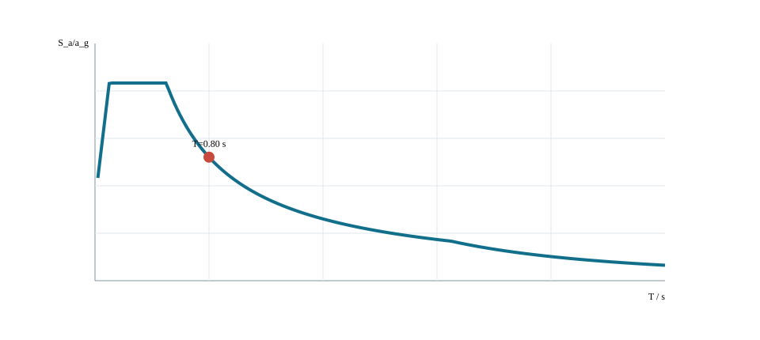
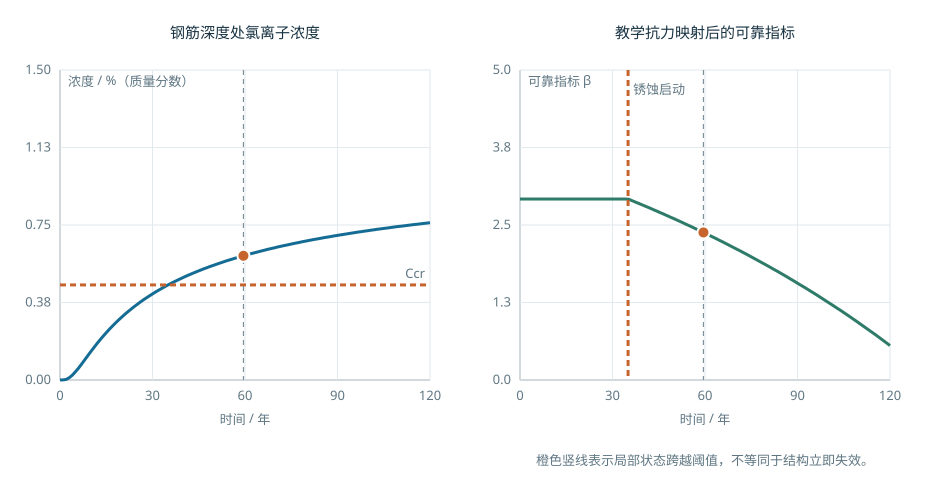
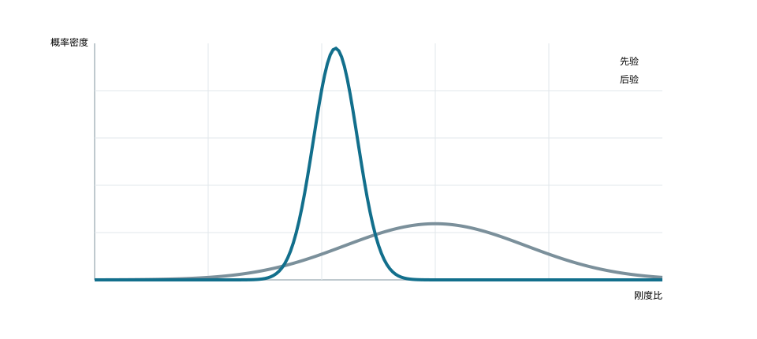

# 地震、耐久与全寿命评价

<!-- CORE-ROUTE START -->

<!-- VISUAL-ENTRY START -->

先从一个看得见的问题开始
<h3>今天看起来一样的两座桥，十几年后还会一样吗？</h3>
保持读取时刻不变，改变劣化速率，比较剩余抗力和抗力余量。
<a href="../interactive/learning-map.html?chapter=ch10-lifecycle">看图进入实验 →</a>

<!-- VISUAL-ENTRY END -->

<h2>本章的核心思考</h2>
把初始验算扩展成随时间更新的判断。
<ol><li>分开初始余量与劣化速率。</li><li>比较循环幅值与累积次数的共同作用。</li><li>明确监测噪声怎样改变证据权重。</li></ol>
<h3>跨课程类比</h3>
概率与统计 → 可靠度和证据更新；损伤累积 → 维护判断

<strong>反例与边界：</strong>教学劣化律不是实桥寿命预测；数据更多也可能只是同一偏差被重复记录。

建议课堂集中完成标为“课堂核心”的3个单元，其余单元用于课前观察和课后迁移。每个单元配独立短视频、操作实验、目标检验与开放论证题。

<article>
C10U01 · 课堂核心
<h3>今天的余量不是全寿命余量</h3>
简化劣化模型中抗力随时间降低，固定效应下余量逐步减小。

<a href="../interactive/core-learning.html?unit=C10U01" target="_blank">操作与迁移任务</a> · <a href="../interactive/core-learning.html?unit=C10U01&amp;view=video" target="_blank">观看短视频</a>
</article><article>
C10U02 · 课前/课后迁移
<h3>抗震需求先区分静力与动力</h3>
单自由度频响只解释动力敏感性，地震峰值还需相应时程或反应谱方法。

<a href="../interactive/core-learning.html?unit=C10U02" target="_blank">操作与迁移任务</a> · <a href="../interactive/core-learning.html?unit=C10U02&amp;view=video" target="_blank">观看短视频</a>
</article><article>
C10U03 · 课前/课后迁移
<h3>同一阻尼措施跨灾种迁移有边界</h3>
阻尼改变动力响应，但不同灾种的频谱和作用机制仍要分别考虑。

<a href="../interactive/core-learning.html?unit=C10U03" target="_blank">操作与迁移任务</a> · <a href="../interactive/core-learning.html?unit=C10U03&amp;view=video" target="_blank">观看短视频</a>
</article><article>
C10U04 · 课前/课后迁移
<h3>劣化速率比初始值更值得追问</h3>
初始抗力相同，劣化速率不同会导致显著不同的长期余量。

<a href="../interactive/core-learning.html?unit=C10U04" target="_blank">操作与迁移任务</a> · <a href="../interactive/core-learning.html?unit=C10U04&amp;view=video" target="_blank">观看短视频</a>
</article><article>
C10U05 · 课前/课后迁移
<h3>截面损失要通过模型映射到性能</h3>
面积损失与惯性矩损失并不总是同一比例，损失位置也重要。

<a href="../interactive/core-learning.html?unit=C10U05" target="_blank">操作与迁移任务</a> · <a href="../interactive/core-learning.html?unit=C10U05&amp;view=video" target="_blank">观看短视频</a>
</article><article>
C10U06 · 课堂核心
<h3>疲劳由循环与幅值共同累积</h3>
教学幂律模型中应力幅增加会使单次循环损伤快速增大。

<a href="../interactive/core-learning.html?unit=C10U06" target="_blank">操作与迁移任务</a> · <a href="../interactive/core-learning.html?unit=C10U06&amp;view=video" target="_blank">观看短视频</a>
</article><article>
C10U07 · 课堂核心
<h3>新证据改变参数判断</h3>
相同先验下，测量结果改变后验均值；测量不确定性控制更新幅度。

<a href="../interactive/core-learning.html?unit=C10U07" target="_blank">操作与迁移任务</a> · <a href="../interactive/core-learning.html?unit=C10U07&amp;view=video" target="_blank">观看短视频</a>
</article><article>
C10U08 · 课前/课后迁移
<h3>监测精度决定证据的权重</h3>
观测噪声越大，后验越依赖先验，不能把所有数据当成同等可靠。

<a href="../interactive/core-learning.html?unit=C10U08" target="_blank">操作与迁移任务</a> · <a href="../interactive/core-learning.html?unit=C10U08&amp;view=video" target="_blank">观看短视频</a>
</article><article>
C10U09 · 课前/课后迁移
<h3>比较方案同时展示不确定性</h3>
平均性能相同的方案，离散程度不同会改变模型中的可靠性。

<a href="../interactive/core-learning.html?unit=C10U09" target="_blank">操作与迁移任务</a> · <a href="../interactive/core-learning.html?unit=C10U09&amp;view=video" target="_blank">观看短视频</a>
</article><article>
C10U10 · 课前/课后迁移
<h3>扩散时间也受尺寸平方控制</h3>
固定扩散系数下，到达相似无量纲状态的时间随特征深度平方增加。

<a href="../interactive/core-learning.html?unit=C10U10" target="_blank">操作与迁移任务</a> · <a href="../interactive/core-learning.html?unit=C10U10&amp;view=video" target="_blank">观看短视频</a>
</article>

<a href="../core-thinking.html">返回全书核心思维与尺度规律</a> · <a href="../core-resources.html">查看110个教学单元总索引</a> · <a href="../interactive/thinking-analogies.html">打开跨课程并排类比</a>

<!-- CORE-ROUTE END -->

::: {.chapter-objectives}
**学习目标。** 理解桥梁在地震、环境劣化、疲劳、冲刷及多灾种条件下的性能演化；掌握从设计状态、服役状态到维护更新的基本评价链；能够说明性能指标、模型证据、不确定性与工程决策之间的关系，并完成包含抗震、耐久与全寿命因素的方案比较。
:::

<figure class="chapter-video-card"><video controls preload="metadata" playsinline poster="../assets/videos/manim/posters/M14_time_reliability.png" src="../assets/videos/manim/M14_time_reliability.mp4"></video><figcaption>M14　性能退化与时变可靠度</figcaption></figure>

本章研究桥梁在时间维度上的性能保持与风险控制。桥梁抗风的机理、试验和控制方法在“桥梁抗风与气动响应”章集中展开；有限元模型形成、模型核验、参数化与智能设计流程在“数字建模、有限元与智能设计”章集中展开。本章保留两者的接口性内容，用于说明风、地震、劣化、监测和维护如何共同进入全寿命评价。这样的分工使专项理论能够完整展开，也保证综合决策仍能调用统一的证据链。

## 全寿命问题、任务与证据链

桥梁性能并非在建成时一次确定。概念设计阶段确定体系与可维护性，施工阶段形成初始几何和初始内力，运营阶段经历交通、环境和偶然事件，检测评估阶段更新对结构状态的认识，维护与加固阶段则改变后续性能轨迹。可将全寿命问题写成状态随时间的演化：

$$
\mathbf z(t)=\mathcal{F}\!\left[\mathbf z(t_0),\,\mathbf a(\tau),\,\mathbf e(\tau),\,\mathbf m(\tau),\,\boldsymbol\theta;\,t_0\leq \tau\leq t\right],
$$

式中：$\mathbf z(t)$ 为时刻 $t$ 的结构状态向量，可包含刚度、强度、损伤、几何和功能指标；$\mathbf a(\tau)$ 为交通、风、地震等作用历程；$\mathbf e(\tau)$ 为温度、氯盐、冻融和冲刷等环境历程；$\mathbf m(\tau)$ 为检查、维修、加固和更换等干预；$\boldsymbol\theta$ 为材料、模型和统计参数。该式是组织概念，不代表所有项目均需建立同一形式的高维模型。教学中应先选择与决策有关的少量状态量，再确定数据和模型层级。

| 阶段 | 主要问题 | 典型证据 | 数字资源中的表达 |
|---|---|---|---|
| 概念与初步设计 | 体系是否具有韧性、耐久和可维护性 | 桥位条件、体系比较、构造可达性 | 方案矩阵、荷载路径、检修空间模型 |
| 施工与成桥 | 初始状态是否达到设计目标 | 施工监测、线形、索力、预应力、材料龄期 | 阶段激活、实测—计算对照、偏差记录 |
| 正常运营 | 安全、适用与耐久指标如何变化 | 交通与环境数据、定检、专项检测 | 状态时程、劣化曲线、关键部位图层 |
| 灾害事件 | 是否超过性能目标，功能能否快速恢复 | 地震、洪水、撞击、极端风记录及损伤 | 多灾种情景、构件状态、恢复时间 |
| 维护更新 | 何时维修、更换或加固更合理 | 检测评估、交通影响、成本与风险 | 干预方案对照、寿命成本和风险变化 |

### 本章问题地图与跨章接口

本章以地震、环境劣化、检测评估、维护更新和多灾种作用下的性能演化为主线。抗风机理与气动分析由第9章展开，有限元离散、模型验证与智能建模由第11章展开；本章只接收这些专项分析形成的状态量、性能指标和不确定性信息，并将其纳入全寿命评价。各专题的内容边界如下。

| 专题 | 本章展开深度 | 输入或输出接口 | 主要位置 |
|---|---|---|---|
| 地震与震后功能 | 核心内容 | 场地与地震动、结构体系、墩柱和支座需求、残余位移、恢复时间 | 本章“抗震性能”“韧性与恢复” |
| 耐久、疲劳与冲刷 | 核心内容 | 环境分区、劣化状态、检测证据、构件与体系性能 | 本章“耐久与劣化”“既有桥评估” |
| 检测、监测与维护 | 核心内容 | 观测误差、状态更新、干预方案、施工状态和复检计划 | 本章“评估与监测”“维护更新” |
| 风与气动响应 | 接口内容 | 接收第9章的设计风、响应统计量、临界状态和施工风风险 | 第9章专项展开，本章用于多灾种和运营决策 |
| 有限元与模型可信度 | 接口内容 | 接收第11章的模型许可、验证记录、参数不确定性和版本信息 | 第11章专项展开，本章用于证据评级 |
| 多目标与全寿命评价 | 综合内容 | 成本、碳排放、交通功能、风险、韧性和维护可实施性 | 本章“参数化与多目标决策” |

::: {.digital-note}
**数字资源10-1　全寿命专题—跨章接口图。** 页面按“专项输入—状态更新—性能指标—行动决策”显示第9章抗风、第10章全寿命评价和第11章数字建模之间的数据关系。节点只列变量、单位、来源和适用状态，不重复专项章节的机理推导。
:::

::: {.digital-note}
**数字资源10-2　模型证据移交清单。** 清单比较简化计算、总体模型、局部模型、试验和监测证据，记录研究问题、保留机制、省略机制、验证结果和可用于的决策。模型建立方法转至第11章，本章只评价证据是否足以支持状态判断与维护行动。
:::

::: {.digital-note}
**数字资源10-3　方案证据与帕累托前沿。** 交互入口设置在本章“参数化与多目标决策”一节。资源读取不同方案的成本、工期、碳排放、维护和性能指标，显示非支配方案及权重敏感性，并保留原始量纲、数据来源和硬约束检查。
:::

### 综合设计任务

综合任务以真实或教学桥位为背景，成果包括：设计条件清单；不少于两个方案的体系草图；作用与组合清单；关键荷载路径；简化计算；数字模型；控制结果与模型核查；施工与维护考虑；方案推荐及证据。人工智能辅助记录应作为附录，注明用于检索、代码、建模或表达的具体环节，并列出人工复核结果。

答辩应围绕以下问题展开：为什么选择该体系；哪些状态控制设计；参数改变会导致什么结果；模型如何验证；结论依赖哪些标准条文和数据；若关键假定不成立，方案如何调整。

### 综合设计的证据链

#### 需求与约束

桥梁方案首先响应跨越需求。设计条件至少包括桥位平纵线形、通航或净空、洪水与冲刷、地质和地震、气象、交通组成、环境与景观、施工场地、既有设施、设计使用年限和维护条件。每项条件应标明数据来源、时间和可信度；缺失资料应列为待补条件，而不是由软件默认值填补。

约束可分为硬约束和评价指标。通航净空、结构安全和法规要求属于必须满足的硬约束；造价、工期、碳排放、景观和维护便利性通常用于方案比较。把硬约束作为加权评分项会产生“其他指标得分高即可抵消不合规”的错误，数字决策工具应先筛除不满足硬约束的方案，再比较可行方案。

#### 体系与传力

每个方案先绘制“作用—构件—连接—约束—基础”传力图。梁桥以弯曲承载为主，拱桥把荷载转化为轴向压力并产生水平推力，斜拉桥由索—塔—梁共同工作，悬索桥由主缆及其几何刚度形成主要承载体系。传力图应解释为什么该体系适应跨径、桥位和施工条件，而不以桥型名称或效果图代替。

#### 状态与验算

设计对象不是单一成桥状态。施工、成桥、运营、维修、偶然和地震状态可能具有不同结构体系、材料性质和边界。综合设计应建立状态矩阵，逐行列出阶段、结构体系、作用、组合、分析方法、控制量和验算标准。任何只在成桥模型上一次加载的方案都需要检查是否遗漏体系形成过程。

#### 结论与证据

每条关键结论至少关联一项证据：规范条文、勘察或统计数据、解析计算、数值模型、试验或成熟工程经验。建议采用下表组织：

| 结论 | 证据 | 适用条件 | 不确定性 | 复核人或复核方法 |
|---|---|---|---|---|
| 桥型满足通航布置 | 总体布置与净空包络 | 当前航道等级和规划水位 | 规划条件可能调整 | 与主管部门批复核对 |
| 主梁截面满足总体受力 | 作用组合与截面验算 | 所列材料、边界和施工状态 | 模型与参数误差 | 手算、独立模型与审查表 |
| 方案维护可实施 | 检修通道和更换工况模型 | 预定设备和交通组织 | 运维条件变化 | 运营单位参与评审 |

## 桥梁抗震设计

#### 性能目标与设计情景

抗震设计先确定桥梁类别、地震水准、预期损伤部位、震后功能和可接受恢复时间，再选择分析方法。性能目标可用“作用水准—构件状态—全桥功能—恢复要求”矩阵表达。常遇地震下通常关注基本运营和可修复损伤，较强地震下关注可控非线性、落梁防护与生命安全；具体分级、设防标准和验算指标必须回查项目采用的现行规范，教材不统一指定数值。

| 性能层 | 需要回答的问题 | 主要响应量 | 典型证据 |
|---|---|---|---|
| 功能保持 | 是否需要立即或短时检查后通行 | 位移、加速度、支座状态、伸缩缝和附属设施 | 弹性分析、装置性能、检查预案 |
| 可修复 | 预期损伤是否集中且可以到达、修复 | 塑性转角、残余位移、墩顶位移、装置行程 | 非线性模型、构造详图、维修工况 |
| 防止倒塌 | 主承载体系、支承和防落梁路径是否完整 | 极限变形、剪切需求、座宽、碰撞和基础状态 | 能力保护、非线性分析、独立审查 |
| 震后恢复 | 多长时间恢复何种交通能力 | 构件损伤、检查时间、材料设备和交通组织 | 恢复情景、备件与应急资源 |

同一座桥在纵桥向、横桥向和竖向可能具有不同传力路径和控制构件。性能目标应落实到构件和连接，避免仅写“满足抗震要求”。例如延性墩柱、弹塑性支座、限位装置和基础分别承担不同功能；若预期塑性部位改变，其余构件的能力保护需求也随之改变。

::: {.source-note}
**规范回查路径。** 交通运输部发布的《公路桥梁抗震设计规范》JTG/T 2231-01—2020自2020年9月1日起施行，官方页面：<https://xxgk.mot.gov.cn/2020/jigou/glj/202006/t20200630_3321370.html>，并附规范正文及解读。项目应从桥梁抗震设防类别、地震作用、分析方法、构件验算和构造措施逐级回查；出版前再次核验标准状态和项目适用性。
:::

#### 地震输入与结构模型

地震作用从场地条件和设计地震动开始。模型质量矩阵 $\mathbf M$、刚度矩阵 $\mathbf K$ 和阻尼矩阵 $\mathbf C$ 决定动力方程

$$
\mathbf M\ddot{\mathbf u}+\mathbf C\dot{\mathbf u}+\mathbf K\mathbf u
=-\mathbf M\mathbf r\ddot u_g(t),
$$

其中 $\ddot u_g(t)$ 为地面加速度，$\mathbf r$ 为影响向量。空间桥梁需考虑纵、横和竖向分量以及支点输入方向。长联、大跨和地质变化显著的桥梁可能需考虑多点输入、行波效应和局部场地差异。

质量来源应可追溯，包括结构自重、桥面附属和规范规定参与地震反应的其他质量。支座、伸缩缝、限位、阻尼器和基础柔度会显著影响周期与位移，不能在静力模型中精细建立、在动力模型中又简化为完全固定而不说明。

#### 反应谱与振型组合

反应谱方法把单自由度体系在不同周期下的最大反应表示为谱值。多自由度结构通过振型分解计算各阶反应，再采用相应方法组合。计算应检查有效质量参与系数、振型数量、近频模态组合、方向组合和偶然偏心。反应谱结果是峰值统计意义上的组合量，不对应一个真实同时发生的时刻。

<iframe loading="lazy" src="../interactive/bridge-concept-screen.html?lab=spectrum" title="结构周期与教学反应谱实验"></iframe>

{#fig-ch10-teaching-spectrum .static-fallback width=88%}

第 $n$ 阶振型的参与系数可写为

$$
\Gamma_n=
\frac{\boldsymbol\phi_n^{\mathsf T}\mathbf M\mathbf r}
{\boldsymbol\phi_n^{\mathsf T}\mathbf M\boldsymbol\phi_n},
$$

其中 $\boldsymbol\phi_n$ 为振型向量，$\mathbf M$ 为质量矩阵，$\mathbf r$ 为地震输入影响向量。参与系数随振型归一化改变，但由其形成的物理响应不应改变。计算报告应保存振型归一化方法、各阶有效质量和累计比例。

反应谱法适合在规定条件下获得多振型峰值需求并进行方案比较，优点是输入清晰、计算稳定、易于规范化；其局限是丢失真实时间顺序，不能直接给出碰撞发生时刻、装置循环、残余位移和损伤累积。对近频模态，简单平方和开方可能低估相关性，应按所采用标准选择组合方法。

#### 反应谱、线性时程与非线性时程的边界

| 方法 | 主要输入 | 适合回答的问题 | 不能单独回答的问题 |
|---|---|---|---|
| 等效静力或简化方法 | 设计参数、等效水平作用 | 规则桥梁的总体数量级和初步构件需求 | 多模态、碰撞、非线性路径和残余位移 |
| 反应谱法 | 阻尼修正设计谱、振型与参与系数 | 多阶峰值需求、方向与构件包络 | 真实同时性、循环次数、滞回和事件时序 |
| 线性时程 | 成组地震动、线性模型 | 响应时序、相位、多点输入和线性装置行程 | 塑性损伤和非线性接触 |
| 非线性时程 | 地震动、非线性本构、接触和装置参数 | 塑性转角、支座滑移、碰撞、滞回、残余位移 | 不能消除地震动选择和模型不确定性 |

时程分析的模型更复杂，并不意味着结果自动更可信。必须说明地震动来源、选择标准、方向、调整方法、谱兼容程度、持续时间和基线处理；说明墩柱、支座、阻尼器、碰撞和土—结构相互作用模型；检查积分步长、收敛、能量和结果离散性。若只选择一条给出较小响应的记录，不能作为设计结论。

#### 延性与能力保护

延性设计允许规定构件在强震下进入可控非线性，通过塑性变形耗能，同时保护不希望发生脆性破坏的构件和连接。能力保护要求按可能形成塑性铰的实际超强弯矩确定相邻剪切、节点和基础需求，使预定延性机制先于脆性机制发生。

桥墩塑性铰区的截面、轴压水平、箍筋约束、纵筋锚固和搭接位置决定变形能力。支座、盖梁、桩基和防落梁装置需与预期机制协调。只完成弹性内力比较不能代替延性和构造设计。

#### 减隔震与位移控制

隔震装置降低体系水平刚度并延长周期，耗能装置增加等效阻尼，两者可降低部分构件力需求，但通常增加位移。理想化单自由度模型的周期为

$$T=2\pi\sqrt{\frac{m}{k}},$$

减小等效刚度 $k$ 会增大周期。实际反应还取决于反应谱形状、装置非线性和多模态。设计必须同步核查伸缩缝、梁端碰撞、防落梁、管线和基础位移，不能只报告基底剪力降低比例。

对于稳定滞回循环，可用割线刚度和等效黏滞阻尼对装置进行教学性表征：

$$
K_{\mathrm{eff}}=\frac{F_{\max}-F_{\min}}
{d_{\max}-d_{\min}},
\qquad
\zeta_{\mathrm{eff}}=
\frac{E_D}{2\pi K_{\mathrm{eff}}d_{\max}^2},
$$

其中 $F_{\max}$、$F_{\min}$ 为循环端点力，单位为 N或kN；$d_{\max}$、$d_{\min}$ 为位移，单位为 m或mm，但计算时须统一；$E_D$ 为一周滞回耗能，单位为 J或$\mathrm{kN\,m}$；$K_{\mathrm{eff}}$ 的单位为 N/m。若循环不对称或装置具有速度、温度和轴力依赖，上式只是指定循环下的等效参数，不能取代完整本构。

能力保护需要把“允许形成的延性机制”和“必须保持弹性或避免脆性破坏的机制”成对列出。设计流程为：确定预期塑性部位；估计其可能达到的实际抗力；由该抗力计算相邻剪切、节点、支座和基础需求；检查构造和变形能力；最后用总体非线性模型验证机制。装置隔震方案也需执行能力保护，防止装置位移尚未充分发挥时连接或基础先破坏。

#### 非线性时程分析

复杂桥梁可采用非线性时程分析研究塑性铰、支座滑移、限位接触和耗能装置。地震动选择与调整应符合采用标准，记录谱匹配、持续时间和方向。输出除最大内力和位移外，还应给出残余位移、塑性转角、装置滞回、碰撞和构件损伤指标。

#### 墩柱非线性与截面—构件接口

桥墩是常规桥梁抗震分析中最常见的非线性构件，但“桥墩进入非线性”不能只用一个折减刚度表示。截面材料、轴力水平、配筋和约束决定弯矩—曲率关系；构件长度、边界和塑性区范围把曲率转化为转角与位移；体系模型再把构件变形分配到全桥。三个层级需要保持参数一致。

截面曲率可写为

$$
\phi=\frac{\varepsilon_c-\varepsilon_s}{d},
$$

其中 $\varepsilon_c$、$\varepsilon_s$ 分别为截面两侧相应位置的应变，$d$ 为两测点间距或有效高度。给定轴力 $N$ 后，通过截面应变协调、材料本构和内力平衡可得到 $M$—$\phi$ 曲线。屈服曲率 $\phi_y$、极限曲率 $\phi_u$ 及曲率延性

$$
\mu_\phi=\frac{\phi_u}{\phi_y}
$$

应注明判定定义。钢筋首次屈服、混凝土达到某压应变、保护层剥落或核心混凝土达到极限状态会给出不同的特征点，不能把软件自动标记当作统一物理定义。

集中塑性铰模型把非线性集中在构件端部，计算效率高，适合全桥非线性分析；分布塑性模型沿单元积分点描述材料非线性，更适合研究塑性发展和轴力变化，但对单元离散、积分规则和材料参数更敏感。两类模型的选择取决于问题，而不是精细程度的排序。

| 模型层级 | 主要输入 | 主要输出 | 必须核查 |
|---|---|---|---|
| 截面分析 | 几何、配筋、材料本构、轴力 | $M$—$\phi$、中性轴、应变状态 | 单位、材料强度定义、轴力符号和应变极限 |
| 塑性铰模型 | 骨架曲线、卸载规则、塑性铰长度 | 端部转角、耗能、残余变形 | 参数与截面分析一致，避免重复计入塑性长度 |
| 纤维构件模型 | 纤维划分、材料循环本构、积分点 | 沿构件曲率、材料应变和滞回 | 网格客观性、循环退化和数值收敛 |
| 全桥模型 | 质量、边界、支座、基础、墩柱非线性 | 构件需求、体系机制、碰撞与残余位移 | 预期机制、能力保护、支点反力和平衡 |

从截面到构件可作教学性位移分解。若墩柱等效为高度 $H$ 的悬臂，屈服前位移包含弹性曲率沿高度积分；进入塑性后，塑性转角可近似写为

$$
\theta_p\approx(\phi-\phi_y)L_p,
$$

其中 $L_p$ 为等效塑性铰长度。墩顶塑性位移与 $\theta_p$ 及转动中心到墩顶的距离有关。$L_p$ 是把分布塑性等效为集中转角的建模参数，其取值须与所用方法、构造和试验依据一致，不宜由教材给出脱离标准的固定比例。

::: {.callout-note}
**候选图10-9　截面—构件—体系三层非线性。** 左图绘制轴力固定时的弯矩—曲率骨架；中图显示曲率沿墩高分布及等效塑性铰；右图显示墩顶位移、梁端间隙和支座位移。三个视图共用同一组材料与几何参数，选择任一特征点时同步显示其物理定义。
:::

#### 支座、限位、碰撞与防落梁路径

地震时上部结构的惯性力通过支座、连接和桥墩传给基础。固定、活动、滑动、隔震和耗能支座在不同方向的力学行为不同；温度位移所需的活动方向与地震限位需求还可能产生矛盾。因此支承系统不能只用“固定端—活动端”的二维符号代表全部功能。

支座或限位装置的分段关系可概念化表示为

$$
F(u)=
\begin{cases}
k_1u, & |u|\le u_y,\\
F_y+k_2(u-u_y), & u>u_y,\\
-F_y+k_2(u+u_y), & u<-u_y,
\end{cases}
$$

其中 $k_1$ 为初始刚度，$k_2$ 为屈服后或滑移后切线刚度，$u_y$、$F_y$ 为特征位移和力。实际装置还可能具有摩擦、速度、温度、老化和竖向力相关性。输入参数应来自产品试验、设计文件或适用标准，并保留试验温度、加载速率和循环次数。

相邻梁端或梁—桥台之间的间隙为 $g_c$。若相对位移

$$
\Delta u(t)=u_1(t)-u_2(t)
$$

满足 $|\Delta u|>g_c$，模型才进入接触阶段。接触刚度过大可能导致高频数值振荡和过小时间步，过小又会低估碰撞力和局部变形。碰撞结果应同时检查接触穿透量、时间步敏感性、能量和相邻构件的相位关系。若研究目的只是座宽和落梁风险，可能不需要用接触峰值力直接进行局部设计；若研究横梁或挡块受力，则需更合适的局部模型和材料破坏准则。

防落梁应按连续传力路径检查：梁体或横梁受力点—连接件—锚固区—墩台或相邻梁体。只给出拉杆直径而未验算锚固、安装间隙、斜向作用和可更换性，不能构成完整防护。座宽、挡块、连接装置和冗余措施的作用应区分：座宽提供位移容限，挡块限制相对运动，连接装置在规定阶段承担拉力或剪力，冗余构造降低单一装置失效的后果。

| 接口 | 常态功能 | 地震状态 | 典型失效 | 需要保存的证据 |
|---|---|---|---|---|
| 活动支座 | 释放温度、收缩等位移 | 滑移、限位或耗能 | 超行程、脱空、剪切或锚固破坏 | 方向、行程、摩擦／本构、竖向稳定 |
| 固定支座 | 传递水平力 | 承担惯性力或形成预期释放 | 强度、锚固、脆性连接破坏 | 设计力、超强需求、连接详图 |
| 伸缩缝 | 适应常态梁端位移 | 闭合、张开或碰撞 | 超行程、构件撞坏、功能中断 | 初始间隙、温度基准、相对位移时程 |
| 挡块／限位 | 非工作或限幅 | 接触后传力 | 局部压碎、剪断、墩帽破坏 | 间隙、接触面、容量及被保护构件 |
| 防落梁装置 | 保持松弛或有限约束 | 大位移后建立第二传力路径 | 拉断、锚固拔出、安装冲突 | 自由长度、变形能力、锚固与检查空间 |

#### 基础柔度、土—结构相互作用与多支点输入

把墩底完全固结可用于初步分析，但深水基础、软土、液化敏感场地或高墩桥梁可能受基础柔度影响。基础平动、转动和耦联刚度改变体系周期、墩柱弯矩分布及桩土需求。简化弹簧模型应说明弹簧方向、参考点、是否随位移退化以及是否包含群桩效应；精细土体模型则需说明本构、边界范围、初始应力和孔压条件。

若以六自由度刚度矩阵描述基础，可写为

$$
\begin{bmatrix}\mathbf F\\\mathbf M\end{bmatrix}
=
\begin{bmatrix}
\mathbf K_{tt}&\mathbf K_{tr}\\
\mathbf K_{rt}&\mathbf K_{rr}
\end{bmatrix}
\begin{bmatrix}\mathbf u\\\boldsymbol\theta\end{bmatrix},
$$

其中下标 $t$、$r$ 分别表示平动与转动。若忽略耦联项，需证明其对研究响应不敏感。弹簧值来自静力荷载—位移关系时，用于循环地震响应还要考虑滞回、辐射阻尼和刚度退化；不同分析目标可能需要不同层级的基础模型。

长桥各支点的地震输入可能因波传播、场地条件和相干性而不同。多支点输入下，结构反应包含动力分量和支点相对位移引起的拟静力分量。此时不能把所有支点简单施加同一加速度并认为已覆盖不利情况。输入数据应说明各支点记录、时间延迟、相干模型、基线处理和位移相容性；模型坐标和支点方向应与地震动分量一致。

液化、侧向扩展和永久地面变形不同于仅输入地面加速度。它们可能通过桩土运动、土层强度退化或桥台位移向结构施加需求。教材交互可把基础柔度和支点时差设为概念参数，展示周期与梁端相对位移变化；项目设计必须由场地勘察、地震安全性评价及相应岩土分析支持。

#### 地震分析的分级验证

抗震模型宜按由简到繁的顺序建立验证链，而不是直接在一个全桥非线性模型中同时调节全部参数。

1. **静力平衡层。** 检查恒载反力、质量与重量换算、坐标方向和约束反力；
2. **线性动力层。** 对照单墩或简化体系周期，检查振型方向、有效质量、基础柔度和支座耦联；
3. **反应谱层。** 检查谱单位、阻尼修正、模态与方向组合、峰值符号和构件包络；
4. **单构件非线性层。** 验证墩柱、支座、阻尼器和接触单元的骨架、循环及能量；
5. **全桥非线性层。** 检查机制、收敛、时间步、输入组离散性、残余位移和能力保护；
6. **独立证据层。** 用另一模型、试验、监测或审查计算验证最影响结论的响应。

每一级形成可归档检查表。进入下一层前，应明确上一层无法回答的问题；若线性模型已经暴露质量、边界或坐标错误，不宜通过调整非线性参数使结果“看起来合理”。

::: {.digital-note}
**数字资源10-4　桥梁抗震传力与位移实验。** 采用一联连续梁桥的纵桥向教学模型，可切换固定支座、滑动支座和双线性隔震装置，调节桥墩刚度、基础转动刚度、梁端间隙与输入相位差。页面同时显示振型、支点相对位移、支座滞回、墩底弯矩和反力平衡；所有默认参数标注为教学值，规范参数由教师另行导入。
:::

## 抗风接口与多灾种设计

#### 风环境和静力三分力

桥位基本风速需结合地形、地貌、高度和重现期转换为设计风场。平均风对桥面产生阻力、升力和力矩，常写成

$$D=\tfrac12\rho U^2BC_D,
\quad L=\tfrac12\rho U^2BC_L,
\quad M=\tfrac12\rho U^2B^2C_M,
$$

其中 $\rho$ 为气密度，$U$ 为风速，$B$ 为参考宽度，$C_D$、$C_L$、$C_M$ 为随攻角和截面变化的系数。系数必须来自适用试验或可靠资料，不能由外观相近截面随意替代。

#### 涡振、抖振和颤振

涡振与涡脱落频率和结构频率接近有关，常用斯特劳哈尔关系 $f_s=St\,U/B$ 判断可能锁定风速范围。抖振由脉动风随机激励，输出是位移、加速度和内力统计量。颤振是结构运动诱导气动力与结构振动耦合形成的自激不稳定，临界风速是重要控制指标。

三者的物理机制、输入和验算指标不同。数字资源采用同一桥面截面，分别显示周期性有限振幅响应、随机响应时程和随风速增长的负阻尼趋势，帮助学生建立区别。静态图和动画均应标明是概念模型、节段模型试验还是全桥分析。

#### 施工阶段抗风

桥塔裸塔、大悬臂、未合龙主梁、猫道和主缆架设阶段的刚度、阻尼与气动外形不同于成桥。施工期虽较短，也可能处于台风或强风环境。计划应规定阶段临界风速、停工和加固条件、临时拉索或支承以及气象预警。施工顺序调整也是抗风措施的一部分。

## 耐久环境、劣化机理与时变性能

#### 环境—材料—构造

耐久性由暴露环境、材料传输和劣化性能、构造细节、施工质量及维护共同决定。设计应把构件划分为不同暴露区，例如浪溅区、盐雾区、冻融区、积水区和箱内环境，并分别确定保护层、材料、裂缝控制、防护与排水措施。

氯离子侵入常用扩散模型解释。在一维半无限介质和理想边界下，浓度可表示为

$$
C(x,t)=C_s-(C_s-C_0)\operatorname{erf}\left(\frac{x}{2\sqrt{D_at}}\right),
$$

其中 $C_s$ 为表面浓度，$C_0$ 为初始浓度，$D_a$ 为表观扩散系数。该式用于认识保护层厚度、时间和扩散系数的影响；实际 $D_a$ 随龄期、温湿度、裂缝和材料变化，寿命预测须明确模型与参数依据。

#### 氯盐侵入模型的变量与边界

采用上述误差函数解时，各变量必须使用相容单位。

| 变量 | 含义 | 可采用单位 | 使用条件 |
|---|---|---|---|
| $x$ | 距暴露表面的深度 | m或mm | 与 $D_a$ 的长度单位一致 |
| $t$ | 暴露时间 | s或年 | 与 $D_a$ 的时间单位一致 |
| $C(x,t)$ | 深度 $x$ 处氯离子浓度 | 质量百分数或$\mathrm{kg/m^3}$ | $C_s,C_0,C_{\mathrm{cr}}$ 必须同一基准 |
| $C_s$ | 等效表面浓度 | 同上 | 理想恒定边界；潮汐、盐雾和除冰盐环境可能随时间变化 |
| $C_0$ | 初始浓度 | 同上 | 由材料和施工资料或检测确定 |
| $C_{\mathrm{cr}}$ | 钢筋锈蚀启动临界浓度 | 同上 | 属不确定参数，不是跨项目常数 |
| $D_a$ | 表观扩散系数 | $\mathrm{m^2/s}$或$\mathrm{mm^2/year}$ | 受龄期、温湿度、裂缝、胶凝材料和试验方法影响 |
| $c$ | 保护层厚度 | m或mm | 应采用实际分布，而非只有图纸名义值 |

在 $C_s$、$C_0$ 和 $D_a$ 近似恒定时，令钢筋深度 $x=c$ 处达到 $C_{\mathrm{cr}}$，可得到启动时间

$$
t_i=
\frac{c^2}
{4D_a
\left[
\operatorname{erf}^{-1}
\left(\frac{C_s-C_{\mathrm{cr}}}{C_s-C_0}\right)
\right]^2}.
$$

这一闭式解用于教学参数敏感性分析。若 $D_a(t)$、$C_s(t)$ 或温度显著变化，应回到变系数传输模型；裂缝会形成优先通道，不能只用增大一个恒定扩散系数解释所有情况。锈蚀启动也不等于构件达到极限状态，后续还需模拟钢筋截面损失、黏结退化、裂缝剥落和结构抗力变化。

#### 碳化与锈蚀传播

碳化深度常用平方根关系作概念表达：

$$
x_c(t)=k_c\sqrt{t},
\qquad
t_{i,c}=\left(\frac{c}{k_c}\right)^2,
$$

其中 $x_c$、$c$ 可用 mm，$t$ 用年，则碳化系数 $k_c$ 的单位为 $\mathrm{mm/\sqrt{year}}$。该关系适合一定环境和材料条件下的经验描述；$k_c$ 受相对湿度、二氧化碳浓度、水胶比、养护、表面处理和裂缝影响。采用现场检测数据时，应记录测试龄期、测区、暴露面和测量方法。

锈蚀传播阶段可用钢筋直径损失或质量损失描述。例如教学模型可写为

$$
\Delta d(t)=k_r(t-t_i)^p,\qquad t>t_i,
$$

其中 $\Delta d$ 为直径损失，单位为 mm；$k_r$ 的单位随指数 $p$ 而变。该式仅是经验框架，必须由暴露、检测或文献数据标定。把氯盐启动模型、碳化模型和锈蚀速率模型直接串联时，应防止将相互相关的环境参数重复计入。

#### 冻融、钢结构腐蚀与防护寿命

冻融损伤与饱水程度、最低温度、循环次数、含气量和盐作用有关。教学表达可选相对动弹性模量、质量损失和表面剥蚀作为状态指标，但具体试验判据回查耐久性标准。钢结构防护体系则应区分涂层初始失效、局部锈蚀扩展和截面损失；重涂周期不是材料名称的固定属性，还取决于环境、表面处理、施工质量、积水和检查维护。

::: {.source-note}
**耐久规范回查路径。** 交通运输部发布《公路工程混凝土结构耐久性设计规范》JTG/T 3310—2019，官方页面：<https://xxgk.mot.gov.cn/jigou/glj/202006/t20200623_3313135.html>。本章公式用于解释变量关系，环境作用等级、材料和构造要求、参数取值及检验方法必须回查项目采用的现行标准；不同浓度基准不得混用。
:::

#### 疲劳

车辆反复作用会在钢桥焊接细节、钢筋、预应力筋、拉索和连接处形成疲劳累积。疲劳评价需识别应力幅而非只看最大应力。采用 S—N 方法时，不同细节类别具有不同曲线；变幅循环可用雨流计数和累积损伤方法处理。交通量增长、重车比例和动力效应是重要输入。

S—N关系可概念化写为

$$
\log_{10}N=\log_{10}A-m\log_{10}\Delta\sigma,
$$

其中 $N$ 为给定应力幅下的循环次数，无量纲；$\Delta\sigma$ 为应力范围，通常用 MPa；$A$ 和斜率 $m$ 与细节类别、曲线分段及采用标准有关。变幅荷载的Palmgren—Miner线性累计损伤为

$$
D_f=\sum_{i=1}^{k}\frac{n_i}{N_i},
$$

其中 $n_i$ 为第 $i$ 档实际循环数，$N_i$ 为相同应力范围下对应的疲劳寿命。$D_f$ 无量纲。$D_f=1$ 是理想化累积判据，不代表所有实桥在同一数值发生裂纹；应力范围提取、平均应力、序列效应、腐蚀和检测能力均会改变评估。

疲劳分析的数据链为“车辆轴重与车流—结构影响线或时程—热点应力范围—雨流计数—细节S—N曲线—累积损伤—检查计划”。有限元局部热点应力必须和所用细节曲线的应力定义一致。

#### 冲刷与基础性能演化

冲刷是水动力、河床材料、桥墩和基础几何共同作用的结果，可能在一次洪水中快速发生，也可能长期累积。状态变量可用冲刷深度 $z_s(t)$ 表示，单位为 m；有效埋置深度可写为

$$
L_e(t)=L_{e,0}-z_s(t).
$$

冲刷会改变桩侧土层、基础刚度、承载和动力特性。若用等效水平刚度 $k_f(t)$ 表示基础，桥墩—基础体系周期可能随 $k_f$ 降低而增大。冲刷深度计算需要流量、流速、水深、墩宽、墩形、夹角、床沙粒径和河床演变等资料，具体公式和安全储备回查水文、基础与养护标准。

冲刷监测可采用水深测量、声呐、埋设传感器、影像和洪后检查。读数必须转换到统一高程基准，并区分总体河床下降、局部冲刷和回淤。一次洪后回淤不等于洪峰期间未出现更深冲刷，结构评估应考虑事件过程。

#### 随时间变化的极限状态

把多种劣化汇入结构评价时，可写

$$
g(t)=R\!\left[\mathbf z(t)\right]-S(t),
\qquad
P_f(t)=P[g(t)\le0],
$$

其中 $R[\mathbf z(t)]$ 为状态相关抗力，$S(t)$ 为作用效应。氯盐、碳化、疲劳和冲刷的状态量不应直接相加，而应分别改变材料、截面、连接、边界或作用，再由结构模型计算效应和抗力。只有在明确概率模型和相关性后，才能计算随时间失效概率。

<iframe loading="lazy" src="../interactive/ch10-deterioration-reliability-lab.html" title="氯盐侵入、教学截面劣化与可靠指标实验"></iframe>

{#fig-ch10-deterioration-fallback .static-fallback width=90%}

::: {.digital-note}
**数字资源10-1　劣化与可靠指标。** 改变时间、保护层厚度和扩散参数，观察氯盐剖面、教学截面损失以及$R$—$S$分布的变化。页面中的劣化—抗力映射用于说明计算链，不构成具体桥梁的耐久寿命或安全结论。
:::

#### 可检查、可维护和可更换

耐久设计不只提高材料指标，还要使关键部位能够检查、排水、除湿、涂装和更换。箱梁需设置人孔、照明和排水；斜拉索、吊索和支座需具备更换工况；钢箱梁疲劳细节需可接近。三维模型可把检查路径、作业空间和设备包络作为几何约束进行碰撞检查。

## 状态—构件—结构性能映射

耐久预测的困难不只在于估计氯盐、碳化、锈蚀或疲劳裂纹的发展速度，还在于把局部材料状态转换成构件和体系性能。钢筋处氯离子浓度、超声波波速、半电池电位或涂层锈蚀面积都不是承载能力本身。它们需要通过明确的物理模型改变材料、截面、连接或边界参数，再由结构模型得到抗力、刚度、疲劳寿命和使用性能。

#### 四级映射链

建议将映射划分为四级。

1. **局部状态级：** 氯离子浓度、碳化深度、钢筋直径损失、钢板厚度损失、裂纹尺寸、剥落深度、冲刷深度、支座摩擦或滑移状态；
2. **构件参数级：** 有效截面面积、惯性矩、材料强度、黏结锚固、预应力、疲劳细节类别、连接刚度、基础弹簧；
3. **结构响应级：** 刚度矩阵、内力重分配、变形、裂缝、振动、稳定、承载与疲劳验算；
4. **功能与决策级：** 通行能力、限载、检查频率、维修需求、加固或更换时点、灾后恢复。

可用组合映射表示：

$$
\mathbf z_{\mathrm{loc}}(t)
\xrightarrow{\ \mathcal M_1\ }
\boldsymbol\theta_{\mathrm{comp}}(t)
\xrightarrow{\ \mathcal M_2\ }
\{\mathbf K(t),\mathbf R(t),\mathbf C(t)\}
\xrightarrow{\ \mathcal M_3\ }
\mathbf y(t)
\xrightarrow{\ \mathcal D\ }
a(t),
$$

其中 $\mathbf z_{\mathrm{loc}}$ 为局部状态向量；$\boldsymbol\theta_{\mathrm{comp}}$ 为构件参数；$\mathbf K,\mathbf R,\mathbf C$ 分别表示结构刚度、抗力和阻尼或耗能参数；$\mathbf y$ 为响应或性能指标；$a(t)$ 为检查、养护、限载、加固等行动。每一个箭头都有适用条件和模型误差。数字模型应保存映射版本，不能只保存最终“健康分数”。

#### 钢筋锈蚀至截面与抗力

设第 $i$ 根钢筋初始直径为 $d_{i0}$，时刻 $t$ 的等效直径损失为 $\Delta d_i(t)$，则剩余面积可写为

$$
A_s(t)
=
\sum_{i=1}^{n_b}
\frac{\pi}{4}
\left[d_{i0}-\Delta d_i(t)\right]^2.
$$

$d_{i0}$、$\Delta d_i$ 采用mm时，$A_s$ 的单位为mm$^2$。均匀直径损失只是概念模型；点蚀会使最小局部面积、应力集中和延性下降，不能由同一质量损失唯一确定。检测得到平均锈蚀率时，构件评估还需说明如何转换为不利截面、沿构件分布及钢筋间相关性。

钢筋混凝土截面抗力可概念化表示为

$$
M_R(t)
=
\mathcal R_M
\left[
f_c(t),f_y(t),A_s(t),A'_s(t),
c_{\mathrm b}(t),\boldsymbol\eta_{\mathrm{bond}}(t),
\boldsymbol\eta_{\mathrm{geom}}(t)
\right],
$$

其中 $f_c$、$f_y$ 分别为混凝土与钢筋强度，单位MPa；$c_{\mathrm b}$ 表示保护层和有效截面几何；$\boldsymbol\eta_{\mathrm{bond}}$ 表示黏结、锚固和搭接影响；$\boldsymbol\eta_{\mathrm{geom}}$ 表示剥落、压区损失和钢筋位置变化。函数 $\mathcal R_M$ 应由项目采用的截面分析与规范方法确定。若只按剩余钢筋面积折减而保持黏结、混凝土和延性不变，属于明确的简化假定。

锈胀裂缝和保护层剥落可能先影响耐久、外观和使用性能，随后影响黏结与截面。其发展具有空间离散性。以单个测点的腐蚀率代替整联桥，需要给出测点代表区和不利分位数；以最不利点代替全构件则可能过度保守。合理方法是把构件分区并为每区建立状态分布。

#### 钢构件腐蚀至截面性能

<!-- FORMULA-SCAFFOLD ch10-lifecycle START -->
::: {.formula-scaffold}
**先看这个问题。** 从翼缘和腹板各损失同样多的钢材，剩余抗弯刚度会一样吗？先数还剩多少面积，再看这些材料离弯曲轴多远。

还剩哪些材料重新确定形心轴按离轴距离累计作用

这组符号分别指什么？

Ωr 是腐蚀后剩余的截面区域，dA 是其中一小块面积；y 是到所研究弯曲轴的距离。Ar 只累计面积，Ir 还按距离平方加权。通常需重算剩余截面的形心轴；这种截面比较不能直接替代稳定、疲劳或实际抗力验算。

:::
<!-- FORMULA-SCAFFOLD ch10-lifecycle END -->

对初始厚度 $t_0(s)$ 的钢板，位置 $s$ 处测得双面等效厚度损失 $\Delta t(s,\tau)$ 后，剩余厚度

$$
t_{\mathrm r}(s,\tau)
=t_0(s)-\Delta t(s,\tau),
$$

单位为mm。板件面积、形心和惯性矩应由剩余几何重新计算：

$$
A_{\mathrm r}(\tau)
=
\int_{\Omega_{\mathrm r}(\tau)}\mathrm dA,
\qquad
I_{\mathrm r}(\tau)
=
\int_{\Omega_{\mathrm r}(\tau)}y^2\,\mathrm dA.
$$

面状均匀腐蚀、局部点蚀和连接区缝隙腐蚀对稳定与疲劳的影响不同。把所有厚度读数取平均可能保留总面积，却掩盖受压板局部最薄区和螺栓孔边缘应力集中。钢梁评估至少分别检查：

- 截面面积变化对轴力与剪力承载的影响；
- 惯性矩和截面模量变化对刚度与弯曲抗力的影响；
- 板件宽厚比变化对局部稳定的影响；
- 横隔、加劲肋和连接区损伤对传力路径的影响；
- 腐蚀表面与焊接细节对疲劳裂纹起始和扩展的影响。

厚度检测的探头直径、耦合、表面处理和网格间距决定可分辨的空间尺度。模型网格不应比检测分辨率精细到产生虚假精度。若未检测区域由插值补齐，需保存插值方法和不确定性。

#### 疲劳裂纹至剩余性能

S—N方法把应力范围历史映射为累计损伤，适合尚未显式识别裂纹的细节评估。发现裂纹后，可在适用条件下采用断裂力学描述扩展。一类概念关系为Paris定律

$$
\frac{\mathrm da}{\mathrm dN}
=
C(\Delta K)^m,
\qquad
\Delta K=Y(a)\Delta\sigma\sqrt{\pi a},
$$

其中 $a$ 为裂纹特征尺寸，单位m或mm；$N$ 为循环数；$\Delta K$ 为应力强度因子范围，常用MPa$\sqrt{\mathrm m}$；$Y(a)$ 为无量纲几何函数；$C,m$ 为材料、环境和应力比相关参数。单位体系改变时 $C$ 的数值和量纲随之改变。Paris关系只适用于相应稳定扩展区间，不能覆盖裂纹萌生、门槛附近和快速断裂全过程。

裂纹对体系性能的影响取决于细节位置和冗余。一个次要构件表面裂纹与主承载构件脆性细节中的贯穿裂纹，即使长度相同，风险含义也不同。映射步骤包括：检测裂纹位置与方向；建立局部应力场；判断裂纹模式与几何修正；预测扩展及临界状态；把局部刚度或连接能力更新到总体模型；评价替代传力路径。不能只用裂纹长度排序维修优先级。

腐蚀—疲劳耦合时，截面损失提高名义应力，点蚀提高局部应力集中，环境还可能改变裂纹扩展参数。若证据不足，可用情景法分别计算“仅截面损失”“截面损失加不利应力集中”和“检测到裂纹后的断裂力学”三层，而不把所有机制压缩成一个未经标定的折减系数。

#### 预应力与索类构件

预应力混凝土桥的性能还取决于有效预应力 $P_{\mathrm e}(t)$。可概念化写为

$$
P_{\mathrm e}(t)
=P_0-\Delta P_{\mathrm{inst}}
-\Delta P_{\mathrm{long}}(t)
-\Delta P_{\mathrm{damage}}(t),
$$

其中 $P_0$ 为张拉控制力，单位N；$\Delta P_{\mathrm{inst}}$ 为锚具变形、摩阻和弹性压缩等即时损失；$\Delta P_{\mathrm{long}}$ 为收缩、徐变、松弛等长期损失；$\Delta P_{\mathrm{damage}}$ 为腐蚀断丝、滑移或锚固异常引起的损失。最后一项不能仅由表面裂缝推定，需要索力、磁检测、声学或开窗等证据。

拉索、吊杆和主缆具有“多根钢丝—索股—整索—索体系”的层级。少量断丝可能由其他钢丝重分配，锚头区域损伤则可能形成共同薄弱点。评价应同时记录断丝数量或面积、位置、锚固状态、防护系统、索力、振动和可更换性。整体索力正常不能排除局部钢丝损伤，单根钢丝缺陷也不能直接等同于整索失效。

#### 裂缝、剥落与桥面系功能

混凝土裂缝既可能是劣化入口，也是受力和约束的响应。裂缝宽度 $w_c$、长度、深度、方向、间距和活动性应成组记录。对耐久，裂缝影响水和氯盐传输；对结构，裂缝改变有效刚度、剪切传递、黏结和局部受力；对使用，裂缝和剥落影响行车与防水。不能由一个最大裂缝宽度同时代表三类性能。

桥面铺装、防水、伸缩缝和排水是连续防护链。伸缩缝渗水可能在梁端、支座、盖梁和锚固区形成集中劣化。局部修补桥面混凝土而不处理水路径，会使下游构件继续劣化。数字模型宜将“水从何处进入、沿何处迁移、哪些构件受影响”作为拓扑关系，而不只是表面病害点云。

#### 支座、伸缩缝和连接状态

支座病害会把耐久问题转换为边界条件问题。活动支座卡阻使温度、收缩和制动力重新分配；脱空改变竖向接触；锚栓腐蚀影响地震传力；摩擦材料老化改变滑移阈值。可把支座状态参数写为

$$
\boldsymbol\theta_b(t)
=
\{k_x,k_y,k_z,k_\theta,\mu,F_y,d_{\max}\},
$$

其中 $k$ 为各向刚度，单位N/m或N·m/rad；$\mu$ 为摩擦系数；$F_y$ 为屈服或限位力，单位N；$d_{\max}$ 为可用行程，单位m。检测应说明每个参数是实测、反演、产品资料还是假定。仅在有限元中把“损坏支座”设为铰或固定，往往不能表达摩擦、间隙和单向接触。

螺栓、焊缝、锚具和湿接缝的状态影响构件之间能否协同。局部连接刚度退化可能先改变荷载横向分配和疲劳热点，整体挠度变化却很小。若评估问题涉及连接，应使用梁格、壳或局部模型；单梁模型通过整体刚度拟合不能确认连接完好。

#### 冲刷至基础与全桥响应

冲刷深度只是几何状态，结构性能映射还需地层、桩径、群桩、承台和水位。可把每根桩的土弹簧写为随深度和时间变化的关系

$$
p(z,t)=\mathcal P[y(z,t);z_s(t),\boldsymbol\theta_{\mathrm{soil}}],
$$

其中 $p$ 为单位桩长土反力，单位N/m；$y$ 为桩侧位移，单位m；$z_s$ 为冲刷深度，单位m；$\boldsymbol\theta_{\mathrm{soil}}$ 为土层和循环退化参数。冲刷后应移除或更新被冲失土层的侧向、轴向和端承贡献，并检查桩自由长度、弯矩、稳定及基础转动。

一次洪峰中的最大冲刷可能随后回淤。洪后测得的河床面不能唯一恢复峰值状态；需要声呐时程、埋置传感或水动力模型辅助。将洪后深度作为地震前状态时，应说明情景时序：地震发生在洪峰、回淤前还是修复后，会得到不同基础边界。

#### 空间离散与相关性

劣化通常呈斑块或带状分布。设构件沿长度的截面损失率为 $\eta(x,t)$，其均值和协方差为

$$
\mu_\eta(x,t)=E[\eta(x,t)],
\qquad
C_\eta(x_1,x_2,t)
=
E\{[\eta(x_1,t)-\mu_\eta(x_1,t)]
[\eta(x_2,t)-\mu_\eta(x_2,t)]\}.
$$

完全相关假定会使整段构件同步退化，完全独立假定会使局部极值被平均；二者都可能不符合真实环境。检测网格应由预期相关尺度和关键受力区确定。数据不足时，可以采用若干相关长度情景，观察承载与维修面积的敏感性。

空间映射宜遵循“检测单元—评定构件—有限元单元”三层编号。检测点不直接绑定可变的有限元节点，而绑定稳定的构件坐标和表面位置；模型更新时再由映射表投影到单元。这样网格改变不会丢失历史检测数据。

#### 性能指标与模型层级

| 层级 | 典型指标 | 建议模型 | 主要证据边界 |
|---|---|---|---|
| 材料／局部 | 氯盐、碳化、厚度、裂纹、断丝 | 传输、断裂或局部实体模型 | 测区代表性和检测误差 |
| 截面 | $A,I,W$、预应力、曲率、抗力 | 纤维截面或规范截面分析 | 黏结、剥落与残余应力 |
| 构件 | 挠度、稳定、疲劳、延性 | 梁、壳或局部—总体子模型 | 边界、连接和荷载历史 |
| 体系 | 内力重分配、冗余、动力与落梁 | 全桥空间模型 | 构件状态投影和模型确认 |
| 功能 | 通行等级、封闭时间、恢复能力 | 结构—交通—运维情景 | 决策规则和网络替代路径 |

模型层级应由决策反推。若任务只是安排下一次氯盐检测，不一定需要全桥非线性分析；若决定限载或更换主梁，仅有局部材料检测不够。高层模型不应掩盖低层证据不足。

#### 随时间的结构极限状态

构件极限状态可展开为

$$
g_j(t)
=
R_j[
\boldsymbol\theta_{\mathrm{mat}}(t),
\boldsymbol\theta_{\mathrm{sec}}(t),
\boldsymbol\theta_{\mathrm{conn}}(t)]
-
S_j[
\mathbf L(t),
\boldsymbol\theta_{\mathrm{boundary}}(t)],
$$

其中 $R_j$ 与 $S_j$ 使用一致单位，例如弯矩均为N·m。$\mathbf L(t)$ 表示交通、温度、风、地震等作用状态。耐久劣化既可降低 $R_j$，也可通过支座卡阻、铺装增厚、冲刷或车流增长改变 $S_j$。只对抗力乘统一时间折减系数，无法表达这些机制。

体系失效并非所有构件极限状态的简单相加。串联系统、并联系统和可重分配体系需要不同逻辑。对有冗余的连续梁或桁架，局部构件达到某限值后可能发生内力重分配，但这不意味着可以忽略局部脆性破坏、渐进失效和使用功能。必要时通过非线性增量分析或移除构件情景检验替代传力路径。

#### 映射的不确定性与验证

局部状态、模型参数和性能之间的误差可写成

$$
\mathbf y_{\mathrm{obs}}
=
\mathcal H[
\mathcal M(\mathbf z_{\mathrm{loc}})
]
+\boldsymbol\varepsilon_{\mathrm{model}}
+\boldsymbol\varepsilon_{\mathrm{meas}},
$$

$\mathcal M$ 为状态—结构映射，$\mathcal H$ 为结构响应—传感观测映射；两类误差不可混为一项。验证映射可采用取芯／开窗、局部加载、构件试验、荷载试验、长期监测和维修后复测。用于确认局部厚度检测的方法，不自动确认全桥承载模型；每层都要有对应证据。

::: {.source-note}
**现场检测规范回查路径。** 《在用公路桥梁现场检测技术规程》JTG/T 5214—2022由交通运输部发布，自2022年11月1日起施行，官方入口：<https://xxgk.mot.gov.cn/jigou/glj/202209/t20220913_3679697.html>。该规程把现场检测定位为桥梁评定和养护维修的基础，并强调准确性与可靠性。具体检测项目、方法、抽样和结果表达应回查现行正文；本节只建立从检测量到结构性能的映射框架。
:::

::: {.callout-note}
**候选图10-9　局部劣化至体系性能的四级映射。** 建议课程组以一片预应力混凝土箱梁为对象，自绘“氯盐／裂缝／钢筋损失—截面参数—构件内力与变形—全桥通行与维护”四列图。点击局部测区可显示检测分辨率与误差，点击有限元单元可反查其接收了哪些状态数据。正式版使用课程组计算结果，不采用未经授权的病害照片。
:::

::: {.callout-note}
**候选图10-10　同一平均截面损失的不同空间分布。** 用课程组合成厚度网格生成均匀腐蚀、局部点蚀和连接区腐蚀三幅图，保持平均质量损失一致，再比较面积、惯性矩、局部稳定和疲劳热点。图和CSV由课程组生成，用于说明平均值不能唯一确定结构性能。
:::

## 全寿命评价、韧性与维护决策

#### 经济边界

全寿命成本可写为

$$
C_{\mathrm{LCC}}=C_0+\sum_{t=1}^{T}\frac{C_{m,t}+C_{u,t}+C_{r,t}}{(1+i)^t},
$$

其中 $C_0$ 为初始成本，$C_{m,t}$、$C_{u,t}$、$C_{r,t}$ 分别为维护、用户延误和风险相关成本，$i$ 为折现率。计算必须说明评价期、价格基准、折现和交通增长假定。缺少可靠数据时，应给出范围和敏感性，而不是输出过度精确的单值。

#### 碳排放边界

碳评价可涵盖材料生产、运输、施工、维护更换和报废。不同方案比较必须使用一致功能单位和系统边界，例如“满足同一跨越功能、同一设计年限的一座桥”。减少初始材料不一定降低全寿命排放，若导致频繁维修或交通中断，总体结果可能改变。

#### 风险与韧性

风险可概括为事件概率与后果的组合。韧性关注结构遭受事件后的性能下降、恢复速度和恢复成本。方案评价可同时考虑冗余、替代通道、可修复构造和应急检查。概率或评分均应有数据和等级依据。

#### 维护时点与折现

维护时点同时影响直接费用、交通中断、劣化速度和失效风险。对候选维护时点 $\tau$，可把评价函数概念化写为

$$
J(\tau)=C_0+
\frac{C_m(\tau)+C_u(\tau)+E[C_e(\tau)]}{(1+i)^\tau}
+\sum_{t=\tau+1}^{T}
\frac{E[C_{r,t}\mid \tau]}{(1+i)^t},
$$

其中 $C_m$ 为维护费用，$C_u$ 为用户延误等间接费用，$C_e$ 为施工事件费用，$C_{r,t}$ 为后续风险损失，货币单位应一致；$i$ 为年折现率，无量纲；$T$、$\tau$ 以年表示。该式的意义是比较同一系统边界下的策略，而不是认为远期安全损失可仅按财务折现处理。安全、法规和最低性能属于硬约束，不能因现值较小而被经济指标抵消。

维护优化应至少比较“不干预、预防性维护、达到阈值后维修、计划更换”四类策略，并对劣化速率、交通增长、折现率、维修效果和事件概率进行敏感性分析。若最优时点随小幅参数变化大幅移动，应把结果写成时段或触发条件，而不是精确到某一天。

#### 碳排放清单与功能单位

寿命周期碳排放可写为

$$
G_{\mathrm{LC}}=
\sum_{s=1}^{n_s}\sum_{j=1}^{n_j}
Q_{s,j}EF_{s,j},
$$

其中 $s$ 表示材料生产、运输、施工、运营维护、拆除回收等阶段；$Q_{s,j}$ 为活动量，如材料质量t、运输周转量$\mathrm{t\,km}$或设备能耗kWh；$EF_{s,j}$ 为相应排放因子；$G_{\mathrm{LC}}$ 可用 $\mathrm{kg\,CO_2e}$ 或 $\mathrm{t\,CO_2e}$。不同来源的排放因子必须说明地区、年份、能源结构和系统边界。

比较桥型或维护策略时，功能单位可定义为“在相同设计期内提供相同通行能力和性能的一座桥”或“每平方米桥面在评价期内提供的通行服务”。材料量减少但维修频繁的方案可能在初始碳上有利而在全寿命碳上不利。避免把货币折现方法直接用于物理碳排放；如采用时间权重，应另行说明政策或研究依据。

#### 韧性曲线与恢复时间

设归一化功能水平为 $Q(t)\in[0,1]$，事件发生时刻为 $t_e$，评价终点为 $t_r$，可用功能损失面积

$$
L_Q=\int_{t_e}^{t_r}\left[1-Q(t)\right]\mathrm dt
$$

表征事件后的服务损失，单位为“功能比×时间”。也可用

$$
\mathcal R=
1-\frac{L_Q}{t_r-t_e}
$$

形成无量纲韧性指标。该指标依赖功能定义、评价窗口和恢复曲线。道路网络中的桥梁功能还取决于绕行路线、交通需求、检查资源和施工能力，不能只由单桥剩余刚度决定。

维护和抗震措施对韧性的影响可分为四个阶段：事件前降低脆弱性；事件中限制损伤和落梁；事件后快速检查和临时恢复；长期完成修复。数字实验应允许改变损伤后的初始功能、检查等待时间、修复速度和替代通道容量，并显示相同最终恢复状态下不同恢复路径的功能损失。

::: {.callout-note}
**候选图10-6　维护时点、成本、碳与韧性。** 建议课程组自绘三联图：劣化曲线上的干预时点；不同策略的折现成本与未折现碳排放；灾害后功能—时间恢复曲线。不得把成本、碳和韧性归一化后直接相加并宣称唯一最优，图中需保留原始量纲和情景。
:::

### 模型验证、确认与不确定性

#### 计算验证

验证回答“建立的方程是否被正确求解”。检查包括整体平衡、对称性、单位、边界、网格收敛、时间步或迭代收敛、能量和程序基准算例。复杂模型应先通过可手算的简化体系验证单元和荷载输入。

#### 模型确认

确认回答“模型是否足以代表所研究对象”。证据包括试验、监测、同类工程、独立高层级模型和现场量测。模型只需对研究问题具有足够真实性；杆系模型可以可靠给出全桥内力，却不能直接评价局部焊趾应力。

#### 不确定性传播

参数、模型和情景均有不确定性。可采用区间分析、参数敏感性、概率分析或情景比较。报告不仅给中心结果，还要说明哪些变量最影响结论，在哪些边界下方案排序会改变。若权重或参数轻微变化即导致推荐方案切换，结论应表述为“方案接近，需补充证据”，而非强行给出唯一最优。

### 参数化与多目标决策

设方案参数为 $\mathbf x$，评价指标为 $f_1(\mathbf x),\ldots,f_m(\mathbf x)$，约束为 $g_j(\mathbf x)\le0$。多目标问题写为

$$
\min_{\mathbf x}\,[f_1(\mathbf x),f_2(\mathbf x),\ldots,f_m(\mathbf x)]
\quad\text{s.t.}\quad g_j(\mathbf x)\le0.
$$

若不存在另一可行方案在所有指标上不差且至少一项更优，则该方案为非支配方案。帕累托前沿展示真实权衡，设计团队再结合项目目标和证据选择。加权总分可用于明确偏好的情景，但归一化、权重和指标相关性都可能改变排序，应进行敏感性分析。

<iframe loading="lazy" src="../interactive/ch08-decision-lab.html" title="桥梁方案多目标决策实验"></iframe>

交互系统先执行硬约束筛选，再绘制成本—碳排放、工期—风险或性能—维护等二维投影。点击方案可回到原始参数、结构体系、模型和证据，不允许只保留综合分数。课程任务要求至少比较两组权重和一个无权重帕累托结果。

### 数据与模型的可追溯组织

数字化项目宜形成五类对象：需求对象、几何与构件对象、分析对象、验算对象和证据对象。每个构件具有稳定编号；分析结果关联模型版本、工况、组合、阶段和截面；验算关联规范版本和条文；图表关联生成脚本、输入数据与日期。

版本记录至少回答：谁在何时修改了哪些参数，为什么修改，影响哪些模型和结果，如何复核。自动生成并不等于自动正确，参数化建模若缺乏版本和依赖关系，错误会更快传播。

人工智能可用于资料检索、术语整理、代码草拟、参数表检查和结果解释，但输出必须进入同一证据链。引用资料记录原始链接、题名、发布机构和访问日期；代码记录输入输出和测试；模型建议由人工判断边界和规范适用性；生成图不得替代有出处的真实构造资料。

## 检测、监测与既有桥状态评估

::: {.callout-tip}
**照片上找到了裂缝，就能判断这座桥的状态吗？** 先列出照片能直接给出的信息，再列需要比例尺、现场测量、使用历史和结构分析才能回答的问题。识别置信度与结构安全概率不是同一个量。

可从中国公路学报编辑部发布的[桥梁裂缝视觉识别报告导读](../course-guide.qmd#v06)了解研究主题。本轮仅核实原发布页信息，未据此采用算法精度或试验结论。读本节时，重点追踪“看到的迹象，经过哪些证据，才能支持状态判断”。
:::

#### 评估对象与状态

既有桥评估以当前结构而非原设计模型为对象。需收集竣工图、变更、维修、检测、交通、灾害和监测资料，核实实际几何、材料、支承和病害。原设计满足并不自动代表当前满足；检测发现裂缝也不自动代表承载力不足，必须把损伤与受力机制联系。

评估可分为资料和外观检查、专项检测、结构分析、荷载试验与综合判定。每一级工作的目的应明确：外观识别病害位置和发展；材料检测确定强度与劣化；模型分析解释病害和计算剩余性能；荷载试验验证整体响应。不能用单项指标替代综合判断。

#### 荷载试验

静载试验选择能够形成目标截面不利效应的车辆布置，测量应变、挠度、支座位移和裂缝。试验荷载效率、加载分级、稳定判据和卸载恢复按相应标准确定。理论值必须来自与实际加载位置、车辆重量和测点一致的模型。

动载试验测量频率、阻尼、振型和车辆通过响应。环境温度、交通和传感器位置影响结果。频率变化可来自温度和边界变化，不能直接用很小频率下降判定损伤。长期监测应先建立环境—响应基线。

#### 贝叶斯更新概念

若模型参数为 $\boldsymbol\theta$、观测为 $\mathbf y$，可用贝叶斯公式表达数据更新：

$$p(\boldsymbol\theta\mid\mathbf y)\propto p(\mathbf y\mid\boldsymbol\theta)p(\boldsymbol\theta).$$

先验分布表示检测前认识，似然函数表示给定参数下观测出现的可能性，后验分布反映更新结果。教学交互可用一个梁桥刚度参数示例，显示测量误差和数据数量如何影响后验区间。实际应用需检查模型偏差、参数可识别性和数据相关性。

<iframe loading="lazy" src="../interactive/bridge-concept-screen.html?lab=bayes" title="观测数据与状态更新实验"></iframe>

{#fig-ch10-bayes-update .static-fallback width=88%}

#### 检查—监测—状态评估的证据链

检查和监测不是数据越多越好，而是围绕待判定状态选择证据。建议采用以下六步。

1. **定义决策。** 明确是继续运营、专项检查、限载、维修、加固还是更换；
2. **定义状态量。** 选择裂缝宽度、截面损失、支座位移、索力、刚度、冲刷深度或疲劳损伤等可与决策连接的量；
3. **建立观测模型。** 写明测量值与真实状态、环境影响和误差的关系；
4. **控制数据质量。** 记录传感器、位置、方向、采样率、标定、缺测和异常；
5. **更新模型。** 用检测、试验或监测数据更新少量可识别参数；
6. **验证预测。** 保留一部分数据或后续事件检验更新后模型，再形成行动建议。

观测模型可写为

$$
\mathbf y=\mathbf h(\boldsymbol\theta,\mathbf e)
+\boldsymbol\varepsilon_m+\boldsymbol\varepsilon_s,
$$

其中 $\mathbf y$ 为观测；$\boldsymbol\theta$ 为待识别结构参数；$\mathbf e$ 为温度、交通、风等环境与运营变量；$\boldsymbol\varepsilon_m$ 为模型偏差；$\boldsymbol\varepsilon_s$ 为测量误差。把后两类误差都归为白噪声，可能使后验区间过窄。

| 证据 | 可直接支持 | 不能单独支持 |
|---|---|---|
| 外观裂缝和照片 | 位置、长度、宽度、方向和发展迹象 | 全桥承载能力结论 |
| 材料取样／无损检测 | 局部材料或劣化参数 | 未测区域的确定状态 |
| 静载试验 | 指定荷载下的整体刚度、应变和线性恢复 | 极限承载力和全部疲劳细节 |
| 动载／环境振动 | 频率、阻尼、振型和运营响应 | 唯一损伤位置 |
| 长期监测 | 环境—响应关系、事件和趋势 | 未经校核的自动病害诊断 |
| 结构模型 | 假定条件下的状态解释和预测 | 超出模型层级的局部或材料结论 |

::: {.source-note}
**养护规范回查路径。** 交通运输部发布《公路桥涵养护规范》JTG 5120—2021，自2021年11月1日起施行。官方页面：<https://xxgk.mot.gov.cn/jigou/glj/202108/t20210825_3616530.html>；官方解读强调与技术状况评定、承载能力检测评定、荷载试验和结构安全监测等标准配套使用：<https://xxgk.mot.gov.cn/jigou/glj/202110/t20211026_3623037.html>。本章只建立证据链，具体检查频率、等级和处置回查相应标准。
:::

#### 正态观测下的简化更新

若先验参数 $\theta\sim N(\mu_0,\sigma_0^2)$，独立观测 $y$ 的模型为 $y\mid\theta\sim N(\theta,\sigma_y^2)$，则后验均值与方差为

$$
\sigma_1^2=
\left(\frac{1}{\sigma_0^2}+\frac{1}{\sigma_y^2}\right)^{-1},
\qquad
\mu_1=\sigma_1^2
\left(\frac{\mu_0}{\sigma_0^2}+\frac{y}{\sigma_y^2}\right).
$$

当测量不确定性 $\sigma_y$ 较小，观测权重较大；当观测噪声很大，后验仍接近先验。若多次观测来自同一传感器、同一环境和同一模型，其误差可能相关，不能把样本数增加直接等同于独立信息增加。

更新后的参数应进入预测量而不是停留在概率分布图。例如更新扩散系数后重新计算钢筋处氯盐浓度和启动时间；更新墩柱刚度后重新计算周期和地震需求；更新冲刷深度后重新计算基础刚度与稳定。最后比较更新前后决策是否变化。

::: {.callout-note}
**候选图10-5　证据链与贝叶斯更新。** 建议自绘“先验—观测模型—似然—后验—预测—行动”流程图，并用同一参数显示宽、窄两种测量误差下的后验分布。所有数据采用课程组教学数据；若展示实桥监测曲线，须获得数据单位授权并完成匿名化和测点说明。
:::

### 检测可靠度、技术状况与承载能力边界

既有桥梁评估需要区分三个问题：桥梁“看起来处于什么状况”、在规定作用下“具有怎样的结构性能”、为某项运营决策“还缺少什么证据”。技术状况等级主要组织病害与构件状态，承载能力评定把检测结果、结构分析和必要试验连接，荷载试验则在受控荷载下观测实际响应。三者互有关联，但不存在由一个等级或一次试验自动推得全部性能的转换。

#### 检测任务先于仪器选择

检测计划从决策和目标缺陷开始，而不是从现有设备开始。对每项任务至少写明：

| 字段 | 示例 | 需要回答的问题 |
|---|---|---|
| 决策 | 是否开放重车、是否修复、是否缩短复检周期 | 结果将改变什么行动 |
| 对象 | 腹板焊缝、桥面板、预应力孔道、支座 | 缺陷位于何处、可否接近 |
| 目标状态 | 裂纹长度、脱空面积、厚度损失、灌浆缺陷 | 所需物理量和空间尺度 |
| 性能联系 | 疲劳、剪切、黏结、边界位移 | 检测量如何进入结构模型 |
| 检出要求 | 目标尺寸范围和置信程度 | 小于分辨率的缺陷如何处理 |
| 误报代价 | 开窗复核、封道、误修 | 阈值如何平衡漏检与误报 |
| 真值获取 | 试件、开窗、取芯、复检或多方法对照 | 如何验证检测性能 |

若目标是发现表面可见裂缝，高清影像可能合适；若目标是识别覆盖层下脱空、封闭焊缝裂纹或孔道灌浆，需选择相应物理原理。无人机只改变到达方式和成像位置，并不自动提高对内部缺陷的检测能力。

#### 检出概率

设缺陷特征尺寸为 $a$，检测系统报告“检出”的概率可表示为

$$
P_D(a)=P(\text{检出}\mid a,\mathbf c),
$$

其中 $\mathbf c$ 包括材料、表面、方向、深度、设备、操作者、扫描速度和阈值等条件。教学中可用逻辑函数拟合命中／漏检数据：

$$
P_D(a)
=
\frac{1}
{1+\exp[-(\beta_0+\beta_1a)]}.
$$

若 $a$ 用mm，则 $\beta_1$ 的单位为mm$^{-1}$，$\beta_0$ 无量纲。该曲线只对试验覆盖的缺陷类型和条件有效。由曲线求得某一目标检出概率对应的尺寸时，还应给参数估计区间；不能把一次实验的平滑拟合当成设备永久不变的性能。

POD需要已知或可追溯的真值。真实桥梁中许多指示没有开挖或破坏性验证，因此“某设备报告了更多异常”不等于它检出了更多真实缺陷，也可能包含更多误报。用于标定的数据应包括人工缺陷与真实缺陷、不同操作者和现场条件，且训练阈值与评价数据分开。

#### 阈值、误报与ROC

连续检测指标 $s$ 通过阈值 $s_c$ 转成阳性／阴性后，可形成：

- 真阳性TP：有缺陷且报告阳性；
- 假阴性FN：有缺陷但报告阴性；
- 真阴性TN：无缺陷且报告阴性；
- 假阳性FP：无缺陷但报告阳性。

检出率和误报率分别为

$$
\mathrm{TPR}
=
\frac{\mathrm{TP}}{\mathrm{TP}+\mathrm{FN}},
\qquad
\mathrm{FPR}
=
\frac{\mathrm{FP}}{\mathrm{FP}+\mathrm{TN}}.
$$

阈值降低通常提高TPR，也可能提高FPR。ROC曲线用于展示阈值权衡，却不直接确定工程阈值。关键主承载构件的漏检后果、开窗复核成本和检测资源不同，最合适阈值也不同。若真值样本中的缺陷尺寸分布与实桥不同，整体TPR还会改变，因而应优先报告按缺陷尺寸分层的POD。

FHWA于2025年发布的桥面板NDE数据与性能研究使用真阳性、假阳性、真阴性和假阴性构造POD／TPR、误报率和ROC，说明无损检测结果需要与地面真值及阈值共同评价。该研究对象和设备条件不直接转化为本教材任何桥梁的通用参数。

::: {.source-note}
**检测可靠度参考。** Federal Highway Administration, *Linking NDE Data and Bridge Deck Performance*, FHWA-HRT-25-029：<https://highways.dot.gov/media/59541>。本章只借鉴其POD、误报和ROC的证据组织方法；外部报告图不直接使用，正式教材若需具体数据或图表应核对报告许可和原始权利标注。
:::

#### 测量误差、偏差和分辨率

检测量可写为

$$
y_i=z(\mathbf x_i)+b(\mathbf x_i,\mathbf c)
+\varepsilon_i,
$$

其中 $z(\mathbf x_i)$ 为位置 $\mathbf x_i$ 的真实状态；$b$ 为系统偏差；$\varepsilon_i$ 为随机误差。偏差可能来自标定块与实桥材料差异、探头姿态、表面粗糙、温度、耦合、遮挡和算法域偏移。重复测量只能估计部分随机误差，不能自动消除偏差。

检测质量至少从四方面评价：

1. **准确度：** 与可追溯真值的差异；
2. **重复性：** 同一设备、操作者、短时间重复的离散；
3. **再现性：** 不同设备、操作者或时段的离散；
4. **分辨率与覆盖：** 能分开的最小空间或幅值差异，以及真正扫描的面积比例。

例如超声测厚读数以mm表示，但显示到0.01 mm不代表总不确定度为0.01 mm。数字系统应分栏保存显示分辨率、标定不确定度、现场重复性和表面处理影响。采用影像测裂缝时，像素尺寸、视角、标尺、光照和遮挡共同决定误差；AI分割概率不能替代物理尺寸标定。

#### 抽样与未测区域

设构件面积为 $A$，实际有效检测覆盖面积为 $A_{\mathrm{ins}}$，覆盖率

$$
r_A=\frac{A_{\mathrm{ins}}}{A}.
$$

$r_A$ 无量纲，但相同覆盖率可能由均匀网格或集中在易接近区域形成。后者对锚固区、支点和积水区等关键位置可能代表性不足。抽样设计应同时考虑受力关键区、劣化环境区、既有病害区和随机抽样区。

由测点插值成彩色状态图时，应显示测点、搜索半径和未测区域，不能让插值颜色覆盖没有证据的位置。可用掩膜区分“已测”“可插值”“不可推断”。对局部点蚀或疲劳裂纹，平均网格尺度可能大于缺陷尺度，需要提高关键区密度或采用更合适方法。

#### 多方法融合

不同检测方法测量的物理量不同。雷达、电位、超声、红外、冲击回波、磁检测和视觉不宜在未经标定时直接平均。可采用条件概率表达融合：

$$
p(z\mid y_1,\ldots,y_m)
\propto
p(y_1,\ldots,y_m\mid z)p(z).
$$

若各方法误差在给定真实状态下并不独立，似然不能简单写成各项乘积。例如两种算法使用同一影像，其误差可能高度相关。融合前应画出“方法—物理量—缺陷—真值”的关系图。

当检测结果冲突时，工程结论可以是“需复核”。可安排局部开窗、取芯或另一物理原理的检测。以多数投票强行得到确定标签，会忽略多台设备共享盲区的可能。

#### 状况评定、性能评估和承载能力

技术状况评定把构件病害按标准规定组织为等级或分值，适合形成养护台账、识别重点构件和触发进一步工作。它不等同于极限状态承载能力计算。承载能力检测评定则需要把结构现状、材料、几何、作用和模型结合，必要时由荷载试验补充。建议采用下表避免概念混用。

| 结果 | 直接依据 | 主要用途 | 不宜越界的解释 |
|---|---|---|---|
| 技术状况等级 | 检查、病害、构件与桥型评定规则 | 养护管理、重点识别、检查触发 | 不能单独等同于承载能力比值 |
| 材料／几何检测 | 强度、厚度、裂缝、氯盐、索力等 | 更新截面与材料参数 | 局部样本不能无条件代表全桥 |
| 结构分析 | 实际结构模型和规定作用 | 计算响应、抗力和控制部位 | 受模型、边界和状态映射限制 |
| 静载试验 | 受控试验荷载下的应变、挠度、裂缝和恢复 | 确认整体响应与模型 | 一般不能直接证明极限承载力 |
| 动载试验 | 频率、振型、阻尼和车辆响应 | 动力特性、模型确认 | 频率变化不能唯一定位损伤 |
| 综合评定 | 多源证据与适用标准 | 运营、限载、维修或加固决策 | 必须保留不确定性和适用时点 |

::: {.source-note}
**评定标准回查路径。** 交通运输部官方发布的《公路桥梁技术状况评定标准》JTG/T H21—2011全文入口：<https://xxgk.mot.gov.cn/jigou/glj/202006/P020240521541427295157.pdf>；《公路桥梁承载能力检测评定规程》JTG/T J21—2011公告：<https://xxgk.mot.gov.cn/jigou/glj/202006/t20200623_3312355.html>。出版前需核验标准有效状态和项目采用版本。本章重新表述两类工作的边界，不复制标准表格、等级数值或条文。
:::

#### 现状模型

既有桥结构模型应从原设计模型更新为现状模型。至少核对：

- 实际跨径、截面、铺装和附属恒载；
- 支座、伸缩缝、铰与连接状态；
- 材料强度、预应力、钢板和钢筋剩余截面；
- 加固、换索、顶升和维修历史；
- 交通组成、车道使用和限载执行；
- 冲刷、基础与地基状态；
- 温度、裂缝闭合及试验当天环境。

未知信息不宜用单一常见值隐藏。可以建立低、中、高或有利、不利两组模型，先识别哪些不确定参数影响决策，再安排补充检测。若不同模型均支持相同行动，继续精细检测的价值可能有限；若结论翻转，应优先获取高价值信息。

#### 静载试验的边界

静载试验以受控车辆在指定位置形成目标效应。设实测响应为 $y_{\mathrm m}$，现状模型计算响应为 $y_{\mathrm c}$，可定义教学比较量

$$
\eta_y=\frac{y_{\mathrm m}}{y_{\mathrm c}}.
$$

$y$ 可以是微应变、mm或其他相同单位量。$\eta_y$ 只表示特定加载、测点和模型的比值，不是跨桥型通用安全系数。其解释需结合测量不确定度、车辆实重与位置、温度漂移、支座摩擦、裂缝开闭和理论模型。

加载宜分级并设置稳定、异常与卸载检查。可定义残余响应率

$$
\eta_r=\frac{|y_{\mathrm{res}}|}{|y_{\max}|},
$$

其中 $y_{\mathrm{res}}$ 为卸载后在规定观察时刻的残余量，$y_{\max}$ 为最大加载响应。具体稳定判据、加载效率和评价限值必须回查荷载试验规程，本章不提供代用值。温度变化与仪器漂移可产生表观残余，应设置基准点和空载监测。

荷载试验通常在避免损伤的受控范围内进行，确认的是该范围内的整体响应、线性程度和恢复特征。它一般不能直接证明极限承载力，也难以覆盖所有疲劳细节、偶然作用和未来劣化。若模型与实测吻合，只能说明所测响应和工况获得支持；未布置测点或不敏感参数仍未被确认。

::: {.source-note}
**荷载试验回查路径。** 《公路桥梁荷载试验规程》JTG/T J21-01—2015由交通运输部发布，自2016年4月1日起施行，官方入口：<https://xxgk.mot.gov.cn/jigou/glj/202006/t20200623_3312437.html>。正式项目的试验条件、加载效率、分级、终止、数据处理和评定均应按有效版本执行，本节公式只用于解释测量与模型的关系。
:::

#### 动载试验和长期监测边界

环境振动、跑车或跳车等动载试验可识别频率、振型、阻尼和动力响应。频率主要反映质量与刚度的整体组合，对小而局部的裂纹可能不敏感；温度、支座和车载质量也会引起变化。阻尼估计对算法、振幅和记录长度敏感，不宜由一次短时试验形成长期固定值。

长期监测擅长建立环境—响应基线、捕捉事件和观察趋势，但传感器漂移、替换、时钟和缺测也会产生趋势。模型训练数据若主要来自正常环境，极端事件下的异常分数未必代表损伤。任何自动诊断应显示原始时程、传感器状态、环境条件、算法版本和人工复核结果。

#### 含漏检和误报的贝叶斯更新

设 $D$ 表示目标缺陷存在，$+$ 表示检测阳性。若灵敏度为 $P(+\mid D)$、误报率为 $P(+\mid\bar D)$，则阳性后的缺陷概率

$$
P(D\mid+)
=
\frac{
P(+\mid D)P(D)
}{
P(+\mid D)P(D)
+
P(+\mid\bar D)P(\bar D)
}.
$$

即使检测具有较高灵敏度，当目标缺陷先验发生率很低且误报不可忽略时，阳性结果也可能需要复核。阴性结果同样不能等同于“无缺陷”，其解释受POD和缺陷尺寸影响。数字教材可让学生改变先验、POD和误报率，观察后验与行动阈值。

多测点更新需考虑相关性和选择偏差。若检测只在已有裂缝附近进行，样本不能直接估计全桥缺陷发生率。先由快速普查筛选、再在阳性区做精细检测时，第二阶段样本属于条件抽样，统计模型应保留第一阶段选择过程。

#### 检查的信息价值

检测的价值不等于数据量，而在于是否可能改变行动。设检测前可选行动为 $a$、损失为 $L(a,\theta)$，检测结果为 $Y$，则完全形式的信息价值可表达为

$$
\mathrm{VOI}
=
\min_a E[L(a,\theta)]
-
E_Y\left[
\min_a E[L(a,\theta)\mid Y]
\right].
$$

VOI与费用使用相同货币单位时可比较检测成本。若无论检测结果如何都必须立即更换构件，额外精细检测对该决定的信息价值可能较低；若检测能在“继续运营、限载、维修”之间改变行动，其价值可能较高。安全底线和法定检查不由经济VOI取消。

::: {.callout-note}
**候选图10-11　POD—误报—后验行动联动图。** 课程组用合成命中／漏检数据绘制缺陷尺寸—POD曲线、ROC曲线和阳性后验概率；交互滑块包括先验发生率、阈值和复核成本。图中所有数值标记为教学参数，正式版附CSV和拟合代码，不复制FHWA报告图。
:::

::: {.callout-note}
**候选图10-12　状况等级、承载评定和荷载试验边界。** 用三层相交而不互相包含的框图展示病害台账、现状计算和受控试验，并在交集处列“模型确认”和“行动建议”。图由课程组依据交通运输部官方标准范围重新绘制，不复制标准表格。
:::

### 养护、加固与更新决策

维修策略可分为日常维护、预防性养护、修复、加固和更换。决策依据包括安全、耐久、交通影响、剩余寿命、成本和施工风险。对同一病害，应先识别原因；只处理表面裂缝而不消除渗水、约束或疲劳原因，病害可能继续发展。

加固改变结构刚度和传力路径。粘贴材料、增大截面、体外预应力、增加支承或更换构件均需分析施工前、施工中和加固后的阶段。新增构件在安装前不承担既有恒载，除非通过卸载或顶升主动引入；将全部恒载一次施加于加固后模型会高估新增构件分担。

体外预应力可改善弯矩、裂缝和变形，但会在锚固与转向位置形成集中力，并受偏转器、摩阻和长期损失影响。增加支点可显著改变弯矩，却把新反力传给下部结构和基础。任何加固方案都需检查局部传力和施工可实施性。

#### 从病害原因到策略层级

干预措施按目标可分为日常维护、预防性养护、修复、加固、构件更换和桥梁更新。名称并不由工程费用或规模单独决定，而由是否改变劣化过程、恢复局部功能、提高结构性能或替换体系确定。

| 策略层级 | 主要目标 | 典型对象 | 对状态模型的作用 | 需要复核 |
|---|---|---|---|---|
| 日常维护 | 保持排水、清洁、活动和可检查 | 泄水孔、伸缩缝、支座周边、箱内 | 减少不利暴露或避免功能卡阻 | 周期、可达性、作业安全 |
| 预防性养护 | 在显著损伤前延缓劣化 | 表面防护、封缝、涂层、阴极保护 | 降低劣化速率或改变边界 | 适用时点、基层状态、寿命 |
| 修复 | 恢复已损坏材料或局部功能 | 混凝土修补、裂纹处理、局部换板 | 状态回升但不必提高原设计能力 | 原因消除、界面与耐久 |
| 加固 | 提高承载、刚度、延性或稳定 | 增大截面、粘贴、体外预应力、增加构件 | 改变结构参数和传力路径 | 施工阶段、基础、连接 |
| 构件更换 | 置换寿命短或严重损坏部件 | 支座、伸缩缝、拉索、吊杆、桥面板 | 局部状态重置并改变边界 | 顶升、临时体系、几何兼容 |
| 更新／重建 | 恢复或提升整体功能 | 上部结构或整桥 | 建立新的基线与设计目标 | 交通、拆除、资源和网络功能 |

同一措施可能跨层级。例如桥面铺装修复若同时重建防水和排水，会恢复功能并延缓后续氯盐侵入；更换支座既是构件更新，也改变全桥温度和地震边界。项目应记录措施的直接物理作用，而不是只记录预算科目。

决策首先追溯病害原因。梁端混凝土剥落可能由伸缩缝漏水、冻融和氯盐共同引起；若只修补剥落而未修复伸缩缝和排水，新的保护层仍会暴露。疲劳裂纹止裂孔、焊补或贴板的适用性取决于裂纹机理、残余应力和细节；未降低应力范围时，裂纹可能在邻近位置重新起裂。

#### 干预的状态转换

设干预前状态为 $\mathbf z(\tau^-)$，在时刻 $\tau$ 采取措施 $a$ 后，状态可表示为

$$
\mathbf z(\tau^+)
=
\mathcal T_a[
\mathbf z(\tau^-),\boldsymbol\theta_a
]
+\boldsymbol\varepsilon_a,
$$

其中 $\mathcal T_a$ 为措施作用模型，$\boldsymbol\theta_a$ 为材料、施工质量和作用范围参数，$\boldsymbol\varepsilon_a$ 为实施偏差。干预后劣化规律也可能改变：

$$
\frac{\mathrm d\mathbf z}{\mathrm dt}
=
\mathbf f_a(\mathbf z,\mathbf e,t),
\qquad t>\tau ,
$$

$\mathbf e$ 为环境和运营输入。将维修理解为“寿命恢复固定年数”隐含了状态完全重置且后续环境不变，通常过于简化。可采用低、中、高三组维护效果并由复检更新。

预防性措施可能不提高当前承载，却降低未来劣化速度；加固可能立即提高抗力，却不改变原有腐蚀环境；更换构件可重置该构件状态，却可能保留邻接锚固或基础的旧状态。成本模型应与这些不同状态转换一致。

#### 触发式策略

固定年份维护便于计划，但实际状态具有差异。触发式策略可写为

$$
\tau_a
=
\inf\{t:z_k(t)\ge z_{\mathrm{trig}}\},
$$

其中 $z_k$ 为劣化或性能指标，$z_{\mathrm{trig}}$ 为经规范、风险和管理确认的触发值。触发值不等于极限状态，应为检查、采购、交通组织和施工保留提前量。

当检测存在误差时，应基于后验概率触发。例如

$$
P[g(t)\le g_{\mathrm{act}}\mid\mathbf y]
\ge p_{\mathrm{act}},
$$

才进入某项行动候选。$g_{\mathrm{act}}$ 与 $p_{\mathrm{act}}$ 由决策后果和管理要求确定，本章不规定通用值。误报会增加不必要维修，漏检会延误措施；POD和复核程序应进入策略模拟。

#### 方案比较与约束

策略比较至少包括安全与法规硬约束、直接工程费、交通影响、人员作业风险、施工可实施性、环境影响、后续检查和剩余不确定性。可用多目标形式

$$
\min_{\pi}
\left[
C_{\mathrm{owner}}(\pi),
C_{\mathrm{user}}(\pi),
G_{\mathrm{CO_2e}}(\pi),
L_Q(\pi)
\right]
$$

并满足

$$
P_f(t\mid\pi)\le P_{\mathrm{target}}(t),
\qquad
g_j(t,\pi)\le0 .
$$

$\pi$ 为包含检查与干预时点的策略；$C$ 采用一致货币单位；$G_{\mathrm{CO_2e}}$ 为kg或t CO$_2$e；$L_Q$ 为功能损失时间面积。目标可靠度和约束均从项目采用标准及管理目标取得，不能由成本权重抵消。

FHWA Bridge Preservation Guide将预防性养护、修复、加固／rehabilitation和更换放在桥梁资产管理的连续策略中，并强调在适当时点采用适当措施。其桥面养护决策工具还明确列出适用范围：当结构承载安全存疑、需要比较重大修复或更换，或需要专门服役寿命设计时，简化的桥面养护比较工具并不适用。该边界适合作为数字教材的设计原则。

::: {.source-note}
**养护策略参考。** Federal Highway Administration, *Bridge Preservation*：<https://www.fhwa.dot.gov/bridge/preservation/>；*Bridge Preservation Guide*：<https://www.fhwa.dot.gov/bridge/preservation/guide/guide.pdf>；LTBP InfoBridge, *Bridge Deck Preservation Tool*：<https://infobridge.fhwa.dot.gov/bdpt/>。这些资料用于策略层级和数字工具适用边界对照，不作为我国项目的规范取值依据。网页和报告照片不直接复制，正式出版如需使用应逐项核权。
:::

#### 可更换构件的设计条件

可更换并不是在图纸上注明“可更换”，而是同时满足受力释放、临时支承、作业空间、设备能力、交通组织、连接可拆、几何容差和更换后复位。设计阶段应形成更换工况模型。

**支座更换。** 顶升前确定梁体同步控制点、允许高差、墩台和横隔承载、临时支承位置及反力路径。顶升改变支承反力和桥面线形；多点顶升误差可能使梁体扭转。更换后检查标高、支座方向、剪切变形、锚固和温度位置，并重建零位基线。

**伸缩缝更换。** 除槽口和锚固外，还要处理防水、排水、铺装连接和交通冲击。分幅施工形成不对称温度与交通状态，临时钢板或过渡构造也需验算。

**拉索或吊杆更换。** 拆除前由替代索、临时索或相邻体系接管索力。张拉和卸载按阶段更新几何与内力。单根更换可能引起主梁、索塔和邻索重分配；不得只在成桥线性模型中把旧索截面改为新索截面。

**桥面板或梁段更换。** 分块拆除会改变组合效应、横向分配和稳定。新混凝土龄期、收缩徐变、湿接缝和新旧界面影响成桥状态。交通偏载与施工设备同时存在时，应作为独立阶段。

#### 施工阶段递推

设第 $k$ 阶段结构刚度为 $\mathbf K_k$，本阶段新增荷载为 $\Delta\mathbf F_k$，临时顶升或预应力等主动作用为 $\mathbf F_{a,k}$，则在线性概念模型中

$$
\mathbf K_k\Delta\mathbf u_k
=
\Delta\mathbf F_k+\mathbf F_{a,k},
$$

总位移和内力由各阶段在相应体系中的增量累积。构件在第 $k$ 阶段安装，只承担安装后的新增作用以及主动引入作用；除非通过卸载、顶升或体系转换重新分配，它不自动承担此前恒载。

存在几何非线性、接触、材料非线性或预应力时，应在每阶段求平衡并将应力、变形和内部变量传递至下一阶段：

$$
\mathbf R_k(
\mathbf u_k,\boldsymbol\xi_k
)=\mathbf0,
\qquad
\boldsymbol\xi_{k+1}^{0}
=
\mathcal P_k(\boldsymbol\xi_k,\Delta\boldsymbol\xi_k),
$$

$\boldsymbol\xi_k$ 为塑性、损伤、索力、收缩徐变等历史变量，$\mathcal P_k$ 为状态传递。若软件重新启动阶段时丢失内部变量，会把已损伤或已受力构件错误地恢复为初始状态。

#### 临时体系的风险控制

更换工程的临时状态往往持续时间短但冗余低。需建立阶段风险登记表：

| 状态 | 可能失效 | 监测 | 停止条件 | 备用动作 |
|---|---|---|---|---|
| 顶升 | 高差、局部压溃、临时支承失稳 | 位移、反力、裂缝 | 按专项设计 | 卸载或回落 |
| 卸索／换索 | 邻索过载、梁塔偏位 | 索力、塔偏、梁面标高 | 按阶段包络 | 恢复旧索或临时索 |
| 分幅拆板 | 横向失稳、偏载和扭转 | 横向位移、应变、交通 | 超出批准范围 | 封道、临时连接 |
| 支点转换 | 冲击、脱空、反力突变 | 千斤顶压力、支座接触 | 反力或位移异常 | 暂停转换并锁定 |
| 水上／高空作业 | 风浪、设备或人员风险 | 气象、设备状态 | 作业规程阈值 | 撤离和设备固定 |

具体阈值由专项设计和安全规程确定。传感器报警不能替代现场指挥；系统必须明确谁接收、谁判断、谁下达停止和恢复指令。

#### 完工验收与新基线

干预完成后至少保存实际材料批次、施工时间、隐蔽工程影像、几何复测、张拉或顶升记录、无损检测、荷载或功能检查、模型版本和保修要求。把完工时刻定义为新基线：

$$
\mathbf z_{\mathrm{base,new}}
=
\mathbf z(\tau^+),
$$

而不是假定所有状态回到零。未更换构件、旧基础和邻接连接保留原状态与不确定性。后续监测阈值应使用新构造和新边界的正常响应重建，不能继续套用加固前基线。

::: {.callout-note}
**候选图10-13　预防—修复—加固—更换策略链。** 课程组用同一性能曲线绘制六类措施的作用位置，显示“降低劣化斜率”“部分恢复状态”“提高抗力”“局部重置”四种不同效果。交互版切换措施后保留不确定性带，不把维护效果设为无来源定值。
:::

::: {.callout-note}
**候选图10-14　支座或拉索更换的阶段传力图。** 采用课程组MIDAS类教学模型或原创线图，依次显示原体系、临时支承／临时索、卸载、更换、重新张拉和复测。工程照片仅作内部选材，正式使用须取得项目单位和摄影者许可。
:::

## 气候非平稳与多灾种情景

桥梁全寿命可能经历设计时未充分体现的气候和交通变化。海平面、极端降雨、洪峰、冲刷、温度和强风统计特征可能变化；交通量和重车比例也可能增长。设计与评估可采用多情景而非单一外推值，分别记录数据来源和不确定性。

多灾种不是把洪水、地震、风和撞击全部取最大值同时相加，而是识别具有物理关联或先后关系的情景。例如洪水与漂流物撞击可能相关，冲刷会削弱基础并改变后续地震响应，火灾后材料性能影响剩余承载。事件树可表示条件概率和后果路径。

设事件 $E_i$ 发生概率为 $P(E_i)$、条件损失为 $C_i$，简化年均风险可写为 $\sum_iP(E_i)C_i$。实际事件可能相关，损失包括直接修复、交通中断和社会影响，数值需有区域资料。情景分析的目的在于识别脆弱环节和有效措施，不追求无依据的精确风险值。

#### 多灾种的并发、级联与共同原因

多灾种关系可分为三类。并发情景指强风与风暴潮、洪水与漂流物在相近时间作用；级联情景指冲刷先削弱基础，随后地震或船撞导致更大需求；共同原因情景指台风同时引起强风、降雨、洪水、交通管制和供电中断。三类情景的概率结构不同，不能把各单灾种最大值机械叠加。

若事件 $E_1$ 先发生、事件 $E_2$ 在状态 $z_1$ 下随后发生，路径概率可写为

$$
P(E_1\cap E_2)=P(E_1)P(E_2\mid E_1),
$$

相应后果为 $C(E_1,E_2,z_1)$。条件概率和事件后的状态均需数据或情景依据。若证据不足，可以设置低、中、高三组条件概率或只做不赋概率的压力测试。

多灾种情景表至少包含：时间顺序；共同环境原因；第一事件造成的状态变化；第二事件的输入；可用监测与检查；交通功能；应急资源；恢复动作。模型应允许第一事件改变基础刚度、支座状态、材料强度、通行荷载或传感系统可用性。

::: {.callout-note}
**候选图10-7　冲刷—地震级联事件树。** 建议自绘两层事件树和状态转移图，分别显示未冲刷、轻度冲刷和显著冲刷后的基础刚度，再连接不同地震输入与功能后果。概率采用符号或教学区间，不填入无来源数值。
:::

#### 气候变量至桥梁状态的映射

气候变化不作为一个附加荷载系数统一施加，而应沿“气候变量—局部环境—作用或劣化—结构状态—功能”转换。关键路径包括：

| 气候或环境变量 | 局部桥位量 | 可能影响 | 模型接口 |
|---|---|---|---|
| 气温均值与极值 | 梁体温度、梯度和日循环 | 伸缩、支座行程、约束力、材料老化 | 温度场、支座边界、材料参数 |
| 降雨强度与历时 | 径流、水位、流速、排水负荷 | 洪水、冲刷、积水、渗漏 | 水文水力、基础和劣化边界 |
| 海平面与风暴潮 | 水位、浪溅高度、盐雾范围 | 冲刷、波浪、氯盐暴露区迁移 | 基础、作用和表面浓度 |
| 冻融条件 | 含水饱和度和过零循环 | 表面剥蚀、裂缝和盐冻 | 材料状态与保护层 |
| 风速与风向分布 | 桥面高度平均风和湍流 | 静风、抖振、施工停工 | 第9章风环境与气动模型 |
| 干旱与高温 | 河床、土体、火险和材料温度 | 基础环境、火灾暴露、装置性能 | 地基、火灾与运维情景 |

每条路径的空间和时间尺度不同。年均温度适合描述长期材料环境，却不能替代极端温差；日最大降雨不必与流域洪峰同时；海平面趋势与一次风暴潮需要组合为具体水位情景。设计团队应保存从气候数据到工程变量的转换模型。

#### 非平稳危险性

若危险强度 $X$ 的分布随时间和情景 $s$ 改变，可写为

$$
F_X(x\mid t,s)
=P[X(t,s)\le x].
$$

在服役区间 $[0,T]$ 内，超越某阈值 $x_c$ 的概率不再由单一固定重现期完全描述。若用时变年发生率 $\lambda(t,s)$ 表示且采用非齐次泊松近似，则至少一次超越概率

$$
P_{\mathrm{exc}}(T\mid s)
=
1-\exp\left[
-\int_0^T\lambda(t,s)\,\mathrm dt
\right].
$$

该式只是一种概率框架。极端事件是否满足泊松、情景概率如何取、气候模型如何偏差订正均需专项依据。教材不把某一排放或气候情景当作确定预报。

非平稳性也影响劣化。表面氯盐 $C_s(t)$、温度修正扩散系数 $D_a(t)$、湿润时间和冻融循环都可能随时间改变。此时应使用时变边界的数值传输模型或分段情景，而不是把常参数闭式解外推到全部寿命。

#### 暴露、敏感性与适应能力

桥梁气候脆弱性可按三组信息组织：

- **暴露：** 桥位是否处于洪泛、海岸、山火、冻融、强风或高温区域；
- **敏感性：** 低基础埋深、排水不足、支座行程小、材料易劣化、单一传力路径等；
- **适应能力：** 监测预警、替代路线、构件可更换、应急设备、资金和修复资源。

同样的洪水强度，对深基础且有替代路线的桥与浅基础、唯一通道桥的功能后果不同。结构加固降低敏感性，预警和绕行提高适应能力；两类措施应在同一情景中评价。

#### 情景集合与稳健策略

对气候模型、排放路径、局地转换和社会交通增长存在深度不确定性时，不宜只采用多模型平均。设置情景集合 $\mathcal S$，对策略 $\pi$ 可比较最大遗憾：

$$
\operatorname{Regret}(\pi,s)
=
J(\pi,s)-\min_{\pi'}J(\pi',s),
$$

并寻找使 $\max_{s\in\mathcal S}\operatorname{Regret}(\pi,s)$ 较小的稳健策略。这里 $J$ 可包含成本、功能损失和风险，但安全约束仍独立满足。稳健不等于在所有情景都最优，而是避免某个可信情景下明显失效。

适应路径把近期低后悔措施与未来触发条件连接。例如近期改善排水、建立冲刷监测并预留基础加固条件；当海平面、水位统计或冲刷频率达到经批准触发值时，再实施加固或改建。每条路径记录前置时间，避免等观测超过阈值才开始设计和采购。

#### 多灾种状态转移

设灾前状态为 $\mathbf z_0$，第一事件强度为 $I_1$，事件后的状态

$$
\mathbf z_1
=
\mathcal G_1(\mathbf z_0,I_1),
$$

第二事件强度为 $I_2$ 时的条件失效概率

$$
P_f
=
P[
g(\mathbf z_1,I_2)\le0
\mid I_1,I_2
].
$$

第一事件可改变刚度、抗力、间隙、基础或传感器可用性。以下路径值得单独建模：

1. 洪水冲刷后发生地震，基础柔度和桩身需求改变；
2. 地震损伤伸缩缝、支座和排水后经历暴雨，渗水与落梁风险改变；
3. 台风同时产生强风、风暴潮、洪水、漂流物撞击和停电；
4. 火灾降低材料性能后，重车或温度作用控制剩余承载；
5. 船撞或车辆撞击损伤构件后，结构在修复前继续承受风与交通；
6. 冻融和氯盐长期损伤后发生地震，墩柱延性与锚固状态改变。

这些路径不等于把两种设计作用最大值相加。需要说明事件相关性、时间间隔、第一事件后是否检查／封闭／修复，以及第二事件期间交通状态。

#### 依赖、共同原因和监测失效

多灾种分析还应考虑基础设施共同失效。台风可能同时切断供电、通信和道路，使桥梁监测及检查资源不可用；洪水可能影响多座替代桥，使网络绕行能力下降。对传感系统，可定义可用状态 $A_s\in\{0,1\}$，决策概率应条件于

$$
P(\text{行动}\mid\mathbf y,A_s).
$$

当 $A_s=0$ 或数据质量不足时，应切换到保守运营与现场检查流程，而不是把“没有报警”解释为“没有异常”。应急电源、边缘存储、人工水位标尺和离线通信属于监测体系的冗余。

#### 灾后快速评估与恢复

灾后流程包括事件识别、远程初筛、现场快速检查、通行决策、详细检测、临时加固和永久修复。每一步有不同时间尺度和证据。快速检查用于防止明显危险并确定优先级，不替代详细承载评估。临时开放可设置车道、速度、重量和监测条件，并明确复核期限。

功能恢复曲线应由“能否安全通行”和“通行能力多少”共同定义。恢复到部分通行不等于结构完全修复；永久修复完成也可能因邻近路网未恢复而功能受限。数字情景需分别保存结构功能和网络功能。

IPCC第六次评估报告把适应路径理解为随风险与学习逐步安排的一系列行动；FHWA的PROTECT项目范围则把海平面上升、洪水、极端天气及其他自然灾害下的交通基础设施韧性纳入规划和改进。教材据此采用“情景—触发—路径”框架，不从这些资料复制区域预测值。

::: {.source-note}
**气候与适应参考。** IPCC, *Climate Change 2022: Impacts, Adaptation and Vulnerability*, Chapter 6：<https://www.ipcc.ch/report/ar6/wg2/chapter/chapter-6/>；Federal Highway Administration, *PROTECT Formula Program*：<https://highways.dot.gov/iija/fact-sheets/protect-formula-program>。两者用于理解气候风险、基础设施韧性与适应路径。项目气候数据和工程参数应采用主管部门认可资料；外部报告图仅作内部选材，正式出版按许可使用或由课程组重绘。
:::

::: {.callout-note}
**候选图10-15　气候变量—桥梁状态—适应路径。** 课程组原创桑基式关系图，左侧为温度、降雨、海平面、风和冻融，中部为支座、排水、基础、材料和气动状态，右侧为近期措施、监测触发和远期改建。线宽不表示无来源概率，仅表示关系类别。
:::

::: {.callout-note}
**候选图10-16　多灾种状态转移与监测可用性。** 自绘洪水—冲刷—地震路径，增加供电、通信和替代路线三个并行状态。概率采用符号或明确教学区间，正式项目由区域资料标定。
:::

## 数字孪生、数据质量与模型许可

桥梁数字孪生应由几何和构件模型、分析模型、传感数据、状态评估模型及决策流程组成。只有三维模型或实时仪表盘并不足以称为有效的运维模型。关键是构件编号一致、数据质量可控、物理模型可更新、异常能够触发可执行检查。

传感器数据需包含单位、采样率、时钟、位置、方向、校准和缺测标记。原始数据、清洗数据和特征数据分层保存。异常检测前先识别温度、车流、风和设备状态；报警阈值既要控制漏报，也要控制误报。任何自动告警应给出原始证据和人工复核路径。

模型更新不应为拟合所有传感数据而任意调整大量参数。选择少量具有物理意义且可识别的参数，保留验证数据，并比较更新前后的预测能力。若模型无法解释观测，应允许结论为“模型不足或数据异常”，而不是强制得到损伤位置。

### 计算自动化与软件验证

自动化流程可包括参数生成、模型建立、工况组合、结果提取、验算和报告。每一环节需设置输入校验、异常中止和独立复核。脚本应固定依赖版本，保留测试算例和运行日志。修改一个参数后，系统应明确哪些模型与图表需要重新生成。

桥梁软件验证分为程序层与项目层。程序层使用官方验证例和公开基准验证单元、材料和求解器；项目层使用平衡、对称、解析解、另一软件或局部精细模型验证当前工程。软件通过基准例不代表当前模型正确，当前模型平衡也不代表本构和物理假定充分。

结果自动汇总要避免“最大值拼接”。同一组合下成组出现的轴力、弯矩、剪力和位移应保持关联；包络表同时保存控制组合和阶段。图表由数据脚本生成，并在图下注明数据文件、版本和运行时间，便于教材交互图与静态印刷图一致。

## 贯通算例与课程设计

#### 算例目的与教学数据

本例用一组简化参数演示四条信息链：由质量与刚度计算周期；由教学反应谱比较固定与隔震方案；由氯盐和碳化参数估计钢筋锈蚀启动时间；由检测结果更新扩散系数，并比较两种维护策略的成本、碳和恢复能力。所有数值均为教学假定，不对应具体桥梁，不构成规范取值。

| 参数 | 数值 | 单位 | 说明 |
|---|---:|---|---|
| 固定体系广义质量 $M$ | $2.4\times10^6$ | kg | 指定振型归一化下 |
| 固定体系广义刚度 $K_0$ | $1.50\times10^8$ | N/m | 教学值 |
| 隔震体系广义刚度 $K_i$ | $0.75\times10^8$ | N/m | 教学等效割线刚度 |
| $T_0$处谱加速度 | $0.30g$ | $\mathrm{m/s^2}$ | 从教学谱读取 |
| $T_i$处谱加速度 | $0.20g$ | $\mathrm{m/s^2}$ | 从教学谱读取 |
| 保护层 $c$ | 50 | mm | 教学值 |
| $C_s,C_0,C_{\mathrm{cr}}$ | 0.80、0.05、0.30 | 同一质量百分数基准 | 教学值 |
| 初始扩散系数 $D_a$ | 30 | $\mathrm{mm^2/year}$ | 教学值 |
| 碳化系数 $k_c$ | 5.0 | $\mathrm{mm/\sqrt{year}}$ | 教学值 |
| 折现率 $i$ | 3% | /year | 情景参数 |
| 评价期 $T$ | 50 | year | 情景参数 |

#### 第一步：固定体系周期

$$
T_0=2\pi\sqrt{\frac{M}{K_0}}
=2\pi\sqrt{\frac{2.4\times10^6}{1.50\times10^8}}
\approx0.795\ \mathrm s.
$$

该周期是单一广义坐标的结果。真实桥梁需由多自由度模型给出纵、横、竖向振型，并检查有效质量参与和基础柔度。

#### 第二步：固定体系的谱力与谱位移

教学谱在 $T_0$ 处给出 $S_a=0.30g=2.943\ \mathrm{m/s^2}$。等效惯性力为

$$
F_0=MS_a
=2.4\times10^6\times2.943
=7.06\times10^6\ \mathrm N
=7.06\ \mathrm{MN}.
$$

在单自由度线性关系下，谱位移为

$$
S_{d,0}=\frac{S_a}{(2\pi/T_0)^2}
\approx0.0471\ \mathrm m
=47.1\ \mathrm{mm}.
$$

这里的 $F_0$ 是指定模态的等效量，不应直接作为任意桥墩剪力。构件效应还需乘振型、参与系数并按标准组合。

#### 第三步：隔震方案的力—位移权衡

隔震体系周期为

$$
T_i=2\pi\sqrt{\frac{M}{K_i}}
\approx1.124\ \mathrm s.
$$

由同一教学谱在 $T_i$ 处读取 $S_a=0.20g=1.962\ \mathrm{m/s^2}$，则

$$
F_i=MS_a=4.71\ \mathrm{MN},
$$

$$
S_{d,i}=\frac{1.962}{(2\pi/1.124)^2}
\approx0.0628\ \mathrm m
=62.8\ \mathrm{mm}.
$$

相对于固定体系，教学模型中的等效力降低约33%，谱位移增加约33%。这一结果只说明所给谱形和等效参数下的趋势。设计还需核查装置非线性、位移容量、梁端间隙、碰撞、防落梁、温度位移、竖向稳定和基础需求。

#### 第四步：氯盐启动时间

先计算无量纲浓度项：

$$
\eta=\frac{C_s-C_{\mathrm{cr}}}{C_s-C_0}
=\frac{0.80-0.30}{0.80-0.05}
=0.667.
$$

取 $\operatorname{erf}^{-1}(0.667)\approx0.684$，则

$$
t_i=
\frac{50^2}{4\times30\times0.684^2}
\approx44.5\ \mathrm{year}.
$$

单位为 $\mathrm{mm^2}/(\mathrm{mm^2/year})=\mathrm{year}$。44.5年只是恒定表面浓度和恒定扩散系数下的启动时间；没有包含裂缝、龄期衰减、温度变化和锈蚀传播。

若防护措施在教学模型中把等效 $D_a$ 降至15 $\mathrm{mm^2/year}$，其他参数不变，则启动时间约增至89.0年。这一倍增关系来自 $t_i\propto1/D_a$，不能直接用于宣称某种涂层保证89年寿命。

#### 第五步：碳化启动时间

$$
t_{i,c}=\left(\frac{c}{k_c}\right)^2
=\left(\frac{50}{5.0}\right)^2
=100\ \mathrm{year}.
$$

若裂缝、养护不足或环境变化使有效 $k_c$ 增至7.0 $\mathrm{mm/\sqrt{year}}$，则

$$
t_{i,c}\approx\left(\frac{50}{7.0}\right)^2
=51.0\ \mathrm{year}.
$$

平方关系说明保护层和碳化系数的不确定性会被放大。实际判断应结合实测碳化深度、保护层分布和环境条件。

#### 第六步：疲劳累计

假定某钢桥细节在一个统计阶段内有两档应力循环：

| 应力范围 $\Delta\sigma_i$ | 实际循环 $n_i$ | 教学S—N寿命 $N_i$ | 损伤 $n_i/N_i$ |
|---:|---:|---:|---:|
| 60 MPa | $2.0\times10^5$ | $2.0\times10^6$ | 0.100 |
| 90 MPa | $5.0\times10^4$ | $4.0\times10^5$ | 0.125 |

$$
D_f=0.100+0.125=0.225.
$$

该数值用于演示雨流计数结果进入Miner累计的过程，不代表真实细节剩余寿命。真实计算需采用对应细节类别的规范曲线，并检查交通增长、腐蚀、平均应力和检测结果。

#### 第七步：检测数据更新扩散系数

将 $D_a$ 作为待更新参数。设先验为

$$
D_a\sim N(30,8^2)\ \mathrm{mm^2/year},
$$

检测给出的等效估计为 $y=24\ \mathrm{mm^2/year}$，观测标准差为4 $\mathrm{mm^2/year}$。按正态共轭更新，

$$
\sigma_1=
\sqrt{\left(\frac1{8^2}+\frac1{4^2}\right)^{-1}}
\approx3.58\ \mathrm{mm^2/year},
$$

$$
\mu_1=
\sigma_1^2\left(\frac{30}{8^2}+\frac{24}{4^2}\right)
=25.2\ \mathrm{mm^2/year}.
$$

以后验均值作单值演示，氯盐启动时间约为

$$
t_{i,\mathrm{post}}\approx44.5\times\frac{30}{25.2}
\approx53.0\ \mathrm{year}.
$$

正式评估不应只把后验均值代入非线性寿命公式，而应对后验分布抽样，得到启动时间分布；同时检查观测是否与模型独立、保护层和表面浓度是否也需要更新。

#### 第八步：维护策略的寿命周期成本

比较两个50年教学策略，金额以百万元计。

- 策略A：第25年发生15百万元的维修与交通影响，第40年计入5百万元期望风险损失；
- 策略B：初始预防措施2百万元，第15、30年各更新2百万元，第45年维修与交通影响合计5百万元。

取 $i=3\%$：

$$
C_A=\frac{15}{1.03^{25}}+\frac{5}{1.03^{40}}
\approx8.70\ \text{百万元},
$$

$$
C_B=2+\frac{2}{1.03^{15}}+\frac{2}{1.03^{30}}
+\frac{5}{1.03^{45}}
\approx5.43\ \text{百万元}.
$$

在这组教学假定下策略B现值较低。结论高度依赖维护效果、维修费用、交通影响、折现率和风险估计，应做敏感性分析；安全约束不因经济结果而改变。

#### 第九步：碳排放与成本分栏比较

假定策略A在维修材料、施工和交通中断中产生1300 $\mathrm{t\,CO_2e}$，策略B在三次预防措施及后期维修中合计740 $\mathrm{t\,CO_2e}$。碳量不按3%财务折现，与成本分别列示。若排放因子来自不同年份或地区，需统一系统边界后再比较。

本例中策略B在成本和碳两项均较低，但这不是一般结论。若预防措施需要频繁封闭交通或寿命短，排序可能改变。交互实验应允许改变维护效果、更新周期、交通延误和排放因子，显示方案由支配变为互有优劣的条件。

#### 第十步：冲刷—地震级联情景

假定一次洪水后基础等效刚度降低20%，而上部与桥墩其他刚度暂不变。若把该效应简化为体系刚度由 $K_0$ 降为 $0.8K_0$，周期变为

$$
T_s=T_0\sqrt{\frac{1}{0.8}}
\approx0.889\ \mathrm s.
$$

地震需求是否增加取决于反应谱在0.795—0.889 s区间的形状，不能仅凭周期增加判断。后续分析需更新基础边界、阻尼和可能的永久位移，并采用新周期读取谱值或重新进行时程分析。该步骤说明第一灾种通过改变结构状态影响第二灾种，而不是简单把冲刷深度与地震力相加。

#### 第十一步：形成决策证据表

| 决策 | 当前教学结果 | 仍需工程证据 |
|---|---|---|
| 是否采用隔震 | 谱力降低、位移增加 | 场地谱、装置试验、非线性、间隙与基础 |
| 耐久薄弱机制 | 恒参数模型中氯盐先于碳化 | 环境分区、现场氯盐／碳化、保护层和裂缝 |
| 是否安排预防性维护 | 策略B教学成本和碳较低 | 实际报价、交通、维护效果、排放因子和风险 |
| 检测是否改变寿命判断 | 更新后 $D_a$ 均值降低且区间收窄 | 模型偏差、更多测区和后验预测检验 |
| 洪后是否需更新抗震模型 | 周期由0.795 s增至0.889 s | 冲刷测量、桩土模型、谱形与损伤状态 |

### 数字资源10-5：全寿命证据链实验

交互页面建议采用“地震—劣化—检测—维护—多灾种”五个页签，共用同一座教学桥，不把所有控件同时展开。

| 页签 | 可调字段 | 单位 | 主要输出 |
|---|---|---|---|
| 地震 | $M,K_0,K_i$、教学谱点、阻尼、装置位移容量 | kg、N/m、g、—、mm | 周期、等效力、谱位移、容量提示 |
| 氯盐／碳化 | $c,C_s,C_0,C_{\mathrm{cr}},D_a,k_c$ | mm、统一浓度、$\mathrm{mm^2/year}$、$\mathrm{mm/\sqrt{year}}$ | 浓度剖面、启动时间和敏感性 |
| 疲劳 | 应力范围、循环数、S—N参数 | MPa、次 | 各档损伤、累计损伤和数据来源 |
| 检测更新 | 先验均值／标准差、观测值／误差 | 与参数同单位 | 先验、似然、后验和寿命预测分布 |
| 维护决策 | 时点、费用、折现、排放、维护效果 | year、货币、%、$\mathrm{t\,CO_2e}$、% | 成本现值、碳、性能曲线和帕累托关系 |
| 多灾种 | 冲刷深度或基础刚度折减、地震情景 | m或%、教学谱 | 更新周期、需求和恢复曲线 |

所有输入字段显示“规范值／检测值／文献值／教学值”的来源类别。缺少规范或项目数据时不自动填入工程默认值，只允许切换到明确标识的教学演示。导出文件保存单位、公式版本、参数来源、结果和警告。

::: {.callout-note}
**候选视频10-1　一次检测如何改变维护决策。** 8—10 min原创脚本，从先验扩散系数、氯盐检测、后验分布、寿命预测到维护策略比较逐步展开。画面使用本例数据和课程组生成图，不使用未经授权的工程报告截图。
:::

::: {.callout-note}
**候选图10-8　贯通算例总图。** 建议用一页流程图连接“反应谱力—隔震位移—氯盐／碳化启动—疲劳损伤—贝叶斯更新—维护成本与碳—冲刷后地震”。每个节点保留变量单位和数据性质，正式版由计算脚本生成SVG。
:::

::: {.callout-tip}
**受控提示词：综合方案审查。** 输入设计条件、硬约束、候选桥型、作用与组合、关键参数、模型层级、控制结果、施工与维护条件。请按“事实—假定—计算—证据—不确定性”分类，指出缺失条件、不可比指标和需要复核的规范条文；不得自行生成工程参数、权重或合规结论。
::: 

### 数字资源10-6：既有桥状态—性能—行动工作台

数字资源10-5以贯通算例为主，数字资源10-6进一步面向既有桥评估与养护决策。工作台分别保留构件状态、结构性能和行动依据，使学生操作一条完整链：定义构件与决策，布置检测，观察POD与误差，更新局部状态，映射到结构性能，选择干预策略，模拟施工阶段，再在气候和多灾种情景下比较结果。

#### 页面结构

界面采用一个桥梁轴测总图和七个顺序页签。总图只显示构件编号、当前证据状态和选中的性能量，不同时叠加裂缝、氯盐、疲劳、地震、成本和碳等所有颜色。

| 页签 | 核心问题 | 输入 | 输出 |
|---|---|---|---|
| 1 对象与决策 | 正在评价哪一座桥、哪个构件、什么行动 | 构件树、现状、目标时点、候选行动 | 问题定义卡和缺失字段 |
| 2 检测设计 | 哪些位置用何方法可发现何种缺陷 | 方法、网格、覆盖、POD、误报、费用 | 覆盖图、POD／ROC与复核计划 |
| 3 状态更新 | 观测如何改变局部状态认识 | 先验、检测值、误差、空间相关 | 后验状态图和不确定性 |
| 4 性能映射 | 局部状态如何改变截面、连接和边界 | 剩余厚度、钢筋、裂纹、支座、冲刷 | $A,I$、刚度、抗力及模型变更表 |
| 5 干预与施工 | 措施如何改变状态及阶段传力 | 维修、加固、更换、顶升／卸载步骤 | 阶段内力、临时风险和新基线 |
| 6 气候与多灾种 | 未来情景是否改变方案排序 | 气候情景、事件序列、恢复资源 | 风险、功能曲线和适应触发 |
| 7 证据与报告 | 结论能否追溯和复算 | 版本、标准、数据、计算与审查记录 | 一页结论、证据包和待办清单 |

每个页签设“概念层、计算层、工程层”三个深度。概念层只显示传力或概率关系；计算层开放公式与教学数据；工程层要求上传规范参数与项目数据，并在缺项时停止合规判定。这样可在同一资源中控制认知负荷。

#### 构件与状态数据模型

每个构件保存稳定标识，而非依赖有限元节点号。最小记录可表示为

$$
\mathcal O_e
=
\{
\mathrm{id},\mathrm{type},\mathrm{geometry},
\mathrm{exposure},\mathrm{observations},
\mathrm{state},\mathrm{modelLinks},
\mathrm{actions},\mathrm{provenance}
\}.
$$

其中 $\mathrm{id}$ 为构件编号；$\mathrm{geometry}$ 记录构件坐标与表面；$\mathrm{observations}$ 保存原始检测及质量标志；$\mathrm{state}$ 保存局部状态后验；$\mathrm{modelLinks}$ 保存到截面与有限元单元的映射；$\mathrm{actions}$ 保存干预历史；$\mathrm{provenance}$ 保存来源和版本。

一次观测至少包含：

| 字段 | 内容 |
|---|---|
| 观测标识 | 全局唯一编号 |
| 构件与位置 | 构件编号、里程、表面、深度与坐标系 |
| 物理量与单位 | 厚度、裂纹、氯盐、应变等 |
| 方法与设备 | 原理、型号、标定、操作者 |
| 时间与环境 | 时间、温度、湿度、交通、降雨 |
| 质量信息 | 分辨率、偏差、标准不确定度、POD适用曲线 |
| 原始与处理 | 原始文件校验值、处理算法和参数 |
| 权利与敏感性 | 数据责任人、授权、匿名化要求 |

系统不允许在未记录浓度基准时合并氯盐数据，不允许把mm与m无提示混合，也不允许将“未检测”编码为零损伤。

#### 检测实验

学生在桥面板或钢梁表面布置检测网格。系统预置三类教学缺陷：分散小缺陷、连续带状劣化和关键连接区局部缺陷。学生选择检测方法、阈值和覆盖率后，程序按POD及误报模型生成观测：

$$
Y_i
\sim
\begin{cases}
\mathrm{Bernoulli}[P_D(a_i)],&D_i=1,\\
\mathrm{Bernoulli}[P_{\mathrm{FA}}],&D_i=0.
\end{cases}
$$

$D_i$ 为真实缺陷状态，$a_i$ 为教学缺陷尺寸，$P_{\mathrm{FA}}$ 为误报概率。教师模式可显示真值，学生模式先隐藏真值；完成决策后再揭示，以比较漏检、误报和抽样偏差。

学生若把测点集中在易接近区域，覆盖率可能看似较高但关键区漏检。页面同时显示面积覆盖、关键区覆盖和随机覆盖三项，不用单一百分数评价计划。点击阳性点可选择开窗复核，复核费用和交通时间进入后续策略。

#### 状态—性能映射

状态页面采用“测量图—状态图—有限元映射图”并排显示。学生可以切换三种映射：

1. 采用平均截面损失；
2. 采用分区不利厚度；
3. 采用带空间相关的随机场抽样。

三种映射分别更新 $A$、$I$、局部稳定标签和疲劳热点，再运行同一教学梁格。页面显示总质量、支反力、关键截面弯矩和挠度差异，帮助识别“平均损失相同但性能不同”。

对于支座，学生可选择正常滑移、卡阻、间隙和脱空；系统更新边界并显示温度与地震传力变化。对于冲刷，学生移动河床线，系统更新桩土弹簧和基础转动刚度。所有更新记录为模型差异表，并提供恢复基准状态的功能。

#### 干预与阶段模拟

干预页提供表面防护、局部修复、加固板、体外预应力、换支座、换索和更换桥面板等教学策略。每项措施必须填写：

- 作用构件和范围；
- 对状态的即时恢复；
- 对后续劣化速率的影响；
- 所需停工、封道和临时支承；
- 新增质量、刚度和连接；
- 检查、维护与再次更换条件；
- 数据来源及不确定性。

阶段时间线由卡片组成，拖动卡片改变顺序后自动重算。若学生在设置临时支承前拆除支座，系统不继续计算，而提示“传力路径中断”；若新增加固构件在既有恒载后安装，程序只分配后续增量，除非学生设置顶升或卸载。

阶段求解采用以下逻辑：

    state = load_baseline_model()
    for stage in ordered_stages:
        validate_load_path(state, stage)
        apply_removal_or_activation(state, stage)
        apply_jacking_or_prestress(state, stage)
        solve_equilibrium(state)
        check_reaction_displacement_energy(state)
        save_stage_state(state, stage.id)
    establish_new_baseline(state)

该伪代码不绑定具体商业软件。MIDAS或同类软件演示视频应使用同一阶段表，重点核对激活、钝化、边界、荷载龄期和状态传递，而不是只展示按钮。

#### 气候与多灾种实验

页面提供基准、偏湿、偏热、海岸暴露提高和复合强事件五个教学情景。情景参数均带“教学值”标识。学生不能直接修改最终风险，只能修改温度、降雨、水位、表面氯盐、事件频率和修复资源等上游变量。

多灾种采用可拖动事件卡：洪水、冲刷、地震、船撞、火灾、检查、临时封闭和修复。改变顺序时，第一事件后的状态传递到下一事件。例如“洪水—冲刷—地震”使用更新基础；“地震—检查—修复—洪水”则在修复后状态计算。若监测供电卡被事件关闭，后续自动报警不可用，页面切换到现场检查方案。

恢复曲线同时显示结构功能 $Q_s(t)$ 与路网功能 $Q_n(t)$。学生可增加临时便桥或绕行能力，观察结构未修复时路网功能的变化；也可延迟检测资源，观察功能损失面积增加。

#### 决策输出

工作台不输出唯一“最优方案”，而输出：

1. 满足硬约束的策略集合；
2. 各策略成本、碳、功能损失和风险的原始量纲；
3. 对维护效果、检测POD、气候情景和折现率的敏感性；
4. 使方案排序翻转的关键条件；
5. 尚未确认的数据与推荐复核；
6. 每项结论所引用的规范版本、模型、观测和责任人。

若结构安全存在未解决疑问，系统停留在“需专项评估”，不允许因某策略全寿命成本较低而标记为推荐。技术状况等级、承载能力和荷载试验结果分栏显示。

#### 自动检查与验收

数字资源至少通过以下测试：

1. 单位转换测试：mm与m转换后物理结果一致；
2. 质量守恒测试：截面网格积分面积与构件汇总一致；
3. 阶段测试：新增构件不承担安装前恒载；
4. 边界测试：支座状态改变后反力与位移方向合理；
5. 概率测试：POD提高时同一真值集平均漏检率下降；
6. 复算测试：导出后重新导入得到同一随机种子和结果；
7. 缺项测试：没有标准版本、POD或单位时相应模块停止；
8. 可访问性测试：颜色之外使用线型、符号和文字表达状态，键盘可完成主要操作。

验收记录包含测试输入、预期、实际、通过状态、浏览器和程序版本。修订算法后自动重跑回归测试，旧课程作业仍能由锁定版本打开。

#### 导出与教学评价

一次实验导出一个压缩证据包，包括：

- 桥梁与构件清单；
- 原始／合成检测数据、POD和质量标志；
- 状态更新与空间映射参数；
- 结构模型差异和阶段结果；
- 候选策略、成本、碳和功能曲线；
- 气候与多灾种情景；
- 规范、网页、图件与代码来源；
- 自动检查和学生解释。

教师不按学生点击了多少模块评分，而按决策定义、单位与来源、映射合理性、证据边界、阶段传力、情景解释和可复算性评价。学生可提出“现有证据不足以选择”，但必须说明最有价值的下一项检测或试验。

::: {.callout-note}
**候选视频10-6　一次既有桥评估工作台演示。** 建议课程组制作15 min原创录屏：2 min定义限载／维修问题，3 min布置检测并观察POD，3 min更新局部状态和截面，3 min比较维修／加固／更换阶段，2 min加入洪水—地震情景，2 min导出证据包。画面只使用教学模型与合成数据。
:::

::: {.callout-tip}
**受控提示词：既有桥评估证据检查。** 输入构件、病害、检测方法、覆盖、POD、测量误差、结构模型、荷载试验、候选措施和施工阶段。请分别列出直接观测、状态推断、性能计算和行动建议，检查是否把技术状况等级等同于承载能力，是否把阴性检测等同于无缺陷，是否让新增构件承担安装前恒载。不得补造标准限值或未提供的材料参数。
:::

### 性能化抗震的目标分解与可审计分析

前文给出了抗震分析的基本层级。本节进一步把“地震下是否安全”分解为可检查的性能目标、需求计算、能力校核和震后功能四个环节。这里的性能化并非放弃规范设计，而是在规范规定的设防框架内，把地震危险性、构件损伤、体系失效和恢复要求对应起来。项目采用的地震动参数、重要性分类、验算指标和构造要求，应从现行标准及项目专篇读取；本节只说明变量关系、模型边界与证据组织。

#### 目标矩阵：危险水平、损伤状态与功能

桥梁性能目标可写成条件命题

$$
P\!\left[D\ge d_j\mid IM=x_i,\,\mathcal M\right]\le p_{ij},
$$

式中，$D$ 为损伤度量；$d_j$ 为第 $j$ 个损伤状态阈值；$IM$ 为地震动强度指标，可取谱加速度、峰值地面加速度或与研究对象相适应的其他指标；$x_i$ 为第 $i$ 个危险水平；$\mathcal M$ 为所采用的结构、地基和不确定性模型；$p_{ij}$ 为项目明确的条件超越概率。$IM$ 的单位随指标而定，谱加速度通常以 $\mathrm{m/s^2}$ 或重力加速度倍数表示。式中阈值和概率不能由教学程序自行给定，应由项目目标、标准或经批准的专项研究确定。

目标矩阵至少区分三类结果。第一类是生命安全与倒塌控制，包括墩柱塑性变形、支座破坏、防落梁余量和基础稳定；第二类是可修复性，包括残余位移、塑性铰集中程度、支座和阻尼器可更换性；第三类是交通功能，包括震后限速、单车道通行和恢复至设计功能所需时间。三类结果使用不同指标，不能用单一墩底弯矩包办。

教学中可令学生为同一桥梁填写“危险水平—直接响应—构件状态—交通状态—复核方法”矩阵。例如，直接响应列可记录梁端相对位移、墩顶位移、支座剪切变形和基础转角；构件状态列记录塑性转动、剪切需求能力比和连接状态；交通状态列记录是否需封闭、限载或专项检查。矩阵中的每一格都应指向一个模型输出或检查记录。

#### 反应谱计算的量纲链

对线弹性多自由度体系，运动方程为

$$
\mathbf M\ddot{\mathbf u}+\mathbf C\dot{\mathbf u}+\mathbf K\mathbf u
=-\mathbf M\mathbf r\,\ddot u_g(t),
$$

式中，$\mathbf M$、$\mathbf C$ 和 $\mathbf K$ 分别为质量矩阵、阻尼矩阵和刚度矩阵，常用一致单位下分别为 $\mathrm{kg}$、$\mathrm{N\,s/m}$ 和 $\mathrm{N/m}$ 的组合量；$\mathbf u$ 为相对位移向量，单位为 $\mathrm m$；$\mathbf r$ 为地震输入影响向量，无量纲；$\ddot u_g(t)$ 为地面加速度，单位为 $\mathrm{m/s^2}$。采用振型分解时，第 $n$ 阶广义坐标满足

$$
\ddot q_n+2\zeta_n\omega_n\dot q_n+\omega_n^2q_n
=-\Gamma_n\ddot u_g(t),
\qquad
\Gamma_n=\frac{\boldsymbol\phi_n^{\mathsf T}\mathbf M\mathbf r}
{\boldsymbol\phi_n^{\mathsf T}\mathbf M\boldsymbol\phi_n},
$$

其中，$q_n$ 为第 $n$ 阶广义位移；$\zeta_n$ 为阻尼比；$\omega_n$ 为圆频率，单位为 $\mathrm{rad/s}$；$\boldsymbol\phi_n$ 为振型；$\Gamma_n$ 为振型参与系数。由谱位移 $S_d(T_n,\zeta_n)$ 可恢复该阶位移响应

$$
\mathbf u_n=\Gamma_n\boldsymbol\phi_n S_d(T_n,\zeta_n).
$$

当谱以谱加速度 $S_a$ 给出时，$S_a$ 与 $S_d$ 的换算必须与谱定义一致。若采用理想单自由度关系，可写为 $S_d=S_a/\omega_n^2$；若软件输出或标准谱使用不同定义、修正或单位，应以相应说明为准。学生需要在模型报告中写清谱的物理量、单位、阻尼、方向、输入位置和缩放方式。

反应谱法给出各振型响应的峰值估计，不包含不同物理量在同一时刻的符号和相位。因此，振型组合后的最大墩底弯矩与最大梁端位移通常不能直接拼成某一真实时刻的状态。相近频率振型可能存在相关性，应采用项目标准认可的组合方法。交互页面可以显示每阶参与质量、单阶响应和组合响应，但必须保留“峰值包络，不是同时发生”的提示。

#### 时程分析的输入记录与状态继承

线性或非线性时程分析应建立地震动记录卡。记录卡至少包括记录编号、台站、分量、原始单位、时间间隔 $\Delta t$、持续时间、基线处理、滤波、目标谱、缩放区间、缩放系数和使用方向。若输入加速度序列为 $a_k$，离散时间为 $t_k=k\Delta t$，则程序读取后首先核查

$$
t_{N-1}-t_0=(N-1)\Delta t,
$$

其中 $N$ 为数据点数。时间单位为 $\mathrm s$，加速度单位为 $\mathrm{m/s^2}$。时间列不等间隔、单位误读或漏掉比例系数均会改变响应，应在求解前停止并提示。

对双向或三向输入，方向映射应采用桥梁统一坐标，写明纵桥向、横桥向和竖向分量如何对应记录分量。多支点输入还需给出各支点输入的到时、相干性或空间变化假定。没有空间变化资料时，不应由人工智能生成看似逼真的相位差。

非线性分析中的状态变量包括塑性应变、塑性转动、支座滑移、间隙开闭、接触力以及材料损伤。步 $k$ 的状态向量记为 $\boldsymbol\eta_k$，一般有

$$
\boldsymbol\eta_{k+1}=\mathcal H
\left(\boldsymbol\eta_k,\mathbf u_{k+1},\Delta\mathbf u_{k+1},\Delta t\right),
$$

其中 $\mathcal H$ 为材料或连接的状态更新算子。其适用边界由本构模型决定。重启动计算时必须同时恢复位移、速度、加速度和内部状态，不能只导入最后一步位移。时程收敛记录至少保存不平衡力范数、位移增量范数、迭代次数和步长调整。

#### 延性能力保护的传力检查

能力保护的核心是预先安排可接受的非弹性部位，并使不希望发生脆性破坏的构件、节点和基础具备相应能力。教学模型可按“上部结构惯性力—支座与限位—墩柱—承台—桩土体系”逐级绘制自由体图。若预期塑性机制产生的传递力为 $E_p$，受保护构件的设计需求可概念性写成

$$
E_{d,\mathrm{prot}}=\Omega\,E_p+E_{con},
$$

式中，$E_{d,\mathrm{prot}}$ 为受保护构件的设计需求；$\Omega$ 为反映超强、材料离散和模型假定的放大关系；$E_{con}$ 为与该机制并存的其他作用效应。各量单位随内力类型分别为 $\mathrm N$、$\mathrm{N\,m}$ 等。$\Omega$ 的取值必须回查项目采用标准，不能从示例中迁移。

传力检查不仅比较数值，还需确认破坏顺序。例如，墩柱拟形成弯曲塑性铰时，应分别检查剪切破坏、纵筋锚固、承台冲切、桩基侧向能力、盖梁局部受力及支座连接。若隔震装置是主要耗能部件，则装置极限位移、连接螺栓、限位构件、梁端间隙和复位能力构成同一条保护链。

#### 隔震装置的力、位移与温度初始位置

双线性隔震装置的教学模型可写为

$$
F_b(u)=
\begin{cases}
K_1u, & |u|\le u_y,\\
\operatorname{sgn}(u)F_y+K_2\left(u-\operatorname{sgn}(u)u_y\right), & |u|>u_y,
\end{cases}
$$

式中，$F_b$ 为装置水平力，单位为 $\mathrm N$；$u$ 为相对位移，单位为 $\mathrm m$；$K_1$、$K_2$ 分别为屈服前、屈服后刚度，单位为 $\mathrm{N/m}$；$F_y$ 为特征屈服力，单位为 $\mathrm N$；$u_y=F_y/K_1$。一个循环的耗能 $E_D=\oint F_b\,\mathrm du$，单位为 $\mathrm J$。等效刚度和等效阻尼只是在指定振幅下的线性化描述，不能替代极限位移、循环稳定性和连接校核。

隔震位移检查应叠加地震状态与可能存在的初始偏位。若温度、收缩徐变或安装误差形成初始位置 $u_0$，地震增量为 $u_E(t)$，则工作位移为

$$
u_b(t)=u_0+u_E(t).
$$

只对 $u_E$ 取绝对最大值可能低估一侧余量。曲线桥或斜桥还应在装置局部轴系内分解纵横向位移，并检查支座转角与竖向反力。摩擦摆类、铅芯橡胶类或其他装置的具体本构与参数，应根据产品试验和项目规定建立。

#### 碰撞、防落梁与土—结构相互作用

梁端间隙的简化接触模型可写为

$$
F_c=
\begin{cases}
0, & g\ge0,\\
-k_cg-c_c\dot g, & g<0,
\end{cases}
$$

式中，$g$ 为当前净间隙，单位为 $\mathrm m$，$g<0$ 表示穿入；$k_c$ 为接触刚度，单位为 $\mathrm{N/m}$；$c_c$ 为接触阻尼，单位为 $\mathrm{N\,s/m}$；$F_c$ 为碰撞力，单位为 $\mathrm N$。罚刚度过小会产生不合理穿入，过大则使方程病态并要求更小时间步。应通过穿入量、接触冲量和时间步敏感性共同选择数值参数。防落梁校核的对象是几何余量、连接能力与相对位移路径，不能把“未发生碰撞”等同于“不会落梁”。

土—结构相互作用可用频率相关阻抗或非线性弹簧—阻尼模型表示。在线性近似下，基础自由度的关系为

$$
\begin{bmatrix}\mathbf F_f\\\mathbf M_f\end{bmatrix}
=\mathbf K_f
\begin{bmatrix}\mathbf u_f\\\boldsymbol\theta_f\end{bmatrix}
+\mathbf C_f
\begin{bmatrix}\dot{\mathbf u}_f\\\dot{\boldsymbol\theta}_f\end{bmatrix},
$$

其中，$\mathbf F_f$ 与 $\mathbf M_f$ 分别为基础力和力矩；$\mathbf u_f$ 与 $\boldsymbol\theta_f$ 分别为平动和转动；$\mathbf K_f$、$\mathbf C_f$ 为阻抗矩阵。转动自由度的刚度单位为 $\mathrm{N\,m/rad}$，耦合项的单位随行列物理量而变。等效线性阻抗仅适用于其标定的应变、频率和接触状态；发生开裂、滑移、液化或显著冲刷时，应更新模型或采用专项方法。

交通运输部关于 [JTG/T 2231-01—2020《公路桥梁抗震设计规范》](https://xxgk.mot.gov.cn/2020/jigou/glj/202006/t20200630_3321370.html) 的官方发布页用于核对标准名称、编号和实施信息；FHWA 的 [Seismic Guidance](https://www.fhwa.dot.gov/bridge/seismic/guidance.cfm) 汇集桥梁抗震与地基基础参考资料；Caltrans 的 [Engineering Services Manuals](https://dot.ca.gov/programs/engineering-services/manuals) 可作为性能化方法、构造与算例组织方式的外部导读。上述资料仅用于教学范围和方法核对，具体条文、谱参数和构造限值须按项目采用版本复核。

#### 抗震分析验证矩阵

| 检查对象 | 最低层级证据 | 加深层级证据 | 不通过时的处理 |
|---|---|---|---|
| 质量与重力 | 质量汇总与结构清单一致 | 分区质量、转动惯量与偏心复核 | 返回荷载—质量转换 |
| 周期与振型 | 简化单自由度或多墩等效估算 | 不同网格、基础边界与开裂刚度敏感性 | 查边界、单位和刚度 |
| 地震输入 | 谱或记录卡、方向和单位 | 记录组覆盖与缩放残差 | 不进入构件评价 |
| 基底剪力 | 总惯性力与支点反力平衡 | 线性谱、线性时程交叉比较 | 查振型截断和组合 |
| 位移 | 梁端、墩顶和支座相对位移 | 温度初始位置、扭转和多支点输入 | 查坐标和间隙 |
| 延性构件 | 需求与明确能力指标比较 | 塑性铰分布和循环退化 | 调整体系或深化模型 |
| 受保护构件 | 机制力下的能力保护链 | 基础、连接与局部模型 | 不以全桥平均指标代替 |
| 隔震与耗能 | 力—位移骨架和能量闭合 | 循环、速率、温度和竖向耦合 | 回查试验与产品参数 |
| 接触与防落梁 | 间隙、余量和峰值相对位移 | 接触刚度、时间步敏感性 | 给出不确定性边界 |
| 震后功能 | 残余位移与关键构件状态 | 交通组织和恢复路径 | 转入韧性评价 |

::: {.callout-note}
**数字资源10-7　性能化抗震目标—响应—功能工作台。** 学生选择危险情景，依次读取反应谱或导入有来源的时程记录，切换固定、隔震、基础柔度和梁端接触模型。页面并列显示振型贡献、墩柱需求、支座滞回、梁端余量、残余位移和震后交通状态。导出包包含记录卡、参数来源、收敛历史、平衡检查和目标矩阵，不自动给出规范合格结论。
:::

::: {.callout-note}
**候选视频10-7　从性能目标到震后功能。** 建议制作18 min原创演示：3 min填写目标矩阵，4 min检查谱与振型，4 min比较固定与隔震，3 min演示温度初始偏位和碰撞，2 min加入基础柔度，2 min导出验证矩阵。外部地震影像仅作链接导读，不复制到教材。
:::

### 耐久环境、时变可靠度与体系性能

耐久性评价的起点是暴露环境和构造细部，而不是先选择一个劣化公式。沿海桥梁同一联内，迎浪区、浪溅区、潮差区、大气区和箱内环境的氯盐输入不同；寒冷地区桥面铺装破损后的除冰盐暴露、梁端渗漏区和干燥箱室也不应采用同一边界条件。环境分区应落到“构件—表面—里程—高程—方向”五级位置编码，并与检查、取样和模型网格一致。

#### 暴露单元与环境状态向量

对第 $e$ 个暴露单元，可定义随时间变化的环境状态向量

$$
\mathbf z_e(t)=
\left[C_{s,e}(t),\,T_e(t),\,h_e(t),\,n_{wd,e}(t),\,n_{ft,e}(t),\,q_e(t)\right]^{\mathsf T},
$$

式中，$C_{s,e}$ 为表面氯离子浓度，其单位和浓度基准必须注明；$T_e$ 为温度，单位为 $^\circ\mathrm C$ 或 $\mathrm K$；$h_e$ 为相对湿度，无量纲；$n_{wd,e}$ 为干湿循环累计次数；$n_{ft,e}$ 为冻融循环累计次数；$q_e$ 为渗漏或水流状态指标。状态向量并不意味着所有变量都进入同一个经验式，而是用于说明每种机理采用了哪些边界条件。

环境分区至少通过三类证据建立：区域气候、海洋和水文资料给出外部场；桥面排水、伸缩缝、泄水管和防水层记录给出局部通道；现场氯盐、碳化深度、含水率和病害分布给出结构响应。若只有区域气候资料而没有局部构造信息，结果只能作为筛查，不能直接定位修复范围。

#### 氯盐侵入的分层模型

在半无限介质、等效扩散系数和给定表面浓度等假定下，常用教学表达为

$$
C(x,t)=C_0+\left(C_s-C_0\right)
\operatorname{erfc}\!\left(\frac{x}{2\sqrt{D_at}}\right),
$$

式中，$C(x,t)$ 为深度 $x$、时刻 $t$ 的氯离子浓度；$C_0$ 为初始浓度；$C_s$ 为表面浓度；$D_a$ 为表观扩散系数，单位为 $\mathrm{m^2/s}$；$x$ 的单位为 $\mathrm m$；$t$ 的单位为 $\mathrm s$。所有浓度必须采用同一质量基准。若检测报告使用“占胶凝材料质量百分比”而模型阈值使用“占混凝土质量百分比”，不得直接相减或代入。

当扩散系数随龄期变化，可写成

$$
D_a(t)=D_{ref}\left(\frac{t_{ref}}{t}\right)^m k_T(t)k_h(t),
$$

其中，$D_{ref}$ 为参考龄期 $t_{ref}$ 的表观扩散系数；$m$ 为龄期指数；$k_T$、$k_h$ 分别表示温度和湿度影响。此式是模型结构，不给定统一的 $m$、$k_T$ 或 $k_h$。海水、除冰盐、裂缝和周期饱和条件下，参数含义及边界可能不同。对于表面浓度明显随时间演化的情形，应通过分段边界或数值扩散求解，不应继续把 $C_s$ 当作常量而不作说明。

钢筋位置 $x=c$ 处达到临界浓度 $C_{cr}$ 的时间定义为腐蚀启动时间 $T_i$：

$$
C(c,T_i)=C_{cr}.
$$

这里的 $c$ 为保护层厚度，单位为 $\mathrm m$；$C_{cr}$ 具有显著离散性。$T_i$ 只是一个模型状态转折点，既不表示混凝土立即剥落，也不表示构件立刻丧失承载力。启动以后还需要腐蚀电流、钢筋损失、膨胀开裂、黏结退化与截面性能模型。

#### 碳化、冻融与腐蚀传播

在环境与材料条件相对稳定的筛查层级，碳化深度可写为

$$
x_c(t)=k_c\sqrt t,
$$

式中，$x_c$ 为碳化深度，常用单位为 $\mathrm{mm}$；$t$ 为龄期，常用单位为年；$k_c$ 的单位随上述选择为 $\mathrm{mm}/\sqrt{\mathrm{year}}$。只有当试验数据、单位和暴露条件与该关系相容时才可标定 $k_c$。裂缝、修补层、湿度变化和长期湿润会改变碳化路径。

冻融损伤不宜仅用环境最低温度描述。一个可审计的状态变量可取相对动弹性模量 $R_E$ 或质量损失率 $R_m$，并记录饱和程度、循环温度上下限、升降温速率和循环次数。若以 $d_{ft}=1-R_E$ 表示无量纲损伤，则其与刚度、强度或表层剥蚀的映射需有试验或文献依据。试验箱循环数不应未经转换即称为现场服役年限。

腐蚀传播阶段可用钢筋直径损失或质量损失表征。若第 $j$ 根钢筋原始直径为 $d_{0,j}$、径向损失为 $p_j(t)$，则理想均匀腐蚀下的剩余面积为

$$
A_{s,j}(t)=\frac{\pi}{4}\left[d_{0,j}-2p_j(t)\right]^2,
$$

其中长度单位须一致，$A_{s,j}$ 单位为 $\mathrm{m^2}$ 或 $\mathrm{mm^2}$。点蚀不能由同一均匀损失式充分描述；最小直径、缺口效应和位置相关性可能控制疲劳和断裂。更新结构模型时，应同时判断钢筋面积、黏结、混凝土有效区和锚固条件是否发生变化。

#### 疲劳与腐蚀耦合

对由交通应力时程得到的应力幅分箱，线性累积损伤可写为

$$
D_f(t)=\sum_{i=1}^{n_b}\frac{n_i(t)}{N_i},
$$

式中，$n_b$ 为应力幅分箱数；$n_i$ 为第 $i$ 档实际循环数；$N_i$ 为相应细节类别与应力幅下的允许循环数；$D_f$ 无量纲。该表达依赖所采用的疲劳曲线、应力定义、平均应力处理和车辆增长情景。$D_f$ 是累积指标，不是裂纹长度的直接测量。

腐蚀会改变净截面、局部应力集中和疲劳细节状态。简化耦合可通过时变应力幅

$$
\Delta\sigma_i(t)=\frac{\Delta S_i(t)}{Z_{net}(t)}K_t(t)
$$

进入疲劳计算，其中，$\Delta S_i$ 为对应循环的截面效应幅，单位为 $\mathrm{N\,m}$；$Z_{net}$ 为净截面抵抗矩，单位为 $\mathrm{m^3}$；$K_t$ 为局部应力集中系数，无量纲；$\Delta\sigma_i$ 单位为 $\mathrm{Pa}$。若腐蚀形貌、裂纹前缘或残余应力对结果敏感，应转入局部模型与断裂力学分析。体系层面还要检查同一横梁或桥面板的荷载重分配是否使其他细节应力幅上升。

#### 冲刷状态至基础性能

冲刷深度是几何状态，不是独立的承载能力结论。设原床面高程为 $z_{b,0}$，事件后床面高程为 $z_b(t)$，则局部冲刷深度

$$
d_s(t)=z_{b,0}-z_b(t),
$$

单位为 $\mathrm m$。将 $d_s$ 更新到基础模型后，可能改变桩的自由长度、土弹簧起点、有效上覆压力、侧向约束和群桩受力。洪水过程中水位、流速、河床高程和基础响应具有共同时间轴；只在地震模型中删去若干土弹簧而不保存水文依据，会丢失情景可追溯性。

FHWA 的 [HEC-18官方出版页](https://www.fhwa.dot.gov/engineering/hydraulics/library_arc.cfm?id=151&pub_number=17) 将冲刷设计、评价和检查置于同一技术链，并给出与河道稳定、对策资料的关系。教材可借鉴其“水文—水力—冲刷—基础—检查”的层次，自主绘制变量图；不得复制报告图表或把国外公式系数直接替代项目采用规范。

#### 空间相关、模型相关与时变可靠度

劣化参数沿构件并非独立。可将第 $e$ 个位置的对数扩散系数表示为

$$
\ln D_e=\mu_{\ln D}+\sigma_{\ln D}Y_e,
\qquad
\operatorname{Corr}(Y_e,Y_f)=
\exp\!\left(-\frac{|s_e-s_f|}{\ell_c}\right),
$$

式中，$\mu_{\ln D}$、$\sigma_{\ln D}$ 分别为对数参数的均值与标准差；$Y_e$ 为标准化随机变量；$s_e$ 为沿构件的位置坐标，单位为 $\mathrm m$；$\ell_c$ 为空间相关长度，单位为 $\mathrm m$。相关函数只是可选模型，$\ell_c$ 应由检测间距与实测相关性标定。把每个网格点完全独立，通常会高估极值散布；把整联桥设为完全相同，又可能掩盖局部渗漏和迎盐方向。

时变极限状态写为

$$
g_k(t)=R_k\!\left[\mathbf X_R(t),\mathcal M_R\right]
-S_k\!\left[\mathbf X_S(t),\mathcal M_S\right],
$$

其中，$k$ 表示承载、疲劳、变形、支承或基础等极限状态；$R_k$ 和 $S_k$ 分别为抗力与作用效应；$\mathbf X_R(t)$、$\mathbf X_S(t)$ 为随时间演化的随机变量；$\mathcal M_R$、$\mathcal M_S$ 为模型假定。瞬时失效概率为 $P[g_k(t)\le0]$，而区间首达概率为

$$
P_{f,k}^{[0,T]}=P\left[\min_{0\le t\le T}g_k(t)\le0\right].
$$

二者回答不同问题。年度离散点失效概率不能简单相加为服役期概率，因为相邻年份共享材料、几何、劣化和荷载模型。若采用离散状态马尔可夫模型，令 $\boldsymbol\pi_t$ 为时刻 $t$ 的状态概率行向量、$\mathbf P_t$ 为转移矩阵，则

$$
\boldsymbol\pi_{t+\Delta t}=\boldsymbol\pi_t\mathbf P_t,
\qquad
\sum_jP_{ij,t}=1,\quad P_{ij,t}\ge0.
$$

非平稳环境或实施维护后，$\mathbf P_t$ 随时段和行动改变。马尔可夫模型假定未来状态在给定当前状态后与更早历史条件独立；当累积裂纹、修补次数或隐蔽腐蚀包含重要记忆时，应扩展状态变量，而不是机械套用一阶转移。

体系失效事件由多个构件和模式组合。串联系统近似对应“任一关键模式失效即系统失效”，并联系统近似对应“多个路径均失效才失效”。真实桥梁常介于二者之间，且交通功能阈值可能早于结构倒塌阈值。体系事件应由荷载路径、冗余和功能定义建立，不能用构件失效概率平均值替代。

ISO 官方页面将 [ISO 2394:2015](https://www.iso.org/standard/58036.html?browse=ics) 定位为结构设计与既有结构评估的风险—可靠度决策基础；[ISO 13822:2010](https://www.iso.org/standard/46556.html) 则面向既有结构评估。教材引用其范围和方法思想，不复制受版权保护的条文或表格。可靠指标、目标概率和后果等级均应根据项目采用标准确定。

::: {.callout-note}
**数字资源10-8　环境分区—局部劣化—体系性能实验。** 学生在桥梁三维表面标注暴露单元，分别调整保护层、裂缝、表面浓度、冻融状态、腐蚀形貌和冲刷深度。页面保留氯盐浓度剖面、钢筋面积、截面刚度、构件需求能力比和系统功能的层级，不把局部浓度直接着色为全桥安全等级。可切换独立、完全相关与有限相关长度三种空间假定，比较其对最不利位置和体系概率的影响。
:::

#### 检测检出概率与观测模型

检测结果进入可靠度更新前，必须描述“真值到观测”的测量过程。若缺陷尺度为 $a$，检出概率可用逻辑函数作教学拟合：

$$
P_D(a)=\frac{1}{1+\exp[-(\alpha+\beta a)]},
$$

式中，$P_D$ 无量纲；$a$ 可为裂纹长度、脱空面积或其他明确尺度；$\alpha$ 与 $\beta$ 的单位随 $a$ 定义。参数应来自盲测、能力验证或与现场条件相近的数据。曲线只适用于其设备、人员、表面条件、扫描间距、信号处理和判读规则。

若检出事件为 $I=1$，未检出为 $I=0$，在给定缺陷尺度下有

$$
P(I=1\mid a)=P_D(a),\qquad
P(I=0\mid a)=1-P_D(a).
$$

还需对无缺陷状态定义误报概率。阴性结果对“大缺陷较难漏检”的方法可能提供较强证据，对“小缺陷检出能力较低”的方法则提供较弱证据。因而“未检出”不能被编码为“缺陷尺度等于零”。

连续观测可写成

$$
y=h(\mathbf x)+b+\varepsilon,
\qquad
\varepsilon\sim\mathcal N(0,\sigma_\varepsilon^2),
$$

式中，$y$ 为观测；$h(\mathbf x)$ 为状态向量 $\mathbf x$ 到观测量的物理或经验映射；$b$ 为系统偏差；$\varepsilon$ 为随机误差；$\sigma_\varepsilon$ 与 $y$ 单位相同。分辨率、截断、饱和和温度漂移不能全部塞进零均值噪声。若仪器只能以 $\delta$ 为分辨率输出，应使用区间似然，而非假定读数是无限精度点值。

#### 贝叶斯更新与相关观测

状态后验分布为

$$
p(\boldsymbol\theta\mid\mathbf y)
=\frac{p(\mathbf y\mid\boldsymbol\theta)
p(\boldsymbol\theta)}
{\int p(\mathbf y\mid\boldsymbol\theta)
p(\boldsymbol\theta)\,\mathrm d\boldsymbol\theta},
$$

其中，$\boldsymbol\theta$ 可含扩散系数、表面浓度、腐蚀速率、模型偏差或刚度修正；$\mathbf y$ 为检测与监测数据。若同一取芯样品产生多项指标、相邻测点受同一环境控制，似然中的观测误差可能相关。把相关数据当作独立样本会产生过窄后验区间。

顺序更新时，第 $r$ 次数据到达后的后验成为下一次先验：

$$
p_r(\boldsymbol\theta)
\propto p(\mathbf y_r\mid\boldsymbol\theta)
p_{r-1}(\boldsymbol\theta).
$$

但数据处理算法、传感器标定或模型结构发生变化时，应保存版本分支，不能覆盖旧后验。后验更新只反映“在当前模型和数据质量假定下”的认识变化。若模型无法解释观测残差，应先诊断模型差异，再决定是否继续更新参数。

#### 荷载试验与模型确认

荷载试验应围绕待确认的模型量布置。静载试验中，已知车辆位置和轴重形成试验作用 $\mathbf f_{test}$，预测观测为

$$
\hat{\mathbf y}=\mathbf H\mathbf K^{-1}(\boldsymbol\theta)\mathbf f_{test},
$$

式中，$\mathbf K$ 为模型刚度矩阵；$\mathbf H$ 为从全局自由度提取挠度、应变或转角的观测矩阵；$\boldsymbol\theta$ 为待识别参数。试验观测与预测差异可能来自刚度、边界、横向分布、车辆定位、温度或传感器偏差。仅以“校验系数接近某数”不能识别差异来源。

参数可识别性取决于灵敏度矩阵

$$
\mathbf J=\frac{\partial\hat{\mathbf y}}
{\partial\boldsymbol\theta}.
$$

若 $\mathbf J$ 的若干列近似线性相关，则不同参数对观测产生相似影响，不能由当前试验唯一辨识。此时应增加不同车位、不同响应类型或独立检测，而不是让优化器给出一个看似精确的解。试验只覆盖的荷载范围、温度和边界状态应写入模型许可。

FHWA 的 [Bridge Load Rating资料入口](https://www.fhwa.dot.gov/bridge/loadrating/) 汇集精细分析、荷载评定与荷载试验资料；[Bridge Inspection资源页](https://www.fhwa.dot.gov/bridge/inspection/) 和 [LTBP数据采集协议](https://infobridge.fhwa.dot.gov/Page/ltbp_documentation) 强调检查程序、质量控制及一致的数据采集。本章据此组织“任务—方法—质量—推断”链，不复制其表格或以国外评定规则代替国内标准。

#### 监测系统的可观测性与数据质量

桥梁监测不是传感器数量竞赛。连续时间状态方程可概念化为

$$
\dot{\mathbf x}(t)=\mathbf f[\mathbf x(t),\mathbf u(t),\boldsymbol\theta]
+\mathbf w(t),
\qquad
\mathbf y(t)=\mathbf h[\mathbf x(t)]+\mathbf v(t),
$$

式中，$\mathbf x$ 为结构状态；$\mathbf u$ 为交通、温度、风或水位输入；$\mathbf w$ 为过程误差；$\mathbf y$ 为观测；$\mathbf v$ 为测量误差。只有当观测对待识别状态具有足够灵敏度，并且环境与运营影响得到记录时，数据才可能支持状态更新。

监测数据质量至少包括：传感器身份与位置、量纲、采样率、时钟同步、标定、零点漂移、量程、缺失、异常、温度补偿、滤波和版本。若第 $i$ 个通道缺失指示为 $m_{i,k}$，质量标志为 $q_{i,k}$，则原始值、处理值和标志应分栏保存：

$$
\mathcal D_{i,k}=
\left(t_k,y^{raw}_{i,k},y^{proc}_{i,k},m_{i,k},q_{i,k},v_{alg}\right).
$$

$v_{alg}$ 表示处理算法版本。人工智能可以辅助发现时间戳错位、通道突变和模式变化，但不得静默填补缺失数据后删除原始记录。异常告警应能追溯到原始窗口、阈值、模型版本和人工处置。

#### 检测的信息价值

在决策 $a\in\mathcal A$、状态 $\theta$ 和损失 $L(a,\theta)$ 下，无新增信息时的最小期望损失为

$$
C_0=\min_{a\in\mathcal A}E_\theta[L(a,\theta)].
$$

实施检测得到结果 $Y$ 后，可按结果选择行动，期望损失为

$$
C_I=C_{ins}+E_Y\left\{
\min_{a\in\mathcal A}E[L(a,\theta)\mid Y]
\right\},
$$

式中，$C_{ins}$ 为检查、交通组织和数据处理费用。信息的期望价值可写为 $VOI=C_0-C_I$。费用单位应统一至同一基准年；若损失还含功能、碳或安全约束，应分别报告原始量纲和约束，不宜全部货币化后隐藏伦理与政策边界。

一个检测方案的POD较高，并不必然具有最高信息价值。若无论检测结果如何都选择同一行动，新增信息对本次决策价值可能很低；若两个行动的优劣在某一状态区间内接近，能区分该区间的检测更有价值。

::: {.callout-note}
**数字资源10-9　POD—观测误差—后验—行动实验。** 页面生成带真值的合成缺陷场，学生设置扫描间距、POD曲线、误报率、分辨率和相关误差，观察命中、漏检与后验分布。行动区显示继续运营、复检、修复和限载的期望损失及信息价值。系统禁止把阴性结果改写为零缺陷，并导出似然、随机种子和敏感性结果。
:::

::: {.callout-note}
**候选视频10-8　一次阴性检测能说明什么。** 建议制作12 min原创微课，以同一构件的两条POD曲线比较后验变化，随后加入误报、相关观测和荷载试验。视频结尾要求学生指出哪些结论来自直接观测，哪些依赖模型。
:::

### 干预、施工阶段与全寿命综合决策

维护、修复、加固和更换对应不同的状态转换。维护主要保持既有功能或减缓劣化；修复主要恢复局部完整性或耐久屏障；加固改变构件或体系的承载、刚度、延性或冗余；更换则将一个构件移出既有传力路径并接入新构件。实际项目的术语和工作范围应依现行养护、加固标准及设计文件确定，本节着重说明计算模型怎样随行动改变。

#### 行动的状态转换算子

令干预前结构状态为

$$
\mathbf x^-=
[\mathbf x_g,\mathbf x_m,\mathbf x_d,\mathbf x_b,\mathbf x_f]^{\mathsf T},
$$

其中，$\mathbf x_g$ 为几何状态，$\mathbf x_m$ 为材料状态，$\mathbf x_d$ 为损伤状态，$\mathbf x_b$ 为边界与连接状态，$\mathbf x_f$ 为功能状态。行动 $a$ 实施后的状态写为

$$
\mathbf x^+=\mathcal T_a(\mathbf x^-,\boldsymbol\eta_a),
$$

式中，$\mathcal T_a$ 为状态转换算子；$\boldsymbol\eta_a$ 为施工质量、材料性能、接触条件和几何误差等行动参数。修补混凝土可能改变保护层、渗透性和局部刚度，但不会自动恢复已损失钢筋面积；粘贴或锚固加固材料可能增加截面能力，却也引入界面、锚固和耐久状态；更换支座会重设边界和初始位移，却不会消除桥墩已经存在的残余变形。

状态转换应至少分为确定改变和不确定效果两列。确定改变来自竣工尺寸、材料批次和实测预应力；不确定效果来自界面有效性、隐蔽病害、施工偏差和长期退化。若行动效果用随机变量 $\eta_a$ 表示，其后续预测应对 $p(\eta_a)$ 传播，而不是把名义增强值当作确定事实。

#### 施工阶段的传力与约束

第 $k$ 个施工阶段的平衡方程可写为

$$
\mathbf R_k(\mathbf u_k,\boldsymbol\eta_k)
=\mathbf f_{\mathrm{ext},k}-\mathbf f_{\mathrm{int},k}=\mathbf0,
$$

其中，$\mathbf u_k$ 为阶段位移；$\boldsymbol\eta_k$ 为材料、接触和历史状态；$\mathbf f_{\mathrm{ext},k}$、$\mathbf f_{\mathrm{int},k}$ 分别为外力和内力向量，单位为 $\mathrm N$ 与相应力矩单位。阶段 $k+1$ 应继承保留构件的变形、内力和状态：

$$
(\mathbf u_{k+1}^0,\boldsymbol\eta_{k+1}^0)
=\mathcal I_{k\rightarrow k+1}
(\mathbf u_k,\boldsymbol\eta_k),
$$

$\mathcal I_{k\rightarrow k+1}$ 为状态映射。新安装构件在其激活前不承担既有恒载，除非通过顶升、预顶力、预应力或强制位移使其主动参与。

顶升换座的基本控制量包括顶升反力、顶升位移、相邻支点差异、梁体扭转、临时支承稳定和墩帽局部受力。设第 $i$ 个千斤顶竖向刚度为 $k_{j,i}$、顶升指令为 $\delta_i$、梁体在该点位移为 $w_i$，则接触后的顶升力可概念化为

$$
F_{j,i}=k_{j,i}(\delta_i-w_i),\qquad F_{j,i}\ge0.
$$

式中，$F_{j,i}$ 单位为 $\mathrm N$，$\delta_i,w_i$ 单位为 $\mathrm m$。该式不描述千斤顶、垫块和混凝土局部接触的全部非线性，仅用于说明位移同步误差会引起反力重分配。施工控制限值、同步精度和加载级数须由专项设计给出。

支座更换宜按“现状测量—临时体系—分级顶升—旧座卸载—拆除与基面处理—新座安装—分级落梁—反力复测”建立阶段。每一阶段均保存受力图，检查总竖向反力、横向稳定、梁端位移和临时构件退出后的力流。若多个支座分批更换，顺序本身就是设计变量。

构件加固时应区分被动与主动参与。外贴材料若在既有恒载下安装，通常主要承担安装后的增量；体外预应力通过张拉主动引入内力；新增支点或托换构件则可能经顶升改变既有内力。模型报告应列明每一荷载分量由哪些构件承担。

#### 养护策略的触发与复核

固定周期策略在时刻 $t_1,t_2,\ldots$ 实施；状态触发策略在观测或后验概率满足条件时实施。若触发指标为 $Z_t$，阈值为 $z_a$，则首次行动时间

$$
T_a=\inf\{t:Z_t\ge z_a\}.
$$

若 $Z_t$ 是失效概率、裂纹长度或腐蚀面积，其单位和更新频率必须说明。阈值属于管理与技术决策，不由交互软件默认生成。为避免检测噪声导致频繁切换，可采用复测确认、滞回区间或连续多个周期满足条件的规则，但应分析因此产生的延迟风险。

策略比较必须包含“行动失败或效果不足”的分支。假设行动成功概率为 $p_s$，成功和不足的状态转换分别为 $\mathcal T_a^s$、$\mathcal T_a^f$，则行动后状态分布为

$$
p(\mathbf x^+)=p_s\,p[\mathbf x^+\mid\mathcal T_a^s]
+(1-p_s)\,p[\mathbf x^+\mid\mathcal T_a^f].
$$

$p_s$ 应由质量数据、同类工程或明确判断获得。没有依据时应给出情景区间，而不是输入一个三位小数的“成功率”。

交通运输部对 [JTG/T 5431—2025与JTG/T 5531—2025](https://xxgk.mot.gov.cn/jigou/glj/202601/t20260105_4196388.html) 的官方发布信息可用于核对加固设计和施工标准的版本及实施日期；FHWA 的 [Bridge Preservation](https://www.fhwa.dot.gov/bridge/preservation/) 页面汇集寿命设计、桥梁保护和维修资料。外部案例仅用于比较行动分类和证据表达，具体材料、构造和验收要求按项目标准确定。

::: {.callout-note}
**数字资源10-10　加固与更换施工状态机。** 学生可创建顶升、卸载、拆除、安装、张拉、落梁和开放交通等阶段，指定构件激活、边界改变、强制位移与荷载增量。页面动态绘制传力路径，检查新构件是否错误承担历史恒载、临时支承是否在撤除前完成卸载、总反力是否闭合。教师资源提供预设阶段遗漏的诊断模型，供学生审计。
:::

#### 生命周期成本的边界与随机时点

在统一价格基准年下，策略 $a$ 的现值成本可写为

$$
C_{PV}(a)=C_0(a)+\sum_{j=1}^{n_a}
\frac{C_{j,A}(a)+C_{j,U}(a)+C_{j,I}(a)}{(1+r)^{t_j}}
-\frac{V_T(a)}{(1+r)^T},
$$

式中，$C_0$ 为初始费用；$C_{j,A}$ 为第 $j$ 次行动的管理者直接费用；$C_{j,U}$ 为交通延误等使用者费用；$C_{j,I}$ 为检查与信息费用；$V_T$ 为分析期末残值；$r$ 为与价格口径一致的折现率；$t_j,T$ 的单位为年；各费用采用同一货币和价格基准。行动时点和劣化若为随机变量，应计算成本分布或条件期望，而非只报告一条确定现金流。

成本分析的系统边界必须列出是否包含设计、交通导改、临时设施、检查、风险损失和残值。分析期不同或功能水平不同的方案不可直接比较。FHWA 对 [Life-Cycle Cost Analysis](https://www.fhwa.dot.gov/pavement/lcca/) 的说明将其作为比较投资备选的工程经济方法，并指出可用于新建与既有资产保护策略；[Bridge Deck Preservation Tool](https://infobridge.fhwa.dot.gov/bdpt/) 则明确提醒默认单价和寿命延长只是比较性输入，应由使用者替换为地区或桥梁特定数据。教材借鉴这种透明边界，不采用其中默认值作为中国项目定额。

#### 碳清单、功能单位与替代边界

生命周期温室气体排放可按活动数据与排放因子求和：

$$
G(a)=\sum_{s=1}^{n_s}Q_s(a)\,EF_s,
$$

式中，$Q_s$ 为材料、能源、运输或施工活动量；$EF_s$ 为对应排放因子；$G$ 常以 $\mathrm{kg\,CO_2e}$ 表示。每个因子需记录地区、年份、技术路线、单位和数据库版本。钢材质量与电力用量不能共用同一单位列；含回收、再利用或期末替代收益时，应单列分配方法。

功能单位可定义为“在规定分析期内提供一定车道数、通行能力和性能水平的一个桥位服务”，也可针对部件比较定义为“保持某面积桥面板达到规定功能的年数”。若加固方案仅延长二十年，而更换方案提供更长服务期，应采用等效服务期、年化结果或明确的残值处理。

ISO 官方页面说明 [ISO 14040:2006](https://www.iso.org/standard/37456.html) 覆盖目标与范围、清单、影响评价、解释、报告和评审框架，[ISO 14067:2018](https://www.iso.org/standard/71206.html?browse=tc) 聚焦产品碳足迹。教材仅引用公开范围；排放因子、分配规则和关键评审应来自正式采用的数据库与项目方法。

#### 韧性与交通网络功能

设灾前功能为 $Q_0$，灾后功能曲线为 $Q(t)$，评价区间为 $[t_e,t_h]$，无量纲归一化韧性指标可写为

$$
\mathcal R=\frac{1}{t_h-t_e}
\int_{t_e}^{t_h}\frac{Q(t)}{Q_0}\,\mathrm dt.
$$

该指标同时受初始功能损失、恢复延迟和恢复速度影响。$Q(t)$ 可以是可通行车道比例、能力比例或网络可达性，但同一比较中必须一致。若安全检查未完成，即使结构分析预测仍有能力，也不能把交通功能立即恢复为 $Q_0$。

单桥功能损失不等于网络影响。将路网表示为图 $G=(V,E)$，边 $e$ 的通行能力为 $c_e(t)$、旅行时间为 $\tau_e(t)$。桥梁受损可能使某条边容量下降或关闭，导致流量重新分配。可用关键节点间最短时间、可达人口、总延误或满足应急需求的路径数描述网络功能。桥梁重要性应由其结构后果与网络替代性共同判断：结构规模较小但无替代路径的桥梁，可能具有较高恢复优先级。

恢复资源存在共享约束。若队伍 $m$ 在时刻 $t$ 只能执行一个任务，可写成

$$
\sum_{j}x_{jm}(t)\le1,
$$

其中 $x_{jm}(t)$ 为任务分配的0—1变量。工序前后关系、交通窗口和材料供应进一步限制恢复计划。数字实验应展示优先修复单桥与优先恢复网络功能可能给出不同顺序。

::: {.callout-note}
**数字资源10-11　成本—碳—韧性—网络功能决策板。** 输入各行动时点、费用口径、材料活动量、排放因子、交通关闭方案和恢复工序，页面分别输出现金流、碳清单、单桥功能曲线与网络绕行影响。帕累托图保留原始量纲；权重仅作为敏感性输入。未填写功能单位、价格基准年或排放因子版本时，不允许导出“最优方案”。
:::

### 气候非平稳、多灾种与状态转移

气候适应评价不直接把远期温度或降水变化乘到结构抗力上，而是沿“气候变量—局地危险—暴露—结构状态—交通功能—适应行动”逐层映射。IPCC [第六次评估报告](https://www.ipcc.ch/assessment-report/ar6/) 及其[城市与关键基础设施章节](https://www.ipcc.ch/report/ar6/wg2/chapter/chapter-6/)可用于理解气候风险、适应与级联影响的总体框架；桥位定量输入仍需采用经批准的区域气候、水文和海洋专题。

#### 非平稳危险率与情景集合

设危险事件在时刻 $t$ 的年发生率为 $\lambda(t\mid s)$，其中 $s$ 为气候情景，则区间 $[0,T]$ 至少发生一次事件的泊松近似概率为

$$
P(N_T\ge1\mid s)=1-
\exp\!\left[-\int_0^T\lambda(t\mid s)\,\mathrm dt\right].
$$

该式假定给定情景后的事件为非齐次泊松过程，仅适用于其独立增量等假定成立的情况。洪水、风暴潮或热浪可能存在持续性和簇集，需采用更合适的过程。把当前重现期在未来全分析期保持不变，是一种平稳假定，必须显式声明。

情景集合 $\mathcal S$ 不应只给一个中位预测。对行动 $a$，若第 $s$ 个情景损失为 $L(a,s)$，可分别报告期望、最坏情景和后悔值：

$$
\operatorname{Regret}(a,s)=L(a,s)-\min_{a'\in\mathcal A}L(a',s).
$$

稳健策略可以最小化最大后悔、限制某一高后果情景下的损失，或采用可调整路线。教材不预设唯一稳健准则，要求学生说明准则与风险态度。

#### 复合、级联和共同原因

复合事件指多个驱动同时或在相近时段出现，例如高潮位、风暴潮与强降雨；级联事件指一个事件改变后续事件的结构状态，例如洪水冲刷后基础刚度降低，再遭地震；共同原因指一个外部条件同时削弱结构和监测，如台风造成供电、通信和交通中断。

令系统状态集合为 $\{S_0,S_1,\ldots,S_m\}$，事件 $H_r$ 和行动 $a$ 作用下的转移矩阵为 $\mathbf P^{(H_r,a)}_t$。若在同一时段先发生洪水、再实施检查、后发生地震，则状态概率递推为

$$
\boldsymbol\pi_{t+1}
=\boldsymbol\pi_t
\mathbf P^{(H_F,a_0)}_t
\mathbf P^{(I,a_I)}_t
\mathbf P^{(H_E,a_0)}_t.
$$

矩阵乘法顺序表示事件顺序，通常不可交换。检查矩阵 $\mathbf P^{(I,a_I)}$ 主要改变对状态的认识或触发行动，不应在没有修复时自动提高真实结构状态。教学实现应同时保留“物理状态”和“认知状态”两条链。

多灾种脆弱性可写为

$$
P(D\ge d_j\mid IM_1,IM_2,\mathbf x_0),
$$

其中 $IM_1,IM_2$ 为两个危险强度指标，$\mathbf x_0$ 为事件前状态。若缺少联合数据，可用情景边界、条件模型和敏感性分析，不应假设完全独立后直接相乘。冲刷后的地震分析应更新土弹簧、自由桩长和可能的几何状态；火灾后的承载评估应更新材料与连接，而不是只把两个单灾种失效概率相加。

#### 适应路径与触发点

可调整适应路径把近期低后悔行动与远期条件性投资连接。设观察指标为 $Z_t$，警戒阈值和行动阈值分别为 $z_w,z_a$，则管理规则可写为：$Z_t<z_w$ 时继续监测；$z_w\le Z_t<z_a$ 时完成复核与设计准备；$Z_t\ge z_a$ 时实施行动。阈值应考虑监测误差、设计施工准备期和行动完成前的暴露风险。

适应路径图需要标注“最晚决策时点”。若从立项到完工需 $\tau_p$ 年，预计性能阈值首达时间为 $T_c$，则原则上应满足

$$
T_{start}+\tau_p<T_c,
$$

并留出不确定性裕度。仅在指标越限后才开始方案研究，可能已错过实施窗口。适应行动包括提高排水和防护、增加检查频率、预留顶升或更换条件、提高基础防冲刷能力、设置替代交通和分阶段改建等。

::: {.callout-note}
**数字资源10-12　非平稳多灾种与适应路径沙盘。** 学生选择若干有来源的气候、水文情景，构建洪水—冲刷—地震、风暴—供电中断—监测失效等事件序列。页面分别显示物理状态、认知状态和交通状态，支持设置检查、临时限行与永久适应行动。所有联合概率缺项以“待证据”标记，不由系统补造。
:::

### 数字孪生、数据质量与模型许可

桥梁数字孪生应围绕明确的决策任务构建。静态三维模型、仪表盘或一次有限元计算可以是数字孪生的数据或模型组件，但只有在物理对象、数据、模型和决策之间建立可维护的同步与验证关系时，才具有持续运行价值。NIST 的 [Digital Twins](https://www.nist.gov/digital-twins) 项目强调需求定义、数据管理、模型开发验证、结果分析和可行动建议；本章将其转化为桥梁教学中的“五张表”。

第一张是对象表：桥梁、联、跨、构件、表面、连接、传感器和检测点具有稳定标识；第二张是时态表：设计、施工、维修、检查和事件状态均带有效起止时间；第三张是数据表：保存原始值、单位、坐标、质量标志、来源和处理版本；第四张是模型表：记录模型用途、假定、校准数据、验证范围和失效条件；第五张是行动表：记录告警、人工复核、决策、责任和关闭条件。

#### 数据质量评分不是单一百分数

数据质量至少分为完整性、有效性、一致性、及时性、可追溯性和代表性。设第 $j$ 个质量维度的指标为 $q_j$，组合分数 $Q_D=\sum w_jq_j$ 仅可作筛查，因为高完整性不能补偿错误单位，高及时性也不能补偿失去标定。对关键字段应设置硬门槛：传感器身份、量纲、时间基准、坐标和标定缺失时，相关数据不能进入自动状态更新。

数据血缘记录可写为有向无环图。节点包括原始文件、清洗数据、特征、模型、结果和报告；边表示转换。每次转换保存输入哈希、程序版本、参数、运行时间和责任人。若算法升级，旧结果不被覆盖，而产生新分支并运行回归测试。

#### 模型许可与自动降级

模型许可说明一个模型可回答什么问题、在什么输入范围内有效、通过了哪些验证以及何时必须退出。可定义许可元组

$$
\mathcal L_M=(\mathcal Q,\mathcal X,\mathcal E,
\mathcal V,\mathcal T,\mathcal O),
$$

式中，$\mathcal Q$ 为允许的问题；$\mathcal X$ 为输入域；$\mathcal E$ 为误差描述；$\mathcal V$ 为验证证据；$\mathcal T$ 为失效触发；$\mathcal O$ 为责任主体。单位不完整、状态超出训练或标定范围、传感器漂移、结构经历未建模事件时，应触发降级：由自动预测转为人工复核，或由定量结论转为区间和缺口报告。

AI模块只能在许可内执行文本归档、异常候选筛查、脚本生成和证据检查。任何生成的计算脚本均需固定依赖版本、单元测试、量纲测试、极限情形测试与人工审查。提示词、上下文、输出和采纳修改应保留审计记录；不得把聊天输出直接写回桥梁状态数据库。

ISO [ISO 55000:2024](https://www.iso.org/standard/83053.html) 的公开说明强调资产全寿命价值、风险、绩效与组织目标；ISO关于 [55000系列2024年更新](https://committee.iso.org/sites/tc251/home/news/content-left-area/news-and-updates/iso-launches-new-standards-in-th.html) 还指出数据与知识管理在资产管理中的作用。教材引用其公开范围，具体管理体系要求仍需合法取得正式标准后使用。

::: {.callout-note}
**数字资源10-13　桥梁数字孪生证据与许可面板。** 页面从对象、时间、数据、模型和行动五张表生成血缘图，允许注入单位缺失、时钟漂移、传感器换装、模型越界和未登记维修等故障。学生判断系统应继续、降级还是停止，并形成带责任人的处置单。教师包提供正确状态与常见误判，不连接真实生产系统。
:::

### 四套贯通算例：从状态证据到行动

以下四套算例用于形成内部素材池和数字实验脚本。算例参数均为“教学设定”，不对应特定实桥，不作为规范推荐值。计算刻意保留单位、模型边界和未决参数，使学生能够复算并识别结论成立的条件。正式工程应替换为项目勘察、设计、检测、监测、试验和现行标准数据。

#### 算例一：连续梁桥固定体系与隔震体系比较

##### 任务和教学输入

某三跨连续梁桥以纵桥向等效单自由度模型进行方案筛查。上部结构与参与质量对应的总重力为 $W=1.80\times10^5\ \mathrm{kN}$，取 $g=9.81\ \mathrm{m/s^2}$，质量 $m=W/g$。固定体系教学周期 $T_f=0.80\ \mathrm s$，隔震体系教学周期 $T_i=2.40\ \mathrm s$。从本算例无量纲教学谱读取 $S_a(T_f)=0.32g$、$S_a(T_i)=0.12g$。这些谱值只用于展示方法，不是任何地区的设计谱。

| 输入组 | 参数 | 教学值 | 单位 | 正式项目来源 |
|---|---|---:|---|---|
| 结构 | 总重力 $W$ | $1.80\times10^5$ | kN | 质量清单与荷载模型 |
| 固定体系 | 周期 $T_f$ | 0.80 | s | 总体模型与手算复核 |
| 隔震体系 | 周期 $T_i$ | 2.40 | s | 装置参数与总体模型 |
| 输入 | $S_a(T_f)$ | $0.32g$ | $\mathrm{m/s^2}$ | 项目设计谱 |
| 输入 | $S_a(T_i)$ | $0.12g$ | $\mathrm{m/s^2}$ | 项目设计谱 |
| 构造 | 温度初始偏位 $u_0$ | 0.060 | m | 温度、收缩徐变与安装分析 |
| 构造 | 装置可用位移 $u_{cap}$ | 0.300 | m | 产品试验、构造与标准 |
| 构造 | 梁端净间隙 $g_0$ | 0.200 | m | 竣工测量与构造图 |

##### 第一步：量纲与惯性力筛查

等效质量为

$$
m=\frac{1.80\times10^8}{9.81}
=1.835\times10^7\ \mathrm{kg}.
$$

若暂以谱加速度乘质量估计总惯性力，则固定体系和隔震体系分别为

$$
V_f=m(0.32g)=0.32W=5.76\times10^4\ \mathrm{kN},
$$

$$
V_i=m(0.12g)=0.12W=2.16\times10^4\ \mathrm{kN}.
$$

该结果显示延长周期可能降低本教学谱下的惯性力，但尚不能称为“墩柱需求降低62.5%”：多振型、扭转、竖向反力、装置分配和基础柔度尚未进入，且两个谱峰不是同一时刻的实际合力。

##### 第二步：位移与初始位置

采用 $S_d=S_a/\omega^2$ 的理想关系，隔震体系 $\omega_i=2\pi/T_i=2.618\ \mathrm{rad/s}$，得到

$$
S_{d,i}=\frac{0.12\times9.81}{2.618^2}
=0.172\ \mathrm m.
$$

若最不利地震位移方向与温度初始偏位相同，则工作位移筛查值为

$$
u_{work}=u_0+S_{d,i}=0.232\ \mathrm m,
$$

相对教学可用位移的名义余量为 $0.300-0.232=0.068\ \mathrm m$。这只是单自由度筛查。正式检查还应包含扭转、双向耦合、支座制造安装偏差、长期位移、装置循环和置信边界。

若直接将 $S_{d,i}=0.172\ \mathrm m$ 与 $g_0=0.200\ \mathrm m$ 比较，会判断“无碰撞”；加入同向初始偏位后，几何需求达到 $0.232\ \mathrm m$，可能进入接触。由此可见，间隙问题必须使用绝对位置和相对位移，而不是只读取地震增量。

##### 第三步：基础柔度敏感性

将固定基础、等效转动柔度和冲刷后柔度三种边界分别求解。教学模型得到隔震体系第一周期为2.40、2.55和2.72 s。学生不直接选择“周期最长”方案，而应重新读谱、计算梁端位移、墩顶转角与桩顶内力。若周期变化使位移上升而谱力下降，应同时呈现两项结果。

基础敏感性还用于发现模型重复计入柔度的问题：若总体模型已包含桩土单元，又在承台节点附加由同一桩基推导的等效弹簧，会把柔度计算两次。模型审计表要求标明每一柔度的物理来源。

##### 第四步：能力保护与构造清单

对隔震方案建立传力表：上部结构惯性力由各支座按装置刚度与位置分配；支座连接、挡块和墩柱承受装置传力；承台和桩基承受墩柱传递的力与力矩。学生分别提交：装置力—位移包络、连接设计需求、墩柱弯曲与剪切需求、梁端余量、防落梁路径和基础需求。任何一项采用的放大关系或能力指标必须回查标准。

##### 第五步：记录组与判断

在数字实验中导入不少于两组教学记录，记录A使最大正向地震增量为0.165 m、负向为-0.142 m，记录B分别为0.188 m和-0.176 m。叠加 $u_0=0.060$ m 后，记录B正向工作位移为0.248 m。若温度状态反向，负向余量可能控制。学生须比较记录级结果、中位响应和离散程度，不能只保留最有利记录。

本例的阶段性结论是：隔震方案在教学谱下显著降低等效惯性力，但装置位移、温度初始位置和梁端碰撞成为控制证据；基础柔度改变周期与位移，需要与冲刷情景联动。结论尚不包含装置试验、正式谱、三维扭转和地基非线性，模型许可仅为方案筛查。

::: {.callout-note}
**数字资源10-14　隔震桥性能目标贯通案例。** 提供教学谱、两组合成记录、固定与隔震模型、温度滑块、基础柔度滑块和碰撞开关。学生导出质量核对、周期、谱力、时程位移、装置滞回、间隙事件和能力保护清单。教师包含一份单位错误记录、一份重复基础柔度模型和参考审计表。
:::

::: {.callout-note}
**候选视频10-9　为什么隔震后位移可能控制。** 课程组以本例制作14 min原创视频，逐步显示谱力下降、谱位移上升、温度偏位叠加、碰撞触发和基础边界变化。画面只使用自制曲线与模型。
:::

#### 算例二：海洋环境桥面板的氯盐检测与维修时点

##### 任务和先验模型

某沿海桥面板被划分为迎海边带、行车带和箱内带。本例只分析迎海边带的氯盐启动。保护层厚度取教学测量均值 $c=50\ \mathrm{mm}$；初始浓度 $C_0=0.05\%$、表面浓度 $C_s=0.80\%$、临界浓度 $C_{cr}=0.30\%$，三者均假设采用同一质量基准。先用 $D_a=1.0\times10^{-12}\ \mathrm{m^2/s}$ 的确定值演示计算，再用快、慢两种扩散状态进行离散贝叶斯更新。

临界浓度对应

$$
\operatorname{erfc}\!\left(\frac{c}{2\sqrt{D_aT_i}}\right)
=\frac{0.30-0.05}{0.80-0.05}=0.333.
$$

取教学计算的 $\operatorname{erfc}^{-1}(0.333)\approx0.684$，则

$$
T_i=\frac{1}{D_a}
\left(\frac{0.050}{2\times0.684}\right)^2
=1.34\times10^9\ \mathrm s\approx42.4\ \mathrm{year}.
$$

这个结果高度依赖 $C_s$、$D_a$、$C_{cr}$ 和实际保护层分布。若将50 mm误输入为50 m，程序应通过量纲和范围检查停止；若浓度基准不一致，应标记为不可计算。

##### 取样设计与检出能力

桥面板面积为600 $\mathrm{m^2}$，课程将其划为60个10 $\mathrm{m^2}$ 的暴露单元。预算允许对12个单元检测。方案A简单等距取样，方案B对伸缩缝下游、排水口和迎海边缘分层加密。合成真值中，氯盐高值集中在局部渗漏通道。即使两种方案样本数相同，方案B对决策相关区域的代表性更高。

本例设“快扩散”状态 $H_F$ 的先验概率为0.40，“慢扩散”状态 $H_S$ 为0.60。某检测组合出现高浓度信号 $I=1$ 的条件概率教学值为

$$
P(I=1\mid H_F)=0.80,\qquad
P(I=1\mid H_S)=0.25.
$$

观测到 $I=1$ 后，快扩散状态的后验为

$$
P(H_F\mid I=1)
=\frac{0.80\times0.40}
{0.80\times0.40+0.25\times0.60}
=0.681.
$$

若结果为阴性，则

$$
P(H_F\mid I=0)
=\frac{0.20\times0.40}
{0.20\times0.40+0.75\times0.60}
=0.151.
$$

阴性使快扩散概率下降，但并未降为零。上述条件概率是教学设定，应由真实检测能力研究替换。若检测受潮湿表面影响，则 $P(I\mid H)$ 还需以表面状态为条件。

##### 局部状态向体系性能映射

对每个暴露单元计算 $P(T_i\le t)$，再把达到启动状态的面积比例传递至开裂、剥落和钢筋损失模型。桥面板服务功能以剥落风险、铺装平整度与局部承载共同表达。学生比较三个错误映射：一是将一个高浓度点外推至整块桥面；二是以平均氯盐浓度掩盖渗漏带；三是把腐蚀启动直接等同于承载失效。正确工作流保存点、单元、构件和体系四层结果。

##### 维修方案和信息价值

设置四个教学行动：$a_0$ 继续监测；$a_1$ 局部封闭与表面处理；$a_2$ 对高暴露带修补并恢复防水排水；$a_3$ 全幅维修。行动成本指数分别为0、12、35和90，交通影响指数分别为0、4、12和30；指数不代表实际货币。若后验快扩散概率超过管理者预先批准的触发区间，则进入专项维修设计，而不是由页面直接下达施工。

学生分别在阳性和阴性观测下计算各行动的期望损失，再比较增加6个测点是否会改变行动排序。若增加检测只使后验区间变窄但不改变行动，信息价值主要体现在风险沟通与下一周期计划；若结果可使 $a_1$ 与 $a_2$ 之间切换，则检测具有直接决策价值。

##### 维修后的状态与复检

局部修补不能把整块桥面板的龄期归零。修补单元建立新保护层、界面和新暴露起点，未修补单元保留原状态；防水排水恢复改变未来 $C_s(t)$，但效果需在后续复检中确认。竣工基线至少包含修补范围、材料批次、厚度、界面处理、表面防护、排水试验和坐标化照片。

本例阶段性结论是：确定扩散模型给出的42.4年只是中值参数下的筛查；分层取样和检测能力显著影响快扩散后验；维修范围应由空间状态、功能和施工约束共同确定。模型许可不包括氯盐阈值的规范选取、真实材料参数和修补寿命承诺。

::: {.callout-note}
**数字资源10-15　氯盐—POD—维修时点贯通案例。** 提供60单元合成真值、两种取样方案、浓度剖面、离散与连续贝叶斯更新、四个行动及现金流模板。学生必须声明浓度基准和单位，比较阴性检测的剩余风险，并输出修补区与未修补区的双时间轴。教师包提供生成数据脚本、参考后验和常见空间外推错误。
:::

::: {.callout-note}
**候选视频10-10　一个氯盐测点不能代表整块桥面。** 建议以二维暴露图演示等距取样、分层取样和局部渗漏，随后显示先验—似然—后验—行动。病害照片采用课程组自有或正式授权素材。
:::

#### 算例三：钢桥疲劳细节的监测、评估与加固

##### 问题定义与应力时程

某钢梁横隔板连接细节在检查中发现疑似裂纹指示。任务不是立即由图像分类给出“危险”，而是回答：指示是否需要复检；现有交通下疲劳累积处于什么量级；腐蚀与边界变化是否提高应力幅；局部修复、加固或更换哪一项具备可审计依据。

应变计标距、方向和采样率记录完整。经温度趋势分离和车辆事件识别后，采用经核验的雨流计数程序得到三个教学应力幅档：

| 档 | 应力幅 $\Delta\sigma_i$ | 年循环数 $n_i$ | 教学允许循环数 $N_i$ | 年损伤 $n_i/N_i$ |
|---:|---:|---:|---:|---:|
| 1 | 30 MPa | $2.0\times10^5$ | $2.0\times10^7$ | 0.010 |
| 2 | 55 MPa | $4.0\times10^4$ | $2.0\times10^6$ | 0.020 |
| 3 | 85 MPa | $5.0\times10^3$ | $2.0\times10^5$ | 0.025 |

教学年损伤为 $D_{yr}=0.055$。$N_i$ 仅为演示数据，不对应任何规范细节类别。正式评价必须回查细节构造、名义或热点应力定义、疲劳曲线、应力幅截断、既有循环和交通增长。

##### 数据质量与算法复核

原始采样率为200 Hz，处理程序曾以100 Hz读取时间列，导致车辆事件持续时间翻倍。虽然雨流幅值在部分情况下变化不大，但事件分割和速度判断错误。程序通过时间间隔核对发现

$$
\Delta t_{file}=0.005\ \mathrm s\ne
\Delta t_{config}=0.010\ \mathrm s,
$$

因此停止计算。修正后，用人工构造的单循环、嵌套循环和恒幅序列做单元测试，核对计数守恒。滤波前后同时保留时程与频谱，避免将真实车辆响应误滤除。

##### 腐蚀引起的应力幅变化

超声厚度网格显示连接附近净截面抵抗矩相对名义值降低8%。若暂不考虑荷载重分配，$Z_{net}=0.92Z_0$，应力幅约放大为

$$
\frac{\Delta\sigma_{net}}{\Delta\sigma_0}
=\frac{Z_0}{Z_{net}}=1.087.
$$

若教学疲劳曲线斜率 $m=3$，相同循环数下损伤率的近似放大为 $1.087^3=1.285$。由此，未来年损伤筛查值变为 $0.055\times1.285=0.071$。这一估计忽略点蚀缺口、局部弯曲、残余应力与应力重分配，只用于判断是否需要局部精细模型。

假设依据历史交通重建得到当前累计教学损伤 $D_0=0.55$，且未来交通维持本年度分布，则达到 $D=1$ 的线性外推时间约为

$$
T_r=\frac{1-0.55}{0.071}=6.3\ \mathrm{year}.
$$

该数值不是剩余寿命结论，因为线性累积、既有损伤、腐蚀演化和裂纹状态均有不确定性。它用于支持近期复检与局部分析的优先级。

##### NDE与后验裂纹状态

设置“存在大于决策尺度裂纹”事件 $C$，先验概率教学值为0.30。复检方法对该尺度裂纹的POD为0.90，对无该裂纹状态的误报率为0.08。若复检阳性，则

$$
P(C\mid +)=
\frac{0.90\times0.30}
{0.90\times0.30+0.08\times0.70}
=0.828.
$$

若复检阴性，则 $P(C\mid -)=0.030/(0.030+0.644)=0.045$。阴性显著降低该尺度裂纹概率，但对更小裂纹的POD可能较低，因此仍需按检查计划跟踪。检测位置、表面处理和判读人员改变时，不能沿用同一POD。

##### 荷载试验与模型差异

在可控车辆下测得细节应力幅为72 MPa，总体梁格模型预测为58 MPa，测量预测比为1.24。另一跨同类细节比值为1.03。差异集中于目标连接，提示局部边界、横隔板变形或几何缺口，而不是整桥材料模量统一偏低。学生建立壳模型，显式表示连接板、偏置和局部弯曲，并与应变方向相同的位置输出应力。

若仅通过降低全桥弹性模量使目标点拟合，会同时使全桥挠度和其他测点偏离；这是一种错误校准。正确做法是用多测点、多车位和局部模型区分总体荷载分配与局部应力恢复。

##### 行动比较与施工传力

候选行动为：$a_1$ 短周期复检并限制异常重车；$a_2$ 裂纹端处理与局部修复；$a_3$ 增设连接板或改变细节传力；$a_4$ 更换局部构件。每项行动分别列出适用裂纹状态、施工可达性、残余应力、焊接与检验、交通窗口和疲劳细节变化。

加固板在既有恒载下安装，若不预顶或施加主动应变，只承担安装后的交通与温度增量。施工模型设置阶段0为既有恒载，阶段1交通封闭与临时支承，阶段2裂纹处理，阶段3加固构件激活，阶段4拆除临时支承，阶段5恢复交通。新增构件不得承担阶段0内力。

本例阶段性结论是：监测时程经质量核验后得到疲劳筛查；腐蚀可能通过净截面和局部效应放大损伤；复检阳性显著提高目标裂纹后验；荷载试验差异指向局部模型而非全桥统一调参。行动选择仍需材料与焊接专项、规范疲劳曲线和施工设计。

::: {.callout-note}
**数字资源10-16　疲劳—NDE—局部模型—加固贯通案例。** 提供含时间戳错误的原始应变时程、雨流单元测试、厚度网格、POD参数、梁格与局部壳模型对照及五阶段加固模型。学生导出数据质量报告、损伤分箱、后验裂纹概率、模型差异定位和新旧构件荷载分担。教师包提供参考脚本与故障注入清单。
:::

::: {.callout-note}
**候选视频10-11　从一条应变时程到加固阶段。** 建议制作16 min原创录屏，保留原始—清洗—事件—雨流—腐蚀修正—NDE更新—局部模型—施工阶段全链，不展示无权使用的商业软件界面。
:::

#### 算例四：冲刷—地震级联与网络恢复

##### 桥位、网络和气候情景

某河谷路网有A、B两座跨河桥。A桥位于主通道，正常出行时间12 min；A桥关闭后经B桥绕行需38 min。A桥一根主要桥墩现状等效横向基础刚度为 $k_0=120\ \mathrm{MN/m}$。洪水情景造成教学冲刷深度 $d_s=2.0\ \mathrm m$ 后，经桩土模型计算的等效刚度为 $k_s=75\ \mathrm{MN/m}$。这些数值仅为教学模型结果。

当前强洪水年发生率取教学值 $\lambda_0=0.02\ \mathrm{year^{-1}}$。气候情景S1保持平稳；S2采用指数变化

$$
\lambda(t)=\lambda_0e^{\kappa t},
\qquad \kappa=0.02\ \mathrm{year^{-1}}.
$$

在30年分析期内，S1至少一次事件概率为

$$
P_1=1-e^{-0.02\times30}=0.451.
$$

S2的累计率为

$$
\Lambda_{30}=\int_0^{30}0.02e^{0.02t}\,\mathrm dt
=e^{0.6}-1=0.822,
$$

故泊松假定下 $P_2=1-e^{-0.822}=0.560$。数值只演示非平稳率的积分，不是桥位洪水预测。正式项目需用批准的气候与水文分析，并检查事件独立性假定。

##### 冲刷后的动力边界

若先用单自由度近似且上部参与质量不变，周期与刚度平方根成反比：

$$
\frac{T_s}{T_0}=\sqrt{\frac{k_0}{k_s}}
=\sqrt{\frac{120}{75}}=1.265.
$$

若未冲刷周期为1.00 s，冲刷后筛查周期为1.27 s。周期变化并不能直接判断地震需求增减，需从项目谱读取新周期处的加速度和位移，并检查桩身弯矩、承台位移与基础转角。洪水还可能带来漂浮物撞击、护底破坏和检查不可达，不能只更新一个弹簧值。

##### 物理状态与认知状态

设物理状态为 $S_0$ 正常、$S_1$ 轻度冲刷、$S_2$ 显著冲刷、$S_3$ 功能受限。洪水后由于水深和浑浊，检查结果为“未确认”，认知状态仍在 $S_1$ 与 $S_2$ 间分布。监测供电在同一风暴中中断，使“无告警”没有信息意义。系统应记录传感器离线，而不是把离线通道补为零。

洪水后若紧接地震，状态转移顺序为

$$
\boldsymbol\pi_{post}
=\boldsymbol\pi_0\mathbf P_F
\mathbf P_{obs}\mathbf P_E,
$$

其中 $\mathbf P_F$ 为洪水物理转移，$\mathbf P_{obs}$ 为检查带来的认知更新，$\mathbf P_E$ 为在洪水后物理状态下的地震转移。若把 $\mathbf P_E$ 放在 $\mathbf P_F$ 前，表示不同事件序列。教学矩阵每行和为1，但其概率均标记为情景值，学生需做区间敏感性。

##### 网络功能与恢复顺序

A桥关闭时，单次出行增加26 min。若受影响交通量为教学值6000车次/日，完全关闭10日，则增加旅行时间为

$$
\Delta H=26\times6000\times10/60
=26000\ \mathrm{vehicle\,h}.
$$

该量是功能损失，不直接等于货币损失。实际网络还可能拥堵非线性、需求转移和应急车辆优先。若采取单车道限行，桥梁结构许可、交通容量和安全检查共同决定 $Q(t)$。

可选行动包括：$a_0$ 提高水位与床面监测；$a_1$ 实施护底并设置洪水后快速检查；$a_2$ 提前加固基础并提高监测韧性；$a_3$ 同时改善B桥与连接道路，增加网络替代能力。$a_1$ 主要降低局部冲刷概率，$a_2$ 提高A桥抗力与快速恢复能力，$a_3$ 未必改变A桥结构失效概率，却可显著降低网络功能损失。

施工期同样需要网络评估。若A桥基础加固需半幅封闭45日，而B桥改善可先完成，则行动顺序“先B后A”可能降低施工与灾害期间的共同网络风险。成本、碳和功能曲线分栏比较，不将26 min绕行简单转成一个未经确认的货币数。

##### 适应路径和触发

近期实施床面测量基线、供电备份和洪水后检查预案；当冲刷后验达到警戒区或非平稳水文分析显示准备期不足时，完成护底与基础加固设计；若A桥交通增长且B桥替代能力不足，则提前启动网络冗余行动。每个触发点记录监测误差、审批与施工准备期。

本例阶段性结论是：气候非平稳改变分析期内事件概率；冲刷改变地震模型边界；监测中断改变认知而非物理状态；网络冗余行动可以在不改变单桥抗力的情况下提高功能韧性。模型许可不包括实际洪水频率、冲刷公式系数、地震联合概率和交通价值参数。

::: {.callout-note}
**数字资源10-17　冲刷—地震—网络恢复贯通案例。** 提供两桥路网、平稳与非平稳危险率、床面时程、基础弹簧更新、事件顺序、传感器离线和恢复调度。学生比较“只加固A桥”“先改善B桥”“监测加触发式加固”等策略，导出单桥状态、网络功能、成本和证据缺口。教师包包含状态转移矩阵检查、事件顺序反例和参考功能曲线。
:::

::: {.callout-note}
**候选视频10-12　同一座桥的结构韧性与网络韧性。** 建议制作18 min原创动画：洪水冲刷更新基础，地震改变构件状态，监测中断改变认知，A桥关闭触发网络绕行，最后比较修桥与增设替代路径的恢复曲线。
:::

### 跨案例验证、复现与教师资源

四套算例分别以地震、氯盐、疲劳和冲刷为入口，但采用同一证据结构：先定义决策，再建立对象与时间基线；随后区分物理状态、观测和模型；最后比较行动并声明模型许可。统一结构使学生能够迁移方法，同时避免把某一机理的公式机械用于另一机理。

#### 一份可复算案例的最小数据包

每套案例至少包含以下文件和字段，实际文件格式可根据课程平台确定。

| 数据对象 | 必备字段 | 质量检查 | 主要使用者 |
|---|---|---|---|
| 项目清单 | 对象标识、坐标系、单位制、版本、责任人 | 标识唯一、版本不可覆盖 | 全组 |
| 几何与构件 | 节点、构件、截面、材料、连接、有效时间 | 拓扑连续、单位一致 | 建模组 |
| 环境与作用 | 时间、位置、物理量、单位、来源、情景 | 时间基准和坐标一致 | 作用组 |
| 检测与监测 | 原始值、处理值、标定、POD、质量标志 | 原始数据只读、处理可追溯 | 检测组 |
| 模型 | 用途、假定、参数、边界、验证、许可 | 输入域与问题匹配 | 分析组 |
| 行动 | 工序、资源、状态转换、成本、碳、功能 | 阶段传力完整 | 决策组 |
| 输出 | 指标、单位、统计量、情景、生成版本 | 可由输入和代码重算 | 审核组 |

“最小”不表示字段少，而表示任何一项缺失都会破坏结果的解释。例如，只有处理后的应变时程而没有采样率和处理版本，无法复核疲劳分箱；只有维修单价而没有基准年和工程量，无法比较现值成本；只有后验均值而没有先验、似然和数据，无法解释更新来源。

#### 四类数值试验的守恒关系

地震试验核对质量和反力平衡。任一时刻的离散动力平衡残差为

$$
\mathbf r(t)=\mathbf f_{ext}(t)-
\left[\mathbf M\ddot{\mathbf u}(t)+
\mathbf C\dot{\mathbf u}(t)+
\mathbf f_{\mathrm{int}}(t)\right].
$$

残差的力分量单位为 $\mathrm N$，力矩分量单位为 $\mathrm{N\,m}$。程序报告绝对残差和相对于代表性外力的归一化残差；接触启闭和塑性更新附近允许出现的数值误差，应通过时间步与容差研究说明。

扩散试验核对浓度边界和单调性。在固定 $C_s>C_0$、$D_a>0$ 的半无限模型中，给定 $t$ 时浓度应随深度总体不增，给定深度时应随时间总体不减。改变保护层而其他量不变时，启动时间不应减小。该单调性测试不适用于表面浓度反向变化、脱盐或多层修补等更复杂情形，测试名称需包含模型版本。

疲劳试验核对循环计数和损伤分栏。对人工生成的恒幅序列，雨流计数应恢复预期循环；对相同应力幅、循环数加倍的数据，线性累积损伤应加倍；腐蚀修正前后必须保留 $Z_{net}/Z_0$ 和应力幅比，禁止只保存修正后的损伤。

状态转移试验核对概率守恒。每个转移矩阵满足非负且行和为1，行动矩阵与观测矩阵分开。检查或监测结果在没有实体行动时不得把物理状态从损伤态转回完好态；维修行动可改变物理状态，但其效果不确定性需要传播。

#### 敏感性与不确定性任务单

每套案例选择一项作用输入、一项抗力或状态参数、一项观测参数和一项决策参数，进行分层敏感性。例如，隔震案例分别改变谱形、基础柔度、记录组和装置可用位移；氯盐案例改变 $C_s$、$D_a$、POD和维修准备期；疲劳案例改变交通增长、净截面、测量偏差和检查间隔；冲刷案例改变危险率、土弹簧、监测可用性和网络替代能力。

局部灵敏度可写为

$$
S_{ij}=\frac{\partial y_i}{\partial x_j}
\frac{x_{j,ref}}{y_{i,ref}},
$$

其中，$x_j$ 为输入，$y_i$ 为输出；$x_{j,ref}$、$y_{i,ref}$ 为参考值。$S_{ij}$ 无量纲，适用于参考值非零且局部关系较平滑的情形。非线性、阈值和离散行动问题宜采用全局抽样或情景扫描。灵敏度高并不等于不确定性贡献最大，还需考虑输入分布宽度与相关性。

结果至少用龙卷风图、二维参数面或情景表之一表达。图中同时显示输入范围与来源；不能只显示归一化条形而隐藏参数实际变化。若行动排序在合理范围内多次翻转，教材结论应表述为“需补充证据或采用稳健策略”，而不是强行选择单一最优。

#### 模型差异登记

理论、数值和试验不一致时，使用模型差异表，而不直接用一个校准系数覆盖问题。

| 差异类别 | 典型表现 | 诊断动作 | 允许的更新 |
|---|---|---|---|
| 对象差异 | 构件位置、厚度或支座状态与图纸不符 | 现场复核与版本比对 | 更新对象基线 |
| 作用差异 | 车辆位置、温度或地震单位不一致 | 回查原始记录与时间轴 | 更新作用输入 |
| 边界差异 | 实测挠度形态提示支承非理想 | 多车位、多响应对比 | 更新有物理依据的边界 |
| 局部效应 | 总体响应吻合、局部应变偏高 | 建立局部模型与几何复测 | 更新局部细节 |
| 观测差异 | 通道漂移、饱和或时钟错位 | 标定与数据质量复核 | 更新观测模型 |
| 模型形式 | 各参数均无法解释系统残差 | 更换模型层级并重新验证 | 建立新模型许可 |

校准数据和验证数据应尽量分开。若数据量有限，可采用留出车位、留出时间段或留出传感器进行交叉验证。用全部数据调参后再以同一数据宣称模型得到验证，会低估预测误差。

#### 学生答辩的证据顺序

答辩按六个问题展开：一是桥梁要保持什么性能；二是当前或未来状态由什么证据支持；三是哪个模型将状态映射为响应或功能；四是主要不确定性与模型许可是什么；五是行动如何改变状态和施工传力；六是若关键假定变化，推荐是否改变。该顺序使形式漂亮的三维画面、复杂算法和AI摘要都必须回到工程问题。

学生提交的每个关键数字带“来源标签”：D表示直接数据，C表示计算，S表示标准，J表示经说明的工程判断，T表示教学设定。由多个来源形成的数字可列多个标签。未标来源的数字不进入最终建议表。AI生成内容额外标记模型、日期、提示词和人工复核人，但AI标签不能替代D、C、S或J。

#### 教师验证包与故障注入

教师包为每套案例保留一份正确基线和若干受控错误。隔震案例注入质量重复、谱单位错误、装置坐标旋转、温度初始位置遗漏和接触刚度过大；氯盐案例注入浓度基准混用、mm与m混用、抽样偏倚和相关观测独立化；疲劳案例注入采样率错误、应变方向错误、雨流计数边界错误和新增加固构件承担历史恒载；冲刷案例注入床面高程基准错误、物理状态与认知状态混淆、转移矩阵行和错误和路网绕行时间缺失。

错误模型不直接告诉学生故障位置，而提供可观察征兆。学生需用守恒、量纲、极限情形、独立模型或数据血缘定位。评分依据包括能否发现、能否解释对结论的影响、能否提出最小修复以及修复后是否运行回归测试。

资源包还提供一份“结论降级”样例：当正式谱未导入、检测POD无来源、排放因子失去版本或监测时钟不可靠时，系统由定量推荐降级为条件性判断和数据需求单。这样训练学生在证据不足时保持工程判断的边界。

::: {.callout-note}
**数字资源10-18　四案例复算、故障注入与教师验证包。** 资源包含数据字典、正确基线、受控错误、单元测试、参考输出、模型许可模板和评分记录。学生界面只显示任务和证据，不显示答案；教师界面可按故障编号查看预期征兆和最小修复。所有数据为课程组合成或取得明确授权的数据。
:::

::: {.callout-note}
**候选视频10-13　四种机理，一条证据链。** 建议制作20 min总结课，将地震质量平衡、扩散单调性、疲劳循环计数和状态概率守恒并列演示，最后用同一答辩模板形成条件性结论。视频与网页均提供字幕、公式文本和键盘操作。
:::

### 综合课程设计实施

#### 第一阶段：条件与方案

学生整理桥位资料，绘制跨越控制图并提出不少于两个桥型方案。每个方案给出跨径、结构体系、截面方向、施工方法和维护路径，完成硬约束筛选。此阶段不要求精细有限元，而要求简化传力、尺度和施工可行性判断。

#### 第二阶段：作用与概念计算

建立作用清单、设计状况与组合框架，对控制构件进行自重、静力平衡、影响线、索力或推力等概念计算。输出参数区间，而非过早固定单一尺寸。交互工具用于观察跨度、梁高、矢跨比、塔高或垂跨比变化。

#### 第三阶段：数字模型

选择与问题匹配的杆系、梁格或空间模型。提交模型假定、单元与边界、荷载映射和网格敏感性。与简化计算比较后，定位差异来自空间分配、边界、施工或二阶效应。

#### 第四阶段：专项与全寿命

按桥型和场地选择抗震、抗风、耐久、冲刷或撞击专题。不是每个方案平均堆叠全部分析，而是识别最影响可行性和方案排序的专题。补充检查维护、构件更换和交通组织。

#### 第五阶段：决策与答辩

建立统一指标和系统边界，绘制帕累托前沿与权重敏感性。推荐方案必须同时给出优势、代价、关键假定和备选触发条件。答辩重点评价传力解释、模型可信度、证据追溯和对不确定性的认识。

### 评价量规

| 维度 | 主要证据 | 建议权重范围 |
|---|---|---:|
| 设计条件与约束 | 条件表、来源、跨越控制图 | 10%–15% |
| 体系与概念设计 | 传力图、参数依据、简化计算 | 20%–25% |
| 作用、组合与验算 | 清单、组合、控制状态、截面接口 | 15%–20% |
| 数字模型与复核 | 模型说明、平衡、敏感性、独立对照 | 20%–25% |
| 施工、耐久与维护 | 阶段模型、构造、检查和更换 | 10%–15% |
| 方案决策与表达 | 证据链、帕累托、适用条件、答辩 | 10%–15% |

权重由课程目标确定并在任务开始前公布。任何一项硬约束不满足，不能由其他维度高分抵消。人工智能使用不单独奖励数量，而评价其是否可追溯、是否经过验证、是否提高了问题理解和成果质量。

## 数字资源、图件与教学实施

1. 地震反应谱、周期、阻尼与位移联动实验；
2. 隔震装置滞回与力—位移权衡演示；
3. 涡振、抖振、颤振对照动画；
4. 氯离子扩散、保护层与寿命参数实验；
5. 简化模型—总体模型—局部模型证据链示例；
6. 桥型方案帕累托前沿和权重敏感性工具；
7. MIDAS或同类软件专题分析录像与模型文件；
8. 规范、数据、模型、图表和提示词的来源台账模板；
9. 既有桥状态—性能—行动工作台及可复算证据包；
10. 性能化抗震目标—响应—功能工作台；
11. 环境分区—局部劣化—体系性能实验；
12. POD—观测误差—后验—行动实验；
13. 加固与更换施工状态机；
14. 成本—碳—韧性—网络功能决策板；
15. 非平稳多灾种与适应路径沙盘；
16. 桥梁数字孪生证据与模型许可面板；
17. 隔震、氯盐、疲劳和冲刷四套贯通案例；
18. 四案例复算、故障注入与教师验证包。

专题图片与试验数据优先采用交通主管部门、大学公开课程、试验单位授权资料和课程组自有项目。公开视频用于研究讲授顺序和表达方式，不直接截取未经授权的帧图或逐字转录。内部稿记录来源和候选用途，出版前逐项完成许可、链接或重绘。

### 本章资料与数据台账

抗震部分以项目采用的现行公路桥梁抗震标准及其条文说明为直接依据；抗风部分以现行桥梁抗风标准、经授权风洞试验报告和桥位风环境专题为依据；耐久部分以公路混凝土结构、钢结构、检验评定与养护标准为依据；全寿命评价须另列价格、碳因子、折现率、交通和风险数据来源。任何跨项目复用的数据均需说明地区、年代、结构和适用条件。

公开课程主要用于核对课程覆盖与教学顺序：NPTEL *Bridge Engineering* 提供从桥面系、涵洞和常规梁桥到拱、斜拉、悬索、墩台基础、支座伸缩和养护加固的完整范围；MIT OpenCourseWare *Structural Engineering Design* 用于对照“概念—模型—设计”组织；EPFL *Design and Assessment of Concrete Bridges* 用于对照设计与评估并重的课程结构。教材正文不逐字复制课程讲稿或未经授权的视频画面。

#### 规范与技术资料回查表

| 主题 | 本章写作时核到的官方入口 | 回查内容 | 使用说明 |
|---|---|---|---|
| 桥梁抗震 | JTG/T 2231-01—2020：<https://xxgk.mot.gov.cn/2020/jigou/glj/202006/t20200630_3321370.html> | 桥梁分类、地震作用、分析、构件与构造 | 不从二手课件抄取谱参数和组合系数 |
| 混凝土耐久 | JTG/T 3310—2019：<https://xxgk.mot.gov.cn/jigou/glj/202006/t20200623_3313135.html> | 环境类别、材料、构造、寿命与防护 | 扩散模型参数与浓度基准逐项核对 |
| 桥涵养护 | JTG 5120—2021：<https://xxgk.mot.gov.cn/jigou/glj/202108/t20210825_3616530.html> | 检查、观测、养护和技术复杂桥型 | 与评定、承载能力、荷载试验和监测标准配套 |
| 在用桥现场检测 | JTG/T 5214—2022：<https://xxgk.mot.gov.cn/jigou/glj/202209/t20220913_3679697.html> | 检测程序、方法选择、操作和数据质量 | 新技术须有准确性与可靠性证据 |
| 技术状况评定 | JTG/T H21—2011：<https://xxgk.mot.gov.cn/jigou/glj/202006/P020240521541427295157.pdf> | 桥型、部件、病害和评定记录 | 等级不直接等同于承载能力 |
| 承载能力检测评定 | JTG/T J21—2011：<https://xxgk.mot.gov.cn/jigou/glj/202006/t20200623_3312355.html> | 现状参数、分析和综合评定 | 出版前核验标准有效状态 |
| 桥梁荷载试验 | JTG/T J21-01—2015：<https://xxgk.mot.gov.cn/jigou/glj/202006/t20200623_3312437.html> | 试验条件、加载、量测和评定 | 受控荷载结果不得外推为全部极限性能 |
| 桥梁结构监测 | JT/T 1037—2022，交通运输标准体系官方表：<https://xxgk.mot.gov.cn/jigou/kjs/202309/P020250825336691620380.pdf> | 系统设计、实施、验收、运维与数据应用 | 与检查、检测和人工复核衔接 |
| 加固设计与施工 | JTG/T 5431—2025、JTG/T 5531—2025：<https://xxgk.mot.gov.cn/jigou/glj/202601/t20260105_4196388.html> | 加固设计、材料、施工阶段和质量控制 | 两项标准自2026年4月1日起施行；出版前核验后续修订 |
| 施工监控 | JTG/T 3650-01—2022：<https://xxgk.mot.gov.cn/2020/jigou/glj/202210/t20221025_3699857.html> | 施工监控内容、实施和成果 | 用于成桥初始状态和数据追溯接口 |
| 结构可靠度 | ISO 2394:2015：<https://www.iso.org/standard/58036.html> | 风险与可靠度支持设计和既有结构评估的原则 | 只引用公开范围；目标值按项目标准回查 |
| 既有结构评估 | ISO 13822:2010：<https://www.iso.org/standard/46556.html> | 既有结构评估、劣化与延寿的总体框架 | 不复制受版权保护条文与表格 |
| 冲刷评价 | FHWA HEC-18：<https://www.fhwa.dot.gov/engineering/hydraulics/library_arc.cfm?id=151&pub_number=17> | 水文、水力、冲刷、检查及对策的技术链 | 用于外部导读；公式系数不移作国内设计值 |
| 寿命周期经济分析 | FHWA LCCA：<https://www.fhwa.dot.gov/pavement/lcca/> | 备选投资、费用口径、折现和敏感性 | 价格、折现率与使用者费用本地化 |
| 生命周期环境评价 | ISO 14040:2006、ISO 14067:2018：<https://www.iso.org/standard/37456.html>、<https://www.iso.org/standard/71206.html> | 目标范围、功能单位、清单、碳足迹与解释 | 另建排放因子与数据库版本台账 |
| 资产与数据管理 | ISO 55000:2024：<https://www.iso.org/standard/83053.html> | 生命周期价值、风险、绩效与组织目标 | 管理体系要求需合法取得正式标准 |
| 数字孪生 | NIST Digital Twins：<https://www.nist.gov/digital-twins> | 需求、数据、模型验证、预测和行动建议 | 作为方法来源，不移植制造业参数 |
| 气候风险与适应 | IPCC AR6：<https://www.ipcc.ch/assessment-report/ar6/> | 气候风险、关键基础设施、适应与级联影响 | 桥位定量输入由区域专题提供 |

::: {.source-note}
**标准使用说明。** 表中链接均指向交通运输部官方发布页，适合确定版本、实施日期和原标准废止关系。教材正文只给知识框架和变量关系；具体项目的设防参数、验算限值、检查周期、耐久构造和加固要求必须从项目采用版本的正文、条文说明及相关配套标准回查。
:::

#### 图片、数据与视频候选台账

| 编号 | 候选内容 | 优先来源 | 内部稿用途 | 正式版处理 |
|---|---|---|---|---|
| 图10-1 | 教学反应谱、固定与隔震周期读数 | 课程组依据无量纲教学谱生成 | 说明谱值、周期、力和位移 | 由脚本生成SVG，明确不是规范谱 |
| 图10-2 | 隔震装置滞回与等效刚度、耗能 | 课程组试验或教学双线性数据 | 解释 $K_{\mathrm{eff}}$ 与 $\zeta_{\mathrm{eff}}$ | 自有数据保留；外部装置试验须获权 |
| 图10-3 | 氯盐浓度剖面与保护层参数扫描 | 课程组依据本章方程生成 | 显示 $c,D_a,C_s,C_{\mathrm{cr}}$ 的影响 | 公式、单位、输入CSV与脚本共同发布 |
| 图10-4 | 碳化、疲劳和冲刷三类状态量 | 自绘机制图和课程组数据 | 区分缓慢扩散、循环累积和事件型劣化 | 不用AI构造图替代真实病害；病害照片另行授权 |
| 图10-5 | 先验—似然—后验—行动证据链 | 课程组教学数据 | 展示测量误差和模型偏差 | 自绘；实桥数据匿名化并取得授权 |
| 图10-6 | 维护时点、成本、碳和韧性 | 课程组情景数据 | 保留原始量纲，比较策略 | 排放因子另建版本台账 |
| 图10-7 | 冲刷—地震级联事件树 | 课程组自绘 | 说明条件概率与状态转移 | 概率无依据时使用符号或区间 |
| 图10-8 | 贯通算例总图 | 本章计算脚本 | 汇总十一项计算与证据缺口 | 自有SVG |
| 图10-9 | 局部劣化至体系性能四级映射 | 课程组检测与计算教学数据 | 解释状态到性能的模型链 | 自绘SVG，外部病害照片另行授权 |
| 图10-10 | 相同平均损失的三类空间分布 | 课程组合成厚度网格 | 比较面积、惯性矩、稳定与疲劳 | 附CSV、网格和生成脚本 |
| 图10-11 | POD—误报—后验行动 | 课程组合成命中／漏检数据 | 阈值、ROC与复核教学 | 借鉴FHWA方法框架，不复制报告图 |
| 图10-12 | 状况、承载评定与荷载试验边界 | 课程组依据官方标准范围自绘 | 防止三类结论混用 | 不复制标准表格和限值 |
| 图10-13 | 预防—修复—加固—更换策略链 | 课程组情景数据 | 显示不同状态转换 | 维护效果无来源时保持区间 |
| 图10-14 | 支座／拉索更换阶段传力 | 课程组教学模型 | 顶升、卸载、替换与复位 | 工程影像须项目与摄影授权 |
| 图10-15 | 气候变量—状态—适应路径 | 课程组依据IPCC、FHWA框架自绘 | 情景与触发教学 | 不复制外部报告图及区域数值 |
| 图10-16 | 多灾种状态与监测可用性 | 课程组自绘事件图 | 级联、共同原因和恢复 | 概率采用符号或有源数据 |
| 数据10-A | 地震动或反应谱教学数据 | 优先选择政府或科研机构开放数据 | 方法练习和程序测试 | 保存许可、记录编号、分量、单位与处理历史 |
| 数据10-B | 氯盐、碳化和保护层检测 | 课程组自有检测或明确开放研究数据 | 贝叶斯更新和寿命预测 | 匿名化；记录试验方法、龄期和浓度基准 |
| 数据10-C | 交通应力时程 | 课程组模型和教学车流 | 雨流计数与疲劳累积 | 提供原始时程、采样率和生成方法 |
| 数据10-D | 冲刷与水位时程 | 主管部门授权或课程组合成情景 | 多灾种状态转移 | 统一高程基准；正式使用核验授权 |
| 视频10-1 | 一次检测如何改变维护决策 | 课程组原创 | 贯通贝叶斯更新与维护策略 | 使用本章教学数据 |
| 视频10-2 | 反应谱与时程方法边界 | 课程组原创屏幕讲解 | 比较输出是否具有时间同时性 | 不截取商业软件课程画面 |
| 视频10-3 | 隔震装置滞回与位移检查 | 课程组试验录像优先 | 连接装置、总体模型和构造 | 外部实验室录像需书面许可 |
| 视频10-4 | 桥梁病害现场识别 | 课程组自有巡检影像 | 位置—机理—检测—行动 | 隐去项目敏感信息并取得项目许可 |
| 视频10-5 | 震后桥梁快速检查流程 | 交通主管部门公开指南作知识来源 | 形成原创情景演练 | 原视频仅外链；不逐镜头复刻 |
| 视频10-6 | 既有桥评估工作台演示 | 课程组原创录屏 | 检测—更新—干预—多灾种贯通 | 使用教学模型和合成数据 |
| 数字资源10-1 | 全寿命专题—跨章接口图 | 课程组原创知识映射 | 抗风、全寿命与数字建模数据接口 | 只列接口变量，不重复专项推导 |
| 数字资源10-2 | 模型证据移交清单 | 课程组原创证据模板 | 问题、模型、验证与决策许可 | 发布模型假定和验证记录 |
| 数字资源10-3 | 方案证据与帕累托前沿 | 课程组原创决策程序 | 多目标原始量纲与敏感性 | 权重不替代技术硬约束 |
| 数字资源10-4 | 桥梁抗震传力与位移实验 | 课程组教学模型 | 支承、隔震、碰撞和基础柔度 | 默认参数明确为教学值 |
| 数字资源10-5 | 全寿命证据链实验 | 课程组算例脚本 | 地震、劣化、检测、维护与决策贯通 | 提供数据、脚本和版本清单 |
| 数字资源10-6 | 既有桥状态—性能—行动工作台 | 课程组原创程序与数据模式 | 全链条交互及证据包 | 发布单元测试、版本和可访问性记录 |
| 数字资源10-7 | 性能化抗震目标—响应—功能工作台 | 课程组原创程序 | 反应谱、时程、隔震、碰撞和震后功能 | 谱和记录附来源；不自动判定合规 |
| 数字资源10-8 | 环境分区—局部劣化—体系性能实验 | 课程组原创程序与合成暴露场 | 氯盐、碳化、冻融、腐蚀和冲刷分层映射 | 参数带单位、基准和适用域 |
| 数字资源10-9 | POD—观测误差—后验—行动实验 | 课程组合成真值与检测数据 | 漏检、误报、相关观测和信息价值 | 不将阴性结果显示为零缺陷 |
| 数字资源10-10 | 加固与更换施工状态机 | 课程组教学阶段模型 | 顶升、卸载、激活、张拉与落梁 | 工程案例影像另行授权 |
| 数字资源10-11 | 成本—碳—韧性—网络功能决策板 | 课程组情景数据 | 原始量纲多目标比较 | 价格与排放因子建立版本台账 |
| 数字资源10-12 | 非平稳多灾种与适应路径沙盘 | 课程组原创事件模型 | 危险率、事件顺序、物理与认知状态 | 无依据的联合概率保持待证据 |
| 数字资源10-13 | 数字孪生证据与许可面板 | 课程组原创数据模式 | 对象、时间、数据、模型和行动血缘 | 不连接生产系统；故障为合成注入 |
| 数字资源10-14 | 隔震桥性能目标贯通案例 | 课程组教学谱与合成记录 | 力—位移—构造—功能证据链 | 明确所有算例值为教学设定 |
| 数字资源10-15 | 氯盐—POD—维修时点贯通案例 | 课程组合成暴露与检测数据 | 空间取样、更新、行动与复检 | 不替代项目耐久参数和检测方案 |
| 数字资源10-16 | 疲劳—NDE—局部模型—加固案例 | 课程组合成时程与教学模型 | 数据质量、雨流、后验与阶段传力 | 疲劳曲线和POD不得作规范值 |
| 数字资源10-17 | 冲刷—地震—网络恢复案例 | 课程组情景水文和两桥路网 | 非平稳、级联与恢复顺序 | 不作为桥位洪水或交通预测 |
| 数字资源10-18 | 四案例故障注入与教师验证包 | 课程组原创基线、错误模型与测试 | 量纲、守恒、数据血缘和模型许可考核 | 教师答案与学生界面分离 |
| 视频10-7 | 从性能目标到震后功能 | 课程组原创 | 地震目标矩阵与验证链 | 外部震害影像仅链接或另行授权 |
| 视频10-8 | 一次阴性检测能说明什么 | 课程组原创 | POD、误报、后验和信息价值 | 以合成数据演示 |
| 视频10-9 | 为什么隔震后位移可能控制 | 课程组原创 | 谱力、位移、温度偏位与碰撞 | 使用自制曲线与模型 |
| 视频10-10 | 一个测点不能代表整块桥面 | 课程组原创 | 暴露分区与空间取样 | 病害照片仅用自有或授权素材 |
| 视频10-11 | 从应变时程到加固阶段 | 课程组原创 | 时程质量、雨流、NDE与局部模型 | 商业软件界面须遵守许可 |
| 视频10-12 | 单桥韧性与网络韧性 | 课程组原创动画 | 冲刷、地震、监测中断和绕行 | 使用合成路网 |
| 视频10-13 | 四种机理，一条证据链 | 课程组原创总结课 | 四类守恒和条件性结论 | 配字幕、公式文本和键盘操作 |
| 外部导读10-A | 隔震、自由振动与减振模型 | Manchester *Seeing and Touching Structural Concepts* | 观察教学演示结构 | 链接原页；课程组另做桥梁模型 |
| 外部导读10-B | 桥梁设计与评估课程 | EPFL *Design and Assessment of Concrete Bridges* | 对照设计—评估连续课程 | 只引用课程简介，不复制课件 |
| 外部导读10-C | 桥梁维护与加固课程单元 | NPTEL *Bridge Engineering* | 核对知识覆盖和视频节奏 | 只作外链及导学问题 |

#### 媒体源注模板

每一项外部素材必须登记作者或机构、完整题名、平台、URL、发布日期或访问日期、页码／分集／时间码、拟用内容、权利状态和定稿处置。能够在线播放不等于可以复制到教材；未获授权的视频只提供外链和观察任务，未获授权的扫描图只作内部重绘依据。

#### 本章补充参考资料

1. 中华人民共和国交通运输部，《公路桥梁抗震设计规范》，JTG/T 2231-01—2020。
2. 中华人民共和国交通运输部，《公路工程混凝土结构耐久性设计规范》，JTG/T 3310—2019。
3. 中华人民共和国交通运输部，《公路桥涵养护规范》，JTG 5120—2021。
4. 中华人民共和国交通运输部，《公路桥梁施工监控技术规程》，JTG/T 3650-01—2022。
5. 中华人民共和国交通运输部，《公路桥梁加固设计规范》，JTG/T 5431—2025。
6. 中华人民共和国交通运输部，《公路桥梁加固施工技术规范》，JTG/T 5531—2025。
7. University of Manchester, *Seeing and Touching Structural Concepts*: <https://www.sites.se.manchester.ac.uk/structural-concepts/>。
8. EPFL, *Design and Assessment of Concrete Bridges*: <https://edu.epfl.ch/studyplan/en/master/civil-engineering/coursebook/design-and-assessment-of-concrete-bridges-CIVIL-478>。
9. NPTEL, *Bridge Engineering*: <https://archive.nptel.ac.in/content/syllabus_pdf/105105216.pdf>。
10. 中华人民共和国交通运输部，《在用公路桥梁现场检测技术规程》，JTG/T 5214—2022，官方公告：<https://xxgk.mot.gov.cn/jigou/glj/202209/t20220913_3679697.html>。
11. 中华人民共和国交通运输部，《公路桥梁技术状况评定标准》，JTG/T H21—2011，官方全文入口：<https://xxgk.mot.gov.cn/jigou/glj/202006/P020240521541427295157.pdf>。
12. 中华人民共和国交通运输部，《公路桥梁承载能力检测评定规程》，JTG/T J21—2011，官方公告：<https://xxgk.mot.gov.cn/jigou/glj/202006/t20200623_3312355.html>。
13. 中华人民共和国交通运输部，《公路桥梁荷载试验规程》，JTG/T J21-01—2015，官方公告：<https://xxgk.mot.gov.cn/jigou/glj/202006/t20200623_3312437.html>。
14. Federal Highway Administration, *Linking NDE Data and Bridge Deck Performance*, FHWA-HRT-25-029：<https://highways.dot.gov/media/59541>。
15. Federal Highway Administration, *Bridge Preservation Guide*：<https://www.fhwa.dot.gov/bridge/preservation/guide/guide.pdf>。
16. Federal Highway Administration, *Bridge Deck Preservation Tool*：<https://infobridge.fhwa.dot.gov/bdpt/>。
17. IPCC, *Climate Change 2022: Impacts, Adaptation and Vulnerability*, Chapter 6：<https://www.ipcc.ch/report/ar6/wg2/chapter/chapter-6/>。
18. Federal Highway Administration, *PROTECT Formula Program*：<https://highways.dot.gov/iija/fact-sheets/protect-formula-program>。
19. International Organization for Standardization, *ISO 2394:2015 General principles on reliability for structures*：<https://www.iso.org/standard/58036.html>。
20. International Organization for Standardization, *ISO 13822:2010 Bases for design of structures — Assessment of existing structures*：<https://www.iso.org/standard/46556.html>。
21. Federal Highway Administration, *Evaluating Scour at Bridges, HEC-18*：<https://www.fhwa.dot.gov/engineering/hydraulics/library_arc.cfm?id=151&pub_number=17>。
22. Federal Highway Administration, *Life-Cycle Cost Analysis*：<https://www.fhwa.dot.gov/pavement/lcca/>。
23. International Organization for Standardization, *ISO 14040:2006 Environmental management — Life cycle assessment — Principles and framework*：<https://www.iso.org/standard/37456.html>。
24. International Organization for Standardization, *ISO 14067:2018 Greenhouse gases — Carbon footprint of products*：<https://www.iso.org/standard/71206.html>。
25. International Organization for Standardization, *ISO 55000:2024 Asset management — Vocabulary, overview and principles*：<https://www.iso.org/standard/83053.html>。
26. National Institute of Standards and Technology, *Digital Twins*：<https://www.nist.gov/digital-twins>。
27. Federal Highway Administration, *Bridge Inspection*：<https://www.fhwa.dot.gov/bridge/inspection/>。
28. Federal Highway Administration, *LTBP Documentation and Data Collection Protocols*：<https://infobridge.fhwa.dot.gov/Page/ltbp_documentation>。
29. Federal Highway Administration, *Seismic Guidance for Bridges and Structures*：<https://www.fhwa.dot.gov/bridge/seismic/guidance.cfm>。
30. California Department of Transportation, *Engineering Services Manuals*：<https://dot.ca.gov/programs/engineering-services/manuals>。

::: {.source-note}
**版权说明。** 标准、论文、课程和机构网页用于核对技术范围与来源。正式出版对标准原文、表格、照片、课程画面和数据分别审查引用和许可；本章的推导、算例表、流程图和交互数据采用课程组重新编写与生成。
:::

## 本章小结、练习与资料

本章把地震作用、材料与构造劣化、检测评估、维护更新和多灾种情景置于统一的时间轴。全寿命评价的任务不是给出脱离证据的单一分数，而是说明状态如何变化、信息如何更新、干预如何改变风险与功能。数字工具用于保存状态、比较情景和追溯证据，工程结论仍须由明确假定、规范依据、计算结果、检测数据和复核记录共同支持。

1. 说明隔震设计中力与位移之间的基本权衡。
2. 选择一种常见环境劣化机制，列出环境输入、材料参数、构造参数、性能指标和可获得的检测证据。
3. 说明一次检测结果如何用于更新对桥梁状态的判断，并指出测量误差与模型误差的区别。
4. 说明“维修时点”对直接费用、交通影响和失效风险的可能影响，不要求指定统一权重。
5. 为一个既有桥评价问题编制一页“状态—证据—适用条件—不确定性—后续行动”表。
