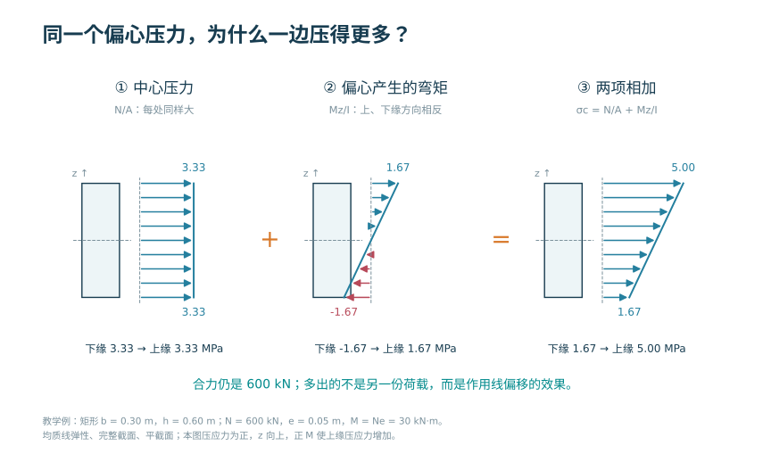
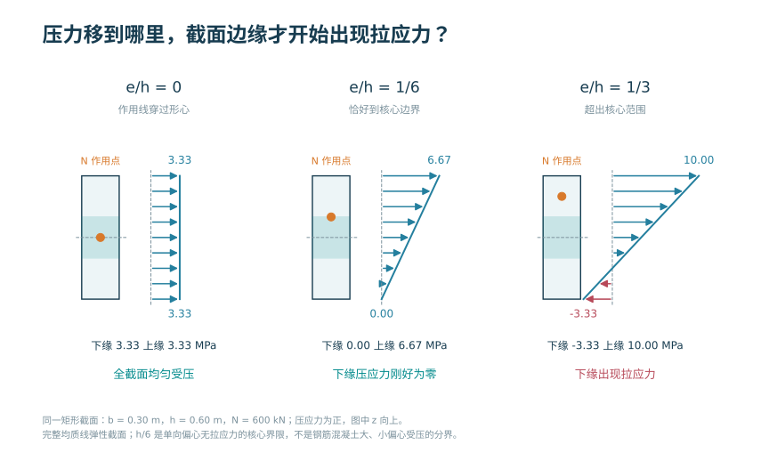
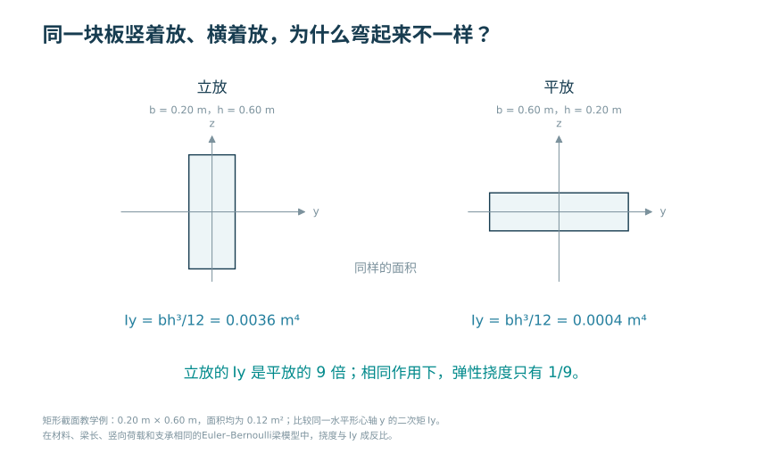
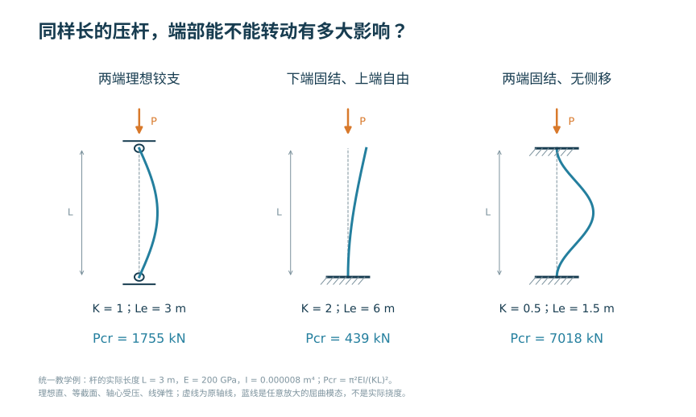
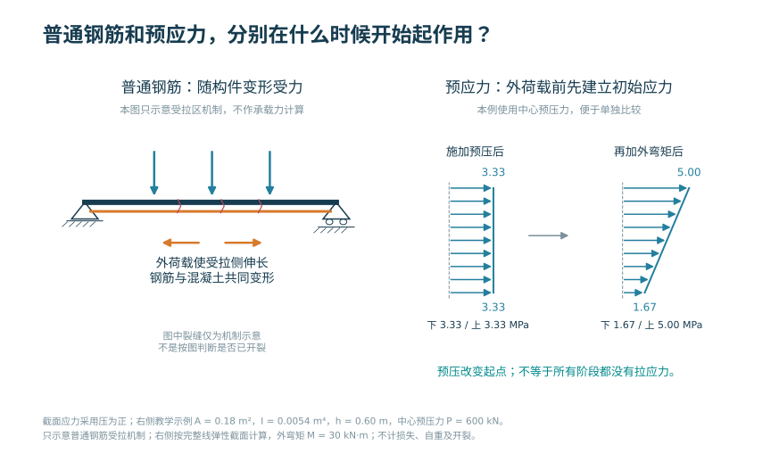
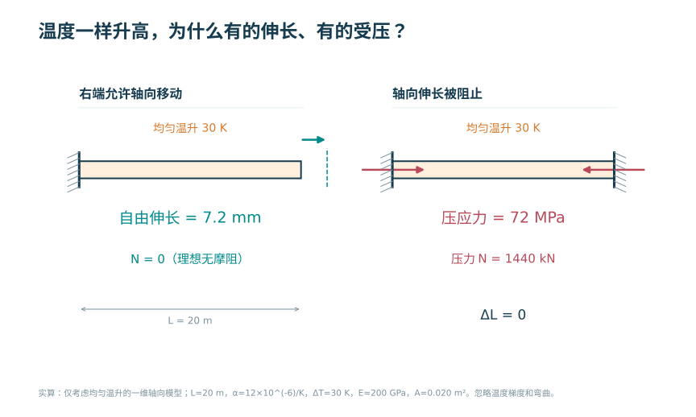
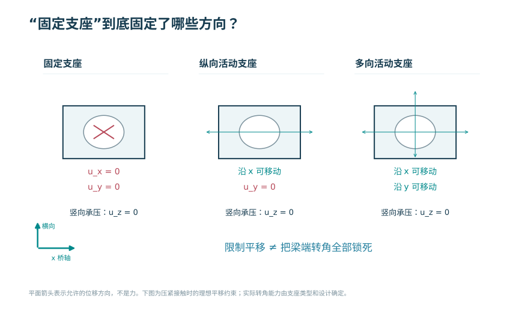
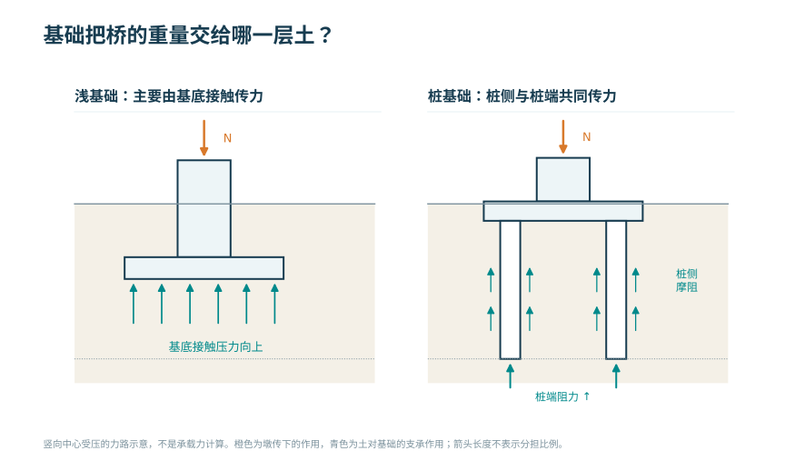
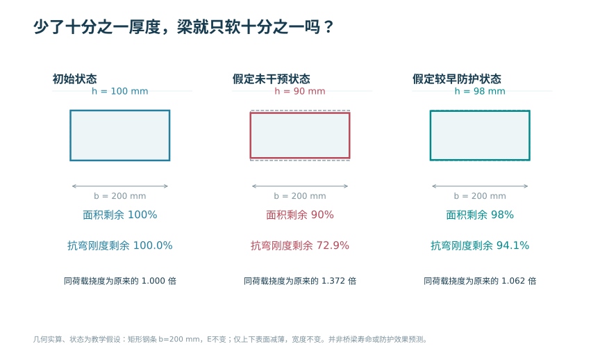
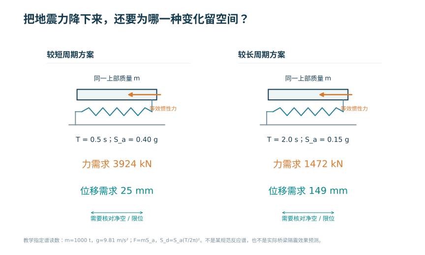

# 看图、听一段，再动手 {.unnumbered}

桥梁思维 · 新一批图与实验

一辆车停在桥上，五根梁一定平均分吗？先听两个人争论，再亲手改变条件，看看自己的判断能不能站住。

<a class="batch-primary" href="#dialogues">先听一段对话</a><a href="interactive/course-package.html">选一个实验动手</a><a href="#forty-figures">翻看 40 幅新图</a><a href="#notebooks">边读边算</a>

**选样已同步：**[查看作者选定的 8 张图](interactive/imagegen-review.html)，其余 16 张收进可恢复的备选。5 张已插入正文试排，3 张保留画法并等待构造修正；原有 40 幅参数图继续保留。[看 Blender 模型的六幅构造图与两幅钢筋图](blender-model-review.html)，也可以直接[旋转整桥](interactive/bridge-assembly/viewer.html)，或[单独看梁里的钢筋与名称](chapters/ch03.html#t-girder-rebar)。

## 先听一段对话 {#dialogues}

小周从生活里的经验出发，阿宁和他一起拆开看。有时直觉有道理，有时还少了一个条件。看完之后，换一个条件再试。

### 车放正中间，五根梁就一定平均分？ {#d01}

<video class="dialogue-player" controls preload="metadata" playsinline poster="assets/videos/dialogue-pilot/D01-poster.jpg" aria-label="车放正中间，五根梁就一定平均分？"><source src="assets/videos/dialogue-pilot/D01-dialogue.mp4" type="video/mp4"><track kind="captions" src="assets/videos/dialogue-pilot/D01-dialogue.vtt" srclang="zh" label="中文"><a href="assets/videos/dialogue-pilot/D01-dialogue.mp4">下载视频</a></video>

2:51 · 双人合成声音 · <a href="interactive/lessons/C04U06.html">同主题实验（模型条件另列）→</a> · <a href="assets/videos/dialogue-pilot/D01-dialogue.mp4" download>下载视频</a>

读对话 / 看制作代码

<strong>小周：</strong>车停中间还不平均分？那对称性不是白学了？我搬桌子，东西放正中间，两边不就一样使劲？

<strong>阿宁：</strong>左右一样，这一步你没说错。可要是桌子中间那条腿，特别软呢？

<strong>小周：</strong>那它可能使不上劲。等等，左右一样，不等于五根都一样？行，换软。先别讲，让我看。

<strong>阿宁：</strong>看，中间这一根，原来分到五分之一，现在不到一成。其余四根，各分到大约两成三。

<strong>小周：</strong>我有点不服。软的，不就该陷得更深吗？怎么反而分得少？

<strong>阿宁：</strong>因为上边那道横向连接，把它们连着。我们先把它当成很难弯的横杆，不能让每根各沉各的。下沉同样一段，软的那根需要的力更小。这种抗变形的本领，叫刚度。

<strong>小周：</strong>好，五根先换回一样硬。我把车挪到右边，近处多出力，远处就摸鱼了？

<strong>阿宁：</strong>先看比例。最右边，从两成变成四成。最左边，这次车辆带来的分担降到零。车还是那辆车，总重没变；多出来的，要从别处减。

<strong>小周：</strong>这我熟！往一边偏，原来的平均那份还在，再加上一边多、一边少。跟偏心压一个截面，是不是一个思路？

<strong>阿宁：</strong>这条思路能借。我们把它叫作平均部分和弯曲增减的叠加。不过，一边算的是截面里各处的应力，一边算的是几根梁分到的力；还得分别说明材料、连接和变形条件。

<strong>小周：</strong>我再往外挪。怎么还有一根算出负数了？这账还能倒扣？这个数看着别扭，干脆改成零吧。

<strong>阿宁：</strong>先别删。这是这次车压上去带来的变化，还没把桥本身的重量算进去。看到负增量，不等于真实支座已经离开。

<strong>小周：</strong>那我非要试试，只把负的删掉，别的都不动。

<strong>阿宁：</strong>你看，加起来反而比车重还大。原来是一百二十千牛，改完变成一百三十二千牛，连力矩也对不上了。改结果，不能替代改模型。

<strong>小周：</strong>懂了。不是看着对称就随便平均，也不是看着不顺眼就删数。先问它们怎么连、软硬一样不一样，再看加起来对不对。

<strong>阿宁：</strong>对。加起来对，叫平衡；连着的地方怎样一起动，叫变形协调；同样变形要多大的力，要看刚度。换成桌子、搁板或偏心受压，先借这几个问题，别急着照搬答案。

<a href="scripts/dialogue-pilot/dialogue_manim.py">Manim 主场景</a> · <a href="scripts/dialogue-pilot/diagram_a.py">横向分布、尺度与加载图</a> · <a href="scripts/dialogue-pilot/diagram_b.py">预应力与有限元图</a> · <a href="scripts/dialogue-pilot/manim_helpers.py">公共绘图函数</a> · <a href="assets/videos/dialogue-pilot/D01-script.md">完整脚本</a>

### 把搁板放大一倍，为什么不是重一倍？ {#d02}

<video class="dialogue-player" controls preload="metadata" playsinline poster="assets/videos/dialogue-pilot/D02-poster.jpg" aria-label="把搁板放大一倍，为什么不是重一倍？"><source src="assets/videos/dialogue-pilot/D02-dialogue.mp4" type="video/mp4"><track kind="captions" src="assets/videos/dialogue-pilot/D02-dialogue.vtt" srclang="zh" label="中文"><a href="assets/videos/dialogue-pilot/D02-dialogue.mp4">下载视频</a></video>

1:33 · 双人合成声音 · <a href="interactive/lessons/C01U06.html">同主题实验（模型条件另列）→</a> · <a href="assets/videos/dialogue-pilot/D02-dialogue.mp4" download>下载视频</a>

读对话 / 看制作代码

<strong>小周：</strong>一块搁板不够大，我照着原样放大一倍。料多用一倍，总该够了吧？

<strong>阿宁：</strong>你说的放大，是只加长，还是长、宽、厚全都变成两倍？先拿两个盒子比一下。

<strong>小周：</strong>全都两倍嘛，模样还一样。等等，这里面，能塞进去八个小盒子？

<strong>阿宁：</strong>对。同样材料，体积变成八倍，自重也变成八倍。这只是重量，还不是它弯得怎样。

<strong>小周：</strong>那它也变厚、变宽了，扛弯的本事肯定跟着涨。是不是正好抵消？

<strong>阿宁：</strong>在这根只受自重的简支梁里，并没有抵消。按相同比例放大后，弯曲应力变成两倍，下沉量变成四倍。前提是材料相同，而且仍能用线弹性小变形来算。

<strong>小周：</strong>我家的搁板一般不变厚，只是两个支架离远了。那还能套刚才的四倍吗？

<strong>阿宁：</strong>不能。若截面和每米荷载不变，只把跨度加倍，下沉量会变成十六倍。你换了放大的方式，比较的就已经是另一个问题。

<strong>小周：</strong>那问大桥有没有尺度问题，得先问到底什么变大、什么没变，不能只盯着长度。

<strong>阿宁：</strong>是。先说清缩放条件，再看长度、面积、体积和响应各按什么比例变化。这种比较方法，叫尺度分析。

<a href="scripts/dialogue-pilot/dialogue_manim.py">Manim 主场景</a> · <a href="scripts/dialogue-pilot/diagram_a.py">横向分布、尺度与加载图</a> · <a href="scripts/dialogue-pilot/diagram_b.py">预应力与有限元图</a> · <a href="scripts/dialogue-pilot/manim_helpers.py">公共绘图函数</a> · <a href="assets/videos/dialogue-pilot/D02-script.md">完整脚本</a>

### 本来怕被拉开，为什么还要先拉钢索？ {#d03}

<video class="dialogue-player" controls preload="metadata" playsinline poster="assets/videos/dialogue-pilot/D03-poster.jpg" aria-label="本来怕被拉开，为什么还要先拉钢索？"><source src="assets/videos/dialogue-pilot/D03-dialogue.mp4" type="video/mp4"><track kind="captions" src="assets/videos/dialogue-pilot/D03-dialogue.vtt" srclang="zh" label="中文"><a href="assets/videos/dialogue-pilot/D03-dialogue.mp4">下载视频</a></video>

1:29 · 双人合成声音 · <a href="interactive/lessons/C04U07.html">同主题实验（模型条件另列）→</a> · <a href="assets/videos/dialogue-pilot/D03-dialogue.mp4" download>下载视频</a>

读对话 / 看制作代码

<strong>小周：</strong>混凝土怕拉开，我听明白了。可你又说，先使劲拉里面的钢索。这不是跟自己对着干吗？

<strong>阿宁：</strong>先看谁在被拉。钢索拉长后，端头通过锚具把这股力传给梁，梁被往里压。钢索受拉，和混凝土受压，可以同时发生。

<strong>小周：</strong>像把一排书两头夹紧，再托起来？钢索在使劲，书反而挤在一起？

<strong>阿宁：</strong>可以借这个感觉，但真实梁还会弯。车压上来，下边有被拉开的趋势；提前形成的压力，可以抵消其中一部分。这种提前建立的受力状态，叫预应力。

<strong>小周：</strong>那我把钢索拉得越紧，不就越保险？最好哪儿都不出现拉力。

<strong>阿宁：</strong>先别只看车上桥以后。车还没来，梁也已经受到了这股力。索放得偏、拉得太大，另一边也可能先出现拉应力。

<strong>小周：</strong>哦，使用时看着挺好，不代表施工时就没问题。那我得把两个时候都看一遍。

<strong>阿宁：</strong>对。本例只对比两个明示的线弹性工况。设计还要看损失、裂缝、承载力和构造。普通钢筋主要在开裂后的受拉区承担拉力；预应力还主动改变了加载前的状态，不能当成只是多放几根钢筋。

<a href="scripts/dialogue-pilot/dialogue_manim.py">Manim 主场景</a> · <a href="scripts/dialogue-pilot/diagram_a.py">横向分布、尺度与加载图</a> · <a href="scripts/dialogue-pilot/diagram_b.py">预应力与有限元图</a> · <a href="scripts/dialogue-pilot/manim_helpers.py">公共绘图函数</a> · <a href="assets/videos/dialogue-pilot/D03-script.md">完整脚本</a>

### 车越多，桥的每一处都更不利吗？ {#d04}

<video class="dialogue-player" controls preload="metadata" playsinline poster="assets/videos/dialogue-pilot/D04-poster.jpg" aria-label="车越多，桥的每一处都更不利吗？"><source src="assets/videos/dialogue-pilot/D04-dialogue.mp4" type="video/mp4"><track kind="captions" src="assets/videos/dialogue-pilot/D04-dialogue.vtt" srclang="zh" label="中文"><a href="assets/videos/dialogue-pilot/D04-dialogue.mp4">下载视频</a></video>

1:26 · 双人合成声音 · <a href="interactive/lessons/C03U09.html">同主题实验（模型条件另列）→</a> · <a href="assets/videos/dialogue-pilot/D04-dialogue.mp4" download>下载视频</a>

读对话 / 看制作代码

<strong>小周：</strong>车越多，桥越累。要找最危险的时候，那就把能放车的地方全放满，还用算？

<strong>阿宁：</strong>先指一个要看的地方。我们只看这根简支梁，距离左端四米的截面剪力，并约定图上的正方向。你把一个力从左边慢慢移过去。

<strong>小周：</strong>刚过那条线，数就跳到另一边了？同一个东西往下压，怎么这边的影响还会换号？

<strong>阿宁：</strong>因为我们盯着一个截面，并把梁在这里分开来画受力图。荷载在截面左边还是右边，进入哪一块的平衡式不同。把每个车位的影响连起来，就得到这张影响线。

<strong>小周：</strong>所以如果我只想让这个正方向的剪力尽量大，把左边也塞满车，反而可能抵消一些？

<strong>阿宁：</strong>对，在这里的独立可布均布荷载模型中，正号区加载，能把这个响应推大；负号区加载，会往另一个方向推。找最小值就反过来。

<strong>小周：</strong>可真车的轮子连在一起，总不能想把哪个轮子放哪儿，就放哪儿吧？

<strong>阿宁：</strong>这句很关键。影响线告诉你各处怎样影响指定响应；真实车辆还得整体移动，遵守轴距、车道和相应加载规则。找最不利，要先说清看什么，再说允许怎样摆。

<a href="scripts/dialogue-pilot/dialogue_manim.py">Manim 主场景</a> · <a href="scripts/dialogue-pilot/diagram_a.py">横向分布、尺度与加载图</a> · <a href="scripts/dialogue-pilot/diagram_b.py">预应力与有限元图</a> · <a href="scripts/dialogue-pilot/manim_helpers.py">公共绘图函数</a> · <a href="assets/videos/dialogue-pilot/D04-script.md">完整脚本</a>

### 网格都这么细了，怎么还可能算错？ {#d05}

<video class="dialogue-player" controls preload="metadata" playsinline poster="assets/videos/dialogue-pilot/D05-poster.jpg" aria-label="网格都这么细了，怎么还可能算错？"><source src="assets/videos/dialogue-pilot/D05-dialogue.mp4" type="video/mp4"><track kind="captions" src="assets/videos/dialogue-pilot/D05-dialogue.vtt" srclang="zh" label="中文"><a href="assets/videos/dialogue-pilot/D05-dialogue.mp4">下载视频</a></video>

1:20 · 双人合成声音 · <a href="interactive/lessons/C11U07.html">同主题实验（模型条件另列）→</a> · <a href="assets/videos/dialogue-pilot/D05-dialogue.mp4" download>下载视频</a>

读对话 / 看制作代码

<strong>小周：</strong>以前你嫌模型太粗。现在我把网格切得密密麻麻，结果都不怎么变了，这回总该信电脑了吧？

<strong>阿宁：</strong>我们给它同一根梁、同一份荷载。左边允许梁端转动，右边把两头的转角也锁住。先猜，哪根更容易下沉？

<strong>小周：</strong>当然是左边。像搁板搭在支架上，和两头死死夹住，能一样吗？

<strong>阿宁：</strong>看，左边算到大约十一点二七毫米，右边只有二点一三毫米。网格越来越细，两边的结果都稳定下来了。

<strong>小周：</strong>那右边是很稳定地，算了一个我根本没要它算的东西？精细地答错了题？

<strong>阿宁：</strong>正是。网格收敛只说明这个模型的数值近似趋于稳定，不能替你证明支承、荷载和材料选对了。

<strong>小周：</strong>那让人工智能写脚本，也一样。代码能跑、图也漂亮，只能说明它跑完了。还得问，它有没有把我的意思理解错。

<strong>阿宁：</strong>所以先用能手算的小例子核对，再检查力和位移的条件，然后逐步加复杂性。计算越方便，越要讲清楚模型究竟代表什么。

<a href="scripts/dialogue-pilot/dialogue_manim.py">Manim 主场景</a> · <a href="scripts/dialogue-pilot/diagram_a.py">横向分布、尺度与加载图</a> · <a href="scripts/dialogue-pilot/diagram_b.py">预应力与有限元图</a> · <a href="scripts/dialogue-pilot/manim_helpers.py">公共绘图函数</a> · <a href="assets/videos/dialogue-pilot/D05-script.md">完整脚本</a>

## 选一个问题动手

[进入 100 个交互实验](interactive/course-package.html){.btn .btn-primary}

先猜一个结果，改变参数，再比较眼前的变化。实验保留自由探索，做错后可以调整重试。每页都能查看模型条件和计算代码。

资源数量怎么算？

本轮交付 100 个可独立打开的交互 HTML 页面，按教学问题区分。它们复用已有力学引擎，不能计作 100 套独立求解器。课程包保留 110 个编号单元的映射，其中另 10 个列为候选；原来的单人讲解视频保留，这次新增的是上面 5 个双人样片。

## 翻看 40 幅新图 {#forty-figures}

点图片看大图，点“回到正文”接着读。箭头表示作用或传递方向；曲线和数值图注明模型条件。下面的图均由参数与绘图程序生成，保留可继续编辑的 SVG 和 Python 源码。

第 1 章 · 3 幅

<article><h4>F01 · 车的重量，最后传到了哪里？</h4>
由车辆、桥面板、主梁、支座、墩台、基础到地基的竖向传力路径。基础处向上箭头表示地基对基础的反力。

<a href="chapters/ch01.html#fig-priority-F01">回到正文</a> · <a href="assets/publication/priority-40/F01.png" download>PNG</a> · <a href="assets/publication/priority-40/F01.svg" download>SVG</a>
</article><article><h4>F02 · 同样向下的重量，为什么需要不同的支承？</h4>
同一竖向均布荷载下，理想梁以弯曲平衡，抛物线拱需要向内水平反力，抛物线索需要向外水平反力。相同的反力量级不代表结构性能相同。

<a href="chapters/ch01.html#fig-priority-F02">回到正文</a> · <a href="assets/publication/priority-40/F02.png" download>PNG</a> · <a href="assets/publication/priority-40/F02.svg" download>SVG</a>
</article><article><h4>F03 · 把一座桥原样放大两倍，还能照搬原来的判断吗？</h4>
几何相似、材料和重度相同的梁，将尺度乘2后面积、自重和二次矩分别乘4、8和16，而自重弯曲应力乘2。

<a href="chapters/ch01.html#fig-priority-F03">回到正文</a> · <a href="assets/publication/priority-40/F03.png" download>PNG</a> · <a href="assets/publication/priority-40/F03.svg" download>SVG</a>
</article>

第 2 章 · 5 幅

<article><h4>F04 · 同一个偏心压力，为什么一边压得更多？</h4>
把同一偏心压力分为中心压力和等效弯矩。三幅应力箭头使用同一比例；正值为压应力，负值为拉应力。

<a href="chapters/ch02-foundations.html#fig-priority-F04">回到正文</a> · <a href="assets/publication/priority-40/F04.png" download>PNG</a> · <a href="assets/publication/priority-40/F04.svg" download>SVG</a>
</article><article><h4>F05 · 压力移到哪里，截面边缘才开始出现拉应力？</h4>
移动同一个压力作用点，比较矩形截面的均匀、三角形和带拉区的线性应力图。绿色带仅标示本方向的中间三分之一核心范围。

<a href="chapters/ch02-foundations.html#fig-priority-F05">回到正文</a> · <a href="assets/publication/priority-40/F05.png" download>PNG</a> · <a href="assets/publication/priority-40/F05.svg" download>SVG</a>
</article><article><h4>F06 · 同一块板竖着放、横着放，为什么弯起来不一样？</h4>
明确指出弯曲轴后比较矩形转向前后的二次矩。面积相同不表示抗弯刚度相同。

<a href="chapters/ch02-foundations.html#fig-priority-F06">回到正文</a> · <a href="assets/publication/priority-40/F06.png" download>PNG</a> · <a href="assets/publication/priority-40/F06.svg" download>SVG</a>
</article><article><h4>F07 · 同样长的压杆，端部能不能转动有多大影响？</h4>
实际长度相同，理想端部约束不同，计算长度和理想临界力不同。图中L始终是实际长度，Le=KL是计算长度。

<a href="chapters/ch02-foundations.html#fig-priority-F07">回到正文</a> · <a href="assets/publication/priority-40/F07.png" download>PNG</a> · <a href="assets/publication/priority-40/F07.svg" download>SVG</a>
</article><article><h4>F08 · 普通钢筋和预应力，分别在什么时候开始起作用？</h4>
左侧普通钢筋随构件变形承担拉力，为机制示意；右侧中心预压力先形成均匀压应力，再叠加外弯矩，是明确参数的截面计算。

<a href="chapters/ch02-foundations.html#fig-priority-F08">回到正文</a> · <a href="assets/publication/priority-40/F08.png" download>PNG</a> · <a href="assets/publication/priority-40/F08.svg" download>SVG</a>
</article>

第 3 章 · 4 幅

<article><h4>F09 · 同一辆车换个位置，跨中弯矩会怎样变？</h4>
移动力相同，跨中弯矩随影响线纵标变化。6 m、15 m、24 m三个位置分别得到300、750、300 kN·m。

<a href="chapters/ch02.html#fig-priority-F09">回到正文</a> · <a href="assets/publication/priority-40/F09.png" download>PNG</a> · <a href="assets/publication/priority-40/F09.svg" download>SVG</a>
</article><article><h4>F10 · 想让同一截面的剪力最大，荷载该放在哪一边？</h4>
固定截面剪力影响线在C处有单位跃变。覆盖右侧正区得到+54 kN，覆盖左侧负区得到−24 kN。改变目标符号，需要改变加载区段。

<a href="chapters/ch02.html#fig-priority-F10">回到正文</a> · <a href="assets/publication/priority-40/F10.png" download>PNG</a> · <a href="assets/publication/priority-40/F10.svg" download>SVG</a>
</article><article><h4>F11 · 两根车轴一起上桥，怎样把各自的作用加起来？</h4>
两轴保持实际间距，在同一目标截面的影响线上分别读取纵标，再以轴重乘纵标后相加。120 kN轴贡献660，180 kN轴贡献1350 kN·m。

<a href="chapters/ch02.html#fig-priority-F11">回到正文</a> · <a href="assets/publication/priority-40/F11.png" download>PNG</a> · <a href="assets/publication/priority-40/F11.svg" download>SVG</a>
</article><article><h4>F12 · 平均抗力比平均作用大，为什么还不能只看两个平均数？</h4>
联合正态教学模型以g=R−S转化为一维余量分布；红色尾部为g&lt;0的概率。联合图的阴影只是失效域，不是按几何面积计算概率。

<a href="chapters/ch02.html#fig-priority-F12">回到正文</a> · <a href="assets/publication/priority-40/F12.png" download>PNG</a> · <a href="assets/publication/priority-40/F12.svg" download>SVG</a>
</article>

第 4 章 · 7 幅

<article><h4>F13 · 车轮下面，桥面板靠哪些构件支承？</h4>
轴测整桥以5根纵向主梁、3道跨内横隔板和两端横梁定位桥面板的空间支承。透明桥面仅为揭示内部构造；车辆轮载向下。

<a href="chapters/ch03.html#fig-priority-F13">回到正文</a> · <a href="assets/publication/priority-40/F13.png" download>PNG</a> · <a href="assets/publication/priority-40/F13.svg" download>SVG</a>
</article><article><h4>F14 · 一块板能向两边传力，取成梁以后保留了什么？</h4>
俯视四边简支板与侧视两端简支板带分别展示保留的运动和支承。两图不宣称自动等价，也没有用未经计算的彩色云图表示应力。

<a href="chapters/ch03.html#fig-priority-F14">回到正文</a> · <a href="assets/publication/priority-40/F14.png" download>PNG</a> · <a href="assets/publication/priority-40/F14.svg" download>SVG</a>
</article><article><h4>F15 · 只用力的平衡，什么时候能算出每个支点分担？</h4>
两支点静定板段用相反力臂计算反力；若保留三支承连续横梁，则需额外的变形协调。图中特别区分简化后的图式和未释放的连续图式。

<a href="chapters/ch03.html#fig-priority-F15">回到正文</a> · <a href="assets/publication/priority-40/F15.png" download>PNG</a> · <a href="assets/publication/priority-40/F15.svg" download>SVG</a>
</article><article><h4>F16 · 车偏到一侧，总重量怎样分到五根梁？</h4>
平均分担24 kN/梁与偏心分量−24、−12、0、12、24 kN相加，得到0、12、24、36、48 kN。合力和合矩均与外作用一致。

<a href="chapters/ch03.html#fig-priority-F16">回到正文</a> · <a href="assets/publication/priority-40/F16.png" download>PNG</a> · <a href="assets/publication/priority-40/F16.svg" download>SVG</a>
</article><article><h4>F17 · 某根梁的活载增量为负，就已经离开支承了吗？</h4>
已有恒载、新增活载与总反力分别列示。梁1的活载增量为−12 kN，但总反力为+48 kN，不能把负增量直接解释为已脱空。

<a href="chapters/ch03.html#fig-priority-F17">回到正文</a> · <a href="assets/publication/priority-40/F17.png" download>PNG</a> · <a href="assets/publication/priority-40/F17.svg" download>SVG</a>
</article><article><h4>F18 · 把两跨接成一根梁，弯矩和下沉会怎样改变？</h4>
统一荷载和刚度下，连续性改变弯矩和变形：中支点产生负弯矩，跨内最大正弯矩减小。实际解析挠度曲线使用相同放大比例。

<a href="chapters/ch03.html#fig-priority-F18">回到正文</a> · <a href="assets/publication/priority-40/F18.png" download>PNG</a> · <a href="assets/publication/priority-40/F18.svg" download>SVG</a>
</article><article><h4>F19 · 桥还没碰到下一个支点，悬空越长会怎样？</h4>
悬出长度3、6、9 m时，根部负弯矩分别为−45、−180、−405 kN·m。图中同时列出全梁最大绝对弯矩，避免将短悬臂阶段根部错误当作全梁控制点。

<a href="chapters/ch03.html#fig-priority-F19">回到正文</a> · <a href="assets/publication/priority-40/F19.png" download>PNG</a> · <a href="assets/publication/priority-40/F19.svg" download>SVG</a>
</article>

第 5 章 · 4 幅

<article><h4>F20 · 把拱压低，拱脚要多推多少？</h4>
相同跨度和竖向均布荷载下，三铰抛物线拱矢高由20 m增至30 m，水平推力由16.2 MN降至10.8 MN；竖向反力不变。

<a href="chapters/ch04.html#fig-priority-F20">回到正文</a> · <a href="assets/publication/priority-40/F20.png" download>PNG</a> · <a href="assets/publication/priority-40/F20.svg" download>SVG</a>
</article><article><h4>F21 · 压力线离开拱轴，弯矩从哪里来？</h4>
同一左半跨均布荷载下，压力线作图与拱轴出现偏离。在左四分点，竖向差6 m对应M=HΔy=40.5 MN·m；沿截面法向计算的压力中心偏心为M/N，二者不可混用。

<a href="chapters/ch04.html#fig-priority-F21">回到正文</a> · <a href="assets/publication/priority-40/F21.png" download>PNG</a> · <a href="assets/publication/priority-40/F21.svg" download>SVG</a>
</article><article><h4>F22 · 荷载只放一半，拱就一定更轻松吗？</h4>
抛物线拱在满跨均布荷载下弯矩为零；仅在左半跨加载会形成一正一负的弯矩。总竖向荷载减小并不意味着每个截面弯矩减小。

<a href="chapters/ch04.html#fig-priority-F22">回到正文</a> · <a href="assets/publication/priority-40/F22.png" download>PNG</a> · <a href="assets/publication/priority-40/F22.svg" download>SVG</a>
</article><article><h4>F23 · 桥墩“动了十毫米”，到底是哪一种动？</h4>
相同“10 mm”可以是共同沉降、差异沉降或相对水平张开。必须先定义运动对象、方向与边界，再计算三铰、两铰或无铰拱的附加响应。

<a href="chapters/ch04.html#fig-priority-F23">回到正文</a> · <a href="assets/publication/priority-40/F23.png" download>PNG</a> · <a href="assets/publication/priority-40/F23.svg" download>SVG</a>
</article>

第 6 章 · 3 幅

<article><h4>F24 · 车的重量，怎样经过拉索到达桥塔？</h4>
双索面斜拉体系的参数化轴测示意及单根索在梁端的分力。斜拉索向塔传力，也给主梁引入轴向作用；塔的竖向和不平衡水平作用最终需由基础承担。

<a href="chapters/ch05.html#fig-priority-F24">回到正文</a> · <a href="assets/publication/priority-40/F24.png" download>PNG</a> · <a href="assets/publication/priority-40/F24.svg" download>SVG</a>
</article><article><h4>F25 · 只调一组索，怎样得到矩阵的一列？</h4>
固定模型状态和输出定义，仅将第二索组增大1 MN时，三项响应增量就是影响矩阵第二列；矩阵沿用正文明确声明的教学测试数据，构件定位图不冒充矩阵来源模型。

<a href="chapters/ch05.html#fig-priority-F25">回到正文</a> · <a href="assets/publication/priority-40/F25.png" download>PNG</a> · <a href="assets/publication/priority-40/F25.svg" download>SVG</a>
</article><article><h4>F26 · 合龙以后，桥还是刚才那个受力体系吗？</h4>
合龙前两侧悬臂分别承担施工荷载；合龙后新增连接使体系连续。不能只把成桥模型一次加载，就认为已重现施工状态。

<a href="chapters/ch05.html#fig-priority-F26">回到正文</a> · <a href="assets/publication/priority-40/F26.png" download>PNG</a> · <a href="assets/publication/priority-40/F26.svg" download>SVG</a>
</article>

第 7 章 · 3 幅

<article><h4>F27 · 悬索桥的重量，最后交给了谁？</h4>
地锚式悬索桥中，桥面经加劲梁、吊索和主缆传力，索塔与锚碇共同承担主缆传来的作用。自锚式的主缆水平分力路径不同，不能套用本图。

<a href="chapters/ch06.html#fig-priority-F27">回到正文</a> · <a href="assets/publication/priority-40/F27.png" download>PNG</a> · <a href="assets/publication/priority-40/F27.svg" download>SVG</a>
</article><article><h4>F28 · 缆索垂得更深，锚碇要拉住的力会变多少？</h4>
在水平投影均布荷载的理想索模型中，垂度由40 m增至80 m，水平分力H从50 MN减至25 MN，竖向分力仍各20 MN。H是水平分量，不是支点索力总值。

<a href="chapters/ch06.html#fig-priority-F28">回到正文</a> · <a href="assets/publication/priority-40/F28.png" download>PNG</a> · <a href="assets/publication/priority-40/F28.svg" download>SVG</a>
</article><article><h4>F29 · 一根绳拉紧以后，为什么更难横向拨动？</h4>
同长、同一小横向荷载下，提高初张力会提高拉直绳的横向切线刚度，线性扰动位移近似反比于初张力。图示变形放大20倍，斜拉方向只作示意。

<a href="chapters/ch06.html#fig-priority-F29">回到正文</a> · <a href="assets/publication/priority-40/F29.png" download>PNG</a> · <a href="assets/publication/priority-40/F29.svg" download>SVG</a>
</article>

第 8 章 · 3 幅

<article><h4>F30 · 温度一样升高，为什么有的伸长、有的受压？</h4>
同样均匀温升下，自由伸缩产生7.2 mm轴向伸长；完全限制该伸长则在本一维弹性模型中产生72 MPa压应力、1440 kN压力。支座约束改变的是允许发生的运动。

<a href="chapters/ch07.html#fig-priority-F30">回到正文</a> · <a href="assets/publication/priority-40/F30.png" download>PNG</a> · <a href="assets/publication/priority-40/F30.svg" download>SVG</a>
</article><article><h4>F31 · “固定支座”到底固定了哪些方向？</h4>
理想固定、纵向活动和多向活动支座的平移约束对照。青色双箭头代表可移动方向，红色标记代表被约束的平移；固定支座不等于梁固端。

<a href="chapters/ch07.html#fig-priority-F31">回到正文</a> · <a href="assets/publication/priority-40/F31.png" download>PNG</a> · <a href="assets/publication/priority-40/F31.svg" download>SVG</a>
</article><article><h4>F32 · 基础把桥的重量交给哪一层土？</h4>
浅基础与桩基础的竖向荷载路径对照。桩基础通过桩侧摩阻及桩端阻力传力；箭头只示方向，实际分担与群桩效应取决于土层、桩、承台和荷载状态。

<a href="chapters/ch07.html#fig-priority-F32">回到正文</a> · <a href="assets/publication/priority-40/F32.png" download>PNG</a> · <a href="assets/publication/priority-40/F32.svg" download>SVG</a>
</article>

第 9 章 · 3 幅

<article><h4>F33 · 风速翻倍，推桥面的力也只翻倍吗？</h4>
固定气密度、阻力系数和面积时，风速10、20、40 m/s对应静力阻力0.735、2.940、11.760 kN；速度翻倍，动压和阻力均变为4倍。蓝色箭头示来流，橙色箭头示阻力。

<a href="chapters/ch09-wind.html#fig-priority-F33">回到正文</a> · <a href="assets/publication/priority-40/F33.png" download>PNG</a> · <a href="assets/publication/priority-40/F33.svg" download>SVG</a>
</article><article><h4>F34 · 同样大小的周期力，为什么能激起更大的振动？</h4>
单自由度简谐稳态响应随频率比与阻尼改变。阻尼比0.02、0.05、0.10在r=1时的位移放大系数分别为25、10、5；该模型不直接描述桥梁颤振。

<a href="chapters/ch09-wind.html#fig-priority-F34">回到正文</a> · <a href="assets/publication/priority-40/F34.png" download>PNG</a> · <a href="assets/publication/priority-40/F34.svg" download>SVG</a>
</article><article><h4>F35 · 桥面两边一起动，和一上一下，是同一种振动吗？</h4>
参数化桥面带的纯竖弯与纯扭转形状对照，以及同一横截面的观察方式。真实桥梁可能有耦合模态；需同一断面同步测量才可用两侧位移分解。

<a href="chapters/ch09-wind.html#fig-priority-F35">回到正文</a> · <a href="assets/publication/priority-40/F35.png" download>PNG</a> · <a href="assets/publication/priority-40/F35.svg" download>SVG</a>
</article>

第 10 章 · 2 幅

<article><h4>F36 · 少了十分之一厚度，梁就只软十分之一吗？</h4>
同宽矩形钢条上下表面减薄的几何比较：高度减少10%，面积减少10%，惯性矩减少27.1%，同边界同荷载下线弹性挠度增加约37.2%。防护列只是指定剩余厚度的比较，不是预报寿命。

<a href="chapters/ch10-lifecycle.html#fig-priority-F36">回到正文</a> · <a href="assets/publication/priority-40/F36.png" download>PNG</a> · <a href="assets/publication/priority-40/F36.svg" download>SVG</a>
</article><article><h4>F37 · 把地震力降下来，还要为哪一种变化留空间？</h4>
在本图明确指定的两组教学谱读数下，较长周期方案的等效力需求降低，但谱位移需求增大；隔震选择必须同时核查梁端位移、限位、管线和防落梁空间。图中的弹簧表示等效水平刚度。

<a href="chapters/ch10-lifecycle.html#fig-priority-F37">回到正文</a> · <a href="assets/publication/priority-40/F37.png" download>PNG</a> · <a href="assets/publication/priority-40/F37.svg" download>SVG</a>
</article>

第 11 章 · 3 幅

<article><h4>F38 · 电脑里的一个节点，对应桥上的什么位置？</h4>
同一20 m简支梁从构件轴线到四个梁单元、五个节点的映射；跨中集中力施加在节点3。节点既有位置也携带自由度，单元连接节点并使用材料与截面刚度。

<a href="chapters/ch10-fem.html#fig-priority-F38">回到正文</a> · <a href="assets/publication/priority-40/F38.png" download>PNG</a> · <a href="assets/publication/priority-40/F38.svg" download>SVG</a>
</article><article><h4>F39 · 网格越来越细，为什么答案仍可能错？</h4>
以真实三次Hermite梁单元计算同一均布荷载：两端固支的错误边界也随网格加密收敛，但收敛值不等于任务要求的简支梁答案。

<a href="chapters/ch10-fem.html#fig-priority-F39">回到正文</a> · <a href="assets/publication/priority-40/F39.png" download>PNG</a> · <a href="assets/publication/priority-40/F39.svg" download>SVG</a>
</article><article><h4>F40 · AI给了一个数，怎样知道它算的是你的问题？</h4>
同一等效梁任务的正确模型、弹性模量单位错误、两端固支边界错误对照。单位错的5882 mm只是超出小变形适用域的线性公式形式值，不能采纳；反力平衡也不能单独识别错误边界。

<a href="chapters/ch10-fem.html#fig-priority-F40">回到正文</a> · <a href="assets/publication/priority-40/F40.png" download>PNG</a> · <a href="assets/publication/priority-40/F40.svg" download>SVG</a>
</article>

## 边读边算 {#notebooks}

每份 Notebook 按“问题 → 图与公式 → 代码 → 结果 → 自己试一试”的顺序组织。网页可直接阅读已执行的结果；下载 `.ipynb` 后可在 Jupyter 中修改参数并重新运行。

| 主题 | 直接阅读 | 下载运行 |
|---|---|---|
| 五根梁怎样分担车辆的重量？ | [图文与已运行结果](notebooks/A-transverse.html) | [Notebook](notebooks/A-transverse.ipynb) · [Python](notebooks/A-transverse.py) |
| “变大一倍”到底改变了什么？ | [图文与已运行结果](notebooks/B-scaling.html) | [Notebook](notebooks/B-scaling.ipynb) · [Python](notebooks/B-scaling.py) |
| 网格更细，为什么还要查支承？ | [图文与已运行结果](notebooks/C-beam-fem.html) | [Notebook](notebooks/C-beam-fem.ipynb) · [Python](notebooks/C-beam-fem.py) |

普通静态网页不会在后台运行 Python；不安装软件时，可以先使用上方对应的 HTML 实验。课程包中的数值模型与 Notebook 分别列出尺寸和假定，比较前先核对是否同一工况。

制作与复核记录

40 幅原创图为本轮重点图试排稿，已插入对应章节并完成制作者逐图检查。5 部影片使用 Manim 的确定性图形和双人神经语音，保留分镜、逐句文稿、字幕和源码。本轮未使用 Seedance；生成式镜头可用于情境开场，力、位移与支承条件继续由计算和程序控制。

<a href="assets/publication/priority-40/manifest.json">40 图清单与逐图条件</a> · <a href="interactive/course-package-data.json">教学单元资源清单</a> · <a href="notebooks/manifest.json">Notebook 执行记录</a> · <a href="assets/videos/dialogue-pilot/manifest.json">5 个视频与复核记录</a> · <a href="publication-images.html">参考图与出版制作说明</a>

