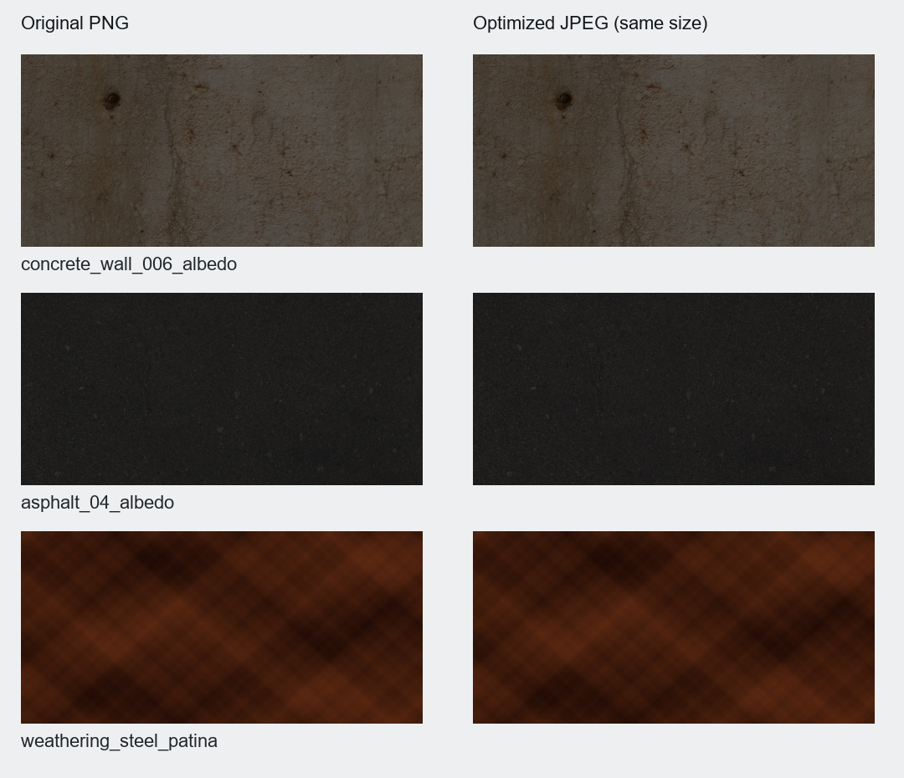

# WebV1 资产减重与保真记录

四个原始 GLB 均只读保留。优化结果将结构主体与可选环境分开，主体未减面、未量化、未修改坐标、UV 或顶点法线；构件 ID、施工字段、材料颜色因子及透明模式保留。

## 实际体积

下表单位为字节；主体减重率包含移出可选背景带来的下载节省。

| 模型 | 原始完整 GLB | 默认主体 | 可选标准背景 | 可选低档背景 | 主体减重率 |
|---|---:|---:|---:|---:|---:|
| girder | 19,744,520 | 7,150,008 | 5,161,488 | 3,548,348 | 63.79% |
| cable_stayed | 24,968,624 | 4,564,460 | 4,013,032 | 2,399,888 | 81.72% |
| suspension | 42,701,812 | 12,888,056 | 4,013,036 | 2,399,892 | 69.82% |
| arch | 25,174,344 | 6,236,256 | 4,153,652 | 2,540,512 | 75.23% |

默认四主体合计 **30,838,780 B**，相对原包 **112,589,300 B** 减少 **72.61%**。网页一次可只加载所选桥梁，背景按需另加载。

## 原图实测与处理

- 原三类新桥的混凝土、沥青、岸坡贴图均为 **1024 × 1024**；水面法线为 **512 × 512**，拱桥耐候钢色图为 **512 × 512**。没有 4K 原图。
- 原梁桥 GLB 本身没有图像，也没有 `90_Set` 或 `90_Environment`。应用户追加要求，现单独补充简洁河谷、水面、两岸路基与双幅接引路；沿用旧梁桥源码的布置关系，并复用本项目已有 CC0 贴图，属于教学布景。四个主体文件完全未变。
- 主体保持原贴图尺寸。只将无 alpha 的 PNG 色图改为高质量 JPEG，其余法线、粗糙度与有 alpha 图像不做该转换。实际色图 JPEG 质量为 94、RGB PSNR 约 40.97–49.98 dB。
- 背景标准档上限为原有 1024，低档上限为 512，均不放大原小图；低档法线图重采样后重新归一化。
- 共享完全相同的二进制数据、访问器和网格资源，保留所有构件节点。环境与主体共用的混凝土/沥青资源在两个文件内分别保存，确保任何一方可独立加载。
- 环境组包含接引路，关闭背景时也会隐藏对应接引路，主体施工构件继续独立显示。

## 保真验证

四个主体与从原场景拆出的三类桥背景均重新读取 GLB，按节点匹配原始数据，比较实际 POSITION、NORMAL、UV 和其余属性的元素字节、三角索引、全部祖先变换、完整 extras（含构件 ID 和 stage/end_stage）以及材料参数。结果全部通过；每个原始 GLB 的 SHA-256 在执行前后相同。

背景标准档和低档的几何与 ID 同样逐项核对，只有经批准的图像重采样/编码变化。JSON 的数组索引会因去重重排，逐节点指向的几何内容保持一致。

新增 T 梁背景有 10 个网格、37,728 个三角面，两档实际几何、UV、法线、ID、阶段及变换相同；它不作为原场景几何保真比较对象。接引路与实际主体在 X=0/90 m、Z≈12.7 m 对齐，桥内地形比最低支座组件低 3.92 m，四主体 SHA-256 与既定优化清单一致。测量与假设见 [asset-girder-environment.md](asset-girder-environment.md) 和 [asset-girder-environment.json](asset-girder-environment.json)。

完整原图的编码、分辨率、字节、JSON/BIN/几何/图像份额与输出统计见 [asset-size-audit.json](asset-size-audit.json) 和 [asset-manifest.json](../assets/asset-manifest.json)。

JPEG 改编码主要降低网络传输量，主体贴图解码后的尺寸不变。未减少的构件实例与三角面仍会消耗渲染时间；手机帧率、内存和单线程网页加载需由 Godot Web 实际测试，本记录不将体积减小等同于帧率保证。

## 复现

依赖 Python 3.10+、Pillow、NumPy。默认读取相邻原始目录，不覆盖原件：

```powershell
python -X utf8 source/asset_optimize.py
python -X utf8 source/asset_optimize.py --verify-only
python -X utf8 source/asset_girder_environment.py
python -X utf8 source/asset_girder_environment.py --verify-only
python -X utf8 source/asset_write_report.py
```

原包在其他位置时，给首条命令和基础验证命令加 `--source 原始models目录`。基础 `--verify-only` 不改 GLB，输出 [asset-verification.json](asset-verification.json)；新梁桥背景的单独审计记录为 [asset-girder-environment.json](asset-girder-environment.json)。必须在基础优化之后运行梁桥环境生成器，才能把新背景路径及体积加入最终清单。原始输入若引入动画、蒙皮或受当前脚本不支持的扩展，会明确停止，避免静默丢失内容。

主体路径为 `assets/models/{id}.glb`。可选背景路径为 `assets/environments/{id}_standard.glb` 和 `{id}_low.glb`；两者与主体使用相同原点，不增加变换。

下图为实际原始/优化色图的相同像素区域对照，仅展示材质编码差异，并非桥梁渲染图：


