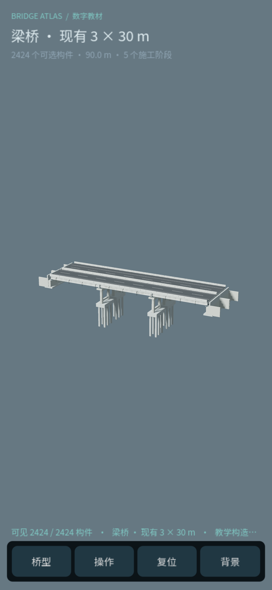
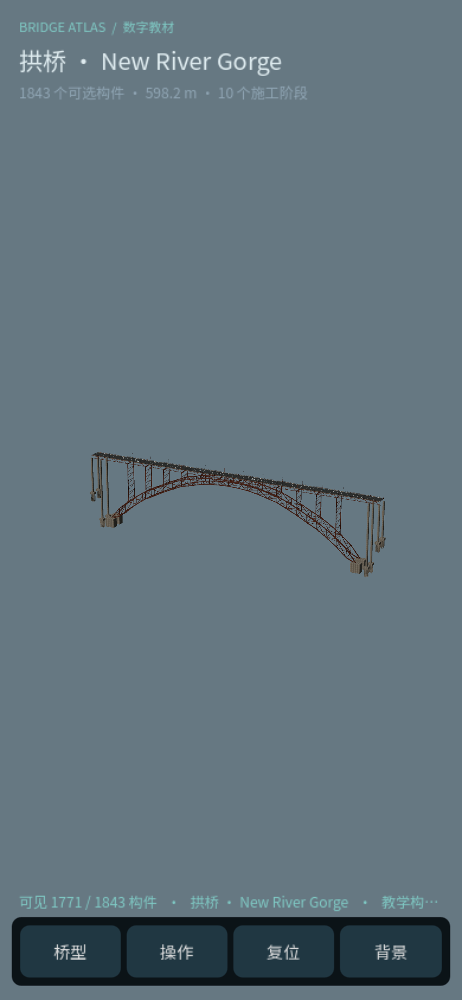

# 手机浏览器验收（2026-09-09）

最终导出已通过 Chrome 设备模拟检查。测试为 DPR 3 的移动浏览器模拟与真实触摸事件分发，尚未在实体 Android/iPhone 上验收，也不以模拟器帧率代表手机性能。

- 最终发布版本：`index.pck` 257,532 bytes；SHA-256 `6d9f403b81bb310895703f4e9d2f74d6d789d8ff2d6b6c8cb68703bf596e944c`。新增 Web 请求的 gzip 兼容修复，已在禁用缓存的实际 Chrome 引擎中验证 13 项压缩响应成功解析，见 [gzip 回归报告](gzip-browser-qa.md)。
- 下述触控和转屏初验版本：`index.pck` 257,580 bytes；SHA-256 `8c0eb34b34e223235a27da9213d6b01181840d2ed550d1edf22c87d978d7e3fd`。修复网络解压处理后，模型、材质和触控实现保持本次验收版本；最终网络回归另有设备像素截图。
- 视口：390 × 844、320 × 740、844 × 390 CSS px；对应画布 1170 × 2532、960 × 2220、2532 × 1170 设备像素。
- 最终刷新后使用正常默认材质和完整模型；临时阴影/裁剪/LOD 诊断接口已撤下。最终控制台错误 0、警告 0。

## 桥型与默认视图

点击卡片逐桥加载，顺序为梁—拱—斜拉—悬索。390 px 竖屏四桥主体均完整入镜。背景默认关闭，模型与环境按需请求。

| 桥型 | 构件总数 | 成桥阶段可见数 | 阶段数 |
|---|---:|---:|---:|
| 3 × 30 m T 梁 | 2424 | 2424 | 5 |
| New River Gorge 拱桥 | 1843 | 1771 | 10 |
| Bago 斜拉桥 | 1782 | 1678 | 15 |
| Forth Road 悬索桥 | 4749 | 4381 | 10 |

后三桥在成桥阶段隐藏已退场的临时施工构件，因此可见数小于模型总数；永久主体保留。弯矩图仍为教学示意，不表示有限元实时求解结果。

## 触摸与转屏

| 验收项 | 实测结果 |
|---|---|
| 单指旋转 | yaw 1.10 → 0.62、pitch 0.34 → 0.436，距离不变 |
| 双指缩放 | 手指间距加倍，相机距离 424.164 → 212.082 |
| 双指平移 | 焦点随双指移动；相机距离与 yaw 不变 |
| 操作抽屉滚动 | 真触摸上滑，scroll 0 → 420；施工阶段、爆炸量、可见构件数、相机角度均不变 |
| 抽屉内横拖 | 爆炸滑条 0 → 0.5；施工滑条第 5 阶段 → 第 3 阶段；抽屉滚动位置稳定 |
| 320 px 桥型选择滚动 | scroll 0 → 72，未误选卡片、未触发模型请求 |
| 横竖屏往返 | 320 × 740 → 844 × 390 → 390 × 844 均保持移动布局、主体完整；2424 个梁桥构件持续可见 |
| 背景开关 | 开启后按需加载 `girder_low.glb`（512 档）；关闭后环境释放，桥梁构件保持 2424 个 |

修复并复验了画布撑大页面导致转屏后缩小的问题，以及触摸抽屉不能滚动的问题。最新导出再次完成转屏与抽屉滚动检查：390 px 收回抽屉后，yaw 1.1、pitch 0.34、爆炸量 0、成桥阶段、背景关闭。

## 图像检查与一次误报排除

DPR 3 页面用 `scale: 'css'` 截图时，桥面出现棋盘状条纹。同一画面、相机和全部 2424 构件改用 `scale: 'device'` 截图后，原始设备像素图中的桥面平整。此现象属于 CSS 尺寸截图采样伪影，不能作为真实引擎渲染故障或模型重叠的证据。

额外将原始 19.74 MB 梁桥 GLB 以本地请求替换喂给同一渲染器，CSS 截图亦复现该条纹，排除了精确资源去重带来的特有退化。测试请求替换已撤下；原 GLB 没有复制到发布目录。最终未为该截图问题删构件、改材质或启用诊断参数。

正式视觉证据保留设备像素截图；其他诊断截图仅留工作副本，不纳入发布：

| 梁桥 390 px 竖屏 | 拱桥 390 px 竖屏 |
|---|---|
|  |  |

工作副本另存斜拉、悬索、梁桥背景开启、320 px 竖屏、844 px 横屏和抽屉滚动的设备像素截图。

## 教材入口

第 1 章在四类体系比较后新增三维入口；章节与轻量封面不预加载 WASM、PCK 或 GLB。封面顺序为梁—拱—斜拉—悬索，单一主按钮进入应用。320/390/1440 px 页面无横向溢出，章节→入口→返回章节锚点通过。公开章节仅合入新小节，原图源占位处理保留；公开搜索索引原 204 条保留，新增 1 条，共 205 条。

源与发布入口已同步提示：“初次进入需下载三维程序，请稍候。支持手机竖屏；底部按钮可展开操作面板。”
